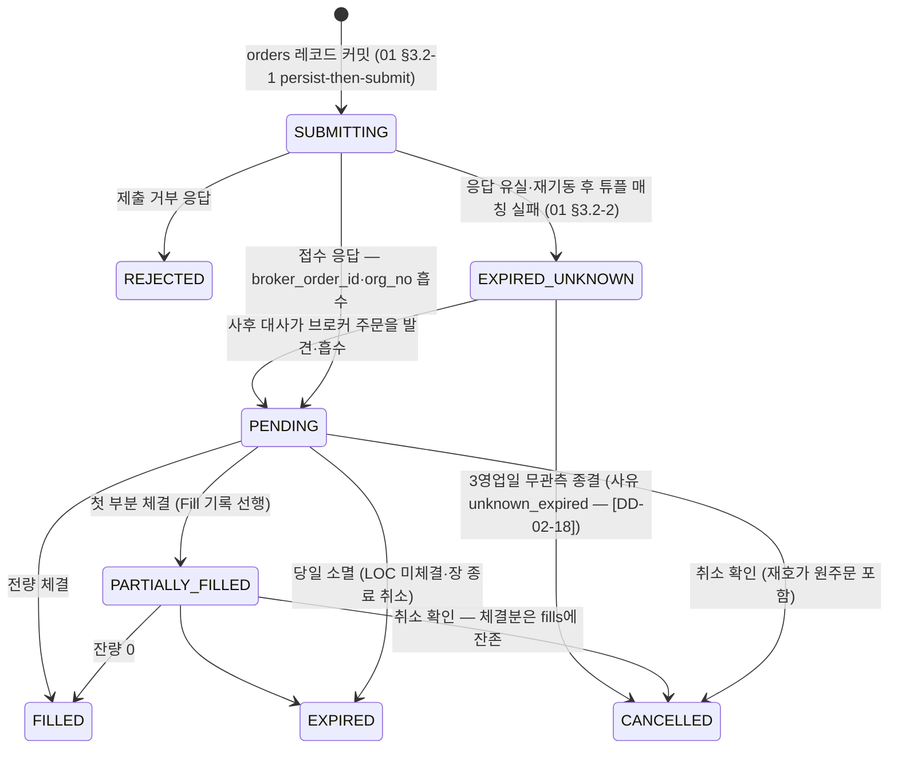

# 02. 도메인 모델 (`core/`)

> **범위**: `src/omra/core/` 패키지 전체 — Instrument·Order·Fill·RebalancePlan·계좌/슬리브 식별자 체계(`account_id`·`instrument_key`·ULID), Decimal/화폐/수량 규약, 틱사이즈 규칙(`krx_etf_5`·`krx7`·`usd_penny`·`upbit`), `lot_step`, Clock 추상화(백테스트/라이브 공유), 예외 계층.
> **계획 정본**: 01 §1.3(핵심 테이블 스키마)·§2(저장소 구조)·§3.1~§3.4(시그니처 초안)·§6.1·§6.3 / 02 §1.2·§3.3·§4.1~§4.7·§5.6·§7 / 03 §1.6·§2.1 / 06 §7.1·§9.1 / 00 §3.2·§5·§7.
> **선행 문서**: 없음(이 문서가 최하층이다). **이 문서가 소유하는 정의**: 도메인 모델(Order·Instrument·Fill·RebalancePlan·Money·Clock·예외) — 브리프 §2.1 소유권 표의 02 행.

## 1. 개요 — 설계 대상과 책임

`core/`는 시스템의 최하층 패키지다. 01 §2 저장소 구조가 그 역할을 "도메인 모델·화폐·틱사이즈·Clock 추상화·예외"로 확정했고, 이 문서는 그것을 코드 수준으로 구체화한다.

**책임 (하는 것)**

1. 전 레이어가 공유하는 **값 타입과 enum** — `Instrument`, `Order`, `Fill`, `RebalancePlan`, `Market`, `OrderType`, `OrderStatus`, 상태 enum(`BotState` 계열의 타입 정의).
2. **식별자 규약** — 내부 ULID, `instrument_key`(exact match 전용 — 정본: 06 §9.1), 내부 `account_id`(실계좌번호 아님 — 정본: 01 §1.3·§6.3), 슬리브 매핑 `sleeve_of`(정본: 02 §4.3.0-e).
3. **화폐·수량 규약** — Decimal 전용(금액 경로 float 금지), TEXT 직렬화 정규형(01 §1.3 "Decimal은 TEXT로 저장"), 반올림 규약(02 §4.7-d "KRW 원 단위 절사·수량 floor").
4. **틱사이즈 규칙 4종**(01 §3.1 `tick_rule`) — 재호가(02 §4.1.1 "1틱씩"), 호가단위 정규화(02 §4.4, 03 §1.6 단계 4 `[core.tick]`), 스프레드 게이트(3틱 — 02 §4.4)의 공용 산술.
5. **Clock 추상화** — 백테스트/라이브가 원장·세금 코드를 공유하기 위한 시각 주입 지점(00 §4 freqtrade 이중 원장 패턴, 02 §8.1 "밴드 판정·정수화·세금 코드를 공유").
6. **예외 계층** — 전 레이어 공통 기저 예외와 분류 규약(retryable 여부, 감사로그 연계, fail-safe 방향).

**비책임 (하지 않는 것)**

- **I/O 없음.** HTTP·DB·파일·시계 외 어떤 부수효과도 없다. SQLAlchemy 모델·리포지토리는 [03-data-and-persistence.md](03-data-and-persistence.md), 브로커 호출은 [05-broker-gateway.md](05-broker-gateway.md) 소유.
- **정책 수치 없음.** 밴드·T_min·버퍼 등 파라미터는 전부 config([04-configuration-and-secrets.md](04-configuration-and-secrets.md))에서 온다(00 §5 원칙 6). core에 하드코딩되는 유일한 수치는 **거래소 호가단위 표**(코드 상수 — §6, [DD-02-8])다.
- **판정·전이 로직 없음.** pre-trade 체인·상태머신 결합·safemode_filter는 각각 [09-safety-protections.md](09-safety-protections.md)·[08-execution.md](08-execution.md) 소유. core는 타입과 합법 전이 표만 제공한다.

**조건부 요소의 흡수 지점** — 계획이 조건부로 둔 두 갈래는 core 타입이 이미 양쪽을 담는다: ① SP-C4(절세계좌 주문 경로) 성공/실패는 `AccountMode` 값 하나의 차이로 흡수된다(02 §1.2 — "어느 쪽으로 나와도 변경 범위는 `AccountMode` 값 하나와 어댑터 1개"). ② M9 `T1` 실시간 계층 도입 여부는 `core.tick` 소비자가 REST 경로(기본)냐 실시간 경로(조건부)냐의 차이일 뿐 core API는 동일하다(02 §4.1.1 — 실시간 정보는 재호가를 "줄이는 데만" 쓴다). 따라서 core에는 조건부 분기가 존재하지 않는다.

## 2. 모듈 구조

```
src/omra/core/
├── __init__.py     # 안정 공개 API 재수출 (하위 모듈 직접 import도 허용)
├── ids.py          # ULID 발급, Market(venue) enum, instrument_key 규약, account_id 규약
├── models.py       # Instrument · OrderSide/Type/Status/Intent · Order · Fill
│                   #   · PlanReason · RebalancePlan · TargetWeights · SanityResult
│                   #   (Market은 ids.py 정의를 재수출 — [DD-02-1])
├── accounts.py     # Broker · AccountType · AccountMode · Account · SleeveId · sleeve_of
├── money.py        # Decimal 규약 · TEXT 직렬화 · 반올림 · FX 버퍼 헬퍼 · Dec 타입
├── tick.py         # 틱사이즈 규칙 4종 (krx_etf_5 · krx7 · usd_penny · upbit)
├── clock.py        # Clock ABC · SystemClock · SimClock · KST 상수
├── states.py       # BotState · SleeveState · PresenceState · 5축 제약 타입
└── errors.py       # 예외 계층
```

**의존 규율** — core는 옴라 내부 어떤 패키지도 import하지 않는다. 외부 의존은 표준 라이브러리 + `pydantic` v2 + ULID 라이브러리([DD-02-2])뿐이다. 01 §2.2 계약은 core의 **유입 간선**만 다루므로(모든 레이어가 core를 import), 이 유출 0 규칙은 신규 결정이다([DD-02-1]).

> **[DD-02-1] core 자기완결과 파일 내부 DAG**
> - 결정: ① core는 옴라 내부 패키지를 import하지 않는다(유출 간선 0). ② core 내부 모듈 의존은 **비순환**이며 계층은 아래 4단이다.
>   ```
>   L0  errors                          (다른 core 모듈을 import하지 않는다)
>   L1  money · clock · tick · ids      (→ errors만)     ※ ids가 Market(venue) enum을 소유
>   L2  models · states                 (→ L0·L1)
>   L3  accounts                        (→ L0·L1·L2 — sleeve_of가 Instrument를 받는다)
>   ```
>   `Market`을 `ids`에 두는 이유는 `ids.instrument_key`/`parse_instrument_key`가 venue 어휘를 **런타임에** 필요로 하고 `models.Instrument.key`가 다시 그 함수를 호출하기 때문이다 — 반대로 두면 `ids ↔ models` 순환 import가 된다. 공개 경로 호환을 위해 `models`와 `core/__init__`이 `Market`을 재수출하므로 소비자는 01 §3.1 표기(`core.models.Market`) 그대로 쓸 수 있다.
> - 근거: 01 §2.2 계약 원문에 core의 유출 간선 규칙이 없고(코어 방향 규율 2줄은 `engine`·`brokers`만 다룬다), 01 §3.1은 단일 코드 블록으로 도메인 모델을 제시해 파일 분할과 모듈 간 순환 여부를 정하지 않았다. 순환을 남기면 `import omra.core.models`가 임포트 순서에 따라 실패한다.
> - 계획 문서와의 관계: 01 §2(저장소 구조의 core 역할)·§3.1의 여백 채움. 충돌 없음 — 공개 심볼 경로가 01 §3.1과 동일하게 유지된다.

**품질 게이트** — 01 §1.1의 "mypy(strict, 금액·수량 모듈 한정)"의 대상이 바로 이 패키지다. 최소 대상은 `core.money`·`core.tick`·`core.models`이며, **strict 대상 모듈 목록의 확정과 CI 구성은 [16-testing-and-quality.md](16-testing-and-quality.md)가 소유한다**(16이 core 전 모듈로 넓혀도 이 문서와 충돌하지 않는다).

## 3. 식별자 체계 (`ids.py`, `accounts.py`)

### 3.1 내부 ULID

orders.id(01 §1.3 "내부 ULID")·감사 `event_id`(01 §6.3 `"01J..."`)·fills.id·plan id 등 **시스템이 만드는 모든 내부 PK는 ULID 문자열**이다. 시간순 정렬 가능(SQLite TEXT PK에서 인덱스 지역성)·26자 Crockford base32·충돌 확률 무시 가능이 채택 이유다.

```python
# core/ids.py
def new_id() -> str:
    """26자 ULID. 프로세스 내 단조(monotonic) 팩토리 사용 —
    같은 ms 안의 연속 발급도 정렬 순서를 보존한다."""
```

> **[DD-02-2] ULID 라이브러리 선택**
> - 결정: `python-ulid`(MIT)를 채택하고 monotonic 팩토리로 `new_id()` 단일 진입점을 만든다. 이 함수 외의 경로로 ULID를 만드는 코드는 금지(아키텍처 테스트).
> - 근거: 01 §1.5 핵심 라이브러리 표에 ULID 구현이 지정되지 않았다. 자체 구현(~80줄)보다 검증된 경량 의존성이 낫고, uuid4는 시간 정렬성이 없어 01 §1.3의 TEXT PK 인덱스에 불리하다.
> - 계획 문서와의 관계: 01 §1.3·§6.3이 요구하는 "내부 ULID"의 여백을 채운다. 충돌 없음.

**브로커 전달 여부** — KIS 주문 TR에 client order id 필드가 있는지는 미확인이며(01 §3.2, 04 §5.2 M1 항목), 있으면 `Order.id`를 실어 1:1 식별하고 없으면 튜플 매칭이 정본이다. 어느 쪽이든 `new_id()`와 `Order.id`의 정의는 바뀌지 않는다.

### 3.2 `instrument_key`

정규화 키는 `"{venue}:{code}"`다(정본: 06 §7.1 — `"KRX:278530" | "NASD:VTI" | "UPBIT:KRW-BTC"`). venue는 §4.1 `Market` enum 값 문자열이고 code는 `Instrument.symbol`이다. **`Market`의 물리적 정의 위치는 `ids.py`이며 `models`가 재수출한다**([DD-02-1] — 순환 import 방지).

```python
# core/ids.py
def instrument_key(market: Market, symbol: str) -> str:
    """f"{market.value}:{symbol}". symbol 공백·빈 문자열이면 IdentifierError."""

def parse_instrument_key(key: str) -> tuple[Market, str]:
    """"KRX:278530" → (Market.KRX, "278530").
    콜론 없음 · 미지 venue · 빈 code → IdentifierError (조용히 None을 반환하지 않는다)."""
```

**하드 규칙(06 §9.1 정본)**: 종목 판정은 `instrument_key` **exact match**로만 한다. 종목명 문자열 매칭·부분 일치·유사도 매칭은 전부 금지이며, 해석 실패는 액션을 만들지 않는다. core는 그 규율의 도구로서 exact-match 키 생성/파싱만 제공하고 fuzzy 유틸을 **의도적으로 만들지 않는다**.

주의: `UPBIT` venue의 code는 업비트 마켓 코드 그대로(`KRW-BTC`)라 code 안에 `-`가 포함된다. 파서는 **첫 번째 콜론에서만** 분리한다.

### 3.3 `account_id` — 내부 계좌 식별자

`account_id`는 **계좌번호가 아니라 내부 식별자**다(01 §1.3 orders DDL 주석, 01 §6.3 마스킹 — "계좌 식별은 내부 `account_id`로 대체"). 계획의 사용례는 `pension_savings`(01 §6.1 `external_schedules.yaml`) 같은 슬러그다.

> **[DD-02-3] `account_id` 슬러그 규약과 계좌 타입 신설**
> - 결정: ① `account_id`는 정규식 `^[a-z][a-z0-9_]{1,31}$`을 만족하는 사용자 정의 슬러그로 하고 config의 계좌 등록부(스키마는 04 소유)에서 선언한다. ② `Broker`·`AccountType`·`Account` 타입을 core에 신설한다. ③ **불변식: 실계좌번호(`CANO`·`ACNT_PRDT_CD`)·API 키는 core 타입 어디에도 필드가 없다.** `account_id → 실계좌번호` 매핑은 시크릿 계층(04)과 브로커 어댑터(05)만 안다.
> - 근거: 01 §6.3 마스킹 규칙이 "감사로그에 실계좌번호가 남지 않는다"를 요구하는데, 도메인 객체에 계좌번호 필드가 아예 없으면 마스킹 누락이 구조적으로 불가능해진다.
> - 계획 문서와의 관계: 01 §1.3·§6.3의 여백(식별자 형식 미정)을 채운다. 충돌 없음.

```python
# core/accounts.py
class Broker(StrEnum):
    KIS = "KIS"
    UPBIT = "UPBIT"
    # BrokerGateway 추상화로 키움 REST·토스 등 추후 추가 가능(00 §2) — 값 추가로 확장

class AccountType(StrEnum):          # 02 §1.2 표의 5행
    GENERAL = "general"              # 일반위탁 (KIS, 통합증거금)
    ISA = "isa"                      # ISA 중개형
    PENSION = "pension"              # 연금저축펀드
    IRP = "irp"
    UPBIT = "upbit"

class AccountMode(StrEnum):          # 정의 출처: 02 §1.2. 분기 실행의 유일한 지점은
    AUTO = "AUTO"                    #   execution/router.py — 08-execution.md §(router)
    BROKER_SCHEDULED = "BROKER_SCHEDULED"
    INSTRUCTION = "INSTRUCTION"

class Account(BaseModel, frozen=True):
    id: str                          # 내부 슬러그 (검증: 위 정규식)
    type: AccountType
    broker: Broker
    mode: AccountMode                # SP-C4 분기(00 §3.2 E2)를 값으로 흡수 — 상위 레이어는 모른다
```

계좌 유형별 허용 자산·hard 제약(02 §1.2 표)은 **데이터가 config에**(04), **강제가 분해 단계와 pre-trade 체인에**(07·09) 있으므로 core에는 두지 않는다.

**타입 별칭을 두지 않는다** — `account_id`와 `instrument_key`는 계획 01 §1.3·§3.1 그대로 **순수 `str`**이며, core는 `AccountId`·`InstrumentKey` 같은 `NewType`/별칭을 **정의하지 않는다**. 형식 보증은 타입이 아니라 검증 함수(§3.3 정규식·`parse_instrument_key`)와 생성 시점 validator가 진다. 근거: 계획의 시그니처가 `account_id: str`이고, 별칭을 도입하면 01 §3.1 표기와 어긋나면서도 런타임 보증은 하나도 늘지 않는다(`NewType`은 정적 검사 전용). 따라서 `from omra.core.models import AccountId, InstrumentKey`는 존재하지 않는 심볼을 import하는 표기이며, 그렇게 표기한 문서는 `str`로 정정한다(현재 해당: 08 §4.1 — §13에 조율 항목으로 등재).

### 3.4 슬리브 식별자

슬리브는 계좌 단위가 아니라 **브로커 × 시장** 단위다(01 §3.4, 03 §2.1). 매핑 함수는 02 §4.3.0-(e)가 정본이며 core가 구현을 소유한다.

```python
# core/accounts.py
class SleeveId(StrEnum):
    KIS_DOMESTIC = "kis_domestic"
    KIS_OVERSEAS = "kis_overseas"
    UPBIT = "upbit"

US_MARKETS: Final = frozenset({Market.NASD, Market.NYSE, Market.AMEX})

def sleeve_of(account: Account, instrument: Instrument) -> SleeveId:
    """02 §4.3.0-(e) 정본 구현.
    1. account.broker is UPBIT               → SleeveId.UPBIT
    2. instrument.market in US_MARKETS       → SleeveId.KIS_OVERSEAS
    3. instrument.market is Market.KRX       → SleeveId.KIS_DOMESTIC
    4. 그 외 조합(KIS 계좌 × UPBIT 마켓 등)   → IdentifierError — 조용한 기본값 없음"""
```

### 3.5 검증 항목 (§3)

- `new_id()` 10^6회 발급: 전체 유일 + 발급 순서 == 사전식 정렬 순서(단조성).
- `parse_instrument_key`: 정상 3형(`KRX:278530`/`NASD:VTI`/`UPBIT:KRW-BTC`) 왕복 항등, `KRW-BTC`의 하이픈 보존, 실패 5형(콜론 없음·미지 venue·빈 code·소문자 venue·공백 포함)이 전부 `IdentifierError`.
- `sleeve_of` 전수 조합 표 테스트: (Broker 2 × Market 5)에서 정의 조합만 통과, 나머지는 예외.
- 아키텍처 테스트: `core` 패키지 소스에 `CANO`·`ACNT_PRDT_CD` 문자열이 등장하지 않는다(마스킹 불변식의 코드 레벨 방어).

## 4. `Instrument` (`models.py`)

01 §3.1 시그니처 초안을 정본으로 확정한다.

```python
# core/ids.py — 정의 위치([DD-02-1]). core.models·core가 재수출하므로
#               소비자 표기는 01 §3.1 그대로 `core.models.Market`을 쓴다
class Market(StrEnum):
    KRX = "KRX"                      # KRX 정규장만 — NXT/SOR 미사용 (00 §6.3)
    NASD = "NASD"
    NYSE = "NYSE"
    AMEX = "AMEX"
    UPBIT = "UPBIT"

# core/models.py
class Instrument(BaseModel, frozen=True):
    symbol: str                      # "069500" | "VTI" | "KRW-BTC"
    market: Market
    currency: Literal["KRW", "USD"]  # 01 §3.1
    asset_class: str                 # §4.2 어휘 — universe.yaml에서 검증 (04)
    lot_step: Decimal                # 정수 주식 = 1, 크립토 = 1e-8 (01 §3.1)
    tick_rule: TickRuleId            # §6 — "krx_etf_5" | "krx7" | "usd_penny" | "upbit"

    @property
    def key(self) -> str:            # instrument_key(self.market, self.symbol)
        ...
```

**교차 검증(model_validator)** — 다음 조합 위반은 생성 시점에 `InvariantViolation`이다. 값의 출처는 01 §3.1(lot_step·tick_rule 예시)·02 §4.4(호가단위 대상)·02 §4.7(통화):

| market | 허용 currency | 허용 tick_rule | 허용 lot_step |
|---|---|---|---|
| KRX | KRW | `krx_etf_5`(ETF) 또는 `krx7`(개별주) | 1 |
| NASD·NYSE·AMEX | USD | `usd_penny` | 1 |
| UPBIT | KRW | `upbit` | `1e-8` |

`Instrument`는 frozen이므로 해시 가능하고 dict 키·set 원소로 쓸 수 있다. 동일성은 전체 필드 기준이되, **실무 비교는 언제나 `key`로 한다**(06 §9.1).

**넣지 않는 것(정본: 01 §3.1 직후 문단)** — 종목 상태 플래그(`tr_stop_yn`·`admn_item_yn`·`etf_etn_ivst_heed_item_yn`·`lstg_abol_dt`·미국 `ptp_item_yn`)는 시점 의존 상태이므로 `Instrument`에 두지 않고 `surveillance_flags`(관측 시각 포함, DDL은 03·판정은 11 소유)에 둔다. PTP hard 필터(`ptp_item_yn == 'N'`, 00 §7)는 유니버스 필터(02 §2.3)의 일이다. 마찬가지로 universe.yaml의 배치 속성(`sleeve`·`tax_inefficiency_score`·`risk_asset` — 01 §6.1)은 **유니버스 config 스키마**(04 소유)의 필드이며 `Instrument`가 아니라 유니버스 레지스트리에서 조회한다.

### 4.2 `asset_class` 어휘

> **[DD-02-4] `asset_class`는 str + config 어휘 검증, 세분 어휘를 채택**
> - 결정: `asset_class`는 닫힌 enum이 아니라 `str`로 두고, 허용 어휘는 universe.yaml 스키마(04)가 검증한다. 계획에 등장하는 어휘를 초기 어휘로 고정한다: `kr_etf_equity`(01 §6.1), `us_etf_equity`·`us_stock`(02 §4.3 `EQUITY_ASSETS`), `crypto`. core는 자산군 판정 상수 하나만 소유한다:
>   `EQUITY_CLASSES: Final = frozenset({"kr_etf_equity", "us_etf_equity", "us_stock"})` (정본: 02 §4.3 보조 정의).
> - 근거: 01 §3.1의 예시(`"kr_etf" | "us_etf" | ...`)와 01 §6.1·02 §4.3의 세분 어휘(`kr_etf_equity`)가 다르다. 자산군 밴드 판정(02 §4.3 (3))이 소비하는 것은 세분 어휘이므로 세분 쪽을 채택한다. 채권·리츠·금 등의 나머지 어휘는 02 §1.2 표 1의 자산군 구분을 코드화하며 universe.yaml에서 확정한다(04).
> - 계획 문서와의 관계: 01 §3.1 예시 문자열과의 표기 차이를 02 §4.3 쪽으로 정합화. 실질 충돌 없음.

### 4.3 검증 항목 (§4)

- 교차 검증 표의 위반 조합 전수(예: KRX×USD, UPBIT×lot_step 1, NASD×`krx7`)가 전부 생성 실패.
- frozen 위반(속성 대입)이 pydantic `ValidationError`.
- `EQUITY_CLASSES` 상수가 02 §4.3 집합과 문자 단위 일치(스냅샷 테스트 — 16 수거).

## 5. Decimal · 화폐 · 수량 규약 (`money.py`)

### 5.1 원칙

1. **금액·수량·가격·비중은 전부 `Decimal`이다.** float은 생성 경계에서 거부한다(아래 `Dec`). 근거: 01 §1.1 "금액 계산 모듈의 타입 오류는 곧 돈", 01 §3.1 시그니처가 전부 Decimal.
2. **저장은 TEXT다**(01 §1.3 orders DDL 주석 "Decimal은 TEXT로 저장"). REAL/float 컬럼 금지. SQLAlchemy TypeDecorator는 03이 만들되 본 절의 직렬화 함수를 재사용한다.
3. **Money 클래스는 만들지 않는다.**

> **[DD-02-9] Money = Decimal + 규약 + 헬퍼 (클래스 아님)**
> - 결정: 통화 단위를 타입에 실은 `Money(amount, currency)` 클래스를 도입하지 않고, ① 모델 필드는 순수 `Decimal` ② 통화 문맥은 필드명(`*_krw`·`*_usd`)과 `Instrument.currency`로 표현 ③ 반올림·환산은 `core.money`의 순수 함수로 통일한다.
> - 근거: 01 §3.1 시그니처 초안(정본)이 `qty: Decimal; limit_price: Decimal | None`로 확정되어 있어 Money 클래스는 정본 시그니처와 충돌한다. 통화 혼동 리스크는 mypy strict + 필드명 규약 + 검증 항목(§5.5)으로 방어한다.
> - 계획 문서와의 관계: 01 §3.1과 정합. 충돌 없음.

```python
# core/money.py
def _reject_float(v: object) -> object:
    """float이 들어오면 ValidationError — Decimal(str(x)) 우회도 금지 대상이다."""

Dec = Annotated[Decimal, BeforeValidator(_reject_float)]
# 모든 pydantic 모델의 Decimal 필드는 Dec를 쓴다. 허용 입력: Decimal | int | str
```

### 5.2 TEXT 직렬화 정규형

> **[DD-02-10] Decimal ↔ TEXT 정규형**
> - 결정: ① 직렬화는 `format(d, "f")` — 지수 표기 절대 금지(`1E+2` 금지, `100` 표기) ② 스케일 보존(`1.50`은 `"1.50"`) — 크립토 수량의 유효 자리가 감사 증거다 ③ `NaN`·`Infinity`·부호 있는 0은 직렬화 거부(`InvariantViolation`) ④ 역직렬화는 `Decimal(s)` + 동일 금지값 검증.
> - 근거: 01 §1.3이 TEXT 저장만 정하고 표기 정규형을 정하지 않았다. 정규형이 없으면 `UNIQUE`·exact-match 비교(06 §9.1과 같은 원리)가 표기 차이로 깨진다.
> - 계획 문서와의 관계: 여백 채움. 충돌 없음.

```python
def to_text(d: Decimal) -> str: ...
def from_text(s: str) -> Decimal: ...
```

### 5.3 반올림 규약 (전부 계획 정본의 이관)

| 대상 | 규칙 | 함수 | 출처 |
|---|---|---|---|
| KRW 환산 금액 | **원 단위 절사**(내림) | `krw_floor(x)` | 02 §4.7-(d) |
| 수량 산정 | **언제나 floor**, `lot_step` 격자로 | `qty_floor(q, lot_step)` | 02 §4.7-(d)·§3.3 1단계 |
| 미국 주문 예산 | `V / (fx × (1 + buffer))` — 보수화 나눗셈 후 위 수량 floor | `usd_budget(krw, fx, buffer)` | 02 §3.3(fx_buffer 0.005)·§4.7-(b) |
| 크립토 수량 | `lot_step = 1e-8` 격자 floor | `qty_floor` 동일 | 01 §3.1 |
| 호가 | 틱 규칙 스냅 (§6) | `core.tick` | 02 §4.4 |

```python
def krw_floor(x: Decimal) -> Decimal:
    """원 단위 절사(02 §4.7-d). 방향은 **`ROUND_DOWN`(0 방향 절사)으로 고정**한다 —
    -∞ 방향(수학적 floor)이 아니다. 양수 금액에서는 둘이 같고, 음수 금액(유출·차감)에서는
    절대값을 키우지 않는 ROUND_DOWN이 보수적이다. 즉 어떤 부호에서도 |결과| ≤ |입력|이다."""

def qty_floor(qty: Decimal, lot_step: Decimal) -> Decimal:
    """(qty // lot_step) * lot_step. lot_step ≤ 0 → LotStepError. 결과 < 0 → LotStepError."""

def usd_budget(krw: Decimal, fx_rate: Decimal, buffer: Decimal) -> Decimal:
    """krw / (fx_rate * (1 + buffer)). fx_rate ≤ 0 → InvariantViolation.
    buffer 기본값은 config에서 온다(02 §3.3의 0.005 — 키 정의는 04)."""
```

Decimal 컨텍스트는 기본 정밀도(28자리)를 쓰되 **전역 컨텍스트를 변경하지 않는다** — 라이브러리(skfolio 등)와의 간섭을 피하기 위해 모든 반올림은 `quantize`/명시적 `ROUND_*` 인자로 국소 수행한다.

### 5.4 시각 직렬화 규약

> **[DD-02-15] 영속 시각 필드는 KST ISO8601 텍스트**
> - 결정: `*_kst` 접미사 필드(orders.submitted_at_kst, fills.filled_at_kst, 감사 ts_kst)는 `"2026-08-02T10:03:11+09:00"` 형식(오프셋 포함 ISO8601)으로 직렬화한다. naive datetime은 직렬화 거부. `core.clock.KST` 상수와 `to_kst_text(dt)` / `from_kst_text(s)` 헬퍼를 제공한다.
> - 근거: 01 §6.3 감사 봉투 예시가 이 형식이다. run_date(venue 현지 거래일 — 01 §1.4)의 산출은 캘린더([06-market-data-and-calendar.md](06-market-data-and-calendar.md))·스케줄러(12) 소유이며 core는 형식 헬퍼만 둔다.
> - 계획 문서와의 관계: 01 §6.3 예시의 일반화. 충돌 없음.

### 5.5 검증 항목 (§5)

- `Dec`: float 입력(0.1 포함)이 예외, `"0.1"`·`Decimal("0.1")`·`1`은 통과.
- `to_text`/`from_text` 왕복 항등(스케일 보존 포함: `"1.50"` ↔ `Decimal("1.50")`), 지수 표기 절대 부재(property-based: 임의 Decimal에 `"e"/"E"` 미포함).
- `krw_floor(Decimal("1234.9")) == 1234`, 음수 케이스의 절사 방향 고정.
- `qty_floor`: lot_step 1(정수 주식)·1e-8(크립토) 격자 정합, 0/음수 lot_step 예외.
- `usd_budget`: 02 §3.3의 예산식 `V_a / (rate × 1.005)`와 수치 일치(고정 벡터 회귀).

## 6. 틱사이즈 규칙 (`tick.py`)

### 6.1 규칙 4종

`tick_rule` 식별자와 의미는 01 §3.1이 정본이고, 국내 규칙의 내용은 02 §4.4("ETF 5원 균일, 개별주 KRX 7구간 스냅")가 정본이다.

```python
# core/tick.py
class TickRuleId(StrEnum):
    KRX_ETF_5 = "krx_etf_5"          # KRX ETF: 5원 균일 (02 §4.4)
    KRX7 = "krx7"                    # KRX 개별주: 가격 구간별 7단계 (02 §4.4)
    USD_PENNY = "usd_penny"          # 미국: $0.01 균일 (명칭이 곧 정의 — 01 §3.1)
    UPBIT = "upbit"                  # 업비트 KRW 마켓: 가격 구간별 사다리
```

| 규칙 | 형태 | 값 | 상태 |
|---|---|---|---|
| `krx_etf_5` | 균일 | 5 KRW | 확정 (02 §4.4) |
| `krx7` | 가격 구간 사다리 7단 | 7구간이라는 **구조만** 계획에 있고(05 §3.2 KIS 표 — "KRX/코스닥 공통 7구간(2023.1 개편)", 등급 높음) **구간 경계·단위 값은 없음** | **[확인 필요]** — KRX 유가/코스닥시장 업무규정 공시값으로 확정하고 §6.5의 경계 테스트로 고정. 확인 방법: 공식 문서 + KIS 종목마스터 실측(M2 KIS 클라이언트 구현 시) |
| `usd_penny` | 균일 | 0.01 USD | 명칭상 확정. **$1 미만 서브페니 규칙은 [확인 필요]** — 단 유니버스 필터(02 §2.3)상 $1 미만 종목이 편입될 경로가 없어 실질 영향 없음. 방어적으로 price < 1 USD 입력은 `TickRuleError`로 거부한다 |
| `upbit` | 가격 구간 사다리 | **구간표는 계획에 없음** | **[확인 필요]** — 업비트 공식 문서로 확정(M7 업비트 클라이언트 구현 시 주문 거부 실측으로 교차 확인). 그 전까지 코드에는 표 자리와 테스트 스캐폴드만 둔다 |

> **[DD-02-8] 틱 구간표는 config가 아니라 core 코드 상수**
> - 결정: 사다리 표(`krx7`·`upbit`)는 `core/tick.py`의 버전 주석 달린 코드 상수로 둔다. YAML로 빼지 않는다.
> - 근거: 00 §5 원칙 6("파라미터는 설정")의 대상은 세법·밴드·임계값 — 즉 **우리의 정책**이다. 호가단위는 거래소의 규칙이라 사용자가 조정할 자유도가 없고, 잘못 편집된 YAML이 주문 거부 폭주(03 P9)로 직결된다. 거래소 규정 개정 시에는 코드 변경 + 경계 테스트 갱신이 정확한 절차다(O2 수동 승인 배포 — 00 §3.2).
> - 계획 문서와의 관계: 원칙 6의 적용 범위 해석. 충돌 없음.

### 6.2 API

전 함수의 인자 순서는 `(price, …, rule)`로 통일한다 — `rule`이 항상 마지막이다.

```python
def tick_size(price: Decimal, rule: TickRuleId) -> Decimal:
    """해당 가격대의 1틱 크기. price ≤ 0 → TickRuleError."""

def snap_buy(price: Decimal, rule: TickRuleId) -> Decimal:
    """매수 한도가 정규화 = 격자 내림. (사다리 산술의 '격자 내림' 기준 구현)"""
def snap_sell(price: Decimal, rule: TickRuleId) -> Decimal:
    """매도 한도가 정규화 = 격자 올림."""

def next_up(price: Decimal, rule: TickRuleId) -> Decimal:
    """재호가용: 격자 정렬 후 +1틱. 사다리 경계를 넘으면 다음 구간의 틱을 쓴다."""
def next_down(price: Decimal, rule: TickRuleId) -> Decimal:
    """대칭. 경계 아래로 내려가면 이전 구간의 틱. 결과 ≤ 0이 되면 TickRuleError."""

def ticks_between(lo: Decimal, hi: Decimal, rule: TickRuleId) -> int:
    """스프레드 게이트용(02 §4.4 'LP 스프레드 > 3틱'): lo부터 hi까지 격자 스텝 수.
    lo > hi → InvariantViolation. 두 값 모두 격자 위여야 한다(아니면 TickRuleError)."""

def is_aligned(price: Decimal, rule: TickRuleId) -> bool: ...
```

> **[DD-02-7] 스냅 방향 규약 — 매수 내림 / 매도 올림**
> - 결정: 한도가 정규화는 매수 = 격자 **내림**, 매도 = 격자 **올림**으로 고정한다(가격 보호 우선). `snap()` 단일 함수에 방향 인자를 받는 형태가 아니라 함수 이름으로 방향을 강제한다.
> - 근거: 02 §4.4는 "호가단위 정규화"만 명하고 방향을 정하지 않았다. 보수 방향의 선택 기준은 00 §5 원칙 5(실패는 안전한 쪽): 스냅으로 체결 확률이 낮아지는 쪽은 익일 07:30 재판정이 흡수하지만(02 §4.1 "미체결 이월하지 않음"), 스냅으로 더 나쁜 가격을 허용하는 쪽은 흡수 장치가 없다.
> - 계획 문서와의 관계: 여백 채움. marketable limit(매수=최우선매도호가, 매도=최우선매수호가 — 02 §4.1.1)은 이미 격자 위 값이라 이 규약과 간섭하지 않는다.

### 6.3 사다리 산술 의사코드

```
LADDER[rule] = [(하한가격_0=0, tick_0), (하한가격_1, tick_1), ...]   # 하한 오름차순

tick_size(p, rule):
  1. p ≤ 0 → TickRuleError
  2. 균일 규칙이면 상수 반환
  3. 사다리: 하한 ≤ p 인 마지막 구간의 tick 반환

next_up(p, rule):
  1. base = snap_buy(p, rule)       # 격자 내림
  2. t = tick_size(base, rule)
  3. cand = base + t
  4. cand가 다음 구간 하한을 넘으면 cand = 그 구간 하한   # 경계에서 과점프 방지
  5. return cand
```

경계 처리(4단계)가 없으면 사다리 경계 바로 아래에서 `+1틱`이 다음 구간 격자에 정렬되지 않은 값을 만든다 — 재호가 주문이 브로커 규격 검증(01 §3.2 `_validate`)에서 거부되고, 반복되면 03 P9-order가 오발동한다. **이 함수의 정확성이 재호가 루프(08)와 P9 오발동 방지의 전제다.**

### 6.4 소비자 매핑

| 소비자 | 사용 API | 출처 |
|---|---|---|
| pre-trade 체인 단계 4 "정수 수량·호가단위 라운딩" | `snap_buy`/`snap_sell` + `qty_floor` | 03 §1.6 (`[core.tick / engine]`) |
| 재호가 "1틱씩 공격적으로, 최대 3회" | `next_up`(매수)/`next_down`(매도) | 02 §4.1.1 — 루프 소유는 08 |
| ETF 스프레드 게이트 "LP 스프레드 > 3틱" | `ticks_between` | 02 §4.4 — 판정 소유는 REST 경로 08 / 실시간 경로(조건부 M9) 11 |
| 브로커 API 규격 검증 | `is_aligned` | 01 §3.2 `_validate` — 05 |
| 백테스트 "호가단위 라운딩 포함" | 동일 함수 재사용 | 02 §8.1 — 15 |

### 6.5 검증 항목 (§6)

- 규칙별 경계 전수 테스트: 각 사다리 구간 하한 ±1틱에서 `tick_size`·`next_up`·`next_down` 값 고정(krx7·upbit는 표 확정 후 활성화되는 xfail 스캐폴드로 미리 작성).
- property-based: 임의 price에 대해 `snap_buy(p) ≤ p ≤ snap_sell(p)`, `is_aligned(snap_*(p))`, `next_up(p) > p`, `next_down(next_up(p)) == snap_buy(p)`(경계 제외 왕복).
- `usd_penny`: price < 1 USD 거부 경로.
- `ticks_between`: 비격자 입력 거부, `ticks_between(p, next_up^3(p)) == 3`.

## 7. 주문 · 체결 · 계획 모델 (`models.py`)

### 7.1 enum

```python
class OrderSide(StrEnum):            # [DD-02-5]-⓪ — 01 §3.1은 타입만 참조하고 값을 비워 뒀다
    BUY = "BUY"
    SELL = "SELL"
# 주의: 01 §3.5 `GuardOutput.sides`의 어휘는 **소문자 리터럴**(`"buy"|"sell"`)이며 이 enum과
#       별개 타입이다. 두 어휘의 변환은 소비 지점(08·11)이 수행하고 core는 변환기를 두지 않는다.

class OrderType(StrEnum):            # 01 §3.1 정본. LOO/MOO/LOC는 개장 전 제출 전용
    LIMIT = "LIMIT"; MARKET = "MARKET"
    LOO = "LOO"; MOO = "MOO"; LOC = "LOC"; MOC = "MOC"

class OrderStatus(StrEnum):          # 01 §1.3 DDL(SUBMITTING…EXPIRED_UNKNOWN) + [DD-02-5]
    SUBMITTING = "SUBMITTING"        # persist-then-submit: 커밋 후·응답 전 (01 §3.2-1)
    PENDING = "PENDING"              # 접수 확인, 미체결 잔량 있음
    PARTIALLY_FILLED = "PARTIALLY_FILLED"
    FILLED = "FILLED"
    CANCELLED = "CANCELLED"
    REJECTED = "REJECTED"
    EXPIRED = "EXPIRED"              # 당일 소멸(LOC 미체결 등 — 02 §4.1 '이월하지 않음')
    EXPIRED_UNKNOWN = "EXPIRED_UNKNOWN"  # 고아 판정 실패 (01 §3.2-2 전용 경로)
```

사용 제약(강제 주체는 08·05, 여기는 규약만 기록): 기본 집행 경로는 지정가·LOC이며 **시장가 폴백은 없다**(02 §4.1.1). `MARKET`이 enum에 남는 이유는 00 §7("단순 지정가/시장가 주문만 사용")의 허용 범위 안에 있기 때문이지 집행 경로가 쓰기 때문이 아니다. SP-C3에서 LOC/MOO/LOO 미지원이 확인되면 미국 기본 경로가 장중 지정가로 바뀌지만(02 §4.5) enum은 불변이다 — 양 경로 모두 이 타입으로 표현된다.

> **[DD-02-5] 주문 enum(`OrderSide`·`OrderStatus`) 완전 열거와 합법 전이표**
> - 결정: ⓪ 01 §3.1이 타입만 참조하고 값을 비워 둔 `OrderSide`를 `BUY`/`SELL` 2값으로 확정한다(DDL `side TEXT`에 그대로 저장). 01 §1.3 DDL의 생략 기호(`SUBMITTING | PENDING | … | EXPIRED_UNKNOWN`)를 위 8값으로 확정하고 `PARTIALLY_FILLED`를 추가한다. 체결 누계(`filled_qty`)는 Order 필드로 두지 않고 **fills 합산 파생값**으로 한다(상태 중복 저장 금지 — 진실원은 fills). 취소 진행 중 상태(`CANCELLING`)는 두지 않는다 — replace 규약 ③(01 §3.2)이 "어느 단계에서 실패해도 REST 재조회로 확정"이므로 중간 상태는 관측으로 대체된다.
> - 근거: 부분 체결은 계획이 명시적으로 전제한다(01 §3.2 replace 규약 ② "취소~재주문 사이 부분체결이 확정되면 …"). 부분 체결 상태가 없으면 재호가 수량 재계산의 입력을 표현할 수 없다.
> - 계획 문서와의 관계: 01 §1.3의 `…` 여백 채움 + 01 §3.2와 정합. 충돌 없음.

**합법 전이표** — core는 표와 `assert_transition`만 소유하고, 전이를 일으키는 주체(집행 프로토콜·체결 추적·대사)는 08이다.



```python
_TERMINAL: Final = frozenset({OrderStatus.FILLED, OrderStatus.CANCELLED,
                              OrderStatus.REJECTED, OrderStatus.EXPIRED})
# EXPIRED_UNKNOWN은 준종결: 사후 대사(kind=orphan_order 화이트리스트 — 01 §3.2-3)로 PENDING으로
# 복귀하거나, 3영업일 무관측 시 CANCELLED로 종결된다([DD-02-18]). 두 경로 외의 탈출은 없다.

def assert_transition(cur: OrderStatus, new: OrderStatus) -> None:
    """표 밖의 전이 → InvariantViolation. 전이 없는 갱신(cur == new)은 허용(멱등 재적용)."""
```

> **[DD-02-18] `EXPIRED_UNKNOWN → CANCELLED` 종결 전이 편입**
> - 결정: `EXPIRED_UNKNOWN`에서 `CANCELLED`로 가는 전이를 합법 전이표에 추가한다. 발생 조건은 **등록 후 3영업일 내 어떤 관측(체결·대사 매칭)도 없음**이고 사유 문자열은 `unknown_expired`다. 조건 판정·타이머·warning 발행은 core가 아니라 집행 문서가 소유한다(정본: [08-execution.md](08-execution.md) §7.4-3 [DD-08-8]).
> - 근거: 08이 [DD-08-8]로 미상 주문의 영구 방치를 막는 종결 경로를 설계했는데, 개정 전 02는 `EXPIRED_UNKNOWN`을 "사후 대사로만 벗어나는 준종결"로 규정해 그 종결이 `assert_transition`에서 `InvariantViolation`이 되었다(08 §19-15 조율 요청). 종결 경로가 없으면 미상 주문 행이 무한 누적되어 대사 큐와 `orphan_order` 화이트리스트가 영구 오염된다.
> - 계획 문서와의 관계: 01 §3.2-2·-3("고아 주문은 P8이 아니라 전용 경로")의 여백을 채운다. 충돌 없음 — 계획은 전용 경로의 **존재**만 정했고 종료 조건을 정하지 않았다. `CANCELLED`는 이미 종결 상태이므로 `_TERMINAL` 집합은 불변이다.

### 7.2 `OrderIntent` — 주문 출처 태그

> **[DD-02-6] `Order.intent` 필드 신설**
> - 결정: 주문이 어느 경로에서 생성됐는지를 나타내는 enum 필드를 Order에 추가한다.
>   ```python
>   class OrderIntent(StrEnum):
>       BAND_RESTORE = "band_restore"        # 개별 밴드 복귀 (02 §4.3 (4))
>       CLASS_BAND = "class_band"            # 자산군 밴드 분해분 (02 §4.3 (6))
>       CASHFLOW = "cashflow"                # cash-flow first (02 §4.2, (6.5))
>       HARVEST = "harvest"                  # 연말 하베스팅 (02 §5.1)
>       E7_TRANSFER = "e7_transfer"          # 상폐 사전 이전 슬라이스 (02 §5.6)
>       CONSTRAINT_CURE = "constraint_cure"  # 계좌 hard 제약 시정 (02 §4.3.0-g)
>       CRYPTO_SLEEVE = "crypto_sleeve"      # 크립토 슬리브 판정 (02 §7)
>       SATELLITE_DD = "satellite_dd"        # 위성 DD 축소·코어 회수 (02 §6)
>       TARGET_SHIFT = "target_shift"        # 목표비중 변경 반영분
>       WITHDRAWAL = "withdrawal"            # 인출 플랜 집행 (00 §3.2 T8) — [DD-02-17]에서 추가
>       MANUAL = "manual"                    # 사람 승인 주문(ESC_* 승인 실행 포함)
>   ```
> - 근거: 계획의 세 규칙이 주문의 **출처 식별**을 전제한다 — ① `safemode_filter`가 "하베스팅 자동 매도·위성 축소 매도·목표 하향 매도"만 골라 제거(02 §4.6 표) ② pre-trade 단계 2.5의 `tax.assert_not_blocked`가 **E7 유래 주문만 면제**(03 §1.6, 02 §5.6-(c) 불변식 5) ③ 02 §4.3.0-(g)가 "주문 종류는 `constraint_cure`로 표시"를 명문화. 출처 필드 없이는 세 규칙 모두 구현 불가능하다.
> - 계획 문서와의 관계: 02 §4.3.0-(g)의 "주문 종류" 개념을 전 경로로 일반화. 충돌 없음. 값 목록은 확장 가능(추가는 DD 불요, 삭제·의미 변경은 감사로그 재해석이라 금지).

**출처 태그의 단일 정본** — 주문 출처를 나타내는 타입·필드·값 집합은 이 절 하나뿐이다. 타 설계서가 같은 개념에 다른 타입명(`LegKind`·`OrderOrigin`)이나 다른 필드명(`origin`)을 쓰더라도 **값 집합의 정본은 `core.models.OrderIntent`이고 영속 필드는 `Order.intent`**다([DD-02-17]).

> **[DD-02-17] `OrderIntent` 값 집합 단일화 — `WITHDRAWAL` 추가, 매도/매수 세분은 `intent × side`로 표현**
> - 결정:
>   1. `WITHDRAWAL = "withdrawal"`을 `OrderIntent`에 추가한다. 인출 플랜(00 §3.2 **T8** — A3 연 1회 승인 + A0 월 집행)의 집행 매도는 리밸런싱·하베스팅 어느 출처로도 표현할 수 없고, 세금 엔진이 현금 조달형 매도의 종목·수량 재배열 대상을 이 태그로 고른다.
>   2. `ESC_LIQUIDATE`(승인된 `ESC_*` 청산 집행)는 **새 값을 만들지 않고 `MANUAL`에 흡수**한다 — [DD-02-6]이 이미 `MANUAL`을 "사람 승인 주문(ESC_* 승인 실행 포함)"으로 정의했다. 08은 draft 단계에서 더 세분해도 되지만 영속 시에는 `MANUAL`로 사상한다.
>   3. **매도/매수 방향 세분(`*_SELL`/`*_BUY`)은 `OrderIntent` 값으로 만들지 않는다.** 방향은 이미 `Order.side`에 있으므로 `(intent, side)` 조합으로 표현한다 — `E7_TRANSFER_SELL = intent E7_TRANSFER × side SELL`, `E7_TRANSFER_BUY = × BUY`, `HARVEST_SELL = HARVEST × SELL`, `HARVEST_REBUY = HARVEST × BUY`. 같은 사실을 두 필드에 중복 인코딩하면 `intent`와 `side`가 어긋난 행을 만들 수 있고, 그 모순은 감사로그에서 사후 판별이 불가능하다.
>   4. 소비 문서는 아래 정규화 표에 따라 자기 표기를 `OrderIntent`로 교체한다. 표는 **과도기 사상표**이며, 교체가 끝나면 항등 사상이 되어 삭제 대상이다.
>
>   | 타 문서의 현행 표기 | 정본 표기 |
>   |---|---|
>   | 08 §4.1 `LegKind.BAND_RESTORE`·`CASHFLOW`·`CONSTRAINT_CURE`·`HARVEST`·`CRYPTO_SLEEVE`·`WITHDRAWAL`·`MANUAL` | 동명 `OrderIntent` 값 (항등) |
>   | 08 `LegKind.CLASS_RESTORE` | `OrderIntent.CLASS_BAND` |
>   | 08 `LegKind.MANDATORY_E7` | `OrderIntent.E7_TRANSFER` |
>   | 08 `LegKind.SATELLITE` | `OrderIntent.SATELLITE_DD` |
>   | 08 `LegKind.ESC_LIQUIDATE` | `OrderIntent.MANUAL` (위 2항) |
>   | 10 §2.2 `REBALANCE` | `BAND_RESTORE` \| `CLASS_BAND` \| `TARGET_SHIFT` (밴드 복귀 매도 식별은 이 3값의 집합 비교로) |
>   | 10 `HARVEST_SELL` / `HARVEST_REBUY` | `HARVEST` × `side=SELL` / `× side=BUY` |
>   | 10 `E7_TRANSFER_SELL` / `E7_TRANSFER_BUY` | `E7_TRANSFER` × `side=SELL` / `× side=BUY` |
>   | 10 §13.2·§13.3·§14.3의 타입명 `OrderOrigin`·필드명 `order.origin` | `OrderIntent` · `order.intent` |
> - 근거: 같은 개념이 세 문서에서 서로 다른 타입명·필드명·값 집합으로 삼중 분기해 있었다(08 §4.1 `LegKind` 11값, 10 §2.2 `origin` 8값, 02 §7.2 `OrderIntent` 10값). 그 결과 pre-trade 2.5단계의 **E7 면제 판정**(03 §1.6 단계 2.5, 02 §5.6-(c) 불변식 5)을 08은 `intent is OrderIntent.E7_TRANSFER`로, 10은 `origin == OrderOrigin.E7_TRANSFER_SELL`로 서로 다른 키를 보고 있어, 한쪽만 참인 상태에서 **면제되어야 할 매도가 금소세 soft-stop에 막히거나 막혀야 할 매도가 통과**할 수 있다. 값 집합은 도메인 모델 소유 문서인 이 문서가 단일화하는 것이 소유권 경계(브리프 §2.1)에 맞는다. 요청 출처: 08 §19-10 [DD-08-2], 09 §17-10, 10 §17-15, 07 §미해결 4.
> - 계획 문서와의 관계: 계획은 출처 태그의 값 집합을 열거한 적이 없다(02 §4.3.0-(g)의 `constraint_cure` 1개만 명문). `WITHDRAWAL`은 00 §3.2 T8 인출 플랜의 존재에 근거하며, 02 §9(인출은 "자동 매도가 아니라 월간 플랜 승인 후 집행")와 충돌하지 않는다 — 승인 후 집행되는 주문에도 출처 태그는 필요하다. 충돌 없음.

### 7.3 `Order` · `Fill`

01 §3.1 시그니처 초안 + 01 §1.3 DDL을 정합화한 확정형:

```python
class Order(BaseModel):                       # mutable — status가 전이한다
    id: str                                   # 내부 ULID (new_id())
    account_id: str                           # 내부 계좌 식별자 (§3.3)
    broker_order_id: str | None = None
    broker_order_org_no: str | None = None    # KIS 주문조직번호 — 정정/취소 TR 필수 (01 §3.1)
    orig_broker_order_id: str | None = None   # 재호가 체인: 대체된 원주문 (01 §3.1)
    instrument: Instrument                    # 영속화는 instrument_key로 (03의 매핑)
    side: OrderSide
    order_type: OrderType
    intent: OrderIntent                       # [DD-02-6]
    qty: Dec                                  # > 0, lot_step 격자 (validator)
    limit_price: Dec | None = None            # LIMIT·LOO·LOC 필수 / MARKET·MOO·MOC엔 None
    status: OrderStatus = OrderStatus.SUBMITTING
    plan_id: str | None = None                # RebalancePlan 연결 (감사 연결고리 — 01 §3.1)
    reprice_count: int = 0                    # 상한 3회 (02 §4.1.1) — 강제는 08
    submitted_at_kst: datetime | None = None  # net_buy 기간 귀속 기준 (03 §2.2 — 회계는 09)
    dry_run: bool
```

모델 validator(생성·갱신 시):

1. `qty > 0`이고 `qty_floor(qty, instrument.lot_step) == qty` — 위반 시 `LotStepError`.
2. `limit_price`는 `order_type ∈ {LIMIT, LOO, LOC}`면 필수, `{MARKET, MOO, MOC}`면 None 강제. 값이 있으면 `is_aligned(limit_price, instrument.tick_rule)` — 위반 시 `TickRuleError`.
3. `status` 갱신은 `assert_transition` 경유(pydantic `model_validator(mode="after")`가 아니라 **전용 메서드 `transition_to(new)`** 로만 — 무단 대입은 아키텍처 테스트로 금지).
4. `submitted_at_kst`는 aware datetime만(§5.4).

```python
class Fill(BaseModel, frozen=True):           # 체결은 불변 사실이다
    id: str                                   # 내부 ULID
    order_id: str
    qty: Dec                                  # > 0
    price: Dec                                # > 0, 체결가는 스냅 검증하지 않는다(브로커 사실 우선)
    fee: Dec | None = None
    tax: Dec | None = None
    filled_at_kst: datetime
    settle_date: date                         # 세금 원장 귀속 기준 (01 §1.3 '결제일 기준')
                                              #   결제일 계산은 calendar 소유 (06)
    broker_exec_id: str | None = None         # UNIQUE — 체결통보·REST 중복 반영 방지 (01 §1.3)
```

**모델 ↔ DDL 매핑**(DDL 정본은 01 §1.3, 물리 설계는 [03-data-and-persistence.md](03-data-and-persistence.md)):

| 모델 필드 | orders/fills 컬럼 | 변환 |
|---|---|---|
| `instrument` | `instrument_key TEXT` | 저장 시 `instrument.key`, 복원 시 유니버스 레지스트리 조회. **레지스트리에 없는 key(legacy 보유 등)는 복원 실패가 아니라 마스터 스냅샷 조회로 폴백** — 실패 시 `IdentifierError` |
| `qty`·`limit_price`·`price`·`fee`·`tax` | TEXT | §5.2 정규형 |
| `submitted_at_kst`·`filled_at_kst` | TEXT | §5.4 KST ISO8601 |
| `dry_run` | INTEGER | 0/1 |
| `intent` | *(01 §1.3 DDL에 컬럼 없음)* | 03이 `orders`에 `intent TEXT NOT NULL` 컬럼을 추가한다([DD-02-6]·[DD-02-17]의 파생 — DDL 소유는 03). 값 집합 정본은 §7.2 `OrderIntent`이며 03은 값을 재열거하지 않는다. **미수용 시 영향**: 재기동 후 E7 유래 주문의 pre-trade 2.5단계 면제(03 §1.6)와 체결 라우팅(08 §5.1·§7)이 복원 불가 → §13에 조율 항목으로 등재 |

### 7.4 `RebalancePlan` · `TargetWeights` · `SanityResult`

```python
class PlanReason(StrEnum):                    # 01 §3.1 주석의 4값 + E7_TRANSFER([DD-02-19])
    DRIFT_BAND = "drift_band"; CASHFLOW = "cashflow"
    HARVEST = "harvest"; MANUAL = "manual"
    E7_TRANSFER = "e7_transfer"               # E7 슬라이스 단독 계획 (02 §5.6-(b)-4)

class SanityResult(BaseModel, frozen=True):   # 02 §3.4 HRP sanity의 산출 타입 — 필드 구성은 [DD-02-16]
    hrp_gap_max: Dec                          # max_{g,i∈g} |w_MVO,i/W_g − w_HRP,i/W_g| (02 §3.4 정본 식)
    threshold: Dec                            # 판정에 쓴 임계 (기본 20%p — 02 §3.4, 값은 config)
    passed: bool                              # False → P7 경로 (03 §1.2 P7. 판정·발동은 07·09)
    by_group: dict[str, Dec] = {}             # 자산군별 최대 괴리 (진단용)

class RebalancePlan(BaseModel):               # 01 §3.1 정본
    id: str                                   # 내부 ULID
    as_of: datetime                           # aware (§5.4)
    reason: PlanReason
    orders: list[Order]
    expected_turnover: Dec                    # 편도 회전율(분모 NAV) — 정의는 03 §1.2 P10 행
    sanity: SanityResult
    approved: bool = False                    # grace 내 거부 가능 — 워크플로는 08·13

class TargetWeights(BaseModel, frozen=True):  # 01 §3.1 정본
    as_of: date
    sleeve: str                               # "core" | 위성 슬리브명 — 어휘는 universe.yaml(04)
    weights: dict[str, Dec]                   # key = instrument_key ([DD-02-14])
    method: str                               # "bl_mvo_v1" — 감사로그용
    inputs_hash: str                          # 입력 데이터 지문 (재현성 — 01 §6.3)
```

> **[DD-02-19] `PlanReason`에 `E7_TRANSFER` 편입 — 계획 사유 값 집합의 단일 정본**
> - 결정: `PlanReason`에 `E7_TRANSFER = "e7_transfer"`를 추가해 5값으로 확정한다. **`RebalancePlan.reason`의 값 집합 정본은 이 절이며**, `rebalance_plans.reason` 컬럼의 DDL 주석·CHECK는 값을 재열거하지 말고 이 절을 참조한다(요청 출처: 03 [DD-03-6]).
> - 근거: 02 §5.6-(b)-4가 "매 거래일 `signal_and_plan`(07:30)에서 tax_overlay가 그날 슬라이스를 계획에 추가"로 E7 슬라이스를 **`RebalancePlan`에 얹는** 구조를 정본으로 규정했다. 드리프트 밴드 breach도 cash-flow도 없는 날에 E7 슬라이스만으로 계획이 만들어지면 기존 4값 중 어느 것도 사실이 아니고(`manual`은 A0 자동 집행인 E7의 성격과 반대다), 감사로그에서 그 계획이 왜 존재했는지 재구성할 수 없다. 03 §3.3.3이 이미 `e7_transfer`를 DB 값으로 쓰고 있어, 편입하지 않으면 `RebalancePlan.reason` 직렬화가 DB 값과 불일치해 복원이 `ValidationError`로 실패한다.
> - 계획 문서와의 관계: 01 §3.1의 `reason: str` 주석은 4값을 예시로 들었을 뿐 닫힌 집합으로 선언하지 않았다(타입도 `str`). 02 §5.6이 명문화한 절차를 표현하기 위한 확장이므로 충돌 없음.

> **[DD-02-16] `SanityResult` 필드 구성**
> - 결정: 01 §3.1이 이름만 둔 `SanityResult`를 `hrp_gap_max`·`threshold`·`passed`·`by_group` 4필드로 확정한다. `hrp_gap_max`는 02 §3.4의 정본 식 그대로이고, `threshold`는 **판정에 실제로 쓴 값을 함께 실어** 임계가 config로 바뀌어도 과거 판정을 재구성할 수 있게 한다. `by_group`은 진단용이며 판정에 쓰지 않는다.
> - 근거: 01 §3.1의 주석은 `sanity: SanityResult  # HRP 괴리 등`뿐이라 필드가 없다. 판정 결과(bool)만 남기면 01 §6.3 감사로그가 요구하는 "왜 그 판정이었는가"의 재구성이 불가능하고, 02 §3.4가 "20%p 임계에 이론적 근거가 없으므로 최소 1년 병렬 기록 후 교체 가능"이라고 명시한 이상 기록에 임계값 자체가 있어야 한다.
> - 계획 문서와의 관계: 01 §3.1의 여백 채움. 02 §3.4·03 §1.2 P7과 충돌 없음(임계·발동 동작은 그쪽이 정본이며 core는 값을 담기만 한다).

> **[DD-02-14] `TargetWeights.weights`의 키는 `instrument_key`**
> - 결정: 심볼이 아니라 `"{venue}:{code}"` 전체 키를 쓴다.
> - 근거: 06 §9.1의 exact-match 규율. 심볼만 쓰면 `VTI`(NASD)와 잠재적 동명 코드의 충돌 가능성이 문서 규율이 아니라 우연에 맡겨진다.
> - 계획 문서와의 관계: 01 §3.1은 `dict[str, Decimal]`로 키 규약을 비워 뒀다. 여백 채움.

`RebalancePlan` 불변식(validator): ① `orders`의 모든 `plan_id == self.id` ② frozen 자산 무주문·계좌 제약 등 **내용 검증은 core가 하지 않는다** — 그것은 생성기(07)·pre-trade(09)의 책임이며, core 불변식은 구조 정합성까지만이다(중복 검증은 판정 이원화를 낳는다).

### 7.5 검증 항목 (§7)

- `assert_transition` 전수: 8×8 행렬에서 mermaid 표의 합법 전이만 통과(`EXPIRED_UNKNOWN → CANCELLED` 포함, `EXPIRED_UNKNOWN → FILLED` 등 나머지는 거부 — [DD-02-18]).
- `OrderIntent` 값 집합 스냅샷(11값) + **교차 문서 계약 테스트**: 08 `LegKind`·10의 출처 태그가 남아 있다면 그 값들이 [DD-02-17] 사상표로 전사(全射)로 변환되는지, `E7_TRANSFER_SELL` 류의 방향 접미 값이 어디에도 남아 있지 않은지 소스 스캔(16 수거).
- `PlanReason` 값 집합(5값)이 03 `rebalance_plans.reason`의 DB 값과 문자 단위 일치(왕복 직렬화 — [DD-02-19]).
- Order validator: lot_step 위반(크립토 9자리)·틱 비정렬 limit_price·MARKET+limit_price 조합·naive datetime 전부 거부.
- `transition_to` 우회 대입 금지 아키텍처 테스트(16 수거).
- Fill frozen·`qty > 0`·`price > 0`.
- 직렬화 왕복: Order → (03 TypeDecorator 계약 테스트용 고정 벡터) → Order 항등.
- `RebalancePlan` plan_id 정합 불변식.

## 8. Clock 추상화 (`clock.py`)

### 8.1 설계

백테스트가 라이브와 "밴드 판정·정수화·세금 코드"를 공유하려면(02 §8.1) 공유 코드가 찍는 시각이 주입 가능해야 한다. freqtrade 이중 원장 패턴(00 §4)의 시각 축이다.

```python
# core/clock.py
KST: Final = ZoneInfo("Asia/Seoul")

class Clock(ABC):
    @abstractmethod
    def now_utc(self) -> datetime: ...        # 항상 aware
    def now_kst(self) -> datetime:            # now_utc().astimezone(KST)
        ...

    @abstractmethod
    async def sleep_until(self, t: datetime) -> None:
        """t(aware)까지 대기. **프로덕션의 모든 대기는 이 훅을 경유한다** — [DD-02-21].
        t ≤ now_utc()이면 즉시 반환(음수 대기 금지). naive 입력 → InvariantViolation."""

    async def sleep_for(self, delta: timedelta) -> None:
        """편의 래퍼 = sleep_until(now_utc() + delta). 재정의 불요."""

class SystemClock(Clock):
    """라이브. datetime.now(timezone.utc) 단일 지점.
    sleep_until = asyncio.sleep((t - now).total_seconds())."""

class SimClock(Clock):
    """백테스트·테스트. 명시적으로만 진행한다."""
    def __init__(self, start: datetime) -> None: ...   # naive 입력 거부
    def set_to(self, t: datetime) -> None:
        """후퇴 금지 — t < 현재 시뮬 시각이면 InvariantViolation.
        (lookahead 방지의 시계 측 대응물: 시간이 뒤로 가는 시뮬레이션은 버그다)"""
    def advance(self, delta: timedelta) -> None: ...
    # sleep_until = set_to(t) 후 즉시 반환 (벽시계 대기 0 — 시간 압축 재생)
```

> **[DD-02-21] 결정론 대기 훅은 `Clock.sleep_until` — 스케줄러 대기 유틸이 아니다**
> - 결정: 대기 API를 `Clock` ABC에 둔다(요청 출처: 16 §7.4·§16 미해결 10의 택일 요청). ① `SystemClock`은 `asyncio.sleep`으로 실제 대기하고 `SimClock`은 `set_to(t)` 후 즉시 반환한다 — 후자가 16의 시간 압축 재생(F1~F22 하네스)을 monkeypatch 없이 성립시킨다. ② `asyncio.sleep` 직접 호출은 `core/clock.py`·테스트 코드 밖에서 금지하며 [DD-02-11]-①의 아키텍처 테스트 대상에 편입한다(예외: 05의 RateLimiter 내부 토큰 버킷처럼 **벽시계 물리량 자체가 계약인 지점**은 05가 제외 목록으로 선언한다). ③ 12는 이 훅을 **재정의하지 않고 주입받아** 잡 대기·catch-up 대기에 쓴다(중복 정의 금지 — 브리프 §2.1).
> - 근거: 대기는 "지금 몇 시인가"와 같은 축의 관심사이고, 백테스트·시뮬레이션이 결정론적이려면 시각 조회와 대기가 **같은 객체의 같은 시간선**을 봐야 한다. 스케줄러 유틸에 두면 core를 쓰는 하위 레이어(05 재연결 백오프·08 재호가 간격)가 상위 패키지(12)를 import해야 해 01 §2.2 계층 방향과 어긋난다. monkeypatch 의존은 프로덕션 코드가 대기 경로를 하나로 모으지 않았다는 신호이므로 영구 해법이 아니다.
> - 계획 문서와의 관계: 01 §2가 core에 "Clock 추상화"를 배치한 것의 구체화이며 02 §8.1(백테스트-라이브 코드 공유)의 요구를 시간축 전체로 확장한다. 충돌 없음 — `async` 메서드가 생기지만 [DD-02-11]-②에 따라 `engine/`은 여전히 `Clock`을 받지 않으므로 순수 함수 계약은 영향이 없다.

> **[DD-02-11] Clock 주입 규율**
> - 결정: ① 시각을 찍는 레이어(execution·portfolio 원장·tax·scheduler·audit)는 생성자 주입된 `Clock`만 쓴다. `datetime.now()`/`date.today()` 직접 호출은 `core.clock`·테스트 코드 밖에서 금지하고 아키텍처 테스트(16)로 강제한다. ② **`engine/`의 순수 함수는 Clock을 받지 않는다** — 시각 의존은 `as_of` 인자로 명시한다(01 §2 "engine — 순수 함수 수치 엔진"의 유지 조건). ③ 전역 싱글턴 Clock을 두지 않는다 — 조립 지점(01 기동 시퀀스)에서 한 번 만들어 내려보낸다. ④ 백테스트 러너(15)는 `SimClock`을 주입해 공유 원장·세금 코드가 시뮬 시각으로 `filled_at_kst` 등을 찍게 한다.
> - 근거: 01 §2 저장소 구조가 "Clock 추상화"를 core에 배치했으나 인터페이스·규율이 계획에 없다. 직접 호출이 한 곳이라도 남으면 백테스트 산출물에 실제 벽시계가 섞여 스냅샷 회귀(02 §8.2)가 비결정적이 된다.
> - 계획 문서와의 관계: 여백 채움. 거래일·세션 판정은 Clock이 아니라 캘린더(06 소유)의 일이다 — Clock은 "지금 몇 시인가"만 답하고 "오늘이 거래일인가"는 답하지 않는다.

### 8.2 검증 항목 (§8)

- `SimClock` 후퇴 거부, naive 입력 거부, `advance` 누적 정확성.
- 아키텍처 테스트: `src/omra/` 전체에서 `datetime.now(`·`date.today(` 호출이 `core/clock.py` 밖에 없다.
- 아키텍처 테스트: `asyncio.sleep(` 직접 호출이 `core/clock.py`·테스트·05의 선언된 제외 목록 밖에 없다([DD-02-21]-②).
- `sleep_until`: 과거 시각 입력 시 즉시 반환(음수 대기 없음), naive 입력 거부, `SimClock`에서 벽시계 경과 ≈ 0이면서 `now_utc() == t`.
- 계약 테스트: `SystemClock.now_kst()` 오프셋 +09:00 고정.

## 9. 상태 enum 타입 (`states.py`)

전역·슬리브·부재 3평면의 enum 값은 01 §3.4가, 5축 제약 표·전이는 03 §2.1이 정본이다. **core는 타입(값·격자 순서·제약 벡터 구조)만 소유하고, 결합 연산·전이 구현·영속화는 [09-safety-protections.md](09-safety-protections.md)가 소유한다.**

**정의 위치 고정** — 세 enum의 물리적 정의 위치는 `core/states.py` 한 곳뿐이다. 모든 소비자는 재정의·부분 재열거 없이 `from omra.core.states import BotState`로 **참조만** 한다. 특히 [01-system-architecture.md](01-system-architecture.md) §4.2 `TaskSpec.start_in_states`와 §5.2 `BootResult.effective_state`의 타입이 이 `BotState`이며(01의 조율 요청 수용), 09의 상태머신·13의 Telegram 상태 표시·12의 잡 게이트도 동일 심볼을 쓴다. 문자열 리터럴(`"SAFE_MODE"` 등)로 상태를 비교하는 코드는 아키텍처 테스트로 금지한다(16 수거).

```python
# core/states.py — 값 출처: 01 §3.4 (문자 단위 일치)
class BotState(StrEnum):
    RUNNING = "RUNNING"; SAFE_MODE = "SAFE_MODE"; PAUSED = "PAUSED"
    STOPPED = "STOPPED"; HALTED = "HALTED"; RELOAD_CONFIG = "RELOAD_CONFIG"

class SleeveState(StrEnum):
    ACTIVE = "ACTIVE"; PAUSED = "PAUSED"; PAUSED_ALL = "PAUSED_ALL"

class PresenceState(StrEnum):
    NORMAL = "NORMAL"; AWAY_SOFT = "AWAY_SOFT"; AWAY = "AWAY"; AWAY_LONG = "AWAY_LONG"

# 5축 제약의 축 격자 — 03 §2.1: "매수 축은 2값, 매도 축은 3값 전순서 격자"
class BuyAxis(IntEnum):
    BUY_BLOCKED = 0
    BUY_ALLOWED = 1

class SellAxis(IntEnum):              # SELL_ALLOWED > SELL_DOWNWARD_BLOCKED > SELL_BLOCKED
    SELL_BLOCKED = 0
    SELL_DOWNWARD_BLOCKED = 1
    SELL_ALLOWED = 2

class NetBuyCap(BaseModel, frozen=True):      # 값(일 3% / rolling 30일 10%)의 정본은 03 §2.1·§2.2
    daily_nav_pct: Dec
    rolling_30d_nav_pct: Dec

class ConstraintVector(BaseModel, frozen=True):
    """03 §2.1 5축 표의 한 행. '—'(항등원)의 표현:
    band_multiplier = 1, net_buy_cap = None(= +∞), targets_update = True."""
    buy: BuyAxis
    sell: SellAxis
    targets_update: bool
    band_multiplier: Dec
    net_buy_cap: NetBuyCap | None
```

> **[DD-02-13] 상태 enum·제약 벡터 타입의 core 배치**
> - 결정: 위 타입들을 `core/states.py`에 둔다. 상태별 벡터 값 테이블·축별 결합(`min`/`min`/`AND`/`max`/`min`)·전이 함수·`safe_mode_reasons` refcount는 core에 **두지 않고** 09가 설계한다.
> - 근거: 이 enum들은 execution·protections·engine.rebalancer·rpc·web 등 사실상 전 레이어가 참조하는 어휘라 최하층 배치가 유일하게 순환 없는 위치다. `IntEnum` 값 순서로 격자 전순서를 타입에 박아 두면(작을수록 제한적) 09의 축별 결합이 `min()` 내장으로 구현되고, 03 §2.1의 "매도 축은 AND가 아니다"가 타입 수준에서 지켜진다.
> - 계획 문서와의 관계: 01 §3.4(enum 정본)·03 §2.1(격자·결합 정본)과 값·순서 문자 단위 일치. 모듈 배치만 신규.

주: `SurveillanceLevel`·`EscalationKind`·`Verdict`·`GuardOutput`은 core에 두지 않는다 — 각각 `surveillance/`·`realtime/` 패키지 소유이며 정의 정본은 [11-realtime-and-surveillance.md](11-realtime-and-surveillance.md)(계획 01 §3.5·§3.6, 06 §7.2)다. 이들은 관측 레이어 밖에서 소비될 때도 해당 패키지에서 import한다(01 §2.2 계약이 그 방향을 허용한다).

### 9.1 검증 항목 (§9)

- enum 값 집합이 01 §3.4와 문자 단위 일치(스냅샷 테스트).
- `SellAxis` 순서: `min(SELL_ALLOWED, SELL_DOWNWARD_BLOCKED) == SELL_DOWNWARD_BLOCKED` 등 격자 순서 6조합.
- `ConstraintVector` frozen·항등원 표현(None cap) 직렬화 왕복.

## 10. 예외 계층 (`errors.py`)

계획 문서는 core의 "예외" 존재만 확정하고(01 §2) 내용을 비워 뒀다. 전체가 [DD-02-12]다.

> **[DD-02-12] 예외 계층 설계 (전면 DD)**
> - 결정: 아래 트리·사용 규칙 5개·retryable 규약을 채택한다.
> - 근거: 00 §5 원칙 5·10(실패는 안전한 쪽, 기본 목적지 SAFE_MODE)과 01 §1.4(tenacity 재시도)·§2.4(핸들러 예외 격리)가 예외 분류를 소비하는데 분류 체계가 없다. 재시도 가능/불가·버그/외부 장애의 구분이 타입에 없으면 tenacity 술어가 문자열 매칭으로 전락한다.
> - 계획 문서와의 관계: 여백 채움. 상태 전이·브레이커 발동은 예외가 아니라 09의 명시적 경로로 일어난다(아래 규칙 4) — 03 §2.1 전이 완전성 규칙("명시되지 않은 전이는 전부 금지")과 정합.

### 10.1 트리

```python
class OmraError(Exception):
    """모든 옴라 예외의 기저.
    code: str            — 안정 식별자 (감사·알림 집계 키. 예: "tick.rule_unknown")
    retryable: bool      — tenacity 술어의 입력. 기본 False
    context: dict[str, str]  — 구조화 문맥 (마스킹 규칙 준수 — 실계좌번호·키 금지)
    def to_audit_payload(self) -> dict: ...   # 01 §6.3 봉투 payload로 그대로 들어간다
    """

# ── 도메인·불변식 ───────────────────────────────────────────────
class DomainError(OmraError): ...
class InvariantViolation(DomainError): ...     # 버그 신호. retryable=False 고정
class IdentifierError(DomainError): ...        # instrument_key/sleeve/account_id 해석 실패
class TickRuleError(DomainError): ...
class LotStepError(DomainError): ...
class TransitionError(InvariantViolation): ... # assert_transition 위반

# ── 집행 전 판정 (pre-trade) — 체인 소유는 09, 단계 정의는 03 §1.6 ───
class PretradeRejection(OmraError): ...        # 체인 **내부** 신호. 필드: step·order·reason·
                                               #   retry_today. retryable=False 고정.
                                               #   체인 경계 밖으로 새지 않는다(§10.2 규칙 1)
class TaxSellBlockedError(PretradeRejection): ...  # 단계 2.5 tax.assert_not_blocked 위반
                                               #   (금소세 soft-stop·ISA 한도 — 02 §5.2).
                                               #   E7 유래 주문은 면제(02 §5.6-(c) 불변식 5).
                                               #   판정 로직 정본: 10-tax-engine.md §13.2

# ── 엔진 (하위 확장은 07 소유) ───────────────────────────────────
class EngineError(OmraError): ...              # 수치 엔진 실패의 기저. retryable=False 기본.
                                               #   07 §2.2 [DD-07-1]-⑤가 열거한 9종
                                               #   (InsufficientDataError·NotPositiveSemiDefiniteError
                                               #    ·SingularMatrixError·InfeasibleError
                                               #    ·UniverseMismatchError·UniverseSpecError
                                               #    ·ViewLimitError·ViewSpecError
                                               #    ·ParameterRangeError)의 상위 — 정의는 07

# ── 설정 ───────────────────────────────────────────────────────
class ConfigError(OmraError): ...              # 스키마·상호 제약 위반 — 04가 세분화

# ── 브로커 (하위 확장은 05 소유) ─────────────────────────────────
class BrokerError(OmraError): ...
class BrokerAuthError(BrokerError): ...        # 토큰·키 무효. retryable=False
class BrokerRateLimited(BrokerError): ...      # retryable=True (RateLimiter 경유 — 05)
class BrokerUnavailable(BrokerError): ...      # 5xx·타임아웃. retryable=True
class OrderRejectedError(BrokerError): ...     # 명시 거부 응답 → status=REJECTED. retryable=False
class AmbiguousOrderState(BrokerError): ...    # 응답 유실 — "성공도 실패도 확인 못 함".
                                               # retryable=False. 처리 정본: 01 §3.2
                                               # (신규 주문 금지 + SUBMITTING 고아 경로)

# ── 데이터·캘린더 (하위 확장은 06 소유) ──────────────────────────
class DataError(OmraError): ...
class ProviderError(DataError): ...            # retryable은 원인별로 생성자 인자
class StaleDataError(DataError): ...           # max_age 초과. retryable=False (기다려도 안 새로워짐)
class CalendarError(OmraError): ...            # 휴장일 교차검증 불일치 등 — fail-safe 소비는 06·12

# ── 영속성 (하위 확장은 03 소유) ────────────────────────────────
class PersistenceError(OmraError): ...         # SQLITE_BUSY 재시도는 tenacity 3회 (01 §1.4)
```

### 10.2 사용 규칙 (전 레이어 규약)

1. **예상된 거부는 모듈 경계 밖으로 예외가 되어 나가지 않는다.** pre-trade 거부, 가드 `DEFER/SHRINK/ABORT`, 감시 `SV2` 차단, 밴드 미달 스킵의 **공개 API 반환값은 판정 객체**다. 근거: 거부는 감사로그의 1급 데이터(00 §5 원칙 4 — 미집행 주문 기록)인데 예외로 던지면 호출부마다 catch-후-기록이 중복된다.
   - **경계 안의 예외 사용은 허용한다**([DD-02-20]): 03 §1.6 체인처럼 단계가 10개 넘게 직렬로 이어지고 어느 단계든 조기 종료가 곧 전체 결과인 구조에서는, 각 단계 헬퍼(`assert_not_blocked`·`assert_within_cap` 등)가 `PretradeRejection`(및 그 하위 `TaxSellBlockedError`)을 던지고 **체인 러너가 자기 경계에서 전부 잡아 판정 객체 1개로 변환**한다. 러너 밖으로 이 예외가 전파되면 그것이 버그다(아키텍처 테스트로 검출 — 16 수거). 즉 08 §5.1·09 §6.2·10 §13.2의 `assert_*` 표기와 이 규칙은 양립하며, 세 문서는 `PretradeRejection`을 자기 모듈에서 재정의하지 말고 `core.errors`에서 import한다.
2. **`InvariantViolation`은 절대 재시도·절대 삼킴 금지.** 잡은 즉시 실패 처리(run ledger `failed`) + warning. 이것이 반복 관측되면 브레이커(P9 계열)가 잡는다 — 예외 자체가 상태를 바꾸지 않는다.
3. **`AmbiguousOrderState`는 성공으로도 실패로도 처리 금지.** 유일한 합법 처리는 01 §3.2 프로토콜(재조회 확정 → 실패 시 `EXPIRED_UNKNOWN` + 화이트리스트 `kind=orphan_order`)이며 구현은 08.
4. **예외로 상태 전이를 일으키지 않는다.** `BotState`/`SleeveState` 전이는 09의 명시 경로만 가능하다(03 §2.1 완전성 규칙). 예외 핸들러가 할 수 있는 최대치는 "잡 실패 기록 + 알림"이다.
5. **레이어별 확장은 자기 기저 아래로만.** 05는 `BrokerError` 하위에, 06은 `DataError`/`CalendarError` 하위에, 03은 `PersistenceError` 하위에, **07은 `EngineError` 하위에, 08·09·10의 pre-trade 단계 예외는 `PretradeRejection` 하위에** 추가한다. 새 최상위 분기는 이 문서 개정 사항이다(그 절차로 추가된 것이 [DD-02-20]의 2개 분기다).

> **[DD-02-20] 예외 계층 확장 — `EngineError`·`PretradeRejection`(+`TaxSellBlockedError`)**
> - 결정: §10.1 트리에 최상위 분기 2개를 추가한다. ① `EngineError(OmraError)` — 07이 던지는 수치 엔진 예외 9종의 기저(하위 클래스 정의는 07 소유). ② `PretradeRejection(OmraError)` — pre-trade 체인 단계 헬퍼의 내부 거부 신호(필드 `step`·`order`·`reason`·`retry_today`, 08 §5.1 표기와 동일)와 그 하위 `TaxSellBlockedError`(단계 2.5 `tax.assert_not_blocked` 위반). 두 분기 모두 `retryable=False`.
> - 근거: 규칙 5가 "새 최상위 분기는 이 문서 개정 사항"으로 못박았으므로 07(§21.1)·10(§17)·08(§19-17)·09(§17)가 각각 이 문서에 신설을 요청했고, 확정 전까지 07 [DD-07-1]-⑤("예외는 `core.errors` 계층만 던진다")가 기계 검사 불가능한 상태였다. 기저 없이 각 패키지가 `Exception`을 직접 상속하면 tenacity 술어와 `to_audit_payload()` 봉투가 그 예외들을 인식하지 못해 감사로그에 `code` 없는 예외가 남는다.
> - 계획 문서와의 관계: 계획은 예외 분류 자체를 비워 뒀다(01 §2 "예외" 항목뿐 — [DD-02-12]의 연장). `PretradeRejection`은 03 §1.6이 정의한 체인의 **단계 경계 신호**일 뿐 상태 전이를 일으키지 않으므로 규칙 4·03 §2.1 전이 완전성과 충돌하지 않는다.

### 10.3 격리 지점과의 관계

- WS decoder 핸들러 예외는 호출부에서 격리(warning + 감사로그, 3회 연속 시 해당 가드 비활성 + critical — 01 §2.4 정본, 카운터 영속화는 01 §3.5 `execution_state`). core는 그 격리가 잡을 수 있도록 예외에 `code`·`to_audit_payload()`를 실어 준다.
- 협조적 체크포인트(01 §1.4-3)와의 정합: 시간 예산 초과는 예외(`CancelledError`)가 아니라 루프 자체 종료다 — core 예외 트리에 "예산 초과" 예외를 **만들지 않는 것**이 설계다.

### 10.4 검증 항목 (§10)

- 모든 예외 클래스에 `code` 고유성(중복 코드 금지 스냅샷).
- `to_audit_payload()`에 마스킹 대상 문자열(계좌번호 패턴)이 들어가면 실패하는 필터 테스트(01 §6.3 마스킹 코드 재사용 — 03·16).
- retryable 기본값 표(위 트리 주석)와 클래스 속성 일치.
- tenacity 술어 계약 테스트: `BrokerUnavailable`은 재시도, `BrokerAuthError`·`InvariantViolation`은 즉시 전파.
- 기저 소속 계약 테스트(16 수거): 07의 엔진 예외 9종이 전부 `issubclass(_, EngineError)`, `TaxSellBlockedError`가 `PretradeRejection` 하위, `src/omra/` 안에서 `Exception`을 직접 상속한 클래스가 `OmraError` 외에 없음([DD-02-20] 규칙 5의 기계 검사).
- `PretradeRejection` 누출 테스트: pre-trade 체인 러너의 공개 API 호출이 어떤 입력에서도 `PretradeRejection`을 전파하지 않고 판정 객체를 반환(§10.2 규칙 1 — 시나리오는 08·09 소유).

## 11. 계획 문서 추적표

| 계획 조항 | 이 문서의 반영 위치 | 비고 |
|---|---|---|
| 01 §2 저장소 구조 — core 역할 정의 | §1, §2 | 파일 분할은 [DD-02-1] |
| 01 §3.1 도메인 모델 시그니처 초안 | §4, §7 | 정본 유지 + 여백만 DD로 확정 |
| 01 §3.1 lot_step(주식 1·크립토 1e-8)·tick_rule 4종 | §4.1, §6.1 | |
| 01 §3.1 직후 문단 — 상태 플래그를 Instrument에 넣지 않음 | §4.1 "넣지 않는 것" | PTP 필터는 02 §2.3·00 §7 |
| 01 §1.3 orders·fills·positions DDL | §7.3 매핑 표 | DDL 소유는 03 |
| 01 §1.3 "Decimal은 TEXT로 저장" | §5.2 | 정규형은 [DD-02-10] |
| 01 §3.2 persist-then-submit·고아 주문·EXPIRED_UNKNOWN | §7.1 전이표 | 프로토콜 구현은 08 |
| 01 §3.2 replace 규약 ②(부분체결 재계산) | §7.1 [DD-02-5] PARTIALLY_FILLED | replace 자체는 05·08 |
| 01 §3.4 BotState·SleeveState·PresenceState enum | §9 | 값 문자 단위 일치 |
| 03 §2.1 5축 격자(매수 2값·매도 3값)·항등원 | §9 ConstraintVector | 결합·전이는 09 |
| 01 §6.1 universe.yaml(lot_step·tick_rule·asset_class) | §4.2, §6 | 스키마는 04 |
| 01 §6.3 감사 봉투(event_id ULID·ts_kst·마스킹) | §3.1, §5.4, §10.1 | 로거는 03·12 |
| 02 §1.2 AccountMode·계좌 5행·SP-C4 분기 흡수 | §3.3 | router는 08 |
| 02 §3.3 정수 수량화(floor·fx_buffer 0.005·T_min) | §5.3 | 알고리즘은 07, T_min 키는 04 |
| 02 §4.1.1 재호가 "1틱씩·최대 3회·시장가 폴백 없음" | §6.2 next_up/next_down, §7.1 | 루프는 08 |
| 02 §4.3.0-(e) sleeve_of | §3.4 | 문자 단위 이관 |
| 02 §4.3.0-(g) constraint_cure 주문 표시 | §7.2 [DD-02-6] | |
| 02 §4.4 호가단위 정규화·스프레드 3틱 | §6 | 게이트 판정은 08·11 |
| 02 §4.6 safemode_filter의 제거 대상 4종 | §7.2 intent 값 | 필터는 08 |
| 02 §4.7-(b)(d) 환율 버퍼·원 단위 절사·수량 floor | §5.3 | FX 소스·스냅샷은 06 |
| 02 §5.6-(c) 불변식 5 — E7 주문의 tax 게이트 면제 | §7.2 `E7_TRANSFER`, §10.1 `TaxSellBlockedError` | 절차는 08·10. 면제 판정 키는 `order.intent` 단일 표기([DD-02-17]) |
| 02 §5.6-(b) 4단계 — tax_overlay가 E7 슬라이스를 그날 계획에 추가 | §7.4 `PlanReason.E7_TRANSFER` | [DD-02-19] |
| 00 §3.2 T8 인출 플랜(A3 연 1회 + A0 월 집행) | §7.2 `WITHDRAWAL` | 플랜 산출은 07·10, 집행은 08 |
| 02 §7 크립토(1e-8·marketable limit·3분 재호가) | §4.1, §6.4 | 집행은 08 |
| 02 §8.1 백테스트-라이브 코드 공유 | §8 Clock | 러너는 15 |
| 03 §1.6 pre-trade 단계 4 `[core.tick]` | §6.4 | 체인 소유는 09 |
| 03 §2.2·§2.1 순매수 상한(일 3%/30일 10%) | §9 NetBuyCap 타입 | 회계는 09 |
| 03 §1.2 P7(MVO-HRP 괴리 동작)·P10(회전율 정의) | §7.4 SanityResult·expected_turnover | 발동·계상은 09·07 |
| 05 §3.2 KIS 표 — 호가단위 "KRX/코스닥 공통 7구간(2023.1)" | §6.1 표 | 구간 값은 미기재 → [확인 필요] |
| 06 §7.1 instrument_key = "{venue}:{code}" | §3.2 | |
| 06 §9.1 식별자 규율(exact match·이름 매칭 금지) | §3.2 | |
| 00 §5 원칙 5·6·10 | §1, §6.1 [DD-02-8], §10.2 | |
| 00 §7 PTP hard 조건 | §4.1 (유니버스 필터로 위임) | |
| 04 §5.2 M1 client-order-id 확인 항목 | §3.1, §13 | |

## 12. 설계 결정(DD) 목록

| ID | 제목 | 위치 |
|---|---|---|
| DD-02-1 | core 자기완결(내부 import 0, 외부 pydantic+ULID만)·파일 분할 | §2 |
| DD-02-2 | ULID 라이브러리 `python-ulid` + `new_id()` 단일 진입점 | §3.1 |
| DD-02-3 | `account_id` 슬러그 규약·Account/AccountType/Broker 신설·실계좌번호 반입 금지 | §3.3 |
| DD-02-4 | `asset_class` str + 세분 어휘 채택, `EQUITY_CLASSES` 상수 | §4.2 |
| DD-02-5 | 주문 enum 완전 열거(OrderSide 2값 / OrderStatus 8값 +PARTIALLY_FILLED)·합법 전이표·filled_qty 파생값 | §7.1 |
| DD-02-6 | `Order.intent`(OrderIntent) 필드 신설 | §7.2 |
| DD-02-7 | 틱 스냅 방향 — 매수 내림/매도 올림 | §6.2 |
| DD-02-8 | 틱 구간표는 config가 아니라 코드 상수 | §6.1 |
| DD-02-9 | Money 클래스 없음 — Decimal + 규약 + 헬퍼, `Dec` float 차단 타입 | §5.1 |
| DD-02-10 | Decimal ↔ TEXT 정규형('f' 포맷·지수 금지·스케일 보존) | §5.2 |
| DD-02-11 | Clock 주입 규율(직접 호출 금지·engine은 as_of 인자·SimClock 후퇴 금지) | §8.1 |
| DD-02-12 | 예외 계층 전면 설계(트리·사용 규칙 5·retryable 규약) | §10 |
| DD-02-13 | 상태 enum·5축 제약 벡터 타입의 core 배치(로직은 09) | §9 |
| DD-02-14 | TargetWeights.weights 키 = instrument_key | §7.4 |
| DD-02-15 | 영속 시각 필드 KST ISO8601 정규형 | §5.4 |
| DD-02-16 | `SanityResult` 필드 구성(hrp_gap_max·threshold·passed·by_group) | §7.4 |
| DD-02-17 | `OrderIntent` 단일화 — `WITHDRAWAL` 추가·`ESC_LIQUIDATE`→`MANUAL`·방향 세분은 `intent × side`·타 문서 사상표 | §7.2 |
| DD-02-18 | `EXPIRED_UNKNOWN → CANCELLED`(`unknown_expired`) 합법 전이 편입 | §7.1 |
| DD-02-19 | `PlanReason`에 `E7_TRANSFER` 편입(5값) — 계획 사유 값 집합의 단일 정본 | §7.4 |
| DD-02-20 | 예외 계층 확장 — `EngineError`·`PretradeRejection`(+`TaxSellBlockedError`) 최상위 분기 신설 | §10.1·§10.2 |
| DD-02-21 | 결정론 대기 훅 `Clock.sleep_until`(+`sleep_for`), `asyncio.sleep` 직접 호출 금지 | §8.1 |

## 13. 미해결 항목 · 스파이크 종속

| 항목 | 종속 | 영향 범위 |
|---|---|---|
| `krx7` 7구간 경계·단위 값 **[확인 필요]** | KRX 업무규정 공식 문서 + KIS 종목마스터 실측(M2) | §6.1 표·§6.5 경계 테스트. 현 유니버스에 KRX 개별주가 없어 미확정 상태로도 M4까지 진행 가능 |
| `upbit` KRW 마켓 호가단위 구간표 **[확인 필요]** | 업비트 공식 문서 + M7 클라이언트 구현 시 주문 거부 실측 | §6.1 표. 크립토 재호가(3분 주기)의 `next_up/next_down` 활성화 전제 |
| `usd_penny`의 $1 미만 서브페니 규칙 **[확인 필요]** | 공식 문서 확인 | 방어적 거부(§6.1)로 봉인 — 유니버스상 실질 영향 없음 |
| KIS 주문 TR의 client order id 필드 유무 | M1 확인 항목(04 §5.2 — 스파이크 아님) | 있으면 `Order.id`를 실어 고아 매칭이 1:1로 단순화(01 §3.2). core 정의는 불변 |
| SP-C4(절세계좌 주문 경로) | M1 스파이크 | `AccountMode` 실사용 값 분기(A: AUTO / B: BROKER_SCHEDULED+INSTRUCTION — 00 §3.2 E2). 타입은 양쪽 기설계 |
| SP-C3(LOC/MOO/LOO 지원) | M1 스파이크 | 미국 기본 경로 선택(02 §4.5). `OrderType` enum은 양 경로 공통 |
| M9 `T1` 실시간 계층 착수 여부 | M9 진입 게이트(정본: 04 §2 M9 — OR 2조건. 06 §1.2가 요약) | `core.tick` 소비자에 11(실시간 스프레드 게이트)이 추가될 뿐 API 불변(§1) |
| `orders` DDL에 `intent` 컬럼 부재 | **03에 발신한 요청**: `orders`에 `intent TEXT NOT NULL` 추가, 값 집합 정본은 §7.2(03은 재열거·CHECK 금지). 03 §3.2.1이 수용하면 종결 | §7.3 매핑 표. 미수용 시 재기동 후 E7 유래 주문의 pre-trade 2.5 면제·체결 라우팅(08 §5.1·§7) 복원 불가 |
| `rebalance_plans.reason`의 `e7_transfer` | 02가 [DD-02-19]로 수용 완료. **03에 발신한 요청**: §3.3.3 주석·[DD-03-6]은 값을 재열거하지 말고 "값 집합 정본: 02 §7.4" 참조로 축약 | 값 불일치 시 `RebalancePlan.reason` 복원이 `ValidationError` |
| ~~출처 태그 표기 정정 대기~~ | **해소** — [DD-02-17] 사상표대로 정정 완료: 08은 `LegKind` 폐지([DD-08-2], 08 §4.1), 10은 `OrderOrigin`/`PlannedOrder.origin` → `OrderIntent`/`Order.intent`(10 §2.2 정규화표), 07 §3.4는 항등 사상으로 축약, 09 §6.3은 `order.intent in SAFE_MODE_SELL_DROP`(정의 정본: 08 §4.4) | E7 면제 판정 키가 전 문서 동일(`Order.intent`). 회귀 방어는 §7.5 교차 문서 계약 테스트(별칭 타입명·방향 접미 값 소스 스캔) |
| `AccountId`·`InstrumentKey` 타입 별칭 | 02는 **신설하지 않음**으로 확정(§3.3 "타입 별칭을 두지 않는다"). **08에 발신한 요청**: §4.1의 `from omra.core.models import ..., AccountId, InstrumentKey`를 `str`로 정정 | 정정 전 08 코드 예시가 존재하지 않는 심볼을 import |
| `PretradeRejection`의 좌표 | 02가 [DD-02-20]으로 `core.errors`에 신설 + §10.2 규칙 1을 "경계 밖 전파 금지"로 정밀화해 확정. **08 §5.1·09 §6.2·10 §13.2에 발신한 요청**: 자기 모듈 재정의를 `core.errors` import로 교체 | 08 §19-17·09 §17 종결 가능 |
| 결정론 대기 훅 | 02가 [DD-02-21]로 `Clock.sleep_until` 채택. **12·16에 발신한 요청**: 12는 대기 유틸을 별도 정의하지 않고 주입받아 사용, 16 §7.4의 monkeypatch 임시책 해제 | 16 §16 미해결 10 종결 가능 |
| `asyncio.sleep` 직접 호출 제외 목록 **[확인 필요]** | 05가 RateLimiter·WS 하트비트 등 벽시계 물리량이 계약인 지점을 제외 목록으로 선언해야 함([DD-02-21]-②) | 확인 방법: 05 설계서에 제외 목록 절 신설 여부 확인 후 16의 아키텍처 테스트 화이트리스트에 반영 |
| upbit 거래소 측 최소 주문 금액(우리 `T_min` 1만원과 별개) **[확인 필요]** | 업비트 공식 문서/실측(05 검증 소관) | 05의 `_validate`(브로커 규격 검증) 입력 — core 영향 없음 |
