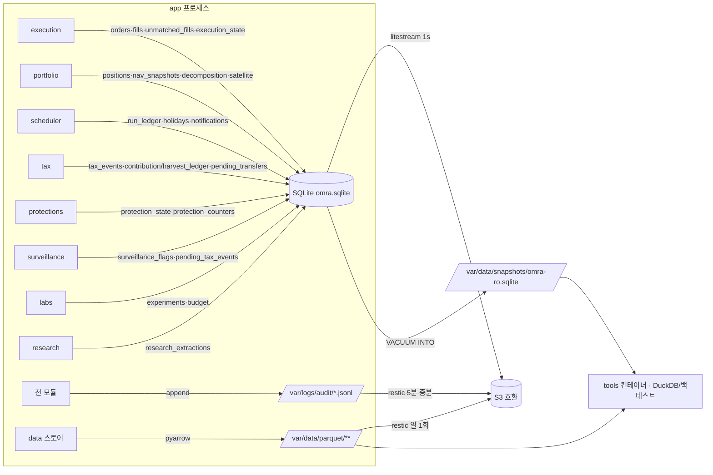

# 03. 데이터·영속성

> **범위**: `persistence/`(SQLAlchemy 모델·repos·ro 세션·alembic), `audit/`(append-only JSONL 감사로거), Parquet 레이아웃·DuckDB 뷰(레이아웃·스키마·뷰 정의 — 스토어 구현은 [06-market-data-and-calendar.md](06-market-data-and-calendar.md)), Litestream 백업·복구·`VACUUM INTO` 스냅샷.
> **계획 정본**: 01 §1.3(핵심 스키마·저장 계층), 01 §1.6(tools DB 경로), 01 §2(repos 구조·import 계약), 01 §5.1(broker_tokens), 01 §6.3(감사로그), 01 §6.5(백업), 02 §5.1(이동평균단가), 02 §5.6(`pending_transfers`), 02 §4.7(c)(fx_rates), 03 §1.3.1(`reconcile_expectations`), 06 §7.1(`surveillance_flags`), 06 §8.4(`pending_tax_events`), 07 §8~§9·§13(카나리·예산·실험 원장).
> **선행 문서**: [01-system-architecture.md](01-system-architecture.md), [02-domain-model.md](02-domain-model.md).
> **이 문서가 소유하는 정의**: SQLite DDL 전체, Parquet 레이아웃, 감사로그 JSONL 스키마 (브리프 §2.1). 테이블을 **쓰는 절차·로직**은 각 기능 문서 소유 — `pending_transfers` 절차는 [08-execution.md](08-execution.md)·[10-tax-engine.md](10-tax-engine.md), `surveillance_flags` 운용은 [11-realtime-and-surveillance.md](11-realtime-and-surveillance.md), 순매수 회계·상태머신은 [09-safety-protections.md](09-safety-protections.md), 실험 원장 로직은 [14-research-and-labs.md](14-research-and-labs.md).

## 1. 개요 — 설계 대상과 책임

이 문서는 세 저장 계층과 그 접근 규율을 코드 작성 가능한 수준으로 확정한다 (정본: 01 §1.3).

| 계층 | 엔진 | 담는 것 | 이 문서의 산출 |
|---|---|---|---|
| 트랜잭션·상태 | SQLite (WAL, SQLAlchemy 2.0, alembic) | 주문/체결/포지션/스냅샷/리밸런싱 계획/브로커 토큰/세금 원장/run ledger/휴장일 캐시/감시 플래그/카나리·변경 예산/실험 원장 + 브레이커 상태·카운터·분해 결과·위성 상태·알림 억제(§3.3.13~17 신설) | §3 전체 DDL, §4 persistence/ 설계 |
| 시계열 | Parquet (pyarrow) | 일봉 OHLCV, 환율, 종목마스터 PIT 스냅샷, 지표 캐시 | §5 레이아웃·스키마, §6 DuckDB 뷰 |
| 결정 원장 | append-only JSONL | 모든 결정·주문·미집행 주문·상태 전이 | §7 감사로그 스키마 |

백업·복구(§8)와 기동 셀프체크의 영속성 항목(§9)이 세 계층의 생존을 보장한다.

**설계 불변식 (전 절 공통)**

1. **SQLite 쓰기 주체는 언제나 `app` 프로세스 하나다** (정본: 01 §1.6). `tools` 컨테이너는 `omra-db`를 마운트하지 않고 `VACUUM INTO` 스냅샷만 읽는다.
2. **시계열은 Parquet 전용** — SQLite에 넣지 않는다 (정본: 01 §1.3).
3. **관측 4레이어(`research`·`surveillance`·`realtime`·`labs`)의 쓰기는 테이블별 전용 repo 모듈의 import 가능 여부로 강제**된다. "RO"는 주석이 아니라 import 가능한 모듈 집합이다 (정본: 01 §2.2 ②).
4. **감사로그는 append-only·로테이션 없음·백업 대상**이며, 미집행 주문(`counterfactual`)도 기록 대상이다 (정본: 00 §5 원칙 4, 01 §6.3).
5. **원장(포지션·현금)의 정본은 브로커다.** SQLite `positions`는 로컬 사본이며, 복구 후 대사 배치가 재동기화한다 (정본: 01 §1.3, §6.5).

## 2. 모듈 구조와 쓰기 토폴로지

### 2.1 파일 트리

```
src/omra/persistence/
├── __init__.py
├── session.py           # 라이터 엔진·세션 팩토리, PRAGMA, SQLITE_BUSY 재시도       (§4.1)
│                        #   ★ 모듈 좌표는 01 §8.1이 계약 초크포인트로 고정한
│                        #     `omra.persistence.session`이다 — 이름을 바꾸지 않는다
├── ro.py                # 읽기 전용 세션 팩토리 — 관측 4레이어의 유일한 읽기 경로   (§4.2)
├── models.py            # SQLAlchemy 2.0 Declarative 모델 (§3의 전 테이블)
├── types.py             # Decimal↔TEXT · KST ISO8601 TypeDecorator (02 §5.2·§5.4 재사용)
├── migrations/          # alembic (단일 헤드)                                        (§4.4)
│   ├── env.py           #   KILL/STOPPED 가드, 단일 헤드 검증
│   └── versions/
└── repos/               # 테이블별 쓰기 리포지토리 — import 화이트리스트의 실체     (§4.3)
    ├── base.py                    # TABLES 선언 규약 + 아키텍처 테스트 훅
    ├── orders.py fills.py positions.py plans.py        # execution·portfolio
    ├── run_ledger.py state.py tokens.py holidays.py    # scheduler·monitoring·brokers
    ├── reconcile.py tax_events.py pending_transfers.py # execution·tax
    ├── approvals.py nav_snapshots.py policy_versions.py
    ├── decomposition.py satellite.py                   # portfolio (07 [DD-07-10]·[DD-07-13])
    ├── notifications.py           # 알림 억제 상태 (계획 03 §7.2, 13 [DD-13-5])
    ├── execution_state.py         # execution 전용 (01 §3.5 가드 예산)
    ├── protections.py             # protections 전용 (09 [DD-09-4])
    ├── research_extractions.py    # research 전용
    ├── surveillance_flags.py      # surveillance 전용
    ├── pending_tax_events.py      # surveillance 전용
    ├── experiments.py             # labs 전용 (append-only, DB 트리거 보호)
    └── budget.py                  # labs 전용 (카나리 α·변경 예산)

src/omra/audit/
├── __init__.py
├── events.py            # 이벤트 봉투·event_type·payload 스키마 (pydantic)          (§7.1~7.2)
├── logger.py            # append-only JSONL 라이터                                  (§7.4)
└── masking.py           # 마스킹 필터 — 카세트 녹화와 코드 공유 (정본: 01 §6.3)
```

관측 4레이어별 허용 repo 집합(완전열거)은 01 §2.2가 유일한 원문이다: `research` → `research_extractions` 1개 / `surveillance` → `surveillance_flags`·`pending_tax_events` 2개 / `labs` → `experiments`·`budget` 2개 / `realtime` → 0개 / `execution` → `execution_state` 포함 코어 repos.

**모듈 좌표의 정합** — 설계 01 §8.1.1의 import-linter 금지 열거는 `repos.states`·`repos.broker_tokens`·`repos.reconcile_expectations`·`repos.tax_ledger`로 적혀 있으나 이 트리의 실제 모듈명은 `repos/state.py`·`repos/tokens.py`·`repos/reconcile.py`·`repos/tax_events.py`다. **repos 화이트리스트의 소유는 이 문서**이므로 위 트리가 정본이며, 01 §8.1.1 표·§8.2 C04b·C05b·C07b 열거를 이 이름으로 정정하고 이 트리에만 있는 `plans`·`holidays`·`approvals`·`nav_snapshots`·`decomposition`·`satellite`·`notifications`·`protections` 8개를 세 금지 열거에 **추가**해야 한다(계획 01 §2.2가 요구한 완전열거 — 누락 시 `research`·`surveillance`·`labs`가 default-allow로 import 가능해지고 16 §6.1 AT-1이 첫 실행에서 실패한다). → 01 문서 조율 항목(§13-11).

### 2.2 쓰기 토폴로지



`realtime`은 어느 저장소에도 쓰지 않는다(`realtime -/-> persistence.repos.*` — 정본: 01 §2.2). 가드 예산 카운터는 `execution`이 `execution_state`에 영속화하고 `realtime`은 인자로 받는다 (정본: 01 §3.5).

## 3. SQLite 전체 DDL

### 3.1 물리 규약 (공통)

| 항목 | 규약 | 근거 |
|---|---|---|
| DB 파일 | `/app/var/db/omra.sqlite` | 01 §6.5 litestream.yml의 `path`와 일치 |
| PRAGMA | `journal_mode=WAL`, `busy_timeout=5000`, `synchronous=NORMAL`, `foreign_keys=ON` | 정본: 01 §1.3 (foreign_keys는 [DD-03-1]) |
| Decimal | **TEXT 저장** (`"12.34500000"`), 로드 시 `decimal.Decimal` 복원 | 정본: 01 §1.3 orders DDL 주석 |
| KRW 금액 | 원 단위 **INTEGER** (`reconcile_expectations.expected_amount`와 동일 규약) | 03 §1.3.1 |
| 시각 | TEXT ISO8601. 컬럼명 접미사로 구분: `*_kst`(+09:00 오프셋 포함), 그 외 **시각** 컬럼은 UTC. **날짜 컬럼(`run_date`·`cal_date`·`snap_date`·`settle_date`·`abol_date`·`expected_date_from`/`_to`·`step_started_on`·`as_of`·`sample_from`/`_to`)은 시각이 아니라 해당 venue의 현지 거래일 `YYYY-MM-DD`**(run ledger 키 규약과 동일 — 01 §1.4). 접미사 없는 **시각** 컬럼(`observed_at`·`effective_from`·`created_at` 등)은 UTC다 | 06 §7.1 `observed_at`(UTC)·01 §1.3 `submitted_at_kst` 관행 일반화 [DD-03-1] |
| PK | 대리키가 필요한 테이블은 ULID TEXT | 01 §1.3 orders |
| `instrument_key` | `"{venue}:{code}"` — `"KRX:278530"`, `"NASD:VTI"`, `"UPBIT:KRW-BTC"` | 정본: 06 §7.1. 전 테이블 공통 채택 [DD-03-1] |
| `account_id` | 내부 계좌 식별자(계좌번호 아님). 실계좌번호(CANO)는 `.env`에만 존재 | 01 §1.3·§6.3 마스킹 |
| `sleeve_id` | `kis_domestic` \| `kis_overseas` \| `upbit` | 00 §5.1 |
| enum | TEXT + CHECK 제약. SQLite STRICT 테이블은 채택하지 않음 | [DD-03-1] |

> **[DD-03-1] 물리 규약 확정**
> - 결정: ① 시각 컬럼은 접미사 규약(`*_kst`/무접미사=UTC)으로 통일하고 날짜 컬럼은 현지 거래일 `YYYY-MM-DD`로 고정 ② `instrument_key = "{venue}:{code}"`를 06 §7.1에서 전 테이블로 일반화 ③ STRICT 테이블 미채택 — 타입 강제는 pydantic 모델·repos 계층에서 수행 ④ `PRAGMA foreign_keys=ON`을 연결마다 설정.
> - 근거: ①②는 계획의 국소 규약을 전역화한 것이고, ③은 alembic·구버전 SQLite 호환 리스크를 피하며 타입 검증은 어차피 앱 계층이 소유한다. ④는 `fills.order_id REFERENCES orders(id)`(01 §1.3)가 실제로 강제되게 한다.
> - 계획 문서와의 관계: 충돌 없음. 01 §1.3의 여백(타입·시각 표기 미정)을 채운다.

**Decimal·시각 직렬화 구현은 새로 만들지 않는다** — `persistence/types.py`의 TypeDecorator는 [02-domain-model.md](02-domain-model.md) §5.2 [DD-02-10]의 Decimal TEXT 정규형(`format(d,'f')`·지수 표기 금지·스케일 보존·NaN/Inf 거부)과 §5.4 [DD-02-15]의 KST ISO8601 헬퍼를 **그대로 호출**한다. 별도 구현을 두면 같은 값이 두 표기로 저장되어 `UNIQUE`·exact-match 비교(대사 규칙 1~3 — 03 §1.3.1)가 표기 차이로 깨진다 (요청 출처: 02 §미해결 조율 항목).

### 3.2 계획이 DDL을 확정한 테이블 (전재 + 보강 인덱스)

아래 4블록의 `CREATE TABLE` 본문은 계획 문서의 정본을 따르며 **기존 컬럼의 이름·타입·PK·UNIQUE·NULL 허용 여부를 한 글자도 바꾸지 않는다**. 이 문서가 추가하는 것은 셋뿐이다 — ① 인덱스·트리거 ② **계획이 주석으로 열거한 값 집합의 `CHECK` 제약 승격**(`run_ledger.status`·`policy_versions.kind`·`reconcile_expectations.kind`/`source`/`amount_tolerance > 0`("0 금지"의 물리화)·`surveillance_flags.state`·`pending_transfers.state`) ③ **타 설계서가 요청한 증분 컬럼**.

계획 열거에 없는 값·컬럼을 더한 곳은 아래 4건이 전부이며 각각 DD로 선언한다:

| 증분 | 대상 | 근거 문서 | DD |
|---|---|---|---|
| `source` 값 `'system'` | `reconcile_expectations` | `orphan_order` 자동 등록 주체 표기 | [DD-03-3] |
| `source` 값 `'instruction'` | `reconcile_expectations` | 08 [DD-08-7] SP-C4 분기 B 지시서 라인 | [DD-03-3] |
| `intent TEXT NOT NULL` 컬럼 | `orders` | 02 [DD-02-6] `Order.intent` | [DD-03-26] |
| `prev_state TEXT` 컬럼 | `bot_state` | 09 [DD-09-3] P12·RELOAD_CONFIG 복귀 | [DD-03-27] |

#### 3.2.1 핵심 6종 (정본: 01 §1.3)

```sql
CREATE TABLE orders (             -- Order 모델의 물리 스키마 (도메인 정의 정본: 02-domain-model.md)
  id                  TEXT PRIMARY KEY,        -- 내부 ULID
  account_id          TEXT NOT NULL,           -- 내부 식별자(계좌번호 아님)
  broker_order_id     TEXT, broker_order_org_no TEXT,
  orig_broker_order_id TEXT,                   -- 재호가 체인
  instrument_key      TEXT NOT NULL, side TEXT NOT NULL, order_type TEXT NOT NULL,
  intent              TEXT NOT NULL,           -- ★ 증분 컬럼 [DD-03-26]. 값 집합 정본:
                                               --   02 §7.2 OrderIntent (재열거 금지). CHECK 없음
  qty                 TEXT NOT NULL, limit_price TEXT,    -- Decimal은 TEXT
  status              TEXT NOT NULL,           -- SUBMITTING | PENDING | … | EXPIRED_UNKNOWN
  plan_id             TEXT, reprice_count INTEGER NOT NULL DEFAULT 0,
  submitted_at_kst    TEXT, dry_run INTEGER NOT NULL,
  UNIQUE (broker_order_id, account_id)         -- 이중 접수 방지 (01 §3.2 주문 제출 프로토콜)
);
CREATE INDEX ix_orders_open ON orders(account_id, status)
  WHERE status IN ('SUBMITTING','PENDING','PARTIALLY_FILLED');
  -- pre-trade 8.5단계 미결제 수 조회 (03 §1.6). PARTIALLY_FILLED 편입은 [DD-03-26] —
  -- 부분 체결분이 빠지면 execution.max_open_orders 상한이 실효 완화된다(08 §5.1·§19-13)
CREATE INDEX ix_orders_intent ON orders(intent, submitted_at_kst);
  -- [DD-03-26] E7 면제 판정 재구성·경로별 회전율 사후 집계(02 §8.4 look/breach/trade)의 조회 경로

-- [DD-03-2] 보강 인덱스: 순매수 회계(03 §2.4 — 로직 소유 09)와 고아 주문 튜플 매칭(01 §3.2)의 조회 경로
CREATE INDEX ix_orders_netbuy  ON orders(submitted_at_kst, side, status);
CREATE INDEX ix_orders_orphan  ON orders(account_id, instrument_key, side, submitted_at_kst)
  WHERE status IN ('SUBMITTING','EXPIRED_UNKNOWN');
CREATE INDEX ix_orders_plan    ON orders(plan_id);

CREATE TABLE fills (
  id TEXT PRIMARY KEY, order_id TEXT NOT NULL REFERENCES orders(id),
  qty TEXT NOT NULL, price TEXT NOT NULL, fee TEXT, tax TEXT,
  filled_at_kst TEXT NOT NULL, settle_date TEXT NOT NULL,   -- 세금 원장은 결제일 기준
  broker_exec_id TEXT, UNIQUE (broker_exec_id)              -- 체결통보·REST 중복 반영 방지
);
CREATE INDEX ix_fills_order  ON fills(order_id);
CREATE INDEX ix_fills_settle ON fills(settle_date);          -- [DD-03-2] 결제일 귀속 집계 경로

CREATE TABLE positions (          -- 로컬 사본. 원장 정본은 브로커
  account_id TEXT NOT NULL, instrument_key TEXT NOT NULL,
  qty TEXT NOT NULL, avg_cost TEXT NOT NULL,   -- 이동평균단가 (정본: 02 §5.1)
  updated_at TEXT NOT NULL, PRIMARY KEY (account_id, instrument_key)
);

CREATE TABLE run_ledger (
  run_date TEXT NOT NULL,         -- venue별 '현지 거래일' (01 §1.4)
  venue TEXT NOT NULL, task_name TEXT NOT NULL,
  status TEXT NOT NULL CHECK (status IN ('pending','running','done','skipped','failed')),
  started_at TEXT, finished_at TEXT, note TEXT,
  PRIMARY KEY (run_date, venue, task_name)
);

CREATE TABLE bot_state   (id INTEGER PRIMARY KEY CHECK (id = 1),
                          state TEXT NOT NULL, safe_mode_reasons TEXT, since TEXT NOT NULL,
                          prev_state TEXT);   -- ★ 증분 컬럼 [DD-03-27]. 값 집합 정본: 02 §9 BotState
CREATE TABLE sleeve_state(sleeve_id TEXT PRIMARY KEY,
                          state TEXT NOT NULL, reason TEXT, since TEXT NOT NULL);

CREATE TABLE policy_versions (
  kind TEXT NOT NULL CHECK (kind IN ('targets','universe')),
  version INTEGER NOT NULL, as_of TEXT NOT NULL,
  inputs_hash TEXT NOT NULL, path TEXT NOT NULL,   -- var/policy/ 산출물 경로 (01 §6.1)
  PRIMARY KEY (kind, version)
);
```

`run_ledger`의 `venue='SYS'`는 모니터링 일자별 카운터(`heartbeat`·`notify_dispatch`·`dms_ping`·`disk_watch`·`restore_drill`)가 점유하는 네임스페이스다(12 [DD-12-9] 인지 요청 수용) — **DDL 변경 없음**, `venue` 컬럼에 CHECK가 없고 PK가 `(run_date, venue, task_name)`이라 그대로 수용된다.

`bot_state.state`·`sleeve_state.state`의 값 집합과 전이는 09가 소유한다(정본: 03 §2.1). `safe_mode_reasons`는 JSON 배열 TEXT(발동 사유 스택 — 복수 사유 동시 성립 시 전부 해소되어야 복귀 판정 가능) [DD-03-2].

> **[DD-03-2] `orders`·`fills` 보강 인덱스 4종 + `safe_mode_reasons`의 JSON 배열 해석**
> - 결정: ① 계획 01 §1.3 전재분에 인덱스만 더한다 — `ix_orders_netbuy`(순매수 회계 조회), `ix_orders_orphan`(고아 주문 튜플 매칭, 부분 인덱스), `ix_orders_plan`(계획 역참조), `ix_fills_settle`(결제일 귀속 집계). ② `bot_state.safe_mode_reasons` TEXT의 내용 규약을 **JSON 배열**(사유 스택)로 확정한다. 컬럼 정의는 바꾸지 않는다.
> - 근거: ①의 네 인덱스는 각각 실제 조회 경로가 있다 — 순매수 회계(03 §2.4, 로직 소유 09)는 `(submitted_at_kst, side, status)` 범위 주사, 고아 주문 매칭(01 §3.2)은 `(account_id, instrument_key, side, submitted_at_kst)` 튜플 조회, 세금 원장은 결제일 기준(02 §5.6)이라 `fills(settle_date)` 집계가 일상 경로다. 인덱스가 없으면 주문 테이블이 누적될수록 pre-trade·EOD 대사의 시간 예산(01 §4.3)이 잠식된다. ②는 계획 03 §2.1이 SAFE_MODE 복귀를 "**모든** 발동 사유 해소"로 규정하므로 단일 문자열로는 복수 사유 동시 성립을 표현할 수 없기 때문이다.
> - 계획 문서와의 관계: 충돌 없음. §3.2 서문 ①(인덱스·트리거)·②(값 집합의 물리화)에 해당하는 증분이며 컬럼의 이름·타입·NULL 허용을 바꾸지 않았다.

> **[DD-03-26] `orders.intent` 컬럼 신설 + `ix_orders_open`에 `PARTIALLY_FILLED` 편입**
> - 결정: ① `orders`에 `intent TEXT NOT NULL`을 추가한다. **값 집합의 정본은 [02-domain-model.md](02-domain-model.md) §7.2 `OrderIntent`([DD-02-6])이며 이 문서는 재열거하지 않는다** — 08 §19-10이 조율 중인 `ESC_LIQUIDATE`·`WITHDRAWAL` 세분이 확정될 수 있으므로 `CHECK` 제약을 걸지 않고 값 검증은 pydantic 모델 계층에 둔다(§3.1 STRICT 미채택 규약과 동일 방향). ② `ix_orders_open`의 `WHERE`에 `'PARTIALLY_FILLED'`를 더한다.
> - 근거: ①은 02 §7.3 매핑표가 "03이 `intent TEXT NOT NULL` 컬럼을 추가한다"고 명시적으로 위임한 것이고, 이 값을 읽는 소비자가 넷이다 — 08 §5.1 pre-trade 2.5단계 E7 면제(`intent is OrderIntent.E7_TRANSFER`), 08 §7 체결 라우팅(`transfers.on_fill`), 10 §13.2 `assert_not_blocked`, 15 §5 시뮬. 컬럼이 없으면 **재시작 후** E7 유래 주문의 세금 면제 판정과 체결 라우팅이 복원 불가다. ②는 02 [DD-02-5] `OrderStatus` 8값 중 `PARTIALLY_FILLED`가 미결제 상태인데 인덱스 술어에서 빠져 있었기 때문이다(08 §19-13 요청).
> - 계획 문서와의 관계: 01 §1.3 orders DDL 전재분에 대한 **증분**임을 §3.2 서문 표에 등재했다. 계획이 배제한 것이 아니라 열거하지 않은 것이므로 충돌 없음.

> **[DD-03-27] `bot_state.prev_state` 컬럼 신설**
> - 결정: `bot_state`에 `prev_state TEXT`(NULL 허용 — 최초 기동 시 직전 상태 없음)를 추가한다. 값 집합 정본은 [02-domain-model.md](02-domain-model.md) §9 `BotState`이며 재열거하지 않는다. 갱신·복귀 규칙(진입 시 `prev_state ← cur`, 복귀 시 `cur ← prev_state`)은 09 §9 전이표가 소유한다.
> - 근거: 계획 03 §2.1이 P12를 "소스 복구 시 **직전 전역 상태**로 복귀", `RELOAD_CONFIG`를 "재생성 후 **직전 상태**로 복원"으로 규정하는데 4컬럼 스키마에는 담을 자리가 없다. 계획 01 §6.3-5의 "직전 상태로 복원(… `bot_state.since` 이전 값)" 문구는 `since`가 **시각**이라 상태를 복원할 수 없으므로 이 컬럼이 그 문구의 물리적 대응물이다(01 §6.3의 해당 문구는 `bot_state.prev_state` 참조로 정정 필요 — §13-12). 메모리에 두면 재시작 한 번에 "복귀 목적지가 `RUNNING`인가 `SAFE_MODE`인가"가 소실되고 오차가 더 위험한 쪽으로 난다.
> - 계획 문서와의 관계: 요건 자체가 계획 03 §2.1이다. 요청 출처는 09 [DD-09-3].

#### 3.2.2 `reconcile_expectations` (정본: 03 §1.3.1 — 전문 전재)

```sql
CREATE TABLE reconcile_expectations (
  id                  TEXT PRIMARY KEY,       -- ULID
  account_id          TEXT NOT NULL,
  kind                TEXT NOT NULL CHECK (kind IN
                        ('cash_in','cash_out','fill','scheduled_fill',
                         'ca_qty','fx_resettle','orphan_order')),
  instrument_key      TEXT,                   -- fill/ca_qty/scheduled_fill만. cash 계열은 NULL
  expected_date_from  TEXT NOT NULL,
  expected_date_to    TEXT NOT NULL,
  expected_qty        INTEGER,                -- 수량은 정확 일치만 허용
  expected_amount     INTEGER,                -- KRW 정수
  amount_tolerance    INTEGER NOT NULL CHECK (amount_tolerance > 0),  -- 0 금지
  source              TEXT NOT NULL CHECK (source IN
                        ('external_schedule','master_diff','ksdinfo',
                         'broker_fx','broker_dividend',
                         'system',          -- ★ 증분: orphan_order 자동 등록 [DD-03-3]
                         'instruction')),   -- ★ 증분: SP-C4 분기 B 지시서 라인 [DD-03-3]
  consumed_at         TEXT,                   -- 1회 소비 후 소멸
  expires_at          TEXT NOT NULL,          -- 만료 시 자동 폐기 + warning
  created_at          TEXT NOT NULL
);
-- external_expectations_sync의 멱등 키 (정본: 01 §4.2)
CREATE UNIQUE INDEX ux_reconcile_idem ON reconcile_expectations
  (source, account_id, kind, ifnull(instrument_key,''), expected_date_from);
CREATE INDEX ix_reconcile_open ON reconcile_expectations(account_id, kind, expected_date_from)
  WHERE consumed_at IS NULL;
```

매칭 규칙(AND 5개)·`scheduled_fill`의 금액 1급 키·`orphan_order` 시스템 자동 등록의 정본은 03 §1.3.1이며 대사 로직은 08이 소유한다. `source='system'`은 `orphan_order` 자동 등록 주체 표기용, `source='instruction'`은 **SP-C4 분기 B(`AccountMode.INSTRUCTION`)에서 지시서 라인별로 등록하는 `kind='fill'` 기대값**(발행일~+7일 관측 구간)의 주체 표기용이다 — 08 [DD-08-7]의 요청을 수용했다 [DD-03-3]. 이 값이 없으면 사람이 MTS에서 이행한 체결이 P8 수량 불일치로 잡히거나 다른 `source`로 위장 등록되어 아래 멱등 유니크 인덱스가 `external_expectations_sync` 행과 충돌한다. 멱등 유니크 인덱스는 계획의 멱등 키 문장을 물리 제약으로 승격한 것이다 [DD-03-3]. `instrument_key` **주석**에 `scheduled_fill`을 더한 것은 규칙 2-1이 그 kind에 `instrument_key` exact match를 요구하기 때문이며(03 §1.3.1), 컬럼 정의(타입·NULL 허용)는 계획과 동일하다.

#### 3.2.3 `surveillance_flags` (정본: 06 §7.1 — 전문 전재)

```sql
CREATE TABLE surveillance_flags (
  instrument_key      TEXT NOT NULL,     -- "KRX:278530" … 미해결 큐는 "UNRESOLVED:{payload_hash}"
  risk_type           TEXT NOT NULL,     -- 06 §5.1 카탈로그 ID (KR-01…US-02) + 'MANUAL'
  source              TEXT NOT NULL,     -- kis_master | kis_stock_info | kis_ksdinfo | upbit_market | operator | …
  level               INTEGER NOT NULL,  -- SurveillanceLevel 0~3
  state               TEXT NOT NULL CHECK (state IN ('ACTIVE','RESOLVED','UNRESOLVED','FALSE_POSITIVE')),
                      -- ★ 'FALSE_POSITIVE'는 계획 06 §7.1 열거의 전재이나 **실제로는 기록되지
                      --   않는다** — 오탐 마킹의 정본은 감사로그이고 테이블 표현은 MANUAL 행의
                      --   override_level(하향)이다(06 §7.1 "FALSE_POSITIVE 보존" 항). state는
                      --   폴이 매번 재도출하므로 마킹을 담을 수 없다. 값은 계획 전재 원칙에 따라
                      --   남기되 쓰기 경로는 없다(11 조율 요청 수용 — repos 계약으로 금지)
  raw_value           TEXT,
  observed_at         TEXT NOT NULL,     -- UTC ISO8601
  effective_from      TEXT NOT NULL,     -- 사전 예약(KR-12 td_stop_dt). 기본 = observed_at
  resolved_at         TEXT,
  deadline_at         TEXT,              -- 기한부 이벤트(상폐일) → P14 입력
  override_level      INTEGER,
  override_expires_at TEXT,
  override_actor      TEXT,
  override_reason     TEXT,
  PRIMARY KEY (instrument_key, risk_type, source)
);
CREATE INDEX ix_survflags_active ON surveillance_flags(instrument_key, state, effective_from);
```

파생 상태 규약(`level_of`의 신선도 우선 판정, 폴 재도출 시 `override_*` 보존, 음성 관측 행 기록, MANUAL 행)의 정본은 06 §7.1이고 소비자 API 6종은 11이 소유한다. 이 테이블은 **일 1회 전수 폴에서 재도출되는 파생 상태**이며 이벤트 원장 역할은 감사로그(§7)가 한다.

#### 3.2.4 `pending_transfers` (정본: 02 §5.6 — 전문 전재)

```sql
CREATE TABLE pending_transfers (          -- E7 전용. 감시 테이블과 분리
  account_id       TEXT NOT NULL,
  instrument_key   TEXT NOT NULL,
  abol_date        TEXT NOT NULL,         -- lstg_abol_dt (2개 소스 교차 확인 완료분만)
  substitute_key   TEXT NOT NULL,         -- universe.yaml approved_substitutes 1:1 페어
  total_qty        INTEGER NOT NULL,      -- 등록 시점 해당 계좌의 보유 수량
  slices_total     INTEGER NOT NULL,
  slices_done      INTEGER NOT NULL DEFAULT 0,
  state            TEXT NOT NULL CHECK (state IN ('PENDING','RUNNING','DONE','ABORTED')),
  created_at       TEXT NOT NULL,
  PRIMARY KEY (account_id, instrument_key)
);
```

행 생성 주체(`tax`)·슬라이스 공식·불변식 5개의 정본은 02 §5.6이며, 집행 흐름은 08·10이 소유한다.

> **[DD-03-36] E7 기집행 **수량**은 컬럼이 아니라 파생값**
> - 결정: 10 §17-14가 요청한 `pending_transfers.executed_qty` 컬럼을 **두지 않는다**. 부분 체결 시의 기집행 수량은 `fills ⨝ orders(intent='e7_transfer', account_id, instrument_key)`의 `SUM(qty)`로 파생하며(§3.5 파생 질의 계약에 등재, 지원 인덱스 `ix_orders_intent`·`ix_fills_order`), `slices_done`은 계획 02 §5.6 정의 그대로 **회차 카운터**로 남는다.
> - 근거: 이 문서의 세금 원장 원칙([DD-03-11])과 같다 — 누적 컬럼을 따로 두면 "원장(fills)과 누적기가 어긋난다"는 새 실패 모드가 생기고, 부분 체결·취소·재호가가 섞이면 반드시 어긋난다. `orders.intent`([DD-03-26])가 생겨 파생 경로가 인덱스로 지원되므로 컬럼 없이도 질의가 성립한다. 02 §5.6 전재 블록에 컬럼을 더하지 않아 "한 글자도 바꾸지 않는다" 규약도 지킨다.
> - 계획 문서와의 관계: 02 §5.6 스키마 불변. 요청 출처는 10 §17-14 — 판정 결과를 10에 회신해야 한다(§13-13).

### 3.3 계획이 목록·컬럼 튜플만 준 테이블 — 컬럼 확정

이 절의 각 테이블은 계획이 존재만 확정한 것을 DDL로 승격한다. 각각 DD 블록으로 선언한다.

#### 3.3.1 `broker_tokens` — 토큰·approval_key 캐시

계획: "SQLite `broker_tokens` 테이블에 (env, token, issued_at, expires_at) 영속화 — 재시작에도 재발급하지 않음. WebSocket `approval_key`도 동일 저장소 관리" (정본: 01 §5.1).

```sql
CREATE TABLE broker_tokens (
  broker        TEXT NOT NULL CHECK (broker IN ('kis','upbit')),
  env           TEXT NOT NULL CHECK (env IN ('live','paper')),
  credential_id TEXT NOT NULL DEFAULT '*',   -- 앱키 식별 해시. 단일 앱키면 '*' 1세트 (05 [DD-05-6])
  kind          TEXT NOT NULL CHECK (kind IN ('access_token','approval_key')),
  token         TEXT NOT NULL,
  issued_at     TEXT NOT NULL,
  expires_at    TEXT,              -- approval_key 유효기간 미확인(01 §6.2, M1 W7) → NULL 허용
  updated_at    TEXT NOT NULL,
  PRIMARY KEY (broker, env, credential_id, kind)
);
```

> **[DD-03-4] `broker_tokens` 컬럼 확정**
> - 결정: 계획의 4컬럼에 `broker`·`credential_id`·`kind` 차원을 추가하고 `expires_at`을 NULL 허용으로 둔다. 체결통보 AES key/iv는 DB에 넣지 않는다(세션 메모리 상태 — 정본: 01 §5.1).
> - 근거: KIS live/paper가 별도 키·도메인이고(01 §6.1) approval_key가 "동일 저장소"로 지정되어 kind 차원이 필요하다. `credential_id`는 05 [DD-05-6]의 요청 수용분이다 — **SP-C5 실패 시 계좌별 앱키 다중화**(04 §2 M1)가 확정되면 저장 스키마 마이그레이션이 필요해지므로 축을 지금 두고 단일 앱키 동안은 센티널 `'*'` 1세트만 적재한다(`execution_state.instrument_key='*'` 센티널 규약 [DD-03-7]과 같은 패턴). 05가 제시한 PK `(env, credential_id, kind)`에 `broker`를 유지한 것은 업비트 행 확장 여지를 닫지 않기 위함이다. 업비트 인증에서 **캐시 대상 토큰이 존재하는지는 계획에 명시가 없다** — 계획이 영속화를 요구한 것은 KIS 접근토큰·approval_key뿐이다(01 §5.1). 따라서 업비트 행은 **적재하지 않는 것이 기본**이고 `broker` enum에만 남겨 확장을 막지 않는다 [확인 필요 — 업비트 인증 방식·토큰 수명은 05가 소유, 공식 문서/실측으로 확정].
> - 계획 문서와의 관계: 01 §5.1의 여백을 채움. approval_key 유효기간은 [확인 필요] — M1 W7 실측(01 §10)으로 확정.

토큰 파일락(`/app/var/db/.token.lock`)은 DB 밖 파일이며 규약의 정본은 01 §5.1, 사용 주체는 05다.

#### 3.3.2 `pending_tax_events` — KR-04 사실 기록

계획: 컬럼 튜플 `(instrument_key, risk_type, abol_date, cross_checked, observed_at, state)` — 사실 필드만 (정본: 06 §8.4).

```sql
CREATE TABLE pending_tax_events (
  id             TEXT PRIMARY KEY,        -- ULID
  instrument_key TEXT NOT NULL,
  risk_type      TEXT NOT NULL,           -- 'KR-04'
  abol_date      TEXT NOT NULL,
  cross_checked  INTEGER NOT NULL,        -- 0|1 — 2소스 교차 확인 여부 (E7 상한 ③의 입력)
  observed_at    TEXT NOT NULL,           -- UTC
  state          TEXT NOT NULL CHECK (state IN ('OPEN','CONSUMED','EXPIRED')),
  UNIQUE (instrument_key, risk_type, abol_date)   -- 재폴 중복 기록 방지
);
```

> **[DD-03-5] `pending_tax_events` DDL 확정**
> - 결정: 튜플 6필드에 ULID PK·유니크 제약을 더하고, `state` 값 집합을 `OPEN`(미소비)/`CONSUMED`(tax가 `pending_transfers` 생성 또는 A3 큐 회부 완료)/`EXPIRED`(상폐일 경과)로 확정.
> - 근거: 감시 폴은 멱등이어야 하므로(01 §4.2.1 `always`) 동일 사실의 중복 행을 유니크 제약으로 막는다. 예상 손익 등 세금 계산 필드를 두지 않는 것은 06 §8.4의 명시 규정("사실 필드만")이다.
> - 계획 문서와의 관계: 06 §8.4의 컬럼 열거를 물리화. 충돌 없음.

#### 3.3.3 `rebalance_plans` — 리밸런싱 계획·결정

계획: SQLite 담당 목록에 "리밸런싱 계획·결정" (정본: 01 §1.3). 도메인 모델 `RebalancePlan`(01 §3.1 — 정의 정본은 02-domain-model.md)을 물리화한다.

```sql
CREATE TABLE rebalance_plans (
  id                 TEXT PRIMARY KEY,     -- RebalancePlan.id (ULID)
  as_of_kst          TEXT NOT NULL,
  reason             TEXT NOT NULL,        -- 값 집합 정본: 02 §7.4 PlanReason (재열거 금지)
  sleeve_id          TEXT,                 -- 슬리브 단일 판정 계획(crypto_execute 등). NULL = 복수 슬리브
  expected_turnover  TEXT NOT NULL,        -- Decimal
  sanity_json        TEXT NOT NULL,        -- SanityResult 직렬화 (HRP 괴리 등)
  approved           INTEGER NOT NULL DEFAULT 0,
  approved_at        TEXT, rejected_at TEXT,
  targets_version    INTEGER,              -- policy_versions(kind='targets') 참조
  universe_version   INTEGER,
  inputs_hash        TEXT NOT NULL,        -- 재현성 지문 (01 §3.1 TargetWeights 규약)
  payload_json       TEXT NOT NULL,        -- 전체 Plan 직렬화 (grace·거부권 UI·재구성용)
  created_at         TEXT NOT NULL
);
CREATE INDEX ix_plans_asof ON rebalance_plans(as_of_kst);
```

> **[DD-03-6] `rebalance_plans` 컬럼 확정**
> - 결정: 위 스키마. 주문 행은 `orders.plan_id`로 연결하고 계획 본문은 `payload_json`에 통째로 보존한다. **`reason`의 값 집합은 재열거하지 않고 [02-domain-model.md](02-domain-model.md) §7.4 `PlanReason`을 참조한다** — 이전 판(`… + e7_transfer [DD]`)은 도메인 모델 소유 문서에 없는 5번째 값을 03이 단독 선언한 것이어서 `RebalancePlan.reason: PlanReason` 직렬화가 DB 값과 어긋났다. E7 슬라이스는 계획에 병합되더라도 **주문 수준의 출처 태그** `orders.intent = 'e7_transfer'`([DD-03-26], 02 §7.2)로 식별되므로 계획 사유에 별도 값이 없어도 감사 재구성이 성립한다. 02가 `PlanReason.E7_TRANSFER`를 편입하기로 판정하면 이 컬럼은 **주석 변경 없이** 그 값을 그대로 수용한다(CHECK 제약이 없다).
> - 근거: 감사 재구성(원칙 4)은 "그날 계획 전체"를 요구하는데 orders 행만으로는 미제출 레그(가드 ABORT 등)가 소실된다. `targets_version`·`universe_version`은 "어느 정책 버전으로 이 계획이 나왔는가"를 1년 뒤에도 답하게 한다. 값 집합을 두 문서가 열거하면 반드시 어긋난다(브리프 §2.1).
> - 계획 문서와의 관계: 01 §1.3 목록 항목의 물리화. 승인·grace 로직은 08·13 소유 — 이 테이블은 상태 보존만.

#### 3.3.4 `execution_state` — 가드 예산·시장 ABORT 영속화

계획: `(run_date, venue, instrument_key, counter_kind, value)` (정본: 01 §3.5).

```sql
CREATE TABLE execution_state (
  run_date       TEXT NOT NULL,
  venue          TEXT NOT NULL,
  instrument_key TEXT NOT NULL DEFAULT '*',   -- venue 범위 카운터(시장 ABORT)는 '*' [DD-03-7]
  counter_kind   TEXT NOT NULL,               -- defer_count | defer_minutes_total
                                              --   | venue_abort | guard_fail_streak:<guard>
  value          INTEGER NOT NULL,
  updated_at     TEXT NOT NULL,
  PRIMARY KEY (run_date, venue, instrument_key, counter_kind)
);
```

> **[DD-03-7] `execution_state` PK 센티널 · `counter_kind` 리터럴**
> - 결정: ① venue 범위 카운터의 `instrument_key`는 NULL이 아니라 `'*'`로 저장한다. ② `counter_kind` 값 집합은 01 §3.5의 열거(연기 횟수·당일 연기 누적 분·시장 ABORT·가드 연속 실패)를 코드화한 위 4계열로 확정하며, 시장 범위 리터럴은 **`venue_abort`로 통일**한다(종전 `market_abort` 폐기).
> - 근거: ① SQLite PK 컬럼은 NULL 불가이므로 센티널이 필요하다. ② 08 §12 `VENUE_ABORT="venue_abort"`·11 §7 `GuardBudgets.venue_abort`·13 §5가 이미 `venue_abort`를 쓰고 있고(11은 리터럴을 참조만 하며 통일 자체를 요청), 이 테이블의 범위 컬럼명이 `venue`이며 §7.2 `GuardVerdictPayload.scope`도 `"venue"`다 — 같은 축의 이름이 스키마 안에서 두 벌이 되는 것을 없앤다. 계획 01 §3.5의 한국어 표기("시장 ABORT")는 리터럴을 지정하지 않았으므로 충돌 없음.
> - 계획 문서와의 관계: 01 §3.5의 물리화. 카운터의 의미·상한값(연기 3회·당일 90분 등)의 정본은 02 §4.4·06이며 로직은 08 소유.

#### 3.3.5 `presence` — 부재 평면 단일 행

계획: `PresenceState` — "presence 단일 행 (03 §5.3.1)" (정본: 01 §3.4).

```sql
CREATE TABLE presence (
  id            INTEGER PRIMARY KEY CHECK (id = 1),
  state         TEXT NOT NULL CHECK (state IN ('NORMAL','AWAY_SOFT','AWAY','AWAY_LONG')),
  last_seen_at  TEXT NOT NULL,     -- 마지막 사용자 응답 시각 (부재 사다리 입력 — 로직 09 소유)
  declared_away INTEGER NOT NULL DEFAULT 0,   -- /away 명시 선언 여부 (03 §5.3)
  away_until    TEXT,              -- 선언 시 복귀 예정일
  since         TEXT NOT NULL
);
```

> **[DD-03-8] `presence` 컬럼 확정** — 결정: 위 5필드. 근거: 부재 감지는 `last_seen` 갱신(01 §6.4)과 `/away` 선언(00 §3.2 S8) 두 입력을 가지므로 둘 다 영속화해야 재시작 후 사다리가 이어진다. 계획과의 관계: 01 §3.4·03 §5.3.1의 물리화, 전이 로직은 09 소유.

#### 3.3.6 `market_holidays` — 휴장일 캐시

계획: SQLite 담당 목록 "휴장일 캐시" (정본: 01 §1.3). 교차검증(XKRX vs KIS TR CTCA0903R)의 로직은 06-market-data가 소유한다.

```sql
CREATE TABLE market_holidays (
  venue       TEXT NOT NULL,               -- KRX | NYSE(XNYS)
  cal_date    TEXT NOT NULL,
  source      TEXT NOT NULL CHECK (source IN ('exchange_calendars','kis_tr')),
  is_open     INTEGER NOT NULL,            -- 0=휴장, 1=개장(반일장 포함)
  session_note TEXT,                       -- 반일장 등 (XNYS 세션 시각은 캘린더가 계산)
  fetched_at  TEXT NOT NULL,
  PRIMARY KEY (venue, cal_date, source)
);
```

> **[DD-03-9] `market_holidays` 컬럼 확정** — 결정: 소스별 행을 분리 저장한다(교차검증은 두 소스 행의 `is_open` 비교). 근거: 01 §4.1 "불일치 시 그날 국내 집행 중단"의 판정 입력이 소스별로 남아야 사후 감사가 가능하다. 계획과의 관계: 01 §1.3 목록의 물리화.

**06과의 표기 정합** — 06 [DD-06-10]·§16-16이 "신설 요청"으로 열거한 필드 `(venue_date, local_is_open, kis_is_open, verdict, checked_at)`는 **wide 형태 제안**이며, 이 테이블은 **이미 존재하는 long(소스별 행) 형태**다. 대응: `venue_date` → `(venue, cal_date)`, `local_is_open` → `source='exchange_calendars'` 행의 `is_open`, `kis_is_open` → `source='kis_tr'` 행의 `is_open`, `checked_at` → `fetched_at`. **`verdict`는 컬럼이 아니다** — 두 소스 행의 `is_open` 비교 결과로 `HolidayCacheRepo`(접근 API 소유: 06)가 계산하는 파생값이며, 판정 근거(어느 소스가 무엇을 말했는가)는 행으로 남아 사후 감사가 성립한다. 06 문서의 "신설 요청"은 "기존 테이블 소비"로 정정되어야 한다(§13-14).

#### 3.3.7 `nav_snapshots` — EOD 스냅샷

계획: `krx_eod` 잡의 "EOD 스냅샷" (정본: 01 §4.2), SQLite 담당 목록 "스냅샷" (01 §1.3).

```sql
CREATE TABLE nav_snapshots (
  snap_date        TEXT NOT NULL,          -- venue별 현지 거래일 (run_ledger 규약과 동일)
  account_id       TEXT NOT NULL,
  nav_krw          INTEGER NOT NULL,       -- KRW 환산 평가액 (02 §4.7 환율 스냅샷 기준)
  cash_krw         INTEGER NOT NULL,
  positions_json   TEXT NOT NULL,          -- [{instrument_key, qty, price, value_krw}]
  fx_usdkrw        TEXT,                   -- 적용 환율 (Decimal TEXT)
  frozen_reserve_krw INTEGER NOT NULL DEFAULT 0,   -- 06 §8.4(c) 동결 대기분 표기용
  created_at       TEXT NOT NULL,
  PRIMARY KEY (snap_date, account_id)
);
```

> **[DD-03-10] `nav_snapshots` 컬럼 확정** — 결정: 위 스키마. 근거: TE 5항목 분해(03 §4.6)·SAFE_MODE 순매수 상한의 NAV 기준(03 §2.2 "NAV는 판정 시점(직전 영업일 종가) 기준")·월간 리포트가 모두 일별 계좌 스냅샷을 입력으로 요구한다. `positions_json`은 시계열 분석용이 아니라 당일 단면 재구성용이다(시계열 분석은 Parquet/감사로그 — 01 §1.3 위반 아님). 계획과의 관계: 목록 항목의 물리화.

#### 3.3.8 세금 원장 — `tax_events` · `taxbase_snapshots` · `contribution_ledger` · `harvest_ledger`

계획: SQLite 담당 목록 "세금 원장(결제일 기준)" (정본: 01 §1.3). 귀속·환산은 결제일 기준(02 §5.1), 정본 입력은 증권사 집계(02 §5.2), 과표기준가 스냅샷 저장(02 §5.3).

```sql
CREATE TABLE tax_events (               -- 결제일 귀속 단일 원장
  id             TEXT PRIMARY KEY,      -- ULID
  account_id     TEXT NOT NULL,
  instrument_key TEXT,                  -- 이자·계좌 단위 이벤트는 NULL
  kind           TEXT NOT NULL CHECK (kind IN
                   ('realized_pnl',       -- 매도 실현손익 (이동평균단가 기준 — 02 §5.1)
                    'dividend','distribution','interest',
                    'withholding',        -- 원천징수 (음수 아님 — 별도 행)
                    'redemption')),       -- 해지상환 (E7 방치·상폐 케이스)
  amount_krw     INTEGER NOT NULL,      -- 결제일 환율 환산 KRW. realized_pnl은 부호 있음
  qty            TEXT,                  -- Decimal TEXT (해당 시)
  settle_date    TEXT NOT NULL,         -- ★ 귀속 기준일 (02 §5.1)
  fx_rate        TEXT,                  -- 적용 환율 (해외분)
  source         TEXT NOT NULL CHECK (source IN
                   ('broker_032',        -- 해외주식 기간손익 TR (00 §3.2 T1)
                    'period_rights',     -- 기간별계좌권리현황
                    'computed',          -- 자체 계산 (시뮬·경고 전용 — 02 §5.2)
                    'manual')),          -- 대주주·비상장 등 수동 입력 (02 §5.1)
  fill_id        TEXT REFERENCES fills(id),
  created_at     TEXT NOT NULL
);
CREATE INDEX ix_taxev_year ON tax_events(account_id, settle_date, kind);

CREATE TABLE taxbase_snapshots (        -- 과표기준가 스냅샷 (02 §5.3)
  instrument_key TEXT NOT NULL,
  as_of          TEXT NOT NULL,         -- 매수·매도 시점 일자
  taxbase_price  TEXT NOT NULL,         -- Decimal TEXT
  source         TEXT NOT NULL,         -- SP-C1 결과에 따라 확정 [확인 필요]
  fetched_at     TEXT NOT NULL,
  PRIMARY KEY (instrument_key, as_of)
);

CREATE TABLE contribution_ledger (      -- 계좌별 연간 납입액 (02 §1.3.2 — T9 waterfall_gap_check 입력)
  account_id     TEXT NOT NULL,
  year           INTEGER NOT NULL,
  ytd_paid_krw   INTEGER NOT NULL,      -- KRW 정수
  source         TEXT NOT NULL CHECK (source IN ('api','csv','manual')),
  as_of          TEXT NOT NULL,         -- 집계 기준일 (현지 거래일 YYYY-MM-DD)
  updated_at     TEXT NOT NULL,
  PRIMARY KEY (account_id, year)
);

CREATE TABLE harvest_ledger (           -- 연중 하베스팅 누적 (NAV 20% 게이트 입력 — 00 §3.2 T3)
  year                     INTEGER PRIMARY KEY,
  order_amount_krw_cum     INTEGER NOT NULL DEFAULT 0,
  realized_target_krw_cum  INTEGER NOT NULL DEFAULT 0,
  updated_at               TEXT NOT NULL
);
```

**10 §2.3 요구 스키마 ↔ 이 문서의 실제 테이블 대응표** (DDL 정본은 이 문서 — 10 §2.3 표는 아래 이름·컬럼으로 재작성되어야 한다, §13-15):

| 10 §2.3 표기 | 이 문서의 정본 | 비고 |
|---|---|---|
| `tax_ledger` | `tax_events` (§3.3.8) | `event_type` → `kind`, `TRADE`→`realized_pnl` / `WHT`→`withholding` / `DIVIDEND`→`dividend` / `REDEMPTION`→`redemption`, `realized_pnl_krw`·`taxable_krw` → `amount_krw`(부호 있음) + `kind` 차원, `fx_rate_settle` → `fx_rate` |
| `basis_price_snapshots` | `taxbase_snapshots` (§3.3.8) | `basis_price` → `taxbase_price` |
| `avg_cost_basis` | `positions.avg_cost` (§3.2.1) | 이동평균단가의 정본은 02 §5.1 하나 — 이중 보관 금지 |
| `tax_approvals` | `approval_requests` (§3.3.9) | `kind ∈ {harvest_y1, isa_sell_confirm, e5_transfer, …}` 행으로 표현 [DD-03-12] |
| `transfer_instructions` | `approval_requests(kind='e5_transfer')` (§3.3.9) | 대기 이체분은 `payload_json.amount_krw` 합으로 파생 [DD-03-12] |
| `tax_lots` | **테이블 없음** — `fills` 파생 | [DD-03-11]: 로트 원장은 분석 전용이며 세액 계산 경로에 존재하지 않는다(02 §5.1) |
| `income_accumulator` | **테이블 없음** — `tax_events` 파생 집계 | [DD-03-11]·§3.5 |
| `isa_usage` | **테이블 없음** — `tax_events` + `tax.isa_usage_opening_amount` 파생 | [DD-03-11]·§3.5 |
| `contribution_ledger` | **신설** (위 DDL) | [DD-03-32] |
| `harvest_ledger` | **신설** (위 DDL) | [DD-03-32] |
| `pending_transfers` | 존재 (§3.2.4) | 02 §5.6 전재 그대로 |
| `pending_tax_events` | 존재 (§3.3.2) | tax는 `persistence.ro`로 읽기만 |

> **[DD-03-32] `contribution_ledger`·`harvest_ledger` 신설 (그 외 tax 요구 테이블은 기존 테이블·파생으로 흡수)**
> - 결정: 10 §2.3이 요구한 11개 테이블 중 **위 2개만 신설**하고 나머지는 대응표대로 기존 테이블 또는 파생 집계로 흡수한다.
> - 근거: 계획 정본 01 §1.3의 SQLite 열거는 "세금 원장(결제일 기준)" **하나**이고, 이 문서가 그것을 `tax_events` 단일 원장 + `source` 차원으로 물리화한 것이 정본이다([DD-03-11]). `contribution_ledger`(02 §1.3.2 납입액)와 `harvest_ledger`(00 §3.2 T3 NAV 20% 게이트)만은 `tax_events`에서 파생할 수 없다 — 전자는 **이체·납입 사실**이라 결제일 귀속 손익 원장의 사건이 아니고, 후자는 **주문금액 누적**이라 체결 원장이 아니라 계획 단계 값이기 때문이다. `avg_cost_basis`를 별도 테이블로 두지 않는 것은 같은 사실을 `positions.avg_cost`와 이중 보관하면 대사 시 어느 쪽이 정본인지 답할 수 없기 때문이다(불변식 5: 원장 정본은 브로커, 로컬 사본은 하나).
> - 계획 문서와의 관계: 01 §1.3 목록의 물리화. 충돌 없음.

> **[DD-03-11] 세금 원장 물리 설계**
> - 결정: 단일 `tax_events` 원장 + `source` 차원. YTD 실현손익 `G`(02 §5.1)·금소세 누적기(02 §5.2)·ISA 소진률(계약기간 누적 — 02 §5.2)은 **테이블이 아니라 이 원장 위의 파생 집계**로 정의한다. ISA 개시 잔액은 config(`tax.isa_usage_opening_amount` — 04 소유)에서 오고, `unknown` 판정(미입력)은 tax 모듈이 수행한다. 두 값 충돌 시 `source IN ('broker_032','period_rights')` 행이 `computed` 행을 이긴다.
> - 근거: 02 §5.2가 "정본 입력은 증권사 집계, 자체 계산은 시뮬 전용"으로 이원화를 명시하므로 소스 차원이 1급이어야 한다. 누적기를 별도 테이블로 두면 원장과 누적기의 불일치라는 새 실패 모드가 생긴다 — 파생 집계는 언제나 재계산 가능하다.
> - 계획 문서와의 관계: 01 §1.3 목록의 물리화. 로트 원장(분석·리포트 전용 — 02 §5.1)은 **별도 테이블을 만들지 않고 `fills`에서 파생**한다(세액 계산 경로에 존재하지 않아야 한다는 02 §5.1 결정의 물리적 표현). `taxbase_snapshots.source`는 SP-C1(02 §5.3) 결과 확정 전까지 [확인 필요] — 폴백 확정 시(`tax.basis_price_source: fallback`) 이 테이블은 적재되지 않고 남는다.

#### 3.3.9 `approval_requests` — A3 승인 큐

계획: A3 대기 항목과 타임아웃 기본값의 존재(정본: 03 §5.3.2), E7 A3 강등 큐(02 §5.6), ESC_* 승인 대기(06 §8.1). 저장 스키마는 계획에 없다.

```sql
CREATE TABLE approval_requests (
  id             TEXT PRIMARY KEY,      -- ULID = change_id/승인 ID (알림·명령의 참조 키)
  kind           TEXT NOT NULL,         -- p2_targets | p5_universe | esc_replace | esc_liquidate
                                        --   | e7_demoted | harvest_y1 | isa_sell_confirm
                                        --   | e5_transfer | i3_promotion | …  (개방 집합)
  subject_key    TEXT,                  -- instrument_key 또는 대상 식별자
  account_id     TEXT,
  payload_json   TEXT NOT NULL,         -- 승인 대상 전문 (지시서·계획·diff)
  requested_at   TEXT NOT NULL,
  grace_deadline TEXT,                  -- 타임아웃 시각 (값 정본: 03 §5.3.2)
  timeout_action TEXT NOT NULL,         -- no_action | escalate_critical | …  (로직 09·13 소유)
  state          TEXT NOT NULL CHECK (state IN
                   ('PENDING','APPROVED','REJECTED','EXPIRED','ESCALATED','CANCELLED')),
  decided_at     TEXT, decided_by TEXT, -- telegram | web | timeout
  created_at     TEXT NOT NULL
);
CREATE INDEX ix_approvals_open ON approval_requests(state, grace_deadline)
  WHERE state = 'PENDING';
```

> **[DD-03-12] `approval_requests` 신설**
> - 결정: 위 스키마. `kind`는 CHECK 없이 개방 집합(승인 종류는 00 §3.2 등급표 전반에 흩어져 있고 마일스톤별로 늘어난다). E5 절세계좌 이체 대기분의 `pending_transfer_reserve`(03 §2.3)는 `state='PENDING' AND kind='e5_transfer'` 행의 `payload_json.amount_krw` 합으로 파생한다.
> - 근거: A3 타임아웃("무행동·직전 상태 유지")·2회 연속 미승인 critical 격상(00 §3.2 P2)·부재 중 타임아웃 판정은 전부 재시작을 견뎌야 한다. 프로세스 메모리 큐면 재시작 한 번에 승인 요청이 증발한다.
> - 계획 문서와의 관계: 계획의 여백(저장 형태 미정)을 채움. 타임아웃 값·grace 클램프·알림 상호작용의 정본은 03 §5.3.2이고 로직은 09·13 소유.

#### 3.3.10 `canary_state` · `change_budget` — 카나리 α·변경 예산

계획: "카나리 α 단계와 변경 예산 카운터는 run ledger와 별개 테이블로 DB 영속화, 기동 셀프체크에 진행 중 카나리 복원 포함" (정본: 01 §1.3 영속성 요건 ①, 07 §8).

```sql
CREATE TABLE canary_state (
  change_id       TEXT PRIMARY KEY,     -- 대상 변경 식별자 (감사로그 correlation.change_id와 동일)
  target_kind     TEXT NOT NULL CHECK (target_kind IN ('targets','methodology','universe_swap')),
  ladder_json     TEXT NOT NULL,        -- [{"alpha":"0.3333","days":5}, …] (값 정본: 07 §8 표)
  step_index      INTEGER NOT NULL DEFAULT 0,
  alpha_current   TEXT NOT NULL,        -- Decimal TEXT. 롤백 시 '0'
  step_started_on TEXT NOT NULL,        -- 거래일 기준 (단계 경과 판정 입력)
  w_champion_ref  TEXT NOT NULL,        -- 챔피언 목표 참조 (policy_versions 포인터) — 07 §8 턴오버 기준점
  state           TEXT NOT NULL CHECK (state IN ('ACTIVE','DONE','ROLLED_BACK')),
  veto_deadline   TEXT,                 -- 72h 사후 거부권 만료 시각 (A1 정의: 00 §3.1, 07 §8)
  created_at      TEXT NOT NULL, updated_at TEXT NOT NULL
);

CREATE TABLE change_budget (
  year      INTEGER NOT NULL,
  bucket    TEXT NOT NULL CHECK (bucket IN ('total','targets','params','logic')),
  cap       INTEGER NOT NULL,           -- 6/4/4/2 (값 정본: 02 부록 A policy.change_budget)
  consumed  INTEGER NOT NULL DEFAULT 0,
  updated_at TEXT NOT NULL,
  PRIMARY KEY (year, bucket)
);
```

> **[DD-03-13] 카나리·예산 컬럼 확정**
> - 결정: 위 스키마. 소비의 원자성은 repo가 보장한다 — `consume()`은 단일 트랜잭션에서 `total`과 해당 하위 bucket을 함께 +1 하고, 어느 한쪽이라도 `consumed ≥ cap`이면 전체를 거부한다(07 §9 규칙 1 "상위 캡 지배"의 물리화). 소비·리셋(연 1회 1/1)·롤백 계상(환급 없음 — 규칙 3)은 이벤트로서 감사로그(`budget_consumed`)에 남고 카운터는 단조 증가한다.
> - 근거: 01 §1.3 영속성 요건 ①의 직접 구현. `w_champion_ref`는 07 §8 "턴오버 기준점은 `w_champion`" 규정이 재시작 후에도 성립하게 한다.
> - 계획 문서와의 관계: 충돌 없음. α 사다리 값·소비 규칙의 정본은 07 §8~§9, 로직은 14 소유.

#### 3.3.11 `experiments` · `experiment_events` — 실험 원장 (append-only)

계획: 테이블 2개, DB 트리거로 DELETE/UPDATE 금지, `N` = 서로 다른 사양 해시 수, 적재는 `omra.cli experiment ingest` 단방향 (정본: 07 §13, 01 §1.3 영속성 요건 ②).

```sql
CREATE TABLE experiments (              -- 사양·가설·지표·중단조건 (07 §7.2 G0 사전등록 필드)
  experiment_id     TEXT PRIMARY KEY,   -- 예: 'EX-2027-03-01'
  spec_hash         TEXT NOT NULL,      -- 사양 해시 — DSR N의 집계 키 (07 §13)
  hypothesis        TEXT,               -- ↓ G0 사전등록 4컬럼: nullable [DD-03-33]
  primary_metric    TEXT,               --   하나만 (07 §7.2)
  secondary_metrics TEXT,               --   JSON 배열
  stop_conditions   TEXT,               --   JSON 배열
                                        --   NULL = "G0 미등록"(M2의 run_kind ∈ {manual, gate}).
                                        --   registered_by='challenger_pipeline' 행은 4값 필수 —
                                        --   강제는 repos.experiments.register()가 수행한다
  sample_from       TEXT NOT NULL, sample_to TEXT NOT NULL,
  registered_at     TEXT NOT NULL,
  registered_by     TEXT NOT NULL,      -- human | challenger_pipeline
  payload_json      TEXT NOT NULL       -- 사양 전문 (tuning_space 키·값 포함)
);
CREATE INDEX ix_experiments_hash ON experiments(spec_hash);

CREATE TABLE experiment_events (        -- 등록·실행·게이트 통과/실패·승격·롤백·동결
  id            TEXT PRIMARY KEY,       -- ULID
  experiment_id TEXT NOT NULL REFERENCES experiments(experiment_id),
  event_kind    TEXT NOT NULL CHECK (event_kind IN
                  ('registered','run_started','run_finished',
                   'gate_passed','gate_failed','promoted','rolled_back','frozen')),
  payload_json  TEXT NOT NULL,          -- 결과 지표·게이트 ID·롤백 사유(R1~R5)·스냅샷 나이 등
  created_at    TEXT NOT NULL
);
CREATE INDEX ix_expev_exp ON experiment_events(experiment_id, created_at);

-- append-only 보호 (정본: 01 §1.3 ②, 07 §13) — §3.4의 트리거 4개가 이 두 테이블에 걸린다
```

> **[DD-03-14] 실험 원장 컬럼 확정**
> - 결정: 07 §7.2 G0 등록 YAML의 필드를 그대로 컬럼화하되, `n_specs_tried_to_date`는 **컬럼으로 두지 않는다** — `SELECT COUNT(DISTINCT spec_hash) FROM experiments`의 파생값이다(07 §7.2 "원장의 파생값이며 사람이 입력하지 않는다"의 물리적 강제 — 컬럼이 없으면 입력할 수도 없다). 상태 전이는 `experiments`의 UPDATE가 아니라 `experiment_events` 행 추가로만 표현한다(append-only와 정합).
> - 근거: 07 §13 요건 표의 직접 구현. M2에서 테이블+실행 기록만 먼저 짓고(`registered_by='human'`, `event_kind IN ('run_started','run_finished')`만 사용), G0 워크플로·나머지 event_kind는 챌린저층 착수 시 활성화한다 — 스키마는 양쪽을 처음부터 수용한다(조건부 요소의 양경로 설계).
> - 계획 문서와의 관계: 충돌 없음. CI 스냅샷 회귀는 기록 대상에서 제외(07 §13)하며 이는 ingest CLI 입력 규약(15 소유)으로 강제한다.

> **[DD-03-33] G0 사전등록 4컬럼의 NOT NULL 해제**
> - 결정: `hypothesis`·`primary_metric`·`secondary_metrics`·`stop_conditions`의 `NOT NULL`을 **해제**한다. sentinel 값(`'N/A'` 등)은 두지 않는다. G0 등록 여부의 판정식은 `hypothesis IS NOT NULL`이며, 챌린저 파이프라인 유래 행(`registered_by='challenger_pipeline'`)에 대해서는 4값 전부를 `repos.experiments.register()`가 애플리케이션 계층에서 필수화한다.
> - 근거: [DD-03-14] 자신이 "M2에서는 테이블+실행 기록만 먼저 짓고 `registered_by='human'`, `event_kind ∈ {run_started, run_finished}`만 사용"을 선언했는데 4컬럼이 `NOT NULL`이면 M2의 `manual`·`gate` 실행은 **INSERT가 물리적으로 실패**한다(15 §11.4-2·§18-18의 지적). sentinel을 택하지 않은 이유는 15가 적은 그대로다 — "값을 창작하지 않는다. 가설 없는 실행에 가설을 지어 넣으면 원장이 거짓말을 한다". sentinel은 파생 질의에서 실제 값과 구별을 요구해 복잡도를 옮길 뿐이다.
> - 계획 문서와의 관계: 07 §7.2는 G0 **워크플로**의 필수 필드를 정한 것이지 원장 물리 제약을 정하지 않았다. 충돌 없음. 요청 출처는 15 §18-18 — 확정되었으므로 15의 [확인 필요] 표기는 해소 가능(§13-16).

#### 3.3.12 `research_extractions` — KnowledgeItem 적재

계획: `research`만 쓰기 허용(01 §2.2), 스키마는 `KnowledgeItem`(정본: 07 §4.2), dedup은 `payload_hash`(01 §2 `collectors/dedup.py`).

```sql
CREATE TABLE research_extractions (
  id                 TEXT PRIMARY KEY,   -- ULID
  payload_hash       TEXT NOT NULL UNIQUE,   -- collectors.dedup 산출 — 재수집 멱등
  source_url         TEXT NOT NULL,
  source_grade       TEXT NOT NULL CHECK (source_grade IN ('official','vendor','preprint','blog')),
  published_at       TEXT NOT NULL,
  title              TEXT NOT NULL,
  claim              TEXT NOT NULL,
  layer              TEXT NOT NULL CHECK (layer IN ('T0','T1','T2','T3')),
  decay_type         TEXT CHECK (decay_type IN ('dep','api','law','evidence')),
  affected_docs      TEXT NOT NULL,      -- JSON 배열
  affected_params    TEXT NOT NULL,      -- JSON 배열 (tuning_space 키만 — 검증은 research 소유)
  quoted_numbers     TEXT NOT NULL,      -- JSON 배열 (인용 검증기 통과분만 — 07 §4.3)
  flags              TEXT NOT NULL,      -- JSON 배열 ('UNVERIFIED_NUMBER' 등)
  conflicts_with_ours TEXT,
  verdict            TEXT NOT NULL CHECK (verdict IN ('REVIEW','REJECT')),  -- ACCEPT는 존재하지 않는다 (07 §4.4)
  reject_rule        TEXT,               -- 'HR-1'…'HR-10' (REJECT일 때)
  collected_at       TEXT NOT NULL
);
CREATE INDEX ix_research_verdict ON research_extractions(verdict, collected_at);
```

> **[DD-03-15] `research_extractions` 컬럼 확정** — 결정: `KnowledgeItem` 필드의 1:1 사상 + 파이프라인 결과 필드(`flags`·`verdict`·`reject_rule`)·dedup 키. `verdict`에 `ACCEPT`가 없는 것은 07 §4.4의 타입 강제("채택은 사람이 experiments에 등록하는 행위")를 스키마로 옮긴 것. 근거·관계: 07 §4.2~4.4의 물리화, 충돌 없음. 추출·검증 로직은 14 소유.

#### 3.3.13 `protection_state` · `protection_counters` — 브레이커 상태·카운터

계획: 03 §1.2가 브레이커 대부분에 "N일 연속"·"연속 5회"·"이월 잔량"·"3개월 연속 시 등급 A 격상" 같은 **재시작을 넘는 카운터**를 부여했으나 저장 위치를 정하지 않았다. 신설 요청 출처: 09 [DD-09-4](DDL 초안 09 §2.4 — 아래가 정본이며 09의 SQL 블록은 참조로 교체되어야 한다, §13-17).

```sql
CREATE TABLE protection_state (
  breaker_id   TEXT NOT NULL,               -- 값 집합 정본: 09-safety-protections.md §2.4
                                            --   (재열거 금지 — CHECK 없음 [DD-03-28])
  scope_key    TEXT NOT NULL DEFAULT '*',   -- '*' | instrument_key | sleeve_id | venue | provider
  status       TEXT NOT NULL CHECK (status IN ('ARMED','TRIPPED')),
  grade        TEXT NOT NULL CHECK (grade IN ('A','B','B_STAR','C')),  -- 격상 반영 후의 실효 등급
  tripped_at   TEXT, cleared_at TEXT,
  reason_json  TEXT,                        -- 트리거 관측값 스냅샷 (감사·대시보드 근거)
  counters_json TEXT,                       -- 브레이커 고유 상태(연속 오류 수, resume_buy_date 등)
  updated_at   TEXT NOT NULL,
  PRIMARY KEY (breaker_id, scope_key)
);
CREATE INDEX ix_prot_tripped ON protection_state(status, breaker_id) WHERE status = 'TRIPPED';

CREATE TABLE protection_counters (
  breaker_id   TEXT NOT NULL,
  run_date     TEXT NOT NULL,               -- venue별 현지 거래일 (run_ledger 규약과 동일)
  scope_key    TEXT NOT NULL DEFAULT '*',
  counter_kind TEXT NOT NULL,               -- 값 집합 정본: 09-safety-protections.md §2.4
                                            --   (재열거 금지 — CHECK 없음 [DD-03-28])
  value        TEXT NOT NULL,               -- Decimal/정수 문자열 (Decimal은 TEXT — §3.1)
  updated_at   TEXT NOT NULL,
  PRIMARY KEY (breaker_id, run_date, scope_key, counter_kind)
);
```

> **[DD-03-28] `protection_state`·`protection_counters` 편입**
> - 결정: 09 [DD-09-4]의 필드 계약을 그대로 DDL로 확정하고 쓰기 리포지토리 `repos/protections.py`(`TABLES = {"protection_state", "protection_counters"}`, `protections` 전용)를 §4.3에 등재한다. `counter_kind`·`breaker_id`의 값 집합 정본은 09이며 이 문서는 CHECK를 걸지 않는다(브레이커 추가가 스키마 마이그레이션을 요구하지 않게 한다).
> - 근거: 09 §3~§4가 이 두 테이블을 P2/P3 카운터 증분·P7 `exhaust_streak`·P11 `carry_in/carry_out`·P8 주간 알림 억제·P15 기록의 **유일한 저장소**로 전제한다. `execution_state`를 재사용할 수 없는 이유는 그 repo가 `execution` 전용으로 봉인되어 있기 때문이다(§4.3). 편입하지 않으면 §4.3 RepoContract 검사 3(TABLES 합집합 = 전 테이블)이 성립하지 않는다.
> - 계획 문서와의 관계: 01 §1.3은 SQLite를 "트랜잭션·상태" 저장소로 규정하면서 브레이커 카운터의 저장 위치를 정하지 않았다 — 그 여백을 01 §3.5가 가드 예산에 대해 확립한 "재시작을 넘는 카운터는 DB 영속화" 패턴으로 채운다. 충돌 없음. **DDL 정본은 이 절**이고 09 §2.4는 참조만 남긴다(브리프 §2.1 경계).

#### 3.3.14 `portfolio_decomposition` · `portfolio_decomposition_meta` — 계좌별 분해 결과

계획: 02 §4.3.0-(a)(c)가 "`sub_alloc`은 영속화 대상", "`V_total_at_save`·`V_a_at_save`와 함께 저장", "일별 판정은 저장된 `sub_alloc`을 그대로 읽어 쓴다"를 반복 요구한다. 신설 요청 출처: 07 [DD-07-10].

```sql
CREATE TABLE portfolio_decomposition (
  version        INTEGER NOT NULL,      -- 재분해 이력 축 (= meta.version)
  account_id     TEXT NOT NULL,
  instrument_key TEXT NOT NULL,
  sub_alloc_krw  TEXT NOT NULL,         -- Decimal TEXT (계좌×종목 배분액)
  is_legacy      INTEGER NOT NULL DEFAULT 0,   -- 0|1 — 목표 밖 기보유분 (02 §4.3.0)
  PRIMARY KEY (version, account_id, instrument_key)
);

CREATE TABLE portfolio_decomposition_meta (
  version             INTEGER PRIMARY KEY,
  as_of               TEXT NOT NULL,    -- 분해 기준일 (현지 거래일 YYYY-MM-DD)
  v_total_at_save     TEXT NOT NULL,    -- ★ 분모 시점 고정 (02 §4.3.0-a) — Decimal TEXT
  v_a_at_save_json    TEXT NOT NULL,    -- {account_id: Decimal TEXT}
  targets_capped_json TEXT NOT NULL,    -- {instrument_key: Decimal TEXT}
  targets_version     INTEGER,          -- policy_versions(kind='targets') 참조
  trigger             TEXT NOT NULL,    -- targets_version | inflow | annual | coldstart
                                        --   (사유 코드 정본: 07 §10.2 decomposition_trigger_fired)
  created_at          TEXT NOT NULL
);
CREATE INDEX ix_decomp_meta_asof ON portfolio_decomposition_meta(as_of);
```

> **[DD-03-29] 분해 결과·위성 상태 테이블 편입**
> - 결정: 07 [DD-07-10]·[DD-07-13]의 필드 계약을 위·아래 DDL로 확정하고 쓰기 리포지토리 `repos/decomposition.py`·`repos/satellite.py`를 §4.3에 등재한다. 읽기는 `persistence.ro`, 쓰기는 잡 레이어(엔진은 DB에 닿지 않는다 — 07 [DD-07-1] ①). 컬럼명은 07 §10.1·§12.3 표기와 문자 일치시킨다.
> - 근거: 저장소가 없으면 02 §4.3.0-a의 **분모 시점 고정**(하락장에서 전 자산이 동시에 언더웨이트로 보이는 오판 방지)이 구현 불가다. 매 판정일 재분해하면 `d = w − sub`가 자기상쇄되고, 재분해 없이 목표만 갱신하면 불변식 `Σ_a sub_alloc[a][i] = targets_capped[i] × V_total_at_save`가 조용히 깨진다(02 §4.3.0-c). 위성 상태도 같은 이유 — 사상 최고 DD·90일 쿨다운·월 25%p 복원·연 200% 턴오버 이월(02 §6)이 전부 **누적 상태**를 요구하며, 가격 이력에서 매번 재계산하면 "사상 최고"가 구간 시작점에 의존해 라이브와 백테스트가 어긋난다. `version`을 두는 이유는 재분해 이력이 곧 "왜 그날 그 목표였는가"의 감사 축이기 때문이다(00 §5 원칙 4).
> - 계획 문서와의 관계: 02 §4.3.0·§6 요구의 물리화. 01 §1.3 SQLite 열거의 여백을 채운다(충돌 없음). 위성 OFF 동안 `satellite_state`는 빈 테이블로 존재한다.

#### 3.3.15 `satellite_state` — 듀얼 모멘텀 위성 슬리브 상태

```sql
CREATE TABLE satellite_state (
  sub_sleeve_id       TEXT PRIMARY KEY,   -- 4개 서브슬리브 (어휘 정본: universe.yaml — 04)
  lookback_months     INTEGER NOT NULL,   -- 앙상블 룩백 (02 §6.1)
  current_holding_key TEXT,               -- 현재 보유 종목 instrument_key (대피 시 SGOV)
  stage_pct           TEXT NOT NULL,      -- Decimal TEXT — 단계 복원 진행률(월 25%p)
  last_eval_date      TEXT,               -- 평가일 분산(1/8/15/22) 이행 기록
  -- 슬리브 레벨 상태(전 서브슬리브 공통값을 각 행에 동일 사상 — 판독 단순화)
  peak_krw            TEXT NOT NULL,      -- 사상 최고 (DD 계산 분모)
  dd_stage            INTEGER NOT NULL DEFAULT 0,   -- 0 | 1(−15%) | 2(−25%)
  dd_entered_at       TEXT,
  cooldown_until      TEXT,               -- 90일 쿨다운 만료일
  carryover_pct       TEXT NOT NULL DEFAULT '0',    -- 턴오버 이월분 (연 200% 상한 — 02 §6)
  ytd_turnover_pct    TEXT NOT NULL DEFAULT '0',
  updated_at          TEXT NOT NULL
);
```

전이 규칙·평가 알고리즘의 정본은 07 §12이며 이 테이블은 상태 보존만 한다. DD는 위 [DD-03-29]에 합산.

#### 3.3.16 `unmatched_fills` — 미매칭 체결통보 보류

계획: 없음(신설). 요청 출처: 08 [DD-08-11] — "로컬 주문과 매칭되지 않는 체결통보(적립식 예약매수·사람의 수동 주문 등)는 보류 기록 + warning만 남기고 장부에 즉시 반영하지 않는다".

```sql
CREATE TABLE unmatched_fills (
  id             TEXT PRIMARY KEY,      -- ULID
  account_id     TEXT NOT NULL,
  instrument_key TEXT NOT NULL,
  side           TEXT NOT NULL,
  qty            TEXT NOT NULL,         -- Decimal TEXT
  price          TEXT NOT NULL,
  filled_at_kst  TEXT NOT NULL,
  broker_exec_id TEXT,
  raw_json       TEXT NOT NULL,         -- 통보 원문(마스킹 후) — 사후 해석용
  state          TEXT NOT NULL CHECK (state IN ('PENDING','ABSORBED','DISCARDED')),
  resolved_at    TEXT,                  -- 흡수·폐기 시각
  resolution     TEXT,                  -- 흡수 근거: reconcile_expectations.id 등
  observed_at    TEXT NOT NULL,
  UNIQUE (broker_exec_id)               -- 재통보·REST 재조회 중복 방지 (fills와 같은 dedup 축)
);
CREATE INDEX ix_unmatched_open ON unmatched_fills(account_id, state, filled_at_kst)
  WHERE state = 'PENDING';
```

> **[DD-03-30] `unmatched_fills` 신설**
> - 결정: 위 스키마. 상태 3값 — `PENDING`(보류) / `ABSORBED`(EOD 대사에서 `reconcile_expectations` 매칭으로 흡수, `resolution`에 기대값 ID) / `DISCARDED`(P8 경로가 사람 판단으로 폐기). `fills`와 **다른 테이블**로 둔다.
> - 근거: 08 §9.2의 원칙 "WS 단독 관측으로 장부를 바꾸지 않는다"를 물리적으로 강제한다 — 같은 테이블에 `matched` 플래그로 두면 `positions` 집계 질의가 한 번만 필터를 빠뜨려도 미검증 체결이 장부에 섞인다. `broker_exec_id` UNIQUE는 `fills`의 dedup 축과 동일해 흡수 시 키 이동이 자연스럽다. 08은 조율 전까지 감사로그 이벤트로만 기록하기로 했는데(§7.1의 `unmatched_fill` event_type도 함께 신설 — [DD-03-35]) 감사로그는 append-only라 "아직 미해결인 통보"의 **현재 집합**을 질의할 수 없다.
> - 계획 문서와의 관계: 계획에 없는 신설. 01 §1.3 SQLite 범위("트랜잭션·상태")에 부합하며 배제 목록(00 §6)과 무관. 08 §19-14 조율 항목을 해소한다.

#### 3.3.17 `notification_suppression` — 알림 억제 상태

계획: "**동일 종목·동일 사유의 재알림 금지**"(정본: 03 §7.2 알림 등급표 info 행·§8 운영 리스크 표). 요청 출처: 13 [DD-13-5](억제 상태를 이 테이블에 **영속** — 재시작이 억제를 풀지 않는다. 쓰기 repo `persistence.repos.notifications`).

```sql
CREATE TABLE notification_suppression (
  subject_key    TEXT NOT NULL,   -- instrument_key | sleeve_id | secret_name | '*'
  reason_key     TEXT NOT NULL,   -- 사유 축: risk_type | breaker_id | 'secret_expiry:<days_before>' …
  last_sent_date TEXT NOT NULL,   -- 마지막 발송 현지 거래일 YYYY-MM-DD (재알림 판정 입력)
  last_sent_at   TEXT NOT NULL,   -- UTC 시각 (케이던스 판정용)
  send_count     INTEGER NOT NULL DEFAULT 1,
  updated_at     TEXT NOT NULL,
  PRIMARY KEY (subject_key, reason_key)
);
```

> **[DD-03-31] `notification_suppression` 신설**
> - 결정: `(subject_key, reason_key)` 2축 PK + 마지막 발송 일자·시각·횟수. 억제 **정책**(어떤 사유가 며칠 억제인가, 재알림 케이던스)은 13(알림 라우팅)·04(시크릿 사다리)가 소유하고 이 테이블은 상태만 보관한다. 쓰기 repo는 `repos/notifications.py`.
> - 근거: 계획 03 §7.2가 "동일 종목·사유 재알림 금지"를 규정하는데 상태 저장소가 없어 재시작마다 억제가 풀린다(알림 폭주 → 00 §6의 "알림 무시 습관화" 리스크 실현). 13 [DD-13-5]가 억제 상태를 이 테이블에 영속하기로 확정했고(`subject_key`·`reason_key`의 어휘도 13이 확정 — §13-23), 마지막 발송을 감사로그 JSONL 스캔으로 매번 재구성하면 07:00 아침 창 예산(01 §4.3)을 잠식한다. **시크릿 만료 사다리의 발송 멱등은 이 테이블이 아니라 04 [DD-04-13]의 `run_ledger(venue='SYS')` 행이 소유한다** — 억제(같은 사유의 반복 억제)와 멱등(사다리 단계별 1회 보장)은 다른 메커니즘이다.
> - 계획 문서와의 관계: 03 §7.2 요구의 물리화. 충돌 없음.

### 3.4 트리거 — append-only 보호

alembic 초기 리비전이 생성한다 (정본: 01 §1.3 "DB 트리거로 DELETE/UPDATE를 금지").

```sql
CREATE TRIGGER trg_experiments_no_update BEFORE UPDATE ON experiments
  BEGIN SELECT RAISE(ABORT, 'experiments is append-only'); END;
CREATE TRIGGER trg_experiments_no_delete BEFORE DELETE ON experiments
  BEGIN SELECT RAISE(ABORT, 'experiments is append-only'); END;
CREATE TRIGGER trg_expev_no_update BEFORE UPDATE ON experiment_events
  BEGIN SELECT RAISE(ABORT, 'experiment_events is append-only'); END;
CREATE TRIGGER trg_expev_no_delete BEFORE DELETE ON experiment_events
  BEGIN SELECT RAISE(ABORT, 'experiment_events is append-only'); END;
```

> **[DD-03-16] 트리거 범위 확정** — 결정: DB 트리거 보호는 계획이 명시한 `experiments`·`experiment_events` 2개에만 건다. `tax_events`·`approval_requests` 등은 append 지향이지만 트리거를 걸지 않는다(대사·정정 경로가 UPDATE를 요구할 수 있고, 계획이 요구한 것도 실험 원장뿐이다). 결정 원장의 불변성은 DB가 아니라 감사로그 JSONL(§7)이 담당한다. 근거: 보호 표면 최소화 — 트리거가 많을수록 마이그레이션·대사 코드가 트리거 우회 로직을 갖게 되고 그것이 더 위험하다. 계획과의 관계: 01 §1.3 ②·07 §13과 문자 일치.

### 3.5 파생 질의 계약 (테이블 아님)

아래 값들은 **테이블을 두지 않고** 위 스키마에서 파생한다. 정의의 정본과 계산 로직 소유는 각 문서에 있고, 이 절은 조회 경로(인덱스 보장)만 확정한다.

| 파생값 | 원천 | 지원 인덱스 | 로직 소유 |
|---|---|---|---|
| `net_buy_committed(기간)` / `net_buy_settled(기간)` — 제출 KST 날짜 귀속, 월 = rolling 30일 | `orders`(미체결 잔량×지정가) + `fills`(체결금액) | `ix_orders_netbuy`, `ix_fills_order` | 09 (정본: 03 §2.2 정의·§2.4 상한과 도달/초과 구분) |
| 동시 미결제 주문 수 (pre-trade 8.5) | `orders` | `ix_orders_open` | 09·08 |
| YTD 실현손익 `G` (결제일 귀속) | `tax_events(kind='realized_pnl')` | `ix_taxev_year` | 10 (정본: 02 §5.1) |
| 금소세·건보 YTD 누적 | `tax_events(kind IN ('dividend','distribution','interest','redemption'))` + 외부소득 config | `ix_taxev_year` | 10 (정본: 02 §5.2) |
| ISA 소진률 (contract-to-date, `unknown` 처리) | `tax_events` + `tax.isa_usage_opening_amount` | `ix_taxev_year` | 10 (정본: 02 §5.2) |
| DSR `N` | `COUNT(DISTINCT experiments.spec_hash)` | `ix_experiments_hash` | 14·15 (정본: 07 §13) |
| `pending_transfer_reserve[a]` | `approval_requests(kind='e5_transfer', state='PENDING')` | `ix_approvals_open` | 07·09 (정본: 03 §2.3) |
| 고아 주문 후보 | `orders(status IN ('SUBMITTING','EXPIRED_UNKNOWN'))` | `ix_orders_orphan` | 08 (정본: 01 §3.2) |
| 로트 원장(분석·리포트 전용) | `fills` ⨝ `orders` | `ix_fills_order`, `ix_fills_settle` | 10 (정본: 02 §5.1 — 세액 계산 경로에 없음, [DD-03-11]) |
| E7 **기집행 수량**(회차 아님) | `fills` ⨝ `orders(intent='e7_transfer', account_id, instrument_key)` | `ix_orders_intent`, `ix_fills_order` | 10·08 ([DD-03-36]) |
| 경로별 회전율·미집행 사후 집계(look/breach/trade) | `orders(intent)` + 감사로그 `guard_verdict` | `ix_orders_intent` | 15 (정본: 02 §8.4) |
| 휴장일 교차검증 `verdict` | `market_holidays` 두 `source` 행의 `is_open` 비교 | PK `(venue, cal_date, source)` | 06 `HolidayCacheRepo` ([DD-03-9]) |

### 3.6 검증 항목 (§3)

- 전 테이블 왕복 테스트: pydantic 모델 ↔ 행 ↔ 모델의 Decimal/시각 무손실 왕복.
- `reconcile_expectations` 멱등 유니크 인덱스: 동일 키 재전개 시 중복 0건.
- append-only 트리거: `experiments`·`experiment_events`에 UPDATE/DELETE 시도 → `IntegrityError` (요건: 07 §13, 01 §1.3 ②).
- `change_budget.consume()`: 상위 캡 소진 상태에서 하위 소비 시도 → 거부 (07 §9 규칙 1, 07 §14.3).
- `orders` UNIQUE(broker_order_id, account_id): 동일 브로커 주문 ID 이중 삽입 거부.
- `surveillance_flags` 재도출: 폴 upsert 후 `override_*` 컬럼 보존 (06 §7.1).
- `n_specs_tried_to_date`가 스키마에 존재하지 않음(입력 불가)을 확인하는 스키마 스냅샷 테스트.
- `orders.intent`: `OrderIntent` 전 값 왕복 + `intent` 누락 INSERT 거부(NOT NULL) + `ix_orders_open`이 `PARTIALLY_FILLED` 행을 계수함.
- `bot_state.prev_state`: `PAUSED`·`RELOAD_CONFIG` 진입→재시작→복귀 시퀀스에서 복귀 목적지 보존(09 §10 검증 항목과 짝).
- `experiments`: G0 4컬럼 NULL 상태로 `run_kind ∈ {manual, gate}` 행 INSERT 성공, `registered_by='challenger_pipeline'` 행은 repo가 거부.
- `unmatched_fills`: 동일 `broker_exec_id` 2회 주입 → 1행, `ABSORBED` 전이 후 `positions` 집계에 이중 반영 0.
- `notification_suppression`: 같은 `(subject_key, reason_key)` 재발송 시도 → 억제 판정 True, 재시작 후에도 유지.

## 4. `persistence/` 설계

### 4.1 라이터 엔진·세션 (`session.py`)

모듈 좌표는 01 §8.1이 계약 초크포인트로 고정한 `omra.persistence.session`이다 — 관측 4레이어에게 금지되는 rw 세션의 **유일한 공급원**이며 이름을 바꾸면 import-linter 계약이 무력화된다.

```python
# persistence/session.py
from collections.abc import Iterator
from contextlib import contextmanager
from pathlib import Path
from sqlalchemy import Engine, create_engine, event
from sqlalchemy.orm import Session, sessionmaker

def make_engine(db_path: Path) -> Engine:
    """단일 라이터 엔진. app 프로세스에서 1회 생성."""
    eng = create_engine(
        f"sqlite+pysqlite:///{db_path}",
        connect_args={"timeout": 5.0},          # busy_timeout=5000 (정본: 01 §1.3)
        pool_pre_ping=False,
    )
    @event.listens_for(eng, "connect")
    def _pragmas(dbapi_conn, _):
        cur = dbapi_conn.cursor()
        cur.execute("PRAGMA journal_mode=WAL")
        cur.execute("PRAGMA synchronous=NORMAL")
        cur.execute("PRAGMA foreign_keys=ON")
        cur.close()
    return eng

_SessionW: sessionmaker[Session]  # 모듈 전역, init_persistence()에서 바인딩

@contextmanager
def write_session() -> Iterator[Session]:
    """잡별 '짧은' 쓰기 세션 (정본: 01 §1.4 동시성 규율 4).
    규약: ① 트랜잭션을 연 채 await 금지(아키텍처 테스트로 강제)
          ② SQLITE_BUSY(OperationalError 'database is locked')는
             tenacity 3회 재시도 — busy_timeout과 별개의 앱 레벨 방어
          ③ 예외 시 rollback 후 재던짐."""
```

`write_session` 안에서의 `await` 금지는 [16-testing-and-quality.md](16-testing-and-quality.md)가 수거할 아키텍처 테스트 항목이다(세션 컨텍스트 진입~탈출 사이 `await` 노드를 AST로 탐지).

### 4.2 읽기 전용 세션 (`ro.py`)

관측 4레이어(`research`·`surveillance`·`realtime`·`labs`)의 유일한 읽기 경로다 (정본: 01 §2 트리 주석).

```python
# persistence/ro.py
def make_ro_engine(db_path: Path) -> Engine:
    """읽기 전용 엔진. 같은 프로세스 안이므로 WAL 리더 제약(01 §1.6)은 해당 없음 —
    라이터(app)가 -shm/-wal을 이미 유지한다. 3중 방어:
      ① URI mode=ro  ② PRAGMA query_only=ON  ③ ORM flush 차단."""
    eng = create_engine(
        f"sqlite+pysqlite:///file:{db_path}?mode=ro&uri=true",
        connect_args={"timeout": 5.0},
    )
    @event.listens_for(eng, "connect")
    def _pragmas(dbapi_conn, _):
        dbapi_conn.execute("PRAGMA query_only=ON")
    return eng

@contextmanager
def ro_session() -> Iterator[Session]:
    """autoflush=False + before_flush 훅에서 RuntimeError —
    실수로 모델 속성을 수정해도 커밋 경로가 없다."""
```

> **[DD-03-17] ro 세션 3중 방어** — 결정: URI `mode=ro` + `query_only` + flush 차단을 모두 적용. 근거: import-linter는 모듈 간선만 검사하므로(01 §2.2) `persistence.ro`를 import한 코드가 세션으로 쓰기를 시도하는 것은 런타임 방어가 필요하다. 계획과의 관계: 01 §1.6의 WAL 리더 제약 논의는 **컨테이너 간** 문제이며 in-process ro 세션과 충돌하지 않음을 명시(같은 프로세스의 라이터가 wal-index를 소유).

### 4.3 `repos/` — 테이블별 쓰기 화이트리스트

**규약**: repo 모듈은 ① 모듈 상수 `TABLES: Final[frozenset[str]]`로 자신이 쓰는 테이블을 선언하고 ② 그 테이블 밖으로는 어떤 INSERT/UPDATE/DELETE도 발행하지 않으며 ③ 함수 시그니처는 `Session`을 첫 인자로 받는다(트랜잭션 경계는 호출자 소유 — `order_lock` 임계구역과의 결합은 08).

```python
# persistence/repos/base.py
class RepoContract:
    """CI 아키텍처 테스트의 검사 대상 규약.
    검사 1: 모든 repos/*.py는 TABLES를 선언한다.
    검사 2: 두 repo의 TABLES는 서로소다 (테이블당 쓰기 모듈 1개).
    검사 3: TABLES 합집합 = models.py 전 테이블 (쓰기 경로 없는 테이블 = 설계 누락).
    검사 4: 모듈 내 SQLAlchemy 문(insert/update/delete)의 대상 테이블 ⊆ TABLES (AST + 심볼 검사).
    """
```

관측 레이어 전용 repo 4종의 공개 시그니처 (허용 집합의 완전열거는 01 §2.2 정본):

```python
# repos/surveillance_flags.py — surveillance만 import 허용
TABLES = frozenset({"surveillance_flags"})
def upsert_from_poll(s: Session, rows: Sequence[FlagUpsert]) -> None:
    """일 1회 전수 폴 재도출. state·level·raw_value·observed_at·resolved_at만 갱신,
    override_* 4컬럼은 절대 건드리지 않는다 (정본: 06 §7.1). UPSERT(ON CONFLICT DO UPDATE)."""
def reserve_future(s: Session, row: FlagUpsert, effective_from: str) -> None: ...   # KR-12 사전 예약
def set_manual_override(s: Session, instrument_key: str, level: int | None,
                        expires_at: str, actor: str, reason: str) -> None: ...      # MANUAL 행
def record_unresolved(s: Session, payload_hash: str, raw_value: str) -> None: ...   # "UNRESOLVED:{hash}"

# repos/pending_tax_events.py — surveillance만
TABLES = frozenset({"pending_tax_events"})
def record_abolition(s: Session, ev: PendingTaxEventNew) -> bool: ...
    # UNIQUE 충돌 시 False (재폴 멱등). 사실 필드만 — 세금 계산 필드 없음 (06 §8.4)

# repos/experiments.py — labs만 (app 컨테이너의 experiment ingest CLI 포함)
TABLES = frozenset({"experiments", "experiment_events"})
def register(s: Session, spec: ExperimentSpecRow) -> None: ...
def append_event(s: Session, experiment_id: str, kind: str, payload: dict) -> None: ...
def distinct_spec_count(s: Session) -> int: ...        # DSR N (07 §13)

# repos/budget.py — labs만
TABLES = frozenset({"canary_state", "change_budget"})
def consume(s: Session, year: int, bucket: str, change_id: str) -> BudgetSnapshot:
    """단일 트랜잭션에서 total과 bucket을 함께 +1. 어느 쪽이든 cap 도달이면
    BudgetExhausted를 던지고 아무것도 소비하지 않는다 (07 §9 규칙 1·4)."""
def remaining(s: Session, year: int) -> BudgetSnapshot: ...
def upsert_canary(s: Session, row: CanaryStateRow) -> None: ...
def active_canaries(s: Session) -> list[CanaryStateRow]: ...   # 기동 셀프체크 복원 입력

# repos/research_extractions.py — research만
TABLES = frozenset({"research_extractions"})
def insert_items(s: Session, items: Sequence[ExtractionRow]) -> int: ...
    # payload_hash UNIQUE — INSERT OR IGNORE, 반환값 = 실삽입 수

# repos/execution_state.py — execution만 (정본: 01 §3.5)
TABLES = frozenset({"execution_state"})
def incr(s: Session, run_date: str, venue: str, instrument_key: str,
         kind: str, delta: int = 1) -> int: ...        # UPSERT 후 현재값 반환
def snapshot(s: Session, run_date: str, venue: str) -> dict[tuple[str, str], int]: ...
    # 기동 셀프체크 "당일 가드 예산·시장 ABORT 복원"의 입력 (03 §3)

# repos/protections.py — protections 전용 (09 [DD-09-4])
TABLES = frozenset({"protection_state", "protection_counters"})
def load_all(s: Session) -> ProtectionSnapshot: ...        # 기동 셀프체크 복원 입력 (§9-10)
def upsert_state(s: Session, row: ProtectionStateRow) -> None: ...
def incr_counter(s: Session, breaker_id: str, run_date: str, scope_key: str,
                 kind: str, delta: Decimal) -> Decimal: ...   # UPSERT 후 현재값 반환
def set_counter(s: Session, breaker_id: str, run_date: str, scope_key: str,
                kind: str, value: Decimal) -> None: ...       # carry_in/carry_out 이월 기록
```

코어 repos(`orders`·`fills`·`positions`·`plans`·`reconcile`·`tax_events`·`pending_transfers`·`approvals`·`state`·`tokens`·`run_ledger`·`holidays`·`nav_snapshots`·`policy_versions`·`decomposition`·`satellite`·`notifications`)도 같은 규약을 따르되, import 봉인은 관측 4레이어의 금지줄로만 강제된다(01 §2.2 — 열거되지 않은 간선은 허용). 검사 3(전체 커버)이 성립하도록 **1:1이 아닌 모듈의 `TABLES`를 전부 명시**한다:

| repo 모듈 | `TABLES` | 주 쓰기 주체 |
|---|---|---|
| `state` | `bot_state`, `sleeve_state`, `presence` | protections(09) |
| `tax_events` | `tax_events`, `taxbase_snapshots`, `contribution_ledger`, `harvest_ledger` | tax(10) — 10 [DD-10-2]의 `tax_*` repo 군은 이 모듈 하나로 수렴 |
| `fills` | `fills`, `unmatched_fills` | execution(08) |
| `budget` | `canary_state`, `change_budget` | labs(14) |
| `experiments` | `experiments`, `experiment_events` | labs(14) |
| `protections` | `protection_state`, `protection_counters` | protections(09) |
| `decomposition` | `portfolio_decomposition`, `portfolio_decomposition_meta` | portfolio 잡 레이어(07) |
| `satellite` | `satellite_state` | portfolio 잡 레이어(07) |
| `plans` | `rebalance_plans` | execution·portfolio |
| `approvals` | `approval_requests` | protections·rpc·tax (kind별 행) |
| `tokens` | `broker_tokens` | brokers(05) |
| `holidays` | `market_holidays` | scheduler·calendar(06) |
| `reconcile` | `reconcile_expectations` | execution(08) |
| `notifications` | `notification_suppression` | rpc(13)·monitoring(12) |
| `pending_transfers` | `pending_transfers` | **tax(10)가 행 생성**(02 §5.6), execution(08)이 `slices_done`·`state` 갱신 |

나머지는 모듈명 = 테이블명이다.

> **[DD-03-37] `pending_transfers`의 쓰기 주체 확정** — 결정: 행 **생성**은 `tax`(계획 02 §5.6 "행 생성 주체는 tax"), 슬라이스 진행에 따른 `slices_done`·`state` **갱신**은 `execution`이며 둘 다 같은 repo 모듈(`repos/pending_transfers.py`)을 통한다. 10 [DD-10-2]의 "tax 전용" 요청은 **생성 경로에 한정**해 수용한다. 근거: 계획이 생성 주체만 지정했고, E7 슬라이스 집행의 진행 사실을 아는 것은 08(체결 라우팅 — 08 §7)이다. 쓰기를 tax로만 좁히면 08이 체결 때마다 tax를 호출해 상태만 갱신하는 우회 간선이 생겨 "테이블당 쓰기 모듈 1개" 규약이 오히려 흐려진다. 01 §8.1.1이 쓰기 주체를 "집행 계열"로 적은 것과도 정합한다(같은 모듈, 두 호출자). 계획과의 관계: 02 §5.6 충돌 없음.

> **[DD-03-18] repo 계약의 기계 강제** — 결정: `TABLES` 선언 + CI 아키텍처 테스트 4종(선언 존재·서로소·전체 커버·문 대상 검사)으로 "테이블당 쓰기 모듈 1개"를 강제한다. 근거: 01 §2.2 ②가 요구하는 "쓰기 권한을 import 가능 모듈 집합으로 표현"의 잔여 절반 — import는 linter가 막지만 repo 내부가 남의 테이블을 쓰는 것은 별도 검사가 필요하다. 계획과의 관계: 충돌 없음, 강제 수단의 구체화.

### 4.4 alembic 정책

정본: 01 §1.3 마이그레이션 정책. 구현 확정:

| 항목 | 확정 내용 |
|---|---|
| 헤드 | 단일 헤드. CI가 `alembic heads` 출력 1줄을 검증 |
| 초기 리비전 | M0에서 §3 전 테이블 + §3.4 트리거 + 전 인덱스 생성 |
| 다운그레이드 | **미지원** — 모든 리비전의 `downgrade()`는 `raise NotImplementedError("restore via Litestream — 01 §1.3")` |
| 실행 시점 | 기동 셀프체크 초입, 상태 복원보다 먼저. `alembic upgrade head` |
| 실행 가드 | **`data/KILL` 존재 또는 `bot_state.state == 'STOPPED'`이면 실행하지 않는다** — `env.py`가 대상 DB에서 직접 확인(테이블 부재 = 최초 기동 = 허용) |
| 명명 규칙 | `naming_convention` 고정(`ix_%(column_0_label)s` 등) — autogenerate 안정화 |
| autogenerate | 참고용만. 리비전 파일은 사람이 검토·수정 후 커밋(O2 수동 승인 배포와 정합) |
| 스키마 드리프트 검사 | 기동 셀프체크가 `alembic current == head`를 확인, 불일치 시 셀프체크 실패 → 자기복구 사다리(01 §6.4) |

> **[DD-03-24] alembic 구현 세부 확정** — 결정: 계획(01 §1.3)이 정한 것은 단일 헤드·M0 초기 리비전·다운그레이드 미지원·KILL/STOPPED 가드 넷이며, 위 표의 나머지 넷(**실행 시점 = 기동 셀프체크 초입·상태 복원 이전**, `naming_convention` 고정, autogenerate 참고용·사람 검토 필수, 스키마 드리프트 검사)은 이 문서의 결정이다. 근거: 실행 시점을 상태 복원보다 뒤에 두면 구버전 스키마로 상태를 읽게 되고, `naming_convention`이 없으면 autogenerate가 매번 인덱스명을 바꿔 diff가 신뢰를 잃는다. autogenerate 사람 검토는 O2(수동 승인 배포 — 00 §3.2)와 같은 방향이다. 계획 문서와의 관계: 여백 채움, 충돌 없음.

```python
# migrations/env.py (발췌)
def _guard_or_abort(conn: Connection, db_dir: Path) -> None:
    if (db_dir.parent / "data" / "KILL").exists():
        raise SystemExit("KILL switch present — migration refused (01 §1.3)")
    try:
        state = conn.exec_driver_sql("SELECT state FROM bot_state WHERE id=1").scalar()
    except OperationalError:
        return                      # 최초 기동: 테이블 없음 → 허용
    if state == "STOPPED":
        raise SystemExit("BotState=STOPPED — migration refused (01 §1.3)")
```

### 4.5 검증 항목 (§4)

- ro 세션에서 INSERT 시도 → `OperationalError`(query_only), ORM 경유 수정 → flush 차단 RuntimeError.
- repo 계약 검사 1~4가 위반 커밋에서 실제로 실패(예: `budget.py`에 `orders` UPDATE 삽입).
- `env.py` 가드: KILL 파일 존재 시 `alembic upgrade` 종료 코드 ≠ 0.
- `write_session` 내 `await` 탐지 아키텍처 테스트 — 위반 예제 파일로 fail 확인.
- SQLITE_BUSY 주입(별도 스레드 라이터) 시 tenacity 3회 재시도 후 성공.

## 5. Parquet 레이아웃

### 5.1 디렉터리·파티션 (정본: 01 §1.3 "연도·시장 파티션")

루트 `/app/var/data/parquet/`. Hive 파티션 규약(`key=value` 디렉터리), 파일 포맷 Parquet(pyarrow, zstd 압축 [DD-03-19]).

```
var/data/parquet/
├── ohlcv_daily/market=KRX/year=2026/part-000.parquet
│   └── … market ∈ {KRX, NASD, NYSE, AMEX, UPBIT}
├── fx_rates/pair=USDKRW/year=2026/part-000.parquet
├── master_pit/venue=KRX/file_date=2026-08-01/part-000.parquet
│   └── … venue ∈ {KRX, US, UPBIT}          # 종목마스터 point-in-time
│       ★ 여기서의 venue는 **마스터 소스 구분**(국내/해외/업비트)이며
│         instrument_key의 venue(KRX·NASD·NYSE·AMEX·UPBIT — 01 §3.1 Market)와 다르다.
│         종목별 시장은 행 안의 instrument_key가 갖는다 [DD-03-19]
│       ★ PIT 키 컬럼명은 `file_date`다 — 06 §8.2 `MasterService.sync(file_date)`·
│         `as_of(d) = file_date ≤ d의 최신 스냅샷` 계약과 문자 일치시켰다 [DD-03-19]
└── indicators/kind=<지표명>/year=2026/part-000.parquet   # 지표 캐시 (스토어 구현: 06)
```

Parquet 외 산출물 디렉터리(경로 정본: 01 §1.6):

```
var/data/experiments/<run_id>.json      # tools → app 단방향 적재 입력 (07 §13)
var/data/snapshots/omra-ro.sqlite       # VACUUM INTO 스냅샷 (§8.2)
var/data/snapshots/omra-ro.meta.json    # 스냅샷 나이 기록 [DD-03-21]
var/data/research/inbox/<ISO주차>/<payload_hash>.json    # 주간 수집 원문+메타 (14 [DD-14-4])
var/data/research/state/<name>.json     # 소스 어댑터 커서 — 원자적 교체(temp + os.replace)
var/data/research/batches/              # LLM 배치 요청·응답 작업 파일
```

`research/` 3개 하위 디렉터리는 `omra-data` 볼륨(rw, app 쓰기)에 있고 `tools`도 읽을 수 있다. DB에 두지 않는 이유는 `research`의 쓰기 화이트리스트가 `research_extractions` 하나뿐이기 때문이다(01 §2.2 ②). 보관 기간(inbox 13개월 후 삭제)과 정리 잡의 소유는 14·12다. (등재 요청 출처: 14 §미해결 9)

### 5.2 스키마

**`ohlcv_daily`** [DD-03-19]

| 컬럼 | 타입 | 비고 |
|---|---|---|
| `instrument_key` | string | `"{venue}:{code}"` (§3.1 규약) |
| `trade_date` | date32 | venue 현지 거래일 |
| `open`·`high`·`low`·`close` | decimal128(18,8) | 원 시세 |
| `adj_close` | decimal128(18,8) | 수정종가 — 야간 배치 품질 체크 "수정주가 점프" 감지 입력 (04 §2 M1) |
| `volume` | int64 | |
| `value_traded` | int64 nullable | 거래대금(KRW/USD) — 유니버스 필터 입력 (02 §2.3) |
| `source` | string | `fdr` \| `pykrx` \| `kis` \| `upbit` |
| `ingested_at` | timestamp(us, UTC) | |

**`fx_rates`** — 컬럼은 계획 명시 그대로: `(as_of_utc, pair, source, rate_type, rate)` (정본: 02 §4.7(c)). 타입: timestamp / string / string / string / decimal128(18,8).

**`master_pit`** [DD-03-19] — 종목마스터 point-in-time 스냅샷. 백테스트 as-of 유니버스 재평가(02 §2.3·§8.3)와 `sim_mode: with_guards`의 SV 등급 재생(02 §8.1.1)의 입력.

| 컬럼 | 타입 | 비고 |
|---|---|---|
| `file_date` | date32 | 스냅샷 귀속일 = **PIT 키**. 파티션 키와 중복 보존(파일 단독 해석 가능성). 컬럼명은 06 §8.2 읽기 계약(`as_of(d)`)과 문자 일치 |
| `instrument_key` | string | `"{venue}:{code}"`(§3.1 규약). **조인·필터의 유일한 키** — 종목명 매칭 금지(06 §9.1 exact match 규율) |
| `symbol`·`name` | string | 원문 보존용. `name`은 어떤 조인에도 쓰지 않는다 |
| `venue` | string | 파티션 키와 동일한 **마스터 소스 구분**(KRX \| US \| UPBIT). `instrument_key`의 venue와 다른 축이다 |
| `tr_stop_yn`·`admn_item_yn`·`etf_etn_ivst_heed_item_yn`·`ptp_item_yn` | string nullable | KIS 필드 원문 표기 그대로 (필드 목록: 00 §2.1 [R3]·01 §3.1, `ptp_item_yn` hard 조건: 01 §3.1·02 §2.3). 인코딩(`Y/N` vs `0/1`)은 SP-A2 [확인 필요] |
| `lstg_abol_dt` | string nullable | 상폐일 원문 |
| `raw_json` | string | 파싱 전 잔여 필드 전체 — 스키마 진화 대비 |

**`indicators`** — 지표 캐시. 키 스키마만 이 문서가 고정하고 값 스키마는 kind별로 06·07(엔진)이 정의한다: `(kind, instrument_key nullable, as_of date32, params_hash string, value_json string, computed_at)`. `params_hash`는 `inputs_hash` 규약(01 §3.1)과 동일 — 캐시 적중 판정 키.

> **[DD-03-19] Parquet 스키마·압축 확정**
> - 결정: 위 4 데이터셋 스키마, zstd 압축, decimal128(18,8) 가격 타입, `master_pit`는 `venue` + `file_date` 파티션(연도·시장 파티션 규약은 시계열 2종에 적용).
> - 근거: 시세를 float64로 두면 Decimal 규약(§3.1)과 이원화된다. `master_pit`의 자연 단위는 "스냅샷 1회"이므로 날짜 파티션이 as-of 조회(`file_date <= t`의 최근 1개)와 일치한다. PIT 키 이름을 `file_date`로 둔 것은 06 §8.2(`sync(file_date)`·`as_of(d)`)와의 문자 일치 요청 수용분이다 — 레이아웃 소유는 이 문서이나 컬럼명이 두 벌이면 `as_of` 방어("현재 플래그를 과거에 적용하는 것도 lookahead" — 02 §2.3)가 조인에서 새어 나간다.
> - 계획 문서와의 관계: 01 §1.3의 "연도·시장 파티션"을 시계열에 적용하고, 목록만 있던 스키마를 확정. KIS 마스터 필드 인코딩은 SP-A2(06 §13.1) 결과로 확정 — 그때까지 원문 string 보존이 안전 방향.

### 5.3 쓰기 규약

1. **원자적 쓰기**: 파티션 디렉터리에 `part-*.parquet.tmp-<ulid>`로 쓴 뒤 `os.replace`. 부분 쓰기 파일이 리더에 보이지 않게 한다.
2. **멱등 재실행**: 야간 배치(`always` catch-up — 01 §4.2.1)는 파티션 단위 전체 재작성(overwrite)이다. append가 아니므로 재실행이 중복 행을 만들지 않는다.
3. **불변 데이터셋**: `master_pit` 스냅샷은 생성 후 수정하지 않는다(PIT의 정의). 재파싱이 필요하면 새 `file_date`가 아니라 동일 파티션 전체 교체 + 감사로그.
4. **무결성 검사**: `weekly_maintenance`(01 §4.2)가 각 데이터셋 최신 파티션의 footer 읽기 + 행 수 > 0 + 스키마 일치를 확인한다.

이 규약의 구현(스토어 코드)은 06이 소유한다. [DD-03-20] — 결정: 원자적 쓰기·파티션 overwrite 규약. 근거: catch-up `always` 분류가 멱등을 전제하므로(01 §4.2.1) 쓰기 규약이 멱등을 물리적으로 보장해야 한다. 계획과의 관계: 여백 채움, 충돌 없음.

### 5.4 검증 항목 (§5)

- 파티션 재실행 멱등성: 같은 입력 2회 적재 후 행 수·해시 동일.
- tmp 파일 잔존 시나리오: 쓰기 중단 후 리더가 tmp를 무시하는지(글롭 패턴이 `*.parquet`만).
- decimal 왕복: pyarrow decimal128 ↔ `Decimal` 무손실.
- `master_pit` as-of 조회가 미래 스냅샷을 절대 반환하지 않음(property 테스트 — lookahead 방지, 02 §8.3 연계).

## 6. DuckDB 뷰

DuckDB는 **읽기 전용 쿼리 엔진**이다(정본: 01 §1.3) — 백테스트·리서치·월간 리포트가 Parquet을 SQL로 조회한다. 뷰 정의는 이 문서가 소유하고, 접속 헬퍼는 `data/` 스토어(06)가 노출한다.

```sql
-- data/duckdb_views.sql — 매 접속 시 적용 (뷰는 DuckDB 인메모리 카탈로그에 생성)
CREATE OR REPLACE VIEW v_ohlcv_daily AS
  SELECT * FROM read_parquet('${DATA_ROOT}/parquet/ohlcv_daily/*/*/*.parquet',
                             hive_partitioning = true);
CREATE OR REPLACE VIEW v_fx_rates AS
  SELECT * FROM read_parquet('${DATA_ROOT}/parquet/fx_rates/*/*/*.parquet',
                             hive_partitioning = true);
CREATE OR REPLACE VIEW v_master_pit AS
  SELECT * FROM read_parquet('${DATA_ROOT}/parquet/master_pit/*/*/*.parquet',
                             hive_partitioning = true);
CREATE OR REPLACE VIEW v_indicators AS
  SELECT * FROM read_parquet('${DATA_ROOT}/parquet/indicators/*/*/*.parquet',
                             hive_partitioning = true);

-- as-of 유니버스 조회 (백테스트 hard 필터 재평가 — 02 §2.3·§8.3)
CREATE OR REPLACE VIEW v_master_asof AS
  SELECT m.* FROM v_master_pit m
  JOIN (SELECT instrument_key, max(file_date) AS fd
        FROM v_master_pit WHERE file_date <= getvariable('as_of')
        GROUP BY instrument_key) latest
    ON m.instrument_key = latest.instrument_key AND m.file_date = latest.fd;
```

`as_of`는 접속 시 `SET VARIABLE as_of = DATE '…'`로 주입한다. [확인 필요] — `SET VARIABLE`/`getvariable()`의 DuckDB 최소 지원 버전(공식 문서로 확인). 미지원 버전으로 고정될 경우 뷰 대신 **파라미터 바인딩 질의**(`?`)로 같은 결과를 만들며, as-of 의미론과 §5.4의 lookahead 방지 테스트는 어느 쪽이든 동일하다.

```python
# data/duck.py (구현 소유: 06 — 시그니처 계약만 여기서 확정)
def duck_connect(data_root: Path, *, read_only: bool = True) -> duckdb.DuckDBPyConnection:
    """뷰 4+1종을 적용한 연결을 반환. 파일 DB를 만들지 않는다(:memory: + 뷰).
    tools 컨테이너·app 리포트 잡 공용."""
```

**상태(SQLite) 조회와의 결합**: `tools`에서 상태가 필요한 질의(예: 실험 원장 `N` 집계)는 DuckDB가 아니라 **`VACUUM INTO` 스냅샷 파일에 대한 SQLAlchemy(sqlite) ro 연결**로 수행한다(§8.2). DuckDB의 sqlite 스캐너 확장으로 스냅샷을 직접 ATTACH하는 방식은 채택하지 않는다 — 런타임 확장 로드가 외부 네트워크 다운로드를 요구할 수 있어(오프라인 번들 가능 여부 미확인) 계획에 근거가 없는 의존을 늘린다. 필요해지면 [확인 필요](공식 문서·오프라인 번들 가능 여부 확인) 후 재검토.

**검증 항목 (§6)**: 뷰 4종의 스키마 스냅샷 테스트(컬럼·타입 고정) / `v_master_asof`가 `as_of` 이후 스냅샷을 반환하지 않음 / `read_only=True` 연결에서 `COPY TO`·`CREATE TABLE` 거부.

## 7. 감사로그 JSONL

### 7.1 봉투 스키마 (정본: 01 §6.3 — 전재)

```json
{ "schema_version": 1,
  "event_id":  "01J...",
  "ts_kst":    "2026-08-02T10:03:11+09:00",
  "event_type": "order_submitted",
  "actor":     "scheduler",
  "correlation": { "plan_id": "...", "order_id": "...", "change_id": null,
                   "run_id": "...", "source_event_id": null },
  "payload":   { }
}
```

- `actor` ∈ `scheduler | user | guard | surveillance | labs` (01 §6.3).
- `event_type` 열거(최소 — 01 §6.3 정본): `targets_computed` · `plan_created` · `plan_approved` · `plan_rejected` · `order_submitted` · `order_filled` · `order_cancelled` · `order_rejected` · `guard_verdict`(≠PROCEED만) · `surveillance_transition` · `protection_tripped` · `state_transition` · `config_changed` · `token_issued` · `llm_call` · `reconcile_whitelisted` · `fx_snapshot_applied` · `canary_step` · `budget_consumed` · `rollback_fired`.
- **이 문서가 추가한 event_type 3종** [DD-03-35]: `rpc_command`(13 [DD-13-18]) · `cassette_smoke`(16 §5.6·§16-11) · `unmatched_fill`(08 [DD-08-11]). 01 §6.3이 열거를 **"최소"**로 명시했으므로 타입 추가는 허용되며, 봉투 필드·기존 타입의 의미를 바꾸지 않으므로 `schema_version`은 1로 유지한다.
- **스키마 진화 규칙** (01 §6.3): 필드 추가는 버전 유지, 삭제·의미 변경만 `schema_version` 증가. 리더는 알 수 없는 필드를 무시한다.

### 7.2 event_type별 payload 스키마

pydantic 모델(`audit/events.py`)로 고정한다. 핵심 6종:

```python
class GuardVerdictPayload(BaseModel, frozen=True):
    """미집행 주문 기록 — TE 분해 ①③④·R1의 입력 (정본: 01 §3.5·§6.3, 03 §4.6, 07 §10.3).
    기록 대상: ① Verdict != PROCEED인 모든 GuardOutput ② SV2/SV3로 차단된 레그
    ③ SAFE_MODE 제거분 ④ 세금 보류 레그. 즉 **집행되지 않은 모든 레그**가 한 event_type으로
    모이고, 사유 축은 blocked_by 하나다.
    Verdict·GuardOutput 타입 자체의 정의 정본은 11-realtime-and-surveillance.md이며
    이 모델은 그 값의 **직렬화 형태**다."""
    verdict: Literal["DEFER", "SHRINK", "ABORT"] | None
                                        # 가드 판정 유래일 때만 값을 갖는다. 감시 등급·SAFE_MODE·
                                        # 세금 유래 미집행은 None — 구분 축은 blocked_by다
    blocked_by: BlockedBy               # ★ 필수 — UnexecutedOrder.blocked_by (정본: 02 §8.1.1)
    scope: Literal["instrument", "venue"]
    sides: list[Literal["buy", "sell"]]
    guard: str                          # 발동 가드 식별자
    reason: str
    limit_price_hint: str | None        # Decimal 문자열
    counterfactual: CounterfactualOrder # ★ 필수 — "이 판정이 없었다면"

BlockedBy = Literal[
    # ── 계획 02 §8.1.1 6값 (TE 분해 축: ③ 가드·감시 / ④ SAFE_MODE) ──────────
    "DEFER", "SHRINK", "ABORT",         # 가드 판정  → TE ③
    "SV2", "SV3",                       # 감시 등급  → TE ③
    "SAFE_MODE_CAP",                    # 밴드 2배·순매수 상한 → TE ④
    # ── [DD-03-34] 세금 축 2값 (TE ① 비용 — 정본: 계획 03 §4.6 ① 행) ────────
    "TAX_SOFT_STOP", "TAX_ISA_LIMIT",   # 세금 보류 레그 → TE ①
]

class CounterfactualOrder(BaseModel, frozen=True):
    """집행되지 않은 주문의 가상 내용 (04 §2 M3: 가상 체결가·수량). [DD-03-25]"""
    instrument_key: str
    side: Literal["buy", "sell"]
    qty: str                            # Decimal
    ref_price: str                      # 판정 시점 기준가 (가상 체결가)
    notional_krw: int

class OrderIoPayload(BaseModel, frozen=True):
    """order_submitted/cancelled/rejected — 요청/응답 원문 (마스킹 후 — §7.3)."""
    broker: str; env: str
    request_raw: dict                   # 마스킹 필터 통과본
    response_raw: dict | None
    dry_run: bool

class ReconcileWhitelistedPayload(BaseModel, frozen=True):   # 03 §1.3.1 불변식
    expectation_id: str
    kind: str
    observed: dict                      # 실제 관측치 (수량·금액)
    matched_rule: str                   # 매칭 규칙 번호 (1/2/2-1/3)

class SurveillanceTransitionPayload(BaseModel, frozen=True): # 06 §7.1 원장 역할
                                                             # (등급 판정 로직 소유: 11)
    instrument_key: str; risk_type: str; source: str
    before_level: int | None; after_level: int
    state: str
    raw_excerpt: str                    # 근거 원문 발췌 (01 §6.3)

class LlmCallPayload(BaseModel, frozen=True):                # 01 §6.3·§8.1
    purpose: str                        # monthly_report | research_extract | …
    model: str
    prompt_hash: str                    # 프롬프트 원문은 저장하지 않는다
    input_tokens: int; output_tokens: int
    batch: bool

# ── [DD-03-35] 추가 event_type 3종의 payload ────────────────────────────────
class RpcCommandPayload(BaseModel, frozen=True):             # rpc_command (13 [DD-13-18])
    channel: str                        # telegram | web
    command: str
    args_masked: dict                   # 확인코드·토큰 값은 마스킹 필터 통과본
    level: str                          # 명령 등급 (00 §3.2)
    confirm_method: str | None          # 확인코드 | 재확인 | none
    accepted: bool                      # ★ 거부된 명령도 남긴다 — 이상 접근 탐지의 근거
    reject_reason: str | None
    result_summary: str | None

class CassetteSmokePayload(BaseModel, frozen=True):          # cassette_smoke (16 §5.6)
    group: str                          # 카세트 그룹 ID
    drift_grade: Literal["D0", "D1", "D2"]
    targets: list[str]                  # 대상 TR/엔드포인트
    rerecorded: bool
    report_path: str

class UnmatchedFillPayload(BaseModel, frozen=True):          # unmatched_fill (08 [DD-08-11])
    unmatched_fill_id: str              # unmatched_fills.id (§3.3.16)
    account_id: str; instrument_key: str
    side: Literal["buy", "sell"]
    qty: str; price: str                # Decimal 문자열
    broker_exec_id: str | None
    disposition: Literal["PENDING", "ABSORBED", "DISCARDED"]
    resolution: str | None              # 흡수 근거(reconcile_expectations.id 등)
```

> **[DD-03-34] `blocked_by`를 감사로그 정본으로 편입 (+ 세금 축 2값)**
> - 결정: `GuardVerdictPayload`에 `blocked_by` 필수 필드를 두고 값 집합을 **계획 02 §8.1.1의 6값 + 세금 2값(`TAX_SOFT_STOP`·`TAX_ISA_LIMIT`) = 8값**으로 확정한다. `verdict`는 **가드 유래일 때만** 값을 갖는 nullable로 강등하고, TE 분해의 항목 귀속은 다음 사상으로 고정한다 — `DEFER`/`SHRINK`/`ABORT`/`SV2`/`SV3` → **③**, `SAFE_MODE_CAP` → **④**, `TAX_*` → **①**.
> - 근거: 계획 03 §4.6이 ③④ 분해를 "롤백 트리거 R1이 노이즈에 반응하지 않게 하는" 필수 요건으로 규정하고 02 §8.1.1이 `UnexecutedOrder.blocked_by` 6값을 라이브 감사로그의 필수 요건으로 못 박았는데, 감사로그 스키마 소유 문서인 이 문서에 필드가 없어 **15 §7.4 `decompose()`가 라이브에 존재하지 않는 필드를 읽는 상태**였다. 15가 임시로 둔 우회("SV2/SV3/SAFE_MODE_CAP는 verdict가 아니라 guard 필드에 실어 구분")는 `guard` 필드에 두 의미가 겹쳐 전수 매핑 테스트가 문자열 관례에 의존하게 만든다. 세금 2값을 같은 필드에 넣되 귀속을 ①로 분리한 것은 계획 03 §4.6 ① 행의 명시 규정("세금 사유는 ③이 아니라 여기에 계상한다 — ③의 정의를 세금까지 넓히면 R1의 입력 정의가 흔들린다")을 그대로 물리화한 것이다. 별도 event_type을 신설하지 않은 이유는 소비자(15 `decompose()`·07 §10.3 R1)가 "집행되지 않은 레그 전체"를 한 번에 스캔하기 때문이다 — 타입을 쪼개면 스캔이 두 벌이 되고 한쪽을 빠뜨리는 것이 곧 TE 누락이다.
> - 계획 문서와의 관계: 02 §8.1.1의 6값은 그대로 보존(재열거가 아니라 **정본 사상**)하고 2값만 증분이다. 계획 03 §4.6이 세금 보류 레그를 TE ①에 계상하라고 요구하면서 그 입력의 기록 수단을 정하지 않았으므로 여백 채움이다. 요청 출처: 10 §17-16. 소비자 정정 필요 — 15 §7.3의 자체 `Literal` 열거는 이 절 참조로 바꾸고 "guard 필드에 실어 구분" 문장을 제거, 08 §4.4는 SAFE_MODE 제거분 기록 시 `event_type="guard_verdict"` + `blocked_by="SAFE_MODE_CAP"`를 명시(§13-18).

> **[DD-03-35] event_type 3종 추가 — `rpc_command`·`cassette_smoke`·`unmatched_fill`**
> - 결정: 위 3종을 §7.1 열거와 payload 레지스트리에 편입한다. 마스킹은 기존 필터(§7.3)를 그대로 통과시키며 `rpc_command.args_masked`는 확인코드·토큰을 반드시 마스킹한다.
> - 근거: `rpc_command` — 01 §6.3 열거가 상태 변경 계열만 담고 있어 **거부된 명령**(확인코드 불일치·allowlist 밖 chat_id·만료 토큰)이 어디에도 남지 않는다(13 [DD-13-18]). `cassette_smoke` — 주 1회 스모크의 drift 등급이 감사로그에 없으면 리포트 파일로만 남아 "언제부터 카세트가 낡았는가"를 재구성할 수 없다(16 §5.6). `unmatched_fill` — 08 §9.2가 보류 기록을 요구하며 테이블(§3.3.16)과 이벤트가 짝을 이뤄야 "보류→흡수" 이력이 남는다.
> - 계획 문서와의 관계: 01 §6.3이 열거를 "최소"로 명시했으므로 추가가 허용되고, 기존 필드 의미를 바꾸지 않으므로 `schema_version`은 1 유지. 16 §16-11·08 §19-14 조율 항목을 해소한다.

> **[DD-03-25] `counterfactual`의 구조화 저장** — 결정: 01 §3.5의 `GuardOutput.counterfactual`은 **문자열**이지만 감사로그 payload에는 `CounterfactualOrder`(종목·방향·수량·기준가·원화 환산액) **구조체**로 저장한다. 서술 문장은 `reason`에 흡수한다. 근거: 04 §2 M3이 "가상 체결가·수량"을 명시적으로 요구하고 03 §4.6 TE 분해 ③④는 **금액 집계**이므로, 문자열만 남기면 M5 이후 소급 계산이 불가능하다(04 §2 M3의 경고와 동일). 계획 문서와의 관계: 충돌 없음 — 계획은 문자열 필드를 지정했을 뿐 감사 payload의 형태를 정하지 않았고, 요구 정보(가상 체결가·수량)는 계획이 요구한 그대로다. **조율 필요**: `GuardOutput` 구현(11)이 이 구조체를 만들 수 있도록 판정 시점의 기준가·수량을 보존해야 한다.

`canary_step`(α 전이)·`budget_consumed`·`rollback_fired`(R1~R5 사유)·`state_transition`(before/after/사유/발동 브레이커)·`fx_snapshot_applied`(용도·rate·source — 02 §4.7)·`config_changed`(diff 해시)·`token_issued`(kind·만료)은 동형 소규모 모델로 정의하며 필드는 각 정본 절의 기록 요건을 1:1 사상한다. 백테스트도 동일 스키마로 기록해 라이브와 비교 가능해야 한다(01 §6.3 — 러너 연계는 15).

### 7.3 파일 레이아웃·마스킹·백업

| 항목 | 확정 |
|---|---|
| 경로(라이브) | `var/logs/audit/{yyyy-mm}.jsonl` — 월 파일, append-only, 로테이션 없음 (정본: 01 §6.3) |
| 경로(시뮬) | `var/logs/audit/backtest/<run_id>.jsonl` — **봉투·payload 스키마는 라이브와 동일**, 봉투의 `actor="labs"`·`correlation.run_id = <백테스트 run_id>`. 라이브 월 파일을 오염시키지 않는다 (요청 출처: 15 [DD-15-13]·§18-19) [DD-03-35] |
| 인코딩 | UTF-8, 1행 1이벤트, `\n` 종결. 행 내 개행 금지(JSON 직렬화가 보장) |
| 마스킹 | `CANO`·`ACNT_PRDT_CD`·`HTS_ID`·`appkey`·`appsecret`·접근토큰 → `"***"`, 계좌 식별은 내부 `account_id`로 대체. **카세트 녹화 필터와 같은 코드**(`audit/masking.py` — 03 §4.2와 공유, 정본: 01 §6.3) |
| WS 원문 | 전량 저장하지 않는다. 체결통보 원문만 주문 감사 정책을 따른다 (01 §6.3) |
| 백업 | restic — 당일분 5분 증분 + 확정 월파일 일 1회 (정본: 01 §6.5) |
| 운영 로그와 분리 | structlog 운영 로그(`app-{date}.jsonl`, 14일 로테이션)는 감사로그가 아니다 (01 §6.3) |

### 7.4 라이터 (`audit/logger.py`)

```python
class AuditLogger:
    """append-only JSONL 라이터. 프로세스당 1개, 파일 핸들은 월 전환 시 교체."""

    def emit(self, event_type: str, payload: BaseModel, *,
             actor: str, correlation: Correlation | None = None) -> str:
        """event_id(ULID)를 생성해 반환. 절차:
        1. 봉투 조립 → pydantic 검증 (payload 타입이 event_type 레지스트리와 일치해야 함)
        2. masking.apply(dict) — 마스킹은 직렬화 직전 마지막 단계
        3. f.write(line); f.flush(); os.fsync(f.fileno())
        4. 실패 시: 감사 기록 실패는 삼키지 않는다 — AuditWriteError를 호출자에 전파.
           주문 경로 호출자는 이를 fail-safe(사이클 스킵 — 03 §3)로 처리한다."""

    def rollover_check(self) -> None: ...   # ts_kst 월 != 현재 파일 월이면 새 파일 오픈
```

> **[DD-03-22] fsync·실패 전파 정책**
> - 결정: 이벤트마다 `flush + fsync`. 감사 기록 실패는 예외로 전파하며, 주문 경로에서는 "기록 못 하면 결정하지 않는다"로 처리한다(집행 전 기록 이벤트에 한함 — 사후 기록 이벤트는 warning + 재시도 1회).
> - 근거: 이벤트 볼륨이 단일 사용자 규모(일 수십~수백 건)라 fsync 비용이 무시 가능하고, 감사로그 RPO를 SQLite와 벌어지지 않게 하라는 01 §6.5의 방향과 정합. "모든 결정은 재구성 가능"(원칙 4)은 기록이 결정에 선행할 때만 참이다.
> - 계획 문서와의 관계: 여백 채움. persist-then-submit(01 §3.2)과 같은 방향.

### 7.5 검증 항목 (§7)

- `guard_verdict` 이벤트에 `counterfactual` 또는 `blocked_by` 누락 시 pydantic 검증 실패 (03 §4.3 F13 연계).
- `blocked_by` 8값 → TE 항목(①③④) 전수 매핑 테스트 — 15 §7.4 `decompose()`와 같은 표를 쓰는지 대조.
- 시뮬 감사로그가 `var/logs/audit/backtest/<run_id>.jsonl`에만 쓰이고 라이브 월 파일에 한 줄도 섞이지 않음.
- 마스킹 필터: 실계좌번호 패턴 주입 → 출력 라인에 원문 부재(카세트 필터와 동일 케이스 세트 — 두 벌 금지 검증).
- 월 전환: 23:59:59→00:00:00 경계에서 파일 교체·이벤트 유실 0.
- 리더 하위 호환: `schema_version=1` 리더가 미지 필드 포함 라인을 무시하고 파싱.
- fsync 실패 주입(디스크 풀) 시 주문 경로가 사이클 스킵으로 전이.

## 8. 백업·복구

### 8.1 Litestream (SQLite 실시간 복제)

`config/litestream.yml` (정본: 01 §6.5 — 전재):

```yaml
dbs:
  - path: /app/var/db/omra.sqlite
    replicas:
      - type: s3
        bucket: ${LITESTREAM_BUCKET}          # .env.litestream
        path: omra-db
        sync-interval: 1s                     # RPO≈초의 실체
        snapshot-interval: 24h
        retention: 720h                       # 30일
```

- 전용 컨테이너, `omra-db` 볼륨 공유, 자격증명은 `.env.litestream`만 (01 §1.6).
- **VACUUM 상호작용** (정본: 01 §6.5): `weekly_maintenance`의 `VACUUM`은 DB 재작성 → Litestream 전체 스냅샷 재전송. 허용하되, **`VACUUM` 후 Litestream 스냅샷 1회 성공을 확인하고 잡을 종료**한다. 확인 방법: 복제 대상 스토리지의 최신 스냅샷 타임스탬프 폴링(리스트 API) 또는 litestream 메트릭 [확인 필요 — 확인 수단은 litestream 공식 문서/실측(M0)으로 확정].
- 백업 실패 시 critical (01 §6.2 시크릿 표의 Litestream 행).

### 8.2 `VACUUM INTO` 스냅샷 — tools의 유일한 DB 읽기 경로 (정본: 01 §1.6)

```python
def make_ro_snapshot(engine: Engine, snap_dir: Path) -> SnapshotMeta:
    """호출 시점: ① weekly_maintenance ② omra.cli backtest 직전 (01 §1.6).
    1. tmp = snap_dir / f"omra-ro.sqlite.tmp-{ulid()}"
    2. conn.exec_driver_sql(f"VACUUM INTO '{tmp}'")     # 트랜잭션 일관 스냅샷
    3. os.replace(tmp, snap_dir / "omra-ro.sqlite")     # 원자 교체 (VACUUM INTO는 기존 파일 불가)
    4. meta = {"created_at": …, "alembic_rev": …, "app_version": …,
               "source_db_size": …}
       (snap_dir / "omra-ro.meta.json").write_text(json.dumps(meta))
    5. 반환 meta — 백테스트 결과 파일은 이 meta를 포함해 스냅샷 나이를 기록한다 (01 §1.6)."""
```

- `tools`는 `omra-data` 볼륨의 이 파일만 읽는다(SQLAlchemy sqlite ro 연결 — §6). `omra-db` 마운트 자체가 없으므로 단일 라이터 전제가 파일시스템 레벨에서 지켜진다.
- [DD-03-21] — 결정: tmp+`os.replace` 원자 교체와 `omra-ro.meta.json` 사이드카. 근거: `VACUUM INTO`는 대상 파일이 존재하면 실패하므로 교체 절차가 필요하고, "스냅샷 나이를 결과 파일에 기록"(01 §1.6)하려면 나이의 정본이 파일로 있어야 한다. 계획과의 관계: 경로·호출 시점은 01 §1.6 그대로.

### 8.3 백업 대상 총괄 (정본: 01 §6.5)

| 대상 | 방법 | 주기 | RPO |
|---|---|---|---|
| SQLite | Litestream → S3 호환 | 실시간 | ≈초 |
| Parquet | restic 스냅샷 | 일 1회 | ≤1일 (야간 배치 재실행으로 재구축 가능) |
| 감사로그 | restic 증분 | 당일분 5분 증분 + 확정 월파일 일 1회 | ≤5분 |
| 설정(`config/`) | git (시크릿 제외) | 커밋 시 | — |
| 시크릿 | 외부 패스워드 매니저 + 만료 대장 사본 | 변경 시 | — |
| `var/policy/` 산출물 | restic(Parquet 스냅샷에 동승 — `omra-data`와 별개 볼륨이므로 대상 경로에 명시 추가) [DD-03-23] | 일 1회 | ≤1일 |

> **[DD-03-23] `var/policy/` 백업 편입** — 결정: restic 일 1회 대상에 `omra-policy` 볼륨을 추가한다. 근거: `policy_versions.path`가 가리키는 파일이 유실되면 DB 포인터가 깨진 참조가 된다. 유실 시에도 `monthly_targets_batch` 재실행으로 재생성 가능하지만(직전 유지 규칙 — 01 §4.2) 그 사이 "직전 targets 유지" 폴백이 참조할 파일이 없다. 계획과의 관계: 01 §6.5 표의 여백 채움.

### 8.4 복구 절차

**전면 복구 시퀀스** (runbook 구조·리허설 잡 소유: 12 — 여기는 persistence 관점 절차 정본):

```
1. 새 볼륨 준비 → litestream restore -config config/litestream.yml \
       -o /app/var/db/omra.sqlite  (최신 복원 지점)
   ※ 정확한 CLI 플래그는 [확인 필요 — litestream 공식 문서/restore drill에서 확정]
2. restic restore: Parquet(최신) + 감사로그(최신) + var/policy
3. app 기동 → 기동 셀프체크(§9): alembic current == head, KILL 부재, 상태 복원
4. ★ 강제 대사 — 대사 통과 전 주문 금지 (정본: 03 §3). 원장 정본은 브로커이므로
   백업이 다소 낡아도 positions·현금은 대사가 재동기화한다 (01 §6.5)
5. 대사 결과: 일치 → 이전 상태 복원 / 불일치 → 자가치유 사다리(03 §1.3) → 실패 시 HALTED
6. 감사로그에 restore 사실 기록 (state_transition, actor=user)
```

**부분 손상 대응**: SQLite `PRAGMA integrity_check` 실패(weekly_maintenance에서 검출) → 즉시 Litestream 복원으로 교체가 기본 경로다. 손상 DB의 부분 구제는 시도하지 않는다 — 원장 정본이 브로커에 있으므로 복원+대사가 언제나 더 안전하다.

**복구 리허설**: 분기 1회, `scripts/restore_drill.sh` — 복원+대사+리포트까지 반자동, 사람은 결과 확인만. 실패 시에만 알림 (정본: 00 §3.2 O3, 01 §6.5). 리허설은 스크래치 디렉터리에 복원하며 운영 볼륨을 건드리지 않는다.

### 8.5 검증 항목 (§8)

- restore drill 스크립트: 복원 DB의 `alembic current == head` + `bot_state` 단일 행 + 대사 배치 정상 종료.
- VACUUM 직후 복원 지점 회귀 없음: VACUUM → 스냅샷 성공 확인 → 복원 시 VACUUM 이후 쓰기가 보존.
- 스냅샷 원자성: `make_ro_snapshot` 중단(강제 kill) 후 기존 `omra-ro.sqlite` 무손상 + tmp 잔존물 정리.
- 감사로그 5분 증분: 마지막 증분 이후 이벤트만 유실 범위임을 타임스탬프로 확인.

## 9. 기동 셀프체크 — 영속성 항목

기동 시퀀스 전체는 01이 소유한다. 이 절은 persistence가 제공하는 검사 함수의 계약만 확정한다 (근거: 03 §3 재시작 행, 01 §6.4 (b)).

| # | 검사 | 구현 (persistence 제공 함수) | 실패 시 |
|---|---|---|---|
| 1 | `data/KILL` 부재 | `kill_switch_present() -> bool` | 무조건 `STOPPED` (03 §2.6) |
| 2 | 스키마 = head | `schema_current(engine) -> bool` | 셀프체크 실패 → 자기복구 사다리 |
| 3 | `bot_state`(+`prev_state`)·`sleeve_state`·`presence` 복원 | `repos.state.load_all(s)` | DB에서 복원 (01 §3.4 RELOAD_CONFIG 규약). `prev_state` 미복원 시 복귀 목적지 소실 ([DD-03-27]) |
| 4 | 진행 중 카나리 복원 | `repos.budget.active_canaries(s)` | 미복원 시 α=1 건너뛰기 위험 → 실패 처리 (07 §8) |
| 5 | 당월 외부 스케줄 기대값 재전개 | `external_expectations_sync` 잡 트리거 (멱등 — §3.2.2 유니크 인덱스) | 매월 지정일 P8 위험 (03 §1.3.1) |
| 6 | 당일 가드 예산·시장 ABORT 복원 | `repos.execution_state.snapshot(s, today, venue)` | 상한 무효화 위험 (01 §3.5, F22) |
| 7 | 고아 주문 스윕 | `repos.orders`로 `SUBMITTING` 조회 → 08의 튜플 매칭 절차 | 01 §3.2 프로토콜 2·3 |
| 8 | 브로커 토큰 유효 | `repos.tokens.load(s, broker, env, kind)` + 만료 검사 | TokenManager 재발급 (05) |
| 9 | (tools 기동 시) 브로커 자격증명 **부재** 확인 | env 검사 — persistence 무관, 01 §1.6 | tools 기동 거부 |
| 10 | 브레이커 상태·카운터 복원 | `repos.protections.load_all(s)` | 미복원 시 P2 2일 연속·P7 3개월 streak·P11 이월 잔량이 조용히 리셋 (09 §3~§4, F22) |
| 11 | 진행 중 E7·미매칭 체결 잔여 확인 | `repos.pending_transfers` `state IN ('PENDING','RUNNING')` + `repos.fills` `unmatched_fills(state='PENDING')` | 각각 08·10 절차로 회부 (§3.2.4·§3.3.16) |

## 10. 조건부 요소의 양경로 정리

| 조건 | 경로 A | 경로 B | 이 문서의 처리 |
|---|---|---|---|
| **SP-C4** (절세계좌 API 주문) | 성공: E2=A2 직접 주문 — `orders`·`fills` 일반 경로 | 실패: `AccountMode.BROKER_SCHEDULED` — 적립식 체결이 `reconcile_expectations(kind='scheduled_fill')`로 흡수, 금액 1급 키 매칭 후 수량 역산 장부 반영 (03 §1.3.1 규칙 2-1) / `AccountMode.INSTRUCTION` — 지시서 라인이 `reconcile_expectations(source='instruction', kind='fill')`로 등록되고 사람의 MTS 이행이 그 기대값을 소비, 미매칭 체결통보는 `unmatched_fills`가 보류 | 스키마가 양쪽을 이미 수용 — 분기 없음. 라우팅은 08 |
| **M9 T1 계층** | 착수: 가드 예산 카운터가 WS 판정에 소비 | 취소: REST 스냅샷 경로(30분×3)도 동일 카운터(`defer_count` 등) 사용 | `execution_state` 스키마는 경로 무관 동일. iNAV 게이트 2경로의 판정 등가성은 폴백 등가성 테스트(01 §5.3)로 검증 — 16 수거 |
| **SP-C1** (과표기준가 수집) | 가능: `taxbase_snapshots` 적재 + API 티어 임계 | 불가(유력): 테이블 미적재로 잔존, `tax.basis_price_source: fallback` 티어 (02 §5.3) | 테이블은 존재하되 적재 여부만 분기 |
| **SP-A2** (마스터 플래그 인코딩) | — | — | `master_pit` 플래그 컬럼은 원문 string 보존이라 어느 결과든 스키마 불변 |
| **챌린저층 착수** | 착수 전(M2): `experiments` + run 이벤트 2종만 | 착수 후: G0 워크플로·전체 event_kind·`experiment_ingest` 잡 | 스키마 처음부터 전체 수용 (§3.3.11) |

## 11. 계획 문서 추적표

| 계획 조항 | 이 문서의 반영 위치 | 비고 |
|---|---|---|
| 01 §1.3 저장 3계층·PRAGMA·핵심 6 테이블 | §1, §3.1, §3.2.1 | DDL 전재 + 인덱스 보강 |
| 01 §1.3 영속성 요건 ①(카나리·예산) ②(실험 원장 트리거) | §3.3.10, §3.3.11, §3.4 | |
| 01 §1.3 마이그레이션 정책 | §4.4 | KILL/STOPPED 가드 구현 |
| 01 §1.4 동시성 규율 4(짧은 세션·BUSY 재시도) | §4.1 | |
| 01 §1.6 tools DB 경로 = VACUUM INTO 스냅샷 | §8.2, §6 | 단일 라이터 전제 |
| 01 §1.6·07 §13 실험 결과 단방향 적재 | §3.3.11, §5.1 | `var/data/experiments/` |
| 01 §2 repos 트리·ro.py | §2.1, §4.2, §4.3 | |
| 01 §2.2 쓰기 화이트리스트(테이블별 repo) | §4.3, [DD-03-18] | 허용 집합 완전열거는 01 정본 |
| 01 §3.2 persist-then-submit·고아 주문 | §3.2.1 인덱스, §3.5, §9-7 | 프로토콜 로직은 08 |
| 01 §3.5 `execution_state` 신설 | §3.3.4 | |
| 01 §5.1 `broker_tokens`·approval_key·파일락 | §3.3.1 | |
| 01 §6.1 `policy_versions`·입력물/산출물 분리 | §3.2.1, [DD-03-23] | |
| 01 §6.3 감사로그 봉투·event_type·마스킹·진화 규칙 | §7.1~7.3 | 전재 |
| 01 §6.3 신규 필수 기록 3종(가드·감시 전이·카나리/예산) | §7.2 | `counterfactual` 필수 |
| 01 §6.5 백업 표·litestream.yml·VACUUM 충돌 | §8.1, §8.3 | 전재 |
| 02 §4.7(c) `fx_rates` 스키마·감사 기록 | §5.2, §7.2 | |
| 02 §5.1 이동평균단가·결제일 귀속·로트 원장 분석 전용 | §3.3.8, [DD-03-11] | `CostBasisCalculator` 주입은 10 |
| 02 §5.2 증권사 정본·ISA contract-to-date·`unknown` | §3.3.8, §3.5 | 판정 로직은 10 |
| 02 §5.3 과표기준가 스냅샷·SP-C1 분기 | §3.3.8, §10 | |
| 02 §5.6 `pending_transfers` DDL·불변식 | §3.2.4 | 절차는 08·10 |
| 03 §1.3.1 `reconcile_expectations` DDL·매칭 규칙·멱등 키 | §3.2.2 | 대사 로직은 08 |
| 03 §2.4 순매수 이원 회계(committed/settled) | §3.5 파생 질의 | 로직은 09 |
| 03 §3 재시작 복원 목록 | §9 | |
| 03 §4.6 TE 5항목 분해의 입력(미집행 주문) | §7.2 `GuardVerdictPayload` | `blocked_by` 8값·귀속 사상 [DD-03-34] |
| 03 §4.6 ① 행(세금 보류 레그는 ③이 아니라 ①) | §7.2 `BlockedBy`의 `TAX_*` | [DD-03-34] |
| 03 §7.2 동일 종목·사유 재알림 금지 | §3.3.17 `notification_suppression` | 정책은 13·04 |
| 03 §1.2 브레이커의 재시작 초과 카운터 | §3.3.13 | 로직 09 |
| 02 §4.3.0-(a)(c) `sub_alloc` 영속화·분모 시점 고정 | §3.3.14 | 트리거·소비는 07 |
| 02 §6 위성 DD·쿨다운·단계 복원·턴오버 이월 상태 | §3.3.15 | 전이는 07 |
| 02 §1.3.2 계좌별 납입액 / 00 §3.2 T3 하베스팅 게이트 | §3.3.8 `contribution_ledger`·`harvest_ledger` | 집계는 10 |
| 02 §7.2 `OrderIntent` (E7 면제·경로별 집계) | §3.2.1 `orders.intent` | 값 집합 정본은 02 |
| 06 §7.1 `surveillance_flags` DDL·파생 상태 규약 | §3.2.3 | 운용은 11 |
| 06 §8.4 `pending_tax_events` 사실 필드 | §3.3.2 | |
| 07 §7.2 G0 등록 필드·`N` 파생값 | §3.3.11 | 컬럼 부재로 강제 |
| 07 §8 카나리 영속화·`w_champion` 기준점 | §3.3.10 | |
| 07 §9 예산 소비 규칙(상위 캡 지배·환급 없음) | §3.3.10, repos.budget.consume | 값 정본은 02 부록 A |
| 07 §13 실험 원장 요건 표 전체 | §3.3.11, §3.4 | CI 회귀 제외는 15 규약 |
| 07 §4.2 `KnowledgeItem` 스키마 | §3.3.12 | 추출 로직은 14 |
| 00 §5 원칙 4(append-only·미집행 기록) | §7 전체 | |

## 12. 설계 결정(DD) 목록

| ID | 제목 | 위치 |
|---|---|---|
| DD-03-1 | 물리 규약(시각 접미사·instrument_key 전역화·STRICT 미채택·FK ON) | §3.1 |
| DD-03-2 | orders/fills 보강 인덱스·`safe_mode_reasons` JSON 배열 | §3.2.1 |
| DD-03-3 | `reconcile_expectations` 멱등 유니크 인덱스·`source='system'` | §3.2.2 |
| DD-03-4 | `broker_tokens` 컬럼 확정(broker·kind 차원) | §3.3.1 |
| DD-03-5 | `pending_tax_events` DDL·state 값 집합 | §3.3.2 |
| DD-03-6 | `rebalance_plans` 컬럼 확정·payload 보존 | §3.3.3 |
| DD-03-7 | `execution_state` PK 센티널 `'*'` | §3.3.4 |
| DD-03-8 | `presence` 컬럼 확정 | §3.3.5 |
| DD-03-9 | `market_holidays` 소스별 행 분리 | §3.3.6 |
| DD-03-10 | `nav_snapshots` 컬럼 확정 | §3.3.7 |
| DD-03-11 | 세금 원장 단일 `tax_events`+파생 집계·로트 원장 테이블 없음 | §3.3.8 |
| DD-03-12 | `approval_requests` 신설·`pending_transfer_reserve` 파생 | §3.3.9 |
| DD-03-13 | `canary_state`·`change_budget` 컬럼·원자 소비 | §3.3.10 |
| DD-03-14 | 실험 원장 컬럼·`N` 컬럼 부재·이벤트로만 전이 | §3.3.11 |
| DD-03-15 | `research_extractions` 컬럼·ACCEPT 부재 | §3.3.12 |
| DD-03-16 | append-only 트리거 범위 = 실험 원장 2테이블만 | §3.4 |
| DD-03-17 | ro 세션 3중 방어 | §4.2 |
| DD-03-18 | repo TABLES 계약의 CI 기계 강제 | §4.3 |
| DD-03-19 | Parquet 스키마·zstd·decimal128·master_pit 날짜 파티션 | §5.2 |
| DD-03-20 | Parquet 원자적 쓰기·파티션 overwrite 멱등 | §5.3 |
| DD-03-21 | 스냅샷 원자 교체·meta.json 사이드카 | §8.2 |
| DD-03-22 | 감사로그 fsync·실패 전파 정책 | §7.4 |
| DD-03-23 | `var/policy/` restic 백업 편입 | §8.3 |
| DD-03-24 | alembic 실행 시점·`naming_convention`·autogenerate 정책 | §4.4 |
| DD-03-25 | 감사 payload의 `counterfactual` 구조화(문자열 → `CounterfactualOrder`) | §7.2 |
| DD-03-26 | `orders.intent` 신설 + `ix_orders_open`에 `PARTIALLY_FILLED` 편입 | §3.2.1 |
| DD-03-27 | `bot_state.prev_state` 신설 | §3.2.1 |
| DD-03-28 | `protection_state`·`protection_counters` 편입 + `repos/protections.py` | §3.3.13 |
| DD-03-29 | `portfolio_decomposition`(+meta)·`satellite_state` 편입 | §3.3.14·§3.3.15 |
| DD-03-30 | `unmatched_fills` 신설(`fills`와 분리) | §3.3.16 |
| DD-03-31 | `notification_suppression` 신설(억제 상태 영속 — 요청 출처 13 [DD-13-5]) | §3.3.17 |
| DD-03-32 | `contribution_ledger`·`harvest_ledger`만 신설, 나머지 tax 요구 테이블은 기존·파생 흡수 | §3.3.8 |
| DD-03-33 | `experiments` G0 4컬럼 NOT NULL 해제(sentinel 미채택) | §3.3.11 |
| DD-03-34 | `GuardVerdictPayload.blocked_by` 8값 + TE ①③④ 귀속 사상 | §7.2 |
| DD-03-35 | event_type 3종 추가(`rpc_command`·`cassette_smoke`·`unmatched_fill`) + 시뮬 감사로그 경로 | §7.1~7.3 |
| DD-03-36 | E7 기집행 수량은 컬럼이 아니라 `fills`⨝`orders(intent)` 파생 | §3.2.4 |
| DD-03-37 | `pending_transfers` 쓰기 주체 — 생성 tax / 갱신 execution, 단일 repo | §4.3 |

## 13. 미해결 항목·스파이크 종속

| # | 항목 | 종속·확인 방법 |
|---|---|---|
| 1 | KIS `approval_key` 유효기간 → `broker_tokens.expires_at` NULL 해소 여부 | M1 W7 실측 (정본: 01 §6.2) |
| 2 | 과표기준가 소스·`taxbase_snapshots.source` 값 집합 | **SP-C1** (02 §5.3). 폴백 확정 시 테이블 미적재 잔존 |
| 3 | KIS 종목마스터 플래그 인코딩(`Y/N` vs `0/1` vs 공백) → `master_pit` 파싱 규칙 | **SP-A2** (06 §13.1). 스키마는 원문 보존이라 불변 |
| 4 | KIS 주문 TR의 사용자 정의 필드(내부 ULID 탑재) 존재 여부 — 존재 시 고아 주문 매칭이 튜플에서 필드 매칭으로 단순화(`ix_orders_orphan`은 유지) | [확인 필요] — 공식 문서/실측, M4 F21 (01 §3.2) |
| 5 | Litestream restore CLI 플래그·"VACUUM 후 스냅샷 1회 성공" 확인 수단(리스트 API vs 메트릭) | [확인 필요] — litestream 공식 문서 + M0 restore drill 1회 실행으로 확정 |
| 6 | DuckDB sqlite 스캐너로 RO 스냅샷 직접 ATTACH(현재 미채택) — 오프라인 확장 번들 가능성 | 필요 시 [확인 필요] — 공식 문서. 채택해도 §8.2 경로와 병행일 뿐 대체 아님 |
| 7 | 국내상장 ETF 취득원가의 이동평균 여부(브로커 관행 가정, 미확인 — 02 §5.2) — `tax_events(source='computed')` 계산 가정에 영향 | M6 검증 거래로 실증 (02 §5.1). 오차는 §5.3 폴백 여유로 흡수, 별도 폴백 없음(02 §5.2) |
| 8 | `scheduled_fill` 실사용 여부 | **SP-C4** 분기 B에서만. 스키마·매칭 규칙은 분기 무관 존재 (§10) |
| 9 | 실험 원장 `experiment_ingest` 잡 등록 시점 | 챌린저층 착수 시 (07 §13) — 잡 정의는 12 소유 |
| 10 | (이견 기록) `positions.qty`가 TEXT인데 `pending_transfers.total_qty`·`reconcile_expectations.expected_qty`는 INTEGER — 계획 정본 간 표기 차이. 크립토(소수 수량)는 E7·대사 수량 매칭 대상이 아니어서 실해는 없으나, 크립토 수량 대사를 확장하면 INTEGER 컬럼이 막는다. 계획 수정 없이 현행 유지, 확장 시 재론 | 대사 확장 시 재검토 |

**타 문서에 회신·정정을 요구하는 조율 항목** (이 문서 쪽 결정은 모두 확정됨 — 상대 문서 갱신만 남음):

| # | 항목 | 상대 문서가 할 일 |
|---|---|---|
| 11 | repos 모듈 좌표 불일치 4건(`states`/`broker_tokens`/`reconcile_expectations`/`tax_ledger`)과 금지 열거 누락 8건 | **01** §8.1.1 표·§8.2 C04b·C05b·C07b를 §2.1 트리 이름으로 정정 + `plans`·`holidays`·`approvals`·`nav_snapshots`·`decomposition`·`satellite`·`notifications`·`protections` 추가. 미갱신 시 16 §6.1 AT-1이 첫 실행에서 실패 |
| 12 | 계획 01 §6.3-5 "직전 상태로 복원(… `bot_state.since` 이전 값)" | `since`는 시각이라 상태 복원 불가 — `bot_state.prev_state` 참조로 정정([DD-03-27]). 계획 문서 문구이므로 **이견 기록**으로만 남기고 설계는 `prev_state`를 정본으로 쓴다 |
| 13 | E7 기집행 수량 판정 회신 | **10** §17-14: 컬럼 미신설, `fills`⨝`orders(intent)` 파생으로 확정([DD-03-36]) |
| 14 | 휴장일 캐시 표기 | **06** [DD-06-10]·§16-16을 `market_holidays`의 실제 컬럼명으로 정정하고 "신설 요청"→"기존 테이블 소비", `verdict`는 파생값임을 명시(§3.3.6 대응표) |
| 15 | tax 요구 스키마 표 재작성 | **10** §2.3을 §3.3.8 대응표대로 재작성(`tax_ledger`→`tax_events` 등), `tax_lots`·`income_accumulator`·`isa_usage` 행 삭제 |
| 16 | `experiments` G0 4컬럼 | **15** §11.4-2·§18-18의 [확인 필요] 해소 — NOT NULL 해제로 확정([DD-03-33]) |
| 17 | `protection_state`·`protection_counters` DDL 소유 | **09** §2.4의 SQL 블록을 삭제하고 "(DDL 정본: 03 §3.3.13)" 참조로 교체 |
| 18 | `blocked_by` 정본화 | **15** §7.3의 자체 `Literal` 열거를 §7.2 참조로 교체 + "guard 필드에 실어 구분" 우회 문장 제거 / **08** §4.4는 SAFE_MODE 제거분 기록 시 `event_type="guard_verdict"`·`blocked_by="SAFE_MODE_CAP"`를 명시 |
| 19 | `execution_state.counter_kind` 리터럴 | **08** §12·§11.2는 현행 `venue_abort` 유지(변경 없음), **11** §4.5·§18의 [미해결] 표기 해소 — 03이 `venue_abort`로 통일([DD-03-7]) |
| 20 | `rebalance_plans.reason` 값 집합 | **02** §7.4 `PlanReason`이 정본. E7 슬라이스 병합 표기가 실제로 필요하다고 판단되면 02가 `E7_TRANSFER`를 편입한다 — 이 문서는 CHECK가 없어 어느 결정이든 스키마 변경 없이 수용한다([DD-03-6]) |
| 21 | `master_pit` PIT 키 이름 | **06** §8.2와 문자 일치(`file_date`) — 06 측 변경 없음, 03이 맞췄다([DD-03-19]) |

**[확인 필요] 신규 항목**

| # | 항목 | 확인 방법 |
|---|---|---|
| 22 | `satellite_state`의 슬리브 레벨 6필드(peak_krw·dd_stage·…)를 서브슬리브 행에 중복 사상하는 현행안 vs 별도 1행 테이블 분리 | 07 §12 구현 착수 시 재검토. 위성 OFF 동안 빈 테이블이라 실해 없음 — 4행 중복이 갱신 원자성을 요구하면 분리한다 |
| 23 | `notification_suppression.reason_key`의 어휘(어느 축까지 억제 키로 쓰는가) | 알림 라우팅 소유 **13** §5와 시크릿 사다리 소유 **04** §8.2가 값을 확정. 스키마는 자유 문자열이라 확정 전에도 적재 가능 |
