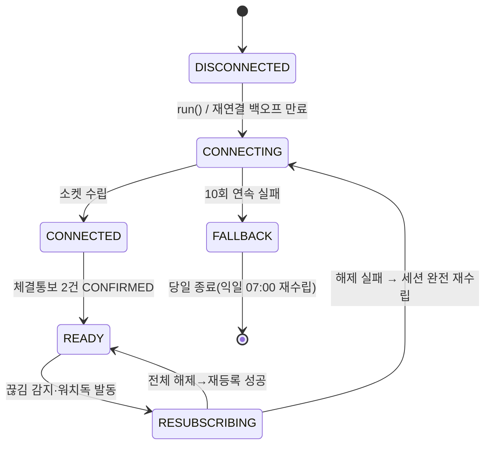
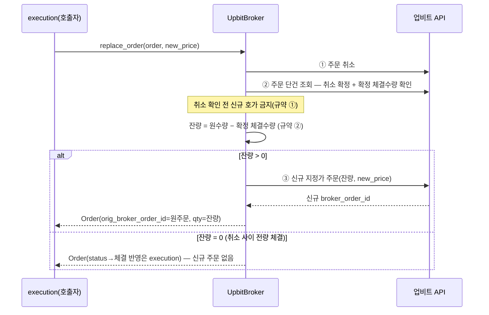

# 05. 브로커 게이트웨이

> **범위**: `src/omra/brokers/` 전체 — `BrokerGateway` ABC와 dry-run 분기, KIS 어댑터(REST·auth·tr_map·ratelimit·WS 세션/구독/디코더), 업비트 어댑터(REST·WS public/private), paper 체결 시뮬레이터, `TokenManager`, `RateLimiter`.
> **계획 정본**: 01 §3.2(BrokerGateway)·§5.1(TokenManager)·§5.2(RateLimiter)·§5.3(실시간 채널·세션 생명주기·재연결)·§5.4(API 예산)·§2.4(decoder 직접 호출), 05 §3.2·§3.3·§8(KIS·업비트 제약), 06 §1(계층·구독 예산 정본)·§3(관측 API 예산), 00 §5 원칙 2(dry-run 분기 격리).
> **선행 문서**: [02-domain-model.md](02-domain-model.md)(Order·Instrument·Fill·예외 계층), [01-system-architecture.md](01-system-architecture.md)(프로세스 토폴로지·기동 시퀀스).
> **이 문서가 소유하는 정의**: BrokerGateway ABC, KIS/업비트 클라이언트, TokenManager, RateLimiter, WS 세션·구독 예산 구현(브리프 §2.1 소유권 표).

---

## 1. 개요 — 설계 대상과 책임

### 1.1 책임

`brokers/`는 이 시스템에서 **외부 브로커(한국투자증권 KIS, 업비트)와 통신하는 유일한 패키지**다. 책임은 넷이다.

1. **주문·조회의 venue 중립 인터페이스** — 상위 레이어(`execution`·`data`·`tax`)는 `BrokerGateway` ABC만 보고, KIS의 TR ID·업비트의 REST 경로를 모른다.
2. **dry-run 분기의 유일한 위치** — 상위 레이어는 자신이 모의인지 절대 모른다(정본: 00 §5 원칙 2, 01 §3.2). 분기는 `BrokerGateway`의 주문 3메서드(`place_order`·`cancel_order`·`replace_order`) 내부뿐이며, `brokers/base.py` 밖에는 존재하지 않는다(§3.1, 검증 V5-01).
3. **브로커 제약의 흡수** — 토큰 24h/재발급 1분 1회(EGW00133), REST 유량(실전 20 rps 문서상 → 안전예산 15), WS 등록 41건, 업비트 그룹별 유량·120초 Idle Timeout을 어댑터 내부에서 처리하고 상위에 노출하지 않는다(정본: 05 §8.1).
4. **WS 이벤트의 발행** — decoder는 이벤트를 **발행만** 하고 판정하지 않는다(정본: 01 §2.3·§2.4). 감시 등급·가드 판정·주문 상태 전이는 각각 `surveillance`(11)·`realtime`(11)·`execution`(08)의 소유다.

### 1.2 실패 시 안전 방향 (전 절 공통)

| 실패 | 방향 | 근거 |
|---|---|---|
| WS 전면 장애 | **degrade only — HALT 유발 금지.** REST 폴백 전환, 최악의 경우 반응이 30초 늦어질 뿐 | 01 §5.3 불변식 1 |
| 판정 재료 부족(호가 미수신 등) | 예외를 위로 던지고 **주문을 만들지 않는다** | 00 §5 원칙 5 |
| 토큰 발급 불가(EGW00133 재시도 실패) | 주문 경로 예외(`TokenUnavailable`) + critical — 상태 전이는 `protections`(09)가 수행 | 01 §5.1 |
| 응답 유실·크래시 | 게이트웨이는 멱등성을 **스스로 보장하지 않는다** — persist-then-submit·고아 주문 매칭의 소유자는 `execution`([08-execution.md](08-execution.md) §3, 정본: 01 §3.2 주문 제출 프로토콜) | |

**WS는 진실원이 아니다.** 체결·잔고의 정본은 REST 대사(국내 15:40, 미국 마감+20분)이며, WS의 어떤 장애도 자산 정합성을 훼손하지 못한다(정본: 01 §5.3 불변식 1). **폴백 등가성** — WS 유무에 따른 판정 결과 차이는 지연뿐이어야 한다(불변식 2, 검증은 [16-testing-and-quality.md](16-testing-and-quality.md)가 03 §4.3 통합 테스트로 수거).

### 1.3 실행 모드 3종 (정본: 01 §3.2)

| 모드 | 실체 | 코드 경로 |
|---|---|---|
| `dry_run` | 로컬 시뮬 — 브로커 주문 서버 없음. `PaperExecutionEngine`이 체결 생성 | `place_order()` 분기점에서 시뮬레이터로 |
| `paper` | **KIS 모의투자 서버** — live 코드 경로 그대로. 도메인 URL·TR 매핑·rate limit 프로파일(2 rps)만 교체 | live와 100% 동일 |
| `live` | 실전 | — |

`env: paper` 스위치 하나로 도메인 URL·TR 매핑·rate limit 프로파일이 **함께** 바뀐다(정본: 01 §3.2). 개별 항목을 따로 바꿀 수 있는 설정 키는 만들지 않는다 — 반쯤 모의인 상태가 가장 위험하다. `live` 기동에는 `live_confirmation` 3중 일치가 선행한다(정본: 03 §5.1 — 기동 셀프체크는 [01-system-architecture.md](01-system-architecture.md) 소유).

### 1.4 이 문서가 소유하지 않는 것

| 주제 | 소유 |
|---|---|
| 주문 제출 프로토콜(persist-then-submit·고아 주문 매칭·`EXPIRED_UNKNOWN`)·재호가 3분기 정책·`order_lock` | [08-execution.md](08-execution.md) |
| pre-trade 체인(감시·세금·브레이커 게이트 호출 순서) | [09-safety-protections.md](09-safety-protections.md) |
| WS 이벤트의 소비 설계(가드 판정·감시 등급) | [11-realtime-and-surveillance.md](11-realtime-and-surveillance.md) |
| `orders`·`fills`·`broker_tokens` 물리 DDL | [03-data-and-persistence.md](03-data-and-persistence.md) |
| Order·Instrument·Fill·OrderStatus·예외 기저 계층 | [02-domain-model.md](02-domain-model.md) |
| 도메인 시세를 쓰는 TET Fetcher·quote fetcher | [06-market-data-and-calendar.md](06-market-data-and-calendar.md) |
| 시크릿 값 관리·만료 대장·`.env` 키 목록 | [04-configuration-and-secrets.md](04-configuration-and-secrets.md) |

---

## 2. 모듈 구조

```
src/omra/brokers/
├── base.py            # BrokerGateway ABC + ExecEnv + dry-run 분기 (§3)
├── errors.py          # BrokerError 분류 체계 (§3.6) — core.exceptions 하위
├── events.py          # venue 공통 WS 이벤트 dataclass (frozen) (§3.5)
├── masking.py         # 시크릿·계좌 마스킹 필터 — audit·카세트 공용 (§3.7)
├── paper.py           # PaperExecutionEngine (dry-run 체결 시뮬) (§4)
├── kis/
│   ├── client.py      # KisBroker — REST 어댑터 (§7.2~7.4)
│   ├── auth.py        # TokenManager: 접근토큰·approval_key (§5)
│   ├── ratelimit.py   # PriorityTokenBucket (§6)
│   ├── tr_map.py      # tr_ids.kis.yaml 로더 + TrSpec (§7.1)
│   └── ws/
│       ├── session.py   # KisWsSession — 생명주기·재연결·워치독·PINGPONG (§7.5)
│       ├── registry.py  # SubscriptionRegistry — 예산 41/38/9·등록 상태머신 (§7.6)
│       ├── decoder.py   # 프레임 파싱·AES256-CBC·이벤트 방출 (§7.7)
│       └── events.py    # KIS 이벤트 타입 (import 계약 경로: brokers.kis.ws.events)
└── upbit/
    ├── client.py      # UpbitBroker — REST 어댑터 (§8.1, §8.3) + 점검 감지 스트릭 (§8.5, 06 §10)
    ├── auth.py        # UpbitAuth — 요청 서명 (§8.1)
    ├── ratelimit.py   # GroupRateLimiter + remaining-req 헤더 반영 (§8.2)
    └── ws/
        ├── public.py    # ticker(BTC·ETH) 세션 (§8.4)
        ├── private.py   # myOrder·myAsset 세션 (§8.4)
        ├── decoder.py   # JSON 파싱·이벤트 방출 (§8.4)
        └── events.py    # 업비트 이벤트 타입 (계약 경로: brokers.upbit.ws.events)
```

디렉터리 구성은 01 §2 저장소 구조 정본(`base.py`·`paper.py`·`kis/{client,auth,ratelimit,tr_map}`·`kis/ws/{session,registry,decoder,events}`·`upbit/{client,auth,ratelimit,ws/(public·private)}`)을 그대로 따르되, 계획에 없는 `errors.py`·`events.py`·`masking.py`(패키지 루트)와 `upbit/ws/{decoder,events}.py`를 추가한다 — 여백을 채우는 구체화이며 계획의 어떤 모듈도 옮기거나 없애지 않는다.

**import 규율** (정본: 01 §2.2 — `[forbidden]` 계약):

- `brokers → engine · 전략` **금지** — 브로커는 전략을 모른다.
- `surveillance → brokers.kis.ws.events · brokers.upbit.*.events` 허용(읽기 전용 이벤트), `surveillance → brokers.*.client` 금지. 따라서 **`ws/events.py`는 `client.py`·`auth.py`를 import하지 않는다** — 이벤트 타입 모듈이 클라이언트를 끌고 들어가면 계약이 형해화된다.
- `realtime → brokers.*.ws.events` 허용, `brokers.*.client` 금지 — 동일 규칙 적용.
- 01 §2.2의 계약은 `[forbidden]`(default-allow)이므로 `brokers → engine · 전략` 외에는 기계 강제가 없다. 본 문서는 그 위에 **자기 제약**을 얹는다 — `brokers`가 import하는 것은 `core`(모델·예외·틱사이즈·Clock)·`audit`·`config`로 한정하고 **`surveillance`·`realtime`·`execution`을 import하지 않는다**. decoder의 "직접 호출"은 §7.7의 핸들러 주입으로 구현한다(DD-05-1).

> **[DD-05-1] decoder의 상위 핸들러 결합은 주입(injection)으로 구현한다**
> - 결정: 01 §2.4의 "decoder가 가드 함수를 직접 호출"은 **기동 시 조립 루트(composition root, 01-design 소유)가 등록한 콜백을 decoder가 동기 직접 호출**하는 것으로 구현한다. `brokers`는 `surveillance`·`realtime`을 import하지 않는다.
> - 근거: 01 §2.4의 의도는 "EventBus 간접층 없이, Fill만 큐"라는 호출 형태이지 import 방향이 아니다. `brokers`가 상위 레이어를 import하면 "브로커는 전략을 모른다"(01 §2.2)와 어긋나고, 카세트 재생 테스트에서 상위 전체가 끌려 들어온다.
> - 계획 문서와의 관계: 충돌 없음 — 직접 호출(비동기 큐 미경유) 의미는 보존되며, 01 §2.4의 예외 격리 규칙(3회 연속 실패 시 가드 비활성)도 호출부(decoder 래퍼)에서 그대로 구현한다.

---

## 3. BrokerGateway ABC와 dry-run 분기

### 3.1 ABC 전체 시그니처

```python
# brokers/base.py
from __future__ import annotations
from abc import ABC, abstractmethod
from collections.abc import AsyncIterator, Sequence
from datetime import date
from decimal import Decimal
from enum import StrEnum

from omra.core.models import Instrument, Order          # 정의 정본: 02-domain-model.md
from omra.brokers.events import (BalanceSnapshot, ExecutionEvent,
                                 PositionSnapshot, QuoteSnapshot, OhlcvBar)


class ExecEnv(StrEnum):
    DRY_RUN = "dry_run"     # 로컬 시뮬 — 브로커 주문 서버 없음
    PAPER   = "paper"       # KIS 모의투자 도메인 — live 경로 그대로
    LIVE    = "live"


class BrokerGateway(ABC):
    """상위 레이어는 dry-run 여부를 절대 모른다. (정본: 01 §3.2)

    - _validate()는 '브로커 API 규격' 검증만 한다 — 호가단위·최소수량·필수 필드.
      감시·세금·브레이커·상태 게이트를 호출하지 않는다(pre-trade 체인 소유자는 execution, 03 §1.6).
    - dry-run 분기는 주문 3메서드(place_order / cancel_order / replace_order)의
      if self.dry_run 뿐이며, 이 파일(brokers/base.py) 밖에는 존재하지 않는다(V5-01).
      셋 다 분기를 가져야 한다 — 하나라도 빠지면 dry_run 게이트웨이가 그 경로에서
      실서버 REST를 호출한다(재호가는 08 §8이 env와 무관하게 부르는 경로다).
    """
    venue: str                          # "kis" | "upbit"
    env: ExecEnv

    def __init__(self, env: ExecEnv, paper_engine: "PaperExecutionEngine | None") -> None:
        self.env = env
        self.dry_run = (env is ExecEnv.DRY_RUN)
        if self.dry_run and paper_engine is None:
            raise ValueError("dry_run gateway requires a PaperExecutionEngine")
        self._paper = paper_engine

    # ── 주문 ────────────────────────────────────────────────
    async def place_order(self, order: Order) -> Order:
        self._validate(order)
        if self.dry_run:
            return await self._paper.simulate_submit(order)      # ← 유일한 분기점
        return await self._submit_live(order)

    @abstractmethod
    async def _submit_live(self, order: Order) -> Order: ...

    async def cancel_order(self, order: Order) -> Order:
        if self.dry_run:
            return await self._paper.simulate_cancel(order)
        return await self._cancel_live(order)

    @abstractmethod
    async def _cancel_live(self, order: Order) -> Order: ...

    async def replace_order(self, order: Order, new_limit_price: Decimal) -> Order:
        """재호가의 유일한 논리 단위. venue별 실체가 정반대이므로 추상으로 흡수한다.
        (규약 전문·근거의 정본: 01 §3.2. §3.3에서 구현 규약을 전이표로 구체화)"""
        if self.dry_run:
            return await self._paper.simulate_replace(order, new_limit_price)
        return await self._replace_live(order, new_limit_price)

    @abstractmethod
    async def _replace_live(self, order: Order, new_limit_price: Decimal) -> Order: ...

    # ── 조회 ────────────────────────────────────────────────
    @abstractmethod
    async def get_balance(self, account_id: str) -> BalanceSnapshot: ...
    @abstractmethod
    async def get_positions(self, account_id: str) -> list[PositionSnapshot]: ...
    @abstractmethod
    async def get_quote(self, instruments: Sequence[Instrument]) -> list[QuoteSnapshot]: ...
    @abstractmethod
    async def get_ohlcv(self, instrument: Instrument,
                        start: date, end: date) -> list[OhlcvBar]: ...
    @abstractmethod
    async def get_order(self, order: Order) -> Order:
        """단건 주문 상태 재조회 — replace 규약 ③·08 고아 주문 매칭의 공통 입력."""
    @abstractmethod
    async def list_executions(self, account_id: str, trade_date: date) -> list[ExecutionEvent]:
        """일자 체결내역 — EOD 대사(08)·P8 자가치유 재조회(09)의 입력."""

    # ── 실시간 ──────────────────────────────────────────────
    @abstractmethod
    def stream_executions(self) -> AsyncIterator[ExecutionEvent]:
        """체결통보 스트림 — WS decoder의 Fill 큐를 async iterator로 노출 (§3.5)."""

    # ── 검증 ────────────────────────────────────────────────
    def _validate(self, order: Order) -> None: ...   # §3.4
```

> **[DD-05-2] `get_order`·`list_executions`를 추상 메서드로 추가**
> - 결정: 01 §3.2가 열거한 추상 메서드(get_balance/get_positions/get_quote/get_ohlcv/cancel_order/stream_executions)에 `get_order`(단건 재조회)·`list_executions`(일자 체결내역)를 추가한다.
> - 근거: replace 규약 ③("어느 단계에서 실패해도 원주문 상태를 REST로 재조회해 확정")과 08의 고아 주문 튜플 매칭·EOD 대사·P8 자가치유 3회 재조회(03 §1.3)가 전부 이 두 조회를 요구한다. ABC에 없으면 소비자가 venue별 클라이언트를 직접 잡게 되어 추상화가 깨진다.
> - 계획 문서와의 관계: 충돌 없음 — 01 §3.2 목록은 "…를 추상 메서드로 정의"라는 최소 열거이며 완전 열거가 아니다.

주문의 DB 상태 전이(`SUBMITTING → PENDING → …`)와 커밋 순서는 **게이트웨이가 수행하지 않는다.** `place_order()`는 브로커 응답의 `broker_order_id`·`broker_order_org_no`를 채운 `Order` 사본을 반환할 뿐이고, persist-then-submit 순서와 상태 기록은 `execution`이 소유한다(정본: 01 §3.2 주문 제출 프로토콜 1항, 설계: [08-execution.md](08-execution.md) §3).

### 3.2 게이트웨이 인스턴스 구성

슬리브는 {`kis_domestic`, `kis_overseas`, `upbit`} 3개(정본: 00 §5.1)이지만 **게이트웨이 인스턴스는 2개**다 — KIS 국내·해외는 단일 인증·단일 WS 세션·공용 REST 예산을 쓰므로(정본: 05 §3.2 "국내·해외 세션 분리되지 않음") `KisBroker` 하나가 두 슬리브를 담당한다. 슬리브 → 게이트웨이 매핑과 `AccountMode` 분기는 `execution/router.py`가 소유한다([08-execution.md](08-execution.md) — 게이트웨이는 자기 계좌가 절세계좌인지 모른다).

```python
class AccountResolver(Protocol):
    """내부 account_id → 브로커 식별자. 원본 계좌번호는 이 경계 밖으로 나가지 않는다(01 §6.3 마스킹)."""
    def kis_account(self, account_id: str) -> KisAccountRef: ...    # CANO + ACNT_PRDT_CD

@dataclass(frozen=True)
class KisAccountRef:
    cano: str                  # 계좌번호 — 로그·감사로그에는 masking.py 통과 후에만
    acnt_prdt_cd: str          # "22"(개인연금) | "29"(퇴직연금) — 공식 레포 1급 지원 확인(05 §3.2)
                               # 일반위탁 코드·ISA 코드는 [확인 필요 — 공식 예제 레포 kis_devlp.yaml,
                               #   ISA는 SP-C4]. 코드를 상수로 하드코딩하지 않고 config에서 읽는다(04)
```

`ACNT_PRDT_CD` 22/29는 공식 레포가 1급 지원함이 확인되었고(정본: 05 §3.2), **ISA 상품코드는 미확인**이다 — SP-C4 결과가 나오기 전까지 `AccountResolver`는 ISA 계좌에 대해 `KisAccountRef`를 반환하되 주문 TR 지원 여부는 라우터의 `AccountMode`가 흡수한다(분기 A/B 양쪽에서 이 문서의 설계는 동일하다 — 잔고·체결 조회는 E3 A0로 양쪽 공통이고, 달라지는 것은 router가 주문을 이 게이트웨이로 보내는가뿐이다).

### 3.3 `replace_order` 규약 — venue 공통 계약 (정본: 01 §3.2)

| # | 규약 | 위반 시 |
|---|---|---|
| ① | **취소 확인 전 신규 호가 금지** | 이중 노출(원주문+신주문 동시 활성) |
| ② | 취소~재주문 사이 부분체결 확정 시 재주문 수량 = **원수량 − 확정 체결수량** | 초과 주문 — T0가 막으려던 위험의 재발 |
| ③ | 어느 단계에서 실패해도 **원주문 상태를 REST로 재조회해 확정한 뒤 종료** | 상태 미상(`EXPIRED_UNKNOWN`) 양산 |
| 계수 | `replace_order` 1회 = 재호가 1회. 업비트의 취소+신규는 P2(일일 주문 건수)에 **가산하지 않는다** | 정본: 03 §1.2 P2 계수 정의 |

재호가를 **언제** 할지(5분×3회, 3분기 판정)는 `execution`의 정책이다(정본: 02 §4.1.1, 설계: 08). 이 문서는 **한 번의 replace를 원자적 논리 단위로 완수하는 방법**만 소유한다. venue별 구현은 §7.4(KIS — 정정 TR 1회)·§8.3(업비트 — 3단계).

### 3.4 `_validate` — 브로커 규격 검증만

```python
def _validate(self, order: Order) -> None:
    """검증 실패는 OrderValidationError(제출 전 거부 — P9 카운트 비대상, §3.6).
    호출하지 않는 것: surveillance.gate / tax / protections / 상태머신 (03 §1.6 pre-trade는 execution 소유)."""
    # 1. 필수 필드: LIMIT류(order.limit_price is not None), qty > 0
    # 2. lot_step 정합: order.qty % instrument.lot_step == 0   (정수 주식=1, 크립토=1e-8 — 01 §3.1)
    # 3. 호가단위 정합: limit_price가 instrument.tick_rule 격자 위에 있는가
    #    (틱사이즈 규칙 함수의 정본: 02-domain-model.md — krx_etf_5 / krx7 / usd_penny / upbit)
    # 4. venue 지원 주문유형: SUPPORTED_ORDER_TYPES[venue]에 order.order_type이 있는가
    #    KIS 국내: LIMIT (KRX 정규장 단순 주문만 — 00 §6.3 NXT/SOR 배제)
    #    KIS 미국: LIMIT + {LOC, LOO, MOO, MOC}  ← SP-C3 실증 전까지 config로 게이트
    #              (05 §3.2 '재확인 필요' — 미지원 확정 시 집합에서 제거, 02 §4.5 연쇄는 08·15가 처리)
    #    업비트  : LIMIT — 크립토 집행은 marketable limit이며 시스템은 시장가 주문을 생성하지 않는다
    #              (02 §7). 업비트의 MARKET 주문 지원 여부·코드는
    #              [확인 필요 — 업비트 공식 문서, M7 카세트]이며 확인돼도 집합에 넣지 않는다
    # 5. Blue Ocean 차단: KIS 해외 tr_key/심볼이 'R' 접두이면 무조건 거부 (05 §3.2 — 코드 레벨 금지)
```

검증은 **거부만** 한다 — 수량·가격을 고쳐서 통과시키지 않는다(반올림·정규화는 주문 생성 시점에 `execution`이 core 함수로 수행하며, 게이트웨이 도달 시점에 이미 격자 위여야 한다. 어긋나 있으면 그것은 버그이고, 고치면 버그가 은폐된다).

### 3.5 이벤트 타입과 `stream_executions`

```python
# brokers/events.py — venue 공통. frozen dataclass, 판정 없음(값 운반만)
@dataclass(frozen=True, slots=True)
class BrokerEvent:
    venue: str                     # "kis" | "upbit"
    source_event_id: str           # ULID — 감사로그 연결고리 (01 §6.3)
    received_at: datetime          # 수신 시각 (Clock 주입 — 02)
    raw_kind: str                  # KIS tr_id 또는 업비트 type 문자열

@dataclass(frozen=True, slots=True)
class ExecutionEvent(BrokerEvent):      # 체결통보 / 체결내역 조회의 공통 형태
    account_ref: str                    # 내부 account_id (원계좌번호 아님)
    broker_order_id: str
    broker_exec_id: str | None          # fills.broker_exec_id UNIQUE 중복 방지 키 (01 §1.3)
    symbol: str
    side: Literal["buy", "sell"]
    exec_qty: Decimal
    exec_price: Decimal
    exec_at: datetime
    is_cancel_or_reject: bool           # 거부·취소 통보도 같은 스트림으로 온다

@dataclass(frozen=True, slots=True)
class BookTop(BrokerEvent):        # 최우선 호가
    symbol: str; bid: Decimal; ask: Decimal; bid_size: Decimal; ask_size: Decimal

@dataclass(frozen=True, slots=True)
class QuoteTick(BrokerEvent):      # 체결가 틱
    symbol: str; price: Decimal; prev_close: Decimal | None

@dataclass(frozen=True, slots=True)
class NavTick(BrokerEvent):        # ETF 실시간 NAV (H0STNAV0, T1 조건부)
    symbol: str; nav: Decimal

@dataclass(frozen=True, slots=True)
class MarketStatus(BrokerEvent):   # 장운영·VI — 해석 권한은 surveillance 단독 (01 §2.3)
    symbol: str | None
    raw_fields: Mapping[str, str]  # TRHT_YN·VI_CLS_CODE 등 원문 필드 그대로 — 판정하지 않는다

@dataclass(frozen=True, slots=True)
class BalanceSnapshot(BrokerEvent):    # 업비트 myAsset / REST 잔고 공통 (정합성 — 정본은 REST 대사)
    account_ref: str; lines: tuple[BalanceLine, ...]

@dataclass(frozen=True, slots=True)
class StreamHealth(BrokerEvent):   # 세션 상태 변화 — realtime.fallback 소비 (06 §2.2)
    socket: str                    # "kis" | "upbit_public" | "upbit_private"
    state: Literal["connected", "degraded", "fallback", "reestablished"]
    detail: str
```

`Fill`(도메인 모델, 02 소유)과 `ExecutionEvent`(전송 이벤트)는 다르다 — decoder는 내부 `order_id`를 모르므로 `ExecutionEvent`를 발행하고, `execution`의 OrderTracker가 `broker_order_id`로 내부 주문에 매칭해 `Fill`을 만든다(매칭 규칙은 08 소유).

**Fill 큐는 게이트웨이가 소유한다**(DD-05-3): decoder가 `asyncio.Queue[ExecutionEvent]`(무제한 — drop 금지, 정본: 01 §2.4)에 넣고, `stream_executions()`가 그 큐를 async iterator로 노출한다. 시세류 이벤트는 큐 없이 핸들러 직접 호출이다(§7.7). dry-run에서는 `PaperExecutionEngine`이 같은 큐에 넣는다 — **상위 소비 코드가 세 모드에서 동일**해진다.

> **[DD-05-3] 체결통보 큐를 게이트웨이 인스턴스 소유로 두고 `stream_executions()`로 단일화**
> - 결정: 01 §2.4의 `fill_queue`는 게이트웨이(KIS 1개·업비트 1개)가 생성·소유하고, 소비자는 `stream_executions()` async iterator로만 접근한다. dry-run의 paper 엔진도 같은 큐에 적재한다.
> - 근거: 큐가 모듈 전역이면 테스트 격리·재수립 시 재바인딩이 어렵고, 게이트웨이 소유면 "체결통보 소비 코드가 dry_run/paper/live에서 동일"이라는 freqtrade 채택 명분(00 §4)이 그대로 실현된다.
> - 계획 문서와의 관계: 충돌 없음 — 01 §2.4는 큐의 존재·유일성만 정하고 소유 위치는 정하지 않았다.

### 3.6 오류 분류 체계 (`brokers/errors.py`)

예외 기저(`OmraError` 등)는 02 소유다. 이 모듈은 브로커 어댑터 전용 하위 계층과 **P9 분류 태그**를 정의한다 — 카운트·발동의 소유자는 `protections`(09)이고, 어댑터는 **분류만** 제공한다(정본: 03 §1.2 P9-order/P9-quote, §1.4).

```python
class P9Class(StrEnum):
    ORDER = "order"      # 주문·정정·취소 TR 오류/거부 → P9-order 카운트 대상 (venue별)
    QUOTE = "quote"      # 시세·잔고·조회 TR 오류 → P9-quote 카운트 대상 (provider별)
    NONE  = "none"       # 카운트 제외 (아래 제외 사유)

class BrokerError(OmraError):
    venue: str                 # P9-order 집계 단위 — "kis" | "upbit"
    provider: str              # P9-quote 집계 단위 — 조회 경로의 출처 이름(기본값 = venue).
                               #   09 §4.8 `on_broker_error`가 QUOTE 분류에서 이 필드를 스코프 키로 읽는다
                               #   (요청 출처: 09-safety-protections.md §4.8 — 필드 소유는 본 문서)
    p9_class: P9Class
    retryable: bool

class OrderValidationError(BrokerError):   # _validate 거부 — 제출 전이므로 P9Class.NONE
class BrokerAuthError(BrokerError):        # 401 등 — TokenManager가 1회 흡수 후 재발생 시 상위로.
                                           #   p9_class=NONE (03 §1.4 공통 제외 ③)
class TokenUnavailable(BrokerError):       # EGW00133 재시도 실패 — 주문 정지 + critical (01 §5.1).
                                           #   p9_class=NONE (03 §1.4 공통 제외 ③)
class RateLimitedError(BrokerError):       # EGW00201 / 업비트 429 — retryable=True, 백오프는 §6.
                                           #   p9_class는 TR 성격을 따른다(아래 제외 규칙 참조)
class OrderRejected(BrokerError):          # 사유코드 보존. 기본 p9_class=ORDER
class TransientNetworkError(BrokerError):  # 타임아웃·연결 실패 — retryable=True.
                                           #   p9_class=NONE (03 §1.4 공통 제외 ④)
class MaintenanceSuspected(BrokerError):   # 점검성 응답(503·5xx·점검 사유코드) — P9Class.NONE
                                           #   (03 §1.4 공통 제외 ②, 03 §4.3 F19)
class WsSubscriptionRejected(BrokerError): # 구독 등록 거부 — degrade only
class ResponseLostError(BrokerError):      # 제출 후 응답 유실 — 08 고아 주문 경로의 트리거
```

**P9 카운트 제외 규칙** — 제외 사유의 **완전 목록은 03 §1.4**이며, 어댑터는 그 4개 사유에 정확히 대응하는 태그만 붙인다(목록을 늘리지 않는다):

| 03 §1.4 제외 사유 | 어댑터 분류 |
|---|---|
| ① VI 발동·장중 일시정지 사유코드 | `OrderRejected(p9_class=NONE)` — 사유코드 매핑 테이블은 M4 실측으로 채운다(정본: 02 §4.1.1, 03 §1.4). 미매핑 사유코드는 **ORDER로 보수 분류**(제외를 기본값으로 두면 진짜 오류가 침묵한다) |
| ② 거래소·브로커 점검성 응답(503·점검 사유코드)·5xx | `MaintenanceSuspected(p9_class=NONE)` — 업비트 경로의 연속 실패 계수는 §8.5 |
| ③ 인증·토큰 계열(EGW00133, 401) | `BrokerAuthError` / `TokenUnavailable` → `p9_class=NONE` |
| ④ 네트워크 타임아웃·연결 실패 | `TransientNetworkError(p9_class=NONE)` |

- **레이트리밋(EGW00201 / 업비트 429)은 제외 목록에 없다** — 03 §1.4의 4개 사유 어디에도 해당하지 않으므로 `p9_class`를 TR 성격(`spec.bucket`)대로 ORDER/QUOTE로 매긴다. 자체 백오프로 흡수하는 것과 카운트 제외는 별개다. (본 설계자의 이견 — "예산 문제이지 오류 폭주가 아니므로 제외가 맞다" — 은 §11 이견 기록에 남긴다.)
- ②③④는 03 §1.4에 따라 "연속 실패 시 해당 슬리브 당일 집행 보류 + warning"으로 이어진다. **연속 계수의 소유자는 어댑터가 아니다**(업비트 점검 경로만 예외 — 06 §10이 `brokers/upbit/client.py`를 명시적 소유 모듈로 지정, §8.5).

#### P9 연속 카운터의 통지 경로 — 성공·실패의 발생원 (요청 출처: [09-safety-protections.md](09-safety-protections.md) §4.8)

09 §4.8은 카운트·발동을 소유하면서 "연속 카운터는 성공 응답 1회로 0이 된다"와 `SafetyFacade.on_broker_success(venue|provider)`만 정의하고 **성공 관측의 발생원**을 비워 두었다. 발생원은 브로커 어댑터의 **REST 단일 호출 경로**다 — 성공/실패를 같은 지점에서 대칭으로 통지한다.

```python
# brokers/errors.py — 조립 루트가 protections.SafetyFacade의 두 메서드를 바인딩한다(DD-05-1과 동일 패턴)
class P9Sink(Protocol):
    def on_broker_success(self, scope_key: str, p9_class: P9Class) -> None: ...
    def on_broker_error(self, err: BrokerError) -> None: ...
```

- **호출 지점은 둘뿐**: `KisRestClient.call()`의 성공 반환 직전/오류 매핑 직후(§7.2 단계 7), `UpbitBroker`의 REST 호출 동일 지점(§8.2). WS 이벤트·`PaperExecutionEngine`은 통지원이 아니다 — P9는 TR 오류 카운터다(정본: 03 §1.2).
- **스코프 키는 실패했을 때 붙었을 값과 정확히 대칭**: `spec.bucket ∈ {ORDER, FILL}` → `(venue, P9Class.ORDER)`, `{QUOTE, BATCH}` → `(provider, P9Class.QUOTE)`. 비대칭이면 카운터가 영원히 리셋되지 않는 키가 생긴다.
- `p9_class=NONE` 실패도 `on_broker_error(err)`로 그대로 넘긴다 — **어댑터는 필터링하지 않고 09가 첫 줄에서 무시한다**(09 §4.8). 제외 판정의 소유권이 한 곳에 남는다. 단 NONE 실패에 `on_broker_success`를 호출하지는 않는다(성공이 아니므로 카운터를 리셋하면 안 된다).

> **[DD-05-11] P9 통지의 발생원을 어댑터 REST 경로 1지점으로 고정하고 `P9Sink` 주입으로 배선**
> - 결정: `on_broker_success`/`on_broker_error` 통지는 `KisRestClient.call()`·업비트 REST 경로에서만 발생하며, `brokers`는 `protections`를 import하지 않고 조립 루트가 주입한 `P9Sink`를 호출한다. 상위(`execution`·`data`)는 같은 사건을 **재통지하지 않는다**.
> - 근거: 요청 출처는 09 §4.8("성공 관측의 발생원 미정"). 통지원이 여러 층에 흩어지면 같은 호출이 2회 계상되어 임계 5가 실질 2~3이 된다. REST 파이프라인은 모든 TR이 반드시 지나는 유일한 지점이므로(§7.2) 누락·중복이 동시에 없다.
> - 계획 문서와의 관계: 충돌 없음 — 03 §1.2·§1.4는 카운터의 임계·제외만 정하고 관측 지점을 비워 두었다. `brokers → protections` import 금지(§2 자기 제약)도 유지된다.

**이중 계상 주의**: `data`(TET) 경유 조회는 06 §4.3 `ProviderHealth.record_success/record_failure`가 P9-quote 입력을 별도 축으로 소유한다. 어댑터 통지(provider 키)와 fetcher 통지(fetcher 이름 키)는 **키가 다르므로 같은 카운터를 두 번 올리지는 않지만**, 하나의 KIS 장애가 두 축에서 각각 임계에 도달할 수 있다. 두 축의 통합 여부는 09·06 조율 항목(§11.1 C9)이다.

### 3.7 마스킹 필터 (`brokers/masking.py`)

마스킹 대상: `CANO`·`ACNT_PRDT_CD`·`HTS_ID`·`appkey`·`appsecret`·접근토큰(정본: 01 §6.3 열거) **+ `approval_key`·업비트 access/secret**(본 문서가 추가 — 01 §6.3의 열거는 KIS 주문 원문 기준이며, 동일 위험 등급의 자격증명이 마스킹 밖에 남는 것을 허용할 이유가 없다). **감사로그(주문 요청/응답 원문 저장)와 카세트 녹화가 같은 코드를 재사용한다** — 두 벌을 만들면 한쪽만 갱신되는 순간 실계좌번호가 로그에 남는다(정본: 01 §6.3).

```python
def mask_payload(payload: Mapping[str, Any], *, direction: Literal["req", "res"]) -> dict[str, Any]:
    """키 이름 기반(위 목록 + 대소문자 변형) + 값 패턴 기반(등록된 시크릿 실값 전수 치환) 2중 마스킹.
    계좌 식별은 내부 account_id로 대체한다."""
```

> **[DD-05-4] 마스킹 필터를 `brokers/masking.py` 단일 모듈로 배치**
> - 결정: 마스킹 필드 지식은 브로커 도메인이므로 `brokers/masking.py`에 두고, `audit`(감사로거)와 테스트 카세트 인프라(16)가 이것을 import한다.
> - 근거: 01 §6.3이 "같은 코드 재사용"을 요구하며 위치는 미정. 필드 목록(CANO 등)이 KIS·업비트 스펙에 종속되므로 브로커 패키지가 자연 소유자다.
> - 계획 문서와의 관계: 충돌 없음 — `audit → brokers.masking` 간선은 01 §2.2 금지 목록에 없다(default-allow).

### 3.8 검증 항목 (§3)

| ID | 항목 | 방법 |
|---|---|---|
| V5-01 | dry-run 분기 유일성 — `if self.dry_run` 텍스트가 `brokers/base.py` 밖에 존재하지 않는다 | 아키텍처 테스트(grep 기반) |
| V5-01b | dry-run 분기 **완전성** — `dry_run` 게이트웨이에서 `place_order`·`cancel_order`·`replace_order`를 각각 호출했을 때 브로커 REST 호출 0건(`_submit_live`·`_cancel_live`·`_replace_live` 미도달). grep 기반 V5-01은 "분기가 파일 밖에 없음"만 보므로 **누락**을 잡지 못한다 — 이 통합 검증이 그 구멍을 막는다 | 통합 테스트(HTTP 트랜스포트 스텁) |
| V5-02 | `_validate`가 감시·세금·브레이커 모듈을 호출하지 않는다 | import/호출 그래프 검사 |
| V5-03 | `ws/events.py`가 `client.py`·`auth.py`를 import하지 않는다 | import-linter 보조 테스트 |
| V5-04 | 미매핑 주문 거부 사유코드가 `P9Class.ORDER`로 분류되고(보수 기본값), 제외 태그가 03 §1.4의 4사유에만 붙는다 — EGW00201/429는 `NONE`이 아니다 | 단위 |
| V5-05 | 마스킹 필터 왕복 — 마스킹 후 payload에 등록 시크릿 실값·계좌번호 부재 | property 테스트 |
| V5-06 | Blue Ocean `R*` 심볼 주문·구독이 `_validate`/registry에서 거부된다 | 단위 |
| V5-41 | P9 통지 대칭 — ORDER 버킷 TR 성공 시 `on_broker_success(venue, ORDER)` 정확히 1회, QUOTE/BATCH는 `(provider, QUOTE)`. 상위 레이어의 재통지 0건 | 단위 + 호출 그래프 검사 |

---

## 4. paper 체결 시뮬레이터 (`brokers/paper.py`)

### 4.1 위치와 원칙

`dry_run` 모드에서 `place_order` 분기점 아래에 붙는 **유일한 시뮬 구현**이다(M3 DryRunBroker의 실체 — "분기는 이 클래스 선택 하나뿐", 정본: 04 §2 M3). 원칙(정본: 01 §3.2):

- **보수적 체결**: 지정가는 반대편 최우선호가가 내 가격에 도달할 때만 체결. 낙관 편향이 있는 지점은 코드 주석·본 절에 명시적으로 문서화한다(freqtrade 교훈, 00 §4).
- **수수료·세금 반영**: 비용 파라미터는 02 §8.1 비용 모델 기본값을 config에서 읽는다 — 수수료 국내 0.015% / 미국 0.09%, 국내 개별주 매도 거래세 0.15%(ETF 면제), 업비트 수수료 0.05%(정본: 02 §8.1).
- 체결 결과는 §3.5의 큐로 `ExecutionEvent`를 방출한다 — 상위 소비 경로가 실전과 동일.

### 4.2 시그니처와 체결 규칙

```python
class QuoteSource(Protocol):
    """paper 엔진의 시세 입력. dry-run 라이브 루프에서는 data/의 quote fetcher(read-only REST)를
    주입하고, 테스트에서는 고정 스냅샷을 주입한다. paper.py가 브로커 client를 직접 잡지 않는다."""
    async def best_bid_ask(self, instrument: Instrument) -> BookTop | None: ...
    async def last_close(self, instrument: Instrument) -> Decimal | None: ...

class PaperExecutionEngine:
    def __init__(self, quotes: QuoteSource, costs: CostParams,
                 exec_queue: asyncio.Queue[ExecutionEvent], clock: Clock) -> None: ...

    async def simulate_submit(self, order: Order) -> Order: ...
    async def simulate_cancel(self, order: Order) -> Order: ...
    async def simulate_replace(self, order: Order, new_limit_price: Decimal) -> Order: ...
    async def poll_open_orders(self) -> None:
        """주기 재평가 훅 — 스케줄 잡이 아니라 게이트웨이 get_quote 호출 시 함께 평가한다."""
```

체결 규칙(순서 있는 판정):

1. **LIMIT 매수**: `ask ≤ limit_price`가 된 시점에 체결. 체결가는 **`limit_price`**(호가 개선을 가정하지 않는다 — 보수 방향).
2. **LIMIT 매도**: `bid ≥ limit_price` 대칭.
3. **MARKET**: 반대편 최우선호가로 즉시 체결. **현 설계에서 이 분기는 도달하지 않는다** — `_validate`의 `SUPPORTED_ORDER_TYPES`가 어느 venue에서도 MARKET을 허용하지 않기 때문이다(§3.4). 백테스트·회귀용 잔여 경로로만 둔다.
4. **LOC/LOO/MOO/MOC**(KIS 미국): 해당 세션 경계 가격(종가/시가)이 한도 조건을 만족할 때 그 가격으로 체결. 세션 경계 가격은 `QuoteSource.last_close` 경유.
5. 미체결 주문은 `simulate_cancel` 또는 당일 창 종료 시 소멸 — 이월 없음(02 §4.1과 정합).
6. **`simulate_replace`**: §3.3 규약의 시뮬 대응 — ① 원주문을 `simulate_cancel`로 확정 취소하고 ② 그 시점의 **미체결 잔량**으로 ③ `new_limit_price` 신규 주문을 `simulate_submit`한다. 취소 확정 전에 체결된 수량은 원주문에 귀속되므로 재호가 대상에서 빠진다(부분체결 이중계상 방지 — §3.3 규약 ③). `reprice_count`는 호출자(08 §8)가 증가시킨다.

> **[DD-05-5] paper 체결의 단순화 3건과 편향 방향 문서화**
> - 결정: ① 부분체결을 시뮬하지 않는다(전량 or 0). ② 호가 잔량(depth) 소진을 시뮬하지 않는다. ③ 체결 시각은 조건 충족을 관측한 폴링 시각으로 한다.
> - 근거: 개인 규모에서 마켓 임팩트 ≈ 0(02 §4.1.2)이므로 잔량 시뮬의 정보가치가 없고, 부분체결 시뮬은 모의투자(`paper` env)가 실서버로 검증한다. 편향 방향: ①은 **낙관**(실전은 부분체결로 재호가 수량이 줄 수 있다), 체결가=limit은 **보수**. 시뮬-실전 괴리는 M4부터 건별 기록으로 계량한다(04 §2 M4).
> - 계획 문서와의 관계: 충돌 없음 — 01 §3.2는 "호가창 기반 보수적 체결 + 낙관 편향 문서화"만 요구하며 구체 규칙은 여백.

### 4.3 검증 항목 (§4)

| ID | 항목 | 방법 |
|---|---|---|
| V5-07 | 지정가 매수가 `ask > limit` 동안 절대 체결되지 않는다 | property 테스트 |
| V5-08 | 체결 비용 반영 — ETF 매도에 거래세 0원, 개별주 매도에 0.15% | 단위 |
| V5-09 | paper 체결이 `stream_executions()`로 흘러 실전 소비 코드와 동일 경로를 탄다 | 통합(dry-run 루프) |
| V5-10 | 미체결 주문이 창 종료 시 소멸하고 이월되지 않는다 | 단위 |

---

## 5. TokenManager (`brokers/kis/auth.py`)

### 5.1 관리 대상과 저장

| 자격 | 유효기간 | 갱신 정책 |
|---|---|---|
| 접근토큰 | 24h, **재발급 1분 1회 제한(EGW00133)** | 만료 30분 전 백그라운드 선제 갱신, 07:00 플래너 1차 보장 (정본: 01 §5.1, 05 §3.2) |
| WS `approval_key` | **유효기간 미확인**(M1 W7 실측) | 07:00 플래너에서 만료 여부와 무관하게 **무조건 선제 재발급 + T0 세션 재수립 동반** (정본: 01 §5.1) |
| 앱키/시크릿 | 신청일 +1년, 갱신 시 재발급 | **토큰 문제가 아니라 운영 문제** — 만료 대장·알림 사다리·자동 조치는 12·04 소유 (정본: 01 §6.2) |

저장소는 SQLite `broker_tokens`(테이블명·필드 열거의 정본은 01 §5.1, 저장 역할은 01 §1.3 — 물리 DDL 정본은 [03-data-and-persistence.md](03-data-and-persistence.md)). 이 문서가 요구하는 논리 컬럼: `(env, credential_id, kind, token, issued_at, expires_at)` — `kind ∈ {access_token, approval_key}`.

> **[DD-05-6] 토큰 저장 키에 `credential_id`·`kind` 축 추가**
> - 결정: 01 §5.1의 `(env, token, issued_at, expires_at)`에 `credential_id`(앱키 식별 해시)와 `kind` 축을 추가한다.
> - 근거: ① `approval_key`도 "동일 저장소 관리"(01 §5.1)이므로 kind 구분이 필요하다. ② SP-C5 실패 시 계좌별 앱키 다중화(04 §2 M1)가 확정되는데, 그때 저장 스키마를 마이그레이션하지 않으려면 축을 지금 둔다(단일 앱키면 행이 1세트일 뿐이다).
> - 계획 문서와의 관계: 충돌 없음 — 01 §5.1 열거는 최소 필드.

### 5.2 시그니처와 획득 경로

```python
class TokenManager:
    """캐시 + 파일락 + 선제 갱신. (정본: 01 §5.1)"""
    def __init__(self, store: TokenStore, creds: KisCredentials, env: ExecEnv,
                 lock_path: Path,              # /app/var/db/.token.lock (omra-db 볼륨 고정)
                 clock: Clock, http: httpx.AsyncClient) -> None: ...
        # 내부 보유 락 2개 — 명칭은 01-design §4.3 표기와 일치:
        #   token_lock      : asyncio.Lock      (프로세스 내)
        #   token_file_lock : FileLock(lock_path) (프로세스 간, /app/var/db/.token.lock)

    async def get_access_token(self) -> str: ...
    async def on_auth_rejected(self) -> str:
        """401 수신 시: `token_lock` 안에서 1회만 재발급 후 새 토큰 반환. 재실패 → BrokerAuthError."""
    async def get_approval_key(self, *, force_new: bool) -> str: ...
```

`get_access_token()` 의사코드 — **double-checked locking**이 핵심이다(정본: 01 §5.1):

```
1. DB 캐시 조회. 유효(만료까지 > 30분)면 즉시 반환.
2. 만료까지 ≤ 30분이면 선제 갱신 경로로:
   2.1 `token_lock`(프로세스 내 asyncio.Lock) 획득
   2.2 `/app/var/db/.token.lock`(프로세스 간 파일락) 획득
                                 ← 경합 상대는 app 안에서 사람이 돌리는 CLI뿐(01 §5.1).
                                    tools 컨테이너는 브로커 자격증명이 없어 락에 오지 않는다.
   2.3 ★ 캐시 재조회 — 다른 프로세스가 이미 갱신했으면 그 토큰 반환 (double-check).
       이것이 없으면 두 프로세스가 순차 재발급해 EGW00133을 자초한다.
   2.4 재발급 TR 호출:
       성공     → DB upsert(트랜잭션) → 파일락 해제 → 반환. 감사로그 token_issued (01 §6.3).
       EGW00133 → 70초 대기 → 1회 재시도.
                  재실패 → TokenUnavailable(critical) — 주문 정지의 상태 조치는 protections(09).
       기타 오류 → 기존 토큰이 아직 유효하면 그것을 반환하고 warning (만료 전 갱신 실패는 치명 아님).
3. 이미 만료됐으면 2와 동일하되, 실패 시 폴백 없음 — TokenUnavailable.
```

- 백그라운드 선제 갱신 태스크: 만료 30분 전 트리거. **07:00 `daily_planner`가 1차 보장**(정본: 01 §4.2)이므로 백그라운드는 2차 방어다. 07:00 진입점의 파사드 메서드명은 `refresh_tokens_proactively()`다([12-scheduling-and-operations.md](12-scheduling-and-operations.md) §5.2 서브스텝 (1) — 예산 30초).
- 재시작 시 재발급하지 않는다 — DB 캐시가 살아 있다(정본: 01 §5.1). 기동 셀프체크의 토큰 유효 확인은 01-design 소유.

**락 2층 구조** (명칭·계층은 [01-system-architecture.md](01-system-architecture.md) §4.3 표기와 일치시킨다 — 요청 출처: 01):

| 층 | 이름 | 실체 | 범위 | 규율 |
|---|---|---|---|---|
| 프로세스 내 | `token_lock` | `asyncio.Lock` | `TokenManager` 인스턴스(=credential_id) 1개 | 프로세스 내 asyncio 락은 `order_lock`·`token_lock` **2개뿐**이며 획득 순서는 언제나 `order_lock → token_lock` 단방향. `token_lock` 보유 중 `order_lock`을 기다리는 코드를 두지 않는다(01 §4.3) |
| 프로세스 간 | `/app/var/db/.token.lock` | 파일락(`lock_path`) | omra-db 볼륨을 공유하는 app 컨테이너 전체 | **별개 층**이다 — `token_lock` 안에서만 획득하고, 파일락을 잡은 채 asyncio 락을 새로 기다리지 않는다. 경합 상대는 사람이 돌리는 CLI뿐(01 §5.1) |

### 5.3 `approval_key` 생명주기 — 세션 재수립과 원자적 결합

재발급이 기존 세션의 승인을 무효화할 가능성이 있으므로 **재발급은 반드시 T0 세션 재수립을 동반**한다 — "연결 확인"만 하고 넘기면 좀비 세션(연결은 살아 있으나 이벤트가 오지 않음)이 체결통보를 조용히 잃는다(정본: 01 §5.1). 절차는 §7.5의 `close()` + `reestablish()`가 소유하고, `TokenManager`는 키 발급만 한다. 07:00 플래너 잡의 완료 조건은 "재발급 + 재수립 + 체결통보 2건 `CONFIRMED`"까지다(정본: 01 §5.3).

- **체결통보 등록에는 `HTS_ID`가 필요**하다 — 시크릿 목록 포함(정본: 01 §5.1, 키 관리: 04).
- 구독 성공 응답의 **AES key/iv는 세션 상태에 보관**하고, 유실 시 재구독한다 — 복호화 실패를 조용히 넘기지 않는다(정본: 01 §5.1, 구현: §7.7).

#### 07:00 재수립 절차 파라미터 (요청 출처: [01-system-architecture.md](01-system-architecture.md) §미해결 8 — "T-04의 07:00 재수립 절차 파라미터")

진입점은 12-design §5.2 서브스텝 (2) `ctx.brokers.kis.ws.reissue_approval_and_resubscribe()`이며 **소프트 예산 60초**다([12-scheduling-and-operations.md](12-scheduling-and-operations.md) §5.2). 이 파사드는 `TokenManager.get_approval_key(force_new=True)`와 `KisWsSession.reestablish()`를 아래 순서로 합성한다.

```
단계                              파라미터                      실패 시
1 기존 세션 graceful close        close_grace = 2s              만료 시 강제 종료 후 계속 진행
  (★ 키 재발급보다 먼저)          (종료 프레임 응답 대기)
2 approval_key 무조건 재발급      TokenManager (§5.2 경로)      실패 → 절차 중단, warning.
                                                                기존 세션은 이미 닫혔으므로 폴백 모드로 하강
3 재연결                          connect_attempts = 3          3회 실패 → StreamHealth(fallback)
                                  백오프 1 → 2 → 4s (full jitter)  상시 run() 루프가 이어서 재시도
4 체결통보 2건 재등록             WsSendPacer 0.05s 간격 직렬   등록 송신 실패 → 3으로 되돌아감
  (H0STCNI0 · H0GSCNI0)
5 SUBSCRIBE SUCCESS 대기          confirm_timeout = 10s / 건    타임아웃 → 3으로 되돌아감(재수립 재시도)
6 완료 판정                       2건 모두 CONFIRMED            정상 종료 — StreamHealth(reestablished)
전체                              reestablish_deadline = 45s    초과 시 절차 실패 → 3과 동일 처분
                                                                (StreamHealth(fallback) + warning)
```

- **1을 2보다 먼저** 두는 것이 이 절차의 핵심이다. M1 W7이 "재발급이 기존 세션을 무효화한다"로 결론나든 아니든, **닫은 뒤에 재발급하면 '살아 있으나 승인이 무효인 세션' 창 자체가 생기지 않는다.** 실측 결과가 어느 쪽이어도 절차는 동일하다(조건부 양쪽 경로 설계 요건 충족).
- 절차 실패는 **HALT가 아니다** — WS 폴백 모드 + warning이며(01 §5.3 불변식 1), 체결·잔고의 정본은 REST 대사다(§1.2). 다만 07:00 서브스텝은 `PARTIAL`로 보고되어 아침 브리핑에 실린다(처분 소유: 12).
- 45초 데드라인은 12-design의 60초 소프트 예산 안에 최악 경로(2s + 백오프 7s + 등록·확인 20s + 여유)를 담기 위한 값이다. **M1 W7 실측 후 재캘리브레이션**한다.

> **[DD-05-12] 07:00 `approval_key` 재발급–세션 재수립의 순서·파라미터 확정**
> - 결정: 위 표 — `close → reissue → connect(3회, 1/2/4s) → 재등록 → CONFIRMED(10s/건)`, 전체 데드라인 45초. 실패 시 폴백 모드 하강 + warning(HALT 금지).
> - 근거: 요청 출처는 01-design(미해결 8, §4.1 T-04). 계획 01 §5.1·§5.3은 "무조건 선제 재발급 + 재수립", "완료 조건 = 체결통보 2건 CONFIRMED", "백오프 사다리·0.05초 직렬"만 정하고 대기 한도·시도 횟수·순서를 비워 두었다. 12-design이 확정한 60초 소프트 예산이 상한을 규정한다.
> - 계획 문서와의 관계: 충돌 없음 — 계획이 준 값(백오프 사다리·0.05초 간격·완료 조건)은 그대로 쓰고 여백만 채운다. 재수립 실패의 안전 방향(degrade only)도 01 §5.3 불변식 1과 일치한다.

### 5.4 검증 항목 (§5)

| ID | 항목 | 방법 |
|---|---|---|
| V5-11 | double-check — 락 획득 직후 유효 토큰 존재 시 재발급 TR 미호출 | 단위(경합 시뮬) |
| V5-12 | EGW00133 → 70초 대기 1회 재시도 → 실패 시 `TokenUnavailable` + critical | 카세트/장애 주입(토큰 강제 만료 — 04 §2 M4) |
| V5-13 | 401 → 락 안 1회 재발급 후 원요청 재시도, 2연속 401 → `BrokerAuthError` | 카세트 |
| V5-14 | 재시작 후 유효 캐시 존재 시 재발급 0회 | 통합 |
| V5-15 | `approval_key` 재발급 경로가 항상 세션 재수립을 호출한다(좀비 세션 방지) | 통합 |
| V5-42 | 재수립 순서 — 기존 세션 close가 키 재발급보다 **먼저** 일어나고, 45초 데드라인 초과 시 `StreamHealth(state="fallback")` + warning(HALT 신호 부재) | 모의 소켓/통합 |

---

## 6. RateLimiter

### 6.1 KIS — 우선순위 token bucket (`brokers/kis/ratelimit.py`)

프로파일(정본: 01 §5.2, 05 §8.1): 실전 **15 rps**(문서상 20에 안전마진), 모의 **2 rps**. 우선순위: `ORDER(0) > FILL(1) > QUOTE(2) > BATCH(3)`. 계좌/앱키 단위 단일 버킷 공유 — 시세가 주문을 굶기지 않게 하는 것이 존재 이유다.

```python
class Priority(IntEnum):
    ORDER = 0; FILL = 1; QUOTE = 2; BATCH = 3

class PriorityTokenBucket:
    def __init__(self, rate: float, profile: Literal["live", "paper"], clock: Clock) -> None: ...

    async def acquire(self, priority: Priority) -> None:
        """토큰 1개 획득까지 대기. 같은 시점 대기자 중 낮은 priority 값이 항상 먼저 배정된다."""

    def on_throttle_response(self, priority: Priority) -> None:
        """EGW00201 수신 통지 → 지수 백오프 0.5s→8s(tenacity) + 해당 버킷 일시 축소.
        FILL/ORDER는 축소 대상에서 제외(불변식 3)."""

    def set_quote_boost(self, venue_market: str, on: bool) -> None:
        """동적 조정: 해당 시장 QUOTE 상한 2 → 4 rps. 트리거·해제 판정의 소유자는 realtime(11, 정본: 06 §3.2).
        ORDER 상한은 이 메서드로 절대 변하지 않는다(불변식 4)."""
```

**구현 모델**(DD-05-7): 전역 버킷(용량 = rate, 연속 refill) + 우선순위별 대기 힙 `(priority, fifo_seq)`. 토큰이 생기면 힙 최상단부터 깨운다. QUOTE·BATCH에는 **서브캡**(클래스별 상한)이 있고 ORDER·FILL에는 없다 — "선점당하지 않는다"(불변식 1)는 대기 순서 규칙으로, "굶기지 않는다"는 서브캡으로 실현한다.

**불변식 4개** (정본: 01 §5.2 — CI 아키텍처 테스트로 강제):

```
1. ORDER 버킷은 어떤 경우에도 QUOTE/BATCH에 선점당하지 않는다.
2. 전체 소비가 현재 프로파일 상한의 80%를 넘으면 QUOTE → BATCH 순으로 자동 축소한다.
   (실전 15 rps → 12에서 발동 / 모의 2 rps → 1.6에서 발동 — 절대값이 아니라 비율.
    절대값 12로 두면 모의에서 영원히 미발동 → M4 4주 동안 축소 경로 미검증)
3. EGW00201 수신 시 지수 백오프 + 해당 버킷 축소. FILL/ORDER는 축소 대상 제외.
4. 동적 조정은 QUOTE 버킷·폴링 주기에만 적용된다. ORDER 버킷 상한, P2·P3·P11은
   변동성·이벤트와 무관하게 고정이다.
```

> **[DD-05-7] 버킷 용량·80% 판정 창의 구체화**
> - 결정: 버킷 용량 = `rate × 1초`(실전 15토큰), 연속 refill. 불변식 2의 "전체 소비"는 **직전 1초 슬라이딩 윈도우의 승인 건수**로 측정하고, 80% 초과 시 QUOTE 서브캡을 절반으로, 그래도 초과면 BATCH를 0으로 축소하며, 1초간 80% 미만 유지 시 원복한다.
> - 근거: 01 §5.2는 rate·발동 임계만 정하고 용량·측정 창은 여백. KIS 제약이 "초당 거래건수"(EGW00201 문언)이므로 1초 창이 제약의 형태와 일치한다.
> - 계획 문서와의 관계: 충돌 없음.

**SP-C5 조건부 구조** (정본: 01 §10, 04 §2 M1): 버킷과 TokenManager의 단위는 `credential_id`다. ① 앱키 1개로 복수 CANO 운용 가능(스파이크 성공) → 인스턴스 1개, 전 계좌 공유. ② 불가(실패) → 계좌별 앱키 = credential_id별 `TokenManager`+`PriorityTokenBucket` 인스턴스 셋을 팩토리가 생성한다. **양쪽 모두 §5·§6의 클래스 코드가 동일하며 달라지는 것은 조립 수뿐이다** — 이것이 조건부 설계의 요건이다.

### 6.2 업비트 — 그룹별 버킷 + 응답 헤더 반영 (`brokers/upbit/ratelimit.py`)

한도(정본: 05 §8.1 — 주문 8/s·200/min, Quotation 10/s·600/min, WS 5/s·100/min, `remaining-req` 헤더, 120초 Idle Timeout). WS 한도를 **연결 요청과 구독 변경 메시지 두 그룹으로 나누는 것은 01 §5.4**(각 5/s·100/min)이며, 01 §5.4는 "주문(생성·취소) 8/s·200/min / 주문 외(잔고·조회) 30/s·900/min"으로 그룹을 나눈다.

```python
class UpbitRateLimiter:
    GROUPS = {"order": (8, 200), "exchange_default": (30, 900),
              "quotation": (10, 600), "ws_conn": (5, 100), "ws_msg": (5, 100)}
    async def acquire(self, group: str) -> None: ...
    def update_from_headers(self, group: str, headers: Mapping[str, str]) -> None:
        """remaining-req: group=…; min=…; sec=… 파싱 → 버킷 잔량 실시간 덮어쓰기.
        sec 잔여 < 3 → 즉시 스로틀. 헤더 없는 응답은 자체 카운터로 보수 추정. (정본: 01 §5.2)"""
```

각 그룹은 (초당, 분당) **이중 버킷 AND**다 — 둘 다 통과해야 승인. 초당·분당 창은 헤더 값이 오면 그것으로 진실을 교정한다(로컬 카운터는 근사일 뿐이다).

> **[DD-05-8] 주문취소의 레이트 그룹 — 보수 채택**
> - 결정: 05 §8.1은 "주문취소 30/s·900/min"으로 별도 그룹을 시사하고, 01 §5.4는 취소를 주문 그룹(8/s·200/min)에 포함한다. **취소를 8/s 그룹으로 보수 분류**해 구현하고, `remaining-req` 헤더의 실측 group 명으로 M7에서 확정한다.
> - 근거: 취소가 실제로 30/s 그룹이면 보수 분류의 비용은 약간의 대기뿐이지만, 반대로 8/s 그룹인데 30/s로 굴리면 429가 재호가(취소→신규) 한복판에서 터진다. 실패 비용이 비대칭이다.
> - 계획 문서와의 관계: 두 정본 문서 간 표기 불일치의 해소 — 실측 확정 전 보수 우선(00 §5 원칙 5).

**주문 API에는 429 시 자동 재시도를 하지 않는다** — 제출성 호출의 재시도는 이중 접수 위험이며, 08의 제출 프로토콜(응답 유실 = 신규 주문 금지)과 정합해야 한다. 조회성 호출만 tenacity 재시도(≤3회)를 허용한다.

### 6.3 검증 항목 (§6)

| ID | 항목 | 방법 |
|---|---|---|
| V5-16 | 불변식 1 — QUOTE 폭주 중 ORDER acquire 지연이 토큰 1개 대기 이내 | 단위(가상 시계) |
| V5-17 | 불변식 2 — 발동 임계가 비율 기반(모의 1.6 rps에서 발동) | 단위, **모의 프로파일 필수** |
| V5-18 | 불변식 3 — EGW00201 시 FILL/ORDER 서브캡 불변 | 단위 |
| V5-19 | 불변식 4 — `set_quote_boost`가 ORDER 상한을 변화시키지 않는다 | CI 아키텍처 테스트 |
| V5-20 | 업비트 `remaining-req` 파싱·`sec<3` 스로틀·헤더 부재 시 보수 추정 | 단위 |
| V5-21 | 업비트 주문 429에 자동 재시도 없음(조회만 재시도) | 단위 |

---

## 7. KIS 어댑터

### 7.1 tr_map — `config/tr_ids.kis.yaml` 2섹션 (정본: 01 §2·§3.2)

**REST와 WS의 env 분기 방식이 다르다**: REST TR-ID는 `T→V` prefix 치환 규칙이 성립하지만, WS는 접속 도메인·포트 자체가 다르고 체결통보 tr_id도 prefix 치환이 아니라 별도 ID다(정본: 01 §3.2). 따라서 2섹션이다.

```yaml
# config/tr_ids.kis.yaml   (파일 정의 정본: 본 문서. YAML 표기 규약·검증 배선은 04와 정합)
rest:
  live_prefix: "T"
  paper_prefix: "V"          # 규칙: TR ID가 live_prefix로 시작하면 paper에서 prefix 치환.
                             #       그 외(조회 TR 등)는 env 불변으로 취급한다.
  base_url:
    live:  "<확인 필요 — 공식 문서의 실전 REST 도메인>"
    paper: "<확인 필요 — 모의 REST 도메인>"
  trs:                       # TR 정의 목록 — M1 read-only부터 채운다 (04 §2 M1)
    - name: balance_domestic          # 어댑터 내부 참조명
      tr_id: "<확인 필요>"            # 잔고조회 — ACNT_PRDT_CD 분기 공식 코드 존재 (00 §3.2 E3)
      method: GET
      path: "<확인 필요>"
      bucket: BATCH                   # §6.1 Priority 매핑
      paper_supported: true           # SP-C3 미지원 TR 목록 실증으로 채움 (04 §2 M1)
    - name: multiprice
      tr_id: "FHKST11300006"          # intstock-multprice — 1콜 30종목 (정본: 05 §3.2)
      bucket: QUOTE
    - name: overseas_price            # 미국 단건 시세 — 멀티조회 TR 미발견(01 §5.4), 종목당 1콜
      tr_id: "<확인 필요 — 공식 예제 레포, M1 카세트>"
      bucket: QUOTE
    - name: holiday
      tr_id: "CTCA0903R"              # 문서 표기 불일치(TCA0903R) — 실호출 확정 (05 §3.2). 아래 주석 참조
      bucket: BATCH
    - name: fx_reference_rate         # 고시환율(매매기준율) — 소비자는 06 §9.2 KisFxFetcher
      tr_id: "<확인 필요 — M6 FX 파이프라인 실호출(06 §9.2)>"
      bucket: BATCH
    - name: etf_nav                   # ETF NAV/괴리율 REST 스냅샷 — 소비자는 06 §6.4 KisEtfNavFetcher
      tr_id: "<확인 필요 — SP-E2 + 공식 문서(06 §6.4)>"
      bucket: QUOTE
    - name: stock_info
      tr_id: "CTPF1002R"              # 감시 폴 소비 — surveillance가 data 경유 사용
      bucket: BATCH
    # 주문·정정취소·체결조회·매수가능금액·해외 search_info·기간손익(032) 등 — M1~M4에서 채움
ws:
  live:
    url: "<확인 필요 — 실전 WS 도메인>"     # ws:// 평문일 경우의 잔여 리스크는 01 §7-10, wss:// 확인은 M9
    port: 21000                              # 01 §7-10에 언급된 값 — 접속 실증으로 확정
    tr:
      exec_notice_domestic: "H0STCNI0"
      exec_notice_overseas: "H0GSCNI0"
      book_top: "H0STASP0"
      market_status: "H0STMKO0"
      quote_tick: "H0STCNT0"
      etf_nav: "H0STNAV0"
      us_book_top: "HDFSASP0"
      us_quote_tick: "HDFSCNT0"
  paper:
    url: "<확인 필요 — SP-C3b: 모의 WS 지원 여부·URL·포트>"
    port: null
    tr:
      exec_notice_domestic: "<확인 필요 — SP-C3b: prefix 치환 불성립>"
      exec_notice_overseas: "<확인 필요 — SP-C3b>"
```

로더:

```python
@dataclass(frozen=True)
class TrSpec:
    name: str; tr_id: str; method: str; path: str
    bucket: Priority; paper_supported: bool

class TrMap:
    def __init__(self, env: ExecEnv, raw: dict) -> None: ...
    def rest(self, name: str) -> TrSpec:
        """env=paper이고 tr_id가 live_prefix로 시작하면 paper_prefix로 치환해 반환.
        paper_supported=False인 TR을 paper에서 요청하면 UnsupportedInEnvError — 조용한 실호출 방지."""
    def ws_url(self) -> tuple[str, int]: ...
    def ws_tr(self, name: str) -> str: ...
```

기동 셀프체크(01-design)가 이 파일의 로드·필수 키 존재를 검증한다. **TR 스펙 변경은 코드 배포 없이 YAML 갱신으로 흡수**한다(정본: 03 §8 리스크 등록부 — "TR 매핑 YAML 외부화").

**`CTCA0903R` vs `TCA0903R` 표기 불일치의 확정 경로** (요청 출처: [06-market-data-and-calendar.md](06-market-data-and-calendar.md) §10.2):

1. **[확인 필요]** 계획 05 §3.2의 표기(`CTCA0903R`)를 YAML 기본값으로 두되, 확정은 **M1 read-only 실호출**이다(04 §2 M1의 휴장일 TR 항목). 확인 방법: 두 표기로 각각 1회 호출 → 정상 응답을 내는 쪽을 채택하고 카세트로 고정(03 §4.2 카세트 대상에 휴장일 TR 포함).
2. 코드·설계서 어디에도 이 값을 상수로 두지 않는다 — 확정 결과는 `tr_ids.kis.yaml`의 `trs[name=holiday].tr_id` **한 줄 갱신**으로 흡수된다. `KisHolidayFetcher`는 `HolidayRow.raw`에 응답 원문을 보존하므로(06 §3) 필드명 확정 전에도 카세트를 만들 수 있다.
3. 둘 다 실패하면 `holiday` 라우트는 `AllProvidersFailedError`로 하강하고 그날 국내 집행이 중단된다(정본: 01 §4.1, 06 §4.3 표) — 어댑터가 임의 표기로 재시도하지 않는다.

### 7.2 REST 클라이언트 파이프라인 (`brokers/kis/client.py`)

```python
class KisRestClient:
    def __init__(self, http: httpx.AsyncClient, trmap: TrMap, tokens: TokenManager,
                 bucket: PriorityTokenBucket, audit: AuditLogger, clock: Clock,
                 p9sink: P9Sink) -> None: ...        # §3.6 — 조립 루트가 SafetyFacade를 주입

    async def call(self, tr: str, *, params: Mapping[str, str],
                   account: KisAccountRef | None = None) -> KisResponse: ...
```

`call()`의 단계(모든 KIS REST 요청의 유일한 경로):

```
1. spec = trmap.rest(tr)                        # env 반영 TR ID·URL
2. await bucket.acquire(spec.bucket)            # §6.1 — 우선순위 대기
3. headers = 인증 헤더 조립(access_token, appkey/secret, tr_id, …)
   ★ 정확한 헤더 필드명·hashkey 요구 여부는 [확인 필요 — 공식 예제 레포 대조, M1 카세트 녹화로 고정]
4. httpx 호출 (timeout: connect 3s / read 7s — DD-05-9)
5. 오류 매핑:
   - HTTP 401            → tokens.on_auth_rejected() → 1회 재시도 → 재실패 시 BrokerAuthError
   - EGW00201            → bucket.on_throttle_response(spec.bucket) → RateLimitedError(retryable)
                           조회성 TR만 tenacity 재시도(지수 0.5→8s, ≤3회 — 01 §5.2). 주문성 TR 재시도 금지.
   - EGW00133            → TokenManager 소관 경로(§5.2)
   - 타임아웃/연결 실패    → 주문성 TR이면 ResponseLostError(08 고아 주문 경로), 조회성이면 재시도
   - 그 외 오류 응답       → OrderRejected/BrokerError, p9_class는 TR 성격(spec.bucket)으로 분류
6. audit: 주문성 TR은 요청/응답 원문 기록(masking.py 통과 후) — 01 §6.3
7. P9 통지 (§3.6): 성공 → p9sink.on_broker_success(scope_key, cls) / 오류 → p9sink.on_broker_error(err).
   scope_key·cls는 spec.bucket 대칭 규칙(ORDER·FILL→venue/ORDER, QUOTE·BATCH→provider/QUOTE)
```

> **[DD-05-9] HTTP 타임아웃 기본값**
> - 결정: connect 3s / read 7s (주문성 TR), read 15s (배치 조회). config 키로 노출.
> - 근거: 계획에 값이 없다. 집행 창의 재호가 주기가 5분(02 §4.1.1)이므로 주문 1회 왕복이 10초를 넘기면 상태 불확실 창이 커진다 — 짧게 자르고 `ResponseLostError`로 08의 확정 경로에 맡기는 편이 안전하다. M4 실측으로 재캘리브레이션.
> - 계획 문서와의 관계: 충돌 없음(여백 채움).

### 7.3 조회·주문 메서드 매핑

`KisBroker`(BrokerGateway 구현)가 `KisRestClient.call()` 위에 도메인 메서드를 얹는다. M1 read-only 목록(정본: 04 §2 M1)과 예산표(정본: 01 §5.4) 기준:

| 메서드 | TR(참조명) | bucket | 비고 |
|---|---|---|---|
| `get_balance` | balance_domestic / balance_overseas | BATCH | `ACNT_PRDT_CD` 22/29 분기 공식 지원(05 §3.2). ISA는 SP-C4 |
| `get_positions` | 잔고 TR과 동일 응답에서 분리 | BATCH | |
| `get_quote` | multiprice(FHKST11300006) | QUOTE | **1콜 30종목** — `ceil(n/30)`콜로 묶는다(05 §8.2). 미국은 멀티조회 TR 미발견 — 종목당 1콜(01 §5.4). **`intstock-multprice`의 사전 등록 요구 여부는 미확인**(01 §10 T1 전용 조건부 목록) — 요구가 확인되면 M1에서 단건 시세 TR 폴백 경로가 필요하다 |
| `get_ohlcv` | 기간시세 TR | BATCH | 과거 일봉의 1차 소스는 FDR/pykrx 야간 배치(06-design) — 이 메서드는 당일·보조용 |
| `get_order` / `list_executions` | 주문체결조회 TR | FILL | 고아 매칭·EOD 대사 입력 |
| `_submit_live` | 현금 주문 TR | ORDER | 국내/미국 분기. 미국 주문유형 코드(LOC 등)는 SP-C3 실증 대상 |
| `_cancel_live` / `_replace_live` | 주식정정취소주문 TR | ORDER | §7.4 |
| 매수가능금액 조회 | 매수가능금액 TR | BATCH | 통합증거금 환율 버퍼 0.5% 소비자는 execution(02 §4.1) |
| 휴장일 조회 | holiday(CTCA0903R) | BATCH | 소비자는 calendar(06-design) |

구체 TR ID·파라미터 명세는 `tr_ids.kis.yaml`에만 존재한다(코드 하드코딩 금지). **계획 문서에 ID가 명시된 TR**(FHKST11300006, CTCA0903R, CTPF1002R, H0STCNI0, H0GSCNI0, H0STASP0, H0STMKO0, H0STCNT0, H0STNAV0, HDFSASP0, HDFSCNT0, 해외 기간손익 032)만 본 문서가 확정하고, 나머지는 `[확인 필요 — 공식 예제 레포·M1 카세트]`다.

#### `KisMarketDataPort` 구현 (요청 출처: [06-market-data-and-calendar.md](06-market-data-and-calendar.md) §4.4 [DD-06-2])

`data/ports.py`가 선언한 Protocol(**정의 정본은 06 §4.4**)을 `KisBroker`가 구현한다 — 06의 fetcher는 이 5개 메서드 외의 브로커 표면을 보지 못한다.

| Port 메서드 | 내부 경로 | tr_map 참조명 | bucket |
|---|---|---|---|
| `multiprice(symbols)` | `call("multiprice", …)`, ≤30종목/콜 청크 | `multiprice` (FHKST11300006) | QUOTE |
| `overseas_price(market, symbol)` | 종목당 1콜 | `overseas_price` `[확인 필요]` | QUOTE |
| `fx_reference_rate(pair)` | 고시환율 조회 | `fx_reference_rate` `[확인 필요 — M6]` | BATCH |
| `holiday(base_date)` | 휴장일 조회 | `holiday` (CTCA0903R — §7.1 확정 경로) | BATCH |
| `etf_nav(symbol)` | NAV 스냅샷 | `etf_nav` `[확인 필요 — SP-E2]` | QUOTE |

> **[DD-05-13] 시장 데이터 Port를 브로커 클라이언트의 공개 표면으로 수용**
> - 결정: 06 [DD-06-2]가 요청한 `KisMarketDataPort`(5종)·`UpbitMarketDataPort`(2종 — §8.1)를 `KisBroker`·`UpbitBroker`가 구현한다. Port 메서드는 **원 응답(raw)을 그대로 반환**하고(정규화·`transform_data`는 06 소유), 내부적으로 `KisRestClient.call()`을 경유하므로 TokenManager 캐시·RateLimiter 버킷·마스킹 감사로그를 우회할 수 없다.
> - 근거: 요청 출처는 06 §4.4. Port를 두지 않으면 fetcher가 자체 HTTP 세션으로 KIS를 때려 EGW00133·EGW00201 방어선이 뚫린다(06 [DD-06-2] 근거). Port에 주문·잔고 변경 메서드가 없으므로 `data → brokers` 방향으로 주문 능력이 새지 않는다.
> - 계획 문서와의 관계: 충돌 없음 — 01 §3.3의 `credentials` 인자는 "시그니처 초안"이며, `BrokerGateway` ABC(§3.1)는 그대로다. Port는 ABC가 아니라 **클라이언트 클래스의 추가 표면**이므로 §3.1의 추상 메서드 목록은 변하지 않는다.

### 7.4 KIS `_replace_live` — 정정 TR 1회

```
전제: order.broker_order_org_no + order.broker_order_id 보유 (01 §3.1 — 정정/취소 TR 호출에 필수)
1. _validate(신규 한도가): 호가단위 격자 검사
2. 주식정정취소주문 TR 1회 호출 (정정, 잔량 전부)
3. 성공  → 새 Order 반환: broker_order_id 갱신, orig_broker_order_id = 원주문 ID,
           reprice_count는 호출자(execution)가 +1 (02 §4.1.1 상한 3회 관리도 execution)
4. 실패  → get_order(원주문)로 상태 확정 (규약 ③):
           - 이미 전량 체결 → OrderRejected(p9_class=NONE, reason="already_filled") —
             T0 체결통보가 정상 작동하면 이 경로는 드물다(06 §1.1)
           - VI/일시정지 거부 → OrderRejected(p9_class=NONE) — 카운트 제외 (03 §1.4)
           - 그 외 → OrderRejected(p9_class=ORDER)
```

KIS는 정정이 원자적 1 TR이므로 규약 ①②가 브로커 서버 안에서 보장된다 — 어댑터가 추가로 할 일은 ③(실패 시 재조회 확정)뿐이다(정본: 01 §3.2).

### 7.5 WS 세션 (`brokers/kis/ws/session.py`)

**소켓은 시스템 전체에 3개**(KIS 1 + 업비트 public/private 각 1 — 정본: 01 §9.1). KIS 소켓은 24/7 상시(`realtime_t0` 잡이 유지 — 01 §4.2)이며 T1 구독은 같은 소켓에 추가된다.

```python
class KisWsSession:
    """단일 KIS WS 연결의 생명주기. 국내·해외 TR을 단일 세션에 등록한다(05 §3.2)."""
    def __init__(self, trmap: TrMap, tokens: TokenManager, registry: SubscriptionRegistry,
                 decoder: KisWsDecoder, ratelimit_ws: WsSendPacer, clock: Clock) -> None: ...

    async def run(self) -> None: ...                 # 상시 태스크 본체 — 재연결 루프 포함
    async def close(self, *, grace_sec: float = 2.0) -> None:
        """종료 프레임 송신 후 grace_sec 대기, 만료 시 강제 종료 (§5.3 단계 1)."""
    async def reestablish(self, *, new_approval_key: str) -> None:
        """07:00 플래너 경로: (close는 호출자가 선행) → 재연결 → 체결통보 2건 재등록 →
        SUBSCRIBE SUCCESS(CONFIRMED) 확인까지가 완료 조건 (정본: 01 §5.3).
        시도 횟수·타임아웃·데드라인 파라미터는 §5.3 표(DD-05-12)."""

    async def reissue_approval_and_resubscribe(self) -> None:
        """07:00 `daily_planner` 서브스텝 (2)의 진입점 — 명칭 정본은 12-design §5.2.
        close(2s) → TokenManager.get_approval_key(force_new=True) → reestablish() 합성 (§5.3)."""
    def health(self) -> StreamHealth: ...            # monitoring·fallback 소비
```

#### 세션 상태머신



#### 재연결·복구 (정본: 01 §5.3 — 값 전부 그대로)

```
백오프  : 1 → 2 → 4 → 8 → 16 → 32 → 60s 상한, full jitter
동시성  : 소켓 3개(업비트 포함)가 함께 끊기면 순차 재연결(3초 간격) — 조율자는 01-design의
          realtime_t0 태스크이며, 각 세션은 start_delay 인자를 받는다
재구독  : 재연결 직후 ① 명시적 전체 해제 → ② 재등록(0.05초 간격 직렬)
          해제 실패 시 세션 완전 재수립 (서버 측 구독 누수로 41 초과 방지)
워치독  : KIS 장중 30초 무메시지 → 강제 재연결 (01 §5.3 — 계획은 장중 기준만 정한다).
          장외 시간대에는 정상 상태에서도 메시지가 없으므로 30초 규칙을 적용할 수 없다 →
          본 문서의 구체화로 PINGPONG 왕복으로만 생존을 판정한다(무응답 판정 시각은 M1 실측)
          (장중 여부는 calendar 세션 질의를 조립 시 주입 — brokers→calendar import 없이 콜백)
PINGPONG: 수신 원문 그대로 반향 (01 §5.3)
포기    : 10회 연속 실패 → 당일 WS 영구 폴백 모드 + warning. HALT 아님 —
          StreamHealth(state="fallback") 방출, REST 폴백 전환은 realtime.fallback 소유(06 §2.2)
```

`WsSendPacer`: 등록·해제 요청 송신을 0.05초 간격 직렬화하는 소형 페이서(01 §5.3의 "0.05초 간격 직렬"의 구현 지점).

#### 세션 생명주기 — 일일 시각표와의 결합 (정본: 01 §5.3)

```
07:00 daily_planner    close(2s) → approval_key 선제 재발급 → reestablish() → 체결통보 2건 CONFIRMED
                       (파라미터·실패 처분은 §5.3 표 / DD-05-12. 소프트 예산 60s — 12-design §5.2)
                       (업비트 소켓 2개는 approval_key와 무관 — 연결 확인만)
10:00 krx_execute      오늘 국내 주문이 있을 때만 T1 구독 등록(활성 종목 한정) — 요청자는 execution
14:30/계획 소진        T1 전량 해제. DEFER 유지 종목은 예외(06 §1.3-2), 당일 연기 상한 소진 시 해제
LOC 기본 경로          T1 구독 없음 (개장 전 제출 — 02 §4.1)
구독 변경              슬라이스 경계에서만(일 20회 미만) — 호출 빈도 규율은 execution이 소유
```

### 7.6 구독 레지스트리 (`brokers/kis/ws/registry.py`)

예산 산술(정본: 06 §1.3 — 예산 정책 정본, 05 §8.3): **하드 41 / 운용 상한 38 / 예비 3**, (tr_id × tr_key) 쌍 단위, 국내·해외·체결통보 전 상품 단일 세션 공용. 고정 2건(H0STCNI0·H0GSCNI0) + 국내 활성 종목당 4건(ASP0·MKO0·CNT0·NAV0), 미국 종목당 2건(ASP0·CNT0). 종목 상한 **9개 하드캡**. config 키: `ws.subscription_cap: 38` / `ws.max_active_symbols: 9`(정본: 02 부록 A).

```python
class SubState(StrEnum):
    REQUESTED = "requested"; CONFIRMED = "confirmed"; FAILED = "failed"

@dataclass(frozen=True)
class SubKey:
    tr_id: str; tr_key: str          # 예산 소모 단위 (05 §8.1)

class SymbolPriority(NamedTuple):    # 결정론적 절단 순서의 입력 (06 §1.3)
    symbol: str
    has_active_order: bool           # ① 활성 주문 보유
    defer_held: bool                 # ② DEFER 유지 중
    plan_seq: int                    # ③ 다음 슬라이스 후보 — 동순위는 RebalancePlan 내 순서

class SubscriptionRegistry:
    def __init__(self, cap: int = 38, max_symbols: int = 9) -> None: ...

    def used(self) -> int: ...                       # REQUESTED + CONFIRMED 합 (비관 계상)

    def plan_t1_symbols(self, candidates: list[SymbolPriority]) -> list[str]:
        """후보를 (①, ②, ③, plan_seq) 사전순 정렬 후 [:max_symbols].
        초과분은 다음 슬라이스로 미룬다 (정본: 06 §1.3)."""

    def try_register(self, subs: list[SubKey]) -> RegisterOutcome:
        """★ 어서션이 아니라 명시적 분기 (정본: 06 §1.3):
        if self.used() + len(subs) > self.cap:
            return RegisterOutcome(accepted=[], rejected=subs, fallback="rest", warn=True)
        → 등록 거부 + 해당 종목 REST 폴백 + warning. 프로세스는 죽지 않는다."""

    def on_subscribe_ack(self, key: SubKey, ok: bool, aes: tuple[str, str] | None) -> None:
        """SUBSCRIBE SUCCESS → CONFIRMED (+체결통보면 AES key/iv 보관).
        실패 → FAILED → 자동 REST 폴백 + warning (조용히 누락되지 않게 — 01 §5.3)."""

    def snapshot(self) -> RegistrySnapshot: ...      # healthcheck 노출: 구독 수·상태 분포 (01 §6.4)
```

- **거부 분기 이후**: `RegisterOutcome.rejected` 종목의 REST 폴백 전환은 `realtime.fallback`(11)이 `StreamHealth`/outcome을 소비해 수행한다. registry는 사실만 반환한다.
- **체결통보 2건은 절단 대상이 아니다** — 고정 슬롯으로 예약되어 `plan_t1_symbols`의 계산 밖에 있다.
- 구독 해제는 `tr_type` 값으로 표현한다 — 등록 "1"/해제 "2"(정본: 01 §5.3 생명주기 표기). **해제 값 체계의 실측 확정은 M9 스파이크**(05 §8.4) — T0만 운용하는 기본 시나리오에서는 해제가 세션 재수립 경로로만 일어나므로 미확정이어도 안전하다.
- 체결통보의 예산 포함 여부는 **SP-B2**, 등록 상한 41 vs 40은 **SP-B1**, `H0STMKO0`의 예산 소모 단위는 별도 재확인 항목이며 셋 다 **M9 착수 시에만** 검증한다(정본: 05 §8.4, 01 §10 "T1 전용 — 조건부"). 그때까지 **체결통보 포함·MKO0 1건으로 보수 계상**한다(05 §8.1·§8.3의 가정 유지).
- T1 등록 경로 전체는 **M9 게이트를 통과하지 못하면 활성화하지 않는다**(정본: 06 §1.2 — 게이트 미통과 시 T1을 짓지 않는다). 계획의 `ws.tier1_execution_window_only`(02 부록 A / 06 부록 C)는 "T1을 집행 창에 한정"할 뿐 **T1을 끄는 스위치가 아니다** — 활성/비활성 스위치는 계획에 없으므로 [04-configuration-and-secrets.md](04-configuration-and-secrets.md)에 `ws.tier1_enabled`(기본 `false`) 신설을 요청한다(§11 조율 항목). 단 SP-E3 섀도 하네스(M4)는 이 스위치와 무관하게 같은 등록 경로를 **섀도 전용으로** 사용한다 — 집행 경로 결선 없음(정본: 04 §2 M4 추가 ③).

### 7.7 decoder (`brokers/kis/ws/decoder.py`)

```python
class KisWsDecoder:
    """이벤트를 발행만 한다 — 판정 없음 (정본: 01 §2.3·§2.4)."""
    def __init__(self, registry: SubscriptionRegistry,
                 exec_queue: asyncio.Queue[ExecutionEvent], clock: Clock) -> None:
        self._market_status_handler: Callable[[MarketStatus], None] | None = None   # surveillance.ingest_ws
        self._market_handlers: dict[str, Handler] = {}                              # realtime.guards.on_market
        self._handler_fail_streak: dict[str, int] = {}

    def bind_market_status(self, fn: Callable[[MarketStatus], None]) -> None: ...   # 조립 루트가 호출 (DD-05-1)
    def bind_market(self, name: str, fn: Callable[[BrokerEvent], None]) -> None: ...

    async def on_message(self, raw: str | bytes) -> None: ...
```

`on_message` 의사코드:

```
1. 제어 프레임(JSON) 판별:
   - PINGPONG      → 수신 원문 그대로 반향 (01 §5.3)
   - SUBSCRIBE 응답 → registry.on_subscribe_ack(...)  — 체결통보 성공 응답의 AES key/iv 보관 (01 §5.1)
   - 기타 오류 응답  → warning + 감사로그
   ★ 제어/데이터 프레임의 정확한 판별 규칙·필드 위치는 [확인 필요 — 공식 예제 레포, M1 카세트로 고정]
2. 데이터 프레임: '|' split → 헤더부 + payload, payload는 '^' split (구분자 2종은 정본: 01 §2.4)
   ★ 헤더부의 필드 개수·순서(암호화 여부/tr_id/건수)는 [확인 필요 — 공식 예제 레포, M1 카세트로 고정].
     계획 문서는 구분자만 정하고 필드 레이아웃을 정하지 않는다 — 코드에 상수로 굳히지 않는다
3. tr_id 분기:
   - H0STCNI0·H0GSCNI0 (체결통보) → AES256-CBC 복호화(세션 보관 key/iv — 05 §8.1) →
       ExecutionEvent 조립 → await exec_queue.put(ev)      # 유일한 큐 — drop 금지 (01 §2.4)
       복호화 실패 → 조용히 넘기지 않는다: warning + 해당 체결통보 재구독(key/iv 재수령) +
       REST 체결조회 1회 트리거 요청(StreamHealth로 통지) (01 §5.1)
   - H0STMKO0 (장운영/VI) → MarketStatus(raw_fields 원문) → _market_status_handler 직접 호출
       — 감시 등급 판정·해제·감사로그는 surveillance 단독 소유 (01 §2.3)
   - H0STASP0/HDFSASP0 → BookTop / H0STCNT0/HDFSCNT0 → QuoteTick / H0STNAV0 → NavTick
       → _market_handlers 직접 호출 (큐 없음 — 시세는 낡으면 버려도 된다, 01 §2.4)
       ★ H0STCNT0 틱에 실려 오는 TRHT_YN의 해석 권한도 surveillance에 있다(06 §2.3) —
         guards 핸들러에는 가격 필드만 담아 전달한다
4. 핸들러 예외 격리 (01 §2.4): try/except로 감싸고 warning + 감사로그.
   같은 핸들러 3회 연속 실패 → 해당 핸들러 비활성 + critical. Fill 큐 적재는 격리 대상이 아니다
   (큐 put 실패는 프로세스 이상 — 그대로 전파).
```

**CPU 예산**: 파싱은 문자열 split + 체결통보만 AES 복호화 — 추정 <5%(1 vCPU, 정본: 01 §9.1). 핸들러에 blocking 연산·최적화·LLM 호출 금지(01 §9.2 완화 4 — import-linter가 대부분 강제).

### 7.8 검증 항목 (§7)

| ID | 항목 | 방법 |
|---|---|---|
| V5-22 | prefix 치환 — paper에서 `T*` TR이 `V*`로, 비`T*` TR이 불변으로 해석 | 단위 |
| V5-23 | `paper_supported=False` TR의 paper 호출이 `UnsupportedInEnvError` | 단위 |
| V5-24 | 예산 거부 분기 — used=36에서 4건 요청 시 거부+폴백 outcome, 프로세스 생존 | 단위 |
| V5-25 | 절단 순서 — ①활성주문 ②DEFER ③plan_seq 사전순, 9개 하드캡 | property 테스트 |
| V5-26 | 재연결 후 "전체 해제→재등록" 순서, 해제 실패 시 완전 재수립 | 카세트/모의 소켓 |
| V5-27 | 워치독 — 장중 30초 무메시지 → 재연결, PINGPONG 원문 반향 | 모의 소켓 |
| V5-28 | 10회 연속 실패 → FALLBACK + warning, HALT 신호 부재 | 모의 소켓 |
| V5-29 | AES 복호화 실패 → 재구독 + REST 재조회 트리거(침묵 없음) | 단위 |
| V5-30 | 핸들러 예외 3회 연속 → 비활성 + critical, decoder 생존, Fill 큐 무영향 | 단위 |
| V5-31 | 폴백 등가성 — 동일 카세트 (a) WS 주입 (b) REST 폴링의 Verdict 시퀀스 일치 | 통합(03 §4.3 — 16 수거) |
| V5-32 | replace 실패 → `get_order` 재조회로 상태 확정(규약 ③) | 카세트 |
| V5-43 | `KisBroker`가 `KisMarketDataPort` 5종·`UpbitBroker`가 `UpbitMarketDataPort` 2종을 만족하고(구조적 부분형 검사), Port 호출이 `KisRestClient.call()`/레이트리밋을 우회하지 않는다 | mypy + 호출 그래프 검사 |

---

## 8. 업비트 어댑터

### 8.1 REST + 인증 (`brokers/upbit/client.py`, `auth.py`)

```python
class UpbitAuth:
    """access/secret 키(1년 만료 — 정본: 05 §3.3, 만료 대장은 04·12)로 요청 서명 헤더 생성.
    서명 방식(JWT 여부·파라미터 해시 규칙)은 [확인 필요 — 업비트 공식 문서, M7 카세트로 고정]."""
    def headers(self, query: Mapping[str, str] | None) -> dict[str, str]: ...

class UpbitBroker(BrokerGateway):
    venue = "upbit"
```

- **출금 권한 없는 키**를 전제한다(정본: 00 §6.4). 기동 셀프체크에서 계정 조회로 권한 범위를 확인할 수 있으면 확인한다 — `[확인 필요 — 키 권한 조회 API 존재 여부]`.
- IP 화이트리스트 발급 전제(정본: 01 §7-4) — 어댑터는 401/403을 `BrokerAuthError`로 매핑할 뿐, 화이트리스트 관리는 운영(12) 소관.
- 메서드 매핑: `get_balance`·`get_positions`(계좌 조회), `get_quote`(ticker/orderbook — **평시 REST 소비 0**, WS `ticker`가 대체하고 폴백 시에만 사용, 정본: 01 §5.4), `get_ohlcv`(일봉 캔들 — 09:00 KST 경계, `crypto_execute` 입력), `_submit_live`/`_cancel_live`(주문 생성·취소), `get_order`/`list_executions`(주문 조회).
- **`UpbitMarketDataPort` 구현**(정의 정본: 06 §4.4 [DD-06-2], 수용 근거: DD-05-13) — `ticker(markets)`(`quotation` 그룹, WS 폴백 시에만 호출)·`day_candles(market, count)`(`quotation` 그룹, `UpbitDailyCandleFetcher` 입력). 두 메서드 모두 raw 응답을 그대로 반환하고 `UpbitRateLimiter.acquire()`를 경유한다.
- 크립토 수량은 `lot_step=1e-8`(01 §3.1) — Decimal 정밀도 규약은 02 소유.

### 8.2 레이트리밋 결합

모든 호출이 `UpbitRateLimiter.acquire(group)` → 호출 → `update_from_headers()` → **P9 통지**(§3.6 — `order` 그룹은 `(venue="upbit", ORDER)`, 그 외는 `(provider, QUOTE)`) 순서를 강제한다(§6.2). 429 응답: 조회성만 재시도, 주문성은 즉시 `RateLimitedError`로 상위 반환(재호가 사이클이 5분 간격이므로 다음 사이클이 자연 재시도다). 점검성 응답은 P9 통지 대신 `UpbitMaintenanceDetector.observe()` 경로로 간다(§8.5 — `p9_class=NONE`).

### 8.3 업비트 `_replace_live` — 3단계 (정정 API 없음, 정본: 01 §3.2)



의사코드(오류 경로 포함):

```
1. 취소 요청 실패(이미 체결·존재하지 않음 포함) → get_order로 원주문 상태 확정(규약 ③) 후:
   - 전량 체결이었다면 신규 주문 없이 종료 (이중 노출 방지)
   - 상태 미상(타임아웃) → ResponseLostError — 신규 주문 절대 금지, 08 강제 대사 경로
2. 취소 접수 후 조회에서 상태가 아직 취소 미확정 → 짧은 재조회(1s 간격 ≤3회 — DD-05-10) 후에도
   미확정이면 ResponseLostError. 확정 전 신규 호가 금지(규약 ①)를 시간 초과로 우회하지 않는다.
3. 신규 주문 제출 실패 → 원주문은 이미 취소됨. OrderRejected 반환 — 미체결 잔량의 재계획은
   다음 재호가 사이클/익일 재판정이 흡수(02 §4.1 미체결 이월 없음).
4. 계수: 이 3단계 전체 = 재호가 1회. P2 신규 주문 건수 가산 0건 (정본: 03 §1.2).
```

> **[DD-05-10] 취소 확정 재조회 파라미터**
> - 결정: 취소 접수 후 상태 미확정이면 1초 간격 최대 3회 재조회, 그래도 미확정이면 `ResponseLostError`.
> - 근거: 계획은 "취소 확인 전 신규 호가 금지"만 정하고 확인 방법·대기 한도는 여백. 크립토 재호가 주기 3분(02 §7)의 극히 일부만 소비하는 값이며, 무한 대기는 집행 창 잠식이다. M7 실측 재캘리브레이션.
> - 계획 문서와의 관계: 충돌 없음.

업비트 주문 API의 클라이언트 지정 식별자(idempotency key) 지원 여부는 `[확인 필요 — 공식 문서]` — 지원하면 08의 고아 주문 튜플 매칭을 업비트에 한해 식별자 매칭으로 강화할 수 있다(결정 소유자는 08).

### 8.4 WS public/private (`brokers/upbit/ws/`)

| 소켓 | 구독 | 용도 |
|---|---|---|
| public | `ticker` KRW-BTC·KRW-ETH(상시), `orderbook`(집행 중에만 추가 — 01 §4.2 `crypto_execute`) | 24/7 급락·김치프리미엄 가드 입력(T0). REST Quotation 소비 0으로(06 §1.1) |
| private | `myOrder`·`myAsset`(상시) | 체결·잔고 통보 — 3분 재호가 사이클의 "이미 체결됐는데 모르고 정정" 제거(06 §1.1) |

- private 소켓 인증 방식은 `[확인 필요 — 공식 문서]`(auth.py 재사용 전제).
- **PING 30초 자체 발신**(서버 120초 Idle Timeout 대응 — 정본: 01 §5.3), 워치독 60초 무메시지 → 강제 재연결.
- 재연결 백오프는 §7.5와 동일 사다리(1→…→60s full jitter)를 공유하되, **WS 연결 요청 자체가 5/s·100/min 한도**이므로 백오프 없는 즉시 재시도는 한도를 깬다(정본: 01 §5.3) — 연결 시도도 `UpbitRateLimiter.acquire("ws_conn")`을 통과한다.
- 구독 변경 메시지는 `ws_msg` 그룹(5/s·100/min) — 슬라이스 경계에서만 변경, 일 ≤20회(01 §5.4).
- decoder: JSON 파싱 → `QuoteTick`(ticker) / `BookTop`(orderbook) / `ExecutionEvent`(myOrder — Fill 큐 적재) / `BalanceSnapshot`(myAsset). 핸들러 주입·예외 격리는 §7.7과 동일 규칙.
- `myOrder`의 체결 이벤트는 `broker_exec_id`(체결 고유 식별자 — `[확인 필요]` 필드명)를 보존해 `fills.broker_exec_id UNIQUE`(01 §1.3)의 중복 반영 방지에 쓴다.

### 8.5 24/7 운용·점검 감지

업비트는 상시 개장이며 어댑터는 캘린더 게이트를 갖지 않는다(판정·집행 일 1회 09:00 고정은 `crypto_execute`/engine의 정책 — 02 §7). **점검 상태 API가 없으므로** 감지는 응답 기반이며, **06 §10이 소유 모듈을 `brokers/upbit/client.py` → `monitoring`으로 명시**한다("감시·실시간이 아니다 — 둘 다 broker client 응답을 볼 수 없다. 클라이언트가 연속 실패를 카운트해 `SleeveState`를 전이시키고, 그 전이를 `surveillance`·`realtime`이 읽는다"). 따라서 **연속 실패 계수는 이 문서가 소유한다**.

```python
class UpbitMaintenanceDetector:
    """06 §10 응답 기반 점검 감지. 판정하지 않고 '연속 실패/성공 스트릭' 사실만 산출한다."""
    def __init__(self, clock: Clock,
                 streak: int = 3,                 # realtime.upbit_maintenance_fail_streak: 3 (06 부록 C)
                 initial_suspected: bool = False  # 재시작 직후 시드. 조립 루트가 09 StateView의
                 ) -> None: ...                   #   "upbit 슬리브가 점검 사유로 PAUSED_ALL인가"를 넘긴다
                                                  #   (brokers→protections import 없음 — §11.1 C10)

    def observe(self, outcome: Literal["ok", "maintenance"]) -> MaintenanceSignal | None:
        """주문·조회 API 호출 1건의 결과를 반영.
        점검성 응답(HTTP 503 / 서버 오류 코드 / 타임아웃) 연속 3회 → signal(suspected=True)
        정상 응답 연속 3회 → signal(suspected=False). 그 외 None(변화 없음)."""
```

- 판정 결과의 **소비처는 둘**: ① `SleeveState` 전이(`upbit` 슬리브 당일 집행 보류 / 정상 3회 연속 시 자동 해제)의 실행 소유자는 [09-safety-protections.md](09-safety-protections.md)(상태머신 소유), ② 그 구간을 **CLOSED로 취급**하는 것은 `calendar`(정본: 01 §4.1, 설계: [06-market-data-and-calendar.md](06-market-data-and-calendar.md)). 어댑터는 신호만 방출한다 — 등급·상태를 스스로 바꾸지 않는다.
- 스트릭 카운터는 **주문·조회 호출 양쪽을 같은 카운터에 반영**한다(06 §10 "업비트 주문·조회 API가 연속 3회").
- 점검성 응답은 P9-order를 소비하지 않는다(03 §1.4 공통 제외 ②, 03 §4.3 F19).

**재시작과 스트릭 카운터** — 카운터는 프로세스 메모리에만 있고 영속화하지 않는다. 재시작이 점검 구간과 겹치면 진행 중이던 실패 스트릭(1~2회)이 소실되어 **감지가 최대 3회 호출만큼 지연**된다. 완화는 `initial_suspected` 시드다:

| 재시작 시점 | 09의 `SleeveState`(영속) | 시드 | 결과 |
|---|---|---|---|
| 감지 **후**(이미 발동) | `PAUSED_ALL`(점검 사유, 당일 자정까지 — 09 §4.8) | `True` | 집행 보류가 그대로 유지된다. 해제는 정상 응답 3회 연속(대칭 규칙) |
| 감지 **전**(스트릭 1~2) | `ACTIVE` | `False` | 스트릭 재시작 — 지연 상한은 호출 3회. 점검 중에는 실패가 계속되므로 곧 재도달한다 |

> **[DD-05-14] 점검 감지 스트릭은 비영속 + `initial_suspected` 시드로 보완한다**
> - 결정: `UpbitMaintenanceDetector`의 연속 카운터를 DB에 영속화하지 않는다. 대신 기동 시 조립 루트가 09의 `StateView`에서 읽은 "upbit 슬리브가 점검 사유로 `PAUSED_ALL`인가"를 `initial_suspected`로 주입한다.
> - 근거: **발동 상태 자체는 이미 영속화되어 있다** — 09 §4.8이 `SleeveState.PAUSED_ALL`을 당일 자정까지 부여하므로, 재시작으로 잃는 것은 "아직 발동하지 않은 1~2회 실패"뿐이고 그 손실 상한은 호출 3회다. 점검 구간에서는 실패가 계속되므로 재도달이 보장된다. 반대로 카운터를 영속화하면 03(DDL 신설)·09(복원 순서) 조율이 필요한데, 얻는 것이 3회 호출의 지연 단축뿐이라 비용이 이익을 넘는다.
> - 계획 문서와의 관계: 충돌 없음 — 06 §10은 "연속 3회" 규칙만 정하고 카운터의 영속화를 요구하지 않는다. 09 재검토 요청은 §11.1 C4에 기록한다.

### 8.6 검증 항목 (§8)

| ID | 항목 | 방법 |
|---|---|---|
| V5-33 | replace 3단계 — 취소 미확정 상태에서 신규 주문 API 호출 0회(규약 ①) | 카세트/모의 서버 |
| V5-34 | 부분체결 후 replace — 잔량 재계산 정확성(규약 ②), 전량 체결 시 신규 주문 없음 | 카세트 |
| V5-35 | 취소+신규가 P2 카운트 입력에 신규 0건으로 보고된다 | 단위 |
| V5-36 | 503 연속 → `MaintenanceSuspected`, P9 카운트 입력 없음 (F19) | 장애 주입 |
| V5-37 | PING 30초 발신·워치독 60초 무메시지 재연결·연결 시도의 ws_conn 한도 준수 | 모의 소켓 |
| V5-38 | `myOrder` 이벤트가 Fill 큐 경유로 `stream_executions()`에 도달 | 통합 |
| V5-39 | 점검 감지 — 점검성 응답 연속 3회에 신호 1회 방출, 2회에서는 미방출, 정상 3회 연속에 해제 신호 | 단위 |
| V5-40 | 어댑터가 `SleeveState`·감시 등급을 직접 변경하지 않는다(신호 방출만) | 호출 그래프 검사 |
| V5-44 | `initial_suspected=True` 시드로 기동 시 정상 응답 3회 연속에만 해제 신호가 나오고, 재시작 직후 점검성 응답 1회로 재발동 신호가 중복 방출되지 않는다 | 단위 |

---

## 9. 계획 문서 추적표

| 계획 조항 | 이 문서의 반영 위치 | 비고 |
|---|---|---|
| 00 §5 원칙 2 (dry-run 분기 최하단 격리) | §1.3, §3.1 | 분기점 유일성 V5-01 |
| 00 §6.3 (NXT/SOR 미사용, Blue Ocean 금지) | §3.4, §7.1(`H0ST*` 고정) | `R*` 차단 V5-06 |
| 00 §6.4 (업비트 출금 권한 제외, 복수 앱키 한도 우회 금지) | §8.1, §6.1(SP-C5는 본인 명의 복수 CANO — 우회 아님) | |
| 01 §2 (brokers/ 디렉터리·tr_ids.kis.yaml 2섹션) | §2, §7.1 | |
| 01 §2.2 (import 계약 — brokers→engine 금지, events 경로 허용) | §2 | DD-05-1 |
| 01 §2.3 (거래정지·VI 단일 소유권 — decoder는 발행만) | §7.7 | MarketStatus 원문 전달 |
| 01 §2.4 (EventBus 없음, Fill만 큐, 핸들러 예외 격리) | §3.5, §7.7 | DD-05-1·3 |
| 01 §3.1 (Order 필드 — broker_order_org_no·orig_broker_order_id) | §7.4 | 모델 정본은 02-design |
| 01 §3.2 (BrokerGateway ABC·_validate·replace 규약·실행 모드 3종·paper 엔진 원칙) | §3, §4 | |
| 01 §3.2 주문 제출 프로토콜 (persist-then-submit·고아 매칭) | §1.4·§3.1에서 08로 위임 | 08 소유 |
| 01 §5.1 (TokenManager — 캐시·파일락·double-check·EGW00133·approval_key·HTS ID·AES key/iv) | §5, §7.7 | |
| 01 §5.2 (RateLimiter — 우선순위·15/2 rps·불변식 4·EGW00201·업비트 헤더) | §6 | |
| 01 §5.3 (T0/T1 계층·세션 생명주기·재연결·워치독·PINGPONG·포기·불변식 2) | §1.2, §7.5, §7.6 | 예산 정책 정본은 06 §1.3 |
| 01 §5.4 (API 예산표 — 버킷 배정·멀티시세 0.2 rps 산술) | §6.1, §7.3 | |
| 01 §6.3 (마스킹 대상·감사로그 원문 기록·token_issued) | §3.7, §7.2 | DD-05-4 |
| 01 §7-10 (WS 평문 리스크 — wss:// 확인은 M9) | §7.1, §11 | |
| 01 §9.1·9.2 (CPU 예산·blocking 금지·큐 비대칭) | §7.7 | |
| 01 §10 (SP-C5·SP-B14·T0 의존 검증 분류) | §6.1, §11 | |
| 02 §4.1.1 (재호가 5분×3회 — 계수: replace 1회 = 재호가 1회) | §3.3, §7.4, §8.3 | 정책은 08 소유 |
| 02 §7 (크립토 일 1회 판정·orderbook 집행 중 구독) | §8.4, §8.5 | |
| 02 부록 A (`ws.subscription_cap` 38 / `max_active_symbols` 9 / `ws.tier1_execution_window_only`) | §7.6 | |
| 03 §1.2 P2 계수 (업비트 취소+재주문 = 신규 0건) | §3.3, §8.3 | |
| 03 §1.2·§1.4 (P9-order/quote 분리·제외 4사유·venue별 카운터) | §3.6 | 카운트는 09 소유. 제외 목록을 늘리지 않는다 |
| 03 §4.2 (카세트 마스킹 — 감사로그와 코드 공유) | §3.7 | 카세트 인프라는 16 |
| 03 §4.3 F19 (업비트 점검 — P9 비소비) | §8.5 | |
| 03 §5.1 (live 기동 3중 확인) | §1.3 | 셀프체크는 01-design |
| 04 §2 M1 (read-only TR 목록·스파이크 SP-C3/C4/C5/B14) | §7.3, §11 | |
| 04 §2 M4 (모의 WS 미지원 폴백·SP-E3 섀도 도메인 분리) | §7.6, §11 | |
| 05 §3.2 (KIS 제약 표 — 토큰·41건·intstock-multprice·CTCA0903R·계좌상품코드 22/29·`R*`) | §5.1, §7.1, §7.3 | |
| 05 §3.3·§8.1 (업비트 한도·1년 만료·120s Idle·remaining-req) | §6.2, §8 | DD-05-8 |
| 05 §8.3 (41건 산술 — 사다리 불필요) | §7.6 | |
| 06 §1.1 (T0 채널 구성 — 게이트 없이 채택) | §1.2, §7.5, §8.4 | |
| 06 §1.3 (예산 초과 명시적 분기·결정론적 절단 순서 — 정본) | §7.6 | |
| 06 §4.4 [DD-06-2] (`KisMarketDataPort`·`UpbitMarketDataPort` — Protocol 정의 정본) | §7.3, §8.1 | 구현 수용은 DD-05-13 |
| 06 §6.4·§9.2·§10.2 (ETF NAV·고시환율·휴장일 TR) | §7.1 `trs` 항목 | 값은 `[확인 필요]` — YAML 자리만 확보 |
| 06 §2.3 (H0STCNT0의 TRHT_YN 해석 권한 = surveillance) | §7.7 | |
| 06 §3.2 (동적 조정 — QUOTE만, ORDER 불변) | §6.1 `set_quote_boost` | 트리거는 11 소유 |
| 06 §10 (업비트 응답 기반 점검 감지 — **소유 모듈 `brokers/upbit/client.py`**) | §8.5 | 연속 실패 계수는 본 문서 소유. `SleeveState` 전이는 09, CLOSED 취급은 06-design(calendar) |
| 06 부록 C (`realtime.upbit_maintenance_fail_streak: 3`) | §8.5 | 키 스키마 정본은 04-design |

---

## 10. 설계 결정(DD) 목록

| ID | 제목 | 요약 |
|---|---|---|
| DD-05-1 | decoder 핸들러 주입 | 직접 호출 의미 보존 + brokers의 상위 레이어 import 제거 |
| DD-05-2 | `get_order`·`list_executions` 추상 메서드 추가 | replace 규약 ③·대사·고아 매칭의 공통 입력 |
| DD-05-3 | 체결통보 큐의 게이트웨이 소유 + `stream_executions()` 단일화 | dry_run/paper/live 소비 경로 동일 |
| DD-05-4 | 마스킹 필터 `brokers/masking.py` 단일 배치 | audit·카세트 공용(01 §6.3 "같은 코드") |
| DD-05-5 | paper 체결 단순화 3건(부분체결·depth 미시뮬, 체결가=limit) + 편향 방향 문서화 | 보수/낙관 지점 명시 |
| DD-05-6 | 토큰 저장 키 `(env, credential_id, kind)` 확장 | approval_key 동거 + SP-C5 실패 대비 |
| DD-05-7 | 버킷 용량 = rate×1s, 80% 판정 = 1초 슬라이딩 윈도우 | EGW00201 문언("초당")과 일치 |
| DD-05-8 | 업비트 취소 레이트 그룹 보수 채택(8/s) | 05 §8.1↔01 §5.4 불일치 해소, 실측 확정 |
| DD-05-9 | HTTP 타임아웃 connect 3s / read 7s(주문)·15s(배치) | 상태 불확실 창 최소화, M4 재캘리브레이션 |
| DD-05-10 | 업비트 취소 확정 재조회 1s×3회 후 `ResponseLostError` | 규약 ① 우회 금지 + 무한 대기 방지 |
| DD-05-11 | P9 성공·오류 통지의 발생원 = 어댑터 REST 경로 1지점(`P9Sink` 주입) | 09 §4.8 요청 수용, 이중 계상 방지 |
| DD-05-12 | 07:00 `approval_key` 재수립 순서·파라미터(close 선행, 45s 데드라인) | 01 요청 수용, 좀비 세션 창 제거 |
| DD-05-13 | `KisMarketDataPort`(5종)·`UpbitMarketDataPort`(2종) 구현 수용 | 06 [DD-06-2] 요청 수용, 유량·토큰 우회 차단 |
| DD-05-14 | 점검 감지 스트릭 비영속 + `initial_suspected` 시드 | 발동 상태는 09가 이미 영속화, 손실 상한 3회 |

---

## 11. 미해결 항목·스파이크 종속

| # | 항목 | 종속 | 이 문서에의 영향 |
|---|---|---|---|
| 1 | **SP-C5** — 앱키 1개로 복수 CANO 조회·주문 | M1 | 실패 시 `TokenManager`·`PriorityTokenBucket`을 credential_id별 다중 조립(§6.1 — 클래스 코드 불변) |
| 2 | **SP-C4** — ISA `ACNT_PRDT_CD`·절세계좌 주문 TR | M1 | `AccountResolver`의 ISA 코드 확정. 분기 A/B 모두 본 문서 설계 불변(§3.2) |
| 3 | **SP-C3(b)** — 모의 도메인 WS 지원·URL·체결통보 tr_id, LOC/MOO/LOO 지원, 모의 미지원 TR 목록 | M1 | `tr_ids.kis.yaml` ws.paper 섹션·`paper_supported` 채움. 모의 WS 미지원 시 M4 T0 검증은 REST 폴백 경로 원용(04 §2 M4) |
| 4 | **M1 W7** — `approval_key` 유효기간·재발급이 기존 세션에 미치는 영향, **SP-B3**(앱키당 동시 세션 수=1?) | M1 | 재발급=재수립 결합(§5.3)의 근거 실측. **[확인 필요]** 확인 방법: M1 W7에 실전 소켓 1개를 연 상태에서 `approval_key`를 재발급하고 기존 소켓의 이벤트 수신이 끊기는지 관측. 어느 결과든 §5.3 절차(close 선행)는 불변이며, 무효화되지 않는다고 확정되면 `close_grace`·`reestablish_deadline`만 재캘리브레이션한다. SP-B3이 1이 아니면 세션 조율 로직 단순화 여지 |
| 5 | **SP-B14** — 앱키 만료일 API 조회 가능 여부 | M1 | 가능하면 만료 대장 자동화(12) — 어댑터에 조회 메서드 추가 |
| 6 | **SP-B1/B2·구독 해제 tr_type·`H0STMKO0` 소모 단위·`wss://` 지원** | **M9 착수 시에만**(취소되면 검증하지 않음 — 05 §8.4) | 그때까지 보수 계상(체결통보 포함·MKO0 1건) + 해제는 세션 재수립 경로로만 |
| 7 | **EGW00201 차단 지속시간** 미확인(05 §3.2) | **M9 착수 시**(01 §10 "T1 전용 — 조건부" 행에 배치됨). M9 취소 시 영구 미확인 | 백오프 사다리(0.5→8s, ≤3회 — 01 §5.2)가 실측 근거 없이 유지된다. 차단이 8초보다 길면 3회 재시도가 전부 차단 구간에 소진될 수 있다 — 그때도 주문성 TR은 재시도하지 않으므로(§6.2·§7.2) 실패 방향은 안전하다. 실측 후 상한만 재캘리브레이션한다 |
| 7b | `intstock-multprice` **사전 등록 요구 여부** 미확인(01 §10 T1 전용 조건부) | M9 착수 시 / M1 실호출로 조기 확인 권장 | 요구가 있으면 `get_quote` 국내 경로가 M1에서 막힌다 — 단건 시세 TR 폴백을 `tr_ids.kis.yaml`에 함께 등록해 둔다(§7.3) |
| 8 | KIS REST 헤더 구성·hashkey·WS 프레임 필드 위치·모의/실전 도메인 URL | M1 공식 예제 대조 + 카세트 | §7.1 `[확인 필요]` 자리 채움 — 코드가 아니라 YAML·카세트 갱신으로 흡수 |
| 9 | 업비트 서명 방식·private WS 인증·주문 idempotency 식별자·취소 레이트 그룹·키 권한 조회 API | M7 공식 문서 + 카세트 | §8.1·§8.3 `[확인 필요]` 자리 채움. 식별자 존재 시 고아 매칭 강화는 08 결정 |
| 10 | `CTCA0903R` vs `TCA0903R` 표기 불일치 | M1 실호출(두 표기 각 1회 호출 → 정상 응답 쪽 채택 + 카세트 고정) | `tr_ids.kis.yaml`의 `trs[name=holiday].tr_id` 한 줄 갱신으로 흡수 — 확정 경로 전문은 §7.1(요청 출처: 06 §10.2) |
| 11 | KIS 주문 TR의 사용자 정의 필드(내부 ULID 탑재) 존재 여부 | M1 | 존재 시 08의 고아 매칭이 튜플 → 필드 매칭으로 교체(01 §3.2) — 어댑터는 필드 통과만 추가 |
| 12 | **M9 T1 계층 자체가 조건부** — 게이트(04 §2 M9) 미통과 시 T1 구독 경로는 비활성 상태로 영구 대기 | M9 | §7.6 T1 경로는 양쪽 시나리오 모두 설계 완료(비활성이어도 SP-E3 섀도가 사용) |
| 13 | **EGW00201의 P9 카운트 대상 여부** — 설계는 계획(03 §1.4)을 따라 카운트 대상으로 구현했으나, 집행 버스트 구간에서 주문 TR이 연속 5회 EGW00201을 받으면 P9-order(등급 A, 슬리브 `PAUSED_ALL`)가 발동한다(이견 1) | **계획 개정 판단** — 설계 단독으로 해소 불가 | **[확인 필요]** 확인 방법: ① M4 4주 모의 운용에서 EGW00201 발생 건수·연속 발생 최대치를 집행 창별로 계측(운영 로그의 `RateLimitedError` 집계 — 주문성 TR은 감사로그 원문에도 남는다, §7.2 단계 6) ② 연속 5회가 실제로 관측되면 계획 03 §1.4 제외 목록에 레이트리밋 추가를 요청, 관측되지 않으면 현 설계 유지. 계측 전까지 설계 변경 없음(§3.6) |
| 14 | **업비트 점검 감지 스트릭의 영속화 여부** — 현 설계는 비영속 + `initial_suspected` 시드(DD-05-14) | 09 검토 | 09가 "카운터 자체의 영속화 필요"로 판단하면 03(DDL 신설)·09(복원 순서) 조율이 추가로 필요하다. 그 경우에도 §8.5의 `observe()` 계약·임계 3은 불변이고 저장 위치만 바뀐다(§11.1 C4) |

### 11.1 타 설계서에 요구하는 조율 항목

| # | 대상 | 요청 |
|---|---|---|
| C1 | [04-configuration-and-secrets.md](04-configuration-and-secrets.md) | `ws.tier1_enabled`(bool, 기본 `false`) 신설. `ws.tier1_execution_window_only`는 "집행 창 한정"이지 on/off가 아니어서, M9 미통과 시나리오에서 T1 등록 경로를 끄는 키가 계획에 없다(§7.6) |
| C2 | [04-configuration-and-secrets.md](04-configuration-and-secrets.md) | KIS 계좌상품코드(일반위탁·ISA)를 상수 하드코딩이 아니라 config 값으로 노출. 계획이 확정한 것은 22/29뿐이다(§3.2) |
| C3 | [03-data-and-persistence.md](03-data-and-persistence.md) | `broker_tokens` DDL을 `(env, credential_id, kind, token, issued_at, expires_at)` + PK `(env, credential_id, kind)`로 정의(DD-05-6). 01 §5.1의 최소 열거에 2축 추가 |
| C4 | [09-safety-protections.md](09-safety-protections.md) | §8.5 `MaintenanceSignal`을 소비해 `upbit` 슬리브 당일 집행 보류/해제를 수행하는 지점 명시. 어댑터는 신호만 방출한다. **추가**: 기동 시 `StateView`의 "upbit 슬리브가 점검 사유로 `PAUSED_ALL`인가"를 `UpbitMaintenanceDetector(initial_suspected=…)` 시드로 노출할 것(DD-05-14). 카운터 자체의 영속화가 필요하다는 판단이면 03(DDL)·09(복원) 조율로 승격 — 미해결 14 |
| C5 | [06-market-data-and-calendar.md](06-market-data-and-calendar.md) | 같은 신호로 해당 구간을 CLOSED 취급(01 §4.1). 어댑터는 캘린더를 import하지 않으므로 조립 루트 배선 필요 |
| C6 | [01-system-architecture.md](01-system-architecture.md) | 조립 루트(composition root)가 decoder 핸들러(`bind_market_status`·`bind_market`)와 장중 여부 콜백, WS 세션 `start_delay` 순차 재연결(3초 간격)을 배선하는 지점 명시(DD-05-1, §7.5) |
| C7 | [08-execution.md](08-execution.md) | `get_order`·`list_executions`를 ABC에 추가했다(DD-05-2) — 고아 주문 매칭·EOD 대사가 venue 클라이언트를 직접 잡지 않도록 이 두 메서드만 사용 |
| C8 | [11-realtime-and-surveillance.md](11-realtime-and-surveillance.md) | `RegisterOutcome.rejected`·`StreamHealth`를 소비해 REST 폴백으로 전환하는 계약 확정(§7.6). registry는 사실만 반환한다 |
| C9 | [09-safety-protections.md](09-safety-protections.md) | ① §3.6 `P9Sink` 통지 계약 확인 — 성공·오류 통지의 발생원은 어댑터 REST 경로 1지점이며 `execution`·`data`는 재통지하지 않는다(DD-05-11). ② `BrokerError.provider` 필드를 신설했다 — 09 §4.8 `on_broker_error`의 QUOTE 스코프 키가 이 필드다. ③ 09 §4.8 코드 주석의 제외 사유 열거는 "…타임아웃·**레이트리밋**"인데 03 §1.4의 4사유에 레이트리밋은 없고 본 문서는 EGW00201/429를 `ORDER`/`QUOTE`로 태깅한다(§3.6, 이견 1) — 주석 표기 정정 또는 계획 개정 판단 필요(미해결 13). ④ `data` 경유 조회의 P9-quote 입력이 06 §4.3 `ProviderHealth`와 이중 축으로 존재하는 문제(§3.6 "이중 계상 주의")의 통합 여부 |
| C10 | [01-system-architecture.md](01-system-architecture.md) | 조립 루트가 추가로 배선할 2건: ① `P9Sink`(= `SafetyFacade`의 `on_broker_success`/`on_broker_error`)를 `KisRestClient`·`UpbitBroker`에 주입(DD-05-11) ② `UpbitMaintenanceDetector(initial_suspected=…)` 시드를 09 `StateView`에서 읽어 주입(DD-05-14). 둘 다 `brokers → protections` import를 만들지 않기 위한 경로다 |

**이견 기록**

1. **EGW00201(레이트리밋)의 P9 제외** — 03 §1.4의 공통 제외 4사유에 레이트리밋이 없어 계획대로 **카운트 대상**으로 구현했다(§3.6). 설계자 의견으로는 EGW00201은 브로커 장애가 아니라 우리 예산 소비의 결과이므로 제외가 타당하며, 특히 집행 버스트 구간에서 주문 TR이 연속 5회 EGW00201을 받으면 슬리브 `PAUSED_ALL`(등급 A)이 유발될 수 있다. **계획 개정 검토를 요청하되 설계는 계획을 따랐다** — 판단 재료(발생 건수·연속 최대치)의 계측 방법과 처분은 미해결 13에 적었다. 설계 측 완화는 이미 두 겹이다: ① ORDER 버킷은 축소·부스트 대상이 아니므로(불변식 3·4) 예산 축소가 주문을 굶기지 않는다 ② 주문성 TR은 429/EGW00201에 자동 재시도하지 않으므로(§6.2·§7.2) 한 번의 초과가 연속 카운트로 증폭되지 않는다.
2. 05 §8.1과 01 §5.4의 업비트 취소 그룹 불일치는 DD-05-8로 보수 해소했다.
