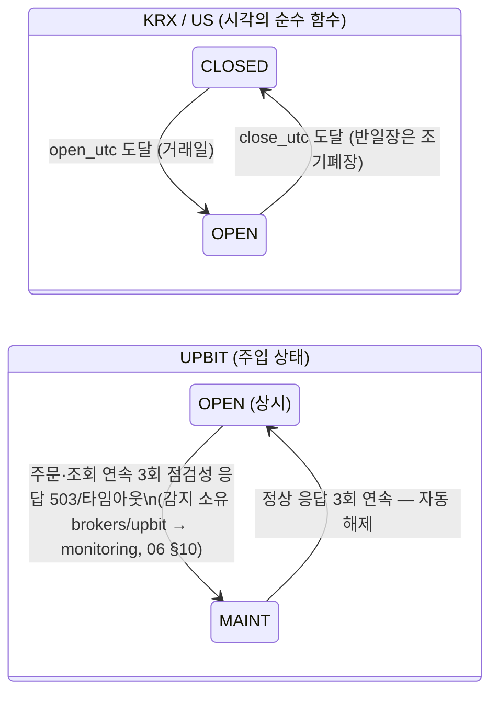

# 06. 시장 데이터·캘린더

> **범위**: `src/omra/data/` — TET Fetcher 추상·provider 레지스트리·시장 인지형 라우팅·응답 봉투, quote 서비스(`realtime`의 유일한 REST 경유로), Parquet 스토어 API·지표 캐시, 종목마스터(`.mst.zip`) point-in-time 스냅샷 — 그리고 `src/omra/calendar/` — 거래 캘린더(XKRX/XNYS + KIS 휴장일 TR 교차검증)·세션 상태머신·결제일 계산 — 및 환율(FX) 처리.
> **계획 정본**: 01 §3.3(TET)·§4.1(캘린더)·§1.3(Parquet)·§1.5(라이브러리)·§4.2(데이터 잡 배치)·§2.2(`realtime → data.quote`), 02 §2.3(유니버스 필터 데이터 요건)·§4.7(FX)·§7(김치프리미엄 입력)·§8.1(PIT·자산 생애주기), 03 §1.2(P9-quote)·§3(휴장 불일치 처분), 05 §3.2·§7.1·§8(KIS·업비트 제약), 06 §2.2·§6.1·§10·부록 C.
> **선행 문서**: [01-system-architecture.md](01-system-architecture.md)(프로세스·import 계약), [02-domain-model.md](02-domain-model.md)(`Instrument`·`Market`·Decimal 규약·Clock·예외 계층).
> **이 문서가 소유하는 정의**: TET Fetcher, 캘린더·세션 상태머신, 환율(브리프 §2.1). Parquet **레이아웃**·DuckDB 뷰·SQLite DDL은 [03-data-and-persistence.md](03-data-and-persistence.md) 소유, KIS/업비트 클라이언트·TokenManager·RateLimiter·tr_map은 [05-broker-gateway.md](05-broker-gateway.md) 소유.

## 1. 개요 — 설계 대상과 책임

`data/`와 `calendar/`는 이 시스템에서 **판단하지 않는 공급 계층**이다. 목표비중·주문·가드 판정은 각각 `engine`·`execution`·`realtime`이 소유하고, 이 두 패키지는 그 판단의 **입력(시세·일봉·환율·종목 상태·거래일·결제일)을 재현 가능하게 공급**하는 책임만 진다.

책임 경계 4줄 요약:

1. **`data`는 "어느 소스의 값으로 그 판정을 했는가"를 사후 재구성 가능하게 만든다** — 응답 봉투(`FetchResult`)의 `provider`/`degraded`, 감사로그의 `fx_snapshot_applied`, Parquet PIT 스냅샷이 그 수단이다. (정본: 01 §3.3, 02 §4.7(c))
2. **`data`는 폴백하되 HALT를 유발하지 않는다** — 시세·조회 provider 장애는 P9-quote(등급 C, provider degrade + warning)로 흡수되고 주문 경로는 살아 있다. (정본: 03 §1.2)
3. **`calendar`는 fail-safe의 1차 게이트다** — 휴장일 교차검증 불일치·미판정이면 그날 국내 집행을 중단한다. 판정 불가 → 거래 안 함. (정본: 01 §4.1, 03 §3)
4. **`data.quote`는 `realtime`이 REST에 닿는 유일한 경로다** — `realtime -/-> brokers.*.client` 금지(01 §2.2)의 보완재이며, 이 모듈은 시장 데이터 읽기 외의 어떤 능력(주문·잔고 변경)도 노출하지 않는다.

계획이 조건부로 둔 요소는 조건부임을 유지한 채 양쪽 경로를 설계한다: **T1 실시간 계층(M9 게이트)** 유무에 따른 quote 경로(§6.3), **SP-E2**에 따른 ETF NAV 2경로(§6.4), **M7 스파이크**에 종속된 글로벌 BTC 소스(§5).

## 2. 모듈 구조

```
src/omra/data/
├── __init__.py            # 공개 API 재노출: registry, quote, fx, master, store, indicators
├── models.py              # 표준 데이터모델 (Pydantic, §3.2) — OpenBB standard_models 패턴
├── fetcher.py             # Fetcher ABC · FetchResult · 예외 (§3)
├── registry.py            # ProviderRegistry + ProviderHealth (§4)
├── ports.py               # KisMarketDataPort · UpbitMarketDataPort (Protocol, §4.4)
├── providers/
│   ├── fdr.py             # FdrOhlcvFetcher(KRX/US) · FdrFxFetcher
│   ├── pykrx_provider.py  # PykrxOhlcvFetcher (야간 저빈도 전용)
│   ├── kis.py             # KisQuoteFetcher · KisOverseasQuoteFetcher · KisFxFetcher
│   │                      # · KisEtfNavFetcher([확인 필요]) · KisHolidayFetcher(CTCA0903R)
│   ├── kis_surv.py        # 감시 소비 전용 인증 REST 3종 (§4.1 — 11 [DD-11-10]):
│   │                      # KisStockInfoFetcher(CTPF1002R) · KisOverseasInfoFetcher(search_info)
│   │                      # · KisKsdInfoFetcher(ksdinfo_*)
│   ├── upbit.py           # UpbitDailyCandleFetcher · UpbitTickerFetcher
│   └── global_btc.py      # (M7 스파이크 조건부) 글로벌 BTC 시세
├── quote.py               # QuoteService — realtime의 유일한 REST 경유로 (§6)
├── fx.py                  # FxService — 02 §4.7 구현 (§9)
├── master.py              # 종목마스터 다운로드·파싱·PIT·diff (§8) — `KisMasterFetcher` 포함
├── store.py               # ParquetStore API (§7 — 레이아웃 정본은 03 설계서)
├── duck.py                # duck_connect() — DuckDB 뷰 적용 접속 헬퍼 (§7.4, 뷰 SQL 정본은 03 §6)
└── indicators.py          # 지표 캐시 (§7.3)

src/omra/calendar/
├── __init__.py
├── trading.py             # TradingCalendar (§10)
├── crosscheck.py          # KIS CTCA0903R 교차검증 프로토콜 (§10.2)
├── sessions.py            # 세션 상태머신 (§11)
├── crypto.py              # CryptoCalendar — 상시 개장 + 점검 주입 (§10.4)
└── settlement.py          # SettlementCalculator (§12)
```

**의존 방향** (01 §2.2 계약과 정합 — 두 패키지는 금지줄 대상이 아닌 공급 계층이다):

| 간선 | 방향 | 근거 |
|---|---|---|
| `data → brokers`(kis/upbit 클라이언트) | 허용 | KIS REST는 TokenManager·RateLimiter를 경유해야 한다(01 §5.1~5.2). §4.4의 Port로 좁힌다 |
| `data → core · audit · config` | 허용 | 도메인 타입·감사로그·설정 |
| `calendar → data` | 허용 | 휴장일 TR 교차검증이 TET 경유(§10.2). **역방향 `data → calendar`는 두지 않는다** — 거래일 판정이 필요한 곳(§7.2 결측 체크)은 술어를 주입받는다(순환 방지) |
| `realtime → data.quote`만 | 허용(정본 01 §2.2) | 가드 교차확인·폴백. `data`의 다른 모듈은 realtime이 import하지 않는다 |
| `surveillance → data` / `labs → data` / `research → data` | 허용(정본 01 §2.2) | 마스터 파서·PIT·스토어 공유 |
| `data → engine · execution · protections · realtime · surveillance` | **금지** | 공급 계층은 판단 계층을 모른다. import-linter 금지줄 추가를 [01-system-architecture.md](01-system-architecture.md)의 계약 파일에 제안([DD-06-1]) |

> **[DD-06-1] `data` 패키지의 소비 전용 방향 금지줄 추가**
> - 결정: `data`가 판단 계층(`engine`·`execution`·`protections`·`realtime`·`surveillance`·`labs`·`research`)을 import하는 것을 import-linter `[forbidden]`으로 봉인한다.
> - 근거: 01 §2.2 계약은 관측 4레이어만 봉인하고 `data`의 역방향 간선은 열어 두었다. 공급 계층이 판단 계층을 부르는 순간 "provider 폴백이 가드 판정을 바꾼다"류의 숨은 결합이 생긴다.
> - 계획 문서와의 관계: 충돌 없음 — 01 §2.2의 "열거되지 않은 간선 기본 허용" 여백을 채우는 강화이며, 기존 허용 간선을 제거하지 않는다.

## 3. TET Fetcher 추상과 표준 데이터모델

### 3.1 Fetcher ABC — 3단 분리 (정본: 01 §3.3, 채택 근거 05 §1.2)

```python
# data/fetcher.py
from abc import ABC, abstractmethod
from datetime import datetime
from typing import Any, ClassVar, Generic, TypeVar

from pydantic import BaseModel

Q = TypeVar("Q", bound=BaseModel)   # 표준 질의 모델
D = TypeVar("D", bound=BaseModel)   # 표준 데이터 모델 (§3.2)


class Fetcher(Generic[Q, D], ABC):
    """TET(Transform-Extract-Transform). I/O는 extract_data에만 존재한다.
    transform_query/transform_data는 순수 함수 — 카세트 재생 테스트(03 §4.2)가
    extract_data만 record-replay로 대체하면 나머지가 결정론으로 검증된다."""

    name: ClassVar[str]                 # "fdr" | "pykrx" | "kis" | "upbit" | ...
    data_kind: ClassVar[str]            # "ohlcv_daily" | "quote" | "fx_rate" | ... (§4.1)

    @staticmethod
    @abstractmethod
    def transform_query(params: Q) -> dict[str, Any]:
        """표준 질의 → provider 고유 파라미터. 검증 실패는 QueryValidationError."""

    @staticmethod
    @abstractmethod
    async def extract_data(query: dict[str, Any], ctx: "ProviderContext") -> Any:
        """원천 호출. 유일한 I/O 지점. 실패는 TransientProviderError /
        PermanentProviderError로 정규화해 던진다(§3.4)."""

    @staticmethod
    @abstractmethod
    def transform_data(query: dict[str, Any], raw: Any) -> list[D]:
        """원천 응답 → 표준 Pydantic 모델 검증. 필드 누락·타입 불일치는
        SchemaValidationError — 조용한 결측 전파 금지."""
```

- 01 §3.3 초안 시그니처의 `credentials` 파라미터는 `ProviderContext`(§4.4)로 구체화한다 — 값(키 문자열)이 아니라 **인증·유량제한이 끝난 클라이언트 핸들**을 주입한다. [DD-06-2]
- 동기 라이브러리(FDR·pykrx)의 `extract_data`는 `asyncio.to_thread`로 감싸 이벤트 루프를 점유하지 않는다(01 §9.2 완화 4 — 핸들러/잡의 blocking 금지). pykrx는 요청당 1초 지연·야간 배치 전용(정본: 01 §1.5).

### 3.2 표준 데이터모델 (`data/models.py`)

Pydantic 표준 모델 레지스트리(00 §4 OpenBB 채택 패턴). `core`의 도메인 모델(`Instrument`·`Order` — 정의 정본: [02-domain-model.md](02-domain-model.md))과 별개로, **데이터 계층의 전송·저장 단위**만 정의한다. 수치는 전부 `Decimal`(02 규약), 시각은 전부 tz-aware UTC.

```python
class OhlcvBar(BaseModel, frozen=True):
    instrument_key: str          # "{venue}:{code}" (정본: 06 §7.1)
    trade_date: date             # venue 현지 거래일
    open: Decimal; high: Decimal; low: Decimal; close: Decimal
    volume: Decimal              # 주 수 / 코인 수량
    value: Decimal | None        # 거래대금(KRW/USD) — ADV 지표 입력, 소스가 주지 않으면 None
    adjusted: bool               # 수정주가 여부 — 소스별로 다르므로 명시

class Quote(BaseModel, frozen=True):
    instrument_key: str
    price: Decimal               # 현재가/체결가
    prev_close: Decimal | None
    bid: Decimal | None; ask: Decimal | None
    observed_at: datetime        # ★ 신선도 판정(§6.2)의 기준. 수신 시각(UTC)
    session_flag: str | None     # 원문 장운영 구분 코드 raw 보존 — 해석은 하지 않는다(06 §2.3)

class FxRate(BaseModel, frozen=True):
    pair: str                    # "USDKRW"
    rate: Decimal
    rate_type: str               # "reference"(매매기준율) | "order"(브로커 고시) |
                                 # "settlement" | "close"  — 02 §4.7 (b) 표의 '환율 종류' 열
                                 #   (김치프리미엄 용도는 최신 "reference" 스냅샷을 쓴다)
    source: str                  # 실제 provider 이름
    as_of_utc: datetime          # Parquet fx_rates 스키마와 동일 (02 §4.7 (c))

class NavSnapshot(BaseModel, frozen=True):
    instrument_key: str
    nav: Decimal                 # iNAV(장중) 또는 확정 NAV(EOD)
    price: Decimal | None        # 동시점 시장가 — 괴리율 = price/nav − 1
    observed_at: datetime

class MasterRecord(BaseModel, frozen=True):     # §8 — .mst 1행
    instrument_key: str
    name: str
    flags: dict[str, str]        # 거래정지·관리종목·시장경고·불성실공시·정리매매·
                                 # 단기과열·공매도과열·ETP 유형 (04 §M1 목록) — 원문 값 보존
    raw_fields: dict[str, str]   # 파싱된 전체 필드 (레이아웃 [확인 필요] — §8.1)
    file_date: date              # 스냅샷 귀속일 (PIT 키)

class HolidayRow(BaseModel, frozen=True):       # CTCA0903R 응답 정규화 (§10.2)
    venue_date: date
    is_open: bool
    raw: dict[str, str]          # 응답 필드명 [확인 필요] — 실호출 전 raw 보존

class SurveyRecord(BaseModel, frozen=True):     # 감시 소비 REST 3종 (§4.1 라우트) — [DD-06-14]
    instrument_key: str | None   # 식별자 해석 실패 시 None → 소비자가 UNRESOLVED 처리(11 §13.1)
    kind: str                    # "stock_info" | "overseas_info" | "ksdinfo"
    fields: dict[str, str]       # 원문 값 그대로 (tr_stop_yn·lstg_abol_dt·td_stop_dt 등)
    observed_at: datetime
```

- 종목 상태 플래그는 `Instrument`에 넣지 않는다 — 시점 의존 상태이므로 `surveillance_flags`(관측 시각 포함)와 PIT 스냅샷에 둔다(정본: 01 §3.1).
- `Quote.session_flag`: `H0STCNT0`류 원문에 실려 오는 장운영 필드의 **해석 권한은 `surveillance`에 있다**(06 §2.3). data는 raw 보존만 한다.

### 3.3 응답 봉투 `FetchResult` (정본: 01 §3.3 — 필드 4개, 확장하지 않는다)

```python
class FetchResult(BaseModel, Generic[D]):
    results: list[D]
    provider: str                # 실제로 응답한 provider
    observed_at: datetime
    degraded: bool               # 우선순위 리스트에서 폴백이 발생했는가
```

폴백 시도 이력(어떤 provider가 어떤 오류로 실패했는가)은 봉투에 넣지 않고 structlog + 감사로그로 남긴다. OpenBB `OBBject`의 `warnings`/`chart`/`extra`는 옮기지 않는다(정본: 01 §3.3).

### 3.4 예외 계층

`core`의 최상위 예외(정의 정본: [02-domain-model.md](02-domain-model.md))를 상속한다.

```python
class DataError(OmraError): ...

class QueryValidationError(DataError): ...          # transform_query 단계 — 호출자 버그
class SchemaValidationError(DataError): ...         # transform_data 단계 — 소스 스키마 변경 신호
class TransientProviderError(DataError):            # 타임아웃·5xx·rate limit — 폴백 대상
    provider: str; cause: BaseException | None
class PermanentProviderError(DataError):            # 4xx 파라미터 오류·지원 종료 — 폴백은 하되
    provider: str                                   #   동일 질의 재시도는 무의미(캐시된 판정)
class AllProvidersFailedError(DataError):           # 체인 소진 — 소비자별 실패 방향은 §4.3 표
    data_kind: str; market: str; attempts: list[str]
class StaleDataError(DataError):                    # §6.2 / §9.4 신선도 위반
    age_ms: int; max_age_ms: int
```

**실패 시 안전 방향의 총칙**: data는 예외를 던질 뿐 어떤 판단(DEFER·SV2·집행 중단)도 내리지 않는다. 판단은 소비자의 소유다 — `realtime`은 DEFER(02 부록 A `quote.max_age_ms`), `surveillance`는 `unknown`(06 §8.3), `scheduler`는 전일 캐시 유지(01 §4.2).

### 3.5 검증 항목

- transform_query/transform_data가 순수 함수임을 아키텍처 테스트로 강제(I/O import 금지 — `httpx`/`socket`을 fetcher 모듈 상단이 아닌 `extract_data` 경유로만).
- 각 fetcher의 transform_data에 대해 **카세트 기반 골든 테스트**(03 §4.2 대상 목록: 잔고/시세/휴장일 TR/`CTPF1002R`/`.mst.zip` 파싱).
- `SchemaValidationError` 발생 시 조용한 결측이 없음을(필드 누락 → 예외) 단위 테스트.

## 4. ProviderRegistry — 시장 인지형 라우팅과 폴백

### 4.1 라우팅 키와 등록 테이블

라우팅 키는 `(data_kind, market)`. 계획이 명명한 예시(01 §3.3)를 포함해 전체 테이블을 고정한다.

| `data_kind` | market | 우선순위 체인 | 사용 시점 | 근거 |
|---|---|---|---|---|
| `ohlcv_daily` | KRX | `[FdrOhlcvFetcher, PykrxOhlcvFetcher]` | 02:00 야간 배치 | 01 §3.3·§4.2 |
| `ohlcv_daily` | NASD·NYSE·AMEX | `[FdrOhlcvFetcher]` | US 마감+20분 `us_reconcile` | 01 §4.2 "미국 일봉 적재" |
| `ohlcv_daily` | UPBIT | `[UpbitDailyCandleFetcher]` | 09:00 직후(업비트 일봉 경계) | 02 §7 |
| `quote` | KRX | `[KisQuoteFetcher]` | 장중 — realtime 교차확인·60초 스냅 | 01 §3.3·§5.4 |
| `quote` | NASD·NYSE·AMEX | `[KisOverseasQuoteFetcher]` | 미국 장중 60초 스냅(종목당 1콜) | 01 §5.4 |
| `quote` | UPBIT | `[UpbitTickerFetcher]` | WS 폴백 시에만(평시 소비 0) | 01 §5.4 |
| `fx_rate` | (pair=USDKRW) | `[KisFxFetcher, FdrFxFetcher]` | 07:00 스냅샷·김프 분모 | 01 §3.3, 02 §4.7(a) |
| `etf_nav` | KRX | `[KisEtfNavFetcher]` | iNAV 게이트 REST 경로 | 02 §4.4 — TR [확인 필요] (§6.4) |
| `quote_global_btc` | — | M7 스파이크로 확정 | 김치프리미엄 분자 상대편 | 01 §3.3, 04 §5.2 |
| `holiday` | KRX | `[KisHolidayFetcher]` | 07:00 교차검증(§10.2) | 01 §4.1 (CTCA0903R) |
| `master` | KRX | `[KisMasterFetcher]` | 02:10 `surv_master_sync` (§8) | 05 §7.1, 06 §6.1 |
| `stock_info` | KRX | `[KisStockInfoFetcher]` | 07:00~07:10 `surv_daily_poll`(보유∪후보 ~22콜) | 04 §M1(CTPF1002R), 05 §7.1 — [DD-06-14] |
| `overseas_info` | US | `[KisOverseasInfoFetcher]` | 07:00~07:10 `surv_overseas_poll`(M6) | 04 §M1(해외 `search_info`), 05 §7.1 — [DD-06-14] |
| `ksdinfo` | KRX | `[KisKsdInfoFetcher]` | 07:00~07:10 `surv_ksdinfo` | 04 §M1(`ksdinfo_*` 사전 캘린더), 03 §1.3 — [DD-06-14] |

> **[DD-06-14] 인증이 필요한 감시 REST 3종을 라우팅 표에 편입한다**
> - 결정: `("stock_info", KRX)`·`("overseas_info", US)`·`("ksdinfo", KRX)` 3개 라우트를 `ProviderRegistry`에 등록하고, 각 fetcher는 `KisMarketDataPort`(§4.4)를 경유한다. 산출 모델은 `SurveyRecord`(§3.2)이며 **필드 해석·등급 부여는 하지 않는다**(raw 보존).
> - 근거: 요청 출처는 [11-realtime-and-surveillance.md](11-realtime-and-surveillance.md) [DD-11-10] — `surveillance -/-> brokers.*.client`(01 §2.2)이고 이 3개 TR은 앱키 인증이 필요하므로 `collectors.http`로 호출할 수 없다. 라우팅 표의 소유가 이 문서이므로 편입은 여기서 확정한다. Port에 주문 메서드가 없으므로 감시가 주문 API에 닿는 경로는 생기지 않는다([DD-06-2]).
> - 계획 문서와의 관계: 충돌 없음 — 계획(06 §6.1)은 소스 목록만 정하고 호출 경로를 비워 두었다. TR ID는 계획이 명시한 `CTPF1002R`(04 §M1)만 확정이고 해외 `search_info`·`ksdinfo_*`의 정확한 TR ID·파라미터는 `tr_ids.kis.yaml`(소유 05)에서 M1·M6에 채운다(§16-18).

```python
# data/registry.py
RouteKey = tuple[str, str]        # (data_kind, market) — pair형 kind는 market 자리에 pair

class ProviderRegistry:
    def __init__(self, ctx: ProviderContext, health: ProviderHealth,
                 table: Mapping[RouteKey, Sequence[type[Fetcher]]]) -> None: ...

    async def fetch(self, kind: str, market: str, params: BaseModel) -> FetchResult:
        """§4.2 폴백 알고리즘. 등록되지 않은 키는 UnknownRouteError —
        기동 셀프체크가 잡 선언과 라우팅 테이블의 커버리지를 대조한다."""

    def route_for(self, kind: str, market: str) -> Sequence[type[Fetcher]]: ...
```

라우팅 테이블은 코드 선언(자기문서화 — 05 §1.2 `fetcher_dict` 패턴)이며 config로 빼지 않는다. provider on/off만 config(`data.providers.<name>.enabled`)로 제어한다 — 계획에 없는 신설 키이므로 등록·기본값은 [04-configuration-and-secrets.md](04-configuration-and-secrets.md)에 위임한다([DD-06-5]와 동일 취급).

### 4.2 폴백 알고리즘 (의사코드)

```
async fetch(kind, market, params):
1. chain = table[(kind, market)]                    # 없으면 UnknownRouteError(기동 셀프체크 실패)
2. attempts = []
3. for i, F in enumerate(chain):
4.     if health.is_degraded(F.name, kind) and not last_resort(chain, i):
5.         attempts.append((F.name, "skipped_degraded")); continue
       # last_resort: 체인의 나머지가 전부 degraded면 degraded여도 시도한다 —
       # "전 provider degrade = 영구 무데이터"를 막는 self-heal 경로
6.     try:
7.         query = F.transform_query(params)
8.         raw   = await F.extract_data(query, ctx)      # 재시도는 fetcher 내부 tenacity
9.         data  = F.transform_data(query, raw)
10.        health.record_success(F.name, kind)           # streak 리셋 → P9-quote 자동 해제 입력
11.        degraded = (i > 0) or any(skipped in attempts)
12.        if degraded: log.warning("provider_fallback", ...)   # 감사로그 아님 — 운영 로그
13.        return FetchResult(results=data, provider=F.name,
                              observed_at=now_utc(), degraded=degraded)
14.    except (TransientProviderError, SchemaValidationError) as e:
15.        health.record_failure(F.name, kind, e)        # 연속 카운트 — §4.3
16.        attempts.append((F.name, classify(e))); continue
17.    except PermanentProviderError as e:
18.        health.record_failure(F.name, kind, e)
19.        attempts.append((F.name, "permanent")); continue
20. raise AllProvidersFailedError(kind, market, attempts)
```

`SchemaValidationError`를 폴백 대상에 포함하는 이유: 소스 스키마 변경은 해당 provider의 장애이지 질의의 장애가 아니다. 다만 스키마 오류는 일시 장애와 구조 변화가 섞여 있으므로 `ProviderHealth.record_failure`가 예외 객체를 그대로 받아 **오류 종류를 함께 기록**하고(§4.3), 소스 스키마 drift의 조기 경보는 03 §4.2의 **주 1회 카세트 스모크**가 담당한다. data는 별도 임계를 정의하지 않는다 — 등급 상향 판정의 소유는 [09-safety-protections.md](09-safety-protections.md)/[11-realtime-and-surveillance.md](11-realtime-and-surveillance.md)다.

### 4.3 ProviderHealth — P9-quote 연동

P9-quote의 **정의·임계·해제 정본은 03 §1.2**다: 시세·잔고·조회 TR 오류 연속 5회(`protections.error_streak_quote: 5`, 03 부록 A) → 해당 provider degrade(폴백 전환) + warning, **HALT 아님**, 등급 C, provider 복구 시 자동 해제. `data`는 그 판정의 **입력 카운터와 degrade 실행**만 소유한다.

```python
class ProviderHealth:
    """(provider, data_kind) 단위 연속 오류 카운터. 프로세스 메모리 보관 —
    재시작 시 리셋되어도 안전 방향(재시도)으로만 틀린다."""
    def record_failure(self, provider: str, kind: str, err: DataError) -> None: ...
    def record_success(self, provider: str, kind: str) -> None: ...
    def is_degraded(self, provider: str, kind: str) -> bool: ...
    def streak(self, provider: str, kind: str) -> int: ...     # protections가 pull로 읽는다
```

> **[DD-06-3] ProviderHealth 카운터 단위 = `(provider, data_kind)`, 보관은 프로세스 메모리**
> - 결정: 연속 오류 카운터와 degrade 실행을 `(provider, data_kind)` 쌍 단위로 유지하고, 카운터는 DB가 아닌 프로세스 메모리에 둔다.
> - 근거: 카운터를 provider 단위로 뭉치면 FDR의 환율 엔드포인트 장애가 FDR 일봉까지 degrade시켜 폴백 표면이 불필요하게 넓어진다. 메모리 보관은 재시작 시 리셋되지만 그 오차는 **재시도 방향**(안전 방향)으로만 발생하며, P9-quote는 HALT가 아니라 폴백 전환이므로 영속화 요건(01 §1.3의 카나리·예산 카운터 같은)에 해당하지 않는다.
> - 계획 문서와의 관계: 충돌 없음 — 03 §1.2는 P9-quote의 임계(연속 5회)·목적지·해제만 정하고 카운터의 집계 단위와 보관 위치를 비워 두었다.

- degrade 전이·해제는 감사로그 `event_type=state_transition`이 아니라 **운영 로그 + `protection_tripped`(P9-quote 발동 시, protections가 기록)**로 남긴다 — 이중 기록 방지.
- **소비자별 실패 방향(체인 소진 시)**:

| 소비자 경로 | `AllProvidersFailedError` 처분 | 정본 |
|---|---|---|
| `realtime` ← `quote` | 무데이터 → 가드 무판정 또는 DEFER (판단은 realtime) | 02 부록 A, 06 §1.2 |
| `scheduler.nightly_data_batch` ← `ohlcv_daily` | 전일 캐시 유지, 거래 차단 없음, warning | 01 §4.2 |
| `daily_planner` ← `fx_rate` | §9.4 폴백(마지막 스냅샷 ≤72h) | 06 부록 C + [DD-06-9] |
| `daily_planner` ← `holiday` | **그날 국내 집행 중단 + critical** | 01 §4.1, 03 §3 |
| `surv_master_sync` ← `master` | 전일 스냅샷 유지(유예) | 01 §4.2, 06 §8.3 |
| `surv_daily_poll` / `surv_overseas_poll` / `surv_ksdinfo` ← `stock_info`·`overseas_info`·`ksdinfo` | 해당 소스 `ok=False` 보고 → 스냅샷 유예 후 `unknown`(판정은 11) | 01 §4.3, 06 §8.3 — [DD-06-14] |

### 4.4 ProviderContext — 자격증명·클라이언트 주입

```python
# data/ports.py — data가 브로커에게 요구하는 것의 완전 열거 (시장 데이터 읽기 전용)
class KisMarketDataPort(Protocol):
    async def multiprice(self, symbols: Sequence[str]) -> Any: ...          # FHKST11300006, ≤30종목/콜
    async def overseas_price(self, market: str, symbol: str) -> Any: ...    # 종목당 1콜 (01 §5.4)
    async def fx_reference_rate(self, pair: str) -> Any: ...                # [확인 필요] TR — §9.2
    async def holiday(self, base_date: date) -> Any: ...                    # CTCA0903R (05 §3.2)
    async def etf_nav(self, symbol: str) -> Any: ...                        # [확인 필요] TR — §6.4
    # ↓ 감시 소비 전용 read-only TR (11 [DD-11-10] 요청 수용 — [DD-06-14]). 주문 능력 없음
    async def stock_info(self, symbols: Sequence[str]) -> Any: ...          # CTPF1002R (04 §M1)
    async def overseas_info(self, market: str, symbol: str) -> Any: ...     # 해외 search_info (04 §M1, M6)
    async def ksdinfo(self, base_date: date,
                      symbols: Sequence[str]) -> Any: ...                   # ksdinfo_* 사전 캘린더 (04 §M1)

class UpbitMarketDataPort(Protocol):
    async def ticker(self, markets: Sequence[str]) -> Any: ...
    async def day_candles(self, market: str, count: int) -> Any: ...

@dataclass(frozen=True)
class ProviderContext:
    kis: KisMarketDataPort | None       # 구현: brokers/kis/client.py (정의 정본: 05-broker-gateway.md)
    upbit: UpbitMarketDataPort | None
    http: httpx.AsyncClient             # 무인증 소스(.mst.zip, FDR 내부는 자체 세션) 전용
```

> **[DD-06-2] `extract_data`의 `credentials`를 `ProviderContext`로 구체화**
> - 결정: 01 §3.3 초안의 `credentials` 인자를 "키 값"이 아니라 **Port Protocol 묶음**으로 정의한다. KIS 호출은 반드시 `KisMarketDataPort`(= 05의 클라이언트가 구현)를 경유한다.
> - 근거: 키 값을 직접 주면 fetcher가 자체 HTTP 호출로 TokenManager 캐시(01 §5.1)·RateLimiter 버킷(01 §5.2)을 우회할 수 있다. EGW00133(재발급 1분 1회)·EGW00201(유량 초과)의 방어선이 뚫린다. Port에는 주문·잔고 변경 메서드가 존재하지 않으므로 `realtime → data.quote` 경로로 주문 능력이 새는 것도 타입 수준에서 막힌다.
> - 계획 문서와의 관계: 01 §3.3은 "시그니처 초안"으로 명시돼 있어 구체화는 계획의 여백이다. `tools` 컨테이너(브로커 키 없음, 01 §1.6)에서는 `kis=None`/`upbit=None`으로 기동되고 해당 라우트는 등록되지 않는다.

### 4.5 검증 항목

- 폴백 발생 시 `degraded=True` + 실제 provider 기록(카세트로 1차 provider 5xx 주입).
- 연속 5회 오류 → degrade + 이후 성공 1회 → 해제(스트릭 리셋)의 상태 전이 단위 테스트.
- "전 provider degraded여도 last_resort로 시도한다" 경로.
- 기동 셀프체크: 잡 선언이 요구하는 모든 `(data_kind, market)`이 라우팅 테이블에 존재.
- `tools` 컨텍스트(`kis=None`)에서 KIS 라우트 접근 시 명시적 설정 오류(조용한 skip 금지).
- 감시 3라우트([DD-06-14])가 `KisMarketDataPort`만 경유함 — 아키텍처 테스트로 `surveillance` 및 `data.providers.kis_surv`가 `brokers.kis.client`를 직접 import하지 않음을 강제(01 §2.2 `surveillance -/-> brokers.*.client`).

## 5. Fetcher 구현 카탈로그

각 fetcher의 3단 구현 요점만 적는다. TR ID·엔드포인트 상수의 보관처는 `tr_ids.kis.yaml`(rest/ws 2섹션 — 정본: 01 §2 저장소 구조, 파일 소유는 [05-broker-gateway.md](05-broker-gateway.md)).

| Fetcher | Q(질의) | extract | transform_data | 비고 |
|---|---|---|---|---|
| `FdrOhlcvFetcher` | `OhlcvQuery(instrument_key, start, end)` | `asyncio.to_thread(fdr.DataReader, ...)` | DataFrame → `list[OhlcvBar]`, `adjusted=True` 명시 | KRX·미국 공용 |
| `PykrxOhlcvFetcher` | 〃 | to_thread + **요청당 1초 지연**(01 §1.5) | 〃 | 야간 폴백 전용. 차단 리스크로 저빈도(05 §3.2) |
| `UpbitDailyCandleFetcher` | 〃 | `ctx.upbit.day_candles` | 캔들 → `OhlcvBar`(trade_date = KST 09:00 경계일, 02 §7) | 크립토 일봉 |
| `KisQuoteFetcher` | `QuoteQuery(instrument_keys)` | `ctx.kis.multiprice`(≤30종목/콜 — 05 §3.2) | → `list[Quote]` | §6.1 청크 규칙 |
| `KisOverseasQuoteFetcher` | 〃 | `ctx.kis.overseas_price` 종목당 1콜 | 〃 | 멀티조회 TR 미발견(01 §5.4) |
| `UpbitTickerFetcher` | 〃 | `ctx.upbit.ticker` | 〃 | WS 폴백 시에만 |
| `KisFxFetcher` | `FxQuery(pair, rate_type)` | `ctx.kis.fx_reference_rate` — [확인 필요] | → `FxRate(source="kis")` | §9.2 |
| `FdrFxFetcher` | 〃 | to_thread(FDR 환율) | → `FxRate(source="fdr")` | 폴백 |
| `KisEtfNavFetcher` | `NavQuery(instrument_key)` | `ctx.kis.etf_nav` — [확인 필요] | → `NavSnapshot` | §6.4 |
| `KisHolidayFetcher` | `HolidayQuery(base_date)` | `ctx.kis.holiday` (CTCA0903R) | → `list[HolidayRow]` | §10.2. TR ID 표기 불일치(`CTCA0903R` vs `TCA0903R`) 실호출 확정 필요(05 §3.2) |
| `KisMasterFetcher` | `MasterQuery(files)` | `ctx.http` 무인증 다운로드(05 §7.1 — rate limit 예산 밖) | zip 해제 + 고정폭 파싱 → `list[MasterRecord]` | §8.1 |
| `KisStockInfoFetcher` | `SurveyQuery(instrument_keys)` | `ctx.kis.stock_info`(CTPF1002R) | → `list[SurveyRecord]`(`kind="stock_info"`) | [DD-06-14]. 필드 해석·등급은 11 소유 |
| `KisOverseasInfoFetcher` | 〃 | `ctx.kis.overseas_info` 종목당 1콜 | → `list[SurveyRecord]`(`kind="overseas_info"`) | 〃. M6, TR ID [확인 필요] (§16-18) |
| `KisKsdInfoFetcher` | `SurveyQuery(instrument_keys, base_date)` | `ctx.kis.ksdinfo` | → `list[SurveyRecord]`(`kind="ksdinfo"`) | 〃. `td_stop_dt` 사전 채움 여부 [확인 필요] (11 §8.3.3) |
| `GlobalBtcFetcher` | `QuoteQuery` | **M7 스파이크로 소스 확정**(04 §5.2) | → `Quote` | REST 폴링이면 60초 주기 제한(06 §1.1) |

**글로벌 BTC(조건부)**: 소스 미확정 상태에서 인터페이스만 고정한다 — `("quote_global_btc", "-")` 라우트, 산출은 USD 표시 `Quote`. 김치프리미엄 산식(`업비트KRW ÷ (글로벌USD × USDKRW) − 1`)과 stale 규칙의 정본은 06 §2.2이고 가드 구현은 [11-realtime-and-surveillance.md](11-realtime-and-surveillance.md)다. M7 스파이크가 실패해 소스를 확정하지 못하면 `KimchiGuard`는 영구 무판정(= PROCEED)이 되며 이는 06 §2.2 stale 규칙의 자연스러운 확장이다(김프 가드는 안전 요건이 아니라 최적화 — 06 §2.2).

## 6. QuoteService — `realtime`의 유일한 REST 경유로

### 6.1 API

```python
# data/quote.py — realtime이 import하는 유일한 data 모듈 (01 §2.2)
class QuoteService:
    def __init__(self, registry: ProviderRegistry, clock: Clock) -> None: ...

    async def get_quote(self, key: str) -> FetchResult[Quote]:
        """단건. 내부적으로 venue 라우팅: KRX → multiprice(1종목), US/UPBIT → 각 fetcher."""

    async def get_quotes(self, keys: Sequence[str]) -> FetchResult[Quote]:
        """venue별 그룹핑 후 KRX는 30종목 청크(ceil(n/30)콜 — 05 §8.2),
        미국은 종목당 1콜 직렬(QUOTE 버킷 우선순위는 RateLimiter가 관리 — 05 소유)."""

    async def get_fresh_quote(self, key: str, max_age_ms: int) -> FetchResult[Quote]:
        """캐시 나이 ≤ max_age_ms면 캐시, 초과면 재조회. 재조회 실패 시
        StaleDataError(age_ms, max_age_ms) — DEFER 판단은 호출자(realtime)."""

    def last_observed(self, key: str) -> Quote | None:
        """최신값 슬롯(시세는 최신값만 유지 — 01 §9.2 완화 3). 판정용이 아니라 표시·로그용."""
```

- 반환은 항상 `FetchResult` — 가드 감사로그의 `source_event_id`가 "REST 스냅샷, provider=kis"를 재구성할 수 있어야 한다(01 §6.3).
- `QuoteService`는 잔고·주문 API에 닿을 수 없다(§4.4 Port에 존재하지 않음). 이것이 01 §2.2 주석("브로커 클라이언트를 직접 잡게 하면 realtime이 주문 API에도 닿는다")의 구현이다.

### 6.2 신선도 규약 (정본: 02 부록 A `quote.max_age_ms`, 06 부록 C)

| venue | `quote.max_age_ms` | 초과 시 |
|---|---|---|
| krx | 2000 | REST 재조회, 실패 시 호출자 DEFER |
| upbit | 2000 | 〃 |
| us | null(나이 검사 비적용 — 지연 피드) | 대안 경로 지정가는 '판정가 ±1.0%'(02 §4.1 — 집행 소유 [08-execution.md](08-execution.md)) |

가드 발동 조건 3-AND의 ③ "마지막 정상 틱으로부터 5분 이내"(정본: 06 §2.4·01 §3.5)의 판정 주체는 `realtime`이며, `QuoteService`는 `observed_at`을 제공할 뿐이다. 이 5분이 `protections.quote_stale_min: 5`(03 부록 A)와 **같은 키인지**는 계획이 명시하지 않았다 — 키 통합 여부의 판정은 [09-safety-protections.md](09-safety-protections.md)·[11-realtime-and-surveillance.md](11-realtime-and-surveillance.md) 소유이며 §16-15에 조율 항목으로 등재한다.

### 6.3 T1 유무에 따른 2경로 (조건부 설계 — M9는 취소 가능, 06 §1.2)

| 시나리오 | quote 서비스의 역할 | 코드 차이 |
|---|---|---|
| **T1 채택**(M9 게이트 통과) | ① 가드 발동 조건 ②의 "REST 스냅샷 1회 교차 확인"(01 §3.5) ② WS 틱 stale(`max_age_ms`) 시 재조회 ③ `fallback.py`의 WS↔REST 등가 전환 대상 | 없음 — 호출 빈도만 다르다 |
| **T1 취소**(기본 시나리오) | `MoveGuard` 입력 = 국내·미국 60초 REST 스냅(01 §5.4)을 **집행 창에서도 동일 주기로** 공급(06 §1.2). `window_sec 300 = 5샘플` 해석은 realtime 소유 | 없음 |

**폴백 등가성**(01 §5.3 불변식 2)은 quote 서비스가 지켜야 할 계약이다: WS 주입 경로와 REST 폴링 경로가 **같은 `Quote` 모델로 정규화**되어 가드에 도달해야 `Verdict` 시퀀스 일치 검증(03 §4.3)이 성립한다. 따라서 WS 틱의 디코딩 산출(`QuoteTick` — 05 소유)과 REST `Quote`는 필드 의미가 1:1 대응하도록 `data/models.py`의 `Quote`를 공용 표적으로 삼는다.

### 6.4 ETF NAV — REST 스냅샷 경로 (조건부 상대편: SP-E2)

iNAV·스프레드 게이트의 정본은 02 §4.4(2경로: REST 30분×3회 기본 / 실시간 NAV는 SP-E2 통과 시)다. data가 소유하는 것은 **REST 경로의 NAV 스냅샷 공급**뿐이다:

- `("etf_nav", KRX)` → `KisEtfNavFetcher` → `NavSnapshot`.
- **[확인 필요]** ETF NAV/괴리율을 주는 REST TR의 ID·응답 필드 — 계획은 `H0STNAV0`(WS, T1 전용)와 `nav_comparison_trend`(01 §10 SP-E2의 대조 지표명)만 언급한다. 확인 방법: KIS 공식 문서/레포에서 ETF 현재가·NAV 비교추이 TR 확정 + SP-E2(M1)에서 `H0STNAV0` 실측과 함께 대조. 확정 전까지 게이트의 REST 경로는 `KisQuoteFetcher`의 현재가 + 전일 확정 NAV(야간 배치 적재)로 **근사조차 하지 않는다** — 잘못된 분모로 괴리율을 만들면 게이트가 오판한다. 미확정 동안 괴리율 게이트는 "판정 불가 = 게이트 미적용 + warning"이며, 이는 02 §4.4가 T1 부재 시 REST 스냅샷 경로를 기본으로 규정한 취지(지연 허용, 오판 불허)에 따른다.

### 6.5 검증 항목

- 30종목 청크 경계(29/30/31종목)에서 콜 수 = `ceil(n/30)`.
- `get_fresh_quote`: 캐시 적중 / 재조회 / 재조회 실패 → `StaleDataError` 3분기.
- 폴백 등가성: 동일 카세트를 WS 주입·REST 폴링 두 경로로 재생 → 정규화된 `Quote` 시퀀스 동일(03 §4.3의 데이터 계층 절반).
- `us` venue에서 나이 검사가 비적용됨(null 처리).

## 7. Parquet 스토어와 지표 캐시

### 7.1 ParquetStore API — 레이아웃 정본은 03 설계서

물리 레이아웃(디렉터리·파티션 스킴·pyarrow 스키마·DuckDB 뷰 SQL)의 정본은 [03-data-and-persistence.md](03-data-and-persistence.md)다. 이 절은 그 레이아웃에 대한 **코드 접근 계약**만 정의한다. 계획이 고정한 물리 사실: Parquet은 pyarrow, **연도·시장 파티션**, 대상은 일봉 OHLCV·환율·종목마스터 PIT 스냅샷·지표 캐시(정본: 01 §1.3), 경로는 `var/data`(`omra-data` 볼륨, 01 §1.6).

```python
# data/store.py
class Dataset(StrEnum):
    OHLCV_DAILY = "ohlcv_daily"
    FX_RATES    = "fx_rates"        # 스키마(as_of_utc, pair, source, rate_type, rate) — 02 §4.7(c)
    MASTER_PIT  = "master_pit"      # §8.2
    INDICATORS  = "indicators"      # §7.3

class ParquetStore:
    def __init__(self, root: Path, schemas: SchemaCatalog) -> None: ...
        # SchemaCatalog: 데이터셋별 pyarrow 스키마 — 값의 정본은 03 설계서, 여기서는 주입만

    def write(self, ds: Dataset, rows: Sequence[BaseModel], *,
              partition: Mapping[str, str]) -> WriteReceipt:
        """원자적 쓰기 프로토콜(§7.2). 스키마 불일치는 SchemaValidationError로 즉시 실패."""

    def read(self, ds: Dataset, *, filters: Sequence[tuple] = ()) -> pa.Table: ...

    def read_asof(self, ds: Dataset, as_of: date, *,
                  filters: Sequence[tuple] = ()) -> pa.Table:
        """PIT 계약: as_of 이후 파티션·행을 물리적으로 배제한 뷰를 돌려준다.
        백테스트 BarView(02 §8.1)와 유니버스 as-of 재평가(02 §2.3)의 데이터측 절반."""

    def latest_partition(self, ds: Dataset) -> Mapping[str, str] | None: ...
```

- DuckDB는 이 파일들을 **읽기 전용**으로 조회하는 쿼리 엔진이다(정본: 01 §1.3). 뷰 카탈로그는 03 설계서 소유 — data는 파일 배치 규약 준수와 **접속 헬퍼 구현**(§7.4)을 책임진다.
- `tools` 컨테이너는 `omra-data`를 rw 마운트해 같은 스토어를 읽는다(01 §1.6). 쓰기 주체 규율(실험 결과는 파일 → `app`이 ingest)은 01 §1.6 정본.

> **[DD-06-4] 원자적 쓰기 프로토콜의 구현 — 규약 정본은 03 §5.3**
> - 결정: 쓰기 규약의 **정본은 [03-data-and-persistence.md](03-data-and-persistence.md) §5.3([DD-03-20])**이고 `ParquetStore`가 그 구현을 소유한다. 구현 확정: ① 파티션 디렉터리에 `part-*.parquet.tmp-<ulid>`로 완전 기록 → `os.replace`로 원자 교체 ② 파티션 단위 재작성은 **overwrite**(append 아님) — "새 파일 기록 → 교체 → 구파일 삭제" 순서 ③ 리더의 글롭 패턴은 `*.parquet`만이어서 잔존 tmp를 무시한다 ④ 모든 배치 잡의 쓰기는 **자연 멱등**(같은 `(dataset, partition, trade_date)` 재기록 = 동일 결과)으로 설계해 catch-up `always` 분류(01 §4.2.1)와 정합 ⑤ `master_pit`은 불변 데이터셋 — 재파싱 시 새 `file_date`를 만들지 않고 동일 파티션 전체 교체 + 감사로그(03 §5.3-3).
> - 근거: 야간 배치가 시간 예산 체크포인트(01 §1.4 동시성 규율 3)로 중단될 수 있으므로 부분 파일이 관측되면 안 된다. Parquet에는 트랜잭션이 없어 파일 교체 원자성이 유일한 수단이다. 규약 문구를 두 벌로 두지 않기 위해 03 §5.3을 정본으로 두고 이 블록은 구현 세목만 고정한다(요청 출처: 03 [DD-03-20] "이 규약의 구현(스토어 코드)은 06이 소유한다").
> - 계획 문서와의 관계: 충돌 없음 — 01 §1.3이 비워 둔 쓰기 규약을 03이 확정하고 06이 구현한다.

### 7.2 데이터 품질 체크 (02:00 `nightly_data_batch` 내)

정본: 04 §M1 "품질 체크(결측/중복/수정주가 점프)". 판정 3종:

```
1. 중복: (instrument_key, trade_date) 유일성 위반 → 해당 배치 거부(스토어 미반영) + warning
2. 결측: is_trading_day(venue, d)=True인데 bar 부재 → 결측 목록 기록 + warning
         (거래 차단 없음 — 실패 시 전일 캐시, 01 §4.2)
         ★ is_trading_day는 `Callable[[Venue, date], bool]`로 **주입**받는다 —
           `data`가 `calendar`를 import하면 §2의 `calendar → data`와 순환이 된다
3. 점프: |1일 수익률| > data.quality.max_abs_daily_return: 0.3 (30%)
         → 자동 수정하지 않고 격리 플래그 + warning. 수정주가 재적재 여부는 사람이 판단
```

**주간 무결성 재점검의 공식 진입점** (요청 출처: [12-scheduling-and-operations.md](12-scheduling-and-operations.md) §16.1 `parquet_verify` 스텝):

```python
class PartitionVerdict(BaseModel, frozen=True):
    dataset: Dataset
    partition: Mapping[str, str]
    ok: bool
    problem: str | None          # "footer_unreadable" | "empty" | "schema_mismatch" | "tmp_residue"

class ParquetStore:
    def verify_latest_partitions(self) -> list[PartitionVerdict]:
        """일요일 03:00 `weekly_maintenance`가 호출한다. 각 데이터셋 최신 파티션의
        footer 읽기 + 행 수 > 0 + 스키마 일치를 확인(검사 항목 정본: 03 §5.3-4).
        판정만 반환하고 스스로 복구·알림하지 않는다 — warning 발송은 12 소유."""
```

> **[DD-06-15] Parquet 무결성 재점검 진입점 이름 = `ParquetStore.verify_latest_partitions()`**
> - 결정: 03 §5.3-4가 규정한 최신 파티션 무결성 검사의 공식 진입점을 `ParquetStore.verify_latest_partitions() -> list[PartitionVerdict]`로 확정한다. 12의 잡 스텝은 `ctx.data.verify_latest_partitions()`로 이 메서드를 호출한다.
> - 근거: 요청 출처는 12 §16.1 — 12는 이 이름을 이미 가정해 스텝 표에 적었고, 06은 §7.2/§13에서 "재실행"으로만 기술해 이름이 없었다. 진입점 이름의 소유는 스토어 API를 소유한 이 문서다. 반환을 판정 리스트로 둔 것은 [DD-11-15]·[DD-06-3]과 같은 규율(모듈은 사실만 산출, 알림·처분은 잡 래퍼)이다.
> - 계획 문서와의 관계: 충돌 없음 — 01 §4.2는 `weekly_maintenance`의 "Parquet 무결성" 단계만 열거하고 진입점을 정하지 않았다.

> **[DD-06-5] 품질 게이트 임계 초기값**
> - 결정: `data.quality.max_abs_daily_return: 0.3`(크립토는 0.5)을 config 키로 신설. 임의 초기값이며 M2에서 과거 10년 데이터로 오탐률을 실측해 재캘리브레이션한다.
> - 근거: 04 §M1이 "수정주가 점프" 검출을 요구하나 임계를 정하지 않았다. 자동 수정을 하지 않는 이유는 fail-safe(판정 불가 → 데이터 격리, 조용한 오염 금지).
> - 계획 문서와의 관계: 충돌 없음(계획의 여백). 값은 02 부록 A 블록이 아닌 `data.*` 블록 — config 키 등록은 [04-configuration-and-secrets.md](04-configuration-and-secrets.md)에 위임.

### 7.3 지표 캐시 (`data/indicators.py`)

> **[DD-06-6] 지표 계산 소유 경계 — 롤링 집계는 data, 통계 추정은 engine, 캐시는 공용**
> - 결정: 단순 롤링 집계(평균·합·연차 계산)는 `data`가 계산·적재하고, 통계 추정(공분산·EWMA 변동성·모멘텀 신호)은 `engine`(정본: [07-portfolio-engine.md](07-portfolio-engine.md))이 계산한다. 캐시 스토리지(`data/indicators.py`)는 양쪽이 공유한다.
> - 근거: 01 §2 저장소 구조가 `engine/`을 "순수 함수 수치 엔진(백테스트와 공유)"으로 규정하므로 추정기는 engine에 있어야 하고, 02 §3.2가 `Σ_monitor`를 optimizer 경로에서 분리하므로 캐시 계층은 두 경로가 공용으로 쓰는 편이 중복 적재를 막는다.
> - 계획 문서와의 관계: 충돌 없음 — 01 §1.3은 Parquet의 대상으로 "지표 캐시"를 열거했을 뿐 계산 주체를 정하지 않았다.

```python
class IndicatorRow(BaseModel, frozen=True):
    as_of: date
    instrument_key: str
    indicator: str               # 아래 카탈로그의 이름
    value: Decimal
    window: int | None           # 관측 창(거래일)
    inputs_hash: str             # 입력 데이터 지문 — 01 §3.1 TargetWeights.inputs_hash 규약 공유

class IndicatorCache:
    def put(self, rows: Sequence[IndicatorRow]) -> None: ...          # store.write 위임
    def get(self, indicator: str, key: str, as_of: date) -> IndicatorRow | None: ...
    def series(self, indicator: str, key: str, start: date, end: date) -> list[IndicatorRow]: ...
```

**지표 카탈로그와 유니버스 필터 데이터 요건 매핑** (02 §2.3의 필터 단계별 — 필터 **로직**의 구현 소유는 [07-portfolio-engine.md](07-portfolio-engine.md)의 `universe_reeval` 파이프라인, data는 입력 공급):

| 02 §2.3 조항 | 지표/데이터 | 소스 | 계산 주체 | 상태 |
|---|---|---|---|---|
| 0. 상태 hard 플래그(국내) | `tr_stop_yn`·`admn_item_yn`·`etf_etn_ivst_heed_item_yn`·`lstg_abol_dt` | 종목마스터 PIT(§8) + `CTPF1002R`(surveillance 소유) | — | SP-A1·SP-A2 종속 |
| 0. 상태 hard(미국) | `ovrs_stck_tr_stop_dvsn_cd`·`lstg_abol_item_yn`·`ptp_item_yn` | KIS 해외 `search_info`(05 §7.1 — surveillance `kis_overseas` 소스) | — | M6 |
| 0. 상태 hard(공통) | `abs(etp_chas_erng_rt_dbnb) ≤ 1`(레버리지·인버스 배제) | `CTPF1002R`/마스터 — 필드 소재 [확인 필요] (SP-A1) | — | M1 스파이크 |
| 0. 상태 hard(크립토) | `market_warning == 'NONE'` | 업비트 `/v1/market/all?isDetails=true`(surveillance `upbit_market` 소스) | — | M7 |
| 1. 생존: 상장 ≥3년 | `listing_age_years` | 상장일 — 마스터 필드 또는 FDR 상장정보, 소재 [확인 필요] (M2에서 확정) | data | M2 |
| 1. 생존: AUM(국내 ≥500억 / 미국 ≥$1B) | `aum` | **[확인 필요]** — ETF AUM(순자산)의 공식 소스(시가총액≠AUM). 확인 방법: pykrx/FDR ETF 엔드포인트 또는 KIS TR을 M2에서 확정. 확정 전 hard 필터는 시총 근사 사용 금지(오판 방향이 비보수적) — 미상 시 보류 플래그 | data | M2 |
| 1. 생존: 20일 평균 거래대금 | `adv_20` | `ohlcv_daily.value` 롤링 평균 | data | M2 |
| 2. 비용: TER | `ter` | **[확인 필요]** — 공식 소스 미확정(스크래핑 금지 규칙 00 §6.3 하에서 공식 배포 데이터 확인). M2 | data | M2 |
| 2. 비용: 60일 평균 스프레드 ≤10bp | `spread_avg_60` | **[확인 필요]** — 일중 호가 이력이 필요. 후보: 집행 창 스냅 축적 또는 공식 통계. M2 확정 | data | M2 |
| 3. 품질: 추적오차·60일 평균 \|괴리율\| | `tracking_error_1y`·`premium_abs_avg_60` | NAV 시계열(§6.4 TR [확인 필요]) + `ohlcv_daily` | data | M2 |
| 크립토 σ_realized(EWMA λ=0.94, 60일) | `crypto_sigma_60` | `ohlcv_daily`(UPBIT) — **계산은 engine**(02 §7), 캐시만 여기 | engine | 주 1회 `crypto_vol_scale_update`(01 §4.2) |
| 크립토 vol 스케일(σ → 슬리브 스케일) | `crypto_vol_scale` — `instrument_key="UPBIT:SLEEVE"`, `window=60` | `crypto_sigma_60` — **계산은 engine**(02 §7), 캐시만 여기 | engine | 주 1회 `crypto_vol_scale_update`(일요일 05:00). stale 상한 `crypto.vol_scale_max_age_days`(기본 10일) 초과 시 **직전 값 유지 + warning** — 07 [DD-07-12] |
| `Σ_monitor` 입력 수익률 행렬 | — | `ohlcv_daily` + FX 시계열(KRW 환산) | engine | 일 1회 |

`crypto_vol_scale` 행은 07 [DD-07-12]의 요청 수용분이다 — **캐시 좌표(이름·`instrument_key`·`window`)만 이 문서가 고정**하고, 산출식(`min(1, vol_target/σ)`의 `[floor, 1]` 클램프)·stale 판정·직전 값 유지 처분은 [07-portfolio-engine.md](07-portfolio-engine.md) §11.2 소유다. `IndicatorCache`는 `as_of`와 값을 돌려줄 뿐 나이를 해석하지 않는다([DD-06-6]과 같은 경계). `crypto.vol_scale_max_age_days` 키 등록은 [04-configuration-and-secrets.md](04-configuration-and-secrets.md) 소유.

미확정 소스가 많은 것은 이 표의 결함이 아니라 계획의 정직한 상태다 — 02 §2.3은 임계값만 확정했고 소스는 M1(상태 플래그)·M2(생존·비용·품질)의 스파이크·실측 대상이다. **hard 필터 입력이 미상인 종목은 통과가 아니라 보류**(검토 플래그)로 처리한다 — 02 §2.3 5단계("교체는 자동 집행하지 않고 검토 플래그")와 같은 방향.

### 7.4 DuckDB 접속 헬퍼 (`data/duck.py`)

**뷰 정의문(SQL)의 정본은 [03-data-and-persistence.md](03-data-and-persistence.md) §6**이고, 접속 헬퍼의 **구현은 이 문서 소유**다(요청 출처: 03 §6 "접속 헬퍼는 `data/` 스토어(06)가 노출한다"). 시그니처는 03 §6이 확정한 계약을 그대로 구현한다.

```python
# data/duck.py
def duck_connect(data_root: Path, *, read_only: bool = True) -> duckdb.DuckDBPyConnection:
    """뷰 4+1종(v_ohlcv_daily · v_fx_rates · v_master_pit · v_indicators · v_master_asof)을
    적용한 `:memory:` 연결을 반환한다 — 파일 DB를 만들지 않는다.
    1. duckdb.connect(":memory:", read_only=False)   # 인메모리 카탈로그에 뷰를 만들어야 하므로
    2. `data/duckdb_views.sql`(03 §6 소유)을 읽어 ${DATA_ROOT}를 data_root로 치환 후 실행
    3. read_only=True면 쓰기 계열 구문을 봉인한다 — 검증은 03 §6 검증 항목(`COPY TO`·
       `CREATE TABLE` 거부)이 소유. `as_of`는 호출자가 SET VARIABLE로 주입(03 §6)
    tools 컨테이너·app 리포트 잡 공용(01 §1.6)."""
```

- 뷰 SQL을 이 문서가 복사하지 않는다 — 파일(`data/duckdb_views.sql`) 자체가 03 소유이고 `duck.py`는 그 파일을 **읽어 적용**할 뿐이다. 두 벌이 되면 스키마 변경이 한쪽만 갱신된다([DD-06-8]과 같은 논리).
- `SET VARIABLE`/`getvariable()`의 DuckDB 최소 지원 버전 [확인 필요]와 파라미터 바인딩 폴백은 03 §6에 이미 등재돼 있다 — 헬퍼는 어느 경로든 같은 시그니처를 유지한다.

### 7.5 검증 항목

- 원자적 쓰기: 기록 중 SIGKILL 주입 → 재기동 후 부분 파일 미관측 + 재실행 멱등.
- `read_asof(d)`가 d 이후 데이터를 물리적으로 배제(lookahead 방지의 스토어측 — 02 §8.1 BarView와 별개 층).
- 품질 3판정 각각의 골든 케이스(중복/결측/점프)와 "자동 수정 없음" 확인.
- `inputs_hash` 재현성: 같은 입력 → 같은 해시(플랫폼·정렬 무관).
- `verify_latest_partitions()`: 정상·빈 파티션·스키마 불일치·tmp 잔존 4케이스에서 `PartitionVerdict.problem` 값이 정확하고, 어떤 케이스에서도 예외를 던지지 않음(주간 잡이 중단되면 안 된다).
- `duck_connect(read_only=True)`가 뷰 5종을 노출하고 파일 DB를 생성하지 않음(디렉터리 diff 0).

## 8. 종목마스터 point-in-time 스냅샷

### 8.1 다운로드·파싱

- **파일**: `kospi_code.mst.zip`·`kosdaq_code.mst.zip`(정본: 05 §7.1, 06 §6.1 — 2개 파싱). 04 §M1은 `konex_code.mst.zip`도 함께 열거한다 → [DD-06-7].

> **[DD-06-7] 마스터 파일 목록의 config 외부화(기본 kospi·kosdaq)**
> - 결정: 다운로드 대상 `.mst.zip` 목록을 `data.master.files` config 키로 외부화하고 기본값을 kospi·kosdaq 2개로 둔다. konex는 config 1줄로 켠다.
> - 근거: 05 §7.1·06 §6.1은 2개, 04 §M1은 konex 포함 3개로 열거가 갈린다. 유니버스가 국내상장 ETF 중심(02 §2.1)이라 konex 종목은 현재 후보 모집단에 들어오지 않지만, 확장 시 코드 수정 없이 되돌릴 수 있어야 한다.
> - 계획 문서와의 관계: 두 열거 중 어느 쪽도 부정하지 않고 기본값으로 흡수한다. 키 등록은 [04-configuration-and-secrets.md](04-configuration-and-secrets.md) 소유.

- **인증 불필요, KIS REST rate limit 예산 밖**(정본: 05 §7.1) — `ctx.http` 직접 다운로드, `If-Modified-Since` 조건부 요청, tenacity 백오프 3회.
- **파싱은 고정폭**(04 §M1). **[확인 필요]** 고정폭 레이아웃(필드 오프셋·길이)과 플래그 인코딩(`Y/N` vs `0/1` vs 공백)은 계획에 없다 — 확인 방법: 공식 레포 `koreainvestment/open-trading-api`의 마스터 파싱 예제 코드 이식 + **SP-A2**(M1 스파이크: 갱신 주기 `Last-Modified` 관측 포함, 06 §13.1). 레이아웃은 코드 상수가 아니라 `data/master_layout.yaml`류의 선언 테이블로 두어 SP-A2 결과 반영이 데이터 수정으로 끝나게 한다.
- 추출 대상 플래그(04 §M1 열거): 거래정지·관리종목·시장경고·불성실공시·정리매매·단기과열·공매도과열·ETP 유형. `MasterRecord.flags`에 **원문 값 그대로** 보존하고 불리언 해석은 소비자(surveillance) 몫 — 인코딩 미확정 상태에서 파서가 해석하면 SP-A2 결과에 따라 파서를 다시 짜야 한다.

```python
# data/master.py
class MasterService:
    async def sync(self, file_date: date) -> MasterSyncResult:
        """02:10 surv_master_sync 잡의 데이터측 절반(잡 소유: 12-scheduling-and-operations.md).
        1. 다운로드(파일별) → 2. 파싱 → 3. PIT 스냅샷 기록(§8.2)
        4. 전일 스냅샷과 diff(§8.3) → 5. MasterSyncResult(records, diff, failures)
        실패 시: 부분 실패 파일은 전일 스냅샷 유지(01 §4.2·06 §8.3 유예) — 예외를 삼키지 않고
        결과 객체에 명시해 소비자(surveillance)가 신선도를 알게 한다."""

    def as_of(self, d: date) -> list[MasterRecord]:
        """d 이전(포함) 최신 스냅샷. 유니버스 as-of 재평가(02 §2.3)·백테스트
        auto_close_date(02 §8.1: lstg_abol_dt → 강제 청산일)의 입력."""

    def diff(self, prev: date, curr: date) -> MasterDiff: ...
```

### 8.2 PIT 스냅샷 규약

- 데이터셋 `MASTER_PIT`, 파티션은 `venue` + `file_date`(레이아웃 정본 03 §5.2 [DD-03-19]). **하루 1스냅샷**(02:10), 같은 날 재실행은 파티션 전체 교체(멱등 — [DD-06-4]).
- **`instrument_key`는 행마다 생성·적재한다** — 파티션 키 `venue`(마스터 **소스 구분**: KRX·US·UPBIT)와는 별개 축이며, as-of 조인·필터의 유일한 키다(요청 출처: 03 §5.2 `master_pit` 컬럼 표 — "조인·필터의 유일한 키, 종목명 매칭 금지"). 따라서 `MasterService.sync`의 파싱 단계는 `.mst` 원문의 종목코드를 `"{venue}:{code}"` 규약(02 정본)으로 승격해 `MasterRecord.instrument_key`에 채운 뒤 적재하며, 승격 실패(코드 해석 불가) 행은 조용히 버리지 않고 `MasterSyncResult.failures`에 남긴다.
- PIT 키 컬럼명은 `file_date`로 03 §5.2와 문자 일치한다(03 [DD-03-19]가 이 문서의 `sync(file_date)`·`as_of(d)`에 맞춘 수용분).
- **읽기 계약**: `as_of(d)`는 `file_date ≤ d`의 최신 스냅샷을 준다. "현재 플래그를 과거에 적용하는 것도 lookahead"(02 §2.3·05 §1.5)의 방어가 이 함수 하나로 수렴한다 — 유니버스 재평가·백테스트 `sim_mode: with_guards`의 SV 등급 재생(02 §8.1.1)이 전부 이 경로를 쓴다.
- 보존: 전 기간 보존(백테스트 10년 구간 요구 — 02 §8.1 "게이트 C1은 10년 구간을 요구한다"). 연 단위 파티션 압축은 03 설계서의 레이아웃 소관.

### 8.3 마스터 diff — corporate action 감지 입력

```python
class MasterDiff(BaseModel, frozen=True):
    added:   list[str]                        # 신규 상장 instrument_key
    removed: list[str]                        # 목록 소멸(상폐·이관)
    flag_changes: list[FlagChange]            # (key, flag, old, new)
    field_changes: list[FieldChange]          # raw_fields 변화 — CA 후보 신호
```

- **소비 경로 1 — 대사 화이트리스트**: 02:00 `nightly_data_batch`가 diff에서 분할/병합·코드 변경을 감지해 화이트리스트 등록(정본: 01 §4.2). 화이트리스트 스키마·판정(`kind=ca_qty`)의 정본은 03 §1.3.1이고 등록 절차의 소유는 [09-safety-protections.md](09-safety-protections.md)(P8 자가치유) — data는 `MasterDiff`를 산출할 뿐이다.
  - **순서 의존(해소)**: [12-scheduling-and-operations.md](12-scheduling-and-operations.md) §4.4 [DD-12-19]에 따라 잡 시각은 02:00/02:10으로 유지한다. `nightly_data_batch`의 CA 감지 스텝만 같은 `run_date`의 `surv_master_sync` 완료를 최대 30분 기다린 뒤 당일·전일 스냅샷을 비교한다. 미완료면 직전 2개 스냅샷 비교로 퇴화하고 CA 감지 하루 지연을 원장·브리핑·warning에 남긴다. data는 계속 `diff(prev, curr)`를 인자로 받은 두 `file_date`에 대해서만 계산하며 시각과 fallback 선택은 scheduler가 소유한다.
- **소비 경로 2 — 감시**: `surveillance.sources.kis_master`가 `MasterService`를 통해 플래그를 읽어 `surveillance_flags`를 갱신한다(등급 판정 소유: [11-realtime-and-surveillance.md](11-realtime-and-surveillance.md)). KR-12의 사후 이중화(ksdinfo 실패 시 "야간 마스터 diff 사후 감지로 퇴화" — 06 §6.2)도 이 diff가 입력이다.
- **CA 비율의 1차 소스는 diff가 아니라 `ksdinfo_*` 사전 캘린더**(03 §1.3, 05 §7.1)다. diff의 `field_changes`는 감지 신호이며, 수량 재현 판정(자가치유 조건 ② "CA 비율로 수량 정확 재현" — 00 §3.2 S1)은 P8 소유. 마스터에 상장주식수류 필드가 있는지는 레이아웃 [확인 필요]에 종속된다.

> **[DD-06-8] 마스터 파서 단일화 — surveillance와 유니버스·백테스트가 같은 파서를 공유**
> - 결정: `.mst` 파싱 코드는 `data/master.py` 한 곳에만 존재한다. `surveillance.sources.kis_master`는 파싱하지 않고 `MasterService` 결과를 소비한다(`surveillance → data` 허용 간선, 01 §2.2).
> - 근거: 01 저장소 구조는 파싱 위치를 명시하지 않은 채 `surveillance/sources/kis_master`와 `data` 양쪽에 마스터를 걸쳐 두었다. 파서가 두 벌이면 SP-A2(인코딩) 반영이 한쪽만 갱신되는 순간 감시와 유니버스 필터가 서로 다른 플래그를 본다 — 01 §6.3 마스킹 필터의 "두 벌 금지"와 같은 논리.
> - 계획 문서와의 관계: 충돌 없음. 06 §6.1의 소스 표(`kis_master`)는 감시 관점의 논리 소스명이며, 물리 파서의 배치는 계획의 여백이다.

### 8.4 검증 항목

- 고정폭 파싱 골든 테스트: 실파일 카세트(03 §4.2 대상 명시: "종목마스터 `.mst.zip` 파싱").
- `as_of` PIT 경계: `file_date == d`(포함)·미래 스냅샷 배제.
- diff: 분할(코드 유지·주식수 변화)·코드 변경·상폐 감지 케이스.
- 부분 실패(1파일 다운로드 실패) 시 전일 유지 + 결과 객체에 실패 명시.

## 9. 환율(FX) 처리 — 02 §4.7의 구현

### 9.1 FxService API — 용도별 스냅샷 (정본: 02 §4.7 (b) 표)

```python
# data/fx.py
class FxPurpose(StrEnum):
    PLANNING   = "planning"      # NAV·드리프트 판정·밴드 — 매매기준율, 07:00 1회
    ORDER      = "order"         # 미국 주문 금액·수량 — 브로커 고시, 제출 직전
    SETTLEMENT = "settlement"    # 세금 원장 — 결제일 고시환율
    MONITOR    = "monitor"       # 김치프리미엄 분모 — 최신 스냅샷
    BACKTEST   = "backtest"      # 일별 종가 환율 (t+1 종가 체결 정렬)

class FxService:
    async def capture_planning_snapshot(self, run_date: date) -> FxRate:
        """07:00 daily_planner 서브스텝. 성공 시 Parquet 적재(FX_RATES) +
        감사로그 event_type=fx_snapshot_applied(01 §6.3).
        당일 모든 판정은 이 한 값을 쓴다 — 재조회 금지(02 §4.7 (b))."""

    def planning_rate(self, run_date: date) -> FxRate:
        """당일 스냅샷. 없으면 §9.4 폴백 규칙."""

    async def order_rate(self) -> FxRate:
        """제출 직전 브로커 고시(매수가능금액 기준 환율 — 02 §4.7 (b)).
        +0.5% 버퍼는 여기서 적용하지 않는다 — 수량 산정 식(02 §4.3.0
        q* = sub_target × V_a / (p × fx_order × 1.005))의 소유는 engine/execution."""

    def settlement_rate(self, settle_date: date) -> FxRate:
        """결제일 고시환율 — 세금 원장 입력(소비자: 10-tax-engine.md)."""

    def latest(self, max_age_hours: int = 72) -> FxRate | None:
        """김프 분모. max_age 초과면 None — KimchiGuard 무판정(06 §2.2)."""

    def series_close(self, start: date, end: date) -> list[FxRate]:
        """백테스트용 일별 종가 시계열(Parquet)."""
```

### 9.2 소스 폴백과 0.5% 괴리 규칙 (정본: 02 §4.7 (a))

```
capture_planning_snapshot(run_date):
1. kis  = registry.fetch("fx_rate", "USDKRW", FxQuery(rate_type="reference"))   # KisFxFetcher
2. fdr  = registry.fetch("fx_rate", "USDKRW", ...)                              # FdrFxFetcher
   — 1이 성공하면 2는 교차검증용으로만 호출(실패해도 진행)
3. if 둘 다 성공 and |kis.rate − fdr.rate| / kis.rate ≥ 0.005:
       warning + 채택 = max(kis.rate, fdr.rate)     # 보수적(원화 약세 = USDKRW 높은 쪽)
4. elif kis 성공: 채택 = kis      # 둘 다 성공·괴리 <0.5%인 경우를 포함한다 —
                                 #   1순위 우선(02 §4.7 (a) "매수가능금액 산정과 같은 값")
5. elif fdr 성공: 채택 = fdr (FetchResult.degraded=True — KIS 폴백)
6. else: §9.4 폴백
7. store.write(FX_RATES, [채택]) + audit(fx_snapshot_applied, {rate, source, run_date})
```

- KIS를 1순위로 두는 이유: **매수가능금액 산정과 같은 값**을 쓰는 것이 중요하다(02 §4.7 (a)).
- **[확인 필요]** KIS 고시환율(매매기준율) 조회 TR ID·응답 필드 — 계획은 fetcher 이름만 확정했다. 확인 방법: KIS 공식 문서에서 환율 TR 확인, M6 FX 파이프라인 구축 시(04 §M6) 실호출 검증. 미확정 동안 `KisFxFetcher`는 라우트에 있되 비활성(`enabled: false`), `FdrFxFetcher`가 실효 1순위 — 이 상태는 `degraded=False`(정상 구성)로 취급한다.
- **[확인 필요]** "결제일 고시환율"의 정확한 소스(당일 최초고시 매매기준율인가, 브로커 정산 환율인가) — 세금 원장의 정확성 요건. 확인 방법: M6 DoD "해외 소액 왕복 거래로 정산 방식 실증"(04 §M6)에서 브로커 정산 명세와 대조. 확정 전 기본값은 결제일 `series_close` 종가가 아니라 **결제일 `planning` 스냅샷(매매기준율)** — 매매기준율 계열로 통일해 두 스냅샷 간 정의 차이를 없앤다.

### 9.3 저장·감사·재현성 (정본: 02 §4.7 (c)·(d))

- Parquet `fx_rates(as_of_utc, pair, source, rate_type, rate)` — 스키마는 계획 원문 그대로.
- 판정·주문에 실제 적용된 환율은 **모두 감사로그**(`fx_snapshot_applied`) — "왜 그날 그 수량이었는가"의 재구성 입력.
- 반올림: KRW 환산 **원 단위 절사**, 수량 산정 `floor`(02 §4.7 (d)) — 환산 유틸 `krw_floor(amount: Decimal) -> Decimal`을 fx.py에 두고 전 소비자가 공유한다(자체 반올림 금지 — Decimal 규약 정본은 [02-domain-model.md](02-domain-model.md)).

### 9.4 stale 규칙과 실패 폴백

- **김프 경로**(정본: 06 §2.2): `fx.max_age_hours: 72`(06 부록 C). 초과 → `latest()`가 None → KimchiGuard 무판정(= PROCEED). 주말·야간은 마지막 영업일 종가 환율을 정상 값으로 취급(72h 창 안). stale 24시간 이상 지속 시 warning.
- **판정 경로(planning)**:

> **[DD-06-9] planning 스냅샷 실패 폴백**
> - 결정: 07:00 스냅샷 취득이 전 소스 실패하면 ① 직전 성공 스냅샷의 나이 ≤ 72h(`fx.max_age_hours` 준용)이면 그 값을 당일 planning 값으로 채택 + warning ② 72h 초과면 **당일 USD 표시 자산의 드리프트 판정을 보류**(해당 자산을 매수·매도 계획에서 제외, `unknown` 처리)하고 critical. KRW·크립토 자산 판정은 계속한다.
> - 근거: fail-safe 원칙(00 §5-5 "판정 불가 → 거래 안 함")의 FX 적용. 낡은 환율로 밴드를 판정하면 가짜 breach를 만든다(06 §2.2 김프 stale 규칙과 동일 논리). 전면 정지가 아니라 국소 보류인 것은 00 §5-10(정지는 안전의 동의어가 아니다).
> - 계획 문서와의 관계: 02 §4.7은 취득 실패 경로를 정의하지 않았다(여백). 06 부록 C의 `fx.max_age_hours: 72`를 판정 경로에도 준용해 새 임계를 만들지 않았다.

### 9.5 검증 항목

- 0.5% 괴리 3분기(미만/이상/단일 소스)와 보수 채택 방향(높은 쪽).
- 스냅샷 1일 1회 불변식: 같은 `run_date` 재호출 시 기존 값 반환(재조회 없음).
- `fx_snapshot_applied` 감사 레코드 스키마.
- 폴백 ①·② 경계(71h59m/72h01m)와 국소 보류 대상 산정.
- `krw_floor` 절사 방향(음수 금액 포함).

## 10. `calendar/` — 거래 캘린더

### 10.1 TradingCalendar API

```python
# calendar/trading.py
class Venue(StrEnum):            # core.Market(02 정본)에서 캘린더 축으로 사영
    KRX = "KRX"; US = "US"; UPBIT = "UPBIT"
    # NASD/NYSE/AMEX → US (단일 XNYS 캘린더 — 01 §4.1)

@dataclass(frozen=True)
class SessionBounds:
    venue_date: date             # 현지 거래일
    open_utc: datetime
    close_utc: datetime          # 반일장이면 조기폐장 시각 그대로(XNYS 반영 — 01 §4.2)

class TradingCalendar:
    def __init__(self, xkrx: ExchangeCalendar, xnys: ExchangeCalendar,
                 crypto: "CryptoCalendar", holiday_repo: HolidayCacheRepo) -> None: ...

    def is_trading_day(self, venue: Venue, d: date) -> bool: ...
    def session_bounds(self, venue: Venue, d: date) -> SessionBounds | None: ...
    def next_trading_day(self, venue: Venue, d: date) -> date: ...
    def prev_trading_day(self, venue: Venue, d: date) -> date: ...
    def add_trading_days(self, venue: Venue, d: date, n: int) -> date: ...   # n<0 허용
    def run_date(self, venue: Venue, ts_utc: datetime) -> date: ...          # §10.3
    def trading_days_between(self, venue: Venue, start: date, end: date) -> int: ...
        # "5거래일 쿨다운"·"2거래일 max_age"류 계산의 공용 함수 — 달력일 혼용 금지
```

- 1차 소스는 `exchange_calendars`(XKRX/XNYS — 정본: 01 §1.5). UPBIT은 `CryptoCalendar`(§10.4).
- `holiday_repo`: KIS 교차검증 결과의 SQLite 캐시. **테이블은 이미 존재한다** — `market_holidays`(DDL 정본: [03-data-and-persistence.md](03-data-and-persistence.md) §3.3.6, repo 모듈 `repos/holidays.py`) → [DD-06-10].

> **[DD-06-10] 휴장일 캐시 — DDL은 03의 기존 `market_holidays`를 소비, 접근 API는 `calendar` 소유**
> - 결정: 이 문서는 **03 §3.3.6의 기존 `market_holidays` 테이블을 그대로 소비**한다(신설 요청 아님). 컬럼은 `(venue, cal_date, source, is_open, session_note, fetched_at)` · PK `(venue, cal_date, source)`이며 `source ∈ {'exchange_calendars','kis_tr'}`로 **소스별 행이 분리**된다(03 [DD-03-9]). 읽기·upsert API(`HolidayCacheRepo`)의 계약만 `calendar` 패키지가 소유한다.
> - **`verdict`는 컬럼이 아니다** — 같은 `(venue, cal_date)`의 두 `source` 행의 `is_open`을 비교해 `HolidayCacheRepo`가 산출하는 **파생값**이다(03 §3.5 파생 질의 계약 표: "휴장일 교차검증 `verdict` | `market_holidays` 두 `source` 행의 `is_open` 비교 | 로직 소유 06 `HolidayCacheRepo`"). 따라서 `MATCH`/`MISMATCH`/`UNVERIFIED`(§10.2)는 저장 상태가 아니라 조회 시점 계산 결과이며, `kis_tr` 행이 없으면 `UNVERIFIED`다.
> - 근거: 교차검증 verdict의 생산자와 소비자가 모두 `calendar`이므로 접근 경로를 다른 패키지에 두면 verdict 해석이 두 벌이 된다. 소스별 행 분리는 "불일치 시 그날 국내 집행 중단"(01 §4.1)의 판정 입력이 소스별로 남아야 사후 감사가 가능하다는 03 [DD-03-9]의 결정이며, verdict를 컬럼으로 굳히면 판정 로직 변경이 스키마 마이그레이션이 된다.
> - 계획 문서와의 관계: 충돌 없음 — 01 §1.3은 "휴장일 캐시"의 존재만 열거하고 컬럼·접근 주체를 정하지 않았고, 그 물리화는 03이 완료했다.

```python
# calendar/crosscheck.py — DDL은 03 §3.3.6, 이 계약만 calendar 소유
class Verdict(StrEnum):
    MATCH = "MATCH"; MISMATCH = "MISMATCH"; UNVERIFIED = "UNVERIFIED"

@dataclass(frozen=True)
class HolidayCacheRow:              # market_holidays 1행의 읽기 사영 (컬럼명 = 03 §3.3.6)
    venue: str; cal_date: date; source: str
    is_open: bool; session_note: str | None; fetched_at: datetime

class HolidayCacheRepo(Protocol):
    def upsert(self, venue: str, cal_date: date, source: str, *,
               is_open: bool, session_note: str | None, fetched_at: datetime) -> None:
        """소스별 1행 upsert — PK (venue, cal_date, source). 두 소스를 한 행에 합치지 않는다."""

    def rows(self, venue: str, cal_date: date) -> Mapping[str, HolidayCacheRow]:
        """source → 행. 없는 source는 키 부재."""

    def verdict(self, venue: str, cal_date: date) -> Verdict:
        """파생값(테이블 컬럼 아님 — 03 §3.5):
        두 source 행이 모두 있고 is_open 일치 → MATCH / 불일치 → MISMATCH
        `kis_tr` 행 부재(실패·예산 초과 포함) → UNVERIFIED."""
```

### 10.2 KIS 휴장일 교차검증 프로토콜 (정본: 01 §4.1, 처분 정본: 03 §3)

```
daily_planner(07:00, 하드 예산 10분) 서브스텝 crosscheck_krx(today):
1. local = xkrx.is_session(today)                        # 라이브러리 판정
2. kis   = await registry.fetch("holiday", "KRX", HolidayQuery(base_date=today))
           # KisHolidayFetcher — CTCA0903R. 예산 내 미완료·실패 → verdict=UNVERIFIED
3. holiday_repo.upsert("KRX", today, "exchange_calendars",
                       is_open=local, session_note=..., fetched_at=now)
   if 2 성공: holiday_repo.upsert("KRX", today, "kis_tr",
                       is_open=kis.is_open, session_note=None, fetched_at=now)
   # 소스별 1행씩 — 03 §3.3.6 PK (venue, cal_date, source)
4. verdict = holiday_repo.verdict("KRX", today)     # 파생 계산([DD-06-10])
     MATCH      : 두 행 존재 + is_open 일치
     MISMATCH   : 두 행 존재 + is_open 불일치
     UNVERIFIED : `kis_tr` 행 부재(2 실패 — 아침 창 예산 내 미완료 포함)
5. verdict != MATCH →  그날 국내 집행 중단 + critical (03 §3 표 — "불일치 또는 미판정").
   봇 상태 전이는 없다("변화 없음 — 당일 국소", 03 §3). 데이터 적재·감시·리포트·
   미국/크립토 잡은 계속. 차단 실행 주체는 scheduler/execution
   (12-scheduling-and-operations.md / 08-execution.md) — calendar는 verdict만 소유.
6. 감사로그: state_transition 아님 — config_changed도 아님 — 운영 로그 + 브리핑 1줄.
   MISMATCH·UNVERIFIED는 critical 알림에 이미 실린다.
```

- **[확인 필요]** CTCA0903R의 정확한 TR ID(공식 문서 `TCA0903R` 표기 불일치 — 05 §3.2), 요청 파라미터(단일 일자인가 구간인가), 응답의 개장 여부 필드명. 확인 방법: M1 실호출(04 §M1 read-only TR 목록에 포함). `HolidayRow.raw`에 원문을 보존해 필드 확정 전 카세트를 만든다.
- 교차검증은 **국내·당일 한정**이다. 미래 일자(결제일·D* 계산)는 `exchange_calendars` 단독 판정 — KIS TR의 미래 커버리지가 미확인이기 때문이며, 미래 판정 오류는 집행일 아침의 당일 교차검증이 최종 방어한다.
- 미국은 교차검증 TR이 없다(계획에 근거 없음). XNYS 단독 + **월요일 아침 브리핑에 그 주 미국 휴장 예정 표기**(운영 완화 — 브리핑 구성 소유는 [13-web-and-telegram.md](13-web-and-telegram.md)).

### 10.3 미국 동적 시각과 `run_date`

- 미국 잡은 고정 cron이 아니라 **캘린더가 계산한 UTC 시각으로 매일 동적 등록**(정본: 01 §4.1 — DST 원천 차단). calendar는 `session_bounds(US, d)`를 제공하고 잡 등록은 scheduler 소유. 01 §4.2의 "22:20/23:20 (동적)"은 `open_utc − 오프셋`으로 산출되는 값이지 이 문서가 새로 정하는 상수가 아니다.
- `run_date(venue, ts)` — run ledger의 키(정본: 01 §1.4 "venue별 현지 거래일"):

> **[DD-06-11] `run_date` 정의**
> - 결정: `run_date(venue, ts)` = **그 시각이 속한(또는 직후에 열릴) 세션의 현지 달력일**. 구현: 미국은 `ts`를 America/New_York으로 변환한 달력일이 세션일이면 그 날, 아니면 다음 세션일의 전 세션일 판정 — 즉 "이 잡 실행이 귀속되는 세션"을 결정론적으로 계산한다. KRX·UPBIT은 KST 달력일(UPBIT 일봉 경계 09:00 KST는 `ohlcv_daily`의 `trade_date` 귀속에만 적용, run_date에는 미적용).
> - 근거: 01 §1.4가 "미국 세션은 KST 자정을 넘으므로 KST 달력일을 쓰면 catch-up 판정이 꼬인다"고 요구만 하고 계산 규칙은 비워 두었다.
> - 계획 문서와의 관계: 충돌 없음(여백 채움). catch-up 3분류 소비는 [12-scheduling-and-operations.md](12-scheduling-and-operations.md) 소유.

### 10.4 크립토 캘린더 (정본: 01 §4.1, 06 §10)

```python
# calendar/crypto.py
class CryptoCalendar:
    """상시 개장. 유일한 CLOSED 사유는 응답 기반 점검 감지(06 §10).
    감지·해제의 소유자는 brokers/upbit/client → monitoring이다 — 연속 3회 점검성
    응답(503/타임아웃) 진입, 정상 3회 연속 해제, P9-order 카운트 미소비.
    calendar는 그 상태를 주입받아 세션 축으로 노출만 한다."""
    def set_maintenance(self, active: bool, *, reason: str, since: datetime) -> None: ...
    def is_trading_day(self, d: date) -> bool: return True
    def state_at(self, ts: datetime) -> SessionState: ...   # OPEN | MAINT
```

점검 구간은 세션 상태 `MAINT`(§11)로 노출되고 "그 구간을 CLOSED로 취급"(01 §4.1)하는 소비는 scheduler(당일 크립토 집행 보류)가 한다.

> **[DD-06-16] `MaintenanceSignal` → `CryptoCalendar.set_maintenance` 배선 계약**
> - 결정: 05 §8.5 `UpbitMaintenanceDetector.observe()`가 방출하는 `MaintenanceSignal`(정의 정본: [05-broker-gateway.md](05-broker-gateway.md) §8.5)을 `CryptoCalendar.set_maintenance(active=signal.suspected, reason=..., since=signal.at)`로 사상한다. 사상은 **조립 루트(composition root, 01 소유)가 어댑터 쪽 콜백으로 배선**한다 — 어댑터는 `calendar`를 import하지 않고(05 C5), `calendar`도 `brokers`를 import하지 않는다(§2 의존 표에 `calendar → brokers` 간선이 없다). 즉 배선은 양쪽 모두의 바깥에 있다.
> - 근거: 요청 출처는 05 §11.1 C5("같은 신호로 해당 구간을 CLOSED 취급. 어댑터는 캘린더를 import하지 않으므로 조립 루트 배선 필요"). 감지 임계(연속 3회 / 정상 3회, `realtime.upbit_maintenance_fail_streak`)와 판정은 05 소유이고, `calendar`는 **주입받은 상태를 세션 축으로 노출만** 한다(§10.4 docstring). 같은 신호의 두 번째 소비자인 `SleeveState` 전이는 09 소유(05 C4)이며 두 소비는 서로를 거치지 않는다 — 캘린더가 슬리브 상태를 바꾸지 않고, 슬리브 상태가 세션 상태를 바꾸지 않는다.
> - 계획 문서와의 관계: 충돌 없음 — 01 §4.1이 "점검 구간은 CLOSED로 취급"만 규정하고 신호 전달 경로를 비워 두었다. 배선 지점의 명시는 [01-system-architecture.md](01-system-architecture.md)에 조율 요청으로 등재한다(§16-19).

- **재기동 시**: `CryptoCalendar`의 `MAINT`는 주입 상태이므로 프로세스 재시작 시 `OPEN`에서 시작한다(05 §8.5가 스트릭 카운터에 대해 같은 결정을 했다). 이는 보수적이지 않은 방향이지만, 점검 중이면 첫 호출이 다시 점검성 응답을 받아 3회 만에 복귀하고, 그 사이 집행 보류의 실질 방어선은 `SleeveState`(09 소유, 영속화 대상)다.

### 10.5 검증 항목

- 교차검증 3분기(MATCH/MISMATCH/UNVERIFIED)와 "당일 국소 차단, 상태 전이 없음".
- `verdict`가 저장 컬럼이 아니라 파생값임([DD-06-10]): 같은 `(venue, cal_date)`의 `kis_tr` 행만 삭제 후 재조회 → `UNVERIFIED`, 재삽입 시 원래 판정 복귀(스키마 변경 없이 전이).
- `HolidayCacheRepo.upsert`가 소스별 1행만 갱신(다른 `source` 행 보존 — PK `(venue, cal_date, source)`).
- 아침 창 예산 초과 시 UNVERIFIED 처리(01 §4.3 아침 창 예산 + §1.4-3 협조적 체크포인트 — 취소 아님).
- XNYS 반일장 → `close_utc` 조기폐장 반영, DST 전환 주간의 동적 시각.
- `run_date`: 미국 세션 KST 자정 전후 연속성(23:00 KST와 익일 02:00 KST가 같은 run_date).
- `add_trading_days` 음수·연말 경계.

## 11. 세션 상태머신

### 11.1 상태 정의와 전이

> **[DD-06-12] 세션 상태 3종 최소주의**
> - 결정: `SessionState = {CLOSED, OPEN, MAINT}`. KRX/US는 시각의 순수 함수(저장 상태 없음), UPBIT만 `MAINT` 주입 상태를 갖는다. 개장 전/후 동시호가·VI·단일가·프리마켓 등 **미시 세션 상태는 만들지 않는다**.
> - 근거: 계획에서 세션 상태를 소비하는 곳은 ① pre-trade 1단계 "거래일·장중 여부 [calendar]"(03 §1.6) ② 잡 창 판정(01 §4.2) ③ 크립토 점검 CLOSED 취급(01 §4.1)뿐이다. VI·단일가 판정은 `surveillance` 단독 소유(01 §2.3)이고, 집행 창 오프셋(개장·폐장 30분 회피)은 집행 스펙(02 §4)이다. 상태를 늘리면 소유권 침범이 된다.
> - 계획 문서와의 관계: 충돌 없음 — 01 §2 저장소 구조의 "세션 상태머신 (KRX/US/크립토)" 명명을 최소 구현으로 구체화.

```python
# calendar/sessions.py
class SessionState(StrEnum):
    CLOSED = "CLOSED"
    OPEN   = "OPEN"
    MAINT  = "MAINT"        # UPBIT 전용

class SessionStateMachine:
    def __init__(self, cal: TradingCalendar) -> None: ...
    def state_at(self, venue: Venue, ts_utc: datetime) -> SessionState: ...
    def is_open(self, venue: Venue, ts_utc: datetime) -> bool: ...
    def next_transition(self, venue: Venue, ts_utc: datetime) -> tuple[datetime, SessionState]:
        """다음 전이 시각 — scheduler의 동적 잡 등록(§10.3)·대기 계산 입력."""
```



### 11.2 소비 계약

| 소비자 | 사용 | 참조 |
|---|---|---|
| pre-trade 체인 1단계 | `is_open` + `is_trading_day`(교차검증 verdict 반영) | 03 §1.6 — 체인 소유 [09-safety-protections.md](09-safety-protections.md) |
| scheduler | `next_transition`·`session_bounds`로 동적 잡 등록, MAINT → 크립토 당일 보류 | [12-scheduling-and-operations.md](12-scheduling-and-operations.md) |
| execution | 집행 창 = `session_bounds` + 02 §4의 오프셋(30분 회피) — 오프셋 값은 집행 소유 | [08-execution.md](08-execution.md) |

**오류 경로**: `state_at`은 실패하지 않는다(순수 함수). 유일한 외부 의존인 교차검증 verdict가 `MISMATCH/UNVERIFIED`면 `is_trading_day(KRX, today)`가 아니라 **별도 조회 `execution_blocked(KRX, today) -> bool`**이 True가 된다 — 거래일 여부(사실)와 집행 차단(처분)을 한 불리언에 합치면 "휴장이라서 안 한 것"과 "검증 실패라서 막은 것"이 감사로그에서 구분되지 않는다.

### 11.3 검증 항목

- venue 3종 × 경계 시각(개장 직전/직후, 폐장, 자정) 상태표.
- UPBIT MAINT 진입·해제 주입 시나리오(F-계열 장애 주입 — 06 §10 응답 기반 감지의 캘린더측 소비).
- `execution_blocked`와 `is_trading_day`의 독립성.

## 12. 결제일 계산 (`calendar/settlement.py`)

### 12.1 규칙 (정본: 01 §4.1, 04 §M1, 02 §5.1)

```python
class SettlementCalculator:
    def __init__(self, cal: TradingCalendar) -> None: ...

    def settle_date(self, venue: Venue, trade_date: date) -> date:
        """KRX: T+2 KRX 거래일 (01 §4.1 '국내 T+2 예수금')
        US : T+1 미국 거래일 (01 §4.1)
        UPBIT: T+0 — [DD-06-13]"""

    def krw_available_date(self, venue: Venue, trade_date: date) -> date:
        """가용 현금 판정일(워터폴·이체 제안 입력 — 02 §1.3 'T+2 결제 기준 예수금').
        KRX: settle_date와 동일.
        US : settle_date가 KRX 거래일이 아니면 다음 KRX 거래일로 보정 —
             01 §4.1 '미국 T+1(+국내 휴장일)'의 해석. [확인 필요] 실제 원화 예수금
             반영일은 M6 DoD '해외 소액 왕복 거래로 정산 방식 실증'(04 §M6)으로 확정."""

    def last_trade_date_settling_by(self, venue: Venue, deadline: date) -> date:
        """max{t : settle_date(venue, t) ≤ deadline}.
        D* = last_trade_date_settling_by(US, 12/31) — 02 §5.1의 하베스팅 마감 역산 입력.
        주문 마감일 D*−2(안전마진 2영업일)의 계산·소비는 10-tax-engine.md 소유."""
```

> **[DD-06-13] 크립토 결제 T+0**
> - 결정: UPBIT 체결은 즉시 결제(T+0)로 취급한다.
> - 근거: 계획이 크립토 결제일을 정의하지 않았고(여백), 업비트 현물 체결은 즉시 잔고에 반영된다는 것이 일반 동작이다. 세금 원장의 결제일 귀속(02 §5)은 KIS 해외/국내에만 실질 의미가 있다.
> - 계획 문서와의 관계: 충돌 없음. 가상자산 과세 시행 시 `tax.yaml` 훅(02 §7)에서 재검토.

### 12.2 알고리즘·엣지

```
settle_date(US, t):
1. assert cal.is_trading_day(US, t)            # 비거래일 trade_date는 호출자 버그 — 예외
2. return cal.add_trading_days(US, t, 1)

krw_available_date(US, t):
3. s = settle_date(US, t)
4. return s if cal.is_trading_day(KRX, s) else cal.next_trading_day(KRX, s)

last_trade_date_settling_by(US, deadline):
5. t = deadline이 US 거래일이면 deadline else prev_trading_day(US, deadline)
6. while settle_date(US, t) > deadline: t = prev_trading_day(US, t)
7. return t
```

- **연말 경계**가 1급 테스트 대상이다(03 §4.1 순수 함수 목록: "결제일 계산(연말 경계)"): 12/30 매도 → 결제 1/2류의 케이스에서 D*가 정확히 물러나는지, 미국 연말 휴장·국내 연말 휴장(12/31)이 겹치는 해의 벡터를 고정한다.
- 시간대: `trade_date`는 venue 현지 거래일(§10.3 run_date와 동일 축). KST 시각을 미국 거래일로 변환하는 책임은 호출자가 아니라 `run_date`에 있다.

### 12.3 검증 항목

- venue 3종 결제일 표 기반 test vector(연말·연휴 경계 포함 — 03 §4.1).
- `krw_available_date`: 미국 결제일이 국내 휴장인 케이스.
- D* 역산: deadline이 휴장일/거래일인 두 분기, `settle ≤ deadline` 불변식.
- 비거래일 `trade_date` 입력 시 명시적 예외(조용한 보정 금지).

## 13. 잡 연결 요약 (스케줄 정본: 01 §4.2 — 잡 정의 소유: 12)

이 문서의 API가 01 §4.2 시각표의 어느 잡에서 호출되는지의 대응만 고정한다.

| 잡 (01 §4.2) | 이 문서의 진입점 | 실패 방향 |
|---|---|---|
| 02:00 `nightly_data_batch` | `registry.fetch(ohlcv_daily)` → 품질 체크(§7.2) → `store.write` / `MasterService.diff` 소비(CA 감지) | 전일 캐시, 거래 차단 없음 |
| 02:10 `surv_master_sync` | `MasterService.sync(file_date)` | 전일 스냅샷 유지(유예) |
| 07:00 `daily_planner` | `crosscheck_krx(today)`(§10.2) + `FxService.capture_planning_snapshot`(§9.1) + 동적 잡 시각 산출(§10.3) | §4.3 표·§9.4·§10.2 |
| US 마감+20분 `us_reconcile` | `registry.fetch(ohlcv_daily, US)` → `store.write` | 전일 캐시 |
| 09:00 `crypto_execute` 전처리 | `registry.fetch(ohlcv_daily, UPBIT)`(일봉 경계 직후) | 전일 캐시 유지 + warning, 거래 차단 없음(01 §4.2 데이터 배치 실패 방향). 크립토 집행 보류는 `surv_upbit_poll` 실패·업비트 점검(MAINT) 경로가 소유한다(06 §6.2·§10) |
| 10:00–14:30 `krx_execute` / 매시 `guard_monitor` | `QuoteService`(§6) — 60초/집행 스냅 | DEFER·무판정(소비자 판단) |
| 일요일 05:00 `crypto_vol_scale_update` | `IndicatorCache`(σ 캐시 적재 — 계산은 engine) | 직전 값 유지 |
| 매월 1일 02:30 `universe_reeval` | `MasterService.as_of` + `IndicatorCache`(§7.3 표) | 전월 값 유지(01 §4.2) |
| 07:00~07:10 `surv_daily_poll`·`surv_overseas_poll`·`surv_ksdinfo` | `registry.fetch(stock_info\|overseas_info\|ksdinfo)`(§4.1 — [DD-06-14]) | 소스 `ok=False` → 스냅샷 유예 후 `unknown`(판정 11) |
| 일요일 03:00 `weekly_maintenance` | `ParquetStore.verify_latest_partitions()`(§7.2 — [DD-06-15]) | 판정 반환, warning 발송은 12 |

catch-up 분류(01 §4.2.1)상 이 문서가 **쓰기를 수행하는** 잡(`nightly_data_batch`·`surv_master_sync`·`us_reconcile`·`universe_reeval`·`crypto_vol_scale_update`·`weekly_maintenance`)은 전부 `always`(멱등)이고 `daily_planner`는 `until 07:20`이며, 멱등성은 [DD-06-4]의 쓰기 프로토콜이 보장한다. `crypto_execute`·`guard_monitor`는 01 §4.2.1에서 **`none`(재실행하지 않음)**으로 분류된 잡이며, 이 문서의 API는 그 안에서 **읽기만** 하므로 catch-up 멱등성 요건의 대상이 아니다.

## 14. 계획 문서 추적표

| 계획 조항 | 이 문서의 반영 위치 | 비고 |
|---|---|---|
| 01 §3.3 TET Fetcher·ProviderRegistry·FetchResult | §3.1·§3.3·§4.1 | 봉투 필드 4개 유지, `credentials`→`ProviderContext`는 [DD-06-2] |
| 01 §1.3 Parquet 역할(일봉·환율·마스터 PIT·지표 캐시) | §7·§8·§9.3 | 레이아웃 정본은 03 설계서 |
| 01 §1.5 라이브러리(exchange_calendars·FDR·pykrx 저빈도) | §5·§10.1 | pykrx 1초 지연·야간 전용 |
| 01 §4.1 캘린더(교차검증·불일치 처분·미국 동적·크립토·결제일) | §10·§12 | 처분 상세는 03 §3와 일치 |
| 01 §4.2 데이터 관련 잡 배치·실패 방향 | §13 | 잡 정의 소유는 12 |
| 01 §4.2.1 catch-up `always` 멱등 요건 | §7.1 [DD-06-4]·§13 | |
| 01 §2.2 `realtime → data.quote`만 허용 | §6 | Port에 주문 능력 부재(§4.4) |
| 01 §3.1 상태 플래그는 Instrument에 넣지 않음 | §3.2 | `surveillance_flags`·PIT로 |
| 01 §3.6·06 §8.3 `unknown` 스냅샷 유예(max_age 2거래일) | §4.3 표·§8.1 | 유예 판정 소유는 11 |
| 01 §5.4 60초 스냅·QUOTE 버킷·감시 폴 예산 | §6.1·§6.3 | 버킷 구현은 05 |
| 02 §2.3 유니버스 필터 데이터 요건·as-of 재평가 | §7.3 표·§8.2 | 필터 로직 소유는 07 |
| 02 §4.7 (a)~(e) FX 정본 | §9 전체 | (e) 비용 정합은 15가 소비 |
| 02 §4.3.0 fx_order·fx_buffer 0.005 | §9.1 `order_rate` 주석 | 버퍼 적용은 engine/execution |
| 02 §7 김프 입력 3개·업비트 일봉 경계·σ EWMA | §5 표·§7.3·§13 | 산식·가드 소유는 11 |
| 02 §8.1 PIT·auto_close_date·BarView | §7.1 `read_asof`·§8.2 | BarView는 15 소유 |
| 02 부록 A `quote.max_age_ms`(venue별) | §6.2 | |
| 03 §1.2 P9-quote(streak 5·degrade·자동 해제) | §4.3 | 판정 소유는 09 |
| 03 §1.3.1 CA 화이트리스트(`ca_qty`) 입력 | §8.3 | 등록 절차 소유는 09 |
| 03 §3 휴장 불일치·미판정 처분(당일 국소) | §10.2 | |
| 03 §3.3.6 `market_holidays` DDL(소스별 행) · §3.5 `verdict` 파생 질의 | §10.1 [DD-06-10] | DDL 정본은 03([DD-03-9]), 파생 계산은 `HolidayCacheRepo` |
| 03 §5.2 `master_pit` 스키마(`instrument_key` 행 단위·`file_date` PIT 키·`venue` 파티션) | §8.2 | 레이아웃 정본 03 [DD-03-19] |
| 03 §5.3 Parquet 쓰기 규약(tmp+`os.replace`·파티션 overwrite 멱등·무결성 검사) | §7.1 [DD-06-4]·§7.2 [DD-06-15] | 규약 정본 03 [DD-03-20], 구현 06 |
| 03 §6 DuckDB 뷰 4+1종·`duck_connect` 시그니처 | §7.4 | 뷰 SQL 정본 03, 헬퍼 구현 06 |
| 03 §4.1 순수 함수 테스트(결제일 연말 경계) | §12.2·§12.3 | 16이 수거 |
| 03 §4.2 카세트 대상(휴장일 TR·CTPF1002R·.mst 파싱) | §3.5·§8.4 | |
| 03 부록 A `quote_stale_min: 5`·`error_streak_quote: 5` | §6.2·§4.3 | |
| 04 §M1 마스터 어댑터·품질 체크·결제일 계산기 | §8.1·§7.2·§12 | |
| 04 §M6 FX 파이프라인·정산 실증 / §5.2 M7 글로벌 BTC 스파이크 | §9.2·§12.1·§5 | |
| 05 §3.2 KIS 제약(멀티시세 30·CTCA0903R 표기 불일치·rate limit) | §5·§6.1·§10.2 | |
| 05 §7.1 `.mst` 무인증·rate limit 예산 밖 | §8.1 | |
| 05 §8.1 확정 제약 표 | §5·§6 | |
| 06 §1.2 M9 취소 시 MoveGuard REST 입력(60초 스냅 동일 사용) | §6.3 | |
| 06 §2.2 KimchiGuard stale·`fx.max_age_hours: 72` | §9.4 | |
| 06 §6.1 감시 소스 표(kis_master 주기·max_age) | §8·§13 | 소스 논리는 11 소유 |
| 06 §10 업비트 점검 응답 기반 감지 — CLOSED 취급 | §10.4·§11.1 | 감지 소유는 brokers/monitoring |
| 00 §6.3 공식 API 존재 데이터의 스크래핑 금지 | §7.3([확인 필요] 처리 방향)·§8.1 | 소스 미확정 시 스크래핑으로 메우지 않는다 |
| 00 §5 원칙 5·10(fail-safe·정지는 안전의 동의어가 아니다) | §1·§9.4·§10.2 | 국소 보류 설계의 근거 |

## 15. 설계 결정(DD) 목록

| ID | 제목 | 위치 |
|---|---|---|
| DD-06-1 | `data`의 판단 계층 방향 import 금지줄 추가 | §2 |
| DD-06-2 | `extract_data`의 `credentials`를 `ProviderContext`(Port 핸들)로 구체화 | §4.4 |
| DD-06-3 | ProviderHealth 카운터 단위 = (provider, data_kind) · 프로세스 메모리 보관, data가 카운터·degrade 실행 소유 | §4.3 |
| DD-06-4 | Parquet 원자적 쓰기(tmp→`os.replace`)·파티션 overwrite 멱등의 **구현**(규약 정본은 03 §5.3 [DD-03-20]) | §7.1 |
| DD-06-5 | 품질 게이트 임계 초기값(`max_abs_daily_return` 0.3/크립토 0.5, M2 재캘리브레이션) | §7.2 |
| DD-06-6 | 지표 계산 소유 경계 — 롤링 집계는 data, 통계 추정은 engine, 캐시는 공용 | §7.3 |
| DD-06-7 | 마스터 파일 목록 config 외부화(기본 kospi·kosdaq, konex 옵션) | §8.1 |
| DD-06-8 | `.mst` 파서 단일화 — surveillance·유니버스·백테스트가 `MasterService` 공유 | §8.3 |
| DD-06-9 | FX planning 스냅샷 실패 폴백(≤72h 재사용 / 초과 시 USD 자산 판정 국소 보류) | §9.4 |
| DD-06-10 | 휴장일 캐시는 03 §3.3.6 `market_holidays` 소비(소스별 행), `verdict`는 파생값 · 접근 API는 calendar 소유 | §10.1 |
| DD-06-11 | `run_date` = 귀속 세션의 현지 달력일(계산 규칙 확정) | §10.3 |
| DD-06-12 | 세션 상태 3종 최소주의(CLOSED/OPEN/MAINT), 미시 상태 비소유 | §11.1 |
| DD-06-13 | 크립토 결제 T+0 | §12.1 |
| DD-06-14 | 인증 필요 감시 REST 3종(`stock_info`·`overseas_info`·`ksdinfo`) 라우트 편입 · `SurveyRecord` (요청 출처: 11 [DD-11-10]) | §4.1·§3.2·§4.4 |
| DD-06-15 | Parquet 무결성 재점검 진입점 = `ParquetStore.verify_latest_partitions()` (요청 출처: 12 §16.1) | §7.2 |
| DD-06-16 | `MaintenanceSignal` → `CryptoCalendar.set_maintenance` 배선은 조립 루트 (요청 출처: 05 §11.1 C5) | §10.4 |

### 15.1 타 설계서 요청의 수용 내역

이 문서가 소유한 정의(라우팅 표·지표 카탈로그·스토어 API·캘린더)에 대해 다른 설계서가 보낸 요청의 처리 결과다.

| 요청 출처 | 내용 | 처리 |
|---|---|---|
| 05 §11.1 C5 | `MaintenanceSignal` 구간을 CLOSED 취급, 조립 루트 배선 필요 | **수용** — [DD-06-16] (§10.4). 배선 지점 명시는 01에 재요청(§16-19) |
| 07 [DD-07-12] | §7.3 카탈로그에 `crypto_vol_scale` 행 추가(`UPBIT:SLEEVE`·`window=60`·계산 engine·주 1회·stale 10일) | **수용** — §7.3 표. 캐시 좌표만 06, 산출식·stale 처분은 07 |
| 11 [DD-11-10] | §4.1 라우팅 표에 `("stock_info", KRX)`·`("overseas_info", US)`·`("ksdinfo", KRX)` 3행 추가 | **수용** — [DD-06-14] (§4.1). Port 메서드 3개(§4.4)·`SurveyRecord`(§3.2)·fetcher 3종(§5)·실패 방향(§4.3)까지 함께 확정 |
| 03 [DD-03-20] | Parquet 스토어 구현이 03 §5.3 쓰기 규약을 따를 것 | **수용** — [DD-06-4] (§7.1)를 "규약 정본 03 / 구현 06"으로 정정 |
| 03 §5.2 | `master_pit`에 행마다 `instrument_key` 생성·적재(파티션 `venue`와 별개 축) | **수용** — §8.2 |
| 03 §6 | `duck_connect(data_root, read_only)` 구현·뷰 4+1종 적용은 06, 뷰 정의문은 03 | **수용** — §7.4 (`data/duck.py`). 뷰 SQL은 복사하지 않고 03 소유 파일을 읽어 적용 |
| 12 §16.1 | Parquet 무결성 재점검 진입점의 공식 이름 확정 | **수용** — [DD-06-15] (§7.2) `ParquetStore.verify_latest_partitions()`. 12의 가정 이름과 일치 |

## 16. 미해결 항목·스파이크 종속

| # | 항목 | 종속/확인 방법 | 미확정 동안의 동작 |
|---|---|---|---|
| 1 | `.mst` 고정폭 레이아웃·플래그 인코딩·갱신 주기 — **연쇄 종속 3경로**: §7.3 유니버스 hard 필터 입력 · §8.3 CA 수량 재현(P8 자가치유 조건 ②) · §8.2 PIT 스냅샷(백테스트 as-of 재평가) | **SP-A2**(M1) + 공식 레포 `koreainvestment/open-trading-api` 파싱 예제 이식. 스파이크 실패 시 대안: 마스터 없이도 `CTPF1002R`(SP-A1 성공 조건)이 보유∪후보 범위의 플래그를 공급하므로 감시는 살고, 전종목 hard 필터와 PIT만 막힌다 | 레이아웃은 코드 상수가 아니라 `data/master_layout.yaml` 선언 테이블(§8.1) — SP-A2 결과 반영이 데이터 수정으로 끝난다. 플래그는 원문 보존, 해석은 소비자 |
| 2 | `CTPF1002R`이 ETF에 플래그를 채우는가(유니버스 0단계·레버리지 배제 필드 소재 포함) | **SP-A1**(M1) | 마스터 단독 폴백(갱신 일 1회로 퇴화 — 02 §2.3) |
| 3 | CTCA0903R TR ID 표기 불일치·요청/응답 필드 | M1 실호출(04 §M1) | raw 보존 + UNVERIFIED는 당일 국소 차단 |
| 4 | KIS 고시환율(매매기준율) TR ID·필드 | M6 FX 파이프라인 실호출 | `KisFxFetcher` 비활성, FDR 실효 1순위(§9.2) |
| 5 | 결제일 고시환율의 정확한 소스(세금 원장 정합) | **M6 DoD** 해외 소액 왕복 정산 실증(04 §M6) | 결제일 매매기준율 스냅샷 사용(§9.2) |
| 6 | 미국 매도 대금의 원화 가용일(krw_available_date 보정 규칙) | 〃 | 다음 KRX 거래일 보정(§12.1, 보수적) |
| 7 | ETF NAV/괴리율 REST TR(iNAV 게이트 REST 경로 분모) | **SP-E2**(M1) + 공식 문서 | 게이트 판정 불가 = 미적용 + warning(§6.4) |
| 8 | `intstock-multprice` 사전 등록 요구 여부 | M9 착수 시(01 §10 — T1 전용 항목) | 현행 사용 가정, 실패 시 단건 TR 폴백(tr_map — 05) |
| 9 | 글로벌 BTC 시세 소스 | **M7 스파이크**(04 §5.2) | 라우트 미등록 → KimchiGuard 무판정(§5) |
| 10 | 유니버스 필터 지표 소스(AUM·TER·스프레드·추적오차·괴리율·상장일) | M2 확정 — 00 §6.3(스크래핑 금지) 준수 하에 공식 소스 탐색 | hard 필터 입력 미상 종목은 보류 플래그(§7.3) |
| 11 | `exchange_calendars`의 임시 휴장(급작 휴장) 반영 지연 | 운영 관측 — 당일 교차검증이 방어선 | MISMATCH 경로로 흡수(§10.2) |
| 12 | 미국 휴장일의 KIS 교차검증 소스 부재 | 계획에 근거 없음 — 이견 기록: XNYS 단독 판정의 잔여 리스크(연 0~1회 임시 휴장). 브리핑 표기로 완화(§10.2) | XNYS 단독 |
| 13 | konex 마스터 필요 여부 | 유니버스 확장 시 재검토 | 기본 미포함(config) |
| 14 | ~~마스터 diff 소비(02:00)와 `.mst` 적재(02:10)의 순서 역전~~ → **해소됨** | [12-scheduling-and-operations.md](12-scheduling-and-operations.md) §4.4 [DD-12-19]가 잡 시각을 유지하고 CA 감지 스텝만 `surv_master_sync` 완료를 최대 30분 기다리도록 확정했다 | 미완료 시 직전 2개 스냅샷 비교로 퇴화하고 CA 감지 하루 지연을 원장·브리핑·warning에 기록. `MasterService.diff(prev, curr)`의 순수 계약은 유지 |
| 15 | 가드 3-AND ③의 5분과 `protections.quote_stale_min: 5`가 같은 키인가 | 09·11이 판정 — 계획에 대응 근거 없음(§6.2) | data는 `observed_at`만 공급, 임계 정의 없음 |
| 16 | ~~휴장일 캐시 테이블 DDL 신설 요청~~ → **해소됨**: 03 §3.3.6 `market_holidays`(소스별 행, 컬럼 `venue·cal_date·source·is_open·session_note·fetched_at`)를 그대로 소비하고 `verdict`는 두 `source` 행의 `is_open` 비교로 파생한다([DD-06-10] 정정, 근거 03 [DD-03-9]·§3.5) | — | — |
| 17 | `data.*` 신설 config 키(`data.quality.max_abs_daily_return`·`data.master.files`·`data.providers.<name>.enabled`) | 04 설계서에 등록 요청([DD-06-5]·[DD-06-7]·§4.1) | 코드 기본값으로 동작, 스키마 검증 미적용 |
| 18 | 감시 REST 3종 중 해외 `search_info`·`ksdinfo_*`의 TR ID·요청 파라미터·응답 필드 | **[확인 필요]** — 계획이 ID를 명시한 것은 `CTPF1002R`뿐이다(04 §M1). 확인 방법: M1(`ksdinfo_*`)·M6(해외 `search_info`) 실호출로 `tr_ids.kis.yaml`(소유 05)의 빈 항목을 채우고 카세트 생성 | 라우트·Port 메서드·`SurveyRecord`는 고정([DD-06-14]), fetcher의 `transform_query`/`transform_data`는 카세트 확정 후 구현. `SurveyRecord.fields`에 원문 보존 |
| 19 | `MaintenanceSignal` → `CryptoCalendar.set_maintenance` 배선 지점의 명시 | [01-system-architecture.md](01-system-architecture.md) 조립 루트 절에 등재 요청([DD-06-16], 요청 출처 05 §11.1 C5·C6) | 배선 부재 시 `CryptoCalendar`는 영구 `OPEN` — 크립토 점검 중 집행 보류의 실질 방어선은 `SleeveState`(09) |
| 20 | `KisMarketDataPort` 5개 메서드 중 실호출 스펙 확정분은 `multiprice`·`overseas_price` 둘뿐 | **[확인 필요]** — 나머지 3개(`fx_reference_rate`·`holiday`·`etf_nav`)는 각각 §16-4·§16-3·§16-7에 종속. 확인 방법: M1(SP-E2·CTCA0903R)·M6(FX) 실호출 후 카세트 생성. 그 전에는 이 3개 경로에 카세트가 없어 계약 테스트(03 §4.2)를 만들 수 없다 | FX는 FDR 실효 1순위(§9.2), 휴장일은 UNVERIFIED → 당일 국소 차단(§10.2), NAV는 게이트 미적용 + warning(§6.4) — 셋 다 안전 방향 |
