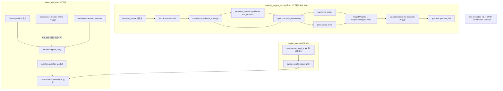

# 07. 포트폴리오 엔진

> **범위**: `src/omra/engine/` 전체 — 역최적화 균형수익률·Black-Litterman, Ledoit-Wolf 공분산(용도별 2추정기), 제약 MVO 2단계(연속 최적화 → 정수 수량화)·턴오버 L1, HRP sanity check·괴리 판정, rebalancer(cash-flow first + 드리프트 밴드 → 계획 산출), 유니버스 필터 파이프라인, 평가액 기반 축소·복원(P4b), glide path, block bootstrap 몬테카를로, 듀얼 모멘텀 위성 오버레이(기본 OFF), 크립토 슬리브 규칙, asset location과의 결합.
> **계획 정본**: 02 §1.1·§1.2·§2.3·§3 전체·§4.0~§4.3·§4.6·§4.7·§6·§7·§9·부록 A / 05 §4·§10 / 01 §2·§3.1·§4.2.
> **선행 문서**: [01-system-architecture.md](01-system-architecture.md)(패키지 좌표·import 계약·`to_thread` 규율), [02-domain-model.md](02-domain-model.md)(Decimal·식별자·`RebalancePlan`·`TargetWeights`·`SanityResult`), [03-data-and-persistence.md](03-data-and-persistence.md)(DDL·Parquet), [06-market-data-and-calendar.md](06-market-data-and-calendar.md)(가격·FX·지표 캐시), [10-tax-engine.md](10-tax-engine.md)(`decompose_to_accounts`·매도 마스크).
> **이 문서가 소유하는 정의**: 최적화·리밸런서 알고리즘(브리프 §2.1 "07" 행). 즉 **수치 산출과 계획 산출까지**이며, 주문 조립·집행([08-execution.md](08-execution.md))·브레이커 발동([09-safety-protections.md](09-safety-protections.md))·세금 로직([10-tax-engine.md](10-tax-engine.md))·백테스트 러너([15-backtest-and-validation.md](15-backtest-and-validation.md))는 소유하지 않는다.

---

## 1. 개요 — 설계 대상과 책임

### 1.1 책임

`engine/`은 **순수 함수 수치 계층**이다(정본: 01 §2 "순수 함수 수치 엔진(백테스트와 공유)"). 라이브 스케줄러와 백테스트 러너가 **같은 함수를 호출**하고, 서로 다른 것은 주입되는 스냅샷뿐이다(02 §8.1 "라이브 엔진과 밴드 판정·정수화·세금 코드를 공유").

| # | 책임 | 절 | 소비 잡(정본: 01 §4.2) |
|---|---|---|---|
| 1 | 균형수익률 역최적화 + BL 견해 결합 | §4 | `monthly_targets_batch`(1일 03:30) |
| 2 | `Σ_strategic`(LW) / `Σ_monitor`(EWMA) 2추정기 | §5 | 〃 / 일 1회 |
| 3 | 제약 MVO 연속 최적화 + 턴오버 L1 | §6 | `monthly_targets_batch` |
| 4 | 정수 수량화(전체·부분) | §7 | 재분해 시점 / `signal_and_plan`(07:30) |
| 5 | 소액 계좌 유니버스 축소·복원(P4b) | §8 | `monthly_targets_batch` 내부 |
| 6 | HRP sanity·괴리 판정 | §9 | `monthly_targets_batch` |
| 7 | 리밸런서(재정규화·밴드·cash-flow first·제약 시정) | §10 | `signal_and_plan` |
| 8 | 크립토 슬리브 판정·vol 스케일 | §11 | `crypto_execute`(09:00)·`crypto_vol_scale_update`(**일요일** 05:00 — 주 1회, 01 §4.2) |
| 9 | 듀얼 모멘텀 위성 오버레이(기본 OFF) | §12 | `signal_and_plan` 내부 서브스텝 |
| 10 | glide path | §13 | `monthly_targets_batch` |
| 11 | block bootstrap 몬테카를로 | §14 | `mc_projection`(분기 첫 영업일 04:00) |
| 12 | 유니버스 필터 파이프라인 | §15 | `universe_reeval`(1일 02:30) |

### 1.2 이 문서가 소유하지 않는 것 (경계)

| 주제 | 소유 | 이 문서의 접점 |
|---|---|---|
| `decompose_to_accounts`(asset location 분해 알고리즘) | [10-tax-engine.md](10-tax-engine.md) §5.2 | 호출·트리거 판정·산출물 영속화는 이 문서 §16 |
| `blocked_for_sell` / `mandatory_orders` / `tax_overlay` | [10-tax-engine.md](10-tax-engine.md) §2.2 | 리밸런서가 마스크로 소비(§10.5) |
| `partition_by_tradability` / `blocked_for_buy` | [11-realtime-and-surveillance.md](11-realtime-and-surveillance.md)(감시 gate 6종) | 〃 |
| plan → Order 조립·`safemode_filter`·순매수 투영 | [08-execution.md](08-execution.md) §4 | 산출 타입 계약(§3.4) |
| P1·P7·P7-cond 발동·해제, 5축 실효 제약 결합 | [09-safety-protections.md](09-safety-protections.md) | 엔진은 **진단값만** 반환(§5.4·§9.3) |
| 카나리 α 블렌딩 로직·변경 예산 | [14-research-and-labs.md](14-research-and-labs.md) | `w_prev`·`w_effective` 소비 규칙(§6.4) |
| 백테스트 러너·`BarView`·검증 게이트 | [15-backtest-and-validation.md](15-backtest-and-validation.md) | 공유 규율(§17) |
| config 키 스키마·기본값 파일 | [04-configuration-and-secrets.md](04-configuration-and-secrets.md) | 키 이름은 02 부록 A 표기를 그대로 사용 |

### 1.3 실패 시 안전 방향 (전 절 공통)

1. **수치 산출 실패 → 직전 유효 목표 유지**(02 §3.3 "솔버 실패 시 직전 유효 목표 유지 + 플래그"). 운용 정지가 아니다(00 §5 원칙 10).
2. **판정 불가 → 계획에서 제외**(해당 자산만). 전면 중단으로 확대하지 않는다.
3. 엔진은 **어떤 상태 전이도 일으키지 않는다.** 브레이커 입력이 될 진단값(`condition_number`, `hrp_gap_max`, `infeasible`)을 반환하고 발동은 09가 한다.
4. 엔진은 **주문을 만들지 않는다** — 비중·수량·레그까지만 만들고 `Order`는 08이 만든다.

---

## 2. 모듈 구조

### 2.1 파일 트리 (좌표 정본: 01 §2, [01-system-architecture.md](01-system-architecture.md) §2.1)

```
src/omra/engine/
├── types.py               # 입력 스냅샷·산출 타입 (§3) — 이 패키지의 유일한 공개 어휘
├── numerics.py            # Decimal ↔ float64 경계·양자화·inputs_hash (§3.3)
├── expected_returns.py    # 역최적화 Π + Black-Litterman posterior (§4)
├── covariance.py          # Σ_strategic — Ledoit-Wolf 상수상관 (§5.2)
├── covariance_monitor.py  # ★ Σ_monitor — EWMA(λ=0.94, 60일). 계약 C10 격리 (§5.3)
├── optimizer.py           # 제약 MVO 1단계 + lambda_risk 캘리브레이션 (§6)
├── quantize.py            # 2단계 정수 수량화(전체·부분) (§7)
├── shrink.py              # 소액 계좌 유니버스 축소·복원 P4b (§8)
├── sanity.py              # HRP 병렬 계산·괴리 판정·Schur 진단 기록 (§9)
├── rebalancer.py          # 재정규화·밴드 판정·cash-flow first·제약 시정 (§10)
├── bands.py               #   band_for·밴드폭·복귀 규칙(fraction/destination) (§10.4·§10.9)
├── universe.py            # 유니버스 필터 파이프라인 (§15)
├── glide.py               # glide path 구간 규칙 (§13)
├── montecarlo.py          # stationary block bootstrap + Guyton-Klinger (§14)
├── overlay/
│   ├── __init__.py
│   ├── momentum.py        # 듀얼 모멘텀 위성 (기본 OFF) (§12)
│   └── crypto.py          # 크립토 슬리브 규칙·vol 스케일 (§11)
└── solvers.py             # skfolio/CVXPY 어댑터 — 외부 라이브러리 격리 지점 (§6.5)
```

`portfolio/`(포지션·NAV 원장)는 01 §2.2 매핑상 07/08 분담이다. **이 문서는 `portfolio/`의 읽기 뷰 타입(`PortfolioView`·`AccountView`, §3.2)만 소유**하고, 원장 갱신·체결 반영은 08이 소유한다.

### 2.2 순수성 계약

> **[DD-07-1] `engine/` 순수성 계약 (기계 검사 가능한 형태)**
> - 결정: `engine/` 전 모듈에 다음 5개를 강제한다. ① I/O 금지 — DB·파일·네트워크·`persistence`·`brokers`·`data`·`execution`·`tax`·`surveillance`·`realtime` 어느 것도 import하지 않는다(단 `rebalancer`는 계획 01 §2.2가 명시 허용한 `surveillance.gate` **타입**만 예외로 import 가능하며, 실제 호출은 주입된 마스크로 대체한다 — §10.5). ② `Clock` 주입 금지 — 시각 의존은 `as_of: date` 인자로만 표현한다([DD-02-11] ②와 동일). ③ 난수는 `numpy.random.Generator`를 인자로 주입받는다(전역 시드 금지). ④ 모든 공개 함수는 **같은 입력 → 같은 출력**이며 부수효과가 없다(로깅 포함 — 감사로그 기록은 호출부가 한다). ⑤ 예외는 `core.errors` 계층만 던진다(정본: [02-domain-model.md](02-domain-model.md) §10).
> - 근거: 01 §2가 "engine = 순수 함수 수치 엔진(백테스트와 공유)"으로 규정했으나 순수성의 조작적 정의가 없다. ①이 없으면 백테스트가 라이브 DB를 읽고, ②가 없으면 스냅샷 회귀(02 §8.2 게이트 C3)가 비결정적이 되며, ③이 없으면 몬테카를로 결과가 재현되지 않는다. 01 §4.4의 `asyncio.to_thread` 오프로드 조건("오프로드 대상은 engine의 순수 함수만")도 이 계약을 전제한다.
> - 계획 문서와의 관계: 01 §2·§2.2·02 §8.1의 여백 채움. 충돌 없음. 아키텍처 테스트로 강제(수거: [16-testing-and-quality.md](16-testing-and-quality.md)).

**⑤가 요구하는 예외 기저**: 이 문서가 던지는 예외는 `InsufficientDataError`·`NotPositiveSemiDefiniteError`·`SingularMatrixError`·`InfeasibleError`·`UniverseMismatchError`·`UniverseSpecError`·`ViewLimitError`·`ViewSpecError`·`ParameterRangeError` 9종이며, 그 밖에 core의 `InvariantViolation`을 재사용한다. 이 9종을 담을 기저는 **02가 [DD-02-20]으로 `EngineError(OmraError)` 최상위 분기를 신설해 확정했다**([02-domain-model.md](02-domain-model.md) §10.1·§10.2 규칙 5 — 요청 §21.1-6 해소). 따라서 위 9종은 전부 `EngineError` 하위로 정의하며(**하위 클래스 정의는 이 문서 소유, 기저·`retryable` 규약은 02 정본**), `issubclass(_, EngineError)` 계약 테스트로 기계 검사한다(02 §10.2 검증 항목, 수거: [16-testing-and-quality.md](16-testing-and-quality.md)).

### 2.3 잡별 호출 그래프



---

## 3. 공통 타입과 수치 규약 (`types.py`, `numerics.py`)

### 3.1 산출 타입 (엔진 → 상위)

```python
# engine/types.py
from __future__ import annotations
from dataclasses import dataclass
from datetime import date
from decimal import Decimal
from typing import Mapping, Sequence, Protocol, Final

from omra.core.accounts import Account, AccountType, AccountMode, SleeveId
from omra.core.models import Instrument, OrderSide, OrderIntent, TargetWeights, SanityResult
# ↑ 정의 정본: 02-domain-model.md §3·§4·§7. 이 문서는 재정의하지 않는다.

AccountId = str            # 02 §3.3 슬러그
InstrumentKey = str        # 02 §3.2 "{venue}:{code}"
Weight = Decimal           # 총자산 대비 비중
Krw = Decimal              # 원 단위 (반올림 규약: core.money.krw_floor)

@dataclass(frozen=True)
class PlannedLeg:
    """엔진이 만드는 '주문 이전' 단위. Order가 아니다 — 가격·상태·ID가 없다."""
    account_id: AccountId
    instrument_key: InstrumentKey
    side: OrderSide
    qty: Decimal                       # 정수화 완료 수량 (lot_step 격자)
    notional_krw: Krw                  # 판정 시점 추정 금액 (T_min·상한 판정 입력)
    origin: OrderIntent                # 출처 태그의 유일 정본 = 02 §7.2 [DD-02-6]·[DD-02-17](11값)
    paired: bool                       # 밴드 복귀 매도+매수 쌍 여부 (03 §2.2 차단 우선순위 입력)
    reason_code: str                   # "band_individual" | "band_class" | "cashflow" | …

@dataclass(frozen=True)
class DailyPlanResult:
    """07:30 signal_and_plan의 엔진 측 산출물 전량."""
    plan_weights: Mapping[tuple[AccountId, InstrumentKey], Weight]   # 08 §4.2 assemble 1st arg
    plan_origins: Mapping[tuple[AccountId, InstrumentKey], OrderIntent]
    # ↑ plan_weights와 **같은 키 집합**. 밴드 경로 레그의 출처 태그를 정수화까지 운반한다
    #   (BAND_RESTORE | CLASS_BAND | TARGET_SHIFT — 귀속 규칙은 [DD-07-19]).
    #   이 맵이 없으면 quantize_partial이 origin을 복원할 수 없어 08 §4.4가
    #   '목표비중 하향 매도'(금지 4종 ①)를 판별할 키를 잃는다.
    cashflow: Sequence[PlannedLeg]
    constraint_cure: Sequence[PlannedLeg]
    satellite: Sequence[PlannedLeg]          # §12 위성 전환·DD 축소 (OFF면 빈 시퀀스)
    diagnostics: PlanDiagnostics

@dataclass(frozen=True)
class PlanDiagnostics:
    breaches: Sequence[BreachRow]            # (account, key, d, b, source)
    class_gap: Decimal
    class_breach: bool
    frozen_reserve: Mapping[AccountId, Krw]
    allocatable_cash: Mapping[AccountId, Krw]
    unresolved_class_gap: Decimal            # TE 분해 ①(비용) 계상 대상 (02 §4.3 기타 규칙)
    downgraded_targets_krw: Krw              # 분해 4단계 하향 총액 (02 §4.3.0-b)
    tmin_skipped: Sequence[tuple[AccountId, InstrumentKey, Krw]]  # EX-1 지표 (02 §8.2)
    invariant_report: Mapping[str, bool]     # §10.10 불변식 자기검사 결과
```

> **[DD-07-2] 엔진 산출 레그 타입 = `engine.types.PlannedLeg`, `origin`은 `core.OrderIntent`**
> - 결정: 엔진은 [08-execution.md](08-execution.md) §4.1의 `OrderDraft`를 직접 만들지 않고 `PlannedLeg`를 만든다. 08의 어셈블러가 1:1 어댑터(`to_draft`)로 변환한다. `origin` enum은 core의 `OrderIntent` **하나뿐**이며, 02 [DD-02-17]이 값 집합을 단일화한 뒤 08도 `LegKind`를 폐지했으므로(08 §4.1) **`PlannedLeg.origin → OrderDraft.origin → Order.intent`는 전 구간 항등 사상**이다.
> - 근거: `OrderDraft`는 `execution/assembler.py`에 산다. 엔진이 그것을 생성하면 `engine → execution` 간선이 생겨 "engine은 최하층 수치 계층"이라는 01 §2의 배치가 무너지고, 백테스트가 engine만 쓰려 해도 execution을 끌고 오게 된다. core의 `OrderIntent`는 02가 이미 "전 경로 일반화"로 선언했으므로 새 어휘를 만들지 않는다.
> - 계획 문서와의 관계: 계획 01 §2.2에 `engine → execution` 금지줄은 없다(default-allow). 즉 이것은 충돌 회피가 아니라 **계층 방향 보존을 위한 자발적 제약**이다. 엔진이 생성하는 값의 범위는 §3.4.

### 3.2 입력 뷰 (상위 → 엔진)

엔진은 라이브 DB도 백테스트 원장도 모른다. 호출부가 아래 Protocol을 만족하는 **스냅샷**을 만들어 넣는다.

```python
class PriceView(Protocol):
    """as_of 시점까지만 노출. 백테스트에서는 BarView(15 소유)가 이 Protocol을 구현한다."""
    def close(self, key: InstrumentKey) -> Decimal: ...                    # 판정 기준가(전일 종가)
    def history(self, key: InstrumentKey, field: str, bar_count: int) -> Sequence[Decimal]: ...
    def fx_planning(self) -> Decimal: ...      # 07:00 스냅샷 (06 §9.1 FxService.planning_rate)

class PortfolioView(Protocol):
    def held_qty(self, a: AccountId, key: InstrumentKey) -> Decimal: ...
    def held_krw(self, a: AccountId, key: InstrumentKey) -> Krw: ...
    def cash_krw(self, a: AccountId) -> Krw: ...          # 국내 T+2 예수금 기준 (02 §1.3)
    def buying_power_krw(self, a: AccountId) -> Krw: ...  # D+2 예수금 (02 §3.3 2단계)
    def v_total(self) -> Krw: ...
    def v_account(self, a: AccountId) -> Krw: ...
    def keys(self) -> frozenset[tuple[AccountId, InstrumentKey]]: ...

class UniverseView(Protocol):
    def members(self) -> frozenset[InstrumentKey]: ...
    def allowed(self, a: AccountId) -> frozenset[InstrumentKey]: ...        # 02 §1.2 표
    def asset_class(self, key: InstrumentKey) -> str: ...                   # 02 §4.3 EQUITY_ASSETS 입력
    def group(self, key: InstrumentKey) -> str: ...                         # §9.2 상위 배분 그룹
    def risk_asset(self, key: InstrumentKey) -> bool: ...                   # IRP 70% 입력 (02 §1.2)
    def instrument(self, key: InstrumentKey) -> Instrument: ...
    def approved_substitutes(self, key: InstrumentKey) -> frozenset[InstrumentKey]: ...

class MaskView(Protocol):
    """감시·세금이 만든 방향 마스크. 엔진은 판정하지 않고 소비만 한다 (02 §4.3 (1))."""
    frozen: frozenset[InstrumentKey]                    # SV3 양방향 (11 소유)
    buy_blocked: frozenset[InstrumentKey]               # SV2 · unknown (11 소유)
    sell_blocked: frozenset[tuple[AccountId, InstrumentKey]]   # §5.2 soft-stop·ISA 70% (10 소유)

class StateView(Protocol):
    """5축 실효 제약 조회. 결합 로직·전이는 09 소유 (정본: 03 §2.1).
       메서드 이름은 [09-safety-protections.md](09-safety-protections.md) §7.3
       `StateView`의 부분집합을 그대로 쓴다 — 이 문서는 재정의하지 않는다."""
    def effective_constraints(self, sleeve: SleeveId) -> ConstraintVector: ...  # core.states (02 §9)
    def is_safe_mode(self) -> bool: ...
    def in_cooldown(self, a: AccountId, key: InstrumentKey, days: int) -> bool: ...
    # ↑ `in_cooldown`(rebalance.cooldown_days, `(account, instrument)`별 마지막 체결일 —
    #   계획 02 §4.3 보조 정의)은 09 §7.3 `StateView`에 아직 없다. 신설 요청: §21.1.
```

**`history`의 인자명은 `bar_count`다**([15-backtest-and-validation.md](15-backtest-and-validation.md) §6.1 `BarView.history`와 통일 — 15의 조율 요청 회신. Protocol은 07이 소유하므로 이름 확정도 07이 한다). `field`는 **`str` 계약**이며 15의 `Field(StrEnum)` 값이 그대로 들어간다 — 다만 구조적 타이핑(파라미터 타입 반변)상 구현부 애노테이션도 `str`이어야 Protocol을 만족하므로, `BarView.history`의 `field` 애노테이션은 `str`(또는 `Field | str`)로 둔다.

### 3.3 수치 타입 경계

> **[DD-07-3] Decimal ↔ float64 경계 규약**
> - 결정: ① 엔진의 **경계 타입은 전부 `Decimal`**이고(02 §5 규약), 선형대수·최적화 내부만 `numpy.float64`로 계산한다. ② 변환 지점은 `numerics.to_float_matrix()` / `numerics.to_decimal_weights()` 두 함수뿐이며 그 밖의 `float()` 호출은 아키텍처 테스트로 금지한다. ③ 비중 산출물은 `quantize(Decimal("0.000001"), ROUND_HALF_EVEN)`로 6자리 고정한 뒤, 잔차(`1 − Σw − w_cash`)를 **가장 큰 비중 자산 1개에** 흡수시켜 합=1을 정확히 맞춘다. ④ 금액·수량 반올림은 언제나 `core.money.krw_floor`·`qty_floor`(02 §5.3).
> - 근거: 02 §5.1이 "금액·수량·가격·비중은 전부 Decimal"을 요구하지만 skfolio·CVXPY·numpy는 float64로만 동작한다. 경계를 두 함수로 좁히지 않으면 float이 도메인 안으로 새어 03의 TEXT 직렬화 정규형([DD-02-10])이 깨진다. 잔차 흡수 규칙이 없으면 `Σ sub_total + cash_target = 1`(02 §4.3.0-a 일별 어서션)이 6자리 반올림 오차로 실패한다.
> - 계획 문서와의 관계: 여백 채움. 충돌 없음.

> **[DD-07-4] 연율화 계수와 룩백 창의 조작적 정의**
> - 결정: 일간 → 연간 환산은 **252 거래일**, 월간 → 연간은 **12개월**로 고정한다. `cov.lookback_days: 756`은 "as_of 이전(포함) 마지막 756개 **유효 관측 행**"이며 달력일이 아니다. 관측이 756 미만이면 `InsufficientDataError`(§5.5)로 실패하고 직전 목표를 유지한다.
> - 근거: 02 §3.2가 "룩백 756영업일", "연율화"만 정하고 계수를 정하지 않았다. 756 = 3년 × 252의 역산이므로 252가 계획과 정합하는 유일한 값이다.
> - 계획 문서와의 관계: 02 §3.2·부록 A `cov.lookback_days`의 여백 채움. 충돌 없음.

**`inputs_hash` 산출**(재현성 — `TargetWeights.inputs_hash`, 01 §6.3): 정렬된 `(instrument_key, trade_date, close, fx)` 튜플 스트림 + 소비한 config 키·값 + 엔진 버전 문자열을 canonical JSON으로 직렬화해 SHA-256. 06 §7.3 `IndicatorRow.inputs_hash`와 **같은 함수를 공유**한다(`numerics.inputs_hash`).

### 3.4 `PlannedLeg` → `OrderDraft` 어댑터 = 항등 사상 (08 §4.1과의 계약)

**변환표는 없다.** 출처 태그의 타입·필드·값 집합은 `core.models.OrderIntent` 하나뿐이며(정본: 02 §7.2 [DD-02-17]), 08이 `LegKind`를 폐지해 `OrderDraft.origin: OrderIntent`를 직접 쓰므로(08 §4.1 `to_draft`) `PlannedLeg.origin`은 **이름 변환 없이 그대로** `OrderDraft.origin` → `Order.intent`로 흐른다. 이 절이 종전에 두었던 과도기 매핑표(`CLASS_BAND→CLASS_RESTORE` 등)는 단일화 완료로 소멸했다.

아래 표는 매핑이 아니라 **엔진이 어느 값을 생성하는가**의 범위 선언이다(11값 중 7값).

| `OrderIntent` 값 | 엔진 생성 | 생성 지점 |
|---|---|---|
| `BAND_RESTORE` | ✅ | §10.6 개별 자산 밴드 복귀 |
| `CLASS_BAND` | ✅ | §10.7 자산군 갭 분해분 |
| `TARGET_SHIFT` | ✅ | §10.6·§10.7 중 **목표비중 하향에 귀속되는 매도** — [DD-07-19] |
| `CASHFLOW` | ✅ | §10.8 cash-flow first |
| `CONSTRAINT_CURE` | ✅ | §10.9 계좌 hard 제약 시정 |
| `CRYPTO_SLEEVE` | ✅ | §11.3 슬리브 판정 |
| `SATELLITE_DD` | ✅ | §12.3 위성 전환·DD 축소 |
| `HARVEST`·`E7_TRANSFER`·`WITHDRAWAL`·`MANUAL` | ❌ | tax(10)·승인 큐(13)가 생성. 엔진은 이 4값을 만들지 않는다 |

- **`TARGET_SHIFT`를 `BAND_RESTORE`로 접지 않는다.** 접으면 08 §4.4 `safemode_filter`가 SAFE_MODE 금지 4종 ①("목표비중 하향에 따른 매도")을 판별할 키를 잃고, "SAFE_MODE의 본질은 목표비중을 낮추는 어떤 자동 행위도 없음"(02 §4.6)이 집행 측에서 강제되지 않는다. 08 §4.1 표가 `TARGET_SHIFT`를 "신규 통과값 — §4.4의 판별 키"로 이미 수용했다.
- 매도/매수 방향 세분(`*_SELL`/`*_BUY`)은 `origin` 값으로 만들지 않는다 — 방향은 `PlannedLeg.side`에 있고, 소비 측은 `(origin, side)` 조합으로 읽는다(02 [DD-02-17]-③).
- 아키텍처 테스트: `engine/`이 생성한 `PlannedLeg.origin` 값 집합 ⊆ 위 7값(스냅샷). 나머지 4값이 엔진 산출물에 나타나면 실패.

---

## 4. 기대수익 — 역최적화 + Black-Litterman (`expected_returns.py`)

### 4.1 시그니처

```python
@dataclass(frozen=True)
class EquilibriumResult:
    pi: Mapping[InstrumentKey, Decimal]        # 연율 초과수익 Π
    delta_mkt: Decimal                         # 사용한 위험회피계수 (감사)
    w_mkt: Mapping[InstrumentKey, Decimal]

def equilibrium_returns(
    sigma: CovarianceResult,                   # §5.1 — Σ_strategic 전용
    w_mkt: Mapping[InstrumentKey, Decimal],    # market_weights.yaml 전개 결과
    delta_mkt: Decimal,                        # bl.delta_mkt = 3.0 (허용 2~4)
) -> EquilibriumResult:
    """Π = delta_mkt · Σ · w_mkt   (02 §3.1-3, KRW 기준 연율화)"""

@dataclass(frozen=True)
class View:
    picks: Mapping[InstrumentKey, Decimal]     # P 행 1개 (합 0 또는 1 — §4.3 검증)
    q: Decimal                                 # 견해 수익률
    confidence: Decimal                        # Idzorek 신뢰도 0<c<=0.5 (상한 50%)

def bl_posterior(
    pi: EquilibriumResult,
    sigma: CovarianceResult,
    views: Sequence[View],                     # len <= bl.max_views (3)
    tau: Decimal,                              # bl.tau = 0.025 (허용 0.02~0.05)
    shift_cap: Decimal,                        # bl.view_shift_cap = 0.015 (±1.5%p)
) -> Mapping[InstrumentKey, Decimal]:
    """E[r] = [(τΣ)⁻¹ + PᵀΩ⁻¹P]⁻¹ [(τΣ)⁻¹Π + PᵀΩ⁻¹Q]   (02 §3.1-4)
    views가 비면 Π를 그대로 반환한다(posterior = prior). 기본값은 0개다."""
```

### 4.2 의사코드

```
equilibrium_returns:
1. w_mkt 키 집합 == sigma 키 집합인지 확인. 불일치 → UniverseMismatchError
2. Σ(연율, KRW) · w_mkt 행렬곱 → π_vec
3. π = delta_mkt × π_vec.  Decimal 6자리 양자화 ([DD-07-3] ③)

bl_posterior:
1. len(views) == 0 → return pi (조기 반환. 이 경로가 기본값이다)
2. len(views) > bl.max_views → ViewLimitError  (계획: 견해 ≤3개 강제)
3. P(k×N), Q(k) 조립. 각 View.picks의 키가 유니버스에 없으면 UniverseMismatchError
4. Ω = Idzorek 신뢰도 방식(간이식 — [DD-07-17]):
      ω_k = ((1−c_k)/c_k) · (p_kᵀ (τΣ) p_k)     ← c_k ≤ 0.5 강제(상한 50%)
5. posterior = [(τΣ)⁻¹ + PᵀΩ⁻¹P]⁻¹ [(τΣ)⁻¹Π + PᵀΩ⁻¹Q]
6. ★ 클리핑: 자산별 |posterior_i − Π_i| > shift_cap 이면 Π_i ± shift_cap 으로 절단
      (02 §3.1-4 "자산별 이동폭 ±1.5%p 클리핑" — 사후 절단이며 재최적화하지 않는다)
7. 클리핑이 1건이라도 발생하면 diagnostics.views_clipped 에 기록 → 브리핑 표기
```

> **[DD-07-17] Ω 조립 = Idzorek 간이식 `ω_k = ((1−c_k)/c_k)·p_kᵀ(τΣ)p_k`**
> - 결정: 02 §3.1-4가 지목한 "Idzorek 신뢰도 방식(상한 50%)"의 구현을 **간이식(closed form)**으로 확정한다. Idzorek 원논문의 완전한 절차는 "목표 틸트를 재현하는 ω를 역산하는 반복 루틴"이지만, 우리는 그 반복 루틴을 쓰지 않고 위 닫힌 형태를 쓴다. `c_k`는 `View.confidence`(0 < c ≤ 0.5)이며 `c_k = 0`은 `ViewSpecError`다.
> - 근거: 견해 개수 상한이 3개이고 기본값이 0개(§4.2 1단계 조기 반환)라 반복 역산의 정밀도 이득이 산출물에 나타나지 않는 반면, 반복 루틴은 수렴 실패 경로를 하나 더 만든다. 간이식은 c→0에서 ω→∞(견해 무시), c→0.5에서 ω = pᵀτΣp(사전분포와 동등 가중)로 단조이며, 이는 계획이 요구한 "보수적 소수 견해"와 방향이 같다.
> - 계획 문서와의 관계: 02 §3.1-4는 방식 이름과 상한(50%)만 정하고 산식을 비웠다. 여백 채움이며 `bl.max_views`(3)·`view_shift_cap`(±1.5%p)은 그대로 유지되므로 충돌 없음.

### 4.3 오류 경로·엣지

| 상황 | 처분 |
|---|---|
| `(τΣ)`가 수치적 특이(역행렬 실패) | `SingularMatrixError` → 상위(잡)가 직전 `targets.yaml` 유지 + 플래그 (02 §3.3) |
| `delta_mkt` ∉ [2, 4] | config 로드 시 거부(04 소유). 엔진은 방어적으로 `ParameterRangeError` |
| `View.picks` 합이 0도 1도 아님 | `ViewSpecError` — relative view(합 0)·absolute view(합 1)만 허용 |
| `w_mkt` 합 ≠ 1 (±1e-6) | 정규화하지 않고 `ParameterRangeError`. 조용한 정규화는 P6(`market_weights` 갱신)의 감사 흔적을 지운다 |

**표본평균 기대수익 경로 부재의 강제**(02 §3.1-5): `expected_returns.py`는 수익률 시계열(`PriceView.history`)을 **인자로 받지 않는다**. 입력은 `sigma`·`w_mkt`·`views`뿐이다. 아키텍처 테스트로 "이 모듈이 `PriceView`를 import하지 않는다"를 강제한다 — 코드 경로 자체가 없다는 계획 문장의 기계적 대응물이다.

### 4.4 검증 항목

- Π 재현: 고정 Σ·w_mkt·δ 벡터에 대한 골든 값 회귀.
- 견해 0개 → posterior == Π (비트 단위 동일, 조기 반환 경로 확인).
- 클리핑: ±1.5%p를 넘는 견해를 주입해 절단 발생·`views_clipped` 기록 확인.
- `bl.max_views` 초과·`picks` 합 위반·특이행렬 3종 예외.
- 아키텍처: `expected_returns.py`가 `PriceView`·`covariance_monitor`를 import하지 않는다(C10 포함).

---

## 5. 공분산 — 용도별 2추정기 (`covariance.py`, `covariance_monitor.py`)

### 5.1 공통 타입과 수익률 행렬 구성

```python
@dataclass(frozen=True)
class CovarianceResult:
    keys: Sequence[InstrumentKey]              # 행렬 축 순서 (사전식 정렬 — 결정론)
    matrix: Sequence[Sequence[Decimal]]        # 연율화 공분산 (KRW 기준)
    n_obs: int
    condition_number: Decimal                  # §5.4 게이트 입력
    excluded: Mapping[InstrumentKey, str]      # 제외 자산 → 사유
    estimator: str                             # "ledoit_wolf_cc" | "ewma_0.94_60"
    inputs_hash: str

def build_return_matrix(
    keys: Sequence[InstrumentKey],
    prices: PriceView,
    universe: UniverseView,
    as_of: date,
    lookback: int,                             # 756 | 60
) -> ReturnMatrix:
    """KRW 환산 일간 로그수익률 행렬. 규칙:
       - 환노출(UH) 자산: KRW 환산 가격의 수익률
       - 환헤지(H) 자산: 현지통화 수익률 (02 §3.2 "헤지형 자산은 현지통화 수익률")
       - 결측일: 해당 날짜를 전 자산에서 제거(listwise) — 부분 보간 금지
       - 유효 관측 < lookback → InsufficientDataError ([DD-07-4])"""
```

> **[DD-07-5] 2년 미만 자산의 처리 = 기본 제외, 대리지수 백필은 명시 선언 시에만**
> - 결정: 02 §3.2의 "2년 미만 자산은 제외 **또는** 대리지수 백필"에서 기본 동작을 **제외**로 확정한다. `universe.yaml`의 종목 항목에 `proxy_index_key`가 선언된 경우에만 그 지수 수익률로 앞부분을 백필하며, 백필 구간은 `CovarianceResult.excluded`가 아니라 `diagnostics.backfilled[key] = n_days`로 기록해 감사에 남긴다. 백필 비율이 룩백의 50%를 넘으면 그 자산은 **제외**로 강등한다.
> - 근거: 계획이 "또는"으로 둔 것을 구현자가 선택하면 백테스트와 라이브가 다른 유니버스를 쓸 수 있다. 기본을 제외로 두는 것이 보수적이고(모르는 자산에 배분하지 않는다), 백필은 선언적 옵트인이라야 05 §1.5의 lookahead 규율과 정합한다.
> - 계획 문서와의 관계: 02 §3.2의 선택지 확정. `proxy_index_key` 스키마 등재는 [04-configuration-and-secrets.md](04-configuration-and-secrets.md)에 위임. 충돌 없음.

### 5.2 `Σ_strategic` — Ledoit-Wolf 상수상관

```python
def estimate_strategic(
    returns: ReturnMatrix,                     # lookback = cov.lookback_days (756)
) -> CovarianceResult:
    """Ledoit-Wolf 상수상관(constant-correlation) shrinkage.
       구현: solvers.ledoit_wolf_cc(...) — skfolio 공분산 추정기 위임 (§6.5)
       연율화: ×252 ([DD-07-4]).  estimator = "ledoit_wolf_cc"
       월 1회(`monthly_targets_batch`)만 호출된다."""
```

상수상관 타깃 선택의 근거는 자산 수 N≤225에서 상수상관 타깃이 **단일팩터 타깃보다** 우수하다는 실증이며(05 §4.3), 우리 유니버스는 N≈8~12로 이 조건에 부합한다. **고차원 처방(nonlinear shrinkage/QIS·denoising·detoning·NCO)은 채택 금지**(02 §3.6, 05 §10.1) — `solvers.py`에 해당 추정기를 감싸는 함수를 두지 않는 것으로 코드 레벨에서 봉인한다.

### 5.3 `Σ_monitor` — EWMA (분리 강제)

```python
# engine/covariance_monitor.py  — 계약 C10이 optimizer·rebalancer·expected_returns의 import를 금지
def estimate_monitor(
    returns: ReturnMatrix,                     # lookback 60일
    lam: Decimal = Decimal("0.94"),
) -> CovarianceResult:
    """EWMA(λ=0.94, 60일) 연율화. 소비자는 모니터링·서킷브레이커·리포팅뿐이다
       (02 §3.2 표). estimator = "ewma_0.94_60"."""

def realized_vol(returns: ReturnMatrix, weights: Mapping[InstrumentKey, Decimal]) -> Decimal:
    """사후(실현) 변동성 — realized_vol_dev(±30%)의 입력. 알림 전용, 집행 영향 없음
       (02 §3.2 표: '런타임에서 변동성 이탈을 이유로 집행을 멈추는 경로는 존재하지 않는다')."""
```

**유일하게 승인된 예외**는 크립토 슬리브 vol targeting의 σ_realized다(02 §7·§3.6). 그 계산은 `overlay/crypto.py`가 **자체 EWMA 구현이 아니라 이 모듈의 함수를 호출**해 수행하며, 계약 C10의 source에 `overlay.crypto`가 들어 있지 않으므로 import가 허용된다. 코어에 복사하지 않는다.

### 5.4 조건수 게이트 (P7-cond 입력)

```
condition_number = σ_max(Σ) / σ_min(Σ)          # 고유값 비
> cov.condition_number_max (1,000) 이면:
    CovarianceResult.condition_number 를 그대로 반환하고
    엔진은 예외를 던지지 않는다.
    판정·발동은 09(protections)가 한다 — P7-cond: 신규 목표비중 반영 금지 +
    직전 유효 목표로 계속 운용, HALT 아님, 등급 C, 다음 월 배치 자동 재평가,
    3개월 연속 시 등급 A 격상 (정본: 03 §1.2, 02 §3.2).
```

**엔진이 판정하지 않는 이유**: P7-cond는 3개월 연속 여부라는 **상태**를 요구하는데 엔진은 상태를 갖지 않는다([DD-07-1] ④).

### 5.5 오류 경로·검증 항목

| 상황 | 처분 |
|---|---|
| 유효 관측 < lookback | `InsufficientDataError` → 잡이 직전 목표 유지 + warning |
| 결측 제거 후 관측 < lookback | 위와 동일(한 번만 판정) |
| 행렬이 양의 준정부호가 아님 | `NotPositiveSemiDefiniteError` — LW shrinkage 후에는 발생하지 않아야 하므로 **버그 신호**. 상위는 critical |

- LW 산출물의 대각합·상관 상한 골든 회귀(고정 시드 합성 데이터).
- 헤지형 자산이 현지통화 수익률을 쓰는지 확인(KRW 급변 구간 합성 데이터에서 Σ가 흔들리지 않음).
- 조건수 계산이 임계 근방(999/1001)에서 올바른 값을 반환.
- 아키텍처: `optimizer`·`rebalancer`·`expected_returns` → `covariance_monitor` import 0건(C10).
- `estimate_strategic`과 `estimate_monitor`가 **같은 입력에 다른 값**을 낸다(분리가 실효적인지의 스모크).

---

## 6. 제약 MVO 1단계 — 연속 최적화 (`optimizer.py`)

### 6.1 목적함수·제약 (정본: 02 §3.3 1단계)

```
maximize_w   μᵀw − (lambda_risk/2)·wᵀΣw − γ·‖w − w_prev‖₁
subject to   1ᵀw + w_cash = 1,   w_cash ≥ cash.buffer (1%)
             l_i ≤ w_i ≤ u_i          단일 ETF ≤ 40%(mvo.asset_cap), 나스닥 ≤10%, 리츠 ≤5%,
                                      금 5%±3%p
             L_g ≤ Σ_{i∈g} w_i ≤ U_g  주식 합계 = 레벨 표 ±5%p, 한국주식 15~30%(주식 내)
             √(wᵀΣw) ≤ σ_target(level) × 1.1        (소프트 — §6.3)
γ = mvo.turnover_gamma = 1.0%
```

리스크 레벨 표(02 §1.1)는 `σ_target(level)`·주식 비중의 정본이다: 레벨 1~10 = 3.0 / 4.5 / 6.0 / 7.5 / 9.0 / **10.5**(기본 6) / 12.0 / 13.5 / 15.0 / 17.0 %, **주식(+리츠)** = 10 / 20 / 30 / 40 / 50 / **60** / 70 / 80 / 90 / 95 %. 계획 표의 모집단은 **리츠를 포함**하며, 이는 §10.7 자산군 밴드가 쓰는 `EQUITY_ASSETS`(리츠 제외)와 다르다 — 계획 자체의 불일치이므로 이 문서는 각 절에서 계획 문언을 그대로 따르고 §21.4에 이견으로 기록한다.

### 6.2 시그니처

```python
@dataclass(frozen=True)
class OptimizeResult:
    weights: Mapping[InstrumentKey, Decimal]   # Σw + w_cash = 1
    w_cash: Decimal
    lambda_risk: Decimal                       # 캘리브레이션 결과 (감사)
    ex_ante_vol: Decimal                       # √(wᵀΣ_strategic w) — 02 §3.2 ex_ante_vol_dev
    turnover_l1: Decimal                       # ‖w − w_prev‖₁
    soft_vol_violated: bool                    # §6.3 소프트 제약 완화 발생 여부
    solver: str                                # "skfolio_meanrisk" | "cvxpy_ecos" | …
    status: str                                # "optimal" | "relaxed:<n>" | "infeasible"

def solve_continuous(
    mu: Mapping[InstrumentKey, Decimal],       # §4 posterior (견해 0개면 Π)
    sigma: CovarianceResult,
    w_prev: Mapping[InstrumentKey, Decimal] | None,   # None → γ=0 (콜드스타트)
    constraints: MvoConstraints,               # §6.1 제약 묶음 (config에서 조립)
    level: int,                                # risk.level (본인 ±1로 3회 호출)
    params: MvoParams,                         # gamma, asset_cap, lambda_bounds, cash_buffer
) -> OptimizeResult:
```

### 6.3 `lambda_risk` 이분법 캘리브레이션

> **[DD-07-6] `lambda_risk` 이분법 캘리브레이션 알고리즘**
> - 결정: 목표 변동성 달성을 위한 이분법을 다음으로 확정한다. ① 탐색 구간 = `mvo.lambda_risk_bounds`(0.5 ~ 30) ② 목적 = `|ex_ante_vol(λ) − σ_target(level)| ≤ 0.001`(10bp 절대) ③ 최대 반복 **40회**(구간 폭 29.5 → 2⁻⁴⁰ 축소로 충분) ④ `ex_ante_vol(λ)`는 λ에 대해 단조 감소한다고 가정하고, 단조성 위반이 관측되면(중간값이 양 끝을 벗어남) 캘리브레이션을 중단하고 `λ = 구간 중앙값`을 채택 + `status="relaxed:monotonicity"` ⑤ 40회 안에 수렴 실패면 **구간 내 최소 오차 λ**를 채택하고 `soft_vol_violated=True` — 실패로 처리하지 않는다.
> - 근거: 02 §3.3이 "레벨별 이분법 캘리브레이션(허용 0.5~30)"만 정하고 수렴 기준·실패 처분을 정하지 않았다. ⑤가 없으면 정수 제약 없는 연속 문제에서도 목표 변동성이 도달 불가능한 유니버스(예: §8 축소 유니버스 + 레벨 9)에서 배치가 통째로 실패해 "직전 목표 유지"가 매월 반복된다.
> - 계획 문서와의 관계: 02 §3.3·부록 A `mvo.lambda_risk_bounds`의 여백 채움. 소프트 제약(σ_target×1.1)은 그대로 유지되며, 이 캘리브레이션이 그 소프트 제약을 대체하지 않는다(둘은 각각 "목표 근처로 맞추기"와 "상한 초과 방지").

```
calibrate(level, mu, sigma, constraints):
1. lo, hi = lambda_bounds                       # 0.5, 30
2. for it in range(40):
3.     mid = (lo + hi) / 2
4.     r = solve_once(mid)                      # §6.5 솔버 호출
5.     if r.status == "infeasible": return escalate_infeasible()   # §6.6
6.     if |r.ex_ante_vol − σ_target| <= 0.001: return r
7.     if r.ex_ante_vol > σ_target: lo = mid    # 위험이 크면 λ를 올린다
8.     else:                        hi = mid
9. return best_seen  (soft_vol_violated=True)
```

### 6.4 `w_prev` 기준점 결정 (정본: 02 §3.3)

```python
def resolve_w_prev(
    stored_targets: TargetWeights | None,      # var/policy/targets.yaml 로드 결과
    active_canary: ActiveCanary | None,        # 01 §5.3(a) restore_canaries 산출
) -> Mapping[InstrumentKey, Decimal] | None:
    """1. stored_targets is None (콜드스타트) → None 반환 → 호출부가 γ=0 (턴오버 항 제거)
       2. active_canary가 targets 대상이면 → w_champion (07 §8·§9, w_effective 아님)
       3. 그 외 → stored_targets.weights (직전 유효 목표)
       ★ 실제 보유 비중 w_total은 어떤 경우에도 쓰지 않는다 (02 §3.3 정본)."""
```

**금지 사항 3개**(계획 문장의 코드화): `w_prev = w_mkt` 대체값 금지 / `w_prev = w_effective`(α 혼합) 금지 / `w_prev = w_total` 금지. 세 경우 모두 `InvariantViolation`을 던지는 방어적 어서션을 `solve_continuous` 진입부에 둔다.

### 6.5 솔버 어댑터와 폴백 (`solvers.py`)

> **[DD-07-7] 솔버 폴백 사다리 3단**
> - 결정: ① 1차 = skfolio `MeanRisk`(정본: 02 §3.3 "솔버 skfolio(MeanRisk)/CVXPY") ② 2차 = 동일 문제를 CVXPY로 직접 조립해 재시도(라이브러리 계층 문제와 문제 자체의 infeasible을 구분하기 위함) ③ 3차 = **제약 완화 사다리**를 정해진 순서로 1단씩 풀며 재시도하고, 완화가 발생하면 `status="relaxed:<완화 단계>"`로 표기해 브리핑에 노출한다. 완화 순서(고정): **소프트 변동성 상한(σ_target×1.1) → 자산군 하한(L_g) → 개별 하한(l_i) → 개별 상한(u_i)**. **현금 버퍼 1%와 자산군 상한(U_g)은 완화 대상이 아니다.** ④ 3차까지 실패 시 `InfeasibleError` → 잡이 직전 유효 목표 유지 + critical.
> - 근거: 02 §3.3은 "실패 시 직전 유효 목표 유지 + 플래그"만 정하고 그 사이 단계를 비웠다. 완화 순서를 문서에 못박지 않으면 구현자가 임의 순서로 완화해 매월 다른 제약이 풀린다. 현금 버퍼를 완화 대상에서 뺀 이유는 그것이 정수화 잔차 흡수 장치(02 §3.3 2단계 "정수 잔차는 현금 버퍼 1%가 흡수")이고, 자산군 상한을 뺀 이유는 그것이 리스크 크기(00 §3.2 P7 hard rail)에 해당하기 때문이다.
> - 계획 문서와의 관계: 02 §3.3의 여백 채움. 완화가 리스크를 키우는 방향으로 가지 않도록 상한을 보호한다는 점에서 00 §3.1 "형태는 자동, 크기는 사람"과 정합.

**[확인 필요]** skfolio 0.20.1의 `MeanRisk`·`HierarchicalRiskParity`·`SchurComplementary` 실제 시그니처(파라미터명·제약 표현 방식). 05 §4.7이 "문서·PyPI 기준이며 실제 호출은 미검증, M1 버전 고정 시점에 실측"으로 명시했다. **확인 방법**: M1 의존성 고정 시 `solvers.py`의 계약 테스트(고정 입력 → 고정 출력)로 실측. 그때까지 `solvers.py`는 어댑터 함수 시그니처와 CVXPY 직접 구현(2차 경로)을 먼저 완성해 **1차가 없어도 동작하는 상태**를 유지한다.

### 6.6 목표비중 변경 분류 (승인 사다리 입력)

엔진은 분류만 계산하고 **적용·승인·예산 소비는 하지 않는다**(00 §3.2 P1~P3, 14·13 소유).

```python
class TargetChangeClass(StrEnum):
    AUTO_NO_CANARY = "auto_no_canary"      # max|Δw| ≤ 3%p — 카나리 없음, 예산 미소비
    AUTO_CANARY    = "auto_canary"         # 3~8%p — 카나리(1/3→2/3→1 × 5거래일) + 예산 1건
    APPROVE        = "approve"             # 8~20%p — A3, 14일 타임아웃 = 직전 목표 유지
    REJECT         = "reject"              # >20%p 또는 자산군 합계 >10%p — 자동 REJECT + critical

def classify_change(
    new: Mapping[InstrumentKey, Decimal],
    prev: Mapping[InstrumentKey, Decimal],
    group_of: Callable[[InstrumentKey], str],
) -> tuple[TargetChangeClass, Decimal, Mapping[str, Decimal]]:
    """반환: (분류, max|Δw_i|, 자산군별 |Δ합계|).
       임계는 02 부록 A policy.auto_threshold_pp(8%p)·reject_threshold_pp(20%p)와
       00 §3.2 P1의 3%p 구간, P3의 '자산군 합계 >10%p'."""
```

### 6.7 검증 항목

- 고정 입력 골든 회귀(스냅샷 회귀 게이트 C3의 엔진 측 절반 — 02 §8.2).
- 콜드스타트에서 γ=0이 적용되고 `w_prev` 대체값이 만들어지지 않음(property).
- 카나리 활성 시 `w_prev == w_champion`(07 §9 래칫 방지).
- 완화 사다리: 인위적 infeasible 4종에서 완화 순서가 표대로 진행되고 현금 버퍼·U_g가 절대 완화되지 않음.
- `classify_change` 경계값(2.99/3.0/3.01, 7.99/8.0, 19.99/20.0, 자산군 10.0).
- `ex_ante_vol`이 σ_target ±25%를 벗어나면 게이트 C1 실패로 이어짐(15와의 계약).

---

## 7. 2단계 — 정수 수량화 (`quantize.py`)

### 7.1 두 경로 (정본: 02 §3.3 2단계 + §4.3 보조 정의 `generate_orders`)

| 경로 | 대상 | 호출 시점 | 호출부 |
|---|---|---|---|
| `quantize_full` | 계좌의 **전체 유니버스** | 재분해 시점(§10.2 트리거) | **재분해를 수행한 잡 레이어** — 통상 `monthly_targets_batch`이나, §10.2 트리거 ②(유입)·③(연 1회)는 임의 판정일에 설 수 있으므로 그날 `signal_and_plan`의 전처리도 호출부가 된다 |
| `quantize_partial` | **breach 자산만** | 매 판정일 07:30 | 08 §4.2 `assemble` 1단계 |

계획 문장 그대로: "§3.3의 전체 유니버스 라운딩은 재분해 시점에만 돌고, 일별 집행은 이 부분 경로를 쓴다".

### 7.2 시그니처

```python
def quantize_full(
    sub_target: Mapping[AccountId, Mapping[InstrumentKey, Decimal]],  # 계좌 평가액 대비 비중
    portfolio: PortfolioView,
    prices: PriceView,
    universe: UniverseView,
    fx_order: Decimal,                         # 미국: 제출 직전 스냅샷 (06 §9.1 order_rate)
    params: QuantizeParams,                    # t_min, fx_buffer=0.005, band_for
) -> list[PlannedLeg]:

def quantize_partial(
    plan_weights: Mapping[tuple[AccountId, InstrumentKey], Decimal],  # 총자산 대비 목표 비중
    portfolio: PortfolioView,
    prices: PriceView,
    universe: UniverseView,
    fx_order: Decimal,
    params: QuantizeParams,
    origins: Mapping[tuple[AccountId, InstrumentKey], OrderIntent] | None = None,
) -> list[PlannedLeg]:
    """08 §4.2가 engine.quantize_partial(...)로 호출하는 함수. plan_weights는
       (a,i) → 총자산 대비 목표 비중이므로 계좌 KRW 금액 환산이 첫 단계다.
       origins = DailyPlanResult.plan_origins (§3.1). 산출 레그의 origin은 이 맵에서
       그대로 복사하며, 키가 없으면 BAND_RESTORE를 쓴다. **None은 호출부 미갱신 신호**이므로
       6인자 호출은 과도기 동안만 허용하고 계약 테스트로 경고한다 —
       origin이 소멸하면 08 §4.4의 SAFE_MODE 금지 4종 ① 판별이 불가능해진다(§3.4)."""
```

### 7.3 알고리즘 (02 §3.3 2단계의 1:1 구현)

```
계좌별로 독립 수행한다 — 계좌 간 자동 이체가 불가능하므로 총자산 1회 라운딩은
실행 불가능한 주문을 만든다. (백테스트 account_model=single이면 계좌가 1개일 뿐 코드는 동일)

for a in accounts:
  V_a = portfolio.v_account(a)                              # KRW, §4.7 환율 스냅샷 기준
  1. 목표 수량
       국내·크립토: fx_order = 1, fx_buffer = 0
       미국:        fx_order = 제출 직전 스냅샷, fx_buffer = 0.005
       q*_i = target_krw_i / (p_i × fx_order × (1 + fx_buffer))
       q_i  = qty_floor(q*_i, lot_step)      ← core.money (02 §5.3)
       r_i  = q*_i − q_i                     ← 잔여
  2. 매수 여력(D+2 예수금) 내에서 r_i 큰 순서로 +1주 배정
       tie-break: r_i 동률이면 instrument_key 사전식 오름차순 (결정론)
       배정 1건마다 여력을 차감하고, 다음 자산의 1주 금액이 남은 여력을 넘으면 건너뛴다
  3. 거래 필터: |Δq_i × p_i| < T_min 이면 스킵            ← 02 §3.3 2단계 3항 그대로
       T_min = trade.min_amount = 국내 5만원 / 미국 $100 / 업비트 1만원
       ★ 비교는 **해당 종목의 표시통화 그대로** 한다 — 국내·크립토는 KRW, 미국은 USD.
         KRW로 환산해 $100과 비교하면 임계가 fx배로 부풀어 미국 주문이 전부 스킵된다.
       스킵은 diagnostics.tmin_skipped 에 기록 (EX-1 'T_min 스킵 비율' 지표 — 02 §8.2)
  4. 사후 검증: 라운딩 후 괴리 > 0.5 × 밴드폭이면 ±1주 조정 시도
       ★ 4단계는 3단계를 무효화하지 않는다 — 조정 후 해당 종목 주문액이 T_min 미만이면
         조정하지 않고 잔여 괴리를 다음 사이클로 이월한다.
불변식 1: 모든 계좌에서 주문 후 현금 ≥ 0
불변식 2: Σ_account (해당 계좌 주문 후 비중 × V_a) 가 총자산 목표를 초과하지 않는다
```

> **[DD-07-8] `quantize_partial`의 매수 여력 배분 순서**
> - 결정: 부분 경로에서 계좌 매수 여력이 전체 매수 레그를 감당하지 못할 때, **`|d|/b`(밴드폭 대비 이탈 배수) 내림차순**으로 여력을 배정하고 여력 소진 시 나머지 매수 레그를 그날 생성하지 않는다(익일 재판정이 흡수 — 02 §4.1 "미체결 이월 없음"과 같은 철학). 매도 레그는 여력 제약을 받지 않으므로 먼저 전량 생성한다.
> - 근거: 02 §3.3 2단계는 전체 라운딩의 여력 배분(잔여 r_i 순)만 정의했고 부분 경로의 우선순위는 비어 있다. 금액순으로 배정하면 큰 종목이 항상 이기고 작은 종목의 드리프트가 영구히 누적된다. `|d|/b`는 밴드 규칙 자체가 쓰는 척도라 새 개념을 도입하지 않는다.
> - 계획 문서와의 관계: 여백 채움. 02 §4.3.0-(f) "계좌 간 현금 불균형은 자동 해소하지 않고 미집행으로 남긴다"와 정합.

### 7.4 오류 경로·엣지

| 상황 | 처분 |
|---|---|
| `p_i ≤ 0` 또는 가격 부재 | 해당 자산만 스킵 + `diagnostics`에 사유 기록. 배치 실패로 만들지 않는다 |
| `fx_order ≤ 0` | `InvariantViolation`(06 §9.1이 이미 보장하지만 방어) |
| 미국 자산인데 planning FX 폴백 상태(06 [DD-06-9] ②) | 해당 자산을 계획에서 제외(`unknown` 처리) — 06 소유 규칙을 그대로 수용 |
| 크립토 `lot_step = 1e-8` | `qty_floor` 그대로. `T_min` 1만원 판정은 KRW 명목 기준 |
| 4단계 조정으로 현금이 음수 | 조정 취소(불변식 1 우선) |

### 7.5 검증 항목

- 불변식 1·2 property-based(임의 가격·여력·목표에서 위반 0건) — 02 §3.3이 명시 요구.
- 3단계와 4단계의 상호작용: 4단계 조정이 T_min 미만 주문을 만들지 않음(계획의 ★ 문장).
- 결정론: 잔여 동률 tie-break 포함 같은 입력 → 같은 레그 순서.
- `usd_budget` 식 일치(02 §5.3 고정 벡터와 교차 회귀).
- 부분 경로 여력 부족 시나리오에서 `|d|/b` 순 배정([DD-07-8]).

---

## 8. 소액 계좌 유니버스 축소·복원 — P4b (`shrink.py`)

정본: 02 §3.3.1. 자동화 등급은 **A2(브리핑 필수)**이며 **변경 예산을 소비하지 않는다**(00 §3.2 P4b, 07 §9 규칙 6).

### 8.1 시그니처·판정

```python
class UniverseScale(StrEnum):
    FULL = "full"
    SHRUNK = "shrunk"

@dataclass(frozen=True)
class ShrinkDecision:
    scale: UniverseScale
    changed: bool                              # 직전 상태에서 전환됐는가 (브리핑 트리거)
    members: frozenset[InstrumentKey]          # scale=SHRUNK면 5종
    disabled_constraints: Sequence[str]        # 비활성화된 제약 이름 (감사)
    cap_eff: Decimal                           # max(0.40, 1/(N−1))

def evaluate_scale(
    v_total: Krw,
    prev_scale: UniverseScale,
    universe: UniverseView,
    params: ShrinkParams,                      # shrink_below_krw=30_000_000, restore_above_krw=40_000_000
) -> ShrinkDecision:
    """월 1회(monthly_targets_batch 내부)만 호출한다. 일 1회 판정 금지 (02 §3.3.1)."""
```

### 8.2 규칙 표 (계획 전재 + 구현 확정)

| 항목 | 규칙 | 구현 |
|---|---|---|
| 축소 트리거 | 총 평가액 **< 3,000만원** | `v_total < params.shrink_below_krw` |
| 복원 트리거 | 총 평가액 **≥ 4,000만원**(히스테리시스) | `v_total >= params.restore_above_krw` |
| 중간 구간(3,000만~4,000만) | — | `prev_scale` 유지 (진동 방지) |
| 판정 주기 | **월 1회** | 일별 경로에서 호출 시 `InvariantViolation`(방어적 어서션) |
| 축소 유니버스 | {국내주식, 미국주식, 국내채권, 미국채권(또는 초단기), 금} 5개 자산군 × 각 1종목 → **N=5** | 종목 선택은 `universe.yaml` 랭킹 1순위(§15.4) |
| 제약 ① | 존재하지 않는 자산의 제약(리츠 ≤5%, 나스닥 ≤10%) **자동 비활성화**. 특히 `금 5%±3%p`는 하한 2%를 강제하는 등식형이라 금이 빠지면 infeasible | 제약 조립 시 `key ∉ members`면 drop + `disabled_constraints`에 기록 |
| 제약 ② | `cap_eff = max(0.40, 1/(N−1))` | N=5 → `max(0.40, 0.25) = 0.40` 유지 |
| 제약 ③ | 한국주식 15~30%(주식 내)는 **하한만 유지, 상한 해제** | `U_g = 1.0`으로 치환 |
| 제약 ④ | 그래도 infeasible → **직전 유효 목표 유지**. 직전 목표 없으면(최초 기동) `risk.level` 표의 주식/채권 2분할 폴백 + critical | §6.5 3차 실패 후 이 경로. **콜드스타트 γ=0 규칙(§6.4)과 별개다** |
| 제외 종목 처분 | **즉시 매도하지 않는다** — `legacy` 집합으로 §10.6의 매도 후보에만 편입 | 10 §5.2의 `Decomposition.legacy` 그대로 |
| 복원 방식 | `approved_substitutes` 범위 내 재편입으로 한정 | §15.5 |

**알려진 한계(계획 문서화 사항 그대로)**: 축소 구간에서는 밴드폭 `min(band.abs, band.rel × target)`이 `T_min`보다 작은 거래를 요구할 수 있어 실제 거래는 드리프트가 밴드의 약 2배에 도달했을 때만 발생한다. **밴드를 `T_min`에서 유도해 자동 조정하지 않는다**(`band.*`는 P7 hard rail). EX-1의 `T_min` 스킵 비율로 사후 확인한다.

### 8.3 검증 항목

- 히스테리시스: 2,999만 → SHRUNK, 3,500만 유지, 4,000만 → FULL, 3,900만 유지.
- 금 제약 비활성화가 없으면 infeasible이 되는 합성 케이스에서 ①이 실제로 작동.
- `cap_eff` 값(N=5에서 0.40).
- 일별 경로 호출 차단 어서션.
- 제외 종목이 매도 주문을 만들지 않음(property — legacy 규칙과 결합).

---

## 9. HRP Sanity Check (`sanity.py`)

### 9.1 시그니처

```python
def hrp_check(
    w_mvo: Mapping[InstrumentKey, Decimal],
    sigma: CovarianceResult,                   # 동일 Σ_strategic
    group_of: Callable[[InstrumentKey], str],
    threshold: Decimal,                        # sanity.hrp_divergence = 0.20 (20%p)
) -> SanityResult:                             # 타입 정본: 02-domain-model.md §7.4 [DD-02-16]
    """skfolio HierarchicalRiskParity(ward linkage)로 동일 Σ에 대해 병렬 계산 후
       자산군 내부 배분을 비교한다 (02 §3.4).
       반환 4필드(hrp_gap_max·threshold·passed·by_group)는 02 [DD-02-16]이 정본이며,
       ★ `threshold`에는 **판정에 실제 사용한 임계**(인자로 받은 `threshold` 값 그대로)를
         실어 반환한다 — config 기본값이 아니라 그날의 실효값이어야 09의 P7 발동 사후
         재현과 감사(00 §5 원칙 4)가 성립한다 (02의 조율 요청 회신)."""
```

### 9.2 비교 정의 (정본: 02 §3.4)

```
W_g = Σ_{i∈g} w_MVO,i                      # 자산군 g의 상위 배분 — HRP도 이 값으로 정규화
괴리 = max_{g, i∈g} | w_MVO,i / W_g  −  w_HRP,i / W_g |
괴리 > 20%p  →  SanityResult.passed = False  →  09가 P7 발동
```

- `by_group[g]`에 자산군별 최대 괴리를 채워 진단에 남긴다(02 §7.4 `SanityResult.by_group`).
- `W_g == 0`인 자산군은 비교에서 제외한다(0 나눗셈). 제외 사실을 `by_group`에 `-1`이 아니라 **키 부재**로 표현한다(센티널 금지).
- **이전 판본의 `max_g |w_MVO,g − w_HRP,g|`(자산군 수준 비교)는 정의상 항상 0이므로 구현하지 않는다** — 계획이 명시적으로 폐기한 죽은 규칙이다.

> **[DD-07-9] 자산군 그룹 `g`의 조작적 정의 = 상위 배분 3분류**
> - 결정: HRP 정규화의 그룹 `g`는 `market_weights.yaml`의 상위 배분과 같은 3분류 — **주식 / 채권 / 대체**로 한다(02 §3.1-1의 45:45:10 상수). `UniverseView.group(key)`가 이 값을 반환하며, 매핑은 `universe.yaml`의 `asset_class`에서 기계적으로 유도한다(`*_equity`·`us_stock` → 주식, 채권·초단기 → 채권, 금·리츠 → 대체).
> - 근거: 02 §3.4가 "상위 배분(주식/채권/대체)으로 정규화"라고 그룹을 지목했으나 종목 → 그룹 매핑 규칙은 비어 있다. 02 §4.3의 `EQUITY_ASSETS`(자산군 밴드용)는 주식만 정의하므로 3분류를 대체할 수 없다.
> - 계획 문서와의 관계: 02 §3.1-1·§3.4의 여백 채움. 크립토는 코어 유니버스 밖(위성)이라 이 분류에 들어가지 않는다. 충돌 없음.

### 9.3 동작 경계와 Schur 진단

- 20%p 초과 시 동작은 **"직전 유효 목표비중으로 계속 운용 + 신규 목표 반영 금지"**이며 `HALTED`가 아니다(정본: 03 §1.2 P7). 엔진은 `passed=False`만 반환한다.
- **20%p 임계에 이론적 근거가 없다**는 사실을 코드 주석과 브리핑에 유지한다(02 §3.4). 대체 후보는 Schur Complementary 진단(EX-3)이며, `sanity.schur_diagnostic(...)`을 **집행 경로와 무관한 기록 전용 함수**로 둔다. **최소 1년 병렬 기록 전에는 임계를 교체하지 않는다.**
- 이중화는 HRP 하나로 충분하다 — Riskfolio-Lib 교차검증·EWMA 병렬 공분산·HERC는 두지 않는다(02 §3.4·§3.6).

### 9.4 검증 항목

- 동일 Σ에서 MVO=HRP인 합성 케이스 → 괴리 0.
- `W_g = 0` 그룹의 키 부재 처리.
- 임계 경계(19.99 / 20.00 / 20.01%p)에서 `passed` 전환.
- `SanityResult` 필드가 02 §7.4 정의와 문자 단위 일치(스냅샷).
- Schur 진단 함수가 `OptimizeResult`·`RebalancePlan` 어디에도 영향을 주지 않음(호출 그래프 테스트).

---

## 10. 리밸런서 (`rebalancer.py`, `bands.py`)

### 10.1 상태 표현 3기호 (정본: 02 §4.3.0-a)

| 기호 | 단위 | 용도 | 이 문서의 표현 |
|---|---|---|---|
| `sub_alloc[a][i]` | KRW | 분해 1차 산출물, **영속화 대상** | `Decomposition.sub_alloc`(10 §5.2 타입) |
| `V_total_at_save` / `V_a_at_save` | KRW | `sub_alloc`과 **함께 영속화** | `Decomposition.v_total_at_save` / `v_a_at_save` |
| `sub_total[a][i]` | 총자산 대비 고정 비중 | **밴드 판정 전용** | `sub_alloc / v_total_at_save` (파생, 저장 안 함) |
| `sub_target[a][i]` | 계좌 평가액 대비 비중 | **재분해 시점 전체 라운딩 전용**(§7.1) | `sub_alloc / v_a_at_save`, `Σ_i > 1`이면 **1로 클램프** |
| `V_total` / `V_a(a)` | KRW | **당일** 평가액 | `PortfolioView` |

**분모의 시점이 핵심이다**(02 §4.3.0-a): `sub_total`의 분모를 당일 `V_total`로 잡으면 20% 하락장에서 `Σ sub_total ≈ 1.25`가 되어 전 자산이 동시에 언더웨이트로 판정되고 현금 소진까지 매수가 생성된다. 일별 어서션 **`Σ_{a,i} sub_total[a][i] + cash_target = 1`**(하향분 제외)을 `invariant_report`에 넣는다.

**`Decomposition` 필드명·컬럼명 3자 정합** (타입 정본 = 10 §5.2, DDL 정본 = 03 §3.3.14 [DD-03-29], 소비 = 이 문서):

| `Decomposition` 필드(10 §5.2) | `portfolio_decomposition*` 컬럼(03 §3.3.14) | 이 문서의 소비 지점 |
|---|---|---|
| `sub_alloc: dict[AccountId, dict[InstrumentKey, Decimal]]` | `portfolio_decomposition.sub_alloc_krw`(행 단위 전개) | §10.3 (2)·§10.5·§10.6 |
| `legacy: frozenset[tuple[AccountId, InstrumentKey]]` | `portfolio_decomposition.is_legacy` | §10.6·§10.9 |
| `targets_capped: dict[InstrumentKey, Decimal]` | `portfolio_decomposition_meta.targets_capped_json` | §10.7·§16.3 |
| `v_total_at_save: Decimal` | `..._meta.v_total_at_save` | §10.1 `sub_total` 분모 |
| `v_a_at_save: dict[AccountId, Decimal]` | `..._meta.v_a_at_save_json` | §7.1 `sub_target` 분모 |
| (엔진 산출물 아님 — 잡 레이어가 기록) | `..._meta.trigger` | 사유 코드 정본은 §10.2 `decomposition_trigger_fired` 4값 |

10 §5.2의 조율 요청("필드명 일치 확인")에 대한 회신: **위 5필드 이름을 그대로 쓰며 이 문서는 별칭을 만들지 않는다.**

> **[DD-07-10] `Decomposition` 영속화 요구 스키마 (DDL 정본: 03 — **수용 완료**)**
> - **상태**: 03이 §3.3.14 [DD-03-29]로 `portfolio_decomposition`·`portfolio_decomposition_meta` DDL과 `repos/decomposition.py`를 신설해 아래 필드 계약을 **문자 단위로 수용**했다(§21.1-1 해소). 컬럼명 대응표는 위 §10.1.
> - 결정: 분해 산출물을 다음 최소 필드로 영속화할 것을 [03-data-and-persistence.md](03-data-and-persistence.md)에 요구했다. 테이블명 `portfolio_decomposition`:
>   `(version INTEGER, account_id TEXT, instrument_key TEXT, sub_alloc_krw TEXT, is_legacy INTEGER, PRIMARY KEY(version, account_id, instrument_key))` + 헤더 `portfolio_decomposition_meta(version INTEGER PK, as_of TEXT, v_total_at_save TEXT, v_a_at_save_json TEXT, targets_capped_json TEXT, targets_version INTEGER, trigger TEXT, created_at TEXT)`. 읽기는 `persistence.ro`, 쓰기는 `persistence.repos.decomposition`(스케줄러/엔진 호출부 전용). 엔진 자신은 DB에 닿지 않으므로([DD-07-1] ①) 로드·저장은 잡 레이어가 수행하고 엔진은 `Decomposition` 값 객체만 받는다.
> - 근거: 02 §4.3.0-(a)·(c)가 "`sub_alloc`은 영속화 대상", "일별 판정은 저장된 `sub_alloc`을 그대로 읽어 쓴다", "`V_total_at_save`·`V_a_at_save`와 함께 저장"을 반복해 요구하는데, 03 설계서의 DDL 목록(§3.2·§3.3)에 해당 테이블이 없다. `var/policy/`의 YAML 산출물로 대체하지 않는 이유는 이 값이 **계좌×종목 행 집합**이고 일별 판정의 뜨거운 경로에서 읽히기 때문이다. `version`을 두는 이유는 재분해 이력이 곧 "왜 그날 그 목표였는가"의 감사 축이기 때문이다(00 §5 원칙 4).
> - 계획 문서와의 관계: 02 §4.3.0의 요구를 물리 계층에 전달. DDL 확정 권한은 03에 있으므로 이 문서는 필드 계약만 명시한다(10 §2.3의 선례와 동일 패턴). 03 [DD-03-29]로 확정됨.

### 10.2 재분해 트리거 (정본: 02 §4.3 보조 정의 `decomposition_trigger_fired`)

```python
def decomposition_trigger_fired(
    stored: Decomposition | None,
    targets: TargetWeights,                    # ★ 원목표. targets_eff(동결 반영분)가 아니다
    targets_version_applied: int | None,
    inflow_since_last_krw: Krw,
    v_total: Krw,
    as_of: date,
) -> tuple[bool, str]:
    """① monthly_targets_batch가 그달 targets 버전을 갱신했고 아직 재분해가 없다
       ② 신규 자금 유입 누적 > V_total × 1%
       ③ 마지막 재분해로부터 1년 경과
       콜드스타트(stored is None) → 무조건 True
       반환 두 번째 값은 사유 코드("targets_version"|"inflow"|"annual"|"coldstart")."""
```

**매일 재분해하면 밴드가 죽는다**(02 §4.3.0-c): 분해는 `V_a`에 의존하므로 매 판정일 재실행하면 오른 계좌의 `sub_alloc`이 함께 늘어 `d = w − sub`가 자기상쇄된다. 반대로 재분해 없이 목표만 갱신하면 불변식 `Σ_a sub_alloc[a][i] = targets_capped[i] × V_total_at_save`가 조용히 깨진다. 그래서 트리거는 정확히 위 3+1개다.

**입력이 `targets`(원목표)인 이유**: `targets_eff`(동결 반영 축소본)를 넣으면 그 시점의 동결 상태가 `sub_alloc`에 영구 각인되어 동결 해제 후에도 목표가 낮은 채로 남는다.

> **10 §5.2 `decompose_to_accounts(targets=…)` [확인 필요]에 대한 확정 회신** — 인자는 **`targets`(원목표)**다. `targets_eff`(동결 반영 축소본)를 넘기지 않는다. 근거: ① 02 §4.3 의사코드 (2)는 재정규화(`targets_eff`)를 **분해 이후 일별 판정 단계**에 두었고 분해 입력은 원목표다 ② 동결은 일 단위로 변하는 반면 분해는 3+1 트리거에서만 갱신되므로(§10.2), 동결 상태를 분해에 각인하면 해제 후에도 되돌릴 계기가 없다 ③ 분해 4단계의 하향은 `targets_capped`로 별도 표현되므로 축소 정보가 유실되지 않는다. 이 회신으로 10 §5.2·§17 #13의 미결을 닫는다(호출 지점은 §16.1).

### 10.3 일일 판정 진입점

```python
def plan_daily(
    targets: TargetWeights,                    # 원목표 (총자산 기준)
    decomposition: Decomposition,              # §10.2 트리거가 섰으면 호출부가 갱신해 넣는다
    prev_decomposition: Decomposition | None,  # 직전 version — TARGET_SHIFT 귀속 판정용 ([DD-07-19])
    portfolio: PortfolioView,
    prices: PriceView,
    universe: UniverseView,
    accounts: Sequence[Account],
    masks: MaskView,                           # frozen · buy_blocked · sell_blocked (11·10 소유)
    state: StateView,                          # 5축 실효 제약 (09 소유)
    reserves: ReserveInputs,                   # pending_transfer_reserve (10 §6.4 산출)
    params: RebalanceParams,
    as_of: date,
) -> DailyPlanResult:
```

02 §4.3 의사코드의 (1)~(7)을 이 함수가 구현한다. 다만 **의사코드 앞머리의 상태 게이트**(`if state.bot is HALTED: return notify(...)`, `if circuit_breaker_tripped(): ...`)는 **엔진이 아니라 잡 레이어**가 수행한다 — 엔진은 알림도 상태 전이도 하지 않으므로([DD-07-1] ④), 호출부가 게이트를 통과한 뒤에만 `plan_daily`를 부른다. `E7 mandatory`(02 §4.3 (7))도 tax가 만들어 08이 병합하므로 이 함수의 산출물에 포함되지 않는다.

```
plan_daily 단계 (02 §4.3 의사코드 번호 유지)
(1) 집행 가능성 대상 = universe.members() ∪ portfolio.keys()   ★ '보유 종목'이 아니다
    tradable = 대상 − masks.frozen
    buy_blocked / sell_blocked 는 집합 분할이 아니라 '방향 마스크'다
(2) 목표 분해는 읽는다. targets_eff = renormalize_asymmetric(targets, frozen)  (§10.5)
    sub_total[(a,i)] = decomposition.sub_alloc[a][i] / decomposition.v_total_at_save
(2.5) frozen_reserve[a] = Σ_{i ∈ frozen} max(0, sub_alloc[a][i] − held_krw(a,i))     (§10.5)
(3) 자산군 breach 판정 + frozen_equity_short 클램프                                   (§10.7)
(4) 개별 자산 breach — (계좌, 종목) 단위. ★ 업비트 계좌는 이 루프의 대상이 아니다     (§10.6)
(5) 쿨다운을 '개별 breach에만' 먼저 적용                                              (§10.6)
(6) 자산군 갭 분해 — 개별 breach 유무와 무관하게 항상 수행                            (§10.7)
(6.5) cash-flow first — 밴드 판정보다 먼저 소진되는 1차 경로                          (§10.8)
(7') constraint_cure — 계좌 hard 제약 위반 시정                                       (§10.9)
(8') plan[(a,i)] = sub_total[(a,i)] + restore(d, b)  (§10.10) → scale_class_leg 적용
     + plan_origins[(a,i)] 태깅 (BAND_RESTORE | CLASS_BAND | TARGET_SHIFT — [DD-07-19])
(9') quantize_partial(plan, origins=plan_origins) 은 08이 assemble 1단계에서 호출한다
     — 여기서는 비중과 출처 태그까지만
```

### 10.4 밴드 조회 (`bands.py`)

```python
def band_for(account: Account, params: BandParams) -> Band:
    """02 §4.3 표 + 조회 키 매핑(02 §4.3 'band_for(account, mode) 조회 키 매핑')."""
```

| 계좌 | 절대 / 상대 | config 키 |
|---|---|---|
| 일반위탁(KIS) | 5%p / 25% | `band.abs` / `band.rel` |
| 연금저축·IRP (`AUTO`) | 5%p / 25% | `band.abs` / `band.rel` |
| 연금저축·IRP (`BROKER_SCHEDULED`·`INSTRUCTION`) | **7%p / 35%** | `band.pension_scheduled_abs` / `.pension_scheduled_rel` |
| **ISA (모드 무관)** | **7%p / 35%** | `band.isa_abs` / `band.isa_rel` |
| **업비트(크립토 슬리브)** | **1%p / 30%** | `band.crypto_abs` / `band.crypto_rel` — 판정은 §11 |
| 자산군(주식 합계) | 5%p (계좌 무관) | `band.class_abs` |

- 실효 밴드폭 `b = min(band.abs, band.rel × sub_total[(a,i)])`.
- **SAFE_MODE에서는 개별·자산군 밴드 모두 2배**(`safe_mode.band_multiplier`, abs·rel 양쪽에 적용).
- **분모는 언제나 `V_total`**이다. 계좌 평가액을 분모로 쓰면 총자산의 5%인 IRP에서 밴드가 20배 좁아져 `T_min` 미만 거래를 상시 생성한다(02 §4.3.0-d).

### 10.5 비대칭 재정규화 · `frozen_reserve` · 배분 가능 현금

```python
def renormalize_asymmetric(
    targets: Mapping[InstrumentKey, Decimal],
    frozen: frozenset[InstrumentKey],
    held_weight: Callable[[InstrumentKey], Decimal],
) -> Mapping[InstrumentKey, Decimal]:
    """축소 방향만 (02 §4.2 표 정본):
       f < T_f (동결 자산이 하락해 언더웨이트) → 확대 금지. 부족분은 frozen_reserve로 격리
       f > T_f (동결 자산이 상승해 오버웨이트) → 거래가능 자산 목표를 비례 축소: 허용"""
```

```
frozen_reserve[a] = Σ_{i ∈ frozen} max(0, sub_alloc[a][i] − held_krw(a, i))        (KRW, 계좌별)
allocatable_cash[a] = max(0, cash[a] − frozen_reserve[a] − pending_transfer_reserve[a])
```

- `frozen_reserve`는 **실현 현금이 아니라 가상 예약**이다. `cash.buffer` 판정에서 제외되고, SAFE_MODE 순매수 상한을 소비하지 않는다(03 §2.3).
- `pending_transfer_reserve`는 **실현 현금에 대한 예약**이므로 `cash.buffer` 판정에 **포함**한다(02 §4.2). 값의 산출은 10 §6.4 소유이며 엔진은 `ReserveInputs`로 주입받는다.
- **두 입력의 물리 좌표**([03-data-and-persistence.md](03-data-and-persistence.md)의 조율 요청 수용): ① `frozen_reserve[a]`는 엔진이 위 식으로 **계산**하고, 잡 레이어가 그날의 값을 `nav_snapshots.frozen_reserve_krw`(03 §3.3.7 컬럼)에 **표기용으로** 기록한다 — 엔진은 그 컬럼을 읽지 않는다([DD-07-1] ①). ② `pending_transfer_reserve[a]`는 `approval_requests(kind='e5_transfer', state='PENDING')` 행의 `payload_json.amount_krw` 합에서 파생하며(03 §3.3.9 [DD-03-12], 파생 조회표 03 §4.x), 잡 레이어가 그 값을 `ReserveInputs`에 담아 주입한다. 값 정본은 02 §4.2·03 §2.3.
- **`frozen_reserve[a] > cash[a]`인 경우 부족분을 메우기 위한 어떤 매도도 생성하지 않는다** — 목표 미달을 유지하고 동결 해소를 기다린다(02 §4.2, 03 §2.3).
- `frozen_reserve` 합계가 NAV의 `cash.frozen_reserve_alert_pct`(5%)를 넘으면 `diagnostics`에 플래그를 세운다. 알림·노출 승계 제안(승인 전용)은 13·11 소유.
- **매수 레그는 경로와 무관하게 `allocatable_cash`만 사용한다** — cash-flow first·개별 밴드 복귀·자산군 밴드 복귀 전부.

### 10.6 개별 자산 breach와 쿨다운

```
for a in accounts if a.broker is not UPBIT:                # ★ 업비트 제외 (§11)
    band = band_for(a, params);  if state.is_safe_mode(): band = band.scaled(×2)
    for i in tradable_in(a):                               # {i ∈ tradable : i ∈ allowed[a]}
        if (a,i) in decomposition.legacy: continue         # 매도 후보로만 편입 (§10.9)
        d = w_total(a,i) − sub_total[(a,i)]                # w_total 분모 = 당일 V_total
        b = min(band.abs, band.rel × sub_total[(a,i)])
        if abs(d) <= b: continue
        if not direction_allowed(state, a, i, d, masks): continue
        breaches.append(BreachRow(a, i, d, b, source="individual"))

# (5) 쿨다운은 '개별 breach에만' 먼저 적용한다
breaches = [r for r in breaches
            if not state.in_cooldown(r.a, r.i, params.rebalance.cooldown_days)   # 5거래일
            or abs(r.d) > 2 * r.b]
```

`direction_allowed`(02 §4.3 보조 정의 그대로):

```python
def direction_allowed(state, a, i, d, masks) -> bool:
    eff = state.effective_constraints(sleeve_of(a, universe.instrument(i)))  # core.accounts (02 §3.4)
    if d < 0:      # 매수 방향
        return eff.buy is BuyAxis.BUY_ALLOWED and i not in masks.buy_blocked
    else:          # 매도 방향
        return eff.sell is not SellAxis.SELL_BLOCKED and (a, i) not in masks.sell_blocked
    # ★ SELL_DOWNWARD_BLOCKED(SAFE_MODE)는 여기서 걸러내지 않는다 —
    #   밴드 복귀 매도는 허용되어야 하며 실제 차단은 08의 safemode_filter가 한다 (03 §2.1 주석)
```

- **SV2로 매수가 막힌 자산의 목표 몫은 재배분하지 않는다** — SV3와 달리 재정규화 대상이 아니며, 그 몫은 현금으로 남아 다음 사이클에 다시 시도된다("지금 사지 않는다"이지 "포기한다"가 아니다).
- 쿨다운을 자산군 분해 결과에 적용하면 그 결과는 정의상 `|d| ≤ b`라 2×b 예외에 걸리지 못해 전부 제거되고 자산군 밴드가 다시 죽는다 — 그래서 **(5)는 (6)보다 먼저, 개별 breach에만** 적용한다.

> **[DD-07-19] 매도 레그의 `TARGET_SHIFT` 귀속 규칙 — "목표 하향 매도"와 "밴드 복귀 매도"의 분리**
> - 결정: 매도 방향 breach(`d > 0`)의 `origin`을 다음으로 확정한다.
>   ```
>   origin_of(a, i, d, b):
>     if d <= 0:                       return BAND_RESTORE | CLASS_BAND   # 매수는 대상 아님
>     if prev_decomposition is None:   return TARGET_SHIFT                # ★ 보수적 기본값
>     sub_prev = prev_decomposition.sub_alloc[a][i] / prev_decomposition.v_total_at_save
>     d_prev   = w_total(a, i) − sub_prev
>     b_prev   = min(band.abs, band.rel × sub_prev)
>     return TARGET_SHIFT if abs(d_prev) <= b_prev else (BAND_RESTORE | CLASS_BAND)
>   ```
>   `BAND_RESTORE | CLASS_BAND`는 "레그를 만든 경로에 따라 둘 중 하나"라는 뜻이다(개별 §10.6 / 자산군 §10.7). `prev_decomposition.sub_alloc`에 `(a,i)` 키가 없으면 `sub_prev = 0`으로 본다 — 다만 그런 자산은 `legacy`로 분류되어 breach 목록에 오르지 않으므로(§10.9) 실제로는 도달하지 않는 분기다.
>   즉 **"직전 분해의 목표였다면 밴드 안이었을 매도"만 `TARGET_SHIFT`**다 — 이탈을 만든 원인이 가격 드리프트가 아니라 목표 하향이라는 뜻이다. 같은 판정을 자산군 분해분(§10.7)에도 적용하되 그쪽은 `sub_prev` 대신 직전 `targets_capped` 합으로 `class_gap_prev`를 계산한다. 결과는 `DailyPlanResult.plan_origins`(§3.1)에 실려 `quantize_partial` → 08 어댑터 → `Order.intent`로 흐른다.
> - 근거: 02 §4.6은 SAFE_MODE에서 금지되는 매도 4종의 ①을 "목표비중 하향에 따른 매도"로, 허용되는 것을 "밴드 복귀·cash-flow 방향 매도"로 명확히 갈랐다. 두 매도는 모두 `d > 0` 밴드 이탈로 나타나므로 **부호만으로는 구분되지 않고**, 08 §4.4가 판별할 기호가 draft 단계에 존재하지 않으면 SAFE_MODE의 핵심 정의("목표비중을 낮추는 어떤 자동 행위도 없다")가 집행 측에서 강제되지 않는다. `prev_decomposition is None`(콜드스타트·이력 유실)에서 `TARGET_SHIFT`를 기본값으로 둔 이유는 그것이 **매도를 덜 하는 방향**이고, 계획이 서킷브레이커의 가치를 "포지션 축소가 아니라 나쁜 가격에 거래하지 않는 것"으로 규정했기 때문이다(02 §4.6).
> - SAFE_MODE 중 이 레그가 실제로 생성되는 경로: 목표비중은 SAFE_MODE에서 동결되므로(02 §4.6 표, 09의 `can_update_targets`=False) 재분해 트리거 ①(targets 버전 갱신)은 서지 않는다. 그러나 **SAFE_MODE 진입 직전에 적용된 목표 하향**이 만든 매도는 진입 이후에도 계속 판정되며, 트리거 ②(유입)·③(연 1회)로 재분해가 일어나도 `targets_capped`는 그대로이므로 하향분이 유지된다. 즉 레그는 생성될 수 있고 08 §4.4가 제거해야 한다 — "생성되지 않으니 분기가 불필요하다"는 논거는 성립하지 않는다.
> - 계획 문서와의 관계: 02 §4.6 표 ①과 02 §7.2 `TARGET_SHIFT`("목표비중 변경 반영분")의 여백 채움. 새 값을 만들지 않고 이미 있는 enum 값에 판정 규칙만 부여하므로 충돌 없음. 요청 출처: 08 §4.1(신규 통과값 수용)·교차 일관성 점검.

### 10.7 자산군 밴드와 동결 우회 차단

```
class_band = params.band.class_abs;  if SAFE_MODE: class_band *= 2
# EQUITY_ASSETS = universe.yaml에서 asset_class ∈ {kr_etf_equity, us_etf_equity, us_stock}
#                 (정의 정본: 02 §4.3 보조 정의 표. 리츠는 포함되지 않는다)
equity_now = Σ_{a,i ∈ EQUITY_ASSETS} held_krw(a,i) / V_total                 # frozen 포함
equity_tgt = Σ_{i ∈ EQUITY_ASSETS} targets_capped[i]                         # ★ 하향 반영분
class_gap  = equity_now − equity_tgt

# ★ 동결 자산 언더웨이트의 자산군 경로 우회 차단 (02 §4.3 의사코드)
frozen_equity_short = Σ_{a, i ∈ frozen ∩ EQUITY_ASSETS} max(0, sub_total[(a,i)] − w_total(a,i))
if class_gap < 0:                              # 매수 방향일 때만 클램프
    class_gap = min(0, class_gap + frozen_equity_short)
# class_gap > 0(매도 방향)에는 클램프하지 않는다 — 축소 방향은 명시 허용된다
class_breach = abs(class_gap) > class_band
```

```python
def decompose_class_breach(...) -> list[BreachRow]:
    """★ 배분기가 아니라 선택기다 (02 §4.3 보조 정의).
       class_gap의 부호와 방향이 일치하는 후보(gap<0이면 d<0, gap>0이면 d>0) 중
       exclude(개별 breach 중복)·buy_blocked/sell_blocked·legacy를 제외한 **전부**를
       |d| 내림차순으로 (a,i,d,b) 형태로 반환한다. 부분 선택·조기 종료 없음.
       restore 적용과 cap 비례 축소는 호출부가 1회만 수행한다.
       ★ 쿨다운을 무시한다 — 자산군 이탈은 개별 종목의 최근 거래와 무관한 사건이다.
       ★ 매수 레그 총액 ≤ Σ_a allocatable_cash[a] 하드 제약을 내부에서 적용한다."""
```

**미해소분의 귀속**: 방향 일치 후보가 없거나 후보 전체의 `Σ|d|`가 `|class_gap|`에 미치지 못하면 미해소분을 `diagnostics.unresolved_class_gap`에 담고, 03 §4.6 TE 분해 **①(비용)**에 계상한다(③에 넣으면 정본 정의가 흔들린다).

### 10.8 cash-flow first (1차 경로)

```python
def allocate_cashflow_first(
    portfolio, sub_total, allocatable_cash, masks, universe, prices, params,
) -> list[PlannedLeg]:
    """정본: 02 §4.2 · 의사코드 (6.5).
       - 재원 = allocatable_cash[a]  (frozen_reserve·pending_transfer_reserve 제외)
       - 언더웨이트 기준 = d < 0 (밴드 미달이어도 무방 — 그래서 '1차'다)
       - 계좌 귀속 = 현금이 있는 계좌
       - 물채우기 비례 배분 → §7 정수화 → PlannedLeg(origin=CASHFLOW, paired=False)
       - T_min 미만은 버퍼 적치(레그 미생성, tmin_skipped 기록)
       - SAFE_MODE에서도 계속 동작한다 (02 §4.6)"""
```

물채우기(water-filling) 배분: 언더웨이트 자산을 `|d|` 내림차순으로 정렬해 목표까지의 부족액을 순차 충당하되, 동일 `|d|`에서는 `instrument_key` 사전식(결정론). 재원이 부족하면 마지막 자산은 부분 충당한다.

### 10.9 계좌 hard 제약 시정과 legacy 처분 (정본: 02 §4.3.0-g)

밴드 분모가 `V_total`이라 **계좌 내부 비율 위반은 영원히 breach되지 않는다.** 두 경로를 별도로 둔다.

| 대상 | 판정 | 조치 |
|---|---|---|
| 계좌 hard 제약 위반(IRP 위험자산 >72%, 연금 해외상장, ISA 국내상장 외) | **계좌 내부 비중**으로 매 판정일 검사(밴드와 무관) | 위반 해소에 필요한 **최소 수량**의 매도 + 같은 계좌 내 대체 자산 매수. `origin=CONSTRAINT_CURE`, **`restore_fraction` 미적용**. **히스테리시스: 72% 발동 / 68% 해소** |
| `legacy`(유니버스 밖 보유) | `sub_alloc = 0`이지만 **breach 목록에 넣지 않는다** | 즉시 매도하지 않는다. cash-flow 유출 경로와 현금 조달형 매도(02 §5.4)의 **1순위 후보**로만 편입. `w_total`이 `band.class_abs`를 넘으면 `diagnostics` 플래그 |

```python
def account_constraint_cure(
    accounts, portfolio, universe, params,
) -> list[PlannedLeg]:
    """IRP 위험자산 비율 = Σ_{risk_asset} held_krw(IRP,i) / V_a(IRP)
       > 0.72 → 초과분 해소에 필요한 최소 수량만 매도 + 안전자산 매수(같은 계좌)
       ≤ 0.68 → 해소. 사이 구간은 직전 상태 유지 (진동 방지)
       매도 종목 선택은 위험자산 중 |초과 기여| 내림차순, 동률은 instrument_key."""
```

**부분 복귀를 적용하지 않는 이유**: 밴드는 "목표 대비 이탈"이고 hard 제약은 "계좌 규정 위반"이라 성질이 다르다. 위반은 크기와 무관하게 즉시 시정 대상이므로 **최소 수량만 정확히 시정한다**(02 §4.3.0-g).

### 10.10 복귀 규칙 — 잠정값과 EX-1 스위치

```python
def restore(d: Decimal, b: Decimal, mode: RestoreMode, rho: Decimal) -> Decimal:
    """FRACTION(현행 기본):  plan = target + band.restore_fraction × d      (0.5)
       DESTINATION(후보):    plan = target + sign(d) × rho × b              (ρ ∈ {0.75,0.875,1.0})"""
```

> **[DD-07-11] 복귀 규칙의 파라미터화 — `band.restore_mode` 스위치 신설**
> - 결정: 복귀 규칙을 `band.restore_mode: fraction | destination` 키로 분기하고, 기본값을 `fraction`(= 현행 `band.restore_fraction: 0.5`)으로 둔다. `destination` 경로의 ρ는 `band.restore_rho`(기본 `null`)로 받는다. **두 구현 모두 M2 이전에 존재해야 한다** — EX-1이 4개 사양을 같은 하네스로 비교하려면 백테스트가 두 경로를 모두 호출할 수 있어야 하기 때문이다.
> - 근거: 02 §4.3은 "현행 0.5d, EX-1에서 확정, 후보 destination ρ ∈ {0.75, 0.875, 1.0}"이라고만 쓰고 스위치 키를 만들지 않았다. 키 없이 코드 상수로 두면 EX-1이 코드 수정 실험이 되어 02 §8.2의 `experiments` 사양 해시 규율과 어긋난다.
> - 계획 문서와의 관계: 02 부록 A `band.restore_fraction`의 형제 키 추가. 기본값을 바꾸지 않으므로 계획과 충돌하지 않는다. **세금 비대칭 ρ(EX-2)는 구현하지 않는다** — 계획이 "추측 항목이므로 미개선이면 채택하지 않는다"로 분류했고, 하네스 비교는 `restore_rho`를 계좌·부호별 매핑으로 확장하는 M2 실험 코드에서만 필요하다(§21 등재).

**최종 계획 조립**:

```
plan[(a,i)]         = sub_total[(a,i)] + restore(d, b, mode, rho)   for (a,i) in breaches + class_items
plan = scale_class_leg(plan, class_items, cap = restore_fraction × |class_gap|)
      # 자산군 분해분의 Σ|Δ|가 cap을 넘으면 비례 축소 (02 §4.3 보조 정의)

plan_origins[(a,i)] = origin_of(a, i, d, b)                        # [DD-07-19]
      # 개별 breach → BAND_RESTORE, 자산군 분해분 → CLASS_BAND,
      # 목표 하향에 귀속되는 매도 → TARGET_SHIFT (경로와 무관하게 우선)
      # 키 집합은 plan과 정확히 같다 (불변식 I8)
```

### 10.11 불변식과 자기검사 (`invariant_report`)

02 §4.3 의사코드가 명시한 불변식 4개 + 이 문서가 추가하는 3개를 **엔진이 스스로 검사해 boolean 맵으로 반환**한다. 위반 시 예외를 던지지 않고 `False`를 기록하며, 처분(critical·계획 폐기)은 잡 레이어가 한다.

| # | 불변식 | 출처 |
|---|---|---|
| I1 | frozen 자산은 `breaches`에 절대 등장하지 않는다 | 02 §4.3 |
| I2 | frozen 자산에 대한 레그는 0건 | 02 §4.3 |
| I3 | 재정규화는 축소 방향만 — 거래가능 자산의 목표 합을 늘리지 않는다 | 02 §4.3 |
| I4 | 동결 자산의 언더웨이트가 **어떤 경로로도** 다른 자산의 매수를 유발하지 않는다(개별·자산군·cash-flow 전부) | 02 §4.3 |
| I5 | `Σ_{a,i} sub_total + cash_target = 1`(하향분 제외) | 02 §4.3.0-a |
| I6 | 매수 레그 총액 ≤ `Σ_a allocatable_cash[a]` | 02 §4.3 (6) |
| I7 | 업비트 계좌에 대한 레그가 `plan_daily` 산출물에 0건 | 02 §4.3.0-d, §7 |
| I8 | `plan_origins`의 키 집합 == `plan_weights`의 키 집합이고, 값은 `{BAND_RESTORE, CLASS_BAND, TARGET_SHIFT}` 안에 있다 | §3.4·[DD-07-19] |

### 10.12 검증 항목

- I1~I8 전량 property-based(임의 포트폴리오·마스크·상태 조합).
- [DD-07-19] 귀속: 목표만 하향한 합성 케이스(가격 불변)의 매도가 `TARGET_SHIFT`, 가격만 오른 케이스의 매도가 `BAND_RESTORE`, 둘이 겹친 케이스에서 직전 목표 기준 밴드 안이면 `TARGET_SHIFT`. `prev_decomposition=None`이면 전부 `TARGET_SHIFT`.
- 20% 하락 시나리오에서 `sub_total` 분모 고정이 "전 자산 동시 언더웨이트"를 만들지 않음(02 §4.3.0-a가 지목한 사고).
- 쿨다운 순서 회귀: 개별 breach 1건이 쿨다운으로 제거돼도 `class_breach`가 처리됨(02 §4.3 (6) 주석).
- `direction_allowed`가 `SELL_DOWNWARD_BLOCKED`를 통과시킴(SAFE_MODE 밴드 복귀 매도 생존 — 03 §2.1).
- `frozen_reserve[a] > cash[a]`에서 매도 레그 0건.
- IRP 72/68 히스테리시스 경계 4점.
- legacy 자산이 breach에 오르지 않고 매도 후보로만 편입.
- `unresolved_class_gap`이 TE ①로 귀속되는 필드에 실림.

---

## 11. 크립토 슬리브 (`overlay/crypto.py`)

### 11.1 판정 소유권

**판정 주체는 `crypto_execute`(09:00)이며 `signal_and_plan`(07:30)이 아니다.** 07:30 개별 자산 breach 루프는 업비트 계좌를 제외한다 — 크립토는 종목별이 아니라 **슬리브 단일 판정**이기 때문이다(02 §4.3.0-d·§7).

### 11.2 변동성 스케일 (주 1회)

```python
def vol_scale(
    sigma_realized_annual: Decimal,            # EWMA(λ=0.94, 60일) 연율화 — §5.3 함수 재사용
    vol_target: Decimal,                       # crypto.vol_target = 0.40 (연 40%)
    floor: Decimal = Decimal("0.33"),          # 스케일 하한
) -> Decimal:
    """min(1, vol_target / sigma_realized) 를 [floor, 1] 로 클램프.
       갱신은 주 1회(`crypto_vol_scale_update`, 일요일 05:00)만 — EX-4 판정 전까지
       일중·일간 갱신 금지 (02 §7)."""
```

> **[DD-07-12] vol 스케일 산출물의 캐시 계약**
> - 결정: 주 1회 산출된 스케일을 06 §7.3 `IndicatorCache`에 `indicator="crypto_vol_scale"`, `instrument_key="UPBIT:SLEEVE"`, `window=60`으로 적재한다(σ 자체는 `crypto_sigma_60`으로 이미 카탈로그에 있다). `crypto_execute`는 **캐시 값을 읽기만** 하고 재계산하지 않으며, 캐시가 `crypto.vol_scale_max_age_days`(기본 **10일**) 이내가 아니면 **직전 유효 스케일을 유지**하고 warning을 남긴다.
> - 근거: 02 §7이 "주 1회 갱신"을 운영 제약으로 못박았는데(근거가 아니라 손실 상한 유지 장치), 저장 위치와 stale 처분이 없으면 09:00 잡이 그때그때 재계산해 사실상 일 1회 갱신이 된다. 10일은 주 1회 주기(7일)에 실행 실패 1회를 허용하는 값이며, 초과 시 스케일을 1.0으로 되돌리지 않는 이유는 그것이 **노출 확대 방향**이기 때문이다.
> - 계획 문서와의 관계: 02 §7·01 §4.2 `crypto_vol_scale_update`의 여백 채움. 06 §7.3이 이미 `crypto_sigma_60`을 "계산은 engine, 캐시만 data"로 배치했으므로 같은 패턴. 충돌 없음.

### 11.3 슬리브 판정 (정본: 02 §7 의사코드)

```python
def sleeve_plan(
    portfolio: PortfolioView,
    state: StateView,
    scale: Decimal,                            # §11.2 캐시 값
    params: CryptoParams,                      # target=3%, cap=10%, band_crypto_abs/rel
    restore: RestoreSpec,                      # §10.10과 동일 정책
) -> list[PlannedLeg]:
```

```
1. eff = state.effective_constraints(SleeveId.UPBIT)          # 03 §2.1 5축
   if eff.buy is BUY_BLOCKED and eff.sell is SELL_BLOCKED: return []
2. if state.is_safe_mode(): return []                         # 위성 신규 진입·크립토 매수 정지
3. target = crypto.target × scale                             # 총자산 대비 슬리브 목표
4. now    = crypto_value() / V_total                          # 슬리브 합계 비중
   d = now − target
   b = min(band.crypto_abs, band.crypto_rel × target)         # 1%p / 30%
   if |d| <= b: return []
5. delta = restore(d, b) × V_total                            # 슬리브 단위 조정 금액
   legs  = {"UPBIT:KRW-BTC": 0.70 × delta, "UPBIT:KRW-ETH": 0.30 × delta}
6. 각 레그를 §7 정수화(lot_step 1e-8, T_min 1만원) → PlannedLeg(origin=CRYPTO_SLEEVE)
```

- **슬리브 → 종목 분해는 BTC 70 : ETH 30 고정비**다. 종목별 밴드를 따로 두지 않는 이유는 유니버스가 2종목 고정·비율 하드코딩이라 개별 판정이 슬리브 판정과 동어반복이기 때문이다.
- 알트코인은 없다(하드코딩). `universe.yaml`에 BTC·ETH 외 업비트 종목이 있으면 `UniverseSpecError`.
- 주식 계좌와의 상대 비중 정산은 **KRX 영업일에만**(주말 교차 리밸런싱 금지) — 호출 여부 판정은 캘린더(06)·스케줄러(12) 소유.
- 하드캡: `crypto.cap`(10%) 초과 목표는 생성 자체가 불가(`ParameterRangeError`). `crypto.target` 기본 3%.

### 11.4 가드와의 경계

김치프리미엄(>5% 알림 / >8% 신규 매수 정지, 매도 허용)과 BTC 24h −15% 초과 시 당일 매수 정지는 **`realtime` 가드의 산출**이며(정의 정본: [11-realtime-and-surveillance.md](11-realtime-and-surveillance.md), 계획 06 §2.2), 엔진은 이를 계산하지도 import하지도 않는다(계약: 계획 01 §2.2의 `realtime -/-> engine.optimizer·engine.rebalancer·engine.expected_returns`. 역방향 `engine → realtime`은 계획에 금지줄이 없으나 [DD-07-1] ①이 자발적으로 봉인한다). 가드 판정은 08의 집행 경로에서 `ABORT`(매수만)로 소비된다. **매도 트리거로 확장하지 않는다**(02 §7).

### 11.5 검증 항목

- `scale` 클램프 경계(σ가 매우 작을 때 1.0, 매우 클 때 0.33).
- 캐시 stale 10일 경계에서 직전 값 유지 + warning([DD-07-12]).
- SAFE_MODE 즉시 반환(레그 0건).
- 밴드 경계 `|d| = b`에서 무행동, `b + ε`에서 레그 생성.
- 70:30 분해 합이 `delta`와 일치(반올림 잔차는 BTC에 흡수).
- 07:30 산출물에 업비트 레그 0건(I7과 교차).

---

## 12. 듀얼 모멘텀 위성 (`overlay/momentum.py`) — 기본 OFF

옵트인이며 기본 목표 0%다(02 §1: 위성 합산 하드캡 20%, 모멘텀 슬리브 상한 10%). 활성화는 설정 + Telegram 확인의 명시적 opt-in(13 소유).

### 12.1 앙상블 구조 (정본: 02 §6·§6.1)

```
룩백 {3, 6, 9, 12}개월 × 4개 서브슬리브 균등 분할(각 25%)
각 서브슬리브:
   상대모멘텀:  VOO vs VXUS  (satellite.momentum.pair — 둘 다 02 §2.2 1순위)
   절대모멘텀:  **vs 단기채 SGOV** — 승자의 룩백 총수익이 같은 기간 SGOV 총수익보다
                낮으면(= 초과수익 음수) SGOV 대피 (02 §6 "절대모멘텀(vs 단기채 SGOV)
                음수면 SGOV 대피"). 0과 비교하지 않는다
평가일 분산:  월 1회, 서브슬리브별 1 / 8 / 15 / 22일
슬리브 전환:  0 / 25 / 50 / 75 / 100% 단계로 점진
```

### 12.2 신호 정의 (정본: 02 §6.1)

```python
def sub_sleeve_signal(
    prices: PriceView,
    lookback_months: int,                      # 3 | 6 | 9 | 12
    as_of: date,                               # 서브슬리브 평가일
    pair: tuple[InstrumentKey, InstrumentKey], # ("NASD:VOO", "NASD:VXUS")
    cash_key: InstrumentKey,                   # "NASD:SGOV"
) -> InstrumentKey:
    """모멘텀 = USD 기준 총수익(배당 재투자) 누적수익률.
       룩백 종료 = 평가일의 직전 미국 세션 종가.
       ★ KRW 환산을 쓰지 않는다 — 환율이 신호에 섞이는 것을 막는다.
       1) 상대: pair 두 종목의 룩백 총수익 비교 → 승자
       2) 절대: 승자 총수익 < cash_key(SGOV) 같은 기간 총수익 → cash_key 반환
       동률이면 룩백이 긴 서브슬리브의 승자를 따른다(결정론적 타이브레이크)."""
```

`satellite.momentum.return_basis: usd_total_return`(02 부록 A) — 배당 재투자 총수익 시계열이 입력이며, 가격만으로 계산하지 않는다.

### 12.3 하드 리스크 제약과 DD 규칙

| 규칙 | 값 | 구현 |
|---|---|---|
| 슬리브 상한 | 10% | 목표 산출 시 클램프 |
| DD −15% | 목표 비중 **50% 축소** | `dd_stage = HALVED` |
| DD −25% | **전량 코어 회수 + 90일 쿨다운** | `dd_stage = WITHDRAWN`, `cooldown_until` |
| 회복 | DD −7.5% 이내 **AND** 30일 경과 → 월 **25%p**씩 단계 복원 | "축소 전 값의 25%p씩" |
| 턴오버 | 연 200% 상한 초과 시 해당 월 잔여 전환을 **다음 달로 이월** + warning(집행 취소 아님) | `carryover_pct` |
| 성과 | 롤링 3년이 코어 대비 −5%p/년 하회 → **비활성화 권고**(자동 비활성화 아님) | `recommend_disable=True` |

- **DD = 슬리브 평가액(KRW)의 사상 최고 대비 일간 종가 기준 낙폭**(`satellite.momentum.dd_basis: sleeve_krw_peak_to_trough`). **판정도 일 1회**이며 일중 판정은 금지한다.
- **코어에 같은 규칙을 복사하지 않는다.** 이 슬리브에서만 DD 축소가 유지되는 실질 근거는 "모멘텀이므로 조건 충족"이 아니라 ① 슬리브 상한 10%로 오류의 손실이 봉인 ② 롤링 3년 −5%p/년 하회 시 비활성화 권고이다(02 §6·§3.6, 05 §10.4).
- **SAFE_MODE·P1 발동 중에는 DD 축소·코어 회수 매도가 `safemode_filter`(08 §4.4)에서 제거된다.** 엔진은 레그를 만들고 08이 지운다 — 해제 후 첫 판정일에 재평가한다(02 §4.6·§6).

> **[DD-07-13] 위성 슬리브 상태의 영속화 요구 (**수용 완료**)**
> - **상태**: 03이 §3.3.15 [DD-03-29]로 `satellite_state` DDL과 `repos/satellite.py`를 신설해 아래 11필드를 **문자 단위로 수용**했다(§21.1-2 해소). 컬럼 대응은 항등이며(`sub_sleeve_id`·`lookback_months`·`current_holding_key`·`stage_pct`·`last_eval_date`·`peak_krw`·`dd_stage`·`dd_entered_at`·`cooldown_until`·`carryover_pct`·`ytd_turnover_pct`), `dd_stage`는 03에서 `INTEGER 0|1(−15%)|2(−25%)`로 물리화되므로 이 문서의 `dd_stage ∈ {NONE, HALVED, WITHDRAWN}`(§12.3 표)와 **순서 그대로 0/1/2에 사상**한다. `updated_at`은 03이 추가한 감사 컬럼으로 엔진 상태에 포함되지 않는다.
> - 결정: 서브슬리브별 `(sub_sleeve_id, lookback_months, current_holding_key, stage_pct, last_eval_date)`와 슬리브 레벨 `(peak_krw, dd_stage, dd_entered_at, cooldown_until, carryover_pct, ytd_turnover_pct)`를 영속화할 것을 03에 요구했다(테이블명 `satellite_state`). 엔진은 이 값을 **입력으로 받고 갱신된 값을 산출물로 돌려주는** 순수 함수 형태(`evaluate(state_in, …) -> (legs, state_out)`)로 구현한다.
> - 근거: 02 §6·§6.1이 요구하는 규칙(사상 최고 대비 DD, 90일 쿨다운, 월 25%p 단계 복원, 연 200% 턴오버 이월)은 전부 **누적 상태**를 요구하는데 03 설계서에 해당 테이블이 없다. 상태를 매번 가격 이력에서 재계산하면 "사상 최고"가 백테스트 구간 시작점에 의존해 라이브와 어긋난다.
> - 계획 문서와의 관계: 02 §6의 요구를 물리 계층에 전달. DDL 확정은 03. 위성이 OFF인 동안 이 테이블은 빈 상태로 존재한다. 03 [DD-03-29]로 확정됨.

### 12.4 검증 항목

- 4개 서브슬리브의 평가일 분산(1/8/15/22)이 같은 달에 4회 평가를 만들고 각각 25%만 움직임.
- 절대모멘텀(승자 총수익 < SGOV 총수익) → SGOV 대피, 동률 타이브레이크(룩백 긴 쪽).
- DD −15/−25 경계와 회복 조건(−7.5% AND 30일)의 4분면.
- 턴오버 200% 초과 시 이월(취소 아님)과 익월 재개.
- KRW 환산 미사용(환율 급변 합성 데이터에서 신호 불변).
- OFF일 때 산출물 0건이고 어떤 상태도 갱신되지 않음.

---

## 13. Glide Path (`glide.py`)

### 13.1 목표 모델과 시그니처

```python
@dataclass(frozen=True)
class Goal:                                    # goals.yaml (스키마 정본: 04)
    id: str
    target_amount_krw: Krw
    target_date: date
    kind: Literal["accumulate", "withdraw"]    # 적립 / 인출
    risk_level: int                            # 1~10

def glide_level(goal: Goal, as_of: date, params: GlideParams) -> tuple[int, str]:
    """반환: (적용 리스크 레벨, 사유 코드). 잔여기간 기반 구간 규칙 (02 §3.5)."""
```

> **[DD-07-14] glide 구간 규칙의 수치 확정**
> - 결정: 02 §3.5의 예시("잔여 15년+ → 레벨 상한, 5~15년 → 선형 하향, 5년 미만 → 분기별 하향")를 다음으로 확정한다. `years_left = (target_date − as_of)/365.25` 기준 —
>   ① `years_left ≥ 15` → `level = goal.risk_level`(사용자 지정값이 상한이며 시스템이 올리지 않는다)
>   ② `5 ≤ years_left < 15` → `level = round(goal.risk_level − (goal.risk_level − floor_level) × (15 − years_left)/10)`, 반올림은 **내림**(보수)
>   ③ `years_left < 5` → 분기마다 1레벨씩 하향하되 `floor_level` 미만으로 내려가지 않는다
>   ④ `floor_level` 기본값 **3**(연변동성 6%). **config 키의 최종 좌표는 `goals.glide_path.floor_level`**이다 — 04가 [DD-04-18]로 `glide.*` 블록을 만들지 않고 `goals.yaml` 안에 배치했다(근거: 리스크 레벨 하한은 hard rail이라 `labs.tuning_space` 사정거리 밖에 있어야 한다). 이 문서의 `GlideParams`는 그 값을 주입받는 값 객체이며 키 이름을 재정의하지 않는다.
>   레벨 변경은 **즉시 전량 리밸런싱이 아니라 3개월 점진 전환(월 1/3씩)**이며(02 §1.1), 이는 §6.6 카나리(1/3→2/3→1)와 같은 코드를 쓴다.
> - 근거: 02 §3.5는 "예:"로 시작하는 예시일 뿐 확정값이 아니어서 구현이 불가능하다. `floor_level` 3은 계획의 레벨 표(주식 30%)에서 인출기 최소 노출로 합리적인 최저점이며, **hard rail(`risk.level`, P7)을 시스템이 바꾸는 것이 아니라 목표별 파생 레벨을 산출하는 것**이므로 00 §3.2 P7과 충돌하지 않는다.
> - 계획 문서와의 관계: 02 §3.5의 예시를 확정값으로 승격. 몬테카를로 백분위 격자 기반 정밀 glide path는 계획이 **M8 이후 고도화 항목**으로 분류했으므로 이 문서는 단순 규칙만 설계한다(§21 등재).

### 13.2 소비 경로와 사전계산

- `monthly_targets_batch`가 `glide_level()`을 호출해 그달의 실효 레벨을 얻고, §6의 MVO를 **본인 레벨 ±1**로 3회 실행한다(02 §1.1 "사전계산은 본인 레벨 ±1만"). 레벨 전환기에 재계산 없이 인접 레벨 목표를 즉시 쓸 수 있게 하는 장치다.
- 목표가 복수면 목표별 레벨의 **자산가중 평균**을 쓰지 않는다 — 계획에 근거가 없다. 복수 목표 처리는 §21 미해결 항목으로 남기고, 초기 구현은 `goals.yaml`의 primary 목표 1개만 소비한다.

### 13.3 검증 항목

- 구간 경계(15.0y / 14.99y / 5.0y / 4.99y)에서 레벨 전이.
- `goals.glide_path.floor_level` 하한 준수(인출기 20년 시뮬에서 3 미만 미발생).
- 3개월 점진 전환이 월 1/3씩 3회로 정확히 소진.
- `as_of > target_date`(목표 경과) 시 레벨 = `floor_level` 유지 + 사유 코드.

---

## 14. 몬테카를로 (`montecarlo.py`)

**매매 경로와 완전 분리 — 모니터링 전용**이다(02 §9, 01 §4.2 `mc_projection`). 산출물은 어떤 목표비중·주문에도 입력되지 않는다.

### 14.1 시그니처

```python
@dataclass(frozen=True)
class McResult:
    success_prob: Decimal                      # 목표 달성 확률
    band: Literal["green", "amber", "red"]     # ≥75% / 60~75% / <60%
    percentiles: Mapping[int, Sequence[Krw]]   # {5,25,50,75,95} → 월별 경로
    prescriptions: Sequence[Prescription]      # 황·적색 시 역산 처방
    seed: int
    inputs_hash: str

def simulate(
    monthly_returns: Mapping[str, Sequence[Decimal]],   # 자산군 지수 월간 수익률 (최소 20년)
    weights: Mapping[str, Decimal],                     # 자산군 비중 (glide path 반영)
    horizon_months: int,                                # 목표 잔여기간, 최대 480 (40년)
    cashflows: Sequence[MonthlyCashflow],               # 적립/인출
    params: McParams,                                   # paths=5000, block=6, cost=0.0035, infl=0.02
    rng: np.random.Generator,                           # ★ 주입 (DD-07-1 ③)
) -> McResult:

def stress_parametric(...) -> McResult:
    """Student-t(ν=5) parametric — 별도 스트레스 시나리오 전용.
       이중 엔진 병기·괴리 규칙은 두지 않는다 (02 §9)."""
```

### 14.2 알고리즘

```
Stationary Block Bootstrap (단일 엔진 — 02 §9)
1. 입력: 자산군 지수 월간 수익률 행렬 (최소 20년 = 240개월).
   부족 자산은 대리지수 백필 ([DD-07-5]와 동일 규율).
2. 블록 길이 L ~ Geometric(p = 1/6)  → 평균 블록 6개월
   (자기상관·변동성 군집 보존. 05 §4.6)
3. 각 경로: 시작 인덱스를 균등 추출해 블록을 이어 붙여 horizon_months 길이를 만든다.
   ★ 자산 간 동시성을 보존하기 위해 **행(시점) 단위로 함께 추출**한다 — 자산별 독립
     추출은 상관구조를 파괴한다.
4. 포트폴리오 수익 = weights · 월간 수익 벡터 (월별 리밸런싱 가정 — 시뮬 단순화)
5. 공통 차감: 실효 비용 연 0.35%(월 환산), 인플레이션 2.0%(실질 기준 표시)
6. 현금흐름 적용: 적립/인출. 인출기는 §14.3 Guyton-Klinger 규칙을 경로 안에서 적용
7. 인출기 세금 근사: 실효세율 테이블 (파라미터 정본은 tax.yaml — 10 소유)
8. 경로 5,000개 → 성공확률(종료 시점 자산 ≥ 목표금액) + 백분위 팬차트 5/25/50/75/95
```

### 14.3 Guyton-Klinger 가드레일 (시뮬 내장 + 인출 플랜 공용)

```
초기 인출률 4.0%, 연 인플레 연동
현재 인출률이 초기 대비 +20% 이탈 → 당해 인출 10% 삭감
                    −20% 이탈 → 10% 증액
실질수익이 음(−)인 해는 증액 스킵
```

- **시뮬에도 동일 규칙을 내장한다** — 고정 인출 가정은 실패율을 30~50% 과대평가한다(05 §4.6).
- 실제 인출은 자동 매도가 아니라 **월간 플랜 승인 후 집행**(00 §3.2 T8: A3 연 1회 + A0 월 집행). 엔진은 인출 금액만 산출한다.

### 14.4 처방 역산

황·적색이면 다음 4개를 각각 **성공확률이 녹색 하한(75%)에 도달하는 최소 조정량**으로 역산한다(02 §9): ① 월 적립 +A원 ② 목표일 +N개월 ③ 목표금액 하향 ④ 리스크 하향. 각각은 다른 셋을 고정한 1차원 이분법이다. **반복 상한 20회와 "도달 불가" 표기는 계획에 규정이 없는 이 문서의 구현 확정**이며(02 §9는 처방 4종만 열거한다), 각 반복이 5,000경로 시뮬 1회를 요구하므로 상한 없이는 분기 잡의 시간 예산을 넘길 수 있다.

> **[DD-07-15] 몬테카를로 재현성 규약**
> - 결정: `simulate`는 `rng`를 주입받고, 호출부(`mc_projection` 잡)는 `seed = int(sha256(inputs_hash)[:8], 16)`로 시드를 유도한다. 즉 **같은 입력이면 같은 시드·같은 결과**이며 실행 시각에 의존하지 않는다. 결과는 `McResult.seed`·`inputs_hash`와 함께 `var/policy/mc/{as_of}.json`으로 적재하고, 03 §3.2 `policy_versions`와는 별개로 관리한다(정책 산출물이 아니라 모니터링 산출물이므로).
> - 근거: 02 §9는 5,000경로만 정하고 시드 규약을 비웠다. 시드가 실행마다 다르면 "지난 분기 대비 성공확률 하락"이 실제 변화인지 몬테카를로 오차인지 구분할 수 없고, 분기 리포트의 신뢰가 무너진다. 5,000경로에서 성공확률의 표준오차는 약 0.7%p로 녹/황 경계(75%) 근처에서 유의미하다.
> - 계획 문서와의 관계: 02 §9·01 §4.2 `mc_projection`의 여백 채움. 충돌 없음.

### 14.5 실행 자원과 호출 경로

**수치 커널은 이 문서(`engine/montecarlo.py`), 호출부는 `backtest/mc_runner.py`다**(15 §13 [DD-15-15] — 15가 커널 소유를 07로 수용한 데 대한 회신). 경로 생성·GK 규칙·세금 근사·성공확률·팬차트·처방 역산은 전부 §14.1~§14.4의 순수 함수이고, `mc_runner.py`는 ① 입력 조립(goal 조회·자산군 월간 수익률 로드·glide 반영 weights) ② 시드 주입(`rng = np.random.default_rng(seed)`, seed 유도식은 [DD-07-15]) ③ 결과 파일 적재(`var/policy/mc/{as_of}.json`)만 담당한다. 잡(`mc_projection`, 분기 첫 영업일 04:00)은 러너를 부르고 러너가 `engine.montecarlo.simulate`를 부른다 — **엔진은 파일도 goal 저장소도 모른다**([DD-07-1] ①).

10년·8~12자산 백테스트의 실행 시간은 M2 DoD 실측 항목이다(02 §8.1.2). 몬테카를로는 5,000경로 × 480개월 × 자산군 수로 백테스트보다 가볍지만, **봇 프로세스의 asyncio 루프를 점유하면 안 된다** — `asyncio.to_thread`로 오프로드한다(01 §4.4 [DD-01-8] 조건 ①: 오프로드 대상은 engine의 순수 함수만). 30분을 넘기면 경로 수를 낮추는 것이 아니라 `tools` 컨테이너 실행으로 옮긴다([15-backtest-and-validation.md](15-backtest-and-validation.md)와 동일 경로).

### 14.6 검증 항목

- 시드 재현성: 같은 입력 2회 실행 → 비트 단위 동일 결과.
- 블록 부트스트랩이 자기상관을 보존(합성 AR(1) 데이터의 1차 자기상관 계수 복원 오차 <10%).
- 행 단위 동시 추출(자산 간 상관 복원).
- GK 규칙 on/off에서 실패율 차이 방향 확인(고정 인출이 더 비관적).
- 처방 역산 4종의 이분법 수렴·"도달 불가" 표기.
- 성공확률 밴드 경계(74.9 / 75.0 / 60.0 / 59.9%).

---

## 15. 유니버스 필터 파이프라인 (`universe.py`)

정본: 02 §2.3. `universe_reeval`(매월 1일 02:30)이 호출하며 **`monthly_targets_batch`보다 먼저 돈다** — 순서를 뒤집으면 목표비중이 전월 유니버스로 산출된다(01 §4.2).

### 15.1 시그니처

```python
class FilterOutcome(StrEnum):
    PASS = "pass"
    FAIL_HARD = "fail_hard"                    # 0~2단계 hard 탈락
    HOLD = "hold"                              # ★ 입력 미상 — 통과도 탈락도 아니다

@dataclass(frozen=True)
class CandidateVerdict:
    key: InstrumentKey
    outcome: FilterOutcome
    failed_rules: Sequence[str]
    missing_inputs: Sequence[str]
    score: Decimal | None                      # 4단계 랭킹 점수 (PASS만)

@dataclass(frozen=True)
class UniverseDecision:
    as_of: date
    verdicts: Sequence[CandidateVerdict]
    replacements: Sequence[tuple[InstrumentKey, InstrumentKey]]   # 검토 플래그 — 자동 집행 안 함
    inputs_hash: str

def reevaluate(
    candidates: Sequence[InstrumentKey],       # 현 유니버스 ∪ approved_substitutes
    flags: FlagView,                           # 0단계 상태 플래그 (11 소유 스냅샷)
    indicators: IndicatorView,                 # 1~3단계 지표 (06 §7.3 캐시)
    policy: UniversePolicy,                    # 임계값 묶음
    as_of: date,
) -> UniverseDecision:
```

**두 뷰의 실체**([06-market-data-and-calendar.md](06-market-data-and-calendar.md)의 조율 요청 수용):

| Protocol | 라이브 구현 | 백테스트 구현 | 비고 |
|---|---|---|---|
| `FlagView` | `MasterService.as_of(d)`(06 §8.2 종목마스터 PIT) + 감시 소스 플래그(11) | 같은 `MasterService.as_of`에 과거 `d` 주입 | 0단계 hard 플래그 전량 |
| `IndicatorView` | `IndicatorCache.get/series`(06 §7.3) | `BarView`가 감싼 같은 캐시 | 1~3단계 지표(`aum`·`adv_20`·`ter`·`spread_avg_60`·`tracking_error_1y`·`premium_abs_avg_60`) |

- **통계 추정의 계산 주체는 engine, 캐시는 data다**(06 [DD-06-6]). `σ_realized`(EWMA λ=0.94, 60일 — §5.3)·`Σ_monitor` 입력 행렬·`crypto_vol_scale`([DD-07-12])은 이 문서의 함수가 계산하고 **결과만** `IndicatorCache`에 적재된다. 반대로 `aum`·`ter` 같은 외부 관측 지표는 data가 만들고 엔진은 읽기만 한다 — 엔진이 직접 캐시에 쓰지 않으므로(순수성 [DD-07-1] ①) 적재는 잡 레이어가 수행한다.
- **hard 필터 입력이 미상인 종목은 통과가 아니라 보류**(`HOLD`)다 — 06 §7.3이 정한 방향이며 구현은 [DD-07-16].

### 15.2 단계별 판정 (계획 전재 + 결측 처리 확정)

```
0. 상태(hard) — 소스: KIS 종목마스터(.mst.zip) + CTPF1002R
   국내: admn_item_yn == 'N' / tr_stop_yn == 'N' / etf_etn_ivst_heed_item_yn == 'N'
         lstg_abol_dt 없음
   미국: ovrs_stck_tr_stop_dvsn_cd 가 정지 코드 아님 / lstg_abol_item_yn == 'N'
         ptp_item_yn == 'N'                    ★ PTP hard 조건 (00 §7, 02 §2.3)
   공통: abs(etp_chas_erng_rt_dbnb) <= 1       레버리지·인버스 자동 배제
   크립토: market_warning == 'NONE'
1. 생존(hard): 상장 ≥3년(신규 저보수 ETF는 1년 + 수동 승인),
               AUM 국내 ≥500억 / 미국 ≥$1B,
               20일 평균 거래대금 국내 ≥10억 / 미국 ≥$10M
2. 비용(hard): TER 국내 ≤0.5% / 미국 ≤0.25%, 60일 평균 스프레드 ≤10bp
3. 품질(soft 점수): 추적오차 ≤1.5%/년, 60일 평균 |괴리율| ≤0.3%, 합성형 감점,
                    환헤지 여부가 정책(주식 UH / 채권 H)과 일치
4. 랭킹: 총보수 40% + 유동성 30% + 추적품질 30%
5. 교체: hard 필터 탈락 시에만(점수 역전만으로 교체 안 함 — 비용·과세 방지).
        교체는 자동 집행하지 않고 검토 플래그 + 승인 후 반영.
```

> **[DD-07-16] hard 필터 입력 미상 시 `HOLD` 3상태**
> - 결정: hard 조건의 입력값이 관측되지 않으면 `PASS`도 `FAIL_HARD`도 아닌 **`HOLD`**를 부여한다. `HOLD`인 종목은 ① **신규 편입 후보에서 제외**되고 ② **이미 보유 중이면 유니버스에서 빼지 않는다**(= 강제 매도를 만들지 않는다) ③ 브리핑에 미상 입력 목록과 함께 1건 표기된다.
> - 근거: 06 §7.3의 지표 매핑표가 AUM·TER·스프레드·추적오차의 공식 소스를 `[확인 필요]`로 남겼고 같은 절이 "hard 필터 입력이 미상인 종목은 통과가 아니라 보류(검토 플래그)"로 방향을 이미 정했다. 2상태만 두면 미상 = 탈락이 되어 M2 초기에 유니버스가 통째로 비고, 미상 = 통과로 두면 필터가 무의미해진다. ②는 02 §2.3-5("교체는 자동 집행하지 않는다")·§3.3.1("제외 종목을 즉시 매도하지 않는다")과 같은 방향이다.
> - 계획 문서와의 관계: 02 §2.3의 여백을 06 §7.3이 정한 방향으로 채움. 충돌 없음.

### 15.3 as-of 재평가 (백테스트)

hard 필터는 **as-of 기준으로 재평가**한다(02 §2.3·§8.3). 현재의 AUM·거래대금·상태 플래그로 과거 유니버스를 구성하면 생존 편향이자 lookahead다. 입력은 종목마스터 PIT 스냅샷(06 §8.2, `ParquetStore.read_asof`)이며, `reevaluate`는 **라이브와 백테스트가 같은 함수**다 — 다른 것은 `flags`·`indicators` 뷰가 어느 시점으로 잘려 있는가뿐이다.

### 15.4 랭킹 산식

> **[DD-07-18] 4단계 랭킹 점수의 조작적 정의**
> - 결정: 02 §2.3-4의 "총보수 40% + 유동성 30% + 추적품질 30%"를 다음으로 확정한다.
>   ```
>   score = 0.40 × norm(1 − ter) + 0.30 × norm(adv_20) + 0.30 × tracking_quality
>   norm(x) = 후보군 내 min-max 정규화 (분모 0 — 동률·단일 후보 — 이면 1.0)
>   tracking_quality = clip(0, 1,
>         0.5 × norm(1 − tracking_error_1y) + 0.5 × norm(1 − premium_abs_avg_60)
>       − 0.1 × [합성형]  − 0.1 × [환헤지 정책 불일치])
>   ```
>   가중치 3개(40/30/30)는 계획값이며 바꾸지 않는다. 하위 분해(추적품질 = 추적오차·괴리율 균등 2분할, soft 감점 −0.1)와 정규화 방식만 이 문서가 정한다.
> - 근거: 계획은 3개 상위 가중치만 주고 ① 이질 단위(%·원·%)를 어떻게 합치는가 ② 02 §2.3-3의 soft 항목 2개(합성형 감점·환헤지 정합)가 어느 축에 실리는가를 비웠다. 둘 다 정하지 않으면 `score`가 구현마다 달라져 대체 후보 선택 순서가 비결정적이 된다. min-max를 쓴 이유는 후보군이 자산군당 2~3종으로 작아 z-score가 불안정하기 때문이고, soft 감점을 `tracking_quality`에 실은 이유는 두 항목이 전부 02 §2.3-3(품질) 단계 소속이기 때문이다.
> - 계획 문서와의 관계: 02 §2.3-4·-3의 여백 채움. 상위 가중치·hard 필터 판정에는 손대지 않으므로 충돌 없음. **−0.1이라는 감점 폭 자체는 임의값**이며 §21.4에 이견으로 등재한다.

**점수는 교체를 만들지 않는다** — 5단계가 명시하듯 hard 탈락에만 교체가 발생하고 점수는 대체 후보 선택 순서에만 쓰인다.

### 15.5 `approved_substitutes` 규율

대체 페어는 **1순위와 동일한 hard 필터를 통과해야 한다**(02 §2.2). 즉 `reevaluate`의 `candidates`에는 현 유니버스뿐 아니라 모든 `approved_substitutes`가 포함되며, 교체 시점에 필터를 다시 돌리지 않고 페어를 사는 경로는 존재하지 않는다. P4(A1, 1:1 페어 내 교체)와 P5(A3, 목록 밖 확장)의 구분은 이 집합의 안/밖으로 표현된다(00 §3.2).

### 15.6 검증 항목

- 0단계 hard 4종(국내)·3종(미국)·1종(크립토) 각각의 탈락 케이스.
- PTP 종목이 미국 경로에서 반드시 탈락(00 §7 봉인).
- `HOLD` 3상태: 미상 입력 종목이 신규 편입 후보에서 빠지되 보유분 매도를 만들지 않음.
- as-of 재평가: 과거 시점 스냅샷으로 돌렸을 때 그 시점에 상장되지 않은 종목이 후보에 없음(lookahead 0건 — 게이트 C2).
- 랭킹 결정론(동률·단일 후보 포함).
- 교체 제안이 `replacements`에만 담기고 어떤 레그도 만들지 않음.

---

## 16. asset location과의 결합

### 16.1 호출 계약

```python
# 잡 레이어(scheduler)에서의 결합 — 엔진도 tax도 서로를 import하지 않는다
decomp = tax.decompose_to_accounts(          # 알고리즘·구현 소유: 10-tax-engine.md §5.2
    targets=targets.weights,                 # ★ 원목표 (targets_eff 아님 — §10.2 확정 회신)
    accounts=account_views,
    holdings=portfolio_view,
    universe=universe_view,
    clock=clock,
)
prev = repo.load_decomposition(version=v-1)  # None 허용 — TARGET_SHIFT 귀속 입력 ([DD-07-19])
repo.save_decomposition(decomp, version=v)   # 스키마 정본: 03 §3.3.14 ([DD-07-10] 계약)
result = engine.rebalancer.plan_daily(..., decomposition=decomp, prev_decomposition=prev, ...)
```

- **분해 알고리즘은 10이 소유**하고, **트리거 판정·저장·일별 소비는 이 문서가 소유**한다(10 §5.2 "호출·트리거 판정·저장은 07의 리밸런서가 소유").
- 분해는 **순수 함수**이므로 백테스트 `account_model: multi`(M8)도 같은 함수를 호출한다.

### 16.2 IRP 70%의 다층 방어

계획 02 §1.2는 **1차(분해) / 2차(pre-trade)** 2중 방어를 명명했고, 02 §4.3.0-(g)가 그 사이에 **사후 시정**(`constraint_cure`) 경로를 추가로 규정한다. 셋을 한 표로 모은다.

| 층 | 위치 | 소유 | 계획 근거 |
|---|---|---|---|
| 1차 강제 | 분해 단계의 선형 제약(≤70%) | 10 | 02 §1.2·§4.3.0-b 3단계 |
| 사후 시정 | `constraint_cure`(72% 발동 / 68% 해소) | **07(§10.9)** | 02 §4.3.0-g |
| 2차 방어선 | pre-trade 체인 단계 5(03 §1.6) | 09 | 02 §1.2 |

세 층이 "어디서 강제하는가"를 다르게 말하면 설계자가 한쪽만 구현한다(02 §1.2의 경고). 이 표가 세 문서의 합의 지점이다.

### 16.3 하향분(`targets_capped`)의 전파

분해 4단계가 실현 불가능한 목표를 하향하면 **이후의 모든 판정(자산군 밴드 포함)은 `targets_eff`가 아니라 `targets_capped`를 쓴다**(02 §4.3.0-b 6). 하향 총액이 `band.class_abs`를 넘으면 `diagnostics.downgraded_targets_krw`로 노출하고, 잔여 드리프트는 TE 분해 ①(비용)에 계상한다.

---

## 17. 백테스트와의 공유 규율 (15와의 경계)

| 항목 | 라이브 | 백테스트 | 공유 여부 |
|---|---|---|---|
| 밴드 판정 | `plan_daily` | 동일 함수 | **공유** |
| 정수화 | `quantize_partial`/`_full` | 동일 함수 | **공유** |
| 최적화·공분산·BL | `monthly_targets_batch` | Walk-Forward 러너가 월 경계마다 호출 | **공유** |
| 가격 접근 | `PriceView`(라이브 스냅샷) | `BarView(as_of)`(15 소유) | Protocol 공유 |
| 계좌 모델 | 5계좌 | `backtest.account_model: single`(단일 일반위탁) — `multi`는 M8 | 함수 공유, 입력만 다름 |
| 감시·가드·SAFE_MODE | 실재 | `sim_mode: clean`은 없음 / `with_guards`는 재생 | 엔진은 마스크·상태를 **주입받을 뿐**이라 두 모드가 같은 코드로 동작한다 |
| 시각 | `as_of` 인자 | 〃 | Clock 미주입([DD-07-1] ②) |

**미집행 레그의 기록**(02 §8.1.1 필수 요건)은 엔진이 하지 않는다 — 엔진은 레그를 만들고, 무엇이 제거됐는지는 08(가드·SAFE_MODE)·09(브레이커)가 `UnexecutedOrder`로 남긴다. 다만 **엔진이 스스로 만들지 않은 레그**(T_min 스킵, 여력 부족 미생성, `unresolved_class_gap`)는 `PlanDiagnostics`가 반환하며, 이것이 TE 분해 ①의 입력이 된다.

---

## 18. 검증 항목 총괄 ([16-testing-and-quality.md](16-testing-and-quality.md) 수거용)

**아키텍처 테스트**
- [ ] `engine/` 전 모듈이 `persistence`·`brokers`·`data`·`execution`·`tax`·`surveillance`·`realtime`을 import하지 않는다([DD-07-1] ①).
- [ ] `optimizer`·`rebalancer`·`expected_returns` → `covariance_monitor` 0건(계약 C10).
- [ ] `expected_returns.py`가 `PriceView`를 import하지 않는다(표본평균 경로 부재).
- [ ] `engine/` 안에 `datetime.now(`·`date.today(`·`random.`·전역 시드 설정이 없다.
- [ ] `float(` 호출이 `numerics.py` 밖에 없다([DD-07-3] ②).
- [ ] `engine/`이 생성하는 `PlannedLeg.origin` 값 집합 ⊆ 7값(§3.4) — `HARVEST`·`E7_TRANSFER`·`WITHDRAWAL`·`MANUAL`이 엔진 산출물에 없다. `LegKind`·`OrderOrigin` 같은 별칭 타입명이 `engine/` 안에 없다.

**property-based**
- [ ] 정수화 불변식 1·2(02 §3.3 명시 요구).
- [ ] 리밸런서 불변식 I1~I8(§10.11).
- [ ] "어떤 `DailyPlanResult`에서도 계좌 제약 위반 레그가 생성되지 않는다"(02 §1.2 불변식).
- [ ] 축소 방향 재정규화가 거래가능 자산 목표 합을 늘리지 않는다.

**골든/회귀**
- [ ] BL·LW·MVO·HRP 각각의 고정 입력 → 고정 출력(게이트 C3 스냅샷 회귀의 엔진 측 절반).
- [ ] 몬테카를로 시드 재현성.
- [ ] `SanityResult`·`TargetWeights` 필드가 02 §7.4와 문자 단위 일치.

**시나리오**
- [ ] 20% 하락장에서 전 자산 동시 언더웨이트가 발생하지 않음.
- [ ] SV3 동결 + SAFE_MODE 동시 발생 시 `frozen_reserve` 격리와 밴드 2배가 함께 적용.
- [ ] 소액 계좌(2,500만원) 전 구간: 축소 → 목표 산출 → 정수화 → `T_min` 스킵 비율 산출.
- [ ] 위성 OFF/ON 전환에서 코어 계획이 변하지 않음.

---

## 19. 계획 문서 추적표

| 계획 조항 | 이 문서의 반영 위치 | 비고 |
|---|---|---|
| 02 §1.1 리스크 레벨 표·3개월 점진 전환 | §6.1·§13.1 | σ_target·주식 비중 전재 |
| 02 §1.2 asset location·`AccountMode`·IRP 70% | §16 | 분해 알고리즘은 10 소유 |
| 02 §2.3 유니버스 필터 파이프라인 | §15 | `HOLD` 3상태는 [DD-07-16], 랭킹 산식은 [DD-07-18] |
| 02 §2.2 `approved_substitutes` 동일 필터 | §15.5 | |
| 02 §3.1 역최적화·BL·견해 제약 | §4 | 표본평균 경로 부재의 기계적 강제 포함. Ω 산식은 [DD-07-17] |
| 02 §3.2 2추정기·조건수 게이트·2개 vol 지표 | §5 | P7-cond 판정은 09 |
| 02 §3.3 1단계 제약 MVO·`w_prev`·승인 사다리 | §6 | 캘리브레이션·폴백은 [DD-07-6]·[DD-07-7] |
| 02 §3.3 2단계 정수 수량화 | §7 | 부분 경로 여력 배분은 [DD-07-8] |
| 02 §3.3.1 소액 계좌 축소(P4b) | §8 | 제약 ①~④ 전재 |
| 02 §3.4 HRP sanity·괴리 정의 | §9 | 그룹 정의는 [DD-07-9] |
| 02 §3.5 glide path | §13 | 구간값 확정은 [DD-07-14] |
| 02 §3.6 알고리즘 채택·거부 판정 | §5.2·§9.3 | 고차원 처방 미구현으로 봉인 |
| 02 §4.0 판정 주기 4축 | §1.1·§2.3 | 일중 재판정 경로 부재 |
| 02 §4.2 cash-flow first·`frozen_reserve`·`allocatable_cash` | §10.5·§10.8 | |
| 02 §4.3.0 (a)~(g) 계좌 차원 분해 | §10.1·§10.2·§10.4·§10.9 | 영속화 요구는 [DD-07-10] |
| 02 §4.3 의사코드 (1)~(7)·보조 정의·불변식 | §10.3·§10.6·§10.7·§10.11 | 상태 게이트·E7은 잡/08/10 |
| 02 §4.3 밴드 표·`band_for` | §10.4 | |
| 02 §4.3 부분 복귀·EX-1 | §10.10 | 스위치는 [DD-07-11] |
| 02 §4.6 SAFE_MODE 집행 제약 | §10.4·§10.6·§11.3·§12.3 | 실제 필터는 08 §4.4. 금지 4종 ①의 판별 키는 [DD-07-19] |
| 02 §7.2 출처 태그(`OrderIntent`) | §3.1·§3.4 | 값 집합 정본은 02 [DD-02-17]. 엔진 생성 범위 6값 |
| 02 §4.7 FX 용도별 스냅샷 | §7.3 | FxService는 06 소유 |
| 02 §6 듀얼 모멘텀 위성·§6.1 신호 정의 | §12 | 상태 영속화는 [DD-07-13] |
| 02 §7 크립토 슬리브·vol targeting | §11 | 캐시 계약은 [DD-07-12] |
| 02 §8.1 백테스트 코드 공유·계좌 모델 | §17 | 러너는 15 |
| 02 §8.2 EX-1~EX-4 | §10.10·§9.3·§11.2 | 실험 원장은 15/14 |
| 02 §9 몬테카를로·Guyton-Klinger | §14 | 시드 규약은 [DD-07-15] |
| 02 부록 A config 키 | 전 절 | 키 이름은 부록 A 표기 그대로 |
| 02 부록 B 비채택 목록 | §5.2·§9.3·§14.1 | 코드 경로 부재로 봉인 |
| 05 §4.2 raw MVO 배제 | §4.3 | |
| 05 §4.3 LW 상수상관 타깃 | §5.2 | |
| 05 §4.4 앙상블 강제 | §12.1 | |
| 05 §4.5.4 Davis-Norman·200/175 | §10.10 | 검증 전 미채택 |
| 05 §4.6 block bootstrap | §14.2 | |
| 05 §4.7 skfolio 단일 채택·API 미검증 | §6.5 | [확인 필요] |
| 05 §10.1 차원 논거(c ≈ 0.011~0.016) | §5.2 | 고차원 처방 거부의 근거 |
| 05 §10.2 꼬리 목적함수 표본 문제 | §5.2·§14 | CVaR는 리포팅 전용(15) |
| 05 §10.4 크립토 vol targeting 근거 강도 | §11.2 | "중간" 표기 유지 |
| 01 §2 `engine/` 파일 구성 | §2.1 | `covariance_monitor.py`는 [DD-01-9] |
| 01 §2.2 import 계약(C01·C10) | §2.2·§18 | 원문은 01 §2.2 |
| 01 §3.1 도메인 모델 | §3.1 | 정의 정본은 02 설계서 |
| 01 §4.2 잡 시각표 | §1.1·§2.3 | 잡 정의는 12 |

---

## 20. 설계 결정(DD) 목록

| ID | 제목 | 위치 |
|---|---|---|
| DD-07-1 | `engine/` 순수성 계약(I/O·Clock·RNG·부수효과·예외 5조) | §2.2 |
| DD-07-2 | 엔진 산출 레그 타입 `PlannedLeg`, `origin`은 `core.OrderIntent` | §3.1 |
| DD-07-3 | Decimal ↔ float64 경계 규약과 비중 잔차 흡수 | §3.3 |
| DD-07-4 | 연율화 계수 252·룩백 창의 조작적 정의 | §3.3 |
| DD-07-5 | 2년 미만 자산 = 기본 제외, 대리지수 백필은 선언 시에만 | §5.1 |
| DD-07-6 | `lambda_risk` 이분법 캘리브레이션(구간·수렴·40회·실패 처분) | §6.3 |
| DD-07-7 | 솔버 폴백 사다리 3단과 제약 완화 순서 | §6.5 |
| DD-07-8 | `quantize_partial`의 매수 여력 배분 순서(밴드폭 대비 이탈 배수 내림차순) | §7.3 |
| DD-07-9 | HRP 정규화 그룹 = 주식/채권/대체 3분류 | §9.2 |
| DD-07-10 | `Decomposition` 영속화 요구 스키마(DDL은 03) | §10.1 |
| DD-07-11 | 복귀 규칙 파라미터화 `band.restore_mode` 스위치 | §10.10 |
| DD-07-12 | 크립토 vol 스케일의 캐시 계약과 stale 처분 | §11.2 |
| DD-07-13 | 위성 슬리브 상태의 영속화 요구(`satellite_state`) | §12.3 |
| DD-07-14 | glide 구간 규칙 수치 확정(`floor_level` 3) | §13.1 |
| DD-07-15 | 몬테카를로 재현성 규약(시드 = inputs_hash 유도) | §14.4 |
| DD-07-16 | 유니버스 hard 필터 입력 미상 시 `HOLD` 3상태 | §15.2 |
| DD-07-17 | BL Ω 조립 = Idzorek 간이식(닫힌 형태, 반복 역산 미사용) | §4.2 |
| DD-07-18 | 유니버스 4단계 랭킹 점수의 조작적 정의(정규화·추적품질 분해·soft 감점) | §15.4 |
| DD-07-19 | 매도 레그의 `TARGET_SHIFT` 귀속 규칙(직전 분해 기준 밴드 내 여부) | §10.6 |

---

## 21. 미해결 항목·스파이크 종속

### 21.1 다른 설계서에 요청한 사항

| # | 대상 | 요청 | 상태 |
|---|---|---|---|
| 1 | [03-data-and-persistence.md](03-data-and-persistence.md) | `portfolio_decomposition`(+`_meta`) DDL 신설 — [DD-07-10]의 필드 계약 | **해소** — 03 §3.3.14 [DD-03-29] 수용. 컬럼 대응표는 §10.1 |
| 2 | 〃 | `satellite_state` DDL 신설 — [DD-07-13]. 위성 OFF 동안 빈 테이블 | **해소** — 03 §3.3.15 [DD-03-29] 수용(`dd_stage` 0/1/2 사상은 [DD-07-13]) |
| 3 | [04-configuration-and-secrets.md](04-configuration-and-secrets.md) | 신설 키 등재: `band.restore_mode`·`band.restore_rho`·`glide.floor_level`·`crypto.vol_scale_max_age_days`·`universe.proxy_index_key`(종목 컬럼) | **해소** — 04가 전량 등재(검증 규칙 C-31 포함). 단 `floor_level`은 04 [DD-04-18]로 **`goals.glide_path.floor_level`**에 배치되었고 이 문서 §13.1이 그 좌표를 따른다 |
| 4 | [08-execution.md](08-execution.md) | `OrderDraft.origin`의 `LegKind`와 core `OrderIntent` 이름 이원화의 해소 | **해소** — 02 [DD-02-17]이 값 집합을 단일화하고 08 §4.1이 `LegKind`를 폐지. §3.4는 항등 사상으로 축약, `TARGET_SHIFT`는 [DD-07-19]로 독립 보존 |
| 5 | [15-backtest-and-validation.md](15-backtest-and-validation.md) | `BarView`가 §3.2 `PriceView` Protocol을 구현할 것 | **해소** — 15 §6.1 [DD-15-3]이 구현 선언. `history` 인자명은 **`bar_count`**로 통일(§3.2) |
| 6 | [02-domain-model.md](02-domain-model.md) | `EngineError(OmraError)` 기저 신설 — §2.2가 열거한 엔진 예외 9종의 상위 | **해소** — 02 §10.1 [DD-02-20] |
| 7 | [09-safety-protections.md](09-safety-protections.md) | 09 §7.3 `StateView`에 `in_cooldown(account_id, instrument_key, days) -> bool` 추가 — 계획 02 §4.3 보조 정의(`(account, instrument)`별 마지막 체결일, `rebalance.cooldown_days` 5거래일)의 조회 지점. 현재 09의 `StateView`에는 이 메서드가 없어 §10.6이 호출할 대상이 없다. **P4 종목 쿨다운(24h 잠금)과 다른 개념**이다. 카운터 갱신 지점은 08 §5(체결 반영 5단계)에 이미 있으므로 조회 표면만 추가하면 된다 | **해소** — 09 §7.3 `StateView.in_cooldown(a, key, days)` 및 [DD-09-17] 등재 완료 |
| 8 | [06-market-data-and-calendar.md](06-market-data-and-calendar.md) | §7.3 지표 카탈로그에 `crypto_vol_scale`(`instrument_key="UPBIT:SLEEVE"`, `window=60`) 행 추가 — [DD-07-12]. 현재 카탈로그에는 `crypto_sigma_60`만 있어 스케일 산출물의 캐시 좌표가 없다 | **해소** — 06 §7.3 카탈로그에 `crypto_vol_scale` 행 등재 완료(캐시 좌표만 06 소유, 산출식·stale 처분은 §11.2 유지) |
| 9 | [08-execution.md](08-execution.md) | 08 §4.2 `assemble` 시그니처 정합 3건(`PlannedLeg` 인자 타입·`satellite` 인자·`quantize_partial` 인자 수) | **해소** — 08 §4.1 `to_draft` 어댑터 신설, §4.2가 `satellite` 인자와 6인자 `quantize_partial` 호출로 정정. **후속 1건**: `origins`(§7.2 7번째 인자)를 넘기도록 08 §4.2를 갱신해야 `TARGET_SHIFT`가 draft까지 도달한다 → #10 |
| 10 | [08-execution.md](08-execution.md) | ① §4.2가 `engine.quantize_partial(..., origins=result.plan_origins)`로 호출할 것(§3.1·§7.2·[DD-07-19]) ② §4.4 `safemode_filter`의 제거 집합을 `{HARVEST, SATELLITE_DD, MANUAL(ESC 유래), TARGET_SHIFT}`로 고쳐 주석의 금지 4종과 코드 분기를 일치시킬 것 — 현재 분기는 `LegKind` 3값이라 금지 ①(목표비중 하향 매도)을 판별하지 못한다. **[DD-07-19]가 그 판별 키를 공급한다** | **해소** — 08 §4.2가 `assemble(…, plan_origins, …)`를 받아 `origins=plan_origins`로 호출하고, §4.4 `SAFE_MODE_SELL_DROP`에 `TARGET_SHIFT`가 포함됨 |

**해소 확인 방법** (회귀로 고정한다 — 이 세 배선이 끊기면 조용히 규칙이 사라진다)

- **#7 `StateView.in_cooldown`** — 09 §7.3에 `in_cooldown(a: AccountId, key: InstrumentKey, days: int) -> bool`이 등재됐고 [DD-09-17]이 판정 규칙(마지막 체결일 기준 거래일 산술, `SV3` 동결 자산은 카운터 미갱신)을 확정했다. 계약 테스트로 시그니처 존재를 고정한다(16 수거). **임시로 쿨다운을 무시하는 구현은 금지한다** — 계획 02 §4.3이 명시한 5거래일 규칙이 조용히 사라진다.
- **#8 `crypto_vol_scale` 캐시 좌표** — 06 §7.3 카탈로그에 행이 등재됐다(`instrument_key="UPBIT:SLEEVE"`, `window=60`). 캐시 좌표만 06 소유이고 산출식·stale 처분(`crypto.vol_scale_max_age_days` 초과 시 직전 값 유지)은 §11.2 소유라는 경계를 유지한다. 좌표가 사라지면 `crypto_execute`가 매번 재계산해 "주 1회 갱신"(02 §7)이 사실상 일 1회가 된다.
- **#10 `origins` 배선** — 08 §4.2의 `quantize_partial` 호출이 `origins` 인자를 넘기는지 계약 테스트로 고정한다. `origins=None`(6인자 호출)이면 `TARGET_SHIFT`가 draft에 도달하지 못해 08 §4.4가 SAFE_MODE 금지 4종 ①을 판별할 수 없다 — §7.2 docstring이 None을 "호출부 미갱신 신호"로 규정한 이유다.

### 21.2 스파이크·실험 종속

| ID | 내용 | 이 문서의 영향 |
|---|---|---|
| **EX-1** | 밴드 복귀 방식(`0.5d` vs destination ρ) | §10.10 — 기본값은 `fraction` 유지. `destination` 구현은 M2 이전에 존재해야 함 |
| **EX-2** | 세금 비대칭 ρ | **구현하지 않는다**(계획: 추측 항목, 미개선이면 미채택). 하네스 확장은 M2 실험 코드 |
| **EX-3** | Schur 진단 병렬 기록 | §9.3 — 기록 전용. **최소 1년 병렬 기록 전 20%p 임계 교체 금지** |
| **EX-4** | 크립토 σ_target 40% 민감도 | §11.2 — 판정 전까지 주 1회·하한 0.33 불변 |
| **SP-C4** | 절세계좌 API 주문·잔고 조회 | §16 — 실패 시 `AccountMode`가 `BROKER_SCHEDULED`/`INSTRUCTION`이 되고 §10.4 밴드가 7%p/35% 행으로 전환된다. **엔진 코드는 바뀌지 않는다**(값 분기) |
| **SP-C3** | LOC/MOO/LOO 지원 | §7.3 — 미지원이면 미국 기본 경로가 장중 지정가가 되어 `fx_order` 스냅샷 시점이 바뀐다. 정수화 식 자체는 불변 |
| **M2 DoD** | 백테스트 1회 실행 시간 실측(1 vCPU) | §14.5 — 30분 초과 시 몬테카를로도 `tools` 경로로 |
| **M8** | `backtest.account_model: multi` | §16.1·§17 — 분해 함수는 이미 다계좌 대응 |

### 21.3 [확인 필요] 목록

| 항목 | 확인 방법 |
|---|---|
| skfolio 0.20.1 `MeanRisk`·`HierarchicalRiskParity`·`SchurComplementary` 실제 시그니처 | M1 버전 고정 시 `solvers.py` 계약 테스트로 실측(05 §4.7이 "재확인 필요"로 등재) |
| AUM·TER·60일 스프레드·추적오차의 공식 소스 | 06 §7.3 표가 이미 `[확인 필요]`(M2). 확정 전에는 `HOLD`([DD-07-16]) |
| `market_weights.yaml` 지역 비중 갱신용 ETF holdings CSV의 배포 경로·스키마 | 00 §3.2 P6이 방식만 정했다. M2에서 소스 확정, 실패 시 지역 비중도 수동 승인(A3) 유지 |
| `etp_chas_erng_rt_dbnb`(레버리지 배수) 필드의 실제 소재 | SP-A1(06 §7.3 표와 동일 항목) |

### 21.4 계획에 대한 이견 (설계를 바꾸지 않고 기록만 — 브리프 §1 규칙 4)

1. **`sanity.hrp_divergence: 20%p`는 임의값**이며 계획도 그렇게 명시했다. 이 문서는 값을 바꾸지 않았으나, EX-3의 1년 기록이 끝나기 전까지 P7의 실제 발동률이 0에 가까울 가능성이 있다(임계가 느슨한 방향으로 임의). 2차 방어선이 사실상 비어 있는 기간이 존재한다는 사실을 기록해 둔다.
2. **복수 목표(goal)가 여러 개일 때의 glide 결합 규칙이 계획에 없다.** §13.2는 primary 1개만 소비하는 것으로 좁혔다. 인출기·적립기 목표가 공존하는 사용자는 이 설계로 표현되지 않는다.
3. **`cash.buffer` 1%는 정수화 잔차 흡수 장치인데, 축소 유니버스(N=5) + 고가 미국 ETF 조합에서는 1%가 1주 가격보다 작을 수 있다.** 계획은 이 경우를 다루지 않으며, 이 문서는 §7.3 4단계의 "조정 취소" 경로로만 방어한다. EX-1의 `T_min` 스킵 비율과 함께 관측 대상으로 남긴다.
4. **[DD-07-18]의 soft 감점 폭 −0.1은 임의값이다.** 계획 02 §2.3-3은 "합성형 감점"이라고만 쓰고 크기를 정하지 않았다. 이 값은 대체 후보의 **선택 순서**에만 영향을 주고 hard 탈락·교체 발생 여부에는 영향이 없으므로 손실 상한이 봉인되어 있으나, 값의 근거가 없다는 사실은 기록해 둔다.
5. **계획 02 §1.1의 리스크 레벨 표는 "주식(+리츠)" 비중인데, 02 §4.3 보조 정의의 `EQUITY_ASSETS`에는 리츠가 없다.** 그 결과 §6.1의 상위 제약(`주식 합계 = 레벨 표 ±5%p`)과 §10.7의 자산군 밴드 판정이 서로 다른 모집단을 볼 수 있다. 이 문서는 각 절에서 계획 문언을 그대로 따랐고 값을 바꾸지 않았으나, 두 정의의 일치 여부는 계획 측에서 확정되어야 한다.
