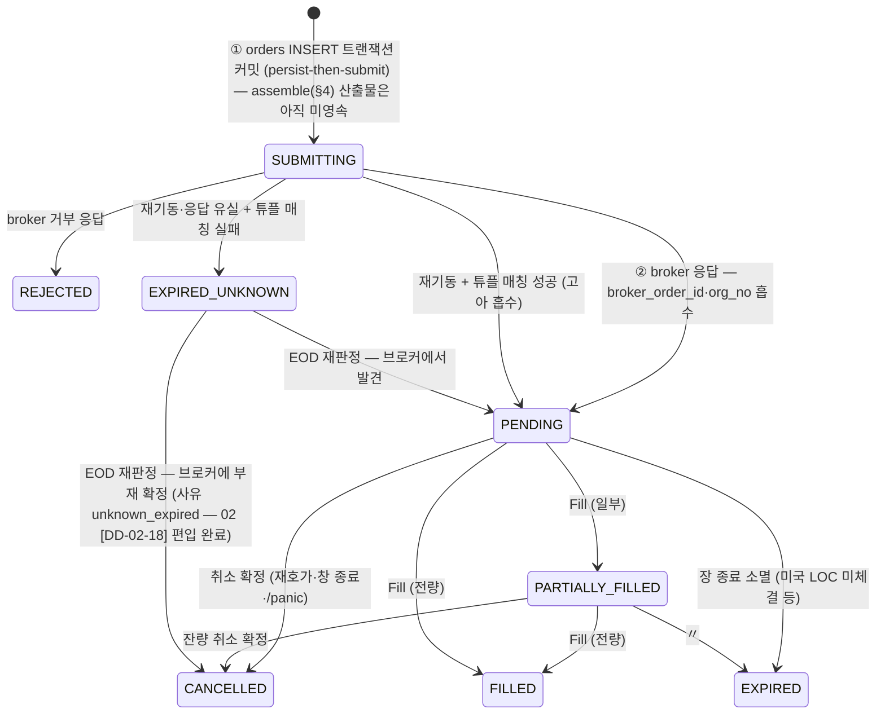
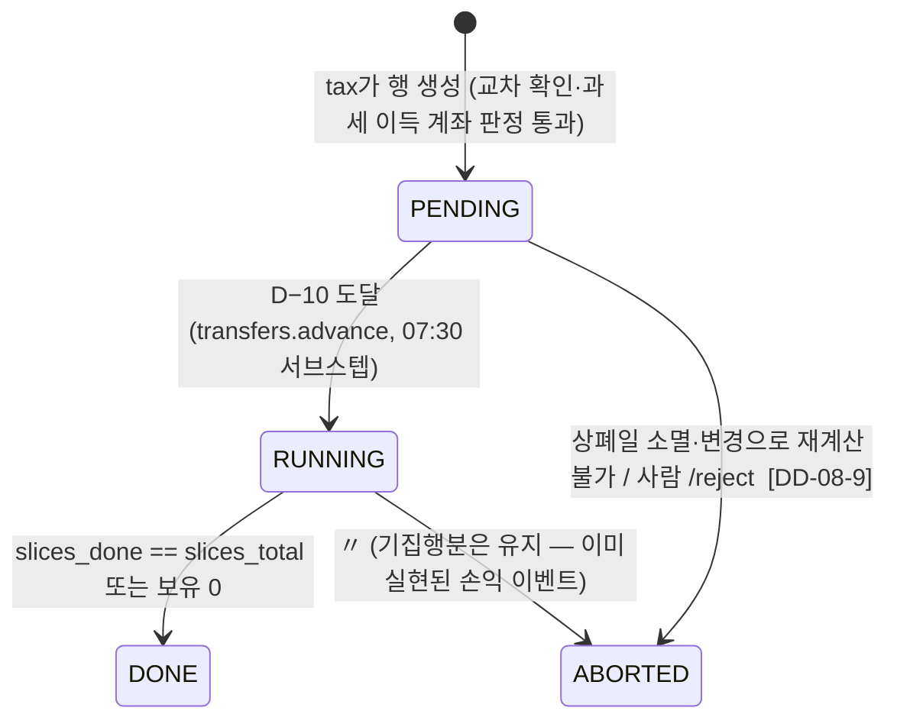

# 08. 집행 (Execution)

> **범위**: `src/omra/execution/` 패키지 전체 — RebalancePlan → 주문 조립·`mandatory_orders` 병합, pre-trade 체인 호출 지점과 `order_lock` 계약, `router.py`(AccountMode 분기), 주문 제출 프로토콜(이중 접수 방지·`SUBMITTING`/`EXPIRED_UNKNOWN`), 재호가, 체결 추적(`fill_queue` 소비), EOD 대사 오케스트레이션, E7 상폐 D−10 사전 이전 집행, SAFE_MODE 집행 제약, 주문 품질 게이트, 국내/미국/업비트 집행 창별 주문 전략.
> **계획 정본**: 02 §4(집행 스펙 시트 전체)·§5.6(E7), 03 §1.6(pre-trade 순서)·§2.2·§2.4(순매수 회계)·§2.5·§1.3.1(대사 화이트리스트 소비), 01 §1.4(동시성·`order_lock`)·§3.2(주문 제출 프로토콜·`replace_order`)·§3.5(가드 예산 영속화)·§4.2(집행 잡), 06 §2(가드 판정 소비 계약), 00 §3.2 E1/E2/E7·§5 원칙 2·9·10.
> **선행 문서**: [02-domain-model.md](02-domain-model.md)(Order·Fill·RebalancePlan·틱 규칙), [03-data-and-persistence.md](03-data-and-persistence.md)(orders·fills·pending_transfers·reconcile_expectations DDL), [05-broker-gateway.md](05-broker-gateway.md)(BrokerGateway·replace_order 실체), [09-safety-protections.md](09-safety-protections.md)(pre-trade 단계 정의·순매수 회계·P1~P15).
> **이 문서가 소유하는 정의**: 주문 집행 프로토콜, router, 재호가, 대사(오케스트레이션), E7 집행 절차, `order_lock` (브리프 §2.1 소유권 표 08행).

## 1. 개요 — 설계 대상과 책임

`execution/`은 **확정된 계획을 주문으로 바꿔 시장에 내보내고, 그 결과를 장부에 정확히 되돌려 적는** 패키지다. 다음을 하지 **않는다**:

- 수량·방향·목표비중을 만들지 않는다 — 계획 산출(드리프트 판정·분해·정수화·cash-flow first)은 `engine/`([07-portfolio-engine.md](07-portfolio-engine.md)) 소유다. `execution`은 그 산출물(레그 목록)을 입력으로 받는다.
- 거래정지·VI를 판정하지 않는다 — `surveillance.gate`에 pull로 물어본다 (정본: 01 §2.3, 06 §2.3).
- 세금 제약·E7 대상 선정을 판정하지 않는다 — `tax`의 `assert_not_blocked`/`mandatory_orders`를 호출한다 (정본: 02 §5.4·§5.6, 설계: [10-tax-engine.md](10-tax-engine.md)).
- 브레이커·상태 전이를 소유하지 않는다 — pre-trade 체인의 단계 정의와 P1~P15, 순매수 회계는 [09-safety-protections.md](09-safety-protections.md) 소유이며, 이 문서는 **호출 지점과 임계구역 계약**만 설계한다 (브리프 §2.1 경계 사례).

**실패 시 안전 방향 총칙** (00 §5 원칙 5·10, 03 §3):

| 실패 | 방향 |
|---|---|
| 판정 불가·게이트 미통과 | 그 주문을 내지 않는다 (당일 스킵, 익일 07:30 재판정이 흡수) |
| 주문 접수 후 상태 확인 실패(응답 유실) | **신규 주문 금지 + 강제 대사** — 이중 주문이 최악 시나리오 [→ 03 §3] |
| 부분 체결 후 장 마감 | 잔량 이월 없음(취소·소멸). 익일 드리프트 재계산으로 흡수 [→ 02 §4.1, 03 §3] |
| 재호가 소진 | marketable limit에서 종료. **시장가 폴백 없음** [→ 02 §4.1.1] |
| 자동 전량 청산 | 어떤 경로에도 존재하지 않는다. 유일한 예외는 E7이며 상한 4개로 봉인 [→ 00 §6.1] |

## 2. 모듈 구조

```
src/omra/execution/
├── __init__.py
├── locks.py          # order_lock — 프로세스 전역 단일 asyncio.Lock (01 §1.4 정본 구현)
├── context.py        # ExecutionContext — 의존성 주입 컨테이너 (state·gate·tax·netbuy·broker…)
├── assembler.py      # plan(비중 dict)+레그 목록 → Order 조립, mandatory 병합, safemode_filter,
│                     #   순매수 상한 사전 투영 (02 §4.3 (7)~route 직전 구간의 구현)
├── pretrade.py       # execution.pretrade.check(order, ctx) — 03 §1.6 체인의 단일 소유 함수.
│                     #   단계 정의·순서의 설계 정본은 09 — 여기는 시그니처·호출 지점·오류 매핑
├── router.py         # AccountMode(AUTO/BROKER_SCHEDULED/INSTRUCTION) 분기의 유일한 지점 (00 §5-2)
├── instruction.py    # INSTRUCTION 지시서 생성·라이프사이클·리마인더 (분기 B)
├── submitter.py      # 주문 제출 프로토콜: persist-then-submit, 고아 판정, EXPIRED_UNKNOWN (01 §3.2)
├── repricer.py       # 재호가 루프 — 5분×3(KRX·미국 대안)/3분(업비트), 3분기 판정, 체인 추적
├── tracker.py        # OrderTracker — fill_queue 소비, broker_exec_id dedup, 타이머 취소,
│                     #   순매수 회계 갱신 호출, 쿨다운 카운터 갱신
├── quality.py        # 주문 품질 게이트: 호가단위 정규화 호출, iNAV·스프레드 게이트(2경로),
│                     #   대량 분할 TWAP, 1회 주문 상한 (02 §4.4)
├── guards_client.py  # realtime 가드 pull 소비 + 예산 인자 전달 + Verdict 반영 (06 §2, 01 §3.5)
├── exec_state.py     # persistence.repos.execution_state 사용: 가드 예산·venue ABORT·연기 카운터
│                     #   영속화·기동 복원 (01 §3.5)
├── windows/
│   ├── base.py       # ExecutionWindow 공통 루프(승인 전제 확인·시간 예산 체크포인트·매도 선행)
│   ├── krx.py        # krx_execute 10:00–14:30 (01 §4.2)
│   ├── us.py         # us_submit_close(LOC 기본) / us_execute_limit(대안 config) (02 §4.1)
│   └── upbit.py      # crypto_execute 09:00의 집행부 (판정은 engine — 02 §7)
├── transfers.py      # E7 pending_transfers 상태 전이·슬라이스 진행 관리 (02 §5.6)
└── reconcile.py      # EOD 대사 오케스트레이션: krx_eod·us_reconcile 서브스텝, expectation 소비,
                      #   미체결 종결, EXPIRED_UNKNOWN 재판정 (01 §4.2, 03 §1.3.1 소비측)
```

**import 계약** (유일 원문: 01 §2.2 — 발췌):

- `execution → surveillance.gate` 허용(pull), `execution → tax` 허용(매도 제약·오버레이), `execution → realtime` 허용(역방향 금지), `execution → persistence.repos.execution_state` 허용.
- `realtime -/-> execution`, `surveillance -/-> execution`, `labs -/-> execution`, `research -/-> execution` — 관측 계층은 집행을 import할 수 없다 (00 §5 원칙 9).
- `brokers/base.py`는 브로커 API 규격 검증(호가단위·최소수량·필수 필드)만 하며 감시·세금·브레이커·상태 게이트를 호출하지 않는다 — pre-trade 체인의 소유자는 `execution`이다 (03 §1.6, 01 §3.2).

## 3. 동시성 — `order_lock` (01 §1.4 정본의 구현)

### 3.1 정의와 불변식

```python
# execution/locks.py
import asyncio
from contextlib import asynccontextmanager
from typing import AsyncIterator, Final

_order_lock: Final[asyncio.Lock] = asyncio.Lock()   # 프로세스 전역 단일 락 (01 §1.4-2)

@asynccontextmanager
async def order_lock(reason: str, *, timeout_s: float = 30.0) -> AsyncIterator[None]:
    """주문 임계구역. 획득 실패(타임아웃) 시 OrderLockTimeout — 호출부는 해당
    슬라이스를 스킵하고 warning을 남긴다(주문을 내지 않는 방향 = fail-safe)."""
    try:
        await asyncio.wait_for(_order_lock.acquire(), timeout=timeout_s)
    except TimeoutError as e:
        raise OrderLockTimeout(reason) from e
    try:
        yield
    finally:
        _order_lock.release()

def assert_held() -> None:
    """pretrade.check·submitter.submit·netbuy 갱신 진입부의 방어 어서션."""
    if not _order_lock.locked():
        raise LockDisciplineError("order_lock 미보유 상태에서 임계 연산 호출")

def assert_lock_order_ok() -> None:
    """`order_lock` → `token_lock` **단방향** 순서 규율(설계 01 §4.3)의 런타임 단정.
    `token_lock`(05 TokenManager 소유) 보유 중에 `order_lock`을 잡으려 하면 데드락이므로
    order_lock 획득부에서 역순을 즉시 거부한다. 01 §4.4 검증 항목("순서 위반 탐지")의 구현체."""
    if tokens.token_lock_held():        # 05가 노출하는 read-only 조회 (락을 잡지 않는다)
        raise LockDisciplineError("token_lock 보유 중 order_lock 획득 시도 — 순서 위반")
```

> `order_lock()` 진입부는 `assert_lock_order_ok()`를 먼저 호출한다. 반대 방향(`order_lock` 보유 중 `token_lock` 획득)은 합법이며, 이것이 §7.2 `submit`이 락 안에서 `place_order`를 호출할 수 있는 근거다(토큰 재발급이 그 안에서 일어날 수 있다).

**불변식** (01 §1.4가 정본):

1. **주문 생성·제출과 03 §2.4 순매수 회계는 이 단일 락 안에서만 수행한다.** pre-trade 1~8.5단계 전체가 락 안에서 원자적으로 실행된다 — 락이 없으면 `net_buy_committed` 검사와 주문 생성 사이 `await` 경계에서 TOCTOU가 생기고, 그 결과가 03 §2.4의 "초과 = 등급 B\* `HALTED`"로 직행한다.
2. 재호가(`replace_order`)·취소·체결 반영(committed/settled 회계 갱신 포함)도 같은 락 안에서 수행한다 — 이들 전부가 미체결 잔량·회계를 건드리기 때문이다(§8·§9).
3. 락 안에서 SQLite 쓰기는 **짧은 트랜잭션**으로 열고 닫는다. 트랜잭션을 연 채 `await`하는 것을 금지한다 (01 §1.4-4, `SQLITE_BUSY`는 tenacity 3회 재시도).
4. 시간 예산은 취소가 아니라 **협조적 체크포인트**로 강제한다 — venue 창 루프는 락 **밖**의 종목 경계에서 남은 예산을 확인하고 스스로 종료하며, 이미 커밋된 부분은 유효다 (01 §1.4-3).

### 3.2 락 안/밖 작업 경계

| 락 **안** (원자 구간) | 락 **밖** |
|---|---|
| pre-trade 1~8.5 전체(7단계에 `netbuy.assert_within_cap` 포함 — [09](09-safety-protections.md) §6.3) → `orders` INSERT(`SUBMITTING`) 커밋 → `broker.place_order()` → 응답 반영(`PENDING`) | 시세·호가 조회, iNAV 게이트 REST 재조회, DEFER 대기, TWAP 슬라이스 간 대기 |
| `replace_order` 1회(축약 검사 포함, §8.4) | 재호가 타이머 대기 |
| fill 1건의 장부 반영(§9) | `fill_queue.get()` 대기 |
| 취소 확정 반영 — committed는 `open_qty` 소멸로 **자동 환입**되므로 별도 호출이 없다(09 §9.1) | EOD 대사의 REST 조회(반영 트랜잭션만 락 안) |

> `broker.place_order()`(HTTP 왕복)를 락 안에 두는 것은 01 §1.4-2의 문언("주문 생성·**제출**과 순매수 회계는 단일 Lock 안")을 그대로 따른 것이다. 이 시스템의 동시 주문 액터는 `krx_execute`·`crypto_execute`·`us_*`·`guard_monitor`·재호가 타이머뿐이고 주문 빈도가 낮아(02 §4.1.2 — 개인 규모) 직렬화 비용이 문제가 되지 않는다.

- **`guard_monitor`(12 §9.2·[DD-12-12])의 락 계약**: 관측·판정 단계는 락 없이 돌고 **축소 방향 조치를 실제로 적용하는 단계만** `order_lock`을 잡는다. 대기 상한 60초를 넘기면 그 시각 발화를 `skipped`로 종결하고 다음 정각에 자연 회복한다 — 이는 [DD-08-5]의 30초 타임아웃과 별개 값이며(잡 측 정책이 더 길다), execution은 락 래퍼만 제공한다. 또한 `krx_execute` 창 안에서는 창 루프가 이미 종목별 가드를 소비하므로(§12) `guard_monitor`는 같은 종목·같은 이벤트에 조치를 중복 발동하지 않는다 — 중복 판정은 §11.2 연기 카운터를 이중 소비한다.

**검증 항목**: ① `assert_held()`가 pretrade/submit/netbuy 경로 전부에 존재(아키텍처 테스트) ② SAFE_MODE에서 두 태스크가 동시에 매수를 생성하는 경합 시뮬 — committed 상한 초과 0건(property) ③ 락 보유 중 열린 트랜잭션에 `await` 없음(정적 검사 또는 리뷰 체크리스트) ④ `token_lock` 보유 상태에서 `order_lock` 획득 시도 → `LockDisciplineError`(01 §4.4 순서 위반 탐지) ⑤ `guard_monitor` 조치 단계가 락을 잡고 관측 단계는 잡지 않음(스파이).

## 4. 주문 조립 — plan → Orders, `mandatory_orders` 병합, `safemode_filter`

02 §4.3 의사코드의 마지막 4줄(`orders = tax_overlay(generate_orders(plan))` … `route(...)`)을 이 절이 구현한다. **엔진 산출물 = `DailyPlanResult(plan_weights, cashflow, constraint_cure, satellite, diagnostics)`(타입 정본: 07 §3.1)까지는 `engine/`([07-portfolio-engine.md](07-portfolio-engine.md)) 소유**이고, 이 절은 그 산출물을 받아 Order로 조립하는 지점부터 소유한다. 레그 타입은 `PlannedLeg`이며 08의 어댑터 `to_draft`가 `OrderDraft`로 바꾼다(07 [DD-07-2]).

### 4.1 입력·출력 타입

```python
# execution/assembler.py
from decimal import Decimal
from omra.core.models import Order, RebalancePlan, OrderIntent, OrderSide  # 정의 정본: 02-domain-model.md §7.1·§7.2
from omra.engine.types import PlannedLeg                                   # 정의 정본: 07-portfolio-engine.md §3.1

AccountId = str        # 02는 NewType 별칭을 두지 않는다(02 §3.3·§13 → 08 앞 요청 수용). 01 §3.1대로 str
InstrumentKey = str    # "{venue}:{code}" (02 §3.2)

@dataclass(frozen=True)
class OrderDraft:
    """draft = '아직 영속되지 않은 주문'. `origin`은 `Order.intent`와 **같은 enum·같은 값**이며,
    조립 6단계에서 그대로 `Order.intent`로 옮겨 적는다(변환 없음) — [DD-08-2]."""
    account_id: AccountId
    instrument_key: InstrumentKey
    side: OrderSide                        # BUY | SELL
    qty: Decimal                           # 정수화 완료 수량 (engine §3.3 2단계 산출)
    limit_price: Decimal | None            # venue 전략이 미정이면 None — windows/가 확정
    origin: OrderIntent                    # 값 집합 정본: 02 §7.2 [DD-02-6]·[DD-02-17] (11값)
    paired: bool                           # 밴드 복귀 매도+매수 쌍 여부 (03 §2.2 차단 우선순위 입력)
    transfer_key: tuple[AccountId, InstrumentKey] | None = None   # E7 슬라이스만 (§14)

def to_draft(leg: PlannedLeg) -> OrderDraft:
    """엔진 산출 `PlannedLeg`(07 §3.1 [DD-07-2]) → `OrderDraft` 1:1 어댑터.
    07이 `PlannedLeg.origin: core.OrderIntent`를 쓰고 08도 같은 enum을 쓰므로 **항등 사상**이다
    (07 §3.4의 과도기 매핑표는 소멸 대상 — 02 [DD-02-17]-④). 가격은 여기서 정하지 않는다."""
    return OrderDraft(account_id=leg.account_id, instrument_key=leg.instrument_key,
                      side=leg.side, qty=leg.qty, limit_price=None,
                      origin=leg.origin, paired=leg.paired)
```

**출처 태그는 `OrderIntent` 하나뿐이다** — 08은 `LegKind`를 두지 않는다. 02 §7.2가 "출처 태그의 단일 정본"을 선언하고 [DD-02-17]이 `WITHDRAWAL` 추가·`ESC_LIQUIDATE → MANUAL` 흡수·방향 세분(`E7_TRANSFER_SELL` 류)의 `intent × side` 표현으로 값 집합을 단일화했으므로, 08이 별도 enum을 유지할 근거가 사라졌다. draft 단계에서 더 세분해야 할 값은 남아 있지 않다:

| 종전 08 `LegKind` | 현행 표기 |
|---|---|
| `BAND_RESTORE`·`CASHFLOW`·`CONSTRAINT_CURE`·`HARVEST`·`CRYPTO_SLEEVE`·`WITHDRAWAL`·`MANUAL` | 동명 `OrderIntent` 값 (항등) |
| `CLASS_RESTORE` | `OrderIntent.CLASS_BAND` |
| `MANDATORY_E7` | `OrderIntent.E7_TRANSFER` |
| `SATELLITE` | `OrderIntent.SATELLITE_DD` |
| `ESC_LIQUIDATE` | `OrderIntent.MANUAL` (02 [DD-02-17]-②) — draft 단계에서도 `MANUAL`로 태그하고, 승인 큐 유래임은 `plan_id`·감사로그가 구분한다 |
| (신규 통과값) | `OrderIntent.TARGET_SHIFT` — 목표비중 변경분. §4.4가 이 값을 SAFE_MODE 금지 4종 ①의 판별 키로 쓴다 |

### 4.2 조립 절차 (의사코드)

```python
async def assemble(
    plan_weights: Mapping[tuple[AccountId, InstrumentKey], Decimal],  # (a,i)→목표비중(총자산)
    plan_origins: Mapping[tuple[AccountId, InstrumentKey], OrderIntent],
    cashflow: Sequence[PlannedLeg],          # ── 이 4개는 07 §3.1 DailyPlanResult의 동명 필드 ──
    constraint_cure: Sequence[PlannedLeg],
    satellite: Sequence[PlannedLeg],         # §12 위성 전환·DD 축소 (OFF면 빈 시퀀스)
    ctx: ExecutionContext,
) -> RebalancePlan:
    # 1. plan → 계좌별 KRW 금액 환산 → engine 2단계 정수화(breach 자산에만) 호출.
    #    시그니처 정본: 07 §7.2 quantize_partial(plan_weights, portfolio, prices, universe,
    #    fx_order, params, origins) -> list[PlannedLeg]. fx_order는 06 §9.1 `FxService.order_rate`의
    #    **원값**이며, +0.5% 버퍼는 engine/execution이 수량식에서 적용한다(02 §4.7(b), 06 §9.1 주석).
    #    ★ origins는 생략 불가 — 07 [DD-07-19]가 태깅한 TARGET_SHIFT가 여기서 소멸하면
    #      §4.4 safemode_filter가 SAFE_MODE 금지 4종 ①(목표비중 하향 매도)을 판별할 수 없다.
    band_legs = engine.quantize_partial(
        plan_weights, ctx.portfolio, ctx.prices, ctx.universe,
        fx_order=await ctx.fx.order_rate(), params=ctx.quantize_params,   # params.fx_buffer=0.005
        origins=plan_origins)                                             # 07 §3.1·§7.2

    # 1'. PlannedLeg → OrderDraft 어댑터(§4.1 to_draft). 이 지점 이후로는 draft만 흐른다.
    band_drafts = [to_draft(l) for l in band_legs]

    # 2. tax_overlay — 현금 조달형 매도 순서(02 §5.4)·연말 게이트·sell_blocked 마스크 적용.
    #    밴드 복귀 레그의 종목·수량은 바꾸지 않는다(02 §5.4 적용 범위).
    band_drafts = ctx.tax.overlay(band_drafts)

    # 3. mandatory 병합 — breach와 무관하게 그날 반드시 나가는 주문 (02 §4.3 (7)).
    #    E7 슬라이스 + (시즌·비SAFE_MODE 한정) tax_harvest 09:30 산출 후보가 여기로 합류한다
    #    — 병합 지점은 이 단계 하나뿐이다(12 §4 표 `tax_harvest` 행이 이 절을 지목).
    mandatory: list[OrderDraft] = ctx.tax.mandatory_orders(ctx.state, ctx.accounts)  # origin은
    #    이미 OrderIntent(E7_TRANSFER · HARVEST)로 태그돼 있다 — 10이 core enum을 쓴다(02 §7.2)
    drafts = (band_drafts + [to_draft(l) for l in cashflow] + mandatory
              + [to_draft(l) for l in constraint_cure] + [to_draft(l) for l in satellite])

    # 4. safemode_filter (§4.4) — 상태 결합(BotState∪SleeveState∪Presence)의 실효 제약 기준
    drafts = safemode_filter(drafts, ctx.state, ctx.params)

    # 5. 순매수 상한 사전 투영 (§4.3) — 실효 순매수 상한이 유한할 때만
    drafts = project_net_buy_cap(drafts, ctx)

    # 6. T_min 필터 재확인(국내 5만/미국 $100/업비트 1만 — 02 §3.3·부록 A trade.min_amount)
    #    + Order 생성(plan_id 부여, `Order.intent = draft.origin` — 같은 enum이므로 변환 없음).
    #    ★ 이 시점에는 orders 행을 INSERT하지 않는다 — 물리 INSERT는 §7 제출 직전 SUBMITTING
    #      1회뿐이며(persist-then-submit, 01 §3.2-1), OrderStatus에 계획 단계 값은 없다
    #      (02 [DD-02-5] 8값).
    return RebalancePlan(id=new_ulid(), as_of=ctx.clock.now(),
                         reason=plan_reason(drafts), orders=[to_order(d) for d in drafts],
                         expected_turnover=..., sanity=..., approved=False)
```

- `plan_reason(drafts)`는 `PlanReason`(값 집합 정본: 02 §7.4 [DD-02-19] 5값, DB 값은 03 §3.3.3 `rebalance_plans.reason` [DD-03-6])을 고른다: E7 슬라이스가 병합된 계획은 `e7_transfer`, 그 외 밴드 경로는 `drift_band`, 유입 트리거는 `cashflow`. **E7을 별도 계획으로 쪼개지 않고 같은 계획에 병합**하므로(§14.3 "같은 계획·같은 창") 사유 값도 그 계획 1건에 부여된다.

- 조립은 07:30 `signal_and_plan` 내부에서 실행되고, 산출된 RebalancePlan은 08:30 브리핑·grace 판정(발송·승인 흐름은 [12-scheduling-and-operations.md](12-scheduling-and-operations.md)·[13-web-and-telegram.md](13-web-and-telegram.md) 소유)을 거쳐 §10의 venue 창이 소비한다.
- **frozen 자산 주문 0건, 계좌 제약 위반 주문 0건**은 조립 이전 단계(engine·07)의 불변식이지만, 이 단계에서도 property-based 테스트로 재검증한다 (02 §4.3 불변식 2, 02 §1.2).

### 4.3 순매수 상한 사전 투영 — 차단 우선순위의 구현

03 §2.2의 차단 우선순위(1순위 차단 = 현금 추격 매수 → 2순위 = 위성 매수 → 최후 보존 = cash-flow first·밴드 복귀 쌍)를 **주문 생성 시점**에 적용한다. 회계 자체(`net_buy_committed`/`net_buy_settled` 정의·저장)는 09 소유이며, 여기서는 호출 계약만 정의한다.

```python
WINDOWS = ("day", "rolling30")                      # 일 NAV 3% / rolling 30일 NAV 10% (03 §2.2)

def project_net_buy_cap(drafts: list[OrderDraft], ctx) -> list[OrderDraft]:
    caps = ctx.netbuy.caps(ctx.state, ctx.nav_krw)   # NetBuyCapView — 정의 정본: 09 §9.2
    if caps.is_infinite():
        return drafts
    # 보존 우선순위 오름차순 = 차단 우선순위 역순 (03 §2.2)
    #   keep_rank: 0 = 밴드 복귀 쌍·cashflow (최후 보존)
    #              1 = 위성·크립토 매수
    #              2 = 일방 매수(현금 추격 — paired=False인 BAND/CLASS 매수 포함)
    survivors = []
    projected = {w: ctx.netbuy.projected_committed(w) for w in WINDOWS}   # 09 §9.2
    for d in sorted(drafts, key=keep_rank):
        delta = net_buy_delta(d)                    # 매수 +qty×limit, 매도 −qty×limit
        if delta <= 0 or all(projected[w] + delta <= caps.remaining(w) for w in WINDOWS):
            survivors.append(d)
            for w in WINDOWS: projected[w] += max(delta, 0)
        else:
            defer_to_next_day(d)                    # 주문 미생성 + 익일 재판정 이월 + info (03 §2.4 [도달])
    return survivors
```

> **두 창을 함께 본다** — 03 §2.2의 상한은 일 3%와 rolling 30일 10% **둘 다**이며 둘 다 만족해야 통과다(`caps`는 3평면 결합 후의 실효값 — 09 §9.2). 한 창만 투영하면 월 창이 이미 소진된 날 [도달] 차단이 07:30에 일어나지 않고 제출 시점(§5.1 7단계)으로 밀린다. `NetBuyCapView.remaining(window)` 접근자는 09와 조율 대상이다(§19).

- **[도달]은 정상 동작이다** — 상태 전이 없음, info 알림만 (03 §2.4). [초과](체결 기준 `net_buy_settled`의 실제 초과)는 09의 회계가 감지해 등급 B\* `HALTED`로 보낸다. 이 투영과 §5의 제출 시 재검사(락 안)가 함께 있어야 "초과는 정상 경로에서 발생할 수 없다"가 성립한다 (01 §1.4-2).
- 07:30 투영과 제출 시 검사의 이원화는 [DD-08-13].

### 4.4 `safemode_filter`

SAFE_MODE 정의·5축 실효 제약의 정본은 03 §2.1·§2.2(설계: [09-safety-protections.md](09-safety-protections.md))다. 이 함수는 `SELL_DOWNWARD_BLOCKED`의 **집행 측 강제 지점**이다 — breach 판정 루프는 이 값을 통과시키므로(밴드 복귀 매도는 허용) 실제 차단은 여기서 일어난다 (03 §2.1 주석).

```python
# 금지 4종의 판별 키 (02 §4.6 표·03 §2.2 주석의 ①~④ 순서와 1:1)
SAFE_MODE_SELL_DROP: Final[frozenset[OrderIntent]] = frozenset({
    OrderIntent.TARGET_SHIFT,   # ① 목표비중 하향에 따른 매도
    OrderIntent.HARVEST,        # ② 하베스팅 자동 매도
    OrderIntent.MANUAL,         # ③ ESC_LIQUIDATE — 영속 표기는 MANUAL (02 [DD-02-17]-②)
    OrderIntent.SATELLITE_DD,   # ④ 위성 슬리브 축소 매도
})

def safemode_filter(drafts: list[OrderDraft], state: StateView, params) -> list[OrderDraft]:
    out = []
    for d in drafts:
        eff = state.effective_constraints(sleeve_of(d.account_id, d.instrument_key))  # 03 §2.1 5축
        if d.side is SELL and eff.sell is SELL_DOWNWARD_BLOCKED:
            if d.origin in SAFE_MODE_SELL_DROP:
                drop(d, reason="safe_mode_sell_blocked"); continue
            # SAFE_MODE 매도 금지의 예외 2개 (03 §2.2 — HALTED·PAUSED_ALL·STOPPED 비적용):
            #   ① constraint_cure ② E7 (상한 4개는 tax가 행 생성 시점에 이미 봉인)
            # 밴드 복귀·cashflow 방향 매도는 허용 — 통과
        if d.side is SELL and eff.sell is SELL_BLOCKED:
            drop(d, reason="sell_blocked"); continue
        if d.side is BUY and eff.buy is BUY_BLOCKED:
            drop(d, reason="buy_blocked"); continue
        if state.is_safe_mode() and d.side is BUY and d.origin in {OrderIntent.SATELLITE_DD,
                                                                   OrderIntent.CRYPTO_SLEEVE}:
            drop(d, reason="safe_mode_satellite_entry"); continue   # 위성 신규 진입·크립토 매수 정지 (02 §4.6)
        out.append(d)
    return out
```

> **금지 4종 ①의 판별 키가 draft까지 살아 있어야 한다** — 03 §2.1 주석은 `SELL_DOWNWARD_BLOCKED`의 실제 차단 지점을 `safemode_filter`로 지정하고 제거 대상 첫 번째를 "목표비중 하향에 따른 매도"로 명시한다. 따라서 목표 변경분 레그는 밴드 복귀 매도와 **구분 가능한 기호**로 이 함수에 도달해야 하며, 그 기호가 `OrderIntent.TARGET_SHIFT`다. 07 §3.4는 항등 사상으로 축약되면서 이 값을 독립 보존했고, **07 [DD-07-19]가 그 판별 키를 공급한다**(직전 분해 기준 밴드 내 여부로 목표 하향 매도와 밴드 복귀 매도를 귀속). 이중 방어의 성격도 있다: SAFE_MODE는 목표비중 갱신을 동결하므로(03 §2.1 표 "금지(동결)") 정상 경로에서는 SAFE_MODE 진입 후 새 `TARGET_SHIFT` 레그가 생성되지 않는다 — 그러나 **진입 직전에 생성돼 같은 사이클에 남아 있는 레그**는 이 분기가 유일한 차단 지점이다.

- 1회 주문 상한(평시 `order.max_amount_krw`=500만 → SAFE_MODE는 `/safe_mode.order_size_divisor`=3 — 02 부록 A·03 부록 A)은 금액 분할이므로 §11 quality 게이트에서 적용한다. 이 필터는 **제거/통과만** 담당한다.
- `ESC_LIQUIDATE`는 승인된 경우에만 승인 큐에서 `origin=OrderIntent.MANUAL` draft로 들어오며(02 §7.2 "사람 승인 주문 — `ESC_*` 승인 실행 포함", [DD-02-17]-②), SAFE_MODE 중에는 위 분기에서 제거된다 (02 §4.6 표 ③). `MANUAL` 매도를 SAFE_MODE에서 일괄 제거하는 것은 보수 방향이다 — 사람이 SAFE_MODE 중에 매도를 원하면 `/resume`으로 상태를 올린 뒤 집행한다.
- 미집행 제거는 전부 감사로그에 counterfactual과 함께 남긴다 — TE 분해 ④(SAFE_MODE 제약)의 입력이다 (02 §4.5, 03 §4.6). **기록 계약**(스키마 정본: 03 §7.2 `GuardVerdictPayload` [DD-03-34]): SAFE_MODE 유래 제거(위 `safe_mode_sell_blocked`·`safe_mode_satellite_entry` 두 분기)는 `event_type="guard_verdict"` · `verdict=None`(가드 판정 유래가 아니다) · `blocked_by="SAFE_MODE_CAP"` · `counterfactual` 필수로 남긴다. `drop(d, reason=…)`의 `reason` 문자열은 payload의 `reason` 필드에 실릴 뿐 **`blocked_by`를 대체하지 않는다** — `blocked_by`가 TE 분해 ④와 R1 롤백 트리거의 유일한 귀속 축이다.

**검증 항목**: ① SAFE_MODE에서 밴드 복귀 매도+매수 쌍이 생존(도입 명분 — 03 §2.2) ② 금지 4종(`TARGET_SHIFT`·`HARVEST`·`MANUAL`·`SATELLITE_DD`) 매도 전부 제거 — `SAFE_MODE_SELL_DROP` 집합과 03 §2.1 주석 ①~④의 1:1 대응을 스냅샷으로 고정 ③ E7·constraint_cure 매도 통과, 단 `HALTED`에서는 창 자체가 닫혀 실행되지 않음(§15) ④ 순매수 투영: 목돈 유입 시나리오에서 [도달]이 상태 전이를 만들지 않음 ⑤ 제거·이월 전건 감사로그 존재 — **제거·차단 전건이 `blocked_by`를 실어 기록**되고(SAFE_MODE 유래는 `SAFE_MODE_CAP`) payload가 03 §7.2 스키마 검증을 통과(`blocked_by` 누락 시 pydantic 검증 실패 — 03 §7.5) ⑥ `OrderDraft.origin`·`Order.intent`의 타입이 동일 `OrderIntent`임을 아키텍처 테스트로 단정(08 안에 별도 출처 enum 정의 0건 — 02 §7.5 교차 문서 계약 테스트와 짝).

## 5. pre-trade 체인 — 호출 계약

### 5.1 시그니처와 호출 지점

단계 정의·순서(1 → 2 → 2.5 → 3 → 4 → 5 → 6 → 7 → 8 → 8.5)의 정본은 03 §1.6이고 설계 소유는 [09-safety-protections.md](09-safety-protections.md)다. 이 문서는 다음만 확정한다:

```python
# execution/pretrade.py
from omra.core.errors import PretradeRejection   # ★ 정의 정본: 02 §10.1 [DD-02-20] — 08은 재정의하지 않는다
# 필드(02 §10.1): step·order·reason·retry_today, retryable=False 고정.
#   step 값: "calendar" | "surveillance" | "tax" | "buying_power" | "rounding"
#            | "account_constraint" | "blue_ocean" | "state_gate" | "protections" | "open_orders"
#   retry_today: True = 같은 날 재시도 의미 있음(예: VI 해제 대기), False = 당일 포기
# ★ 02 §10.2 규칙 1: 이 예외는 **체인 내부 신호**이며 체인 경계 밖으로 전파되지 않는다 —
#   `check()`의 공개 반환은 판정 객체이고, 단계 헬퍼가 던진 것을 러너가 잡아 변환한다(§5.2).

@dataclass(frozen=True)
class PretradeResult:
    """`check()`의 공개 반환값 — 02 §10.2 규칙 1("예상된 거부는 반환값")의 준수 형태."""
    passed: bool
    order: Order | None       # 통과 시 라운딩 반영본, 거부 시 None
    step: str | None          # 거부 단계
    reason: str | None
    retry_today: bool = False

async def check(order: Order, ctx: ExecutionContext) -> PretradeResult:
    """03 §1.6 체인 전체를 1회 실행. broker.place_order() 직전, order_lock 보유 상태에서만.
    단계 정의·순서 상수의 원문은 09 §6.2 PRETRADE_STEPS.
    4단계(정수 수량·호가단위 라운딩)는 order를 수정해 반환할 수 있다(라운딩 결과).
    7단계는 매수 주문에 netbuy.assert_within_cap을 포함한다(09 §6.3·§9.2 — 락 안).
    E7 유래 주문(order.intent is OrderIntent.E7_TRANSFER)은 2.5단계 tax.assert_not_blocked에서
    면제된다 (02 §5.6 (c) 불변식 5) — 면제 판정 키는 order.intent와 transfer_key이며,
    10 §13.2도 같은 키(`order.intent`)를 본다(02 [DD-02-17]-④ 정규화)."""
    assert_held()
    ...
```

- **호출 횟수는 주문당 정확히 1회** — `execution`이 유일한 호출자이고, `brokers/base.py`는 이 체인을 호출하지 않는다 (03 §1.6, 01 §3.2). 이중 호출은 `assert_tradable`·라운딩의 이중 실행을 만든다.
- 8.5단계(동시 미결제 주문 수)는 `execution` 소유 어서션이다: 해당 (계좌×시장)의 `status ∈ {SUBMITTING, PENDING, PARTIALLY_FILLED}` 주문 수 < `execution.max_open_orders`(kis_domestic 6 / kis_overseas 6 / upbit 4 — 03 부록 A, M4 실측 재캘리브레이션). 초과 시 신규 주문 생성 거부 + warning + **미체결 강제 조회 1회**(`broker.list_executions` — §7.3 주석) (03 §1.6). 조회 인덱스 `ix_orders_open`의 부분 인덱스 `WHERE`는 03 [DD-03-26]이 `('SUBMITTING','PENDING','PARTIALLY_FILLED')`로 확정했으므로(§19-13 조율 종결) 부분 체결 주문도 계수에 포함된다.

### 5.2 거부의 오류 경로 매핑

| 거부 원인 | 처리 | P9-order 카운트 |
|---|---|---|
| pre-trade 거부(체인 1~8.5) | 주문 미생성·감사로그(counterfactual 포함). `retry_today`면 재평가 스케줄 | **소비 안 함** — 브로커 TR 오류가 아니라 우리 게이트다 |
| 브로커 거부(TR 오류 응답) | 주문 `REJECTED` 확정 + P9-order 카운터(venue별) | 소비. 단 VI·점검성·인증·타임아웃 사유는 제외 (03 §1.4 공통 제외 ①~④) |
| VI·장중 일시정지 사유 거부 | 재호가 카운트·P9 모두 제외, 해제 후 재시도 (02 §4.4, 03 P9) | 제외 |

- **예외 → 판정 객체 변환 지점은 체인 러너 1곳**이다: 단계 헬퍼(09 §6.2·10 §13.2 소유)가 `PretradeRejection`(하위 `TaxSellBlockedError` 포함)을 던지면 `check()`가 잡아 `PretradeResult(passed=False, …)`로 바꿔 반환한다. 호출부(§7.2 `submit`)는 예외를 잡지 않고 `result.passed`만 본다 — 02 §10.2 규칙 1과 §10.4 "누출 테스트"의 08 측 시나리오다 [DD-08-17].

### 5.3 재호가·취소 경로의 축약 검사 [DD-08-4]

`replace_order`·`cancel_order`는 `place_order`가 아니므로 03 §1.6 체인을 재실행하지 않는다. 대신 락 안에서 다음 3가지만 검사한다: ① `surveillance.gate.assert_tradable`(pull — VI·정지 중 정정 시도 방지) ② 상태 게이트 축(해당 방향이 여전히 허용인가) ③ 매수 재호가로 committed가 증가하는 경우 순매수 상한 잔여 확인(초과 시 재호가 스킵, 기존 주문 유지). 전체 체인 재실행은 라운딩·한도 검사를 이중 소비시키고(P2·P3는 신규 접수만 계수 — 03 §1.2), 재호가 자체가 이미 marketable limit 상한으로 봉인되어 있어 잔여 위험이 없다.

**검증 항목**: ① 체인이 주문당 1회만 실행됨(호출 카운터 스파이) ② E7 주문의 2.5단계 면제 ③ 8.5 초과 시 신규 거부 + 강제 조회 발생 ④ pre-trade 거부가 P9 카운터를 소비하지 않음 ⑤ VI 사유 거부가 재호가 카운트를 소비하지 않음.

## 6. `router.py` — AccountMode 분기의 유일한 지점

### 6.1 분기 표

`AccountMode`(AUTO / BROKER_SCHEDULED / INSTRUCTION)의 enum 정의는 02 §1.2(도메인 정의 정본: [02-domain-model.md](02-domain-model.md))이며, 분기점은 이 파일 하나다 — 상위 리밸런서는 계좌가 자동인지 반자동인지 모른다 (00 §5 원칙 2, 02 §1.2).

```python
# execution/router.py
@dataclass(frozen=True)
class RouteResult:
    queued: list[Order]                    # AUTO — venue 창 큐에 적재
    instructions: list[InstructionSheet]   # INSTRUCTION·BROKER_SCHEDULED 매도
    schedule_advice: list[ScheduleAdvice]  # BROKER_SCHEDULED 매수 편성 제안 [DD-08-6]

async def route(orders: Sequence[Order], mode: AccountMode, ctx: ExecutionContext) -> RouteResult:
    match mode:
        case AccountMode.AUTO:
            return RouteResult(queued=enqueue_by_sleeve(orders, ctx), instructions=[], schedule_advice=[])
        case AccountMode.BROKER_SCHEDULED:
            sells = [o for o in orders if o.side is SELL]
            buys  = [o for o in orders if o.side is BUY]
            return RouteResult(queued=[],
                               instructions=[make_sheet(sells, ctx)] if sells else [],
                               schedule_advice=advise_schedule_delta(buys, ctx))
        case AccountMode.INSTRUCTION:
            return RouteResult(queued=[], instructions=[make_sheet(orders, ctx)], schedule_advice=[])
```

| 모드 | 매수 레그 | 매도 레그 | 근거 |
|---|---|---|---|
| `AUTO` | venue 창 큐 → §7 제출 | 동일 | 02 §1.2 |
| `BROKER_SCHEDULED` | **주문 미생성** — 적립식 예약매수가 대행. 목표 대비 편성 괴리가 임계를 넘으면 "예약매수 편성 변경 제안"(`ScheduleAdvice`)을 월간 리포트에 편입 [DD-08-6] | 지시서(A3) | 00 §3.2 E2 분기 B: "적립식이 매수를 대행하고 **매도형 지시서만 잔존**" |
| `INSTRUCTION` | 지시서(A3) | 지시서(A3) | 02 §1.2 "지시서 (매도 경로, 최종 폴백)" |

- venue 큐 매핑은 `sleeve_of(account, instrument)` (02 §4.3.0-e): UPBIT 브로커 → upbit, `market ∈ {NASD, NYSE, AMEX}` → kis_overseas, KRX → kis_domestic.
- SP-C4 성공(분기 A)이면 절세계좌도 `AUTO`가 되어 이 분기의 나머지 두 팔은 죽은 코드가 아니라 **설정으로 잠재된 폴백**으로 남는다. 실패(분기 B)면 연금·IRP는 `BROKER_SCHEDULED`, ISA는 `INSTRUCTION` 후보다 (02 §1.2 표). 어느 쪽이든 상위 코드 변경은 없다 — 그것이 이 격리의 존재 이유다 (02 §1.2).
- `BROKER_SCHEDULED` 계좌의 체결은 우리가 낸 주문이 아니므로, EOD 대사에서 `reconcile_expectations(kind=scheduled_fill)`로 흡수된다(전개 주체는 `external_expectations_sync` 잡 — 03 §1.3.1, [12-scheduling-and-operations.md](12-scheduling-and-operations.md)). 체결금액 매칭 후 **수량은 검증하지 않고 체결금액에서 역산해 장부에 반영**한다 (03 §1.3.1 규칙 2-1).

### 6.2 지시서 (`instruction.py`)

```python
@dataclass(frozen=True)
class InstructionSheet:
    id: str                          # ULID
    account_id: AccountId
    lines: list[InstructionLine]     # 종목·방향·수량·한도가 가이드(당일 판정가 기준)·근거(레그 기원)
    issued_at: datetime
    plan_id: str
    state: InstructionState          # ISSUED | CONFIRMED | EXPIRED | CANCELLED

class InstructionState(StrEnum):
    ISSUED = "issued"        # A3 승인 큐 발행 (타임아웃 없음 — 03 §5.3.2 "절세계좌 지시서")
    CONFIRMED = "confirmed"  # EOD 대사에서 매칭된 체결·입금 관측 → 이행 확정
    EXPIRED = "expired"      # 후속 재판정으로 내용이 무효화됨(드리프트 해소·목표 갱신) → 자동 폐기
    CANCELLED = "cancelled"  # 사람 /reject
```

- **리마인더**: D+3 / D+7, 이후 **주 1회로 격하** (03 §5.3.2 — "사람 손이 필요한 일에 늑대소년 금지"). 발송 채널·등급은 [13-web-and-telegram.md](13-web-and-telegram.md) 소유.
- **이행 확인은 자기 신고가 아니라 대사다**: 지시서 발행 시 각 라인을 `reconcile_expectations(source='instruction', kind=fill, expected_qty=수량, 관측 구간=발행일~+7일)`로 등록해, 사람이 MTS에서 이행한 체결이 P8 수량 불일치로 잡히지 않게 한다. `source` 값 `'instruction'`은 DDL 소유자 [03-data-and-persistence.md](03-data-and-persistence.md) §3.2.2가 [DD-03-3]으로 **수용 완료**했다([DD-08-7] 발신분 — §19-9 종결). 멱등 유니크 인덱스 `ux_reconcile_idem(source, …)`의 첫 컬럼이 `source`이므로 `external_expectations_sync`가 등록하는 `external_schedule` 행과 키 공간이 분리된다.
- 지시서 수량은 발행일 판정 기준이므로, 사람이 다른 수량으로 이행하면 기대값 미소비 + 실체결 불일치가 발생한다. 이때는 P8 정상 경로(자가치유 → 실패 시 HALTED)로 흐른다 — 지시서 오이행은 화이트리스트로 삼키지 않는다(수량 정확 일치 원칙 — 03 §1.3.1 규칙 2).

**검증 항목**: ① 분기 3팔 각각의 스냅샷 테스트(같은 주문 집합 → 모드만 바꿔 결과 비교) ② `BROKER_SCHEDULED` 매수 레그가 주문을 만들지 않음 ③ 지시서 발행 → 모의 이행 → 대사 통과 1사이클(04 §2 M8 DoD 실패 분기와 동일 형태) ④ 지시서 기대값의 `expires_at` 경과 시 자동 폐기 + warning(03 §1.3.1 규칙 5).

## 7. 주문 제출 프로토콜 — 이중 접수 방지·`SUBMITTING`/`EXPIRED_UNKNOWN`

### 7.1 상태 전이 (정본: 01 §3.2 프로토콜 + 01 §1.3 DDL)



enum과 합법 전이표의 소유는 [02-domain-model.md](02-domain-model.md) §7.1 [DD-02-5]이며, 그 판정은 **8값**(`SUBMITTING | PENDING | PARTIALLY_FILLED | FILLED | CANCELLED | REJECTED | EXPIRED | EXPIRED_UNKNOWN`)이다 — 계획 단계 상태(`PLANNED`)는 채택되지 않았고, 이 문서도 그것을 따른다(§4.2 6단계). 위 다이어그램의 `EXPIRED_UNKNOWN → CANCELLED`(§7.4-3 `unknown_expired`)도 02 §7.1 [DD-02-18]이 합법 전이로 편입해 조율이 종결됐다 — 조건 판정·타이머·warning 발행의 소유는 이 문서(§7.4-3)다 [DD-08-1].

### 7.2 제출 함수

```python
# execution/submitter.py
async def submit(order: Order, ctx: ExecutionContext) -> Order | None:
    assert_held()                                     # order_lock (01 §1.4)
    res = await pretrade.check(order, ctx)            # §5 — 1회. 7단계가 순매수 상한을 검사한다
    if not res.passed:                                # 예상된 거부는 예외가 아니라 반환값 (02 §10.2 규칙 1)
        audit_rejected(order, res); return None       #   counterfactual 포함 감사로그 (§5.2)
    order = res.order                                 # 4단계 라운딩 반영본
    persist_status(order, "SUBMITTING")               # ① 트랜잭션 커밋 **완료 후에만** 제출.
                                                      #   committed 예약은 이 INSERT 자체다(09 §9.1)
    try:
        acked = await ctx.broker_for(order.account_id).place_order(order)
    except ResponseLostError:                         # 정의 정본: 05 §3.6 (02 AmbiguousOrderState 계열)
        # 응답 유실: SUBMITTING 유지. 해당 venue 신규 주문 금지 + 강제 대사 큐 등록 (03 §3)
        ctx.repo.set_submit_hold(venue_of(order), reason="ack_lost")
        raise                                         # 재시도 금지 — §7.3 고아 경로가 확정한다
    persist_ack(order, acked.broker_order_id, acked.broker_order_org_no)   # ② → PENDING
    return order
```

**이중 접수 방지 — 3중 장치** (01 §3.2·§1.3):

1. **persist-then-submit**: 커밋 없이 제출하는 경로를 코드 레벨로 금지하고 아키텍처 테스트로 강제한다. 제출 직후 크래시가 나도 `SUBMITTING` 행이 남아 재기동 대사가 고아를 흡수한다.
2. **DB 제약**: `UNIQUE (broker_order_id, account_id)` — 같은 브로커 주문의 이중 기록이 물리적으로 불가능.
3. **응답 유실 시 신규 주문 금지 + 강제 대사** — 이중 주문이 최악 시나리오이므로 재시도하지 않는다 (03 §3). `submit_hold`의 적용 범위는 **venue 단위**이며 강제 대사(§13) 통과 시 해제된다 [DD-08-16].

### 7.3 고아 주문 해소 (기동 셀프체크·응답 유실 공용)

```python
async def resolve_orphans(ctx) -> OrphanReport:
    """01 §3.2-2·3의 구현. 기동 셀프체크의 '대사 통과 전 주문 금지' 단계에서 실행 (03 §3).
    ★ venue 클라이언트를 직접 잡지 않는다 — BrokerGateway ABC의 `get_order`·`list_executions`
      두 메서드만 쓴다(05 [DD-05-2], 05 §10 C7 요청 수용)."""
    for row in load_orders(status="SUBMITTING"):
        # broker_order_id가 이미 있으면 단건 재조회로 끝난다(응답은 받았으나 커밋 전 크래시한 경우)
        if row.broker_order_id:
            adopt(row, await ctx.broker_for(row.account_id).get_order(row)); continue
        day = ctx.calendar.run_date(venue_of(row), row.submitted_at_kst)
        hits = match_tuple(                              # 일자 체결내역에서 튜플 매칭
            await ctx.broker_for(row.account_id).list_executions(row.account_id, day),
            row.account_id, row.instrument_key, row.side, row.qty,
            window=(row.submitted_at_kst - N_MIN, row.submitted_at_kst + N_MIN))  # N=5분 초기값, M4 실측
        if exactly_one(hits):
            adopt(row, hits[0])                           # broker_order_id 흡수 → PENDING
        else:
            mark(row, "EXPIRED_UNKNOWN")
            register_expectation(source="system", kind="orphan_order", qty=row.qty, ...)  # 03 §1.3.1 [DD-03-3]
```

- 매칭 튜플 `(account_id, instrument_key, side, qty, 제출 KST ±N분)`과 `N=5분` 초기값은 01 §3.2-2 그대로다. KIS 주문 TR에 내부 ULID를 실을 사용자 정의 필드가 있는지는 **[확인 필요]**(M4 실측 — 01 §3.2 주석, 03 §13-4가 같은 항목을 등재). 있으면 그 필드가 튜플 매칭을 **필드 매칭으로 대체**하고, 없으면 튜플 매칭이 정본이다 — 어느 쪽이든 persist-then-submit이 선행 조건이고 지원 인덱스 `ix_orders_orphan`(03 §3.2.1 [DD-03-2])은 양쪽 모두에서 유지된다(03 → 08 조율 요청 (1) 수용).
- 복수 매칭(같은 튜플의 주문이 2건)은 자동 채택하지 않고 전부 `EXPIRED_UNKNOWN` + critical — 잘못 채택하면 화이트리스트가 진짜 이중 주문을 삼킨다.

### 7.4 `EXPIRED_UNKNOWN` 전용 경로 [DD-08-8]

01 §3.2는 "P8이 아니라 전용 경로"까지만 정한다. 구체화:

1. `EXPIRED_UNKNOWN` 행은 즉시 `max_open_orders`(8.5단계) 계수에서 제외한다 — 미상 주문이 신규 집행을 영구 봉쇄하면 안 된다. 대신 해당 (계좌×종목)은 **당일 신규 주문 금지**(이중 노출 방지)로 남긴다.
2. `kind=orphan_order` 기대값이 등록되어 있으므로, 이후 그 수량의 체결이 대사에 나타나면 화이트리스트 1회 소비로 흡수되고 행은 `PENDING`→정상 추적으로 되돌린다 (03 §1.3.1 불변식).
3. 등록 후 **3영업일** 내 어떤 관측도 없으면 `CANCELLED`(사유 `unknown_expired`)로 종결 + warning. 기대값은 `expires_at` 만료 규칙(03 §1.3.1 규칙 5)을 따른다.

**검증 항목**: ① F21 — 제출 직후 SIGKILL → 재기동 → 튜플 매칭 흡수, P8 미발동 (03 §4.3) ② 매칭 실패 분기 — `EXPIRED_UNKNOWN`으로 남고 등급 A HALTED로 가지 않음 ③ `UNIQUE` 위반 경로가 예외로 조기 검출됨 ④ ack 유실 후 같은 주문의 재제출 시도가 없음(F1 — 이중 주문 없음).

## 8. 재호가 — 상한 3회·체인 추적

### 8.1 파라미터 (정본: 02 §4.1.1·§7, 02 부록 A `order.reprice`)

| venue | 간격 | 상한 | 가격 이동 | 폴백 |
|---|---|---|---|---|
| KRX (`krx_execute`) | 5분 | **3회** | 1틱씩 공격적, **marketable limit까지만**(매수=최우선매도호가, 매도=최우선매수호가) | 시장가 폴백 **없음** |
| 미국 대안 경로 (`us_execute_limit`) | 5분 | 3회 | 판정가 ±1.0% 계열 내에서만 — **지연 피드로 marketable limit을 산정하지 않는다** (02 §4.1) | 없음 |
| 업비트 (`crypto_execute`) | **3분** | 3회 | marketable limit | 없음 |
| 미국 기본 경로 (LOC) | — | — | 재호가 없음(개장 전 제출·종가 체결) | — |

- 최소 간격과 상한 3회는 **불변**이다. 실시간 정보(T1)는 불필요한 재호가를 **줄이는 데만** 쓴다(일방향 밸브 — 02 §4.1.1). 업비트 행의 간격 3분은 02 §7이 정본이고, **상한 3회는 02 §4.1.1의 "상한 3회는 불변"을 venue 무관 규칙으로 읽은 것**이다(02 §7은 간격만 명시한다).
- 재호가 1회 = `replace_order` 1회 (01 §3.2). **P2(일일 주문 건수)는 정정·재호가·취소를 계수하지 않으며, 업비트의 취소+신규 구현도 0건으로 센다** (03 §1.2 P2). P4(동일 종목·방향 1시간 3회)도 정정·재호가 제외 (03 §1.2 P4).

### 8.2 판정 — 기본 경로와 T1 3분기

```python
# execution/repricer.py
async def on_expiry(order: Order, ctx) -> None:
    """제출/직전 재호가로부터 interval 경과 시 타이머 콜백."""
    if order.reprice_count >= 3:
        await cancel_and_finish(order, ctx); return          # 당일 포기 — 이월 없음 (02 §4.1)
    if not t1_available(order):                               # 기본 경로 (02 §4.1.1)
        await reprice(order, ticks=1, ctx=ctx); return        # 무조건 1틱 공격
    # T1 3분기 (02 §4.1.1 표 — M9 착수 시에만 활성)
    top = ctx.hint.book_top(order.instrument_key)             # realtime.execution_hint (06 §2.2)
    if outside_best_opposite(order, top):    await reprice(order, ticks=1, ctx=ctx)   # ① 카운트 +1
    elif filled_in_window(order, ctx):       reschedule(order)                        # ② SKIP — 카운트 미소비
    else:                                    await reprice(order, ticks=1, ctx=ctx)   # ③ 체결 0 — 카운트 +1
```

③이 없으면 스킵 규칙이 체결 실패를 은폐한다 — 호가 잔량 뒤 대기 중이면 marketable이 유지되어 14:30까지 무한 SKIP된다 (02 §4.1.1).

### 8.3 체인 추적 — 행 단위 [DD-08-3]

재호가마다 **새 `orders` 행을 만든다**: 새 ULID, `orig_broker_order_id = 직전 행의 broker_order_id`, `reprice_count = 직전 + 1`, `plan_id` 유지. 직전 행은 `CANCELLED`(사유 `repriced`)로 종결한다. 근거: ① `Order.orig_broker_order_id`가 단수 필드이므로 행 갱신 방식으로는 3단 체인이 소실된다 ② KIS 정정 TR이 신규 주문번호를 반환하는지 여부와 무관하게 감사로그가 체인 전체를 재구성할 수 있어야 한다(00 §5 원칙 4). KIS 정정 응답의 주문번호 체계는 **[확인 필요]**(M4 카세트 녹화로 확정 — [05-broker-gateway.md](05-broker-gateway.md)).

### 8.4 실행 규약

```python
async def reprice(order: Order, *, ticks: int, ctx) -> Order:
    async with order_lock("reprice"):
        abbreviated_check(order, ctx)          # §5.3 [DD-08-4]: assert_tradable + 상태 축 + committed 잔여
        new_price = clamp_marketable(step_price(order, ticks), order)   # marketable limit 초과 금지
        if new_price == order.limit_price: reschedule(order); return order
        new_row = persist_chain_successor(order, new_price)             # SUBMITTING
        acked = await ctx.broker_for(order.account_id).replace_order(order, new_price)
        # venue 실체 차이(KIS 정정 TR 1회 vs 업비트 취소→재조회→신규 3단계)와
        # 규약 ①~③(취소 확인 전 신규 금지·부분체결 재계산·실패 시 REST 재확정)은
        # BrokerGateway.replace_order가 흡수한다 — 정의 정본: 01 §3.2, 설계: 05-broker-gateway.md
        finalize_chain(order, new_row, acked)
        return new_row
```

- VI 발동·장중 일시정지로 인한 거부는 카운트에서 제외하고 해제 후 재시도한다 (02 §4.1.1, 03 P9 공통 제외 ①).
- `replace_order` 도중 실패 시 원주문 상태를 REST로 재조회해 확정한 뒤 종료한다(규약 ③) — 확정 결과에 따라 체인 후속 행을 `REJECTED`로 닫고 원행을 복원한다.

**검증 항목**: ① 3회 소진 후 취소·종료(이월 없음) ② SKIP(②분기)이 카운트를 소비하지 않음 ③ 체인 3단의 `orig_broker_order_id` 연결 무결성 ④ marketable limit 초과 가격이 생성되지 않음(property) ⑤ 업비트 취소~재주문 사이 부분체결 주입 → 재주문 수량 = 원수량 − 확정 체결수량 (01 §3.2 규약 ② — 카세트 테스트) ⑥ P2·P4 계수 제외 확인.

## 9. 체결 추적 — `fill_queue` 소비·중복 반영 방지

### 9.1 소비 태스크

`Fill`은 시스템에서 유일하게 큐로 흐르는 이벤트다 — 시세는 낡으면 버려도 되지만 체결은 절대 잃으면 안 된다 (01 §2.4). decoder가 `fill_queue.put()`하고(설계: [05-broker-gateway.md](05-broker-gateway.md)), 소비자는 `execution.tracker` 하나다.

```python
# execution/tracker.py
async def run_fill_consumer(ctx) -> NoReturn:
    while True:
        ev = await fill_queue.get()               # KIS H0STCNI0/H0GSCNI0 · 업비트 myOrder (06 §2.2)
        try:
            async with order_lock("fill_apply"):
                apply_fill(ev, ctx)
        except Exception:
            audit.error(...); continue            # 소비 루프는 죽지 않는다 — 유실은 EOD 대사가 회수

def apply_fill(ev: FillEvent, ctx) -> None:
    # 1. dedup — fills.broker_exec_id UNIQUE (01 §1.3 DDL "체결통보·REST 중복 반영 방지")
    if not insert_fill_if_new(ev): audit.dup(ev); return
    # 2. 주문 매칭 (broker_order_id) — 없으면 unmatched 경로 (§9.2)
    order = find_order(ev)
    if order is None:
        # unmatched_fills(state='PENDING') INSERT + audit(event_type='unmatched_fill')
        record_unmatched(ev); return                      # 03 §3.3.16 [DD-03-30]·§7.1 [DD-03-35]
    # 3. 누적 체결 반영 → PARTIALLY_FILLED / FILLED 전이. FILLED면 재호가 타이머 취소
    #    ("이미 체결됐는데 모르고 정정" 차단 — 06 §2.2 OrderTracker 행)
    advance(order, ev); cancel_reprice_timer_if_done(order)
    # 4. 순매수 회계 갱신 호출: settled 재계산 + [초과] 판정 (03 §2.4 — 회계 정본은 09 §9.2)
    ctx.netbuy.observe_settled(ev, order)
    # 5. (account, instrument) 쿨다운 카운터 갱신 — 마지막 체결일 (02 §4.3 in_cooldown 입력)
    ctx.repo.touch_cooldown(order.account_id, order.instrument_key, ev.filled_at_kst)
    # 6. 포지션 로컬 사본 갱신(positions — 정본은 브로커, EOD 대사가 확정) + 감사로그
    ctx.portfolio.apply_fill(order, ev)
    # 7. E7 슬라이스면 transfers 진행 반영 (§14)
    if order.intent is OrderIntent.E7_TRANSFER: transfers.on_fill(order, ev, ctx)
```

### 9.2 원칙과 엣지

- **WS는 진실원이 아니다.** 체결·잔고의 정본은 REST 대사(국내 15:40, 미국 마감+20분)다 (06 §2.4 불변식 1). WS 유실은 반응이 늦어질 뿐 자산 정합성을 훼손하지 않는다 — EOD 대사의 fills upsert가 같은 dedup 키로 회수한다.
- **unmatched fill** [DD-08-11]: 로컬 주문과 매칭되지 않는 체결통보(적립식 예약매수·사람의 수동 주문 등)는 `unmatched_fills` 보류 기록 + warning만 남기고 장부에 즉시 반영하지 않는다. 이 테이블은 03 §3.3.16 [DD-03-30]이 **신설 수용**했다(§19-14 종결) — 상태 3값 `PENDING | ABSORBED | DISCARDED`, dedup 축은 `UNIQUE(broker_exec_id)`로 `fills`와 동일하며 repo는 `repos.fills`가 두 테이블을 함께 소유한다(03 §4.3 표). 보류 기록과 동시에 감사로그 `event_type=unmatched_fill`(03 §7.1 [DD-03-35], payload `UnmatchedFillPayload`)을 남긴다. EOD 대사에서 `reconcile_expectations`(`scheduled_fill` 등)와 매칭되면 `ABSORBED`(+`resolution`에 기대값 ID)로 흡수하고, 아니면 P8 경로가 정상 검출한다 — WS 단독 관측으로 장부를 바꾸지 않는다는 원칙의 적용이다. 기동 셀프체크는 `state='PENDING'` 잔여를 확인해 08 절차로 회부한다(03 §9 검사 11).
- 수수료·세금 필드(`fee`·`tax`)는 통보에 없으면 NULL로 두고 EOD 대사가 채운다(세금 원장은 결제일 기준 — 01 §1.3 DDL, [10-tax-engine.md](10-tax-engine.md)).

**검증 항목**: ① 같은 `broker_exec_id` 2회 주입 → 1회만 반영(F1 계열) ② WS 유실 후 EOD REST 대사가 동일 체결을 회수·중복 없이 반영(폴백 등가성 — 06 §2.4) ③ FILLED 직후 재호가 타이머 미발화 ④ unmatched fill이 장부를 즉시 바꾸지 않음.

## 10. 집행 창 오케스트레이션 — venue별 주문 전략

### 10.1 공통 루프 (`windows/base.py`)

모든 창은 진입 시 다음을 확인한다:

1. **당일 자동 집행 전제**: 브리핑 발송 성공(Telegram·SMTP 중 하나 — 03 §3) + 계획 미거부 + venue별 실효 grace 마감 경과. 실효 마감 = `min(브리핑 발송 시각 + 등급별 grace, presence.grace_cap_kst[venue])`이며 캡은 크립토 08:55 / KRX 09:45 / 미국 LOC 제출 −30분, **부재 등급과 무관하게 상시 적용**된다 (03 §5.3.1 정본). 평시(grace 30분)의 실효 마감은 크립토 08:55 / KRX·미국 09:00이다(02 §4.1) — 캡만 보고 구현하면 평시 거부권 창이 09:45까지 늘어난다. 판정 API는 스케줄러/승인 흐름 소유([12](12-scheduling-and-operations.md)·[13](13-web-and-telegram.md))이며 execution은 `ctx.approval.state(plan_id, venue)`를 읽기만 한다. `/reject`가 마감 후 도착하면 "이미 집행됨" 회신 (02 §4.1).
2. **상태 게이트**: 실효 제약(전역∪슬리브∪부재)이 해당 venue 집행을 허용하는가 (§15).
3. **대사 게이트**: `submit_hold` 없음 + "대사 통과 전 주문 금지" (03 §3) — catch-up 재진입 시에도 동일 (01 §4.2.1).
4. **거래일·세션**: `calendar.is_trading_day(venue, today)`(사실) **와** `calendar.execution_blocked(venue, today)`(처분 — 휴장일 교차검증 `MISMATCH/UNVERIFIED` 유래 당일 국소 차단)를 **각각** 조회한다. 두 불리언을 하나로 합치면 "휴장이라 안 한 것"과 "검증 실패라 막은 것"이 감사로그에서 구분되지 않는다 (06 §11.2 오류 경로 — 06 → 08 조율 요청 ②). `execution_blocked`가 True면 그날 해당 venue 집행 중단 + critical (03 §3).

**집행 창의 시각 산출**: 창 경계는 상수가 아니라 `calendar.session_bounds(venue, today)`(06 §10.1 소유)에 **02 §4의 30분 회피 오프셋**을 더해 산출한다 — 오프셋 값 자체는 집행 소유다(06 §11.2 소비 계약 표). KRX는 `open+30분 ~ close−30분` = 10:00–14:30(02 §4.1과 일치), 미국 대안 경로는 `open+30분 ~ close−30분`, 미국 기본 경로는 `open−10분` 제출(01 §4.2의 "22:20/23:20 (동적)"은 이 식의 산출값이지 상수가 아니다). 서머타임은 XNYS 캘린더가 흡수하므로 이 문서에 고정 시각을 쓰지 않는다.

공통 집행 순서: **매도 먼저, 계좌 단위로 매도 전량 종결(FILLED/CANCELLED/EXPIRED) 확인 후 매수 제출** (02 §4.3 기타 규칙 "매도 먼저 집행, 체결 확인 후 매수"). 14:30(또는 창 종료)까지 매도가 종결되지 않으면 해당 계좌의 매수는 당일 포기 — 익일 재판정이 흡수한다 [DD-08-10]. 루프는 종목 경계마다 협조적으로 잔여 시간·창 종료를 확인한다 (01 §1.4-3).

### 10.2 KRX — `krx_execute` (10:00–14:30)

| 항목 | 스펙 | 근거 |
|---|---|---|
| 창 | 10:00–14:30 — 개장·폐장 30분 회피 + LP 의무호가 면제 구간(08:30–09:05, 15:20–15:30) 회피 | 02 §4.1 |
| 주문 유형 | KRX 정규장 **지정가만**(NXT/SOR 미사용), 시장가 없음 | 02 §4.1, 00 §6.3 |
| 최초 호가 | marketable limit(매수=최우선매도호가, 매도=최우선매수호가). 산정 경로는 T1 가동 여부와 무관하게 `ExecutionHint.hint(ctx) -> HintResult`이고 가격 필드는 `HintResult.limit_price`다(정의 정본: [11](11-realtime-and-surveillance.md) §5.1). T1 미가동 시 같은 함수가 REST 호가 스냅샷 슬롯을 읽는다(폴백 등가성 — 11 §6.3). ★ §12 `consult`가 반환하는 `GuardOutput.limit_price_hint`(11 §3.1)는 **다른 객체**다 — 가드가 실어 보내는 상한 힌트일 뿐 최초 호가 산정기가 아니다 | 02 §4.1.1, 06 §2.2 |
| 재호가 | 5분 × 3회 (§8) | 02 §4.1 |
| 미체결 | **이월 없음** — 14:30 전량 취소 후 종료. 익일 07:30이 흡수 | 02 §4.1 |
| 품질 게이트 | §11 전체(호가단위·iNAV·스프레드·대량 분할) | 02 §4.4 |
| T1 구독 | **오늘 국내 주문이 있을 때만** 등록(활성 종목 한정, 종목당 4건·상한 9종목·예산 38), 계획 소진 또는 14:30에 전량 해제. 등록·해제 실체는 05 소유 | 01 §4.2, 06 §1.3 |

```python
# execution/windows/krx.py — 골자
async def run(plan: RebalancePlan, ctx) -> None:
    if not entry_gates_pass("krx", plan, ctx): return
    sells, buys = split_sides(orders_for_sleeve(plan, "kis_domestic"))
    await register_t1_if_any(sells + buys, ctx)               # 조건부 (06 §1.3)
    for order in sells:                                        # 매도 선행
        await submit_with_quality(order, ctx)                  # §11 게이트 → §7 submit → §8 타이머
        checkpoint_budget()
    await wait_all_terminal(sells, deadline=window_end - RESERVE)
    for account, acct_buys in group_by_account(buys):
        if sells_terminal(account):                            # [DD-08-10]
            for order in acct_buys:
                await submit_with_quality(order, ctx); checkpoint_budget()
    await cancel_open_at(window_end, ctx)                      # 이월 없음
    await release_t1(ctx)
```

### 10.3 미국 — 기본 LOC / 대안 장중 지정가 (SP-C3 조건부 양경로)

**기본 경로 — `us_submit_close`** (개장 전 22:20/23:20 KST 동적 — 서머타임은 XNYS 캘린더가 계산, 01 §4.1·§4.2):

- **LOC 제출.** 리밸런싱은 종가 판정이므로 종가 체결이 정합 (02 §4.1). LOO/MOO도 이 잡에서만 가능.
- **한도가 = 판정가 ±1.0%** — 매수 limit = 판정가 × 1.01, 매도 limit = 판정가 × 0.99. **판정가 = 07:30 드리프트 판정에 사용한 직전 미국 종가** (02 §4.1). 틱 정규화는 `usd_penny`(정본: [02-domain-model.md](02-domain-model.md)).
- **실시간 호가를 구독조차 하지 않는다** (02 §4.1) — 재호가 없음. 미체결은 세션 종료 시 `EXPIRED`.
- 수량 산정: 제출 직전 브로커 고시환율 스냅샷 + **0.5% 버퍼** — `qty = floor(배정액 / (p_i × rate × 1.005))` (02 §4.7-b, §3.3). `FxService.order_rate()`(06 §9.1 소유)는 **버퍼를 적용하지 않은 원값**을 반환하며, `× 1.005`를 곱하는 주체는 engine(`QuantizeParams.fx_buffer=0.005` — §4.2 1단계)과 execution뿐이다(06 → 08 조율 요청 ③). 버퍼를 두 번 곱하지 않도록 곱셈 지점은 수량식 1곳으로 고정한다.
- **미체결 이월 없음.** 연속 **3거래일 전량 미체결**이면 warning + config(`order.us_strategy`)로 대안 경로 수동 전환 검토 — **자동 전환은 하지 않는다** (02 §4.1). 미체결률은 dead-man's switch 관측 항목 (02 §4.1 → 01 §6.4, [12](12-scheduling-and-operations.md)).

**대안 경로 — `us_execute_limit`** (config, 개장+30분~마감−30분 동적):

- 장중 지정가 + 재호가 5분×3회. **가격 산정은 LOC와 동일 계열 — 판정가 ±1.0% 규칙**을 쓰고, 지연 피드(`HDFSASP0`/`HDFSCNT0`)로 marketable limit을 산정하지 않는다 (02 §4.1). §8.1 표의 미국 행이 이를 강제한다.
- **Blue Ocean 주간거래는 코드 레벨 금지** — pre-trade 6단계 무조건 거부 (02 §4.1, 03 §1.6, 00 §6.3).
- `quote.max_age_ms.us = null`(지연 피드라 나이 검사 비적용 — 02 부록 A).

**SP-C3 조건부 분기** (02 §4.5): SP-C3에서 LOC/MOO/LOO 미지원이 확인되면 `order.us_strategy` 기본값이 장중 지정가로 바뀐다. 이 설계는 양경로를 모두 완성형으로 두므로 코드 변경 없이 config 전환만 남는다. 연쇄(백테스트 체결 가정 변경·TE ② 편입·LULD 재검토 승격)는 [15-backtest-and-validation.md](15-backtest-and-validation.md)·[11-realtime-and-surveillance.md](11-realtime-and-surveillance.md) 소관으로 추적표에 기재한다.

- 환전 주문은 없다 — 통합증거금 원화 주문 전제, 매수가능금액 조회 기준 환율 버퍼 0.5% (02 §4.1).

### 10.4 업비트 — `crypto_execute`(09:00)의 집행부

판정(슬리브 밴드·vol scale·BTC70:ETH30 분해)은 `engine` 소유다 (02 §7 의사코드). 집행부 스펙:

| 항목 | 스펙 | 근거 |
|---|---|---|
| 주문 | marketable limit 지정가. `qty = floor_8dp(레그 KRW / limit_price)` (lot_step 1e-8) | 02 §7, 01 §3.1 |
| 재호가 | **3분** × 3회. `replace_order` = 취소 → 잔량 재조회 → 신규 주문(브로커 계층이 흡수 — 01 §3.2) | 02 §7 |
| 대량 분할 | 500만원 초과 **15분 TWAP** | 02 §7 |
| 가드 | 김치프리미엄 >8% → 신규 매수 정지(매도 허용) / BTC 24h −15% → 당일 매수 정지. 둘 다 `ABORT`(매수만) 소비 — 산출은 realtime([11](11-realtime-and-surveillance.md)) | 02 §7, 06 §2.2 |
| 점검 | 응답 기반 감지(연속 3회 점검성 응답 → 크립토 슬리브 당일 집행 보류, 정상 3회 연속 시 해제). 상태 부여는 09/06 소유 — 창은 실효 제약으로 읽는다 | 01 §4.1, 03 §2.1 |
| SAFE_MODE | 크립토 매수 정지(§4.4). 주식 계좌와의 상대 정산은 KRX 영업일에만 | 02 §4.6·§7 |
| P2 계수 | 재호가의 취소+신규는 **0건** | 03 §1.2 |

**검증 항목(§10 공통)**: ① 실효 grace 클램프 — 부재 등급별 4h/12h 선언 grace가 08:55/09:45/−30분에 눌리는지(03 §5.3.1) ② 창 종료 시 활성 주문 0건(이월 없음) ③ 매도 미종결 계좌의 매수 미제출 ④ LOC 3거래일 연속 전량 미체결 → warning 1건(자동 전환 없음) ⑤ Blue Ocean 세션 주문 생성 불가(property) ⑥ T1 구독이 주문 없는 날 0건.

## 11. 주문 품질 게이트 (`quality.py`)

### 11.1 체인 (국내 — 02 §4.4)

제출 직전, pre-trade 체인 **밖**(시세 의존·지연 허용 판정이므로 락 밖에서 수행하고, 통과 후 락 안에서 §5→§7 진행):

1. **호가단위 정규화**: ETF 5원 균일, 개별주 KRX 7구간 스냅 (규칙 정본: [02-domain-model.md](02-domain-model.md) `core.tick`).
2. **iNAV·스프레드 게이트**: 괴리율 |·| > **0.5%** 또는 LP 스프레드 > **3틱** → 연기 (02 §4.4, `etf.premium_gate.threshold_pct`/`threshold_ticks`). **판정 주체는 `realtime.PremiumGate`**(06 §2.2, 설계: [11](11-realtime-and-surveillance.md) §4.6)이고 유일한 호출 경로는 §12 `consult`다 — `quality.py`는 **임계 비교를 자체 구현하지 않는다**(11 [DD-11-4]: `premium_verdict()`가 두 경로 공용의 유일한 판정 구현). REST 스냅샷 경로에서도 `quality`가 하는 일은 스냅샷을 `GuardContext.nav_snapshot`에 실어 넘기는 것뿐이고, 나머지는 예산 카운터의 소유·영속화와 연기 집행이다(01 §3.5). 위 임계 수치는 참조용 요약이며 값의 정본은 02 §4.4·04 config다.

| 경로 | 해제 조건 | 상한 | 초과 시 |
|---|---|---|---|
| REST 스냅샷 (기본) | 30분 후 재조회 | 연기 3회 | 당일 포기, 익일 재판정 |
| 실시간 NAV (**SP-E2 통과 시에만**) | 게이트 해소 **AND** 최소 300초 경과 | 연기 3회 + **당일 총 90분** | 당일 포기 |

   **폴백 등가성**: 두 경로의 판정 결과는 동일해야 하며 차이는 지연뿐이다 — 03 §4.3 통합 테스트로 강제 (02 §4.4).
3. **대량 분할**: 종목 주문액 > 20일 평균 거래대금의 1% → **30분 간격 TWAP**. 1회 주문 상한 `order.max_amount_krw`(500만, SAFE_MODE는 /3) 초과분 분할 (02 §4.4, 부록 A). **TWAP·금액 분할 슬라이스는 P2에 계수된다** (03 §1.2 P2). 호가 잔량 기반 슬라이싱은 기각됨 — 재도입 금지 (02 §4.1.2).

```python
@dataclass(frozen=True)
class QualityDecision:
    action: Literal["pass", "defer", "abandon"]
    slices: list[OrderDraft] | None      # TWAP·상한 분할 결과 (pass일 때)
    retry_at: datetime | None            # defer일 때
    reason: str

def evaluate(order: OrderDraft, ctx) -> QualityDecision: ...
```

### 11.2 게이트 예산의 영속화 (`exec_state.py`)

연기 횟수·당일 연기 누적 분·시장 단위 `ABORT`·가드 연속 실패 카운터는 **`execution`이 소유**하고 `persistence.repos.execution_state`에 `(run_date, venue, instrument_key, counter_kind, value)`로 영속화한다 (01 §3.5). `realtime`은 이 값을 인자로 받아 판정만 반환한다(§12).

```python
class CounterKind(StrEnum):
    """★ 문자열 값은 DB 리터럴이다 — 값 집합의 소유는 03 §3.3.4 [DD-03-7]이고 4계열로 확정되어 있다.
    파이썬 멤버명은 08 자유, **문자열 값은 03과 문자 단위로 일치해야 한다.**"""
    DEFER_COUNT = "defer_count"                  # 종목별 연기 횟수 (상한 3)
    DEFER_MINUTES_TOTAL = "defer_minutes_total"  # 당일 총 연기 분 (실시간 경로 90분)
    VENUE_ABORT = "venue_abort"                  # ABORT(시장, 당일) 플래그. venue 범위 행의
                                                 #   instrument_key는 '*' 센티널 (03 [DD-03-7]).
                                                 #   03이 종전 `market_abort`를 폐기하고 이 리터럴로
                                                 #   통일했으므로 08·11이 이 값을 그대로 쓴다.
    GUARD_FAIL_STREAK = "guard_fail_streak"      # 실제 키는 "guard_fail_streak:<guard_name>" —
                                                 #   가드별 3회 연속 실패 → 비활성 (01 §2.4, 11 §5)

class ExecutionStateRepo(Protocol):
    def get(self, run_date: date, venue: str, key: str, kind: CounterKind) -> int: ...
    def incr(self, ..., by: int = 1) -> int: ...
    def guard_budgets(self, order: Order) -> GuardBudgets: ...   # §12 consult 입력 (타입 정본: 11 §3.3)
    def snapshot(self, run_date: date, venue: str) -> ExecBudgetSnapshot: ...   # 03 §9 검사 6

async def restore_guard_budgets(repo: ExecutionStateRepo, clock: Clock) -> GuardBudgetSnapshot:
    """기동 셀프체크 훅 — 01 §5.3-(b)가 지정한 시그니처 그대로(카운터 의미론 정본은 이 문서).
    venue별 '현지 거래일'(06 §10.3 `run_date`) 기준 오늘 카운터를 전량 로드한다.
    ★ 복원 실패 시 보수 방향: 카운터를 0이 아니라 **상한 소진 상태로 가정**한다 —
      상한이 조용히 무효화되는 것(F22가 막으려는 사고)보다 당일 보수적 집행이 낫다."""
```

기동 셀프체크가 `restore_guard_budgets()`를 호출하지 못하면 셀프체크 실패다 (03 §3 재시작 행, 03 §9 검사 6, 검증 F22 — 03 §4.3). `GuardBudgets`(11 §3.3)는 이 스냅샷에서 주문 1건 단위로 잘라 만든 뷰이고, 11 §3.3 `GuardBudgets.venue_abort` 필드는 DB 리터럴이 아니라 필드명이므로 이름이 달라도 무방하다(대응 DB `counter_kind = venue_abort`).

**검증 항목**: ① 연기 3회 소진 → 당일 포기 ② 실시간 경로 90분 상한이 재시작을 넘어 유지(F22) ③ REST/실시간 경로 판정 동일성(동일 카세트 이중 재생) ④ TWAP 슬라이스가 P2 카운트에 포함 ⑤ SAFE_MODE에서 1회 상한이 1/3로 줄어드는 분할 결과 ⑥ **`CounterKind` 문자열 값 4계열이 03 §3.3.4 DDL 주석과 문자 단위 일치**(스냅샷 계약 테스트) — 불일치하면 `restore_guard_budgets()`가 빈 결과를 반환해 재시작 후 당일 ABORT가 조용히 해제된다.

## 12. 가드 소비 — `guards_client.py` (06 §2 소비 계약)

`realtime`은 판정 생산자, `execution`은 유일한 소비자·예산 소유자다 (01 §3.5, 06 §2). `execution → realtime` import는 허용, 역방향 금지 (01 §2.2).

```python
# execution/guards_client.py
async def consult(order: Order, ctx) -> GuardOutput:
    """슬라이스 제출 직전 pull. 예산·당일 ABORT를 인자로 넘기고 판정만 받는다 (01 §3.5)."""
    budgets = ctx.exec_state.guard_budgets(order)           # §11.2 카운터 → GuardBudgets (11 §3.3)
    gctx = guard_context(order, ctx)                        # basket·nav_snapshot 주입 (11 [DD-11-2])
    return await ctx.guards.evaluate(gctx, budgets)         # GuardChain.evaluate — 정의 정본: 11 §4.1
```

- `GuardContext`의 `basket`(MoveGuard용 NAV 가중 보유 바스켓)과 `nav_snapshot`(PremiumGate REST 경로)은 **execution이 채워 넘긴다** — `realtime -/-> portfolio`(01 §2.2)이므로 realtime이 스스로 조회할 수 없다 (11 [DD-11-2]).
- **방향 어휘 변환은 소비 지점(=이 파일)이 소유한다**: `GuardOutput.sides`의 원소는 01 §3.5·11 §3.1이 정한 소문자 리터럴(`"buy"|"sell"`)이고 `core.models.OrderSide`는 `BUY`/`SELL`이다. core는 변환기를 두지 않으므로(02 §7.1 주석) `guards_client`가 `_SIDE_WIRE: Final = {OrderSide.BUY: "buy", OrderSide.SELL: "sell"}` 1개 상수로 양방향 변환한다 — 다른 파일에 같은 변환을 복제하지 않는다.

| Verdict | execution의 반영 (06 §2.1·01 §3.5) |
|---|---|
| `PROCEED` | 진행. `limit_price_hint`가 있으면 marketable limit 산정에 사용(힌트는 marketable limit을 넘을 수 없다) |
| `DEFER` | 이번 슬라이스 보류 + `DEFER_COUNT`/`DEFER_MINUTES_TOTAL` 증가. 연기 예산 소진 시 당일 포기. **DEFER 중 종목은 T1 구독 유지** (06 §1.3-2) |
| `SHRINK` | **현 판본에서 산출 주체 없음 — 예약값.** 수신 시 방어적으로 DEFER와 동일 처리 + warning (06 §2.1) |
| `ABORT` | `scope="instrument"` → 해당 종목 당일 중단. `scope="venue"` → `VENUE_ABORT` 영속화, 당일 그 시장 신규 제출 전면 중단. `sides` 집합이 적용 방향을 정한다(가드는 방향을 **줄이기만** 한다 — `guard.oneway`) |

- 가드 발동 조건 3-AND(최소 지속 30초·REST 교차 확인·정상 틱 5분 이내)와 예외(Fill·거래정지는 즉시)는 realtime 소유다 (06 §2.4). execution은 결과만 소비한다.
- `Verdict != PROCEED`는 전건 감사로그(`plan_id`·`order_id`·`verdict`·`reason`·`source_event_id`·`counterfactual`) — TE 분해 ③의 입력 (06 §2.4). 알림 기본 등급은 `silent`, 브리핑에 "가드 개입 N건" 1줄 집계 (06 §2.4, 03 §7.2).
- WS 전면 장애는 HALT를 유발하지 않고 degrade만 한다 — 폴백 등가성 (06 §2.4).

**검증 항목**: ① `ABORT`(venue,당일)가 재시작 후에도 유지(F22) ② `sides={"buy"}` ABORT에서 매도 제출 계속 ③ 가드 3회 연속 실패 → 해당 가드 비활성 + critical(01 §2.4) 후 집행은 무가드 기본 경로로 계속.

## 13. EOD 대사 — `reconcile.py`

### 13.1 잡 배치와 책임 경계

| 잡 | 시각 | execution이 하는 일 | 근거 |
|---|---|---|---|
| `krx_eod` | 15:40 | 국내 체결확인·대사, EOD 스냅샷 트리거, 세금 원장 갱신 호출(결제일 기준 — tax 소유), **전일 미국 자동환전 재정산 확정분 → `kind=fx_resettle` 기대값 등록** | 01 §4.2 |
| `us_reconcile` | 미국 마감+20분(동적) | 미국 체결 확인·대사, 자동환전 결과 확인, LOC 미체결 `EXPIRED` 확정 | 01 §4.2 |
| 기동 셀프체크 | 재시작 시 | `resolve_orphans`(§7.3) + 강제 대사 — **대사 통과 전 주문 금지** | 03 §3 |

P8 판정·자가치유 사다리·화이트리스트 **규칙**은 09 소유(03 §1.2 P8·§1.3·§1.3.1 정본), `reconcile_expectations` DDL은 03 설계서 소유다. execution은 **대사 절차의 오케스트레이션과 기대값의 소비 호출**만 소유한다.

### 13.2 절차

```python
async def run_eod(venue: Venue, ctx) -> ReconcileResult:
    # 1. REST 정본 조회: 당일 체결내역·잔고·예수금 (WS는 진실원이 아니다 — 06 §2.4).
    #    체결내역은 `BrokerGateway.list_executions(account_id, trade_date)`, 잔고·예수금은
    #    `get_positions`/`get_balance` — venue 클라이언트 직접 호출 금지 (05 [DD-05-2]·§10 C7)
    broker_fills, broker_pos, broker_cash = await fetch_broker_truth(venue, ctx)
    # 2. fills upsert — broker_exec_id dedup (§9). WS 유실분 회수. fee/tax 확정 채움
    upsert_fills(broker_fills)
    # 3. 미체결 종결: 창 종료 취소 확인 → CANCELLED / LOC 소멸 → EXPIRED /
    #    EXPIRED_UNKNOWN 재판정(§7.4: 발견 → PENDING 복원, 부재 확정 → CANCELLED)
    finalize_open_orders(venue, broker_fills)
    # 4. diff 산출: 로컬 positions·cash vs 브로커 (수량은 종목·주 단위, 현금은 KRW)
    diff = compute_diff(broker_pos, broker_cash, ctx)
    # 5. 화이트리스트 소비 (매칭 규칙 정본 03 §1.3.1 — 판정 함수는 09 제공):
    #    scheduled_fill 매칭분은 체결금액 역산 수량으로 장부 반영 (규칙 2-1),
    #    통과 전건 감사로그(reconcile_whitelisted + expectation.id), 1회 소비 소멸
    #    보류 중인 unmatched_fills(state='PENDING')도 같은 기대값 매칭에 참여시키고,
    #    매칭된 행은 ABSORBED(+resolution=expectation.id)로 전이한다 (§9.2, 03 §3.3.16)
    residual = ctx.protections.consume_expectations(diff, pending_unmatched(venue))
    # 6. 잔차 → P8 트리거 위임 (수량 1주라도 / 설명 안 되는 현금 > 허용오차 —
    #    자가치유 사다리 포함 전부 09 소유. execution은 결과 상태만 따른다)
    if residual.nonzero(): ctx.protections.raise_p8(residual)
    else: ctx.repo.clear_submit_hold(venue)         # §7.2 응답 유실 홀드 해제
    # 7. EOD 스냅샷 + 세금 원장 훅 + (krx_eod) fx_resettle 기대값 등록 (03 §1.3.1 등록 주체 목록)
    await post_reconcile_hooks(venue, ctx)
```

- `reconcile_tolerance_cash_krw`는 M4 실측 캘리브레이션 대상 (03 부록 A). 수량 허용오차는 **0** (03 §1.2 P8 ①).
- 대사 성공은 dead-man's switch ping 조건의 하나다 (03 §8 — 관측은 [12](12-scheduling-and-operations.md)).

**검증 항목**: ① F18 — 환전 재정산 불일치가 `fx_resettle` 기대값으로 사전 통과, 미등록 시 P8 후 자가치유 ③에서 흡수 ② F4/F5 — CA 설명 가능/불가 분기(09 소유 로직의 통합 테스트에 execution 대사 절차가 하네스로 참여) ③ `scheduled_fill` 역산 수량 반영 후 P8 트리거 ① 미계상 ④ 대사 실패 중 신규 주문 0건.

## 14. E7 — 상폐 확정 종목의 D−10 사전 이전 집행 (`transfers.py`)

### 14.1 역할 분담 (정본: 02 §5.6, 00 §3.2 E7, 03 §2.5)

```
surveillance  KR-04 감지(2소스 교차 확인) → pending_tax_events 기록(사실 필드만)   ← 여기까지만
tax           행을 ro로 읽어 과세 판정 → 대상 계좌에만 pending_transfers 생성(PENDING)
              매 거래일 tax_overlay/mandatory_orders가 그날 슬라이스 주문(매도+대체 매수) 생성
execution     상태 전이(PENDING→RUNNING→DONE/ABORTED)·슬라이스 진행 관리·주문 병합(§4)·집행
```

`surveillance`는 주문을 생성하지 않는다 — 원칙 9. 주문 생성 주체는 `tax`+`execution`뿐이다 (02 §5.6 (c) 불변식 1, 01 §2.2 계약이 강제).

### 14.2 상태 테이블과 전이

`pending_transfers` DDL은 02 §5.6 (a)가 원문이고 물리 스키마 소유는 [03-data-and-persistence.md](03-data-and-persistence.md)다. 키: `(account_id, instrument_key)`, 필드: `abol_date`·`substitute_key`·`total_qty`·`slices_total`·`slices_done`·`state(PENDING|RUNNING|DONE|ABORTED)`.



- `slices_total` = D−10 ~ D−3 구간의 **XKRX 거래일 수** [DD-08-12] (02 §5.6 "D−10 ~ D−3 사이 거래일 수"의 캘린더 구체화).
- `slices_done`은 그날 슬라이스 주문이 종결(체결 또는 취소)된 EOD에 +1 한다. 미체결 잔량은 다음 슬라이스 수량식이 자동 흡수한다 [DD-08-12].

### 14.3 일일 슬라이스 (07:30 → 집행 창)

```
매 거래일 signal_and_plan에서 (02 §5.6 (b)4):
  매도 수량 = ceil((total_qty − 기집행) / (slices_total − slices_done))
  동시에 substitute_key 매수를 같은 계획에 넣어 노출 공백을 만들지 않는다
  → OrderDraft(origin=OrderIntent.E7_TRANSFER, transfer_key=(account_id, instrument_key))
     ※ 매도/매수 세분은 값이 아니라 `intent × side` 조합으로 표현한다 (02 [DD-02-17]-③):
       E7_TRANSFER × SELL = 슬라이스 매도, E7_TRANSFER × BUY = 대체 매수.
       계획 사유는 `rebalance_plans.reason='e7_transfer'` (02 §7.4 [DD-02-19], 03 [DD-03-6])
  → §4 조립에서 mandatory로 병합, §10 창에서 일반 주문과 동일 프로토콜로 집행
체결 시 tracker가 transfers.on_fill로 기집행을 갱신 (§9-7)
```

대체 매수 금액 = 해당 슬라이스 매도 예상 대금(체결 전이면 판정가 기준) — 같은 계획·같은 창에서 매도 선행 → 매수 후행(§10.1)이 그대로 적용되어 결제·증거금 제약과 정합한다.

### 14.4 불변식 5개의 강제 지점 (02 §5.6 (c))

| # | 불변식 | 강제 지점 |
|---|---|---|
| 1 | 주문 생성 주체는 `tax`+`execution`뿐 | import-linter `surveillance -/-> execution·tax` (01 §2.2) + 이 문서 §14.1 |
| 2 | 1회 전량 매도 금지 — 슬라이스가 1개면(D−3 이후 감지) 자동 실행 없이 **A3 승인 큐** | tax의 행 생성 로직 + `transfers.advance`가 `slices_total ≤ 1`이면 RUNNING 전이 거부·A3 큐 |
| 3 | `ESC_REPLACE` 중복 배제 — 행이 있으면 제안 미생성 | surveillance gate 소비측([11](11-realtime-and-surveillance.md))이 `pending_transfers` 존재를 ro로 확인 |
| 4 | **SAFE_MODE에서는 실행, `HALTED`(A·B\* 불문)·`PAUSED_ALL`·`STOPPED`에서는 실행 안 함** — 상태 게이트(03 §1.6 단계 7)를 우회하는 경로 없음 | §4.4 safemode_filter 예외 통과 + §15 창 게이트(HALTED 등은 창 자체 미진입) + pre-trade 7단계 |
| 5 | 금소세 soft-stop·ISA 한도 확인 면제 | pre-trade 2.5단계가 `order.intent is OrderIntent.E7_TRANSFER`이면 `tax.assert_not_blocked` 스킵 (§5.1). 08·10이 **같은 타입·같은 필드·같은 값**을 본다 — 10 §13.2의 `OrderOrigin.E7_TRANSFER_SELL` 표기는 02 [DD-02-17]-④ 정규화표에 따라 `OrderIntent.E7_TRANSFER × side=SELL`로 교체 대상이다(§19-10) |

**상한 4개(전부 AND — 00 §3.2 E7)**의 판정(승인 페어 1:1 · 균등 분할 · 2소스 교차 확인 · 과세 이득 계좌 한정: 일반위탁·ISA<70%만, 연금·IRP 제외, ISA ≥70% 또는 `unknown` → A3 강등)은 **행 생성 시점에 tax가 봉인**한다([10-tax-engine.md](10-tax-engine.md)) — execution은 행이 존재하면 상한이 이미 충족된 것으로 신뢰하고, 방어적으로 `substitute_key ∈ approved_substitutes`만 재확인한다.

### 14.5 12월 3중 충돌

우선순위 ① E7 D−10 이전 > ② 하베스팅 D\*−2 > ③ 밴드 리밸런싱 (03 §2.5 정본). 집행 측 구현: ①과 ②가 같은 종목이면 **①이 ②를 흡수** — tax가 해당 종목의 하베스팅 주문을 생성하지 않고 E7 실현 손익을 하베스팅 계산 입력에 반영한다(10 소유). execution은 §4.2의 병합 결과에서 같은 (계좌, 종목)에 둘 이상의 레그가 있으면 `OrderIntent.E7_TRANSFER`(①) > `HARVEST`(②, SAFE_MODE면 A3 승인분만) > 밴드 레그(`BAND_RESTORE`·`CLASS_BAND`·`TARGET_SHIFT`, ③) 순으로 하나만 남기고 나머지를 제거한다(제거는 counterfactual과 함께 감사로그). 리스트 결합 순서(§4.2 3단계)는 우선순위를 뜻하지 않는다 — 우선순위는 이 중복 해소 규칙이 유일하게 표현한다. M4 부재 시뮬 필수 케이스 (02 §5.1.1).

**검증 항목**: ① 슬라이스 수량식 — 부분 미체결 누적 시나리오에서 D−3까지 전량 소진(property) ② `HALTED`·`PAUSED_ALL`·`STOPPED`에서 슬라이스 주문 0건 / SAFE_MODE에서 생성·집행 ③ D−3 이후 감지 → 자동 0건 + A3 큐 1건 ④ 매도 슬라이스와 대체 매수가 같은 계획에 동반(노출 공백 없음) ⑤ 2.5단계 면제 ⑥ 12월 3중 충돌 ①>②>③ 실집행 1회(M6 DoD — 04 §2).

## 15. 상태 결합 하의 집행 — 창 단위 동작 총괄

상태 정의·5축 결합·전이는 09 소유(03 §2.1 정본). 이 표는 **execution 창의 소비 규칙**이다.

| 실효 상태 | 창 진입 | 신규 제출 | 재호가·취소 | 활성 주문 |
|---|---|---|---|---|
| `RUNNING`(∪`ACTIVE`) | 정상 | 정상 | 정상 | 정상 |
| `SAFE_MODE` | 진입 | §4.4 필터 통과분만. 1회 상한 1/3, 순매수 committed 상한 (03 §2.2) | 정상(매수 재호가는 committed 잔여 확인 — §5.3) | 정상 추적 |
| `PAUSED`(전역/슬리브) | 진입 | 매수 차단, 매도 허용 (03 §2.1 5축) | 정상 | 정상 |
| `PAUSED_ALL`(슬리브) | **미진입** | 양방향 정지 | 신규 정정 없음 | [DD-08-14] 진입 시 활성 주문 1회 취소 시도, 실패 시 방치 + warning(EOD 대사가 확정) |
| `HALTED` | **미진입** | 전면 중단 | 없음 | [DD-08-14] 동일 — 신규 주문 전면 중단·포지션 유지 (03 §2.1). E7 예외 없음 (03 §1.5) |
| `STOPPED` | **미진입** | 전면 중단 | — | **미체결 전량 취소** (03 §2.1·§2.6 `/panic`) |
| `RELOAD_CONFIG` | 미진입 | 중단 | — | 유지(재생성 후 직전 상태 복원 — 03 §2.1) |
| `AWAY_LONG`(부재 평면) | 진입 | SAFE_MODE 행과 같은 제약 벡터 (03 §5.3.1 — 상태 전이 없이 부과) | 〃 | 〃 |

- 순매수 회계 호출 계약(09 §9.2 소유 API에 대한 execution의 의무): `caps`/`projected_committed`(07:30 사전 투영 — §4.3) / `assert_within_cap`(pre-trade 7단계, 락 안 — §5.1) / `observe_settled`(체결 반영 — §9). **취소·거부는 `open_qty` 소멸로 자동 환입되므로 별도 호출이 없고**(09 §9.1), 재호가는 축약 검사에서 committed 잔여만 확인한다(§5.3). 기간 귀속은 **주문 제출 시각의 KST 날짜**(미국 LOC 포함 — 03 §2.2), "월"은 rolling 30일 창.
- P1b `HALTED` 하 `/resume_buy`(당일 매수만, SAFE_MODE 순매수 상한 적용 — 03 §1.5)는 승인 흐름(13)이 당일 플래그를 세우고, execution 창은 그 플래그가 있을 때만 매수 제출을 허용한다.

## 16. 검증 항목 총괄 ([16-testing-and-quality.md](16-testing-and-quality.md) 수거용)

각 절의 "검증 항목"에 더해, 계획이 명시한 필수 시나리오와의 대응:

| ID | 시나리오 | 이 문서의 대상 절 | 근거 |
|---|---|---|---|
| F1 | 타임아웃/부분체결/주문 거부 — 이중 주문 없음 | §7·§8·§9 | 03 §4.3 |
| F21 | 제출 직후 SIGKILL → 재기동 → 고아 흡수, P8 미발동 | §7.3 | 03 §4.3 |
| F22 | 당일 가드 예산·시장 ABORT 복원 | §11.2·§12 | 01 §3.5, 03 §4.3 |
| F18 | 환전 재정산 현금 불일치 — 화이트리스트 사전 통과 | §13 | 03 §4.3 |
| — | 폴백 등가성(WS on/off Verdict 시퀀스 일치) | §11·§12 | 06 §2.4, 03 §4.3 |
| — | 12월 3중 충돌 실집행(M6) / 판정만(M4) | §14.5 | 03 §4.7, 04 §2 |
| — | net-buy TOCTOU 경합 — 초과 0건 | §3·§4.3 | 01 §1.4 |
| — | property: frozen·계좌 제약 위반·Blue Ocean 주문 0건 | §4·§5 | 02 §4.3·§1.2 |
| — | P2/P4 계수 규칙(재호가·취소 제외, TWAP 포함, 업비트 재호가 0건) | §8·§11 | 03 §1.2 |
| — | SP-C4 실패 분기: 지시서 1사이클 완주 + scheduled_fill P8 미발동 | §6 | 04 §2 M8 DoD |

## 17. 계획 문서 추적표

| 계획 조항 | 이 문서의 반영 위치 | 비고 |
|---|---|---|
| 00 §3.2 E1 (A2 grace 집행) | §10.1 | 승인 흐름 자체는 12·13 |
| 00 §3.2 E2 (SP-C4 분기 A/B) | §6 | 양경로 설계 |
| 00 §3.2 E7 (상한 4개) | §14 | 상한 봉인은 tax(10) |
| 00 §5 원칙 2 (router 격리) | §6 | |
| 00 §5 원칙 9·§6.1 (자동 청산 금지·E7 유일 예외) | §1·§14 | |
| 01 §1.4 (order_lock·시간 예산·SQLite 규율) | §3 | |
| 01 §3.2 (place_order·replace_order·제출 프로토콜) | §7·§8 | ABC 자체는 05 |
| 01 §3.5 (가드 예산 execution 소유·영속화) | §11.2·§12 | |
| 01 §4.2·§4.2.1 (집행 잡·catch-up·대사 선행) | §10·§13 | 잡 등록은 12 |
| 01 §1.3 DDL (orders·fills UNIQUE·ix_orders_open) | §5.1·§7·§9 | DDL 소유는 03 설계서 |
| 01 §2.2 (import 계약) | §2 | 유일 원문은 01 §2.2 |
| 01 §2.4 (fill_queue 유일 큐) | §9 | decoder는 05 |
| 02 §4.1 (집행 창·LOC·미체결 무이월·3거래일 warning) | §10 | |
| 02 §4.1.1 (재호가 3분기·상한 3회) | §8 | |
| 02 §4.1.2 (슬라이싱 기각) | §11.1-3 | 재도입 금지 유지 |
| 02 §4.3 (7)~route (mandatory 병합·safemode_filter·route) | §4 | plan 산출까지는 07 |
| 02 §4.4 (품질 게이트·iNAV 2경로·TWAP·pre-trade 앞 감시) | §11·§5 | |
| 02 §4.6 (SAFE_MODE 집행 제약) | §4.4·§15 | 정의 정본은 03 §2.2 |
| 02 §4.7(b)(d) (제출 직전 환율·버퍼 0.5%·floor) | §10.3·§4.2 | 환율 소스는 06 설계서 |
| 02 §5.4 (tax_overlay 적용 범위) | §4.2-2 | 로직은 10 |
| 02 §5.6 (E7 절차·불변식 5) | §14 | |
| 02 §7 (업비트 집행·3분 재호가·15분 TWAP) | §10.4 | 판정은 07 |
| 03 §1.6 (pre-trade 순서·8.5·order_lock 원자성) | §5·§3 | 단계 정의는 09 |
| 03 §1.2 P2·P4 계수 정의 | §8.1·§11.1 | |
| 03 §1.3.1 (orphan_order·scheduled_fill 소비) | §7.3·§13·§6.1 | 규칙·DDL은 09·03 설계서 |
| 03 §2.2·§2.4 (순매수 회계·도달/초과·차단 우선순위) | §4.3·§15 | 회계 정본은 09 |
| 03 §2.5 (12월 3중 충돌) | §14.5 | |
| 03 §3 (fail-safe: 응답 유실·재시작·부분 체결) | §1·§7·§13 | |
| 03 §5.3.1 (실효 grace 클램프) | §10.1 | presence는 09 |
| 06 §2 (Verdict 소비·3-AND·counterfactual·폴백 등가성) | §12 | 가드 산출은 11 |
| 06 §1.3 (T1 구독 조건·우선순위 ①활성 주문) | §10.2 | 세션·예산은 05 |
| 02 부록 A / 03 부록 A (`order.*`·`execution.max_open_orders`·`safe_mode.*`·`presence.grace_cap_kst`) | 전반 | 키 스키마는 04 설계서 |

## 18. 설계 결정(DD) 목록

| ID | 제목 | 반영 절 |
|---|---|---|
| DD-08-1 | 주문 상태 집합 — 02 [DD-02-5]에 위임(해소됨) | §4.3 |
| DD-08-2 | 출처 태그 단일화 — `LegKind` 폐지, draft·영속 모두 `core.OrderIntent` | §4.1, §4.4 |
| DD-08-3 | 재호가 = 신규 `orders` 행 + 원행 `CANCELLED`(사유 `repriced`) | §8 |
| DD-08-4 | 재호가·취소의 축약 pre-trade(전체 체인 재실행 없음) | §5.1, §8 |
| DD-08-5 | `order_lock` 획득 타임아웃 30초 → 슬라이스 스킵 + warning | §3 |
| DD-08-6 | `BROKER_SCHEDULED` 매수 레그 = 주문 미생성 + 예약매수 편성 변경 제안 | §6 |
| DD-08-7 | 지시서 이행 대사 — `reconcile_expectations.source='instruction'`(03 수용 완료) | §6.2 |
| DD-08-8 | `EXPIRED_UNKNOWN` 전용 경로 구체화 | §7 |
| DD-08-9 | E7 `ABORTED` 전이 조건 | §14 |
| DD-08-10 | 매도 선행 — 계좌 단위 매도 전량 종결 후 매수, 창 종료까지 미종결 시 매수 포기 | §9 |
| DD-08-11 | unmatched WS fill은 보류 기록 + EOD 대사 이월(즉시 장부 반영 금지) | §5.2 |
| DD-08-12 | E7 슬라이스 캘린더 구체화 | §14 |
| DD-08-13 | 순매수 상한 강제의 이원화 — 07:30 우선순위 투영 + 제출 시 락 안 확정 검사 | §4.5, §5.1 |
| DD-08-14 | `HALTED`·`PAUSED_ALL` 진입 시 활성 주문 1회 취소 시도, 실패 시 방치 + warning | §15 |
| DD-08-15 | 지시서 라이프사이클 `InstructionState` 4값 | §6.2 |
| DD-08-16 | `submit_hold`의 범위 = venue 단위 | §12 |
| DD-08-17 | pre-trade 체인의 공개 반환은 `PretradeResult`, `PretradeRejection`은 체인 내부 신호 | §5.1 |

> **[DD-08-1] 주문 상태 집합 — 02 [DD-02-5]에 위임(해소됨)**
> - 결정: 집행 프로토콜이 요구하는 최소 상태를 `PARTIALLY_FILLED` 포함으로 02에 요구했고, 02 §7.1 [DD-02-5]가 **8값**으로 확정했다. 계획 단계 값(`PLANNED`)은 채택되지 않았으므로 이 문서도 쓰지 않는다 — assemble(§4) 산출물은 `RebalancePlan.orders`의 미영속 객체이고, 최초 INSERT는 `SUBMITTING`(persist-then-submit)이다. 잔여 조율이었던 `EXPIRED_UNKNOWN → CANCELLED`(§7.4-3) 전이도 02 [DD-02-18]이 편입해 **전건 종결**됐다.
> - 근거: 01 §1.3 DDL의 생략부("`… `")를 집행 프로토콜이 요구하는 최소 상태로 구체화. 부분 체결 상태 없이는 §8.2 ②분기·§9 누적 반영이 표현 불가.
> - 계획과의 관계: 충돌 없음 — 생략부를 채운다.

> **[DD-08-2] 출처 태그 단일화 — `LegKind` 폐지, draft·영속 모두 `core.OrderIntent`**
> - 결정: 종전 판본이 두었던 `LegKind`(draft 전용 기원 enum)를 **폐지**하고 `OrderDraft.origin: OrderIntent`를 직접 쓴다(§4.1). 값 집합의 정본은 02 §7.2 [DD-02-6]·[DD-02-17]이며 08은 값을 재열거하지 않는다. 종전 값의 사상: `CLASS_RESTORE→CLASS_BAND`, `MANDATORY_E7→E7_TRANSFER`, `SATELLITE→SATELLITE_DD`, `ESC_LIQUIDATE→MANUAL`, 나머지는 항등. `WITHDRAWAL`은 02가 [DD-02-17]-①로 `OrderIntent`에 편입했다. 07 산출물(`PlannedLeg.origin: core.OrderIntent`, 07 [DD-07-2])과 같은 enum이므로 §4.1 `to_draft` 어댑터는 **항등 사상**이다.
> - 근거: 두 enum이 공존하면 pre-trade 2.5단계 E7 면제(02 §5.6 불변식 5)와 `safemode_filter`(02 §4.6)가 문서마다 다른 키를 보게 된다 — 실제로 08(`intent=E7_TRANSFER`)과 10(`origin==OrderOrigin.E7_TRANSFER_SELL`)이 갈렸다. 02가 [DD-02-17]로 값 집합을 단일화하며 "타 문서가 다른 타입명(`LegKind`·`OrderOrigin`)을 쓰더라도 정본은 `OrderIntent`"를 선언했으므로, 소비 문서인 08이 자기 표기를 교체하는 것이 브리프 §2.1(소유권 경계)의 정상 처리다. draft 단계에서만 필요한 세분은 남지 않았다.
> - 계획과의 관계: 충돌 없음. 계획은 `constraint_cure` 표시(02 §4.3.0-g)·"E7 유래 주문" 식별만 요구하고 태그 타입을 정하지 않았다. 이 결정은 종전 [DD-08-2]를 **대체**한다.

> **[DD-08-3] 재호가 = 신규 orders 행 + 원행 CANCELLED(사유 repriced)**
> - 결정: 재호가마다 새 행을 만들고 `orig_broker_order_id`로 체인.
> - 근거: 단수 필드로 3단 체인을 잃지 않는 유일한 방법이며 감사 재구성(원칙 4) 요건.
> - 계획과의 관계: `orig_broker_order_id`(01 §3.1 "재호가 체인")의 구체화. 충돌 없음.

> **[DD-08-4] 재호가·취소의 축약 pre-trade(전체 체인 재실행 없음)**
> - 결정: `assert_tradable` + 상태 축 + committed 잔여만 재검사.
> - 근거: 03 §1.6은 체인을 `place_order` 직전 1회로 규정하고, P2·P3가 정정을 신규로 계수하지 않는 것과 정합. 재호가는 marketable limit 상한으로 이미 봉인.
> - 계획과의 관계: 충돌 없음 — 계획이 비워 둔 재호가 시점 검사를 최소로 확정.

> **[DD-08-5] `order_lock` 획득 타임아웃 30초 → 슬라이스 스킵 + warning**
> - 결정: 무한 대기 대신 타임아웃 후 주문을 내지 않는 방향으로 스킵.
> - 근거: 락 병목이 생겨도 "주문을 내지 않는" 쪽이 fail-safe(00 §5 원칙 5). 값 30초는 어림 — M4 실측 조정.
> - 계획과의 관계: 여백 충전.

> **[DD-08-6] BROKER_SCHEDULED 매수 레그 = 주문 미생성 + 예약매수 편성 변경 제안**
> - 결정: 매수는 브로커 적립식이 대행하므로 런타임 주문을 만들지 않고, 목표 대비 편성 괴리가 누적되면 `ScheduleAdvice`로 월간 리포트에 제안(A3·사람 이행)한다.
> - 근거: 00 §3.2 E2 분기 B "적립식이 매수를 대행하고 매도형 지시서만 잔존"의 집행 측 구체화. 예약 변경은 시스템 밖 행위(E4와 동일 성격)이므로 제안까지만.
> - 계획과의 관계: 충돌 없음.

> **[DD-08-7] 지시서 이행 대사 — `reconcile_expectations`에 `source='instruction'`(03이 수용 완료)**
> - 결정: 지시서 발행 시 라인별 `source='instruction'`·`kind=fill` 기대값(관측 구간 발행일~+7일)을 등록.
> - 근거: 04 §2 M8 DoD "지시서 → 사람 이행 → 대사 화이트리스트 통과 1사이클"이 전제하는 경로인데 03 §1.3.1 source enum에 값이 없었다. DDL 소유자 03이 §3.2.2 CHECK 집합에 `'instruction'`을 추가하고 [DD-03-3]에 이 요청을 근거로 등재해 **종결**(§19-9).
> - 계획과의 관계: 계획이 요구한 게이트를 통과 가능하게 만드는 여백 충전.

> **[DD-08-8] `EXPIRED_UNKNOWN` 전용 경로 구체화**
> - 결정: 8.5 계수 제외 + 해당 (계좌×종목) 당일 신규 금지 + 3영업일 무관측 시 `CANCELLED(unknown_expired)` + warning.
> - 근거: 01 §3.2 "P8이 아니라 전용 경로"의 공백. 미상 주문의 영구 봉쇄와 조용한 방치를 동시에 방지.
> - 계획과의 관계: 여백 충전.

> **[DD-08-9] E7 `ABORTED` 전이 조건**
> - 결정: 상폐일이 교차 확인 소스에서 소멸·변경되어 슬라이스 재계산이 불가하거나 사람이 `/reject`한 경우 `ABORTED`. 상폐일 변경(연기)이면 tax가 행을 재생성.
> - 근거: 02 §5.6 (a)에 상태값만 있고 전이 조건이 없다.
> - 계획과의 관계: 여백 충전.

> **[DD-08-10] 매도 선행의 구현 — 계좌 단위 매도 전량 종결 후 매수, 창 종료까지 미종결 시 매수 포기**
> - 결정: 위와 같음.
> - 근거: 02 §4.3 "매도 먼저 집행, 체결 확인 후 매수(보수적)"의 결정론적 구체화. 미체결 무이월 원칙과 정합 — 포기분은 익일 재판정이 흡수.
> - 계획과의 관계: 충돌 없음.

> **[DD-08-11] unmatched WS fill은 보류 기록 + EOD 대사 이월(즉시 장부 반영 금지)**
> - 결정: 매칭 실패 체결통보는 `unmatched_fills(state='PENDING')`에 적재하고 감사로그 `unmatched_fill`을 남긴다. EOD 대사에서 기대값 매칭 시 `ABSORBED`, 사람 판단 폐기 시 `DISCARDED`.
> - 근거: "WS는 진실원이 아니다"(06 §2.4)의 적용. 적립식 체결 등은 EOD에서 `scheduled_fill` 기대값이 흡수.
> - 계획과의 관계: 충돌 없음. 테이블·event_type 신설 요청을 03이 [DD-03-30]·[DD-03-35]로 수용해 폴백(감사로그 전용) 잠정안은 폐기하고 정규 경로로 확정했다(§19-14 종결).

> **[DD-08-12] E7 슬라이스 캘린더 구체화**
> - 결정: `slices_total` = D−10~D−3의 XKRX 거래일 수, `slices_done`은 그날 슬라이스 종결 EOD에 +1(미체결 잔량은 수량식이 자동 재분배).
> - 근거: 02 §5.6의 "거래일 수"·ceil 수량식이 전제하는 진행 규칙의 확정.
> - 계획과의 관계: 여백 충전.

> **[DD-08-13] 순매수 상한 강제의 이원화 — 07:30 우선순위 투영 + 제출 시 락 안 확정 검사**
> - 근거: 03 §2.2의 차단 우선순위는 계획 단계에서만 적용 가능하고, 03 §2.4의 committed 정의는 제출 시점 값이다. 두 지점이 모두 있어야 "[도달]에서 차단, [초과]는 불가능"이 성립(01 §1.4-2).
> - 계획과의 관계: 충돌 없음.

> **[DD-08-14] `HALTED`·`PAUSED_ALL` 진입 시 활성 주문 1회 취소 시도, 실패 시 방치 + warning**
> - 결정: 진입 시점에 남아 있는 미체결을 1회 취소 시도하고, 실패해도 재시도하지 않는다(EOD 대사가 확정). `STOPPED`만 전량 취소를 보장 시도한다(03 §2.1).
> - 근거: 계획은 `STOPPED`에만 "미체결 취소"를 명시하고 `HALTED`는 "신규 중단·포지션 유지"만 정한다. marketable limit 활성 주문을 방치하면 장부 의심 상태에서 노출이 변하므로 1회 시도가 보수적이되, 취소 TR 반복 실패가 P9-order를 재점화하지 않도록 1회로 제한한다(03 §1.4).
> - 계획과의 관계: 충돌 없음 — 여백 충전.

> **[DD-08-15] 지시서 라이프사이클 `InstructionState` 4값**
> - 결정: `ISSUED → CONFIRMED | EXPIRED | CANCELLED`(§6.2). `CONFIRMED`의 판정 근거는 사람의 자기 신고가 아니라 **EOD 대사 매칭**이고, `EXPIRED`는 후속 재판정으로 내용이 무효화된 경우의 자동 폐기다.
> - 근거: 03 §5.3.2는 지시서의 **타임아웃 없음 + D+3/D+7 리마인더 → 주 1회 격하**만 정하고 상태 표현을 비워 뒀는데, 04 §2 M8 DoD(실패 분기)가 "지시서 → 사람 이행 → 대사 통과 1사이클"을 게이트로 요구하므로 이행 여부를 표현할 상태가 필요하다.
> - 계획과의 관계: 여백 충전. 발송 채널·등급은 13 소유이므로 여기에 정의하지 않는다.

> **[DD-08-16] `submit_hold`의 범위 = venue 단위**
> - 결정: 응답 유실(03 §3 "신규 주문 금지 + 강제 대사")의 신규 주문 금지를 **해당 venue**로 한정하고, 그 venue의 강제 대사 통과 시 해제한다(§7.2·§13.2 6단계).
> - 근거: 계획은 범위를 명시하지 않았다. 03 §1.4가 P9-order 카운터를 venue별로 분리한 근거(업비트 점검 한 번이 KIS 코어까지 멈추면 안 된다 — F15·F19 슬리브 격리)가 그대로 적용된다. 전역으로 잡으면 크립토 응답 유실 1건이 국내·미국 집행까지 봉쇄한다.
> - 계획과의 관계: 충돌 없음 — 여백 충전. 단 **이중 주문 방지라는 목적은 venue 범위로 충분**하다(유실된 주문은 그 venue에만 존재한다).

> **[DD-08-17] pre-trade 체인의 공개 반환은 `PretradeResult`, `PretradeRejection`은 체인 내부 신호**
> - 결정: `execution.pretrade.check()`의 반환 타입을 `PretradeResult`(판정 객체)로 확정하고, `PretradeRejection`은 **08이 정의하지 않고** `omra.core.errors`에서 import한다(정의 정본: 02 §10.1 [DD-02-20]). 단계 헬퍼(09 §6.2·10 §13.2 소유)가 던진 예외를 체인 러너 1곳에서 잡아 판정 객체로 변환하며, 호출부(§7.2 `submit`)는 예외를 잡지 않는다(§5.2).
> - 근거: 02 §10.2 규칙 1이 "예상된 거부는 모듈 경계 밖으로 예외가 되어 나가지 않는다"를 전 레이어 규약으로 정하면서, 같은 개정에서 `PretradeRejection`을 **체인 내부 신호**로 정밀화했다([DD-02-20]). 종전 08 §5.1의 `class PretradeRejection(Exception)` 자체 정의는 ① core 정의와의 이중화 ② 규칙 1과의 정면 충돌 두 결함을 동시에 갖고 있었다. 판정 객체 반환이라야 거부가 감사로그 1급 데이터로 남는다(00 §5 원칙 4).
> - 계획과의 관계: 충돌 없음 — 계획(03 §1.6)은 체인의 단계·순서만 정하고 오류 표현을 비워 두었다. 09 §6.2·10 §13.2도 같은 요청을 02에서 받았으므로 세 문서가 같은 방향으로 정렬된다(§19-17 종결).

## 19. 미해결 항목·스파이크 종속

| # | 항목 | 종속 | 영향 |
|---|---|---|---|
| 1 | 미국 기본 경로(LOC/MOO/LOO 지원) | **SP-C3** (04 §5) | §10.3 기본/대안 전환, 백테스트 체결 가정(15)·LULD 재검토(11) 연쇄 (02 §4.5) |
| 2 | 절세계좌 API 주문·잔고 조회 | **SP-C4** (M1 최우선) | §6 분기 A/B 중 실사용 팔 확정, M8 범위 3주/6주 |
| 3 | 실시간 NAV 게이트 경로 | **SP-E2** | §11.1 게이트의 두 번째 행 활성 여부 |
| 4 | T1 계층 존치 (재호가 3분기·BookTop 힌트) | **M9 게이트**(OR 2조건 — 06 §1.2) | 취소 시 §8.2는 기본 경로 고정, §12 힌트 소비 축소 |
| 5 | KIS 주문 TR의 사용자 정의 필드(내부 ULID 탑재) | [확인 필요] — M4 공식 문서/실측 | 있으면 §7.3 튜플 매칭을 대체 (01 §3.2) |
| 6 | KIS 정정 TR 응답의 주문번호 체계(신규 번호 여부) | [확인 필요] — M4 카세트 녹화 | §8.3 체인 행 매핑 상세 (05 설계서와 공동) |
| 7 | 고아 매칭 창 `N=5분`·`reconcile_tolerance_cash_krw`·`max_open_orders`·P2 상한 | M4 모의 실측 재캘리브레이션 | §7.3·§13·§5.1 (03 부록 A) |
| 8 | 통합증거금에서 매도대금의 즉시 매수 여력 반영 여부 | [확인 필요] — 02 §5.1.2-6 (M6) | §10.1 매도 선행 후 매수 여력 판정의 낙관 가정 금지 유지 |
| 9 | ~~`reconcile_expectations.source`에 `instruction` 값 추가~~ | **종결** — 03 §3.2.2 [DD-03-3]이 수용([DD-08-7] 발신분) | §6.2 지시서 대사 |
| 10 | ~~`Order.intent` 값 집합의 단일화~~ | **종결** — 02 [DD-02-17]이 단일화(`WITHDRAWAL` 추가·`ESC_LIQUIDATE→MANUAL`·방향 세분은 `intent × side`). 08은 [DD-08-2] 개정으로 `LegKind` 폐지 완료. **잔여**: 10 §2.2·§13.2·§14.3의 `OrderOrigin`/`order.origin` 표기 교체는 10 소유 작업이다 | §4.1·§4.4·§5.1·§9·§14.4 |
| 11 | `order_lock` 타임아웃 30초 값 | M4 실측 [DD-08-5] | §3 |
| 12 | ISA 지시서 모드 시 계좌상품코드 | SP-C4 (04 부록 B — 본인 계좌 뒤 2자리 1개만 시도) | §6 라우팅 대상 계좌 식별 |
| 13 | ~~`ix_orders_open`에 `PARTIALLY_FILLED` 편입~~ | **종결** — 03 §3.2.1 [DD-03-26]이 수용 | §5.1 8.5단계 계수 정확성 |
| 14 | ~~`unmatched_fills` 테이블 신설~~ | **종결** — 03 §3.3.16 [DD-03-30]이 수용 + event_type `unmatched_fill`([DD-03-35]) | §9.2 |
| 15 | ~~`EXPIRED_UNKNOWN → CANCELLED(unknown_expired)` 합법 전이 편입~~ | **종결** — 02 §7.1 [DD-02-18]이 수용 | §7.1·§7.4 |
| 16 | `NetBuyCapView.remaining(window)` 접근자 | 09 설계서와 조율 | §4.3 사전 투영 |
| 17 | ~~`PretradeRejection`을 예외로 둘지 판정 반환값으로 둘지~~ | **종결** — 02 [DD-02-20]이 `core.errors`에 신설 + §10.2 규칙 1을 "체인 경계 밖 전파 금지"로 정밀화. 08은 [DD-08-17]로 `PretradeResult` 반환 확정 | §5.1·§5.2 |
| 18 | ~~07 §3.4 매핑표에서 `TARGET_SHIFT`의 독립성 보존~~ | **종결** — 07 §3.4가 항등 사상으로 축약되고(변환표 소멸) [DD-07-19]가 `TARGET_SHIFT` 귀속 규칙을 확정(07 §21.1-4) | §4.4 금지 4종 ①의 판별 키 |
| 19 | `PlannedLeg` 3계열(`cashflow`·`constraint_cure`·`satellite`)의 assemble 전달 | 07 §3.1 `DailyPlanResult`를 07:30 잡(12 소유)이 그대로 넘기는 배선 확인 | §4.2 인자 목록 |
| 20 | `tokens.token_lock_held()` 조회 API **[확인 필요]** | 05 설계서(TokenManager 소유)에 락 보유 여부를 부작용 없이 읽는 접근자가 있는지 확인. 없으면 05에 신설 요청하거나 `order_lock` 래퍼가 자체 컨텍스트 변수로 순서를 추적한다 | §3.1 `assert_lock_order_ok` |

**이견 기록**: 없음 — 이 문서 범위에서 계획 판정과 충돌하는 지점은 발견하지 못했다. 위 16·19·20은 계획이 아니라 **이웃 설계서와의 조율 항목**이다. 9·10·13·14·15·17·18은 소유 문서(02·03·07)가 수용해 종결했다.
