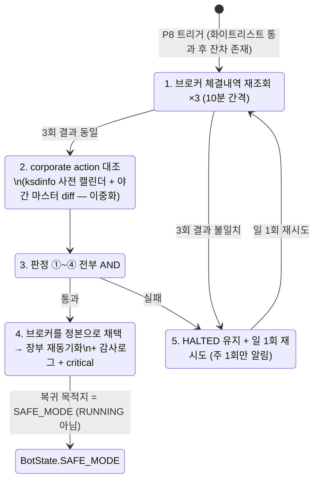

# 09. 안전장치 · 상태

> **범위**: `src/omra/protections/` 전체(서킷브레이커 P1~P15 플러그인 체인, P8 자가치유 사다리와 대사 화이트리스트 소비, pre-trade check 체인의 단계 정의, 3평면 상태 결합·전이, `SAFE_MODE`, 순매수(net-buy) 회계, Kill Switch, 부재 모드, fail-safe 기본값).
> **계획 정본**: 03 전체(특히 §1.1~§1.6 브레이커·자가치유·화이트리스트·pre-trade, §2.1~§2.6 상태·SAFE_MODE·노출 상한·Kill Switch, §3 fail-safe, §5.3 부재 모드, 부록 A 파라미터), 01 §3.4(상태·Protection·RPC 시그니처)·§3.5(가드 예산 영속화)·§1.4(동시성)·§6.2(시크릿 만료 자동 조치)·§6.4(자기복구 사다리), 06 §11(서킷브레이커 연결)·§8.3·§8.4, 02 §4.6(SAFE_MODE 집행 제약)·§5.6(E7 불변식), 00 §3.2(S1~S8 등급표)·§5 원칙 5·9·10.
> **선행 문서**: [02-domain-model.md](02-domain-model.md)(상태 enum·제약 벡터 타입·예외·Clock), [03-data-and-persistence.md](03-data-and-persistence.md)(DDL·repos·감사로그), [05-broker-gateway.md](05-broker-gateway.md)(`P9Class` 오류 분류), [06-market-data-and-calendar.md](06-market-data-and-calendar.md)(캘린더·세션), [08-execution.md](08-execution.md)(`order_lock`·대사 오케스트레이션·`safemode_filter`).
> **이 문서가 소유하는 정의**: P1~P15, 상태머신 결합(3평면 5축), `SAFE_MODE`, 순매수 회계, 부재 모드, pre-trade 체인의 **순서·단계 정의**(브리프 §2.1 경계 사례).

---

## 1. 개요 — 설계 대상과 책임

### 1.1 이 문서의 한 문장 정의

`protections/`는 **"지금 이 행위를 해도 되는가"를 판정하는 유일한 레이어**다. 판정의 재료는 세 가지뿐이다 — ① 브레이커 P1~P15의 발동 상태 ② 3평면(전역·슬리브·부재) 상태의 결합 제약 ③ 순매수·주문·회전율 예산의 잔량. 이 셋을 합성해 **차단하거나, 상태를 더 제한적인 쪽으로 전이시키거나, 아무것도 하지 않는다.**

주문을 **만들지 않는다**. 목표비중·수량·방향을 **생성하지 않는다**(00 §5 원칙 9). 브레이커의 액션 공간은 전부 단조 축소적이며, 유일한 예외처럼 보이는 `SAFE_MODE`의 밴드 2배도 "거래를 줄이는" 방향이다.

### 1.2 소유하는 것 / 소유하지 않는 것

| 소유한다 | 소유하지 않는다 (참조) |
|---|---|
| P1~P15의 트리거 계산·발동·해제·등급·영속화 | 브레이커가 소비하는 원자료 — 시세(06)·감시 등급(11)·브로커 오류 분류(05 `P9Class`) |
| pre-trade 체인의 **단계 정의와 순서** | 체인을 실행하는 함수 `execution.pretrade.check`의 호출 지점·오류 경로 매핑 ([08](08-execution.md) §5) |
| `BotState`/`SleeveState`/`PresenceState` 전이·결합·영속화 | enum 값·격자 타입 (`core/states.py` — [02](02-domain-model.md) §9) |
| `SAFE_MODE` 정의와 진입/이탈 | `safemode_filter`(집행 측 강제 지점 — [08](08-execution.md) §4.4), `safe_mode` 하 밴드 2배의 계산([07-portfolio-engine.md](07-portfolio-engine.md)) |
| 순매수 committed/settled 회계, 상한 도달·초과 판정 | 상한 사전 투영·차단 우선순위의 **적용**([08](08-execution.md) §4.3) |
| P8 판정·자가치유 사다리·화이트리스트 매칭 함수 | 대사 절차 오케스트레이션([08](08-execution.md) §13), `reconcile_expectations` DDL([03](03-data-and-persistence.md) §3.2.2) |
| Kill Switch 상태 전이, 확인코드 발급·검증 | Telegram/웹 명령 표면·알림 라우팅([13-web-and-telegram.md](13-web-and-telegram.md)) |
| 부재 사다리 전이, 실효 grace 클램프 계산 | `last_seen` 갱신 이벤트의 발생원(13), 브리핑 발송(13)·잡 스케줄(12) |
| fail-safe 목적지 판정 | 헬스체크·dead-man's switch 관측([12-scheduling-and-operations.md](12-scheduling-and-operations.md)) |

### 1.3 설계 불변식 (전 절이 지킨다)

1. **fail-safe의 기본 목적지는 `SAFE_MODE`이지 `STOPPED`가 아니다.** `HALTED`는 등급 A(장부 무결성)와 등급 B\*(노출 판단이 사람의 것)에만 쓴다 (03 §1.1, 00 §5 원칙 10).
2. **상태 전이는 명시된 경로로만 일어난다.** 표에 없는 전이는 시도 자체가 오류다 — warning + 감사로그를 남기고 상태를 바꾸지 않는다 (03 §2.1 완전성 규칙).
3. **브레이커 해제 ≠ 상태 이탈.** P10~P13의 "자동 해제"는 브레이커 플래그 해소만을 뜻한다 (03 §2.1).
4. **등급 A·B\*에는 자동 강등·자동 해제가 없다.** 부재 24h 사다리도 적용되지 않는다 (03 §1.1, §5.3.2).
5. **차단은 [도달]에서, 상태 전이는 [초과]에서.** 순매수 상한의 도달은 정상 동작이며 개입을 요구하지 않는다 (03 §2.4).
6. **판정 불가는 "위험 없음"이 아니다.** 감시 `unknown`의 fail-safe 기본값은 `SV2`다 (03 §1.6, 06 §8.3). 브레이커 `check()`가 예외를 던지면 ORDER 스코프에서는 주문을 거부한다(§3.4 단계 5 — 00 §5 원칙 5). 가드 예산 복원 실패는 기동 셀프체크 실패로 자기복구 사다리에 들어간다(03 §3, [01](01-system-architecture.md) §5.2 SC-9) — 그 예산의 소유는 `execution`이다(01 §3.5).
7. **모든 발동·전이·화이트리스트 통과는 감사로그에 남는다.** 기록 실패는 삼키지 않는다 ([03](03-data-and-persistence.md) §7.4 [DD-03-22]).

---

## 2. 모듈 구조

### 2.1 패키지 레이아웃

```
src/omra/protections/
├── __init__.py          # SafetyFacade — 외부(execution·scheduler·rpc)가 보는 유일한 표면 (§2.2)
├── base.py              # Protection ABC · ProtectionContext · ProtectionResult · BreakerGrade · Action
├── registry.py          # 선언 순서 로딩·스코프 분류·체인 평가 (§3.3~§3.4)
├── chain.py             # PLAN/ORDER 스코프 체인 실행기 + 결과 합성
├── pretrade_spec.py     # ★ pre-trade 체인의 단계 정의·순서 상수 (정본, §6)
├── breakers/
│   ├── p1_mdd.py        #   P1 · P1b
│   ├── p2_p3_daily.py   #   P2 일일 건수 · P3 일일 금액
│   ├── p4_cooldown.py   #   P4 종목 쿨다운
│   ├── p5_p6_quote.py   #   P5 가격 이상치 · P6 스프레드
│   ├── p7_sanity.py     #   P7 MVO-HRP 괴리 · P7-cond 조건수
│   ├── p8_reconcile.py  #   P8 대사 불일치 (판정만 — 사다리는 healing.py)
│   ├── p9_errors.py     #   P9-order · P9-quote
│   ├── p10_p11_turnover.py  # P10 월 상한 · P11 일일 예산
│   └── p12_p15_surv.py  #   P12 소스 침묵 · P13 동결 비중 · P14 기한부 · P15 폭증
├── healing.py           # P8 자가치유 사다리 (§5.3)
├── whitelist.py         # 대사 화이트리스트 매칭 엔진 (§5.2)
├── state/
│   ├── vectors.py       #   상태 → ConstraintVector 테이블 (§7.1)
│   ├── combine.py       #   3평면 축별 결합 (§7.2)
│   ├── machine.py       #   전이표·assert_transition·safe_mode_reasons refcount (§7.4~§7.5)
│   └── view.py          #   StateView — 소비자용 읽기 표면 (§7.3)
├── netbuy.py            # 순매수 committed/settled 회계 (§9)
├── presence.py          # 부재 사다리·grace 클램프 (§11)
├── killswitch.py        # data/KILL 워처·확인코드·`/panic` 경로 (§10)
└── failsafe.py          # fail-safe 기본값 표의 실행기 (§12)
```

> **[DD-09-1] `protections/` 내부 배치와 `SafetyFacade` 단일 표면**
> - 결정: 위 레이아웃. 외부 모듈은 `protections`의 내부 심볼을 직접 import하지 않고 `SafetyFacade`(관례상 `ctx.protections`)만 사용한다. `StateView`만 예외적으로 `protections.state.view`에서 직접 import한다(값 객체이고 순환이 없다).
> - 근거: 계획 01 §2는 `protections/`를 "서킷브레이커 플러그인 P1~P15"로만 명명했고 내부 구조는 비어 있다. [08](08-execution.md)이 이미 `ctx.protections.consume_expectations(...)`·`ctx.protections.raise_p8(...)`·`ctx.state.effective_constraints(...)`를 계약으로 사용하므로 파사드 경계가 이미 사실상 확정되어 있다.
> - 계획 문서와의 관계: 충돌 없음(여백 채움). 상태 기계를 `protections/state/`에 두는 것은 01 §3.4가 상태머신·Protections를 같은 절에 묶은 배치와 정합하며, `core/states.py`(타입)와 역할이 분리된다([02](02-domain-model.md) [DD-02-13]).

### 2.2 `SafetyFacade` — 외부 계약의 전부

```python
# protections/__init__.py
class SafetyFacade:
    """execution·scheduler·rpc·web이 protections에 대해 아는 것의 전부."""

    # ── 상태 읽기 ────────────────────────────────────────────────
    def state(self) -> StateView: ...                       # §7.3
    # ── 체인 평가 ────────────────────────────────────────────────
    def evaluate_plan_scope(self, ctx: PlanContext) -> ChainOutcome: ...      # 07:30·상태 루프 (§3.4)
    def evaluate_order_scope(self, order: Order, ctx: OrderContext) -> ChainOutcome: ...  # pre-trade 8단계
    # ── 이벤트 유입 ──────────────────────────────────────────────
    def on_broker_error(self, err: BrokerError) -> None: ...                  # P9 (§4.8)
    def on_quote_error(self, provider: str, kind: str) -> None: ...           # P9-quote (§4.8)
    def on_order_submitted(self, order: Order) -> None: ...                   # P2·P3·P4·순매수 예약
    def on_fill(self, fill: Fill, order: Order) -> None: ...                  # P10·P11·순매수 settled
    def on_order_terminated(self, order: Order) -> None: ...                  # 취소·거부 → committed 환입
    def on_maintenance_signal(self, sig: MaintenanceSignal) -> None: ...      # 05 §8.5 (§4.8)
    # ── 상태 전이 '요청' (12·01이 호출 — 판정·실행은 여기) ────────
    def request_safe_mode(self, reason: str, actor: Actor) -> TransitionOutcome: ...        # §7.4
    def request_sleeve_state(self, sleeve: SleeveId, target: SleeveState,
                             reason: str, actor: Actor = "scheduler") -> TransitionOutcome: ...
    def apply_more_restrictive(self, bot: BotState, cause: TransitionCause) -> BotState: ...
    #   ↑ 01 §5.5 (d) 자기복구 사다리 — 복원 상태와 인자 상태 중 더 제한적인 쪽을 확정 (§7.6)
    # ── 대사 ────────────────────────────────────────────────────
    def consume_expectations(self, diff: ReconcileDiff) -> Residual: ...      # §5.2 (08이 호출)
    def raise_p8(self, residual: Residual) -> None: ...                       # §5.1 (08이 호출)
    async def run_reconcile_healing(self, residual: Residual) -> HealOutcome: ...
    #   ↑ 01 §5.2 SC-11 / §5.5 (c) "대사 자가치유 3회"의 진입점 (§5.3 run_ladder)
    # ── 상태 명령 (13이 전달, 권한·확인코드 검증은 여기) ──────────
    def command(self, cmd: SafetyCommand) -> CommandResult: ...               # §10.3
    # ── 부재 ────────────────────────────────────────────────────
    def evaluate_presence(self, now: datetime) -> PresenceOutcome: ...        # §11.2
    def effective_grace_deadline(self, venue: Venue, brief_at: datetime) -> datetime: ...  # §11.3
    # ── fail-safe ───────────────────────────────────────────────
    def report_cycle_failure(self, kind: str, detail: str) -> None: ...       # §12.2
    def report_notify_result(self, run_date: date, any_success: bool) -> None: ...  # §12.3
```

> **[DD-09-21] 상태 전이 "요청" API와 자기복구·SC-11 진입점의 파사드 노출**
> - 결정: 위 세 묶음을 `SafetyFacade`의 공개 표면에 고정한다. ① `request_safe_mode(reason, actor)` / `request_sleeve_state(sleeve, target, reason, actor)` — 호출자는 **요청만** 하고 전이 합법성(§7.4 표)·3평면 결합·`safe_mode_reasons` refcount 판정은 09가 한다. 반환 `TransitionOutcome`은 `(applied: bool, before, after, rejected_reason)`이며 불법 전이는 예외가 아니라 `applied=False`다(§7.4 완전성 규칙). ② `apply_more_restrictive(bot, cause)` — 01 §5.5 (d)가 "복원 상태와 `SAFE_MODE` 중 더 제한적인 값"을 계산할 때 호출하며, 내부 구현은 §7.2 `combine`의 축별 비교를 `BotState` 평면에 적용한 것이다(별도 순서 정의를 만들지 않는다). ③ `run_reconcile_healing(residual)` — 01 §5.2 SC-11 / §5.5 (c)의 "대사 자가치유 3회" 진입점으로 §5.3 `run_ladder`를 감싼 것이며, 스케줄러의 일 1회 재시도도 같은 함수를 부른다.
> - 근거: 요청 출처는 [12-scheduling-and-operations.md](12-scheduling-and-operations.md) §10.3(잡 실패 정책)·§14.2(시크릿 만료 D−7/D−3 조치 규율)·§15(알림 채널 블랙아웃)과 [01-system-architecture.md](01-system-architecture.md) §5.5다. 두 문서 모두 "조치는 요청이고 실행은 09"를 명시했으나 호출할 이름이 09 §2.2에 없었다. 상태 전이를 호출자가 직접 쓰면 5축 결합이 두 곳에서 판정되어 03 §2.1의 단일 판정 지점 규약이 깨진다.
> - 계획 문서와의 관계: 충돌 없음(여백 채움). 01 §6.2 시크릿 만료 자동 조치·03 §3 알림 실패 조치의 **목적지**는 계획 그대로이고, 호출 경계만 확정한다.

**상시 태스크 전제 확인**([01](01-system-architecture.md) §4.2에 대한 회신): 전 상시 태스크는 `STOPPED`·`HALTED`에서도 기동·유지되며, 집행 차단은 태스크를 죽여서가 아니라 pre-trade 7단계 상태 게이트(§6.3)와 `combine` 결과(§7.2)가 수행한다 — 09는 이 전제 위에서 설계됐다(§7.6). 태스크를 죽이는 방식이면 `HALTED` 중에 대사·모니터링·알림이 함께 멈춰 "장부가 틀렸다"를 관측할 주체가 사라진다.

### 2.3 의존 방향

`protections`는 01 §2.2 계약의 **금지줄 대상이 아니다**(관측 4레이어가 아님). 실제로 쓰는 간선만 열거하면:

```
protections → core · config · audit · persistence.ro · persistence.repos.{state,protections}
protections → surveillance.gate        (허용 — 01 §2.2 "소비자는 pull")
protections → tax                      (허용 — 매도 제약 질의)
protections → calendar (06)            (거래일·세션·거래일 수 계산)
protections -/-> execution · brokers.*.client · engine.optimizer · engine.rebalancer
```

마지막 줄은 계약 파일에 없는 자율 규율이다 — 아래 DD로 승격한다.

> **[DD-09-2] `protections -/-> execution` 자율 규율의 계약 편입 요청**
> - 결정: `protections`가 `execution`·`brokers.*.client`·`engine.optimizer`·`engine.rebalancer`를 import하지 않는다는 금지줄을 import-linter 계약에 추가하도록 [01-system-architecture.md](01-system-architecture.md)(계약 파일 소유)에 요청한다.
> - 근거: 01 §2.2는 `execution·protections → surveillance.gate` 방향만 허용으로 적고 역방향을 봉인하지 않았다. 브레이커가 `execution`을 잡으면 "차단 판정기"가 "주문 생성기"를 호출할 수 있게 되어 원칙 9(일방향 밸브)의 구멍이 생기고, `SafetyFacade` ← `execution` 호출과 합쳐져 순환 import가 된다.
> - 계획 문서와의 관계: 충돌 없음 — 계약이 열거하지 않은 간선(default-allow)을 명시 금지로 좁히는 방향이며, 계획이 허용을 **선언한** 간선은 건드리지 않는다.

### 2.4 소유 테이블

| 테이블 | 용도 | 상태 |
|---|---|---|
| `bot_state` · `sleeve_state` · `presence` | 3평면 상태 (DDL 정본: [03](03-data-and-persistence.md) §3.2.1·§3.3.5) | 존재. `prev_state` 컬럼 편입 완료 — [03](03-data-and-persistence.md) §3.2.1 [DD-03-27] ([DD-09-3] 요청분) |
| `protection_state` | 브레이커별 발동·해제·등급 격상 | 존재. DDL 정본 [03](03-data-and-persistence.md) §3.3.13 [DD-03-28] ([DD-09-4] 요청분) |
| `protection_counters` | run_date 단위 카운터(일일 건수·금액·회전율 예산·streak) | 존재. DDL 정본 [03](03-data-and-persistence.md) §3.3.13 [DD-03-28] ([DD-09-4] 요청분) |
| `reconcile_expectations` | 화이트리스트 (읽기·소비 표시) | 존재 ([03](03-data-and-persistence.md) §3.2.2) |
| `approval_requests` | A3 타임아웃 판정 입력 | 존재 ([03](03-data-and-persistence.md) §3.3.9) |
| `orders`·`fills`·`nav_snapshots` | 순매수·회전율·MDD 파생 질의 | 존재(읽기 전용 파생 — [03](03-data-and-persistence.md) §3.5) |

> **[DD-09-3] `bot_state.prev_state` 컬럼 추가 요청** — **수용됨**([03](03-data-and-persistence.md) §3.2.1 [DD-03-27])
> - 결정: `bot_state`에 `prev_state TEXT` 컬럼을 추가하도록 [03-data-and-persistence.md](03-data-and-persistence.md)에 요청한다. `PAUSED`(P12)와 `RELOAD_CONFIG` 진입 시 직전 전역 상태를 기록하고, 복귀 시 그 값으로 되돌린다. 갱신·복귀 규칙(진입 시 `prev_state ← cur`, 복귀 시 `cur ← prev_state`)의 소유는 §7.4 전이표이고, 컬럼 정의·NULL 허용은 03이 소유한다.
> - 근거: 03 §2.1이 P12를 "소스 복구 시 **직전 전역 상태**로 복귀", `RELOAD_CONFIG`를 "재생성 후 **직전 상태**로 복원"으로 규정하는데, 현 스키마(state·safe_mode_reasons·since)에는 직전 상태를 담을 자리가 없다. 프로세스 메모리에 두면 재시작 한 번에 "복귀 목적지가 `RUNNING`인지 `SAFE_MODE`인지"가 소실되고, 그 오차는 평시 노출로 잘못 복귀하는 방향(더 위험한 쪽)이다.
> - 계획 문서와의 관계: 계획의 여백을 채운다. 복귀 규칙 자체는 03 §2.1 문언 그대로다.

> **[DD-09-4] `protection_state`·`protection_counters` 신설 요청** — **수용됨**([03](03-data-and-persistence.md) §3.3.13 [DD-03-28])
> - 결정: 2개 테이블을 [03-data-and-persistence.md](03-data-and-persistence.md)에 편입 요청한다. 쓰기 리포지토리는 `persistence/repos/protections.py`(`TABLES = {"protection_state", "protection_counters"}`, protections 전용). **DDL 본문은 이 문서가 들지 않는다**(브리프 §2.1 "SQLite DDL 전체는 03 소유") — 필드 계약은 03이 그대로 확정했다.
> - 근거: 03 §1.2가 브레이커 대부분에 "**N일 연속**", "연속 5회", "이월 잔량", "3개월 연속 시 등급 A 격상" 같은 **재시작을 넘는 카운터**를 부여했는데 계획에 저장 위치가 없다. 프로세스 메모리면 재시작 한 번에 P2 2일 연속·P7 3개월 연속·P11 이월 상한이 조용히 리셋된다(01 §3.5가 가드 예산에 대해 지적한 것과 같은 실패 모드이며, 03 §4.3 F22가 그 검증을 요구한다). `execution_state`를 재사용할 수 없는 이유는 그 repo가 `execution` 전용으로 봉인되어 있기 때문이다([03](03-data-and-persistence.md) §4.3).
> - 계획 문서와의 관계: 충돌 없음 — 01 §1.3은 SQLite를 "트랜잭션·상태" 저장소로 규정하면서 브레이커 카운터를 목록에 넣지 않았고, `bot_state`·`sleeve_state` 외에 안전장치 테이블을 만들지 않았다. 이 DD는 그 여백을 채운다(01 §3.5가 가드 예산에 대해 확립한 "재시작을 넘는 카운터는 DB 영속화"와 같은 패턴).

**DDL 정본: [03-data-and-persistence.md](03-data-and-persistence.md) §3.3.13**(`protection_state`·`protection_counters` + `ix_prot_tripped`). 이 문서는 SQL을 들지 않고 **값 집합만** 소유한다(03 [DD-03-28]이 `breaker_id`·`counter_kind`에 CHECK를 걸지 않고 값 집합 정본을 09로 지정했다):

| 컬럼 | 이 문서가 소유하는 값 집합 | 정의 위치 |
|---|---|---|
| `protection_state.breaker_id` | `P1`·`P1b`·`P2`…`P15`(분기 `P7-cond`·`P9-order`·`P9-quote` 포함) + fail-safe 의사 브레이커 `FS-cycle`·`FS-notify` + 되돌리기 창 `REVOCABLE` | §3.3 `DEFAULT_ORDER`, §12.2, §10.4 |
| `protection_state.scope_key` | `*` \| `instrument_key` \| `SleeveId` \| `Venue` \| `provider:data_kind` \| `change_id`(REVOCABLE) | §3.1 `ProtectionResult.scope_key` |
| `protection_state.grade` | `BreakerGrade` 4값(A·B·B_STAR·C) — 격상 반영 후의 실효 등급 | §3.1·§3.7 |
| `protection_counters.counter_kind` | `order_count` · `order_amount_krw` · `turnover_used` · `budget_carry_in` · `budget_carry_out` · `exhaust_streak` · `recover_streak` · `skip_streak` · `error_streak`(P9-order 전용 — P9-quote는 카운터를 두지 않는다, [DD-09-19]) | §4.3·§4.9·§3.7·§12.2·§4.8 |
| `protection_counters.run_date` | venue별 현지 거래일(`run_ledger` 규약과 동일 — 정본: 01 §1.4) | §3.5 |

### 2.5 검증 항목 (§2)

- 아키텍처 테스트: `protections` 소스에 `omra.execution`·`omra.brokers.*.client`·`omra.engine.optimizer` import 0건([DD-09-2]).
- `repos/protections.py`의 `TABLES` 서로소 검사 통과([03](03-data-and-persistence.md) §4.3 RepoContract 검사 2·3).
- `SafetyFacade` 공개 메서드 집합 스냅샷 테스트(무단 확장 차단).

---

## 3. Protection 플러그인 ABC와 체인

### 3.1 타입

```python
# protections/base.py
from abc import ABC, abstractmethod
from collections.abc import Sequence
from dataclasses import dataclass
from decimal import Decimal
from enum import StrEnum
from omra.core.states import BotState, SleeveState, ConstraintVector
from omra.core.accounts import SleeveId

class BreakerGrade(StrEnum):
    """03 §1.1 브레이커 해제 등급 — '위험의 종류'로 나눈 해제 정책의 축."""
    A      = "A"        # 무결성: 내 장부가 틀렸다 → 자동 해제 영구 금지
    B      = "B"        # 시장: 시스템 정상, 시장 이상 → 조건부 자동
    B_STAR = "B_STAR"   # 시장·비대칭: 노출을 되돌리는 판단이 사람의 것 → 자동 해제·부재 강등 모두 없음
    C      = "C"        # 자기 행위: 내 행동/파이프라인 이상 → 자동 (P15만 수동)

class Action(StrEnum):
    """브레이커가 낼 수 있는 조치. 전부 단조 축소적이다."""
    NONE            = "none"
    BLOCK_SYMBOL    = "block_symbol"      # 해당 종목 스킵 (P5·P6)
    LOCK_SYMBOL     = "lock_symbol"       # 해당 종목 N시간 잠금 (P4)
    BLOCK_DAY       = "block_day"         # 당일 신규 주문 중단 (P2·P3·P11)
    FREEZE_TARGETS  = "freeze_targets"    # 신규 목표비중 반영 금지, 직전 유효 목표로 계속 (P7·P7-cond)
    DEGRADE_PROVIDER= "degrade_provider"  # provider 폴백 전환 (P9-quote)
    PAUSE_SLEEVE    = "pause_sleeve"      # SleeveState.PAUSED (P14)
    PAUSE_SLEEVE_ALL= "pause_sleeve_all"  # SleeveState.PAUSED_ALL (P9-order 단일 venue, 시크릿 D-7)
    PAUSE_BOT       = "pause_bot"         # BotState.PAUSED (P12)
    SAFE_MODE       = "safe_mode"         # BotState.SAFE_MODE (P1·P10·P11·P13 20%)
    HALT            = "halt"              # BotState.HALTED (등급 A·B*)
    DOWNGRADE_EVENTS= "downgrade_events"  # 당일 신규 감시 이벤트 SV0 강등 (P15)

class Scope(StrEnum):
    """평가 시점 — [DD-09-5]."""
    PLAN  = "plan"    # 07:30 계획 수립 + 상태 평가 루프에서 1회
    ORDER = "order"   # pre-trade 8단계, 주문 1건마다 (order_lock 안)
    EVENT = "event"   # 사건 유입 시 (브로커 오류·체결·대사·감시 폴)

@dataclass(frozen=True)
class ProtectionResult:
    breaker_id: str
    tripped: bool
    action: Action
    grade: BreakerGrade                # 격상 반영 후의 실효 등급 (§3.7)
    scope_key: str = "*"               # 종목/슬리브/venue/provider 한정 조치의 대상
    reason: str = ""
    observed: dict[str, str] = ...     # 트리거 관측값 (감사로그·대시보드 근거 — Decimal은 문자열)
    clear_hint: str | None = None      # 해제 조건의 사람 읽는 요약 (알림·대시보드)

class Protection(ABC):
    """freqtrade Protections 플러그인 체인의 이식 (00 §4, 01 §3.4).
    파라미터·트리거 값의 정본은 03 §1.2·부록 A이며 config로 주입된다."""
    id: str                            # "P1" … "P15"
    grade: BreakerGrade                # 기본 등급 (격상은 §3.7이 계산)
    scopes: frozenset[Scope]

    @abstractmethod
    def check(self, ctx: ProtectionContext) -> ProtectionResult: ...

    @abstractmethod
    def clear_check(self, ctx: ProtectionContext, tripped: TrippedRecord) -> bool:
        """해제 조건 충족 여부. 등급 A·B*는 이 메서드가 항상 False를 반환한다(§3.6)."""
```

> **이름 규약 — `BreakerGrade` ≠ `AlertGrade`**: 계획 03은 §1.1 브레이커 해제 등급(A/B/B\*/C)과 §7.2 알림 등급(critical/info/silent)을 둘 다 "등급"으로 부르지만 값 집합이 서로소인 별개 개념이다. 두 타입은 §13의 알림 발신 경로(`ProtectionResult.grade`를 알림 payload에 싣는 지점)에서 한 모듈에 함께 등장하므로 식별자를 분리한다 — 여기가 `BreakerGrade`(`core`/`protections`), 알림 등급은 `AlertGrade`(정의 정본: [13-web-and-telegram.md](13-web-and-telegram.md) §3.1). 이 문서에서 아무 수식 없이 "등급 A·B·B\*·C"라고 쓰면 언제나 `BreakerGrade`다.

> **[DD-09-6] `Action` 12종 — 계획 스케치(5종)의 확장**
> - 결정: 01 §3.4의 주석 스케치(`block_plan | pause_bot | safe_mode | block_symbol | none`)를 위 12종으로 확장한다.
> - 근거: 스케치로는 03 §1.2 표의 동작 중 6개를 표현할 수 없다 — P9-order 단일 venue의 `PAUSED_ALL`(슬리브 평면), P14의 슬리브 `PAUSED`("전역 `BotState`는 바뀌지 않는다"), P1b·P13(40%)의 `HALTED`, P7의 "직전 유효 목표비중으로 계속 운용"(HALT 아님), P9-quote의 provider degrade, P15의 SV0 강등. 이들을 `block_plan`으로 뭉개면 03 §1.1이 등급을 나눈 이유(목적지가 서로 다르다) 자체가 코드에서 사라진다.
> - 계획 문서와의 관계: 계획 03 §1.2 표의 "동작" 열을 1:1로 사상한 것이며 새 동작을 발명하지 않았다. 01 §3.4의 주석은 "초안(시그니처 초안)" 절에 있으므로 03 §1.2가 정본이다(브리프 §1-5 정본 위계: 안전장치 = 03).

### 3.2 `ProtectionContext` — 브레이커의 유일한 입력 표면

```python
@dataclass(frozen=True)
class ProtectionContext:
    scope: Scope
    now: datetime                      # Clock 주입 (02 [DD-02-11])
    run_date: date                     # venue별 현지 거래일 (정본: 01 §1.4 / API: 06 설계서 §10.3)
    params: ProtectionParams           # config (값 정본: 03 부록 A / 스키마 정본: 04)
    state: StateView                   # §7.3
    ro: Session                        # persistence.ro — 읽기 전용
    counters: CounterStore             # protection_counters 접근자 (§2.4)
    calendar: TradingCalendar          # 거래일 수 계산 ([06](06-market-data-and-calendar.md) §10.1)
                                       #   — 달력일 혼용 금지
    surv: SurveillanceGate             # 6종 API (정의 정본: 06 §7.2 / 설계: 11)
    provider_health: ProviderHealthView  # streak(provider, kind) pull — P9-quote ([DD-09-19],
                                       #   구현·소유: 06 설계서 §4.3)
    nav: NavIndexView                  # NAV·MDD 지수 (§4.2.1) — 09 소유.
                                       #   11의 NavView(frozen_nav_ratio 입력 Protocol)와 다른 타입이다
    # ORDER 스코프에서만 채워진다
    order: Order | None = None
    quote: QuoteSnapshot | None = None # 06 소유 타입 (직전가·전일 종가·호가·나이)
    # EVENT 스코프에서만 채워진다
    event: BrokerError | Fill | ReconcileDiff | SurveillancePollResult | None = None
```

브레이커는 **`ctx` 밖의 어떤 것도 읽지 않는다**(전역 싱글턴·직접 DB 커넥션·`datetime.now()` 금지). 이것이 브레이커를 순수 함수에 가깝게 유지해 백테스트(`sim_mode: with_guards` — 02 §8.1)에서 같은 코드로 재생 가능하게 하는 조건이다.

### 3.3 등록과 평가 순서

```python
# protections/registry.py
DEFAULT_ORDER: Final[tuple[str, ...]] = (
    "P1", "P1b", "P8", "P9-order", "P9-quote",        # 상태 전이를 유발하는 것 먼저
    "P12", "P13", "P14", "P15",                        # 감시 유래
    "P7", "P7-cond", "P10",                            # 계획 품질·월 단위
    "P2", "P3", "P11", "P4", "P5", "P6",               # ORDER 스코프 한도 → 쿨다운 → 시세 품질
)

def load_chain(cfg: ProtectionsConfig) -> list[Protection]:
    """config 선언 순서로 평가한다 (01 §3.4). 선언이 비어 있으면 DEFAULT_ORDER.
    검증 3종:
      ① 등록 집합 == P1~P15 전체(분기 항목 P1b·P7-cond·P9-order·P9-quote 포함) — 누락 시 기동 거부
      ② id 중복 금지
      ③ ORDER 스코프 내부 순서가 03 §1.6 8단계의 '한도 → 쿨다운 → 시세 품질'을 따른다"""
```

> **[DD-09-5] 평가 스코프 3분류와 순서 규율**
> - 결정: 브레이커를 PLAN/ORDER/EVENT 스코프로 분류하고, "config 선언 순서로 평가"(01 §3.4)를 **같은 스코프 안에서의 순서**로 해석한다. 스코프 간에는 시점 자체가 다르므로 순서 개념이 성립하지 않는다.
> - 근거: 계획은 체인을 단일 순회로 기술했지만, P8(대사 결과에서만 판정 가능)·P9(브로커 오류 이벤트)·P4(주문 이력)·P5/P6(주문 시점 호가)는 평가 가능한 시점이 서로 다르다. 단일 순회로 강제하면 07:30에 호가가 없어 P5·P6가 항상 통과하거나(무력화), 반대로 pre-trade에서 매 주문마다 MDD·회전율 전체를 재계산하게 된다(01 §4.3 아침 창 예산·§1.4 락 보유 시간과 충돌).
> - 계획 문서와의 관계: 03 §1.6이 이미 ORDER 스코프 부분집합(8단계 = P2·P3·P11 → P4 → P5·P6)의 순서를 고정했고, 위 분류는 그것과 문자 단위로 일치한다.

| 브레이커 | 스코프 | 평가 훅 |
|---|---|---|
| P1 · P1b | PLAN | `signal_and_plan`(07:30) 진입부 + `krx_eod` 후 상태 루프 |
| P2 · P3 · P11 | ORDER (+ PLAN 사전 투영) | pre-trade 8단계. PLAN에서는 잔량만 조회해 계획 규모 산정에 반영 |
| P4 | ORDER | pre-trade 8단계 |
| P5 · P6 | ORDER | pre-trade 8단계 (호가 스냅샷 필요) |
| P7 · P7-cond | EVENT | `monthly_targets_batch`(매월 1일 03:30) 산출 직후 |
| P8 | EVENT | `krx_eod`·`us_reconcile`·기동 셀프체크 SC-11의 대사 결과 |
| P9-order · P9-quote | EVENT | `SafetyFacade.on_broker_error` (모든 `BrokerError`) |
| P10 | PLAN | 07:30 (월 누적 회전율 재계산) |
| P12 · P13 · P14 · P15 | PLAN | 07:30. P13은 감시 폴 완료 후에도 재평가(EVENT 겸용) |

### 3.4 체인 평가 알고리즘

```python
# protections/chain.py
@dataclass(frozen=True)
class ChainOutcome:
    results: list[ProtectionResult]
    blocked: bool                       # 하나라도 집행 차단 조치가 있는가
    transitions: list[StateTransition]  # 적용된(또는 적용될) 상태 전이
    block_reason: str | None

def evaluate(chain: Sequence[Protection], ctx: ProtectionContext) -> ChainOutcome:
    """1. chain을 선언 순서로 순회하며 ctx.scope에 속하는 브레이커만 check() 한다.
    2. 각 결과를 protection_state에 upsert한다 —
       tripped 전이(ARMED→TRIPPED)일 때만 감사로그 `protection_tripped` + 등급별 알림.
       이미 TRIPPED인 브레이커의 재발동은 기록하되 알림하지 않는다(03 §7.2 재알림 금지).
    3. Action → 상태 전이 매핑(§3.7)을 계산해 transitions에 모은다.
       ★ 전이는 여기서 적용하지 않는다 — 순회 도중 state가 바뀌면 뒤 브레이커가
         다른 상태에서 평가된다. 순회 종료 후 machine.apply_all(transitions)로 일괄 적용한다.
    4. 하나라도 집행 차단 조치(BLOCK_*·LOCK_*·PAUSE_*·SAFE_MODE·HALT)면 blocked=True.
    5. check()가 예외를 던지면: 그 브레이커만 '판정 불가'로 기록하고 순회는 계속하되,
       ctx.scope is ORDER 이면 주문을 거부한다(판정 불가 → 거래 안 함 — 00 §5 원칙 5).
       PLAN 스코프의 판정 불가는 §12의 사이클 실패로 계상한다."""
```

**단계 3의 순회 중 전이 금지**가 이 알고리즘의 유일한 비자명한 규칙이다. 예: P13(20%)이 `SAFE_MODE`를 유발한 같은 순회에서 P11이 평가되면, P11의 "3거래일 연속 소진 → SAFE_MODE"가 이미 SAFE_MODE인 상태에서 판정되어 `safe_mode_reasons` 집합에 P11이 들어가지 못한다. 그러면 P13이 해소됐을 때 refcount가 0이 되어 SAFE_MODE를 조기 이탈한다(§7.5).

### 3.5 발동 영속화와 복원

- 발동/해제는 `protection_state` upsert + 감사로그 `protection_tripped`(payload: `breaker_id`·`grade`·`action`·`scope_key`·`observed`·`clear_hint`)로 이중 기록한다. DB는 현재 상태, 감사로그는 이력이다.
- 기동 시 `protection_state`의 `status='TRIPPED'` 행을 전부 로드해 체인 상태를 복원한다. **복원은 상태를 개선하지 않는다** — `HALTED`로 죽었으면 `HALTED`로 깨어난다([01](01-system-architecture.md) §5.1 상태 복원 원칙).
- `protection_counters`의 run_date 기반 카운터는 복원 시 **오늘 run_date 행만** 로드한다. 행이 없을 때의 처리는 브레이커별로 다르다 — P11 이월 잔량은 **0**(= 당일 예산만. 이월을 낙관적으로 되살리지 않는 보수 방향), P2·P3는 `orders`에서 **당일 신규 접수분을 재계산**해 채운다(파생 가능하므로 0으로 시작하면 한도가 조용히 초기화된다).

### 3.6 해제 평가 루프

```python
def clear_sweep(chain, ctx) -> list[ProtectionResult]:
    """07:30 PLAN 평가 직전, 그리고 날짜 경계(00:00 KST)에 실행.
    for each TRIPPED record:
        if grade in (A, B_STAR):        continue          # 자동 해제 영구 금지 (03 §1.1)
        if breaker.id == "P15":         continue          # 등급 C이나 해제는 수동 (03 §1.2)
        if breaker.clear_check(ctx, rec):
            status ← ARMED, cleared_at ← now, 감사로그 protection_tripped(cleared=True)
    ★ 해제는 브레이커 플래그만 푼다. BotState 이탈은 §7.5의 safe_mode_reasons refcount가
      별도로 판정한다 (03 §2.1 '브레이커 해제 ≠ 상태 이탈')."""
```

### 3.7 등급 → 목적지 매핑과 등급 격상

```python
DESTINATION: Final[dict[Action, StateEffect]] = {
    Action.HALT:             StateEffect(bot=BotState.HALTED),
    Action.SAFE_MODE:        StateEffect(bot=BotState.SAFE_MODE),
    Action.PAUSE_BOT:        StateEffect(bot=BotState.PAUSED),
    Action.PAUSE_SLEEVE:     StateEffect(sleeve=SleeveState.PAUSED),
    Action.PAUSE_SLEEVE_ALL: StateEffect(sleeve=SleeveState.PAUSED_ALL),
    # 나머지 Action은 상태 전이를 만들지 않는다(국소 차단·플래그).
}

def effective_grade(breaker: Protection, ctx: ProtectionContext) -> BreakerGrade:
    """등급 격상 규칙 (03 §1.2) — [DD-09-7].
    P2·P3 : exhaust_streak ≥ 2 (연속 2 거래일 소진)   → BreakerGrade.A
    P7·P7-cond : exhaust_streak ≥ 3 (연속 3 월배치)    → BreakerGrade.A
    P9-order : 동시 TRIPPED venue 수 ≥ 2               → BreakerGrade.A + Action.HALT
               (단일 venue는 BreakerGrade.A이나 조치는 PAUSE_SLEEVE_ALL — 03 §1.2)
    P13 : frozen_nav_ratio > frozen_nav_halt_pct(40)   → BreakerGrade.B_STAR + Action.HALT
    그 외는 선언 등급 그대로."""
```

> **[DD-09-7] 등급 격상 카운터의 키와 리셋 규칙**
> - 결정: 격상 판정은 `protection_counters(counter_kind='exhaust_streak')`로 한다. **P2·P3는 거래일 단위**(해당 venue의 `run_date` 기준 연속 소진), **P7·P7-cond는 월배치 단위**(연속 실행 회차). 소진 없이 지나간 거래일/회차가 1회라도 있으면 streak를 0으로 리셋한다. 격상된 등급 A는 `protection_state.grade='A'`로 영속화되며, 수동 `/resume` 없이 자동으로 원래 등급으로 되돌아가지 않는다.
> - 근거: 03 §1.2가 "2일 연속 소진 시 등급 A 격상"·"3개월 연속 시 등급 A 격상"만 정하고 카운터의 의미(달력일 vs 거래일, 리셋 조건)를 비웠다. 거래일 기준을 택한 이유는 P2·P3가 "당일 주문 중단"이라 주말·휴장일에는 소진 자체가 정의되지 않기 때문이다([06-market-data-and-calendar.md](06-market-data-and-calendar.md) §10.1 `trading_days_between`이 이 계산의 공용 함수다 — 달력일 혼용 금지).
> - 계획 문서와의 관계: 여백 채움. 격상 후 자동 복귀를 두지 않는 것은 03 §1.1 "등급 A는 자동 해제 영구 금지"와 정합한다.

### 3.8 검증 항목 (§3)

- 체인 등록 완전성: P1~P15 + 분기 4종이 전부 등록되지 않으면 기동 셀프체크 실패([01](01-system-architecture.md) §5.2 SC 계열과 동일 처리).
- 순회 중 전이 금지: P13(20%)과 P11(3일 연속)이 같은 순회에서 발동하는 시나리오에서 `safe_mode_reasons`에 두 원인이 모두 들어간다.
- `check()` 예외 주입 → ORDER 스코프면 주문 거부, PLAN 스코프면 사이클 실패 계상, 다른 브레이커는 계속 평가.
- 등급 격상: P2를 2거래일 연속 소진시키면 `grade='A'`, 중간에 1일 미소진이면 리셋.
- 재발동 알림 억제: 이미 TRIPPED인 브레이커의 재판정에서 알림 0건, 감사로그는 기록됨.

---

## 4. P1~P15 개별 설계

### 4.1 파라미터 (값 정본: 03 부록 A / 스키마·검증 정본: [04-configuration-and-secrets.md](04-configuration-and-secrets.md))

| 키 | 값 | 소비 |
|---|---|---|
| `protections.mdd_safe_mode_pct` / `mdd_halt_pct` | −15 / −25 | P1 / P1b |
| `protections.mdd_recover_pct` / `mdd_recover_days` | −10 / 5 | P1 자동 해제 |
| `protections.daily_order_count` | 30 (M4 실측 ×2 재캘리브레이션) | P2 |
| `protections.daily_order_amount_pct` | 30 | P3 |
| `protections.daily_order_amount_abs_krw` | `null` = 미적용 (04 [DD-04-17]) | P3 절대 상한 |
| `protections.symbol_cooldown_hits` / `symbol_cooldown_hours` | 3(1시간 내) / 24 | P4 |
| `protections.symbol_cooldown_window_min` | 60(분) (04 [DD-04-17]) | P4 계수 창 |
| `protections.price_outlier_pct` / `quote_stale_min` | 15(크립토 30) / 5 | P5 |
| `protections.spread_max_pct` | 1.0 | P6 |
| `sanity.hrp_divergence` / `cov.condition_number_max` | 20(%p) / 1000 — **엔진 파라미터, 이름·값 정본은 02 부록 A** | P7 / P7-cond |
| `protections.reconcile_tolerance_shares` / `reconcile_tolerance_cash_krw` | 0 / M4 실측 | P8 |
| `protections.error_streak_order` / `error_streak_quote` | 5 / 5 | P9 |
| `protections.turnover_monthly_mult_warn` / `_halt` | 2 / 3 | P10 |
| `protections.turnover_annual_assumption` | 0.30 | P11 일일 예산 = /250 |
| `protections.turnover_carryover_cap_days` | 60 | P11 이월 상한 |
| `protections.turnover_streak_safe_mode` | 3 | P11 |
| `protections.surveillance_stale_hours` | 24 | P12 |
| `protections.frozen_nav_safe_mode_pct` / `frozen_nav_halt_pct` | 20 / 40 | P13 |
| `protections.deadline_pause_days` | 3 | P14 |
| `protections.event_burst_abs` / `event_burst_ratio` | 4 / 0.30 | P15 |
| `execution.max_open_orders` | kis_domestic 6 / kis_overseas 6 / upbit 4 | pre-trade 8.5 |
| `safe_mode.*` · `presence.*` · `alerts.*` | 03 부록 A 블록 그대로 | §8·§11·§13 |

**표기 없는 값은 M4 모의 기간 실측 캘리브레이션 대상**이다(03 부록 A 서문).

### 4.2 P1 · P1b — 계좌 MDD

```python
class P1AccountMdd(Protection):
    id, grade, scopes = "P1", BreakerGrade.B, frozenset({Scope.PLAN})

    def check(self, ctx) -> ProtectionResult:
        idx = ctx.nav.return_index()                    # §4.2.1 — 외부 현금흐름 조정 지수
        dd  = idx.current / idx.high_water - 1          # 음수
        if dd <= ctx.params.mdd_safe_mode_pct / 100:
            return trip(Action.SAFE_MODE, observed={"dd_pct": f"{dd:.4f}"},
                        clear_hint="MDD −10% 이내 회복 + 5거래일 유지 + last_seen 72h 이내")
        return ok()

    def clear_check(self, ctx, rec) -> bool:
        """03 §1.2 — 세 조건 전부 AND:
        ① 현재 MDD > mdd_recover_pct(−10%)
        ② 그 상태가 mdd_recover_days(5) '거래일' 연속 유지 (counter recover_streak)
        ③ ctx.state.presence.last_seen_age <= 72h  ← 무응답 중에는 회복해도 유지"""
```

`P1b`는 같은 지수를 쓰되 임계 `mdd_halt_pct`(−25), 등급 `B_STAR`, 조치 `Action.HALT`, `clear_check`는 **항상 False**다(수동 `/resume` 전용). 비대칭 해제(`/resume_buy`)는 §10.3이 처리한다.

#### 4.2.1 MDD 기준선

> **[DD-09-8] MDD는 원시 NAV가 아니라 외부 현금흐름 조정 수익률 지수(TWR)에 대해 계산한다**
> - 결정: 일별 지수 `I_t = I_{t-1} × NAV_t / (NAV_{t-1} + F_t)`. `F_t` = 그날 확정된 외부 현금 유입−유출(`reconcile_expectations`의 `kind ∈ {cash_in, cash_out}` 소비 완료분 + 수동 등록분). 고점(`high_water`)은 운용 개시 이후 `I` 계열의 최대치이며 `nav_snapshots`(계좌 합산 KRW)에서 매 EOD 갱신한다. `F_t` 관측이 불가능한 날(대사 미완료)은 그날의 지수 갱신을 보류하고 직전 값을 유지한다(보수 방향 — 낙폭을 과소평가하지 않는다). 접근자는 `NavIndexView`(`return_index() -> NavIndex(current, high_water)`)이며 **09가 소유**한다 — 11의 `NavView`(`frozen_nav_ratio` 입력 Protocol, [11-realtime-and-surveillance.md](11-realtime-and-surveillance.md) [DD-11-12])와 이름·형태가 다른 별개 타입이다.
> - 근거: 이 계좌에는 월정액 자동이체(00 §3.2 E4)와 비정기 목돈 유입(E5)이 **구조적으로 존재**한다. 원시 NAV 고점 대비 낙폭을 쓰면 ⓐ 입금이 낙폭을 메워 실제 −15% 국면에서 P1이 발동하지 않고 ⓑ 인출기(T8)에는 시장이 멀쩡해도 P1이 오발동한다. 03 §1.2가 "NAV가 최근 고점 대비 −15%"라고만 적어 이 왜곡이 미정의로 남아 있었다.
> - 계획 문서와의 관계: 충돌 없음 — "NAV 고점 대비 낙폭"의 의도(시장 손실 감지)를 보존하는 유일한 계산이다. 03 §4.4의 가드 A/B 백테스트(2020-02~04 등)도 같은 지수를 쓴다(백테스트에는 외부 유입이 없으므로 두 정의가 일치한다 — 회귀 비교가 성립한다).

### 4.3 P2 · P3 — 일일 주문 건수·금액

- **P2 계수 정의(03 §1.2 문자 그대로)**: 신규 접수된 주문 건수. **TWAP·금액 기준 분할 슬라이스는 포함**, **정정·재호가·취소는 제외**. 업비트의 "취소+재주문"으로 구현된 재호가는 **0건**으로 센다(01 §3.2 `replace_order` 계수 규약).
- **P3 계수 정의**: 누적 **신규** 주문액 > NAV의 `daily_order_amount_pct`(30%) 또는 절대 상한 `protections.daily_order_amount_abs_krw`(03 §1.2 문언. 기본 `null` = **미적용**, 키 정본: [04](04-configuration-and-secrets.md) §4.4 [DD-04-17]). 값이 설정되면 비율 상한과 **AND로 함께 강제**한다 — 둘 중 하나라도 초과하면 발동한다. **정정은 차액만 반영, 취소는 환입.**
- 두 브레이커의 카운터는 `SafetyFacade.on_order_submitted`에서 `protection_counters(order_count / order_amount_krw)`를 증분한다. **증분은 `order_lock` 안**에서 일어난다([08](08-execution.md) §3.1 불변식 1과 같은 임계구역).
- 조치 `Action.BLOCK_DAY` — 당일 신규 주문 중단. 접수된 주문의 체결·정정·취소는 계속된다.
- 해제: `run_date` 경계에서 자동(등급 C). 2거래일 연속 소진 시 등급 A 격상([DD-09-7]) → `Action.HALT`.
- NAV 기준: 판정 시점의 **직전 영업일 종가 NAV**(03 §2.2의 순매수 상한과 같은 기준을 재사용한다).

### 4.4 P4 — 종목 쿨다운

동일 (종목 × 방향) 주문이 **1시간 창** 안에서 `symbol_cooldown_hits`(3)회에 도달하면 해당 종목을 `symbol_cooldown_hours`(24h) 잠근다(`Action.LOCK_SYMBOL`, `scope_key = instrument_key`). **계수 창(1시간)과 잠금 기간(24h)은 서로 다른 값이며 혼용하지 않는다**(03 §1.2 "동일 종목·방향 주문 1시간 내 3회 → 해당 종목 24h 잠금", 부록 A `symbol_cooldown_hits: 3 # 1시간 내`). 계수 창은 `protections.symbol_cooldown_window_min`(기본 60분)을 읽는다(키 정본: [04](04-configuration-and-secrets.md) §4.4 [DD-04-17]) — 코드 상수가 아니다. **정정·재호가는 계수하지 않는다**(03 §1.2). 카운터는 `orders`에서 `submitted_at_kst` 창 질의로 파생하며 별도 저장을 두지 않는다 — 잠금 사실만 `protection_state(P4, scope_key=instrument_key)`에 남는다. 해제는 24h 경과 시 자동. 감시 동결 자산은 쿨다운 카운터에 영향을 주지 않는다(06 §8.4-e).

### 4.5 P5 · P6 — 시세 품질 (ORDER 스코프)

```python
# P5
outlier = abs(quote.last / quote.prev_close - 1) > pct(ctx, instrument)   # ETF 15%, 크립토 30%
stale   = quote.age_min >= ctx.params.quote_stale_min                     # 5분
# P6
spread  = (quote.ask - quote.bid) / quote.mid > ctx.params.spread_max_pct / 100
```

둘 다 `Action.BLOCK_SYMBOL` + **silent 알림**(03 §7.2). 등급 B, 해제는 "다음 사이클 자동 재평가"이므로 `clear_check`는 `run_date` 또는 사이클 경계에서 True를 반환한다. 크립토 임계 분기는 `instrument.asset_class == "crypto"`로 판정한다(도메인 정의 정본: [02](02-domain-model.md) §3).

**`quote_stale_min` 키 통합 확정**(06 §16-15 조율 항목에 대한 09 회신 — 11의 판정과 동일): 실시간 가드 발동 조건 3-AND의 ③("마지막 정상 틱으로부터 5분 이내")과 P5의 stale 판정은 **같은 키 `protections.quote_stale_min`(5)을 읽는다.** 두 벌로 두면 "가드는 무장했는데 P5는 안 걸린" 구간이 생겨 같은 사실에 대해 두 레이어가 어긋난 판정을 낸다. 임계 이름·값의 정본은 03 부록 A / 스키마는 04 §4.2 `ProtectionsCfg.quote_stale_min`이고, 09와 11이 그 하나를 함께 읽는다([11-realtime-and-surveillance.md](11-realtime-and-surveillance.md) §4.3 3-AND 발동 조건·§4.4 `PriceGuard`). `data`(06)는 `Quote.observed_at`만 공급하고 임계를 정의하지 않는다.

### 4.6 P7 · P7-cond — 계획 품질 (EVENT: 월배치)

- **P7**: `sanity.hrp_divergence` — **자산군 내부 배분 max 괴리 > 20%p**(L1 norm 아님 — 02 §3.4와 문자 단위 동일 정의).
- **P7-cond**: `Σ_strategic`의 조건수 > `cov.condition_number_max`(1000).
- 조치는 둘 다 `Action.FREEZE_TARGETS` — **"직전 유효 목표비중으로 계속 운용 + 신규 목표 반영 금지". HALT가 아니고 `SAFE_MODE` 진입 사유도 아니다**(03 §1.2·§2.1). 소비자는 `engine.rebalancer`이며 `StateView.targets_frozen_by_sanity`를 읽는다.
- 해제: 다음 월 배치에서 자동 재평가. 3개월 연속 시 등급 A 격상([DD-09-7]).

### 4.7 P8 — 대사 불일치

트리거·자가치유·화이트리스트는 §5에서 전면 설계한다. 여기서는 등급 계약만 못박는다: **등급 A, 자동 해제 영구 금지, 자가치유 성공 시 목적지는 `RUNNING`이 아니라 `SAFE_MODE`**(03 §1.2·§1.3).

### 4.8 P9-order · P9-quote

```python
def on_broker_error(self, err: BrokerError) -> None:
    """05 §3.6이 분류한 P9Class 태그를 소비한다. 분류는 브로커 어댑터가, 카운트·발동은 여기가 소유.
    ★ 감시 유래 거부는 이 경로에 도달하지 않는다 — pre-trade 2단계가 던지는
      TradabilityBlocked(kind == 'vi_pause')는 BrokerError가 아니고 제출 전 거부라
      P9 카운트 비대상이다(03 §1.4 공통 제외 ①의 구현 키 —
      [11-realtime-and-surveillance.md](11-realtime-and-surveillance.md) [DD-11-13])."""
    if err.p9_class is P9Class.NONE:
        return                          # 03 §1.4 공통 제외 ①~④ (VI·점검성·인증·타임아웃·레이트리밋)
    if err.p9_class is P9Class.ORDER:
        n = counters.incr("P9-order", scope_key=err.venue, kind="error_streak")
        if n >= params.error_streak_order:                          # 5
            trip(BreakerGrade.A, Action.PAUSE_SLEEVE_ALL, scope_key=sleeve_of_venue(err.venue))
            if tripped_venue_count() >= 2:                          # 2개 이상 venue 동시 발동
                trip(BreakerGrade.A, Action.HALT, scope_key="*")    #   → 전역 HALTED
    else:                               # P9Class.QUOTE — 카운터는 06이 소유 ([DD-09-19])
        self.on_quote_error(err.provider, err.data_kind)

def on_quote_error(self, provider: str, kind: str) -> None:
    """P9-quote. 자체 카운터를 두지 않고 06 `ProviderHealth.streak(provider, kind)`를
    pull로 읽어 임계 판정·발동 기록만 한다 ([DD-09-19])."""
    if ctx.provider_health.streak(provider, kind) >= params.error_streak_quote:   # 5
        trip(BreakerGrade.C, Action.DEGRADE_PROVIDER, scope_key=f"{provider}:{kind}")
```

- **P9-order의 연속 카운터는 성공 응답 1회로 0이 된다.** 성공 통지는 `SafetyFacade.on_broker_success(venue)`(파사드 내부 경로)로 들어온다. P9-quote의 리셋은 06 `ProviderHealth.record_success`가 수행한다(09는 세지 않는다).

- 03 §1.4 공통 제외 ②③④의 **후속 처리**("연속 실패 시 해당 슬리브 당일 집행 보류 + warning")는 P9가 아니라 fail-safe 경로(§12.2)가 담당하며, 크립토는 06 §10의 응답 기반 점검 감지가 `calendar`의 `MAINT`로 표현한다([06-market-data-and-calendar.md](06-market-data-and-calendar.md) §10.4). 그 구간의 슬리브 조치는 `SleeveState.PAUSED_ALL`을 **당일 자정까지 부여**하고 정상 응답 3회 연속 시 즉시 `ACTIVE`로 되돌리는 것이다(03 §2.1 주석 — 4번째 enum 값을 만들지 않는다).
- **업비트 점검 신호의 소비 지점**(05 §8.5 조율 요청 C4에 대한 회신):

```python
def on_maintenance_signal(self, sig: MaintenanceSignal) -> None:
    """05 §8.5 `UpbitMaintenanceDetector`가 방출하는 신호의 유일한 소비 지점.
    어댑터는 '연속 실패/성공 스트릭 3회'라는 사실만 방출하고 등급·상태를 바꾸지 않는다.
    스트릭 임계(realtime.upbit_maintenance_fail_streak: 3)의 계수 소유도 05다 — 09는 세지 않는다.
      sig.suspected is True  → machine.transition(sleeve='crypto', PAUSED_ALL,
                                 cause=TransitionCause('UPBIT_MAINTENANCE'), actor='guard')
                               유효기간은 **당일 자정(KST)**까지 (03 §2.1 주석)
      sig.suspected is False → machine.transition(sleeve='crypto', ACTIVE, …)  # 즉시 해제
    ★ 이 전이는 P9-order와 무관하다 — 점검성 응답은 P9 카운터를 소비하지 않는다
      (03 §1.4 공통 제외 ②, F19). 같은 구간을 `calendar`가 CLOSED로 취급하는 것은
      06 소유의 별개 표현이며, 두 경로는 서로를 입력으로 쓰지 않는다(이중화)."""
```

  이 전이는 §7.4 슬리브 전이표의 `ACTIVE → PAUSED_ALL`(공통 제외 ②③④ 행)과 `PAUSED_ALL → ACTIVE`(점검 보류: 정상 응답 3회 연속) 행에 이미 등재돼 있다. **자동 해제가 허용되는 유일한 `PAUSED_ALL` 사유**이며(시크릿·P9-order 사유는 수동 `/resume <슬리브명> <확인코드>`), 두 사유가 동시에 걸려 있으면 더 제한적인 쪽이 남는다 — `protection_state`에 사유별 행이 따로 있으므로 하나가 풀려도 다른 행이 `TRIPPED`면 슬리브는 `PAUSED_ALL`을 유지한다.
- `P9-quote`의 `DEGRADE_PROVIDER`는 `ProviderRegistry`(06 소유)에 폴백 전환을 통지할 뿐 주문 경로를 건드리지 않는다. **HALT를 유발하지 않는다**(03 §1.4의 존재 이유).

> **[DD-09-19] P9-quote의 연속 오류 카운터는 06 `ProviderHealth`를 pull로 읽는다 — 09는 카운터를 복제하지 않는다**
> - 결정: `ProtectionContext.provider_health: ProviderHealthView`(읽기 전용 Protocol, 구현·소유는 [06-market-data-and-calendar.md](06-market-data-and-calendar.md) §4.3)를 추가하고, P9-quote는 `streak(provider, data_kind) >= protections.error_streak_quote`만 판정한다. `protection_counters`에는 P9-quote의 `error_streak`를 쓰지 않으며 발동 사실만 `protection_state`에 남긴다. `Action.DEGRADE_PROVIDER`의 **실행**(폴백 전환)은 06 소유이고, 09는 발동 기록·warning 알림·`protection_tripped` 감사로그를 담당한다.
> - 근거: 06 §4.3이 카운터 단위를 `(provider, data_kind)`로 확정하고 `streak()`를 "protections가 pull로 읽는다"로 공개했다([DD-06-3], 06 §16 조율 요청). 09가 `BrokerError`만 보고 별도로 세면 ⓐ provider fetch 실패(브로커 오류가 아닌 경로)가 누락되고 ⓑ 같은 실패가 두 카운터에 잡혀 임계 5가 실질 2~3이 된다. 카운터를 한 벌로 두는 것이 03 §1.2의 "연속 5회" 문언을 유일하게 결정론적으로 만든다. P9-order를 같은 방식으로 바꾸지 않는 이유는 그쪽이 등급 A(→ `PAUSED_ALL`·`HALTED`)라 재시작 시 리셋이 **위험 방향**이기 때문이다 — 그래서 P9-order만 `protection_counters`에 영속화한다.
> - 계획 문서와의 관계: 충돌 없음 — 03 §1.2는 임계·목적지·해제만 정하고 카운터의 보관 주체를 비웠다. 프로세스 메모리 보관의 오차 방향(재시작 시 리셋 = 재시도)이 안전 방향임은 06 [DD-06-3]이 논증했고, P9-quote는 HALT를 유발하지 않으므로(03 §1.4) 영속화 요건에 해당하지 않는다.

### 4.9 P10 · P11 — 회전율

**공통 회전율 정의(03 §1.2, P10·P11·07 R3 공통)**:

```
turnover(기간) = Σ_i min( Σ 매수체결금액_i , Σ 매도체결금액_i ) / NAV_기말
```

편도 기준이며 순유입에 의한 일방 매수는 계상하지 않는다. 종목별 `min`이므로 `fills`를 `orders`로 조인해 `(instrument_key, side)`로 집계한다.

**P10 (월 상한, 역월)**: 월 환산 기준선 = `turnover_annual_assumption / 12`. 경고 = ×`turnover_monthly_mult_warn`(2), `SAFE_MODE` = ×`turnover_monthly_mult_halt`(3). 파생값(0.30/12 = 2.5%/월 → 경고 5%, SAFE_MODE 7.5%)은 config에서 계산되며 하드코딩하지 않는다. **P10의 "월"은 역월**이다(03 §2.2 주석 — `safe_mode.net_buy_*`의 rolling 30일과 다르다). 해제는 월 경계 자동 재평가.

**P11 (일일 예산)**:

```
daily_budget      = turnover_annual_assumption / 250 × NAV        (기본 NAV 0.12%)
carry_cap         = daily_budget × turnover_carryover_cap_days    (60 → 약 NAV 7.2%)
                    ← 03 §1.2 "누적 상한 = 일일 예산 × 60"은 **이월 잔량**에 걸린다
available(d)      = daily_budget + carry_in(d)                    (03 §1.2 "당일 가용 예산")
consumption_ratio = used(d) / available(d)          ← 07 §10.1 R3의 분모가 이 값
carry_out(d)      = min(carry_cap, available(d) - used(d))        → 익 거래일 carry_in
```

- 조치 `Action.BLOCK_DAY`(당일 신규 주문 불가. 접수분의 체결·정정·취소는 계속). 등급 B, 익일 자동 해제. **3거래일 연속 소진 시 `SAFE_MODE`**(`turnover_streak_safe_mode`).
- `carry_in`/`carry_out`/`used`는 `protection_counters`에 거래일별로 영속화한다(재시작 시 재귀 재계산을 피하고 F22 유형의 조용한 무효화를 막는다).

> **[DD-09-9] P11의 장중 분모와 EOD 확정**
> - 결정: 회전율 정의의 분모 `NAV_기말`은 장중에 알 수 없으므로, **장중 강제는 직전 영업일 종가 NAV**를 분모로 쓰고 EOD(`krx_eod`)에 당일 종가 NAV로 재계산해 `protection_counters`에 확정치를 남긴다. 확정치가 장중 판정과 어긋나 상한을 넘겼더라도 **소급 발동하지 않는다**. **P3(일일 주문 금액)의 NAV 기준도 동일**하다(§4.3) — 같은 창에서 두 브레이커가 다른 NAV를 쓰면 소진율이 서로 모순된다.
> - 근거: 03 §1.2의 정의는 사후 집계용 서술이고, P11은 "당일 신규 주문 불가"라는 **사전 차단** 장치라 결정 시점에 알 수 있는 분모가 필요하다. 소급 발동을 두지 않는 것은 03 §2.4가 순매수 상한에서 확립한 원리("차단은 도달에서, 상태 전이는 회계 불일치에서")의 재사용이다.
> - 계획 문서와의 관계: 충돌 없음 — 정의는 그대로 두고 강제 시점의 분모만 확정한다. 07 R3가 소비하는 소비율은 확정치를 쓴다.

### 4.10 P12 · P13 · P14 · P15 — 감시 유래

감시가 제공하는 입력의 정본은 06 §11이고, 판정·발동은 여기가 소유한다.

| # | 입력 획득 경로 | 판정 | 조치 · 등급 · 해제 |
|---|---|---|---|
| **P12** | `surveillance_flags.observed_at`의 **소스별 최신값**을 `persistence.ro`로 읽는다(음성 관측 행이 신선도의 유일한 근거 — 06 §7.1). 스냅샷 유예 소진 여부는 `surveillance.max_age_trading_days`(06 부록 C) 기준으로 판정 | `official` 소스 2개 이상이 동시에 STALE **AND** 그 상태가 `surveillance_stale_hours`(24) 지속 | `Action.PAUSE_BOT` → 전역 `PAUSED`(신규 매수 전면 중단, 매도·모니터링·리포트·대사 계속). **B** · 소스 복구 시 다음 사이클 자동, 복귀 목적지는 `bot_state.prev_state`([DD-09-3]) |
| **P13** | `surv.frozen_nav_ratio(portfolio)` (게이트 6종 API) | > 20% → `SAFE_MODE`; > 40% → `HALTED` | 20%: `Action.SAFE_MODE` + critical, **B**. 40%: `Action.HALT`, **B\*** (부재 강등 비적용). 동결 해소 시 자동 재평가 |
| **P14** | `surveillance_flags.deadline_at` + `approval_requests(kind IN ('esc_replace','esc_liquidate'), state='PENDING')` | `deadline_at` − now ≤ `deadline_pause_days`(3) **AND** 승인 미획득 | `Action.PAUSE_SLEEVE`(해당 종목이 속한 슬리브. **전역 `BotState`는 바뀌지 않는다**) + critical 격상 + 수동 절차 안내. **C** · 승인 또는 기한 경과 시 자동 → `ACTIVE` |
| **P15** | `PollReport.new_flags`(당일 신규 ACTIVE 전이 건수) / `PollReport.watched_count`(감시 대상 수) — 둘 다 11이 산출 | `new_flags` > `max(event_burst_abs=4, event_burst_ratio=0.30 × watched_count)` ([DD-09-18]) | `Action.DOWNGRADE_EVENTS` + critical + 자동 조치 보류. **C이나 해제는 수동**(00 §3.2 S3) |

> **[DD-09-18] P15 분모 `watched_count` = 보유 ∪ `universe.yaml` 후보 (전종목 스크리닝 제외)**
> - 결정: P15 판정식의 분모는 **그날 감시가 실제로 커버한 종목 집합의 크기**이며 그 집합은 **보유 종목 ∪ `universe.yaml` 후보**다. 전종목 마스터 스크리닝(`kis_master`)이 관측한 종목 수는 분모에 넣지 않는다. 분자·분모 모두 09가 세지 않고 `PollReport.new_flags`·`PollReport.watched_count`(11 §13.2 산출)를 그대로 읽으며, 09는 임계 비교와 발동·기록만 한다.
> - 근거: 03 §1.2는 "감시 대상의 30%"라고만 적고 집합을 정의하지 않았다. 전종목(수천 종목)을 분모에 넣으면 `0.30 × watched_count`가 수백 건이 되어 `max(4, …)`의 비율 항이 사실상 무한대가 되고 폭증 회로가 영구히 발동하지 않는다 — 03 §1.2가 절대·비율 병용을 도입한 이유("감시 대상이 8~12종목이면 30%는 3~4건")와 정면으로 어긋난다. 보유 ∪ 후보는 `kis_stock_info` 폴 대상과 같은 집합이라 분자(그 폴에서 생긴 신규 플래그)와 모집단이 일치한다.
> - 계획 문서와의 관계: 여백 채움. 요청 출처: [11-realtime-and-surveillance.md](11-realtime-and-surveillance.md) §20.3-3·§20.4-3(11이 `watched_keys()`를 같은 집합으로 통일했고 09의 확인을 요청했다). 03 §1.2의 절대 하한 4건은 그대로다.

> **[DD-09-10] P15 강등의 적용 경로 — 플래그를 `surveillance`가 ro로 읽는 단방향**
> - 결정: `protections`는 P15 발동 사실을 `protection_state(breaker_id='P15', counters_json={"run_date": …})`에 기록만 하고, **당일 신규 행의 `level=0` 강등은 `surveillance`의 폴 파이프라인이 그 행을 `persistence.ro`로 읽어 수행**한다. 소비 설계는 [11-realtime-and-surveillance.md](11-realtime-and-surveillance.md) 소유다.
> - 근거: `surveillance_flags`의 쓰기 권한은 `repos.surveillance_flags`(surveillance 전용)에 봉인되어 있어([03](03-data-and-persistence.md) §4.3) `protections`가 직접 강등할 수 없다. 반대로 `surveillance → protections` import를 열면 `protections → surveillance.gate`(01 §2.2 허용)와 합쳐져 순환이 된다. 저장소를 통한 단방향 연결이 두 격리를 모두 지키는 유일한 배치다(01 §2.1이 `labs`·`research`에 대해 쓴 것과 같은 패턴).
> - 계획 문서와의 관계: 충돌 없음 — 06 §11은 "감시가 입력을 제공"까지만 정하고 적용 주체를 비웠다.

### 4.11 검증 항목 (§4)

- P1: 외부 입금이 있는 시계열에서 원시 NAV 낙폭과 조정 지수 낙폭이 갈리는 케이스 — 조정 지수 기준으로 발동([DD-09-8]).
- P1 자동 해제 3조건: 회복+5거래일 충족이어도 `last_seen` 72h 초과면 유지(03 §5.4 D+22 시나리오).
- P2 계수: TWAP 슬라이스 3건 = 3, 정정 2회 = 0, 업비트 재호가(취소+신규) = 0.
- P3: 정정으로 금액이 감소하면 차액만큼 환입.
- P9: 인증 오류(EGW00133/401)·업비트 503·VI 사유 거부가 카운터를 소비하지 않음(F15·F19).
- P9-order: venue 1개 → 슬리브 `PAUSED_ALL`이고 다른 슬리브는 `ACTIVE` 유지, venue 2개 동시 → 전역 `HALTED`(F15).
- P11: 이월 상한 60배 클램프, 3거래일 연속 소진 → `SAFE_MODE`, 재시작 후 carry_in 유지.
- P13: 25% → `SAFE_MODE`(HALT 아님), 45% → `HALTED` + 등급 B\*(F8).
- P15: 20건 동시 발생 → 당일 신규 전부 SV0, 기존 플래그 유지(F9). 분모는 `PollReport.watched_count`(보유 ∪ 후보)이며 전종목 마스터 관측 수를 넣으면 발동하지 않음을 대조로 고정([DD-09-18]).
- P14: 슬리브만 `PAUSED`이고 `bot_state`는 불변.
- P9-quote: `ProviderHealth.streak`를 4→5로 올리면 발동, 09 쪽 `protection_counters`에 `error_streak` 행이 **생기지 않음**([DD-09-19] 카운터 비복제).
- `MaintenanceSignal(suspected=True)` → 크립토 슬리브 `PAUSED_ALL` + 자정 만료, `suspected=False` → 즉시 `ACTIVE`. 같은 구간에 P9-order 카운터 증분 0건(F19).
- 점검 보류와 시크릿 만료 D−7이 동시에 걸린 슬리브: 점검 해제 후에도 `PAUSED_ALL` 유지(사유 행이 남아 있음).

---

## 5. P8 — 트리거 · 화이트리스트 · 자가치유 사다리

### 5.1 트리거 판정

```python
@dataclass(frozen=True)
class ReconcileDiff:
    """08의 대사 절차가 산출해 넘기는 입력 (08 §13.2 단계 4)."""
    venue: Venue
    account_id: AccountId
    qty_diff: dict[InstrumentKey, int]      # 로컬 − 브로커 (주 단위, 0이 아닌 항목만)
    cash_diff_krw: dict[AccountId, int]     # 로컬 − 브로커 (KRW 정수)
    observed_at: datetime

@dataclass(frozen=True)
class Residual(ReconcileDiff):
    matched: list[str]                      # 소비된 expectation.id 목록
    def nonzero(self) -> bool: ...

def raise_p8(self, residual: Residual) -> None:
    """03 §1.2 P8 트리거:
       ① 수량 불일치가 1주라도 남았다  (reconcile_tolerance_shares = 0)
       ② 또는 '설명되지 않는' 현금 불일치가 reconcile_tolerance_cash_krw 초과
    둘 중 하나면 발동. 발동 즉시 HALTED로 가지 않고 §5.3 자가치유 사다리를 먼저 돌린다."""
```

`kind=scheduled_fill`로 매칭된 수량 변화는 **트리거 ①로 계상하지 않는다**(03 §1.3.1 불변식 — 이 kind의 존재 이유). 매칭 단계에서 `qty_diff`에서 제거되므로 `Residual`에 도달하지 않는다.

### 5.2 화이트리스트 매칭 엔진 (`whitelist.py`)

```python
def consume_expectations(self, diff: ReconcileDiff) -> Residual:
    """03 §1.3.1 매칭 규칙(전부 AND). 08 §13.2 단계 5가 호출한다.
    반환 전에 통과 건 전량을 감사로그 reconcile_whitelisted(expectation_id·kind·observed·
    matched_rule)로 기록한다 — 기록되지 않은 통과는 장부 오류를 조용히 삼킨다(03 §1.3.1 불변식)."""
```

| 규칙 | 조건 | 구현 메모 |
|---|---|---|
| 1 | `account_id` 일치 · `kind` 일치 · 관측일 ∈ `[expected_date_from, expected_date_to]` | 관측일 = `diff.observed_at`의 venue 현지 거래일 |
| 2 | `kind ∈ {fill, ca_qty}` → `instrument_key` **exact match** + `expected_qty` **정확 일치** | 수량에는 허용폭을 두지 않는다 |
| 2-1 | `kind = scheduled_fill` → `instrument_key` exact + `|실체결금액 − expected_amount| ≤ amount_tolerance`. **수량은 검증하지 않고 체결금액에서 역산한 수량을 장부에 반영** | 정액 예약매수는 전개 시점에 정수 수량을 알 수 없다(02 §1.3.1) |
| 3 | `kind ∈ {cash_in, cash_out, fx_resettle}` → `|실제 − expected_amount| ≤ amount_tolerance` | `amount_tolerance > 0` 강제(DDL CHECK) |
| 4 | 매칭된 기대값은 **1회 소비 후 소멸**(`consumed_at` 기록) | 하나의 기대값이 두 이벤트를 통과시킬 수 없다 — UPDATE … WHERE consumed_at IS NULL의 영향 행 수로 확인 |
| 5 | `expires_at` 경과한 미소비 기대값은 자동 폐기 + **warning** | "예상했던 입금·체결이 오지 않았다"는 신호. 폐기 잡은 `krx_eod` 후행 |

**매칭 우선순위**: 같은 diff 항목에 복수 기대값이 매칭 가능하면 `expected_date_from`이 이른 것부터 소비한다(FIFO). 동률이면 `id`(ULID = 시간 단조) 순.

**적용 시점**: 화이트리스트는 **P8 판정 전에만** 적용되며 자가치유 사다리를 대체하지 않는다(03 §1.3.1 불변식).

**`kind = orphan_order`**: 시스템이 자동 등록한다(01 §3.2-3, [08](08-execution.md) §7.3). 사람이 등록하는 kind가 아니며, 등록 주체가 `execution`이라는 점만 여기서 재확인한다.

**등록 주체 전체**(03 §1.3.1): `external_expectations_sync` 잡(월 1일 + 기동 셀프체크 SC-8 + `external_schedules.yaml` 해시 변경 시) / 야간 마스터 diff·`ksdinfo`(CA) / `us_reconcile`·`krx_eod`(환전 재정산·원천징수) / `execution`(orphan_order, 지시서 `source='instruction'` — [08](08-execution.md) [DD-08-7]).

**CA 화이트리스트 등록의 입력 타입**(06 §16 조율 요청 ③에 대한 회신): 야간 마스터 diff의 산출물은 `MasterDiff`(정의·산출 소유: [06-market-data-and-calendar.md](06-market-data-and-calendar.md) §8.3)이며, 02:00 `nightly_data_batch`가 그 안의 분할/병합·코드 변경 항목을 `kind='ca_qty'` 기대값으로 등록한다. **등록 절차·매칭 규칙은 09 소유**(위 표 규칙 2)이고 06은 `MasterDiff`를 산출할 뿐 화이트리스트를 알지 못한다. `ksdinfo` 사전 캘린더와는 **이중화**이며 어느 한쪽만 있어도 등록한다 — 두 소스가 같은 CA에 대해 각각 기대값을 만들면 규칙 4(1회 소비 후 소멸)에 의해 먼저 매칭된 하나만 소비되고 나머지는 규칙 5로 만료 폐기된다(warning 1건).

### 5.3 자가치유 사다리 (`healing.py`)



```python
async def run_ladder(self, residual: Residual, ctx) -> HealOutcome:
    """03 §1.3. 사다리 진입 즉시 BotState → HALTED (등급 A). 성공해도 RUNNING으로 가지 않는다.
    1. requery: 브로커 체결내역을 10분 간격 3회 재조회한다.
       ★ 이 대기는 order_lock 밖에서 수행하고, 대사 중에는 신규 주문이 이미 금지다(03 §3).
       3회 결과가 완전히 동일하지 않으면 → 조건 ① 실패 → 5로.
    2. ca_lookup: ksdinfo 사전 캘린더(합병/분할/감자)와 야간 종목마스터 diff(`MasterDiff`
       — 06 §8.3 산출)를 조회해 해당 종목의 CA 비율을 얻는다.
       두 소스는 이중화이며 어느 한쪽만 있어도 진행한다.
    3. judge: §5.4의 ①~④를 전부 AND로 평가한다.
    4. resync: 브로커를 정본으로 채택해 positions·cash를 재동기화하고,
       감사로그(state_transition + 재동기화 전후 스냅샷) + critical 알림을 낸다.
       → machine.transition(to=SAFE_MODE, reason=SelfHealSucceeded)
    5. fail: HALTED 유지. scheduler에 '일 1회 재시도' 잡을 등록한다(12 소유).
       알림은 주 1회로 억제한다 — 부재 중 폭주 방지(03 §1.3)."""
```

### 5.4 판정 4조건

| # | 조건 | 구현 |
|---|---|---|
| ① | 재조회 3회 결과가 **전부 동일** | 3개 응답의 정규화 해시 비교(체결ID·수량·단가 정렬 후) |
| ② | 불일치가 **특정 종목·특정 수량으로 국소화**되고 그 수량이 **CA 비율로 정확히 재현** | `held_before × ratio == held_after` 정수 등식. **금액 임계는 쓰지 않는다** — "차이 < NAV 0.5%" 조건은 삭제됐다(03 §1.3) |
| ③ | **설명되지 않는 현금 불일치가 동시에 존재하지 않는다** — 설명 가능 4유형: ⓐ CA(분배금·배당, `period_rights` 대조 성공) ⓑ 통합증거금 자동환전의 익영업일 주간환율 재정산 ⓒ 해외 배당 원천징수 ⓓ 예수금 이자 | 4유형에 해당하지 않는 차액이 `reconcile_tolerance_cash_krw`를 초과하면 실패. **유형 열거 방식**이지 총액 임계 방식이 아니다 |
| ④ | 복귀 목적지 = **`SAFE_MODE`** | 전이 함수에 목적지를 상수로 박는다(호출자가 지정할 수 없다) |

> **[DD-09-16] `reconcile_tolerance_cash_krw`가 미설정(`None`)이면 조건 ③을 항상 실패로 판정한다**
> - 결정: 자가치유 판정 조건 ③의 현금 임계가 config에 없거나 `None`이면 **설명되지 않는 현금 차액이 0원이 아닌 한 조건 ③을 실패**로 본다(= 사다리 실패 → `HALTED` 유지). "임계 미설정"을 "무한 허용"으로 읽지 않는다. 값이 확정되면(M4 실측) 그때부터 임계 비교로 전환된다. 설명 가능 4유형(ⓐ~ⓓ)으로 흡수된 차액은 애초에 이 비교에 도달하지 않으므로 이 규칙의 영향을 받지 않는다.
> - 근거: 이 값은 03 부록 A에서 **M4 실측 캘리브레이션 대상**으로 비어 있고(§17 항목 1), 임계가 비었을 때의 처분을 계획이 정하지 않았다. `None`을 `+∞`로 읽으면 **등급 A(장부 무결성)의 자가치유가 임의 금액의 미설명 현금 차이를 통과**시켜 03 §1.3의 조건 ③이 존재 이유를 잃는다. 반대 방향의 오차(발동 과다)는 `HALTED` 유지 + 일 1회 재시도 + 주 1회 알림이라 회복 가능하지만, 통과 오차는 틀린 장부 위에서 운용을 재개시킨다(00 §5 원칙 5 "판정 불가는 위험 없음이 아니다").
> - 계획 문서와의 관계: 충돌 없음(여백 채움). 03 §1.3의 조건 ③은 "유형 열거 방식이지 총액 임계 방식이 아니다"라고 이미 못박았으므로, 임계는 열거로 설명된 뒤 남은 잔차에만 적용되는 2차 필터다 — 그 2차 필터의 기본값을 보수 쪽에 두는 결정이다. §14 조건부 요소 표·§17 항목 1과 같은 사안이며 이 DD가 정본 선언이다(요청 출처: 09 검증자 major 이슈).

### 5.5 실패 경로

- `HALTED` 유지. **자동 해제 영구 금지**(등급 A). 해제는 `/resume <당일 확인코드>`이며 **강제 대사 통과가 선행 조건**이다(03 §2.1) — `command()`가 대사 성공 여부를 확인하고 실패면 명령을 거부한다(§10.3).
- 일 1회 재시도, **주 1회만 알림**. 알림 억제 키는 `(breaker_id='P8', iso_week)`이며 `protection_state.counters_json`에 마지막 알림 주차를 남긴다.
- 부재 사다리의 24h 자동 강등 **비적용**(등급 A — 03 §5.3.2).

### 5.6 검증 항목 (§5)

- F4: CA로 설명 가능한 불일치 → ①~④ 통과 → 재동기화 → **목적지 `SAFE_MODE`**.
- F5: CA로 재현 불가한 수량 불일치 → `HALTED` 유지, 일 1회 재시도, **주 1회만 알림**.
- F18: `fx_resettle` 기대값 등록 시 P8 미발동 / 미등록 시 발동 후 조건 ③ⓑ로 흡수.
- F21: `orphan_order` 1회 소비로 등급 A 우회, 매칭 실패 시 `EXPIRED_UNKNOWN`(HALTED 아님).
- 규칙 4 property: 동일 기대값에 두 이벤트를 매칭시키면 두 번째는 실패한다(동시 실행 포함).
- 규칙 5: 미소비 기대값 만료 시 warning 1건 + 행 폐기.
- `scheduled_fill` 매칭 수량이 P8 트리거 ①에 계상되지 않음.
- 감사로그: 통과 건수 == `reconcile_whitelisted` 이벤트 수(전건 기록 불변식).

---

## 6. pre-trade check 체인 (순서 정본)

### 6.1 단계 정의표 (03 §1.6 — 이 문서가 순서·단계 정의의 소유자)

| # | 단계 | 소유 모듈 | 거부 시 `PretradeRejection.step` | 실패 방향 |
|---|---|---|---|---|
| 1 | 거래일·장중 여부 (XKRX/XNYS 캘린더 + KIS 휴장일 TR 교차검증) | `calendar` (06) | `calendar` | 거부, `retry_today=False`(휴장) |
| 2 | `surveillance.gate.assert_tradable(order)` — 거래정지·유의종목·상폐예정 (pull) | `surveillance.gate` (11) | `surveillance` | 거부, VI 등 일시 사유면 `retry_today=True` |
| 2.5 | `tax.assert_not_blocked(order)` — 금소세 soft-stop·ISA 한도. **매도 방향에만**(`order.side is SELL`). ★ **E7 유래 주문 면제** — 판정 키는 `order.intent is OrderIntent.E7_TRANSFER`(02 [DD-02-17]이 방향 세분을 `intent × side`로 단일화했으므로 `E7_TRANSFER_SELL`은 `intent=E7_TRANSFER ∧ side=SELL`이다) | `tax` (10) | `tax` | 거부, `retry_today=False` |
| 3 | 매수가능금액(국내 D+2 예수금) / 통합증거금 원화 증거금 | `portfolio` | `buying_power` | 거부 |
| 4 | 정수 수량 · 호가단위 라운딩 | `core.tick` / `engine` | `rounding` | **주문을 수정해 통과**(라운딩 결과), 불가능하면 거부 |
| 5 | 계좌 유형별 금지 자산(연금 해외상장 불가, IRP 위험자산 ≤70%, ISA 국내상장만, 레버리지/인버스 배제, `ptp_item_yn == 'N'`) | `config` + `portfolio` | `account_constraint` | 거부. **2차 방어선**(1차 강제는 02 §4.3 sub-target 분해의 선형 제약) |
| 6 | Blue Ocean 세션 무조건 거부 | `config` | `blue_ocean` | 거부, 코드 레벨 금지(00 §6.3) |
| 7 | **상태 게이트** — 실효 제약 = 전역 ∪ 슬리브 ∪ 부재(§7.2 축별 결합) | `protections.state` | `state_gate` | 방향별 거부. `SAFE_MODE` 축이면 §8.1 축별 판정 추가 |
| 8 | **P2 · P3 · P11(한도) → P4(쿨다운) → P5 · P6(시세 품질)** | `protections` | `protections` | 거부. P5·P6는 silent |
| 8.5 | 동시 미결제 주문 수 어서션 < `execution.max_open_orders` | `execution` (08) | `open_orders` | 거부 + warning + **미체결 강제 조회 1회** |

**단계 0(암묵)**: `data/KILL` 존재 확인 — §10.2.

### 6.2 실행 규약 (이 문서가 정하는 계약)

```python
# protections/pretrade_spec.py — 순서 상수의 유일한 원문
PRETRADE_STEPS: Final[tuple[PretradeStep, ...]] = (
    PretradeStep("1",   "calendar",           owner="calendar"),
    PretradeStep("2",   "surveillance",       owner="surveillance.gate"),
    PretradeStep("2.5", "tax",                owner="tax",       sides={SELL}),
    PretradeStep("3",   "buying_power",       owner="portfolio"),
    PretradeStep("4",   "rounding",           owner="core.tick|engine", mutates=True),
    PretradeStep("5",   "account_constraint", owner="config|portfolio"),
    PretradeStep("6",   "blue_ocean",         owner="config"),
    PretradeStep("7",   "state_gate",         owner="protections.state"),
    PretradeStep("8",   "protections",        owner="protections"),
    PretradeStep("8.5", "open_orders",        owner="execution"),
)
```

1. **소유자는 `execution.pretrade.check(order, ctx)` 단일 함수**이며 `broker.place_order()` 직전에 **1회만** 실행한다(03 §1.6). `brokers/base.py`는 브로커 API 규격 검증만 하고 이 체인을 호출하지 않는다(01 §3.2, [05](05-broker-gateway.md) §3.1 ABC docstring·§3.4 `_validate` — "호출하지 않는 것: surveillance.gate / tax / protections / 상태머신").
2. **전 단계는 `execution.order_lock` 안에서 원자적으로 실행된다**(01 §1.4-2, [08](08-execution.md) §3). 8단계 한도 검사와 §9 순매수 회계가 주문 생성과 같은 임계구역에 있어야 "초과는 정상 경로에서 발생할 수 없다"가 성립한다.
3. **순서는 비용 오름차순이 아니라 안전 우선순위다.** 재배열 금지 — CI 아키텍처 테스트가 `PRETRADE_STEPS`와 `execution.pretrade.check`의 실제 호출 순서를 스파이로 대조한다([16-testing-and-quality.md](16-testing-and-quality.md)가 수거).
4. 4단계만 주문을 **수정**할 수 있다(라운딩 결과). 나머지 단계는 통과/거부만 한다.
5. 재호가·취소는 이 체인을 재실행하지 않고 축약 검사 3종을 쓴다([08](08-execution.md) [DD-08-4]) — P2·P3가 신규 접수만 계수하므로 재실행은 한도를 이중 소비시킨다.
6. **2.5단계 계약 확정**([10-tax-engine.md](10-tax-engine.md) 조율 요청에 대한 회신): 호출 지점은 `tax.assert_not_blocked(order)` 하나뿐이고, ⓐ **매도 방향에만** 적용되며(매수는 이 단계를 건너뛴다 — `PretradeStep("2.5", …, sides={SELL})`) ⓑ **E7 유래 매도는 면제**된다. 셋 다 계획 정본이다: 03 §1.6 단계 2.5, 02 §5.6-(c) 불변식 5(E7 강제 이전은 세금 게이트에 막히지 않는다 — 상폐는 기한이 있고 세금은 없다). 면제는 `tax` 내부에서 판정하되(10 §13.2), **면제 대상 집합의 정의는 이 표가 정본**이며 10은 여기 열거된 것 외의 면제를 두지 않는다.

### 6.3 7단계 — 상태 게이트의 판정 순서

```python
def state_gate(order: Order, ctx) -> None:
    eff = ctx.state.effective_constraints(sleeve_of(account_of(order), order.instrument))
    if order.side is BUY and eff.buy is BuyAxis.BUY_BLOCKED:
        raise PretradeRejection("state_gate", reason="buy_blocked", retry_today=False)
    if order.side is SELL and eff.sell is SellAxis.SELL_BLOCKED:
        raise PretradeRejection("state_gate", reason="sell_blocked", retry_today=False)
    # SELL_DOWNWARD_BLOCKED는 여기서 거부하지 않는다 — 밴드 복귀 매도는 허용되어야 한다.
    #   집행 측 강제 지점은 safemode_filter(08 §4.4)이며, 여기서는 그 필터를 통과한
    #   주문만 도달한다는 전제를 어서션으로 확인한다
    #   (금지 집합 정의 정본: 08-execution.md §4.4 `SAFE_MODE_SELL_DROP`):
    if (order.side is SELL and eff.sell is SellAxis.SELL_DOWNWARD_BLOCKED
            and order.intent in SAFE_MODE_SELL_DROP):   # TARGET_SHIFT · HARVEST · MANUAL · SATELLITE_DD
        raise InvariantViolation("safemode_filter를 우회한 하향 매도")   # 버그 신호
    if order.side is BUY and eff.net_buy_cap is not None:
        ctx.netbuy.assert_within_cap(order)                        # §9.2 (락 안)
```

`SAFE_MODE`의 매도 금지 예외 2개(계좌 유형 금지자산 해소 `constraint_cure`, 상폐 D−10 E7)는 `HALTED`·`PAUSED_ALL`·`STOPPED`에는 **적용되지 않는다**(03 §2.2, 02 §5.6 불변식 4) — 위 코드에서 `SELL_BLOCKED` 분기가 `intent`를 보지 않는 것이 그 구현이다.

### 6.4 `unknown`의 스냅샷 유예 (2단계의 fail-safe)

소스가 STALE이어도 전일 성공 스냅샷이 `max_age`(기본 2거래일) 이내면 그것을 사용한다. `unknown`은 "한 번도 관측된 적 없거나 스냅샷이 `max_age` 초과"일 때만 부여하고, 그때의 fail-safe 기본값은 `SV2`(신규매수 금지)다(03 §1.6, 06 §8.3). **판정 로직의 소유는 `surveillance`**([11-realtime-and-surveillance.md](11-realtime-and-surveillance.md))이고, 여기서는 P12의 시계와 구분만 못박는다 — **유예(2거래일) 소진 → `unknown` → 그 상태가 24h 지속 → P12**. 두 시계는 의미가 다르다(03 부록 A 주석).

### 6.5 검증 항목 (§6)

- 호출 순서 스파이: 실제 호출 순서 == `PRETRADE_STEPS`(순서 회귀 방지).
- 주문당 정확히 1회 실행(이중 호출 시 `assert_tradable`·라운딩 이중 실행 탐지).
- E7 유래 주문의 2.5단계 면제, 그 외 주문은 면제되지 않음.
- 7단계: `SAFE_MODE`에서 밴드 복귀 매도가 통과하고 하베스팅 매도는 `safemode_filter` 단계에서 이미 제거되어 도달하지 않음.
- 8.5 초과 시 거부 + 미체결 강제 조회 1회.
- pre-trade 거부가 P9-order 카운터를 소비하지 않음([08](08-execution.md) §5.2).
- 전 단계가 `order_lock` 보유 상태에서 실행됨(`assert_held()` 어서션 — 08 §3.1).

---

## 7. 3평면 × 5축 제약 결합

### 7.1 상태별 제약 벡터 (03 §2.1 표의 코드화)

```python
# protections/state/vectors.py
from omra.core.states import (BotState, SleeveState, PresenceState,
                              BuyAxis, SellAxis, ConstraintVector, NetBuyCap)

IDENTITY: Final = ConstraintVector(buy=BuyAxis.BUY_ALLOWED, sell=SellAxis.SELL_ALLOWED,
                                   targets_update=True, band_multiplier=Dec(1), net_buy_cap=None)

def SAFE_VECTOR(p: SafeModeParams) -> ConstraintVector:      # 값 정본: 03 부록 A safe_mode.*
    return ConstraintVector(buy=BuyAxis.BUY_ALLOWED,
                            sell=SellAxis.SELL_DOWNWARD_BLOCKED,
                            targets_update=False,
                            band_multiplier=Dec(p.band_multiplier),           # 2
                            net_buy_cap=NetBuyCap(daily_nav_pct=Dec(p.net_buy_daily_cap_pct),      # 3
                                                  rolling_30d_nav_pct=Dec(p.net_buy_monthly_cap_pct)))  # 10

NO_BUY:   Final = IDENTITY.model_copy(update={"buy": BuyAxis.BUY_BLOCKED})
NO_TRADE: Final = IDENTITY.model_copy(update={"buy": BuyAxis.BUY_BLOCKED,
                                              "sell": SellAxis.SELL_BLOCKED,
                                              "targets_update": False})

BOT_VECTORS: Final[dict[BotState, VectorFn]] = {
    BotState.RUNNING:       lambda p: IDENTITY,
    BotState.SAFE_MODE:     SAFE_VECTOR,
    BotState.PAUSED:        lambda p: NO_BUY,
    BotState.HALTED:        lambda p: NO_TRADE,
    BotState.STOPPED:       lambda p: NO_TRADE,      # + 미체결 취소는 상태 진입 시 1회 (§10.1)
    BotState.RELOAD_CONFIG: lambda p: NO_TRADE,
}

SLEEVE_VECTORS: Final[dict[SleeveState, ConstraintVector]] = {
    SleeveState.ACTIVE:     IDENTITY,
    SleeveState.PAUSED:     NO_BUY,
    SleeveState.PAUSED_ALL: IDENTITY.model_copy(update={"buy": BuyAxis.BUY_BLOCKED,
                                                        "sell": SellAxis.SELL_BLOCKED}),
}

PRESENCE_VECTORS: Final[dict[PresenceState, VectorFn]] = {
    PresenceState.NORMAL:    lambda p: IDENTITY,
    PresenceState.AWAY_SOFT: lambda p: IDENTITY,
    PresenceState.AWAY:      lambda p: IDENTITY,
    PresenceState.AWAY_LONG: SAFE_VECTOR,     # 상태 전이 없이 같은 벡터 — [DD-09-11]
}
```

**"—"는 항등원이다**(그 축에 제약을 부과하지 않음). 허용/금지 축의 항등원 = 허용, 밴드 배수 = ×1, 순매수 상한 = +∞(`None`), 목표비중 축 = `True`. 미적용이 아니다(03 §2.1 ★).

> **[DD-09-11] `AWAY_LONG`의 제약 벡터는 `SAFE_MODE` 행 **전체**(매도 축 포함)다**
> - 결정: `PRESENCE_VECTORS[AWAY_LONG] = SAFE_VECTOR`. 즉 매도 축도 `SELL_DOWNWARD_BLOCKED`가 부과된다.
> - 근거: 03 §5.3.1이 "§2.1 5축 표의 `BotState.SAFE_MODE` 행과 **같은 제약 벡터를 부과**한다"라고 쓰고 괄호에 3축(밴드 배수·순매수 상한·목표비중 동결)만 예시했다. 지배 문언은 "같은 제약 벡터"이고, §5.3.3의 `AWAY_LONG` 동결 목록(하베스팅 자동 실행 금지 · 목표비중 AUTO → A3 강등 · 위성 신규 진입 금지)이 `SELL_DOWNWARD_BLOCKED`가 금지하는 4종 중 3종을 이미 독립적으로 요구하므로, 매도 축까지 부과하는 편이 §5.3.3과 정합하고 누락 시 생기는 구멍(부재 중 `ESC_LIQUIDATE` 승인분의 자동 집행)이 사라진다.
> - 계획 문서와의 관계: 충돌 없음 — 괄호를 예시로, 본문을 규범으로 읽은 것이다. 반대 해석을 택하면 부재 중이 평시보다 매도에 관대해져 "부재 중 위험 확대 금지"(00 §3.2 S7)와 어긋난다.

### 7.2 축별 결합

```python
# protections/state/combine.py
def combine(bot: ConstraintVector, sleeve: ConstraintVector,
            presence: ConstraintVector) -> ConstraintVector:
    """03 §2.1 — min()이 아니라 축별 제약 합집합(conjunction).
    세 enum은 원소가 서로소라 단일 전순서가 없다."""
    return ConstraintVector(
        buy            = min(bot.buy, sleeve.buy, presence.buy),          # 2값 격자
        sell           = min(bot.sell, sleeve.sell, presence.sell),       # 3값 전순서 격자, AND 아님
        targets_update = bot.targets_update and sleeve.targets_update and presence.targets_update,
        band_multiplier= max(bot.band_multiplier, sleeve.band_multiplier, presence.band_multiplier),
        net_buy_cap    = min_cap(bot.net_buy_cap, sleeve.net_buy_cap, presence.net_buy_cap),
    )

def min_cap(*caps: NetBuyCap | None) -> NetBuyCap | None:
    """None = +∞. 축별(일/월) 원소 단위 min."""
```

`BuyAxis`·`SellAxis`가 `IntEnum`(작을수록 제한적)이라 결합이 내장 `min()`으로 구현된다([02](02-domain-model.md) [DD-02-13]). **(전역 `SAFE_MODE` × 슬리브 `PAUSED_ALL`)** 조합은 어느 한 값으로도 표현되지 않으며 결합 결과는 `buy=BLOCKED, sell=BLOCKED, targets_update=False, band=×2, cap=(3,10)`이다 — 이 조합이 결합을 `min(enum)`으로 구현할 수 없는 이유였다(03 §2.1).

**슬리브가 전역보다 관대해지는 경우는 구조적으로 없다** — `combine`이 축별로 더 제한적인 값을 취하므로 정의상 성립하며, property 테스트로 단정한다.

### 7.3 `StateView` — 소비자 표면

```python
# protections/state/view.py
class StateView:
    """execution·engine·web·rpc가 상태에 대해 아는 것의 전부. 읽기 전용."""
    bot: BotState
    presence: PresenceState
    sleeves: Mapping[SleeveId, SleeveState]
    safe_mode_reasons: frozenset[SafeModeReason]
    targets_frozen_by_sanity: bool                   # P7·P7-cond (§4.6)

    def effective_constraints(self, sleeve: SleeveId) -> ConstraintVector: ...   # combine()
    def is_safe_mode(self) -> bool: ...                                          # bot is SAFE_MODE
    def effective_net_buy_caps(self) -> NetBuyCapView: ...                       # §9
    def band_multiplier(self, sleeve: SleeveId) -> Decimal: ...
    def can_update_targets(self) -> bool: ...
    def resume_buy_granted_today(self, today: date) -> bool: ...                 # P1b 비대칭 해제
    def last_seen_age(self, now: datetime) -> timedelta: ...
    def in_cooldown(self, a: AccountId, key: InstrumentKey, days: int) -> bool: ...  # [DD-09-17]
```

02 §4.3 의사코드가 쓰는 `state.bot is SAFE_MODE`·`direction_allowed(...)`는 이 뷰 위에서 성립한다. `direction_allowed`의 `SELL_DOWNWARD_BLOCKED` 통과 규칙은 02 §4.3 보조 정의 표가 정본이며 여기서 재정의하지 않는다.

> **[DD-09-17] `StateView.in_cooldown` — 리밸런싱 쿨다운(5거래일)의 조회 지점. P4와 다른 개념**
> - 결정: `in_cooldown(a: AccountId, key: InstrumentKey, days: int) -> bool`을 `StateView`에 추가한다. 판정은 **`(account_id, instrument_key)`별 마지막 체결일로부터 `days` 거래일이 지나지 않았으면 True**이며, 거래일 계산은 `calendar.trading_days_between`([06](06-market-data-and-calendar.md) §10.1)을 쓴다(달력일 금지). 마지막 체결일은 `fills` ⋈ `orders`에서 파생하며 전용 컬럼을 두지 않는다. **감시 동결(`SV3`) 자산은 카운터를 갱신하지 않는다**(02 §4.3, 06 §8.4-e) — 동결 구간에 체결이 없으므로 파생 질의가 이를 자동으로 만족한다. `days` 인자는 호출자가 `rebalance.cooldown_days`(5)를 넘긴다(값 정본: 02 부록 A, 스키마: 04).
> - 근거: 요청 출처는 [07-portfolio-engine.md](07-portfolio-engine.md) §3.2 `StateView` Protocol·§10.4 밴드 조회·§21.1 — 리밸런서 의사코드(계획 02 §4.3)가 `in_cooldown(state, a, i, params.rebalance.cooldown_days)`를 호출하는데 09의 `StateView`에 대응 메서드가 없어 호출 대상이 없었다. **P4 종목 쿨다운(동일 종목·방향 1시간 내 3회 → 24h 잠금, `symbol_cooldown_hours`)과는 다른 개념**이라 대체할 수 없다: P4는 과매매 브레이커(차단)이고 이것은 리밸런싱 후보 필터(계획 단계 억제)다. `StateView`에 두는 이유는 소비자(engine)가 이미 이 뷰만 보고 있고, 파생 질의가 `persistence.ro`에서 일어나 브레이커와 같은 격리 규율을 따르기 때문이다.
> - 계획 문서와의 관계: 충돌 없음 — 계획 02 §4.3 보조 정의를 그대로 조회 API로 노출할 뿐 규칙을 바꾸지 않는다. 자산군 밴드 복귀가 쿨다운을 무시하는 예외(계획 02 §4.3 (5))는 **호출 여부**로 표현되며 이 메서드는 예외를 알지 못한다(판정은 07 소유).

### 7.4 전이 엔진

```python
# protections/state/machine.py
@dataclass(frozen=True)
class StateTransition:
    plane: Literal["bot", "sleeve", "presence"]
    target: BotState | SleeveState | PresenceState
    scope_key: str = "*"                 # sleeve 평면이면 SleeveId
    cause: TransitionCause               # 브레이커 id · 명령 · 셀프체크 · 부재 사다리
    actor: Literal["scheduler", "user", "guard", "surveillance", "labs"]
```

**전역 `BotState` 합법 전이표** (03 §2.1 — 이 표에 없는 전이는 전부 금지):

| From | To | 트리거 |
|---|---|---|
| `RUNNING` | `SAFE_MODE` | P1, P10(×3), P11(3거래일 연속), P13(20%), 자가치유 성공, 시크릿 만료 D−3, 알림 양쪽 채널 2영업일 연속 실패, `/safe`, fail-safe 3회 연속 사이클 스킵 |
| `RUNNING` · `PAUSED` · `SAFE_MODE` | `HALTED` | 등급 A(P8 자가치유 실패, P9-order 2 venue 이상) · 등급 B\*(P1b, P13 40%) |
| `SAFE_MODE` | `HALTED` | 순매수 상한 **초과**(§9.3) — 등급 B\* |
| `SAFE_MODE` | `RUNNING` | P1 단독 진입 + 자동 해제 조건 충족(§4.2) **또는** `/resume <확인코드>` |
| `RUNNING` | `PAUSED` | P12 발동, 전역 `/pause`(03 §2.1) · `/stop`(03 §2.6) |
| `PAUSED` | `prev_state` | P12 소스 복구 시 직전 전역 상태로 복귀([DD-09-3]). 수동 `/pause` 진입분의 이탈 명령은 계획에 없다 — §17 항목 12 |
| `PAUSED` | `SAFE_MODE` | 위 SAFE_MODE 진입 사유 |
| `RUNNING` · `SAFE_MODE` · `PAUSED` · `HALTED` | `STOPPED` | `/panic`, `data/KILL`, 기동 셀프체크 실패 |
| `HALTED` | `SAFE_MODE` | `/resume <당일 확인코드>`(등급 A는 **강제 대사 통과 선행**), 자가치유 성공, 부재 24h 무응답 등급 B/C 강등 |
| `STOPPED` | `SAFE_MODE` | `data/KILL` 제거 **후** `/resume <당일 확인코드>` |
| 임의 | `RELOAD_CONFIG` | `/reload_config` — 재생성 후 `prev_state`로 복원 |

**평시 `RUNNING` 직행이 없는 것**이 이 표의 핵심이다 — `HALTED`·`STOPPED`의 복귀 목적지는 언제나 `SAFE_MODE`다(03 §2.1·§2.6).

**슬리브 `SleeveState` 전이** (전역과 별개 평면):

| From | To | 트리거 |
|---|---|---|
| `ACTIVE` | `PAUSED_ALL` | P9-order 단일 venue 발동, 시크릿 만료 D−7, 03 §1.4 공통 제외 ②③④의 당일 집행 보류(자정까지) |
| `ACTIVE` | `PAUSED` | P14, 슬리브 단위 `/pause <슬리브명>` |
| `PAUSED_ALL` | `ACTIVE` | 시크릿: 갱신 + 기동 셀프체크 통과 후 `/resume <슬리브명> <확인코드>` / P9-order: 원인 조사 후 동일 명령(**등급 A — 자동 해제·부재 강등 없음**) / 점검 보류: 정상 응답 3회 연속 시 즉시 |
| `PAUSED` | `ACTIVE` | P14 승인 또는 기한 경과, `/resume <슬리브명>` |

**`/resume`의 적용 범위**: 인자 없는 `/resume <확인코드>`는 **전역만** 푼다. 두 평면은 독립이며 전역 해제가 슬리브를 자동으로 풀지 않는다(03 §2.1).

```python
def transition(self, t: StateTransition) -> None:
    """1. assert_legal(cur, t.target, t.cause) — 표에 없으면 TransitionError를 던지지 않고
          warning + 감사로그(state_transition, rejected=True) 후 상태를 바꾸지 않는다
          (03 §2.1 완전성 규칙: '시도 시 warning + 감사로그를 남기고 상태를 바꾸지 않는다').
       2. PAUSED·RELOAD_CONFIG 진입이면 prev_state ← cur ([DD-09-3])
       3. safe_mode_reasons refcount 갱신 (§7.5)
       4. bot_state UPDATE + 감사로그 state_transition(before/after/cause/actor) — 같은 트랜잭션
       5. 알림: SAFE_MODE 진입·해제 = info / HALT(등급 A) = critical (03 §7.2 표)"""
```

`InvariantViolation`을 던지지 않는 이유: 03 §2.1이 불법 전이의 처분을 "warning + 감사로그 + 무변경"으로 **명시**했고, 예외를 던지면 호출 잡이 죽어 fail-safe 카운터(§12.2)를 오염시킨다. 단 **테스트 환경에서는 strict 모드**로 예외를 켠다(설계 위반을 CI가 잡게).

### 7.5 `safe_mode_reasons` — refcount

```python
@dataclass(frozen=True)
class SafeModeReason:
    code: str          # "P1" | "P10" | "P11" | "P13" | "SELF_HEAL" | "SECRET_D3"
                       #   | "NOTIFY_FAIL" | "CYCLE_FAIL" | "MANUAL_SAFE"
    since: datetime
    clear_condition: str      # 사람 읽는 요약 (대시보드·알림)

def maybe_exit_safe_mode(self, ctx) -> None:
    """03 §2.1:
    1. 각 원인의 §1.2 해제 조건이 충족되면 그 원소만 제거한다.
    2. 집합이 비어야 이탈 '후보'가 된다.
    3. 비어도 자동 이탈은 **P1 단독 진입일 때만**이다 — 그 외에는 /resume이 필요하다
       (부재 중 자동 복귀를 만들지 않기 위함 — 03 §5.4 D+22).
       판정 키: 진입 이래 이 집합에 P1 외의 코드가 한 번이라도 들어온 적이 있는가
       (`counters_json.reasons_seen`에 누적. 제거되어도 흔적은 남는다)."""
```

`bot_state.safe_mode_reasons`는 JSON 배열 TEXT다([03](03-data-and-persistence.md) [DD-03-2]).

### 7.6 영속화·복원

- 3평면 전부 DB 정본이다. 기동 시 `bot_state`·`sleeve_state`·`presence`를 로드하고, **셀프체크는 상태를 악화만 시킬 수 있다**([01](01-system-architecture.md) §5.1). 자기복구 사다리 (d)의 "더 제한적인 결합"은 `combine`을 재사용한다([01](01-system-architecture.md) §5.5).
- `STOPPED`는 재시작에도 유지된다(03 §2.1). 상시 태스크는 `STOPPED`에서도 전부 기동하며, 집행 차단은 태스크를 죽여서가 아니라 **이 게이트가** 달성한다([01](01-system-architecture.md) §4.2).

### 7.7 검증 항목 (§7)

- 결합 property: 임의의 (BotState 6 × SleeveState 3 × PresenceState 4) = **72조합**에서 결과 벡터가 세 입력 중 어느 것보다도 관대하지 않다.
- (전역 `SAFE_MODE` × 슬리브 `PAUSED_ALL`) = `buy=BLOCKED, sell=BLOCKED, band=2, cap=(3,10)`.
- 항등원: `PresenceState.AWAY`가 어떤 축도 바꾸지 않는다.
- 전이 완전성: 표에 없는 전이 전수 시도 → 상태 불변 + warning + 감사로그 1건(strict 모드에서는 예외).
- P12 → `PAUSED` → 복구 시 `prev_state`(RUNNING 또는 SAFE_MODE)로 정확히 복귀.
- `HALTED`·`STOPPED` → `/resume` → 목적지가 `SAFE_MODE`(F17).
- refcount: P1+P13 동시 진입 후 P13만 해소 → SAFE_MODE 유지, 둘 다 해소 → 자동 이탈 없음(P1 단독이 아니므로).
- F15: 업비트 슬리브 `PAUSED_ALL` 구간에 업비트 매도·정정·취소 TR 0건, KIS 슬리브 `ACTIVE` 유지.
- `in_cooldown`: 마지막 체결 후 4거래일 = True, 5거래일 경과 = False, 사이에 낀 주말·휴장일이 카운트되지 않음(달력일 혼용 회귀 방지 — [DD-09-17]). P4 잠금과 서로 영향 없음(P4 24h 해제 후에도 `in_cooldown`은 True일 수 있다).
- `request_safe_mode`·`request_sleeve_state`: 불법 전이 요청 시 예외가 아니라 `TransitionOutcome(applied=False, rejected_reason=…)` 반환 + warning 1건([DD-09-21]).
- `apply_more_restrictive(RUNNING, …)` = `SAFE_MODE`, `apply_more_restrictive(HALTED, …)` = `HALTED`(복원 상태가 더 제한적이면 그대로 — 01 §5.1 "악화만 허용").

---

## 8. `SAFE_MODE`

### 8.1 정의 (03 §2.2 — 축별 동작)

| 축 | 동작 | 강제 지점 |
|---|---|---|
| 목표비중 | **변경 금지(동결)**. 목표비중·유니버스의 A1 → A3 강등 | `StateView.can_update_targets()` — 소비는 engine(07)·labs(14) |
| 매도 | 밴드 복귀·cash-flow 방향 **허용**. 금지 4종 = ① 목표비중 하향 매도 ② 하베스팅 자동 매도 ③ `ESC_LIQUIDATE` ④ 위성 슬리브 축소 매도 | `safemode_filter`([08](08-execution.md) §4.4) + pre-trade 7단계 어서션(§6.3) |
| 매수 | 허용. **1회 주문 상한 = 평시의 1/3**(`order.max_amount_krw / safe_mode.order_size_divisor`), **일일 순매수 ≤ NAV 3%**, **rolling 30일 순매수 ≤ NAV 10%** | 분할은 08 §11 품질 게이트, 상한은 §9 |
| 밴드 | **2배 확대**(계좌×모드별 기본값의 2배 — 02 §4.3 표 기준) | `band_multiplier` 축 → engine(07) |
| 위성 | 신규 진입 금지, 크립토 슬리브 매수 정지 | `safemode_filter` |
| 세금 | 하베스팅 자동 실행 금지(A3 승인 필요) | tax(10) — `StateView.is_safe_mode()` 소비 |
| cash-flow first | **계속** | — |
| 감시 동결 대응 | `SV3` 동결로 인한 비대칭 재정규화(축소 방향)는 **허용** | §8.3 |
| 매도 금지의 예외 2개 (`HALTED`·`PAUSED_ALL`·`STOPPED`에는 비적용) | ① 계좌 유형 금지자산 해소(`constraint_cure` — 02 §4.3.0-g) ② 상폐 `lstg_abol_dt` D−10 사전 이전(E7, 상한 4개 전부 AND) | §6.3 |
| 순매수 상한 소진 시 차단 우선순위 | 1순위 차단 = **현금 추격 매수**(밴드 복귀 쌍이 아닌 일방 매수) → 2순위 = 위성 슬리브 매수 → **최후 보존 = cash-flow first와 밴드 복귀 매도·매수 쌍** | [08](08-execution.md) §4.3 `project_net_buy_cap` |

### 8.2 진입 사유와 이탈

**진입**(03 §2.1 표): P1 · P10(3배) · P11(3거래일 연속) · P13(20%) · 자가치유 성공 후 · 시크릿 만료 D−3 · 부재 24h 무응답 시 등급 B/C HALT 강등(B\* 제외) · 알림 양쪽 채널 2영업일 연속 실패 · `/safe` · fail-safe 3회 연속 사이클 스킵.

**진입 사유가 아닌 것**(명시): **P7·P7-cond**(신규 목표 반영 금지에 그친다), **P12**(전역 `PAUSED` 진입 사유로 분류된다 — 동작이 "신규 매수 전면 중단"이므로).

**이탈**: `/resume <확인코드>`. P1 단독 진입이고 §4.2 자동 해제 조건을 충족하면 자동(§7.5).

### 8.3 `SV3` 동결과의 상호작용 (03 §2.3)

- 감시 동결로 인한 **비대칭 재정규화(축소 방향)는 SAFE_MODE에서 허용**한다 — 목표비중을 낮추는 것이 아니라 거래 불가능한 자산을 계산에서 제외하는 행위이므로 금지 대상이 아니다.
- 배분 대상에서 제외된 목표 몫이 `frozen_reserve[a]`다(정의 정본: 02 §4.2, 계좌별 KRW). **실현 현금이 아니라 가상 예약**이며 `allocatable_cash[a] = max(0, cash[a] − frozen_reserve[a] − pending_transfer_reserve[a])`로 매수 레그의 재원을 제한한다. `pending_transfer_reserve[a]`는 **전용 컬럼이 아니라 파생값**이다 — `approval_requests(kind='e5_transfer', state='PENDING')` 행의 `payload_json.amount_krw` 합으로 계산한다(정본: 03 §2.3 / 파생 규약: [03](03-data-and-persistence.md) §3.3.9 [DD-03-12]·§3.5 파생 질의표). `frozen_reserve`는 `cash.buffer` 판정에서 **제외**되고(`pending_transfer_reserve`는 실현 현금이므로 **포함**), 대시보드·월간 리포트에 "동결 자산 대기분"으로 표기된다.
- **`frozen_reserve[a] > cash[a]`여도 부족분을 메우기 위한 어떤 매도도 생성하지 않는다** — 목표 미달 상태를 유지하고 동결 해소를 기다린다.
- **`frozen_reserve`는 순매수 상한을 소비하지 않는다** — 어디에도 투입되지 않으므로 순매수가 아니다(§9.1의 회계 식에 나타나지 않는다).

### 8.4 12월 3중 충돌 우선순위 (03 §2.5)

| 순위 | 행위 | SAFE_MODE 하에서 | 판정 소유 |
|---|---|---|---|
| ① | 상폐 `lstg_abol_dt` D−10 사전 이전(E7) | **예외적으로 실행**. 상한 4개(승인 페어 1:1 · D−10~D−3 균등 분할 · 2소스 교차 확인 · 과세 이득 계좌 한정)가 그대로 적용 | 집행 절차 정본 02 §5.6 → [08](08-execution.md) §14. **우선순위 판정은 여기** |
| ② | 하베스팅 D\*−2 마감 | **자동 실행 금지**. A3 승인 필요, 미승인 시 무행동 | [10-tax-engine.md](10-tax-engine.md) |
| ③ | 밴드 리밸런싱 | 밴드 2배 하에서 계속 | [07-portfolio-engine.md](07-portfolio-engine.md) |

**①과 ②가 같은 종목에 걸리면 ①이 ②를 흡수한다** — 강제 이전 자체가 실현 손익 이벤트이므로 하베스팅 계산에 그 결과를 반영한다. 판정 함수:

```python
def resolve_december_conflict(candidates: DecemberCandidates, state: StateView) -> Resolution:
    """반환: (실행할 레그, 흡수된 레그, A3 큐로 보낼 레그).
    M4 범위에서는 `tax_overlay` 스텁이 ①>②>③을 반환하는지와 ①이 SAFE_MODE 매도 금지의
    예외로 통과하는지만 검증한다. 실집행 검증은 M6 DoD (03 §4.7)."""
```

### 8.5 검증 항목 (§8)

- F10: SAFE_MODE에서 밴드 breach → 매도+매수 쌍이 **실행되고** 순매수 상한을 소비하지 않음.
- F11: SAFE_MODE에서 목표비중 하향 제안 → 계획 생성 단계에서 거부, A3 큐로 이동.
- F7: `SV3` 동결 → 비대칭 재정규화, `frozen_reserve` 격리, cash-flow first 대상에서 제외.
- property: "SAFE_MODE에서 생성된 어떤 계획도 목표비중을 하향시키지 않는다"(03 §4.1).
- 12월 3중 충돌: ①>②>③ 순서, ①이 ②를 흡수, ①이 `HALTED`에서는 실행되지 않음.

---

## 9. 노출 상한 — 순매수 회계 (`netbuy.py`)

### 9.1 정의 (03 §2.2 — 이 문서 소유)

```
net_buy_committed(기간) = Σ (매수 미체결 잔량 × 지정가) + Σ 매수 체결금액
                          − Σ (매도 미체결 잔량 × 지정가) − Σ 매도 체결금액
   → 주문 생성 시점의 차단 기준. 이것이 상한을 넘게 하는 주문은 애초에 생성되지 않는다.

net_buy_settled(기간)   = Σ 매수 체결금액 − Σ 매도 체결금액
   → 사후 정산·리포팅 기준. 대시보드 소진율은 이 값을 함께 표시한다.
```

```sql
-- 파생 질의 (인덱스: ix_orders_netbuy · ix_fills_order — 03-data-and-persistence.md §3.5)
WITH o AS (
  SELECT id, side, qty, limit_price, status, submitted_at_kst, instrument_key
  FROM orders
  WHERE date(submitted_at_kst) BETWEEN :from_kst AND :to_kst      -- ★ 제출 KST 날짜 귀속
    AND status NOT IN ('REJECTED')
), f AS (
  SELECT order_id, SUM(CAST(qty AS REAL)) q, SUM(CAST(qty AS REAL)*CAST(price AS REAL)) amt
  FROM fills GROUP BY order_id
)
SELECT o.id, o.side, o.limit_price, o.qty,
       COALESCE(f.q,0) filled_qty, COALESCE(f.amt,0) filled_amt,
       CASE WHEN o.status IN ('SUBMITTING','PENDING','PARTIALLY_FILLED')
            THEN CAST(o.qty AS REAL) - COALESCE(f.q,0) ELSE 0 END AS open_qty
FROM o LEFT JOIN f ON f.order_id = o.id;
```

- **취소·거부는 자동 환입된다** — `open_qty`가 종결 상태에서 0이 되므로 별도 환입 로직이 필요 없다. `SafetyFacade.on_order_terminated`는 캐시 무효화만 한다.
- **기간 귀속은 언제나 주문 제출 시각의 KST 날짜**다(미국 LOC 포함). 체결일 기준으로 잡으면 22:20 제출분이 익일로 넘어가 일일 상한이 우회된다(03 §2.2).
- **"월"은 역월이 아니라 rolling 30일 창**(제출일 기준 직전 30일)이며 NAV는 판정 시점(직전 영업일 종가) 기준이다(`safe_mode.net_buy_monthly_window_days = 30`). **P10 회전율의 "월"은 역월**이라는 구분을 코드 주석에 못박는다.
- `frozen_reserve`는 이 식 어디에도 나타나지 않는다(§8.3).

> **[DD-09-12] 순매수 회계의 KRW 환산 환율 고정**
> - 결정: 미국 종목의 `limit_price`·체결금액 KRW 환산은 **그 주문의 제출일 07:00 `daily_planner` 환율 스냅샷**(02 §4.7 표 1행 "NAV·드리프트 판정·밴드")을 쓴다. rolling 30일 창을 재계산할 때 과거 주문은 **그날의 스냅샷 값을 그대로** 재사용하며(감사로그 `fx_snapshot_applied`가 원천), 오늘 환율로 소급 환산하지 않는다.
> - 근거: 03 §2.2는 상한을 NAV 대비 %로만 정의하고 환율 시점을 비웠다. 오늘 환율로 소급 환산하면 **환율 변동만으로 과거 30일 누계가 오르내려** 어제 통과한 계획이 오늘 [초과] 판정을 받을 수 있고, 그 목적지는 등급 B\* `HALTED`(부재 강등 비적용)다. 제출일 스냅샷 고정은 회계를 결정론적으로 만든다. 판정용 환율을 쓰는 이유는 NAV(분모)와 같은 축의 값이어야 비율이 일관되기 때문이며, 주문 수량 산정의 "제출 직전 환율 + 0.5% 버퍼"(02 §4.7)는 **수량 보수화 전용**이라 여기에 쓰지 않는다.
> - 계획 문서와의 관계: 충돌 없음 — 02 §4.7이 환율을 용도별로 나눈 표에 순매수 상한의 귀속을 명시한다.

### 9.2 API (`order_lock` 계약)

```python
Window = Literal["day", "rolling30"]        # 03 §2.2의 두 창. WINDOWS = ("day", "rolling30")

@dataclass(frozen=True)
class NetBuyCapView:
    """실효 순매수 상한의 읽기 표면. 08 §4.3의 07:30 사전 투영이 소비한다."""
    cap_krw: Mapping[Window, Decimal | None]      # None = +∞ (상한 없음)
    committed_krw: Mapping[Window, Decimal]       # 판정 시점의 committed 누계

    def is_infinite(self, window: Window) -> bool: ...
    def remaining(self, window: Window) -> Decimal:
        """잔여액 = max(0, cap − committed). 상한이 None이면 Decimal('Infinity') — [DD-09-20].
        ★ 두 창을 각각 물어야 한다. 08 §4.3은 all(projected[w] + Δ <= remaining(w) for w in WINDOWS)
          형태로 **둘 다** 만족하는지 본다(03 §2.2: 일 3% AND rolling 30일 10%)."""

class NetBuyLedger:
    def caps(self, state: StateView, nav_krw: int) -> NetBuyCapView:
        """실효 상한(§7.2 결합 결과)을 KRW 절대액으로 환산. None이면 is_infinite()."""

    def projected_committed(self, window: Window = "day") -> Decimal:
        """현재 committed 누계 (08 §4.3 사전 투영이 호출)."""

    def assert_within_cap(self, order: Order) -> None:
        """★ order_lock 보유 필수(assert_held()). pre-trade 7단계에서 매수 주문에만 호출.
        Δ = qty × limit_price (KRW 환산). committed + Δ > cap 이면
        NetBuyCapReached(step='state_gate')를 던진다 — 이것은 [도달]이며 상태 전이가 아니다."""

    def observe_settled(self, fill: Fill, order: Order) -> None:
        """체결 반영 후 net_buy_settled를 재계산하고 [초과] 판정(§9.3)을 수행한다."""
```

`assert_within_cap` → 주문 INSERT까지가 같은 임계구역이어야 TOCTOU가 없다(01 §1.4-2, [08](08-execution.md) §3.2 표).

> **[DD-09-20] `NetBuyCapView.remaining(window)` — 잔여액 접근자를 09가 제공한다**
> - 결정: `NetBuyCapView`에 `remaining(window) -> Decimal`(= `max(0, cap − committed)`, 상한 부재 시 `Decimal("Infinity")`)와 `is_infinite(window)`를 둔다. 창은 `"day"`·`"rolling30"` 2종이며 **소비자는 창을 명시해 물어야 한다** — 기본값 없는 인자다.
> - 근거: 요청 출처는 [08-execution.md](08-execution.md) §4.3·§19-16. 07:30 사전 투영이 일·rolling30 **두 창의 잔여를 모두** 읽어야 하는데(03 §2.2는 두 상한을 AND로 요구) 09가 `cap`과 `committed`만 노출하면 뺄셈이 08 쪽에 복제되고, `None = +∞`의 처리도 각자 하게 되어 한쪽이 `None`을 0으로 오독하면 상한이 **0원**이 되어 전 매수가 막힌다. 잔여 계산을 상한 소유자 쪽에 두는 것이 그 오독의 여지를 없앤다. 반환을 `Infinity`로 두는 이유는 호출부의 `projected + Δ <= remaining` 비교식이 분기 없이 성립하기 때문이다.
> - 계획 문서와의 관계: 충돌 없음 — 03 §2.2의 두 상한과 §2.4의 [도달] 규칙을 그대로 읽기 표면으로 옮긴 것이다. `remaining`은 **차단 판정용이지 상태 전이용이 아니다**(전이는 §9.3 [초과]에서만).

### 9.3 [도달] vs [초과]

```python
def observe_settled(self, fill, order) -> None:
    for window, cap in self.caps(...).cap_krw.items():
        if cap is not None and self.settled(window) > cap:
            # 회계와 체결의 불일치 = 정상 경로에서는 발생할 수 없다 (03 §2.4)
            machine.transition(StateTransition("bot", BotState.HALTED,
                cause=TransitionCause("NET_BUY_CAP_EXCEEDED", grade=BreakerGrade.B_STAR),
                actor="scheduler"))
```

| 사건 | 관측 대상 | 동작 | 상태 전이 |
|---|---|---|---|
| **[도달]** | `net_buy_committed`가 상한에 닿음 | 초과분 주문을 **생성하지 않는다**. 잔여 계획은 익일 이월(재판정) + **info** 알림 | **없음.** 정상 동작이며 부재 중에도 개입을 요구하지 않는다 |
| **[초과]** | `net_buy_settled`가 상한을 실제로 넘김 | 즉시 전면 `HALTED`, **등급 B\***, 수동 해제 | `→ HALTED` |

"차단은 도달에서, 상태 전이는 초과(= 우리 회계가 틀렸다는 증거)에서" — 이 구분이 없으면 규칙이 자기모순이 된다(03 §2.4). 그리고 이 `HALTED`는 등급 B\*이므로 **부재 사다리의 24h 자동 강등 대상이 아니다**.

### 9.4 검증 항목 (§9)

- F12a: 목돈 유입 → cash-flow first 매수로 월 10% [도달] → 주문 미생성 + 익일 이월 + info, **상태 전이 0건**.
- F12b: 회계 불일치 인위 주입 → [초과] → 즉시 `HALTED`(B\*), 24h 자동 강등 비적용.
- 경합 property: 두 태스크가 동시에 매수를 생성해도 committed 상한 초과 0건([08](08-execution.md) §3.2 검증 ②와 동일 시나리오).
- 기간 귀속: 22:20 제출 LOC의 익일 체결이 **제출일** 창에 계상됨.
- rolling 30일 경계: 31일 전 주문이 창에서 빠지는 시점의 누계 감소.
- 환율 고정: 과거 30일 재계산이 오늘 환율 변동에 영향받지 않음([DD-09-12]).
- 취소 환입: 미체결 취소 후 committed가 즉시 감소.
- `remaining(window)`: 상한 `None`이면 `Infinity`(0이 아님 — 전 매수 차단 회귀 방지), 두 창이 각각 독립 계산되고 08 §4.3 투영이 둘 다 AND로 확인함([DD-09-20]).

---

## 10. Kill Switch (`killswitch.py`)

### 10.1 정지·보수화 명령 (03 §2.6 — kill switch 경로는 표의 앞 3행)

| 경로 | 동작 | 목적지 |
|---|---|---|
| Telegram **`/panic`** | 미체결 **전량 취소** → `STOPPED` 영속화(재시작에도 유지) → critical | `STOPPED` |
| 대시보드 **빨간 버튼** | `/panic`과 동일 + 확인 다이얼로그 | `STOPPED` |
| **`data/KILL` 파일** | 루프 진입부에서 **무조건** `STOPPED`. SSH만 되는 상황의 최후 수단 | `STOPPED` |
| **`/stop`** · 전역 **`/pause`** | 신규 주문만 중단(미체결 취소 없음) | `PAUSED` |
| **`/safe`** | 수동 `SAFE_MODE` 진입 — 여행·수술 등 예정된 부재 전의 보수화 경로 | `SAFE_MODE` |

`/panic`의 미체결 취소는 `execution`이 수행한다(취소 API는 `execution`·`brokers` 소유). `protections`는 `STOPPED` 전이를 확정한 뒤 `execution.cancel_all(reason="panic")`을 **호출하지 않고**, 상태 전이 이벤트를 감사로그에 남기고 `execution`이 그 상태에서 자기 미체결을 정리한다 — [DD-09-2]의 방향 규율을 지키기 위한 배치다.

### 10.2 `data/KILL` 규약

> **[DD-09-13] `data/KILL` 감시 지점 3곳**
> - 결정: ① **기동 phase A1**(DB 열기 전 — [01](01-system-architecture.md) §5.1) ② **30초 주기 워처**(`killswitch.watch()`, `T-08 watchdog` 태스크에 얹는다) ③ **pre-trade 단계 0**(주문 직전, `order_lock` 안에서 `Path.exists()` 1회). 파일 내용은 읽지 않는다(존재 여부만). 감지 시 즉시 `STOPPED` 전이 + critical, 이미 `STOPPED`면 무동작.
> - 근거: 03 §2.6은 "루프 진입부에서 무조건 `STOPPED`"라고만 적었는데, 이 시스템에는 단일 "루프"가 없다(asyncio 태스크 9종 + APScheduler 잡 — 01 §1.2). 기동 시점만 보면 실행 중 파일을 만들어도 다음 재시작까지 효력이 없고, 30초 워처만 두면 최악 30초 동안 주문이 나갈 수 있다. 주문 직전 확인이 "SSH만 되는 상황의 최후 수단"이라는 존재 이유를 만족시키는 최소 지점이다. `stat` 1회는 `order_lock` 안에서도 무시할 수 있는 비용이다.
> - 계획 문서와의 관계: 여백 채움. 마이그레이션 금지(01 §1.3)·기동 목표 상태 고정([01](01-system-architecture.md) §5.1 A1)은 그대로다.

**`STOPPED` 탈출**: `data/KILL` 제거가 **선행 조건**이다(파일이 남아 있으면 워처가 다시 `STOPPED`로 되돌린다). 그다음 `/resume <당일 확인코드>` → 목적지 **`SAFE_MODE`**(평시 직행 없음).

### 10.3 당일 확인코드

> **[DD-09-14] 당일 확인코드 = 파생 값(무상태), 전용 3급 시크릿**
> - 결정: `code(d) = zero_pad(int.from_bytes(HMAC_SHA256(SAFETY_CODE_SECRET, f"confirm|{d:%Y-%m-%d}")[:3], "big") % 10**6, 6)`. `d`는 **명령 처리 시점의 KST 날짜**이고 유효 창은 그 날짜 전체다. 검증은 `hmac.compare_digest`(상수 시간). `SAFETY_CODE_SECRET`을 `config/secrets_registry.yaml`에 **3급**(무기한, 연 1회 로테이션 권고)으로 추가하도록 [04-configuration-and-secrets.md](04-configuration-and-secrets.md)에 요청한다.
> - 근거: 03 §2.6은 "**브리핑 푸시 여부와 무관하게 매일 생성**되며 `/status` 응답과 대시보드 개요에서도 조회 가능"만 규정하고 생성 방식을 비웠다. 파생 방식이면 ⓐ 재시작·DB 손상과 무관하게 세 조회 경로가 항상 같은 값을 내고 ⓑ 새 테이블이 필요 없으며 ⓒ HMAC의 PRF 성질로 오늘 코드를 알아도 내일 코드를 예측할 수 없다. `WEB_SESSION_SECRET` 재사용은 "웹 세션 탈취 = 상태 명령 권한"을 만들어 채널 분리 원칙(SMTP는 알림 전용 — 03 §3)과 어긋나므로 전용 시크릿을 쓴다.
> - 계획 문서와의 관계: 충돌 없음 — 시크릿 대장(01 §6.2)에 3급 항목 1개를 추가할 뿐 1급 만료 자동 조치와 무관하다.

```python
@dataclass(frozen=True)
class SafetyCommand:
    kind: Literal["resume", "resume_buy", "safe", "pause", "stop", "panic",
                  "away", "reload_config", "revert"]
    scope: SleeveId | None            # /resume <슬리브명>
    code: str | None                  # 당일 확인코드
    actor_channel: Literal["telegram", "web"]   # ★ SMTP는 명령 채널이 아니다 (01 §3.4 채널 B)
    arg: str | None = None            # /away 30d, /revert <change_id> 등

def command(self, cmd: SafetyCommand) -> CommandResult:
    """검증 순서:
    1. 채널 검증 — actor_channel ∈ {telegram, web}. 그 외는 거부(SMTP 명령 수신 코드 부재).
       발신자 allowlist(Telegram chat_id·웹 세션)는 13이 선행 검증한 결과를 신뢰한다.
    2. 확인코드 요구 여부 — **resume · resume_buy만 요구**한다(03 §2.6이 확인코드를 붙인
       유일한 두 명령). panic/stop/safe/away/pause/revert는 불요 — 위험을 낮추는 방향에는
       마찰을 두지 않는다(03 §6.2 비대칭 마찰 원칙). 대시보드 빨간 버튼은 확인 다이얼로그로
       오조작을 막는다(03 §2.6).
    2.5 kind == 'revert'이면 §10.4로 위임 — arg(change_id)로 REVOCABLE 행을 찾아
       72h 창 안인지 확인하고, 창 밖이면 거부 + A3 경로 안내를 회신한다.
    3. 등급 A HALT 해제이면 **강제 대사 통과가 선행 조건**임을 확인한다(03 §2.1).
       미통과면 CommandResult(rejected, "강제 대사 미통과")를 반환한다.
    4. STOPPED 해제이면 data/KILL 부재를 확인한다.
    5. 전이 실행(§7.4) + 감사로그(actor='user') + info/critical 알림."""
```

**`/resume_buy <당일 확인코드>`** — P1b 비대칭 해제 전용(03 §1.5). **승인일 당일에 한해 매수 주문만** 재개하며 `SAFE_MODE` 순매수 상한이 그대로 적용된다. 매도는 **예외 없이 계속 차단**된다(03 §2.2의 매도 금지 예외 2개는 `SAFE_MODE` 전용이며 `HALTED`에는 적용되지 않는다 — 02 §5.6 (c) 불변식 4). 승인 사실은 `protection_state(P1b).counters_json.resume_buy_date`에 KST 날짜로 저장되고 `StateView.resume_buy_granted_today()`가 읽는다. **이것은 자동 해제가 아니다** — 하루가 지나면 다시 차단된다.

### 10.4 비정책 A1 항목의 `/revert` — S2 · S6 · S7

계획 00 §3.1은 **A1 전부에 72h 사후 거부권**을 부여하지만, 비정책 A1 3종(S2 등급 B HALT 해제 · S6 corporate action 장부 자동 조정 · S7 `SAFE_MODE` 복귀)은 "직전 정책 버전으로의 복귀"로 표현되지 않는다 — 되돌리기 대상이 **정책 버전이 아니라 상태·장부**이기 때문이다([13-web-and-telegram.md](13-web-and-telegram.md) §5.3·§13-12의 요청).

> **[DD-09-22] 비정책 A1의 `/revert` = "직전 제한 상태로의 재진입"이며, 장부는 되돌리지 않는다**
> - 결정: 세 항목의 되돌리기 의미를 아래 표로 확정하고, 실행은 `SafetyCommand(kind="revert", arg=change_id)`가 `command()`(§10.3)를 통해 수행한다. 되돌리기 창(72h)과 대상 스냅샷은 `protection_state(breaker_id='REVOCABLE', scope_key=change_id)`의 `counters_json`에 `{plane, before, after, veto_deadline, reasons_snapshot}`으로 남긴다(신규 테이블을 만들지 않는다). 창 밖 요청은 거부 + A3 경로 안내.
>
> | 항목 | `/revert`의 의미 | 확인코드 | 되돌린 뒤 상태 |
> |---|---|---|---|
> | **S2** 등급 B HALT 해제 | **재-HALT**. 해제 직전의 `HALTED`와 그때의 `protection_state` 발동 행(등급·사유)을 스냅샷에서 복원한다 | **불요** — 제한을 강화하는 방향에는 마찰을 두지 않는다(03 §6.2 비대칭 마찰) | `HALTED`. 다시 풀려면 정상 `/resume <당일 확인코드>` 경로(등급 A면 강제 대사 선행) |
> | **S7** `SAFE_MODE` → `RUNNING` 복귀 | **`SAFE_MODE` 재진입**(`SafeModeReason("MANUAL_SAFE")` 추가). `/safe`와 동일 효과이며 `change_id`로 원인을 감사 추적한다 | 불요 | `SAFE_MODE` |
> | **S6** CA 장부 자동 조정 | **장부는 되돌리지 않는다.** 역방향 조정 전표를 쓰면 브로커 정본과 다시 어긋나 다음 대사가 반드시 깨진다. 대신 "조정에 대한 이의"로 해석해 ⓐ 즉시 `HALTED`(등급 A) ⓑ 강제 대사 재실행 예약 ⓒ 감사로그 `revert_requested` | 불요 | `HALTED` — 사람이 확인 후 `/resume <당일 확인코드>`(강제 대사 통과 선행) |
>
> - 근거: 세 항목의 공통 성질은 **되돌리기가 언제나 더 제한적인 방향**이라는 것이다(00 §5 원칙 9·10, §1.3 불변식 1). 그래서 확인코드가 필요 없고, 전이표(§7.4)에 새 간선을 추가하지 않아도 된다 — S2·S6은 기존 `RUNNING·SAFE_MODE → HALTED` 행, S7은 `RUNNING → SAFE_MODE` 행을 그대로 쓴다. S6에서 장부 복원을 배제한 이유는 03 §1.3.1 불변식("화이트리스트 통과는 전건 기록", 대사가 최종 방어선)과 §5.4 조건 ②(CA 비율로 수량이 **정확히 재현**될 때만 조정)에 있다 — 조정이 틀렸다면 옳은 처분은 반대 방향 조정이 아니라 **재대사**다.
> - 계획 문서와의 관계: 여백 채움. 00 §3.1이 부여한 72h 거부권을 **없애지 않고** 세 항목에 실행 가능한 의미를 주며, 00 §3.2 S2·S6·S7의 권한 등급(A1)과 사후 승인 성격을 바꾸지 않는다. 13은 확정 전까지 `revert()`를 "부작용 없이 거부"로 두었으므로(13 §5.3), 이 결정의 수용 여부·문안은 13이 반영한다.

**`T3`(하베스팅 2년차+)는 이 문서의 소유가 아니다** — 되돌리기 의미의 정의는 [10-tax-engine.md](10-tax-engine.md)에 남는다(09는 `SAFE_MODE` 중 A3 강등 여부만 소유 — §8.1).

### 10.5 검증 항목 (§10)

- F17: `/panic` → 미체결 취소 + `STOPPED` 영속, 재시작해도 `STOPPED`, `data/KILL` 제거 후 `/resume` → **`SAFE_MODE`**.
- `data/KILL` 존재 상태에서 `/resume` → 거부(선행 조건 미충족).
- 확인코드: 어제 코드로 오늘 `/resume` → 거부. `/status`·대시보드·브리핑 3경로의 값 동일.
- 등급 A `HALTED`에서 대사 미통과 상태의 `/resume` → 거부.
- SMTP 경유 명령 시도 → 채널 검증에서 거부(명령 수신 코드 부재를 테스트로 고정).
- pre-trade 단계 0: 집행 창 도중 `data/KILL` 생성 → 다음 주문이 나가지 않음.
- `/revert`(S2): 등급 B HALT 해제 71h 후 → 재-HALT + 해제 전 `protection_state` 발동 행 복원, 73h 후 → 거부 + A3 안내([DD-09-22]).
- `/revert`(S6): CA 장부 조정에 대한 revert가 **역방향 전표를 만들지 않고** `HALTED` + 강제 대사 재실행 예약만 남김(장부 행 수 불변).
- `/revert`(S7): `RUNNING` 복귀 후 revert → `SAFE_MODE` 재진입, `safe_mode_reasons`에 `MANUAL_SAFE` 1건.

---

## 11. 부재 모드 (`presence.py`)

### 11.1 `last_seen` 수집

```
last_seen = max( Telegram 명령 수신,
                 대시보드 인증 세션 생성,
                 브리핑 인라인 "확인" 버튼 클릭,
                 /revert 등 명시적 조작 )
```

브리핑 인라인 버튼은 **저마찰 presence 신호이지 승인 게이트가 아니다** — 누르지 않아도 자동 집행에 영향이 없다(03 §5.3.1). 갱신 이벤트는 13이 발생시키고 `presence.last_seen_at`에 기록한다(DDL: [03](03-data-and-persistence.md) §3.3.5).

### 11.2 사다리

| 무응답 | 상태 | 동작 |
|---|---|---|
| 0~24h | `NORMAL` | grace 30분 |
| 24~72h | `AWAY_SOFT` | grace **4h**(클램프 적용), 브리핑 푸시 유지, **등급 B/C HALT → `SAFE_MODE` 자동 강등**(A·B\* 제외) |
| 72h~7d | `AWAY` | grace **12h**(클램프 적용), 브리핑 푸시 주 3회 |
| 7d+ | `AWAY_LONG` | 브리핑 푸시 **주 1회**, §11.5 동결 목록, **상태 전이 없이 `SAFE_MODE` 제약 벡터 부과**([DD-09-11]) |

```python
def evaluate_presence(self, now) -> PresenceOutcome:
    """1. age = now − presence.last_seen_at
    2. declared_away(=/away 선언)이고 away_until > now 이면 AWAY_LONG 고정
    3. 아니면 presence.away_soft_h/away_h/away_long_d 임계로 등급 산출
    4. 등급 하락(복귀) 조건: 임의 명령 1회 → NORMAL.
       ★ SAFE_MODE는 자동 해제되지 않는다 — 부재와 브레이커는 다른 축이다(03 §5.3.1).
    5. AWAY_SOFT 이상으로 진입하는 순간 halt_downgrade 평가(§11.2.1)
    6. 전이 시 presence UPDATE + 감사로그 state_transition(plane='presence')"""
```

호출 훅은 `daily_planner`(07:00)의 "부재 사다리 평가" 서브스텝(01 §4.2)이며, 등급 경계 도달 시각이 하루 중간이면 다음 평가에서 반영된다(사다리는 시간 해상도 하루로 충분하다).

#### 11.2.1 24h 무응답 자동 강등

```python
def maybe_downgrade_halt(self, ctx) -> None:
    """03 §5.3.2 — 등급 B/C HALT + presence.halt_downgrade_no_response_h(24) 무응답
    → SAFE_MODE 자동 강등.
    ★ 등급 A와 B*는 대상이 아니다. 이 규칙을 P1b·P13(40%)·순매수 상한 초과에 적용하면
      MDD −25% 국면에서 부재 24시간만으로 매수가 자동 재개되며, 그것은 03 §1.5가
      '자동 해제가 아니다'라고 못박은 바로 그 행위다."""
    if state.bot is not BotState.HALTED: return
    grades = {r.grade for r in tripped_causes_of_current_halt()}
    if grades & {BreakerGrade.A, BreakerGrade.B_STAR}: return   # 하나라도 있으면 강등 없음
    machine.transition(bot=BotState.SAFE_MODE, cause=TransitionCause("AWAY_DOWNGRADE"))
```

### 11.3 실효 grace 클램프 (03 §5.3.1 — grace는 "집행 지연"이 아니라 "거부권 창의 상한"이다)

```python
def effective_grace_deadline(self, venue: Venue, brief_at: datetime) -> datetime:
    """실효_grace_마감(venue) = min( 브리핑 발송 시각 + 등급별 grace,
                                     venue 집행 창 개시 시각 − 안전마진 )
    venue별 하드 캡 (presence.grace_cap_kst — 안전마진 반영 후 확정값):
       크립토(09:00 집행)        → 08:55
       KRX  (10:00 집행 창 개시) → 09:45
       미국 LOC (22:20/23:20)    → 제출 시각 − 30분  (동적 계산: "-PT30M")
    ★ 이 클램프는 부재 등급과 무관하게 항상 적용된다(NORMAL 포함) — 평시 grace 30분
      마감 09:00과 crypto_execute 09:00이 동시각이라 클램프가 없으면 평시에도 경합한다."""
```

- A2 항목의 "grace 경과 시 자동 집행"은 이 실효 마감을 기준으로 판정한다. **부재 중이라고 집행이 지연되지 않으며, 늘어나는 것은 사람이 거부할 수 있는 시간의 상한뿐이다.**
- **브리핑은 어떤 부재 등급에서도 no-send가 되지 않는다.** 감축일에는 `muted`로 발송한다(Telegram `disable_notification=true`, SMTP 정상) — 01 §3.4 RPCManager의 3단계 중 `muted`. 여기서 `silent`(= 발송 없음, 03 §7.2)를 쓰면 부재 중 6/7일이 발송 실패로 계산되어 §12.3의 "양쪽 채널 2영업일 연속 실패 → `SAFE_MODE`"가 오발동한다. 발송 등급 결정은 13 소유이며, **이 문서는 오발동 방지 계약만 못박는다**: `presence`는 `muted`를 발송 실패로 계상하지 않는다.

### 11.4 승인 타임아웃 (03 §5.3.2 — `approval_requests` 소비)

`approval_requests(state='PENDING', grace_deadline <= now)`를 07:00에 스윕해 `timeout_action`을 적용한다. **판정 원리: 타임아웃 기본값은 "그 행동을 안 했을 때 무엇이 나빠지는가"로 결정한다.**

**A3 승인 큐는 프로세스 메모리가 아니라 DB다**([03](03-data-and-persistence.md) §3.3.9 `approval_requests` [DD-03-12], `ix_approvals_open`). 메모리 큐면 재시작 1회에 대기 중인 승인 요청이 증발하고, 그 오차는 "무행동이 기본"인 항목에서는 조용한 만료로, "집행이 기본"인 항목(A2 일일 계획·인출 플랜)에서는 **타임아웃이 영영 오지 않는** 방향으로 나타난다. 09가 이 테이블에 대해 갖는 권한은 **읽기(스윕 판정) + 상태 항목 3행의 `state` 갱신**이며, 행 생성은 각 요청 소유 모듈이 한다(13이 표면, 10·14가 세금·정책 항목).

| 승인 항목 | 수준 | 타임아웃 | 기본 동작 |
|---|---|---|---|
| 일일 리밸런싱 계획 | A2 | grace 30분 → 부재 시 4h/12h, **venue별 실효 클램프 우선** | **집행** |
| cash-flow first 재투자 | A0 | — | **집행** |
| 목표비중 AUTO(≤8%p) | A1 | 자동 + 72h 거부권 | **적용** |
| 목표비중 APPROVE(8~20%p) | A3 | 14일 | **무행동** + 2회 연속 미승인 시 critical 격상 |
| 유니버스 신규 자산군 | A3 | 30일 | **무행동** |
| `ESC_LIQUIDATE` 승인 | A3 | 30일 | **무행동(보유 유지)** |
| 등급 A HALT 해제 | A5 | 없음 | **`HALTED` 유지** + 일 1회 자가치유 재시도(주 1회만 알림) |
| 등급 B/C HALT | A1/A0 | **24h 무응답** | **`SAFE_MODE` 자동 강등** |
| **등급 B\* HALT**(P1b / P13 40% / 순매수 상한 초과) | A5 | **없음** | **`HALTED` 유지 — 자동 강등 비적용** |
| ISA 비과세 한도 70% 초과 상태의 ISA 내 매도 | A3 | 7일 | **해당 종목 레그만 보류**, 나머지 계획은 정시 집행 |
| 금소세 경고 임계 하 국내상장 해외 ETF 매도 | A3 | 7일 | **해당 종목 레그만 보류** |
| P1b 매수 재개 | A3 | 없음 | **무행동(차단 유지)** |
| 절세계좌 지시서(분기 B) | A3 | 없음 | **무행동** + D+3/D+7 리마인더 → 이후 주 1회로 격하 |
| 하베스팅 1년차 / 2년차+ | A3 / A1 | D\*−2 / 자동+72h 거부권 | **무행동** / **실행**(단 `SAFE_MODE` 중에는 A3) |
| 인출 플랜(연 1회) | A3 | D−7 알림 | **직전 연도 플랜 + 인플레이션 조정 자동 적용** — 무행동이 더 위험한 유일한 케이스 |
| 외부 금융소득 확인 | A3 | 14일 | **보수적(과대) 추정 유지** |
| 세법 개정 반영 | A5 | 없음 | **직전 `tax.yaml` 유지** + 분기 1회 리마인드 |
| 공제 한도 잔여 이체(11/1) | A5 | 12/20 | **미이체**(손실 확정) + D-12/D-5/D-1 재알림 |
| API 키 만료 | A5 | D-45/30/14/7/3/1 | **D−7 해당 슬리브 `PAUSED_ALL` / D−3 전체 `SAFE_MODE`** |
| 자가 개선 챌린저 승격 | A3 | 30일 | **무행동** + 12개월 후 자동 만료 |

`timeout_action`의 실행 주체는 항목별로 다르다(세금 항목은 10, 정책 항목은 14, 상태 항목은 여기). **`protections`가 소유하는 것은 상태 전이를 만드는 3행**(등급 B/C 강등 · 등급 B\* 비적용 · API 키 만료 자동 조치)이며, 나머지는 `approval_requests` 스윕 결과를 각 소유 모듈에 라우팅한다(라우팅 표는 12·13 소유).

**시크릿 만료 자동 조치**(01 §6.2): `monitoring`(12)이 대장을 읽어 D−7/D−3를 통지하면, `protections`가 D−7에 해당 브로커 슬리브 → `PAUSED_ALL`, D−3에 전역 → `SAFE_MODE`로 전이시킨다. `PAUSED`(신규 매수만 중단)로는 매도·정정·취소가 계속 실패해 P9-order 폭주를 막지 못한다(03 §2.1 주석 — 세 겹의 안전망 중 첫째).

### 11.5 `AWAY_LONG` 추가 동결 목록 (03 §5.3.3)

```
✗ 위성 슬리브 신규 진입·활성화
✗ 목표비중·유니버스 AUTO 적용 (A3로 강등)
✗ 하베스팅 자동 실행
✗ hard rail(risk.level·목표금액·자금 상한·kill switch 임계) 변경 — 애초에 시스템이 못 함
✓ cash-flow first 매수 — 계속
✓ 밴드 리밸런싱 — 계속 (SAFE_MODE 밴드 2배 하에서)
```

`StateView`가 `presence is AWAY_LONG`을 노출하고, A1 → A3 강등의 적용은 14(labs·정책 승인 사다리)가 소비한다.

### 11.6 부재 기간 겹침 점검 (03 §5.3.4)

`/away <기간>` 선언 시 **즉시** 점검하고 겹치면 경고한다: 1급 시크릿 만료일(critical + 런북 링크) / 4~5월 양도세 신고·납부 기한(critical + 대행신고 딥링크) / 11-1~12-20 공제 한도 잔여 이체 창(critical + 예상 세액공제액) / 11-25~D\*−2 하베스팅 창(info) / 기한부 감시 이벤트 `deadline_at`(critical + 수동 절차 안내). 점검 입력은 각각 `secrets_registry`(04)·세무 캘린더(10)·`surveillance_flags.deadline_at`(11)에서 읽는다.

### 11.7 검증 항목 (§11)

- F20: 부재 중(`AWAY`) 밴드 breach → 실효 grace 마감 09:45 → **10:00 집행 창에서 정상 집행**(20:30까지 밀리지 않음).
- 클램프가 `NORMAL`에도 적용됨(크립토 08:55).
- 등급 B/C `HALTED` + 24h 무응답 → `SAFE_MODE` 강등 / 등급 B\* 동일 조건 → **강등 없음**(M4 DoD 6).
- `/away` 선언 없이 무응답만으로 같은 등급에 수렴.
- 복귀: 임의 명령 1회 → `NORMAL`, 단 `SAFE_MODE`는 유지(별도 `/resume`).
- `muted` 브리핑이 §12.3의 채널 실패 카운터를 증가시키지 않음.
- 30일 부재 시뮬레이션(03 §5.4 D+0~D+30) 전 구간: **강제 개입 0회 + 순매수 누계 ≤ NAV 10%**.

---

## 12. Fail-safe 기본값 (`failsafe.py`)

### 12.1 표 → 구현 매핑 (03 §3)

| 상황 | 기본 동작 | 목적지 | 구현 |
|---|---|---|---|
| 토큰/시세/DB 오류, 예상 못한 예외 | 주문 없이 사이클 스킵, **3회 연속 시** | **`SAFE_MODE`** | §12.2 `skip_streak` |
| 주문 접수 후 상태 확인 실패(응답 유실) | **신규 주문 금지 + 강제 대사** | 대사 결과에 따라 `RUNNING` / `HALTED` | 홀드는 08(`clear_submit_hold`), 대사 결과 판정은 §5 |
| 부분 체결 후 장 마감 | 잔량 이월 없음(취소), 익일 드리프트로 흡수 | 변화 없음 | 08 |
| 프로세스 재시작 | DB에서 상태 복원. **대사 통과 전 주문 금지** | 복원된 상태 | §7.6, [01](01-system-architecture.md) §5 |
| 기동 셀프체크 실패 | 자기복구 사다리 (a)~(e) | 최종 `STOPPED` | [01](01-system-architecture.md) §5.5 + §5 사다리 (c) |
| **알림 채널 발송 실패** | 둘 중 하나라도 성공하면 집행 계속. 양쪽 실패면 당일 신규 자동 집행 보류. **2영업일 연속이면 `SAFE_MODE` + 채널 C로만 통지** | 변화 없음 / 보류 / **`SAFE_MODE`** | §12.3 |
| 휴장일 판정 불일치 또는 미판정 | 그날 국내 집행 중단 + critical | **변화 없음(당일 국소)** | verdict 소유는 [06](06-market-data-and-calendar.md) §10.2, 차단은 12·08 |
| 감시 소스 STALE | 스냅샷 유예 2거래일 이내면 사용, 초과 시 `unknown = SV2` | P12 조건 충족 시 신규 매수 중단 | §4.10 |
| 장부 무결성 의심(등급 A) | 자가치유 사다리 → 실패 시 | **`HALTED`** | §5.3 |
| SAFE_MODE 순매수 상한 초과 | 즉시 | **`HALTED`** | §9.3 |
| **절대 하지 않는 것** | 자동 전량 청산 / 등급 A 자동 해제 / 시장가 폭주(재호가는 marketable limit까지) / 코어 가격 기반 자동 손절 / 코어 변동성 타게팅 | — | 코드 레벨 부재 + 아키텍처 테스트 |

### 12.2 사이클 실패 카운터

> **[DD-09-15] "3회 연속"의 단위 = 연속된 집행 사이클, 리셋은 성공 1회**
> - 결정: `report_cycle_failure(kind, detail)`가 `protection_counters(breaker_id='FS-cycle', kind='skip_streak')`를 증분하고, 성공적으로 완주한 집행 사이클 1회가 0으로 리셋한다. "사이클"의 단위는 **주문 생성 시도를 포함하는 잡 1회**(`signal_and_plan`·`krx_execute`·`crypto_execute`·`us_submit_close`·`us_execute_limit`)이며, 데이터 적재·리포트 잡의 실패는 계상하지 않는다. 3 도달 시 `SAFE_MODE` 전이(`SafeModeReason("CYCLE_FAIL")`).
> - 근거: 03 §3의 "3회 연속"은 단위가 비어 있다. 모든 잡을 계상하면 야간 배치 실패 3회로 `SAFE_MODE`에 들어가는데, 01 §4.2는 `nightly_data_batch`에 대해 "실패해도 거래 차단 안 함"을 명시하므로 그것은 계획과 모순이다. 주문 경로 잡으로 한정하는 것이 "주문 없이 사이클 스킵"이라는 문언과 일치한다.
> - 계획 문서와의 관계: 충돌 없음 — 계획이 비운 단위를 계획의 다른 조항(01 §4.2)과 정합하게 채운다.

### 12.3 알림 채널 실패

```python
def report_notify_result(self, run_date: date, any_success: bool) -> None:
    """12(monitoring)·13(rpc)이 하루 1회 보고한다. any_success = Telegram·SMTP 중 하나라도 성공.
    False면 FS-notify.skip_streak 증분(영업일 기준), True면 0으로 리셋.
    streak >= alerts.both_channels_fail_safe_mode_days(2) → SAFE_MODE
      + 채널 C(dead-man's switch webhook)로만 통지 (03 §3).
    ★ muted 발송은 성공이다(§11.3)."""
```

### 12.4 검증 항목 (§12)

- 주문 경로 잡 3회 연속 실패 → `SAFE_MODE`, 야간 배치 3회 연속 실패 → 상태 불변([DD-09-15]).
- F16: Telegram 6시간 장애 → SMTP 폴백 성공 → 집행 계속, `last_seen` 미갱신으로 부재 사다리는 작동.
- 양쪽 채널 2영업일 연속 실패 → `SAFE_MODE` + 채널 C 통지 1건.
- F2/F3: 토큰 강제 만료·네트워크 차단 후 자기복구 사다리 진입, 복구 후 강제 대사.

---

## 13. 알림·감사 연동

- **감사로그**: `protection_tripped`(발동·해제) / `state_transition`(3평면 전부, before·after·cause·actor) / `reconcile_whitelisted`(통과 전건). 봉투·마스킹·fsync 정책은 [03-data-and-persistence.md](03-data-and-persistence.md) §7 소유.
- **알림 등급**(03 §7.2 표가 정본 — 이 문서는 소비만 한다):
  - **critical**: 등급 A HALT(P8·P9-order, 자가치유 실패 포함) · P13(동결 20% 초과) · P15(이벤트 폭증) · kill switch · P14 기한부 D−3 · 시크릿 만료 D−30 이하.
  - **info**: `SAFE_MODE` 진입·해제 · 순매수 상한 [도달] · 감시 등급 상태 진입 1회.
  - **silent**: P5·P6 종목 스킵 · 개별 게이트 연기.
- **`critical` 오발송은 버그로 취급한다.** 동일 종목·동일 사유의 재알림 금지 규칙은 §3.4 단계 2(이미 TRIPPED면 알림 없음)로 구현된다.
- 라우팅·문안·채널 선택은 [13-web-and-telegram.md](13-web-and-telegram.md) 소유다.

---

## 14. 조건부 요소 — 양쪽 경로 설계

| 조건 | 분기 A | 분기 B | 이 문서의 대응 |
|---|---|---|---|
| **SP-C4**(절세계좌 API 주문) | 성공 → `AccountMode.AUTO` | 실패 → `BROKER_SCHEDULED`/`INSTRUCTION` | 브레이커·상태 게이트는 **분기를 모른다**(`router.py`가 흡수 — 00 §5 원칙 2). 단 분기 B에서는 ⓐ `scheduled_fill` 화이트리스트 경로(§5.2 규칙 2-1)가 **상시 활성**이고 ⓑ 지시서 이행분이 `kind=fill`·`source='instruction'`으로 등록되며([08](08-execution.md) [DD-08-7]) ⓒ P2·P3 카운터에 사람 이행분이 잡히지 않으므로(우리가 접수한 주문이 아니다) 한도가 과소 계상된다 — 이는 의도된 동작이며 대사가 최종 방어선이다 |
| **M9 T1 계층**(집행 게이트용 실시간) | 도입 → 가드 판정이 실시간 경로로 | 미도입 → REST 스냅샷 경로 | P5·P6는 **`quote` 스냅샷의 출처를 모른다**(`ProtectionContext.quote`가 추상). 두 경로의 판정 결과가 동일하고 차이는 지연뿐이어야 한다(F14와 같은 등가성 요건). 가드 예산 카운터는 `execution` 소유이며(01 §3.5) 브레이커와 무관하다 |
| **P11 이월 상한 60** | M2 백테스트로 재설정 | 미실행 시 60 유지 | `turnover_carryover_cap_days`가 config이므로 코드 변경 없이 교체된다. **60은 어림값**임을 대시보드 툴팁과 감사로그 `observed`에 명시 |
| **`reconcile_tolerance_cash_krw`** | M4 실측 확정 | 미확정 | config 값이 `None`이면 **자가치유 조건 ③을 항상 실패로 판정**한다(보수 방향) — 임계 미설정을 "무한 허용"으로 읽지 않는다. 선언 정본: **[DD-09-16]**(§5.4) |

---

## 15. 계획 문서 추적표

| 계획 조항 | 이 문서의 반영 위치 | 비고 |
|---|---|---|
| 03 §1.1 해제 정책 3분류(A/B/B\*/C) | §3.1 `BreakerGrade`, §3.7 | B\*의 부재 강등 비적용은 §11.2.1. 알림 등급 `AlertGrade`(03 §7.2)와 별개 타입 — §3.1 이름 규약 |
| 03 §1.2 브레이커 표 P1~P15 | §4.2~§4.10 | 파라미터는 §4.1 |
| 03 §1.3 P8 자가치유 사다리 | §5.3·§5.4 | 목적지 `SAFE_MODE` 상수 고정 |
| 03 §1.3.1 대사 화이트리스트(스키마·매칭 5규칙·불변식) | §5.2 | DDL은 [03](03-data-and-persistence.md) §3.2.2 |
| 03 §1.4 P9 분리·공통 제외 4종 | §4.8 | 분류 태그는 [05](05-broker-gateway.md) §3.6 |
| 03 §1.5 P1 비대칭 해제 | §10.3 `/resume_buy` | 매도 예외 없음 |
| 03 §1.6 pre-trade 순서 + 8.5 + `order_lock` | §6 (정본 소유) | 호출 계약은 [08](08-execution.md) §5 |
| 03 §2.1 상태 전이·5축 결합·refcount | §7 전체 | enum 타입은 [02](02-domain-model.md) §9 |
| 03 §2.2 SAFE_MODE 정의·순매수 정의 | §8.1·§9.1 | `safemode_filter`는 [08](08-execution.md) §4.4 |
| 03 §2.3 SAFE_MODE × SV3 | §8.3 | `frozen_reserve` 정본 02 §4.2 |
| 03 §2.4 노출 상한 [도달]/[초과] | §9.3 | |
| 03 §2.5 12월 3중 충돌 | §8.4 | 실집행은 08·10 |
| 03 §2.6 Kill Switch | §10 | |
| 03 §3 fail-safe 기본값 표 | §12.1 | |
| 03 §4.1~§4.3 테스트·장애주입 F1~F22 | 각 절 "검증 항목" | 수거는 [16-testing-and-quality.md](16-testing-and-quality.md) |
| 03 §5.3.1~§5.3.4 부재 모드 | §11 | |
| 03 §5.4 30일 시나리오 | §11.7 | |
| 03 §6.2 장애 유형별 대응(상태 관련 행) | §4.8·§11.4·§12 | |
| 03 §7.2 알림 등급 | §13 | 라우팅은 13 |
| 03 부록 A 안전장치 config | §4.1 | 스키마는 04 |
| 01 §3.4 상태·Protection·RPC | §3.1·§7.1 | `Action` 확장은 [DD-09-6] |
| 01 §1.4 동시성(`order_lock`) | §6.2·§9.2 | |
| 01 §6.2 시크릿 만료 자동 조치 | §11.4 | |
| 01 §6.4 자기복구 사다리 | §5.3·§12.1 | 기동 관점은 [01](01-system-architecture.md) §5.5 |
| 06 §11 서킷브레이커 연결 P12~P15 | §4.10 | |
| 06 §8.3 `unknown` 유예 | §6.4 | |
| 06 §8.4 SV3 파급 | §8.3 | |
| 06 §10 크립토 점검 | §4.8 | 세션은 [06](06-market-data-and-calendar.md) §10.4 |
| 02 §4.6 SAFE_MODE 집행 제약 | §8.1 | |
| 02 §5.6 E7 불변식 4·5 | §6.3·§8.4 | |
| 00 §3.2 S1~S8 · P7(HR) | §3.7·§7.4·§11.4 | |
| 00 §3.1 A1 72h 사후 거부권(비정책 3종 S2·S6·S7) | §10.4 [DD-09-22] | 정책 A1(P1·P4)의 `/revert`는 13·14 |
| 02 §4.3 리밸런싱 쿨다운 5거래일 보조 정의 | §7.3 `in_cooldown` [DD-09-17] | 판정·예외는 07 소유 |
| 00 §5 원칙 5·9·10 | §1.3 | |

## 16. 설계 결정(DD) 목록

| ID | 제목 | 위치 |
|---|---|---|
| DD-09-1 | `protections/` 내부 배치와 `SafetyFacade` 단일 표면 | §2.1 |
| DD-09-2 | `protections -/-> execution` 자율 규율의 import-linter 계약 편입 요청 | §2.3 |
| DD-09-3 | `bot_state.prev_state` 컬럼 추가 요청(P12·RELOAD_CONFIG 복귀 대상) | §2.4 |
| DD-09-4 | `protection_state`·`protection_counters` 테이블 신설 요청 | §2.4 |
| DD-09-5 | 평가 스코프 3분류(PLAN/ORDER/EVENT)와 순서 규율 | §3.3 |
| DD-09-6 | `Action` 12종 — 계획 스케치 5종의 확장 | §3.1 |
| DD-09-7 | 등급 격상 카운터의 키와 리셋 규칙(거래일/월배치 단위) | §3.7 |
| DD-09-8 | MDD는 외부 현금흐름 조정 수익률 지수(TWR)에 대해 계산 | §4.2.1 |
| DD-09-9 | P11의 장중 분모(직전 영업일 종가 NAV)와 EOD 확정·소급 미발동 | §4.9 |
| DD-09-10 | P15 강등의 적용 경로 — 플래그를 `surveillance`가 ro로 읽는 단방향 | §4.10 |
| DD-09-11 | `AWAY_LONG`의 제약 벡터 = `SAFE_MODE` 행 전체(매도 축 포함) | §7.1 |
| DD-09-12 | 순매수 회계의 KRW 환산 환율 고정(제출일 07:00 판정 스냅샷) | §9.1 |
| DD-09-13 | `data/KILL` 감시 지점 3곳(기동·30초 워처·pre-trade 단계 0) | §10.2 |
| DD-09-14 | 당일 확인코드 = HMAC 파생(무상태), 전용 3급 시크릿 등록 요청 | §10.3 |
| DD-09-15 | fail-safe "3회 연속"의 단위 = 주문 경로 잡, 리셋은 성공 1회 | §12.2 |
| DD-09-16 | `reconcile_tolerance_cash_krw` 미설정 시 자가치유 조건 ③ 항상 실패(보수) | §5.4 |
| DD-09-17 | `StateView.in_cooldown` — 리밸런싱 쿨다운 5거래일 조회 지점(P4와 별개) | §7.3 |
| DD-09-18 | P15 분모 `watched_count` = 보유 ∪ `universe.yaml` 후보 | §4.10 |
| DD-09-19 | P9-quote 카운터는 06 `ProviderHealth.streak` pull — 09는 복제하지 않는다 | §4.8 |
| DD-09-20 | `NetBuyCapView.remaining(window)` 잔여액 접근자 | §9.2 |
| DD-09-21 | 상태 전이 요청 API·5축 결합·SC-11 진입점의 파사드 노출 | §2.2 |
| DD-09-22 | 비정책 A1(S2·S6·S7) `/revert` = 직전 제한 상태 재진입, 장부 불변 | §10.4 |

## 17. 미해결 항목 · 스파이크 종속

| # | 항목 | 성격 | 해소 경로 |
|---|---|---|---|
| 1 | `protections.reconcile_tolerance_cash_krw` 값 미정 | M4 실측 캘리브레이션 | 모의 4주간 "설명되지 않는 현금 차이" 분포 실측. **미확정 동안 `None` = 조건 ③ 항상 실패** — 설계 결정으로 승격 [DD-09-16](§5.4), §14 조건부 표와 동일 사안 |
| 2 | `protections.daily_order_count`(P2) 30, `execution.max_open_orders` 초기값 | M4 실측 ×2 재캘리브레이션 | 03 §1.2·부록 A가 이미 재캘리브레이션을 지시 |
| 3 | P11 이월 상한 60배 | **어림값**임을 계획이 명시 | M2 백테스트 "밴드 트리거 1회당 회전율 분포"의 95백분위 × 1.5로 재설정(03 §1.2 정직성 표기) |
| 4 | VI·일시정지 사유코드 → `P9Class.NONE` 매핑 테이블 | **[확인 필요]** | M4 모의 실측으로 채운다. 미매핑 코드는 `ORDER`로 보수 분류([05](05-broker-gateway.md) §3.6) |
| 5 | 고아 주문 튜플 매칭의 시간 창 `N`(초기값 5분) | M4 실측 | 01 §3.2. KIS 주문 TR의 사용자 정의 필드 존재 여부가 확인되면 튜플 매칭 자체가 대체된다 |
| 6 | P1 SAFE_MODE 전환의 순이득 | **논증이지 실증이 아님**(계획이 명시) | M2 가드 A/B 백테스트(2020-02~04 / 2022 / 2024-08) — 03 §4.4 게이트 |
| 7 | 등급 A HALT의 실제 연간 발생 빈도(0~2회 가정) | 00 §3.3이 "연 1~2회면 소계가 4~8회로 늘어난다"고 인정 | M5 실전 첫 해 실측. 자가치유 흡수율이 이 가정의 핵심 변수 |
| 8 | `SAFETY_CODE_SECRET` 등록 | **해소됨** | [DD-09-14]를 04가 수용 — [04](04-configuration-and-secrets.md) §7.2 `SecretSpec("SAFETY_CODE_SECRET", {LIVE, PAPER}, "app", TIER3, True)`·§8.1 만료 대장(3급·무기한)에 등재, [DD-04-19] |
| 9 | `protection_state`·`protection_counters`·`bot_state.prev_state` | **해소됨** | 03이 편입 완료 — DDL 정본 [03](03-data-and-persistence.md) §3.3.13 [DD-03-28], `prev_state`는 §3.2.1 [DD-03-27], repo는 03 §4.3 `repos/protections.py`. 09는 §2.4에서 값 집합만 소유한다 |
| 10 | `PlannedOrder.origin`(10 표기)과 `LegKind`(08 표기)의 이원화 | **해소됨** | 02 [DD-02-17]이 `OrderIntent` 11값으로 단일화하고 방향 세분을 `intent × side`로 표현하도록 확정했다(`E7_TRANSFER_SELL` = `intent=E7_TRANSFER ∧ side=SELL`). 이 문서의 E7 면제 판정 키는 §6.1 단계 2.5가 그 표기를 따른다 |
| 11 | 이견 기록 — P13 임계 20%의 단일 종목 흡수 | 설계를 바꾸지 않음 | 우리 유니버스에서 단일 ETF 상한이 40%인데(02 §3.3 `mvo.asset_cap`, 02 부록 A) P13 SAFE_MODE 임계가 20%이므로, **상한에 가까운 대형 보유 1종의 동결이 즉시 `SAFE_MODE`를 유발**한다. 03 §1.2는 "20~25% 대형 종목 1개의 동결은 의도적으로 포착"이라고 명시했으므로 의도된 동작이나, 실전에서 오발동 비용이 관측되면 재검토 후보다(계획 판정 우선 — 브리프 §1-4) |
| 12 | 전역 `PAUSED`의 수동 이탈 명령 | **계획 여백** | 03 §2.1은 전역 `/pause` 진입만 정하고 이탈을 "소스 복구 시 자동"(= P12 경로)으로만 규정했다. 수동 진입분의 이탈 명령·목적지(`prev_state`인가 `SAFE_MODE`인가)를 03 소유자와 확정하기 전까지 `command()`는 `PAUSED`에 대한 `/resume`을 **거부**한다(무행동이 안전한 방향) |
| 13 | P4 계수 창 1시간·P3 "절대 상한"의 config 키 부재 | **해소됨** | 04가 두 키를 등재 — [04](04-configuration-and-secrets.md) §4.4 신규 키 표·§4.2 `ProtectionsCfg`, [DD-04-17](`symbol_cooldown_window_min: 60` / `daily_order_amount_abs_krw: null` = 미적용). 소비는 §4.1 표·§4.3 P3·§4.4 P4 |
| 14 | 비정책 A1 `/revert` 의미([DD-09-22])의 13 측 반영 | **[확인 필요]** — 문서 간 수용 대기 | 13 §5.3은 확정 전 기본값으로 `revert()`를 "부작용 없이 거부"로 두고 있다. 13이 [DD-09-22]를 수용해 S2·S6·S7을 `SafetyFacade.command(kind='revert')` 위임으로 바꾸었는지 확인한다. 미수용 상태에서도 09 측 동작(거부)은 안전 방향이라 회귀는 없다 |
| 15 | `ProviderHealthView` Protocol의 노출 이름([DD-09-19]) | **[확인 필요]** — 06 소유 | 06 §4.3은 구상 클래스 `ProviderHealth`의 `streak(provider, kind)`를 "protections가 pull로 읽는다"로 공개했다. 09가 주입받는 읽기 전용 Protocol의 이름·모듈 위치를 06이 확정해야 `ProtectionContext` 타입 힌트가 고정된다. 확정 전까지 09는 `streak()` 시그니처만 계약으로 삼는다 |
| 16 | 상태 전이 요청 API([DD-09-21]) 시그니처의 12·01 측 표기 | **[확인 필요]** — 문서 간 표기 정합 | 12 §10.3·§14.2·§15와 01 §5.5가 `request_safe_mode(reason, actor)`·`request_sleeve_state(...)`를 호출부로 적고 있다. `TransitionOutcome` 반환형과 `actor` 값 집합(`scheduler`/`user`/`guard`/`surveillance`/`labs` — §7.4)이 양쪽에서 같은지 확인한다 |
| 17 | `T3`(하베스팅 2년차+)의 `/revert` 의미 | 09 소유 아님 | 10이 정의한다(13 §13-12의 라우팅). 09는 `SAFE_MODE` 중 하베스팅이 A3로 강등된다는 사실만 소유한다(§8.1) |
| 18 | 알림 등급 타입의 `AlertGrade` 개명 | **[확인 필요]** — 13 소유 | 교차 점검이 09 `Grade`(브레이커 해제 등급)와 13 `Grade`(알림 등급)의 식별자 충돌을 지적해 09는 `BreakerGrade`로 개명했다(§3.1). 13이 자기 타입을 `AlertGrade`로 개명했는지 확인하고, 미개명이면 §3.1 이름 규약의 링크 대상만 수정한다(09 코드에는 영향 없음 — 09는 알림 등급 타입을 import하지 않는다) |
