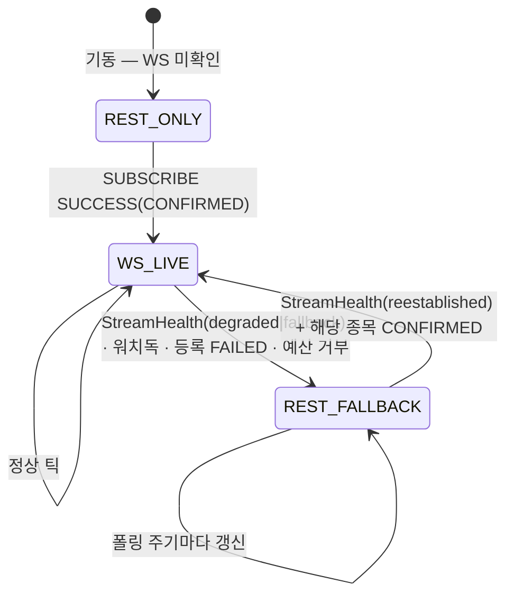
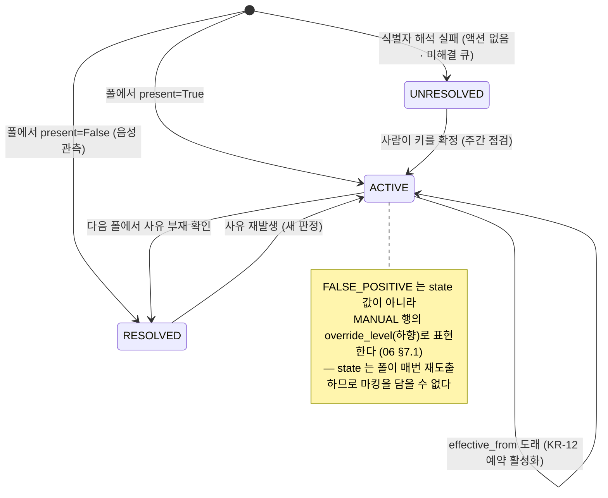

# 11. 실시간·감시 (`realtime/` · `surveillance/`)

> **범위**: `src/omra/realtime/`(`verdict.py`·`guards.py`·`execution_hint.py`·`fallback.py`) 와 `src/omra/surveillance/`(`sources/`·`flags.py`·`gate.py`), 그리고 **WS decoder 이벤트 라우팅의 소비 측 설계**.
> **계획 정본**: 06 전문(§0~§14·부록 A~C), 01 §2.3(단일 소유권)·§2.4(decoder)·§3.5(가드 인터페이스)·§3.6(감시 게이트)·§5.3(채널·구독 예산·불변식 2), 02 §4.1.1(재호가)·§4.3(계획 진입부)·§4.4(주문 품질 게이트)·§4.6(SAFE_MODE)·§7(크립토), 03 §1.4(P9 제외)·§1.6(pre-trade 2단계)·§2.3(SAFE_MODE×SV3)·§2.5(12월 충돌)·§4.3(F6~F9·F13·F14·F22)·§4.6(TE 5항목)·§7.2(알림 등급)·P12~P15, 00 §3.2(S4·S5·E7)·§5 원칙 9·§6.1, 04 §2 M9(진입 게이트)·§5(스파이크), 05 §6·§7.
> **선행 문서**: [02-domain-model.md](02-domain-model.md)(`Order`·`Instrument`·`instrument_key`·`Clock`·예외 계층), [03-data-and-persistence.md](03-data-and-persistence.md)(`surveillance_flags`·`pending_tax_events`·`execution_state` DDL·감사로그 스키마), [05-broker-gateway.md](05-broker-gateway.md)(WS 이벤트 타입·decoder·구독 레지스트리), [06-market-data-and-calendar.md](06-market-data-and-calendar.md)(`QuoteService`·`MasterService`·`FxService`·캘린더), [08-execution.md](08-execution.md)(가드 소비·예산 영속화·pre-trade 호출 지점).
> **이 문서가 소유하는 정의**: 가드·`Verdict`/`GuardOutput`, surveillance gate 소비자 API 6종, SV 등급 판정·해제(브리프 §2.1 소유권 표의 11 행).

---

## 1. 개요 — 설계 대상과 책임

### 1.1 두 패키지, 하나의 원칙

`realtime`과 `surveillance`는 서로를 모르는 별개 패키지지만(단, `realtime → surveillance.gate` 단방향 허용) **같은 헌장** 아래 있다 — 00 §5 원칙 9, **관측 계층은 결정을 만들 수 없다**. 확정된 계획을 **줄이거나 멈추거나 제안**할 수만 있고 수량·방향·목표비중을 **생성**할 수 없다.

| 패키지 | 산출 | 산출의 성격 | 소비자 | 소비 방식 |
|---|---|---|---|---|
| `realtime` | `GuardOutput`(`Verdict` + 범위·방향 + 가격 힌트) | **휘발성 판정** — 상태를 쓰지 않는다 | `execution` | push 없음. `execution`이 슬라이스 직전 pull (08 §12) |
| `surveillance` | `surveillance_flags` 행 + `SurveillanceLevel` | **파생 상태** — 일 1회 전수 폴에서 재도출 | `engine.rebalancer`·`execution`·`protections` | `gate` 6종 API pull (06 §7.2) |

두 패키지의 책임 경계는 **06 §2.3의 소유권 단일화**가 전부 결정한다. 같은 스트림의 같은 프레임이라도 **호가·체결가·NAV는 `realtime`**, **장운영·VI·거래정지 필드는 `surveillance`**가 단독 소유하고, `realtime`에는 `TradabilityGuard`·`ViHandler`가 **존재하지 않는다**(정본: 06 §2.3, 01 §2.3).

### 1.2 하지 않는 것 (설계에서 구조적으로 배제)

| 배제 항목 | 근거 |
|---|---|
| `create`/`expand`/`sell_more` 액션, 목표비중·수량·방향 생성 | 06 §2.1, 00 §6.1. CI 계약 C06a가 `engine.optimizer`·`rebalancer`·`tax` import를 차단 |
| 매도를 유발하는 가드 | 06 §2.2 — "이 표에 매도를 유발하는 소비자는 하나도 없다". 급락·김프 가드도 **매수만** 막는다 |
| `EventBus`(토픽 큐·pub/sub) | 06 §1.4·부록 B, 01 §2.4. decoder 직접 호출 + `Fill`만 큐 |
| 구독 축약 사다리 L0/L1/L2·LRU·스코어링·"예산 관리자" | 06 §1.3·부록 B. 예산 정책은 05 설계서의 `SubscriptionRegistry` |
| 감시 4테이블·`SurveillanceSource` Protocol·상태 전이 4종·오탐률 자동 강등 | 06 부록 B. 단일 테이블(복합키·`state`·`effective_from` 허용) 유지 → §8.2 [DD-11-9] |
| 감시 경로의 LLM 파싱, KIND·업비트 공지 스크래핑 | 00 §6.4·§6.3, 06 §6.1·§12. `surveillance -/-> research` CI 강제 |
| 자동 청산(`ESC_LIQUIDATE` 자동 실행) | 00 §3.2 S5, 06 §8.1 — **A3 승인 전용, 영구** |

### 1.3 실패 시 안전 방향 (전 절 공통)

| 상황 | 방향 | 정본 |
|---|---|---|
| WS 전면 장애 | **degrade only** — REST 폴백. HALT 금지 | 01 §5.3 불변식 1·2, 06 §2.4 |
| 가드 입력 부재(글로벌 BTC·환율 stale, 유효 샘플 미달) | **무판정 = `PROCEED`** — 관측 부재가 자기 유발 정지를 만들지 않는다 | 06 §1.2·§2.2 |
| 호가 나이 초과 + REST 재조회 실패 | **`DEFER`** | 02 부록 A `quote.max_age_ms` |
| 시세 5분 이상 stale | **`ABORT`(종목)** — P5 연동 | 06 §2.2, 03 §1.2 P5 |
| 감시 소스 STALE(유예 내) | 전일 스냅샷 사용 — **아무것도 바꾸지 않는다** | 06 §8.3 |
| 감시 판정 불가(`unknown`) | **`SV2`**(신규매수만 금지, 보유 유지) | 06 §8.3, 03 §1.6 |
| 감시 파싱 실패·식별자 해석 실패 | 액션 없음 + `SV0` 기록 + `UNRESOLVED` 미해결 큐 | 06 §9.1 |
| 감시 이벤트 폭증 | 당일 신규 전부 `SV0` 강등(P15) — 기존 플래그 유지 | 03 §1 P15 |

**두 방향이 다르다는 점이 이 문서의 핵심 비대칭이다.** `realtime`의 무판정은 `PROCEED`(계속 거래)이고 `surveillance`의 무판정은 `SV2`(매수 차단)다. 이유: 가드는 "비싸게 사지 않기"라는 **최적화**이고 감시는 "팔 수 없는 것을 사지 않기"라는 **집행 가능성 요건**이기 때문이다(06 §2.2 stale 규칙, §8.3).

### 1.4 조건부 요소 — 양쪽 경로를 모두 설계한다

| 조건 | 착수 시 | 취소·실패 시 | 설계 위치 |
|---|---|---|---|
| **M9 T1 계층**(04 §2 M9 OR 게이트) | `H0STASP0`/`CNT0`/`NAV0`/`MKO0` 구독 → 가드 입력이 WS 틱 | 가드 입력이 **60초 REST 스냅**, `MoveGuard` `window_sec 300 = 5샘플`, 감시는 일 1회 배치 확정 | §4.5·§4.6·§6·§16 |
| **SP-E2**(`H0STNAV0` 실측) | `PremiumGate` 실시간 NAV 경로(300초 대기·당일 90분) | REST 스냅샷 경로(30분 × 3회)만 | §4.6 |
| **M7 글로벌 BTC 소스** | `KimchiGuard` 정상 판정 | **무판정**(= `PROCEED`) 고정 | §4.7 |
| **SP-A1**(`CTPF1002R` 필드 실측) | 2소스 교차 확인 | **마스터파일 단독** 확정, 교차검증 포기 | §8.3·§14 |
| **SP-C3**(미국 LOC 미지원) | 현행 유지 | US-03(LULD) 카탈로그 재검토 승격 | §16 |

---

## 2. 모듈 구조와 의존 계약

### 2.1 파일 트리

```
src/omra/realtime/                 # 집행 가드 — 축소 방향 전용 (06 §12)
├── __init__.py                    #   공개 API: Verdict · GuardOutput · GuardChain · ExecutionHint · Fallback
├── verdict.py                     #   Verdict / GuardOutput(frozen) / Counterfactual / 합성 규칙  (§3)
├── context.py                     #   GuardContext · GuardBudgets · BasketWeights  — 입력 DTO [DD-11-2]
├── ticks.py                       #   LatestTickStore · MinuteBucketSeries — 최신값 슬롯·60초 버킷 (§4.2)
├── arming.py                      #   ArmingTracker — 3-AND 발동 조건 (§4.3)
├── guards.py                      #   PriceGuard · MoveGuard · PremiumGate · KimchiGuard · CryptoDropGuard (§4)
├── execution_hint.py              #   marketable limit 산정 + 호가 나이 검사 (§5)
└── fallback.py                    #   WS↔REST 등가 전환 (§6)

src/omra/surveillance/             # 운영 큐 — 거래정지·VI·관리종목·상폐의 유일한 소유자
├── __init__.py
├── catalog.py                     #   리스크 ID·등급 매핑 로더(config/surveillance.yaml) (§8.1·§11.1)
├── models.py                      #   FlagObservation · SourceResult · Reason · EscalationProposal (§8.2)
├── errors.py                      #   TradabilityBlocked (DomainError 하위) [DD-11-13]
├── ports.py                       #   TradingDayCursor · PendingTransferQuery · BurstDowngradeQuery
│                                   #   — 금지 패키지(calendar·tax·protections)를 주입으로 대체 [DD-11-18]
├── sources/
│   ├── kis_master.py              #     .mst.zip → KR-01·02·04 전종목 (data.MasterService 소비)
│   ├── kis_stock_info.py          #     CTPF1002R → KR-01·02·03·04 (보유∪후보)
│   ├── kis_ksdinfo.py             #     예탁원 합병/분할/감자 → KR-12 사전 캘린더
│   ├── kis_overseas.py            #     (M6) search_info → US-01·02
│   ├── upbit_market.py            #     (M7) /v1/market/all?isDetails=true → UP-01·UP-05
│   └── kis_ws_market.py           #     (M9 조건부) H0STMKO0 → KR-01P·KR-09
│                                   #     (KR-01P = 06 §5.2의 `KR-01′`. config·DB 값 정본: 04 [DD-04-14])
├── poll.py                        #   폴 진입점 5종·타임아웃 예산·0건 의심 판정 (§8.4·§13.2) [DD-11-19]
├── flags.py                       #   surveillance_flags 재도출·level_of·오버라이드 (§9)
│                                   #   + source_freshness()·health_review() (§8.4.3 — P12·12 healthcheck 입력)
└── gate.py                        #   소비자 API 6종 (§10)
```

### 2.2 import 계약 (유일 원문: 01 §2.2 — CI 계약 파일 구현은 [01-system-architecture.md](01-system-architecture.md) §8)

이 문서가 **추가로 준수해야 할 결과**만 적는다(값이 다르면 01이 이긴다).

| 결과 | 이 문서의 대응 |
|---|---|
| `realtime -/-> persistence`(ro 포함) | 가드는 **어떤 상태도 쓰지 않는다** → 예산·시장 `ABORT`는 인자로 받는다(§3.3), 발동 후보 상태는 프로세스 메모리(§4.3 [DD-11-5]) |
| `realtime -/-> portfolio` | `MoveGuard`의 **NAV 가중 바스켓을 스스로 계산할 수 없다** → `GuardContext.basket`으로 주입 [DD-11-2] |
| `realtime -/-> brokers.*.client` | REST 접근은 `data.quote`(`QuoteService`) 단일 경로 (06-design §6) |
| `realtime -/-> execution`, `execution → realtime` 허용 | 가드는 호출당하기만 한다. 자체 상시 태스크를 만들지 않는다 [DD-11-17] |
| `surveillance -/-> brokers.*.client` | 인증이 필요한 감시 REST(TR)는 **전부 `data` 경유** [DD-11-10] |
| `surveillance -/-> execution · tax · engine.optimizer · engine.rebalancer` | `pending_tax_events` 행까지만 쓰고 주문을 만들지 않는다(§14). `pending_transfers` 존재 조회(§11.3)는 `tax`를 import하지 않고 `PendingTransferQuery` 주입으로 받는다 [DD-11-18] |
| `surveillance -/-> research`, `research -/-> surveillance` | 감시 파서는 전부 결정론적 구조 파서(정규식·고정폭 + Pydantic) |
| `surveillance -/-> protections`, `protections → surveillance.gate` 허용 | P12~P15 입력은 **protections가 pull**한다(§12.3). 역방향(P15 발동 사실 — 09 [DD-09-10])은 `BurstDowngradeQuery` 주입으로 받는다(§13.2) |
| `surveillance -/-> calendar` — 01-design §8.2 계약 **C05a가 `omra.calendar`를 명시 열거**한다 | 거래일 산술을 감시가 직접 하지 않는다 → `TradingDayCursor` 주입(§9.2, [DD-11-18]). 14 [DD-14-2]의 `labs -/-> calendar` 대응과 동일 패턴 |

### 2.3 이 문서가 정의하지 않는 것 (소유권 경계)

| 주제 | 소유 |
|---|---|
| `Order`·`Instrument`·`instrument_key`·`Clock`·예외 기저 | [02-domain-model.md](02-domain-model.md) |
| `surveillance_flags`·`pending_tax_events`·`execution_state` DDL, 감사로그 봉투·`GuardVerdictPayload` | [03-data-and-persistence.md](03-data-and-persistence.md) §3.2.3·§3.3.2·§3.3.4·§7 |
| WS 세션·구독 예산(38/9)·`SubscriptionRegistry`·decoder 프레임 파싱·이벤트 타입 | [05-broker-gateway.md](05-broker-gateway.md) §7 |
| `QuoteService`·`MasterService`·`FxService`·캘린더·세션 상태 | [06-market-data-and-calendar.md](06-market-data-and-calendar.md) |
| 예산 카운터 영속화·pre-trade 체인 호출·재호가 루프·`ABORT` 반영 | [08-execution.md](08-execution.md) §5·§8·§11.2·§12 |
| P1~P15 정의·임계·해제, 5축 상태 결합, 순매수 회계 | `09-safety-protections.md` §"P12~P15"·§"5축 결합" |
| 잡 등록·시각·catch-up·시간 예산 | `12-scheduling-and-operations.md` §"일일 파이프라인" |
| `/riskflag` 명령 카탈로그·알림 라우팅·대시보드 감시 패널 | `13-web-and-telegram.md` §"명령 카탈로그"·§"알림 등급" |
| `collectors/`(조건부 요청·백오프·`robots.txt`·dedup) 프레임워크 | `14-research-and-labs.md` §"collectors" |
| 비대칭 재정규화·`frozen_reserve` 계산식·cash-flow first | `07-portfolio-engine.md` §"재정규화"(정본: 02 §4.2·§4.3) |

---

# Part 1 — `realtime/` (집행 가드)

## 3. `verdict.py` — 액션 공간과 판정 객체

### 3.1 타입 (정본: 06 §2.1, 01 §3.5)

```python
# realtime/verdict.py
from dataclasses import dataclass
from decimal import Decimal
from enum import StrEnum
from typing import Literal, Final
from omra.audit.events import CounterfactualOrder      # 정의 정본: 03-design §7.2

class Verdict(StrEnum):
    PROCEED = "PROCEED"   # 계획대로
    DEFER   = "DEFER"     # 이번 슬라이스 보류 (재평가 후 재개, 연기 예산 소진 시 당일 포기)
    SHRINK  = "SHRINK"    # 이번 슬라이스 수량 축소 — ★ 현 판본에 산출 주체 없음 (06 §2.1)
    ABORT   = "ABORT"     # 집행 중단 — 범위는 verdict가 아니라 scope·sides가 정한다

Scope = Literal["instrument", "venue"]
Side  = Literal["buy", "sell"]
BOTH_SIDES: Final[frozenset[Side]] = frozenset({"buy", "sell"})

@dataclass(frozen=True, slots=True)
class GuardOutput:
    verdict: Verdict
    scope: Scope                          # ABORT(종목) vs ABORT(시장, 당일)
    sides: frozenset[Side]                # 판정이 적용되는 방향. 기본 BOTH_SIDES, 가드는 줄이기만 한다
    limit_price_hint: Decimal | None      # 호가 기반 가격만. marketable limit을 넘을 수 없다
    reason: str                           # "price_outlier|+18.2%|prev_close=12,340" 형태 (파이프 구분)
    source_event_id: str                  # 감사로그 연결고리 (BrokerEvent.source_event_id 또는 FetchResult 지문)
    counterfactual: CounterfactualOrder | None   # Verdict != PROCEED이면 필수 [DD-11-1]
    guard: str = ""                       # 발동 가드 식별자 ("price"|"move"|"premium"|"kimchi"|"crypto_drop")

    def __post_init__(self) -> None:
        # 단조 축소성 — 가드는 방향을 추가할 수 없다 (CI 아키텍처 테스트 guard.oneway와 이중 방어)
        if not self.sides <= BOTH_SIDES:
            raise InvariantViolation("guard.sides_expanded")
        if self.verdict is not Verdict.PROCEED and self.counterfactual is None:
            raise InvariantViolation("guard.counterfactual_missing")

PROCEED_OUTPUT: Final = GuardOutput(Verdict.PROCEED, "instrument", BOTH_SIDES,
                                    None, "", "", None)
```

`create` / `expand` / `sell_more`는 **존재하지 않는다**(06 §2.1). `limit_price_hint`는 호가 기반 가격만 산출하며 수량·방향을 산출하지 않는다.

> **[DD-11-1] `counterfactual`을 문자열이 아니라 구조화 타입으로 고정한다**
> - 결정: `GuardOutput.counterfactual`의 타입을 `CounterfactualOrder`(03-design §7.2: `instrument_key`·`side`·`qty`·`ref_price`·`notional_krw`)로 하고, 사람이 읽는 서술은 `reason`이 담는다. `Verdict != PROCEED`이면 `None` 금지를 생성자에서 강제한다.
> - 근거: 01 §3.5는 `counterfactual: str`로 표기했으나, 같은 문단이 이 필드를 03 §4.6 tracking error 5항목 분해 ③④의 **계산 입력**으로 규정한다. 기회손익을 계산하려면 수량·기준가가 파싱 가능해야 하고, 자유 문자열을 정규식으로 되파싱하는 설계는 R1 오탐의 원인이 된다. 03-design이 이미 `CounterfactualOrder` pydantic 모델을 감사 payload 정본으로 고정했으므로 그것과 1:1로 맞춘다.
> - 계획 문서와의 관계: 01 §3.5의 **필드 존재·필수성**은 그대로 유지하고 타입만 구체화. 03 §4.6의 요구를 충족하는 유일한 형태이므로 충돌이 아니라 여백 채움이다.
> - **조립 입력의 보존**(03-design [DD-03-25] 조율 요청): `CounterfactualOrder`의 5필드는 전부 `GuardContext`에서 온다 — `instrument_key`·`side`·`qty`·`ref_price`는 그대로, `notional_krw`는 `GuardContext.ref_notional_krw`(§3.3)다. `realtime`은 환율·평가액을 조회할 수 없으므로(01 §2.2) **원화 환산은 호출자(execution)가 판정 시점에 채워 넘긴다**. 가드는 판정 시점의 이 5값을 `GuardOutput`에 그대로 실어 반환하므로, 감사 payload 조립에 사후 재조회가 필요 없다.

### 3.2 합성 규칙 — 주문 1건 단위 판정

여러 가드가 동시에 발동할 수 있다. **합성은 주문 단위로 한다**(방향 합집합 같은 모호한 연산을 만들지 않는다).

```python
SEVERITY: Final[dict[Verdict, int]] = {
    Verdict.PROCEED: 0, Verdict.SHRINK: 1, Verdict.DEFER: 2, Verdict.ABORT: 3,
}
GUARD_ORDER: Final = ("price", "move", "premium", "kimchi", "crypto_drop")   # 동점 시 결정론적 우선순위

def combine(order_side: Side, outs: list[GuardOutput]) -> GuardOutput:
    """1. order_side ∈ out.sides 인 출력만 남긴다 (그 주문에 적용되지 않는 판정은 무시).
       2. SEVERITY 최대값을 채택. 동점이면 GUARD_ORDER 순서.
       3. reason은 채택본 + 동점·차순위 가드 식별자를 '+'로 덧붙여 감사 가독성을 남긴다.
       4. 채택본이 PROCEED이고 limit_price_hint를 가진 출력이 있으면 그 힌트를 실어 반환."""
```

`SHRINK`를 `DEFER`보다 **덜** 제한적으로 둔 이유: 축소 집행은 그래도 거래가 일어나고 연기는 일어나지 않기 때문이다. 현 판본에 `SHRINK` 산출 주체가 없으므로(06 §2.1) 이 순서는 향후 확장 시의 규약이며, 수신 시 08은 방어적으로 `DEFER`로 처리한다(08 §12 표).

### 3.3 입력 DTO — 예산과 바스켓은 주입된다

```python
# realtime/context.py
@dataclass(frozen=True, slots=True)
class GuardBudgets:
    """execution이 execution_state에서 복원해 넘긴다 (01 §3.5, 08 §11.2). realtime은 읽기만 한다."""
    defer_count: int                  # 종목별 연기 횟수         (상한 etf.premium_gate.max_defer_count = 3)
    defer_minutes_total: int          # 당일 총 연기 분          (실시간 NAV 경로 max_total_defer_min = 90)
    venue_abort: bool                 # 당일 이 venue의 ABORT 이미 발동
    guard_fail_streak: Mapping[str, int]   # 가드별 연속 실패 (3회 → 비활성, 01 §2.4)

@dataclass(frozen=True, slots=True)
class BasketWeights:
    """MoveGuard 입력 — NAV 가중 보유자산 바스켓. realtime -/-> portfolio 이므로 주입한다."""
    weights: Mapping[str, Decimal]    # instrument_key → NAV 대비 비중 (합 ≤ 1)
    as_of: datetime

@dataclass(frozen=True, slots=True)
class GuardContext:
    instrument_key: str
    venue: str                        # "KRX" | "NASD"|"NYSE"|"AMEX" | "UPBIT"
    side: Side
    qty: Decimal
    ref_price: Decimal                # 판정 시점 기준가 — counterfactual.ref_price
    ref_notional_krw: int             # ref_price × qty 의 KRW 환산 — counterfactual.notional_krw
                                      #   환산 주체는 execution(제출일 07:00 고정 환율 — 09-design [DD-09-12]).
                                      #   realtime은 환율을 조회하지 않는다(01 §2.2)
    prev_close: Decimal | None
    basket: BasketWeights | None      # 국내·미국 집행 창에서만 주입
    nav_snapshot: NavSnapshot | None  # PremiumGate REST 경로 (SP-E2 미통과 시) — 06-design §6.4
    mode: Literal["ws", "rest"]       # 입력 원천. 판정에 영향을 주면 폴백 등가성 위반 (§6.3)
    now: datetime
```

> **[DD-11-2] `MoveGuard`의 바스켓 비중과 `PremiumGate`의 REST NAV를 `GuardContext`로 주입한다**
> - 결정: `realtime`은 포트폴리오 평가와 NAV 스냅샷을 스스로 조회하지 않는다. `execution`(가드 호출자)이 `GuardContext.basket`·`nav_snapshot`을 채워 넘긴다.
> - 근거: 01 §2.2 계약(01-design §8 계약 C06a)이 `realtime -/-> portfolio`를 금지하고, `realtime → data.quote`만 허용해 `("etf_nav", KRX)` 라우트에도 닿을 수 없다. 그런데 06 §2.2는 `MoveGuard`를 "**NAV 가중** 보유자산 바스켓"으로, 02 §4.4는 iNAV 게이트의 REST 경로를 각각 규정한다. 주입이 두 계약을 동시에 만족시키는 유일한 형태다.
> - 계획 문서와의 관계: 충돌 없음 — 계획은 입력의 조달 경로를 규정하지 않았다(여백). `execution → realtime` 단방향 허용(01 §2.2)이 이 주입 방향과 정합한다.

### 3.4 검증 항목 (§3)

| ID | 항목 | 방법 |
|---|---|---|
| V11-01 | `sides ⊄ {"buy","sell"}`인 `GuardOutput` 생성이 `InvariantViolation` | 단위 |
| V11-02 | `Verdict != PROCEED` + `counterfactual is None` → 생성 실패 | 단위 |
| V11-03 | `combine`: 주문 방향에 해당하지 않는 출력은 무시(매수 주문에 `sides={"sell"}` 판정 무영향) | property |
| V11-04 | `combine` 동점 시 `GUARD_ORDER` 결정론성(입력 순서 셔플 불변) | property |
| V11-05 | 아키텍처 테스트 `guard.oneway`: `realtime` 소스에 `qty`·`target_weight` 반환 경로 부재 | 아키텍처(16 수거) |

---

## 4. `guards.py` — 가드 5종

### 4.1 평가 파이프라인

```python
class GuardChain:
    """execution이 소유하는 유일한 진입점 (08 §12 guards_client.consult → 여기로 온다)."""

    def __init__(self, cfg: GuardConfig, ticks: LatestTickStore, arming: ArmingTracker,
                 quotes: QuoteService, gate: SurveillanceGate, clock: Clock,
                 audit: AuditLogger) -> None: ...

    def on_market(self, ev: BrokerEvent) -> None:
        """decoder 직접 호출 진입점 (01 §2.4). 판정하지 않고 슬롯·버킷만 갱신한다 (§4.2).
        예외는 decoder 호출부가 격리한다 (05-design §7.7-4)."""

    async def evaluate(self, ctx: GuardContext, budgets: GuardBudgets) -> GuardOutput:
        """슬라이스 제출 직전 pull. 순수 판정 — 상태를 쓰지 않는다."""
```

`evaluate` 의사코드:

```
1. if budgets.venue_abort:                          # 당일 이 시장은 이미 중단됐다
       return ABORT(venue, BOTH_SIDES, reason="venue_abort|restored")   # 재시작 후에도 유지 (F22)
2. applicable = [g for g in GUARDS if g.applies(ctx)]        # venue·자산군별 적용 필터 (§4.4~§4.8 표)
3. active    = [g for g in applicable
                if budgets.guard_fail_streak.get(g.name, 0) < 3]        # 3회 연속 실패 가드는 비활성 (01 §2.4)
   (제외된 가드는 warning 1회 + critical은 execution이 발행 — 08 §12)
4. outs = []
   for g in active:
       try:
           raw = g.judge(ctx, budgets)                       # 임계 판정만. 아직 발동 아님
                                                             # Guard 프로토콜: judge(ctx, budgets) 단일 시그니처
       except Exception as e:
           audit.emit("guard_error", ...); continue          # 실패는 무판정 — 자기 유발 정지 금지
       if raw.verdict is PROCEED: outs.append(raw); continue
       if await self._armed(g, ctx, raw):                    # §4.3 3-AND
           outs.append(raw)
       # armed 실패 = 아직 발동 조건 미충족 → 판정 없음(PROCEED)
5. out = combine(ctx.side, outs)
6. if out.verdict is not PROCEED:
       audit.emit("guard_verdict", GuardVerdictPayload(...), actor="guard")   # 03-design §7.2
   return out
```

- **알림 등급은 기본 `silent`**(`alerts.guard_verdict_default`, 03 §7.2). 즉시 알림 대상은 03 §7.2 표의 critical ①~⑩과 info의 "당일 집행 `ABORT`(시장 단위)"뿐이며, 이 문서는 목록을 중복 나열하지 않는다(분기 입력이 `scope`라는 규정은 06 §2.1, 중복 나열 금지는 06 §2.4·03 §7.2 주석).
- 일일 브리핑에는 **"가드 개입 N건" 1줄**로만 집계된다(06 §2.4, 13 소유).

### 4.2 이벤트 수집 — 최신값 슬롯과 60초 버킷

```python
# realtime/ticks.py
@dataclass(slots=True)
class TickSlot:
    last: BrokerEvent
    observed_at: datetime            # 수신 시각(로컬 Clock) — 나이 계산의 기준
    healthy_at: datetime             # 마지막 '정상' 틱 시각 (가드 조건 ③의 입력)

class LatestTickStore:
    """시세 계열은 큐 없이 최신값 슬롯 1개 (정본: 01 §9.2-3, 01-design §4.3).
    키는 (instrument_key, kind) — kind ∈ {book, quote, nav}. 슬롯 수 상한 = ws.max_active_symbols(9) × 3."""
    def put(self, ev: BrokerEvent) -> None: ...
    def get(self, key: str, kind: str) -> TickSlot | None: ...
    def age_ms(self, key: str, kind: str, now: datetime) -> int | None: ...

class MinuteBucketSeries:
    """MoveGuard 전용 — 종목별 60초 버킷 가격 시계열. 버킷당 마지막 관측만 보관.
    최대 길이 = ceil(guard.move_guard.window_sec / 60) + 1 = 6."""
    def observe(self, key: str, price: Decimal, at: datetime) -> None: ...
    def window_return(self, key: str, window_sec: int, now: datetime
                      ) -> tuple[Decimal, int] | None:   # (수익률, 유효 샘플 수)
```

> **[DD-11-3] `MoveGuard`의 시계열을 양 경로 공통으로 60초 버킷에 다운샘플링한다**
> - 결정: WS 틱이 초당 여러 건 들어와도 `MinuteBucketSeries`가 60초 버킷의 마지막 관측만 남긴다. REST 60초 스냅과 **같은 표본 격자**를 쓰게 되고, `window_sec: 300`은 두 경로 모두에서 정확히 5샘플이 된다.
> - 근거: 06 §14가 "캘리브레이션은 REST 60초 샘플 기준 정의로 수행한다 — 틱 기준으로 잡은 값을 REST 경로에 그대로 쓰면 안 된다"고 명시했다. 임계를 두 벌 관리하지 않는 유일한 방법은 표본 격자를 통일하는 것이며, 이것이 폴백 등가성(01 §5.3 불변식 2)을 **테스트가 아니라 구조로** 확보한다.
> - 계획 문서와의 관계: 06 §1.2(`window_sec`는 샘플 주기의 정수배 = 5샘플)·§14를 구현으로 옮긴 것. 충돌 없음.

### 4.3 3-AND 발동 조건 (`arming.py`)

**발동 조건(모두 AND — 정본: 06 §2.4, 01 §3.5)**: ① 최소 지속 `guard.min_duration_sec`(30초) ② 가능한 경우 REST 스냅샷 1회 교차 확인 ③ 마지막 정상 틱으로부터 5분 이내(`protections.quote_stale_min`). 예외는 `Fill`과 **거래정지** — 후자는 `surveillance` 소유이므로 `realtime`에는 해당 경로 자체가 없다.

```python
class ArmingTracker:
    """가드별·종목별 '임계 초과가 언제부터 연속인가'를 프로세스 메모리에 유지한다."""
    def observe(self, guard: str, key: str, breached: bool, at: datetime) -> timedelta:
        """breached=False면 후보를 리셋하고 0을 반환. True면 후보 시작 이후 경과를 반환."""

async def _armed(self, g: Guard, ctx: GuardContext, raw: GuardOutput) -> bool:
    # ① 지속시간
    held = self.arming.observe(g.name, ctx.instrument_key, True, ctx.now)
    if held < timedelta(seconds=cfg.guard.min_duration_sec):        # 30
        return False
    # ③ 신선도 — 마지막 '정상' 틱으로부터 5분 이내여야 판정 자격이 있다
    slot = self.ticks.get(ctx.instrument_key, g.tick_kind)
    if slot is None or ctx.now - slot.healthy_at > timedelta(minutes=cfg.protections.quote_stale_min):
        return False            # ※ stale 자체의 처분은 PriceGuard의 별도 분기(§4.4)가 담당한다
    # ② REST 교차 확인 — venue별 max_age_ms가 null이면 '가능한 경우'에 해당하지 않는다
    max_age = cfg.quote.max_age_ms.get(venue_key(ctx.venue))
    if max_age is None:                                             # us — 지연 피드
        return True                                                 # cross_check="unavailable"
    try:
        snap = await self.quotes.get_fresh_quote(ctx.instrument_key, max_age_ms=max_age)
    except (StaleDataError, AllProvidersFailedError):
        return False                                                # 확인 못 했으면 발동하지 않는다
    return g.confirms(ctx, snap.data)                               # 스냅샷으로도 임계를 넘는가
```

- **교차 확인 실패 → 무발동**은 06 §2.4의 AND 문언 그대로다. 근거는 05 §6.3 — 2024-08-05 장중 VIX 65는 유동성 없는 프리마켓 호가로 계산된 아티팩트였고, 단일 관측치에 반응하는 가드는 오염을 그대로 집행한다.
- **두 개의 stale 시계를 혼동하지 않는다.**

| 시계 | 값 | 대상 | 초과 시 |
|---|---|---|---|
| `quote.max_age_ms` | krx 2000 / upbit 2000 / us `null` | **호가 나이**(집행 힌트·교차확인) | REST 재조회 → 실패 시 `DEFER` (02 부록 A) |
| `protections.quote_stale_min` | 5분 | **시세 정상 틱 나이**(P5 연동) | `ABORT`(종목) — §4.4 |

> **06-design §16-15에 대한 답(11 판정)**: "가드 3-AND ③의 5분"과 `protections.quote_stale_min: 5`는 **같은 키**다. 3-AND ③(마지막 정상 틱으로부터 5분 이내여야 판정 자격이 있다)과 P5(시세 5분 stale → 종목 스킵)는 같은 사실을 보므로 임계를 두 벌 두면 "가드는 무장했는데 P5는 안 걸린" 구간이 생긴다(§4.4 말미의 임계·키 공유 규약). `data`는 `Quote.observed_at`만 공급하고 임계를 정의하지 않는다(06-design §6.2) — 임계 이름·값의 정본은 03 부록 A·04 §4.2 `ProtectionsCfg.quote_stale_min`이고, 이 문서와 09가 같은 키를 읽는다.

> **[DD-11-5] 발동 후보 상태(arming)는 영속화하지 않는다**
> - 결정: `ArmingTracker`는 프로세스 메모리 전용이며 재시작 시 리셋된다. 영속 대상은 01 §3.5가 열거한 4계열(연기 횟수·당일 연기 분·시장 `ABORT`·가드 연속 실패)뿐이고 그것들은 `execution`이 소유한다.
> - 근거: `realtime -/-> persistence.repos.*`가 계약이다. 리셋의 실질 영향은 "이미 발동한 판정의 소실"이 아니라 "재무장에 최대 30초 추가"뿐이다 — **이미 발동한 시장 `ABORT`는 `execution_state`에 있으므로 재시작을 넘어 유지된다**(03 §4.3 F22). 반대로 arming을 영속화하려면 realtime이 저장소를 잡아야 하고 그것이 더 큰 계약 위반이다.
> - 계획 문서와의 관계: 01 §3.5가 영속 대상을 명시적으로 열거했고 arming은 그 목록에 없다. 여백을 "명시된 목록 외에는 휘발"로 채운다.

### 4.4 `PriceGuard` — 가격 이상치·시세 stale (P5 연동)

| 항목 | 값 | 정본 |
|---|---|---|
| 입력 | `QuoteTick`(`H0STCNT0`·`HDFSCNT0`·업비트 `ticker`) 또는 REST `Quote` | 06 §2.2 |
| 임계 | 전일 종가 대비 **±15%**(크립토 **±30%**) — `protections.price_outlier_pct` | 03 §1.2 P5, 06 §2.2 |
| stale | 마지막 정상 틱 **5분** 초과 — `protections.quote_stale_min` | 03 §1.2 P5 |
| 산출 | **`ABORT`(종목)** = `scope="instrument", sides={"buy","sell"}` | 06 §2.2 |
| 적용 | 전 venue |

```python
def judge(self, ctx, budgets) -> GuardOutput:
    slot = ticks.get(ctx.instrument_key, "quote")
    if slot is None or ctx.now - slot.healthy_at > STALE_5MIN:
        return abort_instrument("price|stale", ctx)         # 3-AND의 ③을 통과할 수 없으므로 별도 분기
    if ctx.prev_close is None:
        return PROCEED_OUTPUT                                # 전일 종가 부재(신규 상장 등) → 무판정
    move = (slot.last.price - ctx.prev_close) / ctx.prev_close
    limit = cfg.protections.price_outlier_pct / 100 * (2 if is_crypto(ctx.venue) else 1)
    #        ↑ 크립토 30% = 15% × 2 (03 부록 A "price_outlier_pct: 15  # P5 크립토 30")
    return abort_instrument(f"price|{move:+.2%}", ctx) if abs(move) > limit else PROCEED_OUTPUT
```

> **[DD-11-6] `PriceGuard`의 stale 분기는 3-AND를 우회한다**
> - 결정: "마지막 정상 틱 5분 초과"에 의한 `ABORT`(종목)는 `ArmingTracker`(지속 30초·REST 교차 확인)를 통과하지 않고 즉시 산출된다. 가격 임계(±15%/±30%) 분기만 3-AND를 거친다.
> - 근거: 06 §2.4가 3-AND의 목적을 "단일 틱 아티팩트 방어"로 규정했는데(05 §6.3의 2024-08-05 VIX 65 사례), stale은 **관측이 존재하는 상태가 아니라 부재하는 상태**라 아티팩트가 될 수 없다. 게다가 ①은 "임계 초과가 30초 지속"인데 5분 무관측은 이미 그 10배이고, ②는 교차 확인할 신선한 값 자체가 없어 논리적으로 충족 불가능하다. 3-AND를 문자 그대로 적용하면 stale 분기가 **영원히 발동하지 않는 죽은 규칙**이 된다.
> - 계획 문서와의 관계: 06 §2.4가 이미 "예외는 `Fill`과 거래정지 — 결정론적 사실이므로 즉시 반영"이라는 예외 범주를 두었고, 관측 부재도 같은 성격(판정에 추론이 개입하지 않는 사실)이다. 여백 채움이며 충돌 없음.

- P5(종목 스킵)와 이 가드는 **같은 사실을 다른 층에서 본다** — P5는 07:30 계획·pre-trade 8단계에서 종목을 스킵하고(09 소유), `PriceGuard`는 집행 창 안에서 슬라이스를 막는다. 임계·키를 공유해 값이 갈리지 않게 한다.

### 4.5 `MoveGuard` — 시장 급락 (유일한 시장 단위 가드)

| 항목 | 값 | 정본 |
|---|---|---|
| 조건 | NAV 가중 보유자산 바스켓의 `window_sec`(300초) 수익률 ≤ −`nav_weighted_move_pct`(3.0%) **AND** 그 조건이 `min_symbols`(2) 이상 종목에서 동시 관측 | 06 §2.2 |
| 유효 샘플 | `min_samples`(5) 미만이면 **판정 산출 안 함**(무판정 = `PROCEED`) | 06 §1.2·부록 C |
| 산출 | **`ABORT`(시장, 당일)** = `scope="venue", sides={"buy","sell"}` | 06 §2.2 |
| 적용 | KRX·US(바스켓 주입이 있을 때만). 업비트는 `CryptoDropGuard`가 담당 |

```python
def judge(self, ctx, budgets) -> GuardOutput:
    if ctx.basket is None:
        return PROCEED_OUTPUT                                       # 바스켓 미주입 = 판정 자격 없음
    num, den, breached = Decimal(0), Decimal(0), 0
    for key, w in ctx.basket.weights.items():
        if venue_of(key) != ctx.venue: continue
        r = series.window_return(key, cfg.guard.move_guard.window_sec, ctx.now)
        if r is None or r[1] < cfg.guard.move_guard.min_samples:    # 유효 샘플 5 미만 → 이 종목 제외
            continue
        num += w * r[0]; den += w
        if r[0] <= -pct(cfg.guard.move_guard.nav_weighted_move_pct): breached += 1
    if den == 0: return PROCEED_OUTPUT                              # 전 종목 샘플 부족 → 무판정
    basket_ret = num / den                                          # 유효 관측만으로 재정규화
    if basket_ret <= -pct(cfg.guard.move_guard.nav_weighted_move_pct) \
       and breached >= cfg.guard.move_guard.min_symbols:
        return abort_venue(f"move|{basket_ret:+.2%}|n={breached}", ctx)
    return PROCEED_OUTPUT
```

- **`ABORT`(시장, 당일)의 영속화는 `execution`이 한다**(`execution_state`의 시장 범위 카운터 — 값 집합 정본은 [03-data-and-persistence.md](03-data-and-persistence.md) §3.3.4, 갱신 주체는 [08-execution.md](08-execution.md) §11.2). `realtime`은 판정만 반환하며 `counter_kind` 리터럴을 알지 못한다. 시장 범위 리터럴은 **`venue_abort`로 확정**됐다(값 집합 정본: 03 §3.3.4 [DD-03-7] — 종전 `market_abort` 폐기, 08 §12 `VENUE_ABORT`와 일치).
- 이 값들은 **전부 임의값**이며 03 §4.4 가드 A/B 게이트의 필수 구간(2020-02~04 / 2022 / 2024-08)에서 실측 캘리브레이션 대상이다(06 §14). 캘리브레이션 정의는 [DD-11-3]의 60초 격자다.
- **"매수만 막지 않고 양방향인 이유"**: 이 가드는 "그날 나쁜 가격에 거래하지 않는다"이지 포지션 축소가 아니다(00 §2.2-③). 양방향 차단은 매도를 **유발하지 않으며**, 오히려 급락 중 자동 매도를 막는 방향으로 작용한다.

### 4.6 `PremiumGate` — ETF 괴리율·LP 스프레드 (2경로, 조건부)

| 항목 | 값 | 정본 |
|---|---|---|
| 임계(두 경로 공통) | 괴리율 \|·\| > **0.5%**(`etf.premium_gate.threshold_pct`) 또는 LP 스프레드 > **3틱**(`.threshold_ticks`) | 02 §4.4 |
| 산출 | **`DEFER` ↔ `PROCEED`** | 06 §2.2 |
| **REST 스냅샷 경로**(기본) | 30분 후 재조회(`.rest_defer_minutes`), 연기 **3회**(`.max_defer_count`), 초과 시 당일 포기·익일 재판정 | 02 §4.4 |
| **실시간 NAV 경로**(SP-E2 통과 시) | 해제 = 게이트 해소 **AND** 최소 300초(`.min_wait_sec`), 3회 + **당일 총 90분**(`.max_total_defer_min`) | 02 §4.4 |

```python
def premium_verdict(nav: Decimal, mid: Decimal, spread_ticks: int, cfg) -> tuple[bool, str]:
    """★ 두 경로가 공유하는 단일 순수 함수 — 폴백 등가성의 구조적 보증 [DD-11-4]."""
    disc = (mid - nav) / nav
    if abs(disc) > pct(cfg.threshold_pct):   return True, f"premium|{disc:+.3%}"
    if spread_ticks > cfg.threshold_ticks:   return True, f"spread|{spread_ticks}t"
    return False, ""

def judge(self, ctx, budgets) -> GuardOutput:
    nav = nav_of(ticks.get(ctx.instrument_key, "nav")) or nav_of(ctx.nav_snapshot)
    #     ↑ WS `NavTick` 슬롯 우선, 없으면 주입된 REST 스냅샷. 두 원천의 NAV 추출만 담당(판정 없음)
    if nav is None:
        return PROCEED_OUTPUT          # NAV 미확보 → 무판정 (06-design §6.4 '판정 불가 = 게이트 미적용')
    book = ticks.get(ctx.instrument_key, "book")
    blocked, why = premium_verdict(nav, mid_of(book), spread_ticks(book, ctx), cfg.etf.premium_gate)
    if not blocked: return PROCEED_OUTPUT
    if budgets.defer_count >= cfg.etf.premium_gate.max_defer_count:
        return abort_instrument(f"{why}|defer_exhausted", ctx)     # 당일 포기 — 익일 07:30이 흡수
    return defer_instrument(why, ctx)
```

- **`DEFER` 중인 종목은 T1 구독을 유지**하고 `max_total_defer_min` 소진 시 해제한다(06 §1.3-2). 구독 유지 요청은 `execution`이 `SubscriptionRegistry`에 넘기며(`SymbolPriority.defer_held=True` — 05-design §7.6), `realtime`은 구독을 조작하지 않는다.
- **[확인 필요]** REST 경로의 NAV 조회 TR ID·응답 필드는 06-design §6.4에서 이미 `[확인 필요]`로 등재되어 있다. 확정 전까지 `ctx.nav_snapshot`은 `None`으로 주입되고 게이트는 **미적용 + warning**이다 — 잘못된 분모로 괴리율을 만드는 것보다 판정하지 않는 것이 낫다.

> **[DD-11-4] iNAV 게이트의 판정 논리를 `realtime`의 단일 순수 함수로 두고 REST 경로도 그것을 호출한다**
> - 결정: `premium_verdict()`가 유일한 판정 구현이다. 08의 `execution/quality.py`(주문 품질 게이트, 08 §11)는 REST 스냅샷을 `GuardContext.nav_snapshot`으로 실어 `GuardChain.evaluate()`를 호출할 뿐 자체 임계 비교를 갖지 않는다.
> - 근거: 02 §4.4가 "두 경로의 판정 결과는 동일해야 하며 차이는 지연뿐 — 실시간 경로가 더 관대하거나 더 엄격하면 그것은 버그"라고 규정했다. 구현이 두 벌이면 이 요건은 테스트로만 지켜지고, 03 §4.3 F14가 회귀를 사후 검출하는 데 그친다. 08 §11이 `quality.py`에 "iNAV·스프레드 게이트(2경로)"를 배치한 것과 충돌하지 않는다 — `quality.py`는 **경로 선택과 예산 회계**를 소유하고 판정 산술만 위임한다(`execution → realtime` 허용).
> - 계획 문서와의 관계: 02 §4.4·06 §2.2 모두 판정 주체를 `PremiumGate`로 명시하므로 정합. 충돌 없음.

### 4.7 `KimchiGuard` — 김치프리미엄 (입력 3개)

```
프리미엄 = 업비트KRW ÷ (글로벌USD × USDKRW) − 1                      (정본: 06 §2.2)
> 5%  → 알림 (판정은 PROCEED)  = crypto.kimchi_alert (0.05)
> 8%  → ABORT(매수만)          = crypto.kimchi_halt  (0.08, 02 부록 A)
★ 두 키 모두 **소수 비율**이다 — 키 이름·타입 정본은 04-configuration-and-secrets.md §4.2 `CryptoCfg`
  (`kimchi_halt: Dec("0.08")` / `kimchi_alert: Dec("0.05")`). `_pct` 접미가 없는 `crypto.*` 키에는
  `pct()`(÷100)를 적용하지 않는다 — 04 §4.2 단위 규약.
```

| 입력 | 원천 | stale 규칙 |
|---|---|---|
| 업비트 KRW-BTC | 업비트 `ticker`(T0, 상시) | 5분 초과 시 `PriceGuard` stale 경로가 먼저 잡는다 |
| 글로벌 BTC USD | **M7 스파이크로 확정**(04 §5.2). REST면 60초 주기 | `max_age` 초과 → **무판정** |
| USDKRW | `FxService.latest(max_age_hours=72)`(06-design §9.1) | `None` 반환(72h 초과) → **무판정** |

```python
def judge(self, ctx, budgets) -> GuardOutput:
    fx = self.fx_latest()                          # 주입된 FxService.latest() 결과 (06 §2.2 fx.max_age_hours=72)
    gbtc = self.global_btc_latest()                # M7 확정 전에는 항상 None
    if fx is None or gbtc is None:
        self.stale_since = self.stale_since or ctx.now
        if ctx.now - self.stale_since > timedelta(hours=24): warn_once("kimchi_stale_24h")
        return PROCEED_OUTPUT                      # ★ 무판정 = PROCEED. 매수 차단 아님 (06 §2.2 정본)
    self.stale_since = None
    slot = ticks.get("UPBIT:KRW-BTC", "quote")     # 업비트 ticker (T0, 상시)
    if slot is None:
        return PROCEED_OUTPUT                      # 분자 부재 → 무판정
    prem = slot.last.price / (gbtc * fx.rate) - 1
    # ★ 소수 비율 직접 비교 — pct() 래퍼를 쓰지 않는다 (04 §4.2 단위 규약: `_pct` 접미가 없는
    #   crypto.* 키는 소수 비율). pct()를 씌우면 0.08 → 0.0008 이 되어 김프 0.08%에서 오차단된다.
    if prem > cfg.crypto.kimchi_halt:              # Dec("0.08")
        return abort_venue_buy(f"kimchi|{prem:+.2%}", ctx)
    if prem > cfg.crypto.kimchi_alert:             # Dec("0.05") — 알림만 [DD-11-7]
        notify_once_info(f"kimchi|{prem:+.2%}")
    return PROCEED_OUTPUT
```

**무판정이 `PROCEED`인 근거(06 §2.2 정본 인용)**: 낡은 환율로 계산된 김프가 8% 임계를 오탐하면 그것 자체가 잘못된 차단이고, 김프 가드의 목적은 "비싸게 사지 않기"라는 최적화이지 안전 요건이 아니다. 환율은 주말·야간에 갱신되지 않으므로 `fx.max_age_hours: 72`(연휴 대응) 안에서는 마지막 영업일 종가 환율을 정상 값으로 취급한다 — 이 예외가 없으면 크립토 가드가 주말마다 무판정이 된다.

### 4.8 `CryptoDropGuard` — BTC 급락

| 항목 | 값 | 정본 |
|---|---|---|
| 조건 | BTC **24h −15% 초과** | 02 §7, 06 §2.2 |
| 산출 | **`ABORT`(매수만)** = `scope="venue"(UPBIT), sides={"buy"}` | 06 §2.2 |
| 확장 금지 | **매도 트리거로 확장하지 않는다**(낙폭 추격 금지가 목적) | 02 §7 |

> **[DD-11-8] 24h 낙폭의 1차 입력을 업비트 `ticker`가 제공하는 전일 대비 변화율로 고정한다**
> - 결정: `CryptoDropGuard`는 자체 24시간 롤링 윈도를 유지하지 않고, 업비트 `ticker` 페이로드의 전일 종가 대비 변화율 필드를 쓴다. 필드가 없거나 파싱 실패면 **무판정**(`PROCEED`).
> - 근거: `realtime`은 상태를 영속화할 수 없으므로(01 §2.2) 24시간 롤링 윈도는 재시작 한 번에 소실되고, 그 사이 가드는 조용히 무력해진다 — 이는 관측 부재를 무판정으로 다루는 §1.3 규약보다 나쁘다(무력화가 감지되지 않는다). 업비트 일 경계(09:00 KST)는 크립토 판정·집행 시각(02 §7, 09:00 일 1회)과 정합하므로 두 정의의 차이가 판정 시점에서 최소다.
> - 계획 문서와의 관계: 02 §7·06 §2.2의 "24h −15%"라는 **임계값**은 그대로다. 기준 창의 조작적 정의만 채운다. **[확인 필요]** 해당 필드명·기준시각 — 확인 방법: SP-A8/A9(M7 업비트 실측, 04 §5.2)에서 `ticker` 페이로드 카세트로 고정.

### 4.9 오류 경로

| 상황 | 처분 | 정본 |
|---|---|---|
| 가드 `judge()` 예외 | warning + 감사로그, 그 가드만 무판정. 같은 가드 **3회 연속** → 비활성 + critical | 01 §2.4, 06 §1.4 |
| `on_market` 핸들러 예외 | decoder 호출부에서 격리(같은 규칙) | 05-design §7.7-4 |
| `QuoteService` 전 provider 실패 | 교차 확인 불가 → 무발동(§4.3). 별도 HALT 없음 | 06-design §4.3 표 |
| `Verdict != PROCEED` 감사 기록 실패 | `AuditWriteError` 전파 → 호출자(execution)가 fail-safe 처리 | 03-design §7.4 |

가드 연속 실패 카운터는 `execution_state.counter_kind='guard_fail_streak:<guard>'`에 `execution`이 영속화한다(08 §11.2). `realtime`은 `GuardBudgets.guard_fail_streak`로 **읽기만** 한다.

### 4.10 검증 항목 (§4)

| ID | 항목 | 방법 |
|---|---|---|
| V11-06 | 3-AND: 단일 틱(29초)으로 어떤 가드도 발동하지 않음 | 단위 |
| V11-07 | 교차 확인 실패(`StaleDataError`) 시 무발동 — `PROCEED` | 단위 |
| V11-08 | `us` venue에서 `max_age_ms=null` → 교차 확인 면제, `cross_check=unavailable` 표기 | 단위 |
| V11-09 | `PriceGuard` stale 5분 → `ABORT`(종목), 3-AND 우회 | 단위 |
| V11-10 | `MoveGuard` 유효 샘플 4개 → 무판정 / 5개 + 2종목 → `ABORT`(venue) 경계 | property |
| V11-11 | `MoveGuard` 60초 버킷: 초당 100틱 주입과 60초 1스냅 주입의 판정 동일 | property(폴백 등가성) |
| V11-12 | `PremiumGate` 두 경로가 동일 입력에서 동일 `Verdict` | 통합(F14 — 16 수거) |
| V11-13 | `KimchiGuard` fx 73h stale → 무판정, 24h 지속 시 warning 1회 | 단위 |
| V11-14 | `CryptoDropGuard` −15.1% → `ABORT` `sides={"buy"}`, 매도 주문 계속 통과 | 단위 |
| V11-15 | 가드 3회 연속 예외 → 비활성 + 나머지 가드로 집행 계속 | 장애 주입 |
| V11-16 | **매도를 유발하는 산출이 존재하지 않음** — 전 가드 출력의 `sides`가 매도 주문을 *생성*하지 않음 | 아키텍처/property |

---

## 5. `execution_hint.py` — marketable limit·호가 나이

### 5.1 API

```python
@dataclass(frozen=True, slots=True)
class HintResult:
    limit_price: Decimal | None
    book_age_ms: int | None
    status: Literal["ok", "stale", "unavailable"]
    source_event_id: str

class ExecutionHint:
    def book_top(self, key: str) -> BookTop | None:
        """08 §8.2 재호가 3분기 판정이 호출한다. 슬롯 원본 반환 — 판정 없음."""

    async def hint(self, ctx: GuardContext) -> HintResult:
        """marketable limit 산정 + 호가 나이 검사. 수량·방향은 산출하지 않는다 (06 §2.1)."""
```

### 5.2 산정 의사코드 (venue별)

```
1. venue == US 이고 경로가 LOC(기본):        return unavailable   # 개장 전 제출 — 실시간 호가 무의미 (02 §4.1)
   venue == US 이고 경로가 장중 지정가(대안): return unavailable   # 지연 피드로 marketable limit 산정 금지 (02 §4.1)
2. slot = ticks.get(key, "book")
   if slot is None:                          return unavailable
3. age = now - slot.observed_at
   max_age = quote.max_age_ms[venue]         # krx 2000 / upbit 2000 / us null
   if max_age is not None and age > max_age:
       try:  snap = await quotes.get_fresh_quote(key, max_age_ms=max_age)   # REST 재조회 1회
       except (StaleDataError, AllProvidersFailedError):
             return stale                    # → 호출자(execution)가 DEFER (02 부록 A)
       book = book_from(snap)
   else:
       book = slot.last
4. raw   = book.ask if side == buy else book.bid          # marketable limit (02 §4.1.1)
5. price = tick.normalize(raw, instrument.tick_rule)      # core.tick 호출 — 규칙 정본 02-design §6
6. price = clamp_marketable(price, side, book)            # 힌트는 marketable limit을 넘을 수 없다 (01 §3.5)
   return ok(price, age)
```

- 4단계가 **가격을 생성하는 유일한 지점**이며 그 값은 언제나 **관측된 반대편 최우선 호가**다. 스프레드 밖으로 나가는 값·시장가 폴백은 존재하지 않는다(02 §4.1.1 "시장가 폴백은 없다").
- 재호가 시 "1틱씩 공격적으로"의 스텝 계산과 3회 상한은 `execution`이 소유한다(08 §8). `ExecutionHint`는 그 목적지인 marketable limit만 준다.
- 업비트도 동일 경로다 — `orderbook`은 집행 중에만 구독되므로(05-design §8.4) 창 밖에서는 `unavailable`이 정상이다.

### 5.3 검증 항목 (§5)

| ID | 항목 | 방법 |
|---|---|---|
| V11-17 | 매수 힌트 = ask, 매도 힌트 = bid, 어떤 입력에서도 marketable limit 초과 없음 | property |
| V11-18 | 호가 나이 2001ms → REST 재조회 발생, 실패 시 `stale`(호출자 DEFER) | 단위 |
| V11-19 | `us` venue는 LOC·장중 두 경로 모두 `unavailable` | 단위 |
| V11-20 | 틱 정규화가 `core.tick` 규칙(`krx_etf_5`·`upbit`)과 일치 | 단위 |

---

## 6. `fallback.py` — WS↔REST 등가 전환

### 6.1 소스 모드 상태머신



```python
class SourceMode(StrEnum):
    REST_ONLY = "rest_only"; WS_LIVE = "ws_live"; REST_FALLBACK = "rest_fallback"

class Fallback:
    def on_stream_health(self, ev: StreamHealth) -> None:
        """05-design §7.5·§8.4가 방출. state ∈ {connected, degraded, fallback, reestablished}."""
    def on_register_outcome(self, outcome: RegisterOutcome) -> None:
        """구독 예산 거부(05-design §7.6) — rejected 종목을 REST_FALLBACK으로 전환 + warning."""
    def mode_of(self, key: str) -> SourceMode: ...
    async def refresh(self, keys: Sequence[str]) -> None:
        """REST_FALLBACK 종목의 시세를 QuoteService로 끌어와 LatestTickStore·MinuteBucketSeries에
        WS와 동일한 형태로 주입한다. 호출자는 execution(슬라이스 경계)과 스케줄러 잡이다."""
    def poll_interval_sec(self) -> int:
        """realtime.rest_fallback_poll_sec(30) — 동적 조정 활성 시 10 (06 §3.2)."""
```

**05와의 계약(05-design §7.5·§7.6 조율 요청 수용)**: `SubscriptionRegistry`·`WsSession`은 **사실만 반환·방출**하고 전환 판단을 하지 않는다. 판단은 전부 이 문서가 한다.

| 05가 주는 사실 | 11의 처분 | 로그 |
|---|---|---|
| `RegisterOutcome.rejected`(예산 초과 — 05-design §7.6) | 해당 종목만 `REST_FALLBACK` 전환. 다른 종목·세션은 불변 | warning 1회(종목 목록 포함) |
| `RegisterOutcome`의 `fallback="rest"`·`warn=True` | 위와 동일 경로 — 두 필드는 **05의 권고이지 실행이 아니다** | 〃 |
| `on_subscribe_ack(ok=False)` → 구독 `FAILED` | 해당 종목 `REST_FALLBACK` | warning |
| `StreamHealth(state="degraded"\|"fallback")` | 그 소켓이 덮는 **전 종목** `REST_FALLBACK` | warning. **HALT 금지**(01 §5.3 불변식 1·2) |
| `StreamHealth(state="reestablished")` | 종목별 `CONFIRMED` 재확인 후에만 `WS_LIVE` 복귀 — 이벤트만으로 복귀하지 않는다 | info |
| 10회 연속 재연결 실패(05-design §7.5) | 당일 WS 영구 폴백 — `mode_of()`가 전 종목 `REST_FALLBACK` 고정 | warning |

전환은 **모드 변경일 뿐 판정 변경이 아니다** — `REST_FALLBACK`에서도 같은 슬롯·같은 60초 격자·같은 판정 함수를 쓴다(§6.3).

> **[DD-11-17] `fallback`은 자체 상시 태스크를 만들지 않는다 — pull 기반 `refresh()`**
> - 결정: REST 폴백 폴링은 ① 집행 창 안에서는 `execution`이 슬라이스 경계·재호가 타이머에서 `refresh()`를 호출하고 ② 창 밖에서는 스케줄러의 60초 스냅 잡(01 §5.4 멀티시세 스냅)이 같은 함수를 호출하는 **pull 구조**다.
> - 근거: 01-design §4.1이 상시 태스크를 9종으로 하드 고정하고 "이 표에 없는 상시 태스크 추가는 아키텍처 변경"이라 못 박았다. 폴백 폴러를 태스크로 만들면 그 계약을 깨고, 동시에 `realtime`이 자기 수명을 갖는 액터가 되어 "호출당하기만 하는 판정기"라는 성격이 흐려진다.
> - 계획 문서와의 관계: 06 부록 C의 `realtime.rest_fallback_poll_sec: 30`은 **주기 값**을 정할 뿐 실행 주체를 정하지 않았다(여백). 01 §5.4의 60초 스냅이 이미 존재하므로 새 폴러를 만들지 않는 편이 예산표와도 정합한다.

### 6.2 동적 조정 (06 §3.2)

```
trigger: 5분 실현변동성 > 20일 평균의 2.0배  OR  ETF 괴리율 |·| > 0.3%
      OR LP 스프레드 > 2틱  OR  VI 발동 수신(gate.reasons(key)에 KR-09 ACTIVE 존재)
action : 해당 시장 QUOTE 버킷 2 → 4 rps / 비집행 스냅 60s → 10s / REST 폴백 30s → 10s
release: 조건 해제 후 5분 유지 시 원복
불변식 : ORDER 버킷 상한, P2(일일 주문 건수), P3(일일 주문 금액), P11(회전율 예산)은 불변
```

- `realtime`은 **관측 해상도만** 올린다. rps 조정 요청은 `RateLimiter`(05 소유)에 파라미터로 전달되고, 불변식은 CI 아키텍처 테스트로 강제한다(06 §3.2). "변동성이 높으니 예산을 늘린다"가 뒷문으로 마켓타이밍을 들여오는 것을 막는 것이 이 제약의 목적이다.
- **VI 수신을 `realtime`이 직접 해석하지 않는다** — `surveillance.gate.reasons()`로 물어본다(06 §2.3 소유권).

### 6.3 폴백 등가성 — 구조적 보증 3층

| 층 | 보증 |
|---|---|
| ① 정규화 | WS `QuoteTick`/`BookTop`(05-design §3.5)과 REST `Quote`(06-design §6.1)가 **같은 슬롯 타입**에 적재된다 — 가드는 원천을 구분할 수 없다 |
| ② 표본 격자 | `MoveGuard`는 양 경로 모두 60초 버킷 [DD-11-3] |
| ③ 판정 함수 | `PremiumGate`의 `premium_verdict()`가 두 경로 공용 [DD-11-4] |

`GuardContext.mode`는 **감사로그용 표식일 뿐 판정에 들어가지 않는다.** `mode`가 판정 분기에 등장하면 그 자체가 등가성 위반이며, 아키텍처 테스트로 `guards.py` 내 `ctx.mode` 참조 0건을 단정한다(V11-22).

WS 전면 장애는 HALT를 유발하지 않고 degrade만 한다(01 §5.3 불변식 2, 06 §2.4). 10회 연속 재연결 실패 시 당일 WS 영구 폴백 모드로 가고 warning에 그친다(05-design §7.5).

### 6.4 검증 항목 (§6)

| ID | 항목 | 방법 |
|---|---|---|
| V11-21 | **폴백 등가성** — 동일 카세트를 (a) WS 주입 (b) REST 폴링으로 재생 → `Verdict` 시퀀스 일치 | 통합(03 §4.3 F14 — 16 수거) |
| V11-22 | `guards.py`에 `ctx.mode` 분기 0건 | 아키텍처 |
| V11-23 | 예산 거부(`RegisterOutcome.rejected`) 종목이 자동으로 `REST_FALLBACK` + warning | 단위 |
| V11-24 | WS 전면 차단 상태에서 집행이 계속되고 HALT 신호가 발생하지 않음 | 장애 주입(F13 계열) |
| V11-25 | 동적 조정 중에도 ORDER 버킷·P2·P3·P11 값 불변 | 아키텍처 |

---

## 7. WS decoder 이벤트 라우팅 — 소비 설계

### 7.1 결선 (조립 루트가 바인딩 — 05-design [DD-05-1], 01-design §3.2)

```python
# runtime/bot.py (01 소유) 의 phase C에서 1회 결선
decoder.bind_market_status(surveillance.ingest_ws)                 # MarketStatus → 감시 단독
decoder.bind_market("book",  realtime.guards.on_market)            # BookTop
decoder.bind_market("quote", realtime.guards.on_market)            # QuoteTick
decoder.bind_market("nav",   realtime.guards.on_market)            # NavTick
upbit_decoder.bind_market("quote", realtime.guards.on_market)      # 업비트 ticker (T0, 상시)
upbit_decoder.bind_market("book",  realtime.guards.on_market)      # 업비트 orderbook (집행 중)
```

### 7.2 라우팅 표 (정본: 06 §2.2·§2.3, 01 §2.4)

| 원천 TR·채널 | 이벤트 | 소비자 | 이 문서의 처리 |
|---|---|---|---|
| `H0STCNI0`·`H0GSCNI0`·`myOrder` | `ExecutionEvent` | `execution` OrderTracker | **큐 경유** — 이 문서 범위 밖(08 §9). 가드 없음 |
| `myAsset` | `BalanceSnapshot` | 잔고 캐시 | 정합성 — `Verdict` 없음(정본은 REST 대사) |
| `H0STASP0`·`HDFSASP0`·업비트 `orderbook` | `BookTop` | `execution_hint` | 슬롯 `kind="book"` 적재 (§4.2·§5) |
| `H0STCNT0`·`HDFSCNT0`·업비트 `ticker` | `QuoteTick` | `PriceGuard`·`MoveGuard`·`KimchiGuard`·`CryptoDropGuard` | 슬롯 `kind="quote"` + 60초 버킷 |
| `H0STNAV0` | `NavTick` | `PremiumGate` | 슬롯 `kind="nav"` (T1·SP-E2 조건부) |
| `H0STMKO0` | `MarketStatus` | **`surveillance` 단독** | `ingest_ws()` (§8.3.6) — `realtime`은 소비 금지(CI 계약) |
| WS 세션 | `StreamHealth` | `realtime.fallback` | 모드 전환 (§6.1) |

**`H0STCNT0` 틱에 실려 오는 `TRHT_YN`의 해석 권한도 `surveillance`에 있다**(06 §2.3). decoder는 가드 핸들러에 가격 필드만 담아 전달한다(05-design §7.7-3).

**REST `Quote.session_flag`의 해석 권한도 같은 규율로 `surveillance`에 있다**(06 §2.3 — 06-design §3.2가 "data는 raw 보존만 한다"고 확정). 장운영 구분 코드의 원문은 `Quote.session_flag`에 그대로 실려 오고, 그 값을 "정규장/시간외/정지"로 해석해 등급을 만드는 것은 이 문서의 소스 계층뿐이다. `realtime`의 가드는 이 필드를 읽지 않는다 — 읽으면 §1.1의 소유권 단일화가 깨진다. **[확인 필요]** 코드 값 체계(예: `H0STCNT0`의 장운영 필드 값 목록)는 06-design §3.2와 동일한 미확인 항목이며 M1 카세트로 고정한다. 확정 전까지 해석하지 않고 raw만 `FlagObservation.raw_value`에 보존한다(해석 실패는 §1.3대로 액션 없음).

### 7.3 예외 격리와 순서 보장

- 핸들러 예외는 **호출부(decoder)**가 격리한다: warning + 감사로그, 3회 연속 시 해당 가드 비활성 + critical(01 §2.4). `realtime`은 예외를 삼키지 않고 그대로 던진다 — 격리 지점을 두 곳에 두지 않는다.
- `on_market`은 **동기·비차단**이어야 한다(슬롯 갱신 + 버킷 append만). await·I/O·최적화·LLM 호출 금지(01 §9.2). REST 교차 확인은 `evaluate()` 안에서만 일어난다.
- 시세는 순서가 뒤바뀌어도 무해하다(최신값 슬롯은 `observed_at` 기준 단조 갱신, 과거 틱은 무시). `Fill`만 큐이며 drop 금지다(01 §2.4).

---

# Part 2 — `surveillance/` (시장 감시)

## 8. 리스크 카탈로그와 소스

### 8.1 카탈로그 (정본: 06 §5.1 — 7 ID)

| ID | 리스크 | 소스 필드 | 기본 등급 | 부가 |
|---|---|---|---|---|
| **KR-01** | 매매거래정지 | `tr_stop_yn`(CTPF1002R) → 마스터 `거래정지` | **`SV3`** | — |
| **KR-02** | 관리종목 지정 | `admn_item_yn` → 마스터 `관리종목` | **`SV2`** | `ESC_REPLACE` 제안 |
| **KR-03** | ETF/ETN 투자유의종목 | `etf_etn_ivst_heed_item_yn` | **`SV2`** | 진입 info 알림 |
| **KR-04** | 상장폐지일자 확정 | `lstg_abol_dt` → 마스터 | **`SV2`** | `deadline_at` 등록 + `ESC_REPLACE` 제안 + **`pending_tax_events`**(§14) |
| **KR-12** | CA 매매거래정지 예정(합병·분할·액면변경·감자) | `ksdinfo_*`의 `td_stop_dt` | **`SV3` 사전 예약** | `effective_from = td_stop_dt`, 진입 info |
| **US-01** | 미국 거래정지 (M6) | `ovrs_stck_tr_stop_dvsn_cd`·`ovrs_stck_stop_rson_cd` | **`SV3`** | — |
| **US-02** | 미국 상장폐지 확정 (M6) | `lstg_abol_item_yn`·`lstg_abol_dt`·`lstg_yn` | **`SV2`** | `ESC_REPLACE` 제안 |

조건부 2행(**M9 착수 시에만** — 06 §5.2) 및 크립토(06 §10·부록 A):

| ID | 리스크 | 소스 | 등급 | M9 미착수 시 |
|---|---|---|---|---|
| KR-09 | VI 발동/해제 | `H0STMKO0`의 `VI_CLS_CODE` | `SV0` + **해당 종목 주문 보류** + P9 카운트 제외 | 주문 거부 사유코드 기반 사후 추정(03 §1.4) |
| **KR-01P** | 거래정지 실시간 승격 (문서상 명칭 `KR-01′` — 06 §5.2) | `H0STMKO0`의 `TRHT_YN`·`TR_SUSP_REAS_CNTT` | KR-01과 **동일 등급 `SV3`**(지연만 일 1회 → 초) | 일 1회 배치 + 주문 직전 `assert_tradable` |
| UP-01 | 업비트 유의종목 (M7) | `market_warning == 'CAUTION'` | **`SV2`** + 진입 알림 + 크립토 변동성 스케일 갱신 동결 | — |
| UP-05 | 입출금 중단 (M7) | `market_event.*` | **`SV1`** | 출금 권한 미사용이라 실질 무관 |

> **`KR-01P` 토큰 규율**: 06 §5.2가 프라임 기호로 표기한 `KR-01′`은 **문서상의 명칭**이고, `config`·DB 값(= `surveillance_flags.risk_type`, `surveillance.yaml`의 `map[].risk_type`)은 ASCII 토큰 **`KR-01P`**로 고정한다 — **정본: 04-configuration-and-secrets.md [DD-04-14]**. `risk_type`은 `surveillance_flags` 복합 PK의 일부이자 exact-match 판정 키(§13.1)이므로 U+2032 프라임을 값으로 쓰면 "보기에 같은데 매칭되지 않는 행"이 생긴다. 이 문서의 코드·config 예시는 전부 `KR-01P`를 쓴다.

**T1이 없어도 감시는 동일한 결론에 도달한다 — 반응 속도만 다르고 정확성은 같다**(06 §5.2). WS는 가속기이고 REST·마스터파일이 진실원이다.

**base rate ≈ 연 0~1회**(06 §5.3). 이 사실이 설계 크기를 결정한다 — 오탐 방어를 미탐 방어보다 두껍게 하고, 스크래핑 소스를 붙이지 않으며, 인프라를 결론에 비례시킨다.

### 8.2 소스 인터페이스 — Protocol을 만들지 않는다

```python
# surveillance/models.py
@dataclass(frozen=True, slots=True)
class FlagObservation:
    instrument_key: str          # "KRX:278530" | "UNRESOLVED:{payload_hash}" (§13.1)
    risk_type: str               # 'KR-01' | 'KR-02' | 'KR-03' | 'KR-04' | 'KR-12' | 'US-01' | 'US-02'
                                 #   | 'KR-09' | 'KR-01P' | 'UP-01' | 'UP-05' | 'MANUAL'
                                 #   ★ 값 집합 정본: 04 §5.7 `surveillance.yaml` map[].risk_type
                                 #     ('KR-01P' = 06 §5.2 `KR-01′` — 04 [DD-04-14])
    source: str                  # 'kis_master' | 'kis_stock_info' | … | 'operator'
    present: bool                # False = 음성 관측(사유 부재 확인) → level 0 / state=RESOLVED
    raw_value: str | None        # 근거 원문 발췌 (감사로그·대시보드 표시)
    observed_at: datetime        # UTC
    effective_from: datetime | None = None   # KR-12 사전 예약(td_stop_dt). None → observed_at
    deadline_at: datetime | None = None      # 기한부 이벤트 → P14 입력
    unresolved_payload: str | None = None    # 식별자 해석 실패 시 원문 (UNRESOLVED 행)

@dataclass(frozen=True, slots=True)
class SourceResult:
    source: str
    ok: bool                     # 요청·파싱 모두 성공
    requested_keys: int
    parsed_count: int            # 파싱 산출 레코드 수 — '0건 의심' 판정 입력 (§13.2)
    observations: list[FlagObservation]
    failures: list[str]          # 종목별·파일별 실패 사유
    observed_at: datetime
```

> **[DD-11-9] 소스는 `Protocol`/레지스트리가 아니라 모듈 함수로 둔다**
> - 결정: 각 소스는 `async def collect(ctx: SourceContext, keys: Sequence[str]) -> SourceResult` 시그니처의 **모듈 수준 함수** 하나이고, `poll.py`가 config `surveillance.sources.<name>.enabled`를 보고 호출 목록을 만든다. 추상 기반 클래스·플러그인 등록·동적 디스커버리를 만들지 않는다.
> - 근거: 06 부록 B가 `SurveillanceSource` Protocol을 명시적으로 "짓지 않는다" 목록에 넣었다(연 0~1회 이벤트에 과대한 인프라). 소스는 6개로 고정이고 각각의 입력 형태(zip 고정폭 / REST TR / WS 이벤트)가 근본적으로 달라 공통 추상이 얇은 타입 체조가 된다. 함수 시그니처 통일만으로 `poll.py`의 오케스트레이션에 필요한 다형성은 충분하다.
> - 계획 문서와의 관계: 06 부록 B 판정 준수. 06 §12의 `sources/` 디렉터리 구성은 그대로다.

### 8.3 소스별 설계

#### 8.3.1 `kis_master` — `.mst.zip` (M1, 인증 불필요, 일 1회 02:10)

- **파싱하지 않는다.** `data.MasterService.sync()/as_of()` 결과(`MasterRecord.flags` 원문 값)를 소비한다 — 파서 두 벌 금지(06-design [DD-06-8]).
- 커버: KR-01·KR-02·KR-04 **전종목 스크리닝**(06 §6.1). 보유·후보 밖 종목도 관측해 두면 유니버스 교체 시 즉시 판정 가능하다.
- 플래그 인코딩(`Y/N` vs `0/1` vs 공백)이 미확정이므로 **해석 테이블을 config로 외부화**한다:

```yaml
# config/surveillance.yaml (발췌 — §11.1에 전문)
sources:
  kis_master:
    flag_truthy: { 거래정지: ["Y", "1"], 관리종목: ["Y", "1"] }   # SP-A2 실측 반영 지점
```

- **[확인 필요]** 고정폭 레이아웃·인코딩·갱신 주기 — 확인 방법: **SP-A2**(M1 스파이크, 06 §13.1). 06-design §8.1이 같은 항목을 이미 등재했으며 이 문서는 그 결과를 `flag_truthy`로 흡수한다.

#### 8.3.2 `kis_stock_info` — `CTPF1002R` (M1, 07:00~07:10, 보유∪후보 ~22콜)

- 필드: `tr_stop_yn`·`admn_item_yn`·`etf_etn_ivst_heed_item_yn`·`lstg_abol_dt` → KR-01·02·03·04 (정본: 05 §7.1).
- **관측 대상은 보유 ∪ 후보**다 — 전종목이 아니다(06 §3.1의 ~22콜 산정 근거).
- **[확인 필요]** 이 TR이 ETF에 대해 위 필드를 실제로 채우는가 — **SP-A1**(06 §13.1). 실패 시 처분은 계획이 확정했다: **마스터파일 단독으로 확정하고 교차검증을 포기**한다(단일 소스 신뢰). 그 경우 §14의 KR-04 2소스 교차 확인은 `cross_checked=0` 고정이 되어 E7이 A3로 강등된다(00 §3.2 E7 상한 ③).

#### 8.3.3 `kis_ksdinfo` — 예탁원 합병/분할/감자 (M1, 07:00~07:10)

- `td_stop_dt` → KR-12 **사전 예약**: `FlagObservation(effective_from=td_stop_dt, present=True, level=SV3)`.
- **실패 시 퇴화 경로**: KR-12는 야간 마스터 diff 사후 감지로 떨어진다(06 §6.2). `MasterDiff.field_changes`(06-design §8.3)를 입력으로 KR-12 행을 `effective_from=observed_at`으로 만든다 — 사전 예약이 사후 감지로 바뀔 뿐 등급은 같다.
- **[확인 필요]** `td_stop_dt`가 **사전에** 채워지는가(06 §14 미확인 항목). 확인 방법: M1 실호출.

#### 8.3.4 `kis_overseas` — 해외 `search_info` (M6)

- `ovrs_stck_tr_stop_dvsn_cd`·`lstg_abol_item_yn`·`lstg_abol_dt`·`lstg_yn` → US-01·US-02.
- `ptp_item_yn`은 **감시가 아니라 유니버스 hard 필터**로 간다(02 §2.3, 06 부록 A US-07) — 이 소스는 그 값을 관측만 하고 등급을 부여하지 않는다.
- **[확인 필요]** 상태코드 값 체계·갱신 지연 — SP-A6(M6, 04 §5.2).

#### 8.3.5 `upbit_market` — `/v1/market/all?isDetails=true` (M7, 08:55, 1콜)

- `market_warning`(유의종목) → UP-01 `SV2`, `market_event.*` → UP-05 `SV1`.
- **인증 불필요**하므로 `collectors.http`(조건부 요청·백오프 — 14 소유)를 직접 쓴다. 08:55는 09:00 `crypto_execute` 직전이며(06 §6.2), 폴 실패 시 **당일 크립토 집행 보류**다.
- **거래소 점검 상태는 이 소스가 제공하지 않는다**(06 §6.1) — §15 참조.

#### 8.3.6 `kis_ws_market` — `H0STMKO0` (M9 조건부, 집행 창 한정)

```python
def ingest_ws(ev: MarketStatus) -> None:
    """decoder 직접 호출 (01 §2.4). 동기·비차단 — 파싱과 flags upsert만 한다."""
    key = resolve_key(ev.symbol)                       # exact match 실패 → UNRESOLVED (§13.1)
    obs = []
    trht = ev.raw_fields.get("TRHT_YN")
    if trht is not None:
        obs.append(FlagObservation(key, "KR-01P", "kis_ws_market", present=truthy(trht),
                                   raw_value=ev.raw_fields.get("TR_SUSP_REAS_CNTT"), ...))
        #                          ↑ 실시간 승격 행은 `KR-01`이 아니라 `KR-01P`다 (04 [DD-04-14]).
        #                            일 1회 배치의 `KR-01` 행과 복합 PK가 갈리므로 서로를 덮지 않는다.
    vi = ev.raw_fields.get("VI_CLS_CODE")
    if vi is not None:
        obs.append(FlagObservation(key, "KR-09", "kis_ws_market", present=vi_active(vi), ...))
    store.apply("kis_ws_market", SourceResult(...))    # 즉시 반영 — 거래정지는 결정론적 사실 (06 §2.4 예외)
```

- **거래정지는 3-AND의 예외**다 — 결정론적 사실이므로 즉시 반영한다(06 §2.4). 가드의 지속시간 요건은 가격 신호에만 적용된다.
- **[확인 필요]** `TRHT_YN`·`VI_CLS_CODE`의 필드 위치·값 체계 — M9 착수 시에만 수행하는 스파이크(06 §13.2). M9가 취소되면 이 소스는 `enabled: false`로 남고 코드는 결선되지 않는다.

### 8.4 폴 오케스트레이션 (`poll.py`)

```
07:00~07:10  surv_daily_poll(CTPF1002R) + surv_overseas_poll(search_info) + surv_ksdinfo
             ★ 3개 합산 타임아웃 300초 (surveillance.daily_poll_timeout_sec) — 01 §4.3 아침 창 예산
02:10        surv_master_sync (.mst.zip 2파일)
08:55        surv_upbit_poll (M7+)
집행 창       kis_ws_market 구독 (M9 조건부)
```

#### 8.4.1 공개 진입점 — 잡 러너가 부르는 이름 (12 소유의 잡 정의가 이 이름을 쓴다)

```python
# surveillance/poll.py  — ★ 이 5개(poll.py) + §8.4.3 의 source_freshness()·health_review()(flags.py) 가
#   잡 러너·모니터링이 부르는 공개 표면 전부다. gate 6종(§10.1)은 이와 별개의 소비자 API다

@dataclass(frozen=True, slots=True)
class PollSpec:
    name: str                       # run ledger 잡 이름 (12 §5.3 ledger.start/finish 인자)
    venue: str                      # run_date 산정용 — "KRX" | "US" | "UPBIT"
    run: Callable[[PollCtx, Sequence[str], Budget], Awaitable[PollReport]]

async def run_daily_poll(ctx: PollCtx, keys: Sequence[str], budget: Budget) -> PollReport:
    """CTPF1002R(보유∪후보) → KR-01·02·03·04. 잡 `surv_daily_poll`, venue=KRX."""

async def run_overseas_poll(ctx: PollCtx, keys: Sequence[str], budget: Budget) -> PollReport:
    """해외 search_info → US-01·US-02 (M6). 잡 `surv_overseas_poll`, venue=US."""

async def run_ksdinfo(ctx: PollCtx, keys: Sequence[str], budget: Budget) -> PollReport:
    """예탁원 CA → KR-12 사전 예약. 잡 `surv_ksdinfo`, venue=KRX."""

async def run_master_sync(ctx: PollCtx, budget: Budget) -> PollReport:
    """02:10 `.mst.zip` 2파일 — data.MasterService 결과 소비(§8.3.1). keys 인자 없음(전종목)."""

async def run_upbit_poll(ctx: PollCtx, budget: Budget) -> PollReport:
    """08:55 /v1/market/all → UP-01·UP-05 (M7). keys 인자 없음(전 마켓 1콜)."""

MORNING_POLLS: Final[tuple[PollSpec, ...]] = (
    PollSpec("surv_daily_poll",    "KRX", run_daily_poll),      # 보유 커버가 가장 큰 것부터
    PollSpec("surv_overseas_poll", "US",  run_overseas_poll),
    PollSpec("surv_ksdinfo",       "KRX", run_ksdinfo),
)
```

> **[DD-11-19] 감시 잡 진입점 5개와 `MORNING_POLLS` 고정 순서를 11이 소유한다**
> - 결정: 위 5개 async 함수 이름·시그니처와 `MORNING_POLLS` 튜플을 이 문서가 고정한다. 12의 `run_surveillance_block`은 `MORNING_POLLS`를 순회하며 각 `spec.name`·`spec.venue`로 run ledger를 열고 `spec.run(ctx, keys, budget)`을 호출한다. 반환은 전부 `PollReport`(§13.2)이며 `PollReport.incomplete`가 미완료 종목 목록이다.
> - 근거: 브리프 §2.1이 잡 **정의·시각·예산**을 12에, **감시 로직과 그 진입점**을 11에 배정했다. 12-design §5.3은 `ctx.surv.daily_poll` / `.overseas_poll` / `.ksdinfo`라는 속성 표기로 3개 폴을 호출하는데 그 이름의 정의가 어느 문서에도 없었다 — 소유 문서가 이름을 주지 않으면 호출부가 이름을 발명하게 되고, 그것이 M1 결선 시점의 결합 오류가 된다. 순서(국내 → 해외 → 예탁원)의 근거는 12-design §5.3의 규칙 그대로 "보유 종목 커버가 가장 큰 것부터"다.
> - 계획 문서와의 관계: 06 §6.2의 소스·스케줄 표를 함수 이름으로 옮긴 것. 잡 시각(07:00~07:10·02:10·08:55)과 300초 합산 예산은 01 §4.2·§4.3 값을 그대로 쓴다. 충돌 없음. **12-design §5.3·§16.1의 호출 표기를 이 이름으로 정정 요청**(§18 교차 요청).

#### 8.4.2 아침 3폴의 합산 예산

```python
async def run_morning_polls(ctx: PollCtx, keys: Sequence[str]) -> list[PollReport]:
    """12의 `run_surveillance_block`이 같은 규율을 예산 객체로 구현한다(12 §5.3).
    아래는 감시 측 계약 — 예산 소진이 예외가 아니라 `ok=False` 보고로 나타난다."""
    deadline = ctx.clock.now_utc() + timedelta(seconds=cfg.surveillance.daily_poll_timeout_sec)
    reports = []
    for spec in MORNING_POLLS:                                # 결정론적 고정 순서
        remaining = deadline - ctx.clock.now_utc()
        if remaining <= 0:
            reports.append(PollReport.budget_exhausted(spec.name))
            continue                                          # ★ 예외를 던지지 않는다 — 07:30을 밀지 않는다
        reports.append(await asyncio.wait_for(spec.run(ctx, keys, ctx.budget),
                                              remaining.total_seconds()))
    return reports
```

각 폴 내부의 공통 골격:

```python
async def _run_one(ctx, name: str, keys: Sequence[str], budget: Budget) -> PollReport:
    results = []
    for source in enabled_sources(cfg, job=name):             # config surveillance.sources.<n>.enabled
        try:
            results.append(await SOURCES[source](ctx, keys))
        except (TimeoutError, DataError) as e:
            results.append(SourceResult(source, ok=False, failures=[repr(e)], ...))
    for r in results:
        store.apply(r.source, r)                              # §9.1 재도출 upsert
    report = burst_and_silence_check(results)                 # §13.2 (P15·P12 입력 산출)
    audit.emit("surveillance_poll", report, actor="surveillance")
    return report
```

#### 8.4.3 소스 신선도·주간 헬스 리뷰 (12 §11 healthcheck·§16.1 weekly_maintenance 입력)

```python
# surveillance/flags.py — gate 6종이 아니다(§12.3). protections·monitoring 이 직접 pull 한다
@dataclass(frozen=True, slots=True)
class SourceFreshness:
    source: str                        # surveillance.sources 의 키
    enabled: bool
    last_ok_at: datetime | None        # 마지막 ok=True 폴의 observed_at (없으면 None = 한 번도 성공 없음)
    age_trading_days: int | None       # TradingDayCursor 로 계산 (§9.2) — upbit_market 만 시간 단위
    max_age_trading_days: int          # 소스별 상한(상속 규칙은 §9.2)
    stale: bool                        # age > max_age  → unknown 유예 소진
    watched_count: int                 # 이 소스가 커버한 종목 수

def source_freshness(self) -> list[SourceFreshness]:
    """12 §11 healthcheck 항목 `surveillance_freshness`(warning 1거래일 초과 / critical max_age 초과)와
    DMS 조건 `surveillance_fresh`(12 §12)의 유일한 입력. P12(§12.3)도 같은 값을 쓴다."""

@dataclass(frozen=True, slots=True)
class SourceHealthReview:
    as_of: date
    window_days: int                   # 7 — 직전 1주
    freshness: list[SourceFreshness]
    poll_success_rate: Mapping[str, Decimal]   # 소스별 ok=True 비율 (감사로그 재계산 — [DD-11-16])
    suspicious_zero_parse: Mapping[str, int]   # '0건 의심' 발생 횟수 (§13.2)
    unresolved_open: int                       # 미해결 큐(UNRESOLVED 행) 잔량 (§13.1)
    false_positive_events: int                 # 오발동 건수 (감사로그 재계산 — §13.4)
    expiring_overrides: list[OverrideItem]     # 만료 임박 오버라이드 (§13.3)

def health_review(self, *, as_of: date | None = None) -> SourceHealthReview:
    """12 §16.1 `run_weekly_maintenance`의 `surv_health` 스텝이 호출한다.
    ★ 순수 집계 — 폴을 돌리지 않고 소스를 호출하지 않는다(주간 잡의 예산을 잠식하지 않는다).
    산출은 반환값뿐이며 알림 발송은 12/13이 한다([DD-11-15]와 같은 규율)."""
```

- **테이블을 만들지 않는다** — 세 지표(`poll_success_rate`·`suspicious_zero_parse`·`false_positive_events`)는 전부 `surveillance_transition`·`surveillance_poll` 감사로그에서 재계산한다([DD-11-16], 06 부록 B "소스 헬스 테이블 배제").

**순서 불변식(완화형 — 06 §6.2 정본)**: `signal_and_plan`(07:30)은 감시 폴 완료를 **기다리지 않는다**. 그 시점 스냅샷을 그대로 쓰고 미완료 종목은 `unknown = SV2`로 처리한다. 감시 폴 실패가 판정을 지연시키면 브리핑이 밀리고, 브리핑 발송 실패는 당일 신규 집행 보류를 뜻한다(03 §3) — **자기 유발 정지 경로를 구조로 끊는다.**

> **[DD-11-10] 인증이 필요한 감시 REST는 `data` 라우트를 신설해 경유한다**
> - 결정: `("stock_info", KRX)`·`("overseas_info", US)`·`("ksdinfo", KRX)` 3개 `data_kind`를 `ProviderRegistry`(06-design §4.1 라우팅 표)에 추가하고, 구현 fetcher는 `KisMarketDataPort`(06-design [DD-06-2])를 경유한다. `surveillance`는 `data.registry.fetch(...)`만 호출한다.
> - 근거: `surveillance -/-> brokers.*.client`가 계약(01 §2.2)이고 `surveillance → data`는 허용이다. 이 3개 TR은 앱키 인증이 필요하므로 `collectors.http`로는 호출할 수 없다. Port에는 주문 메서드가 없으므로 감시가 주문 API에 닿는 경로가 생기지 않는다.
> - 계획 문서와의 관계: 계획은 소스 목록(06 §6.1)만 정하고 호출 경로를 정하지 않았다(여백). **라우팅 표의 소유는 06**이므로 이 3행의 편입을 추적표(§18)에 교차 요청으로 기록한다. `.mst.zip`은 `data.master`(이미 존재), 업비트 `market/all`은 무인증이므로 `collectors.http`로 각각 갈린다.

### 8.5 검증 항목 (§8)

| ID | 항목 | 방법 |
|---|---|---|
| V11-26 | 3개 폴 합산 300초 초과 시 미완료 소스가 예외 없이 `ok=False`로 보고되고 07:30이 정시 진행 | 통합 |
| V11-27 | 마스터 파서 호출이 `data.MasterService` 경유 1곳뿐 (자체 파싱 0건) | 아키텍처 |
| V11-28 | `kis_ws_market` 미결선(M9 취소) 상태에서 REST 경로만으로 동일 등급 도달 | 통합(06 §5.2 불변식) |
| V11-29 | 소스 실패가 다른 소스의 관측을 무효화하지 않음(부분 성공 보존) | 단위 |

---

## 9. `flags.py` — 파생 상태 재도출

### 9.1 upsert 규약 (정본: 06 §7.1 파생 상태 규약 — DDL은 03-design §3.2.3)

```python
class FlagStore:
    def __init__(self, repo: SurveillanceFlagsRepo, catalog: Catalog, clock: Clock,
                 days: TradingDayCursor,          # ← 주입 (surveillance -/-> calendar) [DD-11-18]
                 burst: BurstDowngradeQuery,      # ← 주입 (P15 강등 적용 — 09 [DD-09-10], §13.2)
                 audit: AuditLogger) -> None: ...

    def apply(self, source: str, result: SourceResult) -> ApplyReport:
        """일 1회 전수 폴의 결과로 (instrument_key, risk_type, source) 행을 재도출한다."""
```

```
for obs in result.observations:
  1. 식별자 해석 실패면 → instrument_key = f"UNRESOLVED:{payload_hash(obs)}", state='UNRESOLVED',
     level = 0.  액션을 만들지 않는다. (06 §9.1)
  2. level = catalog.level_of(obs.risk_type)   if obs.present else 0
     state = 'ACTIVE'                          if obs.present else 'RESOLVED'
  3. UPSERT (instrument_key, risk_type, source):
        SET level, state, raw_value, observed_at, effective_from, deadline_at
        ★ override_level / override_expires_at / override_actor / override_reason 는 **건드리지 않는다**
          (폴이 사람의 오탐 해제를 조용히 지우는 것을 막는다 — 06 §7.1)
        ★ state='RESOLVED'로 전이할 때 resolved_at = observed_at
  4. 전이(before_level != after_level 또는 state 변화)면
        audit.emit("surveillance_transition", SurveillanceTransitionPayload(...))   # 03-design §7.2
        진입 시 info 알림 1회 (alerts.surveillance_state_entry) — 동일 종목·사유 재알림 금지
  5. risk_type='MANUAL', source='operator' 행은 재도출 대상이 아니다 — 루프에서 제외.
  6. ★ P15 강등 적용 — burst.burst_downgrade_active(run_date) 가 True면
     이 폴이 **당일 새로 만든** ACTIVE 행만 level=0 으로 강등한다(기존 행·MANUAL 행은 그대로).
     강등 사실은 surveillance_transition 감사로그에 reason='p15_downgrade' 로 남긴다.
```

> **P15 강등의 적용 주체가 감시인 이유**(09-design [DD-09-10]): `surveillance_flags`의 쓰기 권한은 `persistence.repos.surveillance_flags`(surveillance 전용)로 봉인되어 있어(01 §2.2, 계약 C05b) `protections`가 직접 강등할 수 없다. 그래서 09는 P15 발동 사실을 `protection_state(breaker_id='P15')`에 **기록만** 하고, 그 사실을 감시가 `BurstDowngradeQuery`([DD-11-18])로 읽어 강등을 **적용**한다. 판정·임계·해제는 여전히 09 소유이고(03 §1 P15), 감시가 하는 일은 카운트 제공(§13.2)과 강등 적용 2가지뿐이다.

- **음성 관측도 행으로 기록한다**(06 §7.1). 사유가 없다고 확인된 경우 `level=0, state='RESOLVED'`로 남긴다 — `observed_at` 신선도(P12 입력)의 유일한 근거가 이 행이기 때문이다. 행이 없으면 "관측했는데 깨끗했다"와 "관측하지 못했다"가 구분되지 않는다.
- **한 사유가 해소돼도 남은 사유의 등급이 그대로 복원된다** — 복합키 `(instrument_key, risk_type, source)`가 사유별 등급을 보존하기 때문이다(06 §7.1).
- `payload_hash = sha256(canonical_json({source, raw, observed_at.date()})).hexdigest()[:16]` [DD-11-11].

### 9.2 `level_of` — 신선도 우선 판정 (fail-open 방지)

```python
def level_of(self, key: str, *, now: datetime | None = None) -> SurveillanceLevel:
    now = now or clock.now_utc()
    rows = repo.rows_for(key)                                   # 전 state — 신선도 판정에 필요
    # ① 오버라이드가 최우선 (만료 전까지)
    mrow = next((r for r in rows if r.risk_type == "MANUAL" and r.source == "operator"), None)
    if mrow and mrow.override_level is not None and (mrow.override_expires_at or MAX) > now:
        return SurveillanceLevel(mrow.override_level)
    # ② 신선도 — max()가 0을 주는 것은 '위험 없음'이 아니라 '판정 불가'다 (06 §7.1)
    if not rows:
        return SurveillanceLevel.SV2_NO_BUY                     # unknown fail-safe (06 §8.3)
    for r in rows:
        src = cfg.surveillance.sources[r.source]
        # ★ 24/7 소스(upbit_market)는 시간 단위가 우선한다 — 크립토는 '거래일'이 정의되지 않는다.
        #   키 정본: 04 §4.4 `surveillance.sources.<name>.max_age_hours`(기본 null, upbit_market=12),
        #   값 정본: 06 §6.1 소스 표. 설정되면 거래일 상속을 **대체**한다(04 V4-32).
        if src.max_age_hours is not None:
            if (now - r.observed_at) > timedelta(hours=src.max_age_hours):
                continue                                        # 이 소스의 관측은 만료
        else:
            limit = src.max_age_trading_days \
                    or cfg.surveillance.max_age_trading_days    # 기본 2거래일
            # ★ self.days = TradingDayCursor (조립 지점 주입). surveillance -/-> calendar 이므로
            #   감시는 캘린더를 import하지 않는다 [DD-11-18]
            if self.days.trading_days_between(r.observed_at.date(), now.date(), venue=venue_of(key)) > limit:
                continue                                        # 이 소스의 관측은 만료
        fresh = True; break
    else:
        return SurveillanceLevel.SV2_NO_BUY                     # 전 소스 만료 → unknown
    # ③ 유효 ACTIVE 행의 최대 등급
    active = [r for r in rows if r.state == "ACTIVE" and iso(r.effective_from) <= now
              and not expired(r)]
    return SurveillanceLevel(max((r.level for r in active), default=0))
```

- **신선도는 거래일 기준**이다(`max_age_trading_days: 2`) — 주말·연휴가 유예를 갉아먹으면 월요일마다 전 종목 `SV2`가 된다. 거래일 산술은 **조립 지점에서 주입된 `TradingDayCursor`**가 수행하며 감시는 `calendar`를 import하지 않는다([DD-11-18]). 구현체는 `calendar.TradingCalendar`(06-design §10)를 감싼 어댑터다.

> **[DD-11-18] `surveillance`의 금지 패키지 3개(`calendar`·`tax`·`protections`)를 포트 주입으로 대체한다**
> - 결정: `surveillance/ports.py`에 아래 3개 `Protocol`을 두고 구현체는 조립 지점(`runtime/bot.py`, 01 소유)이 주입한다. 감시 패키지 안에는 세 패키지의 import가 0건이다.
>   ```python
>   class TradingDayCursor(Protocol):                       # ← calendar.TradingCalendar 어댑터
>       def trading_days_between(self, start: date, end: date, *, venue: str = "KRX") -> int: ...
>       def is_trading_day(self, d: date, *, venue: str = "KRX") -> bool: ...
>
>   class PendingTransferQuery(Protocol):                   # ← tax 의 transfers.has_pending 어댑터
>       def has_pending(self, instrument_key: str) -> bool: ...
>
>   class BurstDowngradeQuery(Protocol):                    # ← protection_state(breaker_id='P15') 어댑터
>       def burst_downgrade_active(self, run_date: date) -> bool: ...
>   ```
> - 근거: **01-design §8.2 계약 C05a가 `omra.surveillance`의 금지 대상에 `omra.calendar`·`omra.tax`·`omra.protections`를 명시 열거**한다(계획 01 §2.2의 허용 목록 = `collectors`·`core`·`data`·`persistence.ro`·`repos.surveillance_flags`·`repos.pending_tax_events`·`audit`에 셋 다 없다). 그런데 ① §9.2의 신선도는 **거래일** 기준이고 ② §11.3의 `ESC_REPLACE` 중복 배제는 `pending_transfers` 존재 조회를 요구하며(02 §5.6-(c) 불변식 3, 10-design §14.2가 `transfers.has_pending(instrument_key)`를 제공한다고 통보) ③ §13.2의 P15 강등 적용은 `protection_state(breaker_id='P15')`를 요구한다(09-design [DD-09-10]). 세 요구를 계약 위반 없이 만족시키는 형태는 주입뿐이다. 14-design [DD-14-2]가 `labs -/-> calendar`를 같은 방법으로 이미 해결했으므로 패턴을 맞춘다.
> - 계획 문서와의 관계: 계약 원문 소유는 01이고 이 문서는 계약을 따른다. 계산의 **의미**(거래일 기준 신선도·중복 배제·P15 강등)는 06 §7.1·02 §5.6·03 §1 P15 그대로이며 조달 경로만 확정한다(여백). `C05b`가 `repos.pending_transfers`를 금지하므로 ②를 `persistence.ro` 직접 조회로 두는 형태도 취하지 않는다 — 값의 정본은 `tax`이고 그 판정을 두 벌 만들지 않는다.
- `max_age`는 소스별로 다를 수 있으므로 config 키는 `surveillance.sources.<name>.max_age_trading_days`이고 기본값은 `surveillance.max_age_trading_days`다(06 §7.1).
- **예외 1건**: 06 §6.1 소스 표는 `upbit_market`의 `max_age`를 **12시간**으로 규정하는데, 이는 거래일 단위 키로 표현되지 않는다(크립토는 상시 개장이라 "거래일"이 정의되지 않는다). 이 소스만 시간 단위 키를 쓴다 — **04 §4.4 `surveillance.sources.<name>.max_age_hours`(기본 `null`, `upbit_market` = 12)로 등재 완료**이며, 설정된 소스는 위 의사코드에서 거래일 상속을 대체한다(04 검증 V4-32). 코드 상수 비교는 폐기했다.
- `effective_from > now`인 행(KR-12 사전 예약)은 아직 등급을 만들지 않는다 — 예약일이 오면 폴 없이도 자동 활성화된다.

### 9.3 상태 전이



- **`FALSE_POSITIVE`는 이 문서의 재도출 로직이 절대 쓰지 않는 값이다.** 03-design §3.2.3의 `CHECK` 제약이 값을 허용하지만(계획 06 §7.1 DDL 전재), 같은 §7.1의 규약이 "오탐 마킹은 감사로그가 정본이고 테이블에서는 `MANUAL` 행의 `override_level`(하향)로 표현한다"고 확정했으므로 `state`에는 `ACTIVE`/`RESOLVED`/`UNRESOLVED` 3값만 나타난다.

**해제(RESOLVED)의 유일한 정상 경로는 "다음 폴에서 사유 부재가 관측되는 것"이다.** 시간 경과·재시도 횟수로 자동 해제하지 않는다 — 그것은 관측이 아니라 추측이다.

### 9.4 검증 항목 (§9)

| ID | 항목 | 방법 |
|---|---|---|
| V11-30 | 폴 재도출이 `override_*` 4컬럼을 보존 | 단위 |
| V11-31 | 행 없음 / 전 소스 만료 → `SV2`, 신선한 음성 관측만 존재 → `SV0` | 단위 |
| V11-32 | 2개 사유(KR-02 `SV2` + KR-01 `SV3`) 중 하나 해소 시 남은 등급 복원 | 단위 |
| V11-33 | `effective_from` 미래 행이 등급에 반영되지 않고, 도래일에 폴 없이 활성화 | 단위 |
| V11-34 | 신선도가 **거래일** 기준(주말 2일이 유예를 소모하지 않음) | 단위 |
| V11-35 | 소스 전면 장애 하루를 주입해도 계획이 변하지 않음(스냅샷 유예) | 통합(04 M3 DoD) |

---

## 10. `gate.py` — 소비자 API 6종 (정본: 06 §7.2)

### 10.1 시그니처

```python
class SurveillanceLevel(IntEnum):
    SV0_RECORD = 0     # 기록만
    SV1_NOTIFY = 1     # 알림
    SV2_NO_BUY = 2     # 신규매수 금지  ← unknown(판정 불가)의 fail-safe 기본값
    SV3_FREEZE = 3     # 거래 동결(양방향)

class EscalationKind(StrEnum):
    ESC_REPLACE   = "replace"      # 대체 종목 교체 제안 (승인 필요)
    ESC_LIQUIDATE = "liquidate"    # 청산 제안 (승인 필요)

@dataclass(frozen=True, slots=True)
class Reason:
    risk_type: str; source: str; level: SurveillanceLevel
    state: str; raw_value: str | None
    observed_at: datetime; effective_from: datetime; deadline_at: datetime | None
    overridden: bool = False

class NavView(Protocol):                      # frozen_nav_ratio 입력 [DD-11-12]
    nav_krw: Decimal
    holdings_value_krw: Mapping[str, Decimal]  # instrument_key → 평가액(KRW)

class SurveillanceGate:
    def level_of(self, key: str) -> SurveillanceLevel: ...
    def reasons(self, key: str) -> list[Reason]: ...
    def partition_by_tradability(self, keys: Iterable[str]) -> tuple[list[str], list[str]]: ...
    def blocked_for_buy(self, keys: Iterable[str]) -> set[str]: ...
    def assert_tradable(self, order: Order) -> None: ...
    def frozen_nav_ratio(self, portfolio: NavView) -> Decimal: ...
```

`sell()` · `liquidate()` · `set_target()` 같은 메서드는 **존재하지 않는다**(06 §7.2). 원칙 9를 API 표면에서 강제한다 — 코드 리뷰가 아니라 타입이 막는다.

> **`NavView`(11 소유) ≠ `NavIndexView`(09 소유)** — 이름이 비슷하지만 별개 타입이다. `NavView`는 `frozen_nav_ratio`의 인자로 **현재 NAV와 종목별 평가액**만 노출하는 구조적 Protocol([DD-11-12])이고, 09-design §4.2.1의 `NavIndexView`는 P1/P1b의 MDD 계산용 **외부 현금흐름 조정 수익률 지수**(`return_index()`)를 노출하는 별개 Protocol이다(09 [DD-09-8]). 09가 `EvalContext.nav`를 `NavIndexView`로 개명해 충돌을 제거했으므로 두 이름은 서로를 대체할 수 없다 — `frozen_nav_ratio`에 `NavIndexView`를 넘기면 타입이 맞지 않는다.

### 10.2 각 메서드의 계약

| 메서드 | 호출 지점 | 반환·부작용 |
|---|---|---|
| `level_of` | 대시보드·리포트·다른 5종의 내부 | §9.2 판정. 부작용 없음 |
| `reasons` | 대시보드 감시 패널, `/riskflag show`, `fallback` 동적 조정(KR-09) | 유효 행 전부(만료·미래 예약 제외). 원문 발췌 포함 |
| `partition_by_tradability` | **07:30 계획 수립 진입부**(02 §4.3 의사코드 1행) | `(tradable, frozen)` — `frozen` = `level == SV3` |
| `blocked_for_buy` | 07:30 방향 마스크(02 §4.3) | `{key : level >= SV2}` — `SV2` **와 `unknown` 모두 포함**(§9.2가 unknown을 SV2로 반환하므로 자동) |
| `assert_tradable` | **pre-trade 단계 2**(03 §1.6), 재호가 축약 검사(08 §5.3) | 차단 시 `TradabilityBlocked` raise |
| `frozen_nav_ratio` | **P13 입력**(protections가 pull) | `Σ(SV3 자산 평가액) / NAV` |

```python
def assert_tradable(self, order: Order) -> None:
    key = order.instrument.key
    lvl = self.level_of(key)
    if lvl >= SV3_FREEZE:
        raise TradabilityBlocked(key, lvl, self.reasons(key), blocked_sides=BOTH_SIDES, kind="freeze")
    if lvl >= SV2_NO_BUY and order.side is OrderSide.BUY:
        raise TradabilityBlocked(key, lvl, self.reasons(key), blocked_sides={"buy"}, kind="no_buy")
    if self._vi_active(key):                       # KR-09 ACTIVE (M9 조건부)
        raise TradabilityBlocked(key, lvl, ..., blocked_sides=BOTH_SIDES, kind="vi_pause")
```

> **[DD-11-13] `assert_tradable`의 차단은 `TradabilityBlocked`(`DomainError` 하위) 예외로 표현하고, `kind`가 P9 제외 판정의 입력이 된다**
> - 결정: `surveillance/errors.py`에 `class TradabilityBlocked(DomainError)`를 두고 필드 `(instrument_key, level, reasons, blocked_sides, kind ∈ {freeze, no_buy, vi_pause})`를 싣는다. 08의 pre-trade가 이를 잡아 `PretradeRejection(step="surveillance")`로 변환하고, `kind == "vi_pause"`는 09가 **P9 카운트 제외**(03 §1.4 공통 제외 ①)와 재호가 카운트 제외(02 §4.1.1)의 근거로 쓴다.
> - 근거: 06 §7.2가 이 메서드의 반환형을 `None`으로 고정했으므로(= 차단은 예외) 형태 선택의 여지가 없다. [02-domain-model.md](02-domain-model.md) §10.2 규칙 1("예상된 거부는 반환값")과의 정합은 **게이트가 비-예외 질의 3종(`level_of`·`blocked_for_buy`·`partition_by_tradability`)을 함께 제공**해 계획 단계에서는 예외가 발생하지 않게 하는 것으로 확보한다 — `assert_tradable`은 최종 방어선이고 그 지점의 관례는 08의 pre-trade 예외 흐름과 같다. `kind`가 없으면 09가 "VI 때문에 막힌 것"과 "동결 때문에 막힌 것"을 구분할 수 없어 P9 제외가 성립하지 않는다.
> - 계획 문서와의 관계: 06 §7.2 시그니처 준수, 03 §1.4·§1.6과 정합. [02-domain-model.md](02-domain-model.md) §10.2 규칙 5(레이어별 확장은 자기 기저 아래로)를 따라 새 최상위 분기를 만들지 않는다. **단 `surveillance`는 02-design §10.1 트리에 자기 기저가 없으므로 `DomainError` 직하에 두는 것이 이 DD의 실질 내용이다** — 02가 트리를 개정하면 그쪽을 따른다.

> **[DD-11-12] `frozen_nav_ratio`의 인자를 구조적 Protocol(`NavView`)로 좁힌다**
> - 결정: 계획의 `frozen_nav_ratio(self, portfolio)`에서 `portfolio`의 타입을 `NavView`(NAV + 종목별 평가액만 노출하는 Protocol)로 고정한다.
> - 근거: 감시가 포트폴리오 객체 전체를 받으면 주문·목표비중 필드에 닿을 수 있고, 원칙 9의 "관측 계층은 결정을 만들 수 없다"가 타입 수준 방어를 잃는다. 필요한 것은 두 값뿐이다.
> - 계획 문서와의 관계: 06 §7.2의 시그니처 이름·인자 수 유지. 타입 미지정 부분(여백)만 확정.

### 10.3 스냅샷 일관성 — 두 시점의 관계

```
07:30 signal_and_plan   partition_by_tradability / blocked_for_buy  → GateSnapshot 1회 고정
                        (계획 전체가 같은 감시 상태 위에서 만들어져야 한다)
10:00~14:30 집행        assert_tradable(order)                      → 라이브 조회 (pull)
```

> **[DD-11-14] 계획 수립은 고정 스냅샷, 집행은 라이브 조회 — 불일치는 항상 "더 제한적인 쪽"으로 수렴한다**
> - 결정: `partition_by_tradability`·`blocked_for_buy`는 07:30에 `GateSnapshot`(불변 dict)을 만들어 계획 산출 전 구간이 공유하고, `assert_tradable`은 주문 직전 라이브 상태를 본다. 스냅샷 이후 등급이 **올라간** 종목의 주문은 pre-trade에서 거부되고, **내려간** 종목은 당일 계획에 없으므로 아무 일도 하지 않는다.
> - 근거: 계획 산출은 재정규화·정수화·계좌 분해가 서로 참조하므로 도중에 감시 상태가 바뀌면 불변식 1~4(02 §4.3)가 깨진다. 반대로 집행 시점에 낡은 스냅샷을 쓰면 그날 거래정지된 종목에 주문이 나가 P9-order 오발동(06 §0.2 사슬)을 부른다. 두 요구는 시점을 나누는 것으로만 동시에 만족된다.
> - 계획 문서와의 관계: 06 §6.2("07:30 시점 플래그 스냅샷을 그대로 사용")와 03 §1.6(주문 직전 pull)을 하나의 규약으로 접합. 충돌 없음.

### 10.4 검증 항목 (§10)

| ID | 항목 | 방법 |
|---|---|---|
| V11-36 | `gate`에 `sell`·`liquidate`·`set_target` 계열 메서드 부재 | 아키텍처 |
| V11-37 | `SV3` 자산이 `partition_by_tradability`의 `frozen`에만, `SV2`는 `tradable` + `blocked_for_buy` | 단위 |
| V11-38 | `unknown` 종목이 `blocked_for_buy`에 포함되고 매도는 통과 | 단위 |
| V11-39 | `assert_tradable`: `SV3` 양방향 / `SV2` 매수만 / VI `vi_pause` 3분기 | 단위 |
| V11-40 | 07:30 스냅샷 이후 등급 상승 → 집행 단계에서 거부(이중 방어) | 통합 |

---

## 11. 등급 판정·해제와 `ESC_*`

### 11.1 `risk_type` → 등급 매핑의 외부화

**설정은 두 곳에 나뉘어 있다.** 스칼라 정책 키는 `config.yaml`의 `surveillance:` 블록, 등급 매핑 표는 레코드형 파일 `config/surveillance.yaml`이다 — **스키마·키 이름의 정본은 둘 다 [04-configuration-and-secrets.md](04-configuration-and-secrets.md)**(§4.2 `SurveillanceCfg`·`SurvSourceCfg` / §5.7 `SurveillanceMapFile`·`SurvMapEntry`)이고 값의 정본은 06 §5.1·부록 C다. 아래는 **소비 형태 확인용 발췌**이며 필드를 추가·개명하지 않는다.

```yaml
# ① config.yaml — 스칼라 계층 (스키마 정본: 04 §4.2 SurveillanceCfg / SurvSourceCfg)
surveillance:
  max_age_trading_days: 2
  unknown_default_level: SV2
  override_max_days: 90
  override_clear_max_days: 30
  daily_poll_timeout_sec: 300
  sources:
    kis_master:      { enabled: true,  grade: official, max_auto_level: SV3 }
    kis_stock_info:  { enabled: true,  grade: official, max_auto_level: SV3 }
    kis_ksdinfo:     { enabled: true,  grade: official, max_auto_level: SV3 }
    kis_overseas:    { enabled: false, grade: official, max_auto_level: SV3 }   # M6
    upbit_market:    { enabled: false, grade: official, max_auto_level: SV3 }   # M7
    kis_ws_market:   { enabled: false, grade: official, max_auto_level: SV3 }   # M9 조건부
```

```yaml
# ② config/surveillance.yaml — 레코드형 파일 (스키마 정본: 04 §5.7 SurvMapEntry)
#    최상위는 version + map 리스트다. `catalog:` 매핑 형태가 아니다.
version: 1
map:
  - risk_type: KR-01                      # 매매거래정지
    level: SV3
  - risk_type: KR-02                      # 관리종목 지정
    level: SV2
    esc_proposal: ESC_REPLACE
  - risk_type: KR-03                      # ETF/ETN 투자유의종목
    level: SV2
    notify: SV1
  - risk_type: KR-04                      # 상장폐지일자 확정
    level: SV2
    esc_proposal: ESC_REPLACE
    deadline_from: lstg_abol_dt           # → surveillance_flags.deadline_at (P14 입력)
  - risk_type: KR-12                      # CA 매매거래정지 예정
    level: SV3
    notify: SV1
    effective_from: td_stop_dt            # 사전 예약 (§8.1)
  - risk_type: US-01                      # 미국 거래정지 (M6)
    level: SV3
  - risk_type: US-02                      # 미국 상장폐지 확정 (M6)
    level: SV2
    esc_proposal: ESC_REPLACE
  # ── M9 조건부 2행 (06 §5.2) — requires_source 가 가리키는 소스가 비활성이면 active=False
  - risk_type: KR-09                      # VI 발동/해제
    level: SV0
    hold_orders: true
    p9_exempt: true
    requires_source: kis_ws_market
  - risk_type: KR-01P                     # 거래정지 실시간 승격 (06 §5.2 `KR-01′`, 04 [DD-04-14])
    level: SV3
    requires_source: kis_ws_market
  # ── 크립토 2행 (06 §10·부록 A) — upbit_market 활성 시에만 행이 생성된다
  - risk_type: UP-01                      # 업비트 유의종목 (M7)
    level: SV2
    notify: SV1
    requires_source: upbit_market
  - risk_type: UP-05                      # 입출금 중단 (M7)
    level: SV1
    requires_source: upbit_market
```

**04 §5.7 스키마와의 대응**(이 문서가 필드를 만들지 않는다는 확인):

| 04 §5.7 필드 | 타입 | 이 문서의 소비 위치 |
|---|---|---|
| `level` | `Literal["SV0"…"SV3"]` | §9.1 재도출 2단계 `catalog.level_of(risk_type)` |
| `notify` | `Literal["SV1"] \| None` — **bool이 아니다** | §9.1 4단계 진입 info 1회(`alerts.surveillance_state_entry`) |
| `esc_proposal` | `Literal["ESC_REPLACE"] \| None` — `ESC_LIQUIDATE`는 표현 불가(04 [DD-04-9]) | §11.3 제안 생성 |
| `deadline_from` / `effective_from` | 소스 필드명 | §8.2 `FlagObservation.deadline_at` / `.effective_from` |
| `hold_orders` | bool | §10.2 `assert_tradable`의 `vi_pause` 분기(KR-09) |
| `p9_exempt` | bool | [DD-11-13] `kind` → 09의 P9 카운트 제외 |
| `requires_source` | `surveillance.sources`의 키 — 조건부 행의 유일한 스위치 | §16 M9·M7 대조표. `map`에는 `enabled`가 없다(04 §5.7 주석) |

- `max_auto_level`(`config.yaml` 쪽)은 소스가 자동으로 부여할 수 있는 등급 상한이다. 전 소스가 `official`이라 현재 전부 `SV3`이며, **오탐률 기반 자동 강등은 짓지 않는다**(06 §9.3 — 강등 대상이 없다).
- **정책을 데이터로 두는 이유**(06 부록 C 각주): 파생 플래그는 언제든 감사로그에서 재계산 가능하므로, "그때 이 정책이었다면 무엇이 막혔을까"를 사후 검증할 수 있다.
- **04 스키마에 없는 두 행동**(`KR-04`의 세금 이벤트 트리거, `UP-01`의 크립토 변동성 스케일 갱신 동결)은 **config 필드로 표현하지 않는다.** 이전 판본의 `tax_event`·`freeze_vol_scale` 키는 04 §5.7 스키마에 없어 파싱되지 않으므로 제거했고, 두 행동은 `catalog.py`의 11 소유 상수(§14.2 `TAX_EVENT_RISK_TYPES`, §15 `VOL_SCALE_FREEZE_RISK_TYPES`)로 둔다. 스키마 편입은 04에 요청했다(§18 교차 요청, §20.3-2).

#### 11.1.1 매핑 함수 — 라이브와 시뮬이 공유하는 순수 함수

```python
# surveillance/catalog.py
class Catalog:
    """SurveillanceMapFile(04 §5.7)을 로드해 risk_type → 행동으로 해석하는 순수 조회기."""
    def __init__(self, entries: Sequence[SurvMapEntry], active_sources: frozenset[str]) -> None: ...

    def level_of(self, risk_type: str) -> SurveillanceLevel:
        """★ 라이브(§9.1)와 백테스트 `with_guards` 재생(15 §7.2)이 공유하는 유일한 매핑 구현.
        I/O·시각·DB에 의존하지 않는 순수 함수 — 같은 (entries, risk_type)이면 항상 같은 값."""
    def notify_level(self, risk_type: str) -> SurveillanceLevel | None: ...
    def esc_proposal(self, risk_type: str) -> EscalationKind | None: ...
    def is_active(self, risk_type: str) -> bool:
        """requires_source 가 비활성 소스를 가리키면 False (04 §5.7 M9 조건부 처리)."""

def load_catalog(file: SurveillanceMapFile, cfg: SurveillanceCfg) -> Catalog: ...
```

> **[DD-11-20] SV 등급 매핑을 순수 함수 `Catalog.level_of`로 노출해 백테스트가 사본을 갖지 않게 한다**
> - 결정: `risk_type → SV 등급` 변환의 구현은 `Catalog.level_of` 하나이며, `backtest`의 `with_guards` 모드는 PIT 감시 스냅샷의 `risk_type`을 이 함수에 넣어 등급을 재생한다. `backtest`는 자체 매핑 표·상수를 갖지 않는다.
> - 근거: 15-design §7.2가 "`master_pit` as-of 플래그 → **라이브와 같은 매핑 함수**로 재생, 매핑 함수 소유는 11"이라고 조율을 요청했다. 매핑이 두 벌이면 `surveillance.yaml`을 고칠 때 시뮬만 옛 정책으로 남아 03 §4.4 가드 A/B 게이트의 비교 자체가 무의미해진다. `level_of`가 순수 함수라 `backtest → surveillance.catalog` import에 부작용이 없다.
> - 계획 문서와의 관계: 06 §5.1(등급 표)·02 §8.1.1(PIT 상태 플래그는 언제나 사용)과 정합. 06 부록 C의 "정책을 데이터로" 판정을 시뮬까지 확장한 것이며 충돌 없음.

### 11.2 등급 → 행동 (정본: 06 §8.1)

| 등급 | 행동 | 자동화 | 되돌릴 수 있는가 |
|---|---|---|---|
| `SV0` | 감사로그·대시보드만 | A0 | — |
| `SV1` | info 1회(상태 진입 시에만, 동일 종목·사유 재알림 금지) | A0 | — |
| `SV2` | 해당 종목 **매수 주문만** 차단. 보유 유지, 매도 가능 | A0 | **예** |
| `SV3` | 매수·매도 **양방향 차단** + 드리프트 계산에서 고정 비중(§12) | A0 | **예** |
| `ESC_REPLACE` | 대체 페어 전환 계획 → **승인 대기** | A3(30일 → 무행동) | 아니오 |
| `ESC_LIQUIDATE` | 매도 계획 → **승인 대기** | **A3 — 자동 금지, 영구** | 아니오 |

**`SV2`가 가장 공격적으로 자동화되는 이유**: 사지 않는 것에는 슬리피지도 세금도 비가역성도 없다. 최대 손실은 리밸런싱 1회 지연이다(06 §8.1).

### 11.3 `ESC_*` 제안의 생성과 저장

```python
@dataclass(frozen=True, slots=True)
class EscalationProposal:
    kind: EscalationKind
    instrument_key: str
    risk_type: str
    substitute_key: str | None      # ESC_REPLACE — universe.yaml approved_substitutes 1:1 페어
    deadline_at: datetime | None
    rationale: str                  # 근거 원문 발췌 + 등급 이력
```

> **[DD-11-15] `ESC_*` 제안은 반환값으로 방출하고, 승인 큐 적재는 잡 래퍼가 한다**
> - 결정: `surveillance`는 `EscalationProposal`을 폴 결과(`PollReport.escalations`)로 **반환만** 한다. `approval_requests` 행 생성과 알림 발송은 스케줄러 잡 래퍼(12)와 rpc(13)가 수행한다.
> - 근거: `surveillance`의 쓰기 화이트리스트는 `surveillance_flags`·`pending_tax_events` 2개뿐이고(01 §2.2, 01-design 계약 C05b), `rpc`·`web` import도 금지다. 그런데 06 §8.1은 `ESC_*`가 "승인 대기 상태만 만든다"고 규정한다. 반환값 방출이 두 제약을 동시에 만족하는 유일한 형태다.
> - 계획 문서와의 관계: 06 §8.1의 "어떤 소스도, 어떤 오버라이드도 `ESC_*`를 자동 실행할 수 없다"를 구조로 보장한다 — 감시 패키지 안에 실행 경로가 물리적으로 없다. 충돌 없음.

- **중복 배제**: 같은 종목에 `pending_transfers` 행이 있으면 `ESC_REPLACE` 제안을 만들지 않는다(02 §5.6-(c) 불변식 3). 조회는 주입된 `PendingTransferQuery.has_pending(instrument_key)`로 한다([DD-11-18]) — 구현체는 **`tax`가 제공하는 `transfers.has_pending`**이다(10-design §14.2의 조율 요청 수용). 감시가 `omra.tax`도 `persistence.repos.pending_transfers`도 import할 수 없기 때문이며(계약 C05a·C05b), 동시에 "이 종목에 사전 이전이 걸려 있는가"의 판정을 두 벌 만들지 않기 위해서다.
- **오버라이드도 `ESC_*`를 만들지 못한다**(06 §9.3). `/riskflag raise`가 만들 수 있는 최대치는 `SV3`다.

### 11.4 기한부 이벤트 → P14

`deadline_at`이 있는 행은 P14(기한부 이벤트 미승인, 03 §1 P15 표의 P14 행)의 입력이다. 감시가 제공하는 것은 **`deadline_at` + `ESC_*` 승인 상태**이며(06 §11), D−3 판정·`SleeveState` 전이·critical 격상은 09가 소유한다.

```python
def deadline_watch(self) -> list[DeadlineItem]:
    """protections(P14)가 pull. (instrument_key, risk_type, deadline_at, has_approved_escalation)"""
```

### 11.5 `unknown` 스냅샷 유예 (정본: 06 §8.3)

```
소스가 STALE이어도 → 전일 성공 스냅샷이 max_age(기본 2거래일) 이내면 그것을 사용한다.
unknown 은 "한 번도 관측된 적 없거나 스냅샷이 max_age 초과"일 때만 부여한다.
```

이 유예가 없으면 소스 장애 첫날에 전 종목이 `SV2`가 되고, 그 사이 자동이체 입금이 들어와도 cash-flow first가 아무것도 사지 못해 현금만 쌓인다. 유예를 초과했을 때 발동하는 것이 P12이며, 그 시계는 별개다 — **유예(2거래일) 소진 → `unknown` → 그 상태가 24시간 지속(`protections.surveillance_stale_hours`) → P12**(03 부록 A 주석).

### 11.6 검증 항목 (§11)

| ID | 항목 | 방법 |
|---|---|---|
| V11-41 | `surveillance` 패키지에 `ESC_*` 실행 경로 부재(반환값만) | 아키텍처 |
| V11-42 | `pending_transfers` 존재 종목에 `ESC_REPLACE` 미생성 | 단위 |
| V11-43 | catalog config 변경이 코드 수정 없이 등급 매핑을 바꾼다 | 단위 |
| V11-44 | 유예 2거래일 / P12 24시간 두 시계의 독립성 | 단위 |

---

## 12. `SV3` 동결의 파급

### 12.1 계획 수립 진입부 (정본: 02 §4.3, 06 §8.4-(a))

```
07:30  keys = universe ∪ holdings
       tradable, frozen = gate.partition_by_tradability(keys)      # SV3 양방향 분할
       buy_blocked      = gate.blocked_for_buy(tradable)           # SV2 · unknown 마스크
       targets_eff      = renormalize_asymmetric(targets, frozen)  # 축소 방향만 (engine 소유)

불변식 1: frozen 자산은 breaches에 절대 등장하지 않는다
불변식 2: frozen 자산에 대한 주문은 생성 단계에서 0건 (property-based test)
불변식 3: 재정규화는 축소 방향만 — 거래가능 자산의 목표 합을 늘리지 않는다
불변식 4: 동결 자산의 언더웨이트는 '어떤 경로로도' 다른 자산의 매수를 유발하지 않는다
```

**감시 측 계약은 두 집합을 정확히 주는 것까지**다. 재정규화 산술·`frozen_reserve` 계산·`class_gap` 클램프는 `07-portfolio-engine.md`(정본: 02 §4.2·§4.3)가 소유한다. 이 문서는 그 입력의 의미만 고정한다:

| 입력 | 의미 | 오해하면 생기는 일 |
|---|---|---|
| `frozen` | 양방향 거래 불가 — 목표 몫을 **다른 자산으로 옮기지 않는다** | 채권이 동결·하락했는데 주식을 더 사는 목표 주식비중 무단 상향 |
| `buy_blocked` | 지금 사지 않는다 — **포기가 아니다**. 그 몫은 현금으로 남아 다음 사이클 재시도 | `SV2` 자산의 목표를 재분배하면 되돌릴 수 없는 비중 이동이 된다(02 §4.3 주석) |

### 12.2 비대칭 재정규화 (정본: 06 §8.4-(b))

| 상황 | 순진한 재정규화 | 채택 규칙 |
|---|---|---|
| `f < T_f`(동결 자산 언더웨이트) | 거래가능 목표를 `1 − f`로 **확대** | **금지.** 부족분은 `frozen_reserve`로 격리 |
| `f > T_f`(동결 자산 오버웨이트) | 거래가능 목표를 비례 **축소** | **허용.** 총 리스크가 목표보다 낮아지는 방향 |

`frozen_reserve[a] = Σ_{i ∈ frozen} max(0, sub_alloc[a][i] − 보유액(a,i))` — **실현 현금이 아니라 계좌별 가상 예약**이며 `allocatable_cash[a] = max(0, cash[a] − frozen_reserve[a] − pending_transfer_reserve[a])`다(정본: 02 §4.2, 03 §2.3). `cash.buffer`(1%) 판정에서 제외되고 SAFE_MODE 순매수 상한을 소비하지 않는다. NAV **5%**(`cash.frozen_reserve_alert_pct`) 초과 시 info 알림 + 노출 승계(`ESC_REPLACE`) 제안을 만든다 — 승계는 승인 전용이다.

### 12.3 브레이커 입력 (정본: 06 §11 — 정의·임계·해제는 전부 03 §1)

| # | 브레이커 | 감시가 제공하는 입력 | API |
|---|---|---|---|
| **P12** | 감시 소스 침묵 | 소스별 마지막 성공 시각 + 유예 소진 여부 | `source_freshness() -> list[SourceFreshness]` |
| **P13** | 동결 자산 비중 과다 | `SV3` 자산 합계 / NAV | `frozen_nav_ratio(nav_view)` |
| **P14** | 기한부 이벤트 미승인 | `deadline_at` + `ESC_*` 승인 상태 | `deadline_watch()` |
| **P15** | 감시 이벤트 폭증 | 당일 신규 등급 부여 건수 / 감시 대상 수 | `PollReport.new_flags`·`watched_count` |

**`gate`는 6종에서 늘어나지 않는다**(06 §7.2). 위 표에서 `frozen_nav_ratio`만 `SurveillanceGate`의 메서드이고, `source_freshness()`·`deadline_watch()`·`health_review()`는 `flags.py`(전부 `surveillance_flags.observed_at`·`deadline_at`·감사로그의 집계 — §8.4.3), `PollReport`는 `poll.py`의 반환값이다 — `protections`는 이들을 각 모듈에서 직접 pull한다(`protections → surveillance.*`는 01 §2.2 금지줄에 없다). 소비자 API 6종에 메서드를 더하면 §10.1의 "타입이 막는다"가 흐려지므로 브레이커 입력은 게이트 밖에 둔다.

**P13의 목적지가 `SAFE_MODE`(NAV 20%)인 것이 중요하다**(06 §11). 목적지가 HALT면 감시 서브시스템이 막으려던 것(자기 유발 전면 HALT)을 스스로 다른 경로로 재현한다. NAV 40% 초과에서만 `HALTED`(등급 B\*)다.

### 12.4 SAFE_MODE와의 상호작용 (정본: 03 §2.3, 06 §8.4-(d))

- **감시 동결로 인한 비대칭 재정규화(축소 방향)는 SAFE_MODE에서 허용**된다 — 목표비중을 낮추는 것이 아니라 거래 불가능한 자산을 계산에서 제외하는 행위이므로.
- `frozen_reserve`는 순매수 상한(일 NAV 3% / 월 10%)을 **소비하지 않는다**(어디에도 투입되지 않으므로 순매수가 아니다).
- `frozen_reserve[a] > cash[a]`여도 **부족분을 메우기 위한 어떤 매도도 생성하지 않는다**(02 §4.2, 03 §2.3).
- frozen 자산은 쿨다운 카운터에 영향을 주지 않는다. 알림은 **상태 진입 시 1회만**(06 §8.4-(e)).

### 12.5 검증 항목 (§12)

| ID | 항목 | 방법 |
|---|---|---|
| V11-45 | **frozen 자산에 대한 주문이 어떤 입력에서도 0건** | property(04 M3 DoD·06 §13.3) |
| V11-46 | 비대칭 재정규화가 목표 주식비중을 상향시키지 않음 | property(06 §13.3) |
| V11-47 | `frozen_nav_ratio` = SV3 평가액 합 / NAV, 동결 12% → P13 미발동(F6~F8 계열) | 단위 |
| V11-48 | SAFE_MODE + `SV3` 동시에서 재정규화 허용·순매수 상한 미소비 | 통합(03 §4.3) |

---

## 13. 오탐 관리·수동 오버라이드

**이 시스템에서는 오탐이 미탐보다 비싸다**(06 §9). base rate가 0에 가까우면 베이즈 관점에서 양성 판정의 대부분은 오탐이다.

### 13.1 식별자 규율 (정본: 06 §9.1)

**하드 규칙: 종목명 문자열 매칭 금지.** 모든 판정은 `instrument_key`(코드 기준) **exact match**로만 해석하고, 해석 실패는 **액션을 만들지 않는다**(`SV0` 기록 + 주간 점검 화면의 미해결 큐). 부분 일치·정규화 후 유사도·편집거리 매칭은 전부 금지다.

```python
def resolve_key(raw: Mapping[str, str], venue_hint: Market | None) -> str | None:
    """코드 필드만 사용. 실패 시 None → UNRESOLVED 행. fuzzy 폴백 없음.
    core.ids.parse_instrument_key/instrument_key가 유일한 생성·해석 경로 (02-design §3.2)."""
```

`"TIGER 미국S&P500"`과 `"TIGER 미국S&P500(H)"`, `"KODEX 200"`과 `"KODEX 200TR"`은 **다른 종목이다.** 해석 실패를 조용히 버리지 않는 이유는, 버리면 오탐이 미탐으로 바뀔 뿐이기 때문이다.

> **[DD-11-11] `UNRESOLVED` 행의 키 생성 규칙**
> - 결정: `instrument_key = f"UNRESOLVED:{sha256(canonical_json({source, raw, date})).hexdigest()[:16]}"`. 같은 날 같은 소스의 같은 원문은 1행으로 수렴하고, 날짜가 바뀌면 새 행이 된다.
> - 근거: 06 §7.1이 키 형식(`"UNRESOLVED:{payload_hash}"`)만 정하고 해시 정의를 남겼다. 날짜를 넣는 이유는 미해결 항목이 **매일 재관측되고 있음**을 신선도(`observed_at`)로 증명하기 위해서다. 06 부록 B가 배제한 것은 "`payload_hash` dedup **서브시스템**"이며 키 산출식 자체는 §7.1이 요구한다.
> - 계획 문서와의 관계: 여백 채움. 충돌 없음.

### 13.2 이벤트 폭증과 파싱 실패 (정본: 06 §9.2)

```python
def burst_and_silence_check(results: list[SourceResult]) -> PollReport:
    new_flags   = count_new_active_transitions(results)
    watched     = len(watched_keys())
    burst = new_flags > max(cfg.protections.event_burst_abs,          # 4
                            int(watched * 0.30))                      # 30%
    # ★ 무언의 파싱 실패: '신규 항목 0건'을 정상이 아니라 의심으로 분류한다 (dead-man's switch 패턴)
    suspicious = [r for r in results
                  if r.ok and r.requested_keys > 0 and r.parsed_count == 0]
    return PollReport(new_flags=new_flags, watched_count=watched, burst=burst,
                      suspicious=suspicious, escalations=[...],
                      incomplete=[k for r in results for k in r.failures],  # 12 §5.3 소비
                      job="surv_daily_poll", ok=all(r.ok for r in results))
```

- **폭증 회로의 정본은 P15**(03 §1): `max(4건, 감시 대상의 30%)` 초과 → 당일 신규 이벤트 전부 `SV0` 강등 + critical + 수동 확인. 감시가 하는 일은 **카운트 제공과 강등 적용** 2가지이며 판정·상태 전이는 09가 소유한다. 강등 적용의 트리거는 `BurstDowngradeQuery.burst_downgrade_active(run_date)`이고 적용 지점은 §9.1 재도출 6단계다(09-design [DD-09-10] — `protections`는 `surveillance_flags` 쓰기 권한이 없다).
- **소스 장애(429/403·응답 패턴 변화)는 HALT가 아니라 degrade**다 — 해당 소스만 stale 표시하고 시스템은 계속 동작한다.
- 소스별 성공률 테이블은 짓지 않는다. 판정은 `observed_at` 신선도와 주간 헬스 리뷰로 한다(06 §9.2).

### 13.3 수동 오버라이드 — 비대칭 마찰 (정본: 06 §9.3)

```
/riskflag show <ticker>                                     # 현재 등급과 근거
/riskflag raise <ticker> <SV등급> [사유]                     # 격상 — 확인코드 불필요 (안전한 방향)
/riskflag clear <instrument_key> <당일 확인코드>             # 오탐 해제 — 확인코드 필수, TTL 30일
/riskflag override <ticker> <SV등급> <until> <당일 확인코드> # 강제 고정, 최대 90일
```

명령 파싱·확인코드 검증·권한은 `13-web-and-telegram.md`(명령 카탈로그) 소유이고, 감시 측 핸들러는 아래 4개다:

```python
def raise_level(self, key: str, level: SurveillanceLevel, actor: str, reason: str) -> None:
    """MANUAL 행(risk_type='MANUAL', source='operator')에 override_level 기록. TTL = override_max_days."""
def clear(self, key: str, actor: str, reason: str) -> None:
    """해당 종목의 모든 ACTIVE 행에 적용 = MANUAL 행 override_level=0, TTL=override_clear_max_days(30).
    ★ TTL 내에 새로 생성되는 행에는 승계되지 않는다 — 새 사유는 새 판정이다 (06 §7.1)."""
def override(self, key: str, level: SurveillanceLevel, until: datetime, actor: str, reason: str) -> None:
    """최대 override_max_days(90). 만료 30/7/1일 전 알림(발송은 13)."""
def expiring_overrides(self, horizon_days: int) -> list[OverrideItem]: ...
```

- 모든 오버라이드는 감사로그: `{actor, instrument_key, before_level, after_level, reason, ttl, timestamp}`(06 §9.3).
- **오버라이드는 만료된다** — 무기한 오버라이드는 잊힌 채 방어를 무력화한다.
- **오버라이드도 `ESC_*`를 만들지 못한다**(§11.3).
- 오탐 판명 플래그는 삭제하지 않는다. 마킹은 감사로그가 정본이고 테이블에서는 MANUAL 행의 `override_level`(하향)로 표현한다 — `state`는 폴이 매번 재도출하므로 마킹을 담을 수 없다(06 §7.1).

### 13.4 오발동 계측 (정본: 06 §13.3)

```
오발동 = SV2/SV3가 부여된 (종목, 사유) 중 동일 영업일에 마스터파일·CTPF1002R 재확인으로
        사유 부재가 확인된 건
unknown_rate = unknown(SV2) 부여 건수 / 감시 대상 수      ← 오발동과 별도 집계
```

**이 구분이 없으면 소스 장애 하루가 오발동 통계를 오염시킨다.** 두 지표는 테이블을 만들지 않고 **감사로그(`surveillance_transition`)에서 재계산**한다 [DD-11-16] — 06 부록 B의 "소스 헬스 테이블을 짓지 않는다" 판정과 정합하며, 정책이 바뀌어도 과거를 재계산할 수 있다.

### 13.5 검증 항목 (§13)

| ID | 항목 | 방법 |
|---|---|---|
| V11-49 | 종목명 부분 일치로 등급이 부여되는 경로 0건(코드에 유사도 함수 부재) | 아키텍처 |
| V11-50 | 해석 실패 → `UNRESOLVED` 행 생성 + 액션 0건 | 단위 |
| V11-51 | `parsed_count == 0` + `requested_keys > 0` → `suspicious` 보고 | 단위 |
| V11-52 | `clear` 후 TTL 내 **새 사유** 행이 차단을 복원(승계 없음) | 단위 |
| V11-53 | P15 발동 시 기존 플래그 유지 + 당일 신규만 `SV0` 강등 | 통합(F9) |
| V11-54 | 오발동/`unknown_rate`가 감사로그만으로 재계산 가능 | 통합 |

---

## 14. KR-04 → `pending_tax_events` 트리거

### 14.1 경계 (정본: 06 §8.4, 02 §5.6, 00 §3.2 E7)

```
surveillance  KR-04 감지(2소스 교차 확인) → pending_tax_events 기록(사실 필드만)   ← 여기까지만
tax           행을 persistence.ro 로 읽어 과세 판정 → 대상 계좌에만 pending_transfers 생성
execution     슬라이스 주문 생성·제출·상태 전이
```

**`surveillance`는 주문을 생성하지 않는다**(원칙 9). 예상 실현손익·예상 과세소득은 정의상 세금 엔진의 계산 결과이지 감시의 관측이 아니며, `surveillance -/-> tax`가 금지되어 있으므로 감시가 만들 수도 없다(06 §8.4).

### 14.2 기록 절차

```python
# surveillance/catalog.py — 11 소유 상수. config 필드가 아니다(§11.1 말미)
TAX_EVENT_RISK_TYPES: Final[frozenset[str]] = frozenset({"KR-04"})

def record_tax_event(self, obs: FlagObservation, cross_checked: bool) -> None:
    """obs.risk_type in TAX_EVENT_RISK_TYPES 인 사유(현재 KR-04)에서만 호출된다.
    ※ 04 §5.7 SurvMapEntry 에는 이 조건을 담을 필드가 없다 — `tax_event` 키 편입은
      04에 요청 중이며(§18·§20.3-2), 수용되면 이 상수를 config 참조로 바꾼다."""
    repo_pending_tax_events.upsert(
        id=new_id(),
        instrument_key=obs.instrument_key,
        risk_type=obs.risk_type,          # 'KR-04'
        abol_date=parse_date(obs.raw_value),
        cross_checked=int(cross_checked),
        observed_at=obs.observed_at,
        state="OPEN",
    )   # UNIQUE(instrument_key, risk_type, abol_date) — 재폴 중복 방지 (03-design §3.3.2)
```

- **컬럼은 사실 필드만**(06 §8.4). DDL·`state` 값 집합(`OPEN`/`CONSUMED`/`EXPIRED`)의 정본은 [03-data-and-persistence.md](03-data-and-persistence.md) §3.3.2([DD-03-5])이고, `CONSUMED`/`EXPIRED` 전이는 `tax`가 수행한다([10-tax-engine.md](10-tax-engine.md) §14).
- 쓰기 권한은 `persistence.repos.pending_tax_events`(surveillance 전용)로 부여된다(01 §2.2).

### 14.3 2소스 교차 확인

```python
def cross_checked(key: str) -> bool:
    """같은 abol_date를 kis_master 행과 kis_stock_info 행이 **모두** 보고했는가.
    (00 §3.2 E7 상한 ③: 상폐일이 2개 소스에서 교차 확인될 때만 발동, 불일치 시 A3 강등)"""
    rows = [r for r in repo.rows_for(key) if r.risk_type == "KR-04" and r.state == "ACTIVE"]
    dates = {r.source: parse_date(r.raw_value) for r in rows}
    return len({d for d in dates.values() if d}) == 1 and \
           {"kis_master", "kis_stock_info"} <= set(dates)
```

- **SP-A1 실패 시**(CTPF1002R가 필드를 채우지 않음) 이 함수는 영구히 `False`를 반환하고, `tax`는 E7을 A3 승인 큐로 보낸다(00 §3.2 E7 상한 ③, 02 §5.6). 감시 측 코드 변경은 필요 없다 — **실패가 안전한 방향으로 흐르도록 설계된 지점**이다.
- 날짜 불일치(두 소스가 다른 상폐일 보고)도 `False`다. 그 사실 자체는 두 행이 모두 남으므로 감사로그에서 재구성된다.

### 14.4 검증 항목 (§14)

| ID | 항목 | 방법 |
|---|---|---|
| V11-55 | KR-04 최초 감지 시 `pending_tax_events` 1행, 재폴 시 중복 0건(UNIQUE) | 단위 |
| V11-56 | `cross_checked` 3분기(2소스 일치 / 1소스만 / 날짜 불일치) | 단위 |
| V11-57 | `surveillance`가 `pending_transfers`를 쓰지 못한다 | 아키텍처(01 §2.2) |
| V11-58 | 감시가 만든 행에 예상 손익·과세소득 필드가 없다 | 스키마 스냅샷 |

---

## 15. 크립토 — 감시와 점검 감지의 경계

**[R3]의 업비트 파트에 대한 정답은 "BTC 70 : ETH 30 고정이라는 기존 설계 결정이 이미 이 리스크를 제거했다"이다**(06 §10, 02 §7). 유의종목 감시는 공식 필드 한 줄이라 비용이 0이므로 그냥 켜 둔다.

| 이벤트 | 즉시 자동 | 승인 필요 | 이 문서의 위치 |
|---|---|---|---|
| 유의종목 지정(`market_warning = CAUTION`) | `SV2` + 진입 알림 + **크립토 변동성 스케일 갱신 동결** | `ESC_LIQUIDATE` | §8.3.5·§11.1 |
| **거래소 점검·API 장애** | 응답 기반 감지 — **감시·실시간 소관 아님** | — | 아래 박스 |
| 입출금 중단 | `SV1` | — | UP-05 |
| 김치프리미엄 >5% / >8% | 알림 / 신규매수 정지 | — | §4.7 (`realtime` 소관) |
| 기한부 이벤트(거래지원 종료 등) | `deadline_at` 등록 → P14 | `ESC_LIQUIDATE` | §11.4 |

**크립토 변동성 스케일 갱신 동결의 표현**: 04 §5.7 `SurvMapEntry`에 이 행동을 담을 필드가 없으므로 config 키를 만들지 않고 `catalog.py`의 11 소유 상수로 둔다 — `VOL_SCALE_FREEZE_RISK_TYPES: Final[frozenset[str]] = frozenset({"UP-01"})`. 동결의 **소비자**는 주 1회 `crypto_vol_scale_update` 잡(정본: 02 부록 A — 주 1회 갱신, 일요일 05:00. 잡 정의는 12 소유)이며, 감시는 `gate.reasons(key)`에 `UP-01` `ACTIVE`가 있는지의 사실만 제공한다. 스키마 편입은 04에 요청했다(§18 교차 요청, §20.3-2).

> **거래소 점검의 소유는 `brokers/upbit/client.py` → `monitoring`이다**(06 §10). 감시도 실시간도 broker client 응답을 볼 수 없다. 클라이언트가 연속 실패를 카운트해(`realtime.upbit_maintenance_fail_streak: 3`) `MaintenanceSuspected`로 분류하고(05-design §8.5), `CryptoCalendar`가 `MAINT` 세션으로 노출하며(06-design §10.4), 그 상태를 `surveillance`·`realtime`이 **읽기만** 한다. 정상 응답 3회 연속 시 자동 해제, **P9-order 카운트 미소비**(03 §1.4 공통 제외 ②).

**"감지 즉시 자동 청산"을 넣지 않는 결정은 영구적이다**(06 §10). ① 가격 반응이 공지와 동시에 일어나 감지 후 매도는 손실 확정(05 §7.5: 2021-06-11 업비트 유의종목 지정 당일 −10~43%) ② base rate ≈ 0에서 양성 판정의 대부분은 오탐 ③ 자산이 소멸하지 않는다(출금 지원 기간 존재, 우리는 출금 권한을 켜지 않는다).

---

## 16. 조건부 경로 종합 — M9 착수/취소 대조표

| 항목 | M9 착수(T1 있음) | **M9 취소(기본 시나리오)** | 코드 차이 |
|---|---|---|---|
| `PriceGuard` 입력 | `H0STCNT0`·`HDFSCNT0` 틱 | 60초 REST 스냅(01 §5.4) | 없음 — 슬롯 적재 원천만 다름 |
| `MoveGuard` 표본 | 60초 버킷(틱 다운샘플) | 60초 REST 스냅 | 없음 [DD-11-3] |
| `MoveGuard` 유효성 | `min_samples` 5 | 동일 — 미만이면 무판정 | 없음 |
| `PremiumGate` | 실시간 NAV 경로(SP-E2 통과 시): 300초 대기·당일 90분 | REST 스냅샷 경로: 30분 × 3회 | 경로 선택은 `execution`(08 §11), 판정은 공용 [DD-11-4] |
| `execution_hint` | WS `BookTop` | REST 호가 스냅샷 | 없음 — `LatestTickStore` 동일 |
| 감시 KR-01 지연 | 초(=`kis_ws_market`가 `KR-01P` 행 생성) | 일 1회 배치의 `KR-01` 행 + 주문 직전 `assert_tradable`. `KR-01P` 행은 **생성되지 않는다**(`requires_source` 비활성) | 소스 `enabled` 플래그 |
| 감시 KR-09(VI) | `SV0` + 주문 보류 + P9 제외 | **행 없음** — 주문 거부 사유코드 기반 사후 추정(03 §1.4) | 소스 `enabled` 플래그 |
| 재호가 | 3분기 판정(02 §4.1.1) | 5분마다 무조건 재호가 × 3회 | 08 소유 |
| 감시 실시간 승격 | 유효 | **무효** — 일 1회 배치로 확정 | — |

**T1이 없어도 감시는 동일한 결론에 도달한다 — 반응 속도만 다르고 정확성은 같다**(06 §5.2). 이 불변식이 이 문서 전체의 조건부 설계를 성립시킨다: 조건부인 것은 **지연 시간**뿐이고 **판정 로직은 하나**다.

기타 조건부:

| 조건 | 취소·실패 시 이 문서의 변화 |
|---|---|
| **SP-E2** 실패 | `PremiumGate`의 실시간 NAV 경로 폐기. `NavTick` 슬롯 미사용 |
| **SP-A1** 실패 | `kis_stock_info` 비활성 → 마스터 단독. `cross_checked` 영구 `False` → E7 A3 강등(§14.3) |
| **SP-C3**에서 미국 LOC 미지원 | 미국 장중 지정가가 기본 경로 → 00 §6.2의 LULD 영구 제외 판정 무효화 → **US-03을 §8.1 카탈로그 재검토 항목으로 승격**(06 부록 A US-03) |
| **M7 글로벌 BTC 소스** 미확정 | `KimchiGuard` 영구 무판정(= `PROCEED`). `CryptoDropGuard`는 영향 없음 |
| **SP-C4** 실패(절세계좌 A4+A3 분기) | 감시·가드는 영향 없음 — `AccountMode` 분기는 `execution.router`가 흡수하고(00 §3.2 E2) 게이트 API는 계좌 유형을 모른다 |

---

## 17. 검증 항목 종합 (16 수거용)

§3~§14의 V11-01~V11-58에 더해, 이 문서가 계획으로부터 직접 상속하는 **통합·property 테스트**:

| ID | 항목 | 정본 |
|---|---|---|
| V11-59 | **폴백 등가성** — 동일 카세트 (a) WS 주입 (b) REST 폴링 → `Verdict` 시퀀스 일치 | 06 §13.3, 03 §4.3 F14 |
| V11-60 | **WS 전면 차단 상태에서 REST 경로만으로 동일한 감시 등급 도달** | 06 §5.2·§13.3 |
| V11-61 | frozen 자산 주문 0건 / 비대칭 재정규화가 목표 주식비중을 상향시키지 않음 | 06 §13.3 |
| V11-62 | 모의 기간 **오발동 0건**(권고 목표), `unknown_rate` 별도 집계 | 06 §13.3 |
| V11-63 | F13 — 가드 `DEFER`/`ABORT` 발동 시 `counterfactual` 포함 감사로그 | 03 §4.3 F13 |
| V11-64 | F22 — 집행 창 도중 재시작 후 당일 가드 예산·시장 `ABORT` 유지 | 03 §4.3 F22 |
| V11-65 | F6~F9 — 감시 STALE / `SV3` 발생 / 동결 25% / 이벤트 20건 동시 | 03 §4.3 |
| V11-66 | import-linter 실차단: `realtime → persistence`·`portfolio`, `surveillance → research`·`tax`·`execution` | 01 §2.2 |
| V11-67 | 동적 조정 중 ORDER 버킷·P2·P3·P11 불변 | 06 §3.2 |
| V11-68 | **`risk_type` 토큰 일치** — `surveillance.yaml`의 `map[].risk_type` 집합 = 코드 상수 집합, 프라임 문자(U+2032) 0건, `KR-01P` 행 존재 | 04 [DD-04-14]·§5.7 (스키마 검증 C-28과 짝) |
| V11-69 | **아키텍처** — `surveillance` 소스에 `omra.calendar`·`omra.tax`·`omra.protections` import 0건(포트 주입만) | 01-design §8.2 C05a, [DD-11-18] |
| V11-70 | `Catalog.level_of`가 순수 함수(동일 entries·risk_type → 동일 등급, I/O 0건)이고 백테스트 `with_guards`가 같은 함수를 호출 | 15 §7.2, [DD-11-20] |
| V11-71 | **김프 단위 회귀** — 프리미엄 0.08%(=0.0008)에서 `PROCEED`, 8.1%(=0.081)에서 `ABORT(buy)`. `pct()` 적용 시 실패하는 케이스 | 04 §4.2 단위 규약, [DD-11-7] |
| V11-72 | 12의 `run_surveillance_block`이 `MORNING_POLLS` 3개를 이름·venue 그대로 호출하고 `PollReport.incomplete`를 수거 | [DD-11-19] (16이 계약 테스트로 수거) |
| V11-73 | P15 발동일에 **당일 신규 행만** `level=0`, 기존 행·`MANUAL` 행 불변 — 강등 주체가 감시 | 09 [DD-09-10], §9.1-6 |

---

## 18. 계획 문서 추적표

| 계획 조항 | 이 문서의 반영 위치 | 비고 |
|---|---|---|
| 00 §5 원칙 9 (관측 계층은 결정을 만들 수 없다) | §1.1, §1.2, §3.1, §10.1 | API 표면·CI 계약 이중 방어 |
| 00 §6.1 (자동 청산 금지·코어 손절 금지) | §1.2, §11.2, §15 | `ESC_LIQUIDATE` A3 영구 |
| 00 §3.2 S4·S5 (SV2/SV3 A0, `ESC_*` A3) | §11.2 | |
| 00 §3.2 E7 (상한 4개·2소스 교차 확인) | §14.3 | 집행 절차 정본은 02 §5.6 |
| 01 §2.3 (거래정지·VI 단일 소유권) | §1.1, §7.2, §8.3.6 | `realtime`에 `TradabilityGuard` 부재 |
| 01 §2.4 (EventBus 없음·Fill만 큐·핸들러 예외 격리) | §7.1, §7.3, §4.9 | |
| 01 §3.5 (`Verdict`·`GuardOutput`·3-AND·예산 외부 소유) | §3.1, §3.3, §4.3 | [DD-11-1]·[DD-11-5] |
| 01 §3.6 (`SurveillanceLevel`·`EscalationKind`·6종 참조) | §10.1 | 6종 정본은 06 §7.2 |
| 01 §2.2 (import 계약 — `surveillance`·`realtime` 허용/금지 목록) | §2.2, §9.2 [DD-11-18] | 계약 원문·계약 파일 소유는 01(01-design §8.2 C05a·C05b·C06a·C06b). 금지 패키지는 포트 주입으로 대체 |
| 01 §5.3 (T0/T1·불변식 2·구독 예산) | §1.4, §6.3, §16 | 세션·레지스트리는 05 |
| 02 §4.1.1 (재호가 3분기·marketable limit) | §5.2 | 루프는 08 |
| 02 §4.3 (계획 진입부·불변식 1~4) | §12.1 | 산술은 07 |
| 02 §4.4 (iNAV·스프레드 게이트 2경로·감시 플래그 우선) | §4.6, §10.3 | [DD-11-4] |
| 02 §4.6 / 03 §2.3 (SAFE_MODE × SV3) | §12.4 | |
| 02 §5.6 / 03 §2.5 (E7 절차·12월 우선순위) | §14.1 | 감시는 트리거만 |
| 02 §7 (크립토 김프·급락 가드·T0) | §4.7, §4.8, §15 | |
| 03 §1.2 P5·P6 (가격 이상치·스프레드) | §4.4 | 임계 키 공유 |
| 03 §1.4 (P9 venue 분리·공통 제외 ①②) | §10.2 [DD-11-13], §15 | |
| 03 §1.6 (pre-trade 단계 2) | §10.2 | 체인 순서는 09 |
| 03 §1 P12~P15 | §12.3, §13.2, §11.4 | 정의·임계·해제는 09 |
| 03 §4.6 (TE 5항목 ③④) | §3.1 [DD-11-1] | `counterfactual` 필수 |
| 03 §7.2 (알림 등급 — `silent` 기본) | §4.1, §9.1 | 라우팅은 13 |
| 04 §2 M9 (OR 게이트·범위·DoD) | §1.4, §16 | 게이트 정본은 04 |
| 05 §6·§7 (실시간 타당성·감시 소스 근거) | §1.3, §4.3, §8.1 | 근거는 참조만 |
| 06 §1.1~§1.4 (T0/T1·구독 예산·EventBus 없음) | §1.4, §6, §7 | 예산 구현은 05 |
| 06 §2.1~§2.4 (액션 공간·이벤트 표·소유권·3-AND·감사로그) | §3, §4, §7.2 | |
| 06 §3.2 (동적 조정 + 불변식) | §6.2 | |
| 06 §4 (UI 격리 4규칙) | §4.1(알림 등급), 나머지는 13 소유 | `look/breach/trade` 계측은 13 |
| 06 §5.1~§5.3 (카탈로그 7 ID·조건부 2행·base rate) | §8.1 | |
| 06 §6.1~§6.2 (소스·스케줄·순서 불변식) | §8.3, §8.4 | [DD-11-10] |
| 06 §7.1 (`surveillance_flags` 파생 상태 규약) | §9 | DDL은 03 |
| 06 §7.2 (소비자 API 6종) | §10.1 | **이 문서가 소유** |
| 06 §8.1~§8.4 (등급→행동·거래정지 함의·유예·동결 파급) | §11, §12 | |
| 06 §9.1~§9.4 (식별자·폭증·오버라이드·잔여 미탐) | §13, §20 | |
| 06 §10 (크립토) | §15 | 점검 감지는 05·06·12 |
| 06 §11 (브레이커 연결 4종) | §12.3 | |
| 06 §12 (모듈 배치·import 계약) | §2.1, §2.2 | 계약 원문은 01 |
| 06 §13 (검증 항목·스파이크) | §17, §20 | |
| 06 §14 (추측·미확인) | §20 | |
| 06 부록 A (21항목 제외) | §8.1(카탈로그를 넘지 않음), §16(US-03 승격 조건) | |
| 06 부록 B (짓지 않는 것) | §1.2, §8.2 [DD-11-9], §13.4 [DD-11-16] | |
| 06 부록 C (config 키) | §11.1, 각 가드 절 | **값**의 정본은 06 부록 C, **키 이름·타입·단위**의 정본은 04([04-configuration-and-secrets.md](04-configuration-and-secrets.md) §4.2·§5.7 — 브리프 §2.1) |

**교차 요청(다른 문서에 반영이 필요한 항목)**

| 대상 | 내용 | 근거 |
|---|---|---|
| [06-market-data-and-calendar.md](06-market-data-and-calendar.md) §4.1 라우팅 표 | `("stock_info", KRX)`·`("overseas_info", US)`·`("ksdinfo", KRX)` 3행 추가 | [DD-11-10] |
| [08-execution.md](08-execution.md) §11 `quality.py` | iNAV 임계 비교를 자체 구현하지 않고 `realtime.premium_verdict()` 호출 | [DD-11-4] |
| `09-safety-protections.md` | P9 제외 판정 입력으로 `TradabilityBlocked.kind == "vi_pause"` 사용 | [DD-11-13] |
| `12-scheduling-and-operations.md` | `PollReport.escalations` → `approval_requests` 적재 주체 | [DD-11-15] |
| ~~[03-data-and-persistence.md](03-data-and-persistence.md) §3.3.4 · [08-execution.md](08-execution.md) §12~~ | **해소** — `execution_state.counter_kind`의 시장 범위 리터럴을 03 [DD-03-7]이 `venue_abort`로 통일(03 §13-19에서 종결). 08 §12와 일치 | §4.5 |
| ~~[04-configuration-and-secrets.md](04-configuration-and-secrets.md)~~ | **해소** — `surveillance.sources.<name>.max_age_hours` 신설 완료(04 §4.4·§12 키 표·검증 V4-32, `upbit_market` = 12). §9.2 의사코드가 이 키를 우선 적용하도록 반영 | §9.2 |
| [04-configuration-and-secrets.md](04-configuration-and-secrets.md) §5.7 | `SurvMapEntry`에 `tax_event: bool = False`(KR-04 → `pending_tax_events` 트리거)·`freeze_vol_scale: bool = False`(UP-01 → 크립토 변동성 스케일 갱신 동결) 2필드 편입 요청. 수용 전까지 11은 `catalog.py` 상수로 운용하며 config에 쓰지 않는다 | §11.1·§14.2·§15 |
| [04-configuration-and-secrets.md](04-configuration-and-secrets.md) §5.7 | `map`에 `UP-01`(`SV2`·`notify: SV1`·`requires_source: upbit_market`)·`UP-05`(`SV1`·`requires_source: upbit_market`) 2행 추가 — 06 §10·부록 A의 크립토 사유가 04 §5.7 예시에 빠져 있다 | §8.1·§11.1 |
| [12-scheduling-and-operations.md](12-scheduling-and-operations.md) §5.3·§16.1 | 감시 진입점 호출 표기 정정 — `ctx.surv.daily_poll`/`.overseas_poll`/`.ksdinfo` → `MORNING_POLLS` 순회 + `run_daily_poll`·`run_overseas_poll`·`run_ksdinfo`, `ctx.surv.health_review()` → `health_review() -> SourceHealthReview` | [DD-11-19] |
| [10-tax-engine.md](10-tax-engine.md) §14.2 | `transfers.has_pending(instrument_key)`를 `PendingTransferQuery` Protocol 형태로 조립 지점에 제공(감시는 `omra.tax`를 import할 수 없다 — C05a) | [DD-11-18] |
| [15-backtest-and-validation.md](15-backtest-and-validation.md) §7.2 | `with_guards`의 SV 등급 재생은 `surveillance.catalog.Catalog.level_of`(순수 함수)를 호출한다 — 매핑 사본 금지 | [DD-11-20] |

---

## 19. 설계 결정(DD) 목록

| ID | 제목 | 위치 |
|---|---|---|
| DD-11-1 | `counterfactual`을 구조화 타입(`CounterfactualOrder`)으로 고정 | §3.1 |
| DD-11-2 | `MoveGuard` 바스켓·`PremiumGate` REST NAV를 `GuardContext`로 주입 | §3.3 |
| DD-11-3 | `MoveGuard` 시계열을 양 경로 공통 60초 버킷으로 다운샘플링 | §4.2 |
| DD-11-4 | iNAV 게이트 판정을 단일 순수 함수(`premium_verdict`)로 두고 REST 경로도 호출 | §4.6 |
| DD-11-5 | 발동 후보 상태(arming)는 영속화하지 않는다 | §4.3 |
| DD-11-6 | `PriceGuard`의 stale 분기는 3-AND를 우회한다(관측 부재는 아티팩트가 아니다) | §4.4 |
| DD-11-7 | 김프 알림 임계 키 = `crypto.kimchi_alert`(소수 비율 0.05) — 04 §4.2를 따름 | §4.7 |
| DD-11-8 | `CryptoDropGuard`의 24h 낙폭을 업비트 `ticker` 전일 대비 변화율로 고정 | §4.8 |
| DD-11-9 | 감시 소스는 `Protocol`이 아니라 모듈 함수 | §8.2 |
| DD-11-10 | 인증 필요 감시 REST는 `data` 라우트 3종 신설로 경유 | §8.4 |
| DD-11-11 | `UNRESOLVED` 행의 `payload_hash` 산출식 | §13.1 |
| DD-11-12 | `frozen_nav_ratio` 인자를 `NavView` Protocol로 좁힘 | §10.1 |
| DD-11-13 | `TradabilityBlocked` 예외와 `kind`(P9 제외 입력) | §10.2 |
| DD-11-14 | 계획은 고정 스냅샷, 집행은 라이브 조회 | §10.3 |
| DD-11-15 | `ESC_*` 제안은 반환값으로 방출, 승인 큐 적재는 잡 래퍼 | §11.3 |
| DD-11-16 | 오발동·`unknown_rate`는 테이블 없이 감사로그에서 재계산 | §13.4 |
| DD-11-17 | `fallback`은 자체 상시 태스크를 만들지 않는다(pull `refresh()`) | §6.1 |
| DD-11-18 | 금지 패키지 3개(`calendar`·`tax`·`protections`)를 포트 주입으로 대체 | §9.2 |
| DD-11-19 | 감시 잡 진입점 5개·`MORNING_POLLS` 고정 순서·`health_review()` | §8.4 |
| DD-11-20 | SV 등급 매핑을 순수 함수 `Catalog.level_of`로 노출(백테스트 공유) | §11.1.1 |

> **[DD-11-7] 김프 알림 임계의 키는 `crypto.kimchi_alert`(소수 비율)다 — 04를 따른다**
> - 결정: 김프 알림 임계(5%)의 config 키를 **`crypto.kimchi_alert`**로 하고 값은 **소수 비율 `0.05`**로 읽는다. 차단 임계는 `crypto.kimchi_halt = 0.08`. 두 값 모두 `pct()`(÷100)를 적용하지 않고 프리미엄과 **직접 비교**한다(§4.7).
> - 근거: ① **이름** — 06 §2.2·02 §7이 "> 5% 알림"을 값으로 확정했으나 키 이름이 02 부록 A에 없다. 브리프 §2.1이 config 키 이름의 정본을 04에 배정했고 04 §4.2 `CryptoCfg`·§4.4 신규 키 표가 `crypto.kimchi_alert`로 이미 등재했으므로(04 §14-14 미해결 판정도 동일) 이 문서가 초판에 쓴 `kimchi_warn`은 폐기한다. ② **단위** — 04 §4.2의 단위 규약("02 부록 A에서 오는 비율 키 — `core.min_weight`·`cash.*`·`mvo.asset_cap`·`crypto.*` 등 — 는 소수 비율로 싣는다")에 따라 `crypto.*`는 소수 비율이다. 초판의 `pct(cfg.crypto.kimchi_halt)`는 `0.08 → 0.0008`이 되어 **김프 0.08%에서 매수가 ABORT되는** 100배 오차단이었다.
> - 계획 문서와의 관계: 값(5%·8%)은 계획 그대로이고 이름·단위만 04의 정본에 맞춘 정정이다. 충돌 없음 — 이 문서에는 `crypto.kimchi_warn`이라는 키가 더 이상 존재하지 않는다.

> **[DD-11-16] 오발동·`unknown_rate`는 테이블을 만들지 않는다**
> - 결정: 두 지표는 `surveillance_transition` 감사로그 + `PollReport` 로그에서 배치로 재계산한다(주간 헬스 리뷰·M4 튜닝 산출물). 전용 테이블·카운터를 만들지 않는다.
> - 근거: 06 부록 B가 `source_health` 테이블과 오탐률 자동 강등을 배제했고, 06 §7.1이 "원장은 별도 테이블이 아니라 기존 append-only 감사로그"라고 확정했다. 재계산 가능성은 06 부록 C 각주("정책을 바꿨을 때 그때 이 정책이었다면 무엇이 막혔을까를 사후 검증")가 요구하는 성질이기도 하다.
> - 계획 문서와의 관계: 06 §13.3의 계측 요구를 저장소 신설 없이 충족. 충돌 없음.

---

## 20. 미해결 항목·스파이크 종속

### 20.1 스파이크 종속 (결과가 이 문서의 설계를 바꾼다)

| 스파이크 | 시기 | 이 문서의 종속 지점 | 실패 시 확정 경로 |
|---|---|---|---|
| **SP-A1** (`CTPF1002R`이 ETF에 대해 플래그를 채우는가) | M1 | §8.3.2, §14.3 | 마스터 단독 확정, 교차검증 포기 → E7 A3 강등 |
| **SP-A2** (`.mst.zip` 갱신 주기·플래그 인코딩) | M1 | §8.3.1 `flag_truthy`, §9.2 `max_age`, P12 임계 | 갱신이 일 1회가 아니면 `max_age_trading_days`·P12 임계 재산정 |
| **SP-E2** (`H0STNAV0` 실측) | M1 | §4.6 실시간 NAV 경로 | REST 스냅샷 경로(30분×3)로 확정 |
| **SP-E3** (게이트 판정 불일치율·체결가 A/B) | M4→M5 | §16 M9 착수 여부 | 둘 다 실패 시 T1 미착수 — 이 문서의 조건부 경로가 전부 "취소" 열로 확정 |
| **SP-A6** (해외 `search_info` 상태코드) | M6 | §8.3.4 US-01·US-02 | 값 체계 미상이면 US-01 판정 보류(`SV0` 기록만) |
| **SP-A8/A9** (업비트 `market_warning`·`market_event` 실측) | M7 | §8.3.5, §4.8 24h 필드 | 필드 부재 시 UP-01 비활성, `CryptoDropGuard` 무판정 |
| **글로벌 BTC 소스 확정** | M7 | §4.7 `KimchiGuard` | 영구 무판정(= `PROCEED`) |
| **M9 스파이크 묶음**(SP-B1/B2·해제 `tr_type`·`H0STMKO0` 필드·`wss://`·EGW00201·loop lag) | M9 착수 시에만 | §8.3.6, §16 | M9 취소 시 **수행하지 않는다** |

### 20.2 `[확인 필요]` 목록 (계획에 없는 외부 사실)

| 항목 | 확인 방법 | 확정 전 동작 |
|---|---|---|
| `.mst.zip` 고정폭 레이아웃·플래그 인코딩 | SP-A2 + 공식 레포 파싱 예제 이식(06-design §8.1이 동일 항목 등재) | `flag_truthy` config 기본값으로 운용, 파서는 원문 보존 |
| `ksdinfo_*`의 `td_stop_dt`가 사전에 채워지는가 | M1 실호출(06 §14) | KR-12는 마스터 diff 사후 감지로 퇴화 |
| 업비트 `ticker`의 24h 변화율 필드명·기준시각 | SP-A8/A9 카세트 | `CryptoDropGuard` 무판정 |
| `H0STMKO0`의 `TRHT_YN`·`VI_CLS_CODE` 필드 위치·값 체계 | M9 스파이크(06 §13.2) | 소스 `enabled: false` — 결선하지 않음 |
| ETF NAV REST TR ID·응답 필드 | 06-design §6.4의 `[확인 필요]`와 동일 항목(SP-E2 병행) | `PremiumGate` REST 경로 미적용 + warning |
| `market_event.caution.*` 하위 키 목록 | SP-A9. 우리 노출 ≈ 0이므로 우선순위 낮음 | UP-05는 `market_event` 존재 여부만으로 `SV1` |
| REST `Quote.session_flag`(장운영 구분 코드)의 값 체계 | M1 카세트(06-design §3.2가 동일 항목을 raw 보존으로 등재) | 해석하지 않고 `raw_value`에 원문 보존 — 등급을 만들지 않는다(§7.2) |

### 20.3 다른 문서의 결정을 기다리는 미해결 항목 (11 밖에서 확정되어야 한다)

| # | 항목 | 이 문서의 현재 상태 | 확인 방법·수용 경로 |
|---|---|---|---|
| 1 | ~~**`execution_state.counter_kind`의 시장 범위 리터럴**~~ | **해소** — 03 §3.3.4 [DD-03-7]이 `venue_abort`로 확정(08 §12 `VENUE_ABORT`와 일치). `realtime`은 판정만 반환하고 카운터 키를 알지 못하므로 11의 코드는 영향 없음 | 종결 |
| 2 | **`SurvMapEntry`의 `tax_event`·`freeze_vol_scale` 필드** | `catalog.py`의 11 소유 상수(`TAX_EVENT_RISK_TYPES`·`VOL_SCALE_FREEZE_RISK_TYPES`)로 운용. **config에는 쓰지 않는다** — 04 §5.7 스키마에 없는 키를 적으면 파싱 실패다 | 04에 편입 요청(§18). 04가 수용하면 상수를 `catalog.tax_event(risk_type)`·`catalog.freeze_vol_scale(risk_type)` config 참조로 교체 |
| 3 | **`surveillance.yaml` `map`의 크립토 2행(UP-01·UP-05)** | §11.1 예시는 04 §5.7 스키마 그대로 2행을 포함한다. 04 §5.7 본문 예시에는 아직 없다 | 04에 추가 요청(§18). 04 C-28(risk_type 집합 ⊇ 06 §5.1)의 검증 대상이 06 §10까지 확장되는지 04가 판정 |
| 4 | ~~**`surveillance.sources.upbit_market`의 시간 단위 `max_age`**~~ | **해소** — 04 §4.4가 `max_age_hours`를 등재(`upbit_market` = 12), §9.2 의사코드가 이 키를 우선 적용 | 종결. 값 정본은 06 §6.1 |
| 5 | **12의 감시 진입점 호출 표기** | 11이 이름을 확정했다([DD-11-19]). 12-design §5.3·§16.1은 아직 `ctx.surv.daily_poll`류 표기 | 12가 §18 교차 요청을 수용해 표기를 정정. 이름 소유는 11(브리프 §2.1 "감시 gate·SV 판정") |

### 20.4 계획에 대한 이견·관찰 (설계를 바꾸지 않고 기록만 — 브리프 §1-4)

1. **`SHRINK`는 현 판본에서 죽은 값이다.** 06 §2.1이 이를 스스로 명시했고 이 설계도 산출 주체를 만들지 않았다. `combine()`의 severity 순서는 미래 규약일 뿐 현재 어떤 경로도 이 값을 만들지 않으며, 08은 수신 시 방어적으로 `DEFER` 처리한다. 값을 남기는 비용은 enum 1줄이지만, **테스트가 영원히 죽은 분기를 덮는** 상태가 되므로 M9 이후에도 산출 주체가 생기지 않으면 제거를 재검토할 것을 권고한다.
2. **`MoveGuard`의 `min_symbols: 2` 해석이 한 가지로 확정되지 않는다.** 06 §2.2 문언("그 조건이 `min_symbols` 이상 종목에서 동시 관측")을 이 문서는 **"개별 종목 수익률이 −3.0% 이하인 종목이 2개 이상"**으로 구현했다(§4.5). "바스켓 조건을 구성하는 유효 관측 종목이 2개 이상"이라는 다른 독해도 가능하다. 전자가 더 보수적(발동이 더 어려움)이므로 fail-safe 방향으로 골랐으나, 03 §4.4 가드 A/B 캘리브레이션에서 두 해석을 함께 측정해 확정할 것을 권고한다.
3. **감시 대상 종목 집합(`watched_keys`)의 정의가 계획에 없다.** P15의 분모("감시 대상의 30%")와 `kis_stock_info`의 폴 대상("보유∪후보")이 같은 집합인지 명시되지 않았다. 이 문서는 **보유 ∪ `universe.yaml` 후보**로 통일했다(§8.3.2·§13.2). 전종목 스크리닝(`kis_master`)의 관측 수를 P15 분모에 넣으면 폭증 회로가 사실상 발동하지 않으므로 넣지 않았다.
4. **`unknown = SV2`와 P12의 상호작용이 부재 중에 한 방향으로만 작동한다.** 소스가 2개 이상 동시에 24시간 STALE이면 P12가 신규 매수를 전면 중단하는데(03 §1 P12), 그 시점에는 이미 `unknown → SV2`로 전 종목 매수가 막혀 있다. 즉 P12의 추가 효과는 **알림과 상태 기록**뿐이다. 이것이 의도된 이중화인지, P12가 다른 축(예: 매도·리포트 제약)을 겨냥한 것인지는 03이 명시하지 않았다. 설계는 계획대로 두되 09 작성 시 재확인을 권고한다.
5. **잔여 미탐 리스크는 그대로 남는다**(06 §9.4): 기초지수 변경·보수 인상·운용사 변경(KR-13), 미국 ETF 청산 발표(US-06), 각 소스의 실제 갱신 지연. 체계적 소스가 없어 감시로 잡지 않으며 월간 리포트 "유니버스 점검"에서 사람이 확인한다. 더 나은 소스가 발견되면 §8.1 카탈로그에 편입한다.
