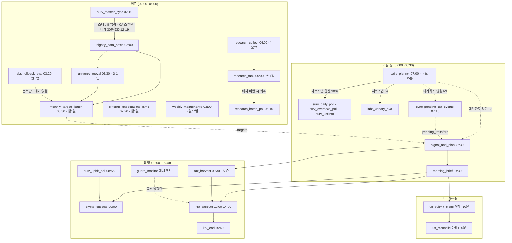
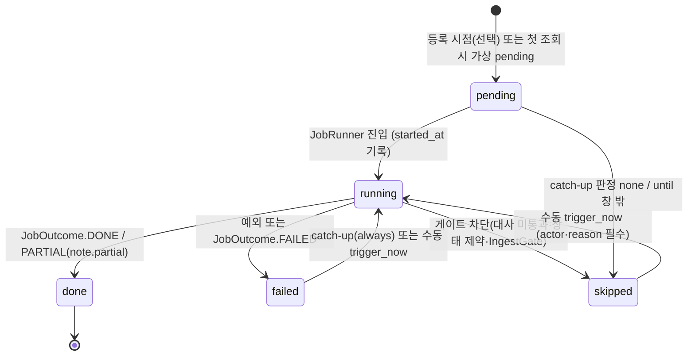

# 12. 스케줄링·운영

> **범위**: `src/omra/scheduler/`(APScheduler 래핑, 잡 선언 모델·등록 기본값, 일일 파이프라인 잡 정의, 일일 세션 플래너, run ledger, catch-up 3분류, 시간 예산·협조적 체크포인트, 동시성 규율), `src/omra/monitoring/`(healthcheck·heartbeat·loop lag 관측·dead-man's switch·시크릿 만료 감시·디스크/백업 관측), `scripts/`·`docs/runbook/`의 운영 절차 구조.
> **계획 정본**: 01 §1.4(스케줄러·동시성 규율)·§4 전체(캘린더·시각표·catch-up 3분류·아침 창 예산)·§6.2(시크릿 만료 대장)·§6.4(모니터링)·§6.5(백업), 03 §6(운영 Runbook)·§7(관측성)·§3(fail-safe), 06 §6.2(감시 스케줄), 00 §3.2 O3·§5 원칙 7·10.
> **선행 문서**: [01-system-architecture.md](01-system-architecture.md)(태스크 토폴로지·기동/종료 시퀀스), [03-data-and-persistence.md](03-data-and-persistence.md)(`run_ledger` DDL), [02-domain-model.md](02-domain-model.md)(Clock·예외), [06-market-data-and-calendar.md](06-market-data-and-calendar.md)(캘린더·`run_date`).
> **이 문서가 소유하는 정의**: 잡 정의·run ledger·시간 예산·모니터링(브리프 §2.1 소유권 표의 12 행). 잡 **내부 로직**은 각 기능 문서가 소유하고, 이 문서는 **언제·어떤 예산으로·어떤 실패 방향으로 그 진입점이 호출되는가**를 소유한다.

## 1. 개요 — 설계 대상과 책임

이 문서가 확정하는 것은 넷이다.

1. **잡의 선언 모델** — 시각표(정본: 01 §4.2)의 모든 행을 `JobSpec`으로 표현하고, 등록 기본값(`max_instances=1`·`coalesce=True`·`misfire_grace_time`)과 catch-up 분류를 **타입 수준의 필수 필드**로 만든다. 분류를 잊은 잡이 등록될 수 없게 하는 것이 01 §4.2.1 커버리지 불변식의 구현이다.
2. **시간 예산의 실행 의미론** — 01 §1.4-3이 "취소가 아니라 협조적 체크포인트"로 확정한 것을 API로 구현한다. 부분 성공이 1급 결과다(§6).
3. **재시작 축과 런타임 축** — run ledger + catch-up 3분류(재시작 축, 정본 01 §4.2.1)와 락·동시성 규율(런타임 축, 정본 01 §1.4)을 하나의 실행 래퍼(`JobRunner`)에서 만난다(§7~§10).
4. **무인 운용의 관측** — healthcheck / heartbeat / dead-man's switch / 시크릿 만료 사다리 / 디스크·백업. 이 계층의 설계 목적은 "고장을 고치는 것"이 아니라 **"고장을 사람이 모르는 채로 흘러가지 않게 하는 것"**이다(정본: 01 §6.4, 03 §8 "관측 공백" 리스크).

**설계하지 않는 것**: 잡 본체 로직(각 기능 문서), 상태 전이의 실행(09), 알림 채널 구현·브리핑 문면(13), 태스크 감독·워치독 태스크 배선(01 §4), `run_ledger` DDL(03), 캘린더 계산(06). 이 문서는 이들의 **호출 계약**만 정의한다.

**운영상의 핵심 불변식 3개** (이 문서 전체가 이것을 지키기 위해 존재한다):

- **I-1**: 동일 `run_date`(venue별 현지 거래일)에 `status=done`인 잡은 **catch-up 경로로 재실행되지 않는다** (정본: 01 §4.2.1).
- **I-2**: 시간 예산 초과는 **취소가 아니라 조기 반환**이며, 이미 커밋된 부분은 유효하다 (정본: 01 §1.4-3).
- **I-3**: 감시 폴·데이터 배치의 실패가 **판정·집행의 지연으로 전이되지 않는다** (정본: 01 §4.3 "자기 유발 정지 방지", 06 §6.2 완화형 순서 불변식).

## 2. 모듈 구조

```
src/omra/scheduler/
├── __init__.py
├── spec.py          # JobSpec·CatchUpClass·LedgerMode·TriggerSpec·BudgetSpec (§3)
├── catalog.py       # 시각표 전개 — 전 잡의 JobSpec 리터럴 (§4). 이 파일이 01 §4.2의 코드 대응물
├── registry.py      # JobRegistry — 선언적 재등록·커버리지 검증·동적 등록 (§3.3, §4.2)
├── service.py       # SchedulerService — AsyncIOScheduler 래핑·수명·수동 트리거 (§3.4)
├── runner.py        # JobRunner — 원장 전이·예산·락·실패 처리·알림 등급 (§10)
├── budget.py        # Budget·checkpoint 헬퍼·BudgetExhausted (§6)
├── ledger.py        # RunLedger — repos.run_ledger 위의 도메인 API (§7)
├── catchup.py       # 3분류 판정기 (§8)
└── planner.py       # DailyPlanner — 07:00 잡 본체와 서브스텝 오케스트레이션 (§5)

src/omra/monitoring/
├── __init__.py
├── health.py        # HealthReport·항목 카탈로그·/healthz 본문 생성 (§11)
├── heartbeat.py     # heartbeat 기록·나이 조회·loop lag 계측 (§12)
├── dms.py           # dead-man's switch 조건 평가·pinger 본체 (§13)
├── secrets_watch.py # 시크릿 만료 대장 사다리·자동 조치 (§14)
├── notify_watch.py  # 알림 채널 이중화 관측·2영업일 연속 실패 판정 (§15)
├── disk.py          # 디스크 사다리·IngestGate (§12.4)
└── backups.py       # Litestream·restic 관측, 복구 리허설 결과 검증 (§16.4, §17.3)

scripts/
├── restore_drill.sh # 분기 복구 리허설 (호스트 실행 — §17.3)
├── backup_restic.sh # Parquet·감사로그 restic 스냅샷 (호스트 실행 — §16.4)
└── deploy.sh        # 이미지 태깅·롤백 (절차 정본 03 §6.3, 태깅 규칙 01 설계서 DD-01-10)

docs/runbook/        # §18
```

**의존 방향**: `scheduler`는 기능 패키지(`execution`·`engine`·`tax`·`data`·`surveillance`·`labs`·`rpc`)를 import하는 **오케스트레이션 층**이며, 기능 패키지가 자기 화이트리스트 밖이라 쓸 수 없는 행(감시 제안 → `approval_requests`, §5.3 [DD-12-20])을 `persistence.repos`로 대신 적재하는 것도 이 층의 책임이다. 역방향(기능 패키지 → `scheduler`) import는 없다 — 잡이 자기를 재등록하거나 다른 잡을 호출하는 경로를 만들지 않는다. `monitoring`은 `persistence.ro`·`core`·`config`와 각 서브시스템의 **스냅샷 조회 API**만 읽고, 상태 전이는 `protections`(09)의 명시 API로 **요청**만 한다. 01 §2.2 계약에 이 두 패키지의 금지줄은 없으므로(관측 4레이어가 아니다) 규율은 아키텍처 테스트로 강제한다([16-testing-and-quality.md](16-testing-and-quality.md)).

## 3. 잡 선언 모델

### 3.1 타입

```python
# scheduler/spec.py
from collections.abc import Awaitable, Callable
from dataclasses import dataclass
from datetime import date, datetime, time, timedelta
from enum import StrEnum

class CatchUpClass(StrEnum):
    NONE   = "none"      # 시각 자체가 의미인 잡 — 재실행하지 않는다 (정본: 01 §4.2.1)
    UNTIL  = "until"     # 창이 남아 있으면 실행
    ALWAYS = "always"    # 멱등 — 즉시 catch-up

class LedgerMode(StrEnum):
    DAILY     = "daily"      # run_date당 1행. catch-up 판정 대상
    RECURRING = "recurring"  # 일중 다회 발화. 최종 발화만 갱신, 판정 대상 아님 (§7.3)
    NONE      = "none"       # 원장 미기록 (상시 태스크 — realtime_t0)

class TriggerKind(StrEnum):
    CRON     = "cron"        # 고정 KST 시각
    DYNAMIC  = "dynamic"     # 캘린더가 계산한 시각으로 매일 등록 (01 §4.1 — DST 원천 차단)
    INTERVAL = "interval"
    INLINE   = "inline"      # 부모 잡의 서브스텝. 자체 트리거 없음, 원장 행은 가짐
    EVENT    = "event"       # 셀프체크·해시 변경 등 외부 이벤트 (§4.3)

@dataclass(frozen=True)
class BudgetSpec:
    """예산은 '상대 초' 또는 '절대 마감' 둘 중 하나로 표현한다.
    둘 다 주어지면 min()이 실효 마감이다."""
    seconds: float | None = None
    deadline_fn: Callable[[date], datetime] | None = None   # 창 종료(14:30 등)·동적 마감
    hard: bool = False        # True면 계획이 '하드 예산'으로 명시한 값 (01 §4.3)

@dataclass(frozen=True)
class JobSpec:
    name: str                                # run_ledger.task_name 과 동일 문자열
    venue: str                               # 'KRX' | 'US' | 'UPBIT' | 'SYS' — run_date 축
    trigger: TriggerKind
    at: time | None                          # CRON: KST 시각
    every: timedelta | None                  # INTERVAL
    schedule_fn: Callable[[date], datetime | None] | None   # DYNAMIC/월간/계절 잡
    entry: Callable[["JobContext"], Awaitable["JobOutcome"]]
    budget: BudgetSpec
    catch_up: CatchUpClass                   # ★ 기본값 없음 — 분류 없는 잡은 생성 불가
    until_fn: Callable[[date], datetime] | None = None      # UNTIL 전용 창 종료
    retry: "RetrySpec | None" = None          # catch-up과 별개의 익일 재시도 (§8.1 — 현재 monthly_targets_batch 1건)
    ledger: LedgerMode = LedgerMode.DAILY
    deps: tuple[str, ...] = ()               # 같은 run_date에 done이어야 하는 선행 잡
    dep_wait: timedelta | None = None        # 선행 미완료 시 대기 상한 (§4.4)
    parent: str | None = None                # INLINE 서브스텝의 부모
    max_instances: int = 1                   # 정본: 01 §1.4-1
    coalesce: bool = True                    # 정본: 01 §1.4-1
    needs_order_lock: bool = False           # §9.2 매트릭스
    needs_ingest: bool = False               # 디스크 90% 초과 시 스킵 대상 (§12.4)
    enabled_when: Callable[["BotContext"], bool] | None = None   # 조건부 잡 (§4.3)
    on_fail: "FailurePolicy" = FailurePolicy.WARN_ONLY
```

> **[DD-12-1] `catch_up`을 기본값 없는 필수 필드로 둔다**
> - 결정: `JobSpec.catch_up`에 기본값을 주지 않는다. 잡 등록은 `catalog.py`의 리터럴 목록을 통해서만 가능하고, `JobRegistry.register()`는 `catalog` 밖에서 만들어진 스펙을 거부한다. 기동 셀프체크 SC-10(01 설계서 §5.2)은 이 레지스트리를 조회해 커버리지를 확인한다.
> - 근거: 01 §4.2.1은 "분류 없이 등록된 잡이 있으면 기동 셀프체크가 실패한다"를 **런타임 검사**로 요구했으나, 기본값이 있는 필드는 조용히 채워져 검사를 통과한다. 타입 수준에서 막으면 검사는 2차 방어선이 된다.
> - 계획 문서와의 관계: 충돌 없음 — 커버리지 불변식의 구현 방식을 확정한다.

### 3.2 등록 기본값 (정본: 01 §1.4-1)

| 옵션 | 값 | 비고 |
|---|---|---|
| `max_instances` | **1** | 예외 없음. 시각표 전 잡이 1이며, 예외를 두려면 §4.1 표에 열이 추가되어야 한다(현재 0건) |
| `coalesce` | **True** | 재기동·정지 후 밀린 발화가 여러 번 쌓여도 1회로 합친다 |
| `misfire_grace_time` | **잡별 시간 예산의 초 값** | `BudgetSpec.seconds`가 있으면 그 값, `deadline_fn`만 있으면 `deadline − 예정 시각`을 초로 환산 |
| `replace_existing` | True | 매 기동 시 선언적 재등록(잡 저장소 영속화 없음 — 01 §1.4) |
| `jobstore` | **MemoryJobStore 단독** | `SQLAlchemyJobStore`를 쓰지 않는다. 영속화는 run ledger가 담당하며, APScheduler 잡 저장소를 함께 쓰면 "재등록된 선언"과 "저장된 잡"이 어긋난다 |
| `executor` | AsyncIOExecutor | 스레드 풀 executor를 등록하지 않는다. CPU-bound 단계는 잡 내부에서 `asyncio.to_thread`(01 설계서 DD-01-4) |
| `timezone` | `Asia/Seoul` | 동적 잡만 UTC 절대 시각으로 등록(§4.2) |

`misfire_grace_time`은 **catch-up의 대체물이 아니다.** APScheduler의 misfire는 "프로세스는 살아 있었지만 발화가 밀린" 경우만 구제하고, 프로세스 부재 구간은 run ledger + catch-up(§8)이 담당한다. 두 메커니즘의 경계를 흐리지 않기 위해 `misfire_grace_time`을 예산보다 크게 잡지 않는다.

### 3.3 `JobRegistry`

```python
# scheduler/registry.py
class JobRegistry:
    def __init__(self, specs: Sequence[JobSpec], ctx: BotContext) -> None:
        """catalog.ALL_JOBS 만 받는다. 중복 name·미분류·순환 deps를 생성자에서 검증."""

    def enabled(self) -> list[JobSpec]:
        """enabled_when(ctx) 통과분만. 조건부 잡(§4.3) 필터."""
    def get(self, name: str) -> JobSpec: ...
    def scheduled_on(self, spec: JobSpec, d: date) -> datetime | None:
        """그 run_date에 이 잡이 예정되어 있는가 → 예정 시각(KST aware) 또는 None.
        휴장·요일·월간·계절 규칙을 여기서 단일 평가한다 (catch-up 판정과 등록이 같은 함수를 쓴다)."""
    def coverage_report(self) -> CoverageReport:
        """SC-10 입력: 등록 잡 집합 == 분류표 집합, INLINE 잡의 parent 존재, deps 폐포."""
```

**등록과 판정이 같은 `scheduled_on`을 쓰는 것이 설계의 요점이다.** 두 벌이면 "등록은 안 했는데 catch-up이 실행" 또는 그 반대가 발생한다.

> **[DD-12-21] 잡 카탈로그는 import 없이 AST로 읽히는 선언적 리터럴이고, 감사로그 export는 `report` CLI의 플래그다**
> - 결정: ① `catalog.ALL_JOBS`는 **모듈 최상위의 리터럴 튜플**이며 각 원소는 `JobSpec(...)` 호출 리터럴이다. `name`·`venue`·`catch_up`·`ledger`·`parent` 다섯 필드는 **반드시 리터럴**(문자열·enum 멤버 접근)로 적고, 루프·컴프리헨션·`for` 생성·조건부 append로 스펙을 만들지 않는다. 진입점 함수와 `schedule_fn`만 참조로 둔다. ② 감사로그 export는 새 명령이 아니라 기존 `report` 명령(CLI 카탈로그 정본: [01](01-system-architecture.md) §2.3)의 플래그 `python -m omra.cli report --audit-export <path> [--from <date>] [--to <date>]`로 확정한다 — 지정 구간의 `var/logs/audit/*.jsonl`을 **읽기 전용으로 병합해 대상 경로에 복사**하고 원본은 건드리지 않는다(append-only 불변 — 01 §6.3).
> - 근거: 요청 출처는 [16](16-testing-and-quality.md) §12.2·미해결 5·6이다. ① AT-5(catch-up 커버리지)는 아키텍처 테스트이므로 검사 대상을 **import하지 않는다**(16 §6.3: "위반 fixture를 import하는 순간 그 위반이 실제로 실행된다"). 잡 카탈로그를 import하면 설정 로딩·DB 접속이 딸려오므로, 카탈로그가 동적으로 조립되면 AT-5는 구현 자체가 불가능하다. ② `gate_evidence` 수집기의 유일한 입력이 감사로그 export이고(16 [DD-16-12]), 01 §2.3의 CLI 카탈로그에 `report`가 이미 있으므로 새 명령을 만들 이유가 없다.
> - 계획 문서와의 관계: 충돌 없음 — 01 §2 "run/backtest/report/health/plan" 명령 집합이 그대로 유지되고, 카탈로그의 표현 형식은 계획의 여백이다. `enabled_when`으로 런타임 활성 여부가 갈리는 조건부 잡(§4.3)도 **스펙 자체는 항상 리터럴로 존재**하므로 AT-5의 커버리지 집합은 config와 무관하게 결정된다.

### 3.4 `SchedulerService`

```python
# scheduler/service.py
class SchedulerService:
    def __init__(self, sched: AsyncIOScheduler, registry: JobRegistry,
                 ledger: RunLedger, cal: TradingCalendar, clock: Clock,
                 runner: JobRunner) -> None: ...

    async def start(self) -> None:
        """기동 phase F (01 설계서 §5.1): ① 정적 잡 등록 ② 오늘 동적 잡 등록
        ③ catch-up 판정·직렬 실행(§8) ④ scheduler.start()"""
    async def register_static(self) -> None: ...
    async def register_dynamic_for(self, d: date) -> list[str]:
        """DYNAMIC 잡을 그날치 date 트리거로 등록. job_id = f'{name}:{run_date}'."""
    async def run_catchup(self) -> CatchupReport: ...
    def pause(self) -> None:
        """graceful shutdown 1단계 — 신규 발화 차단 (01 설계서 §6.1)."""
    async def trigger_now(self, name: str, *, actor: str, reason: str) -> JobOutcome:
        """CLI·Telegram 수동 실행. **I-1을 우회하지 않는다** — 같은 run_date에 done 행이
        있으면 거부한다(§7.2). actor·reason은 필수이고 감사로그에 남는다.
        집행 계열 잡은 확인코드 필요(13 소유)."""
    def snapshot(self) -> list[JobStatusView]:   # /healthz·대시보드(13)가 소비
```

> **[DD-12-5] 동적 잡의 등록 단위와 `job_id` 규약**
> - 결정: DYNAMIC 잡(`us_reconcile`·`us_submit_close`·`us_execute_limit`)은 `daily_planner`(07:00)와 기동 시 두 지점에서 **그날치 `DateTrigger` 1건**으로 등록하며 `job_id = f"{name}:{run_date}"`다. 같은 id 재등록은 `replace_existing=True`로 멱등이고, 전일 이전 id는 등록 시점에 정리한다.
> - 근거: 01 §4.1이 "고정 cron이 아니라 캘린더가 계산한 UTC 시각으로 매일 동적 등록"을 요구한다. `run_date`를 id에 넣지 않으면 KST 자정을 넘는 미국 세션에서 전일·당일 등록이 서로를 덮어쓴다(`run_date` 정의 정본: [06-market-data-and-calendar.md](06-market-data-and-calendar.md) DD-06-11).
> - 계획 문서와의 관계: 충돌 없음 — 등록 단위라는 여백을 채운다.

## 4. 일일 파이프라인 잡 카탈로그

### 4.1 전 잡 표 (01 §4.2 시각표의 전개 — 이 표가 `catalog.py`의 1:1 대응물)

시각·내용·실패 방향은 01 §4.2·§4.2.1·§4.3이 정본이다. **예산 열의 값 중 (H)는 계획이 하드 예산으로 명시한 값이고, 나머지는 [DD-12-4]가 선언한 기본값**(config 오버라이드 가능, M4 실측 재캘리브레이션)이다.

| 잡 | 트리거(KST) | venue | 예산 | 선행 의존 | 실패 시 (정본: 01 §4.2) | catch-up | 진입점 소유 |
|---|---|---|---|---|---|---|---|
| `realtime_t0` | 상시(태스크 T-04~06) | — | — | — | degrade only — HALT 유발 금지 | 대상 외 | 05 / 01 §4.1 |
| `heartbeat` | INTERVAL 30s | SYS | 10s | — | 파일·DB 프로브 실패를 health 항목으로 노출 | none | 이 문서 §12 |
| `nightly_data_batch` | 02:00 | KRX | 3600s | — | 전일 캐시 사용, **거래 차단 없음** | always | [06](06-market-data-and-calendar.md) §13 |
| `surv_master_sync` | 02:10 | KRX | 600s | — | 전일 스냅샷 유지(유예 — 06 §8.3) | always | [11](11-realtime-and-surveillance.md) |
| `external_expectations_sync` | 매월 1일 02:20 + 셀프체크 + YAML 해시 변경(§4.3) | SYS | 300s | — | warning + **다음 트리거에서 재전개**. 미전개 시 P8 위험(03 §8) | always | [09](09-safety-protections.md) |
| `universe_reeval` | 매월 1일 02:30 | KRX | 1800s | `nightly_data_batch`(대기 30분) | 전월 `universe.yaml` 유지 | always | [07](07-portfolio-engine.md) |
| `weekly_maintenance` | 일 03:00 | SYS | 7200s | — | 단계별 부분 실패 허용(§16.2), 전체 실패 warning | always | 이 문서 §16 |
| `labs_rollback_eval` | 매월 1일 03:20 | SYS | 300s | — | α **유지**(전진하지 않음) + warning. `monthly_targets_batch`를 막지 않는다 | until 03:30 (+ `monthly_targets_batch`와 동일 `RetrySpec`) | [14](14-research-and-labs.md) §18 |
| `monthly_targets_batch` | 매월 1일 03:30 | KRX | **1800s (H)** | `nightly_data_batch`·`universe_reeval` | **직전 `targets.yaml` 유지**(운용 정지 아님) | none + 다음 영업일 03:30 1회 재시도 | [07](07-portfolio-engine.md) |
| `research_collect` | 일 04:00 | SYS | 3600s | — | warning만 | always | [14](14-research-and-labs.md) |
| `mc_projection` | 분기 첫 영업일 04:00 | KRX | 1800s | — | 직전 산출 유지(모니터링 전용) | always | [07](07-portfolio-engine.md) |
| `quarterly_review` | 분기 첫 영업일 04:10 | SYS | 900s | — | 리허설 결과 부재·실패 시 **critical**(§17.3) | always | 이 문서 §17 |
| `research_rank` | 매월 1일 05:00 | SYS | 3600s | `research_collect` | warning만, 다이제스트 생략 | always | [14](14-research-and-labs.md) |
| `crypto_vol_scale_update` | 일 05:00 | UPBIT | 600s | — | 직전 스케일 유지. 유의종목 지정 시 갱신 동결(06 §10) | always | [07](07-portfolio-engine.md) |
| `research_batch_poll` | 일 06:10 | SYS | 1800s | — | warning만. 배치 맵 파일 보존(재제출 없음 — 14 §7.4) | always | [14](14-research-and-labs.md) §7.4 |
| **`daily_planner`** | 07:00 | KRX | **600s 하드 (H)** | — | §5.5 단계별 표 | until 07:20 | 이 문서 §5 |
| `surv_daily_poll` | INLINE(daily_planner) | KRX | ┐ | — | 미완료 종목 `unknown`(유예 후에도 미상이면 SV2) | always | [11](11-realtime-and-surveillance.md) |
| `surv_overseas_poll` | INLINE(daily_planner) | US | ├ **합산 300s (H)** | — | 동일 | always | [11](11-realtime-and-surveillance.md) |
| `surv_ksdinfo` | INLINE(daily_planner) | KRX | ┘ | — | KR-12는 야간 마스터 diff 사후 감지로 퇴화 | always | [11](11-realtime-and-surveillance.md) |
| `labs_canary_eval` | INLINE(daily_planner) | SYS | 5s | — | α **유지**(전진 없음) + warning | until 07:20 (부모와 동일) | [14](14-research-and-labs.md) §18 |
| `sync_pending_tax_events` | 07:15 | KRX | 120s | `daily_planner`(대기 없음) | warning. 미생성 `pending_transfers`는 익일 재평가(멱등) | until 07:25 | [10](10-tax-engine.md) §14.1 |
| `signal_and_plan` | 07:30 | KRX | 900s / 마감 08:20 | `daily_planner`(대기 없음 — I-3) | 계획 미생성 → 당일 신규 집행 없음 + warning, 3연속 시 SAFE_MODE 요청 | until 08:00 | [07](07-portfolio-engine.md)·[08](08-execution.md) |
| `morning_brief` | 08:30 | KRX | 300s | `signal_and_plan` | **양 채널 실패 시 당일 신규 자동 집행 보류**(03 §3), 2영업일 연속 → SAFE_MODE(§15) | none | [13](13-web-and-telegram.md) |
| `surv_upbit_poll` | 08:55 | UPBIT | 120s | — | 당일 크립토 집행 보류(06 §6.2) | until 08:58 | [11](11-realtime-and-surveillance.md) |
| `crypto_execute` | 09:00 | UPBIT | 3000s / 마감 09:55 | `morning_brief`·`surv_upbit_poll` | 사이클 스킵, 익일 재판정. 3연속 시 SAFE_MODE 요청 | none | [08](08-execution.md) §10.4 |
| `waterfall_gap_check` | 11/1·12/8·12/15·12/19 09:00 | SYS | 600s | — | **critical 재알림 유지** — 연 79~99만원 확정 손실 경로 | until 12/19 | [10](10-tax-engine.md) §7 |
| `capital_gains_annual_report` | 연 1회 1/15 09:00 | SYS | 1800s | — | warning. 4/1 대행신고 알림(10 §12.1)에서 미산출 사실 재노출 | until 5/1 | [10](10-tax-engine.md) §12 |
| `monthly_report` | 매월 1일 09:00 | SYS | 3600s | `research_rank` | warning만(운용 무관) | always | [14](14-research-and-labs.md) |
| `krx_execute` | 10:00–14:30 | KRX | 마감 14:30 | `morning_brief`·대사 통과 | 창 종료 시 전량 취소, 이월 없음 | until 14:30 | [08](08-execution.md) §10.2 |
| `guard_monitor` | 매시 정각(24시간 — [DD-12-12]) | SYS | 300s(락 대기 60s 포함) | — | 해당 시각 스킵, 다음 정각에 자연 회복 | none | [11](11-realtime-and-surveillance.md) |
| `krx_eod` | 15:40 | KRX | 1800s | `krx_execute` | 대사 미완료 → 신규 주문 금지 유지, P8 경로(09) | always | [08](08-execution.md) §13 |
| `reconcile_heal_retry` | 일 1회 16:30 | SYS | 2400s | — | `HALTED` 유지. 알림 억제(주 1회)는 09 소유 | always | [09](09-safety-protections.md) §5.3 |
| `tax_harvest` | 11/25~D*−2 평일 09:30 | KRX | 1800s | `signal_and_plan` | 후보 미산출 warning. **SAFE_MODE 중 자동 실행 금지** | until D*−2 | [10](10-tax-engine.md) §11 |
| `us_submit_close` | 동적(개장 −10분, 22:20/23:20) | US | 300s / 마감 개장−5분 | `morning_brief`·대사 통과 | 당일 미국 집행 없음, 익일 재판정 | none | [08](08-execution.md) §10.3 |
| `us_execute_limit` | 동적(개장+30분), config 대안 경로 | US | 마감 −30분 | 동일 | 동일 | until 마감−30분 | [08](08-execution.md) §10.3 |
| `us_reconcile` | 동적(마감+20분) | US | 900s | `us_submit_close`/`us_execute_limit` | 대사 미완료 → 신규 주문 금지 유지 | always | [08](08-execution.md) §13 |
| `experiment_ingest` | 조건부(§4.3) 일 06:00 | SYS | 600s | — | warning만 | always | [14](14-research-and-labs.md) |

- 표의 **catch-up 열은 01 §4.2.1의 3분류를 그대로 옮긴 것**이며, 계획에 없던 세 잡(`heartbeat`·`quarterly_review`·`experiment_ingest`)은 각각 [DD-12-7]·[DD-12-11]·07 §13의 명시 지시("`experiment_ingest` 잡을 01 §4.2·§4.2.1(`always`)에 추가")에 따라 분류된다. 다른 설계서의 요청으로 신설된 6건(`labs_rollback_eval`·`research_batch_poll`·`labs_canary_eval`·`sync_pending_tax_events`·`capital_gains_annual_report`·`reconcile_heal_retry`)은 [DD-12-18]이 근거다.
- `tax_harvest`의 시각(09:30)은 계획이 "11/25~12월 평일"만 정하고 시각을 비워 두었으므로 [DD-12-4] 기본값이다. 09:00 `crypto_execute`와 10:00 집행 창 사이에 두어 하베스팅 후보가 당일 `krx_execute`에 합류할 수 있게 한다(`mandatory_orders` 병합 지점은 [08](08-execution.md) §4.2 소유).

> **[DD-12-4] 계획이 비운 잡별 시간 예산·시각의 기본값**
> - 결정: 계획이 **시간 예산을 명시한 세 건**(01 §4.3 `daily_planner` 하드 600초 · 감시 3폴 합산 300초, 01 §4.2 `monthly_targets_batch` 하드 30분)만 표에 **(H)**로 표기한다. 그 밖에 §4.1 표가 적은 값 — 나머지 잡의 예산, 계획이 비워 둔 시각(`tax_harvest` 09:30 · `experiment_ingest` 일요일 06:00. 분기 잡 `quarterly_review` 04:10은 [DD-12-11] 소관), 절대 마감(`signal_and_plan` 08:20 · `crypto_execute` 09:55 · `us_submit_close` 개장−5분) — 은 전부 이 DD의 설계 기본값이다. 계획이 창 종료 시각으로 이미 확정한 `krx_execute` 14:30·`us_execute_limit` 마감−30분은 이 DD의 대상이 아니다. 기본값은 config `jobs.overrides.<name>.budget_sec`(스키마·키 경로 정본은 [04](04-configuration-and-secrets.md) §4.2 `JobsCfg`)로 오버라이드하며 **M4 4주 모의 운용 실측으로 재캘리브레이션**한다(미해결 항목 7).
> - 근거: `misfire_grace_time`이 잡별 시간 예산으로 정의되어 있으므로(01 §1.4-1) 예산이 없는 잡은 **등록 자체가 불가능**하다. 즉 계획의 여백을 비워 둔 채로는 시각표를 코드로 옮길 수 없다. 초기값은 안전 방향으로 크게 잡았다 — 예산 초과는 `PARTIAL`(§6.3)로 관측되지만 예산 과소는 정상 실행을 잘라내기 때문이다.
> - 계획 문서와의 관계: 충돌 없음 — 계획이 값을 준 항목은 그대로 쓰고 여백만 채운다. 이 DD가 정한 값은 어떤 잡의 실행 순서·창 경계도 바꾸지 않는다.

> **[DD-12-18] 타 설계서가 요청한 신규 잡·서브스텝 6건의 등록 확정**
> - 결정: 아래 6건을 §4.1 표·§8.1 분류표에 등재한다. 이름·시각·예산·catch-up 분류의 확정 권한은 이 문서에 있고(브리프 §2.1), **본체 함수는 각 요청 문서가 소유**한다.
>
>   | 잡 | 시각(KST)·venue | 예산 | catch-up | 본체 소유 | 요청 출처 |
>   |---|---|---|---|---|---|
>   | `sync_pending_tax_events` | 07:15 · KRX | 120s | until 07:25 | `tax` | [10](10-tax-engine.md) [DD-10-15]·§14.1 |
>   | `capital_gains_annual_report` | 1/15 09:00 · SYS | 1800s | until 5/1 | `tax` | [10](10-tax-engine.md) [DD-10-15]·§12.1 |
>   | `reconcile_heal_retry` | 16:30 · SYS | 2400s | always | `protections`(`run_reconcile_healing`) | [09](09-safety-protections.md) §5.3 5단계·[DD-09-21] |
>   | `labs_canary_eval` | INLINE(`daily_planner` (10)) · SYS | 5s | until 07:20 | `labs.canary.evaluate_all(today)` | [14](14-research-and-labs.md) §18·§22 #16 |
>   | `labs_rollback_eval` | 매월 1일 03:20 · SYS | 300s | until 03:30 | `labs.rollback.evaluate/apply` | [14](14-research-and-labs.md) §18·§22 #16 |
>   | `research_batch_poll` | 06:10 · SYS | 1800s | always | `research.jobs`(배치 폴링 재개) | [14](14-research-and-labs.md) §7.4 |
> - 근거: 네 문서가 각각 "실행점이 필요한데 01 §4.2 시각표에 행이 없다"를 남겼고, 01 §4.2.1의 커버리지 불변식상 **분류 없는 실행점은 존재할 수 없다**(기동 셀프체크 SC-10 실패). 시각 선택의 규칙은 각각 ① `sync_pending_tax_events`는 감시 폴이 쓴 `pending_tax_events`를 읽으므로 `daily_planner`(07:10 하드 종료) **이후**여야 하고 07:30 계획이 슬라이스를 읽으므로 그 **이전**이어야 한다(10 §14.1) — 07:15가 유일한 창이며, 아침 창 하드 예산(01 §4.3)을 잠식하지 않도록 서브스텝이 아니라 독립 잡으로 둔다. ② `capital_gains_annual_report`의 창 종료 5/1은 10 §12.1의 마지막 마감(납부 알림)이다. ③ `reconcile_heal_retry` 16:30은 `krx_eod`(15:40, 예산 1800s) 종료 이후 첫 정시로, 대사 잡과 장부 쓰기가 겹치지 않게 둔다. ④ `labs_rollback_eval` 03:20은 `monthly_targets_batch`(03:30)가 α를 소비하기 **직전**이라는 14의 제약을 만족하는 가장 늦은 정시다. ⑤ `research_batch_poll` 06:10은 Batch API 완료가 `research_rank`의 예산(3,600초) 안에 들어오지 않는 경우의 회수 경로이며, 아침 창(07:00) 앞에서 끝난다.
> - 계획 문서와의 관계: 충돌 없음 — 01 §4.2 시각표에 6행이 추가될 뿐 기존 행의 시각·순서·실패 방향은 바뀌지 않는다. 전부 주문을 만들지 않는 잡이므로 `on_fail`은 `WARN_ONLY`이고 [DD-09-15]의 사이클 실패 카운터 대상이 아니다(§10.3).

**세부 규율**:

- `labs_rollback_eval`은 `monthly_targets_batch`의 `deps`에 넣지 **않는다.** 넣으면 롤백 평가 실패가 목표비중 배치의 실패 방향("직전 `targets.yaml` 유지")을 유발해 14 §18의 계약("평가 실패 시 α 유지 + warning")보다 강한 처분이 된다. 순서는 시각(03:20 < 03:30)으로만 보장하고, `monthly_targets_batch`가 다음 영업일 03:30으로 재시도되면(§8.1) `labs_rollback_eval`도 **같은 `RetrySpec`을 공유**해 같은 순서를 유지한다.
- `research_batch_poll`은 `var/data/research/batches/*.json`이 없으면 즉시 `done`으로 끝나는 no-op이다(14 §7.4의 "상한 도달 시에도 배치 맵을 삭제하지 않는다"가 이 잡의 유일한 입력). 새 배치를 **제출하지 않는다** — 재제출 금지는 14 §7.4가 확정한 계약이다.
- `reconcile_heal_retry`는 진입 게이트(§10.2)에서 `BotState != HALTED`이거나 미해결 잔차가 없으면 `skipped`로 종결한다. 사다리 진입·판정·알림 억제(주 1회)는 전부 09 소유이며, 스케줄러는 **호출 시점만** 소유한다.

### 4.2 동적 잡의 시각 산출

```python
# scheduler/catalog.py — 발췌
def _us_submit_close_at(d: date, cal: TradingCalendar, cfg) -> datetime | None:
    b = cal.session_bounds(Venue.US, d)                 # 06 §10.1
    return None if b is None else b.open_utc - cfg.jobs.us_submit_lead      # 기본 10분
def _us_reconcile_at(d, cal, cfg):
    b = cal.session_bounds(Venue.US, d)
    return None if b is None else b.close_utc + timedelta(minutes=20)       # 01 §4.2
```

- **22:20/23:20이라는 KST 값은 상수가 아니라 산출 결과다**(정본: 01 §4.1 DST 원천 차단, 06 설계서 §10.3). 반일장은 `close_utc`가 조기폐장을 반영하므로 `us_reconcile`이 자동으로 당겨진다.
- **`us_submit_lead`의 기본값 10분은 창작이 아니라 역산이다.** 정규장 개장 09:30 ET는 KST로 여름(EDT) 22:30 / 겨울(EST) 23:30이고, 01 §4.2가 확정한 `us_submit_close` 시각은 22:20/23:20이므로 리드는 **10분**이다. 이 값을 다르게 잡으면 시각표 정본과 어긋난다(같은 22:20/23:20이 02 §4.1·03 §5.3.1 grace 클램프에서도 인용된다).
- 등록 시각이 이미 지난 경우(재기동)는 등록하지 않고 catch-up 판정(§8)에 맡긴다 — 등록과 catch-up이 같은 발화를 두 번 만들지 않게 하는 규칙이다.
- **스케줄러는 세션 시각을 스스로 계산하지 않는다**: 잡 시각의 산출은 `TradingCalendar.session_bounds(venue, d)`, 창 종료·구간 전이(`us_execute_limit`의 마감−30분, 업비트 `MAINT` 진입/이탈)의 판정은 `SessionStateMachine.next_transition(venue, ts_utc)`를 소비한다(정본: [06](06-market-data-and-calendar.md) 설계서 §10.3·§11.2, 요청 출처 06 §16). `run_date` 계산도 같은 규율로 `TradingCalendar.run_date(venue, ts)`([06](06-market-data-and-calendar.md) DD-06-11)만 쓴다(§7.1).

### 4.3 조건부·이벤트 트리거 잡

| 잡 | 조건 | 설계 |
|---|---|---|
| `us_execute_limit` | `order.us_strategy == "intraday_limit"` — **SP-C3 분기**(LOC/MOO/LOO 미지원 확인 시 기본값이 이쪽으로 전환) | 두 경로를 모두 등록 가능한 형태로 두고 `enabled_when`이 config를 읽어 **정확히 하나만** 활성화한다. 동시 활성은 레지스트리 생성자가 거부(둘 다 미국 매수 주문을 만들므로 이중 집행) |
| T1 구독 관련 잡 | **없음** — M9 조건부 T1 계층은 잡을 추가하지 않는다 | T1 구독은 `krx_execute` 창 내부의 등록·해제(정본: 01 §4.2, [08](08-execution.md) §10.2)이므로 스케줄 축에 신규 잡이 생기지 않는다. **M9 취소 시 스케줄 변경 0건**이라는 것이 이 배치의 이점이다 |
| `experiment_ingest` | `labs.challenger_enabled` — **챌린저층 착수 시**(정본: 07 §13 "챌린저층 착수 시 이 CLI를 감싸는 `experiment_ingest` 잡을 01 §4.2·§4.2.1(`always`)에 추가한다", 착수 조건은 07 §7·§14.3). 키 자체는 계획에 없으므로 [04](04-configuration-and-secrets.md)에 등록 요청(§19) | 07 §13이 지시한 `always` 분류. tools가 쓴 `var/data/experiments/*.json`을 `app`이 읽어 적재(단방향 — 정본: 01 §1.6) |
| `external_expectations_sync` | CRON(월 1일) **+** 기동 셀프체크 SC-8 **+** `external_schedules.yaml` 해시 변경 | 해시 감시는 `daily_planner` 서브스텝이 `config/external_schedules.yaml`의 sha256을 직전 값과 비교해 변하면 `trigger_now("external_expectations_sync", actor="system", reason="yaml_hash_changed")`. 멱등 키가 중복 전개를 막는다(정본: 01 §4.2, 03 §1.3.1) |
| `quarterly_review` | 항상 | §17.3 |

**SP-C4(절세계좌 주문 경로) 분기는 스케줄에 영향이 없다.** 분기 A(직접 주문)든 분기 B(적립식 예약 + 지시서)든 잡 목록·시각은 동일하고, 분기는 `execution/router.py`의 `AccountMode` 한 곳에 격리된다(정본: 00 §3.2 E2 행, [08](08-execution.md) §6). 분기 B에서 추가되는 것은 잡이 아니라 **A3 승인 대기 항목의 리마인더**(D+3/D+7 → 주 1회)이며 그 스케줄링은 승인 큐(13 소유)가 담당한다.

### 4.4 잡 간 의존과 대기 규약

```python
async def await_deps(spec: JobSpec, ctx: JobContext) -> DepVerdict:
    """1. spec.deps 각각에 대해 같은 run_date의 원장 status 조회
       2. 전부 done  → PROCEED
       3. 하나라도 미완료:
          a. spec.dep_wait is None → 즉시 DEGRADED (잡 자체의 실패 방향 표에 따름)
          b. dep_wait 있음 → 10초 폴링으로 대기, 상한 초과 시 DEGRADED
       4. deps가 failed/skipped 로 종결 → DEGRADED (무한 대기 금지)"""
```

| 의존 쌍 | 대기 | 미충족 시 |
|---|---|---|
| `nightly_data_batch`의 **CA 감지 스텝만** ← `surv_master_sync` | 30분 | 직전 2개 스냅샷 비교로 퇴화(CA 감지 1일 지연) + warning [DD-12-19] |
| `universe_reeval` ← `nightly_data_batch` | 30분 | 전월 `universe.yaml` 유지 + 브리핑 명시 [DD-12-6] |
| `sync_pending_tax_events` ← `daily_planner` | 대기 없음 | I-3. 07:15 시점 `pending_tax_events` 스냅샷으로 진행, 미반영분은 익일 흡수 |
| `monthly_targets_batch` ← `nightly_data_batch`·`universe_reeval` | 대기 없음 | 01 §4.2 원문: `universe_reeval` 실패 시 **전월 유니버스로 진행하되 브리핑에 명시**. `nightly_data_batch` 실패 시 직전 `targets.yaml` 유지(배치 스킵) |
| `signal_and_plan` ← `daily_planner` | **대기 없음** | I-3. 07:30 시점 스냅샷으로 정시 진행(정본: 01 §4.3, 06 §6.2) |
| `crypto_execute` ← `surv_upbit_poll` | 대기 없음 | 폴 실패 = 당일 크립토 집행 보류(06 §6.2) |
| 집행 창 ← `morning_brief` | 대기 없음 | 브리핑 양 채널 실패 시 당일 신규 집행 보류(03 §3) — 판정은 창 진입 게이트([08](08-execution.md) §10.1) |

> **[DD-12-6] `universe_reeval`의 `nightly_data_batch` 대기 (30분)**
> - 결정: 매월 1일 02:30의 `universe_reeval`은 02:00 `nightly_data_batch`의 원장 `done`을 최대 30분 대기하고, 초과하면 전월 `universe.yaml`을 유지하며 warning을 남긴다.
> - 근거: 01 §4.2는 `monthly_targets_batch`의 선행 조건만 명시하고 `universe_reeval`의 입력 신선도는 비워 두었다. 유니버스 필터(02 §2.3)는 일봉·시총·마스터를 읽으므로 야간 배치와 동시 실행하면 **부분 적재된 파티션**을 읽는다. `max_instances=1`은 같은 잡의 중복만 막고 서로 다른 잡의 경합은 막지 못한다.
> - 계획 문서와의 관계: 충돌 없음 — 01 §4.2의 "`monthly_targets_batch`보다 먼저 돈다"는 순서 규율을 입력 신선도까지 확장한다.

> **[DD-12-19] 마스터 diff 소비(02:00)와 `.mst` 적재(02:10)의 순서 역전 해소 — 잡 시각이 아니라 스텝 순서로 푼다**
> - 결정: 01 §4.2의 시각(02:00 `nightly_data_batch` / 02:10 `surv_master_sync`)을 **바꾸지 않는다.** 대신 `nightly_data_batch`의 **마스터 diff 소비 스텝(CA 감지 → 대사 화이트리스트 등록)을 그 잡의 마지막 스텝**으로 두고, 그 스텝만 같은 `run_date`의 `surv_master_sync` 원장 `done`을 **최대 30분** 대기한다(`deps`는 잡 전체가 아니라 스텝 단위 게이트다 — 일봉·시총 적재는 02:00에 그대로 시작한다). 30분 초과 시 `MasterService.diff(prev, curr)`를 **직전 2개 스냅샷**으로 호출해 CA 감지가 1일 지연됨을 원장 `note`와 브리핑에 남기고 warning을 낸다.
> - 근거: 요청 출처는 [06](06-market-data-and-calendar.md) §8.3·§16-14다. 01 §4.2는 마스터 diff 소비를 02:00 잡에, `.mst.zip` 적재를 02:10 잡에 배치했는데 [DD-06-8]의 파서 단일화 이후에는 02:00 시점에 당일 스냅샷이 없다. 잡 시각을 맞바꾸면 계획 정본을 고쳐야 하고(01 §4.2 개정 승격), 잡 전체를 대기시키면 야간 배치의 3,600초 예산이 10분 잠식되며 `universe_reeval`(02:30 시작, 30분 대기)까지 연쇄로 밀린다. **가장 늦게 필요한 입력을 가장 늦은 스텝에서 기다리는 것**이 두 부작용을 모두 피한다 — `nightly_data_batch`의 실패 방향은 어차피 "전일 캐시 사용, 거래 차단 없음"이므로 퇴화 경로가 계획과 정합한다.
> - 계획 문서와의 관계: 충돌 없음 — 01 §4.2의 두 잡 시각·내용을 유지한 채 잡 **내부** 스텝 순서만 확정한다. 06이 남긴 "data는 스스로 시각을 가정하지 않는다"(06 §8.3)는 계약도 그대로다 — 두 `file_date`를 정하는 주체가 이 스텝이다.

### 4.5 의존·시각 그래프



## 5. `DailyPlanner` — 일일 세션 플래너 (07:00)

### 5.1 책임

01 §4.2가 `daily_planner`에 부여한 것은 **"오늘 하루가 가능하게 만드는 모든 선행 조건"**이다. 개별 로직은 전부 다른 문서가 소유하고, 이 문서는 **순서·예산 배분·실패 시 하류 처분**을 소유한다.

### 5.2 실행 절차 (의사코드)

```python
# scheduler/planner.py
async def run_daily_planner(ctx: JobContext) -> JobOutcome:
    b = ctx.budget                       # 600s 하드 (01 §4.3)
    today = ctx.run_date                 # venue=KRX 기준 (06 DD-06-11)
    steps: list[StepResult] = []

    # (1) 토큰 — 모든 REST의 전제이므로 최우선 (정본: 01 §5.1, 05 설계서 §토큰)
    steps.append(await step(b, "token_refresh", 30,
                            lambda: ctx.brokers.refresh_tokens_proactively()))
    # (2) approval_key 무조건 선제 재발급 + T0 세션 재수립 (정본: 01 §5.3, §6.2 표)
    steps.append(await step(b, "approval_key", 60,
                            lambda: ctx.brokers.kis.ws.reissue_approval_and_resubscribe()))
    # (3) 휴장일 교차검증 — MISMATCH/UNVERIFIED면 오늘 국내 집행 차단 (06 설계서 §10.2)
    steps.append(await step(b, "calendar_crosscheck", 30,
                            lambda: ctx.calendar.crosscheck_krx(today)))
    # (4) 환율 판정 스냅샷 — 당일 모든 판정이 같은 값을 쓴다 (02 §4.7, 06 설계서 §9.1)
    steps.append(await step(b, "fx_snapshot", 30,
                            lambda: ctx.fx.capture_planning_snapshot(today)))
    # (5) 자금 유입 감지 + 워터폴 계산 (02 §4.2 "같은 daily_planner 07:00 서브스텝,
    #     새 잡을 만들지 않는다" / 00 §3.2 E5 — 계산 로직은 10 소유)
    steps.append(await step(b, "inflow_waterfall", 45,
                            lambda: ctx.tax.detect_inflow_and_plan(today)))
    # (6) 시크릿 만료 사다리 평가 + 자동 조치 (§14. 정본: 01 §6.2)
    steps.append(await step(b, "secret_expiry", 5,
                            lambda: ctx.monitoring.secrets.evaluate(today)))
    # (7) 부재 사다리 평가 (09 소유 — 03 §5.3.1)
    steps.append(await step(b, "presence_ladder", 5,
                            lambda: ctx.protections.presence.evaluate(ctx.clock.now_kst())))
    # (8) 헬스체크 스냅샷 기록 (§11)
    steps.append(await step(b, "health_snapshot", 10,
                            lambda: ctx.monitoring.health.collect()))
    # (9) 오늘 동적 잡 등록 + external_schedules.yaml 해시 감시 (§4.2·§4.3)
    steps.append(await step(b, "register_dynamic", 5,
                            lambda: ctx.scheduler.register_dynamic_for(today)))
    # (10) 카나리 일일 평가 — 순수 계산 + DB 읽기 2회 (14 §18. 실패 시 α 유지)
    steps.append(await step(b, "labs_canary_eval", 5,
                            lambda: ctx.labs.canary.evaluate_all(today)))
    # (11) 감시 폴 블록 — 잔여 예산과 무관하게 상한 300s, 예산 잠식자를 맨 뒤에 둔다
    steps.append(await run_surveillance_block(b.child("surv", 300), ctx))

    return summarize(steps)              # PARTIAL 판정은 §6.3
```

> **[DD-12-3] `daily_planner` 서브스텝의 순서와 소프트 예산 배분**
> - 결정: 위 (1)~(11) 순서와 소프트 예산(30/60/30/30/45/5/5/10/5/5초 + 감시 블록 300초, 예비 75초, 합 600초)을 채택한다. (10) `labs_canary_eval` 5초는 [DD-12-18]로 편입된 서브스텝이며 예비분에서 충당한다(14 §18: "순수 계산 + DB 읽기 2회로 수 ms 수준"). 각 소프트 예산은 config 오버라이드 가능하며, **합이 하드 600초를 넘는 설정은 config 상호 제약 검증에서 거부**한다([04](04-configuration-and-secrets.md) 스키마).
> - 근거: 01 §4.2는 `daily_planner`의 내용 목록만 주고 순서·개별 예산을 비워 두었다. 순서의 원칙은 두 개다 — ① **하류 차단력이 큰 것 먼저**(토큰 실패는 모든 후속 단계를 무의미하게 만든다) ② **예산 잠식자는 마지막**(감시 폴은 300초를 다 쓸 수 있으므로 앞에 두면 교차검증·환율이 밀린다. 01 §4.3이 막으려는 자기 유발 정지가 정확히 이 형태다).
> - 계획 문서와의 관계: 충돌 없음. 감시 블록 300초와 창 전체 600초는 01 §4.2·§4.3 정본 값을 그대로 쓴다.

### 5.3 감시 폴 블록

```python
async def run_surveillance_block(b: Budget, ctx) -> StepResult:
    """3개 폴의 합산 타임아웃 300초 (정본: 01 §4.2·§4.3, 06 §6.2).
       순회 대상·순서·진입점 이름의 정본은 11의 `MORNING_POLLS`
       (surveillance/poll.py — [11](11-realtime-and-surveillance.md) §8.4.1 [DD-11-19]):
       run_daily_poll(KRX) → run_overseas_poll(US) → run_ksdinfo(KRX).
       순서 규칙은 '보유 종목 커버가 가장 큰 것부터' — 예산 소진 시 미상 종목을 최소화한다."""
    incomplete: list[str] = []
    for spec in surveillance.MORNING_POLLS:          # PollSpec(name, venue, run)
        rd = ctx.calendar.run_date(spec.venue, ctx.clock.now_utc())
        await ctx.ledger.start(rd, spec.venue, spec.name)
        rep: PollReport = await spec.run(ctx.surv, ctx.poll_keys, b)   # 종목 루프가 매 반복 b.check()
        await ctx.approvals.enqueue_escalations(rep.escalations, job=spec.name)   # ★ [DD-12-20]
        await ctx.ledger.finish(rd, spec.venue, spec.name,
                                status="done", note={"partial": bool(rep.incomplete),
                                                     "incomplete": rep.incomplete,
                                                     "escalations": len(rep.escalations)})
        incomplete += rep.incomplete
        if b.exhausted: break
    return StepResult("surveillance", ok=True, incomplete=tuple(incomplete))
```

- 미완료 종목의 처분(`unknown` → 스냅샷 유예 → 그래도 미상이면 `SV2`)은 **surveillance(11) 소유**다. 스케줄러는 미완료 목록을 넘길 뿐 등급을 판정하지 않는다.
- `keys`(보유∪후보 종목 키)의 산출과 `PollCtx`의 구성은 11 소유(§8.4.1)이며, 스케줄러는 `JobContext`가 조립해 준 값을 그대로 전달한다. **원장 키는 `PollSpec.name`·`PollSpec.venue`를 그대로 쓴다** — 잡 이름을 스케줄러 쪽에서 다시 적지 않는다(§7.1 "두 벌의 이름 매핑을 만들지 않는다").

> **[DD-12-20] `PollReport.escalations` → `approval_requests` 적재는 잡 래퍼가 수행한다**
> - 결정: 폴 진입점이 반환한 `EscalationProposal` 목록을 **`JobRunner`/`run_surveillance_block`이 `approval_requests` 행으로 적재**한다(`ctx.approvals.enqueue_escalations`). 적재는 폴 1건이 끝날 때마다(원장 `finish` 직전) 수행하며, 멱등 키는 `(instrument_key, kind, risk_type, run_date)`로 같은 제안을 두 번 쌓지 않는다. 알림 발송·승인/거부 명령 처리는 [13](13-web-and-telegram.md) 소유이고, 승인 후 실행은 각 기능 문서(08 `pending_transfers`·07 대체 종목)가 소유한다. 원장 `note.escalations`에 건수를 남겨 브리핑이 1줄로 집계한다.
> - 근거: 요청 출처는 [11](11-realtime-and-surveillance.md) [DD-11-15]다. `surveillance`의 쓰기 화이트리스트는 `surveillance_flags`·`pending_tax_events` 2개뿐이고 `rpc` import도 금지이므로(01 §2.2), 감시 패키지 안에는 승인 큐에 쓸 경로가 물리적으로 없다. 반면 `scheduler`는 오케스트레이션 층이라 승인 큐 repo에 닿을 수 있다(§2 의존 방향). 06 §8.1의 "어떤 소스도 `ESC_*`를 자동 실행할 수 없다"는 그대로 유지된다 — 잡 래퍼가 만드는 것은 **승인 대기 행**뿐이다.
> - 계획 문서와의 관계: 충돌 없음. `approval_requests` DDL은 [03](03-data-and-persistence.md) §3.3.9 소유, 승인 큐의 만료·`timeout_action` 스윕은 09/13 소유이며 이 DD는 **적재 주체**만 확정한다. 쓰기는 `repos.approvals` 모듈을 통해서만 하므로 "테이블당 쓰기 모듈 1개"(03 [DD-03-18])는 유지되고, 늘어나는 것은 호출자 하나다 — **[03](03-data-and-persistence.md) §4.3 표의 `approvals` 행 '주 쓰기 주체'에 `scheduler(12)` 추가가 필요**하다(교차 요청).
- `surv_ksdinfo` 미완료는 KR-12를 야간 마스터 diff 사후 감지로 퇴화시킨다(정본: 01 §4.3, 06 §6.2) — 스케줄러는 이 퇴화 사실을 브리핑 입력에 넣는다.

### 5.4 휴장·점검 시의 등록 생략

```
for venue in (KRX, US, UPBIT):
    if not calendar.is_trading_day(venue, run_date(venue)):
        해당 venue 잡을 오늘 등록하지 않는다 + 브리핑에 "휴장" 명시   # 01 §4.2 각주
    if venue == UPBIT and session.state_at(now) == MAINT:
        crypto_execute 등록 보류 (당일 크립토 집행 보류 — 01 §4.1, 06 설계서 §10.4)
```

- **등록 생략과 `skipped` 원장 기록은 다르다.** 휴장으로 예정 자체가 없는 잡은 `scheduled_on()`이 `None`을 반환하므로 원장 행이 만들어지지 않고 catch-up 판정 대상도 아니다. 반면 예정은 있었으나 게이트로 못 돈 잡은 `skipped` 행을 남긴다.
- 교차검증이 `MISMATCH`/`UNVERIFIED`면 **국내 집행 잡은 등록하되 창 진입 게이트에서 차단**한다(06 설계서 §11.2의 `execution_blocked`). 등록을 생략하면 "휴장이라 안 한 것"과 "검증 실패라 막은 것"이 원장에서 구분되지 않는다.

### 5.5 단계 실패의 하류 처분

| 실패 단계 | 당일 처분 | 근거 |
|---|---|---|
| (1) 토큰 | 재시도는 TokenManager 내부(EGW00133 70초 백오프 후 1회 재발급 — 05). 최종 실패 시 해당 브로커 잡 전부 사이클 스킵 + warning, **3연속 실패에서 critical**(§10.3) | 03 §6.2 |
| (2) approval_key | T0 세션만 degrade, **HALT 유발 금지**. 집행은 REST로 계속 | 01 §4.2 `realtime_t0` 행 |
| (3) 교차검증 | 그날 국내 집행 중단 + critical, **상태 전이 없음(당일 국소)** | 03 §3, 06 설계서 §10.2 |
| (4) 환율 스냅샷 | 06 설계서 §9.4의 stale 규칙에 따름. 판정가 부재면 미국 레그 제외 | 02 §4.7 |
| (5) 유입 감지 | 당일 cash-flow first 1차 배분 생략, 익일 흡수 | 02 §4.3 (6.5) |
| (6) 시크릿 | 대장 파싱 실패 = **critical**(감시 자체가 죽으면 만료를 못 본다) | 01 §6.2 |
| (7) 부재 사다리 | 직전 `PresenceState` 유지 + warning | 03 §5.3.1 |
| (9) 동적 등록 | 미국 잡 미등록 → 당일 미국 집행 없음 + warning | 01 §4.1 |
| (10) 카나리 평가 | **α 유지**(전진하지 않는다) + warning. 실패가 목표비중 소비를 막지 않는다 | [14](14-research-and-labs.md) §18 |
| (11) 감시 블록 | I-3 — 판정을 지연시키지 않는다 | 01 §4.3 |
| **예산 초과** | 미완료 단계는 실행하지 않고 `PARTIAL`로 종결. **07:30을 침범하지 않는다** | 01 §4.3 |

## 6. 시간 예산과 협조적 체크포인트

### 6.1 `Budget` API

```python
# scheduler/budget.py
class BudgetExhausted(OmraError):
    """require() 전용. 잡 경계·단계 경계에서만 던지고 종목 루프 안에서는 던지지 않는다."""
    code = "scheduler.budget_exhausted"; retryable = False

class Budget:
    def __init__(self, clock: Clock, name: str, *,
                 seconds: float | None = None,
                 deadline: datetime | None = None,
                 shutdown: asyncio.Event | None = None) -> None: ...

    @property
    def remaining_sec(self) -> float:    # min(상대 예산 잔여, 절대 마감까지) — 음수 가능
    @property
    def exhausted(self) -> bool:         # remaining_sec <= 0 or shutdown.is_set()
    def check(self, *, reserve: float = 0.0) -> bool:
        """루프 경계 체크포인트. reserve = 이번 반복이 소비할 것으로 보는 시간."""
    def require(self, step: str) -> None:  # 초과 시 BudgetExhausted
    def child(self, name: str, seconds: float) -> "Budget":
        """하위 예산. 부모 잔여를 넘을 수 없다(min 클램프)."""
    def spent(self) -> float: ...
```

**`shutdown` 이벤트를 예산 소진과 동일하게 취급하는 것이 중요하다** — graceful shutdown 1단계(01 설계서 §6.1)는 "실행 중 잡이 협조적 체크포인트에서 스스로 종료"하기를 기대하는데, 그 신호를 예산 축에 합치면 잡 코드가 종료 경로를 따로 알 필요가 없다.

### 6.2 협조적 체크포인트 규약 (정본: 01 §1.4-3)

```python
# 잡 내부 종목 루프의 표준형
async def poll_instruments(keys: list[str], b: Budget, ctx) -> PollResult:
    done, incomplete = [], []
    for i, key in enumerate(keys):
        if not b.check(reserve=ctx.est_per_item_sec):     # ① 반복 '시작' 전에만 확인
            incomplete = keys[i:]                         # ② 남은 것은 미완료로 표기
            break
        row = await ctx.fetch(key)                        # ③ 왕복 중간에는 절대 중단하지 않는다
        await ctx.repo.upsert(row)                        # ④ 커밋 — 여기까지는 무조건 유효
        done.append(key)
    return PollResult(done=tuple(done), incomplete=tuple(incomplete))
```

규약 4개:

1. **`asyncio.wait_for` 취소를 잡 본체에 쓰지 않는다.** HTTP 왕복·DB 트랜잭션 중간의 `CancelledError`는 부분 완료를 미정의로 만들고, 01 §4.3이 요구하는 "미완료 **종목**을 `unknown`으로" 라는 부분 성공 전제와 양립하지 않는다.
2. **체크는 커밋 이후·다음 반복 이전에만.** 커밋 전 체크는 방금 한 왕복을 버린다.
3. **`reserve`를 넣어 판정한다.** 잔여 2초에 평균 5초짜리 반복을 시작하면 예산이 마이너스로 종료되어 하류 잡을 침범한다.
4. **개별 HTTP 호출의 타임아웃은 예산이 아니다.** 호출 타임아웃은 브로커 클라이언트(05)·provider(06)의 것이고, 예산은 그 위에서 "몇 개를 포기할 것인가"만 결정한다.

### 6.3 부분 성공의 표현

```python
class JobStatus(StrEnum):
    DONE = "done"; PARTIAL = "partial"; SKIPPED = "skipped"; FAILED = "failed"

@dataclass(frozen=True)
class JobOutcome:
    status: JobStatus
    started_at: datetime; finished_at: datetime
    incomplete: tuple[str, ...] = ()      # 미완료 단위(종목 키·단계명)
    note: dict[str, object] = field(default_factory=dict)
    error: OmraError | None = None
```

> **[DD-12-2] `PARTIAL`은 원장에 `done` + `note.partial=true`로 기록한다**
> - 결정: `JobStatus.PARTIAL`을 `run_ledger.status='done'`으로 저장하고 `note` JSON에 `{"partial": true, "incomplete": [...], "budget_spent": …}`를 남긴다. `run_ledger.status`의 CHECK 값 집합(`pending/running/done/skipped/failed` — DDL 정본: [03](03-data-and-persistence.md) §3.2)은 변경하지 않는다.
> - 근거: 부분 성공을 `failed`로 기록하면 ① catch-up `always` 잡이 재실행되어 이미 커밋된 부분을 다시 하고 ② `until` 잡은 창 안이면 재실행되어 01 §4.3이 의도한 "미완료는 `unknown`으로 두고 정시 진행"을 뒤집는다. `done`으로 기록하면 I-1이 재실행을 막고, 미완료 사실은 `note`와 브리핑에 남아 관측이 유지된다.
> - 계획 문서와의 관계: 충돌 없음 — DDL을 건드리지 않고 01 §1.4-3의 부분 성공 전제를 표현한다.

### 6.4 아침 창 예산의 코드 대응 (정본: 01 §4.3)

| 항목 | 구현 |
|---|---|
| `daily_planner` 하드 10분 | `BudgetSpec(seconds=600, hard=True)` + `deadline_fn = 07:10`. 둘의 min이므로 07:02에 시작해도 07:10에 끝난다 |
| 감시 3개 합산 300초 | `b.child("surv", 300)` — 부모 잔여로 클램프되므로 앞 단계가 밀리면 자동 축소 |
| catch-up 07:20 진입 | 예산 = `min(600, 07:30 − now − 60초 마진)`. 01 §4.2.1의 "예산 10분이 아니라 **잔여 시간만** 쓴다"의 구현 |
| `signal_and_plan` 무대기 | `deps=("daily_planner",)`이되 `dep_wait=None` → `DEGRADED`여도 진행(§4.4) |

## 7. run ledger

### 7.1 스키마와 키 규약

테이블 DDL은 [03-data-and-persistence.md](03-data-and-persistence.md) §3.2가 소유한다 — `run_ledger(run_date, venue, task_name, status, started_at, finished_at, note)`, PK `(run_date, venue, task_name)`.

- `run_date` = **venue별 현지 거래일**(정본: 01 §1.4). 계산은 `TradingCalendar.run_date(venue, ts)`([06](06-market-data-and-calendar.md) DD-06-11)만 사용하고, 스케줄러는 KST 달력일을 직접 쓰지 않는다.
- `venue` ∈ {`KRX`, `US`, `UPBIT`, `SYS`}. `SYS`는 거래 세션과 무관한 잡·운영 카운터(§7.4)의 네임스페이스이며 `run_date`는 KST 달력일이다.
- `task_name`은 `JobSpec.name`과 문자열이 동일하다 — 두 벌의 이름 매핑을 만들지 않는다.
- **소비자가 인용한 원장 키는 고정된다.** `morning_brief`의 키는 `(run_date_KRX, venue='KRX', 'morning_brief')`이며 [13](13-web-and-telegram.md) [DD-13-6]이 브리핑 발송 판정·SAFE_MODE 2영업일 규칙의 입력으로 이 키를 그대로 인용한다 — **venue를 바꾸면 13의 판정이 함께 깨지므로 변경은 두 문서 동시 개정 사항**이다(요청 출처: 13).

### 7.2 상태 전이



- **`done`에서 나가는 화살표는 수동 경로에도 없다**(I-1). `trigger_now`가 `done` 행을 만나면 거부하고, 정말 다시 돌려야 하면 사람이 `--force` + 확인코드를 준다(감사로그 `actor="user"`).
- `running` 상태로 남은 행(프로세스가 중간에 죽음)은 기동 시 **`failed`로 마감**하고 note에 `{"orphan_running": true}`를 남긴 뒤 catch-up 판정에 넘긴다 — `running`을 그대로 두면 catch-up이 "실행 중"으로 오인해 영원히 건너뛴다.

### 7.3 API

```python
# scheduler/ledger.py
class RunLedger:
    def __init__(self, repo: RunLedgerRepo, ro: ReadOnlySession, clock: Clock) -> None: ...

    async def start(self, rd: date, venue: str, task: str) -> None:
        """status='running', started_at=now. 이미 done이면 InvariantViolation."""
    async def finish(self, rd, venue, task, *, status: str,
                     note: dict | None = None) -> None: ...
    async def get(self, rd, venue, task) -> LedgerRow | None: ...
    async def recent(self, task: str, *, n: int) -> list[LedgerRow]:
        """연속 실패 판정(§10.3)·배치 이력 패널(03 §7.1-9)의 입력."""
    async def sweep_orphan_running(self, *, older_than: timedelta) -> int: ...
    async def touch_recurring(self, rd, venue, task, *, fires: int) -> None:
        """LedgerMode.RECURRING 전용 — status='done' 유지, note.fires 증가."""
```

> **[DD-12-8] `LedgerMode.RECURRING` — 일중 다회 발화 잡의 원장 표현**
> - 결정: `guard_monitor`(매시)·`heartbeat`(30초)는 `run_date`당 1행을 유지하며 최종 발화 시각과 누적 발화 수만 갱신한다. 이 행은 catch-up 판정 대상이 아니다(둘 다 `catch_up=none`이므로 판정 결과가 항상 "재실행 안 함"이라 판정 자체가 무의미하다).
> - 근거: `run_ledger` PK가 `(run_date, venue, task_name)`이라 하루 24회·2,880회 발화를 행으로 표현할 수 없다. 동시에 I-1("done이면 재실행 금지")을 문자 그대로 정규 트리거에 적용하면 `guard_monitor`가 하루 1회만 도는 버그가 된다 — **I-1은 catch-up 경로에만 적용되는 규칙**임을 여기서 명시적으로 못박는다.
> - 계획 문서와의 관계: 충돌 없음. 01 §4.2.1의 불변식 문장("동일 `run_date`에 `status=done`인 잡은 어떤 경우에도 재실행하지 않는다")은 그 절의 제목이 "재시작 시 판정"이므로 재시작 축의 규칙으로 읽는 것이 정합적이다. **정규 트리거 축과 `--force` 수동 축의 두 예외는 여기서만 선언되며 그 밖의 어떤 코드 경로도 `done` 행을 재실행하지 않는다** — 후자는 사람이 확인코드로 권한을 행사하는 경로이므로 자동화가 불변식을 우회하는 경우가 아니고, `actor="user"`로 감사로그에 남는다(§7.2).

### 7.4 `SYS` 네임스페이스 — 운영 카운터

> **[DD-12-9] 모니터링 일자별 카운터는 새 테이블 없이 `venue='SYS'` 행으로 표현한다**
> - 결정: 아래 `task_name`을 `SYS` 네임스페이스에 예약한다. `JobRegistry`에 등록되지 않은 `task_name`은 catch-up 판정 대상이 아니다.
>
>   | task_name | 의미 | note 스키마 |
>   |---|---|---|
>   | `heartbeat` | DB 쓰기 프로브 겸용 heartbeat | `{ts, loop_lag_ms, fires}` |
>   | `notify_dispatch` | 당일 알림 채널 발송 결과 | `{telegram: ok/fail, smtp: ok/fail, both_failed: bool}` |
>   | `dms_ping` | 그날 DMS ping 성립 여부 | `{conditions: {...}, pinged: bool, last_ok_at}` |
>   | `disk_watch` | 디스크 사다리 최종 상태 | `{pct: {db,data,logs}, tier: ok/warn/block}` |
>   | `restore_drill` | 분기 복구 리허설 결과 취합 | `{quarter, result, checked_at, source_file}` |
>   | `secret_expiry_alert:<secret_name>:<days_before>` | 시크릿 만료 사다리 발송 멱등 — 고정 이름 5개와 달리 **가변 접미가 붙는 접두사 형태**로 예약한다(출처: [04](04-configuration-and-secrets.md) [DD-04-13]) | `{level, days_left}` |
> - 근거: "알림 양쪽 실패 2영업일 연속 → SAFE_MODE"(03 §3), "배치 3일 연속 실패 → critical"(03 §7.2 ⑦), "restic 3회 연속 실패 → warning, 7일 연속 → critical"(01 §6.2)은 전부 **재시작을 견디는 일자별 카운터**를 요구하는데, [03](03-data-and-persistence.md)의 DDL에 범용 운영 KV 테이블이 없다. `run_ledger`는 12 소유 테이블이고 PK가 정확히 `(일자, 네임스페이스, 이름)`이라 새 DDL 없이 요건을 만족한다. 연속 판정은 `recent(task, n)` 조회로 계산하므로 카운터 증감 로직 자체가 필요 없다(재시작에 강하다).
> - 계획 문서와의 관계: 충돌 없음 — 03 소유의 DDL을 변경하지 않는다.

## 8. catch-up 3분류

### 8.1 분류 매핑 (정본: 01 §4.2.1 — 전재)

| 분류 | 잡 | 창(`until`) |
|---|---|---|
| **`none`** | `morning_brief`, `crypto_execute`, `us_submit_close`, `monthly_targets_batch`, `guard_monitor`, `heartbeat` | — |
| **`until`** | `daily_planner`(07:20), `signal_and_plan`(08:00), `krx_execute`(14:30), `us_execute_limit`(마감−30분), `surv_upbit_poll`(08:58), `tax_harvest`(D*−2), `waterfall_gap_check`(12/19), `sync_pending_tax_events`(07:25), `capital_gains_annual_report`(5/1), `labs_rollback_eval`(03:30), `labs_canary_eval`(07:20 — 부모 `daily_planner`와 동일) | 표의 값 |
| **`always`** | `nightly_data_batch`, `surv_master_sync`, `surv_daily_poll`, `surv_overseas_poll`, `surv_ksdinfo`, `us_reconcile`, `krx_eod`, `universe_reeval`, `crypto_vol_scale_update`, `mc_projection`, `monthly_report`, `weekly_maintenance`, `research_collect`, `research_rank`, `external_expectations_sync`, `quarterly_review`, `experiment_ingest`, `research_batch_poll`, `reconcile_heal_retry` | — |
| **대상 외** | `realtime_t0`(상시 태스크) | — |

- `monthly_targets_batch`의 `none`에는 **예외 규칙**이 붙는다: "익월로 미루지 않고 다음 영업일 03:30에 1회 재시도"(정본: 01 §4.2.1). `JobSpec.retry = RetrySpec(when="next_business_day", at=time(3,30), times=1)`(§3.1 필드)로 구현하며, 재시도분도 원장에서는 그 날짜의 새 `run_date` 행이다. 재시도는 **catch-up 축이 아니라 정규 트리거 축**이므로 `catch_up=none` 분류와 충돌하지 않는다.
- 계획에 없던 세 잡의 분류 근거: `heartbeat` = `none`(30초마다 다시 오는 발화를 catch-up할 이유가 없다 — [DD-12-7]), `quarterly_review` = `always`(결과 검증·마커 생성은 멱등 — [DD-12-11]), `experiment_ingest` = `always`(07 §13이 명시).
- [DD-12-18] 신설 6건의 분류 근거: `research_batch_poll`·`reconcile_heal_retry` = `always`(둘 다 "할 일이 남아 있으면 하고 없으면 즉시 끝난다" — 멱등), `sync_pending_tax_events` = `until 07:25`(07:30 계획이 슬라이스를 읽은 뒤에는 그날 실행의 의미가 사라진다), `labs_rollback_eval` = `until 03:30`(α 소비 이후의 롤백 평가는 그달 목표비중에 반영되지 않는다), `capital_gains_annual_report` = `until 5/1`(마지막 마감 — 10 §12.1), `labs_canary_eval` = 부모와 같은 `until 07:20`.

> **[DD-12-10] `always` 잡의 지연 실행 표기 요건**
> - 결정: `catch_up=always` 잡이 예정 시각보다 늦게 실행된 경우(`started_at − scheduled_at > budget`), 그 잡의 산출물과 원장 `note`에 `{"delayed_min": N, "scheduled_at": …}`를 기록하고 브리핑에 1줄로 집계한다. 특히 `monthly_report`처럼 **날짜가 제목에 들어가는 산출물**은 본문에 생성 시각과 지연 사실을 함께 표기한다.
> - 근거: `always`는 "언제 돌아도 결과가 같은(멱등) 잡"(01 §4.2.1)이지만, 멱등성은 *결과의 동일성*이지 *해석의 동일성*이 아니다. 5일 늦게 만들어진 "10월 리포트"는 내용은 같아도 사람이 그것을 10월 1일의 판단 근거로 오독할 수 있다. 표기는 그 오독만 막고 재실행 정책은 건드리지 않는다.
> - 계획 문서와의 관계: 충돌 없음 — 01 §4.2.1의 `always` 분류를 그대로 유지한다.

### 8.2 판정 알고리즘

```python
# scheduler/catchup.py
async def decide(spec: JobSpec, now: datetime, ctx) -> CatchupDecision:
    rd = ctx.calendar.run_date(spec.venue, now)
    planned = ctx.registry.scheduled_on(spec, rd)          # 오늘 예정인가
    if planned is None:
        return CatchupDecision.NOT_SCHEDULED               # 휴장·요일·월간 미해당
    row = await ctx.ledger.get(rd, spec.venue, spec.name)
    if row and row.status == "done":
        return CatchupDecision.ALREADY_DONE                # I-1
    if now < planned:
        return CatchupDecision.FUTURE                      # 정규 트리거가 처리
    match spec.catch_up:
        case CatchUpClass.NONE:
            await ctx.ledger.finish(rd, spec.venue, spec.name,
                                    status="skipped", note={"reason": "missed_restart"})
            ctx.brief.add_missed(spec.name, rd)            # 브리핑·다이제스트 표기
            return CatchupDecision.SKIP
        case CatchUpClass.UNTIL:
            if now <= spec.until_fn(rd):
                return CatchupDecision.RUN
            await ctx.ledger.finish(rd, spec.venue, spec.name,
                                    status="skipped", note={"reason": "window_closed"})
            ctx.notify.warning(f"{spec.name} catch-up 창 종료 — 건너뜀")
            return CatchupDecision.SKIP
        case CatchUpClass.ALWAYS:
            return CatchupDecision.RUN
```

실행 규율:

1. **직렬 실행.** catch-up 대상은 하나의 큐에 예정 시각 오름차순으로 넣고 순차 실행한다. 병렬로 돌리면 재시작 직후 REST 버스트가 발생하는데, 그 버스트는 06 §3.3이 헤드룸의 용도로 예상한 부하이지 동시성으로 증폭시킬 대상이 아니다.
2. **RateLimiter 우선순위는 `BATCH`**(정본: 01 §5.2, [05](05-broker-gateway.md)) — catch-up이 실시간 집행 경로의 토큰을 뺏지 않는다.
3. **집행 계열 catch-up은 대사 게이트 뒤에 온다.** 기동 시퀀스에서 강제 대사(SC-11)는 phase E, catch-up은 phase F이므로 순서가 구조적으로 보장되고(01 설계서 §5.1), 창 진입 게이트가 2차로 확인한다([08](08-execution.md) §10.1-3). 정본: 01 §4.2.1 마지막 항.
4. **catch-up 실행분도 정규 실행과 같은 `JobRunner`를 탄다** — 예산·락·원장·알림 경로가 갈라지지 않는다. 다만 `JobContext.is_catchup=True`가 잡 본체에 전달되어, 예산이 "원래 예정 시각 기준"이 아니라 "지금부터 창 종료까지"로 계산된다(§6.4 `daily_planner` 07:20 행).

### 8.3 커버리지 불변식 (SC-10)

```python
def coverage_report(self) -> CoverageReport:
    """① 모든 JobSpec이 CatchUpClass 값을 가짐(타입이 이미 강제 — DD-12-1)
       ② UNTIL 잡은 until_fn 이 not None
       ③ INLINE 잡의 parent 가 레지스트리에 존재
       ④ deps 가 전부 레지스트리에 존재하고 순환이 없음
       ⑤ catalog.ALL_JOBS 의 name 집합이 유일
       ⑥ 문서 §8.1 표와 코드의 분류가 일치(테스트가 표를 파싱해 비교 — 16 소유)"""
```

- ①~⑤ 실패 → SC-10 `FATAL_STOP`(정본: 01 설계서 §5.2 — `STOPPED` 기동 + critical).
- ⑥은 CI 아키텍처 테스트다(런타임 검사 아님). 문서와 코드가 갈라지는 것을 막는다.

## 9. 동시성 규율 (01 §1.4의 런타임 축 구현)

### 9.1 네 규율의 구현 지점

| 규율(01 §1.4) | 구현 |
|---|---|
| 1. 등록 기본값 | §3.2 표 — `JobRegistry.register()`가 강제, 예외 잡 0건 |
| 2. `order_lock` 불변식 | 락 객체·pre-trade 원자성은 [08](08-execution.md) §3 소유. 스케줄러의 책임은 **`needs_order_lock=True` 잡이 락을 통해서만 주문 상태에 닿게 하는 것**(§9.2) |
| 3. 협조적 체크포인트 | §6 — `asyncio.wait_for` 취소 금지 규약 포함 |
| 4. SQLite 세션 | §9.3 |

### 9.2 잡 × 락 매트릭스

| 잡 | `order_lock` | 근거 |
|---|---|---|
| `krx_execute`·`crypto_execute`·`us_submit_close`·`us_execute_limit` | **필수**(주문 제출·순매수 회계) | 01 §1.4-2 |
| `guard_monitor` | **조치 적용 단계만 필수** | 축소 방향 조치가 주문 상태를 바꾼다(01 §4.2) |
| `krx_eod`·`us_reconcile` | **필수**(미체결 종결·장부 반영) | 대사와 신규 주문이 겹치면 diff가 흔들린다 |
| `reconcile_heal_retry` | **필수**(사다리 4단계 재동기화가 `positions`·`cash`를 다시 쓴다) | [09](09-safety-protections.md) §5.3. 락 대기 상한은 `guard_monitor`와 같은 60초이고 초과 시 `skipped` — 다음 날 재시도가 자연 회복 경로다 |
| `tax_harvest` | 후보 산출은 불필요, 확정 주문 병합은 집행 창 안에서 | [08](08-execution.md) §4.2 |
| `signal_and_plan` | 불필요(계획 생성만, 주문 없음) | 02 §4.3 |
| 그 외 배치·폴 | 불필요 | — |

> **[DD-12-12] `guard_monitor` × `krx_execute` 경합 해소**
> - 결정: ① `guard_monitor`는 24시간 매시 정각 발화한다(업비트 T0 채널이 24/7이므로 야간에도 관측 대상이 있다). 따라서 원장 `venue`는 `KRX`가 아니라 **`SYS`**다 — `KRX`로 두면 §5.4의 휴장 등록 생략이 국내 휴장일에 크립토 관측까지 함께 꺼 버린다. ② 관측·판정 단계는 락 없이 수행하고, **축소 방향 조치를 실제로 적용하는 단계만 `order_lock`을 잡는다.** ③ 락 대기 상한은 60초이고, 초과하면 그 시각 발화를 `skipped`로 종결한다 — 다음 정각에 자연 회복한다(01 §4.2.1 `none` 분류의 근거를 그대로 따른다). ④ `krx_execute` 창 안에서는 창 루프가 이미 종목별 가드를 소비하므로(06 §2.2, [08](08-execution.md) §12) `guard_monitor`는 **같은 종목·같은 이벤트에 대해 조치를 중복 발동하지 않는다** — 중복 판정은 `execution_state`의 연기 카운터(정본: 01 §3.5)를 이중 소비하기 때문이다.
> - 근거: 01 §1.4가 지목한 정확한 문제("`krx_execute` 장기 실행 중 `guard_monitor`가 매시 발화하고 둘 다 주문 상태와 순매수 회계를 건드린다")에 대해 계획은 락의 존재만 정하고 **대기 실패 시 처분**을 비워 두었다. 무한 대기는 매시 잡이 집행 창 내내 쌓이는 결과가 되고(`max_instances=1`이라 후속 발화는 misfire), 강제 선점은 집행 원자성을 깬다.
> - 계획 문서와의 관계: 충돌 없음 — 01 §1.4-2의 락 불변식을 유지한 채 대기 정책을 채운다.

### 9.3 SQLite 접근 규율 (정본: 01 §1.4-4)

```python
# runner.py 내부 — 잡별 짧은 세션의 표준형
async def commit_step(repo_fn, *args) -> None:
    async for attempt in tenacity.AsyncRetrying(
            retry=retry_if_exception(is_sqlite_busy), stop=stop_after_attempt(3),
            wait=wait_exponential(multiplier=0.2, max=2)):
        with attempt:
            async with session_scope() as s:      # 열고 → 쓰고 → 즉시 닫는다
                await repo_fn(s, *args)
```

- **장기 실행 잡이 트랜잭션을 연 채 `await`하는 것을 금지**한다(01 §1.4-4). `krx_execute`처럼 4.5시간 도는 잡은 종목 경계마다 세션을 새로 연다.
- `SQLITE_BUSY`는 `busy_timeout=5000`(01 §1.3)과 별개로 앱 레벨 tenacity 3회. 3회 실패는 `PersistenceError`(정본: [02](02-domain-model.md) §10.1)로 잡 실패 처리되며, 그 잡이 주문 경로 5종이면 §10.3이 09에 `report_cycle_failure`를 보고하고 3연속 판정·SAFE_MODE 전이는 09가 수행한다(03 §3 "DB 오류 3회 연속", [DD-09-15]).
- 읽기는 `persistence.ro` 세션. 잡은 자기 소유 repo만 쓴다(화이트리스트 정본: [03](03-data-and-persistence.md) §4.3).

### 9.4 CPU-bound 오프로드

`monthly_targets_batch`·`mc_projection`·`crypto_vol_scale_update`의 수치 단계는 `await asyncio.to_thread(pure_fn, …)`로 오프로드한다(정본: 01 설계서 DD-01-4 — 조건: `engine`의 순수 함수만, `order_lock` 보유 중 금지). 스케줄러 측 규칙은 하나 더 있다: **오프로드 중에도 예산 체크포인트가 살아 있어야 하므로, 오프로드 단위를 예산보다 작게 쪼갠다**(예: 몬테카를로 5,000경로를 500경로 × 10블록). 블록 경계가 체크포인트다.

## 10. `JobRunner` — 실행 래퍼

### 10.1 실행 흐름

```python
# scheduler/runner.py
async def run(self, spec: JobSpec, *, is_catchup: bool = False,
              actor: str = "scheduler") -> JobOutcome:
    rd  = self.cal.run_date(spec.venue, self.clock.now_utc())
    rid = ulid()                                   # 감사로그 correlation.run_id (01 §6.3)
    with bind_contextvars(run_id=rid, job=spec.name, run_date=str(rd)):
        # 1. 게이트 — 통과 못 하면 running 으로 들어가지도 않는다
        gate = await self.gates(spec, rd)          # §10.2
        if gate.blocked:
            await self.ledger.finish(rd, spec.venue, spec.name,
                                     status="skipped", note=gate.as_note())
            return JobOutcome(SKIPPED, …)
        # 2. 원장 running
        await self.ledger.start(rd, spec.venue, spec.name)
        budget = Budget(self.clock, spec.name,
                        seconds=spec.budget.seconds,
                        deadline=spec.budget.deadline_fn(rd) if … else None,
                        shutdown=self.shutdown_evt)
        # 3. 본체 — 예외는 여기서만 잡는다
        try:
            out = await spec.entry(JobContext(rd, budget, is_catchup, rid, self.ctx))
        except BudgetExhausted as e:
            out = JobOutcome(PARTIAL, note={"budget": str(e)})
        except OmraError as e:
            out = JobOutcome(FAILED, error=e)
        except Exception as e:                     # 예상 못한 예외 — 03 §3 첫 행
            out = JobOutcome(FAILED, error=wrap_unexpected(e))
        # 4. 원장 종결 + 실패 정책
        await self.ledger.finish(rd, spec.venue, spec.name,
                                 status=to_ledger_status(out.status), note=out.as_note())
        await self.apply_failure_policy(spec, out, rd)     # §10.3
        self.notify(spec, out)                             # §10.4
        return out
```

- **감사로그 이벤트 타입을 새로 만들지 않는다.** 잡 실행 자체는 운영 로그(structlog JSON)이고, 잡이 내린 결정은 기존 `event_type`(`plan_created`·`order_submitted`·`targets_computed` 등)으로 남는다. 연결은 봉투의 기존 필드 `correlation.run_id`(정본: 01 §6.3)가 담당한다 — 스키마 진화 규칙(필드 의미 불변)을 건드리지 않는 방식이다.

### 10.2 진입 게이트 (실행 전 차단 사유)

| 게이트 | 대상 잡 | 차단 시 원장 | 정본 |
|---|---|---|---|
| 상태 제약(전역∪슬리브∪부재 5축) | 집행·주문 계열 | `skipped` + `note.reason="state_gate"` | 03 §2.1, 09 |
| 대사 미통과(`submit_hold`) | 집행 계열 | `skipped` + `reason="reconcile_hold"` | 03 §3 |
| 휴장·`execution_blocked` | venue 집행 계열 | `skipped` + `reason="calendar"` | 06 설계서 §11.2 |
| `IngestGate`(디스크 90%) | `needs_ingest=True` | `skipped` + `reason="disk_block"` | 00 §3.2 O3, 04 §M4 |
| `enabled_when` 미충족 | 조건부 잡 | 원장 행 없음(등록 자체가 안 됨) | §4.3 |
| SAFE_MODE 중 하베스팅 자동 실행 | `tax_harvest` | `skipped` + `reason="safe_mode"` | 00 §3.2 T3, 01 §4.2 |

**게이트 차단은 실패가 아니다.** `skipped`는 연속 실패 카운터를 증가시키지 않는다 — 그렇지 않으면 SAFE_MODE 중 매일 스킵되는 잡이 3일 만에 critical을 만든다.

### 10.3 실패 정책

```python
class FailurePolicy(StrEnum):
    WARN_ONLY   = "warn_only"       # 데이터·리서치 배치
    CYCLE_FAIL  = "cycle_fail"      # 판정·집행 계열 — 3연속 시 SAFE_MODE 요청 (03 §3)
    CRITICAL    = "critical"        # 즉시 critical (waterfall_gap_check 등)
```

```python
async def apply_failure_policy(self, spec, out, rd) -> None:
    if out.status is not JobStatus.FAILED: return
    if spec.on_fail is FailurePolicy.CYCLE_FAIL:
        # 카운터·임계 판정·SAFE_MODE 전이는 전부 09 소유 ([DD-09-15]·[DD-09-21]).
        # 스케줄러는 '주문 경로 잡 1회가 실패했다'는 사실만 보고한다 — 임계를 두 곳에서 세지 않는다.
        self.ctx.protections.report_cycle_failure(
            kind=spec.name, detail=str(out.error) if out.error else "failed")
    recent = await self.ledger.recent(spec.name, n=3)
    consecutive = count_leading_failed(recent)
    if consecutive >= 3:
        self.ctx.notify.critical(f"배치 3일 연속 실패: {spec.name}")   # 03 §7.2 critical ⑦
```

- 잡별 `on_fail` 배정: `CYCLE_FAIL` = **주문 생성 시도를 포함하는 5개 잡**(`signal_and_plan`·`krx_execute`·`crypto_execute`·`us_submit_close`·`us_execute_limit`) 한정. `CRITICAL` = `waterfall_gap_check`·`external_expectations_sync`·`quarterly_review`. 나머지(`krx_eod`·`us_reconcile`·`daily_planner`·[DD-12-18] 신설 6건 포함) `WARN_ONLY`.
- **`report_cycle_failure` 호출은 위 5개 잡에서만 발생한다**(정본: [09](09-safety-protections.md) [DD-09-15], 요청 출처 09). 대사·플래너·배치 잡의 실패를 사이클 카운터에 계상하면 01 §4.2의 "야간 배치 실패는 거래를 차단하지 않는다"와 모순되므로, `krx_eod`·`us_reconcile`·`daily_planner`는 `CYCLE_FAIL`에서 제외한다 — 이 셋의 실패 방향은 각각 "신규 주문 금지 유지"(대사 게이트, §10.2)와 "부분 성공 후 정시 진행"(I-3)이며 상태 전이 요청이 아니다. 성공 시 카운터 리셋(연속 완주 1회)의 주체·시점도 09 소유이므로 스케줄러는 **실패만** 보고한다.
- `SAFE_MODE` 전이 자체를 스케줄러가 요청하는 경로는 §14.2(시크릿 D−3)와 §15(알림 블랙아웃 — 09에 보고)만 남는다.
- **연속 판정의 단위는 "연속 실행 시도"이지 "달력일"이 아니다.** 주간 잡의 3연속 실패는 3주다 — `recent(n=3)`가 원장 행 기준이므로 자연히 그렇게 된다. 03 §7.2 ⑦의 "배치 3일 연속"은 일일 배치를 상정한 표현이며, 주간 잡에 3일 기준을 적용하면 절대 발화하지 않는다.
- **상태 전이를 예외로 일으키지 않는다**(정본: [02](02-domain-model.md) §10.2 규칙 4) — `request_safe_mode`는 09의 명시 API 호출이고, 09가 5축 결합을 판정한다.

### 10.4 알림 등급 매핑 (정본: 03 §7.2)

| 사건 | 등급 |
|---|---|
| 잡 정상 완료(`done`) | **silent** — 로그·대시보드만 |
| `partial`·`skipped` | silent + 브리핑 1줄 집계 |
| 단발 `failed` | warning(Telegram 묶음) |
| **3연속 실패** | **critical**(Telegram + SMTP 양쪽) |
| catch-up `until` 창 밖 skip | warning |
| catch-up `none` 미실행 | silent + 브리핑 표기 |
| `waterfall_gap_check` 잔여 발생 | **critical**(D-12/D-5/D-1 재알림) |
| 크래시 루프·kill switch | **critical** |

`critical` 오발송은 버그로 취급한다(03 §7.2). 그래서 정상 경로의 어떤 잡 이벤트도 critical이 아니다.

## 11. `monitoring/` — healthcheck

### 11.1 항목 카탈로그 (정본: 01 §6.4 + 03 §7.1-9)

```python
# monitoring/health.py
class HealthStatus(StrEnum): OK = "ok"; WARN = "warn"; FAIL = "fail"

@dataclass(frozen=True)
class HealthItem:
    id: str; status: HealthStatus; value: str | float | None
    threshold: str | None; detail: str | None; observed_at: datetime

@dataclass(frozen=True)
class HealthReport:
    status: HealthStatus                # 최악 항목
    items: tuple[HealthItem, ...]
    generated_at: datetime; uptime_sec: float
    bot_state: str; sleeve_states: Mapping[str, str]; presence: str
    tasks: tuple[TaskStatus, ...]       # 01 §4.2 TaskSupervisor.snapshot() 그대로 (재정의 금지)
    selfcheck: tuple[CheckOutcome, ...] # 마지막 기동의 BootResult.outcomes (01 §5.2)
    jobs: tuple[JobStatusView, ...]     # SchedulerService.snapshot() (§3.4)

async def collect(ctx) -> HealthReport: ...
```

- `tasks`·`selfcheck`는 **이 문서가 재정의하지 않는다** — `TaskStatus`는 [01](01-system-architecture.md) §4.2 `TaskSupervisor.snapshot()`의 반환 원소, `CheckOutcome`은 01 §5.2 `BootResult.outcomes`의 원소를 그대로 담는다. 셀프체크 결과는 기동 시 1회 산출되므로 `collect()`는 메모리에 보관된 마지막 `BootResult`를 읽을 뿐 재실행하지 않는다([DD-12-13] 네트워크 0건 규율과 동일한 이유).
- 태스크가 죽어 재기동 중이면 `tasks` 원소의 상태가 그것을 드러내지만 **`status`(최악 항목) 판정에는 넣지 않는다** — 상시 태스크의 재기동·백오프는 degrade 경로이고(01 §4.2 `realtime_t0` "HALT 유발 금지"), `/healthz` FAIL은 Docker 재시작 신호가 아니라 관측 신호이기 때문이다(§11.2).

| id | 산출 | WARN | FAIL | 정본 |
|---|---|---|---|---|
| `heartbeat_age` | now − heartbeat 파일 ts | > 90s | > `watchdog.heartbeat_max_age_sec`(180s) | 01 §6.4 |
| `db_write` | 마지막 `SYS/heartbeat` upsert 성공 여부 | 1회 실패 | 3연속 실패 | 01 §6.4 |
| `broker_token` | env별 `broker_tokens.expires_at` 잔여 | < 30분 | 만료·부재 | 01 §5.1 |
| `last_ingest` | Parquet 최신 파티션 write 시각 | > 26h | > 3거래일 | 01 §6.4 |
| `disk` | `db`/`data`/`logs` 볼륨 사용률 최대 | ≥ 80% | ≥ 90% | 00 §3.2 O3, 04 §M4 |
| `loop_lag` | 최근 60s 최대 타이머 오차 | > 500ms(집행 창) | > `loop_lag_exit_ms`(5000ms) | 01 §9.2·§6.4 |
| `ws_sessions` | 3소켓 상태 + 구독 등록 수 | 1소켓 DISCONNECTED | 전 소켓 다운 | 01 §5.3, 05 |
| `surveillance_freshness` | 소스별 `observed_at` 나이 | 1거래일 초과 | `max_age`(2거래일) 초과 | 06 §8.3 |
| `secret_expiry` | 1급 시크릿 최소 잔여일 | ≤ 30일 | ≤ 7일 | 01 §6.2 |
| `job_health` | 최근 24h 실패 잡 수 / 3연속 실패 잡 존재 | 실패 ≥ 1 | 3연속 존재 | 03 §7.2 ⑦ |
| `api_error_rate` | 최근 1h 브로커 4xx/5xx 비율 | > 5% | > 20% | 03 §7.1-9 |
| `dms_last_ping` | 마지막 ping 성공 이후 경과 | > 1h | > 6h | 01 §6.4 |
| `backup` | Litestream 최신 스냅샷 나이 / restic 결과 | restic 3연속 실패 | Litestream 24h 초과 | 01 §6.2·§6.5 |

**정본 열은 "항목의 출처"이지 "임계값의 출처"가 아니다.** 계획이 **값까지** 확정한 것은 `heartbeat_age` FAIL 180s·`loop_lag` WARN 500ms/FAIL 5000ms(01 §6.4·§9.2)·`disk` 80/90%(04 §M4, 00 §3.2 O3)·`surveillance_freshness` 2거래일(06 §8.3)·`secret_expiry` 30/7일(01 §6.2)·`backup`의 restic 3연속(01 §6.2)·Litestream 24h(01 §6.5 `snapshot-interval`)뿐이다. 나머지 WARN/FAIL 값(`heartbeat_age` 90s, `db_write`, `broker_token` 30분, `last_ingest` 26h/3거래일, `ws_sessions`, `job_health`, `api_error_rate` 5%/20%, `dms_last_ping` 1h/6h)은 [DD-12-4]와 같은 성격의 설계 기본값이며 config `monitoring.health.thresholds.*`로 오버라이드하고 **M4 실측으로 재캘리브레이션**한다(미해결 항목 7).

> **[DD-12-13] healthcheck는 캐시된 관측치만 읽는다(네트워크 호출 0건)**
> - 결정: `collect()`의 모든 항목은 메모리 스냅샷·SQLite·파일시스템만 읽는다. 토큰 유효성은 `broker_tokens.expires_at` 계산이지 검증 호출이 아니고, WS 상태는 세션 객체의 상태 필드다.
> - 근거: Docker healthcheck가 60초 간격으로 실행되므로(정본: 01 §1.6) 네트워크 호출을 넣으면 하루 1,440콜이 API 예산에 추가되고, 더 나쁘게는 브로커 장애 시 healthcheck 자체가 타임아웃해 `unhealthy`가 원인이 아니라 증상을 가린다.
> - 계획 문서와의 관계: 충돌 없음 — 01 §6.4 항목 목록의 산출 방식을 확정한다.

### 11.2 `/healthz`와 CLI

- 본문 생성 함수는 `monitoring.health.collect()`(이 문서 소유), FastAPI 라우터 마운트와 인증 정책은 [13-web-and-telegram.md](13-web-and-telegram.md) 소유.
- 응답: `status != FAIL` → HTTP 200, `FAIL` → 503. 본문은 `HealthReport`의 JSON 직렬화.
- `omra health` CLI는 loopback `http://127.0.0.1:8080/healthz`를 조회해 exit 0/1(정본: 01 설계서 §7.4). **프로세스 존재 확인으로 대체하지 않는다** — 검사 대상이 "이벤트 루프가 실제로 응답하는가"이기 때문이다.
- **healthcheck는 관측 전용이다.** `unhealthy`는 재시작을 유발하지 않는다(Docker의 문서화된 동작 — 정본: 01 §6.4). 재시작은 §12.3의 워치독이 만든다.

## 12. heartbeat · loop lag · 디스크

### 12.1 heartbeat

> **[DD-12-7] heartbeat는 30초 주기 잡이 이중 기록한다**
> - 결정: `heartbeat` 잡(INTERVAL 30초, `catch_up=none`, `ledger=RECURRING`)이 매 발화마다 ① `var/db/heartbeat.json`을 임시파일+`os.replace`로 원자 교체하고 ② `run_ledger`의 `('SYS', 'heartbeat')` 행을 upsert한다. 워치독 태스크(01 설계서 §4.5)는 ①의 나이를 읽는다.
> - 근거: (a) heartbeat를 **워치독 자신이 쓰면** 자기 생존만 증명하고 스케줄러 정지를 탐지하지 못한다. 잡이 쓰고 태스크가 읽으면 heartbeat 나이는 "APScheduler가 실제로 발화하고 있는가"의 직접 지표가 되며, 이것이 01 §6.4가 막으려는 "프로세스가 죽지 않고 응답만 멈추는" 실패의 정확한 관측점이다. (b) 파일과 DB 둘 다 쓰는 이유는 DB 잠금·디스크 문제를 분리 진단하기 위함이다 — ①만 실패하면 디스크, ②만 실패하면 SQLite다. (c) 주기 30초는 `heartbeat_max_age_sec: 180`(정본: 01 §6.4)의 1/6로, 6회 연속 누락되어야 임계에 닿는다.
> - 계획 문서와의 관계: 충돌 없음 — 01 §6.4의 heartbeat 항목에 물리적 위치·주체·주기를 부여한다. 01 설계서 §4.1의 상시 태스크 9종은 변하지 않는다(heartbeat는 태스크가 아니라 잡이다).

```python
# monitoring/heartbeat.py
async def beat(ctx) -> None:
    payload = {"ts": ctx.clock.now_utc().isoformat(),
               "loop_lag_ms": ctx.monitoring.lag.recent_max_ms(),
               "pid": os.getpid(), "state": ctx.state.bot_state}
    atomic_write_json(Path(ctx.cfg.paths.db) / "heartbeat.json", payload)   # ①
    rd = ctx.calendar.run_date(Venue.SYS, ctx.clock.now_utc())   # SYS = KST 달력일 (§7.1)
    await ctx.ledger.touch_recurring(rd, "SYS", "heartbeat", fires=+1)         # ②

def heartbeat_age_sec(ctx) -> float: ...   # 워치독·healthcheck 공용 (01 설계서 §4.5가 호출)
```

### 12.2 loop lag 계측

```python
# monitoring/heartbeat.py
class LoopLagMeter:
    """asyncio 타이머 오차 실측 — sleep(interval) 요청 대비 실제 경과의 초과분.
    링버퍼(최근 120 샘플)에 보관하고 최댓값·p95를 노출한다."""
    async def sample_forever(self, interval: float = 0.5) -> None: ...
    def recent_max_ms(self) -> float: ...
    def p95_ms(self) -> float: ...
```

- 샘플링 루프는 워치독 태스크(T-08) 안에서 돈다 — **상시 태스크를 추가하지 않는다**(01 설계서 §4.1의 9종 불변).
- 임계 초과 시 동작은 두 갈래다: **집행 창 중 500ms 초과 → 알림만**(정본: 01 §9.2 — 자동 강등 사다리를 만들지 않았다), **5,000ms 3연속 → 워치독의 자발적 종료**(정본: 01 §6.4). 이 문서는 계측치를 제공하고, 종료 판단은 01 설계서 §4.5가 소유한다.

### 12.3 워치독과의 경계

| 책임 | 소유 |
|---|---|
| heartbeat 기록·나이 계산, loop lag 계측 | **이 문서**(monitoring) |
| 임계 비교 후 `os._exit(1)`, 마커 파일, 크래시 루프 판정(SC-3) | [01-system-architecture.md](01-system-architecture.md) §4.5·§5.2 |

### 12.4 디스크 사다리와 `IngestGate`

> **[DD-12-14] 디스크 사다리의 구현 — `heartbeat` 잡 편승 + `IngestGate` 플래그**
> - 결정: ① 디스크 사용률은 `heartbeat` 잡이 매 발화마다 `shutil.disk_usage`로 3볼륨(`var/db`·`var/data`·`var/logs`)을 측정한다. ② **80% 초과** → 로그 보존 기간을 14일에서 7일로 낮추고 즉시 1회 정리, warning. ③ **90% 초과** → `IngestGate.block()` — `needs_ingest=True` 잡(`nightly_data_batch`·`surv_master_sync`·`research_collect`·`us_reconcile`의 Parquet 적재 단계)이 진입 게이트에서 `skipped`가 되고, **주문·대사·상태·감사로그 경로는 그대로 유지**된다. critical. ④ 해제는 85% 미만으로 복귀 시 자동(히스테리시스 5%p). ⑤ 상태 변화 시에만 알림하고 `SYS/disk_watch` 행에 기록한다.
> - 근거: 04 §M4·00 §3.2 O3가 "80% 로테이션 강화 / 90% 적재만 중단하고 거래는 유지(순서를 반대로 하면 안 된다)"를 확정했으나 측정 주체·주기·해제 조건이 비어 있다. 히스테리시스가 없으면 임계 근방에서 적재가 진동하고, 별도 잡을 만들면 상시 잡이 하나 늘어난다.
> - 계획 문서와의 관계: 충돌 없음. **감사로그 append는 어떤 단계에서도 중단하지 않는다**(00 §5 원칙 4) — 감사로그가 멈추면 "1년 뒤 재구성"이 깨지고, 감사로그의 증분은 시세 Parquet에 비해 무시 가능하다.

```python
# monitoring/disk.py
class IngestGate:
    """단일 인스턴스. 잡 진입 게이트(§10.2)와 ParquetStore.write(06 소유)가 조회한다."""
    def blocked(self) -> bool: ...
    def block(self, reason: str) -> None: ...
    def release(self) -> None: ...
```

## 13. dead-man's switch

### 13.1 ping 조건 (정본: 01 §6.4)

```python
# monitoring/dms.py
DMS_CONDITIONS: Final = (
    "brief_generated",       # 브리핑 '산출물 생성' 성공 — 발송 성공이 아니다
    "drift_decided",         # 드리프트 판정 실행 성공(밴드 미달이어도 판정은 매일 실행)
    "reconciled",            # 대사 성공 (krx_eod / us_reconcile)
    "surveillance_fresh",    # 감시 소스 신선도
    "fill_rate_observed",    # venue별 계획 대비 체결률 산출 실행
)

@dataclass(frozen=True)
class DmsCondition:
    id: str; ok: bool; observed_at: datetime | None; window: timedelta; detail: str

async def evaluate(ctx) -> tuple[DmsCondition, ...]: ...
async def ping_if_alive(ctx) -> bool: ...
```

| 조건 | 신선도 창 | 산출 소스 |
|---|---|---|
| `brief_generated` | 26h | `morning_brief` 원장 + 산출물 파일 존재 |
| `drift_decided` | 26h | `signal_and_plan` 원장 + `rebalance_plans` 행(밴드 미달이면 빈 계획 행) |
| `reconciled` | 26h(거래일 기준) | `krx_eod`/`us_reconcile` 원장 `done` |
| `surveillance_fresh` | 2거래일(`max_age`) | 11의 소스 신선도 API |
| `fill_rate_observed` | 3거래일 | venue별 "계획 수량 대비 체결 수량" 산출 실행 여부 |

- **`brief_generated`가 발송 성공이 아닌 이유**: 부재 등급에 따라 푸시가 주 1회로 감축되므로(03 §5.3.1) 발송을 AND 조건에 넣으면 **DMS가 가장 필요한 구간(장기 부재)에서 상시 오탐**한다(정본: 01 §6.4 괄호 주석).
- **`fill_rate_observed`는 체결률의 좋고 나쁨을 판정하지 않는다.** 조건은 "산출이 실행되었는가"다. 미국 LOC 3거래일 연속 전량 미체결의 warning은 집행([08](08-execution.md) §10.3) 소유이고, DMS는 **관측 로직 자체의 생존**만 본다. 이 구분이 "30일간 주문 0건이 정상인지 판정 로직이 죽은 것인지"(03 §8 관측 공백 리스크)를 가르는 지점이다.

### 13.2 pinger

- 태스크 T-09 `dms_pinger`(01 설계서 §4.1)가 본체를 호출한다. 주기 **15분**, 전 조건 충족 시에만 ping.
- ping 전송 = `monitoring.dms.ping_url`에 GET 1회(외부 무상 감시 서비스). **[확인 필요]** 구체 서비스·URL·미수신 알림 임계는 계획에 없다 — config 주입 값으로 두고, 운용 개시 전 `docs/runbook/dms.md`에 등록 절차를 기록한다(확인 방법: 서비스 선택 후 실제 등록 1회).
- ping 실패(HTTP 오류·네트워크)는 **warning만**. 외부 서비스 장애로 우리 상태를 바꾸지 않는다.
- 결과는 `SYS/dms_ping` 행에 기록되어 `dms_last_ping` health 항목의 입력이 된다.

### 13.3 채널 C로서의 DMS webhook

03 §3은 "알림 양쪽 실패가 2영업일 연속이면 `SAFE_MODE` + **채널 C(dead-man's switch webhook)로만 통지**"를 정한다. 즉 DMS 엔드포인트는 관측 신호이자 최후의 통지 경로다. 전송 구현은 `rpc/webhook.py`([13](13-web-and-telegram.md) 소유), **발동 판정은 §15**가 소유한다.

## 14. 시크릿 만료 감시

### 14.1 입력과 사다리

- 입력: `config/secrets_registry.yaml`(발급일·만료일·등급·자동 조치. **값은 `.env`** — 정본: 01 §6.2). 파일 스키마는 [04-configuration-and-secrets.md](04-configuration-and-secrets.md) 소유.
- 평가 시점: 매일 07:00 `daily_planner` 서브스텝 (6)(정본: 01 §6.2 "`monitoring/`이 매일 07:00에 대장을 읽어 사다리를 평가한다").

```python
# monitoring/secrets_watch.py
@dataclass(frozen=True)
class SecretStatus:
    name: str; tier: int; expires_on: date; days_left: int
    rung: int | None                 # 45 | 30 | 14 | 7 | 3 | 1 | None
    action: SecretAction             # NONE | PAUSE_SLEEVE | SAFE_MODE

async def evaluate(asof: date, ctx) -> tuple[SecretStatus, ...]: ...
```

| 잔여 | 알림 | 자동 조치(1급만) | 정본 |
|---|---|---|---|
| D-45 | warning("갱신 버튼이 아직 열리지 않았다") | — | 01 §6.2 |
| **D-30** | **critical, 이후 매일** | — | 01 §6.2, 03 §7.2 ③ |
| D-14 | critical | — | 01 §6.2 |
| **D-7** | critical | 해당 슬리브 **`PAUSED_ALL`** | 01 §6.2, 03 §5.3.2 |
| D-3 | critical | 전체 **`SAFE_MODE`** | 동일 |
| D-1 | critical | (유지) | 동일 |

슬리브 매핑: KIS 실전 앱키 → `kis_domestic`·`kis_overseas`, 업비트 키 → `upbit`. 2·3급 시크릿의 처분(모의 비활성·발송 실패 3회 → 단독 채널·백업 실패 critical)은 01 §6.2 표 그대로이며, 자동 조치가 없는 항목은 알림만 한다.

### 14.2 조치 규율

1. **조치는 요청이고 실행은 09다.** `ctx.protections.request_sleeve_state(sleeve, PAUSED_ALL, reason="secret_expiry_d7", actor="scheduler")` / `request_safe_mode(reason="secret_expiry_d3", actor="scheduler")` — 시그니처 정본은 [09](09-safety-protections.md) §2.2 `SafetyFacade`([DD-09-21]), 조치 내용의 정본은 09 §11.4·01 §6.2다. 5축 결합·전이 합법성 판정은 09 소유(정본: 03 §2.1)이며 12는 **D−7/D−3 도달 사실을 통지**할 뿐이다(요청 출처: 09 (d)).
2. **멱등**: 이미 목표 상태면 재요청하지 않는다. 알림은 D-30 이하 하루 1회로 묶는다(늑대소년 방지 — 03 §7.2).
3. **자동 해제 없음.** 대장의 `expires_at`이 갱신되어도 `PAUSED_ALL`·`SAFE_MODE`는 자동 복귀하지 않는다 — 복귀는 사람의 `/resume`이다(정본: 03 §6.4 절차 8단계).
4. **발급일 분산 규칙 검증**: 1급 시크릿 2건의 만료일 간격이 6개월 미만이면 config 검증 단계에서 warning을 남긴다(정본: 01 §6.2 "알림보다 배치가 효과적인 방어다"). 강제 실패로 만들지 않는 이유는 최초 발급 시점에 이미 확정된 사실을 사후에 되돌릴 수 없기 때문이다.

### 14.3 부재 기간 겹침 점검 (03 §5.3.4)

```python
async def check_away_overlap(period: DateRange, ctx) -> list[OverlapWarning]:
    """/away <기간> 선언 시 즉시 호출된다(호출 주체는 13의 Telegram 핸들러).
    점검: 1급 시크릿 만료일 / 4~5월 양도세 기한 / 11-1~12-20 공제 잔여 창 /
          11-25~D*−2 하베스팅 창 / 기한부 감시 이벤트 deadline_at(P14).
    등급은 03 §5.3.4 표 그대로 — 하베스팅만 info, 나머지 critical."""
```

### 14.4 SP-B14 조건부 분기

- **SP-B14 성공**(KIS 앱키 만료일 API 조회 가능): `daily_planner`가 조회 결과로 `secrets_registry.yaml`의 `expires_at`을 **검증**하고 불일치 시 critical. 파일을 자동으로 덮어쓰지는 않는다 — config는 사람이 편집하는 입력물이다(정본: 01 §6.1).
- **SP-B14 실패**: 수동 기입값이 유일한 진실원이며, 갱신 절차(03 §6.4) 7단계가 대장 갱신을 강제한다. 이 경우 **대장 자체의 신선도**를 감시한다 — 만료일이 과거인데 시스템이 정상 동작 중이면 대장이 갱신되지 않은 것이므로 warning(정본: 01 §10 SP-B14 폴백 "수동 기입 + 캘린더 이중 등록").

## 15. 알림 채널 이중화 관측

```python
# monitoring/notify_watch.py
async def record_dispatch(day: date, *, telegram: bool, smtp: bool, ctx) -> None:
    """13의 RPCManager가 브리핑·critical 발송 후 호출. SYS/notify_dispatch 행 upsert."""

async def evaluate(day: date, ctx) -> NotifyVerdict:
    """하루 1회(마지막 발송 이후 — 실무상 morning_brief 종료 직후) 호출.
       ① SYS/notify_dispatch 행에서 당일 any_success = telegram or smtp 를 확정하고
          ctx.protections.report_notify_result(day, any_success) 로 **1회만** 보고한다
          — 연속 판정(FS-notify.skip_streak)·SAFE_MODE 전이·채널 C 통지는 09 소유
          (정본: [09] §12.3 report_notify_result, 03 §3).
       ② 당일 both_failed → 당일 신규 자동 집행 보류 판정을 반환한다
          (집행 창 게이트가 소비 — 03 §3). 이 판정만 이 모듈이 소유한다."""
```

- "둘 중 하나라도 성공"이 집행 전제다(정본: 03 §3·01 §6.4). **읽지 않은 것은 집행을 막지 않는다** — negative-option의 본질이며, 대신 `last_seen` 미갱신이 부재 사다리를 작동시킨다(09 소유).
- 채널 구현·발송 재시도·`muted` 발송(부재 감축일)은 [13](13-web-and-telegram.md) 소유이며 **`muted` 발송은 성공으로 계상한다**(09 §11.3). 이 모듈은 **결과의 일자별 집계(`SYS/notify_dispatch`)와 하루 1회 보고**를 소유하고, **2영업일 연속 판정과 상태 전이는 09가 소유**한다 — 같은 임계를 두 곳에서 세면 `SAFE_MODE` 요청이 이중으로 발생한다(요청 출처: 09 (c)).

## 16. 자가관리 — `weekly_maintenance`·로그·백업

### 16.1 단계 (정본: 01 §4.2 "DB VACUUM·백업 검증, Parquet 무결성, 로그 로테이션, 카세트 스모크, 감시 소스 헬스 리뷰" + 01 §1.6·§6.5)

```python
async def run_weekly_maintenance(ctx: JobContext) -> JobOutcome:
    b = ctx.budget                                    # 7200s
    steps = [
      ("integrity_check",  lambda: ctx.db.pragma_integrity_check()),      # 03 설계서 §8.4
      ("log_rotate",       lambda: rotate_logs(ctx)),                     # §16.3
      ("parquet_verify",   lambda: ctx.data.verify_latest_partitions()),  # 06 설계서 §7.2
      ("vacuum",           lambda: ctx.db.vacuum()),                      # 01 §6.5
      ("litestream_check", lambda: ctx.monitoring.backups.await_snapshot_after_vacuum()),
      ("ro_snapshot",      lambda: make_ro_snapshot(ctx.db.engine, ctx.paths.snapshot)),
      #                     ↑ 시그니처 정본 01 §7.3: make_ro_snapshot(db: Engine, dest: Path) -> SnapshotMeta.
      #                       반환 메타는 tools 결과 파일의 재현성 근거이므로 버리지 않고 note에 남긴다
      ("backup_verify",    lambda: ctx.monitoring.backups.verify_restic_status()),
      ("cassette_smoke",   lambda: ctx.contracts.smoke_run()),            # 하네스 소유 16
      ("surv_health",      lambda: ctx.surv.health_review()),             # 11 §8.4.3 → SourceHealthReview
      ("research_purge",   lambda: purge_research_inbox(ctx, months=13)), # 14 [DD-14-4] — §16.3
    ]
    results = []
    for name, fn in steps:
        if not b.check(reserve=60): results.append(skipped(name)); continue
        results.append(await guarded(name, fn))       # 단계 실패가 다음 단계를 막지 않는다
    return summarize(results)
```

- **단계 간 격리가 핵심이다.** `VACUUM` 실패가 감시 소스 헬스 리뷰를 못 하게 만들 이유가 없다. 단, `ro_snapshot`은 `vacuum` 성공에 의존하지 않는다(`VACUUM INTO`는 독립 연산).
- `integrity_check` 실패 → **즉시 critical + Litestream 복원 절차 안내**. 손상 DB의 부분 구제는 시도하지 않는다(정본: [03](03-data-and-persistence.md) §8.4).
- `litestream_check`는 `VACUUM` 후 스냅샷 1회 성공 확인이다(정본: 01 §6.5). **이 확인이 성립해야 `weekly_maintenance`가 완료 조건을 만족한다** — 확인 실패 시 잡은 `PARTIAL`로 끝나고 §16.2의 처분(warning, 3주 연속 critical)을 따른다(요청 출처: [03](03-data-and-persistence.md) §8.1 — "VACUUM 후 Litestream 스냅샷 1회 성공을 확인하고 잡을 종료한다"). 확인 수단은 **[확인 필요]**(리스트 API vs 메트릭 — 03 설계서 §8.1의 동일 미해결 항목을 상속한다. §23 항목 2).
- `surv_health`는 `SourceHealthReview`를 반환하는 **순수 집계**이며 폴을 돌리지 않는다(정본: [11](11-realtime-and-surveillance.md) §8.4.3) — 주간 잡의 예산을 잠식하지 않는다. 알림 발송은 이 잡이 한다(11은 반환까지).
- `research_purge`는 `var/data/research/inbox/<ISO주차>/`에서 13개월 초과 항목을 삭제한다(정본: [14](14-research-and-labs.md) [DD-14-4], 요청 출처 14). 다이제스트 산출물(`var/reports/research/`)과 감사로그는 대상이 아니다(§16.3 ③).

### 16.2 실패 처분

| 단계 | 실패 시 |
|---|---|
| `integrity_check` | critical + 복원 안내. 잡은 계속(나머지 단계 수행) |
| `vacuum`/`litestream_check` | warning. 3주 연속 실패 시 critical |
| `ro_snapshot` | warning — `omra backtest`가 스냅샷 나이 임계로 스스로 거부한다(01 설계서 §7.3) |
| `backup_verify` | restic 3연속 실패 warning / 7일 연속 critical (정본: 01 §6.2) |
| `cassette_smoke` | **warning + 브리핑 표기** — TR 스펙 변경 조기 탐지가 목적이므로 운용을 멈추지 않는다(03 §8 리스크 표) |
| `surv_health` | warning |
| `research_purge` | warning. 삭제 실패는 디스크 사다리(§12.4)가 2차로 흡수한다 |

### 16.3 로그·산출물 보존

> **[DD-12-15] 로그 정리 정책**
> - 결정: ① 운영 로그는 파일명이 일자 기반(`var/logs/app-{date}.jsonl`)이므로 회전 자체가 필요 없고, `weekly_maintenance`가 **보존 기간 초과 파일을 삭제**한다(기본 14일 — 정본: 01 §6.3). ② 디스크 80% 초과 시 보존을 7일로 낮추고 즉시 1회 정리한다(§12.4). ③ **감사로그(`var/logs/audit/{yyyy-mm}.jsonl`)는 어떤 조건에서도 삭제·회전하지 않는다**(정본: 01 §6.3 append-only·로테이션 없음). ④ 컨테이너 stdout은 Docker json-file 드라이버가 관리한다(50MB × 3 — 01 설계서 DD-01-13). ⑤ `var/data/experiments/*.json`·`var/data/drills/*.json`은 12개월 보존 후 삭제. ⑥ `var/data/research/inbox/`는 **13개월** 보존 후 삭제한다(보존 기간 정본: [14](14-research-and-labs.md) [DD-14-4] — 12개월이 아니라 13개월인 이유는 14의 월간 다이제스트가 직전 12개월을 참조하기 때문이며, `weekly_maintenance`의 `research_purge` 단계가 수행한다). `var/data/research/state/`·`batches/`는 삭제 대상이 아니다 — `batches/`는 미회수 배치의 재개 키다(14 §7.4).
> - 근거: 계획은 "14일 로테이션"과 "80% 초과 시 로테이션 강화"만 정하고 삭제 주체·감사로그 예외 처리를 비워 두었다. 감사로그를 예외로 못박지 않으면 디스크 압박 시 "로그 정리"가 원칙 4를 파괴한다.
> - 계획 문서와의 관계: 충돌 없음.

### 16.4 백업 실행 주체

> **[DD-12-16] restic·복구 리허설은 호스트가 실행하고 봇은 결과를 검증한다**
> - 결정: ① Parquet·감사로그의 restic 스냅샷(01 §6.5)과 분기 복구 리허설(`scripts/restore_drill.sh`)은 **호스트 cron이 실행**하고 결과 JSON을 `var/data/backup/status.json`·`var/data/drills/<yyyyQn>.json`에 남긴다. ② 봇은 그 파일을 읽어 신선도·성공 여부만 검증하고 실패 시 알림한다(`monitoring/backups.py`). ③ 봇이 리허설을 "자동 실행"한다는 요건(00 §3.2 O3)은 **요청 마커 방식**으로 충족한다 — `quarterly_review`가 `var/data/drills/REQUEST-<yyyyQn>`를 생성하고, 호스트 cron(일 1회)이 마커를 감지하면 즉시 리허설을 수행한 뒤 마커를 결과 파일로 대체한다. 사람 개입은 0회다.
> - 근거: `app` 컨테이너에는 restic·litestream 바이너리가 없고(이미지 최소화 — 01 설계서 §7.2), 컨테이너에 `/var/run/docker.sock`을 주는 것은 보안 원칙 위반이다(정본: 01 §7-6, §6.4 "사이드카에 docker.sock을 주지 않는다"). 따라서 봇 프로세스가 복원을 **직접** 수행할 물리적 경로가 없다. 그러나 "실패 시에만 알림, 사람은 결과 확인만"(00 §3.2 O3, 01 §6.5)이라는 요건의 실질은 **판정과 알림의 자동화**이므로 실행 주체가 호스트여도 요건은 충족된다.
> - 계획 문서와의 관계: 충돌 없음. 01 §1.6이 이미 "`tools` 기동 주체는 사람 또는 호스트 cron이며 봇 스케줄러가 아니다"라는 같은 형태의 경계를 세웠다. 마커 파일이 없거나 결과가 오래되면 critical이므로 호스트 cron이 죽은 경우도 관측된다.

## 17. 정기 점검 자동화·장애 대응 연계

### 17.1 정기 점검 (정본: 03 §6.1)

| 주기 | 사람이 하는 일 | 시스템이 자동화한 것 | 소유 |
|---|---|---|---|
| 일일 1분 | 08:30 브리핑에서 "critical 없음" 확인 | `morning_brief` 잡 — 거래일·토큰·배치 성공·대사·드리프트·안전장치·가드 개입 N건·확인코드 | 13 |
| 주간 5분 | "주간 점검" 단일 화면 확인 | `weekly_maintenance` 산출 + 화면 집약 | §16 / 13 |
| 월간 1시간 | 월간 리포트 검토, 의존성 업데이트(O2, A5), 세금 누적 확인 | `monthly_report`·세금 누적 잡 | 14 / 10 |
| 분기 | 리허설 결과와 자동 결정 감사 리포트 **확인만** | `quarterly_review`(§17.3) | 이 문서 |

### 17.2 연간 캘린더 → 잡 매핑 (정본: 03 §6.1 표)

| 시기 | 항목 | 자동화 |
|---|---|---|
| 1월 | 세법 개정 반영(A5) | `tax.yaml` diff 초안 자동 생성([10](10-tax-engine.md)), 승인은 사람 |
| 1월 | 설정 전체 diff 리뷰 + 변경 예산 리셋(1/1) | `quarterly_review`의 1분기 실행이 지난 1년 자동 적용 목록을 함께 산출. 예산 리셋은 [14](14-research-and-labs.md) 소유 |
| 4월·5월 | 양도세 신청·납부(A5) | 기한 critical 알림(03 §7.2 ⑨) — 스케줄은 [10](10-tax-engine.md) §12 |
| **11/1 + 12/8·15·19** | `waterfall_gap_check` | §4.1 표. `until 12/19` catch-up |
| 11월 | ISA 만기 점검 | [10](10-tax-engine.md) |
| 11/25~ | 하베스팅 시즌 | `tax_harvest` |
| 연 1회 | 상위 배분 상수 재검토, 키 만료 대응, `WEB_SESSION_SECRET` 로테이션 | 알림 항목으로만 등록(자동 변경 금지 — HR) |

### 17.3 `quarterly_review` 잡

```python
async def run_quarterly_review(ctx: JobContext) -> JobOutcome:
    q = quarter_of(ctx.run_date)
    # 1. 직전 분기 리허설 결과 검증 (DD-12-16)
    drill = ctx.monitoring.backups.read_drill_result(prev_quarter(q))
    if drill is None or not drill.ok:
        ctx.notify.critical(f"복구 리허설 미수행/실패: {prev_quarter(q)}")
    # 2. 이번 분기 리허설 요청 마커 생성
    ctx.monitoring.backups.request_drill(q)
    # 3. 자동 결정 감사 리포트 — 지난 분기의 모든 자동 적용을 한 장으로 (03 §6.1)
    #    입력: 감사로그(plan_id/change_id 체인), 렌더링은 14/13 소유
    await ctx.reports.render_auto_decision_audit(prev_quarter(q))
    return …
```

- **리허설은 스크래치 디렉터리에서만 돈다.** `scripts/restore_drill.sh`는 `var/data/drills/scratch/<yyyyQn>/`에 복원·대사·리포트를 수행하고 운영 볼륨(`omra-db`)과 실행 중인 `app`을 건드리지 않는다(정본: [03](03-data-and-persistence.md) §8.4 "리허설은 스크래치 디렉터리에 복원하며 운영 볼륨을 건드리지 않는다", 요청 출처 03). 스크립트는 종료 시 결과 JSON만 남기고 스크래치를 삭제하며, 삭제 실패분은 §16.3 ⑤의 12개월 보존 대상에 포함된다.

> **[DD-12-11] `quarterly_review` 잡 신설**
> - 결정: 분기 첫 영업일 04:10에 `quarterly_review`(`always`, 900초)를 신설해 ① 직전 분기 복구 리허설 결과 검증 ② 이번 분기 리허설 요청 마커 생성 ③ 자동 결정 감사 리포트 생성을 수행한다.
> - 근거: 00 §3.2 O3("분기 복구 리허설을 스케줄러가 자동 실행하고 실패 시에만 알림")과 03 §6.1 분기 항목("자동 결정 감사 리포트 검토")은 스케줄러 잡을 요구하는데 01 §4.2 시각표에 대응 행이 없다 — 시각표의 유일한 분기 잡은 `mc_projection`이고 그것은 몬테카를로 전용이다. 두 산출물을 하나의 잡으로 묶는 이유는 상시 잡 수를 늘리지 않기 위함이고, 04:10에 두는 이유는 04:00 `mc_projection`과 같은 야간 창에 붙여 주간 부하를 만들지 않기 위함이다.
> - 계획 문서와의 관계: 충돌 없음 — 01 §4.2 시각표에 행이 추가되며 catch-up 분류는 `always`(멱등: 결과 검증과 마커 생성은 몇 번 돌아도 같다).

### 17.4 장애 유형별 대응의 코드 경로 (정본: 03 §6.2 — 자동 대응 열의 구현 위치)

| 장애(03 §6.2) | 자동 대응의 소유 | runbook |
|---|---|---|
| 토큰 만료·EGW00133 | [05](05-broker-gateway.md) TokenManager. 3연속 실패 critical은 §10.3 | `secret-rotation.md` |
| KIS 5xx·정기점검 | 05 백오프 + P9-quote/order 분리(09). 잡은 사이클 스킵 | `broker-outage.md` |
| 부분 체결·주문 거부 | [08](08-execution.md) | — |
| 시세 provider 장애 | [06](06-market-data-and-calendar.md) §4.3 폴백 + P9-quote | `broker-outage.md` |
| **서버 다운 후 복구** | 01 설계서 §5(셀프체크·강제 대사) + **이 문서 §8 catch-up** | `restart-recovery.md` |
| 체결통보 WS 끊김 | 05 세션 워치독. degrade only | — |
| **알림 채널 장애** | **§15** | `notify-blackout.md` |
| VPS 소실 | 03 설계서 §8.4 복구 시퀀스 | `restore-drill.md` |
| corporate action | 06 마스터 diff → 09 자가치유 | `reconcile-mismatch.md` |
| 감시 소스 STALE | 11 유예 → P12 | `surveillance.md` |
| 감시 오탐 의심 | 11 + `/riskflag`(13) | `surveillance.md` |
| **시크릿 만료 임박** | **§14** | `secret-rotation.md` |
| 외부 스케줄 대사 불일치 | `external_expectations_sync`(§4.1) + 09 화이트리스트 | `reconcile-mismatch.md` |
| **디스크 압박** | **§12.4** | `disk-pressure.md` |

## 18. runbook 문서 구조

> **[DD-12-17] `docs/runbook/` 구조와 절차 문서 템플릿**
> - 결정: 아래 파일 집합과 8절 템플릿을 채택한다. 계획이 파일명을 명시한 것은 `secret-rotation.md`·`restore-drill.md` 둘뿐이므로(01 §2, 03 §6.4) 나머지는 03 §6.2 장애 표의 **수동 대응 열이 비어 있지 않은 행**에 대해서만 만든다 — 사람이 할 일이 없는 장애에 절차서를 만들지 않는다.
> - 근거: 무인 운용에서 runbook은 "연 1~2회 쓰는 문서"이므로 검색 가능성과 최신성이 전부다. 파일이 많으면 갱신되지 않고, 인덱스가 없으면 사고 중에 찾지 못한다.
> - 계획 문서와의 관계: 충돌 없음 — 절차 **내용**의 정본은 계획(03 §6.3·§6.4, 03 설계서 §8.4)이고 이 DD는 배치와 형식만 정한다.

```
docs/runbook/
├── index.md                 # 증상 → 문서 매핑 표(§17.4가 원본). 첫 화면
├── secret-rotation.md       # 정본 절차 = 03 §6.4 전재 (15분, 장 마감 후) + WEB_SESSION_SECRET 후속 확인
├── restore-drill.md         # 분기 리허설 + 전면 복구 (03 설계서 §8.4 시퀀스)
├── restart-recovery.md      # 서버 다운 후 복구 — 셀프체크 실패 분류별 처치
├── reconcile-mismatch.md    # 등급 A HALT·자가치유 실패 시 사람 절차 (S1, A5)
├── broker-outage.md         # KIS/업비트 장애 지속 시 판단 기준
├── notify-blackout.md       # Telegram·SMTP 동시 장애 (채널 C 확인 포함)
├── disk-pressure.md         # 80/90% 사다리 발동 후 사람 조치
├── surveillance.md          # 오탐 해제·강제 고정 명령과 TTL
├── deploy.md                # 03 §6.3 배포·롤백 (이미지 태그·마이그레이션 주의)
└── spike-c4.md              # SP-C4 분기 확정 절차 (01 설계서 §2.1 트리)
```

**절차 문서 템플릿(8절)**: ① 증상(대시보드·알림에서 보이는 형태) ② 시스템이 이미 한 자동 대응 ③ 하지 말아야 할 것 ④ 확인 명령(복사-붙여넣기 가능) ⑤ 절차(번호·예상 소요) ⑥ 중단 지점의 안전성 ⑦ 복귀 확인(어떤 health 항목이 OK가 되어야 하는가) ⑧ 최근 실행 이력(리허설·실사용 날짜).

- **③ "하지 말아야 할 것"을 필수 절로 둔다.** 03 §3의 "절대 하지 않는 것"(자동 전량 청산·등급 A 자동 해제·시장가 폭주)이 사고 중 사람에 의해 수동으로 실행되는 것이 남은 가장 큰 구멍이다.
- 각 문서는 **관련 잡 이름과 health 항목 id**를 머리말에 명시한다 — 절차와 코드가 같은 식별자를 공유해야 갱신 누락이 드러난다.
- `secret-rotation.md`의 절차 ⑤에 **`WEB_SESSION_SECRET` 로테이션 직후 `/status`로 당일 확인코드를 재확인한다**는 단계를 넣는다(요청 출처: [13](13-web-and-telegram.md) [DD-13-12] — 확인코드가 세션 시크릿에서 파생되므로 로테이션 즉시 값이 바뀐다). 이 단계를 빠뜨리면 로테이션 당일의 `/resume`·`/reject` 등 확인코드 명령이 전부 거부된다. 복귀 확인(⑦)의 항목에도 "새 확인코드로 명령 1건 성공"을 포함한다.

## 19. config 키 등록 요청

스키마·기본값의 정본은 [04-configuration-and-secrets.md](04-configuration-and-secrets.md)다. 이 문서가 소비하는 키 블록만 열거한다. **이 표의 `jobs.*`·`monitoring.*` 행은 04 §4.2의 `JobsCfg`·`MonitoringCfg` 필드로 흡수되므로, 표를 고치면 [04](04-configuration-and-secrets.md) §4.4 등재 행도 함께 갱신해야 한다**(요청 출처: 04).

| 키 | 기본값 | 근거 |
|---|---|---|
| `jobs.overrides.<name>.budget_sec` | §4.1 표 | [DD-12-4]. 키 경로는 04 §14-16이 확정(`jobs.<name>`이 아니라 `jobs.overrides.<name>` — `extra="forbid"` 아래에서 잡 이름과 고정 필드를 같은 레벨에 둘 수 없다) |
| `jobs.overrides.<name>.enabled` | true | 조건부 잡 |
| `jobs.planner.steps.<step>_sec` | §5.2 | [DD-12-3] (합 ≤ 600 상호 제약) |
| `jobs.us_submit_lead` | **10분** | §4.2 (01 §4.2의 22:20/23:20 = 개장−10분 역산) |
| `jobs.catchup.serial` | true | §8.2 |
| `jobs.dep_wait.universe_reeval_min` | 30 | [DD-12-6] |
| `jobs.dep_wait.master_diff_min` | 30 | [DD-12-19] — `nightly_data_batch`의 CA 스텝이 `surv_master_sync`를 기다리는 상한 |
| `labs.challenger_enabled` | false | §4.3 `experiment_ingest` `enabled_when`. **키 신설 요청** — 소유는 [04](04-configuration-and-secrets.md), 의미는 [14](14-research-and-labs.md) |
| `monitoring.heartbeat_interval_sec` | 30 | [DD-12-7] |
| `monitoring.disk.warn_pct` / `block_pct` / `release_pct` | 80 / 90 / 85 | [DD-12-14], 04 §M4 |
| `monitoring.logs.retention_days` / `retention_days_pressure` | 14 / 7 | [DD-12-15], 01 §6.3 |
| `monitoring.dms.ping_url` / `ping_interval_min` | — / 15 | §13.2 [확인 필요] |
| `monitoring.health.thresholds.*` | §11.1 표 | 01 §6.4 |
| `watchdog.heartbeat_max_age_sec` / `loop_lag_exit_ms` / `consecutive` / `interval_sec` | 180 / 5000 / 3 / **10** | 앞 셋의 정본은 01 §6.4(01 설계서 §4.5가 소비). `interval_sec`은 **(값 정본: 04 [DD-04-5])** — 워치독 샘플 간격이 `loop_lag_exit_ms`(5,000ms) × `consecutive`(3)과 같은 자릿수여야 3연속 판정이 의미를 갖는다 |
| `monitoring.logs.research_inbox_retention_months` | 13 | §16.3 ⑥, 14 [DD-14-4] |
| `tools.snapshot_max_age_h` | 168 | 01 설계서 §7.3 |

## 20. 검증 항목 총괄 ([16-testing-and-quality.md](16-testing-and-quality.md) 수거용)

**잡 모델·레지스트리**

- 커버리지: `catalog.ALL_JOBS`의 모든 잡이 §8.1 분류표의 한 행에 정확히 1회 등장(문서 표를 파싱해 비교).
- `catch_up` 기본값 부재로 인해 분류 없는 `JobSpec` 생성이 타입 단계에서 불가(mypy + 런타임 테스트).
- 등록 기본값 스냅샷: 전 잡 `max_instances==1`·`coalesce is True`·`misfire_grace_time == budget_sec`.
- 동적 잡 `job_id` 규약: DST 전환 주간에 22:20↔23:20 전이가 발생하고 전일 id가 덮이지 않음.
- `us_execute_limit`·`us_submit_close` 동시 활성 시 레지스트리 생성 실패(SP-C3 분기 안전장치).
- `catalog.ALL_JOBS`를 **import 없이 AST로 파싱**해 (`name`, `venue`, `catch_up`) 3튜플을 전건 추출할 수 있음 — 동적 생성 구문(루프·컴프리헨션·조건부 append)이 0건([DD-12-21], AT-5의 전제).
- [DD-12-18] 신설 6건이 §8.1 분류표·§4.1 표·`ALL_JOBS`에 모두 존재하고 이름이 세 곳에서 문자 일치.
- `labs_rollback_eval` 실패 → `monthly_targets_batch`가 정상 실행되고 α는 직전 값 유지(전진·롤백 0건).
- `research_batch_poll`: 배치 맵 파일 부재 시 즉시 `done`(HTTP 호출 0건), 존재 시 폴링만 하고 **신규 배치 제출 0건**.
- `reconcile_heal_retry`: `BotState != HALTED`면 `skipped`, `HALTED` + 잔차 존재면 09의 사다리 진입점 1회 호출, 락 대기 60초 초과 시 `skipped`.
- `sync_pending_tax_events`가 07:15에 돌고 07:30 `signal_and_plan`이 그 결과(`pending_transfers`)를 본다 — 07:25 이후 catch-up은 `skipped`.

**run ledger·catch-up**

- I-1: `done` 행이 있는 잡은 어떤 catch-up 분류에서도 실행되지 않음(property, 3분류 × 상태 4종).
- `none` 재시작 → `skipped` 기록 + 브리핑 표기, 재실행 0건.
- `until` 창 안/밖 경계값(07:20·08:00·14:30·08:58·D*−2·12/19) 정확히 판정.
- `always` 즉시 catch-up + 직렬 실행(동시 실행 0건), RateLimiter 우선순위 BATCH.
- `monthly_targets_batch` 실패 → 다음 영업일 03:30 1회 재시도, 그 다음 날은 재시도 없음.
- `run_date` 경계: 23:00 KST와 익일 02:00 KST의 미국 잡이 같은 `run_date`(06 설계서 §10.5와 동일 케이스).
- `running` 고아 행이 기동 시 `failed`로 마감되고 catch-up 판정에 진입.
- `RECURRING` 잡(`guard_monitor`)이 하루 24회 발화하되 원장 행은 1개.

**시간 예산**

- `daily_planner`가 07:10에 반드시 종료(감시 폴이 300초를 전부 써도).
- 감시 블록 예산 초과 시 미완료 종목 목록이 반환되고 완료분 upsert가 롤백되지 않음.
- catch-up 창 끝(07:20)에 진입한 `daily_planner`의 예산이 600초가 아니라 잔여(07:30 − now − 60초 마진 = 540초)로 계산됨. 07:15 진입은 잔여(840초)가 하드 예산보다 크므로 600초 그대로다 — §6.4의 `min()`이 양방향으로 성립하는지 확인한다.
- 예산 초과가 `PARTIAL` → 원장 `done` + `note.partial=true`, 재실행 없음.
- `shutdown` 이벤트 세트 시 잡이 다음 체크포인트에서 반환(취소 예외 없음), 커밋분 유지.
- CPU-bound 오프로드 중 블록 경계마다 체크포인트 성립(몬테카를로 10블록).

**동시성**

- `krx_execute` 진행 중 `guard_monitor` 발화 → 락 대기 60초 초과 시 `skipped`, 다음 정각 정상 발화.
- 같은 종목·같은 이벤트에 대한 조치 중복 발동 0건(연기 카운터 이중 소비 방지).
- 장기 실행 잡이 트랜잭션을 연 채 `await`하지 않음(세션 수명 계측 테스트).
- `SQLITE_BUSY` 3회 재시도 후 `PersistenceError`, 주문 경로 잡이면 `report_cycle_failure` 1회 보고(스케줄러가 직접 `request_safe_mode`를 부르지 않음 — [DD-09-15]).
- 야간 배치·`krx_eod`·`daily_planner` 3연속 실패 시 `report_cycle_failure` 호출 0건, 상태 불변.
- 감시 폴이 반환한 `PollReport.escalations`가 `approval_requests` 행으로 1:1 적재되고, 같은 제안을 두 번 준 경우 행이 늘지 않음(멱등 키 — [DD-12-20]).

**모니터링**

- `collect()` 실행 중 네트워크 호출 0건(httpx transport mock으로 단정).
- heartbeat: 잡 정지 주입 → 180초 후 `heartbeat_age` FAIL, 워치독 경로 진입(01 설계서 §4.6과 연동).
- DMS: 5개 조건을 하나씩 끊어 ping 중단 확인(04 §M4 DoD 10 — 계획의 4항목 + `fill_rate_observed`).
- DMS: 부재 등급 `AWAY_LONG`에서 브리핑 푸시가 주 1회로 감축되어도 `brief_generated`가 매일 참(오탐 0건).
- 시크릿: D-45/30/14/7/3/1 사다리 각 단계 발화 1회, D-7 `PAUSED_ALL` 요청 멱등(2일 연속 1회만), 만료일 갱신 후에도 자동 복귀 없음(F15 주입과 동일 하네스 — 03 §4.3).
- 알림: 양 채널 실패 1일 → 집행 보류·상태 불변, 2영업일 연속 → SAFE_MODE 요청 + 채널 C 통지.
- 디스크: 80% → 보존 7일 축소 1회, 90% → 적재 잡만 `skipped`이고 집행·대사·감사로그 잡은 `done`, 85% 복귀 시 자동 해제.
- `weekly_maintenance`: `VACUUM` 실패가 후속 단계를 막지 않음, `integrity_check` 실패 시 critical 1건.
- 복구 리허설: 결과 파일 부재 → `quarterly_review`가 critical, 마커 생성 확인.

## 21. 계획 문서 추적표

| 계획 조항 | 이 문서의 반영 위치 | 비고 |
|---|---|---|
| 01 §1.4 APScheduler·MemoryJobStore·선언적 재등록 | §3.2, §3.3 | 잡 저장소 영속화 배제 |
| 01 §1.4 run ledger·`run_date`=venue 현지 거래일 | §7.1 | DDL은 03, `run_date` 계산은 06 |
| 01 §1.4 잡은 시간 예산을 갖는다 | §3.1 `BudgetSpec`, §6 | |
| 01 §1.4 동시성 규율 1~4 | §3.2, §9 | 2는 08 소유의 락을 소비 |
| 01 §4.1 캘린더·미국 동적 등록·크립토 응답 기반 점검 | §4.2, §5.4 | 계산은 06 |
| 01 §4.2 일일 파이프라인 시각표 전체 | §4.1 표 | 전 행 전개 |
| 01 §4.2 `daily_planner` 내용·서브스텝 | §5 | 순서·소프트 예산은 DD-12-3 |
| 01 §4.2.1 catch-up 3분류·불변식·커버리지 | §8 | I-1의 적용 범위는 DD-12-8 |
| 01 §4.3 아침 창 예산·완화형 순서 불변식 | §5.2, §6.4 | I-3 |
| 01 §6.2 시크릿 만료 대장·사다리·자동 조치 | §14 | 대장 스키마는 04 |
| 01 §6.4 healthcheck 항목·워치독·DMS·자기복구 사다리 | §11, §12, §13 | 워치독 종료 의미론은 01 설계서 §4.5 |
| 01 §6.5 백업 표·VACUUM 충돌·복구 리허설 | §16.1, §16.4, §17.3 | 복원 절차는 03 설계서 §8.4 |
| 01 §9.2 loop lag 관측·알림만 | §12.2 | 자동 강등 사다리 없음 |
| 03 §3 fail-safe(사이클 스킵 3회·알림 채널·휴장 불일치·재시작) | §10.3, §15, §5.5, §8.2 | 전이 실행은 09 |
| 03 §6.1 정기 점검·연간 캘린더 | §17.1, §17.2 | |
| 03 §6.2 장애 유형별 대응 | §17.4 | 코드 경로 매핑 |
| 03 §6.3 배포 절차 | §18 `deploy.md` | 절차 정본은 계획 |
| 03 §6.4 시크릿 갱신 절차·중단 지점 안전성 | §14.2, §18 | 전재는 runbook |
| 03 §7.1-9 시스템 헬스 화면 항목 | §11.1 | 화면은 13 |
| 03 §7.2 알림 등급(critical 10종) | §10.4, §14.1 | 목록 중복 나열 금지 준수 |
| 03 §8 관측 공백 리스크 | §13.1 | DMS 조건 5종 |
| 06 §6.2 감시 스케줄·순서 불변식 | §4.1, §5.3 | |
| 00 §3.2 O3 백업·리허설·디스크 자가관리 | §12.4, §16, §17.3 | 실행 주체는 DD-12-16 |
| 00 §5 원칙 7(시간+무사고 게이트)·10(정지는 안전의 동의어 아님) | §10.2 게이트 차단≠실패, §10.3 | 배치 실패가 운용 정지로 번지지 않게 |
| 04 §M4 디스크 80/90·DMS 주입 검증 | §12.4, §20 | |
| 07 §13 `experiment_ingest` 잡 추가 지시 | §4.1, §4.3 | 조건부 |
| 03 §1.3 P8 자가치유 사다리 5단계(일 1회 재시도) | §4.1 `reconcile_heal_retry`, [DD-12-18] | 진입점·억제는 09 |
| 03 §6.1 1월 15일 양도세 판정·신고서 초안 | §4.1 `capital_gains_annual_report` | 본체는 10 §12 |
| 02 §5.6-(b)2 `pending_tax_events` → `pending_transfers` | §4.1 `sync_pending_tax_events` | 본체는 10 §14.1 |
| 07 §8 카나리 α 단계 전이·롤백 R1~R5 | §5.2 (10), §4.1 `labs_rollback_eval` | 판정은 14 |

## 22. 설계 결정(DD) 목록

| ID | 제목 | 위치 |
|---|---|---|
| DD-12-1 | `catch_up`을 기본값 없는 필수 필드로 두어 커버리지 불변식을 타입으로 강제 | §3.1 |
| DD-12-2 | `PARTIAL`은 원장에 `done` + `note.partial=true`로 기록 | §6.3 |
| DD-12-3 | `daily_planner` 서브스텝 순서와 소프트 예산 배분(합 ≤ 하드 600초) | §5.2 |
| DD-12-4 | 계획이 비운 잡별 시간 예산·시각의 기본값(§4.1 표의 (H) 아닌 값 + `tax_harvest` 09:30·`experiment_ingest` 06:00) | §4.1 |
| DD-12-5 | 동적 잡의 등록 단위와 `job_id = name:run_date` 규약 | §3.4 |
| DD-12-6 | `universe_reeval`의 `nightly_data_batch` 30분 대기 | §4.4 |
| DD-12-7 | heartbeat는 30초 주기 **잡**이 파일+DB에 이중 기록(태스크 아님) | §12.1 |
| DD-12-8 | `LedgerMode.RECURRING` 도입 + I-1의 적용 범위를 catch-up 경로로 한정 | §7.3 |
| DD-12-9 | 모니터링 일자별 카운터를 `run_ledger`의 `venue='SYS'` 네임스페이스로 표현 | §7.4 |
| DD-12-10 | `always` 잡의 지연 실행 표기 요건(`monthly_report` 등 날짜가 제목인 산출물) | §8.1 |
| DD-12-11 | `quarterly_review` 잡 신설(리허설 검증 + 자동 결정 감사 리포트) | §17.3 |
| DD-12-12 | `guard_monitor` × `krx_execute` 경합 해소(조치 단계만 락, 60초 상한, 중복 발동 금지) | §9.2 |
| DD-12-13 | healthcheck는 캐시된 관측치만 읽고 네트워크 호출 0건 | §11.1 |
| DD-12-14 | 디스크 사다리 구현(heartbeat 편승 측정 + `IngestGate` + 5%p 히스테리시스) | §12.4 |
| DD-12-15 | 로그 정리 정책(일자 파일 삭제·압박 시 7일·감사로그 예외·산출물 12개월) | §16.3 |
| DD-12-16 | restic·복구 리허설은 호스트 실행 + 요청 마커 방식, 봇은 결과 검증 | §16.4 |
| DD-12-17 | `docs/runbook/` 파일 집합과 8절 템플릿 | §18 |
| DD-12-18 | 타 설계서 요청 신규 잡·서브스텝 6건 등록(tax 2 · protections 1 · labs 2 · research 1) | §4.1 |
| DD-12-19 | 마스터 diff 소비(02:00)와 `.mst` 적재(02:10)의 순서를 잡 시각이 아니라 스텝 게이트로 해소 | §4.4 |
| DD-12-20 | `PollReport.escalations` → `approval_requests` 적재는 잡 래퍼가 수행(멱등 키 포함) | §5.3 |
| DD-12-21 | 잡 카탈로그의 AST 가독 리터럴 요건 + 감사로그 export = `report --audit-export` | §3.3 |

## 23. 미해결 항목·스파이크 종속

| # | 항목 | 처리 |
|---|---|---|
| 1 | **dead-man's switch 외부 서비스** — 구체 서비스·엔드포인트·미수신 알림 임계가 계획에 없다 | **[확인 필요]**: 서비스 선정 후 config `monitoring.dms.ping_url` 주입 + `docs/runbook/dms.md`에 등록 절차 기록. M4 DoD 10(ping 실패 주입)의 선행 조건 |
| 2 | **`VACUUM` 후 Litestream 스냅샷 성공 확인 수단** — 리스트 API인지 메트릭인지 미확정 | **[확인 필요]**: litestream 공식 문서 + M0 restore drill 1회 실행. [03](03-data-and-persistence.md) §8.1의 동일 항목을 상속 |
| 3 | **SP-B14**(KIS 앱키 만료일 API 조회 가능 여부) | 성공 시 §14.4 검증 경로 활성, 실패 시 수동 기입 + 대장 신선도 감시. 스케줄러 구조는 불변 |
| 4 | **SP-C3**(LOC/MOO/LOO 지원) | `us_submit_close` ↔ `us_execute_limit` 활성 잡이 바뀐다. 두 스펙 모두 완성형이므로 config 전환만 남는다(§4.3) |
| 5 | **SP-C4**(절세계좌 주문 경로) | 스케줄 축 영향 0건(§4.3). 분기 B에서 늘어나는 것은 승인 리마인더뿐이며 소유는 13 |
| 6 | **M9(T1 계층) 조건부** | 잡 추가 없음. M9 착수 시 `krx_execute` 창 내부 구독 등록·해제만 변한다(08·05 소유). **M9 취소 시 이 문서 개정 0건** |
| 7 | 잡별 시간 예산 기본값(DD-12-4) | 전부 M4 4주 모의 운용 실측으로 재캘리브레이션. 특히 `daily_planner` 서브스텝 실측이 감시 폴 300초 배분의 타당성을 결정한다 |
| 8 | `heartbeat_max_age_sec`·`loop_lag_exit_ms`·`consecutive` | 정본이 "전부 M4 실측 재캘리브레이션"이라 명시(01 §6.4). 이 문서는 초기값만 소비 |
| 9 | **호스트 cron의 관측** — DD-12-16의 호스트 실행 주체가 죽은 경우 | 결과 파일 신선도로 간접 관측(`backup` health 항목·`quarterly_review` critical). 호스트 프로세스 자체의 직접 감시는 하지 않는다(에이전트 추가 = 공격 표면 증가) |
| 10 | **`us_submit_close`의 실효 예산 5분** — 시작 개장−10분(계획 정본 01 §4.2), 마감 개장−5분([DD-12-4] 설계 기본값). LOC N건 제출 + 대사 게이트 확인이 5분에 들어가는지 미검증 | **[확인 필요]**: M4 4주 모의 운용에서 `us_submit_close`의 `spent()` p95를 실측한다(§20 예산 항목). 미달이면 **리드 10분은 고정한 채 마감만 개장 직전(−1분)으로 늦춘다** — 리드는 계획 정본이므로 조정 대상이 아니고, 마감은 이 문서의 기본값이라 §4.1 표 한 줄 수정으로 끝난다. 조정 전까지는 부분 제출분이 유효하다(I-2·§6.3 `PARTIAL`) |
| 11 | **Batch API 완료 소요와 `research_rank` 예산(3,600초)** | 예산은 3,600초를 **유지**하고 미완 배치는 `research_batch_poll`(06:10, `always`)이 회수한다([DD-12-18]). 실측(14 §22 #15 — M10a 1회차)에서 완료 분포가 1시간 안에 안정적으로 들어오면 후속 잡을 `enabled=false`로 두는 것이 옵션이며, 그 판단 전까지 두 경로를 모두 유지한다 |
| 12 | 이견 없음 — 계획의 판정에 대한 반대 의견은 없다 | — |
