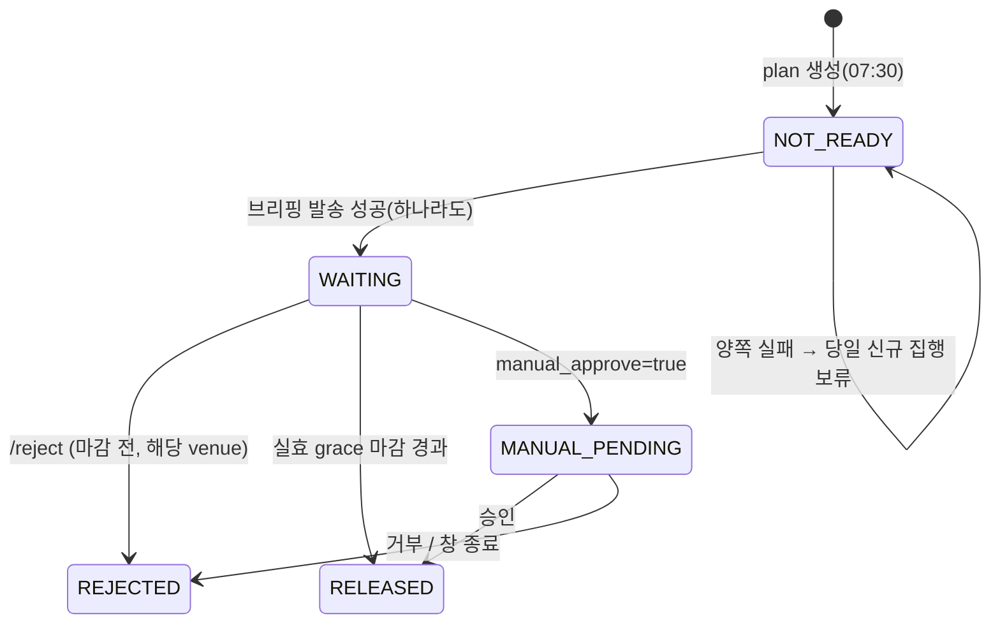
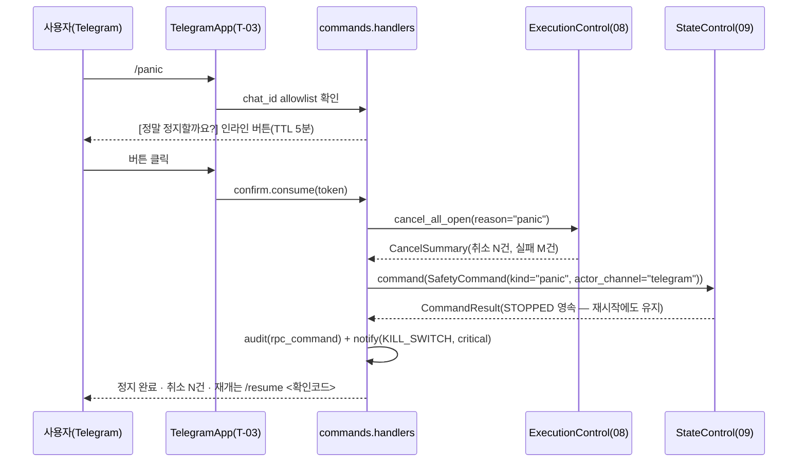

# 13. 웹 · Telegram

> **범위**: `web/`(FastAPI 임베디드 라우터·Jinja2+htmx 화면·Chart.js·실시간 UI 격리·노출 통제)와 `rpc/`(RPCManager 멀티채널·Telegram 명령 카탈로그·브리핑·승인/grace/거부권 흐름·알림 등급 라우팅·SMTP).
> **계획 정본**: 01 §1.2(웹)·§3.4(RPCManager)·§6.2(시크릿 알림 사다리)·§6.4(모니터링·채널 이중화)·§7(보안 1·2·5) / 03 §5.3(부재 모드·grace 클램프)·§5.3.2(승인 타임아웃)·§2.6(kill switch·확인코드)·§6.1(정기 점검)·§7.1(대시보드)·§7.2(알림 등급) / 00 §3(등급표 A1·A2·A3·A5) / 06 §4(UI 격리)·§9.3(감시 오버라이드 명령) / 02 §4.1(브리핑·grace·집행 창) / 07 §8(72h 거부권·카나리).
> **선행 문서**: [01-system-architecture.md](01-system-architecture.md)(태스크 T-02·T-03, 조립, import 계약), [02-domain-model.md](02-domain-model.md)(상태 enum·식별자·예외), [03-data-and-persistence.md](03-data-and-persistence.md)(`approval_requests`·`canary_state`·`presence`·`run_ledger`·감사로그 스키마), [08-execution.md](08-execution.md)(`ctx.approval.state` 소비 지점).
> **이 문서가 소유하는 정의**: 웹 화면, Telegram 명령 카탈로그, 알림 라우팅. 여기에 더해 `rpc/ports.py`(rpc가 필요로 하는 포트 Protocol), `ApprovalService`(grace·거부권·A3 큐의 판정 API), 브리핑 조립, 당일 확인코드 규격.

---

## 1. 개요 — 설계 대상과 책임

이 문서가 설계하는 두 패키지는 **시스템의 유일한 사람 인터페이스**다. 그래서 두 가지 상반된 요구를 동시에 만족해야 한다.

1. **사람이 결정해야 하는 순간에는 반드시 도달할 것** — 브리핑 발송 성공이 당일 자동 집행의 전제이고(정본: 03 §3), critical 미도달은 79~99만원짜리 손실 경로를 침묵시킨다(정본: 00 §2.2-④).
2. **그 밖의 순간에는 사람을 부르지 않을 것** — 실시간 UI와 알림은 거래를 **인과적으로** 늘린다(정본: 06 §4, 03 §7.1·§8). 이 시스템에서 가장 과소평가된 위험은 시장이 아니라 사용자의 과매매다.

따라서 이 문서의 설계 기조는 **"채널은 이중화, 주목은 최소화"**다. 발송 경로는 둘(Telegram·SMTP)이고 실패에 견디지만, 등급은 03 §7.2 표에 못박혀 있고 기본 화면은 느리게 갱신되며 "지금 매매" 버튼은 존재하지 않는다.

### 1.1 책임 경계

| 이 문서가 소유 | 소유하지 않음(참조만) |
|---|---|
| `RPCManager`·채널 4종·등급 라우팅·중복 억제·묶음 | 등급 **값**의 정본 표 (03 §7.2), 브레이커 발동 조건 (03 §1.2) |
| Telegram 명령 카탈로그·권한·확인 흐름·파서 | 명령이 유발하는 **상태 전이의 정의**([09-safety-protections.md](09-safety-protections.md), 정본: 03 §2.1) |
| 브리핑 조립·부재 등급별 발송 모드 | 브리핑 **잡의 스케줄·시간 예산**([12-scheduling-and-operations.md](12-scheduling-and-operations.md), 정본: 01 §4.2) |
| `ApprovalService` — plan gate·A3 큐·72h 거부권 판정 | `approval_requests`·`canary_state` **DDL**([03](03-data-and-persistence.md) §3.3.9·§3.3.10), 타임아웃 **값**(03 §5.3.2) |
| 대시보드 화면·라우팅·htmx 규약·차트 | `/healthz` **내용**([12](12-scheduling-and-operations.md)), 세금 패널의 **수치 산출**([10-tax-engine.md](10-tax-engine.md)) |
| 실시간 UI 격리의 구현·강제 | 가드 판정·`GuardOutput`([11-realtime-and-surveillance.md](11-realtime-and-surveillance.md)) |

### 1.2 이 문서가 답해야 하는 다섯 질문

1. 브리핑 발송 성공·실패가 **어디에 남아** 집행 게이트와 `SAFE_MODE` 사다리의 입력이 되는가 (§3.5).
2. venue별 실효 grace 마감을 **누가 언제 계산**하고 `/reject`가 마감을 넘겼을 때 무엇이 일어나는가 (§5.2).
3. 72h 거부권·A3 승인이 **재시작을 견디는가** (§5.3~§5.4).
4. Telegram 명령이 **어느 마찰을 통과해야** 상태를 바꾸는가 (§6.2~§6.4).
5. 웹이 **주문 경로에 닿을 수 없음**을 무엇이 보장하는가 (§2.4, §9.4).

---

## 2. 모듈 구조와 의존 방향

### 2.1 트리

```
src/omra/rpc/
├── manager.py            # RPCManager — 브로드캐스트·등급 라우팅·집행 전제 기록 (§3.2)
├── message.py            # Notification·NotificationKind·AlertGrade·DedupKey·Rendered (§3.1)
├── registry.py           # kind → grade·채널·묶음 정책 레지스트리 (§3.3, CI 완전성 게이트)
├── ports.py              # ★ rpc가 필요로 하는 포트 Protocol 전부 (§2.2)
├── channels/
│   ├── base.py           #   RPCChannel ABC — send()만 존재
│   ├── telegram.py       #   TelegramChannel(발송) + TelegramApp(폴링 수신)
│   ├── smtp.py           #   SmtpChannel — 발송 전용. 수신 코드 없음 (정본: 01 §1.5·§7-5)
│   ├── webhook.py        #   WebhookChannel — dead-man's switch ping·최후 통지 (01 §3.4 채널 C).
│   │                     #     [12](12-scheduling-and-operations.md) §13.3이 `rpc/webhook.py`로
│   │                     #     인용하는 모듈이며 **발동 판정은 12 §15 소유**(전송만 여기)
│   └── logch.py          #   LogChannel — 항상 on
├── commands/
│   ├── catalog.py        #   CommandSpec 카탈로그 (§6.1) — Telegram·웹 공용
│   ├── auth.py           #   chat_id allowlist·확인코드 검증·시도 제한 (§6.2)
│   ├── confirm.py        #   인라인 2단계 확인 토큰 (§6.4)
│   ├── parser.py         #   인자 파서·오류 응답 (§6.5)
│   └── handlers/         #   명령별 핸들러 — 포트만 호출한다
├── approvals.py          # ApprovalService — plan gate·A3 큐·72h 거부권 (§5)
├── briefing.py           # 일일 브리핑 조립 (§4)
└── confirmcode.py        # 당일 확인코드 생성·검증 (§6.3)

src/omra/web/
├── app.py                # create_app(ports) → FastAPI (라우터 등록만, lifespan 없음)
├── server.py             # uvicorn Server 임베드 — T-02 태스크 팩토리 (§7.1)
├── security.py           # argon2 로그인·세션 쿠키·CSRF (§7.3)
├── deps.py               # 인증·ro 읽기 헬퍼(run_ro)·시간 예산 의존성 (§7.5)
├── routers/
│   ├── health.py         #   /healthz — 인증 면제 (내용 정본: 12)
│   ├── auth.py           #   /login · /logout
│   ├── pages.py          #   화면 9종 (§8.1)
│   ├── fragments.py      #   htmx 조각 (§8.2)
│   ├── charts.py         #   Chart.js 데이터 JSON (§8.3)
│   ├── actions.py        #   상태 변경 — rpc.commands.handlers 재사용 (§8.4)
│   └── realtime.py       #   ★ 격리 탭 전용 라우터 (§9.2)
├── templates/            # Jinja2 — base/nav/pages/fragments
└── static/               # htmx.min.js · chart.min.js 번들 동봉 (CDN 금지 — 01 §1.2)
```

### 2.2 포트 — rpc는 다른 패키지를 런타임 import 하지 않는다

`rpc`가 명령을 처리하려면 상태 전이·주문 취소·감시 오버라이드가 필요한데, 그 구현들은 `rpc`를 **알림 경로로 되부른다**. 양방향 모듈 import는 순환이 되고, 조립층(`omra.runtime`)은 `rpc`가 import할 수 없다(계약 C11 — [01](01-system-architecture.md) §8.2). 그래서 **필요한 능력을 `rpc/ports.py`의 Protocol로 선언하고 구현체는 조립 시 주입**한다.

```python
# src/omra/rpc/ports.py — 13 소유. 구현체는 각 소유 문서, 주입은 runtime(01 §3.2).
from typing import Protocol, runtime_checkable

class StateControl(Protocol):                                   # 구현: 09 `SafetyFacade` ([09](09-safety-protections.md) §2.2)
    def state(self) -> StateView: ...                           # 3평면 스냅샷 + safe_mode_reasons (09 §7.3)
    def command(self, cmd: SafetyCommand) -> CommandResult: ...  # 상태 명령의 **단일** 진입점 (09 §10.3)
    #  ★ request_safe_mode()는 12·01이 부르는 API다 — 13은 부르지 않는다(채널 실패 판정은 09, §3.5)
    def effective_grace_deadline(self, venue: Venue, brief_at: datetime) -> datetime: ...  # 09 §11.3 (§5.2)
    def report_notify_result(self, run_date: date, any_success: bool) -> None: ...     # 09 §12.3 (§3.5)

class ExecutionControl(Protocol):                               # 구현: 08
    async def cancel_all_open(self, *, reason: str) -> CancelSummary: ...                # /panic
    def open_orders_view(self) -> Sequence[OpenOrderView]: ...

class SurveillanceOverride(Protocol):                           # 구현: 11 (정본: 06 §9.3)
    def show(self, ticker: str) -> FlagView: ...
    def raise_level(self, ticker: str, level: SurveillanceLevel, reason: str, *, actor: str) -> OverrideResult: ...
    def clear(self, instrument_key: str, *, actor: str, ttl_days: int) -> OverrideResult: ...
    def override(self, ticker: str, level: SurveillanceLevel, until: date, *, actor: str) -> OverrideResult: ...

class PresencePort(Protocol):                                   # 구현: 09 (정본: 03 §5.3.1)
    def touch(self, source: PresenceSource, at: datetime) -> None: ...
    def declare_away(self, until: date | None, at: datetime) -> AwayAck: ...  # 겹치는 만료·기한 점검 포함
    def state(self) -> PresenceState: ...
    # 등급별 grace의 venue 클램프 계산은 여기가 아니라 StateControl.effective_grace_deadline(09 §11.3)이다

class CanaryControl(Protocol):                                  # 구현: 14 (정본: 07 §8·§10)
    def active(self) -> Sequence[CanaryView]: ...
    def revert(self, change_id: str, *, actor: str) -> RevertResult: ...      # α=0, 예산 환급 없음

class PortfolioQuery(Protocol): ...                             # 구현: 07/08 portfolio — NAV·보유·드리프트
class HealthPort(Protocol):                                     # 구현: 12
    def collect(self) -> HealthReport: ...                      # `/healthz` 본문 (12 §11.2 소유 — §7.2)

class NotifyWatchPort(Protocol):                                # 구현: 12 (12 §15 `monitoring/notify_watch.py`)
    async def record_dispatch(self, day: date, *, telegram: bool, smtp: bool) -> None: ...

class TaxQuery(Protocol): ...                                   # 구현: 10 — 공제·임계·ISA 소진률(unknown 포함)
class ReloadRequest(Protocol):                                  # 구현: 01 runtime
    def request_reload(self, *, actor: str) -> None: ...        # RELOAD_CONFIG 이벤트 게시

class Notifier(Protocol):                                       # rpc가 **제공**하는 포트
    async def notify(self, n: Notification) -> DeliveryResult: ...
```

- `SafetyCommand`(kind 9종·`scope`·`code`·`actor_channel`·`arg`)·`CommandResult`·`StateView`의 **타입 정본은 [09](09-safety-protections.md) §10.3·§7.3·§2.2 [DD-09-21]**이고, `HealthReport`는 [12](12-scheduling-and-operations.md) §11.1이다. 13은 이들을 `TYPE_CHECKING` 블록에서만 import한다([DD-13-1]-③).

> **[DD-13-1] 명령 코어 단일화 + 포트 주입**
> - 결정: ① 명령의 의미(권한·확인·부작용)는 `rpc/commands/`에 **한 벌만** 구현하고, 웹의 상태 변경 엔드포인트(`web/routers/actions.py`)는 같은 핸들러를 호출한다. ② `rpc`는 `core`·`config`·`persistence.ro`·`persistence.repos.approvals`·`persistence.repos.notifications`([03](03-data-and-persistence.md) §3.3.17 — [DD-13-5])·`audit` 외의 1차 패키지를 **런타임 import 하지 않고** `rpc/ports.py`의 Protocol로만 대화한다. ③ 다른 패키지가 알림을 보낼 때는 `Notifier` Protocol을 주입받으며, 타입 참조가 필요하면 `TYPE_CHECKING` 블록에서만 import한다.
> - 근거: 03 §2.6이 "대시보드 빨간 버튼 = `/panic`과 동일 동작 + 확인 다이얼로그"를 요구한다. 두 벌로 구현하면 한쪽만 갱신되는 순간 웹과 Telegram의 정지 의미가 갈린다(마스킹 필터를 한 벌로 강제하는 01 §6.3과 같은 논리). 포트 주입은 C11(`rpc -/-> runtime`)과 순환 import를 동시에 피하는 유일한 배치다.
> - 계획 문서와의 관계: 충돌 없음 — 계획 01 §2.2 계약이 `rpc`에 부과한 금지줄은 없고(관측 4레이어만 봉인), 이 결정과 [DD-13-2]가 그 여백을 **더 좁게** 채운다(설계 계약 C13 `rpc -/-> web`으로 등재 — [01](01-system-architecture.md) §8.2).

### 2.3 계약의 귀결 — 관측 4레이어는 스스로 알림을 보낼 수 없다

01 §2.2 계약은 `research`·`surveillance`·`realtime`·`labs`의 `omra.rpc` import를 금지한다(계약 C04a·C05a·C06a·C07a — [01](01-system-architecture.md) §8.2). 따라서 **감시 등급 진입 알림·가드 판정 알림·실험 알림은 그 레이어가 발송하지 않는다.** 발송 주체는 그 레이어의 **소비자**다.

| 알림 | 계층은 무엇을 하는가 | 발송 주체 |
|---|---|---|
| `SV2`/`SV3` 진입·해소 (info, 정본: 03 §7.2) | `surveillance`가 `surveillance_flags` 전이만 기록 | 감시 폴 잡([12](12-scheduling-and-operations.md))이 전이 diff를 읽어 `Notifier.notify` |
| `Verdict != PROCEED` (silent, 정본: 03 §7.2) | `realtime`이 `GuardOutput` 반환 | `execution`이 감사로그 기록 후 silent 알림 |
| 롤백 발동 (critical ②) | `labs`가 α=0 전이 | 자가 개선 잡([12](12-scheduling-and-operations.md)) |

이 배치는 우연이 아니라 원칙 9(관측 계층은 결정을 만들 수 없다)의 알림 축 적용이다 — **알림은 사람을 움직이는 행위**이므로 관측 레이어가 직접 쥐면 일방향 밸브에 구멍이 생긴다.

### 2.4 자기부과 계약 2줄 — 웹은 주문 경로에 닿지 않는다

> **[DD-13-2] `web`·`rpc`에 대한 자기부과 import 금지 2줄**
> - 결정: 아래 두 계약을 [01](01-system-architecture.md) §8.2 계약 파일에 추가 등록한다 — **등재 완료: C12·C13**([01](01-system-architecture.md) §8.2 [DD-01-15]).
>   - `omra.web` → `omra.execution` · `omra.brokers` · `omra.engine` · `omra.tax` · `omra.protections` **금지** (웹의 유일한 쓰기 경로는 `omra.rpc.commands`)
>   - `omra.rpc` → `omra.web` **금지** (역방향 단방향 고정)
> - 근거: 03 §7.1의 하드 규칙 "'지금 매매' 버튼을 만들지 않는다"는 **코드 리뷰가 아니라 타입·간선이 막아야** 유지된다(01 §3.6이 `ESC_LIQUIDATE`를 등급 enum 밖에 둔 것과 같은 논리). 웹이 `execution`을 import할 수 없으면 주문 생성 코드를 화면 핸들러에 쓰는 것이 물리적으로 불가능하다. 웹이 필요한 것은 전부 읽기(`persistence.ro`)이거나 명령(`rpc.commands`)이다.
> - 계획 문서와의 관계: 충돌 없음. 01 §2.2는 열거되지 않은 간선을 허용(default-allow)하므로 **추가 금지줄은 계약 원문과 모순되지 않고 강화**한다. 등록 위치는 01 소유이며 **C12(`web` → `execution`·`brokers`·`engine`·`tax`·`protections`)·C13(`rpc` → `web`)으로 등재가 완료**되었다([01](01-system-architecture.md) §8.2 [DD-01-15]) — 따라서 §9.1의 강제 수단 "import-linter"는 사실 표기이며, 간선을 넓히려면 계약이 아니라 이 DD를 먼저 고친다.

### 2.5 검증 항목

- `omra.rpc`의 런타임 import 그래프에 `execution`·`brokers`·`engine`·`runtime`이 없다(모듈 import 후 `sys.modules` 검사).
- `web`에서 `omra.execution` import 커밋 → `lint-imports` 실패 실증(계약 **C12** — [01](01-system-architecture.md) §8.2·§9 실차단 실증 목록, [16](16-testing-and-quality.md) AT-7 계열). `rpc`에서 `omra.web` import는 **C13**으로 동일하게 실패한다.
- 웹 액션 라우트 집합 == `rpc.commands.catalog`의 `web_exposed=True` 집합(레지스트리 대조 테스트).

---

## 3. `rpc` — RPCManager 멀티채널

### 3.1 타입

```python
# src/omra/rpc/message.py
class AlertGrade(StrEnum):                  # 값·의미의 정본: 03 §7.2 (알림 등급)
                                            # ★ 브레이커 해제 등급 `BreakerGrade`(A/B/B*/C — [09] §3.1,
                                            #   정본 03 §1.1)와 **다른 개념**이다 ([DD-13-20])
    CRITICAL = "critical"                   # 즉시, 소리 O, Telegram + SMTP 양쪽
    INFO     = "info"                       # 1일 수 건 이내 묶음, 동일 종목·사유 재알림 금지
    SILENT   = "silent"                     # 로그·대시보드만 (발송 없음)

class ChannelMode(StrEnum):                 # 정본: 01 §3.4
    ON = "on"                               # 발송 + 주목(소리·푸시)
    MUTED = "muted"                         # 발송하되 무음 (Telegram disable_notification, SMTP 정상)
    OFF = "off"                             # 미발송

class NotificationKind(StrEnum):
    """알림의 원인 식별자. 등급 매핑은 registry.py가 소유하며 CI가 완전성을 강제한다(§3.3)."""
    HALT_GRADE_A = "halt_grade_a"                 # critical ① (03 §7.2)
    ROLLBACK_FIRED = "rollback_fired"             # critical ②
    SECRET_EXPIRY = "secret_expiry"               # critical ③ (D-30 이하 매일 — 01 §6.2)
    FROZEN_NAV_BREACH = "frozen_nav_breach"       # critical ④ P13
    EVENT_BURST = "event_burst"                   # critical ④ P15
    KILL_SWITCH = "kill_switch"                   # critical ⑤
    CRASH_LOOP = "crash_loop"                     # critical ⑥ (01 §6.4)
    BATCH_FAIL_3D = "batch_fail_3d"               # critical ⑦
    WATERFALL_GAP = "waterfall_gap"               # critical ⑧ (11/1, D-12/D-5/D-1)
    TAX_DEADLINE = "tax_deadline"                 # critical ⑨ (4/1, 5/1)
    DEADLINE_EVENT_D3 = "deadline_event_d3"       # critical ⑩ P14
    ORDER_TR_STREAK = "order_tr_streak"           # P9-order 발동 (03 §1.2 "+ critical")
    DAILY_BRIEF = "daily_brief"                   # info
    REBALANCE_SUMMARY = "rebalance_summary"       # info
    SAFE_MODE_TRANSITION = "safe_mode_transition" # info (진입·해제)
    HALT_OR_PAUSE_ENTERED = "halt_or_pause_entered"  # info — 등급 B* HALT(P1b·P13 40%·순매수
                                                     #   상한 초과)와 전역 PAUSED(P12) 진입.
                                                     #   03 §7.2 표에 등급이 없다(§13-1 이견)
    SURVEILLANCE_ENTRY = "surveillance_entry"     # info (진입 1회만)
    VENUE_ABORT = "venue_abort"                   # info (시장 단위 ABORT)
    HARVEST_PROPOSAL = "harvest_proposal"         # info
    SIZE_UP_GATE = "size_up_gate"                 # info (증액 게이트 도달)
    POLICY_AUTO_APPLIED = "policy_auto_applied"   # info (A1 — 72h 거부권 안내 포함)
    APPROVAL_REQUEST = "approval_request"         # A3 요청 — 등급은 대상별(§5.4)
    APPROVAL_REMINDER = "approval_reminder"
    GUARD_VERDICT = "guard_verdict"               # silent (alerts.guard_verdict_default)
    INSTRUMENT_ABORT = "instrument_abort"         # silent
    VI_EVENT = "vi_event"                         # silent
    SYMBOL_SKIP = "symbol_skip"                   # silent (P5·P6)
    ORDER_EVENT = "order_event"                   # silent (접수·체결)
    CYCLE_OK = "cycle_ok"                         # silent (사이클 정상 완료·배치 성공)
    CHANNEL_DEGRADED = "channel_degraded"         # warning 계열 → info

@dataclass(frozen=True)
class DedupKey:
    kind: NotificationKind
    subject: str            # instrument_key | sleeve_id | change_id | secret_name | "*" (전역)
    reason: str             # 사유 코드 — "동일 종목·동일 사유 재알림 금지"(03 §7.2)의 축
    # 영속 매핑(03 §3.3.17): subject_key = subject, reason_key = f"{kind}:{reason}"  ([DD-13-5])

@dataclass(frozen=True)
class Notification:
    kind: NotificationKind
    dedup: DedupKey
    title: str                                  # 1줄 요약 (SMTP 제목·Telegram 첫 줄)
    body: str                                   # Markdown 원문 (채널이 각자 이스케이프)
    at_kst: datetime
    correlation: dict[str, str | None]          # 감사로그 correlation과 동일 키 (03 §7.1)
    actions: tuple[InlineAction, ...] = ()      # 인라인 버튼(확인·승인·거부) — Telegram 전용
    grade_override: AlertGrade | None = None    # 대상별 등급이 있는 kind에만 (§5.4)

@dataclass(frozen=True)
class InlineAction:
    label: str
    token: str                                  # confirm.py가 발급 (§6.4)
    kind: Literal["ack", "approve", "deny", "revert", "reject"]

@dataclass(frozen=True)
class DeliveryResult:
    sent: frozenset[str]                        # 성공 채널 이름
    failed: dict[str, str]                      # 채널 → 오류 요약
    suppressed: bool                            # 중복 억제로 발송하지 않음
    @property
    def any_sent(self) -> bool: return bool(self.sent - {"log"})
```

> **[DD-13-20] 알림 등급 타입명 = `AlertGrade` (브레이커 등급 `BreakerGrade`와의 이름 충돌 제거)**
> - 결정: 03 §7.2 알림 등급(`critical`/`info`/`silent`)의 타입명을 `AlertGrade`로 확정한다. 03 §1.1 브레이커 해제 등급(A/B/B\*/C)은 [09](09-safety-protections.md) §3.1의 `BreakerGrade`이며 **두 이름은 어느 모듈에서도 겹치지 않는다.**
> - 근거: 두 개념은 값 집합이 서로소인데 계획이 둘 다 "등급"으로 부른다. 09가 알림을 발신하는 경로(09 §12.3 라우팅, `ProtectionResult`의 등급을 알림 payload에 싣는 지점)에서 두 타입이 한 모듈에 함께 등장하므로 같은 식별자 `Grade`를 쓰면 import 별칭으로만 구분되고, 그 별칭이 한 번 어긋나면 "등급 A HALT"가 `critical`로 매핑되지 않는 침묵 실패가 된다.
> - 계획 문서와의 관계: 충돌 없음 — 계획은 두 개념에 식별자를 지정한 적이 없다. 값·의미는 03 §7.2·§1.1 그대로다.

### 3.2 `RPCManager` — 브로드캐스트

```python
# src/omra/rpc/manager.py
class RPCManager:
    def __init__(self, channels: Sequence[RPCChannel], registry: KindRegistry,
                 clock: Clock, audit: AuditLogger, cfg: AlertsConfig) -> None: ...

    async def notify(self, n: Notification) -> DeliveryResult:
        """유일한 발송 진입점. 예외를 절대 전파하지 않는다 — 알림 실패가 호출자(집행·배치)를
        중단시키면 알림이 운용을 죽인다(03 §3의 완화 취지)."""

    def channel_mode(self, channel: str, grade: AlertGrade) -> ChannelMode: ...
    async def flush_bundle(self, trigger: Literal["brief", "cap", "eod"]) -> DeliveryResult: ...
    def delivery_snapshot(self, day: date) -> DayDelivery: ...     # 대시보드·집행 전제 조회
```

발송 의사코드:

```
notify(n):
 1. grade = n.grade_override or registry.grade_of(n.kind)          # 미등록이면 SILENT + warning (§3.3)
 2. audit.write(kind→event_type 매핑, payload=n)                   # 등급과 무관하게 항상 기록 (03 §7.2 주석)
 3. if grade is SILENT:            return DeliveryResult(sent={"log"}, …)   # 대시보드·로그만
 4. last = repos_ro.notification_suppression(n.dedup)               # (subject_key, reason_key) — [DD-13-5]
    if registry.is_dedup_suppressed(policy, last, now):                     # 창 판정은 KindPolicy
        return DeliveryResult(suppressed=True, sent={"log"}, …)
 5. if grade is INFO and not registry.is_immediate(n.kind) and bundle_room_left():
        bundle.append(n);          return DeliveryResult(sent={"log"}, …)   # 다음 브리핑에 병합
 6. targets = [ch for ch in channels if mode(ch, grade) is not OFF]
        critical → alerts.critical_channels = [telegram, smtp] 를 **양쪽 모두** 시도 (03 부록 A)
        info     → telegram + smtp (부재 감축일에는 telegram=MUTED — §4.3)
 7. results = await gather(ch.send(n, mode) for ch in targets)     # 각 채널 내부에서 tenacity 3회
 8. per-channel 연속 실패 카운터 갱신 → 3연속이면 CHANNEL_DEGRADED info + 해당 채널 강등 (01 §6.2)
 9. if not result.any_sent:  webhook(채널 C)로 최후 통지 시도 + failure_ledger 기록 (§3.5)
10. repos.notifications.mark_sent(n.dedup, now, any_sent=result.any_sent)   # 03 §3.3.17, [DD-13-5]-⑤
11. if kind is DAILY_BRIEF or grade is CRITICAL:                   # 발송 결과 보고 계약 (§3.5)
        await notify_watch.record_dispatch(day, telegram=…, smtp=…)   # 12 §15 — 발송마다
    if kind is DAILY_BRIEF:
        state.report_notify_result(day, any_success=result.any_sent)  # 09 §12.3 — 하루 1회
12. return result
```

**불변식 3개**

1. `notify()`는 예외를 던지지 않는다(모든 채널 실패도 정상 반환값이다).
2. 감사로그 기록은 발송 성공 여부와 **독립**이다(정본: 03 §7.2 "알림 등급과 기록 여부는 별개 축").
3. `silent`는 발송 0건이지만 대시보드·로그에는 **반드시** 남는다 — 브리핑의 "가드 개입 N건" 집계 입력이기 때문이다.

### 3.3 등급 레지스트리 — 표의 기계화

```python
# src/omra/rpc/registry.py
@dataclass(frozen=True)
class KindPolicy:
    grade: AlertGrade
    immediate: bool                 # INFO 중 즉시 발송 대상인가 (§3.4)
    dedup_window: timedelta | None  # None = 억제 없음(설계상 반복이 의도된 것)
    source: str                     # "03 §7.2 critical ⑧" 같은 정본 출처 — 리뷰 추적용

CRITICAL_KINDS: Final[frozenset[NotificationKind]] = frozenset({...})   # 03 §7.2 ①~⑩ + P9-order
```

> **[DD-13-3] 등급 레지스트리 완전성 게이트**
> - 결정: ① 모든 `NotificationKind`는 `registry.py`에 `KindPolicy`를 가져야 하며, 누락은 **CI 실패**다. ② 런타임 폴백은 `SILENT`이며 warning 로그를 남긴다. ③ `CRITICAL_KINDS` 집합은 03 §7.2 ①~⑩ + 03 §1.2가 명시한 P9-order 발동으로 **고정**하고, 이 집합을 바꾸는 커밋은 03 §7.2 인용 주석 갱신을 요구한다(스냅샷 테스트).
> - 근거: 04 §2 M4가 "등급 미정의는 알림 무시 습관화 리스크를 직접 실현시킨다"고 했고 03 §7.2는 "critical 오발송은 버그"라고 못박았다. 두 요구를 동시에 만족하는 유일한 조합이 **컴파일 타임 완전성 + 런타임 보수적 폴백**이다(폴백이 critical이면 오발송, 예외면 알림이 운용을 죽인다).
> - 계획 문서와의 관계: 충돌 없음 — 03 §7.2 표를 코드로 옮기고 이탈을 CI가 막는다.

### 3.4 중복 억제와 묶음

> **[DD-13-4] `info` 발송 정책 — 즉시/묶음 2분류**
> - 결정: `info` 중 **브리핑 본체**(`DAILY_BRIEF`)와 **상태 진입 계열**(`SAFE_MODE_TRANSITION`·`SURVEILLANCE_ENTRY`·`VENUE_ABORT`·`APPROVAL_REQUEST`·`POLICY_AUTO_APPLIED`)은 즉시 발송하고, 나머지 info는 `bundle`에 적재해 **다음 브리핑에 병합**한다. 즉시 발송은 하루 `alerts.info_immediate_max_per_day`(기본 5)로 제한하고 초과분은 자동으로 묶음행으로 전환한다. **`DAILY_BRIEF`는 이 상한의 적용 대상이 아니다** — 묶음으로 전환되면 브리핑 자체가 사라진다.
> - 근거: 03 §7.2 info 정책이 "1일 수 건 이내 묶음"이고, 동시에 "SAFE_MODE 진입·해제"와 "감시 등급 진입"은 그날의 운용 성격을 바꾸는 사건이라 다음 아침까지 미룰 수 없다. 상한은 "수 건"의 기계적 해석이다. `DAILY_BRIEF`가 즉시·무상한인 이유는 03 §5.3.1이 "브리핑은 어떤 부재 등급에서도 no-send가 되지 않는다"고 못박았고, 브리핑 발송 성공이 당일 집행 전제(03 §3)이기 때문이다.
> - 계획 문서와의 관계: 여백 채움. 키 등재는 [04-configuration-and-secrets.md](04-configuration-and-secrets.md)(`alerts.*`의 이름 정본은 03 부록 A).

> **[DD-13-5] 중복 억제 키의 어휘와 영속 — `notification_suppression`(03 §3.3.17)**
> - 결정: ① 억제 키는 `DedupKey(kind, subject, reason)`이고 창은 `KindPolicy.dedup_window`(기본 24h, `SECRET_EXPIRY`는 `None` = 억제 없음 — D-30부터 **매일**이 정본). ② 억제 상태는 **`notification_suppression`에 영속**한다(DDL 정본: [03](03-data-and-persistence.md) §3.3.17 [DD-03-31], 쓰기 repo `persistence.repos.notifications`) — 재시작이 억제를 풀지 않는다. ③ 03 §11-23이 13에 위임한 **`reason_key` 어휘**를 여기서 확정한다: `subject_key = DedupKey.subject`(`instrument_key` | `sleeve_id` | `change_id` | `secret_name` | `"*"`(전역)), `reason_key = f"{kind}:{reason}"`(`kind` = `NotificationKind` 값, `reason` = 사유 코드 — `risk_type`·`breaker_id`·승인 `kind` 등). ④ 억제 **판정**(창 길이·예외)은 `registry.py`의 `KindPolicy`가 소유하고 테이블은 상태만 보관한다. ⑤ 쓰기는 발송 성공·실패와 무관하게 발송 **시도** 시점에 upsert하며(`send_count += 1`), 실패한 발송이 억제 창을 열어 재시도를 막지 않도록 `any_sent=False`인 결과는 `last_sent_date`를 갱신하지 않는다.
> - 근거: 03 §7.2 "동일 종목·동일 사유의 재알림 금지"의 주 위험은 폴 루프의 반복 발송이고, 재시작이 잦은 날 메모리 창만으로는 그 규정이 무너진다(03 [DD-03-31]의 신설 근거). 03이 이미 테이블을 만들고 억제 **정책의 소유**를 13으로 지정했으므로, 13이 메모리 전용을 고수하면 지정된 쓰기 주체가 없는 테이블이 남는다.
> - 계획 문서와의 관계: 충돌 없음 — 반복 발송 금지 규정의 구현이며 `SECRET_EXPIRY`의 예외는 01 §6.2·03 §7.2 ③을 그대로 따른다. **시크릿 만료 사다리(D-45/30/14/7/3/1)의 발송 멱등은 이 테이블이 아니라 [04](04-configuration-and-secrets.md) §8.2 [DD-04-13]의 `run_ledger(venue='SYS', task_name='secret_expiry_alert:<secret_name>:<days_before>')` 행이 소유한다** — 억제(같은 사유의 반복 억제)와 멱등(사다리 단계별 1회 보장)은 다른 메커니즘이며, 13의 `SECRET_EXPIRY` 정책이 `dedup_window=None`인 이유가 바로 그것이다(억제로는 "매일 발송 + 단계별 1회"를 동시에 표현할 수 없다).

### 3.5 발송 실패 사다리와 집행 전제 기록

집행 전제(정본: 03 §3, 01 §6.4)는 세 문장이다 — ① Telegram·SMTP 중 **하나라도** 성공하면 집행 계속 ② 양쪽 모두 실패하면 당일 신규 자동 집행 보류 ③ 양쪽 실패가 **2영업일 연속**이면 `SAFE_MODE` 전이 + 채널 C로만 통지.

> **[DD-13-6] 발송 결과의 영속 기록은 `run_ledger`의 브리핑 행이다 — 새 테이블 없음**
> - 결정: `morning_brief` 잡은 `run_ledger(run_date, venue='KRX', task_name='morning_brief')` 행(키 규약·venue 값의 정본은 [12](12-scheduling-and-operations.md) §4.1 잡 표)의 `status`를 **하나라도 발송 성공이면 `done`, 양쪽 실패면 `failed`**로 기록하고, `note`에 `{"telegram": "ok|err:…", "smtp": "…", "grade_counts": {...}}` JSON을 넣는다. `ApprovalService`와 `SAFE_MODE` 사다리는 이 행을 읽는다.
> - 근거: 01 §1.4가 run ledger를 "오늘 해야 했는데 안 한 일"의 판정 근거로 두었고, 브리핑 발송은 정확히 그 형태의 사실이다. 별도 테이블을 만들면 03 DDL을 늘리면서 같은 정보를 두 곳에 둔다. `note`가 TEXT이므로 채널별 상세도 손실 없이 들어간다.
> - 계획 문서와의 관계: 충돌 없음. `run_ledger` DDL은 [03](03-data-and-persistence.md) §3.2 소유이며 이 결정은 컬럼을 바꾸지 않는다.

```
채널 실패 처리 (채널별 독립 카운터)
  전송 시도 → tenacity 3회(지수 백오프) → 실패
  consecutive_fail[ch] += 1
    == 3  → CHANNEL_DEGRADED(info) + 해당 채널 강등(Telegram이면 SMTP 단독 운용) (01 §6.2)
    성공 1회 → 카운터 0으로 리셋
양쪽(A·B) 동시 실패
  당일: webhook(채널 C) 최후 통지 + run_ledger.status='failed'
  2영업일 연속(alerts.both_channels_fail_safe_mode_days=2, 03 부록 A):
       ★ streak 계상·SAFE_MODE 전이 판정은 09 §12.3 `report_notify_result`가 소유하고,
         13은 매일 브리핑 발송 직후 (run_date, any_success) 한 쌍만 보고한다.
         관측·2영업일 판정의 모니터링 축은 12 §15 `record_dispatch`/`evaluate`.
         13이 스스로 request_safe_mode()를 부르지 않는다 — 같은 판정이 두 곳에 생긴다.
```

**발송 결과 보고 계약**(요청 출처: [12](12-scheduling-and-operations.md) §15·[09](09-safety-protections.md) §12.3)

| 호출 | 시점 | 인자 | 소유 |
|---|---|---|---|
| `NotifyWatchPort.record_dispatch(day, telegram=, smtp=)` | **브리핑·critical 발송 직후 매번** | 채널별 성공 불린 | 12 §15(`SYS/notify_dispatch` 행) |
| `StateControl.report_notify_result(run_date, any_success)` | **브리핑 발송 직후 하루 1회** | `any_success` = Telegram·SMTP 중 하나라도 성공 | 09 §12.3(`FS-notify.skip_streak`) |

- **`muted` 발송은 성공이다** — 두 호출 모두 `MUTED` 모드의 성공을 `True`로 보고한다(09 §11.3·§12.3의 오발동 방지 계약, §4.3).

**"읽지 않음"은 집행을 막지 않는다**(정본: 01 §6.4). 읽음 여부는 `presence.last_seen_at`을 통해 **부재 사다리**로만 흐른다 — 두 축을 섞으면 negative-option 설계가 무너진다.

### 3.6 채널 구현

```python
# src/omra/rpc/channels/base.py
class RPCChannel(ABC):
    name: ClassVar[str]
    @abstractmethod
    async def send(self, n: Notification, mode: ChannelMode) -> None:
        """성공이면 정상 반환, 실패면 예외. 재시도(tenacity 3회)는 구현 내부.
        ★ 수신 메서드는 이 ABC에 존재하지 않는다 — 채널은 '발송'의 추상이다(01 §7-5)."""

# src/omra/rpc/channels/telegram.py — 발송과 수신은 같은 Application을 공유하되 타입이 다르다
class TelegramChannel(RPCChannel):
    name = "telegram"
    def __init__(self, app: Application, chat_id: int, cfg: TelegramConfig) -> None: ...
    async def send(self, n: Notification, mode: ChannelMode) -> None:
        text = render_markdown_v2(n)                       # 이스케이프는 채널 책임
        for i, chunk in enumerate(split(text, cfg.max_len)):   # 상한 [확인 필요]
            await self._app.bot.send_message(
                chat_id=self._chat_id, text=chunk,
                disable_notification=(mode is ChannelMode.MUTED),
                reply_markup=to_markup(n.actions) if i == 0 else None)

def make_telegram_task(app: Application) -> Callable[[], Coroutine[Any, Any, None]]:
    """T-03 태스크 팩토리 (정본: [01](01-system-architecture.md) §4.1). 폴링만, webhook 수신 없음."""
    async def run() -> None:
        await app.initialize(); await app.start()
        await app.updater.start_polling(drop_pending_updates=True)   # 재기동 시 과거 명령 재실행 금지
        try:
            await asyncio.Event().wait()                             # 감독자가 취소할 때까지
        finally:
            await app.updater.stop(); await app.stop(); await app.shutdown()
    return run
```

- `drop_pending_updates=True`가 필수다 — 재기동 시 폴링 큐에 남은 과거 `/panic`·`/resume`을 재실행하면 명령이 시간을 거슬러 상태를 바꾼다(01 §4.2.1 "동일 `run_date`에 done이면 재실행하지 않는다"와 같은 취지).

| 채널 | 라이브러리 | 발송 | 수신 | 실패 처리 |
|---|---|---|---|---|
| **A Telegram** | `python-telegram-bot` v21+ (정본: 01 §1.5) | `send_message(chat_id, text, disable_notification=(mode is MUTED), reply_markup=inline)` | **폴링**(T-03) — chat_id allowlist 하드체크 | tenacity 3회 → 3연속 실패 시 SMTP 단독 |
| **B SMTP** | 표준 `smtplib` + `email` (정본: 01 §1.5) | `asyncio.to_thread`로 감싼 동기 발송 | **없음** — 수신 코드가 존재하지 않는다 | 동일 |
| **C Webhook** | `httpx` | DMS ping(발동 판정 소유: [12](12-scheduling-and-operations.md) §15, 전송은 여기 = 12 §13.3의 `rpc/webhook.py`) + 양쪽 실패 시 최후 통지 | 없음 | 실패는 warning만(ping 누락 자체가 외부 감시 신호) |
| **Log** | `structlog` | 항상 on, 전 등급 기록 | — | — |

- **Telegram은 폴링이며 webhook 수신을 쓰지 않는다.** 공인망에 어떤 포트도 열지 않는다는 보안 원칙(정본: 01 §7-1)과 webhook 수신은 양립하지 않는다.
- 메시지 길이 상한 초과 시 분할 발송한다(정확한 상한값은 **[확인 필요]** — Telegram Bot API 공식 문서 확인). 분할 시 첫 조각에만 인라인 버튼을 붙인다.

> **[DD-13-7] SMTP의 blocking 격리와 수신 코드 부재의 기계 강제**
> - 결정: ① `smtplib` 호출은 전부 `await asyncio.to_thread(...)`로 감싼다. ② `imaplib`·`poplib`·`email.parser`의 수신 계열 심볼이 `src/omra/` 전체에 없음을 아키텍처 테스트로 강제한다([16](16-testing-and-quality.md)).
> - 근거: ①은 "웹·핸들러에서 동기 I/O 금지"(정본: 01 §9.2, [01](01-system-architecture.md) §4.4)의 직접 적용 — SMTP 연결 지연이 이벤트 루프를 잡으면 집행 창이 밀린다. ②는 01 §7-5 "SMTP 채널은 수신 전용(명령 파싱 코드가 존재하지 않는다)"을 문장이 아니라 테스트로 만든 것이다. 메일 계정 탈취가 주문 경로 탈취가 되는 것을 막는 방어선이 "안 짰다"라는 사실뿐이면 언젠가 짜인다.
> - 계획 문서와의 관계: 충돌 없음 — 두 규정의 강제 수단 구체화.

### 3.7 검증 항목

- 채널 전부 실패 주입 → `notify()`가 예외 없이 반환하고 호출자 잡이 계속된다.
- Telegram 6시간 장애 주입 → SMTP 폴백 성공 → `run_ledger.morning_brief.status='done'` → 집행 계속 (03 §4.3 F16).
- 양쪽 채널 2영업일 연속 실패 → `report_notify_result(any_success=False)` 2회 보고로 09가 `SAFE_MODE`를 1회 전이(13은 전이를 직접 요청하지 않는다).
- `MUTED` 발송이 `record_dispatch`·`report_notify_result`에 **성공**으로 보고된다(감축일 오발동 회귀 — 09 §11.3).
- `SECRET_EXPIRY`는 D-30부터 매일 발송되고 억제되지 않는다(24h 창 억제 오적용 회귀 테스트).
- 억제 창의 재시작 내성: 같은 `(subject_key, reason_key)`를 재기동 후 재발송 시도 → 억제 True(03 §3.3.17 검증 항목과 짝).
- 등급 레지스트리 완전성·`CRITICAL_KINDS` 스냅샷·`AlertGrade` 타입명 스냅샷(`BreakerGrade`와의 혼동 회귀 — [DD-13-20]).

---

## 4. 일일 브리핑 (08:30)

### 4.1 구성 (고정 순서)

> **[DD-13-8] 브리핑 섹션 고정 순서와 부재 등급별 축약**
> - 결정: 아래 표의 순서로 고정하고, `AWAY`·`AWAY_LONG`에서는 §D~§F를 접어 "요약 1줄 + 대시보드 링크"로 축약한다. 확인코드(§A)와 오늘 계획(§B)은 **어떤 등급에서도 축약하지 않는다**.
> - 근거: 03 §6.1이 "일일 1분 점검"을 목표로 두었고, 03 §2.6은 확인코드가 브리핑 푸시 감축과 무관하게 도달해야 함을 요구한다. 순서를 고정하는 이유는 매일 같은 자리를 보게 만들어 1분 점검을 가능하게 하기 위함이다.
> - 계획 문서와의 관계: 항목 집합은 01 §4.2 + 03 §6.1의 합집합이며 **새 항목을 추가하지 않았다**.

| § | 섹션 | 내용 | 출처 |
|---|---|---|---|
| A | 헤더 | 날짜·거래일 여부(KRX/US/크립토)·`BotState`/`SleeveState`/`PresenceState`·**당일 확인코드** | 01 §4.2, 03 §6.1·§2.6 |
| B | 오늘 계획 | 계획 요약(종목·방향·수량·예상 금액), **"10:00 자동 집행 예정, `/reject`로 취소"**, venue별 **실효 grace 마감 시각** | 01 §4.2, 03 §5.3.1 |
| C | critical 요약 | 미해결 critical 목록 또는 **"critical 없음"** 한 줄 | 03 §6.1 |
| D | 전일 성과·드리프트 | 전일 수익률·NAV, 밴드 breach 종목, 동결 자산 대기분(`frozen_reserve`) | 01 §4.2, 06 §8.4(c) |
| E | 시스템 상태 | 토큰 상태, 배치 성공/실패, 대사 결과, 안전장치 상태, **전일 가드 개입 N건 1줄 집계** | 03 §6.1, 06 §4 |
| F | 묶음 알림 | §3.4의 `bundle` 병합분(info 묶음행) | 03 §7.2 |
| G | 조건부 블록 | **월요일: 그 주 미국 휴장 예정 1줄**([06](06-market-data-and-calendar.md) §10.2 — 미국은 KIS 교차검증 TR이 없어 XNYS 단독 판정이며 이 표기가 유일한 운영 완화책이다, 06 §16-12) / ISA 소진률 ≥70%: 잔여 한도(02 §5.2) / 승인 대기 항목 카운트다운 / 부재 기간 겹침 경고(03 §5.3.4) | 각 표기 |
| H | 인라인 버튼 | **"확인" 1개** — 누르면 `last_seen` 갱신. 승인 게이트가 아니다 | 03 §5.3.1 |

### 4.2 조립 파이프라인

```python
# src/omra/rpc/briefing.py
@dataclass(frozen=True)
class BriefingInput:
    plan: PlanView | None            # 오늘 RebalancePlan (없으면 "밴드 미달 — 주문 없음")
    gates: Mapping[Venue, datetime]  # venue별 실효 grace 마감 (§5.2)
    critical_open: Sequence[Notification]
    perf: PerfView; health: HealthView; guards: GuardDigest
    bundle: Sequence[Notification]; conditional: Sequence[Block]
    confirm_code: str

def build(inp: BriefingInput, presence: PresenceState) -> Notification: ...
```

1. 각 섹션은 **자기 데이터 소스가 실패해도 브리핑 전체를 실패시키지 않는다** — 실패한 섹션은 `"(수집 실패: <사유>)"` 한 줄로 대체한다.
2. 브리핑 **산출물 생성 성공**이 dead-man's switch ping 조건이다(발송 성공이 아니다 — 정본: 01 §6.4). 따라서 §4.2-1의 부분 실패 허용은 필수다.
3. 조립 후 `RPCManager.flush_bundle("brief")`로 묶음을 병합하고 단일 `Notification`으로 발송한다(**브리핑 1건 통합** — 정본: 01 §4.2).

### 4.3 부재 등급과 발송 모드

| PresenceState | 푸시 빈도 | 발송 모드 | 근거 |
|---|---|---|---|
| `NORMAL` | 매일 | Telegram `ON` + SMTP | 03 §5.3.1 |
| `AWAY_SOFT` | 매일 | `ON` | 03 §5.3.1 "브리핑 푸시 유지" |
| `AWAY` | 주 3회 주목 | 주목일 `ON`, 그 외 **`MUTED`** | 03 §5.3.1 |
| `AWAY_LONG` | 주 1회 주목 | 주목일 `ON`, 그 외 **`MUTED`** | 03 §5.3.1 |

**핵심 규정**: 브리핑은 **어떤 부재 등급에서도 no-send가 되지 않는다.** 감축일에는 `MUTED`(Telegram `disable_notification=true`, SMTP 정상)로 발송한다 — 줄어드는 것은 주목도이지 발송 여부가 아니다(정본: 03 §5.3.1). 이 규정을 어기면 감축일 6/7이 "발송 실패"로 계상되어 §3.5의 2영업일 규칙이 오발동하고, dead-man's switch가 가장 필요한 구간에서 상시 오탐한다.

> **오발동 방지 계약**(요청 출처: [09](09-safety-protections.md) §11.3·§12.3): 감축일의 발송 등급은 **`ChannelMode.MUTED`로 고정**하며 `AlertGrade.SILENT`(= 미발송)를 브리핑에 쓰지 않는다. `MUTED` 발송은 §3.5의 두 보고 호출(`record_dispatch`·`report_notify_result`)에 **성공**으로 보고된다. 이 계약은 13(발송 등급 결정 소유)과 09(부재·채널 실패 판정 소유)의 경계에서 유일하게 서로를 구속하는 줄이다.

### 4.4 검증 항목

- `AWAY_LONG` 30일 시뮬에서 브리핑 발송 성공 30/30, 주목(`ON`) 발송 4~5회.
- 섹션 D 데이터 소스 강제 실패 → 브리핑 생성 성공 + DMS ping 발생.
- 확인코드가 부재 등급·푸시 감축과 무관하게 매일 §A에 존재.

---

## 5. 승인 · grace · 거부권 — `ApprovalService`

### 5.1 상태 모델과 소비자 API

[08](08-execution.md) §10.1이 `ctx.approval.state(plan_id, venue)`를 읽기 전용으로 호출한다. 그 API가 이 절의 산출물이다.

```python
# src/omra/rpc/approvals.py
class PlanGateState(StrEnum):
    NOT_READY      = "not_ready"       # 브리핑 발송 실패/미발송 → 신규 자동 집행 보류 (03 §3)
    WAITING        = "waiting"         # 실효 grace 마감 전 — 아직 거부 가능
    RELEASED       = "released"        # 자동 집행 허용
    REJECTED       = "rejected"        # 마감 전 /reject 도달
    MANUAL_PENDING = "manual_pending"  # manual_approve 모드에서 미승인 (03 §5.1-4)

@dataclass(frozen=True)
class PlanGate:
    state: PlanGateState
    deadline_kst: datetime | None
    reason: str                        # 감사로그·집행 로그용 사유 문자열

class ApprovalService:
    def state(self, plan_id: str, venue: Venue) -> PlanGate: ...        # ← 08이 호출
    def reject(self, plan_id: str | None, *, actor: str, at: datetime) -> RejectOutcome: ...
    def open_requests(self) -> Sequence[ApprovalView]: ...              # 대시보드·/status
    def decide(self, request_id: str, decision: Literal["approve","deny"], *, actor: str) -> DecideResult: ...
    def sweep_timeouts(self, now: datetime) -> Sequence[TimeoutAction]: ...   # 12의 잡이 주기 호출
    def revert(self, change_id: str, *, actor: str, at: datetime) -> RevertOutcome: ...
```



**결정의 영속화 — 어느 표/컬럼에 무엇이 쓰이는가** (DDL 정본: [03](03-data-and-persistence.md) §3.3.3·§3.3.9·§3.3.10, §3.2)

| 결정 | 쓰는 곳 | 읽는 곳 |
|---|---|---|
| 브리핑 발송 성공/실패 | `run_ledger(run_date,'KRX','morning_brief').status` + `note` JSON [DD-13-6] | `state()`의 `NOT_READY` 판정, `SAFE_MODE` 2일 규칙 |
| `/reject` | `rebalance_plans.rejected_at` (도달 시각 `T`) | `state()`가 venue별 마감과 비교 [DD-13-9] |
| `manual_approve` 승인 | `rebalance_plans.approved=1`, `approved_at` | `state()`의 `MANUAL_PENDING` 해제 |
| A3 요청 생성·결정·만료 | `approval_requests(state, decided_at, decided_by)` — `decided_by ∈ {telegram, web, timeout}` | `open_requests()`, `sweep_timeouts()`, 대시보드 |
| A3 참조 키 | `approval_requests.id`(ULID **= change_id / 승인 ID**) | 인라인 버튼 payload·`/approve <id>`·`/deny <id>`·대시보드 `approvals_box`·알림 본문 — **Telegram·웹·알림이 같은 키를 쓴다** |
| 72h 거부권 창·소비 | `canary_state(veto_deadline, state, alpha_current)` | `revert()`의 창 판정, 기동 셀프체크의 카나리 복원 |
| 명령 수신·거부 | 감사로그 `rpc_command` [DD-13-18] | 사후 재구성·이상 접근 탐지 |

`ApprovalService`는 위 표의 **쓰기만** 수행하고(리포지토리 경유), 상태 전이·카나리 α·주문 취소 같은 부작용은 전부 포트로 위임한다 — 승인 서비스가 도메인 행위를 직접 하면 "승인이 무엇을 승인했는지"가 두 곳에 흩어진다.

**`approval_requests` 소비 계약**(요청 출처: [03](03-data-and-persistence.md) §3.3.9 [DD-03-12]) — 승인·거부권·grace의 UI와 Telegram 명령은 모두 아래 3요소만 참조 키로 쓴다.

| 요소 | 값 | 13의 사용처 |
|---|---|---|
| `id` | ULID = **change_id/승인 ID** | 알림 본문·인라인 토큰의 `args_hash` 대상·`/approve`·`/deny`·`/revert` 인자·대시보드 행 키 |
| `state` **6값** | `PENDING` · `APPROVED` · `REJECTED` · `EXPIRED` · `ESCALATED` · `CANCELLED` | `open_requests()`는 `PENDING`만, `sweep_timeouts()`가 `EXPIRED`/`ESCALATED`를 쓴다(§5.4), `CANCELLED`는 대상 소멸(§5.6) |
| `timeout_action` | 행에 영속된 값(생성 시 결정) | `sweep_timeouts()`의 판정 입력 — 코드 상수를 읽지 않는다(§5.4) |

13은 이 세 컬럼의 **의미를 재정의하지 않으며**, 타임아웃 값의 정본은 03 §5.3.2다.

### 5.2 A2 — 실효 grace 마감의 소비 (계산 소유: [09](09-safety-protections.md) §11.3, 값 정본: 03 §5.3.1)

```python
# 13은 계산하지 않고 포트로 조회한다 (§2.2 StateControl)
deadline = state_control.effective_grace_deadline(venue, brief_sent_at)
#   = min( 브리핑 발송 시각 + 등급별 grace(presence.grace_*),
#          venue 하드 캡 presence.grace_cap_kst — 크립토 08:55 / KRX 09:45 / 미국 LOC 제출−30분 )
```

- 계산식·클램프 값의 구현 소유는 09 §11.3이고(부재 사다리와 같은 판정 지점에 두어야 두 곳에서 갈리지 않는다), **13은 그 결과를 브리핑 §B 표기·`PlanGate.deadline_kst`·`/reject` 판정에 소비만 한다.**
- 값(`08:55`/`09:45`/`-PT30M`)의 정본은 `presence.grace_cap_kst`(03 부록 A)이며 **어느 문서도 재정의하지 않는다** — 09의 구현이 config를 읽는다.
- **클램프는 NORMAL에도 적용된다** — 평시 grace 30분 마감 09:00과 `crypto_execute` 09:00이 동시각이라 클램프가 없으면 크립토가 평시에도 경합한다(정본: 03 §5.3.1).
- 미국 LOC 제출 시각은 캘린더가 계산한 동적 값이다([06](06-market-data-and-calendar.md) 소유 — 09가 캘린더에서 읽는다).

> **[DD-13-9] `/reject`는 venue별로 적용된다**
> - 결정: `/reject`는 도달 시각 `T`를 기록하고, `state(plan_id, venue)`는 **`T < deadline(venue)`인 venue에만** `REJECTED`를 반환한다. 이미 마감을 지난 venue에는 `RELEASED`를 유지하고 응답 메시지에 "KRX는 이미 집행 창에 들어갔습니다(09:45 마감). 취소된 것은 미국 LOC입니다"처럼 **venue별 결과를 명시**한다.
> - 근거: 02 §4.1이 "`/reject`가 마감 후 도착하면 즉시 '이미 집행됨' 회신"을 규정했는데, 하루 안에 마감이 셋(08:55 / 09:45 / LOC−30분)이라 전역 불린으로는 "무엇이 취소됐는지"를 답할 수 없다. 21:00에 도착한 `/reject`를 전량 무시하면 미국 레그를 취소할 방법이 사라지고, 전량 수용하면 이미 체결된 KRX 레그를 취소했다고 거짓 회신한다.
> - 계획 문서와의 관계: 02 §4.1의 회신 규정을 venue 축으로 정밀화. 마감 값·클램프는 03 §5.3.1 그대로.

### 5.3 A1 — 72시간 사후 거부권 (`/revert <change_id>`)

**적용 대상**(정본: 00 §3.2): P1 목표비중 자동 적용(≤8%p), P4 유니버스 1:1 교체, S2 등급 B HALT 해제, S6 corporate action 장부 조정, T3 하베스팅 2년차+, S7 `SAFE_MODE` 복귀(응답 중).

```
알림(POLICY_AUTO_APPLIED, info) 구성 — 03 §7.2 "자동 적용된 정책 변경(72h 거부권 안내 포함)"
  ├ 무엇이 바뀌었나: 자산별 Δw 표(상위 5개 + 합계), |Δw|max, 구간(≤3%p / 3~8%p)
  ├ 어떤 게이트를 통과했나: 입력 무결성·변경 예산 소비 여부(07 §9 규칙 6) · 카나리 부여 여부
  ├ 카나리 사다리: **대상별 사다리를 그대로 표기** (목표비중 3~8%p = 1/3→2/3→1 × 5거래일,
  │                유니버스 1:1 교체 = 0.5→1.0 × 10거래일 — 값 정본: 07 §8 표)
  ├ 되돌리기: `/revert <change_id>` — **마감 <veto_deadline KST>** (canary_state.veto_deadline)
  └ 인라인 버튼: [되돌리기] (2단계 확인 — §6.4)
```

```
revert(change_id, actor, at):
 0. 분류: 비정책 A1(S2·S6·S7) → StateControl.command(SafetyCommand(kind="revert", arg=change_id))
          로 위임하고 09의 CommandResult를 그대로 회신 ([DD-13-21]-①, 이하 단계 생략)
          T3(하베스팅 2년차+) → 부작용 없이 거부 회신 ([DD-13-21]-②)
 1. row = repos_ro.canary_state(change_id)                 # 03 §3.3.10
 2. if row is None                    → "알 수 없는 change_id" + 최근 7일 목록 회신
 3. if at > row.veto_deadline         → "거부권 창 만료(<deadline>). 되돌리려면 정규 목표비중
                                        갱신 경로(00 §3.2 P1·P2 — |Δw| 구간별 A1/A3)"
 4. if row.state != 'ACTIVE'          → 이미 완료/롤백됨을 회신 (멱등)
 5. CanaryControl.revert(change_id)   → α=0 즉시(단계 후퇴 아님 — 07 §8), 챔피언 복귀
 6. 변경 예산 **환급 없음** (07 §9 규칙 3)
 7. audit(rollback_fired, actor="user", payload={"trigger":"user_revert","change_id":…})
 8. PresencePort.touch(TELEGRAM_COMMAND, at)               # 03 §5.3.1 last_seen 입력
 9. 회신: 되돌린 대상·복귀한 목표비중 버전·"예산은 환급되지 않습니다"
```

- 창 판정은 `canary_state.veto_deadline`(영속) 기준이므로 **재시작을 견딘다**.
- **카나리가 붙지 않는 A1 자동 변경**(P1의 `|Δw| ≤ 3%p` 정기 재계산 — 07 §9 규칙 6)도 거부권 대상이지만 `canary_state` 행이 없다. 이 경우 `change_id`는 `policy_versions`(kind, version) 포인터로 해석하고 마감은 **알림 발송 시각 + 72h**(07 §8 "자동 적용된 변경은 **알림 후** 72시간")로 계산한다 — 되돌리기는 **직전 버전 포인터로의 복귀**다(적용 실체는 [14-research-and-labs.md](14-research-and-labs.md) 소유).
- **`P6`(A0, 5%p 초과 이동 시 A3)·`P4b`(A2, 브리핑 필수)는 A1이 아니므로 `/revert` 대상이 아니다**(정본: 00 §3.2). 07 §9 규칙 6의 "예산 미소비" 목록(≤3%p 재계산·P6·P4b)과 A1 목록은 서로 다른 집합이며, 둘을 겹쳐 읽으면 A0·A2 변경에 없는 거부권이 생긴다.
- 위 절차는 **목표비중·유니버스 계열 A1**(P1·P4)만 다룬다. 나머지 A1 항목은 되돌리기 대상이 정책 버전이 아니라 **상태·장부**이므로 아래와 같이 갈린다.

> **[DD-13-21] 비정책 A1의 `/revert` — S2·S6·S7은 09에 위임, T3만 미확정**
> - 결정: ① **S2**(등급 B HALT 해제)·**S6**(CA 장부 자동 조정)·**S7**(`SAFE_MODE` 복귀)의 `/revert`는 [09](09-safety-protections.md) §10.4 [DD-09-22]를 **수용**해 `StateControl.command(SafetyCommand(kind="revert", arg=change_id, actor_channel=…))`로 위임한다 — 13은 창 판정·상태 복원을 하지 않고 명령 전달·회신·감사 기록만 한다. 창(72h)과 대상 스냅샷은 09가 `protection_state(breaker_id='REVOCABLE', scope_key=change_id)`에 보관하므로 재시작을 견딘다. **확인코드는 요구하지 않는다**(되돌리기가 언제나 더 제한적인 방향 — 09 §10.4, 03 §6.2 비대칭 마찰). 회신 문구는 되돌린 뒤 상태를 명시한다: S2 → `HALTED` 재진입 / S7 → `SAFE_MODE` 재진입 / S6 → **장부는 되돌리지 않고** `HALTED` + 강제 대사 재실행 예약. ② **T3**(하베스팅 2년차+)는 되돌리기 의미가 어느 문서에도 없으므로 `revert()`가 "이 변경은 `/revert` 대상이 아닙니다 — 하베스팅 되돌리기 경로는 미확정입니다([10](10-tax-engine.md) §11)" 회신으로 **부작용 없이 거부**한다(§13-12).
> - 근거: 09가 §10.4에서 세 항목의 의미를 확정하며 "수용 여부·문안은 13이 반영한다"고 명시했고(09 §17 항목 14가 이 수용을 대기 항목으로 걸어 두었다), 13이 계속 전량 거부하면 00 §3.1이 A1 **전부**에 부여한 72h 거부권이 설계 어디에서도 실행되지 않는다. T3만 남기는 이유는 이미 체결된 매도를 되돌리는 의미가 09의 "더 제한적인 방향" 논리로 표현되지 않기 때문이다(09 §10.4 말미도 T3를 10 소유로 남겼다).
> - 계획 문서와의 관계: 00 §3.1·§3.2의 A1 등급과 사후 승인 성격을 바꾸지 않는다. 09 §10.4의 결정을 인용할 뿐 재정의하지 않는다.

### 5.4 A3 — 승인 요청 큐와 타임아웃 집행

저장은 `approval_requests`([03](03-data-and-persistence.md) §3.3.9), 타임아웃 값·기본 동작은 03 §5.3.2가 정본이다. 이 문서는 **메시지·리마인더·타임아웃 실행 절차**를 소유한다.

| `kind` | 타임아웃 | 타임아웃 동작 | 리마인더 | 알림 등급 |
|---|---|---|---|---|
| `p2_targets`(8~20%p) | 14일 | 무행동(직전 목표 유지). **2회 연속 미승인 시 critical 격상** | D-7 / D-1 | info → 2회 연속 시 critical |
| `p5_universe` | 30일 | 무행동 | D-7 | info |
| `esc_replace` / `esc_liquidate` | 30일 | 무행동(보유 유지) | D-7 / D-1 | info(진입 1회) |
| `e7_demoted`(E7 A3 강등 큐 — 2소스 불일치·ISA≥70%·`unknown`·D−3 이후 뒤늦은 감지 모두 이 kind. 00 §3.2 E7 상한 ③④, [10](10-tax-engine.md) §13.1·§14.1) | — | 무행동 | D-3(상폐일 기준) | info, D-3부터 P14 경로로 critical ⑩(03 §1.2 P14) |
| `harvest_y1` / `harvest_safemode` | D\*−2 | 무행동 | D-3 / D-1 | info |
| `income_warn_sell`(금소세 WARN 티어 × 국내상장 해외 ETF 매도) | 7일 | **해당 종목 레그만 보류**(`sell_blocked` 유지), 나머지 계획 정시 집행 | D-3 | info |
| `isa_sell_confirm`(ISA ≥70% 또는 `unknown` × ISA 내 매도) | 7일 | 상동 | D-3 | info |
| `e5_transfer`(절세계좌 이체) | — | 무행동 | D+3 / D+7 → 이후 **주 1회로 격하** | info |
| 절세계좌 지시서(분기 B) | — | 무행동 | D+3 / D+7 → 주 1회 | info |
| `i3_promotion` | 30일 | 무행동 + 12개월 후 자동 만료 | 없음 | info |
| `p1b_resume_buy` | 없음 | 무행동(차단 유지) | 없음 | — (사람이 먼저 요청) |
| `external_income_confirm`(외부 금융소득 확인) | 14일 | 보수적(과대) 추정 유지 | D-3 | info |
| **인출 플랜**(연 1회, 인출기) | 승인일 | **무행동이 아니다 — 직전 연도 플랜 + 인플레이션 조정 자동 적용** | **D-7**(03 §5.3.2 원문) | info |
| **등급 A HALT 해제**(A5) | 없음 | `HALTED` 유지 + 일 1회 자가치유 재시도 | **주 1회만 알림**(늑대소년 금지) | critical ①(발동 시 1회) |
| 세법 개정 반영(A5) | 없음 | 직전 `tax.yaml` 유지 + **분기 1회** 리마인드 | 분기 | info |
| `waterfall_gap`(A5) | 12/20 | 미이체(손실 확정) | D-12 / D-5 / D-1 | **critical ⑧** |

- **세금 유래 5종**(`income_warn_sell` · `isa_sell_confirm` · `harvest_y1`/`harvest_safemode` · `e7_demoted` · `external_income_confirm`)의 **생성 조건·타임아웃 값은 [10](10-tax-engine.md) §13.1이 소유**하고, 이 표는 그 값을 인용해 **상호작용(버튼·리마인더·타임아웃 집행 UI)만** 정의한다(요청 출처: 10 §13.1). `kind` 문자열도 생성 주체인 10 §13.1 표(및 03 §3.3.9 DDL 주석)의 값을 그대로 쓴다 — `kind`는 알림 정책·리마인더·`/approve <id>` 라우팅의 매칭 키이므로 어긋나면 매칭 자체가 실패한다. 값이 갈리면 10과 03 §5.3.2가 이긴다.
- **"무행동"이 기본이 아닌 유일한 두 행**은 `인출 플랜`(직전 플랜 자동 적용)과 `income_warn_sell`·`isa_sell_confirm`(해당 레그만 보류)다. 03 §5.3.2의 판정 원리("무행동이 더 위험한 것만 안전한 기본값 적용")를 그대로 옮긴 것이며, `ApprovalService`는 이 두 경우에 **`TimeoutAction`이 부작용을 동반**한다는 사실만 알고 실제 적용은 포트(10·07)로 위임한다.

```
sweep_timeouts(now)  — 12의 주기 잡이 호출(잡 등록은 12 소유)
 for r in repos_ro.approvals_pending():
    if r.grace_deadline and now >= r.grace_deadline:
        action = r.timeout_action                 # 행에 영속된 값 (03 §3.3.9 컬럼).
                                                  # 생성 시 TIMEOUT_ACTIONS[kind]로 채워지며,
                                                  # 판정은 코드 상수가 아니라 행을 읽는다 —
                                                  # 매핑을 바꿔도 대기 중 항목의 약속이 바뀌지 않는다
        repos.approvals.expire(r.id, action)      # state='EXPIRED'
                                                  # 단 action is ESCALATE_CRITICAL이면 state='ESCALATED'
                                                  # (03 §3.3.9 CHECK 6값 중 해당 값 사용 — §5.1)
        audit(state_transition, actor="scheduler", payload={"approval": r.id, "action": action})
        if action is ESCALATE_CRITICAL: notify(critical)     # 예: p2_targets 2회 연속
    elif due_reminder(r, now):
        notify(APPROVAL_REMINDER, dedup=DedupKey(kind, r.id, "reminder"))
```

**리마인더 스케줄링의 소유**(요청 출처: [12](12-scheduling-and-operations.md)): 리마인더 케이던스(격하 포함 — SP-C4 분기 B의 `e5_transfer`·지시서 D+3/D+7 → 주 1회)는 **승인 큐가 소유**한다. 12는 `sweep_timeouts(now)`를 주기 잡으로 호출할 뿐 어떤 날 무엇을 보낼지 계산하지 않는다 — 잡 쪽에 케이던스를 두면 승인 상태와 알림 상태가 두 곳에서 갈린다.

**"늑대소년 금지" 규율**(정본: 03 §5.3.2): 사람 손이 필요한 항목(`e5_transfer`·지시서)의 리마인더는 D+3/D+7 이후 **주 1회로 격하**되며, 격하 후에는 브리핑 §G의 한 줄로만 나타난다.

> **[DD-13-19] 리마인더 케이던스 — 계획이 값을 준 항목만 인용하고 나머지는 여기서 정한다**
> - 결정: 위 표의 리마인더 열 중 **계획에 값이 있는 것**은 그대로 인용한다 — `waterfall_gap` D-12/D-5/D-1(03 §5.3.2·§6.1), `e5_transfer`·지시서 D+3/D+7 → 주 1회(03 §5.3.2), 인출 플랜 D-7(03 §5.3.2), 등급 A HALT 주 1회(03 §5.3.2), 세법 개정 분기 1회(03 §5.3.2), 시크릿 만료 D-45/30/14/7/3/1(01 §6.2). **계획에 값이 없는 나머지**(`p2_targets`·`p5_universe`·`esc_*`·`e7_demoted`·`harvest_y1`/`harvest_safemode`·`income_warn_sell`·`isa_sell_confirm`·`external_income_confirm`)는 **마감 전 최대 2회**라는 상한 안에서 위 표의 행별 값(`D-n`)을 이 문서가 정한다. `i3_promotion`·`p1b_resume_buy`는 리마인더 없음(전자는 "개선은 급하지 않다", 후자는 사람이 먼저 요청하는 항목이다).
> - 근거: 03 §5.3.2가 값을 준 항목은 그 값이 정본이고, 나머지에 값을 창작하면 등급표와 무관한 알림 밀도가 생긴다. 상한을 2회로 둔 것은 03 §7.2 info 정책("1일 수 건 이내 묶음")과 §8 최상위 운영 리스크("알림 무시 습관화")의 직접 적용이며, 리마인더는 전부 `info`이므로 [DD-13-4]의 묶음 경로를 탄다(즉시 발송이 아니다).
> - 계획 문서와의 관계: 여백 채움. **타임아웃 값·기본 동작은 03 §5.3.2를 재정의하지 않으며**, 이 DD는 그 사이의 알림 횟수만 정한다.

**메시지 형식(A3 공통)**

```
[승인 필요] <요약 한 줄>
· 대상: <subject_key> / 계좌: <account_id>
· 무엇을 승인하는가: <payload 요약 3줄 이내>
· 승인하지 않으면: <타임아웃 동작 — 03 §5.3.2 문구 그대로>
· 마감: <grace_deadline KST> (남은 시간 <D-n>)
[승인] [거부]        ← 인라인 2단계 확인(§6.4). 텍스트 동치: /approve <id> · /deny <id>
```

### 5.5 `manual_approve` 모드 (실전 첫 1주)

03 §5.1-4는 실전 전환 첫 1주를 `manual_approve: true`(주문 목록 Telegram 승인 후 집행)로 규정한다.

- `state(plan_id, venue)`는 grace 경과와 무관하게 `MANUAL_PENDING`을 반환하고, 승인 시에만 `RELEASED`로 바뀐다.
- 브리핑 §B에 주문 목록 전문과 [승인]/[거부] 버튼을 붙인다.
- venue 창 개시 시각까지 미승인이면 그 venue는 당일 미집행(무행동)이며 info 알림 1건. **자동 승인으로의 폴백은 없다** — 의식적 마찰이 목적이기 때문이다.

### 5.6 오류·경계

| 상황 | 처리 |
|---|---|
| 브리핑 미발송 상태에서 집행 창 진입 | `NOT_READY` — 08이 신규 집행을 보류(03 §3). 매도·모니터링은 계속 |
| `/reject` 중복 도달 | 멱등. 두 번째부터 "이미 거부됨" 회신 |
| 승인 대상이 이미 소멸(예: 상폐일 변경으로 E7 슬라이스 재계산) | `state='CANCELLED'` + info 회신. 승인 버튼 클릭 시 "만료된 요청" |
| 프로세스 재시작 | `approval_requests`·`canary_state`가 영속이므로 대기·창이 그대로 이어진다(03 §3 재시작 행) |
| 같은 계획에 `/reject`와 인라인 [거부]가 동시 도달 | 먼저 도달한 것으로 확정, 나중 것은 멱등 회신 |
| grace 마감이 브리핑 발송 시각보다 이르다(발송 지연) | `deadline < sent_at`이면 즉시 `RELEASED`(부재 중 집행이 영구히 밀리는 것을 막는다 — 03 §5.3.1) + warning |

### 5.7 검증 항목

- venue 3종의 실효 마감(09 §11.3이 계산)을 브리핑 §B·`PlanGate.deadline_kst`·`/reject` 판정이 **같은 값으로** 소비한다 — NORMAL/AWAY_SOFT/AWAY/AWAY_LONG × 브리핑 지연 0/30/90분 조합에서 세 표면의 값이 일치하고 클램프를 넘지 않는다.
- 09:50 도달 `/reject` → KRX `RELEASED` 유지 + US_LOC `REJECTED` + 회신 문구에 두 결과가 모두 포함.
- 72h+1분 시점 `/revert` → 거부 + A3 경로 안내. 71h 시점 → α=0 + 예산 미환급.
- 비정책 A1의 `/revert`: `S2`·`S7`·`S6` `change_id` → `StateControl.command(kind="revert")` 1회 위임(13이 상태를 직접 바꾸지 않음), `T3` → 무부작용 거부 회신([DD-13-21]).
- 재시작 후 `sweep_timeouts`가 대기 항목을 이어서 만료시킨다(중복 만료 없음).
- `manual_approve=true`에서 grace 경과만으로 `RELEASED`가 되지 않는다.

---

## 6. Telegram 명령 카탈로그

### 6.1 카탈로그 (정본 출처 표기)

권한 등급: **L0** 읽기 / **L1** 보수화(마찰 없음) / **L2** 완화(**당일 확인코드** 필수) / **L3** 파괴적(인라인 2단계 확인).

| 명령 | 인자 | 등급 | 동작 | 호출 포트 | 근거 |
|---|---|---|---|---|---|
| `/status` | — | L0 | `BotState`/슬리브/부재, `safe_mode_reasons`, 오늘 계획·grace 마감, 브리핑 발송 결과, **당일 확인코드**, 승인 대기 수 | `StateControl`·`ApprovalService` | 04 §M3, 03 §2.6 |
| `/balance` | — | L0 | 계좌별 평가액·현금·`frozen_reserve`·순매수 상한 소진율 | `PortfolioQuery` | 04 §M3, 03 §2.3 |
| `/riskflag show` | `<ticker>` | L0 | 현재 등급·근거 원문 발췌·TTL | `SurveillanceOverride` | 06 §9.3 |
| `/help` | `[명령]` | L0 | 카탈로그 회신 | — | [DD-13-11] |
| `/pause` | `[슬리브명]` | L1 | 인자 없으면 전역 `PAUSED`, 있으면 해당 `SleeveState.PAUSED` | `StateControl` | 03 §2.1 |
| `/safe` | — | L1 | 수동 `SAFE_MODE` 진입 | `StateControl` | 03 §2.6 |
| `/stop` | — | L1 | 신규 주문 중단(미체결 취소 없음) → 전역 `PAUSED`로 매핑 [DD-13-10] | `StateControl` | 03 §2.6 |
| `/reject` | `[plan_id]` | L1 | 당일 계획 거부(venue별 — §5.2) | `ApprovalService` | 02 §4.1 |
| `/revert` | `<change_id>` | L1 | 72h 사후 거부권 | `CanaryControl` | 00 §3.2 A1, 07 §8 |
| `/away` | `<기간>` 예: `30d` | L1 | 즉시 `AWAY_LONG` 선언 + **겹치는 만료 시크릿·기한 즉시 점검 회신** | `PresencePort` | 03 §5.3.1·§5.3.4 |
| `/riskflag raise` | `<ticker> <SV등급> [사유]` | L1 | 격상 — **확인코드 불필요**(안전한 방향) | `SurveillanceOverride` | 06 §9.3 |
| `/approve` · `/deny` | `<request_id>` | L1/L2 | 인라인 버튼의 텍스트 동치. 완화 방향 승인(예: `p1b_resume_buy`)은 L2 | `ApprovalService` | [DD-13-11] |
| `/resume` | `<확인코드>` 또는 `<슬리브명> <확인코드>` | **L2** | 인자 없는 형태는 **전역 `BotState`만**, 슬리브 복귀는 슬리브명 필수(전역 해제가 슬리브를 자동으로 풀지 않는다). **전역 복귀 목적지는 `SAFE_MODE`**(`HALTED`·`STOPPED` 모두 평시 직행 없음), **슬리브 복귀 목적지는 `ACTIVE`**. 전역 `PAUSED`에 대해서는 **09가 거부**한다(09 §17-12 — §13-13) | `StateControl` | 03 §2.1·§2.6 |
| `/resume_buy` | `<확인코드>` | **L2** | P1b 비대칭 해제 — **당일 매수만**, SAFE_MODE 순매수 상한 적용 | `StateControl` | 03 §1.5·§2.6 |
| `/riskflag clear` | `<instrument_key> <확인코드>` | **L2** | 오탐 해제, TTL 기본 30일(`surveillance.override_clear_max_days`) | `SurveillanceOverride` | 06 §9.3 |
| `/riskflag override` | `<ticker> <SV등급> <until> <확인코드>` | **L2** | 강제 고정, 최대 90일(`surveillance.override_max_days`) | `SurveillanceOverride` | 06 §9.3 |
| `/panic` | — | **L3** | 미체결 전량 취소 → `STOPPED` 영속 → critical | `ExecutionControl`·`StateControl` | 03 §2.6 |
| `/reload_config` | — | **L3** | `RELOAD_CONFIG` 전이 → 봇 객체 전체 재생성 | `ReloadRequest` | 03 §6.3, 01 §3.4 |

**카탈로그에 없는 것(의도)**: 수량·종목을 지정하는 주문 명령, 목표비중·리스크 레벨 변경 명령, 실시간 가격 조회 명령. 앞의 둘은 hard rail·원칙 9 위반이고, 셋째는 06 §4의 UI 격리(Telegram 실시간 가격 알림 기본 off)와 같은 이유로 짓지 않는다.

> **[DD-13-10] `/stop`의 목적지 = 전역 `PAUSED`**
> - 결정: `/stop`은 전역 `BotState`를 `PAUSED`로 전이시키고, 회신에 **"신규 매수만 중단됩니다. 매도·모니터링은 계속됩니다. 양방향 정지는 `/panic`"**을 명시한다. **덧붙여 회신 마지막 줄에 복귀 경로를 그대로 적는다** — "P12(소스 침묵) 유래 `PAUSED`는 소스 복구 시 `prev_state`로 자동 복귀하며, **수동 진입분의 이탈 명령은 아직 확정되지 않았습니다**(09 §17-12 — 확정 전까지 `/resume`은 `PAUSED`에 대해 거부됩니다)". 이 문구를 넣지 않으면 `/stop`이 사용자가 빠져나올 수 없는 상태로 데려가는 명령이 된다(§13-13).
> - 근거: 03 §2.6은 "`/stop`은 신규 주문만 중단"이라고만 하고 03 §2.1 전이표에 `/stop` 행이 없다. 전이 완전성 규칙("명시되지 않은 전역 전이는 전부 금지")상 새 상태를 만들 수 없고, `HALTED`는 브레이커 등급 판정의 결과라 사람 명령의 목적지가 되면 해제 절차(등급 A 강제 대사 등)가 잘못 붙는다. 전역 `PAUSED`는 "전역 `/pause`"로 이미 진입 사유가 정의된 유일한 후보다.
> - 계획 문서와의 관계: 계획의 모호성을 보수적으로 해소. 문구 차이(`신규 주문` vs `신규 매수`)는 §13 미해결 항목에 이견으로 기록한다.

> **[DD-13-11] 승인 텍스트 명령·`/help`·미지 명령 응답**
> - 결정: ① 인라인 버튼과 동치인 텍스트 명령 `/approve <id>`·`/deny <id>`를 둔다. ② `/help`는 권한 등급별 카탈로그를 회신한다. ③ 미지 명령·오탈자는 **무시하지 않고** "알 수 없는 명령" + 근접 후보 3개를 회신한다(단 `last_seen`은 갱신한다).
> - 근거: 01 §3.4·§7-5는 인라인 버튼 2단계 확인을 규정하지만, 버튼은 메시지가 스크롤로 밀리거나 클라이언트가 콜백을 잃으면 접근 불가가 된다 — A3 승인이 유일 경로인 항목(`waterfall_gap` 이체 확인 등)에서 이는 79~99만원 손실 경로다(00 §2.2-④). ③은 무응답이 "명령을 못 봤다"와 구별되지 않는 침묵 실패를 막는다.
> - 계획 문서와의 관계: 여백 채움. 텍스트 경로도 등급별 확인 정책(§6.2)을 **동일하게** 통과하므로 마찰이 약해지지 않는다.

### 6.2 권한·확인 정책

```python
# src/omra/rpc/commands/catalog.py
@dataclass(frozen=True)
class CommandSpec:
    name: str
    level: Literal["L0", "L1", "L2", "L3"]
    args: tuple[ArgSpec, ...]
    handler: str                      # handlers 모듈 심볼
    web_exposed: bool                 # 대시보드 액션으로도 노출되는가 (§8.4)
    audit_event: str = "rpc_command"
```

```
집행 전 공통 검사 (모든 채널·모든 등급 공통, 순서 고정)
 1. 채널 인증(★ 13이 **선행** 수행 — 09는 이 결과를 신뢰한다, 09 §10.3 단계 1)
      Telegram → chat_id ∈ allowlist(하드체크, 01 §7-5) / 웹 → 유효 세션 + CSRF
      SMTP는 명령 채널이 아니다 — actor_channel ∈ {telegram, web}만 존재한다 (01 §7-5, [DD-13-7])
 2. 파서: 인자 수·형식 (§6.5). 실패 시 usage 회신, 상태 변경 없음
 3. 등급별 마찰(표면 마찰 — 13)
      L0 · L1 → 없음
      L2      → confirmcode.verify(arg) — 실패 시 시도 카운터 +1, 상태 변경 없음
      L3      → confirm.issue(token) → 인라인 버튼 클릭 → confirm.consume(token)
 4. 상태 사전조건 검사(예: /resume 대상이 STOPPED면 data/KILL 부재 선행 — 03 §2.6)
      ★ 09 경유 명령은 이 검사를 09가 **다시** 수행한다(단일 판정 지점) — 13의 검사는 조기 회신용이다
 5. 포트 호출 (여기서만 부작용 발생)
      09 경유 9종(resume·resume_buy·safe·pause·stop·panic·away·reload_config·revert)은
      SafetyCommand(kind, scope, code, actor_channel, arg)를 조립해
      StateControl.command(cmd) **한 곳으로만** 보낸다 (타입 정본: 09 §10.3)
      확인코드의 **최종 검증도 09**가 한다(09는 resume·resume_buy에만 요구) — 13은 그 판정을 재정의하지 않는다
      감시 오버라이드 4종은 SurveillanceOverride(11), 승인 계열은 ApprovalService(§5)
 6. audit(rpc_command, actor="user", payload={cmd, args_masked, result})
 7. PresencePort.touch(source, now)      ← 성공·실패 무관 (명령 수신 자체가 presence 신호)
 8. 회신: 결과(CommandResult) + 다음 단계 안내
```

**비대칭 마찰의 원칙**(정본: 06 §9.3): **보수화 방향은 마찰 없이, 완화 방향은 확인코드 + TTL.** `/riskflag raise`가 무마찰이고 `/riskflag clear`가 확인코드를 요구하는 것이 그 형태이며, `/resume`·`/resume_buy`도 같은 축이다. `/panic`은 보수화 방향이지만 **파괴적**(미체결 전량 취소·재시작에도 유지되는 `STOPPED`)이므로 L3이다.

### 6.3 당일 확인코드

> **[DD-13-12] 확인코드 = 시크릿 파생 결정값 (무저장)**
> - 결정: `code = base32(HMAC-SHA256(WEB_SESSION_SECRET, b"omra-confirm|" + KST_date))[:6]` (대문자, 혼동 문자 `I·L·O·U` 제외 알파벳으로 재사용). 저장하지 않으며 유효 범위는 **KST 달력일**. 노출 경로는 브리핑 §A, `/status` 응답, 대시보드 개요 화면 3곳(정본: 03 §2.6). 검증 실패는 시도 카운터를 올리고(시간당 10회 초과 시 60초 백오프 + info 알림) **영구 잠금은 만들지 않는다**.
> - 근거: 03 §2.6은 "브리핑 푸시 여부와 무관하게 매일 생성"과 3경로 조회를 요구한다. 파생값이면 재시작·DB 복원과 무관하게 같은 코드가 재현되고 새 테이블이 필요 없다. 영구 잠금을 만들지 않는 이유는 **사용자가 자기 시스템을 되살리지 못하는 상태**가 이 시스템에서 가장 나쁜 실패 모드이기 때문이다(원칙 10과 같은 논리).
> - 계획 문서와의 관계: 여백 채움 — 계획은 코드의 존재·배포 경로만 규정하고 생성 방식을 비워 두었다. `WEB_SESSION_SECRET`은 01 §6.1의 기존 시크릿이며 연 1회 로테이션 권고 대상이다(로테이션 시 당일 코드가 바뀐다 — runbook에 명시 필요, §13).

### 6.4 인라인 2단계 확인

```python
# src/omra/rpc/commands/confirm.py
@dataclass(frozen=True)
class ConfirmToken:
    token: str          # ULID + HMAC 서명 (callback_data ≤ 64바이트 제약 [확인 필요])
    command: str
    args_hash: str
    issued_at: datetime
    ttl: timedelta = timedelta(minutes=5)

def issue(cmd: str, args: Sequence[str], chat_id: int) -> ConfirmToken: ...
def consume(token: str, chat_id: int, now: datetime) -> ConfirmedCommand:
    """1회성. 만료·재사용·chat_id 불일치는 전부 거부하고 상태를 바꾸지 않는다."""
```

- 토큰은 **메모리 보관**이며 재시작 시 소멸한다 — 재시작 후 버튼을 누르면 "만료된 확인, 명령을 다시 입력하세요"로 회신한다(부작용 없는 실패).
- `callback_data` 길이 상한은 **[확인 필요]**(Telegram Bot API 공식 문서). 초과하면 토큰을 짧은 ULID로만 두고 서명은 서버 측 맵에 보관한다.

### 6.5 파서·오류 응답·rate limit

| 오류 | 응답 | 상태 변경 |
|---|---|---|
| 미지 명령 | "알 수 없는 명령" + 근접 후보 3 | 없음(`last_seen`만 갱신) |
| 인자 부족·형식 오류 | `usage: /resume <슬리브명> <확인코드>` | 없음 |
| chat_id 불일치 | **응답하지 않는다** + warning 로그 + 감사로그 | 없음 |
| 확인코드 불일치 | "확인코드가 일치하지 않습니다. `/status`로 오늘 코드를 확인하세요" | 시도 카운터만 |
| 사전조건 불충족(`STOPPED`에서 `data/KILL` 존재) | "`data/KILL` 파일 제거가 선행되어야 합니다"(03 §2.6) | 없음 |
| 포트 호출 실패(전이 거부 등) | 실패 사유 그대로 회신(09의 `TransitionError` 메시지) | 없음 |
| 명령 폭주(분당 20건 초과) | 60초 무응답 + info 1건 | 없음 |

### 6.6 대표 시퀀스



**`/panic`의 부분 실패**: 취소 TR이 일부 실패해도 `STOPPED` 전이는 **반드시 수행**하고 실패 목록을 회신·critical에 포함한다 — 정지를 취소 성공에 종속시키면 브로커 장애 시 kill switch가 작동하지 않는다.

### 6.7 `last_seen` 갱신원

`presence.last_seen_at`의 입력 4종(정본: 03 §5.3.1)은 전부 이 문서의 표면에서 발생한다: ① Telegram 명령 수신 ② 대시보드 인증 세션 생성 ③ 브리핑 인라인 "확인" 클릭 ④ `/revert` 등 명시적 조작. 넷 다 `PresencePort.touch(source, at)` 한 지점으로 모으고, **전이 판정은 09가 소유**한다(요청 출처: [09](09-safety-protections.md) §11 — "갱신 이벤트는 13이 발생시키고 09가 `presence.last_seen_at`에 기록한다"). 브리핑 인라인 "확인"은 **저마찰 presence 신호이지 승인 게이트가 아니다** — 누르지 않아도 자동 집행에 영향이 없다(03 §5.3.1).

### 6.8 검증 항목

- allowlist 밖 chat_id의 모든 명령이 무응답·무부작용(감사로그에는 남음).
- L2 명령이 확인코드 없이/틀린 코드로 상태를 바꾸지 못한다(전 명령 조합).
- L3 토큰 재사용·만료·타 chat_id 사용 거부.
- `/panic` 취소 부분 실패 주입 → `STOPPED` 도달 + critical에 실패 목록 포함.
- 명령 성공·실패 모두 `last_seen`을 갱신한다.
- 09 경유 9종이 **전부** `SafetyCommand` 한 경로로 나간다(핸들러가 09의 다른 메서드를 직접 호출하지 않음 — AST/모의 포트 검사).
- 카탈로그 표의 모든 명령이 핸들러를 갖는다(레지스트리 완전성).

---

## 7. `web` — FastAPI 임베디드

### 7.1 앱 조립과 태스크 임베드

```python
# src/omra/web/server.py — T-02 태스크 팩토리 (정본: 01 §1.2 freqtrade ApiServer 패턴)
def make_web_task(ports: WebPorts, cfg: WebConfig) -> Callable[[], Coroutine[Any, Any, None]]:
    app = create_app(ports, cfg)
    config = uvicorn.Config(app, host=cfg.bind_host, port=cfg.bind_port,
                            log_config=None,          # structlog 단일화
                            lifespan="off",           # 생명주기는 Bot이 소유 (01 §3.2)
                            access_log=False,         # 접근 로그는 미들웨어에서 structlog로
                            timeout_graceful_shutdown=cfg.shutdown_grace_sec)
    server = uvicorn.Server(config)
    async def run() -> None:
        await server.serve()                          # 태스크로 임베드 (01 §4.1 T-02)
    return run
```

- 재시작 정책은 `ALWAYS`이고 **웹이 죽어도 거래는 계속된다**(정본: [01](01-system-architecture.md) §4.1). 3연속 실패 시 warning + 태스크 포기.
- graceful shutdown 시 `server.should_exit = True` → `serve()` 반환 ([01](01-system-architecture.md) §6.1 시퀀스의 "telegram·web 태스크 정지" 단계).
- `create_app`은 **I/O를 하지 않는다**(phase C 규율 — 01 §3.2 조립 규칙 1).

### 7.2 라우팅 표

| 경로 | 메서드 | 인증 | 내용 | 소유 |
|---|---|---|---|---|
| `/healthz` | GET | **면제** | `HealthPort.collect()`(구현 `monitoring.health.collect()` — [12](12-scheduling-and-operations.md) §11.2 소유)의 JSON 직렬화. `status != FAIL` → **200**, `FAIL` → **503**. `omra health` CLI가 loopback `http://127.0.0.1:8080/healthz`로 호출 | 라우터 마운트·인증 정책 13 / 본문 정본 12 |
| `/login` · `/logout` | GET/POST | — | argon2 검증·세션 발급/폐기 | §7.3 |
| `/` | GET | 세션 | 개요 (§8.1-1) | 13 |
| `/portfolio` `/protections` `/surveillance` `/orders` `/weekly` `/performance` `/tax` `/system` | GET | 세션 | 화면 2~9 | 13 |
| `/realtime` | GET | 세션 | **격리 탭** (§9.2) | 13 |
| `/f/<fragment>` | GET | 세션 | htmx 조각 HTML | §8.2 |
| `/api/charts/<id>` | GET | 세션 | Chart.js 데이터 JSON | §8.3 |
| `/actions/<command>` | POST | 세션 + CSRF + 등급 마찰 | `rpc.commands.handlers` 호출 (§8.4) | 13 |

- **`/healthz`의 인증 면제 범위**: 인증만 면제이고 노출은 §7.4의 3중 통제(Tailscale 바인딩·UFW·컨테이너 포트 매핑) 안에 그대로 있다. 본문은 12가 만든 `HealthReport` 그대로이며 13은 필드를 더하거나 빼지 않는다.

`/metrics`(Prometheus)·외부 API·다사용자 엔드포인트는 만들지 않는다 — 단일 사용자·폐쇄망 전제(정본: 00 §2 "개인용 — 본인 명의 계좌", 00 §6.3 "다사용자 REST·React SPA 배제", 01 §7-1).

### 7.3 인증·CSRF·세션

> **[DD-13-13] 세션·로그인 정책**
> - 결정: ① 단일 관리자 계정, `WEB_ADMIN_PASSWORD_HASH`(argon2) 검증. ② 세션 쿠키 `HttpOnly`·`SameSite=Strict`·`Path=/`, 서명 키 `WEB_SESSION_SECRET`, `Secure`는 `web.https` 설정에 종속(Tailscale 평문 접근을 배제하지 않기 위함). ③ 유휴 만료 `web.session_idle_hours`(기본 12), 절대 만료 `web.session_max_days`(기본 30). ④ 상태 변경(POST)은 **전부** double-submit CSRF 토큰. ⑤ 로그인 실패 5회/10분 → 60초 백오프 + info 알림, **영구 잠금 없음**.
> - 근거: 01 §7-2가 "세션 로그인(argon2) + 상태 변경 엔드포인트 CSRF"만 규정하고 수명·실패 정책을 비워 두었다. 절대 만료를 30일로 둔 이유는 세션 생성이 `last_seen` 입력이라(03 §5.3.1) 만료가 너무 짧으면 부재 사다리가 로그인 빈도에 오염되고, 너무 길면 탈취 창이 커지기 때문이다. ⑤는 [DD-13-12]와 같은 이유(자기 잠금 금지).
> - 계획 문서와의 관계: 여백 채움. **키 등재 완료** — `web.session_idle_hours`(12)·`web.session_max_days`(30)·`web.https`(false)는 [04](04-configuration-and-secrets.md) §4.4 [DD-04-6]이 정식 등재했다(04의 이전 키 `web.session_idle_min: 60`은 폐기). 값을 바꾸려면 04에 통보한다.

### 7.4 노출 통제 — Tailscale

> **[DD-13-14] 노출 통제는 3중이며 앱 레벨 IP 필터는 채택하지 않는다**
> - 결정: ① 컨테이너 내부 바인딩은 `0.0.0.0:8080`, 호스트 노출은 compose의 `"100.x.y.z:8080:8080"`(Tailscale 인터페이스 바인딩 — [01](01-system-architecture.md) §7.1). ② UFW 기본 deny. ③ 세션 인증 + CSRF. **앱 안에서 클라이언트 IP를 검사하지 않고 `X-Forwarded-*`도 신뢰하지 않는다.** 대신 기동 시 `web.bind_host`가 `0.0.0.0`이 아닌 값으로 **덮어써지지 않았는지**와 `env=live`에서 `web.public_exposed=false`인지 검증한다.
> - 근거: Docker 포트 매핑은 NAT/유저랜드 프록시를 거치므로 컨테이너가 보는 원격 주소가 브리지 게이트웨이로 치환된다 — 앱 레벨 IP 필터는 신뢰할 수 없거나(치환) 정상 접근을 막는다(**실측 확인 항목**, [확인 필요]). 잘못된 방어선은 없느니만 못하며, 실제 방어는 호스트 바인딩 + 방화벽이라는 것이 01 §7-1의 원문 취지다.
> - 계획 문서와의 관계: 충돌 없음 — 01 §7-1·§7-2를 그대로 구현하고, 계획에 없는 IP 필터를 **추가하지 않는다**는 결정이다.

### 7.5 읽기 경로·시간 예산·오류

> **[DD-13-15] 웹 읽기 경로 = `run_ro()` 스레드 오프로드 + 요청 시간 예산**
> - 결정: ① 모든 DB 접근은 `await run_ro(fn)` 헬퍼를 통하며, 내부는 `asyncio.to_thread(with ro_session() as s: fn(s))`다([03](03-data-and-persistence.md) §4.2 ro 세션). ② 요청 시간 예산 `web.request_budget_ms`(기본 2,000). 초과 시 조각은 "표시 지연" 플레이스홀더를 반환하고 warning 로그를 남긴다(예외로 페이지를 깨지 않는다). ③ 무거운 산출물(QuantStats·월간 리포트·DuckDB 집계)은 **온디맨드 재계산하지 않고** 잡이 만든 산출물(`var/policy/`·`var/data/`)을 읽어 렌더한다.
> - 근거: SQLAlchemy 세션은 동기이므로 핸들러에서 직접 호출하면 이벤트 루프를 점유한다 — [01](01-system-architecture.md) §4.4 규칙 1("웹 핸들러에서 동기 I/O 금지")의 직접 적용이며, 단일 루프 점유가 이 설계의 최대 실질 위험(01 §9.2)이다. ③은 대시보드 한 번의 새로고침이 몬테카를로·백테스트급 연산을 유발하는 경로를 원천 차단한다(01 §1.6이 tools를 분리한 것과 같은 이유).
> - 계획 문서와의 관계: 충돌 없음 — 루프 보호 규율의 웹 축 구현.

| 오류 | 응답 |
|---|---|
| 미인증 | 302 `/login` (htmx 요청이면 `HX-Redirect` 헤더) |
| CSRF 불일치 | 403 + 감사로그, 상태 변경 없음 |
| `SQLITE_BUSY` (tenacity 3회 후) | 503 + `Retry-After: 5`, 조각은 "일시적 오류" 배지 |
| 조각 렌더 실패 | 해당 조각만 오류 배지로 대체 — **페이지 전체를 깨뜨리지 않는다** |
| 예외 일반 | 500 + 요청 ID만 노출(스택 트레이스·쿼리 원문 금지) |
| 산출물 부재(리포트 미생성) | "아직 생성되지 않았습니다 — 다음 생성 예정: <시각>" |

### 7.6 검증 항목

- 웹 핸들러 전체에 동기 DB 호출이 없다(AST 검사 — `ro_session` 직접 사용 금지, `run_ro`만 허용).
- `create_app()` 호출 중 네트워크·DB I/O 0건.
- 웹 태스크 강제 종료 → 3회 재기동 → 거래 잡은 영향 없음.
- 세션 만료·CSRF 불일치·미인증 3종의 응답 코드와 `HX-Redirect` 동작.

---

## 8. 대시보드 화면 설계 (03 §7.1 우선순위 순)

### 8.1 화면 9종

| # | 화면 | 경로 | 패널 구성 (정본: 03 §7.1) | 데이터 출처 | 갱신 |
|---|---|---|---|---|---|
| 1 | **개요** | `/` | NAV · 일/월/누적 수익률 · MDD · Worker 상태(+`safe_mode_reasons`) · 최근 이벤트 · **당일 확인코드** · **빨간 버튼**(§8.4) | `PortfolioQuery`, `StateControl`, 감사로그 뷰 | 10초 |
| 2 | **포트폴리오 vs 목표** | `/portfolio` | 종목별 현재/목표 비중 · 밴드 게이지 · 다음 예상 주문 · **동결 자산과 `frozen_reserve` 별도 표기** | `rebalance_plans`·`positions`·`nav_snapshots` ro | 30초 |
| 3 | **안전장치** | `/protections` | P1~P15 상태 · 일일 한도 소진율(P2/P3/**P11 회전율 예산**) · **SAFE_MODE 순매수 상한 소진율(일/월, `committed`·`settled` 병기)** · 마지막 대사 결과 | protections 스냅샷(09), `execution_state` ro | 30초 |
| 4 | **감시** | `/surveillance` | 종목별 `SV0~SV3`와 **근거 원문 발췌** · 소스 신선도 · 미해결 큐(`UNRESOLVED:*`) · 기한부 이벤트 카운트다운 | `surveillance_flags` ro | 30초 |
| 5 | **주문/체결 이력** | `/orders` | 감사로그 뷰(결정 사유 포함) · **미집행 주문과 `counterfactual`** · 재호가 체인 | `orders`·`fills` ro + 감사로그 JSONL 뷰 | 집행 창 5초 / 그 외 30초 |
| 6 | **주간 점검** | `/weekly` | 미체결/거부/재시도 · TE 5항목 추이 · 백업 상태 · 디스크 · 카세트 스모크 · **감시 소스 신선도** · **`look/breach/trade` 비율** | 잡 산출물 + ro | 폴링 없음 |
| 7 | **성과 분석** | `/performance` | QuantStats · 벤치마크 대비 · **TE 5항목 분해 추이** | **사전 산출물 렌더**([DD-13-15]-③) | 폴링 없음 |
| 8 | **세금**(M6+) | `/tax` | 공제 소진 · **ISA 비과세 한도 누적 소진률(개시 잔액 미입력 시 `unknown` 표기)** · 실현손익 · 금소세/건보 누적 · 하베스팅 시뮬 | `TaxQuery`([10](10-tax-engine.md)) | 폴링 없음 |
| 9 | **시스템 헬스** | `/system` | API 오류율 · **토큰·시크릿 잔여수명(만료 대장)** · 배치 이력 · loop lag · WS 세션 상태 · 디스크 | `HealthPort`([12](12-scheduling-and-operations.md)) | 30초 |

- 화면 8의 `unknown`은 수치 대신 **"`unknown`(개시 잔액 미입력)"** 문자열로 표기한다(정본: 03 §7.1-8, 02 §5.2).
- 화면 2의 `frozen_reserve`는 "동결 자산 대기분"으로 **현금과 분리 표기**한다 — 실현 현금이 아니라 가상 예약이기 때문이다(정본: 03 §2.3, 06 §8.4(c)).

### 8.2 htmx 폴링 규약

> **[DD-13-16] 폴링 주기 배정 — 기본 화면일수록 느리게**
> - 결정: 상태 스트립 10초 / 감시·안전장치 30초 / 주문 이력은 집행 창(09:00, 10:00–14:30, 미국 제출 창) 5초·창 밖 30초 / 실시간 탭 5초(탭이 열려 있을 때만) / 성과·세금·주간 점검은 **폴링 없음**(수동 새로고침). 각 조각은 `hx-trigger="every Ns"` + `hx-swap="outerHTML"`이며 탭이 비활성이면 `visibilitychange`로 폴링을 멈춘다.
> - 근거: 01 §1.2의 "htmx polling(5~10초)"은 **상한 규정**이지 전 화면 의무가 아니다. 06 §4는 주목 유도 설계 자체가 거래를 늘린다고 하므로, 자주 보게 될 화면일수록 느리게 두는 것이 UI 격리 정신과 정합한다. 5초는 실제로 값이 초 단위로 변하는 두 곳(집행 중 주문 이력·실시간 탭)에만 준다.
> - 계획 문서와의 관계: 충돌 없음 — 상한 안에서의 배정.

조각 카탈로그(`GET /f/<id>` → HTML partial):

| fragment id | 화면 | 주기 | 반환 조각 |
|---|---|---|---|
| `status_strip` | 전 화면 상단 | 10s | 상태 3평면 + `safe_mode_reasons` 배지 + 확인코드(마스킹 토글) |
| `events_tail` | 1 | 10s | 최근 이벤트 20건(등급 배지) |
| `drift_table` | 2 | 30s | 종목별 현재/목표·밴드 게이지·`frozen_reserve` 행 |
| `protection_grid` | 3 | 30s | P1~P15 상태 + 소진율 3종 |
| `surv_table` | 4 | 30s | `SV` 등급·근거 발췌·TTL·미해결 큐 |
| `orders_tail` | 5 | 5s/30s | 주문·체결·미집행(`counterfactual`) |
| `approvals_box` | 1·2 | 30s | 승인 대기 목록 + 마감 카운트다운 |
| `rt_panel` | `/realtime` | 5s | §9.2 항목 (탭 활성 시에만) |

각 조각은 **자기 완결**이다 — 자기 데이터만 조회하고, 실패해도 다른 조각을 건드리지 않는다(§7.5 오류표).

### 8.3 Chart.js 카탈로그

번들은 `static/`에 동봉하고 CDN을 참조하지 않는다(정본: 01 §1.2 "Chart.js(번들 동봉)"). 데이터는 `/api/charts/<id>`가 JSON으로 제공하며 **차트 하나당 엔드포인트 하나**다.

| chart id | 화면 | 형태 | 계열 |
|---|---|---|---|
| `nav_series` | 1 | line | NAV(KRW), 벤치마크 |
| `drift_bands` | 2 | horizontal bar + 밴드 마커 | 종목별 현재/목표, 밴드 상·하한 |
| `net_buy_usage` | 3 | 2 gauge | 일 3% / rolling 30일 10% 소진율(`committed`·`settled`) |
| `turnover_budget` | 3 | line + 임계선 | P11 일일 예산·이월 잔량 |
| `lbt_ratio` | 6 | 3 line | look / breach / trade (§9.3) |
| `te_decomposition` | 7 | stacked bar(월별) | 비용 / 체결 시점 / 가드·감시 개입 / SAFE_MODE 제약 / 잔차 |
| `tax_thresholds` | 8 | progress | 금소세·건보·ISA·공제 한도 진행률 |

### 8.4 상태 변경 UI

- `/actions/<command>`는 `CommandSpec.web_exposed=True`인 명령만 노출한다. 노출 대상: `panic`·`safe`·`pause`·`stop`·`resume`·`resume_buy`·`reject`·`revert`·`approve`·`deny`·`riskflag *`·`away`·`reload_config`.
- **빨간 버튼**(개요 화면) = `/panic`과 동일 동작 + 확인 다이얼로그(정본: 03 §2.6). 다이얼로그는 L3 확인의 웹 대응물이며, 텍스트 입력으로 `PANIC`을 재입력하게 한다.
- L2 명령의 웹 경로도 **당일 확인코드 입력란**을 요구한다 — 채널이 달라도 마찰은 같다.
- 모든 액션 폼은 CSRF 토큰을 포함하고, 성공 시 `HX-Trigger`로 관련 조각을 강제 갱신한다.

### 8.5 조건부 화면

| 조건 | 화면 변화 |
|---|---|
| **SP-C4 분기 A**(절세계좌 직접 주문 성공) | 추가 화면 없음. 화면 2·5가 절세계좌 주문을 동일하게 표시 |
| **SP-C4 분기 B**(지시서 경로) | 화면 2에 **"지시서" 패널** 추가: 대기 중 지시서 목록·D+3/D+7/주 1회 리마인더 상태·[이행 완료] 액션(A3 승인 큐의 `decide("approve")`로 연결). 지시서 본문은 `approval_requests.payload_json` 렌더 |
| **M9 미착수(T1 없음)** | 화면 `/realtime`은 T0 채널(업비트 ticker)·REST 스냅샷 나이·가드 판정 이력만 표시 (§9.2) |
| **M9 착수(T1 가동)** | `/realtime`에 호가·NAV 괴리 패널이 **집행 창 동안만** 추가. 창 밖에는 "집행 창이 아닙니다" 안내 |
| 위성·크립토 슬리브 OFF | 해당 슬리브 패널 자체를 렌더하지 않는다(0으로 채운 패널은 오해를 만든다) |

### 8.6 검증 항목

- 화면 9종 전부가 03 §7.1의 항목을 빠짐없이 포함(항목 ↔ 템플릿 블록 대조 테스트).
- 데이터 소스 1개 강제 실패 → 해당 패널만 오류 배지, 나머지 렌더 정상.
- 폴링 주기가 [DD-13-16] 표와 일치(템플릿 `hx-trigger` 스냅샷).
- `/api/charts/*`가 ro 세션·`run_ro` 경로만 사용.

---

## 9. 실시간 데이터의 UI 격리 (하드 규칙의 구현)

### 9.1 규칙 → 구현 매핑 (정본: 03 §7.1, 06 §4)

| 규칙 | 구현 | 강제 수단 |
|---|---|---|
| 기본 화면에 실시간 호가·손익 틱 노출 금지 — **별도 탭, 명시적 클릭** | 실시간 데이터는 `web/routers/realtime.py`와 `templates/realtime/*`에만 존재. 다른 템플릿은 해당 조각을 include할 수 없다 | 템플릿 참조 그래프 테스트(§9.4) |
| **"지금 매매" 버튼을 만들지 않는다** | 웹에 주문 생성 경로가 없다 — `web -/-> execution·brokers`([DD-13-2]) | import-linter **C12**([01](01-system-architecture.md) §8.2 — 등재 완료) + 폼 검사 테스트(§9.4-②) |
| Telegram 실시간 가격 알림 **기본 off** | 가격 알림 `NotificationKind`가 **존재하지 않는다**. `GUARD_VERDICT`는 `silent` 기본(`alerts.guard_verdict_default`) | 레지스트리 스냅샷 |
| **`look / breach / trade` 3분 계측** 패널 | 화면 6 `lbt_ratio` + 월간 리포트 항목 | §9.3 |

### 9.2 `/realtime` 탭

- 진입은 **명시적 클릭**만이며 개요 화면에서 자동 리다이렉트하지 않는다. 첫 진입 시 한 줄 배너: *"실시간 화면은 거래 결정을 위한 것이 아닙니다. 이 시스템에 즉시 주문 경로는 없습니다."*
- 표시 항목(T0 상시): 업비트 ticker(BTC·ETH) 최종값과 **나이(초)**, REST 스냅샷 나이, 당일 가드 판정 이력(`DEFER`/`SHRINK`/`ABORT` — `counterfactual` 포함), WS 세션 상태·구독 수.
- 표시 항목(T1 조건부, M9 착수 시): 집행 창 동안의 호가 top·iNAV 괴리·구독 예산 사용량. **창 밖에는 렌더하지 않는다**(상시 스트리밍 배제 — 정본: 00 §6.2).
- 이 탭에는 **어떤 액션 폼도 없다**(액션은 개요·안전장치 화면에만).

### 9.3 `look / breach / trade` 3분 계측

| 계측 | 정의 | 소스 |
|---|---|---|
| **look** | 드리프트 판정 실행 횟수(밴드 미달이어도 1회) | `run_ledger`의 `signal_and_plan` **+ `crypto_execute`** done 수 — `signal_and_plan`은 업비트 슬리브를 제외하고 크립토 밴드 판정은 `crypto_execute`가 단독 소유한다(01 §4.2, 02 §4.3.0-d). 하나만 세면 크립토 관찰이 분모에서 빠져 `trade/look`이 과대 계상된다 |
| **breach** | 밴드 breach 감지 건수 | `rebalance_plans.payload_json`의 breach 레그 수 |
| **trade** | 실제 체결 건수 | `fills` |

`trade/look` 비율 상승이 경보 대상이며(정본: 03 §7.1), 임계 초과 시 info 1건 + 월간 리포트 항목으로 흐른다. **이 계측이 없으면 실시간 도입이 과매매로 새는지 사후 판정 자체가 불가능하다**(정본: 06 §4) — 따라서 T0 착수와 **동시에** 구현하며 나중에 붙이지 않는다.

### 9.4 구조적 강제

> **[DD-13-17] UI 격리의 기계 강제 3종**
> - 결정: ① 템플릿 참조 그래프 테스트 — `templates/realtime/` 하위 조각을 그 밖의 템플릿이 `include`/`extends`하면 실패. ② 폼 검사 테스트 — 렌더된 전 화면 HTML에 `side`·`qty`·`limit_price` 이름의 입력 필드가 없음을 단정. ③ 라우트 검사 — `/actions/*`의 허용 명령 집합이 `CommandSpec.web_exposed` 집합과 정확히 일치하고, 그 집합에 주문 생성 계열이 없음을 단정.
> - 근거: 03 §7.1은 이 4규칙을 "하드 규칙"으로 못박았고 06 §4는 "T0 착수와 동시에 구현(나중에 붙이지 않는다 — 습관이 먼저 생긴다)"을 요구한다. 문서 규칙은 리팩터링 한 번에 사라지지만 테스트는 남는다.
> - 계획 문서와의 관계: 충돌 없음 — 규칙의 강제 수단 구체화. [16](16-testing-and-quality.md)이 수거한다.

---

## 10. 실패·저하 경로 요약

| 상황 | 즉시 동작 | 운용 영향 | 정본 |
|---|---|---|---|
| Telegram 3연속 발송 실패 | SMTP 단독 운용 + warning | 없음(명령 수신만 불가) | 01 §6.2 |
| SMTP 3연속 실패 | Telegram 단독 + warning | 없음 | 01 §6.2 |
| 양쪽 채널 실패(당일) | webhook 최후 통지, `run_ledger.morning_brief='failed'` | **당일 신규 자동 집행 보류** | 03 §3 |
| 양쪽 채널 2영업일 연속 실패 | `SAFE_MODE` 전이 요청 + 채널 C 통지 | 목표비중 동결·순매수 상한 | 03 §3 |
| Telegram 폴링 태스크 사망 | 감독자 재기동(`ALWAYS`) | 재기동 중 명령 미수신 | [01](01-system-architecture.md) §4.1 |
| 웹 태스크 사망 | 재기동, 3연속 실패 시 포기 + warning | 거래 계속 | [01](01-system-architecture.md) §4.1 |
| 브리핑 조립 부분 실패 | 실패 섹션만 대체 문구 | 발송·DMS ping 정상 | 01 §6.4 |
| 확인코드 검증 폭주 | 60초 백오프 + info | 영구 잠금 없음 | [DD-13-12] |
| 승인 요청 대상 소멸 | `CANCELLED` + info | 무행동 | §5.6 |
| 프로세스 재시작 | 승인·거부권 창·**억제 창**(`notification_suppression`)은 DB에서 이어짐 / 확인 토큰·묶음(`bundle`)은 소멸 | 재발송 0건. 묶음 대기분(info)은 브리핑 §F에서 유실되나 감사로그·대시보드에는 남는다 | [DD-13-5], [03](03-data-and-persistence.md) §3.3.17 |

---

## 11. 계획 문서 추적표

| 계획 조항 | 이 문서의 반영 위치 | 비고 |
|---|---|---|
| 01 §1.2 FastAPI 임베디드·Jinja2+htmx+Chart.js·폴링 5~10초 | §7.1, §8.2, §8.3 | 폴링 배정은 [DD-13-16] |
| 01 §1.2·03 §7.1·06 §4 실시간 UI 격리 4규칙 | §9 전체 | 강제 3종 [DD-13-17] |
| 01 §3.4 RPCManager 3단계 모드·채널 A/B/C·집행 전제 | §3.1~§3.6 | |
| 01 §1.5 python-telegram-bot·smtplib(알림 전용) | §3.6, [DD-13-7] | |
| 01 §6.2 시크릿 알림 사다리 D-45~D-1·채널 실패 3연속 | §3.5, §3.6 | 값은 01 §6.2 참조 |
| 01 §6.4 채널 이중화·"하나라도 성공"·DMS 조건 | §3.5, §4.2 | 산출물 생성 ≠ 발송 |
| 01 §7-1·§7-2·§7-5 Tailscale·세션·chat_id allowlist·인라인 2단계 | §7.3, §7.4, §6.2, §6.4 | |
| 01 §4.2 `morning_brief` 구성·발송 성공 전제 | §4.1, §5.1 | |
| 02 §4.1 브리핑 08:30·grace 30분·`/reject`·"이미 집행됨" | §5.1~§5.2, [DD-13-9] | |
| 03 §2.1 상태 전이·`/resume` 적용 범위 | §6.1, [DD-13-10] | 전이 실행은 09 |
| 03 §2.6 kill switch·확인코드 배포 경로·`STOPPED` 탈출 | §6.1, §6.3, §6.6, §8.4 | |
| 03 §5.3.1 부재 등급·grace 클램프·`muted` 브리핑 | §4.3, §5.2 | 값은 `presence.*` |
| 03 §5.3.2 승인 타임아웃 표 | §5.4 | 값 재정의 없음 |
| 03 §5.3.4 부재 겹침 경고 | §6.1 `/away`, §4.1 §G | 점검 로직은 09·12 |
| 03 §6.1 브리핑 내용·주간 점검 화면 | §4.1, §8.1-6 | |
| 03 §7.1 대시보드 9화면 | §8.1 | 우선순위 순 |
| 03 §7.2 알림 등급 표 | §3.1, §3.3 | `CRITICAL_KINDS` 고정. 타입명 `AlertGrade`([DD-13-20]) |
| 03 §7.2 "동일 종목·동일 사유 재알림 금지"의 상태 보관 | §3.4 [DD-13-5] | 테이블 정본 [03](03-data-and-persistence.md) §3.3.17, `reason_key` 어휘는 13 확정 |
| 03 부록 A `alerts.*`·`presence.grace_cap_kst` | §3.5, §5.2 | 이름·값 정본 준수 |
| 06 §9.3 `/riskflag` 4형·비대칭 마찰·TTL | §6.1, §6.2 | |
| 00 §3.1 등급별 타임아웃 기본 동작 — A1 "실행 유지" / A2 "집행" / A3 "무행동(직전 상태 유지)" / A5 "미이행 상태 유지" | §5.1 상태 모델, §5.4 타임아웃 열 | 값 재정의 없음 |
| 00 §3.2 A1 72h 거부권 / A2 grace / A3 승인 | §5.3 / §5.2 / §5.4 | A1 대상 6종은 00 §3.2 행에서 직접 수거 |
| 07 §8 카나리 사다리·`/revert`·예산 미환급 | §5.3 | 실행은 14 |
| 00 §3.1 A1 전부에 72h 거부권 — 비정책 A1(S2·S6·S7) | §5.3 [DD-13-21] | 의미 정본 [09](09-safety-protections.md) §10.4 [DD-09-22], T3만 미확정(§13-12) |
| 04 §M3·M4 Telegram 명령·알림 이중화 실사격 | §6.1, §3.7 | |

---

## 12. 설계 결정(DD) 목록

| ID | 제목 | 위치 |
|---|---|---|
| DD-13-1 | 명령 코어 단일화 + `rpc/ports.py` 포트 주입 | §2.2 |
| DD-13-2 | `web -/-> execution·brokers…`, `rpc -/-> web` 자기부과 계약 2줄 | §2.4 |
| DD-13-3 | 등급 레지스트리 완전성 CI 게이트 + 런타임 `silent` 폴백 | §3.3 |
| DD-13-4 | `info` 즉시/묶음 2분류와 일일 즉시 발송 상한 | §3.4 |
| DD-13-5 | 중복 억제 키 어휘(`subject_key`/`reason_key`)와 `notification_suppression` 영속 | §3.4 |
| DD-13-6 | 발송 결과 영속 기록 = `run_ledger` 브리핑 행 + `note` JSON | §3.5 |
| DD-13-7 | SMTP `asyncio.to_thread` 격리 + 수신 코드 부재의 테스트 강제 | §3.6 |
| DD-13-8 | 브리핑 섹션 고정 순서와 부재 등급별 축약 | §4.1 |
| DD-13-9 | `/reject`의 venue별 적용 규칙 | §5.2 |
| DD-13-10 | `/stop`의 목적지 = 전역 `PAUSED` | §6.1 |
| DD-13-11 | `/approve`·`/deny` 텍스트 동치 명령, `/help`, 미지 명령 응답 | §6.1 |
| DD-13-12 | 당일 확인코드 = 시크릿 파생 결정값(무저장), 영구 잠금 금지 | §6.3 |
| DD-13-13 | 세션 쿠키·만료·로그인 실패 정책 | §7.3 |
| DD-13-14 | 노출 통제 3중 채택, 앱 레벨 IP 필터 비채택 | §7.4 |
| DD-13-15 | `run_ro()` 스레드 오프로드 · 요청 시간 예산 · 사전 산출물 렌더 | §7.5 |
| DD-13-16 | htmx 폴링 주기 배정 | §8.2 |
| DD-13-17 | UI 격리의 기계 강제 3종 | §9.4 |
| DD-13-18 | `rpc_command` 감사 이벤트 추가 | 아래 |
| DD-13-19 | A3 리마인더 케이던스 — 계획 값 인용 + 나머지는 마감 전 최대 2회 | §5.4 |
| DD-13-20 | 알림 등급 타입명 = `AlertGrade`(09 `BreakerGrade`와의 이름 충돌 제거) | §3.1 |
| DD-13-21 | 비정책 A1 `/revert` — S2·S6·S7은 09 [DD-09-22]에 위임, T3만 무부작용 거부 | §5.3 |

> **[DD-13-18] `rpc_command` 감사 이벤트 추가**
> - 결정: 사용자 명령 수신·처리 결과를 `event_type="rpc_command"`, `actor="user"`로 감사로그에 남긴다. payload = `{channel, command, args_masked, level, confirm_method, accepted: bool, reject_reason, result_summary}`. 확인코드·토큰 값은 **마스킹**한다.
> - 근거: 01 §6.3의 `event_type` 열거는 "최소"이며 상태 변경 계열만 담고 있어, **거부된 명령**(확인코드 불일치·allowlist 밖 chat_id·만료 토큰)이 어디에도 남지 않는다. 그 기록이 없으면 "누가 언제 시스템을 흔들려 했는가"를 1년 뒤에 재구성할 수 없고(원칙 4), allowlist 밖 접근 시도의 탐지 근거가 사라진다.
> - 계획 문서와의 관계: 충돌 없음 — 01 §6.3이 열거를 **"최소"**로 명시했으므로 타입 추가가 허용되고, 봉투 필드·기존 필드 의미를 바꾸지 않으므로 스키마 진화 규칙상 `schema_version`을 올리지 않는다. [03](03-data-and-persistence.md) §7.2(`event_type`별 payload 스키마) 목록에 `RpcCommandPayload`로 **등재 완료**([03](03-data-and-persistence.md) [DD-03-35] — §13-3).

---

## 13. 미해결 항목 · 스파이크 종속

| # | 항목 | 성격 | 처리 |
|---|---|---|---|
| 1 | **`B*` HALT·전역 `PAUSED`의 알림 등급** — P1b(−25%)·SAFE_MODE 순매수 상한 초과·P12 전역 `PAUSED`는 03 §7.2 표 어디에도 없다(critical ①은 등급 A 한정, info 열은 `SAFE_MODE` 진입·해제만). 표를 그대로 구현하면 MDD −25% 전면 `HALTED`가 `info`로 나간다 | **계획에 대한 이견** | 설계는 표를 따르고 `HALT_OR_PAUSE_ENTERED`(info)로 발송한다(§3.1·§3.3). 03 §7.2 표에 `B*` HALT 행 추가 여부를 계획 측에서 판정할 것 |
| 1b | **자동 롤백 발동의 등급이 계획 두 곳에서 다르다** — 03 §7.2는 critical ②, 07 §10.1은 "즉시 α=0 + **info** 알림"이라고 쓴다 | **계획 내부 모순** + **[확인 필요]** | 설계는 **03 §7.2(critical ②)를 따른다** — 03 §7.2 스스로 "critical의 정본은 이 표 하나"라고 못박았고 브리프의 정본 위계도 알림 등급 = 03이다. **현황 확인 결과 [14](14-research-and-labs.md) §19 오류·실패 정책 표의 `labs 롤백` 행이 07 §10.1을 인용해 `info`로 적어 두었다** — 다만 발송 등급의 최종 판정은 13 `registry.py`(`ROLLBACK_FIRED = critical ②`, [DD-13-3] CI 게이트)이므로 **런타임 동작은 critical**이고 14의 표기는 문서상 불일치다. 확인 방법: ① 계획 07 §10.1 표기 정정 요청 ② 14 §19 표의 등급 칸을 "critical ②(03 §7.2 — 13 registry)"로 정정 요청 ③ 16의 레지스트리 스냅샷 테스트가 회귀를 잡는다 |
| 2 | `/stop`의 원문("신규 **주문**만 중단")과 매핑 대상 전역 `PAUSED`의 정의("신규 **매수** 중단, 매도 계속")가 불일치 | 계획 모호성 | [DD-13-10]으로 보수적 해소. 03 §2.1 전이표에 `/stop` 행 추가 요청 |
| 3 | [DD-13-2]의 자기부과 계약 2줄, [DD-13-18]의 `rpc_command` payload 모델 등재 | **해소됨** | 계약은 [01](01-system-architecture.md) §8.2 **C12·C13**([DD-01-15])으로, payload 모델은 [03](03-data-and-persistence.md) §7.2 `RpcCommandPayload`([DD-03-35])로 각각 등재 완료 |
| 4 | `persistence.repos.approvals`가 01 §8.2 관측 4레이어 금지 열거에 없다(AT-1 완전열거 규약 대상) | **해소됨** | [01](01-system-architecture.md) §8.2 C04b·C05b·C07b 목록에 `repos.approvals`·`repos.notifications`가 추가되었고 C06b는 `persistence` 전체 금지라 자동 포함 |
| 5 | Telegram API 상수 — 메시지 길이 상한, `callback_data` 바이트 상한 | **[확인 필요]** | 공식 문서 확인 후 §3.6·§6.4의 분할·토큰 전략 확정 |
| 6 | Docker 포트 매핑 하 컨테이너가 관측하는 원격 주소 치환 동작 | **[확인 필요]** | M1 환경에서 실측. 결과와 무관하게 [DD-13-14]의 3중 통제는 유지 |
| 7 | `WEB_SESSION_SECRET` 로테이션 시 당일 확인코드가 즉시 변경됨 | 운영 절차 | `docs/runbook/` 시크릿 로테이션 절차에 "로테이션 직후 `/status`로 새 코드 확인" 단계 추가 요청([12](12-scheduling-and-operations.md) runbook 구조 소유) |
| 8 | `alerts.info_immediate_max_per_day`·`web.*`(bind_host·session_*·request_budget_ms·https·public_exposed) 키 등재 | **해소됨** | [04](04-configuration-and-secrets.md) §4.4가 전부 등재([DD-04-6]·`WebCfg`). 값 변경 시 04에 통보한다 |
| 9 | **SP-C4 분기 B** 확정 시 지시서 화면·리마인더 격하 흐름(§8.5) 활성화 | 스파이크 종속 | 분기 A로 확정되면 해당 패널을 렌더하지 않는다(코드는 남기되 라우트 비노출) |
| 10 | **M9(T1) 착수** 시 `/realtime` 탭의 호가·NAV 패널 추가(§9.2) | 마일스톤 조건부 | M9 취소 시 T0 표시만 유지. 어느 경로든 §9.1의 4규칙은 동일하게 적용 |
| 11 | `trade/look` 비율의 경보 임계값 | 실측 캘리브레이션 | M4 모의 4주 실측 후 확정(03 §7.1은 "상승이 경보 대상"만 규정하고 값을 두지 않았다) |
| 12 | **비(非)정책 A1 항목의 `/revert` 의미** — 00 §3.1은 A1 전부에 72h 거부권을 부여하지만, `S2`(등급 B HALT 해제)·`S6`(CA 장부 조정)·`S7`(`SAFE_MODE` 복귀)·`T3`(하베스팅 2년차+)은 "직전 정책 버전으로의 복귀"로 표현되지 않는다 | **부분 해소** + `T3`는 **[확인 필요]** | `S2`·`S6`·`S7`은 [09](09-safety-protections.md) §10.4 [DD-09-22]가 의미를 확정했고 13이 [DD-13-21]로 **수용**했다(09 §17-14 대기 항목 해소). `T3`(하베스팅 2년차+)만 미확정 — 이미 체결된 매도를 되돌리는 의미가 없어 `revert()`가 무부작용 거부를 유지한다. 확인 방법: [10](10-tax-engine.md) §11 소유자가 ⓐ "되돌리기 없음(A1이되 거부권은 재매수 금지 해제로 대체)" ⓑ "재매수 계획 취소" 중 하나를 확정 → 확정 시 [DD-13-21]-②를 갱신 |
| 13 | **전역 `PAUSED`의 수동 이탈 명령이 없다** — [DD-13-10]이 `/stop`을 전역 `PAUSED`로 매핑했는데, 09 §17-12는 확정 전까지 `PAUSED`에 대한 `/resume`을 **거부**한다. 즉 `/stop`·전역 `/pause` 진입분은 P12 자동 복귀 경로가 없으면 이탈 명령이 존재하지 않는다 | **[확인 필요]** (계획 여백 — 03 §2.1) | 확인 방법: 03 §2.1 소유자가 수동 진입분의 이탈 명령·목적지(`prev_state`인가 `SAFE_MODE`인가)를 확정 → 09 §17-12·[DD-13-10]·§6.1 표를 함께 갱신. 확정 전 완화책으로 `/stop`·`/pause` 회신에 "수동 이탈 명령 미확정" 문구를 포함한다([DD-13-10]) |
| 14 | `approval_requests.kind` 어휘가 §5.4에서 정본과 어긋나 있었다 — [03](03-data-and-persistence.md) §3.3.9 DDL 주석과 [10](10-tax-engine.md) §13.1은 둘 다 `isa_sell_confirm`·`e7_demoted`인데 §5.4만 `isa_limit_sell`·`e7_late_detect`를 썼다 | **해소됨** | `kind`는 생성 주체(10)가 쓰는 문자열이 곧 매칭 키다. §5.4 표와 그 아래 서술을 **`isa_sell_confirm`·`e7_demoted`로 정정**했다(10 §13.1 = 정본, 03 §3.3.9 주석과도 일치). `e7_late_detect`(D−3 이후 뒤늦은 감지)는 별도 kind가 아니라 10 §13.1 `e7_demoted`(E7 A3 강등 큐 — §14.1)가 포괄한다 |
