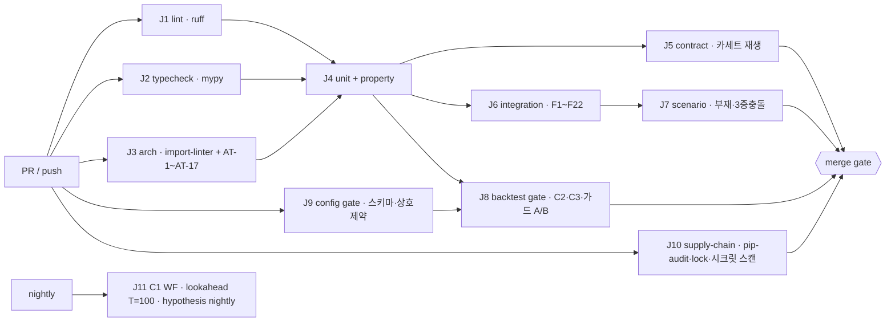

# 16. 테스트 · 품질

> **범위**: `tests/` 전체와 품질 도구 구성. 단위 테스트(금액·수량 모듈 mypy strict 경계), 계약 테스트·record-replay 카세트(KIS·업비트), 아키텍처 테스트(import-linter 계약 검증·repos 화이트리스트 검증), 통합 테스트·장애 주입(F1~F22), 부재 시뮬레이션·M4 필수 시나리오, 백테스트 게이트 CI·스냅샷 회귀, CI 파이프라인(mypy/ruff/import-linter/pytest 단계), 테스트 데이터·픽스처 전략, 마일스톤 DoD·게이트의 테스트 대응표.
> **계획 정본**: 03 §4 전체(테스트 전략 정본)·§4.7·§5.4·§6.3, 01 §1.1(품질 도구)·§2.2(import-linter 계약 원문)·§1.6(tools 격리)·§7-7(공급망 CI), 04 전체(마일스톤 DoD·게이트), 06 §13(검증 항목), 02 §8.2~§8.3(게이트 C1~C3·S1~S4·lookahead).
> **선행 문서**: [01-system-architecture.md](01-system-architecture.md) §8(계약 파일·AT-1~AT-7), [02-domain-model.md](02-domain-model.md) §5·§8(Decimal 규약·Clock), [03-data-and-persistence.md](03-data-and-persistence.md) §4.3(repo 계약)·§7(감사로그), [05-broker-gateway.md](05-broker-gateway.md) §3.7·§4(마스킹·paper 엔진).
> **이 문서가 소유하는 정의**: 테스트·CI 구성(브리프 §2.1). 즉 테스트 계층·마커·픽스처·카세트 포맷·장애 주입 하네스·시나리오 DSL·CI 잡 그래프·mypy/ruff 설정. **테스트가 검증하는 대상의 정의는 전부 각 소유 설계서**에 있고 이 문서는 재정의하지 않는다.

## 1. 개요 — 설계 대상과 책임

### 1.1 이 문서가 답하는 질문

계획 03 §4는 **무엇을 검증할지**(단위 대상·카세트 대상·F1~F22·게이트)를 확정했지만 **어떻게 실행 가능한 코드로 만드는지**는 비어 있다. 이 문서가 채우는 것은 그 여백이다:

1. `tests/` 트리와 8계층 분류, 계층별 실행 예산·CI 배치 (§2)
2. mypy strict 경계의 **모듈 목록**과 경계 누수를 막는 기계 강제, ruff 룰셋 (§3)
3. property-based 불변식의 **전략(strategy) 시그니처와 불변식 카탈로그** (§4)
4. record-replay 카세트의 **포맷·매칭 키·마스킹·신선도 판정** (§5)
5. import-linter가 못 막는 것을 잡는 **아키텍처 테스트 AT-1~AT-17** (§6)
6. F1~F22를 **주입 지점 × 단정**으로 기계화하는 하네스 (§7)
7. 03 §5.4의 30일 시계열을 **데이터로 주입하는 시나리오 DSL** (§8)
8. 백테스트 게이트의 **스냅샷 파일 포맷·갱신 프로토콜·트리거 규칙** (§9)
9. GitHub Actions **잡 그래프와 경로 필터** (§10)
10. 결정론 3원칙과 픽스처 계층 (§11)
11. 마일스톤 DoD·게이트 ↔ 테스트 **대응표** (§12)
12. 각 설계서 "검증 항목" 소절의 **수거 대장(RTM)과 그 기계 검증** (§13)

### 1.2 소유 경계 — 이 문서가 설계하지 **않는** 것

| 항목 | 소유 |
|---|---|
| 검증 대상의 정의(모델·DDL·알고리즘·상태 전이·게이트 판정식) | 각 설계서 |
| 백테스트 시뮬레이터·게이트 판정 구현·Walk-Forward·DSR | [15-backtest-and-validation.md](15-backtest-and-validation.md) |
| `weekly_maintenance` 잡 정의·run ledger·runbook 구조 | [12-scheduling-and-operations.md](12-scheduling-and-operations.md) |
| `pyproject.toml [tool.importlinter]` 계약 본문 | [01](01-system-architecture.md) §8.2 |
| 마스킹 필터 구현(`brokers/masking.py`) | [05](05-broker-gateway.md) §3.7 |
| paper 체결 시뮬레이터 | [05](05-broker-gateway.md) §4 |
| `Clock`/`SimClock` | [02](02-domain-model.md) §8 |
| CLI 명령 카탈로그 | [01](01-system-architecture.md) §2.3 |

### 1.3 세 개의 설계 원칙

1. **CI는 자격증명을 갖지 않는다.** 실호출은 개발자 로컬과 `app` 컨테이너(주 1회 스모크)에서만 일어나고, CI는 **재생만** 한다(정본: 03 §4.2 "CI는 재생만"). 네트워크는 픽스처 레벨에서 전면 차단한다(§11.2).
2. **게이트를 완화하지 않고 러너를 늘린다.** 03 §4.4가 병합 조건으로 요구한 게이트는 실행 시간이 길다는 이유로 축소하지 않는다. 02 §8.1.2가 허용한 축소 대상은 **런타임 챌린저 게이트 `G2`**이지 **CI 스냅샷 회귀(C3)**가 아니다 — 오히려 계획은 "CI 스냅샷 회귀가 이미 같은 역할을 한다"를 `G2` 삭제의 근거로 든다.
3. **오발동도 버그다**(04 로드맵 원칙 ④). 안전장치 테스트는 "발동하는가"뿐 아니라 **"발동하지 않아야 할 때 발동하지 않는가"**를 반드시 짝으로 갖는다. F18·F19·F21이 전부 그 형식이다.

---

## 2. `tests/` 트리와 테스트 계층

### 2.1 디렉터리 트리

계획 01 §2는 `tests/`를 "단위 + 계약 + 아키텍처 테스트, record-replay 카세트"로만 규정한다. 아래는 그 확장이며 [DD-16-1]이다.

```
tests/
├── conftest.py                  # 전역 결정론 픽스처 (§11.2) — network kill·seed·Clock
├── factories.py                 # 도메인 객체 팩토리 (§11.3)
├── marks.py                     # verifies() 마커 헬퍼 (§2.3)
├── unit/                        # L1 — 순수 함수 (§4.1)
│   ├── core/  calendar/  data/  engine/  tax/  execution/  protections/
│   ├── surveillance/  realtime/  persistence/  scheduler/  rpc/  research/  labs/
├── property/                    # L2 — hypothesis 불변식 (§4.2)
│   ├── strategies.py            #   공용 전략(Instrument·가격·현금·포지션·계획)
│   └── test_inv_*.py            #   INV-01 … INV-14
├── arch/                        # L3 — 아키텍처 테스트 (§6)
│   ├── astutil.py               #   AST 스캐너 공용 유틸
│   ├── test_at_contract_sync.py #   AT-1 · AT-7
│   ├── test_at_protocol.py      #   AT-2 · AT-3 · AT-4 · AT-5 · AT-6
│   ├── test_repo_contract.py    #   03 §4.3 검사 1~4 (DD-03-18)
│   ├── test_code_rules.py       #   AT-8~AT-13 (Clock·float·CANO·await·상태 대입·문서↔설정)
│   └── test_boundaries.py       #   AT-14~AT-17 (scheduler 역방향·LLM 격리·backtest 규율)
├── contract/                    # L4 — 카세트 재생 (§5)
│   ├── cassette.py              #   포맷·직렬화·매칭기
│   ├── replay.py                #   ReplayTransport (httpx) · ReplaySocket (WS)
│   ├── record.py                #   RecordingTransport — 실호출. CI 미실행 (마커 record)
│   ├── kis/  upbit/  data/      #   TR·엔드포인트별 계약 테스트
├── integration/                 # L5 — DryRun 전체 사이클 + 장애 주입 (§7)
│   ├── harness.py               #   IntegrationHarness
│   ├── faults.py                #   FaultInjector · Fault · FaultPoint
│   └── test_f01.py … test_f22.py
├── scenario/                    # L6 — 시계열 시나리오 (§8)
│   ├── dsl.py  runner.py  asserts.py
│   └── cases/away_30d.yaml · dec_triple_conflict.yaml · …
├── gates/                       # 게이트 증빙 수집기 (§12.2) — 마커 gate_evidence
│   └── gate_report.py
├── rtm/                         # 검증 항목 수거 대장 (§13)
│   ├── test_rtm_coverage.py
│   └── waivers.yaml
├── cassettes/                   # 카세트 저장소 (§5.1) — git 관리 대상
├── golden/                      # 골든 파일 (§11.4)
├── snapshots/                   # 백테스트 스냅샷 (§9.2) — 생성·판정은 15
└── data/                        # 소형 픽스처 데이터셋 (§11.5)
```

> **[DD-16-1] 테스트 러너·계층·트리 확정**
> - 결정: 러너는 **pytest** + `pytest-asyncio`(asyncio 모드 auto) + `hypothesis` + `coverage`. 테스트를 8계층(L0~L7)으로 나누고 계층마다 pytest 마커를 1:1 부여하며, 디렉터리와 마커를 강제 일치시킨다(`conftest.py`가 경로 기반으로 마커를 자동 부여하고, 수동 마커와 불일치하면 수집 단계에서 실패).
> - 근거: 계획 03 §4.1이 `hypothesis`를 명시했고 hypothesis는 pytest 통합이 1급이다. 계층-마커-디렉터리 3중 일치를 강제하는 이유는 **CI 잡이 마커로 선택 실행**하기 때문이다 — 마커가 빠진 테스트는 어떤 잡에서도 실행되지 않은 채 조용히 통과한다(정확히 01 §2.2가 경고한 default-allow와 같은 실패 모드).
> - 계획 문서와의 관계: 여백 채움. 계획 01 §2는 `tests/`의 3개 하위 개념만 열거했고 러너를 지정하지 않았다.

### 2.2 계층 정의 (정본)

| 계층 | 마커 | 대상 | 외부 의존 | 시간 예산(전체) | 실행 CI 잡 |
|---|---|---|---|---|---|
| **L0** | — | 정적 분석: ruff·mypy·import-linter | 없음 | 4분(J1 1 + J2 2 + `lint-imports` 1) | J1·J2·J3 |
| **L1** | `unit` | 순수 함수·단일 클래스 (§4.1) | 없음 | 3분 | J4 |
| **L2** | `property` | hypothesis 불변식 (§4.2) | 없음 | 4분 | J4 |
| **L3** | `arch` | 아키텍처 테스트 AT-1~AT-17 (§6) | 소스 트리 AST | 1분 | J3 |
| **L4** | `contract` | 카세트 재생 — 브로커·데이터 소스 (§5) | 카세트 파일 | 3분 | J5 |
| **L5** | `integration` | DryRun 전체 사이클 + F1~F22 (§7) | in-memory SQLite | 8분 | J6 |
| **L6** | `scenario` | 30일 부재·12월 3중 충돌 등 시계열 (§8) | in-memory SQLite + 카세트 | 10분 | J7 |
| **L7** | `backtest_gate` | C1~C3·S1~S4·lookahead·가드 A/B (§9) | Parquet 데이터 스냅샷 | §9.6 | J8 |
| 보조 | `record` | 카세트 **녹화**(실호출) | 실계좌 자격증명 | — | **CI 미실행** |
| 보조 | `gate_evidence` | 마일스톤 게이트 증빙 수집(§12.2) | 감사로그 export | — | 수동 |
| 보조 | `m9` | T1 실시간 계층 조건부 테스트(§12.3) | — | — | 조건부 |

- `record`·`gate_evidence`는 `conftest.py`가 `OMRA_TEST_LIVE=1`(또는 `--audit-export`)이 없으면 **무조건 skip**한다. CI에서는 환경변수를 주지 않으므로 실호출 경로가 물리적으로 열리지 않는다.
- `m9`는 `OMRA_TEST_T1=1`일 때만 실행한다 — M9 취소가 기본 시나리오이므로(04 §4.4-6) 기본값은 skip이고, skip 사유가 리포트에 남는다(§12.3).

### 2.3 마커·명명 규약과 검증 항목 태깅

```python
# tests/marks.py
def verifies(*ids: str) -> pytest.MarkDecorator:
    """설계서 검증 항목 ID(V<문서번호>-<일련>)를 테스트에 결선한다.
    §13의 RTM 커버리지 테스트가 이 마커를 수거한다.
    ids 형식 위반은 import 시점에 ValueError."""
```

```python
@verifies("V5-07", "V5-10")
@pytest.mark.unit
def test_paper_limit_buy_never_fills_above_limit() -> None: ...
```

- 테스트 함수명 규약: `test_<대상>_<조건>_<기대>`. 장애 주입은 `test_f<NN>_<요지>`, 불변식은 `test_inv<NN>_<요지>`.
- 파일 1개 = 검증 대상 모듈 1개 (L1) 또는 불변식 1개 (L2) 또는 장애 ID 1개 (L5).

### 2.4 검증 항목 (§2)

| ID | 항목 | 방법 |
|---|---|---|
| V16-01 | 디렉터리와 마커가 불일치하는 테스트가 수집 단계에서 실패한다 | 위반 파일 fixture |
| V16-02 | 마커 없는 테스트 0건 | 수집 후 집계 어서션 |
| V16-03 | `record`·`gate_evidence`가 환경변수 없이 실행되면 skip이며 통과로 계상되지 않는다 | `-m record` 실행 결과 파싱 |

---

## 3. 정적 품질 게이트 — mypy · ruff

정본: 01 §1.1 "mypy(strict, 금액·수량 모듈 한정) + ruff + import-linter — 금액 계산 모듈의 타입 오류는 곧 돈".

### 3.1 mypy strict 경계 — 대상 모듈 목록

> **[DD-16-2] "금액·수량 모듈"의 완전열거와 strict 섬(island) 규율**
> - 결정: ① `--strict` 적용 대상을 아래 표로 **완전열거**한다. ② 나머지 모듈은 완화 baseline(§3.2)으로 검사하되 **검사 대상에서 제외하지는 않는다**. ③ strict 섬의 **공개 시그니처**에 `Any`·`float`가 등장하면 아키텍처 테스트 AT-8이 실패시킨다 — mypy만으로는 비-strict 모듈에서 흘러든 `Any`를 잡지 못하기 때문이다.
> - 근거: 01 §1.1은 "금액·수량 모듈 한정"만 정하고 목록을 주지 않았다. 목록이 없으면 CI가 무엇을 strict로 검사할지 결정할 수 없고, 신설 모듈이 조용히 경계 밖에 놓인다(default-allow 실패 모드). [02](02-domain-model.md) §2가 이미 `core.money`·`core.tick`·`core.models`를 CI 조건으로 지목하고 `core` 패키지 전체를 대상으로 규정했으므로 그것을 상위집합으로 확장했다.
> - 계획 문서와의 관계: 여백 채움, 충돌 없음.

| strict 대상 | 왜 금액·수량인가 | 근거 |
|---|---|---|
| `omra.core.*`(패키지 전체 — `money` · `tick` · `models` · `ids` · `accounts` · `states` · `errors` · `clock`) | Decimal 규약·틱사이즈·Order/Fill·상태 enum의 원천 | [02](02-domain-model.md) §2("01 §1.1의 대상이 바로 이 패키지") |
| `omra.engine.optimizer` · `engine.rebalancer` | 정수 수량화·밴드 판정 = 주문 수량의 생성지 | 02 §3.3, §4.3 |
| `omra.tax` (패키지 전체) | 세액·공제·임계 — 오차가 곧 세금 사고 | 02 §5, 00 §3.2 T1~T9 |
| `omra.execution` (패키지 전체) | 주문 수량·가격·순매수 회계 호출 경계 | 03 §1.6, 01 §1.4 |
| `omra.portfolio` (패키지 전체) | NAV·포지션·평단(이동평균) | 02 §5.1 |
| `omra.protections` (패키지 전체) | 한도(P2·P3·P11)·순매수 상한 계산 | 03 §1.2, §2.4 |
| `omra.persistence.repos` (패키지 전체) | Decimal↔TEXT 직렬화 경계 | [02](02-domain-model.md) §5.2 [DD-02-10], [03](03-data-and-persistence.md) §3 DDL |

```toml
# pyproject.toml (구성 소유: 이 문서)
[tool.mypy]
python_version = "3.12"
files = ["src/omra", "tests"]
plugins = ["pydantic.mypy"]
# baseline — 전 모듈 공통(§3.2)
warn_unused_configs   = true
warn_redundant_casts  = true
warn_unused_ignores   = true
disallow_untyped_defs = true          # 신규 코드 기준. 예외는 per-module로만
no_implicit_optional   = true
strict_equality        = true
show_error_codes       = true

[[tool.mypy.overrides]]              # ★ strict 섬 — [DD-16-2] 완전열거
module = [
  "omra.core.money", "omra.core.tick", "omra.core.models", "omra.core.ids",
  "omra.core.accounts", "omra.core.states", "omra.core.errors", "omra.core.clock",
  "omra.engine.optimizer", "omra.engine.rebalancer",
  "omra.tax.*", "omra.execution.*", "omra.portfolio.*",
  "omra.protections.*", "omra.persistence.repos.*",
]
strict = true
disallow_any_unimported = true
disallow_any_explicit   = true        # 섬 안에서 Any를 '쓰겠다'는 선언조차 금지

[[tool.mypy.overrides]]               # 외부 라이브러리 스텁 부재 (01 §1.3~§1.5 스택 목록)
module = ["skfolio.*", "quantstats.*", "FinanceDataReader.*", "pykrx.*",
          "exchange_calendars.*", "duckdb.*", "apscheduler.*", "telegram.*"]
ignore_missing_imports = true
```

- `disallow_any_explicit = true`는 섬 안에서 `x: Any`를 쓰는 것을 금지한다. 외부 라이브러리 반환값은 **섬 밖의 어댑터 모듈**에서 도메인 타입으로 변환한 뒤 섬으로 들어온다(예: skfolio 결과 → `engine/optimizer.py` 진입 전 변환). 이 규율이 §3.3 AT-8과 짝이다.
- **`engine`의 내부 수치 연산은 예외**: 연속 최적화 내부는 numpy `float64`를 쓴다(skfolio 전제). 섬 규율은 **공개 시그니처와 pydantic 필드**에만 적용되며, 정수 수량화 산출물은 `Decimal`이다(02 §5.1 원칙 1).

### 3.2 경계 누수 방지 — 왜 mypy만으로 부족한가

mypy는 "비-strict 모듈이 반환한 값이 strict 모듈 안에서 `Any`로 퍼지는 것"을 `disallow_any_expr` 없이는 못 잡고, `disallow_any_expr`는 실무적으로 통과 불가능하다. 따라서 2중 방어:

1. `disallow_any_unimported` + `disallow_any_explicit`(위) — 선언 레벨 차단.
2. **AT-8**(§6.3) — strict 섬 모듈의 `def`/`class` 공개 시그니처와 pydantic 필드 어노테이션을 AST로 훑어 `Any`·`float`·미어노테이션 인자를 금지. `_`로 시작하는 사설 심볼은 제외.

### 3.3 ruff 설정

> **[DD-16-3] ruff 룰셋과 banned-api 목록**
> - 결정: 아래 룰셋을 채택하고, `flake8-tidy-imports`의 `banned-api`로 `datetime.datetime.now`·`datetime.date.today`·`time.sleep`·`random.random` 4종을 차단한다(`print`는 `banned-api`가 아니라 `T20` 룰로 막는다 — 중복 정의하지 않는다). 포매터는 `ruff format`(line-length 100).
> - 근거: 01 §1.1이 도구만 지정하고 룰셋을 주지 않았다. 선택 기준은 "이 시스템의 알려진 실패 모드를 정적으로 잡는가"다 — `DTZ`(naive datetime)는 [02](02-domain-model.md) §5.4 시각 직렬화 규약, `TID`는 Clock 규율([02](02-domain-model.md) §8 [DD-02-11]), `S`(bandit)는 01 §7 보안 목록, `T20`은 structlog 규약(01 §1.5)에 각각 대응한다.
> - 계획 문서와의 관계: 여백 채움, 충돌 없음.

```toml
[tool.ruff]
line-length = 100
target-version = "py312"
src = ["src", "tests"]

[tool.ruff.lint]
select = ["E","F","W","I","N","UP","B","A","C4","DTZ","T20","PT","RET","SIM",
          "TID","ARG","PL","RUF","S","ASYNC","LOG","G","ISC","PIE","TCH"]
ignore = ["PLR0913",   # 인자 수 — 도메인 팩토리·시그니처가 길다
          "S101"]      # assert — tests에서만 쓰고 src는 AT-10이 별도로 막는다

[tool.ruff.lint.flake8-tidy-imports.banned-api]
"datetime.datetime.now".msg = "core.Clock을 주입해 쓴다 (02-domain-model.md §8.1 DD-02-11)"
"datetime.date.today".msg   = "core.Clock을 주입해 쓴다 (02-domain-model.md §8.1 DD-02-11)"
"time.sleep".msg            = "단일 asyncio 루프를 블로킹한다 (01 §1.4)"
"random.random".msg         = "시드 없는 난수는 재현성을 깬다 (§11.2)"

[tool.ruff.lint.per-file-ignores]
"src/omra/core/clock.py" = ["DTZ005","TID251"]     # Clock 구현체만 직접 호출 가능
"tests/**"               = ["S101","ARG","PLR2004","DTZ","TID251"]
"src/omra/cli/**"        = ["T20"]                  # CLI 표준출력은 허용
```

- `S`(bandit) 계열은 `S105`/`S106`(하드코딩 시크릿) 때문에 특히 중요하다 — 카세트·픽스처에 실키가 섞이는 경로를 정적으로 1차 차단한다(2차는 §5.7).
- `ASYNC`는 `write_session` 안의 블로킹 호출을 부분적으로 잡고, 나머지(컨텍스트 안의 `await`)는 AT-11(§6.3)이 AST로 처리한다(수거원: [03](03-data-and-persistence.md) §4.1·§4.5 — 03이 16으로 넘긴 항목).

### 3.4 검증 항목 (§3)

| ID | 항목 | 방법 |
|---|---|---|
| V16-04 | strict 섬 모듈에 미어노테이션 `def` 추가 → mypy 실패 | 위반 fixture 파일 + `mypy` 서브프로세스 |
| V16-05 | strict 섬 공개 시그니처에 `float` 추가 → AT-8 실패 | arch 테스트 |
| V16-06 | `datetime.now()` 직접 호출 추가 → ruff TID251 실패 | 위반 fixture |
| V16-07 | strict 섬 목록과 `pyproject.toml` overrides가 일치 | §13 RTM과 동일 방식(문서 표 ↔ 설정 대조) |

---

## 4. 단위 테스트 (L1) · property-based (L2)

### 4.1 순수 함수 집중 대상 (정본: 03 §4.1)

계획이 지목한 5개 대상과 그 소유 설계서:

| 대상 | 테스트 내용 | 정의 정본 |
|---|---|---|
| 정수 수량 변환 | 잔여현금 ≥ 0 불변식, `lot_step` 격자, floor 규약 | [07](07-portfolio-engine.md) §정수 수량화, 02 §5.3 |
| 밴드 판정 | 절대·상대 밴드 4행 표 + 크립토 행, `T_min`·쿨다운 | [07](07-portfolio-engine.md), 02 §4.3 |
| 호가단위 라운딩 | 규칙 4종·사다리 경계값 | [02](02-domain-model.md) §6 |
| 결제일 계산 | 국내 T+2 / 미국 T+1 / **연말 경계**·반일장 | [06](06-market-data-and-calendar.md) §결제일 |
| 세금 계산 | 이동평균·공제·통산·과표기준가 — **표 기반 test vector** | [10](10-tax-engine.md) |

**test vector 형식** (03 §4.1 "표 기반 test vector"의 구현형):

```
tests/data/vectors/tax/<case_group>.tsv     # TSV — diff 가독성이 JSON보다 높다
# 헤더 1행 = 입력 컬럼… | 기대 출력 컬럼…
# 주석은 '#'로 시작. 각 행 끝에 근거 컬럼(계획 절 번호)을 둔다 — 값의 출처를 행 단위로 남긴다
```

로더는 `tests/unit/tax/conftest.py`의 `load_vectors(name) -> list[Vector]`이며, 근거 컬럼이 빈 행은 로딩 단계에서 실패한다. 이는 "숫자를 근거 없이 넣는 것"을 테스트 데이터 레벨에서 막는 장치다(브리프 §1의 테스트 측 대응물).

### 4.2 property-based 불변식 카탈로그

계획 03 §4.1이 명시한 5개에, 다른 계획 문서가 property-based로 지정한 항목을 수거해 **INV-01~INV-14**로 번호화한다. 번호는 이 문서가 소유하고, 판정식은 각 소유 문서가 소유한다.

| ID | 불변식 | 근거(계획) | 판정 정본 |
|---|---|---|---|
| INV-01 | 어떤 가격/현금 조합에서도 **주문 후 현금이 음수가 되지 않는다** | 03 §4.1, 02 §4.2 `allocatable_cash = max(0, …)` | 07 |
| INV-02 | **비중 합 = 1 ± ε** | 03 §4.1 | 07 |
| INV-03 | 어떤 `RebalancePlan`에서도 **계좌 제약 위반 주문이 생성되지 않는다**(연금 해외상장·IRP 위험자산 70%·ISA 국내상장·레버리지·PTP) | 03 §4.1, 02 §1.2 | 08 §4·§5 |
| INV-04 | **`SAFE_MODE`에서 생성된 어떤 계획도 목표비중을 하향시키지 않는다** | 03 §4.1 | 09 |
| INV-05 | **실시간 가드의 어떤 산출도 계획 총량을 증가시키지 않는다**(단조 축소성) | 03 §4.1, 00 §5-9 | 11 |
| INV-06 | **`SV3` 자산에 대한 주문 0건** — 어떤 입력에서도 | 04 §2 M3 DoD, 06 §13.3, 02 §4.3 불변식 2 | 11 |
| INV-07 | 비대칭 재정규화가 **목표 주식비중을 상향시키지 않는다** | 06 §13.3 | 07·11 |
| INV-08 | `GuardOutput.sides`는 **줄어들기만** 한다(`guard.oneway`) | 01 §3.5, 06 §2.1 | 11 |
| INV-09 | 계좌별 sub-target 분해가 **IRP 위험자산 ≤ 70%**를 만족한다 | 04 §2 M8 DoD | 07 |
| INV-10 | 재호가 산출 가격이 **marketable limit을 넘지 않는다** | 08 §8 검증 항목 ④, 03 §3 | 08 |
| INV-11 | 마스킹 필터 왕복 — 출력에 등록 시크릿 실값·계좌번호가 **부재** | 05 §3.7 V5-05, 01 §6.3 | 05 |
| INV-12 | Decimal↔TEXT 왕복이 **값과 스케일을 보존**하고 지수 표기를 만들지 않는다 | [02](02-domain-model.md) §5.2 [DD-02-10] | 02 |
| INV-13 | `labs`·`research` 경로의 어떤 입력도 **주문 0건** | 07 §14.3("`labs -/-> execution·brokers`가 property-based 테스트에서도 주문 0건"), 01 §2.2 계약 | 14 |
| INV-14 | 순매수 회계: 동시 주문 생성에서 **`net_buy_committed` 초과 0건**(order_lock 임계구역) | 01 §1.4, 03 §2.4 | 09·08 |

**공용 전략 시그니처** (`tests/property/strategies.py`):

```python
import hypothesis.strategies as st

def instruments(*, venues: Sequence[str] = ("KRX", "NASDAQ", "UPBIT"),
                n: int = 12) -> st.SearchStrategy[list[Instrument]]:
    """02 §4 Instrument. lot_step·tick 규칙·currency가 venue와 정합인 것만 생성."""

def prices(instruments: list[Instrument]) -> st.SearchStrategy[dict[str, Decimal]]:
    """양수 Decimal. 각 instrument의 틱 격자 위 값만 (02 §6) — 격자 밖 가격은
       도메인상 존재할 수 없으므로 전략에서 배제한다(거짓 반례 방지)."""

def positions(instruments, prices) -> st.SearchStrategy[Portfolio]: ...
def cash_krw() -> st.SearchStrategy[Decimal]:            # 0 ≤ x ≤ 10**10, 원 단위 정수
def target_weights(instruments) -> st.SearchStrategy[TargetWeights]:
    """합 1.0 ± 1e-9. Dirichlet 유사 생성 후 정규화."""
def rebalance_plans(...) -> st.SearchStrategy[RebalancePlan]: ...
def bot_contexts(*, states: Sequence[BotState] = ...) -> st.SearchStrategy[StateContext]:
    """BotState × SleeveState × PresenceState 3평면 조합 (01 §3.4, 03 §2.1)."""
```

> **전략은 도메인 불변식을 이미 만족하는 값만 만든다.** 예컨대 틱 격자 밖 가격이나 합이 1이 아닌 목표비중을 생성하면 반례가 "입력이 잘못됐다"로 끝나 정보가 없다. 도메인 위반 입력의 거부는 L1 단위 테스트(생성자·검증기)가 맡는다.

### 4.3 hypothesis 프로파일

```python
# tests/conftest.py
settings.register_profile("dev", max_examples=50, deadline=timedelta(seconds=1))
settings.register_profile("ci",  max_examples=300, deadline=None,
                          derandomize=True,          # 재현성 — 실패가 재현되지 않으면 R5(07 §10.1) 판정 불가
                          suppress_health_check=[HealthCheck.too_slow])
settings.register_profile("nightly", max_examples=2000, deadline=None)
settings.load_profile(os.environ.get("HYPOTHESIS_PROFILE", "dev"))
```

- `ci` 프로파일은 `derandomize=True`다. 07 §10.1 `R5`(ⓓ property-based 테스트 실패 — **1건으로 즉시 발동**)가 롤백을 규정하므로, **재현되지 않는 실패는 롤백 판정 자체를 불가능하게 만든다.**
- `.hypothesis/examples` 데이터베이스는 CI 캐시로 잡별 공유한다(반례 재현 가속). 캐시 미스는 실패 사유가 아니다.

### 4.4 검증 항목 (§4)

| ID | 항목 | 방법 |
|---|---|---|
| V16-08 | INV-01~INV-14 각각에 대해 **의도적 위반 구현**을 주입하면 해당 테스트가 실패한다 | 뮤테이션 fixture(각 불변식당 1개) |
| V16-09 | test vector 로더가 근거 컬럼 없는 행을 거부한다 | 단위 |
| V16-10 | `ci` 프로파일에서 동일 시드가 동일 반례를 낸다 | 2회 실행 비교 |

---

## 5. 계약 테스트와 record-replay 카세트 (L4)

정본: 03 §4.2. "VCR 스타일 카세트: 모의계좌 실호출 녹화(앱키·계좌번호·토큰 자동 마스킹), CI는 재생만."

### 5.1 카세트 포맷

> **[DD-16-4] 카세트 포맷·매칭 키·저장 레이아웃**
> - 결정: ① 포맷은 **YAML 1파일 = 1 상호작용 그룹**, 스키마 버전 필드 필수. ② 매칭 키 = `(method, url_path, tr_id, 정규화된 매칭 바디 키셋)`이며 **헤더·타임스탬프·nonce는 매칭에 쓰지 않는다**. ③ 매칭 실패는 **테스트 실패**이며 실호출로 폴백하지 않는다. ④ 저장 경로는 `tests/cassettes/<broker>/<group>/<name>.yaml`. ⑤ 라이브러리는 **자체 구현**(httpx 커스텀 transport)한다. ⑥ `env: live` 카세트(실계좌 read-only — 04 §2 M1 DoD "실계좌 잔고 read-only 적재"가 이 응답을 만든다)에 한해, **마스킹 통과 후 별도 정규화 단계에서 잔고·평가금액을 고정 배수로 스케일 치환**한다. 마스킹 대상 필드의 열거는 이 문서가 아니라 [05](05-broker-gateway.md) §3.7이 소유하며, 스케일 치환은 마스킹 필터를 고치는 것이 아니라 **카세트 정규화 단계(이 문서 소유)**에서 수행한다.
> - 근거: 03 §4.2는 "VCR 스타일"만 정했다. 자체 구현을 택한 이유는 (a) 우리 스택의 HTTP 클라이언트가 `httpx`(01 §1.5)이고 vcrpy 계열의 httpx 지원 범위가 **[확인 필요 — 공식 문서 확인, M1 카세트 인프라 착수 시]**이며 (b) **마스킹이 녹화 파이프라인 안쪽에 있어야** 실키가 디스크에 닿기 전에 제거되는데, 서드파티 훅 지점에 그 보장을 위임할 수 없기 때문이다(01 §6.3 "두 벌 금지"와 같은 논리). ③은 "CI는 재생만"의 기계적 표현이다.
> - 계획 문서와의 관계: 03 §4.2의 구체화. 충돌 없음.

```yaml
# tests/cassettes/kis/balance/domestic_normal.yaml
cassette_version: 1
recorded_at_kst: "2026-03-02T16:12:04+09:00"
env: paper                      # paper | live  ★ live 녹화는 read-only TR만 허용(§5.7)
tr_alias: balance_domestic      # config/tr_ids.kis.yaml 의 키. 원시 TR ID는 alias로만 참조
masked_by: brokers.masking@1    # 마스킹 필터 버전 — 필터 갱신 시 재녹화 대상 판정에 쓴다
interactions:
  - match:                      # ★ 이 블록만 매칭에 쓰인다
      method: GET
      url_path: /uapi/domestic-stock/v1/trading/inquire-balance
      tr_alias: balance_domestic
      body_keys: {CANO: "***", ACNT_PRDT_CD: "***", AFHR_FLPR_YN: "N"}
    response:
      status: 200
      headers: {content-type: application/json}
      body: { rt_cd: "0", output1: [ … ], output2: [ … ] }
      elapsed_ms: 143
```

- `body_keys`는 요청 바디/쿼리에서 **의미 있는 키만** 추출한 정규화 사전이다. 마스킹된 값(`"***"`)은 와일드카드로 매칭한다 — 계좌번호가 카세트에 없으므로 매칭도 계좌번호에 의존할 수 없다.
- 응답 본문의 계좌번호(`CANO`·`ACNT_PRDT_CD`)는 **마스킹 필터가 처리한다**(대상 열거의 정본: [05](05-broker-gateway.md) §3.7). 금액은 마스킹 대상이 아니며, `env: live` 카세트에 한해 **정규화 단계의 스케일 치환**(고정 배수, [DD-16-4] ⑥)으로 실보유 규모를 지운다 — 마스킹(`***`)과 달리 파싱·검증 테스트가 그대로 유효하다. 치환 배수는 카세트에 기록하지 않는다(재현이 필요한 값이 아니다).

### 5.2 녹화기 (`tests/contract/record.py`)

```python
class RecordingTransport(httpx.AsyncBaseTransport):
    """실호출을 통과시키며 요청/응답을 카세트로 적재한다. 마커 record 전용.
    파이프라인 순서(불변): 실호출 → 마스킹 → 정규화 → 직렬화 → 디스크.
    마스킹 실패(예외 포함)는 '기록하지 않음'으로 처리한다 — 미마스킹 데이터를
    디스크에 쓰는 것보다 카세트가 없는 편이 안전하다."""
    def __init__(self, inner: httpx.AsyncBaseTransport, sink: CassetteSink,
                 masker: Masker) -> None: ...      # Masker 정본: 05 §3.7 brokers/masking.py
```

- 마스킹 코드는 **감사로그와 동일 모듈**을 import한다(정본: 01 §6.3, 03 §4.2, 05 §3.7 DD-05-4). 이 문서는 재구현하지 않는다.
- 녹화 실행 진입점: `pytest -m record --cassette-group kis.balance`(개발자 로컬 / `app` 컨테이너). `OMRA_TEST_LIVE=1` 필수.

### 5.3 재생기 (`tests/contract/replay.py`)

```python
class ReplayTransport(httpx.AsyncBaseTransport):
    def __init__(self, cassettes: Sequence[Path], *, strict: bool = True) -> None: ...
    async def handle_async_request(self, request: httpx.Request) -> httpx.Response:
        """매칭 실패 → CassetteMiss(요청 요약 + 후보 근접 매칭 3건). 실호출 폴백 없음.
        동일 match 블록이 여러 개면 등장 순서대로 소비한다(순차 상태 재현 —
        예: 주문 접수 → 미체결 조회 → 체결 조회)."""

class ReplaySocket:
    """WS 프레임 시퀀스 재생 (§5.4). websockets 클라이언트 인터페이스만 흉내낸다."""
    async def recv(self) -> str | bytes: ...
    def inject_disconnect(self, after_frames: int) -> None: ...
```

**결정론 요건**: 재생 시 `elapsed_ms`는 `SimClock` 전진에만 반영하고 실제 `sleep`을 하지 않는다. 이는 F2(토큰 70초 백오프)·F19(업비트 점검) 같은 시간 의존 케이스를 실시간 대기 없이 검증하기 위한 전제다.

### 5.4 WS 카세트와 폴백 등가성 이중 재생

06 §13.3·01 §5.3 불변식 2가 요구하는 **폴백 등가성**("동일 카세트를 (a) WS 주입 (b) REST 폴링 두 경로로 재생 → `Verdict` 시퀀스 일치")의 구현형:

```python
# tests/contract/kis/test_fallback_equivalence.py
@verifies("V5-31")
@pytest.mark.contract
async def test_fallback_equivalence(dual_cassette: DualCassette) -> None:
    ws_verdicts   = await replay_ws(dual_cassette)     # WS 프레임 → decoder → 가드
    rest_verdicts = await replay_rest(dual_cassette)   # 동일 시점 REST 스냅샷 → 가드
    assert [v.verdict for v in ws_verdicts] == [v.verdict for v in rest_verdicts]
    assert all(w.reason == r.reason for w, r in zip(ws_verdicts, rest_verdicts))
```

`DualCassette`는 **같은 시각축의 두 관측 경로**를 한 파일에 담는다:

```yaml
cassette_version: 1
kind: dual                        # WS 프레임 + 동시각 REST 스냅샷
timeline:
  - t_kst: "2026-03-02T10:00:03+09:00"
    ws:   {tr_id_alias: nav_tick, payload: "…"}
    rest: {url_path: /uapi/…/inquire-price, body: { … }}
```

- **차이는 지연뿐이어야 한다**(01 §5.3 불변식 2). 따라서 단정은 `Verdict` **시퀀스 동일성**이며 타임스탬프 동일성이 아니다.
- **WS 전면 차단 재생**(06 §13.3 두 번째 항목)도 같은 `DualCassette`로 수행한다: WS 경로를 비활성화한 채 REST 폴링만으로 재생해 **동일한 감시 등급(SV)에 도달**하는지 단정한다. 폴백 등가성이 가드(`Verdict`) 축의 단정이라면 이쪽은 감시(`surveillance`) 축의 단정이며, 둘 다 M4 통합 테스트 항목이다.
- M9가 취소되어도 이 테스트는 유지된다 — 06 §13.3이 폴백 등가성을 **M4 통합 테스트** 항목으로 두었고, 입력은 M4의 SP-E3 섀도 계측 카세트다(04 §2 M4 추가 ③).

### 5.5 카세트 대상 카탈로그

정본 목록(03 §4.2) + 이후 마일스톤에서 추가되는 대상. **이 표가 §5.6 스모크의 대상 목록이기도 하다.**

| 그룹 | 대상 | 마일스톤 | 오류 케이스 동봉 |
|---|---|---|---|
| `kis.auth` | 토큰 발급 | M1 | **EGW00133**, 401 |
| `kis.balance` | 국내/해외 잔고 | M1 | — |
| `kis.quote` | 현재가·기간시세·`intstock-multprice` | M1 | 5xx |
| `kis.calendar` | 휴장일 TR(CTCA0903R) | M1 | — |
| `kis.stockinfo` | **`CTPF1002R` 상태 플래그** | M1 | 필드 결측(SP-A1 실패 분기) |
| `kis.master` | **종목마스터 `.mst.zip` 파싱** | M1 | 인코딩 변형(SP-A2) |
| `kis.order` | 주문/정정/취소/체결조회 | M4 | **잔고부족·장마감·수량오류**, EGW00201 |
| `kis.ws` | 체결통보(T0) 프레임 | M4 | 재연결·좀비 세션 |
| `kis.overseas` | `search_info` 상태 필드·기간손익 032 | M6 | — |
| `kis.pension` | 절세계좌 `ACNT_PRDT_CD` 22/29/ISA (**SP-C4 성공 분기만**) | M8-A | 조회 성공·주문 거부 |
| `upbit.*` | 계좌·시세·주문·`market/all` | M7 | **503 점검성 응답**(F19), `remaining-req` 헤더 |
| `ws.nav` | `H0STNAV0` 섀도 프레임(dual) | M4 | 수신 불가(SP-E2 실패 분기) |

> **양경로 원칙**: 스파이크 실패 분기(SP-A1·SP-A2·SP-C4·SP-E2)의 카세트도 **성공 분기와 함께** 만든다. 실패 분기 카세트가 없으면 폴백 코드가 영원히 미검증 상태로 남는다 — 그리고 폴백은 정확히 스파이크가 실패했을 때 실행되는 코드다.

### 5.6 카세트 신선도 — 주 1회 스모크와 drift 판정

정본: 03 §4.2 "주 1회 모의계좌 스모크 테스트(실호출)로 스키마 drift 감지 — KIS 스펙 변경 조기 경보". 실행 위치는 `weekly_maintenance`(일요일 03:00, 정본: 01 §4.2, 잡 정의는 [12](12-scheduling-and-operations.md) 소유).

> **[DD-16-5] drift 3등급 판정과 알림 매핑**
> - 결정: 스모크는 **재녹화 후 기존 카세트와 구조 diff**를 수행하고 결과를 3등급으로 판정한다.
>   - **D0 값 변동만**(필드 집합·타입·오류코드 체계 동일) → 기록만. 카세트 갱신하지 않는다.
>   - **D1 필드 추가**(기존 필드 전부 유지) → `info` 알림 + 주간 점검 화면 표기.
>   - **D2 필드 삭제·타입 변경·오류코드 체계 변경·`rt_cd` 의미 변경** → **`critical`** + 해당 카세트 그룹을 `stale`로 표시. `stale` 그룹의 계약 테스트는 다음 CI에서 **경고가 아니라 실패**한다.
> - 근거: 03 §4.2는 "조기 경보"만 정하고 무엇을 경보로 볼지 정하지 않았다. 등급 없이 알림하면 03 §8이 최상위 운영 리스크로 등재한 "알림 무시 습관화"를 직접 실현한다. D2를 CI 실패로 승격시키는 이유는 필드 삭제가 곧 파싱 실패이며, 파싱 실패는 P9-quote 또는 대사 불일치로 전이되기 때문이다.
> - 계획 문서와의 관계: 03 §4.2·§7.2(알림 등급)의 구체화. 충돌 없음.

```python
# tests/contract/cassette.py
class DriftLevel(IntEnum):
    D0_VALUE_ONLY = 0
    D1_FIELD_ADDED = 1
    D2_BREAKING = 2

def diff_structure(old: Cassette, new: Cassette) -> tuple[DriftLevel, list[str]]:
    """필드 경로 집합·타입·enum 값 집합을 비교. 값 자체는 비교하지 않는다
    (잔고·시세는 매주 달라지는 것이 정상)."""
```

- **프로덕션 코드는 `tests/`를 import하지 않는다.** `weekly_maintenance`는 `app` 컨테이너에서 `pytest -m record --cassette-group … --drift-report <path>`를 **서브프로세스로 실행**하고 결과 JSON만 읽는다(잡 정의 소유: [12](12-scheduling-and-operations.md)). 봇 프로세스가 테스트 모듈을 import하면 01 §2.2 계약이 다루지 않는 의존이 생긴다.
- 스모크 실호출은 **모의계좌 read-only TR로 한정**한다. 주문 계열 카세트의 신선도는 M4 이후 모의 주문 흐름에서 부수적으로 갱신되며, 실전 도메인의 **주문 계열** 녹화는 §5.7-4의 금지 대상이다(실전 read-only 녹화는 [DD-16-4] ⑥의 조건에서만 허용).
- 스모크 결과는 감사로그에 `cassette_smoke` 이벤트로 남는다(스키마 소유: [03](03-data-and-persistence.md) §7.2 [DD-03-35]).

### 5.7 카세트 비밀 유출 방어

| # | 방어 | 구현 |
|---|---|---|
| 1 | 녹화 파이프라인 안쪽 마스킹 | §5.2 — 마스킹 실패 시 기록 자체를 포기 |
| 2 | **마스킹 고정점 테스트** | 전 카세트에 마스킹 필터를 재적용해 **바이트 동일**이면 통과. 다르면 미마스킹 잔여물이 있다는 뜻 |
| 3 | 패턴 스캔 | 카세트·픽스처 전체에서 계좌번호 형태·`appkey` 길이 패턴·JWT 형태 문자열 탐지 (CI 잡 J10) |
| 4 | 실전 도메인 **주문** 녹화 금지 | `env: live` 카세트는 **read-only TR 그룹만** 허용(+금액 스케일 치환 — [DD-16-4] ⑥). 주문 계열이면 로딩 단계에서 실패 |
| 5 | 크기 상한 | 카세트 1파일 1MB 상한 — 전종목 응답 통째 저장 방지(불필요한 노출면) |
| 6 | **'두 벌 금지' 케이스 세트 단일화** | 감사로거 경로와 카세트 녹화 경로에 **같은 케이스 세트**를 파라미터화해 통과시킨다([DD-16-13]) |

> **[DD-16-13] 마스킹 케이스 세트를 감사로그·카세트 두 경로에 공유 파라미터화한다**
> - 결정: 마스킹 입력 케이스를 `tests/data/vectors/masking/cases.tsv` **한 벌**로 두고, ① 감사로거 직렬화 경로(`audit` 라이터 — 정본: [03](03-data-and-persistence.md) §7.4)와 ② 카세트 녹화 파이프라인(§5.2 `RecordingTransport`)에 **동일한 파라미터 세트로** 적용해 두 경로의 출력에서 원문 부재를 각각 단정한다. 케이스 세트를 한쪽에만 추가하는 것을 막기 위해, 두 테스트는 같은 로더(`load_masking_cases()`)를 호출하고 **메타 테스트가 두 테스트의 파라미터 ID 집합 동일성**을 단정한다.
> - 근거: [03](03-data-and-persistence.md) §7.5 검증 항목이 "마스킹 필터: 실계좌번호 패턴 주입 → 출력 라인에 원문 부재(**카세트 필터와 동일 케이스 세트 — 두 벌 금지 검증**)"를 16으로 넘겼다(요청 출처: 03). 마스킹 **구현**은 이미 단일 모듈이지만(정본: [05](05-broker-gateway.md) §3.7 `brokers/masking.py`, [DD-05-4]), *구현이 한 벌*인 것과 *검증 케이스가 한 벌*인 것은 다른 문제다 — 케이스가 갈라지면 한쪽 경로에서만 검증된 필드가 생기고, 그 필드가 미검증인 경로가 하필 디스크에 커밋되는 카세트 쪽일 수 있다. 01 §6.3 "두 벌 금지"의 테스트 측 대응물이다.
> - 계획 문서와의 관계: 03 §4.2·01 §6.3의 구체화. 충돌 없음. 마스킹 대상 필드의 열거는 재정의하지 않고 [05](05-broker-gateway.md) §3.7을 참조한다.

### 5.8 검증 항목 (§5)

| ID | 항목 | 방법 |
|---|---|---|
| V16-11 | 매칭 실패 시 실호출로 폴백하지 않고 `CassetteMiss`로 실패한다 | 단위 |
| V16-12 | 마스킹 고정점 — 전 카세트 재마스킹 결과 바이트 동일 | 계약(전수) |
| V16-13 | D2 drift 주입 시 해당 그룹 계약 테스트가 실패한다 | 변조 카세트 fixture |
| V16-14 | 폴백 등가성 이중 재생 `Verdict` 시퀀스 일치 (= V5-31) + WS 전면 차단 재생에서 감시 등급 동일(06 §13.3) | 계약 |
| V16-15 | 실전 도메인 주문 카세트 로딩 거부 | 단위 |
| V16-36 | 마스킹 케이스 세트 '두 벌 금지' — 감사로거 경로와 카세트 녹화 경로의 파라미터 ID 집합이 동일하고, 두 경로 모두 원문 부재 ([DD-16-13], 수거원: [03](03-data-and-persistence.md) §7.5) | 메타 테스트 + 단위(양 경로) |

---

## 6. 아키텍처 테스트 (L3)

### 6.1 수거 대상 — AT-1~AT-7 (정본: [01](01-system-architecture.md) §8.3)

[01](01-system-architecture.md) §8.3이 "import-linter가 못 막는 것"으로 넘긴 7항목의 구현을 여기서 확정한다.

| ID | 검사 | 구현 방식 | 실패 예시(뮤테이션 fixture) |
|---|---|---|---|
| **AT-1** | repos 완전열거 동기화 | `src/omra/persistence/repos/*.py` 파일 집합 ↔ `pyproject.toml` C04b/C05b/C07b 금지 열거 집합 대조. 어느 한쪽에만 있으면 실패 | `repos/new_table.py` 추가 후 계약 미갱신 |
| **AT-2** | persist-then-submit | `execution` 패키지 AST에서 `broker.place_order` 호출 노드를 찾아, **같은 함수 본문에서 그 호출보다 먼저** `repos.orders.insert_submitting`(또는 동등 심볼)이 호출되는지 검사. 정본: 01 §3.2-1 | 순서 뒤바꾼 커밋 |
| **AT-3** | `guard.oneway` | property 테스트(INV-08)로 위임 + `realtime.guards`의 반환 타입이 `GuardOutput`(frozen)임을 시그니처 검사 | `sides` 확장 구현 |
| **AT-4** | realtime의 장운영 필드 소비 금지 | `realtime.guards`의 모든 공개 함수 시그니처 어노테이션에 `MarketStatus`(및 그 필드 타입)가 등장하지 않음 + `realtime` 패키지 소스에 `TRHT_YN`·`VI_CLS_CODE` 문자열 부재. 정본: 01 §2.3 | 가드가 `MarketStatus`를 인자로 받음 |
| **AT-5** | catch-up 커버리지 | `scheduler/catalog.py`의 `ALL_JOBS`(12 소유) 잡 이름 집합이 **[12](12-scheduling-and-operations.md) §8.1 분류표의 각 행에 정확히 1회** 등장하는지 대조한다 — 테스트가 설계서 §8.1 표를 파싱해 코드와 비교하며(요청 출처: 12 §8.1·§20), 3분류의 정본 정의는 계획 01 §4.2.1이다. 미분류·중복 분류 1건이면 실패 | 분류 없는 잡 등록 / 같은 잡을 두 분류에 표기 |
| **AT-6** | RateLimiter 불변식 4종 | 01 §5.2의 4개 불변식을 수치 테스트로. 특히 불변식 2는 **모의 프로파일(2 rps → 1.6)에서도 발동**하는지 확인 — 절대값 12로 구현되면 실패 | 임계를 절대값 12로 하드코딩 |
| **AT-7** | 계약 실차단 검증 | `tests/arch/fixtures/violations/` 아래 의도적 위반 모듈을 임시 패키지로 복사해 `lint-imports`를 서브프로세스 실행, **비-0 종료**를 단정 | (그 자체가 검증) |

**AT-7의 위반 fixture 최소 세트** (07 §14 체크리스트가 명시적으로 요구하는 2건 포함):

```
tests/arch/fixtures/violations/
├── v_research_to_surveillance.py    # research → surveillance      (07 §14 필수)
├── v_labs_to_collectors.py          # labs → collectors            (07 §14 필수)
├── v_realtime_to_execution.py       # realtime → execution         (01-design §8.4)
├── v_realtime_to_persistence.py     # realtime → persistence.repos.*
├── v_web_to_runtime.py              # C11 (01-design §8.2·§8.4)
├── v_engine_to_brokers.py           # C01 (계약 원문: 계획 01 §2.2 "engine → brokers 금지")
└── v_optimizer_to_cov_monitor.py    # C10 [DD-01-9]  (01-design §8.2)
```

### 6.2 repo 계약 검사 (정본: [03](03-data-and-persistence.md) §4.3 [DD-03-18])

```python
# tests/arch/test_repo_contract.py — 검사 1~4는 03-design §4.3의 RepoContract 정의를 그대로 구현
def test_c1_every_repo_declares_tables() -> None: ...
def test_c2_tables_are_disjoint() -> None: ...
def test_c3_union_covers_all_models() -> None: ...
def test_c4_statements_target_declared_tables_only() -> None:
    """AST + 심볼 검사: 모듈 내 insert()/update()/delete()/exec_driver_sql의
    대상 테이블 ⊆ TABLES. 동적 테이블명(f-string·변수)은 즉시 실패로 처리한다 —
    정적으로 검사 불가능한 코드는 화이트리스트를 무효화한다."""
```

### 6.3 이 문서가 추가하는 아키텍처 테스트

| ID | 검사 | 근거(수거원) |
|---|---|---|
| **AT-8** | strict 섬 공개 시그니처·pydantic 필드에 `Any`·`float`·미어노테이션 인자 부재 | §3.2 [DD-16-2] |
| **AT-9** | `src/omra/` 전체에서 `datetime.now(`·`date.today(` 호출이 `core/clock.py` 밖에 없다 | [02](02-domain-model.md) §8.2 검증 항목 |
| **AT-10** | `core/` 소스에 `CANO`·`ACNT_PRDT_CD`·`HTS_ID` 문자열 부재 / `src/omra/` 전체에 `assert` 문 부재(어서션은 명시적 예외로) | [02](02-domain-model.md) §3.5 검증 항목, 03 §1.6 단계 8.5의 "어서션"은 명시적 분기로 구현 |
| **AT-11** | `write_session` 컨텍스트 진입~탈출 사이에 `await` 노드 부재 | [03](03-data-and-persistence.md) §4.1·§4.5 (03이 16으로 넘김) |
| **AT-12** | 상태 전이가 `transition_to` 우회 대입으로 이뤄지지 않는다(`.state =` 직접 대입 금지, 상태 소유 모듈 제외) | [02](02-domain-model.md) §7.5 검증 항목("16 수거") |
| **AT-13** | 문서 표 ↔ 설정 파일 동기화: §3.1 strict 목록 ↔ `pyproject.toml` overrides, §5.5 카세트 카탈로그 ↔ `tests/cassettes/` 실제 디렉터리 | §3.1 [DD-16-2] 완전열거·§5.5 [DD-16-4] (표와 설정이 갈라지면 완전열거가 무효가 된다) |
| **AT-14** | **오케스트레이션 층 의존 방향**: 기능 패키지(`execution`·`engine`·`tax`·`data`·`surveillance`·`labs`·`rpc`) 소스에 `omra.scheduler` import 부재(역방향 금지). `monitoring`은 `persistence.ro`·`core`·`config`와 각 서브시스템 스냅샷 조회 API 외를 import하지 않고, 상태 전이는 `protections`의 명시 API 호출로만 이뤄진다(`repos.*` 직접 쓰기 부재) | [12](12-scheduling-and-operations.md) §2 — 01 §2.2 계약에 이 두 패키지의 금지줄이 없어 12가 16으로 넘긴 항목 |
| **AT-15** | **LLM 격리 3종**: ⓐ `anthropic` import가 `research/extract.py`와 월간 리포트 모듈 **밖에 없다** ⓑ `labs` 패키지에 `subprocess`·`docker` 심볼 부재 ⓒ `labs`가 `research_extractions`를 **`persistence.ro` 경유 SELECT로도 질의하지 않는다**(질의 대상 테이블명 AST 검사 — C07b가 막는 것은 repo 모듈 import뿐이라 계약만으로는 새어 나간다) | [14](14-research-and-labs.md) §7.7·§13.5 검증 항목 + §17(계획 07 §4 샌드위치·§14.3) — 14가 16으로 넘긴 항목 |
| **AT-16** | **`backtest` 데이터 접근 규율**: 시뮬 경로의 엔진 호출 함수가 `pd.DataFrame`·`dict[str, Series]` 등 **전체 데이터를 담은 타입을 인자로 받지 않는다**(허용 타입은 `BarView` 하나 — 정의 정본: [15](15-backtest-and-validation.md) §6, Protocol 정본: [07](07-portfolio-engine.md) §3.2) | [15](15-backtest-and-validation.md) §6.2 [DD-15-3] "아키텍처 테스트로 금지(16 수거)" |
| **AT-17** | **게이트 코드 단일 모듈**: CI(J8·J11)가 실행하는 게이트 판정 심볼과 런타임(`G2`·`labs`)이 호출하는 게이트 판정 심볼이 **동일 모듈**로 해석된다(양쪽 진입점의 import 경로를 AST로 대조 — 사본이 생기면 실패) | [15](15-backtest-and-validation.md) §10.6 "게이트 코드가 CI·런타임 양쪽에서 동일 모듈임을 아키텍처 테스트로 고정" |

> **[DD-16-14] AT-14~AT-17 — 타 설계서가 지명한 아키텍처 테스트의 수거**
> - 결정: 12·14·15가 "import-linter 계약에 금지줄이 없으므로 아키텍처 테스트로 강제"라고 넘긴 항목을 AT-14~AT-17로 번호화해 L3에 편입한다. 검사 **대상의 정의**(의존 방향·격리 규칙·허용 타입·게이트 모듈 좌표)는 전부 요청 문서가 소유하며, 이 문서는 **번호·구현 방식·CI 배치**만 정한다.
> - 근거: 요청 출처는 [12](12-scheduling-and-operations.md) §2·§20, [14](14-research-and-labs.md) §7.7·§13.5·§17, [15](15-backtest-and-validation.md) §6.2·§10.6이다. 01 §2.2 import-linter 계약은 **계층 간 import 금지**만 표현할 수 있어 ⓐ 같은 패키지 안의 심볼 단위 금지(`anthropic`) ⓑ import가 아닌 **질의 대상 테이블** ⓒ **인자 타입** ⓓ 두 진입점의 모듈 동일성 — 넷 다 표현하지 못한다. 계약을 늘리는 대신 AST 테스트로 잡는 것이 01 §8.3이 AT-1~AT-7에 이미 적용한 방식이다.
> - 계획 문서와의 관계: 여백 채움. 계약 원문(계획 01 §2.2 / 구현 01 §8.2)을 수정하지 않는다 — 충돌 없음.

```python
# tests/arch/astutil.py
@dataclass(frozen=True)
class SourceSymbol:
    module: str; qualname: str; node: ast.AST; lineno: int

def walk_package(pkg: str, *, exclude: Collection[str] = ()) -> Iterator[SourceSymbol]: ...
def public_signatures(module: str) -> Iterator[ast.FunctionDef | ast.AsyncFunctionDef]: ...
def calls_to(node: ast.AST, dotted: str) -> Iterator[ast.Call]: ...
def string_literals(pkg: str) -> Iterator[tuple[SourceSymbol, str]]: ...
```

> **아키텍처 테스트는 AST만 쓰고 import를 하지 않는다.** 검사 대상 모듈을 import하면 사이드이펙트(설정 로딩·DB 접속)가 발생하고, 무엇보다 **위반 fixture를 import하는 순간 그 위반이 실제로 실행**된다. 예외는 AT-7뿐이며 그것은 별도 프로세스에서 `lint-imports`를 돌린다.

### 6.4 검증 항목 (§6)

| ID | 항목 | 방법 |
|---|---|---|
| V16-16 | AT-1~AT-17 각각에 대응하는 뮤테이션 fixture가 존재하고 그 fixture에서 실제로 실패한다 | 메타 테스트(전수) |
| V16-17 | 아키텍처 테스트가 대상 모듈을 import하지 않는다(AT-7 제외) | 자기 검사 — `sys.modules` 델타 0 |

---

## 7. 통합 테스트와 장애 주입 (L5)

정본: 03 §4.3. "DryRunBroker + 인메모리 SQLite로 전체 사이클 1회전(시세 주입 → 감시 판정 → 드리프트 → 주문 → 체결 → 장부 → 대사), 매 PR CI 실행."

### 7.1 통합 하네스

```python
# tests/integration/harness.py
@dataclass
class HarnessConfig:
    config_overlay: Mapping[str, object]        # config 계층 병합 최상단 (04 문서 소유 스키마)
    start_kst: datetime
    universe: Sequence[Instrument]
    initial_positions: Mapping[str, Decimal]
    initial_cash_krw: Decimal
    quote_cassette: Path | None = None
    faults: Sequence[Fault] = ()

class IntegrationHarness:
    """01 §3.2의 Bot 조립을 테스트용으로 재사용한다 — 조립 코드를 복제하지 않는다.
    다른 점은 세 가지뿐: SimClock 주입, in-memory SQLite, BrokerGateway=paper."""
    async def boot(self, cfg: HarnessConfig) -> None: ...
    async def run_cycle(self, *, until: time | None = None) -> CycleReport:
        """01 §4.2 일일 시각표를 SimClock으로 압축 재생.
        셀프체크 → 감시 폴 → signal_and_plan → 브리핑 → 집행 창 → EOD → 대사."""
    async def restart(self, *, hard: bool = False) -> None:
        """hard=True는 SIGKILL 상당 — graceful shutdown을 건너뛰고 Bot을 폐기 후 재조립.
        F3·F21·F22의 주입 프리미티브."""
    def state(self) -> StateSnapshot: ...        # BotState·SleeveState·PresenceState 3평면
    def orders(self) -> list[Order]: ...
    def audit(self) -> list[AuditRecord]: ...    # 감사로그 검증용 (스키마 정본: 03 §7)
```

**CycleReport**가 단정의 1차 소재다:

```python
@dataclass(frozen=True)
class CycleReport:
    submitted: list[Order]
    unexecuted: list[UnexecutedOrder]      # counterfactual 포함 (정본: 02 §8.1.1)
    verdicts: list[GuardOutput]            # 정의 정본: 11
    breakers_fired: list[str]              # "P8" 등
    state_before: StateSnapshot
    state_after: StateSnapshot
    net_buy: NetBuyLedger                  # 일/월 순매수 회계 (정본: 03 §2.4, 구현 09)
    notifications: list[Notification]      # 등급 포함 (정본: 03 §7.2)
    reconcile: ReconcileResult
```

### 7.2 장애 주입 프리미티브

> **[DD-16-6] `FaultInjector` — 주입 지점을 6개로 한정**
> - 결정: 장애는 **6개 주입 지점**에서만 발생시킨다: `BROKER_HTTP`(transport 레벨), `BROKER_WS`(프레임 레벨), `CLOCK`(시각 점프·만료일 주입), `DB`(SQLITE_BUSY·손상), `PROCESS`(하드 재시작), `CHANNEL`(Telegram/SMTP 발송 실패). 프로덕션 코드에 테스트 훅(`if testing:`)을 넣지 않는다.
> - 근거: 주입 지점이 프로덕션 코드에 흩어지면 "테스트에서만 도는 분기"가 생기고, 그것은 모의-실전 경로 공유(00 §5-2 "dry-run 분기는 브로커 어댑터 최하단에만")를 정면으로 위반한다. 6지점은 전부 **주입 가능한 협력자(collaborator)를 교체**하는 방식이며 프로덕션 코드는 자신이 테스트 중인지 모른다.
> - 계획 문서와의 관계: 00 §5-2와 정합. 03 §4.3의 22개 케이스가 이 6지점으로 전부 표현 가능함을 §7.3 표가 보인다.

```python
class FaultPoint(StrEnum):
    BROKER_HTTP = "broker_http"; BROKER_WS = "broker_ws"; CLOCK = "clock"
    DB = "db"; PROCESS = "process"; CHANNEL = "channel"

@dataclass(frozen=True)
class Fault:
    id: str                      # "F2" — 03 §4.3 표 ID
    point: FaultPoint
    trigger: FaultTrigger        # at_time / on_nth_call / on_endpoint / always
    action: FaultAction          # TIMEOUT | STATUS(code) | BODY(payload) | DISCONNECT
                                 # | LATENCY(ms) | KILL | BUSY | SEND_FAIL | SET_DATE
    params: Mapping[str, object] = field(default_factory=dict)

class FaultInjector:
    def arm(self, f: Fault) -> None: ...
    def disarm(self, fault_id: str) -> None: ...
    def fired(self, fault_id: str) -> int: ...     # 실제 발동 횟수 — 미발동 테스트는 거짓 통과다
```

> **모든 장애 주입 테스트는 `injector.fired(id) >= 1`을 단정한다.** 주입이 실제로 걸리지 않은 채 "기대 동작"만 확인하면 그 테스트는 아무것도 검증하지 않는다. 이것이 F1~F22 테스트의 공통 사전조건이다.

### 7.3 F1~F22 주입 카탈로그 (정본: 03 §4.3)

기대 동작의 정의는 전부 계획 03 §4.3과 각 소유 설계서에 있다. 아래는 **주입 지점 × 핵심 단정**의 기계화다.

| ID | 주입(지점/액션) | 핵심 단정 | 판정 정본 |
|---|---|---|---|
| **F1** | `BROKER_HTTP` TIMEOUT / 부분체결 BODY / 거부 STATUS | 동일 `broker_order_id` 2건 부재, `orders` UNIQUE 위반 0건, 재시도 루프 0 | 08 §7·§8·§9 |
| **F2** | `CLOCK` 토큰 만료 + `BROKER_HTTP` EGW00133 | 캐시 재사용 → **70초 백오프** → 1회 재발급 → 실패 시 사이클 스킵 | 05 §5 (V5-12) |
| **F3** | `BROKER_HTTP` 전면 TIMEOUT + `PROCESS` KILL | 자기복구 사다리 (a)~(e) 순차 실행, **복구 후 강제 대사**가 주문보다 선행 | [01](01-system-architecture.md) §5.5(사다리 정본: 계획 01 §6.4), 03 §3 |
| **F4** | `BROKER_HTTP` BODY(수량 불일치, CA로 설명 가능) | 자가치유 ①~④ 통과 → 장부 재동기화 → **목적지 `SAFE_MODE`**(RUNNING 아님) | 09 |
| **F5** | 동 (CA로 설명 불가) | `HALTED` 유지, 일 1회 재시도, **알림은 주 1회만** | 09, 03 §5.3.2 |
| **F6** | `CLOCK` + 소스 응답 STATUS 5xx 전면 | 스냅샷 유예 → **24h 미만 정상 운용** → 24h 초과 시 P12 | 11, 03 §1.6 |
| **F7** | 감시 소스 BODY(`SV3` 부여) | 비대칭 재정규화, `frozen_reserve` 격리, cash-flow first 대상 제외, **해당 종목 주문 0건**(INV-06) | 11, 07 |
| **F8** | 동 (동결 NAV 25% / 45%) | 25% → **`SAFE_MODE`**(HALT 아님) / 45% → `HALTED` | 09 |
| **F9** | 감시 소스 BODY(20건 동시) | P15 → 당일 신규 이벤트 전부 `SV0` 강등 + critical, **기존 플래그 유지** | 11, 09 |
| **F10** | 상태 `SAFE_MODE` + 가격 BODY(밴드 breach) | 밴드 복귀 **매도+매수 쌍이 실행**되고 **순매수 상한을 소비하지 않음** | 09, 08 §4.4 |
| **F11** | `SAFE_MODE` + 목표비중 하향 제안 | **계획 생성 단계에서 거부**, A3 큐로 이동 | 09, 07 |
| **F12a** | 순매수 누적이 상한에 **도달** | 초과분 미생성 + 잔여 계획 익일 이월 + **info 알림**, **상태 전이 없음** | 09 §2.4 |
| **F12b** | 회계 불일치 인위 주입(`net_buy_settled` 초과) | 즉시 `HALTED`(등급 B\*), **24h 자동 강등 비적용** | 09 |
| **F13** | 가드 `DEFER`/`ABORT` 발동 | `UnexecutedOrder`가 **`counterfactual` 포함**해 감사로그에 존재 | 11, 03 §7 |
| **F14** | dual 카세트 재생(§5.4) | REST 경로와 실시간 NAV 경로의 **판정 결과 동일**, 차이는 지연뿐 | 11, 08 §11 |
| **F15** | `CLOCK` SET_DATE(업비트 키 D-8→D-7→D-3) | D-7: 업비트 슬리브만 **`PAUSED_ALL`** + 그 구간 업비트 **매도·정정·취소 TR 0건** + 인증 오류가 **P9-order 미소비**; D-7~D-4 KIS 코어 `RUNNING`; D-3 전역 `SAFE_MODE`이되 **KIS 슬리브 `ACTIVE`** | 09, 05 §5 |
| **F16** | `CHANNEL` Telegram SEND_FAIL 6시간 | SMTP 폴백 성공 → **집행 계속**, `last_seen` 미갱신으로 부재 사다리 작동 | 13, 09 |
| **F17** | `/panic` 명령 + `PROCESS` 재시작 | 미체결 취소 + `STOPPED` 영속, 재시작해도 `STOPPED`. **`data/KILL` 제거 + `/resume` → 복귀 목적지 `SAFE_MODE`** | 09, 01 §6.4 |
| **F18** | `BROKER_HTTP` BODY(환전 재정산 현금 불일치) | 화이트리스트(`kind=fx_resettle`) 사전 통과 → **P8 미발동**. 미등록 상태 주입 시 자가치유 조건 ③ "설명 가능 유형"으로 흡수 | 09, 08 §13 |
| **F19** | `BROKER_HTTP` STATUS 503(업비트 점검) 연속 | **P9-order 미소비**, 크립토 슬리브만 당일 보류, **KIS 코어 정상**, 정상 복귀 시 자동 해제 | 09, 05 §8 |
| **F20** | `CLOCK` `AWAY` + 밴드 breach | 실효 grace 클램프(KRX 09:45) 적용 → **10:00 집행 창에서 정상 집행**, 20:30 지연 부재 | 09 §5.3, 08 §10 |
| **F21** | `PROCESS` KILL(제출 직후) → 재기동 | `SUBMITTING` 레코드가 체결내역과 튜플 매칭되어 흡수 + **P8 미발동**(`kind=orphan_order` 1회 소비). 매칭 실패 시 `EXPIRED_UNKNOWN`이며 등급 A `HALTED`로 **가지 않음** | 08 §7.3 |
| **F22** | `PROCESS` 재시작(집행 창 도중) | 당일 가드 예산(연기 횟수·누적 연기 분·시장 `ABORT`·가드 연속 실패)이 셀프체크에서 복원되어 **누적 유지** | 08 §11.2·§12, 01 §5.3 |

**테스트 골격**(전 케이스 공통):

```python
@verifies("V16-18")
@pytest.mark.integration
async def test_f12a_net_buy_cap_reached(harness: IntegrationHarness) -> None:
    await harness.boot(cfg_safe_mode_with_large_inflow())
    harness.injector.arm(Fault("F12a", FaultPoint.CLOCK, at_time("D+0 09:00"),
                               FaultAction.BODY, {"cash_in_krw": "50000000"}))
    rep = await harness.run_cycle()
    assert harness.injector.fired("F12a") >= 1                    # ★ 공통 사전조건
    assert rep.state_after.bot_state is rep.state_before.bot_state # 상태 전이 없음
    assert rep.net_buy.month_used <= rep.net_buy.month_cap
    assert any(n.level is Level.INFO for n in rep.notifications)
    assert rep.deferred_to_next_day, "잔여 계획이 익일로 이월되어야 한다"
```

### 7.4 실행 예산과 CI 배치

- 22개 케이스 전체 8분 이내(L5 예산). 각 케이스는 **최대 3 사이클**로 제한한다 — 그 이상이 필요한 시나리오는 L6(§8)이다.
- `SimClock` 압축 재생이므로 실시간 대기는 0이다. 실제 `asyncio.sleep`은 `core/clock.py` 밖에서 금지하고, 프로덕션 코드는 주입된 `Clock.sleep_until`·`sleep_for`를 경유한다([02](02-domain-model.md) §8.1 [DD-02-21]). 하네스는 같은 경계에 `SimClock`을 주입하므로 monkeypatch가 필요 없으며, scheduler는 이 훅을 재정의하지 않고 재사용한다.
- **F1~F22 전 항목 green이 M4 DoD 9번**이다(04 §2 M4). 따라서 이 잡은 M4 이전에도 부분 실행(구현된 케이스만)되며, 미구현 케이스는 `xfail(strict=True)`가 아니라 **RTM waiver**(§13)로 관리한다 — `xfail`은 구현된 뒤에도 조용히 남기 때문이다.

### 7.5 검증 항목 (§7)

| ID | 항목 | 방법 |
|---|---|---|
| V16-18 | F1~F22 각 케이스가 `injector.fired >= 1`을 단정한다 | 메타 테스트(소스 스캔) |
| V16-19 | 하네스가 프로덕션 조립 코드(01 §3.2)를 재사용한다 | import 경로 어서션 |
| V16-20 | 프로덕션 소스에 테스트 전용 분기(`if testing`·`OMRA_TEST`) 부재 | 아키텍처 테스트(문자열 스캔) |

---

## 8. 부재 시뮬레이션과 M4 필수 시나리오 (L6)

정본: 03 §4.7 — "§5.4의 30일 시계열을 **모의 기간에 실제로 주입해 돌린다.** 통과 조건은 강제 개입 0회 + 순매수 누적 ≤ NAV 10%."

### 8.1 시나리오 DSL

> **[DD-16-7] 시나리오 DSL(YAML) — 03 §5.4 표를 실행 가능한 데이터로**
> - 결정: 시계열 시나리오를 YAML로 선언하고 `tests/scenario/runner.py`가 해석한다. 스키마는 `days[].inject[]`(사건)와 `days[].expect[]`(단정)로 구성하며, **일차(D+N)와 절대 시각(KST)을 함께 표기**한다. 파일 1개 = 시나리오 1개.
> - 근거: 03 §5.4는 11행짜리 표로 30일 시계열을 정의했고 §4.7이 그것을 "실제로 주입해 돌린다"고 요구한다. 표를 코드로 옮기면 계획 표와 테스트가 갈라지므로, **표를 데이터로 옮기고 코드는 해석기만** 둔다. 이 구조가 12월 3중 충돌·M6 실집행 등 파생 케이스의 추가 비용도 0에 가깝게 만든다.
> - 계획 문서와의 관계: 03 §5.4·§4.7의 구현형. 값은 계획 표에서 그대로 가져오고 창작하지 않는다.

```yaml
# tests/scenario/cases/away_30d.yaml   — 값 출처: 03 §5.4 (행 단위 대응)
scenario: away_30d
source: "plan/03-safety-operations.md §5.4"
clock_start_kst: "2026-03-02T07:00:00+09:00"
milestone: M4
pass_conditions:                       # 03 §4.7
  forced_interventions_max: 0
  net_buy_cumulative_max_nav_ratio: 0.10
days:
  - d: 0
    inject: [{kind: command, cmd: "/away 30d"}]
    expect:
      - {kind: presence_state, value: AWAY_LONG}
      - {kind: notification, contains: "부재 중 만료 시크릿 없음"}
  - d: 3
    inject: [{kind: price_move, scope: instrument, key: "KRX:069500", pct: 6.0}]
    expect:
      - {kind: effective_grace_deadline, venue: KRX, at_kst: "09:45"}
      - {kind: order_submitted, venue: KRX, window_kst: ["10:00", "14:30"]}
      - {kind: forced_intervention, count: 0}
  - d: 11
    inject: [{kind: mdd, pct: -16.0}]
    expect:
      - {kind: bot_state, value: SAFE_MODE}
      - {kind: band_multiplier, value: 2}
      - {kind: target_weights_frozen, value: true}
      - {kind: band_restore_pair_executed, value: true}
  - d: 13
    inject: [{kind: surveillance_flag, key: "KRX:…", level: SV3}]
    expect:
      - {kind: frozen_nav_ratio, lt: 0.20}
      - {kind: breaker_fired, id: P13, value: false}
  # … D+8·D+14·D+18·D+22·D+26·D+29·D+30 은 03 §5.4 표의 나머지 행과 1:1 대응
```

```python
# tests/scenario/dsl.py
class Inject(BaseModel):
    kind: Literal["command","price_move","mdd","cash_in","surveillance_flag",
                  "reconcile_mismatch","channel_fail","clock_jump","secret_expiry",
                  "abolition_notice","harvest_window"]
    model_config = ConfigDict(extra="allow")     # kind별 파라미터는 하위 모델이 검증

class Expect(BaseModel):
    kind: str
    model_config = ConfigDict(extra="allow")

class ScenarioCase(BaseModel):
    scenario: str; source: str; clock_start_kst: datetime
    milestone: Literal["M4","M6","M7","M8"]
    pass_conditions: PassConditions
    days: list[ScenarioDay]
```

**단정 해석기**(`tests/scenario/asserts.py`)는 `Expect.kind` → `CycleReport`/`StateSnapshot` 접근자의 매핑 테이블을 갖는다. 미등록 `kind`는 **로딩 시점에 실패**한다(오타로 인한 조용한 미검증 방지).

### 8.2 통과 조건 판정기

```python
@dataclass(frozen=True)
class PassConditions:
    forced_interventions_max: int
    net_buy_cumulative_max_nav_ratio: Decimal

def evaluate(reports: Sequence[CycleReport], pc: PassConditions) -> ScenarioVerdict:
    """강제 개입 = 00 §3.2 등급표에서 A3·A5 항목이 '무행동 타임아웃'이 아니라
    사람의 행동을 요구한 사건 수. A1의 거부권 미행사·A2 자동 집행은 개입이 아니다.
    순매수 누적은 NetBuyLedger.month_used / NAV (정본: 03 §2.4)."""
```

> **"강제 개입"의 판정 기준을 여기에 고정하는 이유**: 03 §5.4가 "합계 강제 개입 0회, **선택적 개입 2회**"라고 구분했으므로, 판정기가 선택적 개입(`/away` 선언·복귀 `/status`)을 강제 개입으로 세면 통과 조건이 영구히 거짓이 된다. 등급표(00 §3.2)의 수준 코드가 유일한 판정 근거다.

### 8.3 12월 3중 충돌 — M4(판정만) / M6(실집행) 두 케이스

정본: 03 §4.7, 03 §2.5, 04 §2 M4·M6.

```yaml
# tests/scenario/cases/dec_triple_conflict_m4.yaml
scenario: dec_triple_conflict
milestone: M4                          # ★ 판정만 — tax_overlay 스텁
source: "plan/03-safety-operations.md §2.5·§4.7, plan/04 §2 M4"
days:
  - d: 0
    inject:
      - {kind: abolition_notice, key: "KRX:XXXXXX", d_minus: 10, sources: 2}
      - {kind: harvest_window, d_star_minus: 2}
      - {kind: mdd, pct: -16.0}        # SAFE_MODE 유발
    expect:
      - {kind: tax_overlay_priority, value: ["abolition_transfer","harvest","band_rebalance"]}
      - {kind: safemode_sell_exception, for: "abolition_transfer", value: true}
      - {kind: order_submitted, count: 0}      # ★ M4는 주문 생성 없음
```

M6 케이스(`dec_triple_conflict_m6.yaml`)는 같은 주입에 대해 **실집행**을 단정한다: 하베스팅 주문 생성(후보 선정·수량 산정 기준은 02 §5.1.2 — 판정 정본 [10](10-tax-engine.md)), `pending_transfers` 균등 분할 매도(정본: 02 §5.6, 절차 [08](08-execution.md) §14), 우선순위 ①>②>③.

**M4에 실집행을 요구하지 않는 이유**를 테스트 레벨에서도 고정한다: `milestone: M4` 케이스는 `tax` 패키지의 실구현이 아니라 `TaxOverlayStub`를 주입받는다. 스텁의 계약은 [10](10-tax-engine.md)이 소유하며, 하네스는 그것을 교체 가능한 협력자로만 취급한다.

### 8.4 그 밖의 L6 시나리오

| 케이스 | 근거 | 마일스톤 |
|---|---|---|
| `away_30d` | 03 §5.4·§4.7 | M4 |
| `dec_triple_conflict_m4` / `_m6` | 03 §2.5·§4.7, 04 M4·M6 | M4 / M6 |
| `secret_expiry_ladder` | 03 §5.3.4, 01 §6.2, F15 확장 | M4 |
| `halt_downgrade_ladder` | 03 §5.3.2, 04 M4 DoD 6 | M4 |
| `instruction_cycle` (SP-C4 실패 분기) | 04 M8 DoD — 지시서 1사이클 완주 + `scheduled_fill` P8 미발동 | M8-B |
| `pension_auto_cycle` (SP-C4 성공 분기) | 04 M8 DoD — 절세계좌 3종 주문→체결→대사 | M8-A |
| `dms_ping_break` | 04 M4 DoD 10 — ping 조건 4가지를 각각 하나씩 끊기 | M4 |

### 8.5 검증 항목 (§8)

| ID | 항목 | 방법 |
|---|---|---|
| V16-21 | `away_30d`가 강제 개입 0회 + 순매수 ≤ NAV 10%로 통과 | 시나리오 |
| V16-22 | 미등록 `Expect.kind`가 로딩 단계에서 실패 | 단위 |
| V16-23 | 판정기가 선택적 개입(`/away`·`/status`)을 강제 개입으로 세지 않는다 | 단위 |
| V16-24 | `milestone: M4` 케이스에서 주문 생성 0건 | 시나리오 |

---

## 9. 백테스트 게이트 CI · 스냅샷 회귀 (L7)

정본: 03 §4.4·§4.5, 02 §8.2·§8.3. **게이트 판정 로직·시뮬레이터의 구현은 [15](15-backtest-and-validation.md) 소유**이며, 이 절은 **CI에서 언제 어떻게 돌리고 무엇을 저장하는가**만 정한다.

### 9.1 게이트의 CI 배치

| 게이트 | 내용 | CI 실행 | 병합 조건 |
|---|---|---|---|
| **C1** Walk-Forward | 학습 5년/검증 1년 롤링. 전 test 구간 `\|ex_ante_vol_dev\| ≤ 25%`(**사전** 변동성 — 판정. 사후 `realized_vol_dev` ±30%는 알림 전용으로 병기 기록), MDD가 동일 리스크 정적 벤치마크 대비 +5%p 이내 (정본: 02 §3.2 지표 분리표, 판정 구현: [15](15-backtest-and-validation.md) §8.2) | nightly(J11) | M2 게이트 통과 판정에만(초기) |
| **C2** Lookahead 자동탐지 | 전체 데이터 vs 시점 T 절단 비교, **무작위 T 10개** | **매 PR** | 예 — 완화 불가(04 M2 게이트 미통과 절차 ③) |
| **C3** 스냅샷 회귀 | 고정 유니버스·기간 지표 vs 스냅샷 | **매 PR** | 예 — 완화 불가 |
| **가드 A/B** | `sim_mode: clean` vs `with_guards`, 세후 위험조정수익 열위면 **병합 거부**. 필수 구간 **2020-02~04 / 2022 전년 / 2024-08** | 매 PR(가드·감시·집행 경로 변경 시) | 예 |
| **S1~S4** 위성 | CPCV·이웃 안정성·DSR·부트스트랩 | M7 착수 후 nightly | 위성 활성화 조건 |

- **C1의 판정 물리량은 사전 변동성이다.** 계획 02 §3.2 지표 분리표가 `ex_ante_vol_dev` ±25%를 게이트 C1에, `realized_vol_dev` ±30%를 알림 전용에 배정했고 판정 구현은 [15](15-backtest-and-validation.md) §8.2가 소유한다. 계획 02 §8.2 **본문**의 "사후 변동성 ±25%" 문언과의 차이는 [15](15-backtest-and-validation.md) §18 미해결 1에 이미 등재되어 있으므로 이 문서는 그 항목을 **참조만** 하고 새 이견을 만들지 않는다(브리프 §2.1 소유권 경계).
- **게이트 러너 종료 코드 계약**(정본: [15](15-backtest-and-validation.md) §14.1): `0` 통과 / `1` 게이트 실패 / `2` 사양·입력 오류(거부) / `3` 실행 불가(스냅샷 부재·나이 초과·데이터 결측 임계 초과). J8·J11은 이 4값을 구분해 처리한다 — `1`은 **머지 차단 + 게이트 실패 알림**, `2`는 **머지 차단 + 설정 오류 알림**(게이트 실패로 계상하지 않는다), `3`은 **인프라 실패**로 분류해 `app` 스냅샷 갱신을 안내하고 재시도한다. `1`과 `3`을 같은 문구로 알리면 "게이트가 빨간 것"과 "게이트를 못 돌린 것"이 구분되지 않는다(수거원: [15](15-backtest-and-validation.md) §14.1 — 15가 16으로 넘긴 CI 항목).

### 9.2 스냅샷 파일 포맷과 갱신 프로토콜

> **[DD-16-8] 스냅샷 파일 포맷·허용오차·갱신 프로토콜**
> - 결정: 스냅샷은 `tests/snapshots/backtest/<strategy_id>/<period>.<sim_mode>.json`에 두고, ① 입력 해시 3종(`config_hash`·`universe_hash`·`data_snapshot_id`)을 반드시 포함하며 ② 지표별 허용오차를 파일 안에 명시하고 ③ **갱신 커밋은 `reason` 필드가 비어 있으면 CI가 거부**한다.
> - 근거: 03 §4.4는 "의도한 변경이면 사유와 함께 스냅샷 갱신 커밋"을 요구하지만 사유를 어디에 쓰는지 정하지 않았다. 커밋 메시지에만 두면 파일만 보고는 왜 바뀌었는지 알 수 없고, 03 §8이 "게이트 자체의 버그"를 저/치명 리스크로 등재했으므로 **갱신 이력이 파일 안에 누적**되어야 한다. 입력 해시 3종은 "몰래 바뀐 백테스트"(02 §8.2 C3의 목적)가 **입력 변경으로 위장**되는 경로를 막는다.
> - 계획 문서와의 관계: 03 §4.4의 구체화. 충돌 없음.

아래는 **포맷 예시이며 수치는 전부 자리표시자다** — 실측값은 M2에서 기준 전략을 실행해 최초 생성한다(04 §2 M2 DoD).

```json
{
  "schema": 1,
  "strategy_id": "core_kr_etf_global",
  "period": {"start": "2015-01-02", "end": "2024-12-30"},
  "sim_mode": "clean",
  "account_model": "single",
  "inputs": {"config_hash": "…", "universe_hash": "…", "data_snapshot_id": "…"},
  "metrics": {"cagr": "0.0612", "vol": "0.0954", "sharpe": "0.641",
              "mdd": "-0.1873", "turnover_yr": "0.284", "trade_count": 41},
  "tolerance": {"cagr": "0.0005", "vol": "0.0005", "sharpe": "0.01",
                "mdd": "0.001", "turnover_yr": "0.005", "trade_count": 0},
  "absolute_floor": {"sharpe_min": null, "mdd_max": null},
  "history": [
    {"commit": "…", "at": "2026-…", "reason": "EX-1 판정 결과 반영 (04 §2 M2 추가항목 1) — 예시",
     "delta": {"turnover_yr": "-0.021"}}
  ]
}
```

- `metrics` 값은 **문자열 Decimal**이다(02 §5.2 정규형). 부동소수 비교로 인한 플랫폼 의존 실패를 원천 차단한다.
- `trade_count`의 허용오차는 **0**이다 — 거래 횟수가 1건이라도 바뀌면 그것은 정의상 의도적 변경이다.
- **`absolute_floor`**: 03 §4.4의 "절대 기준(Sharpe < 임계, MDD > 임계)은 스냅샷 갱신 자체를 거부"에 해당한다. 계획은 임계의 **수치를 주지 않았다** — 초기값은 `null`(비활성)이고, C1의 판정식(전 test 구간 `|ex_ante_vol_dev| ≤ 25%` — **사전** 변동성 판정, MDD 벤치마크 +5%p 이내. 정본: 02 §3.2 지표 분리표, 판정 구현: [15](15-backtest-and-validation.md) §8.2)이 실질 하한 역할을 한다. **[확인 필요] 절대 Sharpe·MDD 임계의 확정값 — M2 DoD의 기준 전략 실측 결과로 확정한다(04 §2 M2).**

**갱신 프로토콜** (CI 잡 J8이 강제):

1. 스냅샷 파일이 변경된 PR은 `history[]`에 **새 항목 1개**가 추가되어야 한다(`reason` 비어 있으면 실패).
2. `absolute_floor` 위반 방향의 갱신은 **거부**한다(파일 수정으로 하한을 낮추는 것도 거부 — `absolute_floor` 자체의 변경은 별도 승인 라벨 `gate-floor-change` 필요).
3. `inputs` 해시가 그대로인데 `metrics`가 바뀌면 **코드 변경**이므로 사유 필수. 해시가 바뀌었으면 무엇이 바뀌었는지 `reason`에 명시.
4. 게이트 코드·스냅샷 디렉터리는 **CODEOWNERS 보호** 대상이다(정본: 03 §8 "게이트 코드 CODEOWNERS 보호").

### 9.3 config 변경 트리거 (정본: 03 §4.4, 02 §8.2, 04 §2 M2 추가 3)

```yaml
# .github/workflows/ci.yml (발췌) — J8 트리거 경로
on:
  pull_request:
    paths:
      - "src/omra/**"
      - "config/*.yaml"          # ★ 사람이 편집하는 입력물 (01 §6.1)
      - "tests/snapshots/**"
      - "pyproject.toml"
      # var/policy/** 는 잡 산출물이므로 대상이 아니다 (04 §2 M2 추가 3, 01 §6.1).
      # 애초에 var/ 는 컨테이너 볼륨이라 저장소에 없다 — 경로 필터에 쓰지 않고,
      # J9(config 게이트)가 '커밋된 config/targets.yaml·universe.yaml 이 잡 산출물이 아니라
      # 사람이 승인한 시드/승인본인가'(01 §6.1 입력물·산출물 분리)를 별도로 단정한다.
```

### 9.4 lookahead 자동탐지 (C2)

정본: 02 §8.3. 구현 소유: [15](15-backtest-and-validation.md). CI 관점의 요건만:

- **무작위 T 10개**의 시드를 스냅샷 파일과 동일한 결정론 규율로 고정한다(`data_snapshot_id`에서 파생). 매 PR마다 다른 T를 뽑으면 실패가 재현되지 않는다.
- nightly에서는 T를 100개로 확대해 커버리지를 넓히고, 실패 시 그 T를 PR 세트에 **영구 편입**한다(회귀 방지).
- **양성 대조군 테스트(필수)** — 의도적으로 미래를 보는 전략 변형(예: 다음 달 수익률로 정렬)을 픽스처로 주입하면 C2가 **반드시 위반으로 잡아야** 한다. 이 테스트가 없으면 "탐지기가 아무것도 못 잡는 상태로 green을 유지하는 것"이 게이트의 최대 실패 모드로 남는다(수거원: [15](15-backtest-and-validation.md) §9 — 15가 16으로 넘긴 항목). 배치는 L7(`backtest_gate`)이며 **매 PR** 실행이다 — 대조군 전략은 소형 픽스처 데이터셋(§11.5-2)으로 돌아 비용이 작고, nightly로 미루면 탐지기 회귀가 하루 늦게 드러난다.

### 9.5 결정론 요건

C3가 성립하려면 백테스트 실행이 결정론이어야 한다. CI 관점의 3요건:

1. **데이터 스냅샷 고정** — `data_snapshot_id`가 가리키는 Parquet 세트만 읽는다. 네트워크 fetch는 §11.2의 차단 대상.
2. **`SimClock` 주입** — 벽시계 접근 0회(AT-9가 정적으로도 보증).
3. **난수 시드 고정** — 몬테카를로·부트스트랩·CPCV의 시드는 사양 해시에서 파생(구현 정본: 15). CI는 "시드가 환경에 의존하지 않는가"만 단정한다.

### 9.6 실행 시간과 게이트 축소 금지

- 02 §8.1.2·01 §9.1의 "30분 초과 시 축소" 규정의 대상은 **런타임 챌린저 게이트 `G2`**다. **CI 스냅샷 회귀(C3)는 그 축소의 근거로 오히려 인용된 존재**이므로 축소 대상이 아니다(§1.3 원칙 2).
- CI에서 시간이 부족하면 **전략 × 기간 × sim_mode 매트릭스 병렬화**와 데이터 스냅샷 캐시로 해결한다. 그래도 부족하면 러너를 키운다.
- M2 DoD의 "10년 백테스트 1회 실행 시간 VPS 실측"은 **VPS 사양 기준**이며 CI 러너 사양과 별개다. 두 숫자를 섞지 않는다.

### 9.7 검증 항목 (§9)

| ID | 항목 | 방법 |
|---|---|---|
| V16-25 | `reason` 없는 스냅샷 갱신 PR이 CI에서 거부된다 | 메타 테스트 |
| V16-26 | `absolute_floor` 하향 수정이 라벨 없이 거부된다 | 메타 테스트 |
| V16-27 | `config/*.yaml` 변경만으로 J8이 트리거된다 | 워크플로 dry-run |
| V16-28 | 동일 입력 해시에서 2회 실행 결과가 바이트 동일 | 결정론 테스트 |
| V16-37 | **lookahead 양성 대조군** — 미래를 보는 전략 변형 주입 시 C2가 위반으로 탐지한다(수거원: [15](15-backtest-and-validation.md) §9) | L7 픽스처 전략 |
| V16-38 | 게이트 러너 종료 코드 `0/1/2/3`이 CI에서 각각 다른 처리(머지 차단·알림 문구·재시도)로 분기한다 (수거원: [15](15-backtest-and-validation.md) §14.1) | 워크플로 메타 테스트 |

---

## 10. CI 파이프라인 구성

### 10.1 잡 그래프



> **[DD-16-9] 잡 분할 기준과 경로 필터**
> - 결정: 잡은 **실패 원인의 종류**로 나눈다(정적/타입/구조/로직/계약/통합/시나리오/게이트/설정/공급망). 경로 필터는 J8·J9에만 적용하고 나머지는 항상 실행한다.
> - 근거: 잡을 속도로 나누면 "빠른 잡만 보고 머지"하는 습관이 생긴다. 원인별로 나누면 실패 알림 자체가 진단이 된다. J1~J7을 항상 실행하는 이유는 **병렬 실행 기준 벽시계 30분 이내**(J1~J3 병렬 → J4 → J5·J6 병렬 → J7 ≈ 27분. 순차 합은 33분이다)이고, 경로 필터의 누락이 곧 미검증이기 때문이다(03 §4.4가 지적한 "코드만 CI를 타고 config는 안 타는 구멍"의 일반형).
> - 계획 문서와의 관계: 03 §6.3의 "CI(단위 + 통합·장애주입 + 백테스트 게이트 + lookahead + config 스키마·상호제약) green"을 잡으로 분해한 것. 04 M0의 "GitHub Actions CI(lint + unit + import-linter)"는 M0 시점의 부분집합이다.

### 10.2 잡 표

| 잡 | 명령 | 트리거 | 예산 | 병합 조건 |
|---|---|---|---|---|
| J1 lint | `ruff check . && ruff format --check .` | 항상 | 1분 | 예 |
| J2 typecheck | `mypy` | 항상 | 2분 | 예 |
| J3 arch | `lint-imports && pytest -m arch` | 항상 | 2분 | 예 |
| J4 unit | `pytest -m "unit or property"` | 항상 | 7분 | 예 |
| J5 contract | `pytest -m contract` | 항상 | 3분 | 예 |
| J6 integration | `pytest -m integration` | 항상 | 8분 | 예 |
| J7 scenario | `pytest -m scenario` | 항상 | 10분 | 예 |
| J8 backtest gate | `omra backtest --gate c2,c3,ab` (tools 이미지). 종료 코드 `0/1/2/3` 분기 처리(§9.1) | 경로 필터(§9.3) | §9.6 | 예 |
| J9 config gate | `pytest tests/arch/test_config_keys.py` + 스키마·상호제약 검증(04 §9.1 단계 ①②③ — 진입점 소유: [04](04-configuration-and-secrets.md) §9) | `config/**` 또는 스키마 변경 | 1분 | 예 |
| J10 supply-chain | `pip-audit` + `uv lock --check` + 카세트 시크릿 스캔 | 항상 | 2분 | 예 |
| J11 nightly | C1 WF · lookahead T=100 · `HYPOTHESIS_PROFILE=nightly` | 야간 cron | — | 아니오(실패 시 이슈 자동 생성) |

- J9의 4단계 중 ④(백테스트 스냅샷 회귀)는 **J8이 수행**한다(04 §9.1). 상호제약 예: **`band.abs` ≤ `band.class_abs`**(총자산 차원 비교이며 `band.isa_abs`·`band.pension_scheduled_abs`·`band.crypto_abs`는 계좌·슬리브 차원이라 제외), 변경 예산 상위 캡 ≥ 하위 예산 실사용 — 정본: 01 §6.1. **키 이름의 정본은 02 부록 A**이며, J9는 **02 부록 A·03 부록 A·06 부록 C·07 부록 D**의 4블록에서 추출한 키 목록에 대해 [04](04-configuration-and-secrets.md) §9.2의 단정 ⓐ~ⓓ를 실행한다 — ⓐ 블록 간 키 중복·불일치 0건, ⓑ 07 §7.1 `tuning_space` 표의 키 ⊆ 4블록 합집합, ⓒ 4블록 합집합 ⊆ `AppConfig` 필드 경로, ⓓ `AppConfig`에만 있고 **등재처가 없는 키 0건**(정본: 02 부록 A 규칙 3 + [04](04-configuration-and-secrets.md) [DD-04-4]).
  - **ⓓ의 '등재처'는 넷이다** — ① 4블록 ② [04](04-configuration-and-secrets.md) §4.3(`run.*`·`accounts[]`) ③ [04](04-configuration-and-secrets.md) §4.4 신규 키 표 ④ **4블록이 구조값으로만 준 키의 하위 필드**(`order.reprice.*`·`cov.monitor.*`·`guard.move_guard.*`·`crypto.mix`·`tax.income_alerts.*` 등). 따라서 J9의 키 추출기는 **이 4개 소스를 모두 읽어야** 하며, 어느 하나를 빠뜨리면 등재된 키가 "모델 전용 미등재 키"로 오탐된다(요청 출처: 04 — [DD-04-4] 개정분).
  - 검증 규칙·추출기의 구현은 [04-configuration-and-secrets.md](04-configuration-and-secrets.md) §9 소유이며 J9는 **실행 위치와 트리거만** 정한다. 이 문서는 키 목록·등재처 정의를 재정의하지 않는다.
- J10의 `pip-audit`은 01 §7-7 "공급망: uv.lock 고정, pip-audit CI, 자동 업데이트 금지"의 구현이다. 취약점 발견 시 실패시키되 **자동 업데이트 PR은 만들지 않는다**(O2 수동 승인 배포, 00 §3.2).

### 10.3 워크플로 골격

```yaml
# .github/workflows/ci.yml
name: ci
on: {pull_request: {}, push: {branches: [main]}}
concurrency: {group: "ci-${{ github.ref }}", cancel-in-progress: true}
env:
  HYPOTHESIS_PROFILE: ci
  OMRA_TEST_NETWORK: "blocked"        # §11.2 — 픽스처가 읽어 소켓을 차단한다
  # ★ 브로커 자격증명 시크릿을 이 워크플로에 노출하지 않는다 (§1.3 원칙 1).
  #   OMRA_TEST_LIVE 를 주지 않으므로 record/gate_evidence 는 물리적으로 skip된다.
jobs:
  setup:
    steps:
      - uses: actions/checkout@v4
      - run: pipx install uv && uv sync --frozen        # lockfile 고정 (01 §7-7)
      - uses: actions/cache@v4                          # .hypothesis, uv cache
  j3-arch:
    needs: setup
    steps:
      - run: uv run lint-imports
      - run: uv run pytest -m arch -q
  # J1·J2·J4~J7·J9·J10 동형. J8만 tools 이미지에서 실행:
  j8-backtest-gate:
    if: ${{ needs.changes.outputs.gate == 'true' }}
    steps:
      - run: docker compose run --rm tools python -m omra.cli backtest --gate c2,c3,ab
```

- **J8이 `tools` 서비스를 쓰는 이유**: 01 §1.6이 백테스트를 봇 프로세스 밖 일회성 실행으로 못박았고, `tools`는 브로커 자격증명이 없다. CI에서도 같은 경계를 유지하면 "테스트 환경에서만 다른 경로"가 생기지 않는다.
- 머지 게이트는 **required status checks**로 J1~J10 전부를 지정한다. 관리자 우회(`admin bypass`)를 끄는 것이 03 §8의 "게이트 자체의 버그" 방어와 짝이다.

### 10.4 배포 절차와의 결선 (정본: 03 §6.3)

```
로컬 변경 → PR → CI(J1~J10) green → 장 마감 후 git pull + 이미지 빌드
   → config만 변경: /reload_config      (external_schedules.yaml 변경 시 해시 감지 재전개)
   → 코드 변경: 컨테이너 재시작 → 기동 셀프체크 통과 → 이전 상태 복원
   → 롤백: 직전 이미지 태그
```

- CI는 배포하지 않는다(CD 없음 — 00 §6.2 "자동 코드 배포(CD) 금지"). CI의 산출물은 **green 판정과 이미지 태그**까지다.
- 04 로드맵 원칙 ②: 게이트 기간 중 **봇 프로세스에 배포된 변경은 무사고 카운터를 리셋**한다. 예외는 봇이 import하지 않는 코드(백테스트 CLI·`labs/`·문서·**테스트**)와 안전장치 hotfix다. §12.2의 증빙 수집기가 이 판정을 자동화한다.

### 10.5 검증 항목 (§10)

| ID | 항목 | 방법 |
|---|---|---|
| V16-29 | 워크플로에 브로커 자격증명 시크릿 참조가 없다 | 워크플로 파일 정적 검사 |
| V16-30 | required checks 목록 = J1~J10 (누락 0) | 메타 테스트(설정 파일 대조) |
| V16-31 | 잡 산출물(`var/policy/`의 `targets.yaml`·`universe.yaml`)을 `config/`에 커밋하면 J9 실패. 사람이 승인한 **시드/승인본**은 통과한다(01 §6.1, 판정 규칙 소유: [04](04-configuration-and-secrets.md) §9) | 위반 fixture |

---

## 11. 테스트 데이터·픽스처 전략

### 11.1 픽스처 계층

| 계층 | 위치 | 내용 |
|---|---|---|
| 전역 | `tests/conftest.py` | 결정론 3원칙(§11.2), hypothesis 프로파일, 마커 자동 부여·검증 |
| 계층별 | `tests/<layer>/conftest.py` | L4=카세트 로더, L5=`IntegrationHarness`, L6=시나리오 로더 |
| 도메인별 | `tests/unit/<pkg>/conftest.py` | test vector 로더, 골든 로더 |
| 팩토리 | `tests/factories.py` | 아래 §11.3 |

### 11.2 결정론 3원칙

> **[DD-16-11] 시간·난수·네트워크의 전역 차단 픽스처**
> - 결정: 전역 autouse 픽스처가 ① `Clock`을 `SimClock`으로 강제(주입받지 않는 코드가 벽시계를 읽으면 AT-9가 이미 실패시키므로 여기서는 조립만 담당) ② `random`·`numpy.random`의 전역 시드를 테스트 노드 ID 해시로 고정 ③ **소켓 생성을 차단**한다. 예외는 `allow_socket` 마커뿐이고 그 마커는 `record` 마커와만 조합 가능하다.
> - 근거: 03 §4.2가 "CI는 재생만"을 요구하는데 이를 규약으로만 두면 언젠가 실호출 테스트가 섞인다. 소켓 차단은 그 규약의 물리적 표현이며, 동시에 카세트 매칭 실패가 조용히 실호출로 대체되는 경로(§5.3의 `strict`와 이중 방어)를 봉인한다.
> - 계획 문서와의 관계: 03 §4.2의 기계적 집행. 충돌 없음.

```python
# tests/conftest.py
@pytest.fixture(autouse=True)
def _no_network(request: pytest.FixtureRequest, monkeypatch) -> None:
    if request.node.get_closest_marker("allow_socket"):
        assert request.node.get_closest_marker("record"), \
            "allow_socket은 record 마커와만 조합할 수 있다"
        return
    def _blocked(*a, **k):
        raise RuntimeError("네트워크 차단 — 카세트를 쓰거나 record 마커를 붙여라 (16 §11.2)")
    monkeypatch.setattr(socket, "socket", _blocked)
    monkeypatch.setattr(socket, "create_connection", _blocked)

@pytest.fixture(autouse=True)
def _seeded(request) -> None:
    seed = int(hashlib.blake2b(request.node.nodeid.encode(), digest_size=8).hexdigest(), 16)
    random.seed(seed); numpy.random.seed(seed % (2**32))

@pytest.fixture
def sim_clock() -> SimClock:                 # 정의 정본: 02 §8.1
    return SimClock(datetime(2026, 3, 2, 7, 0, tzinfo=KST))
```

### 11.3 도메인 팩토리

```python
# tests/factories.py — 반환 타입은 전부 02 소유의 도메인 모델. 재정의하지 않는다.
def make_instrument(key: str = "KRX:069500", **kw) -> Instrument: ...
def make_order(*, side: Side = Side.BUY, qty: Decimal | int = 1,
               limit_price: Decimal | str | None = None, **kw) -> Order: ...
def make_fill(order: Order, *, qty: Decimal | int | None = None, **kw) -> Fill: ...
def make_plan(*, targets: Mapping[str, str] | None = None, **kw) -> RebalancePlan: ...
def make_positions(**qty_by_key: str) -> dict[str, Decimal]: ...
def make_state(*, bot: BotState = BotState.RUNNING,
               sleeves: Mapping[str, SleeveState] | None = None,
               presence: PresenceState = PresenceState.NORMAL) -> StateSnapshot: ...
```

- 수치 인자는 **`str` 또는 `int`로 받아 내부에서 `Decimal`로 변환**한다. 테스트 코드에 `Decimal("…")` 반복을 강요하면 `float` 실수가 유입되는데, `Dec` 검증기(02 §5.1)가 잡더라도 실패 지점이 테스트 본문에서 멀어진다.
- 팩토리는 **유효한 객체만** 만든다. 무효 객체 생성은 각 테스트가 명시적으로 조립한다.

### 11.4 골든 파일 정책

| 대상 | 위치 | 갱신 |
|---|---|---|
| 브리핑·다이제스트·리포트 텍스트 산출물 | `tests/golden/text/` | `pytest --golden-update` + PR diff 리뷰 필수 |
| 감사로그 봉투 직렬화 | `tests/golden/audit/` | 동 |
| 고정폭 마스터 파싱 결과 | `tests/golden/master/` | 카세트 재녹화와 동반 |
| `EQUITY_CLASSES` 등 상수 집합 | `tests/golden/consts/` | 02 §4.3 집합과 문자 단위 일치(02 §4.3 검증 항목 "16 수거") |

`--golden-update`는 CI에서 사용 불가하도록 `conftest.py`가 `CI` 환경변수 존재 시 옵션을 거부한다.

### 11.5 테스트 데이터 규칙

1. **실계좌 데이터 금지.** 잔고·체결 픽스처의 계좌 식별자는 내부 `account_id` 슬러그(예: `pension_savings`)만 쓴다(정본: 02 §3.3).
2. **소형 데이터셋** — `tests/data/parquet/`에는 3종목 × 2년 축소본만 둔다. 10년 전체 데이터는 저장소에 두지 않고 `data_snapshot_id`로 참조한다(관리 소유: 15).
3. **날짜는 미래로 고정하지 않는다.** 시나리오는 `clock_start_kst` 기준 상대 일차(D+N)로 쓴다 — 절대 날짜를 박으면 캘린더 픽스처가 매년 낡는다.
4. **연말·반일장·휴장일 경계 데이터를 반드시 포함**한다(03 §4.1 "결제일 계산(연말 경계)").
5. 픽스처 파일에는 **출처 주석**(계획 절 번호 또는 카세트 경로)을 남긴다.

### 11.6 검증 항목 (§11)

| ID | 항목 | 방법 |
|---|---|---|
| V16-32 | `allow_socket` 단독 사용이 실패한다 | 메타 테스트 |
| V16-33 | 동일 노드 ID에서 시드가 동일하다 | 2회 실행 비교 |
| V16-34 | CI 환경에서 `--golden-update`가 거부된다 | 메타 테스트 |
| V16-35 | 픽스처 전수에 계좌번호 형태 문자열 부재 | J10 스캔과 동일 코드 |

---

## 12. 마일스톤 DoD·게이트 ↔ 테스트 대응표

정본: 04 §2 각 마일스톤 DoD, 03 §5.1 전환 절차.

### 12.1 대응표

| 마일스톤 | DoD 항목 (04 §2) | 대응 테스트/잡 | 자동화 수준 |
|---|---|---|---|
| **M0** | `docker compose up` → 헬스체크 응답 | 로컬 `docker compose up` + `omra health`(healthcheck 의미론 정본: [01](01-system-architecture.md) §7.4). **CI 잡으로 만들지 않는다** — J6는 in-memory SQLite 기반이라 compose 기동을 검증하지 않는다 | 수동 |
| M0 | CI green(import-linter 포함) | J1·J3·J4 | 자동 |
| M0 | 모의 앱키 토큰 발급 1회 성공 | `record` 마커 실행 기록 + `kis.auth` 카세트 존재 | 반자동 |
| M0 | 시크릿 만료 대장에 KIS 실전 앱키 등록 | M0 시점은 수동 확인(04 §2 M0 CI = lint+unit+import-linter). **config CI 게이트(J9)는 M2 추가 항목 3에서 도입**되며 그때부터 `secrets_registry.yaml` 필수 항목을 자동 단정한다 | 수동 → M2부터 자동 |
| **M1** | 배치 7일 연속 무인 성공 | §12.2 증빙 수집기(run ledger 연속 성공) | 자동 판정 |
| M1 | 실계좌 잔고 read-only 적재 | `kis.balance` 카세트 + L4 계약 테스트 | 자동 |
| M1 | **카세트 세트 녹화** | §5.5 카탈로그 M1 행 전부 존재(AT-13) | 자동 |
| M1 | 마스터파일 7일 연속 파싱 성공 | 골든 파싱 테스트 + 증빙 수집기 | 자동 판정 |
| M1 | **import-linter 계약 green** | J3 + AT-7 실차단 | 자동 |
| M1 | 스파이크 8종 결과 문서화 | RTM waiver 해제(§13) — 스파이크 종속 항목의 `[확인 필요]` 소거 | 수동 + 대장 검사 |
| M1 | SP-C4 결과로 M8 범위 확정 · M1 W7 T0 의존 검증 2건(`approval_key` 유효기간·SP-B3) 문서화 | §12.3 조건부 양경로 표의 분기 확정 + RTM waiver 해제 | 수동 + 대장 검사 |
| **M2** | 코어 게이트 C1~C3 통과 | J8 + J11 | 자동 |
| M2 | lookahead 0건 | J8 (C2) | 자동 |
| M2 | EX-1 판정 완료(`single` 계좌 모델) | 실험 원장 행 존재 + 스냅샷 `history[]` reason | 반자동 |
| M2 | config CI 게이트 green | J9 + J8 경로 필터(§9.3) | 자동 |
| M2 | 10년 백테스트 실행 시간 VPS 실측 | `gate_evidence` 리포트 항목(수치 기록) | 수동 측정 |
| M2 | 밴드 트리거당 회전율 분포 → P11 이월 상한 재설정 | 스냅샷 부산물 + config 변경 → J8 재실행 | 반자동 |
| M2 | 축소 유니버스(N=5) 레벨 5·6·7 feasibility | L1 단위(제약 충족 해 존재) × 3 레벨 | 자동 |
| **M3** | VPS 2주 연속 무인 구동(크래시 0, 재시작 복원 1회) | 증빙 수집기 + F3·F22 | 자동 판정 |
| M3 | 감사로그에 전 결정 기록 | L5 단정(모든 `CycleReport` 결정에 감사 레코드 대응) | 자동 |
| M3 | **`SV3` 자산 주문 0건 property 통과** | INV-06 | 자동 |
| M3 | 소스 전면 장애 하루에도 계획 불변 | F6 + 시나리오 | 자동 |
| **M4** | 1. 모의 4주 무사고 | 증빙 수집기(대사 불일치 0·의도치 않은 주문 0·재주문 루프 0·크래시 자동복구) | 자동 판정 |
| M4 | 2. 리밸런싱 ≥ 2회 + SP-E3 계측 30건 | 증빙 수집기(주문 카운트) | 자동 판정 |
| M4 | 3. 백테스트 게이트 CI green 유지 | J8 | 자동 |
| M4 | 4. kill switch 실사격 | **F17** | 자동 |
| M4 | 5. 전환 체크리스트 서명(03 §5.1) | `gate_evidence` 산출 체크리스트 + 사람 서명 | 반자동 |
| M4 | 6. 부재 시뮬레이션 통과 + 12월 3중 충돌(판정만) | `away_30d`·`halt_downgrade_ladder`·`dec_triple_conflict_m4` | 자동 |
| M4 | 7. 알림 이중화 실사격 | **F16** | 자동 |
| M4 | 8. 자가치유 실사격 | **F4**(성공) + **F5**(수량 재현 실패 시 HALT 유지) | 자동 |
| M4 | 9. **F1~F22 전 항목 green** | J6 전수 | 자동 |
| M4 | 10. dead-man's switch ping 실패 주입 1회(4조건 각각) | `dms_ping_break` 시나리오 | 자동 |
| **M5** | 실전 4주 무사고 + 리밸런싱 ≥ 2회 | 증빙 수집기 | 자동 판정 |
| M5 | tracking error ⑤ 잔차 정상 | TE 5항목 분해 산출(구현 소유: 15·12) + 임계 단정 | 자동 |
| M5 | SP-E3 계측 주문 **누적 30건 도달**(M4에서 미달한 경우 — M9 게이트 조건 ②의 관측 하한) | 증빙 수집기(계측 주문 카운트) | 자동 판정 |
| **M6** | 1. 미국 모의 2주 + 실전 2주 무사고 | 증빙 수집기 | 자동 판정 |
| M6 | 2. **12월 3중 충돌 실집행 1회** | `dec_triple_conflict_m6` | 자동 |
| M6 | 3. 기간손익(032) vs 자체 이동평균 대사 일치 (+ 국내상장 ETF 첫 매도 시 증권사 실현손익 명세와 1회 대사 — 04 §2 M6 DoD 3) | L4 카세트 + L1 대사 단위 테스트 / 후자는 `gate_evidence` 기록 | 자동 + 반자동 |
| M6 | 4. US-01·US-02 플래그 7일 연속 파싱 | 증빙 수집기 + 골든 파싱 | 자동 판정 |
| M6 | 5. FX 스냅샷 3용도 감사로그 기록 | L5 단정(감사 레코드 3종 존재) | 자동 |
| M6 | 6. `waterfall_gap_check` 드라이런 1회 | 시나리오(날짜 주입) | 자동 |
| M6 | 7. `ptp_item_yn` 통과·탈락 목록 문서화 | 골든 파일 + 문서 | 반자동 |
| M6 | 8. `HDFSCNT0`·`HDFSASP0` 실지연 실측 | `gate_evidence` 수치 기록 | 수동 측정 |
| **M9**(조건부) | T1 구독이 집행 창에서만 등록·해제 2주 관측 | 증빙 수집기 + `m9` 마커 통합 테스트 | 자동 판정 |
| M9 | 폴백 등가성 F14 green | **F14** (M9 취소 시에도 유지 — §5.4) | 자동 |
| M9 | loop lag 500ms 초과 0회 | 증빙 수집기(모니터링 지표) | 자동 판정 |
| M9 | 예산 초과 시 REST 폴백 실사격 1회 | `m9` 통합 테스트 | 자동 |
| M9 | 착수 후 조건 ② 불일치율이 5% 미만으로 떨어지면 **T1 구독 해제·REST 복귀**(사후 철회 경로) | 증빙 수집기(불일치율 산출) + `m9` 마커 해제 절차 | 자동 판정 + 수동 결정 |
| **M7**(조건부) | 업비트 실계좌 소액 4주 무사고 | 증빙 수집기 | 자동 판정 |
| M7 | 김치프리미엄 가드 발동/주입 검증 1회 | L5 주입 | 자동 |
| M7 | **F15·F19 실사격** | F15·F19(M4는 주입, M7은 실키 기준) | 반자동 |
| M7 | `VEA` 도입 시 02 §2.3 hard 필터 통과 확인 | L1 단위(유니버스 필터 전수) + 골든 목록 | 자동 |
| M7 | 위성 게이트 S1~S4 판정 완료 | J11(nightly) | 자동 |
| **M8** | 공통: sub-target IRP ≤70% property | **INV-09** | 자동 |
| M8 | 공통: 밴드 표 4행 + 크립토 행이 `band_for`로 조회됨 | L1 단위(표 전수) | 자동 |
| M8 | 공통: 몬테카를로 **분기 1회 산출** | L5 단정(`mc_projection` 잡 1회 실행 → 산출물 존재) | 자동 |
| M8 | 공통: LLM 월간 리포트 수치 불변 검증 | 골든 + 인용 검증기(구현 소유: 14) | 자동 |
| M8-A | 절세계좌 3종 실주문→체결→대사 2주 무사고 | `pension_auto_cycle` + `kis.pension` 카세트 + 증빙 수집기 | 자동 판정 |
| M8-B | 지시서 1사이클 완주 + `scheduled_fill` P8 미발동 | `instruction_cycle` | 자동 |
| **M10a** | 07 §14.2 6항목 | `P0` 소스 4주 연속 수집(증빙 수집기)·인용 검증기 오염 100% 검출·HR-1~10 양성/음성 회귀·**import-linter 실차단**(AT-7)·LLM 비용 실측·읽는 시간 10분 | 자동 4 / 수동 2 |

### 12.2 "N주 무사고" 게이트의 자동 증빙 수집

> **[DD-16-12] 게이트 증빙 수집기 `tests/gates/gate_report.py`**
> - 결정: 04 로드맵 원칙 ②의 "동일 빌드 태그에 대한 N주 무사고"를 판정하는 수집기를 테스트 계층에 둔다. 입력은 **감사로그 export + run ledger 스냅샷**이고 산출은 마일스톤별 체크리스트 JSON이다. 실행은 `pytest -m gate_evidence --audit-export <path> --milestone M4`.
> - 근거: 04 원칙 ②는 "게이트 기간 중 봇 프로세스에 배포된 변경은 카운터를 리셋한다. 예외는 봇이 import하지 않는 코드와 안전장치 hotfix이며, 예외 적용 사실을 감사로그에 남긴다"고 규정했다. 이 판정을 사람이 하면 "무엇을 검증한 4주인가"가 매번 재해석된다. 03 §5.1도 "M4 게이트 증빙을 **감사로그에서 추출**해 체크리스트 문서화"를 요구하므로, 추출기는 어차피 필요하다. 봇 프로세스에 넣지 않는 이유는 이것이 운용 기능이 아니라 검증 도구이며, `app`에 CLI를 늘리면 01 §2.3 카탈로그의 소유 경계를 침범하기 때문이다.
> - 계획 문서와의 관계: 03 §5.1·04 원칙 ②의 구현. 충돌 없음.

```python
@dataclass(frozen=True)
class IncidentRule:
    id: str; description: str; predicate: Callable[[AuditRecord], bool]

INCIDENT_RULES: Final = [        # 04 M4 DoD 1의 "무사고" 정의를 기계화
    IncidentRule("recon_mismatch", "대사 불일치", …),
    IncidentRule("unintended_order", "의도치 않은 주문", …),
    IncidentRule("reorder_loop",    "재주문 루프", …),
    IncidentRule("crash_no_recover","크래시 자동복구 실패", …),
]

def evaluate_gate(records: Sequence[AuditRecord], ledger: Sequence[RunLedgerRow],
                  *, milestone: str, weeks: int) -> GateReport:
    """1) 빌드 태그 변경 이벤트를 찾아 구간을 자른다.
       2) 예외 배포(봇 미import 코드·안전장치 hotfix)로 태깅된 변경은 리셋하지 않는다.
       3) 남은 최장 연속 구간에 INCIDENT_RULES를 적용해 무사고 주수를 산출한다."""
```

산출 예:

```json
{"milestone":"M4","required_weeks":4,"longest_clean_weeks":4.3,
 "build_tag":"v0.9.3","resets":[{"at":"…","reason":"safety hotfix","exempt":true}],
 "incidents":[], "checklist":{"dod_1":"pass","dod_2":"pass","dod_4":"pass(F17)","…":"…"}}
```

### 12.3 조건부 마일스톤의 양경로

| 분기 | 착수 시 | 취소·실패 시 | 테스트 설계 |
|---|---|---|---|
| **M9 T1 계층** | `m9` 마커 활성(`OMRA_TEST_T1=1`), T1 구독 생명주기·예산 초과 폴백·loop lag 테스트 실행 | `m9` skip. **F14(폴백 등가성)와 §5.4 dual 카세트 테스트는 계속 실행** — 06 §13.3이 M4 통합 테스트로 규정 | 두 벌 모두 M4에 작성. iNAV 게이트 판정 테스트는 **경로 파라미터화**(REST 스냅샷 30분×3 / 실시간 NAV)로 한 벌만 유지 |
| **SP-C4 성공(분기 A)** | `kis.pension` 카세트 + `pension_auto_cycle` 시나리오 | — | `AccountMode.AUTO` 경로 |
| **SP-C4 실패(분기 B)** | — | `instruction_cycle` 시나리오 + `scheduled_fill` 화이트리스트 매칭 단위 테스트 | `AccountMode.BROKER_SCHEDULED`/`INSTRUCTION` 경로 |
| **SP-A1/A2 실패** | 2소스 교차검증 계약 테스트 | 마스터파일 단독 폴백 계약 테스트 + `unknown` 판정 경로 | 카세트 양경로(§5.5) |
| **SP-E2 실패** | dual 카세트 실시간 NAV 경로 | REST 스냅샷 경로만 — F14는 REST 2회 재생 자기일관성으로 축소 | 파라미터화 |
| **SP-C3 모의 WS 미지원** | 모의 WS 체결통보 계약 테스트 | REST 폴백 경로 계약 테스트(01 §5.3 원용), T0 실사격은 M5 첫 주로 이월 | 카세트 양경로 |

---

## 13. 검증 항목 수거 대장 (RTM)

> **[DD-16-10] 검증 항목 ID 규약 `V<문서번호>-<일련>`과 RTM 커버리지 테스트**
> - 결정: 모든 설계서의 "검증 항목"에 `V<문서번호>-<일련>` ID를 부여하고(04·05·11이 이미 사용 중인 규약을 세트 전체로 확대), `tests/rtm/test_rtm_coverage.py`가 ① `docs/design/*.md`에서 ID를 전수 추출 ② 테스트의 `@verifies` 마커 집합과 대조 ③ 미구현 ID는 `tests/rtm/waivers.yaml`에 **마일스톤과 사유**가 등재되어야만 통과시킨다.
> - 근거: 브리프 §3이 각 설계서에 "16 문서가 수거할 수 있게 검증 항목 소절"을 요구했고 08·05는 이미 "16 수거용" 총괄표를 두었다. 수거가 사람의 성실성에 의존하면 문서가 늘어날수록 누락이 늘어난다. waiver를 마일스톤과 묶는 이유는 04 §2가 항목마다 착수 시점을 다르게 두었기 때문이며(예: 업비트 항목은 M7), 마일스톤이 지나면 waiver가 자동 만료되어 실패한다.
> - 계획 문서와의 관계: 여백 채움. 계획에는 RTM 개념이 없다.

```yaml
# tests/rtm/waivers.yaml
- id: V5-33
  reason: "업비트 replace 3단계 — UpbitBroker 구현은 M7"
  until_milestone: M7
- id: V16-25
  reason: "스냅샷 갱신 프로토콜 메타 테스트는 J8 구축(M2)과 동시"
  until_milestone: M2
```

```python
# tests/rtm/test_rtm_coverage.py
def test_every_design_verification_item_is_covered() -> None:
    doc_ids   = extract_ids(Path("docs/design").glob("*.md"))     # r"\bV\d{1,2}-\d{1,3}\b"
    test_ids  = collect_verifies_marks()
    waived    = load_waivers(current_milestone())
    missing   = doc_ids - test_ids - waived
    assert not missing, f"검증 항목 미구현: {sorted(missing)}"

def test_no_orphan_verifies_marks() -> None:
    """설계서에 존재하지 않는 ID를 참조하는 테스트도 실패다 — 문서 삭제 후 남은 마커."""

def test_waivers_not_expired() -> None:
    """현재 마일스톤 ≥ until_milestone 인 waiver가 남아 있으면 실패."""
```

**현재 마일스톤의 선언 위치**: `tests/rtm/waivers.yaml` 상단이 아니라 `pyproject.toml [tool.omra] current_milestone = "M1"`. 마일스톤 승격은 명시적 커밋이며, 그 커밋에서 만료된 waiver가 한꺼번에 실패하는 것이 의도한 동작이다.

**문서별 수거 현황**(작성 시점):

| 설계서 | 검증 항목 형식 | 수거 상태 |
|---|---|---|
| 01 | 절말 불릿(§2.4·§3.4·…·§8.4) | ID 부여 필요 → `V1-*` |
| 02 | 절말 불릿(§3.5·§4.3·…·§10.4) | ID 부여 필요 → `V2-*` |
| 03 | 절말 불릿(§3.6·§4.5·…·§8.5) | ID 부여 필요 → `V3-*` |
| 04 | **표 + `V4-*`** | 그대로 수거 |
| 05 | **표 + `V5-01~V5-40`** | 그대로 수거 |
| 06 | 절말 불릿 | ID 부여 필요 → `V6-*` |
| 08 | 절말 불릿 + §16 총괄표(F 매핑) | ID 부여 필요 → `V8-*`, F 매핑은 §7.3과 대조 |
| 10 | 절말 불릿 + 체크박스 | ID 부여 필요 → `V10-*` |
| 11 | **표 + `V11-*`** | 그대로 수거 |
| 12 | 절말 불릿 + **§20 총괄표**(16 수거용, ID 없음) | ID 부여 필요 → `V12-*`. §20이 총괄표이므로 추출 단위는 §20 불릿 |
| 07·09·13~15 | 절말 검증 항목(ID 없음) | ID 부여 필요 → `V<n>-*` |

> ID가 없는 문서의 항목은 **RTM 추출기가 절 단위 해시로 임시 ID(`V<n>-auto-<hash>`)를 부여**하고 waiver에 자동 등재한다 — 그러면 "ID를 아직 안 붙였다"가 조용한 누락이 아니라 명시적 부채로 남는다. 최종 정리는 오케스트레이터의 00 문서 작성 시점에 수행한다.

### 13.1 타 설계서가 **지명해서** 수거를 요청한 항목의 계층 배치

RTM은 전량 수거를 기계로 보증하지만, 아래 항목들은 요청 문서가 **어떤 테스트가 되어야 하는지까지 지정**했으므로 계층·배치를 여기에 고정한다. 판정 대상의 정의는 전부 요청 문서 소유다.

| 요청 출처 | 수거 항목 | 계층 / 배치 |
|---|---|---|
| [01](01-system-architecture.md) §8.3 | AT-1~AT-7 | L3 §6.1 (AT-7은 별도 프로세스 `lint-imports`) |
| [01](01-system-architecture.md) §5.6 | **부팅 매트릭스** — {KILL 유무} × {prev 상태 6종} × {셀프체크 성공/항목별 실패}에서 `effective_state`가 "악화만 허용"을 위반하지 않음 | **L2 property** (`test_inv_boot_matrix.py`) — 조합 폭이 크므로 hypothesis 전략(`bot_contexts`, §4.2)으로 생성 |
| [01](01-system-architecture.md) §4.6 | **태스크 카탈로그 스냅샷** — 기동 후 상시 태스크 이름 집합 == §4.1의 9종(무단 추가 차단) | **L5 integration** — `IntegrationHarness.boot()` 후 태스크 이름 집합을 골든(`tests/golden/consts/`)과 대조 |
| [01](01-system-architecture.md) §3.4 | **RELOAD 20회 누수** — 동일 config로 `Bot` 20회 생성·해체 시 태스크·소켓·파일핸들 누수 0 | **L5 integration**(`harness.restart()` 반복 + 핸들 카운트 델타 0) |
| [01](01-system-architecture.md) §7.5 | **compose config 스냅샷** — `tools`에 `omra-db` 마운트 부재(마운트 자체가 없음을 고정) | **L0/L3 정적** — `docker compose config` 산출 YAML을 골든과 대조(J3에서 실행, 컨테이너 기동 없음) |
| [01](01-system-architecture.md) §8.2 | `[tool.importlinter]`는 01 소유 | 이 문서의 `pyproject.toml` 발췌(§3.1·§3.3)는 `[tool.mypy]`·`[tool.ruff]`만 정의하고 `[tool.importlinter]` 블록을 **쓰지 않는다** — 같은 파일에 병기되며 소유만 다르다 |
| [05](05-broker-gateway.md) 각 절 검증 항목 표(§3.8·§4.3·§5.4·§6.3·§7.8·§8.6) | **V5-01~V5-40 전량**(V5-39 점검 스트릭 경계, V5-40 어댑터의 상태 미변경 포함) | RTM 전수 수거. V5-39는 L1 단위(연속 3회 방출/2회 미방출/정상 3회 해제 — F19와 짝), V5-40은 **L3 호출 그래프 검사**(어댑터 모듈에서 `SleeveState` 전이·감시 등급 설정 심볼 호출 부재) |
| [12](12-scheduling-and-operations.md) §8.1·§20 | `catalog.ALL_JOBS` ↔ §8.1 분류표 일치, 의존 방향, §20 검증 항목 전량 | AT-5(§6.1)·AT-14(§6.3) + RTM 전수 수거 |
| [14](14-research-and-labs.md) §7.7·§13.5·§17 | LLM 격리 3종 | AT-15(§6.3) |
| [15](15-backtest-and-validation.md) §6.2·§9·§10.6·§14.1 | 데이터 타입 규율·양성 대조군·게이트 모듈 단일성·종료 코드 | AT-16·AT-17(§6.3), §9.4, §9.1 |

---

## 14. 계획 문서 추적표

| 계획 조항 | 이 문서의 반영 위치 | 비고 |
|---|---|---|
| 01 §1.1 mypy(strict, 금액·수량 한정)·ruff·import-linter | §3.1·§3.3, §6 | strict 목록은 DD-16-2 |
| 01 §1.6 tools 격리·브로커 자격증명 부재 | §10.3 J8 | 프로세스 경계는 01 §7.3 |
| 01 §2 `tests/` 3개념 | §2.1 | 8계층으로 확장(DD-16-1) |
| 01 §2.2 import-linter 계약(유일 원문) | §6.1 AT-7 | 계약 본문은 01 §8.2 |
| 01 §2.3 realtime 장운영 필드 금지 | §6.1 AT-4 | |
| 01 §3.2 주문 제출 프로토콜(persist-then-submit) | §6.1 AT-2 | |
| 01 §3.5 `guard.oneway`·가드 예산 영속화 | §4.2 INV-08, §7.3 F22 | |
| 01 §4.2.1 catch-up 커버리지 불변식 | §6.1 AT-5 | |
| 01 §4.3 아침 창 시간 예산 | §7.1 `run_cycle` | 잡 정의는 12 |
| 01 §5.2 RateLimiter 불변식 4종 | §6.1 AT-6 | 특히 불변식 2의 비율 기반 |
| 01 §5.3 폴백 등가성 불변식 2 | §5.4, §7.3 F14 | |
| 01 §6.1 config 상호제약 CI | §10.2 J9 | 검증 규칙 구현은 04 |
| 01 §6.3 마스킹 — 카세트와 코드 공유 | §5.2·§5.7 | 필터는 05 §3.7 |
| 01 §7-7 공급망(uv.lock·pip-audit) | §10.2 J10 | |
| 02 §8.1.1 `sim_mode` clean/with_guards | §9.1 가드 A/B | 시뮬 구현은 15 |
| 02 §8.1.2 실행 시간·G2 축소 | §9.6 | C3는 축소 대상 아님 |
| 02 §3.2 변동성 지표 2종(`ex_ante_vol_dev` ±25% = C1 판정 / `realized_vol_dev` ±30% = 알림 전용) | §9.1·§9.2 | 02 §8.2 본문 문언 차이는 15 §18-1 참조 |
| 02 §8.2 게이트 C1~C3·S1~S4 | §9.1 | 판정 구현은 15 |
| 02 §8.3 lookahead 자동탐지(무작위 T 10개, CI) | §9.4 | |
| 03 §4.1 단위·property 5항목 | §4.1·§4.2 | INV-01~05가 직접 대응 |
| 03 §4.2 record-replay(VCR·마스킹·CI 재생만·주 1회 스모크) | §5 전체 | DD-16-4·DD-16-5 |
| 03 §4.3 통합·장애 주입 F1~F22 | §7.3 | 6주입 지점(DD-16-6) |
| 03 §4.4 백테스트 게이트 CI(스냅샷·config 트리거·가드 A/B) | §9 | DD-16-8 |
| 03 §4.5 Lookahead CI 포함 | §9.4 | |
| 03 §4.6 TE 5항목 분해 | §12.1 M5 행 | 산출 구현은 12·15 |
| 03 §4.7 부재 시뮬레이션·12월 3중 충돌 | §8 | DD-16-7 |
| 03 §5.1 전환 절차 증빙을 감사로그에서 추출 | §12.2 | DD-16-12 |
| 03 §5.4 30일 시계열 | §8.1 YAML | 표 → 데이터 |
| 03 §6.3 배포 절차 CI 구성 | §10.4 | |
| 03 §8 게이트 코드 CODEOWNERS·config CI 트리거 | §9.2-4, §9.3 | |
| 04 원칙 ② 동일 빌드 태그 N주 무사고 | §12.2 | |
| 04 §2 M0~M10a DoD 전체 | §12.1 | |
| 04 §2 M9 진입 게이트·불변식 | §12.3 | 관측 하한 30건은 증빙 수집기 |
| 04 §5.2 스파이크 분산 | §5.5, §12.3 | 양경로 카세트 |
| 06 §13.1 M1 스파이크 3종 | §12.3 | 실패 분기 테스트 |
| 06 §13.2 M9 착수 시에만 | §2.2 `m9` 마커 | |
| 06 §13.3 통합 테스트(M4) 4항목 | ① 폴백 등가성 §5.4 / ② WS 전면 차단 시 감시 등급 동일 §5.4 / ③ property §4.2 INV-06·INV-07 / ④ 오발동률 기록(§16 미해결 8) | 오발동 정의·게이트 문언은 04 M4 DoD |
| 07 §14.2·§14.3 체크리스트(import 실차단·property 주문 0건·`G2` 봇 프로세스 밖) | §6.1 AT-7, §4.2 INV-13, §6.3 AT-15ⓑ·AT-17 | 심볼 단위 격리는 14가 지명 |
| 07 §4 LLM 샌드위치(2단에만) | §6.3 AT-15ⓐ | 수거원 14 §20 |
| 07 §10.1 `R5` 불변식 위반 = 1건으로 즉시 롤백 | §4.3 `derandomize` | 재현 불가 실패 방지 |

---

## 15. 설계 결정(DD) 목록

| ID | 제목 | 요지 |
|---|---|---|
| **DD-16-1** | 테스트 러너·8계층·트리 확정 | pytest + pytest-asyncio + hypothesis. 디렉터리·마커·계층 3중 강제 일치 |
| **DD-16-2** | mypy strict 섬의 완전열거와 경계 규율 | "금액·수량 모듈"을 7군으로 열거(`core` 패키지 전체 포함), `disallow_any_explicit`, AT-8로 경계 누수 차단 |
| **DD-16-3** | ruff 룰셋과 banned-api | DTZ/TID/S/ASYNC 중심 선택, `datetime.now`·`date.today`·`time.sleep`·`random.random` 금지(`print`는 T20) |
| **DD-16-4** | 카세트 포맷·매칭 키·자체 구현 | YAML 스키마, 매칭 키 4요소, 미스는 실패(실호출 폴백 없음), httpx transport 자체 구현, `env: live`는 read-only + 금액 스케일 치환 |
| **DD-16-5** | 카세트 drift 3등급(D0/D1/D2)과 알림 매핑 | D2는 critical + 해당 그룹 CI 실패 |
| **DD-16-6** | `FaultInjector` 6주입 지점 | 프로덕션 코드에 테스트 훅 없음. 협력자 교체 방식. `fired()` 단정 의무화 |
| **DD-16-7** | 시나리오 DSL(YAML) | 03 §5.4 표를 데이터로. `inject[]`/`expect[]`, 미등록 kind는 로딩 실패 |
| **DD-16-8** | 스냅샷 포맷·허용오차·갱신 프로토콜 | 입력 해시 3종, `history[].reason` 필수, `absolute_floor` 하향은 별도 라벨 |
| **DD-16-9** | CI 잡 분할 기준(원인별)과 경로 필터 | J1~J11, 경로 필터는 J8·J9에만 |
| **DD-16-10** | 검증 항목 ID `V<문서>-<일련>` + RTM 커버리지 테스트 | waiver는 마일스톤 만료형 |
| **DD-16-11** | 결정론 3원칙 전역 픽스처 | 소켓 차단, 노드 ID 파생 시드, SimClock. `allow_socket`은 `record`와만 조합 |
| **DD-16-12** | 게이트 증빙 수집기(`gate_evidence` 마커) | 빌드 태그 기준 무사고 구간 산출, 예외 배포 태깅 반영 |
| **DD-16-13** | 마스킹 케이스 세트 '두 벌 금지' 공유 파라미터화 | 감사로거 경로·카세트 녹화 경로가 같은 로더를 쓰고, 파라미터 ID 집합 동일성을 메타 테스트가 단정(요청 출처: 03 §7.5) |
| **DD-16-14** | AT-14~AT-17 — 타 설계서 지명 아키텍처 테스트 수거 | scheduler 역방향 import 금지·LLM 격리 3종·`backtest` 데이터 타입 규율·게이트 모듈 단일성(요청 출처: 12·14·15) |

---

## 16. 미해결 항목 · 스파이크 종속

| # | 항목 | 상태 / 확인 방법 | 영향 |
|---|---|---|---|
| 1 | **import-linter `forbidden` 계약의 descendant 매칭·와일드카드 지원 범위** | **[확인 필요]** — 공식 문서 확인 + M0 CI에서 위반 커밋 실차단 검증(01 [DD-01-7]과 동일 항목) | 미지원이면 §6.1 AT-1의 열거 대조가 유일한 방어가 된다(이미 그렇게 설계됨) |
| 2 | **vcrpy/pytest-recording의 httpx 지원 범위** | **[확인 필요]** — 공식 문서 확인(M1 카세트 인프라 착수 시). 확인 결과와 무관하게 [DD-16-4]는 자체 구현을 채택했으므로 **설계 변경 없음**. 서드파티가 충분하면 녹화기만 교체 가능 | 낮음 |
| 3 | **스냅샷 `absolute_floor`의 확정 수치**(Sharpe 하한·MDD 상한) | 계획 03 §4.4가 "임계"라고만 표기. **M2 DoD 기준 전략 실측 후 확정**(04 §2 M2) | 확정 전까지 `null`(비활성), C1 판정식이 실질 하한 |
| 4 | **J8의 CI 실행 시간** | M2 DoD의 VPS 실측과 별개로 CI 러너에서의 실측 필요. §9.6 원칙(게이트 축소 금지, 러너 확장)은 실측과 무관하게 유지 | 매트릭스 병렬화 설계 여부 |
| 5 | **`gate_evidence` 입력 감사로그 export 경로** | 03 §7 감사로그 스키마는 확정([03](03-data-and-persistence.md) §7)이나 export CLI의 소유는 [12](12-scheduling-and-operations.md) — 12 작성 시 `omra report --audit-export` 형태로 맞춘다 | 인터페이스 조정 |
| 6 | ~~**잡 레지스트리 접근 방법(AT-5)**~~ → **해소** | [12](12-scheduling-and-operations.md) §3이 `scheduler/catalog.py`의 선언적 상수 `ALL_JOBS`를 유일 등록원으로 확정했고(`JobRegistry.register()`는 `catalog` 밖 스펙을 거부), §8.1이 분류표를, §20이 "문서 표를 파싱해 비교(16 소유)"를 명시했다. AT-5는 **`ALL_JOBS` 리터럴을 AST로 읽어**(import 없이 — §6.3 원칙) 12 §8.1 표와 대조한다 | 확정 |
| 7 | **`TaxOverlayStub` 계약** | M4 시나리오가 요구하는 스텁의 인터페이스는 [10](10-tax-engine.md) 소유. 현재 10은 우선순위 반환 계약을 정의했으나 스텁 형태는 미확정 | M4 시나리오 조립 시 확정 |
| 8 | **`SV2`/`SV3` 오발동률 임계** | 04 §2 M4 추가 ②가 "모의 4주 오발동률 기록 후 재캘리브레이션"으로 두었다. 06 §13.3의 "오발동 0건"은 권고 목표이며 **테스트 실패 조건이 아니다** — 증빙 수집기가 수치를 기록만 한다 | 임계는 M4 실측 후 |
| 9 | **위성 게이트 S1~S4 하네스** | 04 §2 M7이 +1.5주로 계상. 구현 소유는 [15](15-backtest-and-validation.md)이며 이 문서는 J11 배치만 정한다 | M7 착수 시 |
| 10 | ~~**결정론 대기 훅의 좌표**(§7.4)~~ → **해소** | [02](02-domain-model.md) §8.1 [DD-02-21]이 `Clock.sleep_until`·`sleep_for`를 확정했다. `SystemClock`은 실제 대기하고 `SimClock`은 즉시 전진하며, [12](12-scheduling-and-operations.md)는 같은 훅을 재사용한다 | 확정 |
| 11 | ~~**`cassette_smoke` 감사 이벤트 스키마**(§5.6)~~ → **해소** | [03](03-data-and-persistence.md) §7.1~§7.2 [DD-03-35]가 event_type과 `CassetteSmokePayload`를 확정했다 | 확정 |
| 12 | **J9 config 게이트의 실행 진입점**(§10.2) | [04](04-configuration-and-secrets.md) §9.1은 단계(①스키마 ②상호제약 ③4블록 키)만 정하고 CLI/pytest 진입점을 확정하지 않았다. 01 §2.3 CLI 카탈로그에 `config validate`는 없다 — **04·01과 조율 후 확정** | 잡 명령줄만 바뀌며 단계 정의는 불변 |
| 13 | **`env: live` 카세트를 저장소에 커밋하는 정책의 승인**([DD-16-4] ⑥) | **[확인 필요] — 사람의 승인 사항.** 계획 03 §4.2는 "**모의계좌** 실호출 녹화"만 규정했고, [DD-16-4] ⑥은 04 §2 M1 DoD("실계좌 잔고 read-only 적재")를 근거로 그보다 넓은 범위(실계좌 read-only 응답의 git 커밋)를 채택했다. 3중 방어(마스킹 고정점·금액 스케일 치환·패턴 스캔 J10)를 붙였으나 **범위 확장 자체는 설계가 스스로 승인할 수 없다.** 확인 방법: M1 카세트 인프라 착수 전에 소유자에게 ⓐ 승인 ⓑ 거부 중 택일을 받는다 | **ⓑ 거부 시**: `env: live`를 카세트 스키마에서 제거하고 §5.7-4를 "실전 도메인 녹화 전면 금지"로 강화한다. M1 DoD "실계좌 잔고 read-only 적재"는 카세트가 아니라 **1회성 검증 기록**(`gate_evidence` 산출물)으로 대체하며, §5.5 카탈로그의 `kis.balance` M1 행은 모의계좌 카세트만으로 충족된다 — 설계의 나머지는 영향받지 않는다 |
| 14 | **참조 표기 규약** — 계획 문서 참조와 설계서 참조가 같은 `NN §x` 형태를 공유한다 | 브리프 §1·§4는 계획 참조를 `(정본: 02 §4.3)`, 설계서 참조를 상대 링크로 요구한다. 오독 위험이 큰 지점(§3.1·§4.2·§6.1~§6.3·§7.3 일부·§9)은 링크로 교정했으나, §7.3 '판정 정본' 열의 `08 §11`·`09 §2.4`·`05 §5` 등 다수는 아직 축약형이다. **전수 정리는 오케스트레이터의 00 문서 작성 시 표기 규약 일괄 적용으로 처리**한다(문서 세트 전체에 같은 문제가 있어 개별 문서가 따로 고치면 규약이 갈라진다) | 가독성. 내용·판정에는 영향 없음 |
| 15 | **이견 기록** — 없음 | 계획 03 §4의 판정에 이견 없음. 다만 §9.6에서 확인했듯 "30분 초과 시 축소"를 C3에 적용하려는 해석이 나올 수 있으므로, 그 해석이 계획(02 §8.1.2)과 어긋난다는 사실을 이 문서에 명시적으로 남긴다. 게이트 C1의 변동성 문언 차이(02 §8.2 본문 vs 02 §3.2 표)는 **소유 문서 [15](15-backtest-and-validation.md) §18-1에 등재되어 있으므로 여기서는 참조만** 한다 | — |
