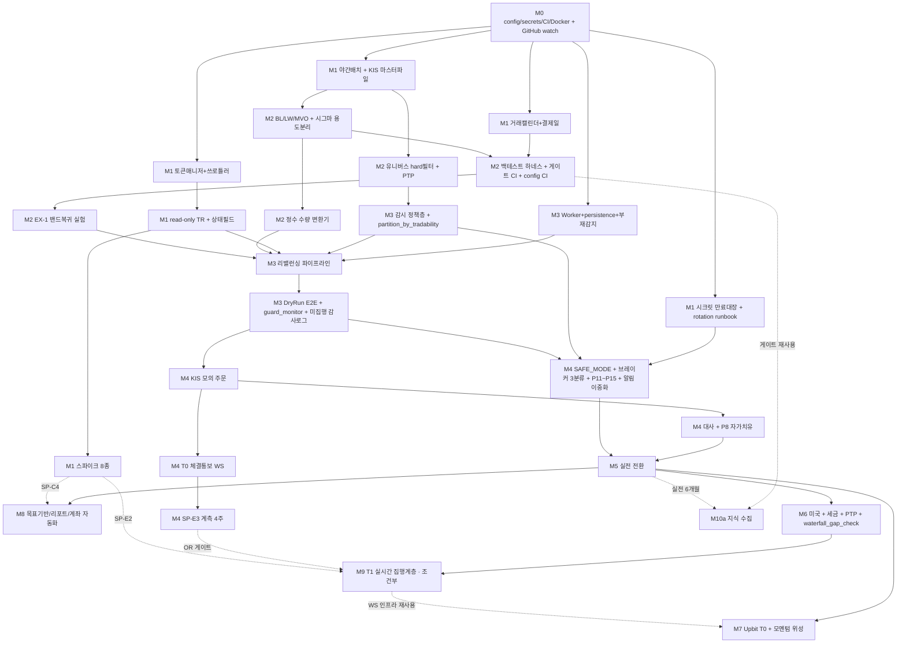

# 04. 개발 로드맵 — 착수 순서 · 마일스톤 · WBS · 게이트 · 일정

> 이 문서는 **"무엇을 언제 짓는가"의 정본**이다. 집행 스펙의 정본은 [02](02-investment-engine.md), 안전장치 파라미터의 정본은 [03](03-safety-operations.md), 모듈 구조는 [01](01-architecture.md), 실시간·감시는 [06](06-realtime-and-surveillance.md), 자가 개선·롤백 트리거는 [07](07-self-improvement.md)이다. 일정 수치가 다른 문서와 충돌하면 이 문서를 따른다.

### 로드맵 관점에서의 [R1]~[R4] 충족 범위

| 요구 | 이 로드맵에서 실제로 짓는 것 | 미충족 / 조건부 |
|---|---|---|
| **[R1]** 완전 자동 운용 | M3 `partition_by_tradability`, M4 `SAFE_MODE`·브레이커 3분류·알림 이중화·부재 사다리, M8 절세계좌 자동화 | **SP-C4(M1) 단일 변수에 의존.** 실패 시 M8이 6주로 늘고 매도형 지시서 연 1~2회가 남는다. 그리고 [00 §2.2-④]에 따라 **개입 0회를 목표로 삼지 않는다** — `waterfall_gap_check`(11/1)는 의도적으로 남긴 고가치 개입이다 |
| **[R2]** API 최대 활용·실시간 | M4 T0 채널(국내·해외 체결통보), M7 T0 채널(업비트 24/7), **M9 T1 계층은 조건부** | **문언 그대로는 미충족.** 이 시스템은 API 한도를 최대한 소비하지 **않는다**(06 서두). M9는 OR 게이트 둘 다 실패하면 **짓지 않는다** — §1.1 우선순위 표의 "조건부" 행, 게이트 정본은 §2 M9 |
| **[R3]** 유의종목·거래정지 회피 | M1 감시 데이터층(KIS `.mst.zip` + `CTPF1002R`), M3 감시 정책층, M4 pre-trade 게이트 통합, M6 미국 2항목 | **2소스·7항목**이다. KIND 스크래핑·업비트 공지 파싱은 채택하지 않는다. 실질 가치는 위험 회피가 아니라 **P9 오발동으로 인한 자기 유발 전면 HALT 방지**다 |
| **[R4]** 자가 보완·업데이트 | M0 GitHub watch 30분 설정, **M10a(2주)** — 수집기 + 다이제스트 | 파라미터층·섀도·롤백은 **첫 챌린저 후보가 나온 뒤**에 착수한다(부록 A). M10a 진입 게이트는 **M5 실전 6개월 무사고**이며, 이 지연은 일정 문제가 아니라 설계 결정이다 |

---

## 로드맵 원칙

> ① **가치 선행 순서** — 데이터 → 백테스트 → dry-run → 모의 → 실전 소액 → 확장.
> ② **게이트는 "코드 완성"이 아니라 N주 무사고 운용**이다. 정확히는 **동일 빌드 태그에 대한 N주 무사고**이며, 게이트 기간 중 봇 프로세스에 배포된 변경은 [03 §5.2]의 증액 카운터 리셋 규칙과 동일하게 **카운터를 리셋**한다. 예외는 **봇 프로세스가 import하지 않는 코드**(백테스트 CLI·`labs/`·문서·테스트)와 **안전장치 hotfix**이며, 예외 적용 사실을 감사로그에 남긴다. 이 규정이 없으면 "무엇을 검증한 4주인가"가 정의되지 않는다.
> ③ **dry-run 분기는 M1부터** — 나중에 붙이면 모의 검증이 무의미하다.
> ④ **안전장치는 실전 직전이 아니라 M3~M4에서 완성한다** — 오발동도 버그이며, 모의 기간에 튜닝해야 한다.
> ⑤ **fail-safe 기본값은 주문 중단**이다. 단 [00 §5 원칙 10]에 따라 그 목적지는 `STOPPED`가 아니라 **`SAFE_MODE`**다.
> ⑥ **무인 운용 요건은 실전 진입 전에 완성한다.** 부재 감지·`SAFE_MODE`·알림 이중화는 "나중에 붙이는 편의 기능"이 아니라 M5 게이트의 일부다. 상태 모델(`STOPPED` → `SAFE_MODE`)을 실전 이후에 바꾸는 것은 실전 이전에 바꾸는 것보다 훨씬 비싸고 위험하다.
> ⑦ **감시(monitoring)와 집행 최적화(execution optimization)는 다른 마일스톤이다.** 감시는 정확성 문제이므로 실전 전(M1·M3·M4), 집행 최적화는 성능 문제이므로 실전 후 실측 근거를 확보한 뒤(M9).
> ⑧ **자가 개선은 운용 경험이 축적된 뒤에만.** M2~M8의 개선 원천은 논문이 아니라 실전이다.
> ⑨ **마일스톤은 "짓기로 한 것"의 목록이 아니라 "게이트를 통과하면 짓는 것"의 목록이다.** M9는 취소 가능하고, M8은 SP-C4 결과에 따라 범위가 절반으로 준다. **근거 없이 착수하지 않는 것이 일정 준수보다 우선한다.**

---

## 1. 착수 순서와 마일스톤 개요

### 1.1 착수 순서 — 우선순위 규칙 (정본)

마일스톤 번호는 **"어디에 붙는가"**를, 아래 순위는 **"왜 그 순서인가"**를 규정한다. 일정이 미끄러질 때 **위에서부터 지키고 아래에서부터 자른다.**

| 순위 | 항목 | 비용 | 붙는 곳 | 이유 |
|---|---|---|---|---|
| **1** | **집행 가능성 필터** — `partition_by_tradability` + 감시 최소판(2소스: KIS `.mst.zip`, `CTPF1002R`) | M1 +1주, M3 +1주 | M1·M3 | **자기 유발 전면 HALT 제거.** 팔 수 없는 자산을 팔라는 계획 → 주문 거부 → P9(연속 오류 5회) 발동 → 시스템 전체 HALT. 무인 운용에서 이 한 건이 한 달 정지를 막는다. 게다가 [02 §2.3] 유니버스 hard 필터가 M2에서 **어차피 같은 데이터를 요구**한다 |
| **2** | **`SAFE_MODE` + 브레이커 3분류 + P9 분리 + 알림 이중화** | M4 +2주 | M4 | **상태 모델 변경은 실전 이후에 하면 훨씬 비싸다.** 원칙 ④·⑥이 이미 이 배치를 규정한다. Telegram 단일 장애가 한 달 정지로 이어지는 현 구조([03 §3] "브리핑 발송 실패 = 당일 신규 집행 보류")도 여기서 닫는다 |
| **3** | **T0 실시간 채널**(국내·해외 체결통보 + 업비트 WS) | M4 +0.5주, M7 +0.5주 | M4·M7 | **게이트 없이 채택 가능한 유일한 실시간 항목.** 이중 주문·이중 정정 위험 제거는 명백한 순이득이고, REST 폴링을 오히려 **줄인다**. 업비트는 사람이 자는 동안 유일하게 열려 있는 시장이다 |
| **4** | **EX-1 밴드 복귀 실험 + config CI 게이트** | M2 +1.5주(6항목 합계 — 내역은 §2 M2) | M2 | 밴드 규칙은 실전 후 바꾸면 백테스트 스냅샷 기준을 전부 갱신해야 하므로 **지금이 가장 싸다.** `config/*.yaml` 변경이 스냅샷 회귀를 트리거하지 않는 구멍은 자가 개선과 무관하게 지금 필요한 수리다 |
| **5** | **절세계좌 자동화** (SP-C4 결과 분기) | M8 3~6주 | M8 | [R1]의 핵심이나 **M5 실전 이후**다. 실증(SP-C4)은 M1에서 끝나 있어야 범위 확정이 가능하다 |
| **6** | **시크릿 만료 대응** — 만료 대장 + 알림 사다리 + 발급일 분산 + `secret-rotation.md` | M1 +0.2주 | M0·M1 | **비용 거의 0, 무인 운용 최대 단일 실패점.** KIS 오픈API 이용기간 1년, 갱신 시 앱키·시크릿 재발급 |
| **7** | **M10a 지식 수집** | 2주 | M10a | M5 실전 **6개월** 이후. **그 전에 필요한 것은 M0의 GitHub watch 30분 설정이 전부다** |
| **조건부** | **M9 — T1 실시간 집행 계층** | 2.5주 | M9 | §2 M9의 **OR 2조건**을 통과할 때만. **통과 못 하면 짓지 않는다**(원칙 ⑨) |
| **보류** | 감시 이벤트 원장·스크래핑 소스, 파라미터 챌린저층, 실시간 EventBus 등 | — | — | 부록 A |

### 1.2 마일스톤 개요

| 마일스톤 | 이름 | 기간 | 진입 게이트 |
|---|---|---|---|
| M0 | 스캐폴드 | 2주 (+GitHub watch 30분, 앱키 발급일 분산) | — |
| M1 | 데이터 + 브로커 read-only + **감시 데이터층** + **스파이크 8종** | **8주** | M0 DoD |
| M2 | 엔진 + 백테스트 | **10.5주** | M1 DoD |
| M3 | dry-run 라이브 루프 + **감시 정책층** | **5주** | M2 게이트 최초 통과 |
| M4 | KIS 모의 E2E + 안전장치·**무인성** 완성 + SP-E3 섀도 하네스 | **9주** | dry-run 2주 무사고 |
| M5 | **실전 소액 (국내 ETF)** | 2주 + 운용 4주 | 모의 4주 무사고 + 전환 체크리스트 |
| M6 | 미국 확장 + 세금 엔진 + FX 파이프라인 | **7.5주** | 실전 4주 무사고 + **해외 소액 왕복 거래로 정산 방식 실증** |
| **M9** | **T1 실시간 집행 계층 (조건부 · 취소 가능)** | **2.5주** | **OR 2조건**(§2 M9) + M5 실전 4주 무사고. **관측 하한 30건은 조건 ②에만 적용** |
| M7 | 암호화폐 + 모멘텀 위성 + 위성 게이트 하네스 | **6.5주** (조건부) | **M6 DoD 전 항목** |
| M8 | 목표기반 + 리포팅 + 계좌 자동화 | **3~6주** (SP-C4 분기) | M5 이후 병행 가능 |
| **M10a** | **자가 개선 — 지식 수집** | **2주** | **M5 실전 6개월 무사고** |

> **번호에 관한 주의**: M9가 M7·M8보다 번호가 크지만 **착수는 M6 다음**이다. 번호는 식별자일 뿐이며 순서는 §1.1과 §3 WBS가 규정한다.

---

## 2. 마일스톤 상세

### M0 — 스캐폴드 (2주 + 30분)

- 저장소 구조([01 §2] 정본: `src/omra/…`, **`collectors/`는 중립 패키지**), `pydantic-settings` 계층 설정(`config.yaml` + **`.env` 시크릿** + `OMRA__` env 오버라이드), TR-ID 매핑 YAML(`env: live|paper` 스위치 골격).
- Docker Compose(app + litestream), GitHub Actions CI(lint + unit + **import-linter**).
- append-only JSONL 감사로거 유틸(전 마일스톤 공용).
- KIS 실전/모의 계좌 개설, Open API 신청, **통합증거금 신청**, 앱키 2세트 발급.
- **추가 (30분, 코드 불필요)**: 우리가 쓰는 라이브러리(skfolio·pandas·QuantStats 등) + KIS 공식 레포의 **GitHub watch/release 알림 수동 설정**. [07]의 "M10a 이전에 지금 할 수 있는 것"이며, **M10a 이전에 [R4]를 위해 필요한 것은 이것이 전부다.**
- **추가 (규칙)**: **시크릿 발급일을 6개월 이상 분산**한다. KIS 실전 앱키는 M0에서, 업비트 키는 M7 착수 시점에 발급한다 — 같은 달 만료는 그 달 부재가 곧 전면 정지를 뜻한다. 현 로드맵에서 M0와 M7은 40주 이상 떨어져 있어 이 규칙이 자연히 충족된다.

**DoD**: `docker compose up` → 헬스체크 응답, CI green(import-linter 포함), 모의 앱키 토큰 발급 1회 성공, 시크릿 만료 대장([01 §6.2])에 **KIS 실전 앱키를 1급 항목으로 초기 등록**.

---

### M1 — 데이터 + 브로커 read-only + 감시 데이터층 + 스파이크 (6주 → **8주**)

**기존 항목 유지**

- KIS 클라이언트: TokenManager(**SQLite 토큰 테이블** + 락 + 선제 갱신 + EGW00133 백오프), 우선순위 token-bucket(실전 15/모의 2 RPS), retrier.
- read-only TR: 잔고(국내/해외), 현재가, 기간시세, 휴장일(CTCA0903R), 매수가능금액.
- 거래 캘린더: XKRX+XNYS + KIS TR 교차검증, **결제일 계산기**(국내 T+2 예수금, 미국 T+1, 연말 세금 마감일).
- 야간 배치: FDR+pykrx 일봉/종목마스터 → Parquet, 품질 체크(결측/중복/수정주가 점프), 마스터 diff(corporate action 감지).
- **record-replay 카세트 인프라**(1~2주 규모로 별도 배정) + 최초 카세트 세트.

**추가 ①: 감시 데이터층 (+1주, 착수 순서 1위)**

- **KIS 종목마스터 어댑터**: `kospi/kosdaq/konex_code.mst.zip` 무인증 다운로드·고정폭 파싱 → 전종목 플래그(거래정지·관리종목·시장경고·불성실공시·정리매매·단기과열·공매도과열·ETP 유형). **pykrx 스크래핑 경로를 대체**하므로 [03 §8]의 "pykrx 차단" 리스크 중요도가 하락한다.
- **read-only TR 추가**: `주식기본조회`(CTPF1002R) — `tr_stop_yn` / `admn_item_yn` / `etf_etn_ivst_heed_item_yn` / `lstg_abol_dt` / `etf_txtn_type_cd`. 해외 `search_info` — `ovrs_stck_tr_stop_dvsn_cd` / `lstg_abol_item_yn` / **`ptp_item_yn`**(M6에서 hard 필터로 사용).
- **`ksdinfo_*` 예탁원 사전 캘린더**: `td_stop_dt`(매매거래정지기간) 등으로 [03 §1 P8]의 corporate action 처리를 **사후 diff → 사전 캘린더**로 승격.
- **`src/omra/collectors/` 중립 패키지 골격**: 조건부 요청(ETag/If-Modified-Since)·캐시·백오프·`robots.txt` 하드 차단·dedup. **[01 §2.2]의 import-linter 계약 전량을 CI에 등록**한다(발췌 4줄이 아니라 전량 — 계약 파일은 하나뿐이다). 단 `labs` 관련 계약은 M10a 착수 시 활성화하고, '관측 계층 → `engine` 금지'는 정확히는 `research · surveillance · realtime -/-> engine`이다(**`labs`는 `engine` 순수함수 호출이 허용**되므로 제외).
- **감시 카탈로그는 7항목**([06 §5.1]이 정본): KR-01 거래정지 / KR-02 관리종목 / KR-03 ETF·ETN 투자유의 / KR-04 상장폐지 예정 / KR-12 corporate action 매매거래정지 예정 — 여기까지 5항목이 M1, US-01·US-02는 M6. 나머지는 [06] 부록 A의 "확인했으나 우리 유니버스에 해당 없음" 목록으로 남긴다.

**추가 ②: 시크릿 만료 대응 (+0.2주, 착수 순서 6위)**

- 만료 대장 스키마 + 알림 사다리 D-45/D-30/D-14/D-7/D-3/D-1 구현(자동 조치는 M4).
- **`docs/runbook/secret-rotation.md`**: 포털 갱신 → 새 키 검증 호출 → `.env` 교체 → `docker compose up -d --force-recreate app` → 기동 셀프체크 통과 확인 → 대장 갱신. **소요 15분, 장 마감 후 수행.**

**추가 ③: 스파이크 8종 (+0.8주) — 하드캡**

설계 원문 합계 38개 중 **로드맵 또는 정본 설계를 뒤집는 것만** 남겼다. 명명: `SP-A*`(감시 소스) / `SP-B*`(API 한도) / `SP-C*`(자동화 갭) / `SP-E*`(실시간 타당성) / `SP-R*`(리서치 소스).

| 등급 | ID | 항목 | **무엇을 뒤집는가** |
|---|---|---|---|
| **최상** | **SP-C4** | **절세계좌 주문 경로 실증** — `ACNT_PRDT_CD` 22/29/ISA로 ① 잔고조회 ② 퇴직연금 매수가능조회 ③ 현재가 −30% 지정가 1주 → 미체결 확인 → **즉시 취소**. 모의 도메인에 연금계좌가 없으므로 **실계좌 필수**(최소 금액·즉시 취소·1회).<br>**실행 조건(전부 필수)**: ⓐ **장중 사람이 화면 앞에서 수동 실행** — 자동 스케줄 금지 ⓑ 주문 → 미체결 확인 → 취소까지 **60초 상한**, 초과 시 즉시 취소 시도 ⓒ 취소 실패 시 **MTS에서 수동 취소**(절차는 `docs/runbook/spike-c4.md`) ⓓ 대상 계좌 예수금은 1주 매수 가능 최소액만 남긴다 | **[R1] 달성 여부 자체.** 성공 시 M8 6주 → **3주**(지시서 UX가 사실상 삭제). 실패 시 "ETF 적립식 자동매수 예약 + 은행→증권 월정액 자동이체" 폴백을 M8 정식 스펙으로 확정 |
| **최상** | **SP-C1** | **과표기준가 자동 수집 가능성** | [02 §5.3] 폴백 채택 여부와 임계 재캘리브레이션. **이번 리서치로도 공개 API를 찾지 못했다** — 폴백(실차익 과대추정)이 기본 경로가 될 가능성이 높다는 것이 현재 추정이다 |
| **최상** | **SP-C3** | **KIS 모의투자 제약** — 참가 기간 만료 정책, 미지원 TR 목록, **해외 주문유형 LOC/MOO/LOO 실전·모의 지원 여부**(주문구분 코드 실증), **모의 도메인 WebSocket 지원 여부·접속 URL/포트·체결통보 tr_id**(REST의 `T→V` prefix 규칙이 WS에는 성립하지 않는다 — [01 §3.2]) | [02 §4.1] 미국 기본 경로의 전제. **LOC 미지원이면** 미국 기본 경로가 장중 지정가가 되고, [00 §6.2]의 LULD 영구 제외와 [02 §4.5]의 체결 가정이 함께 무효가 된다([02 §4.5] 연쇄 참조).<br>**참가 기간 < 4주이면**: 게이트를 **[모의 최대 기간] + [DryRunBroker 병행으로 4주 채움]**으로 대체한다. 줄어드는 것은 **M4 섀도 계측 구간 = 게이트 조건 ②(판정 불일치율)의 관측 표본**이므로, §2 M9의 관측 하한을 **M5 실전 4주 관측을 합산해 채우고 미달 시 판정 불가로 처리**한다. **조건 ①은 M5 실전 실체결 기준이므로 모의 기간 단축의 영향을 받지 않는다** — 이전 판본의 "조건 ① 자동 탈락"은 개정으로 조건 ①의 입력이 모의에서 실전으로 바뀐 것을 반영하지 못한 서술이었다. 재신청이 가능하면 소요를 M4 일정에 포함한다.<br>**모의 WS 미지원이면**: M4에서 T0를 검증하지 못하므로 [01 §5.3]의 REST 폴백 경로를 그대로 원용하고, T0 실사격은 M5 첫 주 `manual_approve` 구간으로 이월한다 |
| 상 | **SP-A1** | **`CTPF1002R`가 ETF에 대해 상태 플래그를 실제로 채우는가** (`tr_stop_yn`·`admn_item_yn`·`etf_etn_ivst_heed_item_yn`·`lstg_abol_dt`) | 감시의 2소스 중 하나가 소멸한다. 실패 시 **마스터파일 단독 폴백**으로 확정하고 교차검증을 포기(단일 소스 신뢰) |
| 상 | **SP-A2** | **`.mst.zip` 갱신 주기**(`Last-Modified` 3~5일 관측) + **플래그 인코딩**(`Y/N` vs `0/1` vs 공백) | `unknown` 판정의 `max_age`(잠정 2거래일)와 스냅샷 유예 정책. 갱신이 일 1회가 아니면 P12(감시 소스 침묵) 임계도 재산정. **인코딩이 관측되지 않는 필드는 해당 항목만 `unknown`으로 두고 [06] 부록 A로 이관**한다. **SP-A1·SP-A2가 둘 다 실패하면** 감시 데이터층 자체가 성립하지 않으므로 착수 순위 1위를 M1이 아니라 M3로 미루고, 그때까지 `partition_by_tradability`는 "보유 종목 전량 tradable" 상수 구현으로 둔다(자기 유발 HALT 방어는 P9-order의 venue 분리가 부분 대체한다) |
| 상 | **SP-C5** | **앱키 1개로 본인 명의 복수 CANO 조회·주문이 가능한가** | 불가 시 TokenManager·RateLimiter를 **앱키 단위로 다중화**해야 한다 — [01 §5.1·5.2] 구조 변경 |
| 상 | **SP-B14** | **KIS 앱키 만료일을 API로 조회할 수 있는가** | **무인 운용 최대 단일 실패점.** KIS 오픈API 이용기간은 1년이며 갱신 시 앱키·시크릿이 재발급된다. 조회 불가면 만료 대장이 **수동 입력 기반**으로 확정되고, 알림 사다리가 유일한 방어가 된다 |
| 상 | **SP-E2** | **`H0STNAV0` 실시간 NAV 수신 가능 여부** — 수신되는가, 그리고 그 값으로 계산한 괴리율이 KRX 공시값·`nav_comparison_trend`와 일치하는가 | **M9 착수 여부의 절반.** 불가·불일치 시 [02 §4.4] iNAV 게이트는 **REST 스냅샷 경로(30분 × 3)로 확정**되고, [06]의 실시간 NAV 경로 설계는 폐기된다 |

**9번째 스파이크를 넣고 싶으면 위 8개 중 하나를 빼라** — §4 주의점 3 참조.

**DoD**: 배치 7일 연속 무인 성공 · 실계좌 잔고 read-only 적재 · 카세트 세트 녹화 · **마스터파일 7일 연속 파싱 성공** · import-linter 계약 green · 스파이크 8종 결과 문서화(설계 반영 포함) · **SP-C4 결과로 M8 범위 확정** · **M1 W7 T0 의존 검증 2건(`approval_key` 유효기간·재발급 영향, SP-B3) 결과 문서화**.

---

### M2 — 포트폴리오 엔진 + 백테스트 (9주 → **10.5주**)

가장 소요가 큰 단계이며 **이 로드맵 최대의 단일 리스크**다(§4 주의점 2). **범위를 지켜라**: 기준 전략 1개가 게이트를 통과하면 즉시 M3로 — 엔진 고도화는 실전 운용과 병행한다.

**기존 항목 유지**

- 기대수익(역최적화+BL), 공분산(LW), 제약 MVO+턴오버 페널티, HRP sanity — skfolio 기반.
- 정수 수량 변환기(순수 함수 — 백테스트/dry-run/실전 공유), 밴드 판정기, cash-flow first.
- 백테스트 하네스: 일 단위 종가 시뮬(수수료·거래세·슬리피지·배당·환전 스프레드·세전/세후), QuantStats 리포트.
- lookahead 자동탐지, Walk-Forward, **백테스트 게이트 CI**(스냅샷 회귀 — 코어 게이트 C1~C3만, [02 §8.2]).

**추가 (+1.5주) — 아래 6항목만. 그 외 알고리즘 개선(Gerber, vine copula, Schur의 P7 대체 활용)은 전부 M10 이후다.**

1. **EX-1 밴드 복귀 실험** — 현행 `0.5d`(부분 복귀 50%) vs `ρ·b`(ρ ∈ {0.75, 0.875, 1.0}). [02 §4.3]이 이 값을 **"M2 EX-1 결과에 따라 확정"으로 잠정 표기**하고 있으며, 검증 전 확정을 금지한다. 근거(Davis-Norman 1990의 no-trade region, Vanguard 2024-12의 200/175 규칙)는 [05 §4.5]에 병기되어 있으나 **우리 데이터로 확인하기 전에는 채택하지 않는다.** 부산물로 실제 연간 밴드 트리거 횟수를 얻어 [07]의 관측 기간 가정을 재산정한다.
2. **공분산 용도 분리** — `Σ_strategic`(월 1회 목표 산출) / `Σ_monitor`(리스크 관측). 크립토 슬리브가 이미 EWMA를 쓰므로 신규 코드는 최소다.
3. **config 변경 CI 게이트 확장** — **사람이 편집하는 입력물** `config/*.yaml` 변경이 백테스트 스냅샷 회귀를 트리거하게 한다. **잡 산출물(`var/policy/targets.yaml`·`universe.yaml`)은 대상이 아니다**([01 §6.1] 입력물·산출물 분리). **자가 개선과 무관하게 지금 필요한 구멍 메우기다**(현재는 코드만 바꿔도 게이트가 돌고, 파라미터를 바꾸면 안 돈다).
4. **유니버스 hard 필터에 M1 감시 플래그 편입** — `admn_item_yn == 'N'`, `tr_stop_yn == 'N'`, `etf_etn_ivst_heed_item_yn == 'N'`, `lstg_abol_dt` 없음, **`ptp_item_yn == 'N'`(미국 — [02 §2.3] hard 조건)**, `|etp_chas_erng_rt_dbnb| ≤ 1`(레버리지·인버스 자동 배제). **필터는 백테스트에서 as-of 기준으로 재평가**한다([02 §2.3] — 현재 플래그를 과거에 적용하면 그 자체가 lookahead다).
5. **가드 A/B 백테스트 게이트**([03 §4.4]) — 가드·감시 개입 on/off 비교(`sim_mode: clean` vs `with_guards`, [02 §8.1.1]). **필수 포함 구간: 2020-02~04 / 2022 전년 / 2024-08.** 03이 이 게이트를 CI 병합 조건으로 요구하는데 M2에 없으면 M3 이후 소급 구축이 된다.
6. **백테스트 실험 원장**(`experiments`, append-only — 사양 해시·기간·결과) — **[02 §8.2] DSR의 `N` 산출과 M7 위성 게이트 S1~S4의 전제**다. [07 §13]에 따라 `G0` 사전등록 워크플로와 챌린저 러너는 보류하되 **테이블과 실행 기록은 여기서 짓는다.** 이것이 없으면 M7에서 `N`을 산출할 방법이 없다.

**자산 생애주기·데이터 접근 계약**([02 §8.1])은 백테스트 하네스의 일부이므로 "기존 항목 유지"에 포함된다 — 상장폐지 처리 없이 10년 백테스트를 돌리면 CI 스냅샷 기준값 자체가 왜곡된다.

> **PTP 필터를 M2에 넣는 이유**: 미국 PTP(Publicly Traded Partnership)는 IRS §1446(f)에 따라 **매도 대금 총액(gain이 아니라 gross proceeds)에 10% 원천징수**된다. 현 코어 후보는 해당 없으나 **위성·대체 페어 교체 시 사고가 난다.** 유니버스 필터에 hard 조건으로 박아두는 것이 유일한 구조적 방어다.

**DoD**: 기준 전략(국내상장 ETF 유니버스 글로벌 자산배분)이 10년 백테스트에서 코어 게이트 통과 + lookahead 0건 + WF에서 in-sample 대비 붕괴 없음 + **EX-1 판정 완료**(destination 채택/거부 확정 — **`single` 계좌 모델로 수행한다**([02 §8.1]). 밴드 복귀 비율은 계좌 유형과 독립인 회전율·드리프트 문제이고, 세후 CAGR은 일반위탁 기준 **하한값**으로 비교한다) + config CI 게이트 green + **10년 백테스트 1회 실행 시간을 VPS 사양에서 실측** + **밴드 트리거 1회당 회전율 분포 산출 → P11 이월 상한을 95백분위 × 1.5로 재설정**([03 §1.2] 정직성 표기) + **축소 유니버스(N=5, [02 §3.3.1])에서 레벨 5·6·7 제약의 실행 가능성(feasibility) 확인**(본인 레벨 ±1이 사전계산 대상이므로 세 레벨 모두 검증).

> **게이트 미통과 시 절차(필수)** — "M2 게이트 최초 통과"가 M3 진입 조건인데 통과 실패 시 무엇을 바꿀지가 없으면 무한 튜닝 루프가 된다.
> ① 허용되는 조치는 **사전 등록된 3개 시도**뿐이다 — (a) `risk.level` 하향 1단계 (b) [02 §2.2] 승인된 대체 페어 범위 내 유니버스 1:1 교체 (c) 벤치마크를 60/40에서 계좌 유형별 정적 배분으로 교체(**벤치마크 교체이지 시뮬의 계좌 분리가 아니다** — [02 §8.1] 계좌 모델은 `single` 고정). **각 시도는 사양 해시와 함께 실험 원장에 기록**한다(위 추가 항목 6).
> ② **3회 시도 후에도 미통과면 M3로 넘어가지 않고 [05]의 근거 재검토로 되돌아간다**(로드맵 일시 중단).
> ③ 어떤 경우에도 **C2(lookahead 0건)와 C3(스냅샷 회귀)는 완화 대상이 아니다.**

> **실행 시간 실측의 용도**: [07]의 `G2`(런타임 챌린저 백테스트) 게이트는 월 1회 봇 환경에서 10년 백테스트를 재실행하는 것을 전제한다. **30분을 초과하면 `G2`의 백테스트 구간을 5년으로 축소하거나 `G2` 자체를 삭제한다**(CI 스냅샷 회귀가 이미 같은 역할을 한다). 어느 경우든 `G2`는 봇 프로세스가 아니라 `docker compose run --rm tools python -m omra.cli backtest --challenger` **별도 프로세스**([01 §1.6]의 `tools` 서비스)로 실행하고, 봇은 결과 파일만 읽는다.

---

### M3 — dry-run 라이브 루프 + 감시 정책층 (4주 → **5주**)

**기존 항목 유지**

- Worker 상태머신 + throttle + heartbeat + healthcheck. **상태 집합은 `RUNNING / SAFE_MODE / PAUSED / STOPPED / HALTED / RELOAD_CONFIG`** — `SAFE_MODE`의 전이 규칙 구현은 M4지만 **열거형에는 M3에서 자리를 만든다**(나중에 상태를 추가하면 persistence 마이그레이션이 필요하다).
- 일일 사이클 전체([01 §4.2] 시각표): 셀프체크 → 판정 → 계획 → 브리핑 → 시뮬 체결 → 장부 → EOD.
- DryRunBroker(BrokerGateway 시뮬 구현 — **분기는 이 클래스 선택 하나뿐**), persistence + 재시작 복원.
- Telegram 명령: `/status /balance /pause /resume /stop`, 브리핑(발송 성공 게이트 포함).

**추가 (+1주, 착수 순서 1위의 후반부)**

- **감시 정책층** — **단일 테이블** `surveillance_flags` (**PK = `(instrument_key, risk_type, source)` 복합키**, `level`, `state`, `effective_from`, `raw_value`, `observed_at`, `resolved_at`, `deadline_at`, `override_*` — 스키마 정본은 [06 §7.1]) + **소비자 API** `surveillance.gate.assert_tradable(order)`. 등급은 `SV0`(기록) / `SV1`(알림) / `SV2`(신규매수 금지) / `SV3`(거래 동결)이며, 청산은 등급이 아니라 별도 타입 `ESC_REPLACE` / `ESC_LIQUIDATE`다(연속 스펙트럼으로 읽히지 않게 의도적으로 분리 — [06] 정본). **이벤트 원장·`source_health`·오탐률 자동 강등은 짓지 않는다**(부록 A).
- **`partition_by_tradability()`** — `daily_rebalance_check` 진입부. `SV3` 자산은 드리프트 계산에서 **고정 비중**으로 취급(분모에는 남되 조정 대상에서 제외)하고 나머지로만 목표를 재정규화 → 정수화 → 주문. **불변식: `SV3` 자산에 대한 주문 0건**(property-based 테스트 대상).
- **`unknown` 판정과 스냅샷 유예** — 각 소스에 `max_age`(잠정 2거래일). **전일 성공 스냅샷이 `max_age` 이내면 그것을 사용**하고, `unknown`은 "한 번도 관측된 적 없거나 스냅샷이 `max_age`를 초과"한 경우에만 부여한다. `unknown = SV2`(매수만 차단, 전체 HALT 아님). **소스 장애 하루는 아무것도 바꾸지 않는다.**
- **07:00~07:30 창의 하드 예산 10분** — `surv_daily_poll`·`surv_overseas_poll`·`surv_ksdinfo` **3개 합산** 타임아웃 300초([01 §4.2] 정본). **`signal_and_plan`(07:30)은 감시 폴 완료를 기다리지 않고** 그 시점 스냅샷으로 진행하며 미완료 종목은 `unknown = SV2`로 처리한다. 감시 폴 실패가 판정 자체를 지연시켜서는 안 된다(브리핑 지연 → 당일 집행 보류 → 자기 유발 정지).
- **`drift_monitor` → `guard_monitor` 개칭** — 매시 정각 잡을 "알림 전용"에서 "알림 + **축소 방향** 가드 발동 가능"으로. 산출은 `{PROCEED, DEFER, SHRINK, ABORT}` + 가격 힌트로 제한되며 수량·방향·목표비중을 생성할 수 없다([00 §5 원칙 9]). **집행 창 밖에서는 T0 채널(업비트 ticker)과 REST 스냅샷만 사용한다** — 개칭은 관측 주기를 바꾸지 않는다.
- **미집행 주문 감사로그 필드** — `Verdict != PROCEED`인 모든 판정에 "이 판정이 없었다면 무엇이 일어났을 것인가"(가상 체결가·수량)를 기록한다. [03 §4.6]의 tracking error 5항목 분해 중 ③④의 **입력이며, 선택이 아니라 필수 요건**이다. 여기서 안 만들면 M5 이후에 소급 계산이 불가능하다.
- **부재 감지(presence detection) 골격** — `last_seen` 추적(Telegram 명령 / 대시보드 로그인 / 브리핑 읽음). M4의 `SAFE_MODE` 사다리가 이 위에 올라간다.

**DoD**: VPS 2주 연속 무인 구동(크래시 0, 재시작 복원 검증 1회) · 감사로그에 전 결정 기록 · **`SV3` 자산 주문 0건 property 테스트 통과** · **소스 전면 장애 하루를 주입해도 계획이 변하지 않음을 dry-run으로 실증**(스냅샷 유예).

---

### M4 — KIS 모의투자 E2E + 안전장치·**무인성** 완성 (5주 → **9주**)

> 이 마일스톤이 [R1]("별다른 앱 조작 없이")의 실질 구현부다. 원칙 ④·⑥이 이 확장을 정당화한다 — **상태 모델을 실전 이후에 바꾸는 것은 실전 이전에 바꾸는 것보다 훨씬 비싸고 위험하다.**

**기존 항목 유지**

- KISBroker 실구현(모의 도메인): 주문/정정/취소/체결조회, 재호가(5분 × 3, marketable limit까지), 타임아웃 취소.
- **Protections P1~P10 + kill switch + 주문-잔고 대사** ([03] 정본 파라미터), P2 실측 재캘리브레이션.
- 대시보드(개요/드리프트/주문이력/안전장치 패널), 시뮬-실전 괴리 건별 기록.
- 장애 주입: 토큰 강제 만료, 네트워크 차단, 프로세스 kill 후 복구 각 1회 통과.

**추가 ① — `SAFE_MODE` + 브레이커 재편 (+2주, 착수 순서 2위)**

- **`BotState`에 `SAFE_MODE` 도입.** 정의는 "매도 금지"가 아니라 **"목표비중 하향 방향의 매도 금지"**다([03] 정본). 밴드 복귀 매도는 목표비중을 **유지**하는 행위이므로 허용된다 — 이것이 없으면 P1을 `SAFE_MODE`로 바꾼 명분(하락장이야말로 밴드 리밸런싱의 가치가 가장 큰 국면) 자체가 실현되지 않는다. 노출 상한은 주문금액이 아니라 **순매수액 일 NAV 3% / 월 NAV 10%**이며, 밴드는 2배 확대, cash-flow first는 계속된다.
- **브레이커 등급 재분류**(요약 — **정본은 [03 §1.1]**): 등급 A(장부 무결성) / 등급 B(시장 상태, `SAFE_MODE` 경유 조건부 자동) / **등급 B\*(P1b −25%·P13 40%·순매수 상한 초과 — `HALTED`이며 부재 사다리 자동 강등 비적용)** / 등급 C(자기 행위, 날짜 변경 시 자동 해제, 2일 연속 소진 시 등급 A로 격상).
- **P9 분리** — VI·거래정지로 인한 주문 거부는 P9 연속 오류 카운트에서 제외한다. 이것이 착수 순서 1위와 짝을 이루는 나머지 절반이다.
- **P1 비대칭 해제** — MDD −15%에서 **매도는 계속 차단하되 매수는 사람 승인 하에 허용**한다. −15% 전면 HALT는 하락장 밴드 리밸런싱(= 싸게 사기, 실증이 지지하는 행위)까지 막는 긴장을 만든다. −25%에서 전면 HALT.
- **P8 자가치유를 수량 일치 기준으로** — ① 체결내역 재조회 3회(10분 간격) 결과 동일 ② 불일치가 특정 종목·수량으로 국소화되고 그 수량이 CA 비율로 **정확히 재현**됨 ③ 현금 불일치 부재 ④ 목적지는 `RUNNING`이 아니라 `SAFE_MODE`. **"차이 < NAV 0.5%" 같은 금액 임계는 쓰지 않는다** — 1억 계좌의 50만원은 진짜 버그를 통과시키는 크기다.
- **P11~P15** — P11(회전율 일일 예산) / P12(감시 소스 침묵) / P13(동결 자산 비중 > NAV 20% → **`SAFE_MODE`**, 40% 초과 시에만 HALT) / P14(기한부 미승인) / P15(감시 이벤트 폭증, `max(4건, 30%)`).
- **`SAFE_MODE` × `SV3` 상호작용** — 감시 동결로 인한 **비대칭 재정규화(축소 방향)는 `SAFE_MODE`에서 허용**한다. 목표비중을 낮추는 것이 아니라 거래 불가능한 자산을 계산에서 제외하는 행위이기 때문이다. 배분 대상에서 제외된 목표 몫은 `frozen_reserve`로 격리되어 **매수 레그 재원**(경로 무관)과 `cash.buffer` 판정에서 제외된다. **`frozen_reserve`는 "발생한 현금"이 아니라 가상 예약(notional reservation)이다** — [02 §4.2]·[03 §2.3]이 정본이며, 현금으로 읽으면 존재하지 않는 재원을 가리키게 된다.
- **부재 기반 단계적 자동 재개** — HALT + 무응답 24h + 등급 B/C → `SAFE_MODE` 자동 강등. 무응답 72h + 등급 A → 자동 재개 없음, 일 1회 자가진단 재시도. **어떤 경우에도 자동으로 평시 `RUNNING` 복귀는 없다.** `/away 30d` 장기 부재 모드를 제공하되, **선언하지 않아도 무응답 감지로 같은 상태에 수렴**해야 한다(사람이 선언을 잊는 것이 정상이다).
- **알림 채널 이중화(필수)** — Telegram + SMTP 이메일. **양쪽 모두 실패**할 때만 집행을 보류하며, **양쪽 실패가 2영업일 연속이면 `SAFE_MODE` 전이**([03 §3]). 알림 등급의 정본은 **[03 §7.2] 표**이며 M4는 그 표를 그대로 구현한다 — `Verdict != PROCEED`의 기본 등급은 **silent**, info는 감시 등급 진입 1회만(동일 종목·사유 재알림 금지), **critical은 표의 ①~⑩**이다(이 문서에 목록을 중복 나열하지 않는다). 단 `waterfall_gap_check`·양도세 기한 항목은 **M6 구현 시점부터 활성화**한다. **[03 §8]이 "알림 무시 습관화"를 최상위 운영 리스크로 등재했으므로 등급 미정의는 그 리스크를 직접 실현시킨다.**
- 시크릿 만료 **자동 조치** 구현: D-7 해당 브로커 슬리브 **`PAUSED_ALL`**(양방향 정지 — `PAUSED`는 매도·정정·취소를 허용해 P9-order 폭주를 막지 못한다, [03 §2.1]), D-3 전체 `SAFE_MODE`. `/away` 선언 시 부재 기간과 겹치는 만료 시크릿이 있으면 즉시 경고.

**추가 ② — 감시 게이트 pre-trade 통합 + 오발동 튜닝 (+0.5주)**

- `realtime.guards`는 호가·체결가·NAV만 소비하고, **거래정지·VI 이벤트의 소유자는 `surveillance` 단독**이다. 주문 직전 `surveillance.gate.assert_tradable(order)`를 **pull**로 호출한다.
- 모의 4주간 감시 등급 오발동률을 기록하고 임계를 재캘리브레이션한다(원칙 ④ — 오발동도 버그). **오발동의 정의(정본)**: `SV2`/`SV3`가 부여된 (종목, 사유) 중 **동일 영업일에 마스터파일·`CTPF1002R` 재확인으로 사유 부재가 확인된 건**. **`unknown → SV2`는 오발동이 아니라 별도 `unknown_rate`로 집계**한다 — 소스 장애 하루가 오발동 통계를 오염시키면 임계 재캘리브레이션이 왜곡된다. [06 §13.3]의 "오발동 0건"은 이 문서의 DoD에 종속되는 권고 목표다.

**추가 ③ — T0 실시간 채널 (+0.5주, 착수 순서 3위) + SP-E3 섀도 계측 하네스 (+1주)**

- **국내·해외 체결통보 WS 상시 2건.** `decoder.py`가 Fill을 `asyncio.Queue`로 넘기고 소비자가 장부에 반영한다. **EventBus는 만들지 않는다**(구독자가 토픽당 1~2개뿐인 in-process pub/sub은 간접층만 만든다). 효과는 **이중 주문·이중 정정 위험 제거**이며, REST 체결조회 폴링을 줄이므로 API 소비는 오히려 감소한다. **모의 도메인 WS 지원 여부·URL·tr_id는 SP-C3에서 확인**한다(미지원 시 폴백은 [01 §5.3] REST 경로를 그대로 원용).
- **`SP-E3` 섀도 계측 하네스 (+1주)** — 집행 창 한정으로 `H0STNAV0`·`H0STASP0`를 **섀도 용도로만** 구독하고 이중 판정 로거를 붙인다. **이 구독 코드는 [06 §1.2] `T1` 채널을 섀도로 쓰는 것이며 집행 경로에 결선하지 않는다.** M9 취소 시 `monitoring/` 섀도로 남긴다. **도메인 분리**: 시세·NAV 구독은 **실전 approval_key**, 주문은 **모의 도메인**을 쓴다(모의에 NAV 스트림이 없어도 계측이 성립하게 하기 위함).
  - 기록 지표 ① **게이트 판정 불일치율** — "REST 스냅샷 1회로 판정한 게이트 결과" vs "실시간 NAV·호가로 판정한 결과"가 다른 주문의 비율.
  - 기록 지표 ② **집행 품질 차이** — **모의 가상체결가는 shortfall 산출에 쓰지 않는다.** ②는 **M5 실전** REST 집행의 실체결가와 동시각 WS 스냅샷 기준 기대체결가의 차이로만 계산한다(모의 체결 엔진의 큐 우선순위·부분체결 특성이 실전과 달라 측정값이 아니라 시뮬 가정 비교가 되기 때문이다).
  - **이 두 숫자가 M9 진입 게이트의 유일한 입력이다.**

> **순환처럼 보이는 구조에 대한 정직한 기술**: M9를 짓기 위한 근거를 모으려면 M9가 쓸 채널의 일부를 M4에서 먼저 열어야 한다. 이것은 순환이 아니라 **"구독은 하되 결선하지 않는다"는 섀도 배치**이며, 그 비용(+1주)을 M4 일정에 명시적으로 계상한다. 비용을 숨기고 "M9는 2.5주"라고만 쓰면 취소 가능한 마일스톤의 실제 가격이 가려진다.

**추가 fail-safe 항목**

- **슬리브 단위 상태 전이 + 격리 실효 검증**: 시크릿 만료 D-7 → 해당 슬리브 **`PAUSED_ALL`**(양방향 정지 — `PAUSED`는 매도·정정·취소를 허용해 P9-order 폭주를 막지 못한다, [03 §2.1]), D-3 → 전체 `SAFE_MODE`. **검증은 [03 §4.3] F15 주입 테스트(DryRun, 만료일 주입)로 수행**한다 — 업비트 실계좌 키 발급 자체가 M7이므로 M4에서 실키 실증은 불가능하다. **실키 기준 실사격은 M7 DoD로 이관.**
- 디스크 80% 초과 → 로테이션 강화, 90% 초과 → **데이터 적재만 중단하고 거래는 유지**(순서를 반대로 하면 안 된다).
- Dead-man's switch ping 조건에 **"드리프트 판정 실행 성공"** 추가 — *"30일간 주문 0건"*이 정상(밴드 미도달)인지 판정 로직이 죽어 조용히 아무것도 안 하는 것인지를 현 설계는 구분하지 못한다.

**부재 시뮬레이션 필수 케이스 — 12월 3중 충돌**

상폐 D−10 사전 이전 / 하베스팅 D\*−2 마감 / `SAFE_MODE` 동시 발생. 우선순위는 ① **상폐 D−10 사전 이전**(00 §3.2 E7, `SAFE_MODE` 예외 — 과세 시점 통제) > ② 하베스팅 D\*−2(`SAFE_MODE` 중 자동 실행 금지, 승인 필요) > ③ 밴드 리밸런싱이며, ①과 ②가 같은 종목에 걸리면 ①이 ②를 흡수한다.

> **M4에서는 "판정만" 검증한다.** 세금 엔진(하베스팅·`pending_transfers` 실집행)은 **M6에서 만들어지므로**, M4 케이스는 **`tax_overlay` 스텁이 우선순위 ①>②>③을 올바르게 반환하는지와 `SAFE_MODE` 예외 판정이 맞는지**만 확인한다(주문 생성 없음). **실집행 검증은 M6 DoD로 이관**한다. 03 §4.7의 필수 편입 케이스도 같은 범위로 읽는다. **이 판정 케이스를 통과하지 못하면 M5로 넘어가지 않는다.**

**DoD 겸 M5 진입 게이트 (10항목)**

1. 모의계좌 **4주 연속 무사고**(대사 불일치 0, 의도치 않은 주문 0, 재주문 루프 0, 크래시 자동 복구).
2. 그 4주간 실제 리밸런싱 ≥ 2회 — 드리프트가 안 나면 **모의계좌에 의도적 불균형 포지션을 만들어 실전 밴드 그대로 트리거**(밴드 파라미터를 조작하지 않는다 — 검증 대상은 실전 config). **추가로 SP-E3 계측 주문이 누적 30건에 도달할 때까지 트리거를 반복**한다(M9 게이트 조건 ②의 관측 하한 — §2 M9). 4주 안에 미달하면 M5 실전 4주 관측으로 합산한다.
3. 백테스트 게이트 CI green 유지.
4. **kill switch 실사격**: `/panic`으로 미체결 취소 + 정지 실확인.
5. 전환 체크리스트([03 §5.1]) 전 항목 서명.
6. **부재 시뮬레이션 통과**: 등급 B/C `HALTED` 상태에서 **무응답 24h → `SAFE_MODE` 자동 강등**([03 §5.3.2], `presence.halt_downgrade_no_response_h`) → 축소 운용 → 복귀 사다리 1회 실사격. **등급 B\*(P1b·P13 40%·순매수 상한 초과)는 강등되지 않음**도 함께 단정. **12월 3중 충돌 케이스 포함**(판정만 — 실집행은 M6 DoD).
7. **알림 이중화 실사격**: Telegram 차단 상태에서 이메일 폴백으로 브리핑 발송 성공 → 집행 진행 확인.
8. **자가치유 실사격**: 인위적 대사 불일치(액면분할 시뮬) → 3회 재조회 → 수량 일치 확인 → 자동 재동기화 → `SAFE_MODE` 복귀 1회. **수량이 CA 비율로 재현되지 않는 케이스는 HALT를 유지하는지도 함께 검증한다.**
9. **[03 §4.3] 장애주입 F1~F22 전 항목 green.** 특히 신설 항목 — F18(환전 재정산 현금 불일치 → 화이트리스트 통과), F19(업비트 점검 503 → P9 미소비, KIS 코어 정상), F20(부재 `AWAY` 중 밴드 breach가 실효 grace 클램프로 당일 집행됨), **F21**(주문 제출 직후 SIGKILL → 고아 주문 흡수, P8 미발동 — [01 §3.2] 주문 제출 프로토콜), **F22**(집행 창 도중 재시작 후 당일 가드 예산 누적 유지 — [01 §3.5]).
10. **dead-man's switch ping 실패 주입 1회** — ping 조건 4가지(브리핑 산출물 생성 / 드리프트 판정 실행 / 대사 / 감시 소스 신선도)를 각각 하나씩 끊어 ping 중단이 실제로 감지되는지 확인. **관측 공백("30일간 주문 0건"이 정상인지 판정 로직이 죽은 것인지)은 [03 §8]이 중/고로 등재한 리스크인데, 검증 항목이 없으면 그 방어가 코드에만 있고 검증되지 않은 채 실전에 들어간다.**

**모의 도메인 WS 지원 시(SP-C3)**: 모의 체결통보 WS 수신 1건 이상을 위 1번의 부속 조건으로 확인한다. 미지원이면 REST 폴백 경로로 4주를 채우고, T0 실사격은 M5 첫 주 `manual_approve` 구간으로 이월한다.

---

### M5 — 실전 소액, 국내상장 ETF만 (2주 + 운용 4주)

- `env: live` 전환(3중 확인), 초기 자금 300~500만원, 유니버스는 **[02 §3.3.1] 축소 규칙에 따른 5종**(국내주식·미국주식·국내채권·초단기·금). 300~500만원은 축소 트리거(3,000만원 미만)에 해당하므로 `N = 5`가 정본이며, "5~8종"이라는 이전 표기는 02와 충돌했다.
- 첫 1주 `manual_approve` 모드 → 자동 전환. runbook 실사용, 주간 tracking error 리포트.
- **tracking error 5항목 분해**([03 §4.6])를 첫 주부터 가동한다: ① 비용 ② 체결 시점 ③ 가드·감시 개입 ④ `SAFE_MODE` 제약 ⑤ 잔차. 조사 임계와 롤백 트리거 R1은 **⑤ 잔차에만** 적용한다. ③④를 분리하지 않으면 롤백이 노이즈에 반응한다.

**자금·유니버스 정책은 그대로지만 결과물의 성격이 다르다**: 이제 M5는 "사람이 매일 보는 실전"이 아니라 **"한 달 부재해도 죽지 않는 실전"**이다.

**DoD**: 실전 4주 무사고 + 리밸런싱 ≥ 2회 + **tracking error ⑤ 잔차** 정상([03 §4.6]) + **SP-E3 계측 주문 누적 30건 도달**(M4에서 미달한 경우 — M9 게이트 조건 ②의 관측 하한). 이후 증액 스케줄 개시([03 §5.2]).

---

### M6 — 미국 확장 + 세금 엔진 (5주 → **7.5주**)

**기존 항목 유지**

- 해외주식 TR 집행: **LOC 기본 경로**(개장 전 제출 잡), 장중 지정가 대안, Blue Ocean 코드 레벨 금지, 통합증거금 원화 증거금 체크(버퍼 0.5%), 미국 캘린더 동적 잡.
- 세금 엔진: **(종목 × 이동평균단가) 단위** 하베스팅([02 §5.1] — 로트 단위 아님), 결제일 캘린더 마감 역산, 금소세·건보 임계 누적기, `tax.yaml` effective-date 외부화. 원장 테이블 스키마는 M4에서 선반영.
- **진입 게이트에 실증 포함 — M6 착수 전 실계좌 검증 거래**: M5가 국내 ETF 전용이라 **실계좌에 해외주식 실현손익이 존재할 수 없으므로**, 게이트를 충족시키는 절차를 여기서 명시한다. **미국 ETF 1종을 2회 분할 매수 후 일부 수량 매도**(총 10만원 이하, `manual_approve` 하 사람 승인)해 `해외주식 기간손익`(032) 정산 내역을 생성하고 자체 이동평균 계산과 대사한다. **이 거래는 M5 국내 ETF 유니버스 제한의 명시적 예외이며 M5 DoD 판정에서 제외**한다. 이후 미국 집행은 모의(V-TR)에서 2주 검증 후 실전.
- **첫 해 하베스팅은 "계산 + 지시서 + 수동 승인"만** — 자동 매도는 이듬해부터.

**추가 (+2.5주)** — 내역: 미국 감시 2항목 +0.5 / 양도세 자동화 +1 / `waterfall_gap_check` +0.75 / PTP 실집행 검증 +0.25

- **미국 감시 2항목(US-01 거래정지 / US-02 상장폐지)** — 해외 `search_info` 상태 필드 일 1회 조회를 `surv_overseas_poll`에 편입(+0.5주). Nasdaq halt RSS·EDGAR 8-K Item 3.01은 **짓지 않는다**(초대형 ETF에 발생확률 무시 가능, 부록 A).
- **환율(FX) 파이프라인**([02 §4.7]) — `("fx_rate","USDKRW")` fetcher, 용도별 스냅샷 시각, Parquet 적재, 감사로그 기록. 미국 확장의 전제이므로 위 +1주(양도세)에 포함된 것으로 계상한다.
- **`HDFSCNT0`·`HDFSASP0` 실지연 실측** — M9 조건부 항목에서 분리해 여기서 수행한다. 미국 장중 대안 경로의 가격 산정 규칙([02 §4.1])이 이 값에 의존하기 때문이다.
- **`ptp_item_yn == 'N'` hard 필터의 실집행 검증** — M2에서 필터 코드를 만들었고, 여기서 실제 미국 유니버스에 적용해 통과·탈락 종목을 확인한다.
- **양도세 자동화(+1주)** — `해외주식 기간손익`으로 연간 실현손익 자동 집계 → 250만원 공제 초과 여부 자동 판정 → **대상이 아니면 개입 0회**. 4월 1일 자동 알림 + 증권사 대행신고 신청 딥링크 + 예상세액 + 마감 카운트다운. 증권사 산출 손익 vs 자체 계산 대사. **산출물 자체에 "이 초안은 참고용이며 증권사 대행신고 산출액이 정본이다"를 삽입**한다.
**DoD**

1. 미국 모의(V-TR) **2주 무사고** + 실전 미국 집행 **2주 무사고**.
2. **12월 3중 충돌 실집행 검증 1회 통과** — 하베스팅 주문 생성(**후보 선정·수량 산정은 [02 §5.1.2] 기준**) + `pending_transfers` 분할 매도 + E7 우선순위 ①>②>③ ([03 §4.7]. M4는 판정만, 실집행은 여기다).
3. `해외주식 기간손익`(032) vs 자체 이동평균 계산 **대사 일치**. **국내상장 ETF도 첫 매도 발생 시 증권사 실현손익 명세와 1회 대사**한다([02 §5.2] — 자체 계산의 이동평균 가정 확인. M5에 새 예외 거래를 만들지 않는다).
4. US-01·US-02 감시 플래그 **7일 연속 파싱 성공**.
5. FX 스냅샷 3용도(판정·주문·세금)가 **감사로그에 기록**됨을 확인([02 §4.7]).
6. `waterfall_gap_check` **드라이런 1회**(11/1 이전이면 날짜 주입).
7. `ptp_item_yn` 필터의 **통과·탈락 종목 목록 문서화**.
8. `HDFSCNT0`·`HDFSASP0` **실지연 실측값 문서화** → [02 §4.1] 대안 경로 가격 산정 규칙 확정.

**항목**

- **`waterfall_gap_check` 잡(11/1) 구현** — 연금저축·IRP·ISA의 YTD 납입액을 잔고·입금 내역에서 집계해 공제 한도 잔여를 산출하고, 잔여가 있으면 **critical 등급**으로 "12월 20일까지 X원 추가 이체 필요, 예상 세액공제 Y원"을 알린다(D-12/D-5/D-1 재알림). 연금저축 600만원 공제 미소진 1회 = **79~99만원**의 확정 손실이며, 이는 이 시스템 전체가 추구하는 알파 추정을 두 자릿수 배 압도한다([00 §2.2-④]).

---

### M9 — T1 실시간 집행 계층 (**2.5주, 조건부 · 취소 가능**)

**착수 위치**: M6 이후, M7 이전. 근거는 (a) SP-E3가 M4에서, 실전 검증이 M5에서 끝나야 근거가 생긴다 (b) M7 크립토는 WS 이득이 가장 큰 영역이므로 M9 인프라를 재사용하는 편이 싸다 (c) M6와 병행하면 둘 다 집행 경로를 건드려 위험하다.

#### 진입 게이트 — OR 2조건 (하나만 통과해도 착수, 둘 다 실패하면 취소)

```
① 집행 품질 근거: M5 실전 REST 집행의 실체결가 vs 동시각 WS 스냅샷 기준
   기대체결가의 implementation shortfall 차이 ≥ 5bp
   ★ 모의 가상체결가는 산출에 쓰지 않는다 (모의 체결 엔진의 큐 우선순위·
     부분체결 특성이 실전과 달라 '측정'이 아니라 '가정 비교'가 된다)
                      ── 또는 ──
② 게이트 정확도 근거: "REST 스냅샷 1회로 판정한 게이트 결과"와
   "실시간 NAV·호가로 판정한 게이트 결과"가 불일치한 주문이 ≥ 5%
   (= REST 근사가 게이트를 실제로 헛돌리고 있었다는 증거)

★ 관측 하한 (판정 유효성 요건):
   조건 ② 판정은 SP-E3 계측 대상 주문이 30건 이상일 때만 유효하다.
   미달이면 M4 게이트 기간의 의도적 불균형 트리거(DoD 2번 방식)로 표본을 채우거나
   M5 실전 4주 관측을 합산한다. 그래도 미달이면 '판정 불가 = 취소와 동일 처리'.
   근거: 5% 임계가 '불일치 1건 = 통과'가 되지 않으려면 분모가 21건 이상이어야 한다
        (1/21 = 4.8% < 5%). 여기에 안전마진을 두어 30건으로 잡는다.
        M4가 보장하는 표본은 '리밸런싱 ≥ 2회'뿐이라 8~12종목 × 부분 이탈이면
        한 자릿수~십수 건에 그친다 — 그래서 표본 확보를 요건화한다(아래).

★ 표본 확보 요건:
   M4 DoD 2와 M5 DoD에 "SP-E3 계측 주문 누적 30건에 도달할 때까지
   의도적 불균형 트리거를 반복한다"를 포함한다. 밴드 파라미터는 조작하지 않는다.

전제 조건 (AND): SP-E2에서 H0STNAV0 수신 가능 + M5 실전 4주 무사고
              + [06]의 과매매 방지 장치 설계 완료
```

> **게이트를 OR로 둔 이유**: 실시간의 명분은 [00 §2.2-②]에 따라 **평균 개선이 아니라 꼬리 차단(보험)**이다. 명분이 보험이면 게이트가 체결가 개선(①)만이어서는 안 된다 — 자체 추정(연 1~5bp)에 의해 ①은 거의 확실히 탈락하고, 그러면 "이미 있는 게이트를 실제로 작동시킨다"는 두 번째 명분이 검증되지 않은 채 함께 폐기된다. ②가 그 명분에 대응하는 게이트다.

**둘 다 실패하면**: T1을 짓지 않고 T0(체결통보 + 업비트 WS)만 유지한다. [02 §4.4] iNAV 게이트는 **REST 스냅샷 경로(30분 × 3)로 확정**되고, [06]의 T1 집행 개선 항목은 전부 폐기된다. **이것은 실패가 아니라 게이트가 정상 작동한 결과다.**

#### 범위 — "집행 창 한정 WebSocket"

```
집행 창 진입 (10:00 KRX / 미국 LOC 제출 전후 / 09:00 크립토)
  → 당일 RebalancePlan의 대상 종목만 구독 (통상 2~5개)
집행 창 종료 → 전체 구독 해제
```

- **구독 예산은 사다리가 아니라 명시적 분기**([06 §1.3] 정본): 초과 시 등록 거부 + REST 폴백 + warning, **종목 상한 9개 하드캡**, 절단 순서는 `활성 주문 → DEFER 유지 → 다음 슬라이스 후보`. 축약 사다리 L0/L1/L2와 loop lag 기반 자동 강등은 만들지 않는다. loop lag 측정은 남기되 **알림만** 한다.
- **iNAV 게이트 실시간 경로**: 해제 조건 = 게이트 해소 AND 최소 300초 경과, 연기 3회 상한, **당일 총 연기 90분 상한**. **REST 경로와 판정 결과가 동일해야 하며 차이는 지연뿐이다**(폴백 등가성 — 통합 테스트로 강제).
- **재호가 규칙 정밀화**([02 §4.1]): 5분 만료 시 ① 지정가가 최우선 반대호가 밖 → 재호가(카운트 +1) ② marketable **AND 부분체결 발생** → SKIP(카운트 미소비) ③ marketable이나 **체결 0 → 재호가**(큐 후순위로 판단). 상한 3회 불변.
- **DEFER 중인 종목은 구독 유지**, `max_total_defer_min` 소진 시 해제.

#### 계속 하지 않는 것 (M9를 지어도 하지 않는다)

유니버스 전 종목 상시 틱 감시 / 복잡한 LRU 구독 스코어링 / **일중 드리프트 재판정** / **일중 목표비중 재계산** / 실시간 신호가 수량·방향을 만드는 경로 / **호가 잔량 기반 슬라이싱**(효익 0인데 주문 건수를 늘려 P2·P4를 압박한다 — 기존 금액 기준 분할을 유지).

#### 불변식 (CI 강제)

`realtime -/-> engine.optimizer`, `realtime -/-> engine.rebalancer`, `realtime -/-> tax`. 산출은 `{PROCEED, DEFER, SHRINK, ABORT}` + 가격 힌트로 제한된다. **WS는 최적화이지 의존성이 아니다** — 전면 장애 시에도 REST 폴백으로 집행이 계속되고, 정확성 차이 없이 성능 차이만 존재해야 한다.

**DoD**: T1 구독이 집행 창에서만 등록·해제됨을 2주 관측 · 폴백 등가성 테스트([03 §4.3] F14) green · loop lag 500ms 초과 0회 · 예산 초과 시 REST 폴백 경로 실사격 1회 · **M9 착수 후에도 조건 ②의 불일치율이 5% 미만으로 떨어지면 T1 구독을 해제하고 REST 경로로 되돌린다**(사후 철회 경로를 남긴다).

**M9 착수 시에만 수행하는 스파이크**: SP-B1/B2(WS 등록 상한 41 vs 40, 체결통보가 예산에 포함되는가), 구독 해제 `tr_type`, `H0STMKO0` 필드 체계, `wss://` 지원 여부(미지원 시 [01 §7]에 "평문 채널 사용" 명시), WS 상시 연결 loop lag 1주 실측. **`approval_key` 유효기간·SP-B3(앱키당 세션 수)·WS 세션 생명주기는 T0가 의존하므로 M1 W7/M4로 이관**했다(§5.2).

---

### M7 — 암호화폐 + 모멘텀 위성 (4주 → **6.5주**, 조건부)

**기간 내역**: 기본 4주 + T0 업비트 WS **+0.5주** + **위성 게이트 S1~S4 하네스 +1.5주**(CPCV·이웃 안정성·DSR·부트스트랩 — [02 §8.2]의 실험 원장을 `N` 입력으로 사용) + 듀얼모멘텀 앙상블 **+0.5주**. 이전 판본은 "+1주 중 0.5주만 내역화"되어 있었고 **위성 게이트 구축이 0주로 계상**되어 있었다 — S1~S4는 M7의 활성화 조건이므로 비용을 숨길 수 없다.

- UpbitBroker(동일 `BrokerGateway`), 일 1회 09:00 판정·집행, 김치프리미엄 가드, 키 1년 만료 알림. **크립토 슬리브의 주 1회 변동성 갱신은 유지**(근거 등급 "중간"). **코어 vol targeting은 도입하지 않는다**(Cederburg et al. JFE 2020: out-of-sample 열위 — [00 §2.2-③]).
- **T0 업비트 WS 채택(+0.5주, 착수 순서 3위)**: public(ticker/orderbook) + private. **24/7이라 사람이 자는 동안 사고가 나는 유일한 시장**이며, WS 비용이 사실상 0이고 REST Quotation 소비를 줄인다. 급락·김치프리미엄 가드가 여기에 붙는다. M9를 짓지 않았더라도 **이것은 별개로 채택한다.**
- `/v1/market/all?isDetails=true`의 `market_warning` / `market_event` 필드 감시(1줄, 무료 — 그냥 켜둔다).
- 듀얼모멘텀 앙상블(opt-in) — **위성 게이트 S1~S4**(CPCV·이웃 안정성·DSR·부트스트랩) 통과 후에만 활성화. 위성 모멘텀 슬리브의 DD 축소 규칙은 유지하되, 근거는 **슬리브 상한 10%의 손실 봉인**이며 위성 게이트 S4의 on/off A/B로 검증한다([05 §6.2]).
- **업비트 공지 파싱은 하지 않는다.** [02 §7]이 **BTC 70 : ETH 30 고정, 알트 없음**으로 하드코딩하므로 유의종목·거래지원 종료가 우리 포지션에 발생할 확률은 사실상 0이며, 스크래핑 소스는 유지보수 부채다. 실질 가치가 있는 "입출금 중단·시스템 점검 감지"는 부록 A의 보류 항목이다.
- **진입 조건**: **M6 DoD 전 항목 통과.** 코어 실전이 흔들리면 연기한다.
- **DoD**: 업비트 실계좌 소액 4주 무사고 + 김치프리미엄 가드 발동 또는 주입 검증 1회 + **`VEA` 도입 시 [02 §2.3] hard 필터 통과 확인**([02 §6.1] 기본 페어는 `VOO`/`VXUS`이며 둘 다 [02 §2.2] 1순위다 — 유니버스 밖 종목을 위성이 직접 지명하지 않는다) + **[03 §4.3] F15 실사격**(실키 만료일 기준 D-7 `PAUSED_ALL` / D-3 `SAFE_MODE` 자동 조치 경로 — M4에서는 주입 테스트만 했다) + **F19 실사격**(점검성 응답 시 P9 미소비, KIS 코어 정상) + 위성 게이트 S1~S4 판정 완료.
- **스파이크**: SP-A8/A9(업비트 `market_warning`·`market_event` 실측), **글로벌 BTC 시세 소스 확정**([02 §7]·[06 §1.1] — `KimchiGuard`의 분자 상대편이며 M1이 아니라 여기서 확정한다).

---

### M8 — 목표기반 + 리포팅 + 계좌 자동화 (6주 → **3~6주**, M5 이후 병행 가능)

**SP-C4 결과에 따라 범위가 갈린다.**

| 분기 | 규모 | 내용 |
|---|---|---|
| **SP-C4 성공** (절세계좌 API 주문 가능) | **3주** | 지시서 UX가 사실상 삭제되고 절세계좌가 일반위탁과 동일 경로로 자동 집행된다. 남는 것은 계좌 유형별 하드 제약(IRP 위험자산 70% 등)의 선형 제약 반영뿐 |
| **SP-C4 실패** (조회만 가능) | **6주** | 지시서 UX 정식 구현 + **ETF 적립식 자동매수 예약 + 은행→증권 월정액 자동이체** 폴백 설계. 이 조합이면 절세계좌도 월 단위 개입 0회가 되고 **매도형 지시서만 연 1~2회** 남는다 |

**공통 항목**

- 몬테카를로(block bootstrap 단일 엔진) 목표 확률 모니터, 단순 glide path 규칙.
- LLM 월간 리포트([01 §8] — 고정 DAG, 수치 불변 검증).
- asset location 엔진(계좌별 배치 최적화), 워터폴 제안.
- **밴드 표를 계좌 × 모드 4행으로 구현**([02 §4.3]): 일반위탁 5%p/25% / 연금·IRP(AUTO) 5%p/25% / 연금·IRP(지시서·예약) 7%p/35% / **ISA는 모드 무관 7%p/35%** / 업비트 1%p/30%([02 §7]). ISA를 좁히지 않는 이유는 **비과세 한도 200만원(서민형 400만원)을 리밸런싱 실현손익으로 소진하지 않기 위함**이다. `tax/` 모듈에 **ISA 비과세 한도 계약기간 누적(contract-to-date) 소진률**을 추적하고(연초 리셋 없음 — [02 §5.2]) 70% 초과 시 ISA 내 매도에 확인을 요구한다.
- **`market_weights` 자동화**(ETF holdings CSV 파싱, 자산군당 5%p 초과 이동 시 자동 적용 금지 + 검토 플래그). **상위 배분은 상수로 확정하고 갱신 대상에서 제외**한다 — 갱신의 한계 가치가 턴오버 페널티에 흡수된다.
- **외부 금융소득 계산식 등록**(`external_income.yaml`에 {원금, 이율, 만기, 지급주기} → 매년 자동 계산, 임계 70% 도달 시에만 질의).

**DoD (분기별)**

- **공통**: 계좌별 sub-target 분해([02 §4.3.0])가 IRP 위험자산 ≤70%를 만족하는 property-based 테스트 통과 · 밴드 표 4행 + 크립토 행이 `band_for`로 실제 조회됨 · 몬테카를로 분기 1회 산출 · LLM 월간 리포트 수치 불변 검증 통과.
- **SP-C4 성공 분기**: 절세계좌 3종에서 실주문 → 체결 → 대사가 **2주 무사고**.
- **SP-C4 실패 분기**: 지시서 생성 → 사람 이행 → 대사 화이트리스트 통과가 **1사이클 완주**, 적립식 예약매수 등록분이 `external_expectations_sync`로 전개되어 P8 미발동 확인.

---

### M10a — 자가 개선: 지식 수집 (**2주**)

**진입 게이트: M5 실전 6개월 무사고.** 이 지연은 일정 문제가 아니라 설계 결정이다(원칙 ⑧, §4 주의점 7).

- 수집기(M1의 `collectors/` 프레임워크 재사용): 라이브러리 릴리스노트 + KIS 공식 레포 + arXiv q-fin.PM + 블로그 3~5개 + 국내 제도 공지. **릴리스노트를 arXiv보다 우선**한다 — 우리를 실제로 깨뜨리는 것은 논문이 아니라 의존성 변경이다.
- 사전필터 → LLM 구조화 추출 → **인용 검증기**(원문에 없는 수치 생성 차단) → 룰 엔진 → **월간 다이제스트**.
- **산출물은 읽을거리뿐이다.** 자동으로 바뀌는 것은 없다. `T0`(지식) 층에서 멈춘다.
- **감시 파이프라인 안에서는 LLM 파싱을 하지 않는다** — prompt injection이 집행 경로에 직결되는 것을 막는 하드 규칙이며 [00 §6]에 등재되어 있다. `research -/-> surveillance` import 금지가 이를 강제한다.

**DoD**: [07 §14.2]의 6항목(`P0` 소스 4주 연속 수집 · 인용 검증기 오염 100% 검출 · 룰 엔진 HR-1~HR-10 양성/음성 회귀 테스트 · import-linter 실차단 확인 · 다이제스트 1회 LLM 비용 실측·상한 설정 · **읽는 데 10분 이내**)을 그대로 쓴다. 여기서 중복 나열하지 않는다.

**성공 지표는 "채택한 개선의 수"가 아니라 "놓친 부패의 수 = 0"이다.** 자가 개선은 보험이지 수익원이 아니다.

**파라미터 챌린저층과 섀도·자동 롤백은 여기서 짓지 않는다**(부록 A). M10a가 [07 §1.1]의 목적 `D1`·`D2`·`D4`를 이미 달성하며, 실험 원장·섀도·챔피언-챌린저는 **첫 챌린저 후보가 실제로 나왔을 때** 착수한다.

---

## 3. WBS 의존관계



**핵심 규칙**

- 정수 수량 변환기는 최적화와 분리된 **순수 함수**(백테스트/dry-run/실전 공유 — 시뮬-실전 괴리 측정의 전제).
- 대사(N)는 실전 전환(O)보다 반드시 앞선다. 세금 원장 스키마는 M4에 선반영한다.
- **`partition_by_tradability`(RF)는 실전 전환(O)보다 앞선다** — 자기 유발 전면 HALT 방지.
- **미집행 주문 감사로그(K)는 tracking error 5항목 분해의 입력이므로 M5보다 앞선다** — 소급 계산이 불가능하다.
- **M9는 SP-E3 실측(E3)과 실전 4주(O)를 모두 통과해야 착수한다.** 근거 없는 최적화는 하지 않는다.
- **M7의 업비트 T0는 M9와 독립이다** — M9를 취소해도 M7의 WS는 채택한다.
- **M10a는 M2의 게이트 인프라(H)를 재사용하며 새 평가 인프라를 만들지 않는다.**

---

## 4. 예상 일정 (파트타임 주 10~15시간) 과 주의점

### 4.1 마일스톤별 일정

| 마일스톤 | 기간 | 게이트(달력, 병행) | 누적 |
|---|---|---|---|
| M0 | 2주 | — | 2주 |
| M1 | **8주** | 배치 7일 연속 | 10주 |
| M2 | **10.5주** | 백테스트 게이트 + EX-1 판정 + 실행시간 실측 + 회전율 분포 | 20.5주 |
| M3 | **5주** | dry-run 2주 무사고(병행) | 25.5주 |
| M4 | **9주** | **모의 4주 무사고**(후반 병행) + 실사격 3종 + 12월 충돌 케이스 + F1~F22 | 34.5주 |
| **M5** | 2주 + 운용 | 실전 4주 무사고 | **~36.5주 (약 8.5개월) — 실전 개시** |
| M6 | **7.5주** | 모의 2주 + 해외 소액 왕복 거래로 정산 실증 | 44주 |
| **M9** | **2.5주 (조건부)** | **OR 2조건 + 관측 하한** + SP-E2 + 실전 4주 | 46.5주 |
| M7 | **6.5주** (조건부) | 위성 게이트 S1~S4 + F15·F19 실사격 | 53주 |
| M8 | **3~6주** (M6~M7과 병행 가능) | — | **~56~59주 (약 13~14개월) — 코어 완성** |
| **M10a** | **2주** | **M5 실전 6개월** = 실전개시 + 26주 = **~62.5주차** | 작업 합계 +2 |

**작업 소요 합계 약 58~61주(중앙값 59.5주).** M9를 착수하지 않으면 ~55.5~58.5주.

> **이전 판본(54~57주) 대비 +4주의 출처**: M2 +0.5(가드 A/B 게이트 + 실험 원장), M4 +1(SP-E3 섀도 하네스 — 이전에는 비용이 계상되지 않았다), M6 +1(FX 파이프라인·`waterfall_gap_check`·PTP 검증의 미계상분), M7 +1.5(위성 게이트 S1~S4 하네스 — 이전에는 0주로 계상). **일정이 늘어난 것이 아니라 원래 있던 작업의 가격을 적은 것이다.**

### 4.2 세 개의 숫자를 분리해서 읽어야 한다

| 지점 | 시점 |
|---|---|
| **실전 개시**(M5) | **~36.5주 (약 8.5개월)** |
| **코어 완성**(M8까지) | **~56~59주 (약 13~14개월)** |
| **자가 개선 착수**(M10a, 달력) | **~62.5주차 착수, 64.5주차 완료** |

**M10a의 달력 위치가 먼 것은 일정 지연이 아니라 설계 결정이다.** 작업량은 2주에 불과하며, 62.5주차에 시작하는 이유는 진입 게이트("실전 6개월 무사고")가 그렇게 요구하기 때문이다. 그 기간 동안 사람은 M6~M8을 하거나 아무것도 안 해도 된다.

### 4.3 안전장치를 실전 **이전**에 완성하는 비용과 편익

무인성 요건(§1.1 순위 1~3)을 실전 전에 넣으면 실전 개시가 그만큼 늦어진다. 그 교환을 명시한다.

| 투입 | 얻는 것 |
|---|---|
| M1의 감시 데이터층 + 스파이크 8종 + 시크릿 대장 | SP-C4가 M8을 3주 단축할 가능성이 있어 **순비용은 사실상 0에 가깝다**. 유니버스 hard 필터가 M2에서 어차피 이 데이터를 요구한다 |
| M2의 EX-1 + config CI 게이트 | 밴드 규칙은 실전 후 바꾸면 백테스트 스냅샷 기준을 전부 갱신해야 하므로 **지금이 가장 싸다**. config가 CI를 타지 않는 구멍도 여기서 메운다 |
| M3의 집행 가능성 필터 | **자기 유발 전면 HALT 제거.** 무인 운용에서 이 한 건이 한 달 정지를 막는다 |
| M4의 `SAFE_MODE`·알림 이중화·자가치유·T0 | **`STOPPED` → `SAFE_MODE`는 상태 모델 변경이다.** 실전 이후에 하면 훨씬 비싸고 위험하다(원칙 ④·⑥) |

**반대 논거도 남긴다**: 안전장치를 얇게 하고 실전을 4주 이상 앞당긴 뒤 나중에 개조하는 선택지도 존재한다. 실전 자금이 300~500만원이므로 초기 손실 상한은 [03 §5.2]가 이미 봉인한다. 그러나 (a) 상태 모델 개조는 후행 비용이 크고 (b) [R1]의 본질이 무인성인데 그것 없이 여는 실전은 M5의 의미가 반감되며 (c) M4는 어차피 게이트 기간(모의 4주)이 있어 순수 지연이 작다. **실전 전 완성이 옳다고 판단한다.** 이것은 추정이며 M2 실적 시점에 재검토 대상이다.

### 4.4 주의점

1. **게이트 기간은 개발과 병행되므로 순수 지연은 크지 않다** — M4 모의 4주 동안 M6 세금 엔진을 개발한다. 위 누적 열은 이 병행을 이미 반영했다.

2. **⭐ 가장 큰 리스크는 여전히 M2다.** 10.5주로 늘어난 M2가 이 로드맵의 최대 단일 리스크이며, 실패 모드는 두 가지다. (a) **엔진을 과도하게 다듬는 것** — 기준 전략 1개가 코어 게이트를 통과하면 즉시 M3로 간다. (b) **EX-1이 "실험이 실험을 부르는" 경로를 연다** — EX-1은 ρ 3개 값 × 코어 게이트뿐이며, 결과가 애매하면 **현행 50%를 유지하고 M10 이후로 넘긴다**([02 §4.3]의 잠정 표기가 이를 명시적으로 허용한다). 그 외 알고리즘 개선(Gerber, vine copula, Schur의 P7 대체 활용)은 전부 M10 이후다.

3. **⭐ 스파이크 남발을 경계하라.** 설계 원문 합계는 38개였고 이 로드맵은 **8개로 하드캡**했다. 스파이크의 기준은 "알고 싶은 것"이 아니라 **"모르면 로드맵 또는 정본 설계가 바뀌는 것"**이다. **9번째를 넣고 싶으면 기존 8개 중 하나를 빼라.** 스파이크는 시간을 쓰고도 코드를 남기지 않는 유일한 활동이며, 나머지는 §5.2대로 해당 마일스톤에 분산되어 있다.

4. 시작 시점에 따라 연말(11~12월)에 M6가 살아 있으면 하베스팅 첫 사이클과 `waterfall_gap_check`를 실전 검증할 수 있으므로 **M6를 앞당기는 조정을 권장**한다.

5. **M7/M8/M9는 조건부·병행 항목** — 코어(M5)의 안정 운용이 항상 우선이다. **일정이 미끄러질 때 먼저 자를 것은 M7 → M9 → M8 확장 순이며, M3·M4의 안전장치는 마지막까지 자르지 않는다**(§1.1 우선순위 규칙).

6. **⭐ M9는 취소 가능한 마일스톤이다.** OR 2조건이 둘 다 실패하면 짓지 않는다. "만들 수 있으니 만든다"가 아니라 **"실측 근거가 있으니 만든다"**가 이 마일스톤의 진입 규칙이다. 취소되면 [02 §4.4]는 REST 스냅샷 경로로 확정되고 [06]의 T1 설계는 폐기되며, [R2]에 대해 남는 것은 T0 채널 둘뿐이다. **그 결과를 문서에 그대로 쓴다** — 요구를 형식적으로 충족한 척하지 않는다.

7. **⭐ 두 번째로 흔한 실패 모드는 M10을 앞당기는 것이다.** 자가 개선 파이프라인은 **본체보다 자기를 고치는 데 시간을 더 쓰게 만드는 것**이 이 종류 프로젝트의 가장 흔한 사망 원인이다. M5 실전 6개월 게이트를 지켜라. **M10a 이전에 [R4]를 위해 필요한 것은 M0의 GitHub watch 30분 설정이 전부다.**

8. **감시·실시간 코드는 "많이 만들수록 나빠지는" 범주다.** 우리 유니버스의 이벤트 base rate는 연 0~1회이며, 감시의 실질 가치는 위험 회피가 아니라 집행 가능성 필터다. **부록 A의 보류 항목을 끌어오려면 "실제로 발생한 사건 1건 이상"을 근거로 요구한다.**

9. **파트타임 주 10~15시간에서 58~61주(중앙값 59.5주)는 달력 13.5~14개월이다.** 이 숫자가 부담스럽다면 자를 곳은 §1.1의 아래쪽(순위 5~7, 조건부, 부록 A)이지 위쪽(순위 1~3)이 아니다. 순위 1~3을 자르면 실전 개시가 4주 빨라지는 대신 **무인 운용이라는 전제 자체가 무너진다.**

---

## 5. 스파이크 관리

### 5.1 하드캡 규칙

- **M1의 "로드맵 전복형" 스파이크는 8개를 초과하지 않는다.** 목록은 §2 M1의 표가 정본이다. **§5.2로 배치된 T0 의존 검증(M1 W7 2건: `approval_key` 유효기간·SP-B3)은 이 카운트에 포함되지 않는다** — 로드맵을 뒤집는 것이 아니라 상시 채널의 전제를 확인하는 작업이며, M1 스파이크 예산(+0.8주) 안에서 수행하고 M1 DoD에 결과 문서화를 포함한다.
- 추가 후보가 생기면 기존 8개 중 하나를 빼거나, **해당 마일스톤으로 분산**한다.
- 스파이크 산출물은 항상 **"설계 반영 문서 diff"**여야 한다. "확인했다"로 끝나는 스파이크는 스파이크가 아니다.
- **스파이크가 실계좌 주문을 포함하는 경우 전용 런북 없이는 수행하지 않는다.** 현재 해당 항목은 SP-C4 하나이며 런북은 `docs/runbook/spike-c4.md`다. M1 시점에는 안전장치(P1~P15)·상태머신·kill switch가 **아직 존재하지 않으므로**, 실행 조건(장중 수동 실행·60초 상한·MTS 수동 취소 폴백·예수금 최소화)이 사실상 유일한 방어선이다.

### 5.2 해당 마일스톤으로 분산된 항목

| 배치 | ID / 항목 | 비고 |
|---|---|---|
| **M1 W7** | **`approval_key` 유효기간 + 재발급이 기존 T0 세션에 미치는 영향**, **SP-B3**(앱키당 동시 세션 수 = 1인가) | **T0가 의존하는 항목이므로 M9 조건부에서 분리했다.** M9 취소가 기본 시나리오인데 여기 두면 24/7 상시 채널의 전제가 영구 미검증으로 남는다([01 §10]) |
| **M1**(기존 항목 — 스파이크 아님) | **주문 TR(`TTTC0802U`/`TTTC0801U`)의 요청 바디에 사용자 정의 필드(client order id)가 있는가** | [01 §3.2] 주문 제출 프로토콜의 **고아 주문 판정 경로 선택**. 있으면 내부 ULID를 실어 1:1 식별, 없으면 튜플 매칭이 정본이다. **스파이크 8개에 포함하지 않는다** — ⓐ 공식 레포 소스로 확인 가능해 실계좌·실호출이 불필요하고 ⓑ 01 §3.2가 이미 양쪽 분기를 담고 있어 **로드맵도 정본 설계도 바뀌지 않는다**(§5.1 스파이크 기준 미달). KIS 클라이언트 구현 중 확인하고 결과를 01 §3.2에 반영한다 |
| **M4** | **SP-E3** — 게이트 판정 불일치율(섀도 계측) + 체결가 A/B(**M5 실전 실체결 기준**) | 모의 4주 관측이 필요하므로 M1 불가. **M9 진입 게이트의 정본 입력**. WS 세션 생명주기(재접속·좀비 연결·구독 누수) 검증도 여기서 함께 수행한다 |
| M6 | SP-A6(해외 `search_info` 상태코드 실측), SP-C6(`period_rights`가 분배금·원천징수액을 담는가), SP-C8(ETF holdings CSV URL 안정성), **`HDFSCNT0`·`HDFSASP0` 실지연 실측** | SP-C6 성공 시 금소세 누적기의 수동 입력이 대부분 소멸. 실지연은 미국 장중 대안 경로의 가격 산정 전제 |
| M7 | SP-A8/A9(업비트 `market_warning`·`market_event` 실측), **글로벌 BTC 시세 소스 확정** | 김치프리미엄의 **분자 상대편**(분모는 환율). [02 §7]의 "M1 스파이크" 표기를 여기로 정정 |
| **M9 착수 시에만** | SP-B1/B2(WS 등록 상한 41 vs 40, 체결통보 예산 포함 여부), 구독 해제 `tr_type`, **`wss://` 지원 여부**, `H0STMKO0` 필드 체계, EGW00201 차단 지속시간, WS 상시 연결 loop lag 1주 실측 | **M9가 취소되면 이 스파이크들도 수행하지 않는다.** `wss://`가 여기 남는 이유: T0 체결통보는 AES256으로 보호되므로 평문 노출은 실질적으로 T1(시세·구독 종목 목록) 고유 문제다 |
| M10a | SP-R1(arXiv RSS / arXiv API / PyPI JSON / GitHub Releases / 블로그 RSS 도달성 1주 실측) | P0 소스만 살아도 [07 §1.1] D1 달성 |
| **수행 안 함** | SV-9(`robots.txt` 정책 조사), SV-11(스크래핑 소스 base rate 측정) | KIND 스크래핑·업비트 공지 파싱을 하지 않으므로 근거가 없다. `robots.txt` 하드 차단 자체는 `collectors/` 프레임워크에 기본 탑재된다 |

---

## 부록 A. 짓지 않는 것

### A.1 보류 — 근거가 생기면 착수

| 항목 | 짓지 않는 이유 | 착수 조건 |
|---|---|---|
| 감시 이벤트 원장 · `escalations` 테이블 · `source_health` · 오탐률 기반 자동 강등 | 연 0~1회 이벤트에 대한 감사 인프라로 과대. 단일 테이블 + 2소스 + 소비자 API로 충분 | 실제 이벤트 3건 이상 축적 |
| 감시 카탈로그 나머지 21항목 | 유니버스에 해당 없음. [06] 부록 A에 처분 근거를 보존 | 유니버스 확장(개별주 위성) |
| KIND ETF LP 공시 스크래핑 · 업비트 공지 파싱 | 스크래핑은 유지보수 부채이고 base rate ≈ 0. KIND 괴리율 공시는 일평균 60건 이상의 **노이즈**라 알림조차 하지 말 것 | 실제 사건 1건 발생 |
| 실시간 EventBus · 구독 축약 사다리 | 구독자가 토픽당 1~2개, 예산의 60~70%만 소비. 간접층만 남는다 | 구독 종목 20개 초과 |
| PolicyChange 6단 상태머신 + HRP 교차검증 게이트 | 월 1회 사건에 6단 상태머신은 과대. HRP 교차검증은 [02 §3.4] HRP sanity check·P7과 중복 | — |
| **`T1` 파라미터 챌린저층**(**`G0` 사전등록 워크플로·챌린저 러너**) / **섀도·챔피언-챌린저·자동 롤백** | 첫 챌린저 후보가 나오기 전까지 사용처가 없다 | M10a 3개월 운영 + 챌린저 후보 1개 이상. **밴드 파라미터는 [00 §3.2] P7의 hard rail이므로 챌린저 대상이 될 수 없다** — `rebalance.cooldown_days`를 첫 챌린저로 지정.<br>**단 `experiments` 원장 테이블과 백테스트 실행 기록은 M2에서 짓는다**([07 §13]) — M7 위성 게이트 S3(DSR)의 `N` 산출에 필요하므로 챌린저층을 기다릴 수 없다 |
| Nasdaq halt RSS / EDGAR 8-K Item 3.01 | 초대형 ETF에 발생확률 무시 가능 | 개별주 위성 도입 |
| 호가 잔량 기반 슬라이싱 | 개인 규모에서 마켓 임팩트 ≈ 0 → 효익 0인데 주문 건수를 늘려 P2·P4를 압박 | M4에서 마켓 임팩트가 실측되면 |

### A.2 영구적으로 하지 않는 것

[00 §6]의 정본을 로드맵 관점에서 재확인한다.

- **일중 목표비중 재계산 · 일중 드리프트 재판정** — Daryanani(2008)의 최적 관찰 주기가 5~10거래일인데 현 설계(일 1회)는 **최적 구간 밖(더 조밀)이라 늘릴 여지가 없다.** 추가는 순감점이다.
- **코어 가격 기반 자동 손절** — Kaminski-Lo: 랜덤워크 하에서 손절은 기대수익을 항상 감소시킨다. (위성 모멘텀 슬리브의 DD 축소는 유지하되 근거는 **슬리브 상한 10%의 손실 봉인**이며 "조건 충족"이 아니다 — [05 §6.2])
- **코어 vol targeting** — Cederburg et al. (JFE 2020): out-of-sample 열위.
- **감시 파이프라인 내 LLM 파싱** — prompt injection이 집행 경로에 직결되는 것을 차단한다. `surveillance -/-> research` import 금지로 CI에서 강제.
- **LLM의 소스 코드·config 직접 수정** — 실계좌에 영향을 주는 모든 변경은 예외 없이 사람 승인을 거친다.
- DAXA 타 거래소 교차 감시 / 미국 LULD 실시간 추적.

---

## 부록 B. 미해결 항목

| 항목 | 상태 |
|---|---|
| **과표기준가 자동 수집** ([02 §5.3]) | 공개 API를 찾지 못했다. **폴백(실차익 과대추정)을 기본 경로로 확정하고 임계를 재캘리브레이션**하는 방향을 권고한다. SP-C1은 "해결 시도"가 아니라 "가능성 재확인"이다 |
| **ISA 계좌상품코드** | 공개 문서가 없다. SP-C4에서 **사용자 본인 계좌번호 뒤 2자리 1개만** 시도한다(무단 계좌 탐색은 약관 위반 소지) |
| **KIS WS 평문 `ws://`** | 공식 샘플의 실전 URL이 평문이다. 체결정보는 AES256이나 시세·구독 종목 목록은 노출된다. M9 착수 시 `wss://` 지원 여부를 확인하고, 미지원이면 [01 §7] 보안 목록에 "평문 채널 사용"을 명시한다. **M9를 짓지 않으면 이 문제도 발생하지 않는다** |
| **`band.restore_fraction` 확정값** | [02 §4.3]에 **"M2 EX-1 결과에 따라 확정(현행 50%, 후보 ρ ∈ {0.75, 0.875, 1.0})"**으로 잠정 표기되어 있다. Davis-Norman(1990)·Vanguard 2024-12(200/175)의 근거는 [05 §4.5]에 병기되어 있으나 **검증 전에는 확정하지 않는다** |
| **VPS 1 vCPU에서의 10년 백테스트 실행 시간** | 추정치 없음. M2 DoD의 실측 항목이며, 그 결과가 [07] `G2`의 존폐를 결정한다 |
| **M9 진입 게이트 통과 확률** | 자체 추정으로 조건 ①(5bp)은 탈락 가능성이 높고 조건 ②(불일치율 5%)는 미지수다. **관측 하한 30건 미달 시 판정 불가 = 취소와 동일 처리**이므로 표본 부족이 곧 통과가 되지 않는다. **둘 다 실패하는 시나리오를 기본 시나리오로 놓고 일정을 세운다** — M9 2.5주는 "덤"이지 계획의 일부가 아니다. 다만 **SP-E3 섀도 하네스(+1주, M4)는 M9 취소 여부와 무관하게 지불하는 고정비**임을 명시한다 |
